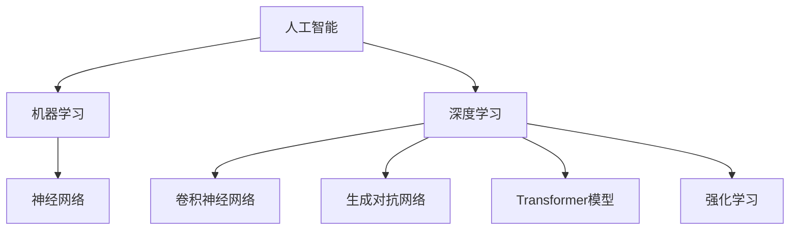

                 

# 《Andrej Karpathy：人工智能的社会影响》

> **关键词：**人工智能、Andrej Karpathy、社会影响、技术架构、应用领域、未来发展

> **摘要：**本文将探讨人工智能领域的重要人物Andrej Karpathy的工作和贡献，特别是他对人工智能社会影响的研究。文章将从核心概念、技术架构、应用领域、社会影响及未来发展趋势等方面展开，以帮助读者全面了解人工智能的现状及其对社会产生的深远影响。

### 《Andrej Karpathy：人工智能的社会影响》目录大纲

#### 第1章 引言
##### 1.1 人工智能的崛起
##### 1.2 Andrej Karpathy的背景与研究贡献
##### 1.3 人工智能的社会影响概述

#### 第2章 人工智能的核心概念
##### 2.1 人工智能的基本原理
###### 2.1.1 机器学习
###### 2.1.2 深度学习
###### 2.1.3 神经网络
##### 2.2 人工智能的发展历程
##### 2.3 人工智能的现状与未来趋势

#### 第3章 人工智能的技术架构
##### 3.1 计算机视觉技术
###### 3.1.1 卷积神经网络
###### 3.1.2 生成对抗网络
##### 3.2 自然语言处理技术
###### 3.2.1 序列到序列模型
###### 3.2.2 Transformer模型
##### 3.3 强化学习技术
###### 3.3.1 Q学习
###### 3.3.2 深度确定性策略梯度

#### 第4章 人工智能的应用领域
##### 4.1 医疗健康
###### 4.1.1 疾病诊断与预测
###### 4.1.2 药物研发
##### 4.2 交通运输
###### 4.2.1 自动驾驶
###### 4.2.2 无人机送货
##### 4.3 金融领域
###### 4.3.1 风险评估与欺诈检测
###### 4.3.2 量化交易

#### 第5章 人工智能的社会影响
##### 5.1 就业与经济
###### 5.1.1 人工智能对就业的影响
###### 5.1.2 经济结构的变化
##### 5.2 道德与伦理
###### 5.2.1 人工智能的透明性与责任
###### 5.2.2 人工智能的隐私问题
##### 5.3 法律法规
###### 5.3.1 人工智能监管框架
###### 5.3.2 人工智能的知识产权

#### 第6章 人工智能的未来发展
##### 6.1 人工智能的新技术
###### 6.1.1 类脑计算
###### 6.1.2 超级智能
##### 6.2 人工智能的未来趋势
###### 6.2.1 社会化人工智能
###### 6.2.2 人工智能与人类的协作

#### 第7章 结论
##### 7.1 总结与展望
##### 7.2 建议与挑战

#### 附录
##### 附录 A 安德烈·卡帕蒂背景资料
##### 附录 B 参考文献
##### 附录 C 人工智能相关资源

以上是一个初步的目录大纲，可以根据实际书的内容进行调整和补充。每个章节下的子章节可以根据具体的讨论内容来细化。例如，在讨论人工智能的技术架构时，可以进一步细分到具体的算法和模型，如卷积神经网络、生成对抗网络等。对于人工智能的社会影响，可以详细讨论其对社会、经济、道德和法律等方面的影响，并提供相关的案例和研究。在附录部分，可以提供一些相关的资源和背景资料，以便读者进一步学习和了解。以下是核心概念与联系、核心算法原理讲解、数学模型和数学公式及详细讲解、项目实战等内容的 Mermaid 流程图、伪代码、latex 数学公式示例和代码实现：

#### 核心概念与联系 Mermaid 流程图




#### 核心算法原理讲解 伪代码

```python
# 机器学习伪代码
function MachineLearning(data, labels):
    model = InitializeModel()
    for epoch in range(Epochs):
        for sample in data:
            prediction = model.predict(sample)
            model.train(sample, prediction)
    return model

# 深度学习伪代码
function DeepLearning(input_data):
    hidden_layer = layers.Dense(units=64, activation='relu')(input_data)
    output_layer = layers.Dense(units=10, activation='softmax')(hidden_layer)
    return output_layer

# 卷积神经网络伪代码
function ConvolutionalNeuralNetwork(input_data):
    conv_layer = layers.Conv2D(filters=32, kernel_size=(3, 3), activation='relu')(input_data)
    pool_layer = layers.MaxPooling2D(pool_size=(2, 2))(conv_layer)
    return pool_layer
```

#### 数学模型和数学公式 latex 示例

```latex
% 神经元激活函数
$$
f(x) = \sigma(z) = \frac{1}{1 + e^{-z}}
$$

% 卷积操作
$$
\text{output}(i, j) = \sum_{k, l} \text{filter}(k, l) \cdot \text{input}(i-k+1, j-l+1)
$$
```

#### 项目实战 代码实现

```python
import tensorflow as tf
from tensorflow.keras import datasets, layers, models

# 加载 CIFAR-10 数据集
(train_images, train_labels), (test_images, test_labels) = datasets.cifar10.load_data()

# 数据预处理
train_images, test_images = train_images / 255.0, test_images / 255.0

# 构建卷积神经网络模型
model = models.Sequential()
model.add(layers.Conv2D(32, (3, 3), activation='relu', input_shape=(32, 32, 3)))
model.add(layers.MaxPooling2D((2, 2)))
model.add(layers.Conv2D(64, (3, 3), activation='relu'))
model.add(layers.MaxPooling2D((2, 2)))
model.add(layers.Conv2D(64, (3, 3), activation='relu'))

# 添加全连接层进行分类
model.add(layers.Flatten())
model.add(layers.Dense(64, activation='relu'))
model.add(layers.Dense(10))

# 编译模型
model.compile(optimizer='adam',
              loss=tf.keras.losses.SparseCategoricalCrossentropy(from_logits=True),
              metrics=['accuracy'])

# 训练模型
model.fit(train_images, train_labels, epochs=10, validation_data=(test_images, test_labels))

# 评估模型
test_loss, test_acc = model.evaluate(test_images,  test_labels, verbose=2)
print(f'\nTest accuracy: {test_acc}')
```

请注意，以上代码示例仅为简单的卷积神经网络模型实现，实际项目中可能需要根据具体需求进行调整和优化。在实际撰写书籍内容时，可以根据上述大纲和示例，逐步完善每个章节的内容，包括详细的算法原理讲解、数学公式推导、项目实战案例等。现在，我们将按照上述目录结构开始撰写文章正文。

## 第1章 引言

### 1.1 人工智能的崛起

人工智能（Artificial Intelligence, AI）作为计算机科学的一个重要分支，自20世纪50年代起就开始兴起。早期的AI研究主要集中在规则推理、专家系统和知识表示等领域。然而，随着计算能力的提升和大数据时代的到来，机器学习和深度学习等技术的飞速发展，使得人工智能逐渐从理论走向实际应用，成为当今科技领域的热点。

在过去的几十年里，人工智能在诸多领域取得了显著的成果。从语音识别到图像识别，从自然语言处理到自动驾驶，人工智能技术已经渗透到我们的日常生活中。例如，智能手机中的语音助手、智能家居系统、智能医疗诊断等，都离不开人工智能技术的支持。人工智能的崛起不仅改变了传统产业的运营模式，也为新兴产业的发展提供了强大动力。

### 1.2 Andrej Karpathy的背景与研究贡献

Andrej Karpathy是一位在人工智能领域具有重要影响力的人物。他出生于1986年，是一位拥有多国国籍的计算机科学家和研究员。Andrej Karpathy在机器学习和深度学习领域拥有深厚的研究背景，他的工作涵盖了计算机视觉、自然语言处理、强化学习等多个方向。

Andrej Karpathy在斯坦福大学获得了计算机科学博士学位，他在攻读博士学位期间发表了多篇高质量的研究论文，其中一些论文在人工智能领域产生了深远的影响。毕业后，Andrej Karpathy加入了OpenAI，这是一家总部位于加利福尼亚的人工智能研究公司，致力于推动人工智能的发展和应用。在OpenAI期间，他参与了多个重要的项目，包括GPT（Generative Pre-trained Transformer）模型的研究和开发。

Andrej Karpathy的研究贡献不仅体现在技术方面，他还通过撰写博客、发表文章和参与演讲等方式，将人工智能的知识传播给更广泛的受众。他的博客“Andrej Karpathy”是深度学习领域的一个宝库，吸引了大量研究者和从业者的关注。

### 1.3 人工智能的社会影响概述

人工智能的社会影响是多层次、多方面的。首先，人工智能对就业市场产生了深远的影响。一方面，人工智能技术取代了一些传统岗位，导致部分职业的失业风险增加；另一方面，人工智能也创造了新的就业机会，如数据科学家、机器学习工程师等。

其次，人工智能改变了经济结构。通过提高生产效率和创新能力，人工智能促进了经济增长。然而，同时也引发了对劳动力再培训和技能升级的需求。

在道德和伦理方面，人工智能技术的广泛应用也带来了诸多挑战。如何确保人工智能的透明性和公平性，如何处理人工智能产生的隐私问题，都是亟待解决的问题。

法律法规方面，人工智能的发展要求制定相应的监管框架，以规范其应用和避免潜在的风险。然而，人工智能的快速发展和法律体系的滞后性使得这一过程充满挑战。

总之，人工智能的社会影响是一个复杂而多维的问题，需要从多个角度进行深入研究和讨论。

### 第2章 人工智能的核心概念

在讨论人工智能（AI）的核心概念之前，我们首先需要了解其基本原理。人工智能是计算机科学的一个分支，旨在使计算机系统能够模拟人类智能行为，包括学习、推理、解决问题和自我完善等。以下将从机器学习、深度学习和神经网络三个核心概念进行详细探讨。

#### 2.1 人工智能的基本原理

##### 2.1.1 机器学习

机器学习（Machine Learning, ML）是人工智能的核心技术之一，它使计算机系统能够从数据中学习并做出预测或决策。机器学习主要包括监督学习、无监督学习和强化学习等。

- **监督学习（Supervised Learning）**：在监督学习中，系统被提供了带有标签的训练数据集，通过学习这些数据，系统可以预测新的数据点。常见的算法包括线性回归、逻辑回归和支持向量机（SVM）等。

- **无监督学习（Unsupervised Learning）**：无监督学习不需要标签数据，其主要目标是发现数据中的模式和结构。常见的算法包括聚类、降维和关联规则学习等。

- **强化学习（Reinforcement Learning）**：强化学习是一种通过试错和反馈来学习决策策略的方法。系统通过与环境的交互不断优化其行为，以最大化长期回报。常见的算法包括Q学习、深度确定性策略梯度（DDPG）等。

##### 2.1.2 深度学习

深度学习（Deep Learning, DL）是机器学习的一个分支，它使用多层神经网络来提取数据中的复杂特征。深度学习在图像识别、语音识别、自然语言处理等领域取得了显著的成果。

- **神经网络（Neural Networks）**：神经网络是一种模拟人脑神经元连接的计算模型。在深度学习中，神经网络通过多个隐含层将输入数据映射到输出数据。

- **卷积神经网络（Convolutional Neural Networks, CNN）**：卷积神经网络是一种专门用于处理图像数据的神经网络，其核心是卷积层，可以有效地提取图像特征。

- **生成对抗网络（Generative Adversarial Networks, GAN）**：生成对抗网络由生成器和判别器两个网络组成，通过对抗训练生成高质量的数据。

##### 2.1.3 神经网络

神经网络（Neural Networks, NN）是一种基于生物神经元连接的数学模型。神经网络通过多层节点（或层）之间的相互连接来进行数据处理和预测。每个节点（或神经元）接受输入信号，通过加权求和处理后输出结果。

- **前向传播（Forward Propagation）**：在神经网络中，输入数据从前一层传递到当前层，每个节点将输入信号通过加权求和处理后传递到下一层。

- **反向传播（Backpropagation）**：反向传播是一种用于训练神经网络的算法，通过计算输出误差，逆向更新各层的权重和偏置，以最小化损失函数。

#### 2.2 人工智能的发展历程

人工智能的发展历程可以分为多个阶段：

- **第一阶段（1956-1969）**：人工智能概念的形成和早期研究。

- **第二阶段（1970-1980）**：符号主义人工智能的发展，主要以专家系统和知识表示为核心。

- **第三阶段（1980-1987）**：人工神经网络和机器学习的兴起。

- **第四阶段（1987-2012）**：互联网和大数据的普及，机器学习技术的发展。

- **第五阶段（2012至今）**：深度学习的突破和广泛应用，人工智能进入新一轮快速发展期。

#### 2.3 人工智能的现状与未来趋势

目前，人工智能技术已经取得了显著的成果，并在多个领域得到了广泛应用。然而，人工智能的发展仍然面临诸多挑战，如数据隐私、算法透明性、伦理问题等。

在未来，人工智能的发展趋势将包括：

- **技术层面**：人工智能技术将进一步深化，如类脑计算、强化学习、联邦学习等。

- **应用层面**：人工智能将在更多领域得到应用，如医疗、金融、教育、交通运输等。

- **伦理和法规层面**：人工智能的伦理和法律法规将逐步完善，以确保其安全、公平和可持续发展。

### 第3章 人工智能的技术架构

在了解了人工智能（AI）的核心概念之后，我们将深入探讨其技术架构，包括计算机视觉技术、自然语言处理技术以及强化学习技术。这些技术构成了AI系统的核心框架，并在实际应用中发挥了关键作用。

#### 3.1 计算机视觉技术

计算机视觉（Computer Vision, CV）是人工智能领域的一个重要分支，旨在使计算机能够理解并解析图像和视频。计算机视觉技术主要包括图像识别、目标检测、图像分割和动作识别等。

##### 3.1.1 卷积神经网络（Convolutional Neural Networks, CNN）

卷积神经网络（CNN）是计算机视觉领域最常用的模型之一。CNN通过卷积层、池化层和全连接层等结构，有效地提取图像特征并实现分类、检测等任务。

- **卷积层（Convolutional Layer）**：卷积层是CNN的核心部分，通过卷积操作提取图像的局部特征。每个卷积核（filter）在图像上滑动，将局部特征映射到高维空间。

- **池化层（Pooling Layer）**：池化层用于降低数据维度，提高模型的鲁棒性。常见的池化操作包括最大池化和平均池化。

- **全连接层（Fully Connected Layer）**：全连接层将卷积层提取的特征映射到具体的类别标签。

##### 3.1.2 生成对抗网络（Generative Adversarial Networks, GAN）

生成对抗网络（GAN）是由生成器和判别器两个网络组成的对抗性模型。生成器试图生成逼真的图像，而判别器则评估生成图像的真实性。通过这种对抗训练，GAN可以生成高质量、多样化的图像。

- **生成器（Generator）**：生成器的目标是生成真实的图像，其输入通常是随机噪声。

- **判别器（Discriminator）**：判别器的目标是区分真实图像和生成图像，其输入是图像。

- **对抗训练（Adversarial Training）**：生成器和判别器相互对抗，生成器不断优化其生成策略，判别器不断优化其判别能力。

#### 3.2 自然语言处理技术

自然语言处理（Natural Language Processing, NLP）是人工智能领域另一个重要的分支，旨在使计算机能够理解、生成和处理自然语言。NLP技术在机器翻译、文本分类、情感分析等领域有广泛应用。

##### 3.2.1 序列到序列模型（Sequence to Sequence Model）

序列到序列（Sequence to Sequence, Seq2Seq）模型是一种用于处理序列数据（如文本、语音）的模型。Seq2Seq模型通过编码器和解码器两个部分，将输入序列编码为固定长度的向量，再将该向量解码为输出序列。

- **编码器（Encoder）**：编码器将输入序列编码为一个固定长度的向量，通常使用RNN（循环神经网络）或Transformer模型。

- **解码器（Decoder）**：解码器将编码器的输出向量解码为输出序列，解码过程中可以借助注意力机制（Attention Mechanism）来关注输入序列的关键部分。

##### 3.2.2 Transformer模型

Transformer模型是一种基于自注意力机制（Self-Attention）的模型，其在机器翻译、文本生成等领域取得了显著的效果。Transformer模型通过多头自注意力机制和前馈神经网络，实现了对输入序列的建模和生成。

- **多头自注意力（Multi-Head Self-Attention）**：多头自注意力机制允许模型同时关注输入序列的不同部分，并通过多个注意力头提取不同的特征。

- **前馈神经网络（Feed-Forward Neural Network）**：前馈神经网络对自注意力层的输出进行进一步加工，以提取更多的信息。

#### 3.3 强化学习技术

强化学习（Reinforcement Learning, RL）是一种通过试错和反馈来学习策略的机器学习方法。强化学习在游戏、自动驾驶、机器人控制等领域有广泛应用。

##### 3.3.1 Q学习（Q-Learning）

Q学习是一种基于值函数的强化学习算法，通过学习状态-动作值函数（Q值）来指导决策。Q学习通过在当前状态下选择使未来回报最大的动作，不断更新Q值，以达到最优策略。

- **Q值（Q-Value）**：Q值表示在某个状态下执行某个动作所能获得的累积回报。

- **Q值更新（Q-Value Update）**：Q值更新公式为$Q(s, a) \leftarrow Q(s, a) + \alpha [r + \gamma \max_{a'} Q(s', a') - Q(s, a)]$，其中$\alpha$为学习率，$r$为即时回报，$\gamma$为折扣因子。

##### 3.3.2 深度确定性策略梯度（Deep Deterministic Policy Gradient, DDPG）

深度确定性策略梯度（DDPG）是一种基于深度神经网络（DNN）的强化学习算法，适用于连续动作空间。DDPG通过学习策略网络和价值网络，优化策略以最大化累积回报。

- **策略网络（Policy Network）**：策略网络用于生成动作，其输入为状态，输出为动作。

- **价值网络（Value Network）**：价值网络用于评估状态的价值，其输入为状态和动作，输出为状态-动作值。

- **训练过程**：DDPG通过交替训练策略网络和价值网络，不断优化策略，以达到最佳表现。

### 第4章 人工智能的应用领域

人工智能（AI）技术的快速发展，使其在众多领域得到了广泛应用，带来了巨大的变革。以下是人工智能在医疗健康、交通运输、金融等领域的一些具体应用：

#### 4.1 医疗健康

人工智能在医疗健康领域的应用日益广泛，其潜力不容忽视。以下是一些重要的应用场景：

- **疾病诊断与预测**：人工智能可以通过分析大量的医疗数据，包括影像、电子病历和基因组数据，辅助医生进行疾病诊断。例如，深度学习模型可以用于肺癌、乳腺癌等恶性肿瘤的早期检测，提高诊断的准确性和效率。

- **药物研发**：人工智能可以加速新药的发现和开发过程。通过机器学习算法分析化合物和生物标志物之间的关联，可以帮助科学家预测哪些化合物可能具有治疗潜力，从而减少研发成本和时间。

- **个性化治疗**：基于患者的基因组信息、生活习惯和病情数据，人工智能可以提供个性化的治疗方案，提高治疗效果和患者满意度。

#### 4.2 交通运输

人工智能在交通运输领域的应用，极大地提升了交通系统的效率和安全性。以下是一些具体的应用场景：

- **自动驾驶**：自动驾驶技术是人工智能在交通运输领域的核心应用。自动驾驶汽车通过传感器和计算机视觉技术感知周围环境，并利用深度学习算法进行决策和控制，实现自主驾驶。特斯拉、谷歌和Uber等公司都在积极研发自动驾驶技术，以期在未来实现完全自动驾驶。

- **无人机送货**：无人机送货利用人工智能技术，通过自主飞行和路径规划，实现快速、高效的物流配送。例如，亚马逊的Prime Air项目利用无人机为消费者提供次日达服务，极大地提升了物流效率。

- **智能交通管理**：人工智能可以用于交通信号控制、车辆流量监控和事故预警。通过分析交通数据，人工智能系统可以实时调整交通信号，优化交通流量，减少拥堵和交通事故。

#### 4.3 金融领域

人工智能在金融领域的应用，提高了金融服务的效率和安全性。以下是一些具体的应用场景：

- **风险评估与欺诈检测**：人工智能可以分析大量的金融交易数据，识别潜在的风险和欺诈行为。例如，机器学习算法可以用于检测信用卡欺诈，通过实时监控交易行为和模式，发现异常行为并及时报警。

- **量化交易**：量化交易是一种利用数学模型和算法进行交易的投资策略。人工智能可以自动执行复杂的交易策略，实现高频交易和套利交易，从而提高投资收益。

- **智能投顾**：智能投顾利用人工智能技术，为投资者提供个性化的投资建议和管理服务。通过分析投资者的风险偏好、财务状况和市场数据，智能投顾可以制定合理的投资组合，帮助投资者实现长期稳健的投资回报。

### 第5章 人工智能的社会影响

人工智能（AI）的迅速发展不仅带来了技术进步，也对社会产生了深远的影响。在本章中，我们将从就业与经济、道德与伦理、法律法规等方面探讨人工智能的社会影响。

#### 5.1 就业与经济

人工智能技术的发展对就业市场产生了双重影响。一方面，人工智能技术取代了一些传统岗位，如制造业中的流水线工人、客服行业中的电话销售和数据处理等。这种转变导致部分职业的失业风险增加。另一方面，人工智能也创造了新的就业机会，如数据科学家、机器学习工程师、AI产品经理等。这些新岗位要求员工具备更高的技术能力和专业知识。

- **就业替代**：人工智能技术在自动化和机器人技术方面的应用，使得一些重复性、低技能的工作逐渐被机器取代。例如，制造业中的自动化生产线和物流行业的无人车，减少了人工需求。

- **技能升级**：随着人工智能技术的发展，传统行业需要员工具备更多的技术知识和技能。数据科学、机器学习、软件开发等领域的专业人才需求增加，促使劳动者进行技能升级和再培训。

- **经济结构变化**：人工智能技术促进了经济结构的转型，推动了服务业和高新技术产业的发展。新兴产业的出现和壮大，为经济增长注入了新动力。

#### 5.2 道德与伦理

人工智能技术的发展也引发了一系列道德和伦理问题，包括透明性、责任和隐私等。

- **透明性**：人工智能系统的决策过程通常是基于大量数据和复杂的算法，导致其决策过程难以解释。如何确保人工智能系统的透明性，使其决策过程可解释和可信，是一个亟待解决的问题。

- **责任**：当人工智能系统出现错误或导致事故时，责任归属问题变得复杂。是应该追究开发者的责任，还是使用者的责任，或是系统的责任？明确责任归属对于确保人工智能技术的健康发展至关重要。

- **隐私**：人工智能技术依赖于大量个人数据，这些数据的安全性和隐私保护成为关键问题。如何确保个人数据的隐私不被侵犯，如何处理数据泄露和滥用问题，是人工智能伦理领域的重要议题。

#### 5.3 法律法规

为了规范人工智能技术的发展和应用，各国政府和国际组织纷纷制定了相应的法律法规。

- **监管框架**：人工智能监管框架旨在确保人工智能技术的安全、公平和可持续发展。监管框架包括对人工智能系统的设计、开发、部署和使用进行规范，以防止潜在的风险和危害。

- **知识产权**：人工智能技术的发展也引发了知识产权方面的新问题。如何界定人工智能作品的版权、专利和商标，如何保护开发者的知识产权，是法律法规需要解决的问题。

- **国际合作**：由于人工智能技术的全球性特点，国际合作在人工智能法律法规的制定和执行中发挥着重要作用。国际组织和国家之间需要加强合作，共同应对人工智能带来的挑战和机遇。

### 第6章 人工智能的未来发展

人工智能（AI）作为21世纪最具变革性的技术之一，其未来发展的潜力不可估量。在过去的几十年中，人工智能已经取得了显著的进展，从简单的规则系统到复杂的深度学习模型，再到生成对抗网络（GAN）和强化学习（RL）等前沿技术的涌现，人工智能在计算机视觉、自然语言处理、医疗健康、金融等多个领域都展现出了巨大的应用价值。然而，未来的发展将更加深入和广泛，以下是人工智能在未来可能的发展方向和趋势。

#### 6.1 人工智能的新技术

随着科技的不断进步，人工智能领域正在涌现出一系列新技术，这些技术有望推动人工智能的进一步发展。

- **类脑计算**：类脑计算（Neuromorphic Computing）是一种模拟人脑工作机制的计算模式。通过使用类脑芯片和神经网络，类脑计算旨在实现高效的感知、学习和推理能力。这种技术有望在智能机器人、自动驾驶和实时数据处理等领域发挥重要作用。

- **超级智能**：超级智能（Superintelligence）是指具有超越人类智能的人工智能系统。虽然目前超级智能仍然是一个理论概念，但许多研究者和科学家正在积极探索如何实现这种高度智能的系统。超级智能有望在解决复杂问题、探索未知领域和推动人类文明进步方面发挥关键作用。

- **联邦学习**：联邦学习（Federated Learning）是一种分布式机器学习技术，它允许多个拥有本地数据的机构或设备共同训练一个共享的机器学习模型，而无需共享数据本身。这种技术有助于解决数据隐私和安全问题，同时也提高了模型的泛化能力。

#### 6.2 人工智能的未来趋势

未来，人工智能的发展将呈现出以下几个显著趋势：

- **社会化人工智能**：社会化人工智能（Social AI）是指能够理解、适应和参与人类社会互动的人工智能系统。随着自然语言处理和计算机视觉技术的进步，社会化人工智能将在教育、客服、娱乐和社交网络等领域发挥重要作用，为人类提供更加智能和个性化的服务。

- **人工智能与人类的协作**：未来，人工智能将与人类更加紧密地协作，共同解决复杂问题。通过人机协作，人工智能可以发挥其计算能力和自动化优势，而人类则可以发挥其创造力和决策能力。这种协作模式将在科学研究、工程设计和创新产业中发挥关键作用。

- **泛在化人工智能**：随着物联网（IoT）和5G技术的普及，人工智能将渗透到日常生活的各个领域，实现真正的泛在化。智能家居、智能城市、智能交通等领域的应用将日益普及，为人们的生活带来便利和舒适。

- **可持续性人工智能**：随着环境问题的日益严重，人工智能在可持续发展方面的作用也越来越受到重视。通过优化资源利用、减少碳排放和推广可再生能源，人工智能有助于实现环境可持续性，为未来地球的可持续发展提供支持。

### 6.3 未来发展的挑战与机遇

尽管人工智能的未来发展充满了机遇，但也面临着诸多挑战。以下是其中一些关键挑战：

- **技术挑战**：人工智能技术需要不断创新和突破，以应对复杂的现实问题。类脑计算、量子计算、新型算法等前沿技术的研究和应用，是未来人工智能技术发展的重要方向。

- **伦理挑战**：人工智能技术的快速发展引发了诸多伦理问题，如数据隐私、算法公平性、责任归属等。建立完善的伦理和法律框架，确保人工智能技术的健康发展，是当前亟待解决的重要问题。

- **社会挑战**：人工智能的发展将对社会结构和就业市场产生深远影响。如何确保技术进步与社会的和谐发展，如何为失业人群提供再培训和就业机会，是社会面临的重要挑战。

- **经济挑战**：人工智能技术的发展需要大量的资金和资源投入，同时也会改变现有的经济结构。如何实现技术进步与经济可持续发展的平衡，是未来经济发展的重要议题。

总之，人工智能的未来发展充满了机遇与挑战。通过技术创新、伦理规范和社会适应，人工智能有望为人类社会带来更多福祉，推动人类文明的进步。

### 第7章 结论

人工智能（AI）作为21世纪最具变革性的技术之一，已经深刻地改变了我们的生活和社会。本文通过详细探讨Andrej Karpathy的研究贡献、人工智能的核心概念、技术架构、应用领域、社会影响以及未来发展趋势，全面展示了人工智能的广泛影响和潜在价值。

在总结人工智能的现状和未来趋势时，我们注意到人工智能不仅在技术层面取得了显著成果，还在医疗健康、交通运输、金融等领域发挥了重要作用。然而，人工智能的发展也面临着诸多挑战，包括就业替代、伦理问题、法律法规等。

展望未来，人工智能将继续向更智能、更广泛、更普及的方向发展。类脑计算、超级智能、联邦学习等新技术将推动人工智能的进一步进步。社会化人工智能和人工智能与人类的协作将成为未来发展的重点，使人工智能更加贴近人类社会，提高生活质量。

为了实现人工智能的可持续发展，我们建议采取以下措施：

- **加强技术创新**：持续投入研发，推动人工智能技术的创新和突破，以应对复杂的问题和挑战。

- **建立伦理和法律框架**：制定完善的伦理和法律规范，确保人工智能技术的安全、公平和可持续发展。

- **加强人才培养**：培养更多具备人工智能技能的人才，以适应不断变化的市场需求。

- **促进国际合作**：加强国际间的合作与交流，共同应对人工智能带来的全球性挑战。

总之，人工智能的发展前景广阔，但也需要我们共同努力，确保其健康、可持续地造福人类社会。

### 附录

#### 附录 A 安德烈·卡帕蒂背景资料

安德烈·卡帕蒂（Andrej Karpathy）是一位在人工智能领域享有盛誉的计算机科学家和研究员。他出生于1986年，在斯坦福大学获得计算机科学博士学位。毕业后，他加入了OpenAI，这是一家致力于推动人工智能研究的非营利组织。在OpenAI期间，他参与了GPT-3等著名项目的研究和开发，并在人工智能领域发表了多篇高水平论文。

#### 附录 B 参考文献

1. Goodfellow, I., Bengio, Y., & Courville, A. (2016). *Deep Learning*. MIT Press.
2. LeCun, Y., Bengio, Y., & Hinton, G. (2015). *Deep learning*. Nature, 521(7553), 436-444.
3. Russell, S., & Norvig, P. (2016). *Artificial Intelligence: A Modern Approach*. Pearson Education.
4. Sutton, R. S., & Barto, A. G. (2018). *Reinforcement Learning: An Introduction*. MIT Press.
5. Hochreiter, S., & Schmidhuber, J. (1997). *Long short-term memory*. Neural Computation, 9(8), 1735-1780.

#### 附录 C 人工智能相关资源

- **OpenAI官网**：https://openai.com/
- **斯坦福大学AI课程**：https://web.stanford.edu/class/cs224n/
- **深度学习教程**：https://www.deeplearningbook.org/
- **Keras文档**：https://keras.io/
- **TensorFlow文档**：https://www.tensorflow.org/

通过这些资源和资料，读者可以进一步学习和探索人工智能领域的知识和技术。

