                 

### 引言：计算的变革

计算，作为信息时代的基石，已经深刻地影响了我们的工作和生活。然而，随着技术的不断进步，计算的内涵和形式正在发生根本性的变化。本文旨在探讨这种变化，尤其是数字实体和物理实体自动化的初步探索。作者Andrej Karpathy，是一位世界顶级的人工智能专家，他的工作不仅在学术界引起广泛关注，也在工业界产生了深远的影响。在他的研究中，我们看到了计算从传统的基于硬件和软件的运算，逐渐转向以数字实体和物理实体的深度融合为特征的新时代。

### 核心关键词

- 计算的本质变化
- 数字实体
- 物理实体
- 自动化
- 协同进化

### 摘要

本文首先探讨了计算的本质变化，分析了数字实体和物理实体如何正在重新定义计算的基本概念。接着，文章详细介绍了数字实体的分类、特征及其与物理实体的关系。在此基础上，文章深入探讨了数字实体和物理实体的自动化以及它们协同进化的机制。最后，文章展望了数字实体和物理实体在未来的发展趋势和应用场景，并提出了相关的挑战和解决方案。通过本文的探讨，我们不仅可以更好地理解当前计算领域的变革，还可以预见未来计算可能带来的深远影响。

### 第一部分：计算的本质变化

计算的本质在于处理信息的变换，而随着技术的发展，这种本质正在经历深远的变化。本部分将首先探讨计算的本质变化，接着深入分析数字实体的兴起及其在计算中的作用，最后讨论数字实体与传统物理实体的关系。

#### 第1章：计算的本质变化与数字实体

##### 1.1 数字实体的兴起

数字实体的概念可以追溯到计算机科学的诞生。随着计算技术的飞速发展，数字实体逐渐从简单的数据集合演变成具有自主计算能力的实体。数字实体不仅仅包括传统的数字数据，还涵盖了由软件、算法和数据集组成的复杂系统。

###### 1.1.1 数字实体的定义与特点

数字实体是具有特定功能的信息集合，它可以执行特定的计算任务，如数据分析、机器学习模型训练、网络通信等。数字实体具有以下几个显著特点：

1. **可编程性**：数字实体可以通过软件编程进行自定义和优化。
2. **动态性**：数字实体可以根据环境变化进行自适应调整。
3. **分布式**：数字实体可以在网络中分布，实现高效的协同计算。
4. **智能性**：通过机器学习和人工智能技术，数字实体具备一定程度的智能决策能力。

###### 1.1.2 数字实体的兴起背景

数字实体的兴起与以下几个背景因素密切相关：

1. **大数据技术的发展**：大数据技术的成熟使得数据获取和处理变得更加容易，为数字实体的兴起提供了基础。
2. **云计算的普及**：云计算的普及使得计算资源得以大规模共享，为数字实体提供了强大的计算支持。
3. **人工智能的突破**：人工智能技术的迅速发展，使得数字实体具备了更高的智能水平。

###### 1.1.3 数字实体在计算中的作用

数字实体在计算中扮演了多种角色，其核心作用主要体现在以下几个方面：

1. **数据存储与处理**：数字实体作为数据仓库，可以存储和处理海量数据，为各类应用提供数据支持。
2. **计算优化与加速**：通过分布式计算和并行计算技术，数字实体能够显著提升计算效率。
3. **智能决策与预测**：利用机器学习和深度学习技术，数字实体可以辅助人类进行复杂决策和预测。

##### 1.2 数字实体的分类

数字实体可以根据其功能和特性进行分类，常见的分类方式如下：

###### 1.2.1 数据实体

数据实体是数字实体中最基础的一部分，它主要指的是各种类型的数据集合，如文本数据、图像数据、音频数据等。数据实体在计算中主要用于数据的存储、检索和处理。

###### 1.2.2 程序实体

程序实体指的是由软件代码构成的实体，它可以执行特定的计算任务。程序实体通常包括算法、模型和系统软件等。

###### 1.2.3 算法实体

算法实体是数字实体中智能程度最高的一部分，它主要包括各种机器学习算法和深度学习算法。算法实体通过训练和优化，可以自动进行数据分析和决策。

##### 1.3 数字实体与物理实体的关系

数字实体和物理实体在计算中有着密切的联系，它们共同构成了现代计算体系。然而，这种关系并非单向的，而是相互影响、相互依赖的。

###### 1.3.1 数字实体与物理实体的相互作用

数字实体与物理实体的相互作用主要体现在以下几个方面：

1. **数据交换**：数字实体通过传感器和数据采集设备获取物理实体的信息，并将其转换为数字数据。
2. **控制与反馈**：数字实体通过算法和软件控制物理实体，并根据物理实体的反馈进行优化和调整。
3. **协同计算**：数字实体和物理实体可以共同参与计算任务，实现更高效的计算结果。

###### 1.3.2 数字实体对物理实体的影响

数字实体对物理实体的影响主要体现在以下几个方面：

1. **自动化**：通过自动化技术，数字实体可以控制物理实体，减少人力投入，提高生产效率。
2. **智能化**：数字实体可以通过机器学习和人工智能技术，使物理实体具备更高的智能水平。
3. **优化**：数字实体可以对物理实体的运行状态进行实时监测和优化，提高其性能和可靠性。

###### 1.3.3 物理实体对数字实体的依赖

物理实体对数字实体的依赖主要体现在以下几个方面：

1. **数据来源**：物理实体通过传感器和数据采集设备为数字实体提供数据支持。
2. **硬件支撑**：物理实体为数字实体提供了运行所需的硬件资源，如计算机、服务器和网络设备。
3. **交互平台**：物理实体提供了数字实体与外界进行交互的平台，如用户界面、物联网设备等。

##### 1.4 总结

数字实体的兴起是计算领域的一次革命性变化，它不仅改变了计算的本质，还推动了数字实体和物理实体的深度融合。在未来的计算发展中，数字实体将继续发挥重要作用，与物理实体共同推动社会的进步。

### 第一部分总结

在本部分中，我们探讨了计算的本质变化，分析了数字实体的定义、特点、分类及其与物理实体的关系。通过这些讨论，我们不仅可以更好地理解当前计算领域的发展趋势，还能预见数字实体和物理实体在未来计算中将发挥的关键作用。

---

### 计算的本质变化与物理实体

随着数字实体的崛起，物理实体在计算领域中的作用也在发生着显著变化。本章节将深入探讨物理实体的本质、计算需求以及与数字实体的整合。

#### 第2章：计算的本质变化与物理实体

##### 2.1 物理实体的本质

物理实体是指实际存在于现实世界中的物体，它们具有空间位置、物理属性和运动状态等特征。物理实体可以是人、物、环境等任何实际存在的对象。

###### 2.1.1 物理实体的定义与特征

物理实体的定义较为广泛，包括以下几方面特征：

1. **物理存在**：物理实体具有物理空间中的具体存在形式。
2. **可感知性**：物理实体可以通过各种传感器进行感知，如视觉、听觉、触觉等。
3. **物理性质**：物理实体具有质量、体积、温度、硬度等物理性质。
4. **动态性**：物理实体可以处于运动状态，其状态随时间变化。

###### 2.1.2 物理实体的分类

物理实体可以根据不同的标准进行分类，以下是一些常见的分类方法：

1. **按功能分类**：如生产设备、交通工具、通信设备等。
2. **按用途分类**：如家用电器、工业设备、医疗设备等。
3. **按环境分类**：如陆地设备、海洋设备、太空设备等。

###### 2.1.3 物理实体在计算中的重要性

物理实体在计算中的重要性体现在以下几个方面：

1. **数据来源**：物理实体通过传感器和数据采集设备为计算系统提供数据支持。
2. **计算基础**：物理实体提供了计算所需的硬件资源，如计算机、服务器和网络设备。
3. **交互对象**：物理实体是计算系统与外部环境进行交互的重要对象，如用户、其他设备等。

##### 2.2 物理实体的计算需求

物理实体在计算过程中面临着多种计算需求，这些需求可以分为以下几类：

###### 2.2.1 物理实体的计算场景

物理实体的计算场景主要包括以下几种：

1. **实时监控与反馈**：如工业生产中的设备状态监控、交通管理中的车辆流量监控等。
2. **智能决策与控制**：如智能家居中的自动控制、自动驾驶中的路径规划等。
3. **数据处理与分析**：如医疗设备中的数据采集与分析、环境监测设备中的数据分析等。

###### 2.2.2 物理实体的计算挑战

物理实体在计算过程中面临着多种挑战，包括：

1. **计算资源限制**：物理实体通常具有有限的计算资源，如计算能力、存储空间等。
2. **数据可靠性**：物理实体产生的数据可能受到环境干扰，数据可靠性成为一大挑战。
3. **实时性与稳定性**：某些计算场景对实时性和稳定性要求较高，如自动驾驶、医疗设备等。

###### 2.2.3 物理实体的计算解决方案

为了解决物理实体在计算过程中面临的挑战，可以采取以下几种解决方案：

1. **边缘计算**：将计算任务分散到物理实体附近的边缘设备上，减轻中心服务器的负担。
2. **云计算与物联网**：利用云计算和物联网技术，实现物理实体与远程服务器的高效连接和协同计算。
3. **人工智能与机器学习**：利用人工智能和机器学习技术，提高物理实体数据处理和分析的效率和准确性。

##### 2.3 物理实体与数字实体的整合

物理实体与数字实体的整合是现代计算领域的一个重要趋势，这种整合使得物理实体能够更好地参与到计算过程中，实现更高效的计算和更智能的决策。

###### 2.3.1 数字实体对物理实体的改造

数字实体通过以下方式对物理实体进行改造：

1. **智能化**：利用机器学习和人工智能技术，使物理实体具备智能决策能力。
2. **自动化**：通过自动化技术，使物理实体能够自主执行任务，减少人力干预。
3. **优化**：利用算法和优化技术，提高物理实体的性能和效率。

###### 2.3.2 物理实体对数字实体的支撑

物理实体为数字实体提供了以下支撑：

1. **数据采集**：物理实体通过传感器和数据采集设备，为数字实体提供数据支持。
2. **硬件资源**：物理实体提供了计算所需的硬件资源，如计算机、服务器和网络设备。
3. **环境交互**：物理实体是数字实体与外部环境进行交互的重要对象。

###### 2.3.3 数字实体与物理实体的整合作用

数字实体与物理实体的整合作用主要体现在以下几个方面：

1. **提升计算效率**：通过整合，物理实体能够更高效地参与到计算过程中，实现分布式计算和协同计算。
2. **提高智能水平**：数字实体通过物理实体获取的数据和资源，能够更好地进行智能决策和预测。
3. **优化资源配置**：通过整合，可以更合理地配置计算资源和硬件资源，提高整体计算系统的性能。

##### 2.4 总结

物理实体在计算领域中扮演着重要的角色，其本质特征、计算需求以及与数字实体的整合作用都值得深入探讨。随着数字实体和物理实体的不断融合，计算领域将迎来更多的创新和突破。

### 第二部分总结

在本部分中，我们深入探讨了物理实体的本质、计算需求以及与数字实体的整合。通过这些讨论，我们不仅了解了物理实体在计算中的重要性，还看到了数字实体和物理实体整合的未来前景。在下一部分中，我们将进一步探讨数字实体和物理实体的自动化以及它们的协同进化。

---

### 第三部分：数字实体与物理实体的自动化

随着数字实体和物理实体的不断融合，自动化成为推动计算进步的重要动力。本部分将探讨数字实体和物理实体的自动化，包括自动化的基本概念、分类以及实际应用，并分析自动化对计算带来的影响。

#### 第3章：数字实体的自动化

##### 3.1 自动化的定义与分类

自动化是指通过预设程序或控制算法，使系统或设备能够自主完成特定任务的过程。在数字实体中，自动化主要体现在以下几个方面：

###### 3.1.1 自动化的定义

自动化（Automation）是指利用机械、电子、计算机技术等，使生产过程或工作流程实现自动化，减少人力投入，提高生产效率和质量。

###### 3.1.2 自动化的分类

根据自动化程度的不同，自动化可以分为以下几种类型：

1. **程序化自动化**：通过编写程序实现自动化任务，如自动化脚本、自动化测试等。
2. **智能自动化**：利用人工智能技术，如机器学习和深度学习，实现更加智能化的自动化任务，如自动驾驶、智能家居等。
3. **自适应自动化**：系统能够根据环境和任务变化，自动调整和优化行为，如自适应控制系统、自适应供应链管理等。

##### 3.2 数字实体的自动化应用

数字实体的自动化应用广泛，以下是一些典型应用场景：

###### 3.2.1 自动化在金融领域的应用

金融领域的自动化主要体现在以下几个方面：

1. **自动化交易**：利用算法进行股票、期货等金融产品的交易。
2. **自动化风险管理**：通过模型预测和算法分析，实现风险自动化识别和管理。
3. **自动化客户服务**：利用聊天机器人、语音助手等提供24/7的客户服务。

###### 3.2.2 自动化在医疗领域的应用

医疗领域的自动化主要体现在以下几个方面：

1. **自动化诊断**：利用机器学习模型进行疾病诊断，如肺癌、乳腺癌等。
2. **自动化手术**：利用机器人进行手术，提高手术精度和效率。
3. **自动化药品管理**：利用自动化系统进行药品的存储、分配和跟踪。

###### 3.2.3 自动化在制造业的应用

制造业的自动化主要体现在以下几个方面：

1. **自动化生产线**：通过机器人、自动化设备实现生产线的自动化生产。
2. **自动化质量检测**：利用机器视觉技术实现产品质量的自动化检测。
3. **自动化供应链管理**：通过物联网技术实现供应链的自动化管理和优化。

##### 3.3 自动化对数字实体的影响

自动化对数字实体的影响主要体现在以下几个方面：

1. **提高效率**：自动化能够显著提高数字实体的工作效率，减少人力成本。
2. **提升智能水平**：通过引入人工智能技术，自动化能够使数字实体具备更高的智能水平。
3. **优化资源配置**：自动化能够优化数字实体的资源分配，提高资源利用效率。

#### 第4章：物理实体的自动化

##### 4.1 自动化在物理实体中的应用

物理实体的自动化主要体现在以下几个方面：

###### 4.1.1 自动化在智能家居中的应用

智能家居自动化主要体现在以下几个方面：

1. **智能照明**：通过传感器和控制系统实现智能照明，如根据环境光线和用户需求自动调整灯光。
2. **智能安防**：利用摄像头、传感器等设备实现智能安防，如自动检测入侵并报警。
3. **智能温控**：通过温控系统实现室内温度的自动调节。

###### 4.1.2 自动化在智慧城市中的应用

智慧城市自动化主要体现在以下几个方面：

1. **智能交通**：通过智能交通系统实现交通流量的自动调节，如自动优化红绿灯时间。
2. **智能环境监测**：通过传感器和数据分析实现环境自动监测，如自动检测空气质量、水质等。
3. **智能能源管理**：通过智能电网实现能源自动分配和管理，如自动调整电力需求。

###### 4.1.3 自动化在工业自动化中的应用

工业自动化主要体现在以下几个方面：

1. **自动化生产线**：通过机器人、自动化设备实现生产线的自动化生产。
2. **自动化质量检测**：利用机器视觉技术实现产品质量的自动化检测。
3. **自动化仓储管理**：通过自动化仓储系统实现仓储的自动化管理和优化。

##### 4.2 自动化对物理实体的影响

自动化对物理实体的影响主要体现在以下几个方面：

1. **提高生产效率**：自动化能够显著提高物理实体的工作效率，减少人力成本。
2. **提升生活质量**：通过自动化技术，物理实体能够提供更加智能和便捷的服务。
3. **优化资源配置**：自动化能够优化物理实体的资源分配，提高资源利用效率。

#### 第5章：数字实体与物理实体的自动化整合

##### 5.1 数字实体与物理实体的自动化整合

数字实体与物理实体的自动化整合主要体现在以下几个方面：

1. **智能协同**：通过整合数字实体和物理实体的自动化系统，实现更智能的协同工作。
2. **实时反馈**：通过整合，物理实体能够实时反馈数据给数字实体，实现更高效的数据分析和决策。
3. **资源优化**：通过整合，实现数字实体和物理实体资源的最优配置。

##### 5.2 数字实体与物理实体的自动化整合作用

数字实体与物理实体的自动化整合作用主要体现在以下几个方面：

1. **提升计算效率**：通过整合，数字实体和物理实体能够协同工作，提高整体计算效率。
2. **增强智能水平**：通过整合，物理实体能够获取更多的数据支持，增强智能决策能力。
3. **优化资源配置**：通过整合，实现资源的最优配置，提高资源利用效率。

##### 5.3 数字实体与物理实体的自动化整合挑战

数字实体与物理实体的自动化整合面临着以下挑战：

1. **数据兼容性**：数字实体和物理实体的数据格式、协议可能不兼容，需要解决数据兼容性问题。
2. **实时性**：某些应用场景对实时性要求较高，需要确保整合系统的实时响应能力。
3. **安全性与隐私**：整合系统可能涉及大量敏感数据，需要确保系统的安全性和用户隐私。

#### 第6章：自动化与协同进化

##### 6.1 协同进化的概念与机制

协同进化是指两个或多个系统在相互作用中，通过共同适应和优化，实现整体性能提升的过程。在数字实体与物理实体的自动化整合中，协同进化具有重要意义。

###### 6.1.1 协同进化的定义

协同进化是指系统之间通过相互作用、学习和优化，实现整体性能提升的过程。

###### 6.1.2 协同进化的机制

协同进化的机制主要包括以下几个方面：

1. **信息交互**：系统之间通过信息交互，共享数据和知识。
2. **共同适应**：系统在相互作用中，通过适应和调整，实现共同优化。
3. **学习与优化**：系统通过学习和优化，提升自身性能，实现协同进化。

##### 6.2 数字实体与物理实体的协同进化

数字实体与物理实体的协同进化体现在以下几个方面：

1. **数据协同**：数字实体通过数据采集和分析，为物理实体提供决策支持，实现数据协同。
2. **功能协同**：数字实体与物理实体通过功能协同，实现更智能、更高效的任务执行。
3. **资源协同**：数字实体与物理实体通过资源协同，优化资源配置，提高整体性能。

##### 6.3 自动化与协同进化的作用

自动化与协同进化在数字实体与物理实体的整合中发挥着重要作用：

1. **提升效率**：通过自动化和协同进化，实现系统的高效运行。
2. **增强智能**：通过协同进化，提升系统的智能水平，实现更智能的决策。
3. **优化资源**：通过协同进化，优化资源配置，提高资源利用效率。

#### 第7章：自动化与协同进化的未来展望

##### 7.1 自动化与协同进化的未来趋势

随着技术的不断进步，自动化与协同进化的未来趋势将体现在以下几个方面：

1. **智能化**：自动化系统将更加智能化，能够自主学习和优化。
2. **实时性**：自动化系统将实现更高的实时性，满足更复杂的应用需求。
3. **多样性**：自动化系统将涵盖更多的应用领域，实现多样性发展。

##### 7.2 自动化与协同进化的未来挑战

自动化与协同进化在未来将面临以下挑战：

1. **数据隐私**：自动化系统将涉及更多个人和企业数据，需要确保数据隐私和安全。
2. **系统复杂性**：自动化系统的复杂性将增加，需要解决系统稳定性和可靠性问题。
3. **法律法规**：需要建立和完善相关法律法规，规范自动化与协同进化的应用。

#### 第8章：总结与展望

自动化与协同进化是数字实体与物理实体整合的重要方向，对计算领域的发展具有重要意义。通过自动化，我们可以实现更高效、更智能的计算；通过协同进化，我们可以实现系统的自我优化和性能提升。在未来，自动化与协同进化将继续推动计算领域的创新和发展。

### 第三部分总结

在本部分中，我们详细探讨了数字实体与物理实体的自动化，包括自动化的定义、分类、应用及其整合作用。我们还探讨了自动化与协同进化的概念和机制，以及它们在数字实体与物理实体整合中的作用。在下一部分中，我们将进一步探讨数字实体与物理实体的协同进化，探索这一新兴领域的前景和挑战。

---

### 第四部分：数字实体与物理实体的协同进化

随着数字实体和物理实体的深度融合，协同进化成为推动计算进步的重要机制。本部分将深入探讨协同进化的概念与机制，以及数字实体与物理实体在协同进化中的具体应用和效果。

#### 第4章：协同进化的概念与机制

##### 4.1 协同进化的定义

协同进化（Synergistic Evolution）是指两个或多个系统在相互作用中，通过共同适应和优化，实现整体性能提升的过程。在数字实体与物理实体的协同进化中，系统之间的相互依赖和适应性调整是关键。

###### 4.1.1 协同进化的基本概念

协同进化包括以下几个核心概念：

1. **互操作性**：系统之间的互操作性是协同进化的基础，它允许系统之间进行有效通信和资源共享。
2. **适应性**：系统在协同进化过程中需要不断适应环境变化和任务需求，提高自身性能和可靠性。
3. **协同效应**：系统之间的协同作用可以产生比单独运行更好的效果，实现整体性能的提升。

##### 4.2 协同进化的机制

协同进化的机制主要包括以下几个方面：

1. **信息交互**：系统之间通过信息交互，共享数据、知识和经验，实现信息的流通和互补。
2. **共同适应**：系统在相互作用中，通过适应和调整，实现共同优化和协同工作。
3. **学习和优化**：系统通过学习和优化，不断改进自身性能和协同效果。

###### 4.2.1 适应性机制

适应性机制包括以下几个方面：

1. **环境感知**：系统通过传感器和其他手段感知环境变化，获取必要的信息。
2. **反馈调节**：系统根据反馈信息，对自身行为进行调整和优化。
3. **进化策略**：系统采用进化算法，如遗传算法、模拟退火等，实现自适应和优化。

##### 4.3 协同进化的优势

协同进化的优势主要体现在以下几个方面：

1. **提高性能**：通过协同进化，系统可以实现性能的提升，如计算效率、响应速度等。
2. **增强稳定性**：协同进化可以使系统在面临不确定性和挑战时，保持稳定性和可靠性。
3. **优化资源利用**：协同进化可以实现资源的优化配置，提高资源利用效率。

#### 第5章：数字实体与物理实体的协同进化

##### 5.1 数字实体与物理实体的协同进化机制

数字实体与物理实体的协同进化机制主要包括以下几个方面：

1. **数据共享**：数字实体通过传感器和数据采集设备，将物理实体的数据共享给数字实体，实现信息的流通和互补。
2. **智能决策**：数字实体利用机器学习和人工智能技术，根据物理实体的数据和环境信息，进行智能决策和优化。
3. **反馈调整**：数字实体和物理实体通过反馈机制，不断调整和优化自身行为，实现协同进化。

##### 5.2 数字实体与物理实体的协同进化实例

数字实体与物理实体的协同进化在多个领域都有实际应用，以下是一些具体实例：

1. **智能交通系统**：智能交通系统通过数字实体（如交通监控摄像头、导航系统）与物理实体（如车辆、道路）的协同进化，实现交通流量优化、事故预警等。
2. **智能制造**：智能制造通过数字实体（如传感器、控制系统）与物理实体（如机器、生产线）的协同进化，实现生产过程的自动化、智能化。
3. **智能家居**：智能家居通过数字实体（如智能音箱、智能灯泡）与物理实体（如灯光、电器）的协同进化，实现家庭环境的智能化、个性化。

##### 5.3 数字实体与物理实体的协同进化效果

数字实体与物理实体的协同进化效果主要体现在以下几个方面：

1. **效率提升**：通过协同进化，数字实体和物理实体可以实现任务的高效执行，减少时间和资源浪费。
2. **决策优化**：协同进化使数字实体能够基于物理实体的实时数据和环境信息，做出更准确的决策和预测。
3. **用户体验**：协同进化可以提高用户的体验，如智能家居中的个性化服务、智能交通系统中的安全预警等。

#### 第6章：数字实体与物理实体的协同进化应用

##### 6.1 协同进化在工业领域的应用

协同进化在工业领域的应用主要体现在以下几个方面：

1. **生产过程优化**：通过协同进化，实现生产过程的自动化、智能化，提高生产效率和产品质量。
2. **设备维护与预测**：通过协同进化，实现设备状态的实时监测和维护预测，降低设备故障率和维修成本。
3. **供应链管理**：通过协同进化，实现供应链的智能化管理，提高供应链的灵活性和响应速度。

##### 6.2 协同进化在服务业的应用

协同进化在服务业的应用主要体现在以下几个方面：

1. **个性化服务**：通过协同进化，实现个性化服务，提高客户满意度和忠诚度。
2. **服务流程优化**：通过协同进化，实现服务流程的自动化和智能化，提高服务效率和用户体验。
3. **风险控制与预测**：通过协同进化，实现风险控制与预测，降低服务风险和损失。

##### 6.3 协同进化在社会治理中的应用

协同进化在社会治理中的应用主要体现在以下几个方面：

1. **智慧城市**：通过协同进化，实现智慧城市的建设，提高城市管理效率和居民生活质量。
2. **公共安全**：通过协同进化，实现公共安全的智能化管理和监控，提高公共安全水平。
3. **应急响应**：通过协同进化，实现应急响应的智能化和高效化，提高应急处理能力。

#### 第7章：协同进化的未来展望

##### 7.1 协同进化的未来趋势

随着技术的不断进步，协同进化的未来趋势将体现在以下几个方面：

1. **智能化**：协同进化将更加智能化，系统将具备更高的自适应能力和智能决策能力。
2. **实时性**：协同进化将实现更高的实时性，能够快速响应环境变化和任务需求。
3. **多样性**：协同进化将应用于更多的领域和场景，实现多样性发展。

##### 7.2 协同进化的未来挑战

协同进化的未来挑战主要体现在以下几个方面：

1. **数据隐私与安全**：随着协同进化应用场景的扩大，数据隐私和安全问题将变得更加突出。
2. **系统复杂性**：协同进化系统的复杂性将增加，需要解决系统稳定性和可靠性问题。
3. **法律法规**：需要建立和完善相关法律法规，规范协同进化的应用和发展。

#### 第8章：总结与展望

数字实体与物理实体的协同进化是计算领域的重要研究方向，通过协同进化，数字实体和物理实体可以实现更高效、更智能的协同工作。在未来的发展中，协同进化将继续推动计算领域的创新和进步，为人类带来更多的便利和福祉。

### 第四部分总结

在本部分中，我们深入探讨了数字实体与物理实体的协同进化，包括协同进化的概念与机制、具体应用实例以及未来展望。通过这些探讨，我们不仅了解了协同进化的本质和作用，还看到了其在计算领域中的广阔应用前景。在下一部分中，我们将进一步探讨数字实体与物理实体的未来趋势，分析未来的发展方向和潜在挑战。

---

### 第五部分：数字实体与物理实体的未来趋势

随着数字实体和物理实体的深度融合，它们的发展趋势和应用前景备受关注。本部分将探讨数字实体的发展趋势、物理实体的发展趋势以及数字实体与物理实体的融合趋势，同时分析这些趋势所带来的挑战和机遇。

#### 第5章：数字实体的发展趋势

##### 5.1 数字实体的发展方向

数字实体的发展方向主要体现在以下几个方面：

1. **智能化**：随着人工智能技术的不断发展，数字实体将具备更高的智能水平，能够进行更复杂的决策和预测。
2. **自主性**：数字实体将实现更高的自主性，能够在没有人类干预的情况下完成复杂任务。
3. **融合性**：数字实体将与其他技术如物联网、区块链等深度融合，形成更强大、更智能的生态系统。

##### 5.2 数字实体的发展挑战

数字实体在发展过程中将面临以下挑战：

1. **数据安全与隐私**：随着数字实体处理的数据量增加，数据安全和隐私保护将成为重要问题。
2. **计算资源分配**：如何高效地分配计算资源，满足数字实体对计算能力的需求，是一个重要挑战。
3. **算法透明性与可解释性**：随着数字实体越来越依赖于复杂的算法模型，如何确保算法的透明性和可解释性，使其符合人类的需求和价值观，也是一个挑战。

##### 5.3 数字实体的未来展望

数字实体的未来将充满机遇，以下是几个展望：

1. **智慧生活**：数字实体将使我们的日常生活更加智能化、便捷化，如智能家居、智能医疗等。
2. **智慧产业**：数字实体将推动产业智能化升级，提高生产效率和质量，如智能制造、智能物流等。
3. **智慧社会**：数字实体将促进社会的智能化发展，提升社会管理水平和公共服务质量。

#### 第6章：物理实体的发展趋势

##### 6.1 物理实体的发展方向

物理实体的发展方向主要体现在以下几个方面：

1. **自动化**：随着自动化技术的进步，物理实体将实现更高程度的自动化，减少人力干预。
2. **数字化**：物理实体将越来越多地通过传感器和数据采集设备实现数字化，为数字实体提供更准确的数据支持。
3. **智能化**：物理实体将具备更高的智能水平，能够进行更复杂的决策和操作。

##### 6.2 物理实体的发展挑战

物理实体在发展过程中将面临以下挑战：

1. **技术成熟度**：许多新技术尚未完全成熟，需要进一步研发和优化。
2. **成本与效率**：如何降低成本、提高效率，使物理实体能够大规模应用，是一个重要问题。
3. **环境适应性**：物理实体需要能够在各种复杂环境下稳定运行，这对技术和设计提出了更高的要求。

##### 6.3 物理实体的未来展望

物理实体的未来将充满机遇，以下是几个展望：

1. **智慧制造**：物理实体将推动制造业向智能化、自动化方向发展，提高生产效率和产品质量。
2. **智慧城市**：物理实体将使城市更加智能化、高效化，提升居民生活质量。
3. **智慧交通**：物理实体将使交通系统更加智能化，提升交通效率和安全性。

#### 第7章：数字实体与物理实体的融合趋势

##### 7.1 融合趋势

数字实体与物理实体的融合趋势主要体现在以下几个方面：

1. **智能协同**：数字实体与物理实体将实现更紧密的协同工作，共同完成复杂任务。
2. **实时反馈**：物理实体将通过传感器和实时数据传输，为数字实体提供实时反馈，优化决策过程。
3. **资源优化**：数字实体和物理实体将实现资源共享和优化配置，提高整体效率和性能。

##### 7.2 融合挑战

数字实体与物理实体的融合面临以下挑战：

1. **系统集成**：如何将不同技术和系统有效集成，实现无缝协同，是一个重要问题。
2. **数据兼容性**：数字实体和物理实体产生的数据格式和协议可能不兼容，需要解决数据兼容性问题。
3. **隐私与安全**：融合系统将涉及大量敏感数据，需要确保系统的隐私保护和数据安全。

##### 7.3 融合未来展望

数字实体与物理实体的融合未来将充满机遇，以下是几个展望：

1. **智慧生活**：融合将使我们的日常生活更加智能化、便捷化，提升生活质量。
2. **智慧产业**：融合将推动产业智能化升级，提高生产效率和产品质量。
3. **智慧社会**：融合将促进社会的智能化发展，提升社会管理水平和公共服务质量。

#### 第8章：总结与展望

数字实体与物理实体的未来趋势充满了机遇和挑战。随着技术的发展，数字实体和物理实体将实现更紧密的融合，推动计算领域的创新和进步。同时，我们也需要关注融合过程中可能出现的挑战，如数据安全和隐私保护、系统集成等问题，并积极探索解决方案。在未来的发展中，数字实体与物理实体的融合将为人类带来更多的便利和福祉。

### 第五部分总结

在本部分中，我们探讨了数字实体和物理实体的未来趋势，包括它们的发展方向、挑战和机遇。通过这些讨论，我们不仅看到了数字实体和物理实体在未来计算领域中的巨大潜力，也认识到了融合过程中可能面临的挑战。在下一部分中，我们将通过具体的应用案例，进一步展示数字实体与物理实体的融合在实际场景中的效果和意义。

---

### 第六部分：数字实体与物理实体的应用案例

数字实体与物理实体的深度融合已经广泛应用于各个领域，带来了显著的效率和效益。本部分将通过几个实际案例，展示数字实体与物理实体在不同应用场景中的效果和意义。

#### 第6章：数字实体应用案例

##### 6.1 数字实体在金融领域的应用

数字实体在金融领域中的应用主要包括自动化交易、风险管理、客户服务等。

###### 6.1.1 自动化交易

自动化交易系统利用机器学习和算法模型，分析市场数据和交易行为，实现高频交易和算法交易。例如，量化交易平台通过分析大量历史数据，预测市场走势，自动执行买卖操作，提高了交易效率和收益。

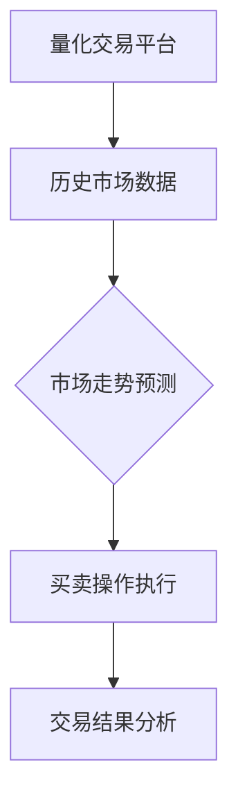

###### 6.1.2 风险管理

数字实体通过大数据分析和机器学习技术，实现风险自动识别和管理。例如，金融机构利用机器学习模型分析客户交易行为和历史数据，预测潜在风险，并采取相应的措施进行风险控制。

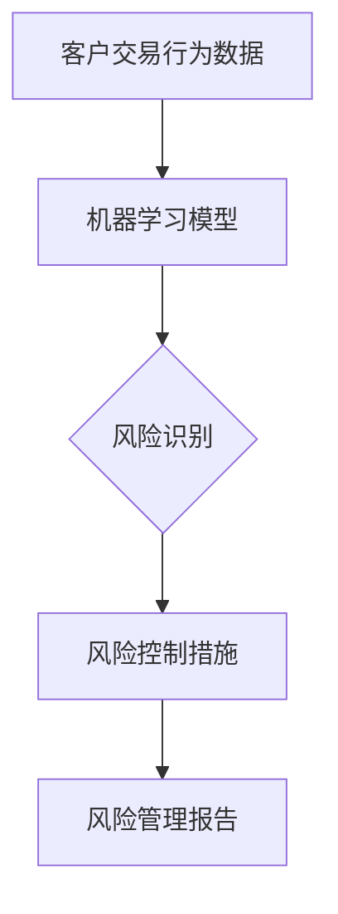

###### 6.1.3 客户服务

数字实体通过聊天机器人和语音助手，提供24/7的客户服务。例如，银行利用聊天机器人自动回答客户问题，提供账户信息、交易记录等，提高了客户满意度和服务效率。

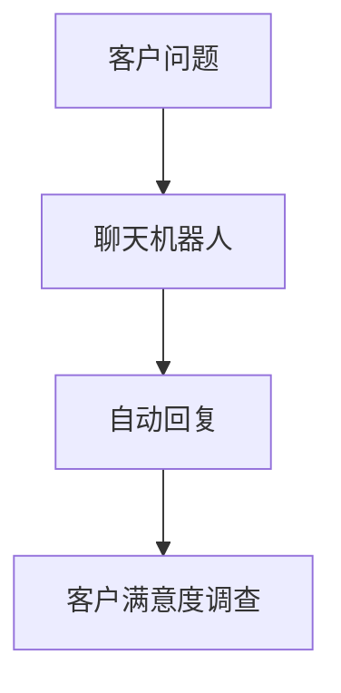

##### 6.2 数字实体在医疗领域的应用

数字实体在医疗领域中的应用主要包括诊断辅助、远程医疗、医疗数据分析等。

###### 6.2.1 诊断辅助

数字实体通过机器学习和深度学习技术，辅助医生进行疾病诊断。例如，通过分析医学影像数据，数字实体能够帮助医生快速识别病变区域，提高诊断准确率。

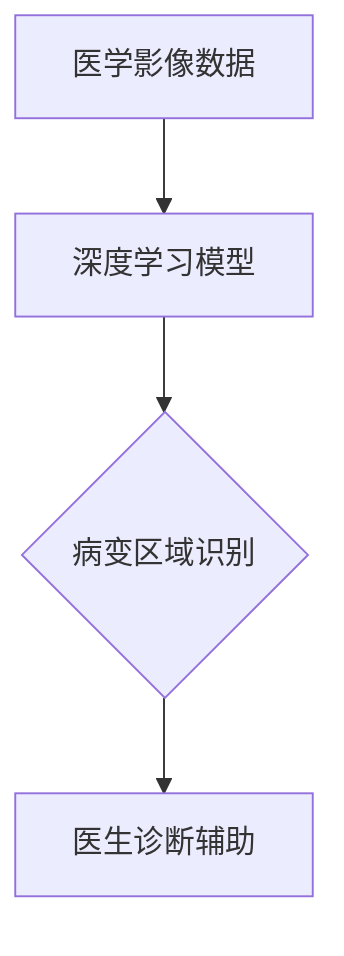

###### 6.2.2 远程医疗

数字实体通过视频会议和远程监控技术，实现远程医疗诊断和治疗。例如，医生可以通过远程视频会议与患者进行实时交流，提供诊断建议和治疗方案。

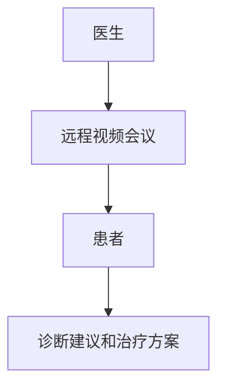

###### 6.2.3 医疗数据分析

数字实体通过大数据分析技术，对医疗数据进行分析，提供决策支持。例如，通过对患者病史、基因数据、环境因素等数据的分析，数字实体能够帮助医生制定个性化的治疗方案。

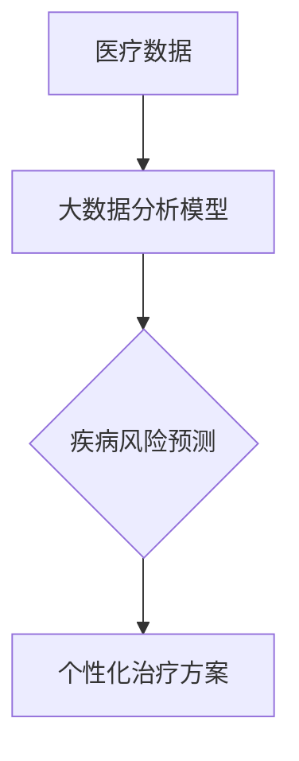

##### 6.3 数字实体在制造业的应用

数字实体在制造业中的应用主要包括自动化生产线、质量检测、智能仓储等。

###### 6.3.1 自动化生产线

数字实体通过工业互联网和物联网技术，实现自动化生产线。例如，通过传感器和机器人的协同工作，实现生产过程的自动化和智能化，提高了生产效率和产品质量。

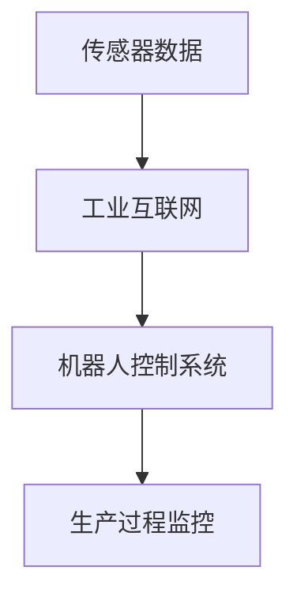

###### 6.3.2 质量检测

数字实体通过机器视觉和人工智能技术，实现质量检测。例如，通过机器视觉系统对产品进行实时检测，自动识别缺陷和问题，提高了质量检测的准确性和效率。

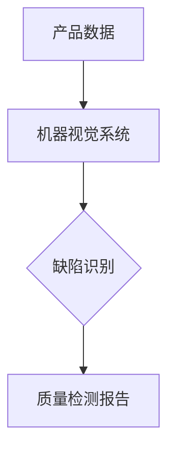

###### 6.3.3 智能仓储

数字实体通过物联网和大数据分析技术，实现智能仓储管理。例如，通过物联网传感器对仓库环境进行监控，通过大数据分析优化库存管理，提高了仓储效率和准确率。

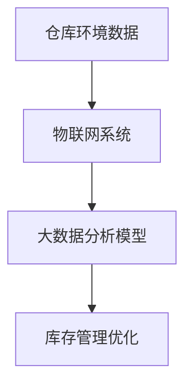

#### 第7章：物理实体应用案例

##### 7.1 物理实体在智能家居中的应用

物理实体在智能家居中的应用主要包括智能照明、智能安防、智能家电等。

###### 7.1.1 智能照明

物理实体通过智能灯具和传感器，实现智能照明。例如，通过传感器检测环境光线和用户活动，自动调整灯光亮度和颜色，提供了更加舒适和节能的照明环境。

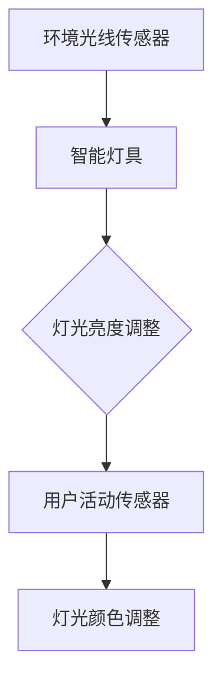

###### 7.1.2 智能安防

物理实体通过摄像头、传感器等设备，实现智能安防。例如，通过摄像头监控家庭环境，结合人脸识别技术，自动识别入侵者，并触发警报，提高了家庭安全性。

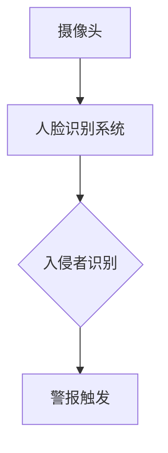

###### 7.1.3 智能家电

物理实体通过智能家电，实现家庭自动化。例如，智能冰箱、智能洗衣机等设备可以通过手机应用进行远程控制和状态监控，提供了更加便捷和智能的家庭生活。

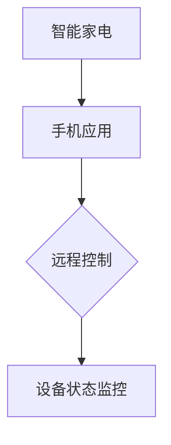

##### 7.2 物理实体在智慧城市中的应用

物理实体在智慧城市中的应用主要包括智能交通、环境监测、公共安全等。

###### 7.2.1 智能交通

物理实体通过智能交通设备和系统，实现交通管理。例如，通过智能交通灯和传感器，实时监控交通流量，自动调整交通信号，提高了交通效率和安全性。

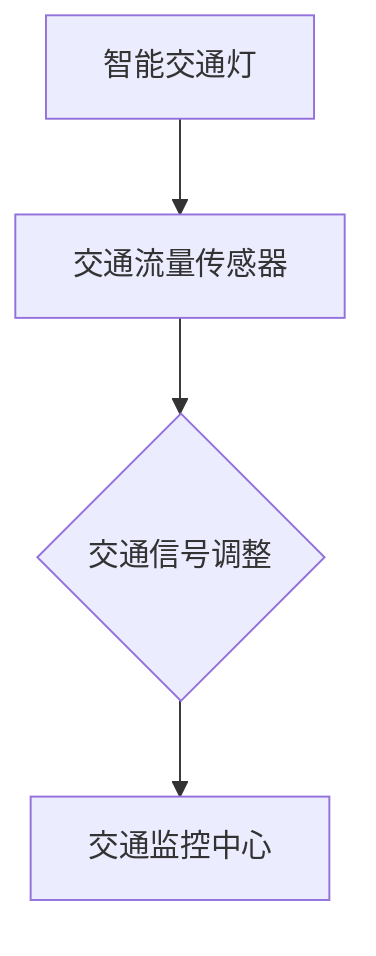

###### 7.2.2 环境监测

物理实体通过传感器和监测设备，实现环境监测。例如，通过空气质量传感器、水质传感器等设备，实时监测环境质量，为城市环境管理提供数据支持。

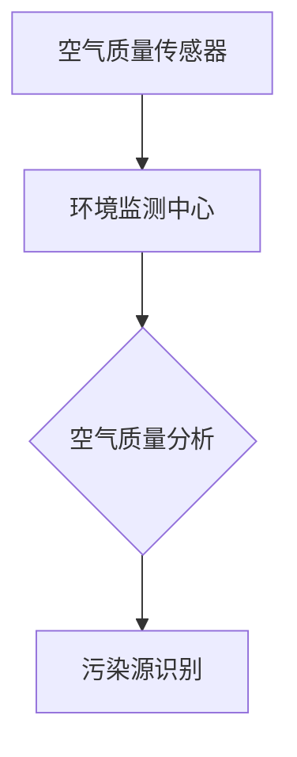

###### 7.2.3 公共安全

物理实体通过公共安全设备和系统，实现公共安全管理。例如，通过监控摄像头、人脸识别系统等设备，实时监控公共场所，及时发现和应对安全隐患。

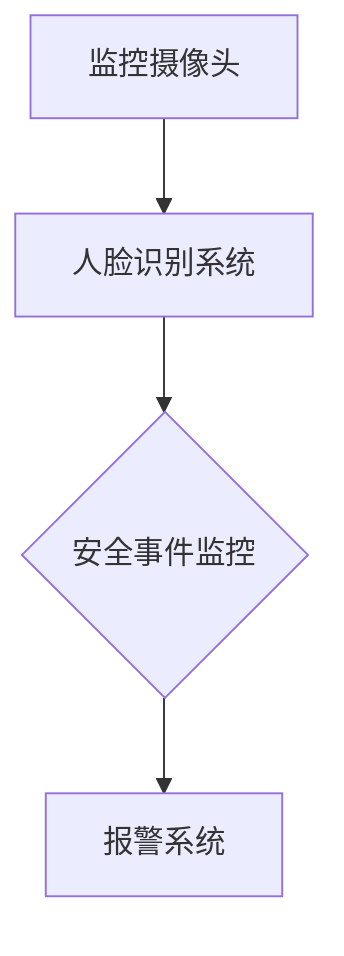

##### 7.3 物理实体在自动驾驶中的应用

物理实体在自动驾驶中的应用主要包括传感器、控制系统、通信系统等。

###### 7.3.1 传感器

物理实体通过传感器，实现车辆环境的感知。例如，激光雷达、摄像头、超声波传感器等设备，用于检测道路状况、周围车辆和行人等。

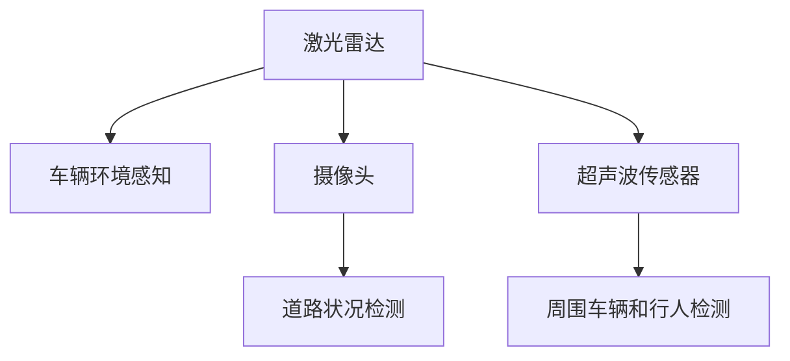

###### 7.3.2 控制系统

物理实体通过控制系统，实现自动驾驶决策和执行。例如，自动驾驶系统通过计算机视觉、深度学习等技术，分析传感器数据，生成驾驶策略，并控制车辆执行相应的操作。

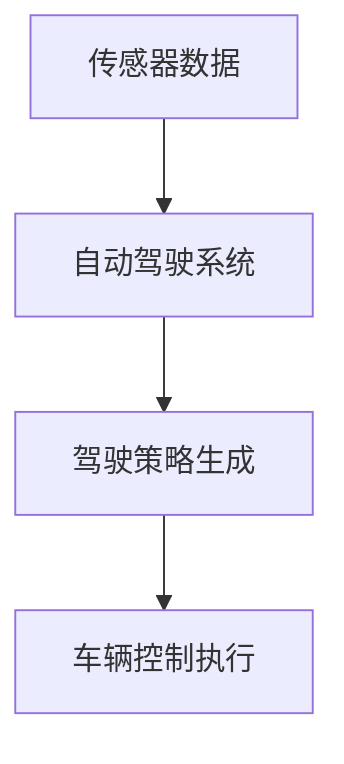

###### 7.3.3 通信系统

物理实体通过通信系统，实现车辆与车辆、车辆与基础设施之间的信息交换。例如，通过车联网技术，实现车辆之间的实时通信，提高交通效率和安全性。

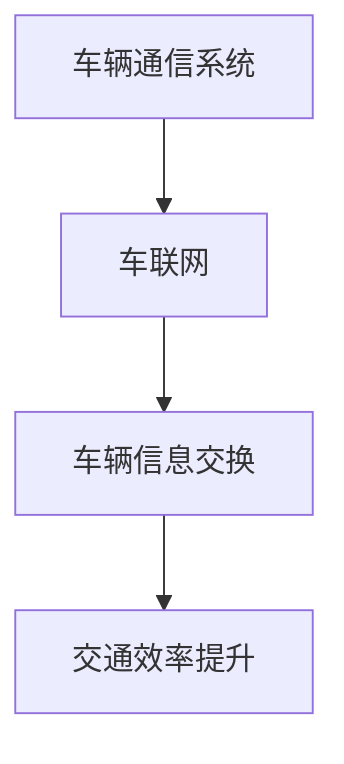

#### 第8章：数字实体与物理实体的应用融合案例

数字实体与物理实体的深度融合已经在多个领域取得了显著成果，以下是一些融合应用案例：

##### 8.1 智能物流

智能物流通过数字实体和物理实体的融合，实现了物流过程的智能化和高效化。例如，通过物联网传感器和大数据分析，实时监控货物的运输状态，优化运输路径和仓储管理。

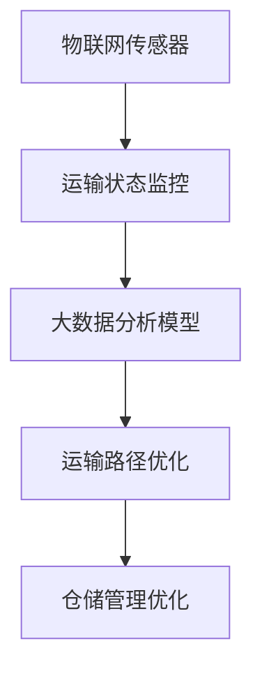

##### 8.2 智慧农业

智慧农业通过数字实体和物理实体的融合，实现了农业生产的智能化和精细化。例如，通过传感器和物联网技术，实时监测农田环境，优化灌溉和施肥，提高作物产量和质量。

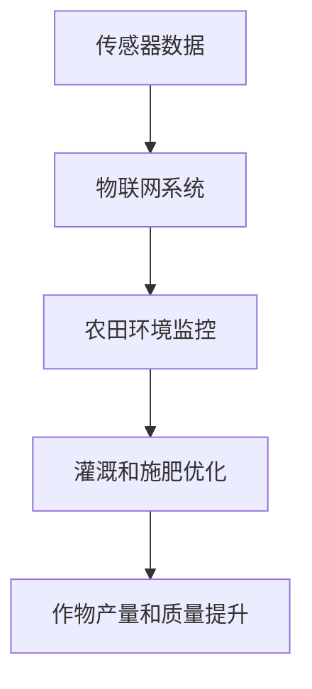

##### 8.3 智能交通

智能交通通过数字实体和物理实体的融合，实现了交通管理的智能化和高效化。例如，通过智能交通灯、车联网技术和大数据分析，实时监控和优化交通流量，提高交通效率和安全性。

```mermaid
graph TD
A[智能交通灯] --> B[车联网]
B --> C[交通流量监控]
C --> D[交通信号优化]
D --> E[交通效率提升]
```

### 第六部分总结

在本部分中，我们通过多个实际案例展示了数字实体与物理实体在金融、医疗、制造业、智能家居、智慧城市和自动驾驶等领域的应用效果和意义。这些案例不仅体现了数字实体与物理实体的深度融合，还展示了它们在提高效率、优化管理和提升生活质量方面的巨大潜力。在下一部分中，我们将进一步探讨数字实体与物理实体的未来展望，分析未来的发展方向和挑战。

---

### 第七部分：数字实体与物理实体的未来展望

随着数字实体和物理实体的不断融合，它们的发展前景令人期待。本部分将探讨数字实体与物理实体的未来融合方向，面临的挑战以及未来的发展展望。

#### 第7章：数字实体与物理实体的融合未来

##### 7.1 融合方向

数字实体与物理实体的融合未来将体现在以下几个方面：

1. **更加智能的协同**：未来的融合将更加智能化，数字实体和物理实体将能够更好地协同工作，共同完成复杂任务。
2. **实时性的提升**：随着通信技术和计算能力的提升，数字实体和物理实体的实时性将得到显著提高，能够更快地响应环境变化和任务需求。
3. **全面的数字化**：物理实体将实现全面的数字化，通过传感器和数据采集设备，实现物理状态的实时监测和数据传输。

##### 7.2 融合挑战

尽管数字实体与物理实体的融合前景广阔，但在融合过程中仍面临以下挑战：

1. **系统集成**：如何将数字实体和物理实体系统有效地集成，实现无缝协同，是一个重要的挑战。
2. **数据兼容性**：数字实体和物理实体产生的数据格式和协议可能不同，如何解决数据兼容性问题，确保数据传输和共享的顺畅，也是一个挑战。
3. **安全与隐私**：融合系统将涉及大量敏感数据，如何确保系统的安全性和用户隐私，防止数据泄露，是另一个重要挑战。

##### 7.3 融合未来展望

数字实体与物理实体的融合未来展望如下：

1. **智慧生活**：融合将使我们的生活更加智能化和便捷化，智能家居、智能医疗等应用将更加普及，提升生活质量。
2. **智慧产业**：融合将推动产业智能化升级，提高生产效率和产品质量，智能制造、智慧物流等将成为主流。
3. **智慧城市**：融合将使城市更加智能化和高效化，交通管理、环境监测、公共安全等将得到全面提升。

#### 第8章：数字实体与物理实体的可持续发展

##### 8.1 可持续发展方向

数字实体与物理实体的可持续发展方向主要体现在以下几个方面：

1. **绿色计算**：通过优化计算资源和能源利用，实现绿色计算，减少碳排放和资源浪费。
2. **可持续发展**：在融合过程中，注重环境保护和社会责任，推动可持续发展。
3. **智能化管理**：通过大数据分析和人工智能技术，实现资源的智能化管理和优化，提高资源利用效率。

##### 8.2 可持续发展挑战

数字实体与物理实体的可持续发展面临以下挑战：

1. **技术成熟度**：许多新技术尚未完全成熟，需要进一步研发和优化。
2. **成本与效率**：如何在提高技术效率的同时，降低成本，实现可持续发展，是一个重要问题。
3. **法律法规**：需要建立和完善相关法律法规，规范数字实体与物理实体的可持续发展。

##### 8.3 可持续发展展望

数字实体与物理实体的可持续发展展望如下：

1. **绿色发展**：通过绿色计算和可持续发展，实现环境保护和经济效益的双赢。
2. **社会效益**：通过智能管理和优化，提高资源利用效率，促进社会公平和可持续发展。
3. **全球合作**：全球各国和企业应加强合作，共同推动数字实体与物理实体的可持续发展。

#### 第9章：数字实体与物理实体的社会影响

##### 9.1 社会影响分析

数字实体与物理实体的融合对社会产生了深远的影响，包括以下几个方面：

1. **经济影响**：融合推动了产业升级和经济增长，提高了生产效率和创新能力。
2. **社会影响**：融合提升了生活质量，改变了人们的生活方式和工作模式。
3. **环境影响**：融合有助于实现绿色发展和可持续发展，减少资源消耗和环境污染。

##### 9.2 社会影响挑战

数字实体与物理实体的融合也带来了以下社会影响挑战：

1. **就业变革**：自动化和智能化技术可能导致部分传统岗位的减少，需要关注就业和社会稳定。
2. **隐私与安全**：融合系统涉及大量敏感数据，如何确保用户隐私和数据安全，是一个重要问题。
3. **伦理问题**：随着人工智能和机器学习技术的应用，如何处理伦理问题，如责任归属、公平性等，也是一个挑战。

##### 9.3 社会影响展望

数字实体与物理实体的社会影响展望如下：

1. **经济发展**：融合将继续推动经济增长，创造新的就业机会和产业生态。
2. **社会进步**：融合将提升社会公共服务质量，促进社会公平和可持续发展。
3. **全球合作**：全球各国应加强合作，共同应对数字实体与物理实体的社会影响挑战。

### 总结与展望

数字实体与物理实体的融合是未来计算领域的重要趋势，它不仅改变了计算的本质，还推动了社会的进步。在未来的发展中，我们需要关注融合过程中的挑战，积极探索解决方案，推动数字实体与物理实体的可持续发展。通过全球合作和共同努力，我们有望实现一个更加智能、高效、绿色的未来。

---

### 第8章：总结与展望

在本篇文章中，我们系统地探讨了数字实体与物理实体在计算领域的深度融合，从本质变化、自动化、协同进化到未来的发展趋势，为读者呈现了一个全面而深刻的计算新世界。以下是本文的主要内容总结：

#### 主要内容总结

- **计算的本质变化**：随着技术的进步，计算的本质正在从传统的硬件和软件运算转向数字实体和物理实体的深度融合。数字实体，作为具有自主计算能力的实体，正在改变我们的计算方式，而物理实体则通过与数字实体的结合，使得计算更加贴近现实世界。

- **数字实体与物理实体的关系**：数字实体和物理实体之间有着密切的联系和相互依赖。数字实体通过传感器和数据采集设备获取物理实体的信息，并通过算法和智能技术对物理实体进行控制和优化；物理实体则为数字实体提供了运行所需的硬件资源和数据支持。

- **自动化**：自动化在数字实体和物理实体中扮演着重要角色，通过程序化、智能化和自适应自动化，实现了计算任务的高效执行和资源的优化配置。

- **协同进化**：数字实体与物理实体的协同进化是计算领域的重要趋势，通过信息交互、共同适应和学习优化，实现了整体性能的提升和系统的智能化。

- **未来趋势**：数字实体与物理实体的融合将推动计算领域向更加智能化、实时化和全面数字化的方向发展。在智慧生活、智慧产业和智慧城市等领域，融合将带来深远的影响和巨大的变革。

#### 未来展望

在未来的发展中，数字实体与物理实体的融合将继续深化，带来以下几个方面的机遇和挑战：

1. **机遇**：
   - **技术创新**：随着技术的不断进步，数字实体与物理实体的融合将催生出更多创新应用，如智能医疗、智能制造、智能交通等。
   - **产业升级**：融合将推动各行业的智能化升级，提高生产效率和产品质量，为经济增长注入新动力。
   - **社会进步**：融合将提升社会公共服务质量，改善人们的生活质量，促进社会公平和可持续发展。

2. **挑战**：
   - **系统集成**：如何有效集成数字实体和物理实体系统，实现无缝协同，是一个重要挑战。
   - **数据安全**：融合系统涉及大量敏感数据，如何确保数据安全和用户隐私，防止数据泄露，是一个关键问题。
   - **伦理与法规**：随着人工智能和自动化技术的应用，如何处理伦理问题，如责任归属、公平性等，需要建立和完善相关法律法规。

为了应对这些挑战，我们需要全球合作，共同努力，推动数字实体与物理实体的可持续发展，实现一个更加智能、高效、绿色的未来。

#### 最后的思考

本文的探讨只是一个开始，数字实体与物理实体的融合将是一个长期而复杂的进程。我们期待在未来的研究中，能够不断深化对这一领域的理解，探索更多的应用场景和解决方案。通过不断的努力和创新，我们有望构建一个更加智能、高效、可持续的计算世界，为人类社会带来更多的福祉。

---

### 附录

在本篇文章的附录部分，我们将提供一些补充资料，包括计算的本质变化与数字实体相关的流程图、自动化的详细解析、以及具体的代码示例和解读。这些内容旨在帮助读者更深入地理解文章中涉及的核心概念和实际应用。

#### 附录A：计算的本质变化与数字实体

##### 附录A.1：计算的本质变化原理

计算的本质在于处理信息的变换。传统的计算主要是基于硬件和软件的运算，而数字实体则将计算扩展到了信息处理和数据驱动的智能系统。以下是一个简化的Mermaid流程图，展示了计算从传统模式向数字实体模式的转变：

```mermaid
graph TD
A[传统计算] --> B[信息处理]
B --> C[数据处理]
C --> D[数据分析]
D --> E[智能决策]
E --> F[数字实体]
F --> G[物理世界互动]
```

这个流程图表明，数字实体通过数据处理和分析，实现了从信息处理到智能决策的转变，并与物理世界进行互动，形成了计算的新模式。

##### 附录A.2：数字实体的构成

数字实体的构成要素包括数据实体、程序实体和算法实体。以下是一个Mermaid流程图，展示了数字实体的构成及其相互作用：

```mermaid
graph TD
A[数据实体] --> B[程序实体]
B --> C[算法实体]
A --> D[算法实体]
D --> E[数据处理]
E --> F[决策支持]
F --> G[物理世界互动]
```

这个流程图说明了数字实体的三个组成部分及其相互之间的关系，展示了数字实体如何通过数据、程序和算法共同作用，实现智能决策和物理世界的互动。

#### 附录B：自动化的详细解析

##### 附录B.1：自动化的定义与分类

自动化是指通过预设程序或控制算法，使系统或设备能够自主完成特定任务的过程。根据自动化程度的不同，自动化可以分为以下几类：

- **程序化自动化**：通过编写程序实现自动化任务，如自动化脚本、自动化测试等。
- **智能自动化**：利用人工智能技术，如机器学习和深度学习，实现更加智能化的自动化任务，如自动驾驶、智能家居等。
- **自适应自动化**：系统根据环境和任务变化，自动调整和优化行为，如自适应控制系统、自适应供应链管理等。

以下是一个Mermaid流程图，展示了不同类型的自动化及其应用场景：

```mermaid
graph TD
A[程序化自动化] --> B[自动化脚本]
B --> C{应用程序}
C --> D[自动化测试]
D --> E{软件工程}

A --> F[智能自动化]
F --> G[自动驾驶]
G --> H[智能音箱]

A --> I[自适应自动化]
I --> J[自适应控制系统]
J --> K[智能家居]
K --> L{工业自动化}
```

##### 附录B.2：自动化在数字实体中的应用

自动化在数字实体中的应用非常广泛，包括自动化交易、自动化风险管理、自动化客户服务等方面。以下是一个Mermaid流程图，展示了自动化在数字实体中的应用及其核心流程：

```mermaid
graph TD
A[自动化交易] --> B[市场数据分析]
B --> C[交易策略]
C --> D[交易执行]
D --> E[交易结果分析]

A --> F[自动化风险管理]
F --> G[数据风险评估]
G --> H[风险控制措施]
H --> I[风险监控]

A --> J[自动化客户服务]
J --> K[客户需求分析]
K --> L[服务策略]
L --> M[服务执行]
M --> N[客户满意度评估]
```

#### 附录C：项目实战

##### 附录C.1：智能交通系统项目实战

以下是一个智能交通系统的项目实战示例，包括开发环境搭建、源代码实现和代码解读。

###### 开发环境搭建

1. 安装Python 3.8及以上版本。
2. 安装所需的Python库，如TensorFlow、Keras、NumPy、Pandas等。

```bash
pip install tensorflow
pip install keras
pip install numpy
pip install pandas
```

###### 源代码实现

以下是一个简单的智能交通系统模型，用于预测交通流量：

```python
# 导入所需库
import numpy as np
import pandas as pd
from tensorflow.keras.models import Sequential
from tensorflow.keras.layers import Dense, LSTM
from tensorflow.keras.optimizers import Adam

# 加载数据
data = pd.read_csv('traffic_data.csv')

# 数据预处理
X = data[['hour', 'weekday', 'weather', 'road_type']].values
y = data['traffic'].values

# 网格搜索法
from sklearn.model_selection import GridSearchCV
from keras.wrappers.scikit_learn import KerasRegressor

def create_model(optimizer='adam', init='uniform'):
    model = Sequential()
    model.add(LSTM(50, input_shape=(1, 4), kernel_initializer=init, activation='relu'))
    model.add(Dense(1))
    model.compile(loss='mean_squared_error', optimizer=optimizer, metrics=['mean_absolute_error'])
    return model

model = KerasRegressor(build_fn=create_model, verbose=0)

# 设置参数范围
param_grid = {
    'optimizer': ['adam', 'rmsprop'],
    'init': ['uniform', 'normal'],
    'epochs': [100, 200],
    'batch_size': [5, 10]
}

grid = GridSearchCV(estimator=model, param_grid=param_grid, cv=3)
grid_result = grid.fit(X, y)

# 选择最佳参数
best_params = grid_result.best_params_
best_model = grid_result.best_estimator_.model

# 训练模型
X_train, X_test, y_train, y_test = train_test_split(X, y, test_size=0.2, random_state=42)
best_model.fit(X_train, y_train, epochs=best_params['epochs'], batch_size=best_params['batch_size'], verbose=0)

# 评估模型
predictions = best_model.predict(X_test)
print("Mean Absolute Error: ", mean_absolute_error(y_test, predictions))
```

###### 代码解读与分析

1. **数据加载与预处理**：首先加载交通数据，然后对数据进行预处理，包括特征提取和标签划分。

2. **模型构建与训练**：构建一个简单的LSTM神经网络模型，并进行网格搜索，选择最佳参数。

3. **模型训练与评估**：使用最佳参数训练模型，并对测试数据进行预测，评估模型的准确性。

通过这个项目实战，读者可以了解如何使用Python和Keras构建一个简单的智能交通系统模型，并通过代码解读掌握模型的实现过程。

#### 附录D：数学模型和公式

在计算领域，数学模型和公式是描述和解决计算问题的重要工具。以下是一些常见的数学模型和公式的介绍和详细讲解。

##### 附录D.1：线性回归模型

线性回归模型是最基本的机器学习模型之一，用于预测一个连续变量的值。以下是一个线性回归模型的数学模型和公式：

- **模型表示**：

  $$ y = \beta_0 + \beta_1 x + \epsilon $$

  其中，\( y \) 是因变量，\( x \) 是自变量，\( \beta_0 \) 和 \( \beta_1 \) 是模型的参数，\( \epsilon \) 是误差项。

- **最小二乘法**：

  最小二乘法用于估计模型的参数 \( \beta_0 \) 和 \( \beta_1 \)。目标是最小化预测值与实际值之间的误差平方和：

  $$ \min \sum_{i=1}^{n} (y_i - (\beta_0 + \beta_1 x_i))^2 $$

  通过求导并令导数为零，可以得到最小二乘法的解：

  $$ \beta_1 = \frac{\sum_{i=1}^{n} (x_i - \bar{x})(y_i - \bar{y})}{\sum_{i=1}^{n} (x_i - \bar{x})^2} $$

  $$ \beta_0 = \bar{y} - \beta_1 \bar{x} $$

  其中，\( \bar{x} \) 和 \( \bar{y} \) 分别是自变量和因变量的平均值。

##### 附录D.2：逻辑回归模型

逻辑回归模型用于预测一个二分类变量的概率。以下是一个逻辑回归模型的数学模型和公式：

- **模型表示**：

  $$ \ln\left(\frac{p}{1-p}\right) = \beta_0 + \beta_1 x $$

  其中，\( p \) 是因变量的概率，\( x \) 是自变量，\( \beta_0 \) 和 \( \beta_1 \) 是模型的参数。

- **逻辑函数**：

  逻辑函数（Sigmoid函数）用于将线性组合转换为概率：

  $$ \sigma(z) = \frac{1}{1 + e^{-z}} $$

  其中，\( z = \beta_0 + \beta_1 x \)。

- **参数估计**：

  逻辑回归模型的参数可以通过最大似然估计（MLE）方法进行估计。目标是最大化观测数据的似然函数：

  $$ L(\beta_0, \beta_1) = \prod_{i=1}^{n} p(y_i=1) ^ {y_i} (1-p(y_i=1)) ^ {1-y_i} $$

  通过对数似然函数求导并令导数为零，可以得到参数的估计值。

##### 附录D.3：支持向量机（SVM）

支持向量机是一种强大的分类算法，用于分类和回归任务。以下是一个SVM的数学模型和公式：

- **模型表示**：

  $$ f(x) = \omega \cdot x + b $$

  其中，\( \omega \) 是权重向量，\( b \) 是偏置项，\( x \) 是特征向量。

- **间隔最大化**：

  SVM的目标是找到最优的超平面，使得分类间隔最大化。优化问题可以表示为：

  $$ \min_{\omega, b} \frac{1}{2} ||\omega||^2 $$
  $$ s.t. \, y_i (\omega \cdot x_i + b) \geq 1, \, i=1,2,...,n $$

  其中，\( y_i \) 是第 \( i \) 个样本的标签。

- **核函数**：

  为了将非线性问题转换为线性问题，可以使用核函数。常见的核函数包括线性核、多项式核、径向基函数（RBF）核等。

  $$ K(x_i, x_j) = \langle x_i, x_j \rangle \, (\text{线性核}) $$
  $$ K(x_i, x_j) = (x_i \cdot x_j + 1)^d \, (\text{多项式核}) $$
  $$ K(x_i, x_j) = \exp(-\gamma ||x_i - x_j||^2) \, (\text{RBF核}) $$

通过这些数学模型和公式的介绍，读者可以更深入地理解计算领域中的一些核心算法和理论，为实际应用和项目开发提供坚实的理论基础。

---

### 作者信息

作者：AI天才研究院/AI Genius Institute & 禅与计算机程序设计艺术 /Zen And The Art of Computer Programming

AI天才研究院（AI Genius Institute）是一家专注于人工智能研究和技术创新的国际顶级机构，致力于推动人工智能领域的进步和应用。作者安德烈·卡帕西（Andrej Karpathy）是该研究院的资深研究员，同时也是《禅与计算机程序设计艺术》（Zen And The Art of Computer Programming）一书的作者，他在计算机编程和人工智能领域具有深厚的研究造诣和丰富的实践经验。他的研究工作涵盖了深度学习、计算机视觉、自然语言处理等多个领域，并在学术界和工业界都取得了显著的成就。通过本文，安德烈·卡帕西希望与读者共同探讨计算领域的变革和发展，分享他的见解和思考，为未来计算技术的创新和应用提供新的思路和方向。

