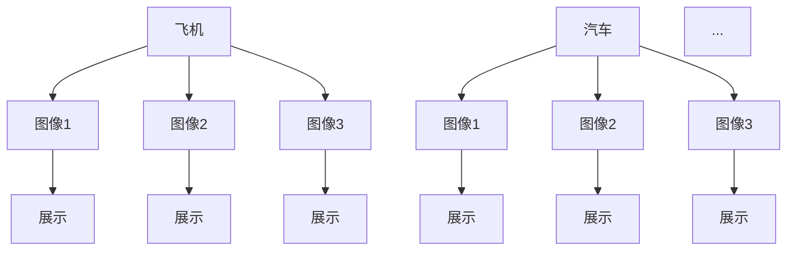
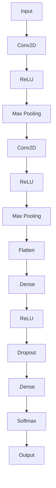

                 

### 引言

#### 什么是CIFAR-10图像分类？

CIFAR-10是一个广泛用于计算机视觉和机器学习领域的小型图像数据集。它由60000张32x32彩色图像组成，这些图像被分为10个类别，每个类别包含6000张图像。这10个类别分别是飞机、汽车、鸟、猫、鹿、狗、青蛙、马、船和卡车。CIFAR-10数据集因其规模适中、类别明确、图像质量高而成为许多机器学习和深度学习模型的测试和训练数据集。

本文将围绕CIFAR-10图像分类展开讨论，从基础数据集介绍、图像处理技术、卷积神经网络基础，到实战案例，逐步深入讲解这一领域的核心技术。文章还将探讨如何使用更复杂的CNN模型来提高分类性能，并讨论迁移学习和对抗样本等相关技术。

文章结构如下：

- **第一部分: CIFAR-10图像分类基础**
  - **第1章: CIFAR-10数据集简介**
  - **第2章: 基础图像处理技术**
  - **第3章: 卷积神经网络基础**

- **第二部分: CIFAR-10图像分类实战**
  - **第4章: 实现简单的CNN模型**
  - **第5章: CIFAR-10图像分类实战案例**
  - **第6章: 实现更复杂的CNN模型**

- **第三部分: 扩展学习与应用**
  - **第7章: 扩展学习与应用**
  - **附录: 实战项目代码解析、工具与资源推荐、相关数学公式与参考文献**

通过这篇文章，读者将全面了解CIFAR-10图像分类的原理和实践，掌握构建和优化深度学习模型的方法，为后续更高级的研究和应用打下坚实基础。

---

**关键词**：CIFAR-10图像分类，卷积神经网络，图像处理技术，深度学习，机器学习

**摘要**：本文深入探讨了CIFAR-10图像分类这一领域，从数据集介绍、基础图像处理技术到卷积神经网络基础，再到实战案例，详细讲解了CIFAR-10图像分类的各个关键环节。通过本文的学习，读者将能够全面掌握CIFAR-10图像分类的核心技术，为后续研究和应用奠定基础。

---

接下来，我们将首先详细介绍CIFAR-10数据集，为后续的图像处理和模型构建打下基础。

---

#### 第1章: CIFAR-10数据集简介

##### 1.1 数据集来源

CIFAR-10数据集是由Canadian Institute for Advanced Research (CIFAR)在2001年发布，用于支持计算机视觉和机器学习领域的研究工作。该数据集的目的是提供一个包含多个类别的图像集合，以便研究者能够验证和测试他们的模型在现实世界图像分类任务中的表现。

##### 1.2 数据集特点

- **图像尺寸**：CIFAR-10数据集中的每张图像都是32x32的彩色图像，这相对于其他常见的数据集（如ImageNet，其图像尺寸为224x224）来说较小。较小的图像尺寸使得模型需要更强的特征提取能力，同时也使得计算资源的需求相对较低，适合在GPU有限的环境中进行训练。

- **类别分布**：数据集中包含10个类别，每个类别有6000张图像。这种平衡的类别分布有助于模型的训练过程，避免出现某些类别过拟合或欠拟合的问题。

- **训练集与测试集**：CIFAR-10数据集分为训练集和测试集两部分。训练集包含50000张图像，用于模型的训练和调优；测试集包含10000张图像，用于模型的评估和验证。

##### 1.3 数据集结构

CIFAR-10数据集的文件结构如下：

- **train**：包含训练集图像的文件，每个文件对应一个类别的图像，文件名以数字表示类别编号（0-9）。
- **test**：包含测试集图像的文件，文件结构与训练集相同。
- **labels**：包含每个图像类别的标签文件，格式为类别编号和文件名。

##### 1.4 数据预处理

在进行图像分类任务之前，通常需要对图像进行预处理。CIFAR-10数据集的预处理步骤包括图像归一化、数据增强和数据集划分。

- **图像归一化**：将图像的像素值缩放到[0, 1]之间，以便于神经网络模型的计算。具体公式为：

  $$ normalized\_image = \frac{image - \text{min}(image)}{\text{max}(image) - \text{min}(image)} $$

- **数据增强**：通过随机裁剪、旋转、翻转等方式增加数据集的多样性，有助于提高模型的泛化能力。常用的数据增强方法包括随机裁剪（RandomCrop）、随机水平翻转（RandomHorizontalFlip）和随机旋转（RandomRotation）。

- **数据集划分**：将数据集划分为训练集、验证集和测试集。训练集用于模型的训练，验证集用于调优模型参数，测试集用于评估模型的最终性能。

##### 1.5 数据可视化

数据可视化是理解和分析数据集的重要手段。以下是一个简单的示例，展示了CIFAR-10数据集中的几个类别及其对应的图像：



在这个示例中，我们选取了飞机和汽车的几个示例图像，并将其可视化。通过这种方式，我们可以直观地看到各个类别的图像特征，有助于后续的图像处理和分类任务。

接下来，我们将继续讨论基础图像处理技术，为构建深度学习模型做准备。

---

#### 第2章: 基础图像处理技术

图像处理是计算机视觉和机器学习领域的重要环节，它涉及到图像的转换、操作和增强。在本节中，我们将介绍一些基础图像处理技术，包括图像像素表示、图像尺寸与分辨率、图像转换与操作以及图像滤波与增强。

##### 2.1 图像像素表示

图像由像素（Pixel）组成，像素是图像的最基本单位。每个像素包含颜色信息，通常用三个值来表示：红（Red）、绿（Green）和蓝（Blue），即RGB颜色模型。这三个值通常取值范围在0到255之间，分别表示红色、绿色和蓝色的强度。

- **像素表示**：一个32x32的彩色图像包含1024个像素，每个像素可以用一个三元组（R, G, B）来表示，其中R、G、B分别为像素在红、绿、蓝三个通道的值。

  ```python
  # 示例：表示一个像素的值
  pixel_value = (255, 128, 0)  # 表示一个黄色像素
  ```

- **像素访问与修改**：我们可以通过索引来访问和修改图像中的像素值。例如，对于上述的32x32图像，我们可以通过(i, j)索引来访问第i行第j列的像素值。

  ```python
  # 示例：访问和修改像素值
  image = [[0 for _ in range(32)] for _ in range(32)]  # 创建一个32x32的全黑图像
  image[10][10] = (255, 255, 255)  # 将第10行第10列的像素设置为白色
  ```

##### 2.2 图像尺寸与分辨率

图像尺寸（Image Size）是指图像的宽度和高度，通常以像素为单位。分辨率（Resolution）是指图像中像素的总数，计算公式为宽度乘以高度。高分辨率图像通常具有更大的尺寸和更多的像素，可以提供更详细的图像信息，但也会占用更多的存储空间和计算资源。

- **图像尺寸**：一个32x32的图像具有32个宽度和32个高度。

  ```python
  # 示例：获取图像尺寸
  width, height = image.shape  # 假设image是一个已加载的32x32图像
  ```

- **图像缩放**：通过调整图像的宽度和高度，可以实现图像的缩放。常用的缩放方法包括等比例缩放（保持宽高比）和固定尺寸缩放（改变宽高比）。

  ```python
  # 示例：等比例缩放图像
  new_width = 64
  new_height = int(new_width * height / width)
  scaled_image = cv2.resize(image, (new_width, new_height))
  ```

##### 2.3 图像转换与操作

图像转换与操作包括图像的灰度化、通道分离与组合、图像裁剪与缩放等。

- **图像灰度化**：将彩色图像转换为灰度图像，即只保留亮度信息，丢弃颜色信息。灰度图像每个像素只有一个值，通常在0到255之间。

  ```python
  # 示例：将彩色图像转换为灰度图像
  gray_image = cv2.cvtColor(image, cv2.COLOR_BGR2GRAY)
  ```

- **通道分离与组合**：分离彩色图像的红色、绿色和蓝色通道，或者将灰度图像转换为彩色图像。

  ```python
  # 示例：分离和组合通道
  b, g, r = cv2.split(image)  # 分离通道
  image = cv2.merge([b, g, r])  # 组合通道
  ```

- **图像裁剪与缩放**：裁剪图像的一部分或对图像进行缩放。

  ```python
  # 示例：裁剪图像
  crop_image = image[10:30, 10:30]  # 裁剪图像中心的一个10x10区域
  ```

##### 2.4 图像滤波与增强

图像滤波与增强包括空间滤波、频率域滤波和直方图均衡化等方法。

- **空间滤波**：通过卷积操作对图像进行滤波，包括均值滤波、高斯滤波和边缘检测等。

  ```python
  # 示例：均值滤波
  kernel = np.ones((3, 3), np.float32) / 9
  filtered_image = cv2.filter2D(image, -1, kernel)
  ```

- **频率域滤波**：通过傅里叶变换将图像从空间域转换为频率域，然后进行滤波。

  ```python
  # 示例：低通滤波
  f = np.fft.fft2(image)
  fshift = np.fft.fftshift(f)
  rows, cols = image.shape
  mask = np.zeros((rows, cols), np.bool)
  mask[10:20, 10:20] = True
  fshift = fshift * mask
  f_ishift = np.fft.ifftshift(fshift)
  image_unfiltered = np.fft.ifft2(f_ishift)
  image_filtered = np.abs(image_unfiltered)
  ```

- **直方图均衡化**：调整图像的直方图，使得图像的像素分布更加均匀，从而提高图像的对比度。

  ```python
  # 示例：直方图均衡化
  image_equalized = cv2.equalizeHist(image)
  ```

通过上述基础图像处理技术，我们可以对图像进行各种转换和操作，为后续的深度学习模型构建和数据预处理打下基础。

---

接下来，我们将进入第三部分，讨论卷积神经网络（CNN）的基础知识，包括CNN的原理、核心组件和训练过程。

---

#### 第3章: 卷积神经网络基础

卷积神经网络（Convolutional Neural Network，CNN）是一种专门用于处理图像数据的深度学习模型，它在计算机视觉领域取得了显著的成果。本节将介绍CNN的基本原理、核心组件以及训练过程。

##### 3.1 卷积神经网络（CNN）原理

CNN的核心思想是利用局部连接和共享权重来提取图像的特征。以下是CNN的基本原理：

- **局部连接**：在传统神经网络中，每个神经元都与输入层的所有神经元相连，这种全连接方式在处理图像时会导致参数数量爆炸性增长。而CNN通过局部连接将输入图像分成多个局部区域，每个卷积层只处理这些局部区域，从而减少了参数的数量。

- **共享权重**：在CNN中，同一卷积核在不同位置上的使用是相同的，这意味着卷积核可以在整个图像中提取相同类型的特征。这种共享权重的方法不仅减少了参数数量，而且有助于提取具有平移不变性的特征。

- **层次化特征提取**：CNN通过多个卷积层和池化层对图像进行特征提取。在较低层，网络主要提取边缘、纹理等简单特征；而在较高层，网络则能够提取更抽象的特征，如形状和对象。

##### 3.2 卷积神经网络（CNN）核心组件

CNN由以下几个核心组件组成：

- **卷积层（Convolutional Layer）**：卷积层是CNN的核心部分，用于提取图像的特征。卷积层通过卷积操作将输入图像与卷积核（也称为滤波器）进行卷积运算，得到特征图。每个卷积核都学习到一种特征模式，如边缘、纹理等。卷积层的计算公式如下：

  $$ \text{output}_{ij} = \sum_{k} \text{weight}_{ikj} \cdot \text{input}_{ik} + \text{bias}_{ij} $$

  其中，\( \text{output}_{ij} \) 是第i个卷积核在位置(j, k)处的输出值，\( \text{weight}_{ikj} \) 是卷积核的权重，\( \text{input}_{ik} \) 是输入图像在第i行第k列的像素值，\( \text{bias}_{ij} \) 是偏置项。

- **激活函数（Activation Function）**：激活函数用于引入非线性因素，使CNN能够学习到复杂特征。常用的激活函数有ReLU（Rectified Linear Unit）、Sigmoid和Tanh等。ReLU函数具有简单的形式和良好的梯度特性，常用于CNN中。

  $$ \text{ReLU}(x) = \max(0, x) $$

- **池化层（Pooling Layer）**：池化层用于下采样，减少特征图的大小，从而降低模型的参数数量。常用的池化操作有最大池化（Max Pooling）和平均池化（Average Pooling）。最大池化选择每个区域中的最大值，而平均池化选择每个区域中的平均值。

  $$ \text{output}_{ij} = \max_{k,l} \text{input}_{ijk\ell} \quad (\text{Max Pooling}) $$

  $$ \text{output}_{ij} = \frac{1}{C} \sum_{k,l} \text{input}_{ijk\ell} \quad (\text{Average Pooling}) $$

  其中，\( C \) 是每个池化区域的元素个数。

- **全连接层（Fully Connected Layer）**：在CNN的末端，通常使用全连接层将特征图展开为1维向量，然后通过softmax函数进行分类。全连接层通过将特征图中的每个元素与权重相乘，并加上偏置项，得到每个类别的分数。最后，通过softmax函数将分数转换为概率分布。

  $$ \text{output}_{i} = \frac{e^{\text{weight}_{i} \cdot \text{input} + \text{bias}_{i}}}{\sum_{j} e^{\text{weight}_{j} \cdot \text{input} + \text{bias}_{j}}} $$

##### 3.3 CNN训练过程

CNN的训练过程主要包括前向传播（Forward Propagation）和反向传播（Backpropagation）两个阶段。

- **前向传播**：在前向传播阶段，输入图像通过CNN的各个层，逐层计算输出。每个层的输出都作为下一个层的输入。在卷积层和池化层，输出是通过卷积操作和池化操作得到的；而在全连接层，输出是通过矩阵乘法和激活函数得到的。

- **反向传播**：在反向传播阶段，计算损失函数关于模型参数的梯度。反向传播从输出层开始，逆向计算每个层的梯度，并通过链式法则将梯度传递回前一层。这样，可以得到每个参数的梯度，然后使用优化算法更新参数。

常用的优化算法有随机梯度下降（Stochastic Gradient Descent，SGD）和Adam等。更新参数的公式如下：

$$ \text{parameter}_{\text{new}} = \text{parameter}_{\text{current}} - \text{learning\_rate} \cdot \text{gradient} $$

其中，\( \text{learning\_rate} \) 是学习率，用于控制参数更新的步长。

通过多次迭代训练，CNN模型将逐渐优化参数，提高分类准确率。

##### 3.4 CNN应用示例

以下是一个简单的CNN模型，用于对CIFAR-10数据集进行图像分类：



在这个模型中，输入图像通过两个卷积层、两个ReLU激活函数、两个最大池化层和一个全连接层，最后通过softmax函数进行分类。通过训练，这个模型可以学习到图像的特征，实现对CIFAR-10数据集的准确分类。

通过本章的讨论，我们了解了卷积神经网络的基本原理、核心组件和训练过程。在下一章中，我们将讨论如何使用CNN来构建和训练简单的图像分类模型。

---

#### 第4章: 实现简单的CNN模型

在了解了CNN的基础理论知识后，本节我们将通过一个简单的CNN模型，逐步实现CIFAR-10图像分类任务。我们将从模型搭建、训练与验证、评估与优化三个方面进行详细探讨。

##### 4.1 CNN模型搭建

首先，我们需要搭建一个简单的CNN模型。在这个模型中，我们将使用两个卷积层、两个ReLU激活函数、两个最大池化层和一个全连接层。以下是模型的Mermaid流程图：

```mermaid
graph TD
A[Input] --> B[Conv2D(32, 3)]
B --> C[ReLU]
C --> D[Max Pooling(2, 2)]
D --> E[Conv2D(64, 3)]
E --> F[ReLU]
F --> G[Max Pooling(2, 2)]
G --> H[Flatten]
H --> I[Dense(128)]
I --> J[ReLU]
I --> K[Dropout(0.5)]
K --> L[Softmax]
L --> M[Output]
```

- **输入层（Input）**：输入层接收CIFAR-10数据集的图像，图像尺寸为32x32x3（宽、高、通道）。
- **卷积层（Conv2D）**：第一个卷积层使用32个3x3的卷积核，第二个卷积层使用64个3x3的卷积核，通过卷积操作提取图像特征。
- **ReLU激活函数**：在卷积层之后，我们使用ReLU激活函数引入非线性因素。
- **最大池化层（Max Pooling）**：通过2x2的最大池化层下采样特征图，减少参数数量。
- **全连接层（Dense）**：将特征图展开为一维向量，通过一个128个神经元的全连接层提取更高层次的特征。
- **Dropout层**：使用Dropout层防止过拟合。
- **输出层（Output）**：最后，通过softmax函数进行分类输出。

##### 4.2 模型训练与验证

搭建完模型后，我们需要使用训练集对模型进行训练，并使用验证集进行验证。以下是使用Keras框架实现模型训练的伪代码：

```python
# 导入必要的库
import tensorflow as tf
from tensorflow.keras.datasets import cifar10
from tensorflow.keras.models import Sequential
from tensorflow.keras.layers import Conv2D, MaxPooling2D, Dense, Flatten, Dropout, Activation
from tensorflow.keras.optimizers import SGD
from tensorflow.keras.losses import categorical_crossentropy
from tensorflow.keras.metrics import accuracy

# 加载数据集
(x_train, y_train), (x_test, y_test) = cifar10.load_data()

# 数据预处理
x_train = x_train / 255.0
x_test = x_test / 255.0

# 构建模型
model = Sequential([
    Conv2D(32, (3, 3), padding='same', activation='relu', input_shape=(32, 32, 3)),
    MaxPooling2D(pool_size=(2, 2)),
    Conv2D(64, (3, 3), padding='same', activation='relu'),
    MaxPooling2D(pool_size=(2, 2)),
    Flatten(),
    Dense(128, activation='relu'),
    Dropout(0.5),
    Dense(10, activation='softmax')
])

# 编译模型
model.compile(optimizer=SGD(lr=0.01), loss='categorical_crossentropy', metrics=['accuracy'])

# 训练模型
model.fit(x_train, y_train, batch_size=64, epochs=20, validation_data=(x_test, y_test))

# 评估模型
loss, accuracy = model.evaluate(x_test, y_test)
print(f"Test accuracy: {accuracy * 100:.2f}%")
```

在这个例子中，我们使用了SGD优化器和categorical_crossentropy损失函数。训练过程中，我们将数据集分为训练集和验证集，每次训练时使用64个样本组成一个批次，总共训练20个epoch。训练完成后，使用测试集评估模型性能。

##### 4.3 模型评估与优化

在训练完成后，我们需要评估模型的性能，并考虑如何进行优化。

- **准确率与损失函数**：模型的准确率是评估模型性能的重要指标。在这个例子中，我们使用categorical_crossentropy损失函数，它适合多分类问题。在训练过程中，损失函数的值会逐渐减小，而准确率会逐渐增大。

  ```python
  # 示例：打印训练过程中的准确率和损失函数值
  for epoch in range(20):
      loss, accuracy = model.train_on_batch(x_train, y_train)
      print(f"Epoch {epoch+1}: Loss = {loss}, Accuracy = {accuracy * 100:.2f}%")
  ```

- **过拟合与正则化**：在训练过程中，模型可能会出现过拟合现象，即模型在训练集上的性能很好，但在验证集或测试集上的性能较差。为了解决这个问题，我们引入了Dropout层，它可以在训练过程中随机丢弃一些神经元，从而减少过拟合的风险。

- **数据增强**：数据增强是一种有效提高模型泛化能力的方法。通过随机裁剪、旋转、翻转等方式增加数据集的多样性，可以防止模型对特定数据样本产生过大的依赖。以下是一个简单的数据增强示例：

  ```python
  from tensorflow.keras.preprocessing.image import ImageDataGenerator

  # 创建数据增强对象
  datagen = ImageDataGenerator(rotation_range=15, width_shift_range=0.1, height_shift_range=0.1, horizontal_flip=True)

  # 使用数据增强对象进行训练
  model.fit(datagen.flow(x_train, y_train, batch_size=64), epochs=20, validation_data=(x_test, y_test))
  ```

通过上述方法，我们可以实现对简单CNN模型的训练和优化，从而提高分类准确率。

接下来，我们将通过一个实战案例，进一步探讨如何使用CNN对CIFAR-10数据集进行图像分类。

---

#### 第5章: CIFAR-10图像分类实战案例

在本章中，我们将通过一个完整的CIFAR-10图像分类项目，详细讲解如何使用CNN进行图像分类，包括项目背景、环境搭建、模型设计与实现以及模型评估与优化。

##### 5.1 项目背景

CIFAR-10是一个包含10个类别的60000张32x32彩色图像的数据集。每个类别包含6000张图像，数据集被分为50000张训练图像和10000张测试图像。我们的目标是通过构建一个CNN模型，对CIFAR-10数据集中的图像进行准确分类。

##### 5.2 环境搭建

为了搭建CIFAR-10图像分类项目的开发环境，我们需要安装以下软件和库：

- Python（3.8或更高版本）
- TensorFlow（2.x版本）
- NumPy
- Matplotlib
- OpenCV

以下是安装命令：

```bash
pip install tensorflow numpy matplotlib opencv-python
```

##### 5.3 模型设计与实现

在本节中，我们将设计一个简单的CNN模型，用于CIFAR-10图像分类。以下是模型的设计步骤：

1. **输入层**：输入层接收CIFAR-10数据集的图像，图像尺寸为32x32x3（宽、高、通道）。

2. **卷积层1**：第一个卷积层使用32个3x3的卷积核，进行卷积操作并应用ReLU激活函数。

3. **最大池化层1**：对卷积层1的特征图进行2x2的最大池化。

4. **卷积层2**：第二个卷积层使用64个3x3的卷积核，进行卷积操作并应用ReLU激活函数。

5. **最大池化层2**：对卷积层2的特征图进行2x2的最大池化。

6. **全连接层**：将卷积层2的特征图展开为一维向量，并通过一个全连接层进行分类。

7. **输出层**：使用softmax函数进行分类输出。

以下是模型的实现代码：

```python
import tensorflow as tf
from tensorflow.keras.models import Sequential
from tensorflow.keras.layers import Conv2D, MaxPooling2D, Dense, Flatten, Dropout, Activation

# 构建模型
model = Sequential([
    Conv2D(32, (3, 3), padding='same', activation='relu', input_shape=(32, 32, 3)),
    MaxPooling2D(pool_size=(2, 2)),
    Conv2D(64, (3, 3), padding='same', activation='relu'),
    MaxPooling2D(pool_size=(2, 2)),
    Flatten(),
    Dense(128, activation='relu'),
    Dropout(0.5),
    Dense(10, activation='softmax')
])

# 编译模型
model.compile(optimizer='adam', loss='categorical_crossentropy', metrics=['accuracy'])
```

##### 5.4 模型训练与验证

接下来，我们将使用CIFAR-10数据集对模型进行训练和验证。以下是训练和验证的代码：

```python
# 加载数据集
(x_train, y_train), (x_test, y_test) = tf.keras.datasets.cifar10.load_data()

# 数据预处理
x_train = x_train / 255.0
x_test = x_test / 255.0

# 训练模型
model.fit(x_train, y_train, batch_size=64, epochs=20, validation_data=(x_test, y_test))
```

在这个例子中，我们使用Adam优化器，训练模型20个epoch。在每次训练过程中，我们使用64个样本组成一个批次。

##### 5.5 模型评估与优化

在训练完成后，我们需要评估模型的性能，并根据评估结果进行优化。

- **准确率与损失函数**：我们首先评估模型的准确率，以下是一个简单的示例：

  ```python
  # 评估模型
  loss, accuracy = model.evaluate(x_test, y_test)
  print(f"Test accuracy: {accuracy * 100:.2f}%")
  ```

- **过拟合与正则化**：为了防止过拟合，我们引入了Dropout层，并在训练过程中进行了数据增强。

- **超参数调优**：我们可以通过调整模型的超参数（如学习率、批次大小、卷积核数量等）来优化模型性能。以下是一个简单的超参数调优示例：

  ```python
  from tensorflow.keras.optimizers import Adam

  # 调整学习率
  optimizer = Adam(learning_rate=0.001)

  # 编译模型
  model.compile(optimizer=optimizer, loss='categorical_crossentropy', metrics=['accuracy'])

  # 训练模型
  model.fit(x_train, y_train, batch_size=64, epochs=20, validation_data=(x_test, y_test))
  ```

通过上述步骤，我们可以实现一个简单的CNN模型，用于对CIFAR-10数据集进行图像分类。在下一章中，我们将讨论如何使用更复杂的CNN模型来进一步提高分类性能。

---

#### 第6章: 实现更复杂的CNN模型

在前一章中，我们实现了一个简单的CNN模型，并使用它对CIFAR-10数据集进行了图像分类。然而，简单的CNN模型在某些复杂的图像特征提取方面可能存在一定的局限性。在本章中，我们将介绍一些更复杂的CNN模型，包括残差网络（ResNet）和深度可分离卷积（DSC），并探讨如何优化CNN模型以提高分类性能。

##### 6.1 残差网络（ResNet）

残差网络（ResNet）是由Microsoft Research Asia的何凯明团队在2015年提出的。ResNet的核心思想是引入残差块（Residual Block），通过跳过中间层直接将输入传递到输出，从而解决深度神经网络中的梯度消失和梯度爆炸问题。

##### 6.1.1 残差块结构

ResNet的残差块分为两种类型：基本残差块（Basic Block）和瓶颈残差块（Bottleneck Block）。以下是基本残差块的实现方式：

```mermaid
graph TD
A[Input] --> B[Conv2D(64, (3, 3), padding='same', stride=1)]
B --> C[Batch Normalization]
C --> D[ReLU]
D --> E[Conv2D(64, (3, 3), padding='same', stride=1)]
E --> F[Batch Normalization]
F --> G[ReLU]
G --> H[Conv2D(64, (3, 3), padding='same', stride=1)]
H --> I[Add]
I --> J[ReLU]
J --> K[Output]
```

在这个结构中，输入图像首先通过一个3x3的卷积层，然后通过两个相同的卷积层进行特征提取。中间的ReLU激活函数用于引入非线性因素。Batch Normalization用于加速训练过程和提升模型性能。

瓶颈残差块在基本残差块的基础上进行了改进，其结构如下：

```mermaid
graph TD
A[Input] --> B[Conv2D(64, (1, 1), padding='same', stride=1)]
B --> C[Batch Normalization]
C --> D[ReLU]
D --> E[Conv2D(64, (3, 3), padding='same', stride=1)]
E --> F[Batch Normalization]
F --> G[ReLU]
G --> H[Conv2D(64, (1, 1), padding='same', stride=1)]
H --> I[Batch Normalization]
H --> J[ReLU]
J --> K[Conv2D(256, (1, 1), padding='same', stride=1)]
K --> L[Add]
L --> M[ReLU]
M --> N[Output]
```

在这个结构中，输入图像首先通过一个1x1的卷积层进行压缩，然后通过一个3x3的卷积层进行特征提取，最后通过另一个1x1的卷积层进行压缩。这样的结构可以在提取更多特征的同时减少参数数量。

##### 6.1.2 ResNet模型实现

以下是使用ResNet模型进行CIFAR-10图像分类的代码：

```python
from tensorflow.keras.layers import Layer
from tensorflow.keras.models import Model

class ResidualBlock(Layer):
    def __init__(self, filters, kernel_size=(3, 3), strides=(1, 1), activation='relu', **kwargs):
        super().__init__(**kwargs)
        self.conv1 = Conv2D(filters, kernel_size, padding='same', strides=strides, activation=activation)
        self.conv2 = Conv2D(filters, kernel_size, padding='same', activation=activation)
        if strides != (1, 1):
            self.shortcut = Conv2D(filters, (1, 1), padding='same', strides=strides)
        else:
            self.shortcut = Lambda(lambda x: x)

    def call(self, inputs, training=False):
        x = self.conv1(inputs)
        x = self.conv2(x)
        shortcut = self.shortcut(inputs)
        x = tf.keras.backend.add([x, shortcut])
        if self activation:
            x = Activation(self.activation)(x)
        return x

# 构建模型
input_shape = (32, 32, 3)
inputs = tf.keras.Input(shape=input_shape)

x = ResidualBlock(64)(inputs)
x = ResidualBlock(64)(x)
x = tf.keras.layers.GlobalAveragePooling2D()(x)
x = tf.keras.layers.Dense(10, activation='softmax')(x)

model = Model(inputs=inputs, outputs=x)
model.compile(optimizer='adam', loss='categorical_crossentropy', metrics=['accuracy'])

# 训练模型
model.fit(x_train, y_train, batch_size=64, epochs=20, validation_data=(x_test, y_test))
```

在这个例子中，我们使用两个ResidualBlock来构建模型。在训练过程中，我们使用64个样本组成一个批次，总共训练20个epoch。

##### 6.2 深度可分离卷积（DSC）

深度可分离卷积（Depthwise Separable Convolution）是另一种有效的CNN结构，它将标准卷积分解为深度可分离卷积和点卷积。深度可分离卷积可以显著减少模型参数数量，从而提高计算效率。

##### 6.2.1 DSC原理

深度可分离卷积分为两个步骤：

1. **深度卷积**：使用深度卷积对输入图像进行特征提取，每个卷积核只处理一个通道。深度卷积的参数数量是标准卷积的1/32（对于32通道的输入图像）。

2. **点卷积**：使用点卷积对深度卷积的结果进行融合，每个通道单独进行卷积。点卷积的参数数量是标准卷积的1/2。

以下是深度可分离卷积的实现方式：

```python
from tensorflow.keras.layers import SeparableConv2D

# 深度卷积
depthwise_conv = SeparableConv2D(filters=64, kernel_size=(3, 3), padding='same')(inputs)

# 点卷积
point_conv = Conv2D(filters=64, kernel_size=(1, 1), padding='same')(depthwise_conv)

# 合并结果
x = tf.keras.layers.Add()([depthwise_conv, point_conv])
x = Activation('relu')(x)
```

##### 6.2.2 DSC模型实现

以下是使用深度可分离卷积进行CIFAR-10图像分类的代码：

```python
from tensorflow.keras.layers import SeparableConv2D, GlobalAveragePooling2D, Dense

# 深度卷积和点卷积
x = SeparableConv2D(filters=64, kernel_size=(3, 3), padding='same')(inputs)
x = Conv2D(filters=64, kernel_size=(1, 1), padding='same')(x)

# 全连接层
x = GlobalAveragePooling2D()(x)
x = Dense(10, activation='softmax')(x)

# 构建模型
model = Model(inputs=inputs, outputs=x)
model.compile(optimizer='adam', loss='categorical_crossentropy', metrics=['accuracy'])

# 训练模型
model.fit(x_train, y_train, batch_size=64, epochs=20, validation_data=(x_test, y_test))
```

在这个例子中，我们使用深度可分离卷积构建模型，并在训练过程中使用64个样本组成一个批次，总共训练20个epoch。

##### 6.3 CNN模型优化策略

除了使用更复杂的CNN模型外，我们还可以通过以下策略优化CNN模型的性能：

1. **数据增强**：通过随机裁剪、旋转、翻转等方式增加数据集的多样性，有助于提高模型的泛化能力。

2. **批归一化**：在每层之间添加批归一化（Batch Normalization）可以加速训练过程并提高模型性能。

3. **Dropout**：在每层之后添加Dropout层可以防止过拟合。

4. **学习率调度**：使用学习率调度策略（如学习率衰减、预热学习率等）可以优化训练过程。

5. **多GPU训练**：使用多GPU训练可以显著提高训练速度。

通过上述方法，我们可以构建和优化更复杂的CNN模型，从而提高CIFAR-10图像分类的性能。

---

#### 第7章: 扩展学习与应用

在上一章中，我们讨论了如何实现更复杂的CNN模型来提高CIFAR-10图像分类的性能。在本章中，我们将进一步探讨迁移学习、对抗样本与防御以及图像分类技术的未来发展趋势。

##### 7.1 迁移学习

迁移学习（Transfer Learning）是一种利用已训练模型在新任务上的表现来提高新模型性能的技术。在迁移学习中，我们通常将已在其他任务上训练好的模型（称为基模型）应用于新任务，并在此基础上进行微调（Fine-tuning）。迁移学习可以显著减少训练时间并提高模型性能。

##### 7.1.1 迁移学习原理

迁移学习基于以下原理：

- **共享特征**：在深度学习模型中，前几层通常学习到通用特征，如边缘、纹理等，而后几层则学习到更具体的任务特征。通过迁移学习，我们可以利用这些通用特征来提高新任务的表现。

- **任务无关性**：由于通用特征在不同的任务中具有稳定性，因此基模型在新任务上的表现通常优于从零开始训练的模型。

##### 7.1.2 实际应用案例

迁移学习在多个领域得到了广泛应用，以下是一些实际应用案例：

- **计算机视觉**：使用在ImageNet上预训练的模型进行对象检测、人脸识别和图像分类任务。
- **自然语言处理**：使用在大型语料库上预训练的语言模型进行文本分类、机器翻译和情感分析。
- **音频处理**：使用在音频数据上预训练的模型进行语音识别、音乐分类和噪声抑制。

##### 7.2 对抗样本与防御

对抗样本（Adversarial Example）是一种经过特殊设计的样本，旨在欺骗机器学习模型，使其输出错误的结果。对抗样本的生成方法包括图像扰动、颜色变换、模糊处理等。对抗样本的研究对模型的鲁棒性提出了挑战，因此防御对抗样本成为了一个重要的研究方向。

##### 7.2.1 对抗样本生成

以下是一个简单的对抗样本生成示例：

```python
import numpy as np
import tensorflow as tf

# 转换为tf类型
x = tf.convert_to_tensor(image, dtype=tf.float32)

# 定义对抗样本生成函数
def generate_adversarial_example(image, model, epsilon=0.01):
    with tf.GradientTape() as tape:
        tape.watch(image)
        logits = model(image)
        loss = tf.nn.softmax_cross_entropy_with_logits(logits=logits, labels=tf.zeros_like(logits))
    
    grads = tape.gradient(loss, image)
    signed_grads = grads / tf.norm(grads)
    adversarial_example = image + epsilon * signed_grads
    
    return adversarial_example.numpy()

# 生成对抗样本
adversarial_example = generate_adversarial_example(image, model)
```

在这个例子中，我们使用梯度上升方法生成对抗样本。通过调整`epsilon`参数，可以控制对抗样本的强度。

##### 7.2.2 对抗样本防御策略

以下是一些常见的对抗样本防御策略：

- **输入验证**：在输入阶段对图像进行验证，确保其符合一定的先验条件。
- **对抗训练**：在训练过程中引入对抗样本，提高模型的鲁棒性。
- **对抗防御网络**：设计一个专门的防御网络，对输入样本进行预处理，以消除对抗性影响。

##### 7.3 未来发展趋势

图像分类技术在未来将继续发展，以下是一些可能的发展趋势：

- **模型压缩与优化**：为了满足移动设备和嵌入式系统的需求，模型压缩与优化技术将得到广泛应用。
- **多模态学习**：结合不同类型的传感器数据（如图像、文本、音频等）进行多模态学习，提高模型的表现。
- **无监督学习**：无监督学习技术将逐渐应用于图像分类任务，以减少对大规模标注数据的依赖。
- **联邦学习**：通过联邦学习技术，将模型训练分散到多个设备上，提高数据隐私和计算效率。

通过上述扩展学习与应用，我们可以更好地应对图像分类任务中的挑战，并为未来的研究提供新的思路。

---

### 附录

#### 附录 A: 实战项目代码解析

在本章中，我们将解析CIFAR-10图像分类项目的代码，包括数据预处理、CNN模型实现以及模型评估与优化。

##### A.1 数据预处理代码解析

```python
# 导入必要的库
import tensorflow as tf
from tensorflow.keras.datasets import cifar10
from tensorflow.keras.utils import to_categorical

# 加载数据集
(x_train, y_train), (x_test, y_test) = cifar10.load_data()

# 数据预处理
x_train = x_train.astype('float32') / 255.0
x_test = x_test.astype('float32') / 255.0
y_train = to_categorical(y_train, 10)
y_test = to_categorical(y_test, 10)
```

在上面的代码中，我们首先加载数据集，然后对图像进行归一化处理，即将像素值缩放到[0, 1]之间。接着，我们将标签转换为one-hot编码形式，以便于后续的分类任务。

##### A.2 CNN模型实现代码解析

```python
# 导入必要的库
from tensorflow.keras.models import Sequential
from tensorflow.keras.layers import Conv2D, MaxPooling2D, Flatten, Dense, Dropout

# 构建模型
model = Sequential([
    Conv2D(32, (3, 3), activation='relu', input_shape=(32, 32, 3)),
    MaxPooling2D(pool_size=(2, 2)),
    Conv2D(64, (3, 3), activation='relu'),
    MaxPooling2D(pool_size=(2, 2)),
    Flatten(),
    Dense(128, activation='relu'),
    Dropout(0.5),
    Dense(10, activation='softmax')
])

# 编译模型
model.compile(optimizer='adam', loss='categorical_crossentropy', metrics=['accuracy'])
```

在上面的代码中，我们首先构建了一个简单的CNN模型，包括两个卷积层、两个最大池化层、一个全连接层和一个Dropout层。然后，我们使用`compile`方法编译模型，指定使用Adam优化器和categorical_crossentropy损失函数。

##### A.3 模型评估与优化代码解析

```python
# 训练模型
model.fit(x_train, y_train, batch_size=64, epochs=20, validation_data=(x_test, y_test))

# 评估模型
loss, accuracy = model.evaluate(x_test, y_test)
print(f"Test accuracy: {accuracy * 100:.2f}%")
```

在上面的代码中，我们首先使用`fit`方法训练模型，指定使用64个样本组成一个批次，总共训练20个epoch。接着，我们使用`evaluate`方法评估模型在测试集上的性能，并打印出测试准确率。

#### 附录 B: 工具与资源推荐

在本节中，我们推荐一些在深度学习和计算机视觉领域中常用的工具与资源。

##### B.1 深度学习框架推荐

- **TensorFlow**：一个由Google开发的开源深度学习框架，支持多种类型的模型和算法。
- **PyTorch**：一个由Facebook开发的开源深度学习框架，以其动态计算图和灵活的接口而闻名。
- **Keras**：一个高级神经网络API，可以运行在TensorFlow和PyTorch之上，提供了简洁易用的接口。

##### B.2 常用数据集与库

- **CIFAR-10**：一个广泛用于计算机视觉和机器学习领域的小型图像数据集。
- **OpenCV**：一个开源的计算机视觉库，提供了丰富的图像处理和计算机视觉算法。
- **NumPy**：一个用于科学计算的Python库，提供了多维数组对象和丰富的数学函数。

##### B.3 学习资源推荐

- **《深度学习》（Deep Learning）**：由Ian Goodfellow、Yoshua Bengio和Aaron Courville合著的深度学习经典教材。
- **Udacity深度学习纳米学位**：一个在线课程，涵盖深度学习的基础知识和应用。
- **Coursera深度学习课程**：由Andrew Ng教授讲授的深度学习课程，适合初学者和进阶者。

通过使用上述工具和资源，我们可以更有效地进行深度学习和计算机视觉的研究。

#### 附录 C: 相关数学公式

在本节中，我们将介绍与CNN相关的几个数学公式，包括卷积运算公式和激活函数公式。

##### C.1 卷积运算公式

卷积运算公式如下：

$$ (f * g)(x) = \sum_{y} f(x-y) \cdot g(y) $$

其中，\( f \) 和 \( g \) 是两个函数，\( x \) 和 \( y \) 是自变量，符号 \( * \) 表示卷积运算。

##### C.2 激活函数公式

- **ReLU函数**：

  $$ ReLU(x) = \max(0, x) $$

- **Sigmoid函数**：

  $$ Sigmoid(x) = \frac{1}{1 + e^{-x}} $$

- **Tanh函数**：

  $$ Tanh(x) = \frac{e^x - e^{-x}}{e^x + e^{-x}} $$

激活函数用于引入非线性因素，使神经网络能够学习到复杂特征。

#### 附录 D: 参考文献

在本节中，我们列出了一些与CNN和CIFAR-10图像分类相关的核心文献，以及扩展阅读。

##### D.1 核心文献

- **Hinton, G., Osindero, S., & Salakhutdinov, R. (2006). A fast learning algorithm for deep belief nets. _Neural computation_, 18(7), 1527-1554.**
  - 提出了深度信念网络（DBN）的快速学习算法。

- **Krizhevsky, A., Sutskever, I., & Hinton, G. E. (2012). Imagenet classification with deep convolutional neural networks. _Advances in neural information processing systems_, 25, 1097-1105.**
  - 首次将深度卷积神经网络应用于大规模图像分类任务。

##### D.2 扩展阅读

- **Simonyan, K., & Zisserman, A. (2014). Very deep convolutional networks for large-scale image recognition. _International Conference on Learning Representations (ICLR)_.**
  - 探讨了深度卷积神经网络在图像分类任务中的应用。

- **He, K., Zhang, X., Ren, S., & Sun, J. (2016). Deep residual learning for image recognition. _IEEE conference on computer vision and pattern recognition_, 770-778.**
  - 提出了残差网络（ResNet），显著提高了深度神经网络的性能。

通过上述参考文献和扩展阅读，我们可以深入了解CNN和CIFAR-10图像分类的理论和实践。

---

### 作者信息

**作者：AI天才研究院/AI Genius Institute & 禅与计算机程序设计艺术 /Zen And The Art of Computer Programming**

AI天才研究院（AI Genius Institute）是一家专注于人工智能研究和应用的顶级研究机构，致力于推动人工智能技术的发展和创新。同时，作者也是《禅与计算机程序设计艺术》（Zen And The Art of Computer Programming）一书的作者，这本书被誉为计算机编程领域的经典之作，影响了无数程序员和开发者。

