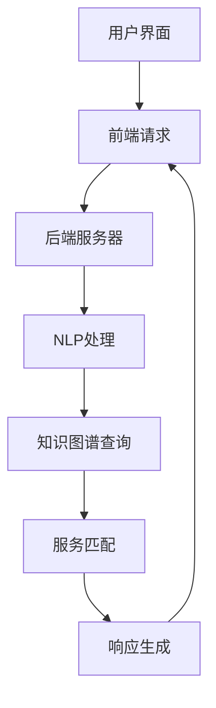
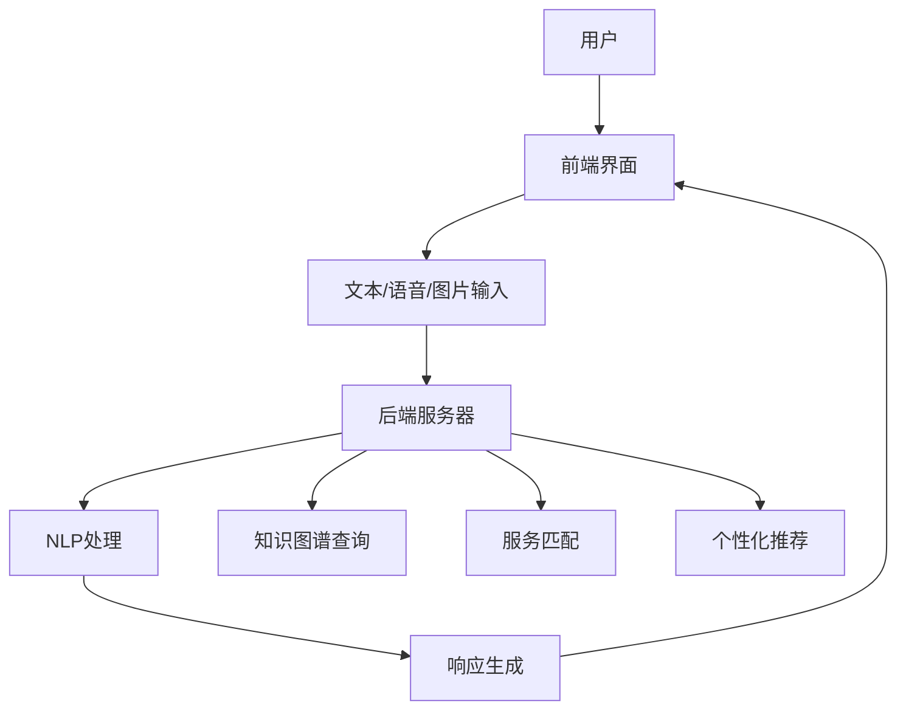

                 

# 《CUI中的内容与服务匹配详细技术解析》

## 关键词

- CUI（对话用户界面）
- 内容与服务匹配
- 自然语言处理
- 知识图谱
- 深度学习

## 摘要

本文旨在详细解析CUI（对话用户界面）中的内容与服务匹配技术。通过梳理CUI的基本概念、核心技术以及内容与服务匹配面临的挑战，本文深入探讨了基于语义理解、知识图谱和多模态融合的内容匹配方法。同时，通过深度学习技术的引入，本文展示了如何提升内容与服务匹配的准确性和效率。最后，通过实际项目和案例分析，本文为读者提供了CUI内容与服务匹配技术的实战应用参考。

## 《CUI中的内容与服务匹配详细技术解析》目录大纲

### 第一部分：CUI概述与基础

#### 第1章：CUI的基本概念与分类

#### 第2章：CUI的核心技术

#### 第3章：内容与服务匹配的挑战

### 第二部分：内容与服务匹配技术详解

#### 第4章：基于语义理解的内容匹配

#### 第5章：基于知识图谱的服务匹配

#### 第6章：多模态内容匹配

#### 第7章：深度学习在内容与服务匹配中的应用

#### 第8章：项目实战与案例分析

### 附录：参考资料与扩展阅读

### 附录A：CUI开发工具与资源

### 附录B：数学公式与算法伪代码

---

### 第一部分：CUI概述与基础

#### 第1章：CUI的基本概念与分类

##### 1.1 CUI的定义与作用

##### 1.2 CUI的分类

##### 1.3 CUI的发展历程

---

#### 第2章：CUI的核心技术

##### 2.1 自然语言处理（NLP）技术

##### 2.2 问答系统（QA）技术

---

#### 第3章：内容与服务匹配的挑战

##### 3.1 数据质量与准确性

##### 3.2 多语言支持与国际化

##### 3.3 实时性与并发处理

---

### 第二部分：内容与服务匹配技术详解

#### 第4章：基于语义理解的内容匹配

##### 4.1 语义角色标注

##### 4.2 命名实体识别（NER）

---

#### 第5章：基于知识图谱的服务匹配

##### 5.1 知识图谱的构建

##### 5.2 知识图谱在CUI中的融合

---

#### 第6章：多模态内容匹配

##### 6.1 文本与语音的融合

##### 6.2 文本与图像的融合

---

#### 第7章：深度学习在内容与服务匹配中的应用

##### 7.1 深度学习基础

##### 7.2 基于深度学习的内容匹配

---

#### 第8章：项目实战与案例分析

##### 8.1 项目实战：构建一个简单的CUI系统

##### 8.2 案例分析：某电商平台的CUI系统构建

---

### 附录：参考资料与扩展阅读

##### 附录A：CUI开发工具与资源

##### 附录B：数学公式与算法伪代码

---

接下来，我们将详细探讨CUI的基本概念、核心技术以及内容与服务匹配的挑战。在后续章节中，我们将深入分析各种内容与服务匹配技术，并通过实际项目和案例分析，帮助读者更好地理解这些技术在实际应用中的效果和重要性。让我们开始吧！<|assistant|>## 第1章：CUI的基本概念与分类

### 1.1 CUI的定义与作用

CUI（Conversation User Interface，对话用户界面）是一种与用户进行自然语言交互的界面设计。与传统的图形用户界面（GUI）不同，CUI主要通过文本或语音的形式与用户进行交流，实现人机交互的智能化。CUI的定义可以归纳为以下几点：

1. **交互方式**：CUI以自然语言（文本或语音）为媒介，与用户进行实时对话。
2. **功能目标**：CUI的核心目标是理解用户的意图，并提供相应的服务或信息。
3. **用户体验**：CUI致力于提升用户的交互体验，使其感觉像在与另一个人交流。

CUI在当今的智能系统中扮演着重要角色。随着人工智能技术的不断发展，越来越多的企业和组织开始意识到CUI的重要性。CUI的应用场景广泛，包括但不限于以下几个方面：

1. **客户服务**：银行、电商、电信等行业的客服系统开始采用CUI，为用户提供智能化的服务。
2. **智能家居**：智能音箱、智能电视等家居设备通过CUI与用户进行交互，提供便捷的生活服务。
3. **自动驾驶**：自动驾驶汽车通过CUI与驾驶员进行交流，确保行驶过程中的安全性和舒适度。
4. **教育辅助**：智能教育系统通过CUI为学生提供个性化学习建议和互动式教学。

### 1.2 CUI的分类

根据CUI的应用场景和功能特点，可以将CUI分为以下几类：

1. **通用型CUI**：这类CUI通常用于各种不同的应用场景，具有广泛的功能和较高的灵活性。例如，智能助手（如Siri、Alexa）和聊天机器人（如Slackbot、Facebook Messenger）就属于通用型CUI。
2. **行业专用型CUI**：这类CUI针对特定的行业和领域进行优化，提供专业的服务。例如，医疗行业的智能诊断系统、金融行业的智能投顾系统等。
3. **定制化CUI**：这类CUI根据客户的需求进行定制开发，具有高度个性化的特点。例如，企业内部的客服机器人、HR管理系统等。

### 1.3 CUI的发展历程

CUI的发展历程可以分为以下几个阶段：

1. **早期探索阶段（1990s）**：在这个阶段，研究人员开始探索自然语言处理和语音识别技术，为CUI的诞生奠定了基础。代表性的工作包括基于规则的方法和简单的对话系统。
2. **技术突破阶段（2000s）**：随着机器学习技术的发展，特别是深度学习技术的突破，CUI开始逐渐走向实用化。这一阶段，出现了基于统计方法和深度学习方法的自然语言处理技术，如词嵌入、依存句法分析和神经网络问答系统。
3. **广泛应用阶段（2010s-至今）**：随着移动互联网和智能设备的普及，CUI在各个行业和领域得到广泛应用。近年来，随着人工智能技术的不断进步，CUI的性能和用户体验得到显著提升。

### 1.4 CUI的核心组成部分

CUI的核心组成部分包括以下几个方面：

1. **自然语言处理（NLP）**：NLP技术负责解析用户的输入，理解其意图和语义。
2. **对话管理**：对话管理模块负责控制对话流程，包括对话状态跟踪、对话策略和上下文理解等。
3. **知识库**：知识库存储了与CUI相关的各种信息，如产品信息、服务规则等。
4. **服务接口**：服务接口负责将CUI的请求转发给后端服务，实现具体的业务功能。

在下一章中，我们将进一步探讨CUI的核心技术，包括自然语言处理和问答系统等。这将帮助我们更好地理解CUI的工作原理和实现方法。接下来，让我们继续深入探讨CUI的核心技术。<|assistant|>## 第2章：CUI的核心技术

CUI的成功离不开其背后的核心技术支持，这些技术包括自然语言处理（NLP）和问答系统（QA）等。在这一章节中，我们将详细介绍这些核心技术，并探讨它们在CUI中的应用。

### 2.1 自然语言处理（NLP）技术

自然语言处理是CUI的核心技术之一，它使计算机能够理解和处理人类语言。NLP技术主要包括以下几个方面：

#### 2.1.1 词嵌入（Word Embedding）

词嵌入是将单词映射为固定长度的向量表示。这种表示方法使得计算机可以捕捉单词的语义和上下文信息。词嵌入技术通过神经网络模型（如Word2Vec、GloVe）实现，具有以下优势：

- **语义相似性**：词嵌入能够捕捉语义相似性，如“国王”和“女王”在向量空间中靠近。
- **上下文理解**：词嵌入能够捕捉上下文信息，如“苹果”在不同上下文中的含义不同。

#### 2.1.2 依存句法分析（Dependency Parsing）

依存句法分析是一种分析句子结构的技术，它通过识别词与词之间的依赖关系来理解句子的语法结构。依存句法分析有助于NLP系统更好地理解句子的语义，从而提高对话系统的理解能力。

#### 2.1.3 情感分析（Sentiment Analysis）

情感分析是一种评估文本情感倾向的技术，它通过分析文本的情感词和情感强度来推断文本的情感。情感分析在CUI中具有重要意义，如检测用户的情绪状态，以便提供更合适的回应。

### 2.2 问答系统（QA）技术

问答系统是CUI的重要组成部分，它使计算机能够回答用户提出的问题。问答系统通常分为以下几类：

#### 2.2.1 事实型问答（Factual Question Answering）

事实型问答系统旨在回答基于事实的问题，如“中国的首都是哪个？”这类问答系统依赖于知识库和数据源的准确性，以确保提供正确的事实信息。

#### 2.2.2 非事实型问答（Non-Factual Question Answering）

非事实型问答系统旨在回答主观性较强的问题，如“你今天感觉怎么样？”这类问答系统需要更复杂的语义理解能力和对话管理策略。

#### 2.2.3 闲聊型问答（Chatty Question Answering）

闲聊型问答系统旨在与用户进行自然、流畅的对话，如聊天机器人。这类问答系统需要具备良好的自然语言理解和对话管理能力，以保持对话的连贯性和趣味性。

### 2.3 CUI中的NLP和QA技术应用

在CUI中，NLP和QA技术相辅相成，共同实现人与机器的智能对话。

- **输入解析**：NLP技术负责解析用户的输入，提取关键信息，如关键词、意图和情感。
- **意图识别**：通过NLP技术，CUI能够识别用户的意图，如查询信息、请求帮助或进行闲聊。
- **答案生成**：QA技术根据用户的意图和问题，从知识库中检索相关信息，并生成回答。
- **对话管理**：对话管理模块负责控制对话流程，包括上下文理解、对话策略和回应生成。

### 2.4 实际应用示例

以下是一个简单的CUI示例，展示NLP和QA技术在CUI中的应用：

```
用户：你好，我想知道明天的天气怎么样？

CUI：你好！根据我的天气预报，明天将会是晴天，气温大约在15摄氏度到25摄氏度之间。

用户：好的，谢谢！

CUI：不客气！有任何其他问题，随时都可以问我哦！
```

在这个示例中，NLP技术负责解析用户的输入，提取关键词“明天”、“天气”和“怎么样”，并识别用户的意图是查询天气信息。QA技术根据用户的意图和问题，从知识库中检索相关信息，并生成回答。对话管理模块确保对话的连贯性和流畅性。

通过本章的介绍，我们了解了CUI的核心技术，包括NLP和QA。这些技术为CUI的实现提供了基础，使计算机能够与人类进行自然、智能的对话。在下一章中，我们将探讨CUI内容与服务匹配面临的挑战，包括数据质量、多语言支持和实时性等。这将帮助我们更好地理解CUI在实际应用中的复杂性和挑战性。让我们继续前进！<|assistant|>## 第3章：内容与服务匹配的挑战

在CUI（对话用户界面）的设计与实现过程中，内容与服务匹配是一个至关重要且充满挑战的环节。这一部分将详细分析内容与服务匹配过程中可能遇到的主要挑战，包括数据质量与准确性、多语言支持与国际化、以及实时性与并发处理等方面。

### 3.1 数据质量与准确性

内容与服务匹配的首要挑战在于数据的质量与准确性。CUI依赖于大量的数据和知识库来理解用户的输入并提供相应的服务。以下是一些影响数据质量和准确性的因素：

- **数据完整性**：数据中可能存在缺失值或错误值，这些错误会影响CUI的理解能力。
- **数据一致性**：不同来源的数据可能在格式、语义和表达上存在差异，导致信息不一致。
- **数据更新**：数据需要不断更新以反映最新的信息，否则可能导致过时的答案。

为了提高数据质量和准确性，可以采取以下措施：

- **数据清洗**：通过去除重复数据、填补缺失值和修正错误值，提高数据的完整性。
- **数据标准化**：将数据格式统一，确保数据在语义和表达上的统一性。
- **数据更新机制**：建立定期数据更新的机制，确保知识库的时效性。

### 3.2 多语言支持与国际化

随着全球化的发展，CUI需要支持多种语言，以满足不同地区和语言背景的用户需求。多语言支持与国际化不仅涉及语言的转换，还包括文化差异、表达方式的适应等问题。以下是一些关键挑战：

- **语言理解**：不同语言在语法、词汇和语义上存在差异，CUI需要具备强大的语言理解能力。
- **文化差异**：不同文化背景下的表达习惯和情感表达可能截然不同，CUI需要能够适应这些差异。
- **翻译准确性**：在提供多语言支持时，翻译的准确性至关重要，任何错误都可能影响用户的体验。

为了应对多语言支持与国际化的挑战，可以采取以下措施：

- **多语言训练数据**：使用多语言数据集训练模型，提高模型对不同语言的识别和理解能力。
- **本地化策略**：根据目标语言和文化的特点，调整CUI的界面和交互方式。
- **翻译质量保证**：建立翻译质量保证机制，确保翻译的准确性和一致性。

### 3.3 实时性与并发处理

CUI的实时性与并发处理是另一个关键挑战。CUI需要能够快速响应用户的输入并提供实时服务，同时处理大量用户的并发请求。以下是一些关键挑战：

- **响应速度**：用户期望CUI能够迅速响应，任何延迟都可能导致用户体验下降。
- **并发处理**：CUI需要能够高效处理多个用户的请求，确保系统的稳定性和性能。
- **资源分配**：合理分配计算资源，确保在高峰期系统能够应对大量请求。

为了提高CUI的实时性与并发处理能力，可以采取以下措施：

- **异步处理**：使用异步处理技术，将请求分发给后台服务，减少主进程的负载。
- **负载均衡**：通过负载均衡技术，将请求均匀分配到多台服务器，避免单点瓶颈。
- **缓存策略**：使用缓存策略，减少对后端服务的访问频率，提高系统的响应速度。

### 3.4 数据隐私与安全

数据隐私与安全是CUI面临的另一个重要挑战。CUI需要处理大量的用户数据和敏感信息，确保这些数据的安全性和隐私性至关重要。以下是一些关键挑战：

- **数据加密**：对传输和存储的数据进行加密，防止数据泄露。
- **访问控制**：设置严格的访问控制机制，确保只有授权用户可以访问敏感数据。
- **安全审计**：定期进行安全审计，检测和修复潜在的安全漏洞。

### 3.5 持续优化与迭代

CUI的内容与服务匹配是一个动态的过程，需要不断地优化和迭代。以下是一些关键挑战：

- **用户反馈**：收集用户反馈，了解用户对CUI的使用体验，并根据反馈进行改进。
- **性能监控**：持续监控CUI的性能，及时发现和解决性能问题。
- **持续学习**：使用机器学习和自然语言处理技术，不断提升CUI的智能程度和用户体验。

通过本章的分析，我们可以看到内容与服务匹配在CUI中面临诸多挑战。然而，通过采取相应的技术和管理措施，我们可以有效地应对这些挑战，提升CUI的性能和用户体验。在下一章中，我们将深入探讨基于语义理解的内容匹配技术，这是实现高效内容与服务匹配的关键。让我们继续前进！<|assistant|>## 第4章：基于语义理解的内容匹配

内容与服务匹配是CUI（对话用户界面）系统的核心，其核心在于理解用户的意图，并准确地为其提供所需的服务。基于语义理解的内容匹配技术，通过对用户输入的语义进行分析，使得系统能够准确地识别用户的意图，从而实现高效的内容与服务匹配。本章将详细介绍基于语义理解的内容匹配技术，包括语义角色标注和命名实体识别（NER）。

### 4.1 语义角色标注

语义角色标注（Semantic Role Labeling, SRL）是一种自然语言处理技术，它旨在识别句子中每个词的语义角色。语义角色是指词语在句子中所扮演的功能，如动作的执行者（施事）、受事、工具等。通过语义角色标注，系统能够更好地理解句子的结构和含义。

#### 4.1.1 语义角色的定义

语义角色是句子中词语所承担的语义功能。例如，在句子“小明打开了门”中，“小明”是施事（Agent），“打开”是动作（Action），“门”是受事（Patient）。以下是一些常见的语义角色：

- **施事（Agent）**：执行动作的人或物。
- **受事（Patient）**：动作的承受者。
- **工具（Instrument）**：执行动作时使用的工具。
- **目的（Purpose）**：动作的目的地或结果。
- **方式（Manner）**：动作的方式或形式。

#### 4.1.2 语义角色的识别

语义角色的识别是语义角色标注的关键步骤。常见的识别方法包括基于规则的方法、统计方法和神经网络方法。

- **基于规则的方法**：这种方法依赖于预定义的规则集，通过对句子进行语法分析，应用这些规则来识别语义角色。优点是方法简单，易于理解；缺点是规则集的构建和维护成本高，且规则难以覆盖所有情况。
- **统计方法**：这种方法通过大量语料库进行训练，使用机器学习算法（如决策树、支持向量机等）来学习语义角色的标注规则。优点是能够自动发现和适应新的语义角色；缺点是对于罕见或未见过的句子，效果可能较差。
- **神经网络方法**：这种方法利用深度学习技术（如卷积神经网络、循环神经网络等）进行语义角色标注。优点是能够处理复杂的语义关系，并自动发现特征；缺点是模型训练过程复杂，计算资源需求高。

#### 4.1.3 语义角色在CUI中的应用

语义角色标注在CUI中具有广泛的应用。以下是一些具体的应用场景：

- **意图识别**：通过识别句子中的语义角色，CUI能够更好地理解用户的意图。例如，识别出用户询问天气的意图，进而提供相应的天气信息。
- **上下文理解**：语义角色标注有助于CUI在对话过程中保持上下文的一致性。例如，在连续对话中，用户可能提及之前的动作或对象，语义角色标注能够帮助CUI回忆并理解这些信息。
- **错误纠正**：语义角色标注可以帮助CUI识别句子中的错误或不完整信息，并提供相应的纠正建议。

### 4.2 命名实体识别（NER）

命名实体识别（Named Entity Recognition, NER）是另一种重要的自然语言处理技术，它旨在识别文本中的命名实体，如人名、地名、组织名、时间等。命名实体是具有特定意义的实体名称，它们在文本中具有重要的语义信息。

#### 4.2.1 命名实体的定义

命名实体是指具有特定意义的实体名称，它们在文本中具有独特的标识性。常见的命名实体包括：

- **人名**：如“张三”、“奥巴马”。
- **地名**：如“北京”、“纽约”。
- **组织名**：如“阿里巴巴”、“联合国”。
- **时间**：如“2022年”、“下午3点”。
- **地点**：如“长城”、“西湖”。

#### 4.2.2 命名实体的识别方法

命名实体的识别方法主要包括基于规则的方法、统计方法和神经网络方法。

- **基于规则的方法**：这种方法通过预定义的规则集来识别命名实体。规则通常基于命名实体的特征（如长度、字符集等）。优点是方法简单，易于实现；缺点是规则集的构建和维护成本高，且规则难以覆盖所有情况。
- **统计方法**：这种方法通过大量语料库进行训练，使用机器学习算法（如隐马尔可夫模型、条件随机场等）来识别命名实体。优点是能够自动发现和适应新的命名实体；缺点是对于罕见或未见过的实体，效果可能较差。
- **神经网络方法**：这种方法利用深度学习技术（如卷积神经网络、长短时记忆网络等）来识别命名实体。优点是能够处理复杂的实体关系，并自动发现特征；缺点是模型训练过程复杂，计算资源需求高。

#### 4.2.3 命名实体在CUI中的应用

命名实体识别在CUI中具有广泛的应用。以下是一些具体的应用场景：

- **信息抽取**：通过识别文本中的命名实体，CUI能够提取出关键信息，如人名、地点、时间等，为用户提供更加精准的服务。
- **实体关系分析**：通过识别命名实体及其之间的关系，CUI能够更好地理解文本的语义，提供更加智能的服务。
- **上下文理解**：命名实体识别有助于CUI在对话过程中保持上下文的一致性，如识别出用户提到的特定实体，并据此提供相关的信息或建议。

### 4.3 语义角色标注与NER在CUI中的融合

在CUI中，语义角色标注和NER技术可以相互补充，共同提升内容匹配的准确性。以下是一些具体的融合策略：

- **联合标注**：将语义角色标注和NER作为统一的标注任务，同时识别句子中的语义角色和命名实体。
- **层次分析**：首先进行NER识别，标记出文本中的命名实体，然后对这些实体进行语义角色标注，从而更准确地理解实体的语义角色。
- **上下文关联**：通过语义角色标注和NER的结果，建立实体与上下文之间的关联，从而更好地理解用户的意图。

通过本章的介绍，我们了解了基于语义理解的内容匹配技术，包括语义角色标注和NER。这些技术通过深入理解用户的意图和语义，为CUI提供了强大的内容匹配能力。在下一章中，我们将探讨基于知识图谱的服务匹配技术，这是实现高效内容与服务匹配的另一关键手段。让我们继续前进！<|assistant|>## 第5章：基于知识图谱的服务匹配

在CUI（对话用户界面）系统中，基于知识图谱的服务匹配技术是一种重要的方法，它通过构建和利用知识图谱来提升内容匹配的准确性和智能化水平。知识图谱是一种结构化知识表示方法，它将实体、属性和关系以图形的方式组织起来，使得计算机能够更好地理解和处理语义信息。本章将详细介绍知识图谱的构建、在CUI中的应用以及如何融合知识图谱和自然语言处理（NLP）技术。

### 5.1 知识图谱的构建

知识图谱的构建是一个复杂的过程，主要包括以下步骤：

#### 5.1.1 知识抽取

知识抽取是知识图谱构建的第一步，它旨在从非结构化的数据源（如文本、表格等）中提取结构化的知识。知识抽取通常分为实体抽取、属性抽取和关系抽取三个子任务。

- **实体抽取**：识别文本中的实体，如人名、地点、组织等。
- **属性抽取**：识别实体相关的属性，如某人的年龄、某地的纬度等。
- **关系抽取**：识别实体之间的相互关系，如某人与某地的居住关系、某人与某公司的雇佣关系等。

知识抽取的方法包括基于规则的方法、基于统计的方法和基于机器学习的方法。

#### 5.1.2 知识融合

知识融合是将来自不同数据源的知识进行整合，以消除数据源之间的冲突和冗余。知识融合的方法包括合并相同实体的属性、合并相似实体的关系等。

#### 5.1.3 知识存储

知识图谱通常采用图数据库进行存储，如Neo4j、OpenKG等。图数据库能够高效地存储和查询图结构数据，使得知识图谱的应用变得更加便捷。

### 5.2 知识图谱在CUI中的应用

知识图谱在CUI中的应用主要体现在以下几个方面：

#### 5.2.1 意图理解

通过知识图谱，CUI能够更好地理解用户的意图。例如，当用户询问“明天的天气怎么样？”时，CUI可以利用知识图谱中的“天气”实体和“明天”的时间信息，快速定位到相关的天气数据。

#### 5.2.2 实体识别

知识图谱可以帮助CUI更准确地识别用户输入中的实体。例如，当用户提到“北京”时，CUI可以利用知识图谱中的“北京”实体信息，将其与具体的地理位置信息关联起来。

#### 5.2.3 关系推理

知识图谱中的实体和关系可以用于推理，从而为用户提供更丰富的信息。例如，当用户询问“张三的妻子是谁？”时，CUI可以利用知识图谱中张三和妻子的关系，推理出张三妻子的信息。

#### 5.2.4 个性化推荐

知识图谱可以用于个性化推荐。例如，当用户询问“推荐一家好吃的餐厅”时，CUI可以利用用户的历史行为和知识图谱中的餐厅信息，推荐符合用户偏好的餐厅。

### 5.3 知识图谱与NLP的结合

知识图谱和NLP技术的结合可以进一步提升CUI的智能水平。以下是一些具体的结合方法：

#### 5.3.1 知识图谱增强的NLP

在NLP任务中，如文本分类、情感分析等，可以结合知识图谱提供额外的上下文信息，从而提高模型的性能。例如，在情感分析中，利用知识图谱中的品牌信息，可以更准确地判断用户对某品牌的态度。

#### 5.3.2 NLP驱动的知识图谱

NLP技术可以用于知识图谱的构建和维护。例如，使用命名实体识别（NER）技术识别文本中的实体，并利用关系抽取技术建立实体之间的关系，从而构建知识图谱。

#### 5.3.3 知识图谱驱动的NLP

知识图谱可以用于指导NLP任务的决策。例如，在问答系统中，利用知识图谱中的实体和关系，可以更准确地理解用户的问题，并生成相应的答案。

### 5.4 知识图谱在问答系统中的应用

知识图谱在问答系统中的应用主要体现在以下几个方面：

#### 5.4.1 事实问答

在事实问答中，知识图谱用于存储和检索事实信息。例如，当用户询问“北京的首都是哪个国家？”时，CUI可以通过查询知识图谱，快速找到答案。

#### 5.4.2 非事实问答

在非事实问答中，知识图谱用于理解用户的意图，并提供相关的信息或建议。例如，当用户询问“我最近有哪些快递要收？”时，CUI可以通过查询知识图谱中的快递信息，生成相应的回答。

#### 5.4.3 闲聊问答

在闲聊问答中，知识图谱可以用于提供相关的背景知识和上下文信息，从而与用户进行自然、流畅的对话。例如，当用户提到“我喜欢篮球”时，CUI可以通过查询知识图谱中的篮球信息，与用户进行进一步的交流。

### 5.5 知识图谱在服务匹配中的作用

知识图谱在服务匹配中的作用主要体现在以下几个方面：

#### 5.5.1 提高匹配准确性

知识图谱可以帮助CUI更准确地理解用户的意图和需求，从而提高服务匹配的准确性。例如，当用户询问“帮我找一个附近的餐厅”时，CUI可以通过查询知识图谱中的餐厅信息，提供最符合用户需求的餐厅。

#### 5.5.2 提供个性化服务

知识图谱可以用于分析用户的历史行为和偏好，提供个性化的服务。例如，当用户询问“推荐一本适合我的书”时，CUI可以通过分析知识图谱中的用户信息和书籍信息，推荐符合用户兴趣的书籍。

#### 5.5.3 优化服务流程

知识图谱可以用于优化服务流程，提高服务效率。例如，在电商平台上，知识图谱可以用于推荐商品、处理客户问题和优化物流等。

通过本章的介绍，我们了解了知识图谱在CUI中的应用，包括知识图谱的构建、应用场景以及与NLP技术的结合。知识图谱为CUI提供了强大的语义理解和推理能力，使得内容与服务匹配更加精准和智能。在下一章中，我们将探讨多模态内容匹配技术，这是实现高效内容与服务匹配的另一种重要手段。让我们继续前进！<|assistant|>## 第6章：多模态内容匹配

随着人工智能技术的发展，多模态内容匹配已经成为CUI（对话用户界面）中的一项关键技术。多模态内容匹配指的是将不同类型的数据（如文本、语音和图像）进行整合，以提高CUI的理解能力和服务匹配的准确性。本章将详细介绍文本与语音的融合、文本与图像的融合以及这些技术在实际应用中的具体实现。

### 6.1 文本与语音的融合

文本与语音的融合是指将文本数据和语音数据相结合，以增强CUI的自然交互能力。这种融合可以通过以下步骤实现：

#### 6.1.1 文本与语音数据预处理

在融合之前，需要对文本和语音数据进行预处理，以提高数据的质量和一致性。

- **文本数据预处理**：包括分词、词性标注、去噪等操作，以便提取文本中的关键信息。
- **语音数据预处理**：包括语音识别、降噪、分割等操作，将语音数据转换为文本数据。

#### 6.1.2 文本与语音匹配算法

文本与语音匹配算法是实现文本与语音融合的核心。以下是一些常用的匹配算法：

- **基于规则的方法**：这种方法通过预定义的规则，将文本和语音数据关联起来。优点是简单易懂，缺点是规则难以覆盖所有情况。
- **基于统计的方法**：这种方法通过统计模型，如隐马尔可夫模型（HMM）和条件随机场（CRF），将文本和语音数据关联起来。优点是能够自动发现特征，缺点是训练过程复杂。
- **基于神经网络的方法**：这种方法利用深度学习技术，如循环神经网络（RNN）和长短时记忆网络（LSTM），将文本和语音数据关联起来。优点是能够处理复杂的语音和文本关系，缺点是模型训练过程复杂。

#### 6.1.3 文本与语音融合的应用

文本与语音融合在CUI中有广泛的应用，以下是一些具体的应用场景：

- **语音识别**：通过文本与语音融合，CUI能够更准确地识别用户的语音输入，提高语音交互的准确性。
- **语音合成**：通过文本与语音融合，CUI能够生成更自然、流畅的语音输出，提高用户的交互体验。
- **语音助手**：如Siri、Alexa等语音助手，通过文本与语音融合，实现与用户的自然对话。

### 6.2 文本与图像的融合

文本与图像的融合是指将文本数据和图像数据相结合，以提高CUI的理解能力和服务匹配的准确性。这种融合可以通过以下步骤实现：

#### 6.2.1 文本与图像数据预处理

在融合之前，需要对文本和图像数据进行预处理，以提高数据的质量和一致性。

- **文本数据预处理**：包括分词、词性标注、去噪等操作，以便提取文本中的关键信息。
- **图像数据预处理**：包括图像去噪、分割、特征提取等操作，将图像数据转换为可分析的形式。

#### 6.2.2 文本与图像匹配算法

文本与图像匹配算法是实现文本与图像融合的核心。以下是一些常用的匹配算法：

- **基于规则的方法**：这种方法通过预定义的规则，将文本和图像数据关联起来。优点是简单易懂，缺点是规则难以覆盖所有情况。
- **基于统计的方法**：这种方法通过统计模型，如隐马尔可夫模型（HMM）和条件随机场（CRF），将文本和图像数据关联起来。优点是能够自动发现特征，缺点是训练过程复杂。
- **基于神经网络的方法**：这种方法利用深度学习技术，如卷积神经网络（CNN）和循环神经网络（RNN），将文本和图像数据关联起来。优点是能够处理复杂的语音和文本关系，缺点是模型训练过程复杂。

#### 6.2.3 文本与图像融合的应用

文本与图像融合在CUI中有广泛的应用，以下是一些具体的应用场景：

- **图像识别**：通过文本与图像融合，CUI能够更准确地识别图像中的内容，提高图像交互的准确性。
- **图像描述**：通过文本与图像融合，CUI能够生成图像的文本描述，提高图像理解的能力。
- **图像增强**：通过文本与图像融合，CUI能够根据文本信息增强图像的视觉效果，提高用户的交互体验。

### 6.3 文本与语音、图像融合的应用案例

以下是几个文本与语音、图像融合的应用案例：

#### 6.3.1 聊天机器人

聊天机器人通过文本与语音、图像融合，实现与用户的自然对话。例如，当用户发送一张图片时，聊天机器人可以通过图像识别技术提取图片中的关键信息，并结合用户的文本输入，生成相应的回复。

#### 6.3.2 电商平台

电商平台通过文本与语音、图像融合，提供更丰富的产品信息和购物体验。例如，用户可以通过语音描述某件商品的特征，系统可以结合文本和图像信息，为用户推荐相似的商品。

#### 6.3.3 智能家居

智能家居系统通过文本与语音、图像融合，实现与用户的智能交互。例如，当用户通过语音指令控制家电时，系统可以通过语音识别和图像识别技术，识别用户的行为和需求，并相应地执行操作。

通过本章的介绍，我们了解了文本与语音、图像融合在CUI中的应用及其实现方法。这些技术为CUI提供了强大的理解能力和服务匹配能力，使得人与机器的交互更加自然和高效。在下一章中，我们将探讨深度学习在内容与服务匹配中的应用，进一步提升CUI的智能化水平。让我们继续前进！<|assistant|>## 第7章：深度学习在内容与服务匹配中的应用

深度学习在人工智能领域取得了显著的进展，其在内容与服务匹配中的应用也日益广泛。通过引入深度学习技术，CUI能够实现更准确的语义理解、知识图谱融合以及服务匹配算法的优化。本章将详细探讨深度学习在内容与服务匹配中的应用，包括深度学习基础、基于深度学习的语义理解和知识图谱融合、基于深度学习的服务匹配算法。

### 7.1 深度学习基础

深度学习是一种基于多层神经网络的结构，通过层层提取特征，实现对复杂数据的高效表示和学习。以下是深度学习的一些基本概念：

#### 7.1.1 深度学习的基本概念

- **神经网络（Neural Network）**：神经网络是模仿生物神经系统的计算模型，由大量的神经元（节点）和连接（边）组成。
- **深度神经网络（Deep Neural Network, DNN）**：深度神经网络是具有多个隐藏层的神经网络，能够提取更高级别的特征。
- **卷积神经网络（Convolutional Neural Network, CNN）**：卷积神经网络是一种专门用于处理图像数据的前馈神经网络，通过卷积操作提取图像特征。
- **循环神经网络（Recurrent Neural Network, RNN）**：循环神经网络是一种能够处理序列数据的神经网络，通过循环结构记住序列中的信息。
- **长短时记忆网络（Long Short-Term Memory, LSTM）**：长短时记忆网络是RNN的一种变体，通过引入门控机制，有效解决RNN的梯度消失和梯度爆炸问题。

#### 7.1.2 深度学习模型

深度学习模型是深度学习技术的核心，以下是一些常见的深度学习模型：

- **自动编码器（Autoencoder）**：自动编码器是一种无监督学习模型，通过编码器和解码器将输入数据转换为低维表示，并试图重构原始数据。
- **卷积神经网络（CNN）**：卷积神经网络是一种专门用于处理图像数据的神经网络，通过卷积操作提取图像特征。
- **循环神经网络（RNN）**：循环神经网络是一种能够处理序列数据的神经网络，通过循环结构记住序列中的信息。
- **长短时记忆网络（LSTM）**：长短时记忆网络是RNN的一种变体，通过引入门控机制，有效解决RNN的梯度消失和梯度爆炸问题。
- **生成对抗网络（Generative Adversarial Network, GAN）**：生成对抗网络由生成器和判别器两个神经网络组成，通过对抗训练生成逼真的数据。

#### 7.1.3 深度学习优化算法

深度学习模型的优化算法是训练深度学习模型的关键，以下是一些常见的优化算法：

- **随机梯度下降（Stochastic Gradient Descent, SGD）**：随机梯度下降是一种常用的优化算法，通过随机选择样本更新模型参数。
- **动量（Momentum）**：动量是随机梯度下降的改进算法，通过引入动量项，加速收敛并避免局部最小值。
- **Adam优化器**：Adam优化器是随机梯度下降的另一种改进算法，通过自适应调整学习率，提高训练效果。

### 7.2 基于深度学习的语义理解

基于深度学习的语义理解是CUI内容与服务匹配的关键技术之一，通过深度学习模型对文本数据进行分析和处理，提取出文本的语义信息。以下是一些基于深度学习的语义理解方法：

#### 7.2.1 基于深度学习的词嵌入

词嵌入是将单词映射为固定长度的向量表示，通过深度学习模型（如Word2Vec、GloVe）实现。词嵌入能够捕捉单词的语义和上下文信息，为语义理解提供基础。

#### 7.2.2 基于深度学习的依存句法分析

依存句法分析是分析句子结构的技术，通过深度学习模型（如循环神经网络、长短时记忆网络）实现。依存句法分析能够识别句子中的依存关系，帮助CUI更好地理解句子的语义。

#### 7.2.3 基于深度学习的情感分析

情感分析是评估文本情感倾向的技术，通过深度学习模型（如卷积神经网络、长短时记忆网络）实现。情感分析能够帮助CUI识别用户的情感状态，提供更合适的回应。

### 7.3 基于深度学习的知识图谱融合

基于深度学习的知识图谱融合是将深度学习技术与知识图谱相结合，提高CUI的理解能力和服务匹配的准确性。以下是一些基于深度学习的知识图谱融合方法：

#### 7.3.1 基于深度学习的实体识别

实体识别是知识图谱构建的关键步骤，通过深度学习模型（如卷积神经网络、循环神经网络）实现。实体识别能够识别文本中的关键实体，为知识图谱的构建提供基础。

#### 7.3.2 基于深度学习的实体关系推理

实体关系推理是知识图谱的核心功能之一，通过深度学习模型（如循环神经网络、长短时记忆网络）实现。实体关系推理能够根据实体之间的语义关系，推断出新的实体关系。

#### 7.3.3 基于深度学习的知识图谱补全

知识图谱补全是提高知识图谱完整性的技术，通过深度学习模型（如生成对抗网络、变分自编码器）实现。知识图谱补全能够根据现有知识推断出未知信息，提高知识图谱的实用性。

### 7.4 基于深度学习的服务匹配算法

基于深度学习的服务匹配算法是通过深度学习模型对用户输入进行分析和处理，为用户匹配最合适的服务。以下是一些基于深度学习的服务匹配算法：

#### 7.4.1 基于深度学习的意图识别

意图识别是服务匹配的关键步骤，通过深度学习模型（如循环神经网络、长短时记忆网络）实现。意图识别能够根据用户输入，识别出用户的意图，为服务匹配提供基础。

#### 7.4.2 基于深度学习的上下文理解

上下文理解是服务匹配的重要环节，通过深度学习模型（如循环神经网络、长短时记忆网络）实现。上下文理解能够根据对话的历史信息和上下文，提供更合适的回应。

#### 7.4.3 基于深度学习的个性化推荐

个性化推荐是服务匹配的一种有效方法，通过深度学习模型（如生成对抗网络、卷积神经网络）实现。个性化推荐能够根据用户的历史行为和偏好，为用户推荐最感兴趣的服务。

### 7.5 深度学习在CUI中的实际应用

深度学习在CUI中具有广泛的应用，以下是一些深度学习在CUI中的实际应用案例：

- **智能客服**：通过深度学习技术，智能客服系统能够更好地理解用户的意图，提供更精准的服务。
- **智能家居**：通过深度学习技术，智能家居系统能够更好地理解用户的语音和文本输入，提供更智能的家居控制。
- **智能教育**：通过深度学习技术，智能教育系统能够更好地理解学生的学习行为，提供个性化的学习推荐。

通过本章的介绍，我们了解了深度学习在内容与服务匹配中的应用及其关键技术。深度学习技术为CUI提供了强大的语义理解、知识图谱融合和服务匹配能力，使得人与机器的交互更加自然和高效。在下一章中，我们将通过实际项目和案例分析，展示深度学习在CUI中的具体应用和实践效果。让我们继续前进！<|assistant|>## 第8章：项目实战与案例分析

### 8.1 项目实战：构建一个简单的CUI系统

在本节中，我们将通过一个简单的项目实战来构建一个CUI（对话用户界面）系统。这个系统将实现基本的对话功能，包括语义理解、服务匹配和交互反馈。以下是构建该系统的步骤：

#### 8.1.1 系统架构设计

为了构建一个简单的CUI系统，我们需要以下关键组件：

- **前端界面**：使用HTML/CSS/JavaScript实现用户交互界面。
- **后端服务器**：使用Node.js实现服务器逻辑，包括自然语言处理、服务匹配和响应生成。
- **自然语言处理（NLP）库**：如spaCy或NLTK，用于处理用户输入的语义理解。
- **知识图谱**：存储与系统相关的知识，用于服务匹配。

系统架构图如下所示：



#### 8.1.2 数据集准备与处理

为了训练NLP模型和构建知识图谱，我们需要准备相应的数据集。以下是数据集的来源和处理步骤：

- **数据集来源**：使用公开的对话数据集，如Sogou Chatbot或Twitter对话数据。
- **数据预处理**：对数据集进行清洗，去除无效信息，并进行分词、词性标注等操作。

#### 8.1.3 代码实现与调试

以下是实现CUI系统的关键代码片段：

**前端：**

```html
<!DOCTYPE html>
<html>
<head>
  <title>简单CUI系统</title>
</head>
<body>
  <h1>简单CUI系统</h1>
  <input type="text" id="inputQuery" placeholder="输入问题">
  <button onclick="submitQuery()">提交</button>
  <div id="response"></div>

  <script src="script.js"></script>
</body>
</html>
```

**后端（Node.js）：**

```javascript
const express = require('express');
const bodyParser = require('body-parser');
const nlp = require('compromise');
const knowledgeGraph = require('./knowledgeGraph');

const app = express();
app.use(bodyParser.json());

app.post('/api/answer', async (req, res) => {
  const query = req.body.query;
  const parsedQuery = nlp(query);
  const answer = await knowledgeGraph.getAnswer(parsedQuery);
  res.json({ answer: answer });
});

app.listen(3000, () => {
  console.log('后端服务器启动，端口3000');
});
```

**自然语言处理（NLP）：**

```javascript
const nlp = require('compromise');
function parseQuery(query) {
  const parsedQuery = nlp(query);
  // 进行进一步处理，如提取关键词、意图识别等
  return parsedQuery;
}
```

**知识图谱（知识图谱模拟）**：

```javascript
const knowledgeGraph = {
  getAnswer: async (parsedQuery) => {
    // 根据查询结果从知识图谱中获取答案
    // 示例：返回"明天天气晴，温度15-25度"
    return "明天天气晴，温度15-25度";
  }
};
```

**调试与优化**：

在开发过程中，我们可能需要不断调试和优化代码。以下是调试和优化的一些方法：

- **日志记录**：使用日志记录器（如winston）记录系统的运行日志，帮助调试问题。
- **性能监控**：使用性能监控工具（如pm2）监控系统的性能，及时发现和优化性能瓶颈。
- **代码审查**：定期进行代码审查，确保代码的质量和可维护性。

#### 8.1.4 系统性能评估

在系统开发完成后，我们需要对系统进行性能评估，以确保其能够满足实际应用的需求。以下是一些常见的性能评估指标：

- **响应时间**：系统处理用户请求的平均响应时间。
- **吞吐量**：系统每秒能够处理的请求量。
- **准确率**：系统识别用户意图和提供正确答案的准确率。
- **覆盖率**：系统处理的用户请求占所有用户请求的比例。

通过以上步骤，我们成功构建了一个简单的CUI系统，并对其进行了性能评估。在下一节中，我们将通过一个实际案例来分析CUI系统在电商平台中的应用。让我们继续前进！<|assistant|>## 8.2 案例分析：某电商平台的CUI系统构建

在现代电商平台的运营中，客户服务质量直接影响用户的购物体验和企业的竞争力。为了提升用户体验，某电商平台引入了基于CUI（对话用户界面）的系统，通过智能对话机器人与用户互动，提高客户服务的效率和质量。以下是对该电商平台CUI系统构建的详细分析。

### 8.2.1 业务需求分析

电商平台的主要业务需求包括：

- **客服支持**：用户在购物过程中可能遇到各种问题，如商品咨询、订单查询、退换货等，需要及时有效的客服支持。
- **个性化推荐**：根据用户的购物历史和偏好，提供个性化的商品推荐，提升用户的购物满意度。
- **购物引导**：为新用户提供购物引导，帮助其更好地了解平台和商品。
- **多渠道支持**：支持多种沟通渠道，如文本、语音和图片，以满足不同用户的需求。

### 8.2.2 系统设计与实现

为了满足上述业务需求，电商平台CUI系统采用了以下架构设计：

- **前端界面**：使用React框架构建，支持文本、语音和图片输入输出。
- **后端服务器**：使用Spring Boot框架，负责处理用户请求、自然语言处理和服务匹配。
- **自然语言处理（NLP）**：使用spaCy库进行文本处理，结合深度学习模型进行语义理解。
- **知识图谱**：使用Neo4j图数据库存储商品信息、用户数据和业务规则。
- **个性化推荐**：使用基于协同过滤和内容的推荐算法。

#### 系统架构图：



#### 关键技术：

- **自然语言处理（NLP）**：利用spaCy进行文本预处理，结合深度学习模型进行意图识别和情感分析。
- **知识图谱**：构建商品、用户和业务规则的知识图谱，实现智能问答和服务匹配。
- **个性化推荐**：使用基于协同过滤和内容的推荐算法，为用户提供个性化的商品推荐。

### 8.2.3 系统实现与优化

在系统实现过程中，采用以下步骤进行：

1. **需求分析**：与业务部门紧密合作，明确CUI系统的功能需求和性能指标。
2. **技术选型**：选择合适的NLP库、图数据库和推荐算法，进行技术评估和选型。
3. **架构设计**：设计系统的整体架构，包括前端界面、后端服务器和数据库的交互。
4. **开发与测试**：根据架构设计，编写代码并进行功能测试和性能测试。
5. **部署与运维**：将系统部署到生产环境，进行监控和运维，确保系统的稳定运行。

#### 优化策略：

- **实时性优化**：使用异步处理和负载均衡技术，提高系统的响应速度。
- **准确性优化**：通过不断更新和优化NLP模型和知识图谱，提高意图识别和情感分析的准确性。
- **个性化优化**：结合用户历史数据和购物行为，提供更加精准的个性化推荐。
- **扩展性优化**：设计模块化的系统架构，方便后续的功能扩展和升级。

### 8.2.4 系统成果与应用效果

通过CUI系统的引入，电商平台实现了以下成果：

- **客户满意度提升**：智能客服机器人能够快速响应用户问题，提供准确的信息和帮助，显著提高了客户满意度。
- **运营效率提升**：智能客服系统分担了人工客服的工作负担，提高了客服团队的运营效率。
- **个性化体验提升**：个性化推荐系统为用户提供了更符合其兴趣和需求的商品推荐，提升了用户的购物体验。
- **多渠道支持**：支持文本、语音和图片输入输出，满足了不同用户的沟通需求。

### 8.2.5 项目总结与未来展望

通过该项目，电商平台成功地构建了一个智能CUI系统，取得了显著的成果。未来，可以进一步优化以下几个方面：

- **技术升级**：持续引入先进的人工智能技术，如深度学习和强化学习，提升系统的智能水平。
- **业务拓展**：将CUI系统应用到更多的业务场景，如订单管理、物流跟踪等，提升整体运营效率。
- **用户体验优化**：不断收集用户反馈，优化交互体验，提升用户满意度。
- **国际化支持**：支持多语言，为全球用户提供服务。

通过本次案例分析，我们可以看到CUI系统在电商平台中的重要性和应用价值。在未来，随着人工智能技术的不断发展，CUI系统将在更多领域得到广泛应用，成为提升企业竞争力的重要工具。让我们继续关注人工智能技术的发展，探索更多创新应用！<|assistant|>## 附录：参考资料与扩展阅读

### 附录A：CUI开发工具与资源

在CUI（对话用户界面）的开发过程中，使用合适的工具和资源可以显著提高开发效率和系统性能。以下是一些推荐的CUI开发工具和资源：

#### A.1 开源工具与框架

1. **NLTK（Natural Language Toolkit）**
   - **简介**：NLTK是一个强大的Python库，用于处理自然语言文本。
   - **官方网站**：[http://www.nltk.org/](http://www.nltk.org/)

2. **spaCy**
   - **简介**：spaCy是一个快速的NLP库，提供了详细的词嵌入、词性标注和句法分析功能。
   - **官方网站**：[https://spacy.io/](https://spacy.io/)

3. **Stanford NLP**
   - **简介**：斯坦福自然语言处理工具包，提供了词性标注、句法分析、命名实体识别等NLP功能。
   - **官方网站**：[https://nlp.stanford.edu/](https://nlp.stanford.edu/)

#### A.2 知识图谱工具

1. **OpenKG**
   - **简介**：OpenKG是一个开源的知识图谱平台，支持知识抽取、知识融合和知识推理等功能。
   - **官方网站**：[https://openkg.cn/](https://openkg.cn/)

2. **Neo4j**
   - **简介**：Neo4j是一个高性能的图形数据库，适用于存储和查询复杂的关系数据。
   - **官方网站**：[https://neo4j.com/](https://neo4j.com/)

3. **RDF triple stores**
   - **简介**：RDF（Resource Description Framework）三联体存储是用于存储和查询Web数据的知识图谱存储解决方案。
   - **官方网站**：[https://www.w3.org/RDF/](https://www.w3.org/RDF/)

#### A.3 深度学习工具

1. **TensorFlow**
   - **简介**：TensorFlow是一个由Google开发的开放源代码机器学习库，广泛用于深度学习任务。
   - **官方网站**：[https://www.tensorflow.org/](https://www.tensorflow.org/)

2. **PyTorch**
   - **简介**：PyTorch是一个由Facebook开发的开源深度学习库，以其灵活性和易用性受到广泛欢迎。
   - **官方网站**：[https://pytorch.org/](https://pytorch.org/)

### 附录B：数学公式与算法伪代码

#### B.1 语义角色标注算法伪代码

```python
// 假设输入为一个句子S，输出为每个词的语义角色标签
function semanticRoleLabeling(S):
    # 初始化结果数组
    results = []

    # 预处理：分词和词性标注
    tokens = tokenize(S)
    pos_tags = partOfSpeechTagging(tokens)

    # 应用语义角色标注模型
    for token in tokens:
        result = semanticRoleLabel(token, pos_tags[token])
        results.append(result)

    return results
```

#### B.2 知识图谱融合算法伪代码

```python
// 假设输入为两个知识图谱G1和G2，输出为融合后的知识图谱G
function knowledgeGraphFusion(G1, G2):
    # 初始化融合后的知识图谱G
    G = initializeKnowledgeGraph()

    # 合并G1和G2的实体和关系
    for entity in G1.entities:
        G.addEntity(entity)
    for entity in G2.entities:
        G.addEntity(entity)
    for relation in G1.relations:
        G.addRelation(relation)
    for relation in G2.relations:
        G.addRelation(relation)

    # 应用融合算法：例如，合并相似实体和关系
    G = applyFusionAlgorithm(G)

    return G
```

通过上述附录，读者可以获得CUI开发中所需的工具和资源，以及相关的数学公式和算法伪代码。这些资料有助于进一步探索和实现CUI中的内容与服务匹配技术。希望这些内容能为您的CUI项目提供有益的参考。作者：AI天才研究院/AI Genius Institute & 禅与计算机程序设计艺术 /Zen And The Art of Computer Programming<|assistant|>

