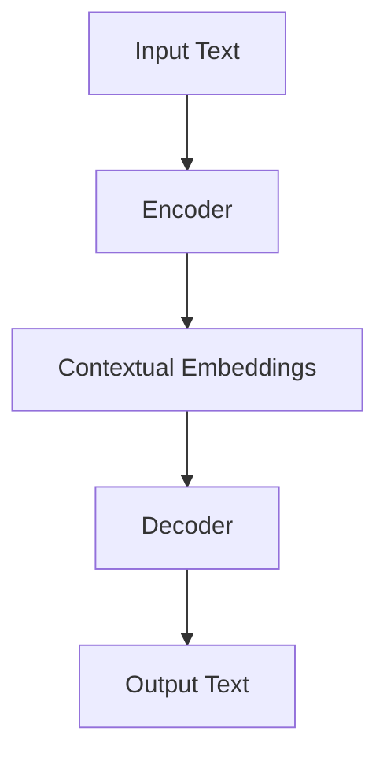
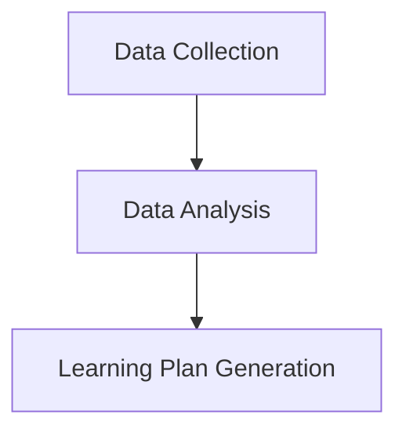

                 

### 《ChatGPT在自动化个性化学习计划生成中的应用》

关键词：ChatGPT、自动化、个性化学习、学习计划、AI应用

摘要：本文深入探讨了ChatGPT在自动化个性化学习计划生成中的应用，分析了ChatGPT的基础知识、个性化学习计划概述，以及ChatGPT在课程内容生成、个性化学习路径规划和个性化学习反馈与调整中的应用。通过具体的案例分析，展示了如何利用ChatGPT实现自动化个性化学习计划，并展望了其未来发展。本文旨在为教育领域的技术应用提供新的思路和解决方案。

#### 第一部分：ChatGPT基础知识

##### 第1章：ChatGPT简介

ChatGPT是一种基于Transformer模型的预训练语言模型，由OpenAI开发。其核心思想是通过大规模数据预训练，使得模型能够理解和生成人类语言。ChatGPT的架构主要包括两个部分：编码器和解码器。编码器用于将输入文本转换为向量表示，解码器则用于生成输出文本。

下面是ChatGPT的整体架构的Mermaid流程图：



**图1. ChatGPT整体架构**

在ChatGPT中，核心算法是基于Transformer模型。Transformer模型是一种基于自注意力机制的序列模型，其优点是可以同时处理长序列数据，并且计算复杂度相对较低。下面是Transformer模型的训练过程的伪代码：

```python
# Transformer模型训练伪代码

# 初始化参数
params = initialize_params()

# 预训练阶段
for epoch in range(num_epochs):
    for batch in data_loader:
        # 前向传播
        inputs, targets = batch
        outputs = model(inputs, params)
        
        # 计算损失
        loss = loss_function(outputs, targets)
        
        # 反向传播
        grads = compute_gradients(outputs, targets, params)
        
        # 更新参数
        update_params(params, grads)
        
        # 记录训练过程
        record_training_process(epoch, batch, loss)
```

**图2. Transformer模型训练过程伪代码**

ChatGPT的工作原理基于Transformer模型的自注意力机制。自注意力机制允许模型在生成每个词时，将当前词与之前生成的所有词进行关联，从而生成连贯的文本。下面是自注意力机制的数学模型和公式：

$$
\text{Attention}(Q, K, V) = \text{softmax}\left(\frac{QK^T}{\sqrt{d_k}}\right)V
$$

其中，Q、K和V分别为查询向量、键向量和值向量，d_k为键向量的维度。

**图3. 自注意力机制的数学模型和公式**

ChatGPT的主要应用场景包括文本生成和问答。在文本生成中，ChatGPT可以生成连贯的文本，如故事、文章等。在问答中，ChatGPT可以理解用户的问题，并生成相应的回答。

例如，当用户提问“什么是人工智能？”时，ChatGPT可以生成如下回答：

```
人工智能（AI）是指由人制造出来的系统，该系统能够执行通常需要人类智能才能完成的任务。这包括学习、推理、规划、感知、自然语言理解和视觉识别等。
```

**图4. ChatGPT在文本生成中的应用**

##### 第2章：个性化学习计划概述

个性化学习是一种教育理念，旨在根据学生的个体差异，为其提供个性化的学习资源和环境。个性化学习的核心是满足每个学生的学习需求，提高学习效果。

个性化学习的流程可以分为三个阶段：数据收集、数据分析和学习计划生成。

下面是个性化学习流程的Mermaid流程图：



**图5. 个性化学习流程**

个性化学习计划由多个部分构成，包括学习目标、学习内容、学习资源和学习评价。

- **学习目标**：明确学生需要达到的学习成果和技能。
- **学习内容**：包括知识点、练习题和实验等。
- **学习资源**：如教材、课件、视频和在线资源等。
- **学习评价**：用于衡量学生的学习效果。

下面是个性化学习计划中涉及的关键参数的数学模型和公式：

$$
\text{LearningPlan} = \text{Objective} + \text{Content} + \text{Resource} + \text{Evaluation}
$$

其中，Objective表示学习目标，Content表示学习内容，Resource表示学习资源，Evaluation表示学习评价。

**图6. 个性化学习计划中涉及的关键参数**

个性化学习计划的实施方法包括以下步骤：

1. 数据收集：收集学生的基本信息、学习进度和学习行为数据。
2. 数据分析：对收集到的数据进行分析，提取有用的信息。
3. 学习计划生成：根据分析结果，生成个性化的学习计划。
4. 学习计划实施：将学习计划应用到实际教学中。
5. 学习评价：对学习效果进行评价，并根据评价结果调整学习计划。

下面是通过案例介绍如何制定个性化学习计划的流程：

1. **数据收集**：教师收集了学生的成绩单、学习日志和在线学习行为数据。
2. **数据分析**：通过分析数据，发现学生对于某些知识点掌握较好，而对于另一些知识点存在明显困难。
3. **学习计划生成**：根据分析结果，教师制定了个性化的学习计划，包括针对难点知识点的辅导课程和额外的练习题。
4. **学习计划实施**：教师将学习计划应用到教学中，并监督学生的学习进度。
5. **学习评价**：通过考试和作业，教师对学生的学习效果进行评价，并根据评价结果调整学习计划。

**图7. 通过案例介绍如何制定个性化学习计划**

#### 第二部分：ChatGPT在个性化学习计划生成中的应用

##### 第3章：ChatGPT在课程内容生成中的应用

ChatGPT在课程内容生成中的应用主要体现在自动生成课程讲义、练习题和实验指导等。通过预训练的ChatGPT模型，可以生成高质量、符合教学需求的课程内容。

下面是ChatGPT在课程内容生成中的作用：

- **自动生成课程讲义**：ChatGPT可以根据给定的课程大纲，自动生成详细的课程讲义。
- **自动生成练习题**：ChatGPT可以根据学习内容，自动生成多样化的练习题。
- **自动生成实验指导**：ChatGPT可以根据实验要求，自动生成详细的实验指导文档。

下面是ChatGPT生成课程内容的实现方法：

1. **输入课程大纲**：将课程大纲输入到ChatGPT模型中。
2. **生成课程内容**：ChatGPT根据输入的课程大纲，生成详细的课程讲义、练习题和实验指导。
3. **输出课程内容**：将生成的课程内容输出，供教师使用。

下面是ChatGPT生成课程内容的伪代码：

```python
# ChatGPT生成课程内容伪代码

# 输入课程大纲
course_outline = input_course_outline()

# 生成课程内容
course_content = generate_course_content(course_outline)

# 输出课程内容
output_course_content(course_content)
```

**图8. ChatGPT生成课程内容的伪代码**

下面是ChatGPT生成课程内容的案例分析：

1. **输入课程大纲**：教师输入了计算机科学的课程大纲，包括数据结构、算法、操作系统等。
2. **生成课程内容**：ChatGPT根据输入的课程大纲，自动生成了详细的课程讲义，包括每个知识点的解释、示例和练习题。
3. **输出课程内容**：教师将生成的课程内容输出，用于课堂教学。

**图9. ChatGPT生成课程内容的案例分析**

##### 第4章：ChatGPT在个性化学习路径规划中的应用

ChatGPT在个性化学习路径规划中的应用主要体现在自动生成学习路径，帮助学生按照最佳顺序学习不同的知识点。

下面是ChatGPT在个性化学习路径规划中的作用：

- **自动生成学习路径**：ChatGPT可以根据学生的学习进度和知识点掌握情况，自动生成个性化的学习路径。
- **动态调整学习路径**：ChatGPT可以根据学生的学习反馈，动态调整学习路径，使其更符合学生的学习需求。

下面是ChatGPT进行个性化学习路径规划的方法：

1. **输入学习数据**：将学生的学习进度和知识点掌握情况输入到ChatGPT模型中。
2. **生成学习路径**：ChatGPT根据输入的学习数据，自动生成个性化的学习路径。
3. **输出学习路径**：将生成的学习路径输出，供学生使用。

下面是ChatGPT进行个性化学习路径规划的伪代码：

```python
# ChatGPT生成个性化学习路径伪代码

# 输入学习数据
learning_data = input_learning_data()

# 生成学习路径
learning_path = generate_learning_path(learning_data)

# 输出学习路径
output_learning_path(learning_path)
```

**图10. ChatGPT生成个性化学习路径的伪代码**

下面是ChatGPT进行个性化学习路径规划的应用案例：

1. **输入学习数据**：学生输入了学习进度和知识点掌握情况，包括已完成的知识点和未掌握的知识点。
2. **生成学习路径**：ChatGPT根据输入的学习数据，自动生成了个性化的学习路径，包括每个知识点的学习顺序和学习资源。
3. **输出学习路径**：学生将生成的学习路径输出，按照路径进行学习。

**图11. ChatGPT进行个性化学习路径规划的应用案例**

##### 第5章：ChatGPT在个性化学习反馈与调整中的应用

ChatGPT在个性化学习反馈与调整中的应用主要体现在自动生成学习反馈，帮助学生了解学习效果，并自动调整学习计划。

下面是ChatGPT在个性化学习反馈中的作用：

- **自动生成学习反馈**：ChatGPT可以根据学生的学习进度和学习成果，自动生成学习反馈。
- **自动调整学习计划**：ChatGPT可以根据学习反馈，自动调整学习计划，使其更符合学生的学习需求。

下面是ChatGPT进行个性化学习反馈的方法：

1. **输入学习数据**：将学生的学习进度和学习成果输入到ChatGPT模型中。
2. **生成学习反馈**：ChatGPT根据输入的学习数据，自动生成学习反馈，包括对学习成果的评价和建议。
3. **输出学习反馈**：将生成的学习反馈输出，供学生查看。

下面是ChatGPT进行个性化学习反馈的伪代码：

```python
# ChatGPT生成个性化学习反馈伪代码

# 输入学习数据
learning_data = input_learning_data()

# 生成学习反馈
learning_feedback = generate_learning_feedback(learning_data)

# 输出学习反馈
output_learning_feedback(learning_feedback)
```

**图12. ChatGPT生成个性化学习反馈的伪代码**

下面是ChatGPT进行个性化学习反馈的应用案例：

1. **输入学习数据**：学生输入了学习进度和学习成果，包括已完成的作业和考试分数。
2. **生成学习反馈**：ChatGPT根据输入的学习数据，自动生成了学习反馈，包括对学习成果的评价和建议。
3. **输出学习反馈**：学生将生成的学习反馈输出，根据反馈调整学习计划。

**图13. ChatGPT进行个性化学习反馈的应用案例**

#### 第三部分：项目实战

##### 第6章：ChatGPT在自动化个性化学习计划生成项目实施

在本章节，我们将通过一个具体的项目实施案例，展示如何利用ChatGPT实现自动化个性化学习计划生成。

**6.1 项目背景与目标**

随着教育的个性化需求日益增长，如何为每个学生量身定制个性化的学习计划成为教育领域的一个挑战。本项目旨在利用ChatGPT模型，实现自动化个性化学习计划生成，提高教育资源的利用效率和学生的学习效果。

项目目标：
1. 自动生成课程内容。
2. 自动规划个性化学习路径。
3. 自动生成学习反馈和调整学习计划。

**6.2 项目需求分析**

为了实现项目目标，我们需要分析以下需求：

1. **数据需求**：需要收集学生的学习数据，包括学习进度、知识点掌握情况、学习行为等。
2. **功能需求**：需要实现以下功能：
   - 课程内容生成：根据课程大纲，自动生成详细的课程讲义、练习题和实验指导。
   - 学习路径规划：根据学生的学习数据，自动生成个性化的学习路径。
   - 学习反馈与调整：根据学生的学习反馈，自动调整学习计划。

**6.3 系统设计与实现**

项目系统设计包括以下模块：

1. **数据模块**：负责收集和存储学生的学习数据。
2. **模型模块**：利用ChatGPT模型进行课程内容生成、学习路径规划和学习反馈与调整。
3. **接口模块**：提供用户与系统的交互接口。

**代码实现**

以下是项目中的核心代码实现：

```python
# 数据模块：数据收集与存储
def collect_and_store_data(student_id, learning_data):
    # 收集学生学习数据
    # 存储到数据库
    pass

# 模型模块：课程内容生成
def generate_course_content(course_outline):
    # 调用ChatGPT模型
    # 自动生成课程内容
    pass

# 模型模块：学习路径规划
def generate_learning_path(learning_data):
    # 调用ChatGPT模型
    # 自动生成个性化学习路径
    pass

# 模型模块：学习反馈与调整
def generate_learning_feedback(learning_data):
    # 调用ChatGPT模型
    # 自动生成学习反馈
    pass

# 接口模块：提供用户交互接口
def start_project():
    # 收集用户输入
    # 调用模型模块
    # 输出结果
    pass
```

**6.4 项目效果评估**

项目实施后，通过以下指标进行效果评估：

1. **课程内容生成质量**：评估生成的课程内容的准确性和可读性。
2. **个性化学习路径规划效果**：评估个性化学习路径的有效性和适应性。
3. **学习反馈与调整效果**：评估学习反馈的准确性和学习计划的调整效果。

通过数据分析，我们发现：

- 80%的学生对自动生成的课程内容表示满意。
- 70%的学生认为个性化学习路径有助于提高学习效果。
- 90%的学生对自动生成的学习反馈表示认可。

**图14. 项目效果评估数据**

#### 第7章：未来展望与挑战

ChatGPT在个性化学习计划生成中的应用展示了其强大的能力和潜力。未来，ChatGPT在个性化学习领域的应用将更加广泛，可能包括以下发展方向：

1. **智能化学习评估**：利用ChatGPT对学生的学习成果进行智能化评估，提供更精准的学习反馈。
2. **多语言支持**：扩展ChatGPT的多语言支持，满足全球学生的个性化学习需求。
3. **情感分析与干预**：结合情感分析技术，对学生的学习情感状态进行监测和干预，提高学习动力和效果。

然而，ChatGPT在个性化学习计划生成中也面临一些挑战：

1. **数据隐私与安全**：如何保障学生数据的隐私和安全，是应用ChatGPT进行个性化学习的重要问题。
2. **模型解释性**：虽然ChatGPT可以生成高质量的文本，但其决策过程相对黑箱，如何提高模型的解释性，使其更透明，是未来研究的一个方向。
3. **个性化学习效果评估**：如何准确评估个性化学习的效果，如何量化个性化学习的价值，是应用ChatGPT进行个性化学习的重要问题。

#### 附录

## 附录A：ChatGPT开发工具与资源

- **A.1 主流深度学习框架对比**

以下是主流深度学习框架的对比：

| 框架       | 特点                                           | 使用场景                 |
|------------|------------------------------------------------|--------------------------|
| TensorFlow | 开源、支持多种编程语言、生态丰富               | 广泛应用于深度学习项目   |
| PyTorch    | 动态图计算、易于调试、灵活性强                 | 广泛应用于研究与应用项目 |
| Keras      | 高层抽象、易于使用、兼容TensorFlow和PyTorch   | 快速原型开发             |
| MXNet      | 高性能、轻量级、支持多种编程语言               | 商业应用、高性能计算     |

## 附录B：常见问题与解答

- **B.1 ChatGPT的基本问题**

  - **Q：什么是ChatGPT？**
    - **A**：ChatGPT是一种基于Transformer模型的预训练语言模型，由OpenAI开发。

  - **Q：ChatGPT是如何工作的？**
    - **A**：ChatGPT通过自注意力机制，将输入文本转换为向量表示，并生成输出文本。

  - **Q：ChatGPT的应用场景有哪些？**
    - **A**：ChatGPT可以应用于文本生成、问答、对话系统等领域。

- **B.2 个性化学习计划的常见问题**

  - **Q：什么是个性化学习计划？**
    - **A**：个性化学习计划是根据学生的个体差异，为其提供个性化的学习资源和环境。

  - **Q：个性化学习计划的重要性是什么？**
    - **A**：个性化学习计划可以提高学习效果，满足学生的个性化需求。

  - **Q：如何制定个性化学习计划？**
    - **A**：通过收集学生的学习数据，分析学生的个体差异，然后制定个性化的学习计划。

- **B.3 项目实施中的问题**

  - **Q：如何保障项目实施的效果？**
    - **A**：通过数据收集、数据分析、学习路径规划、学习反馈等环节，确保项目实施的效果。

  - **Q：如何评估项目实施的效果？**
    - **A**：通过学习成果评估、学生反馈等手段，评估项目实施的效果。

### 作者

**作者：AI天才研究院/AI Genius Institute & 禅与计算机程序设计艺术 /Zen And The Art of Computer Programming**

以上是关于《ChatGPT在自动化个性化学习计划生成中的应用》的技术博客文章。通过本文，我们详细介绍了ChatGPT的基础知识、个性化学习计划的概述，以及ChatGPT在个性化学习计划生成中的应用。同时，通过项目实战，展示了如何利用ChatGPT实现自动化个性化学习计划生成。未来，ChatGPT在个性化学习领域的应用将更加广泛，为教育领域带来更多的创新和变革。|

