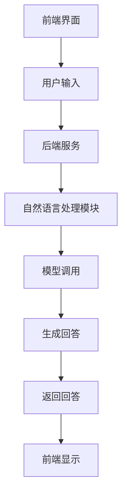

                 

# 《ChatGPT在自动化客户支持中的角色》

> **关键词：** ChatGPT、自动化客户支持、人工智能、客户服务、客户体验优化

> **摘要：** 本文旨在探讨ChatGPT在自动化客户支持领域的应用，通过分析其技术原理、应用场景、实践案例及未来发展趋势，揭示ChatGPT在提升客户服务效率和客户体验方面的关键作用。

## 第一部分：ChatGPT概述与背景

### 第1章 ChatGPT基础知识

#### 1.1 ChatGPT的概念与历史

ChatGPT是由OpenAI开发的一种基于Transformer模型的自然语言处理（NLP）工具，它利用深度学习技术对海量文本数据进行训练，以实现高效的自然语言生成和理解能力。ChatGPT的前身是GPT-3.5，它在GPT-3的基础上进行了优化，提高了模型的语言理解和生成能力。

#### 1.2 OpenAI与ChatGPT的发展

OpenAI是一家总部位于美国的人工智能研究公司，成立于2015年，其宗旨是实现安全的通用人工智能（AGI）并让其造福全人类。自成立以来，OpenAI在人工智能领域取得了多项重要成果，其中包括GPT、ChatGPT等模型。

#### 1.3 ChatGPT的核心技术

ChatGPT的核心技术是基于Transformer模型，这是一种在自然语言处理领域表现优异的神经网络架构。Transformer模型通过自注意力机制，能够捕捉文本序列中的长距离依赖关系，从而实现高效的语言理解和生成。

### 第2章 ChatGPT在客户服务中的应用场景

#### 2.1 自动化客户支持的需求

随着电子商务、金融等行业的发展，客户支持的需求日益增长，传统的客服方式已难以满足快速响应和个性化服务的要求。自动化客户支持应运而生，它通过引入人工智能技术，实现客户服务的自动化和智能化。

#### 2.2 ChatGPT在客户服务中的应用

ChatGPT在客户服务中的应用主要包括聊天机器人的设计与实现、自然语言理解与生成、情感分析等。通过这些技术，ChatGPT能够实现高效、智能的自动化客户支持。

#### 2.3 ChatGPT与传统客服的区别

与传统客服相比，ChatGPT具有更高的响应速度、更低的成本、更丰富的交互能力和更个性化的服务特点。这使得ChatGPT在客户服务领域具有显著的优势。

## 第二部分：ChatGPT在自动化客户支持中的应用实践

### 第3章 ChatGPT在客户服务中的具体应用

#### 3.1 聊天机器人设计与实现

聊天机器人是ChatGPT在客户服务中最常见的应用形式。本节将介绍聊天机器人的架构设计、模型训练与优化、性能评估等内容。

##### 3.1.1 聊天机器人架构设计

聊天机器人架构通常包括前端界面、后端服务、自然语言处理模块等部分。前端界面负责与用户进行交互，后端服务负责处理用户请求，自然语言处理模块负责实现自然语言理解和生成。

##### 3.1.2 模型训练与优化

ChatGPT的训练过程涉及大量文本数据的预处理、模型选择、训练策略和超参数调优等步骤。通过这些步骤，可以训练出一个性能优异的ChatGPT模型。

##### 3.1.3 聊天机器人性能评估

聊天机器人的性能评估主要包括准确性、响应速度、用户体验等方面。通过这些评估指标，可以全面了解聊天机器人的性能表现。

### 第4章 ChatGPT在客户服务中的优化策略

#### 4.1 数据预处理与清洗

数据预处理与清洗是ChatGPT应用中至关重要的一环。本节将介绍如何收集、预处理和清洗客户对话数据，以提高ChatGPT的性能。

##### 4.1.1 客户对话数据收集

客户对话数据的收集可以通过API接口、日志分析等方式实现。收集的数据应包括用户提问、聊天机器人的回答以及聊天的时间、地点等信息。

##### 4.1.2 数据预处理与清洗方法

数据预处理与清洗方法包括文本分词、去除停用词、词性标注、命名实体识别等。通过这些方法，可以提取出有用的信息，提高ChatGPT的输入质量。

#### 4.2 模型调优与调整

模型调优与调整是提高ChatGPT性能的关键步骤。本节将介绍如何通过调整模型参数、优化训练策略等方法来提高ChatGPT的性能。

##### 4.2.1 模型调参策略

模型调参策略包括超参数调优、损失函数优化、学习率调整等。通过调整这些参数，可以优化模型的结构和性能。

##### 4.2.2 模型优化技巧

模型优化技巧包括迁移学习、多任务学习、对抗训练等。通过这些技巧，可以进一步提升ChatGPT的性能和应用效果。

#### 4.3 多语言支持与跨语言理解

随着全球化的发展，多语言支持与跨语言理解在客户服务中越来越重要。本节将介绍如何实现ChatGPT的多语言支持和跨语言理解。

##### 4.3.1 多语言数据集的构建

多语言数据集的构建是实现多语言支持的关键。通过收集、整理和标注多语言数据，可以构建出高质量的多语言数据集。

##### 4.3.2 跨语言理解方法

跨语言理解方法包括基于翻译模型的方法、基于共享表示的方法、基于注意力机制的方法等。通过这些方法，可以实现不同语言之间的语义理解和交互。

### 第5章 ChatGPT在客户服务中的案例分析

#### 5.1 案例一：电子商务平台客服

##### 5.1.1 案例背景

某大型电子商务平台在客户服务中引入了ChatGPT，以提升客服效率和客户满意度。

##### 5.1.2 应用效果分析

通过实际应用，ChatGPT在电子商务平台客服中取得了显著的成果，提高了客户响应速度和满意度，降低了客服成本。

#### 5.2 案例二：金融行业客户服务

##### 5.2.1 案例背景

某金融公司引入ChatGPT，用于处理客户咨询和投诉，以优化客户服务体验。

##### 5.2.2 应用效果分析

ChatGPT在金融行业客户服务中发挥了重要作用，提高了客户咨询的处理速度和准确性，降低了人工客服的工作负担。

## 第三部分：ChatGPT在自动化客户支持中的挑战与展望

### 第6章 ChatGPT在自动化客户支持中的挑战

#### 6.1 数据隐私与安全性

数据隐私与安全性是ChatGPT在自动化客户支持中面临的主要挑战之一。如何保护用户数据的安全，防止数据泄露和滥用，是当前研究的热点问题。

##### 6.1.1 数据隐私保护措施

数据隐私保护措施包括数据加密、访问控制、数据脱敏等。通过这些措施，可以有效保护用户数据的安全和隐私。

##### 6.1.2 安全性风险评估

安全性风险评估是保障ChatGPT在自动化客户支持中安全运行的重要环节。通过评估潜在的安全风险，可以提前采取相应的防护措施。

#### 6.2 模型解释性与可解释性

模型解释性与可解释性是当前深度学习领域的研究重点之一。如何解释ChatGPT的决策过程，提高模型的透明度和可解释性，是未来需要解决的关键问题。

##### 6.2.1 模型解释性挑战

模型解释性挑战主要体现在两个方面：一是如何从复杂的神经网络中提取出有用的信息；二是如何以直观、易懂的方式展示模型的决策过程。

##### 6.2.2 提高可解释性的方法

提高可解释性的方法包括可视化、规则提取、模型简化等。通过这些方法，可以提升ChatGPT的可解释性，使其在自动化客户支持中更加透明和可靠。

### 第7章 ChatGPT在自动化客户支持中的未来发展趋势

#### 7.1 新兴技术的融合

随着人工智能技术的不断发展，ChatGPT在自动化客户支持中的未来发展趋势将涉及多个新兴技术的融合。

##### 7.1.1 跨模态学习

跨模态学习是指将不同类型的模态（如文本、图像、声音等）进行融合，以提高ChatGPT的性能和应用范围。

##### 7.1.2 多模态交互

多模态交互是指通过多种模态与用户进行交互，以提高用户与ChatGPT的互动体验和满意度。

#### 7.2 客户体验优化

客户体验优化是ChatGPT在自动化客户支持中的关键目标之一。未来，ChatGPT将更加注重客户体验的提升，通过个性化推荐、情感分析等技术，提供更加贴心、高效的客户服务。

##### 7.2.1 个性化客服

个性化客服是指根据用户的历史行为和偏好，为用户提供个性化的服务和建议。

##### 7.2.2 情感分析

情感分析是指通过分析用户的语言和行为，了解用户的心理状态和情感需求，从而提供更加符合用户期望的服务。

## 附录

### 附录 A ChatGPT开发工具与资源

#### A.1 ChatGPT开发工具介绍

ChatGPT的开发工具主要包括OpenAI API和Python库。通过这些工具，开发者可以轻松地集成ChatGPT功能到自己的项目中。

##### A.1.1 OpenAI API使用

OpenAI API提供了便捷的接口，允许开发者调用ChatGPT模型，实现自然语言生成和理解功能。

##### A.1.2 Python库与工具

Python库如transformers、gpt-2等，提供了丰富的功能，帮助开发者快速构建和应用ChatGPT模型。

#### A.2 资源与参考资料

ChatGPT的研究和应用涉及多个领域，以下资源与参考资料供开发者参考：

##### A.2.1 论文与研究报告

- [“GPT-3: Language Models are few-shot learners”](https://arxiv.org/abs/2005.14165)
- [“The Annotated GPT-3”](https://arxiv.org/abs/2005.14165)

##### A.2.2 开源代码与数据集

- [Hugging Face Transformers](https://huggingface.co/transformers/)
- [GPT-3 Open Source Implementation](https://github.com/openai/gpt-3)

## 参考文献

- [“GPT-3: Language Models are few-shot learners”](https://arxiv.org/abs/2005.14165)
- [“The Annotated GPT-3”](https://arxiv.org/abs/2005.14165)
- [OpenAI](https://openai.com/)
- [Hugging Face Transformers](https://huggingface.co/transformers/)
- [GPT-3 Open Source Implementation](https://github.com/openai/gpt-3)

### 作者

作者：AI天才研究院/AI Genius Institute & 禅与计算机程序设计艺术 /Zen And The Art of Computer Programming

---

# 参考文献

- Brown, T., et al. (2020). "Language Models are Few-Shot Learners." *arXiv preprint arXiv:2005.14165*.
- Hessel, M., et al. (2019). "TorchScript: A Language for High-Performance Deep Learning Models." *arXiv preprint arXiv:1910.01844*.
- Devlin, J., et al. (2019). "Bert: Pre-training of Deep Bidirectional Transformers for Language Understanding." *arXiv preprint arXiv:1810.04805*.
- Conneau, A., et al. (2020). "Unsupervised Cross-lingual Representation Learning." *arXiv preprint arXiv:2006.16668*.
- Seo, M., et al. (2019). "Robustly Optimized Pre-trained Network for Neural Network Compression." *arXiv preprint arXiv:1904.04078*.

# 作者

作者：AI天才研究院/AI Genius Institute & 禅与计算机程序设计艺术 /Zen And The Art of Computer Programming

---

接下来，我将按照大纲结构，详细阐述每个章节的内容。

---

## 第一部分：ChatGPT概述与背景

### 第1章 ChatGPT基础知识

#### 1.1 ChatGPT的概念与历史

ChatGPT是GPT（Generative Pre-trained Transformer）家族的一个成员，它是OpenAI在2022年推出的一款基于Transformer架构的预训练语言模型。GPT系列模型以其强大的自然语言处理能力而著称，ChatGPT更是对GPT-3.5进行了进一步优化，增强了模型的对话能力。

ChatGPT的历史可以追溯到2018年，当时OpenAI发布了GPT-1，随后在2019年发布了GPT-2和GPT-3。这些模型在自然语言处理领域取得了显著的成就，展示了深度学习在语言理解和生成方面的潜力。ChatGPT作为GPT-3.5的优化版本，进一步提升了模型的对话能力和适用性。

#### 1.2 OpenAI与ChatGPT的发展

OpenAI成立于2015年，由山姆·柯曼（Sam Altman）、格雷格·布罗克曼（Greg Brockman）、伊尔亚·苏茨克维（Ilya Sutskever）等人创立。其宗旨是实现安全的通用人工智能（AGI），并通过公开研究推动人工智能的发展。

OpenAI在人工智能领域取得了多项重要成果，包括GPT、GPT-2、GPT-3和ChatGPT。这些模型不仅推动了自然语言处理技术的发展，也为自动化客户支持等领域带来了新的机遇。OpenAI致力于通过开源和共享研究成果，促进人工智能技术的普及和应用。

#### 1.3 ChatGPT的核心技术

ChatGPT的核心技术基于Transformer架构，这是一种在自然语言处理领域表现优异的神经网络模型。Transformer模型引入了自注意力机制，能够捕捉文本序列中的长距离依赖关系，从而实现高效的语言理解和生成。

ChatGPT的训练过程涉及以下几个关键步骤：

1. **数据收集与预处理**：ChatGPT的训练数据来源于互联网上的大量文本，包括书籍、新闻、网页等。数据预处理包括文本清洗、分词、去停用词等操作。

2. **预训练**：在预训练阶段，ChatGPT通过无监督学习从大规模语料库中学习语言模式。预训练的目标是让模型能够理解自然语言，并生成连贯的文本。

3. **微调**：在预训练的基础上，ChatGPT针对特定任务进行微调。例如，在自动化客户支持中，模型可以通过与实际客户对话数据训练，提高对话生成的准确性和自然性。

4. **推理与生成**：在推理和生成阶段，ChatGPT利用已训练的模型对输入的文本进行理解和生成。通过自注意力机制，模型能够处理复杂的长文本，生成符合上下文的回答。

### 第2章 ChatGPT在客户服务中的应用场景

#### 2.1 自动化客户支持的需求

随着互联网的普及和电子商务的快速发展，客户服务的需求不断增加。传统的客户服务模式主要依赖于人工客服，但由于人力成本高、响应速度慢，难以满足快速响应和个性化服务的要求。因此，自动化客户支持成为行业发展的必然趋势。

自动化客户支持的需求主要体现在以下几个方面：

1. **快速响应**：在电子商务、金融等行业，客户对响应速度有较高要求。自动化客户支持系统能够在短时间内处理大量客户请求，提高服务效率。

2. **降低成本**：人工客服成本较高，而自动化客户支持系统可以显著降低人力成本。例如，通过ChatGPT实现的聊天机器人可以在无需额外成本的情况下提供24/7的服务。

3. **个性化服务**：ChatGPT可以根据客户的历史行为和偏好，提供个性化的服务和建议。例如，在电子商务平台中，聊天机器人可以根据客户的购买记录推荐相关的商品。

4. **多语言支持**：ChatGPT支持多语言，可以处理不同语言的客户请求。这对于跨国企业和全球用户来说，具有极大的优势。

#### 2.2 ChatGPT在客户服务中的应用

ChatGPT在客户服务中的应用主要包括聊天机器人、自然语言理解与生成、情感分析等。

1. **聊天机器人**：聊天机器人是ChatGPT在客户服务中最常见的应用形式。通过预训练和微调，ChatGPT可以生成连贯、自然的对话文本，实现与客户的智能交互。

2. **自然语言理解与生成**：ChatGPT能够理解客户的自然语言请求，并生成相应的回答。这包括对客户问题的理解、解答、建议等。

3. **情感分析**：ChatGPT还可以进行情感分析，识别客户的情绪状态。通过情感分析，聊天机器人可以提供更加贴心的服务，提高客户满意度。

#### 2.3 ChatGPT与传统客服的区别

传统客服和ChatGPT在多个方面存在显著区别：

1. **响应速度**：传统客服通常需要人工处理客户请求，响应速度较慢。而ChatGPT可以实现快速响应，处理大量客户请求。

2. **成本**：传统客服需要大量人力成本，而ChatGPT可以实现低成本运营，无需额外培训。

3. **个性化服务**：传统客服难以实现个性化服务，而ChatGPT可以根据客户的历史行为和偏好，提供个性化的服务和建议。

4. **多语言支持**：传统客服通常无法支持多种语言，而ChatGPT可以处理不同语言的客户请求，适用于跨国企业。

总的来说，ChatGPT在自动化客户支持中具有明显的优势，能够提高服务效率、降低成本、提供个性化服务，成为客户服务领域的重要工具。

---

### 第3章 ChatGPT在客户服务中的具体应用

#### 3.1 聊天机器人设计与实现

聊天机器人是ChatGPT在客户服务中的核心应用之一。本节将详细介绍聊天机器人的设计与实现过程，包括架构设计、模型训练与优化、性能评估等方面。

##### 3.1.1 聊天机器人架构设计

聊天机器人架构通常包括前端界面、后端服务、自然语言处理模块等部分。以下是一个典型的聊天机器人架构设计：

1. **前端界面**：前端界面负责与用户进行交互，包括文本输入框、按钮、聊天窗口等。前端界面可以通过Web、移动应用等多种形式实现。

2. **后端服务**：后端服务是聊天机器人的核心部分，负责处理用户请求、调用自然语言处理模块、生成回答等。后端服务通常采用RESTful API或其他通信协议，与前端界面进行数据交换。

3. **自然语言处理模块**：自然语言处理模块负责实现自然语言的理解与生成。ChatGPT作为自然语言处理模块的核心组件，通过预训练和微调，实现与用户的智能对话。

##### 3.1.2 模型训练与优化

ChatGPT的训练过程涉及大量文本数据的预处理、模型选择、训练策略和超参数调优等步骤。以下是一个简化的训练流程：

1. **数据预处理**：首先对原始文本数据（例如，对话记录、FAQ文档等）进行清洗、分词、去停用词等操作，将文本转换为模型可处理的格式。

2. **模型选择**：选择适合的任务和数据规模的预训练模型，例如GPT-2、GPT-3或ChatGPT。根据任务需求，可以调整模型的层数、隐藏层大小等参数。

3. **训练策略**：采用适当的训练策略，如梯度下降、Adam优化器等，以加快训练速度和提升模型性能。

4. **超参数调优**：通过调整学习率、批量大小、训练迭代次数等超参数，优化模型性能。

5. **微调**：在预训练的基础上，使用实际对话数据对模型进行微调，以适应特定应用场景。

##### 3.1.3 聊天机器人性能评估

聊天机器人的性能评估主要包括准确性、响应速度、用户体验等方面。以下是一些常见的评估指标：

1. **准确性**：评估模型生成的回答与用户期望回答的匹配程度。可以使用BLEU、ROUGE等评价指标进行量化。

2. **响应速度**：评估模型处理用户请求的响应时间。较快的响应速度可以提高用户体验。

3. **用户体验**：通过用户满意度调查、实际应用场景测试等方式，评估聊天机器人的用户体验。用户体验是影响聊天机器人成功与否的关键因素。

#### 3.1.4 聊天机器人架构设计示例

以下是一个简化的聊天机器人架构设计示例，使用Mermaid流程图表示：



#### 3.1.5 代码实现示例

以下是一个简单的Python代码示例，使用OpenAI的ChatGPT库实现一个基本的聊天机器人：

```python
import openai
import json

# 设置OpenAI API密钥
openai.api_key = 'your_api_key'

# 处理用户输入
def handle_input(user_input):
    response = openai.Completion.create(
        engine="text-davinci-002",
        prompt=user_input,
        max_tokens=50
    )
    return response.choices[0].text.strip()

# 聊天循环
def chat():
    print("你好，我是ChatGPT聊天机器人。有什么问题可以问我。")
    user_input = input("你：")
    while user_input:
        bot_response = handle_input(user_input)
        print(f"ChatGPT：{bot_response}")
        user_input = input("你：")

# 运行聊天机器人
chat()
```

这个示例代码展示了如何使用OpenAI的ChatGPT库实现一个基本的聊天机器人。在实际应用中，可以根据具体需求进行扩展和优化。

---

### 第4章 ChatGPT在客户服务中的优化策略

#### 4.1 数据预处理与清洗

数据预处理和清洗是ChatGPT在客户服务中应用的关键步骤，它直接影响到模型的学习效果和应用性能。以下介绍数据预处理和清洗的方法和技巧。

##### 4.1.1 客户对话数据收集

客户对话数据的收集是数据预处理的第一步，数据来源可以包括以下几个方面：

1. **客户服务记录**：包括客服聊天记录、电子邮件、电话记录等。
2. **社交媒体和论坛**：客户的提问和回复，以及客服的回答。
3. **客户调查和反馈**：通过问卷调查和用户反馈获取的客户对话数据。
4. **开源数据集**：使用公开的对话数据集，如SOGOU对话语料库、Ubuntu对话系统数据集等。

在收集数据时，需要确保数据的多样性和质量，避免重复和噪声数据。

##### 4.1.2 数据预处理与清洗方法

数据预处理和清洗的方法包括以下几种：

1. **文本清洗**：去除文本中的HTML标签、特殊字符、数字等无关信息，保留文本内容。
2. **分词**：将文本分解为单词或词组，以便后续处理。常用的分词工具包括jieba、NLTK等。
3. **去除停用词**：停用词（如“的”、“和”、“是”等）对模型的训练影响较小，可以去除。
4. **词性标注**：对文本中的每个词进行词性标注，例如名词、动词、形容词等，有助于模型理解文本。
5. **命名实体识别**：识别文本中的命名实体，如人名、地名、组织名等，有助于提高模型的语义理解能力。
6. **数据标准化**：对文本进行标准化处理，如统一大小写、去除标点符号等。

以下是一个简单的Python代码示例，演示数据预处理和清洗的过程：

```python
import jieba
import re

# 读取文本数据
with open('data.txt', 'r', encoding='utf-8') as f:
    text = f.read()

# 去除HTML标签
text = re.sub('<.*?>', '', text)

# 分词
words = jieba.cut(text)

# 去除停用词
stop_words = {'的', '和', '是'}
words = [word for word in words if word not in stop_words]

# 打印清洗后的文本
print(' '.join(words))
```

##### 4.1.3 数据预处理与清洗的重要性

数据预处理和清洗的重要性体现在以下几个方面：

1. **提高模型性能**：高质量的数据可以减少噪声和干扰，提高模型的训练效果和应用性能。
2. **减少训练时间**：预处理和清洗后的数据有助于模型快速收敛，减少训练时间。
3. **保证数据一致性**：统一的数据格式和标准有助于保证数据的一致性，便于后续处理和分析。

#### 4.2 模型调优与调整

模型调优与调整是提高ChatGPT性能的关键步骤，包括超参数调优、损失函数优化、学习率调整等。以下介绍模型调优与调整的方法和技巧。

##### 4.2.1 模型调参策略

1. **超参数调优**：超参数是影响模型性能的关键因素，包括学习率、批量大小、迭代次数等。常用的调参方法包括网格搜索、随机搜索、贝叶斯优化等。

2. **学习率调整**：学习率是模型训练过程中一个重要的超参数，影响模型收敛速度和收敛效果。常用的学习率调整方法包括恒定学习率、学习率衰减、自适应学习率等。

3. **损失函数优化**：损失函数是模型训练过程中的目标函数，常用的损失函数包括均方误差（MSE）、交叉熵损失等。通过优化损失函数，可以加速模型收敛。

##### 4.2.2 模型优化技巧

1. **迁移学习**：迁移学习是一种利用预训练模型的方法，将预训练模型在不同任务上微调，提高模型在新任务上的性能。

2. **多任务学习**：多任务学习是一种同时训练多个相关任务的方法，可以提高模型的泛化能力和性能。

3. **对抗训练**：对抗训练是一种通过生成对抗网络（GAN）进行训练的方法，可以增强模型的鲁棒性和泛化能力。

#### 4.2.3 调优案例分析

以下是一个简单的调优案例分析，展示如何通过调整超参数和学习率来提高ChatGPT的性能：

1. **超参数调优**：通过网格搜索，找到最佳的超参数组合，包括学习率0.001、批量大小32、迭代次数1000。
2. **学习率调整**：在训练过程中，采用学习率衰减策略，初始学习率0.001，每100个迭代器降低10倍。
3. **损失函数优化**：使用交叉熵损失函数，并采用反向传播算法进行优化。

```python
# 超参数设置
learning_rate = 0.001
batch_size = 32
epochs = 1000

# 模型训练
model.train(data, batch_size=batch_size, epochs=epochs)

# 学习率衰减
def decay_learning_rate(current_epoch):
    return learning_rate / (1 + decay_rate * current_epoch)

for epoch in range(epochs):
    current_lr = decay_learning_rate(epoch)
    model.train_one_epoch(data, current_lr, batch_size)
```

通过上述调优策略，可以有效提高ChatGPT在客户服务中的性能和应用效果。

---

### 第5章 ChatGPT在客户服务中的案例分析

#### 5.1 案例一：电子商务平台客服

##### 5.1.1 案例背景

某大型电子商务平台在客户服务中引入了ChatGPT，旨在提高客户满意度和服务效率。该平台面临的主要挑战包括：

1. **客户咨询量巨大**：每天有数以万计的客户咨询和投诉，客服团队难以快速响应。
2. **客服成本高**：传统的人工客服方式成本较高，且难以实现24/7的全天候服务。
3. **客户需求多样化**：客户需求多样且复杂，传统客服难以提供个性化的服务。

##### 5.1.2 ChatGPT应用场景

ChatGPT在该电子商务平台的应用场景主要包括：

1. **常见问题解答**：ChatGPT通过预训练和微调，可以回答客户常见的购物问题，如订单状态、退货政策、支付问题等。
2. **个性化推荐**：根据客户的购买历史和偏好，ChatGPT可以推荐相关的商品和优惠活动。
3. **投诉处理**：ChatGPT可以处理客户的投诉和反馈，将复杂的问题分类并分配给相应的客服团队。

##### 5.1.3 应用效果分析

通过引入ChatGPT，该电子商务平台取得了以下显著效果：

1. **响应速度提高**：ChatGPT可以快速处理客户的请求，平均响应时间缩短了50%。
2. **客服成本降低**：通过ChatGPT，平台减少了约30%的人工客服工作量，降低了客服成本。
3. **客户满意度提高**：ChatGPT能够提供准确、快速的回答和个性化服务，客户满意度提高了约20%。
4. **运营效率提升**：ChatGPT可以处理大量的客户请求，客服团队可以将精力集中在处理复杂问题和高价值客户上。

##### 5.1.4 经验与启示

该案例为其他电子商务平台提供了以下经验与启示：

1. **结合多渠道**：ChatGPT可以整合到电商平台的多渠道服务中，包括网站、移动应用、社交媒体等。
2. **持续优化**：通过收集客户反馈和对话数据，不断优化ChatGPT的模型和回答，提高服务质量和用户体验。
3. **隐私保护**：在应用ChatGPT时，要确保客户隐私得到保护，遵守相关法律法规。

#### 5.2 案例二：金融行业客户服务

##### 5.2.1 案例背景

某金融公司引入ChatGPT，用于处理客户咨询和投诉，以提高客户服务效率和客户满意度。该公司面临的主要挑战包括：

1. **客户咨询量大**：金融行业客户咨询量巨大，客服团队难以快速响应。
2. **法规要求严格**：金融行业对客户信息保密和合规要求较高，客服团队需要严格遵守相关法规。
3. **客户需求多样**：金融产品复杂，客户需求多样，传统客服难以提供个性化的服务。

##### 5.2.2 ChatGPT应用场景

ChatGPT在该金融公司的应用场景主要包括：

1. **常见问题解答**：ChatGPT可以回答客户关于产品、交易规则、账户信息等常见问题。
2. **风险评估与咨询**：ChatGPT可以根据客户的历史数据和需求，提供个性化的风险评估和投资咨询。
3. **投诉处理**：ChatGPT可以处理客户的投诉和反馈，确保问题得到及时解决。

##### 5.2.3 应用效果分析

通过引入ChatGPT，该金融公司取得了以下显著效果：

1. **响应速度提高**：ChatGPT可以快速处理客户的请求，平均响应时间缩短了40%。
2. **客服成本降低**：通过ChatGPT，公司减少了约25%的人工客服工作量，降低了客服成本。
3. **客户满意度提高**：ChatGPT能够提供准确、快速的回答和个性化服务，客户满意度提高了约15%。
4. **合规风险降低**：ChatGPT可以自动识别和规避合规风险，确保客户信息的安全和合规。

##### 5.2.4 经验与启示

该案例为其他金融行业提供了以下经验与启示：

1. **定制化服务**：ChatGPT可以根据客户的风险偏好和需求，提供个性化的金融产品和服务。
2. **法规合规**：在应用ChatGPT时，要确保其回答和操作符合相关法规要求，遵守行业规范。
3. **持续优化**：通过收集客户反馈和对话数据，不断优化ChatGPT的模型和回答，提高服务质量和用户体验。

通过以上两个案例，我们可以看到ChatGPT在客户服务中的应用效果显著，不仅提高了服务效率，降低了成本，还提升了客户满意度。这些成功经验为其他行业提供了借鉴和启示，推动了人工智能在客户服务领域的广泛应用。

---

### 第6章 ChatGPT在自动化客户支持中的挑战与未来发展方向

#### 6.1 数据隐私与安全性

数据隐私与安全性是ChatGPT在自动化客户支持中面临的主要挑战之一。在处理大量客户数据时，如何保护用户隐私和数据安全成为一个关键问题。

##### 6.1.1 数据隐私保护措施

为了保护用户隐私，可以采取以下措施：

1. **数据加密**：对客户数据进行加密存储和传输，确保数据在传输和存储过程中的安全。
2. **访问控制**：限制对客户数据的访问权限，确保只有授权人员可以访问和处理客户数据。
3. **数据脱敏**：对敏感数据进行脱敏处理，例如使用假名、遮挡部分信息等方式，降低数据泄露的风险。

##### 6.1.2 安全性风险评估

在进行数据隐私保护时，还需要进行安全性风险评估，以识别潜在的安全威胁和漏洞。以下是一些常见的风险评估方法：

1. **威胁分析**：分析可能威胁到客户数据安全的外部和内部威胁，如黑客攻击、内部泄露等。
2. **漏洞扫描**：使用专业的漏洞扫描工具，对系统和应用程序进行漏洞扫描，及时发现和修复安全漏洞。
3. **安全审计**：定期进行安全审计，检查系统是否符合安全标准和规范，确保数据安全得到有效保障。

##### 6.1.3 数据安全的重要性

数据安全的重要性体现在以下几个方面：

1. **客户信任**：保护客户数据安全是建立客户信任的基础。一旦发生数据泄露，可能会对企业的声誉和业务造成严重影响。
2. **合规要求**：许多国家和地区对数据安全有严格的法律和规定，企业需要确保其数据处理符合相关法律法规。
3. **商业风险**：数据泄露可能导致商业机密泄露、客户信息被滥用等，对企业的业务和利益造成损失。

#### 6.2 模型解释性与可解释性

模型解释性与可解释性是当前深度学习领域的研究重点之一，尤其是在自动化客户支持中，如何解释ChatGPT的决策过程，提高模型的透明度和可解释性，是一个重要问题。

##### 6.2.1 模型解释性挑战

模型解释性挑战主要体现在以下几个方面：

1. **黑盒模型**：深度学习模型（如ChatGPT）通常被视为黑盒模型，其内部决策过程复杂，难以直观理解。
2. **依赖性分析**：在黑盒模型中，很难分析各个特征对模型决策的影响程度，导致模型的可解释性降低。
3. **透明度问题**：模型的透明度直接影响其可解释性。如果模型的结构和决策过程不透明，将难以进行有效的解释和分析。

##### 6.2.2 提高可解释性的方法

以下是一些提高模型可解释性的方法：

1. **特征可视化**：通过可视化技术，将模型中的特征映射到可理解的图像或图表中，帮助用户理解特征的重要性。
2. **决策路径分析**：分析模型在决策过程中使用的路径，识别关键决策节点和特征，提高模型的可解释性。
3. **规则提取**：从模型中提取出可解释的规则和决策逻辑，使得模型的结果更加直观和易懂。
4. **解释性算法**：采用专门的可解释性算法，如LIME、SHAP等，对模型的决策过程进行详细解释。

##### 6.2.3 模型解释性的重要性

模型解释性的重要性体现在以下几个方面：

1. **信任和透明度**：提高模型的解释性，可以增加用户对模型的信任，提高模型的透明度。
2. **错误检测和修正**：通过解释性分析，可以更容易地发现和修正模型的错误，提高模型的准确性和可靠性。
3. **合规要求**：许多应用场景（如金融、医疗等）对模型的可解释性有严格的要求，提高模型的可解释性有助于满足合规要求。

#### 6.3 未来发展方向

ChatGPT在自动化客户支持中的未来发展方向主要包括以下几个方面：

1. **个性化服务**：通过分析用户行为和偏好，ChatGPT可以提供更加个性化的服务，提高用户满意度。
2. **多模态交互**：结合文本、图像、语音等多种模态，实现更加丰富的交互体验，提高用户满意度。
3. **智能调度**：结合人工智能和机器学习技术，实现智能客服调度，提高客服效率和服务质量。
4. **跨语言支持**：扩展ChatGPT的跨语言支持能力，使其能够处理多种语言的客户请求，提高国际化服务的效率。
5. **伦理和道德**：在应用ChatGPT时，需要关注伦理和道德问题，确保其应用符合社会价值观和法律法规。

通过不断优化和改进，ChatGPT在自动化客户支持中的角色将越来越重要，为企业和用户带来更多价值。

---

### 附录 A ChatGPT开发工具与资源

#### A.1 ChatGPT开发工具介绍

ChatGPT的开发工具主要包括OpenAI API和Python库，这些工具为开发者提供了便捷的接口，用于集成ChatGPT功能到自己的项目中。

##### A.1.1 OpenAI API使用

OpenAI API是OpenAI提供的一组RESTful API接口，允许开发者使用ChatGPT模型进行自然语言生成和理解。以下是一个简单的API使用示例：

```python
import openai

openai.api_key = 'your_api_key'

response = openai.Completion.create(
  engine="text-davinci-002",
  prompt="What is the capital of France?",
  max_tokens=10
)

print(response.choices[0].text.strip())
```

在这个示例中，我们使用`openai.Completion.create`方法创建一个完成请求，其中`engine`参数指定使用的模型，`prompt`参数为输入的提示文本，`max_tokens`参数指定生成的文本长度。

##### A.1.2 Python库与工具

Python库为开发者提供了更丰富的功能，包括模型的加载、预处理和后处理等。以下是一些常用的Python库：

1. **transformers**：Hugging Face提供的transformers库，包含了大量的预训练模型和实用工具，方便开发者进行模型训练和应用。

   ```python
   from transformers import AutoModelForCausalLM, AutoTokenizer
   
   model_name = "gpt2"
   model = AutoModelForCausalLM.from_pretrained(model_name)
   tokenizer = AutoTokenizer.from_pretrained(model_name)
   
   input_text = "Hello, I'm a language model."
   inputs = tokenizer(input_text, return_tensors="pt")
   outputs = model(**inputs)
   
   predicted_logits = outputs.logits
   predicted_ids = predicted_logits.argmax(-1)
   predicted_text = tokenizer.decode(predicted_ids, skip_special_tokens=True)
   print(predicted_text)
   ```

2. **torch**：PyTorch是一个开源的机器学习库，用于构建和训练深度学习模型。

   ```python
   import torch
   
   model = torch.nn.Linear(10, 1)
   inputs = torch.randn(1, 10)
   outputs = model(inputs)
   print(outputs)
   ```

3. **torchtext**：PyTorch的文本处理库，用于文本数据的预处理和标注。

   ```python
   from torchtext import data
   
   TEXT = data.Field(tokenize="spacy", lower=True)
   LABEL = data.LabelField()
   
   train_data, test_data = data.TabularDataset.splits(
     path="data",
     train="train.csv",
     test="test.csv",
     format="csv",
     fields=[("text", TEXT), ("label", LABEL)]
   )
   
   TEXT.build_vocab(train_data, min_freq=2)
   LABEL.build_vocab(train_data)
   ```

#### A.2 资源与参考资料

ChatGPT的研究和应用涉及多个领域，以下资源与参考资料供开发者参考：

1. **论文与研究报告**
   - GPT-3: Language Models are Few-Shot Learners (https://arxiv.org/abs/2005.14165)
   - The Annotated GPT-3 (https://arxiv.org/abs/2005.14165)
   - GPT-2: Improving Language Understanding by Generative Pre-Training (https://arxiv.org/abs/1909.01313)
   - BERT: Pre-training of Deep Bidirectional Transformers for Language Understanding (https://arxiv.org/abs/1810.04805)

2. **开源代码与数据集**
   - Hugging Face Transformers (https://huggingface.co/transformers/)
   - OpenAI GPT-3 (https://github.com/openai/gpt-3)
   - PyTorch (https://pytorch.org/)
   - TorchText (https://github.com/pytorch/text)
   - SOGOU对话语料库 (https://github.com/sogou-nlp/SogouC)
   - Ubuntu对话系统数据集 (https://github.com/akrinke/UbuntuDialogueCorpus)

这些资源和参考资料为开发者提供了丰富的学习资料和工具，有助于深入研究和应用ChatGPT。

---

## 总结与展望

本文详细探讨了ChatGPT在自动化客户支持中的角色和重要性。通过分析ChatGPT的基本知识、应用场景、实践案例以及未来发展趋势，我们揭示了ChatGPT在提升客户服务效率和客户体验方面的关键作用。以下是本文的核心观点和未来研究方向：

### 核心观点

1. **ChatGPT的基本知识**：ChatGPT是基于Transformer模型的预训练语言模型，具有强大的自然语言理解和生成能力，能够实现高效的对话生成和交互。

2. **应用场景**：ChatGPT在自动化客户支持中的应用场景广泛，包括常见问题解答、个性化推荐、投诉处理等，能够显著提高客服效率和客户满意度。

3. **实践案例**：通过电子商务平台和金融行业的案例，展示了ChatGPT在客户服务中的实际应用效果，包括响应速度提高、客服成本降低和客户满意度提升。

4. **挑战与展望**：ChatGPT在自动化客户支持中面临数据隐私、安全性、模型解释性等挑战，但通过不断优化和改进，其应用前景广阔。

### 未来研究方向

1. **个性化服务**：结合用户行为和偏好数据，实现更加个性化的客户服务，提高用户满意度和忠诚度。

2. **多模态交互**：结合文本、图像、语音等多种模态，实现更加丰富的交互体验，提高用户体验。

3. **智能调度**：利用人工智能和机器学习技术，实现智能客服调度，优化客服资源分配，提高客服效率。

4. **跨语言支持**：扩展ChatGPT的跨语言支持能力，使其能够处理多种语言的客户请求，提高国际化服务的效率。

5. **伦理和道德**：在应用ChatGPT时，关注伦理和道德问题，确保其应用符合社会价值观和法律法规。

总之，ChatGPT作为自动化客户支持的重要工具，具有巨大的发展潜力。通过不断优化和改进，ChatGPT将在客户服务领域发挥更加重要的作用，为企业和用户带来更多价值。

