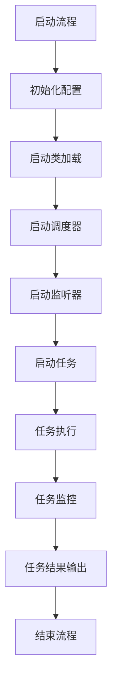

                 

### 《Flink ResourceManager原理与代码实例讲解》

> **关键词**：Apache Flink, ResourceManager, 任务调度, 源码分析, 代码实例

> **摘要**：本文将深入剖析Apache Flink中的ResourceManager原理，通过代码实例讲解ResourceManager的启动过程、任务调度机制以及应用实例。我们将从Flink概述、ResourceManager核心概念、源码分析、应用实例和性能优化等方面展开讨论，帮助读者全面了解Flink ResourceManager的工作机制。

#### 第一部分: Flink ResourceManager基础

##### 第1章: Flink概述与架构

## 1.1 Flink的基本概念

### 1.1.1 数据流处理平台

Apache Flink是一个开源的分布式流处理框架，用于处理有界和无界的数据流。它支持批处理和流处理，并且可以在有状态的计算中保持一致性。Flink适用于实时数据分析、机器学习和复杂事件处理等应用场景。

### 1.1.2 时间窗口与事件时间

在Flink中，时间窗口是数据处理的基本时间单位。事件时间是指数据事件在实际世界中的发生时间。Flink通过处理事件时间来保证窗口内的数据是按实际发生时间排序的，从而实现准确的数据处理。

### 1.1.3 Flink的主要组件

Flink的主要组件包括：

- **JobManager**：负责作业的提交、调度和监控。
- **TaskManager**：执行具体的计算任务，负责数据的处理和存储。
- **ResourceManager**：负责资源的分配和管理，协调JobManager和TaskManager之间的资源分配。

## 1.2 Flink的架构

### 1.2.1 Flink的整体架构

Flink的整体架构包括以下部分：

- **Client**：用户通过Client提交Flink作业。
- **JobManager**：负责作业的生命周期管理，包括作业的提交、调度、失败重试等。
- **TaskManager**：负责执行具体的计算任务，将数据分割成多个子任务，并在不同的TaskManager上并行执行。
- **ResourceManager**：负责资源的分配和管理，协调JobManager和TaskManager之间的资源分配。

### 1.2.2 Flink的任务调度与作业管理

Flink的任务调度包括作业的划分、任务的调度和执行。作业管理涉及作业的提交、监控和失败重试等。Flink的任务调度策略是基于事件驱动的，可以支持多种调度策略，如FIFO、Round Robin、Pipelined Processing等。

### 1.2.3 Flink的分布式存储与计算

Flink支持分布式存储与计算，可以在大规模集群上运行。Flink利用HDFS、Cassandra等分布式存储系统来存储数据，并通过任务调度将计算任务分布到集群中的各个节点上执行。

## 1.3 Flink的架构演化

### 1.3.1 Flink的历史版本

Flink的历史版本主要包括：

- **Flink 1.0**：第一个稳定版本，引入了基于事件驱动的流处理模型。
- **Flink 1.1**：优化了内存管理和任务调度，增加了对Kubernetes的支持。
- **Flink 1.2**：引入了状态后端和检查点机制，提高了系统的容错能力。
- **Flink 1.3**：增加了对复杂事件处理的支持，优化了并行处理性能。

### 1.3.2 Flink的发展趋势

随着大数据和实时计算的需求不断增长，Flink的发展趋势包括：

- **更好的性能优化**：通过改进调度算法和资源管理，提高系统的处理性能。
- **更广泛的应用场景**：支持更多的数据源和数据存储系统，满足不同领域的应用需求。
- **更高效的容错机制**：通过改进检查点和状态管理，提高系统的可靠性。

#### 第二部分: Flink ResourceManager原理

##### 第2章: Flink ResourceManager核心概念

## 2.1 ResourceManager的概述

### 2.1.1 ResourceManager的作用

ResourceManager是Flink中的核心组件之一，负责资源的分配和管理。它主要承担以下职责：

- **资源分配**：根据作业的需求，为作业分配合适的TaskManager资源。
- **任务调度**：根据作业的执行进度和资源可用情况，调度作业的任务。
- **资源回收**：在任务完成后，回收TaskManager的资源，以便其他作业使用。

### 2.1.2 ResourceManager的架构

ResourceManager的架构包括以下几个部分：

- **资源请求处理器**：处理作业提交时的资源请求，将请求发送给资源分配器。
- **资源分配器**：根据当前资源状况和作业需求，为作业分配资源，并将任务调度给相应的TaskManager。
- **资源回收器**：在任务完成后，回收TaskManager的资源，并将其释放给其他作业。

### 2.1.3 ResourceManager与TaskManager的关系

ResourceManager与TaskManager之间通过消息传递进行交互。TaskManager启动后，会向ResourceManager注册自身，并接收分配的任务。当任务完成后，TaskManager会向ResourceManager报告任务执行结果，并回收资源。

## 2.2 ResourceManager的启动与配置

### 2.2.1 ResourceManager的启动流程

ResourceManager的启动流程包括以下几个步骤：

1. **初始化配置**：读取Flink配置文件，初始化资源请求处理器、资源分配器和资源回收器等组件。
2. **注册监听器**：注册各种监听器，如作业提交监听器、任务完成监听器和资源回收监听器等。
3. **启动线程池**：启动线程池，用于处理资源请求和任务调度等任务。
4. **启动服务**：启动ResourceManager服务，等待作业提交和任务调度。

### 2.2.2 ResourceManager的配置项

ResourceManager的配置项包括以下几个部分：

- **资源配置**：配置TaskManager的内存大小、CPU核心数和任务并发度等。
- **作业配置**：配置作业的最大任务数、任务执行时间等。
- **高可用性配置**：配置ZooKeeper地址、备份模式等，实现ResourceManager的高可用性。

### 2.2.3 ResourceManager的高可用性

ResourceManager的高可用性通过ZooKeeper实现。ZooKeeper负责维护ResourceManager的集群状态，并在发生故障时，自动切换到备份节点。ResourceManager的高可用性配置包括以下部分：

- **ZooKeeper地址**：配置ZooKeeper的地址，用于维护集群状态。
- **备份模式**：配置备份模式，如自动备份或手动备份。
- **故障转移**：配置故障转移策略，如主从切换或主备切换。

## 2.3 ResourceManager的任务调度

### 2.3.1 任务调度的基本原理

ResourceManager的任务调度基于事件驱动模型。当作业提交后，ResourceManager会根据作业需求、资源可用情况等，选择合适的TaskManager进行任务调度。任务调度的基本原理如下：

1. **资源请求**：作业提交时，向ResourceManager请求资源。
2. **资源分配**：ResourceManager根据当前资源状况和作业需求，为作业分配资源。
3. **任务调度**：将任务调度给对应的TaskManager执行。
4. **任务监控**：监控任务的执行进度和资源使用情况，进行任务调整和资源回收。

### 2.3.2 任务调度的算法

ResourceManager的任务调度算法包括以下几个部分：

- **负载均衡**：根据TaskManager的负载情况，选择负载较低的TaskManager进行任务调度。
- **优先级调度**：根据任务的优先级，选择优先级较高的任务进行调度。
- **任务并发度**：根据作业的并发度要求，合理分配任务并发度。

### 2.3.3 任务调度的实践案例

以下是一个简单的任务调度实践案例：

1. **作业提交**：用户向Flink集群提交一个作业，作业包含10个任务。
2. **资源请求**：作业向ResourceManager请求资源，需求10个TaskManager。
3. **资源分配**：ResourceManager根据集群资源状况，为作业分配10个TaskManager。
4. **任务调度**：将10个任务分别调度给10个TaskManager执行。
5. **任务监控**：监控任务执行进度，根据任务执行情况，进行任务调整和资源回收。

##### 第3章: Flink ResourceManager源码分析

## 3.1 ResourceManager源码结构

### 3.1.1 源码目录结构

Flink ResourceManager的源码目录结构如下：

```plaintext
src
|-- main
|   |-- java
|   |   |-- org
|   |   |   |-- apache
|   |   |   |   |-- flink
|   |   |   |   |   |-- resourcecenter
|   |   |   |   |   |   |-- cluster
|   |   |   |   |   |   |-- cluster
|   |   |   |   |   |   |   |-- ResourceManager.java
|   |   |   |   |   |   |   |-- JobManagerGateway.java
|   |   |   |   |   |   |   |-- TaskManagerGateway.java
|   |   |   |   |   |   |   |-- SlotPool.java
|   |   |   |   |   |   |   |-- TaskManagerInfo.java
|   |   |   |   |   |   |-- Util.java
|   |   |   |   |   |-- deployment
|   |   |   |   |   |   |-- FlinkResourceManagerDriver.java
|   |   |   |   |   |   |-- JobManagerProcessRunner.java
|   |   |   |   |   |   |-- TaskManagerProcessRunner.java
|   |   |   |   |   |-- RestServer.java
|   |   |   |   |-- ...
```

### 3.1.2 主要类与方法

Flink ResourceManager的主要类与方法如下：

- **ResourceManager.java**：ResourceManager的核心类，负责资源管理、任务调度等。
- **JobManagerGateway.java**：JobManager与ResourceManager之间的通信接口。
- **TaskManagerGateway.java**：TaskManager与ResourceManager之间的通信接口。
- **SlotPool.java**：用于管理Slot（资源单元）的类。
- **TaskManagerInfo.java**：TaskManager的详细信息类。
- **FlinkResourceManagerDriver.java**：ResourceManager的启动类。
- **JobManagerProcessRunner.java**：JobManager的启动类。
- **TaskManagerProcessRunner.java**：TaskManager的启动类。
- **RestServer.java**：负责REST接口的类。

## 3.2 ResourceManager启动过程解析

### 3.2.1 初始化过程

ResourceManager的初始化过程主要包括以下几个步骤：

1. **读取配置文件**：从Flink配置文件中读取相关的配置信息，如集群地址、资源分配策略等。
2. **初始化组件**：初始化ResourceManager的核心组件，如资源请求处理器、资源分配器和资源回收器等。
3. **启动线程池**：启动线程池，用于处理资源请求和任务调度等任务。

### 3.2.2 注册过程

ResourceManager的注册过程主要包括以下几个步骤：

1. **注册监听器**：注册各种监听器，如作业提交监听器、任务完成监听器和资源回收监听器等。
2. **注册JobManager**：将JobManager注册到ResourceManager，以便进行通信。
3. **注册TaskManager**：将TaskManager注册到ResourceManager，以便进行资源分配和任务调度。

### 3.2.3 监听器注册过程

ResourceManager的监听器注册过程主要包括以下几个步骤：

1. **作业提交监听器**：监听作业提交事件，处理作业的初始化和资源请求。
2. **任务完成监听器**：监听任务完成事件，处理任务的资源回收和结果反馈。
3. **资源回收监听器**：监听资源回收事件，处理资源的释放和分配。

## 3.3 ResourceManager任务调度实现

### 3.3.1 调度器初始化

ResourceManager的任务调度器初始化过程主要包括以下几个步骤：

1. **初始化调度器**：创建调度器对象，如负载均衡调度器、优先级调度器等。
2. **设置调度策略**：根据配置文件和作业需求，设置调度策略，如负载均衡、优先级等。

### 3.3.2 调度器调度流程

ResourceManager的任务调度器调度流程主要包括以下几个步骤：

1. **获取待调度任务**：从待调度任务队列中获取待调度任务。
2. **选择调度策略**：根据调度策略，选择合适的调度策略进行任务调度。
3. **分配资源**：根据任务需求，为任务分配资源。
4. **调度任务**：将任务调度给对应的TaskManager执行。
5. **更新任务状态**：更新任务状态，如运行中、已完成等。

### 3.3.3 任务分配过程

ResourceManager的任务分配过程主要包括以下几个步骤：

1. **选择TaskManager**：根据负载均衡策略，选择负载较低的TaskManager进行任务分配。
2. **分配资源**：为任务分配所需的资源，如内存、CPU等。
3. **发送任务**：将任务发送给对应的TaskManager执行。
4. **更新状态**：更新任务状态，如已调度、运行中等。

##### 第4章: Flink ResourceManager项目实战

## 4.1 实例环境搭建

### 4.1.1 系统环境配置

搭建Flink ResourceManager实例需要配置以下系统环境：

- **操作系统**：Linux或Unix系统（如Ubuntu、CentOS等）。
- **Java**：安装Java 8或更高版本。
- **ZooKeeper**：安装ZooKeeper，用于实现ResourceManager的高可用性。

### 4.1.2 Flink集群搭建

搭建Flink集群需要配置以下组件：

- **JobManager**：负责作业的提交、调度和监控。
- **TaskManager**：负责执行具体的计算任务。

具体步骤如下：

1. **下载Flink源码**：从Apache Flink官网下载源码。
2. **编译Flink**：使用Maven编译Flink，生成可执行的jar包。
3. **启动JobManager**：运行JobManager，启动Flink集群。
4. **启动TaskManager**：运行TaskManager，加入Flink集群。

### 4.1.3 ResourceManager配置调整

在启动ResourceManager之前，需要调整其配置文件，包括以下内容：

- **集群配置**：配置Flink集群的地址和端口。
- **资源配置**：配置TaskManager的内存大小、CPU核心数等。
- **高可用性配置**：配置ZooKeeper的地址和端口。

## 4.2 实例代码实现

### 4.2.1 ResourceManager启动代码实现

以下是一个简单的ResourceManager启动示例：

```java
public class ResourceManager {
    public static void main(String[] args) {
        // 初始化配置
        Configuration configuration = new Configuration();
        configuration.setInteger("taskmanager.count", 3);
        configuration.setInteger("taskmanager.memory.size", 2048);
        configuration.setInteger("taskmanager.cpu.cores", 2);

        // 启动ResourceManager
        FlinkResourceManagerDriver driver = new FlinkResourceManagerDriver();
        driver.startResourceManager(configuration);
    }
}
```

### 4.2.2 TaskManager启动代码实现

以下是一个简单的TaskManager启动示例：

```java
public class TaskManager {
    public static void main(String[] args) {
        // 初始化配置
        Configuration configuration = new Configuration();
        configuration.setString("jobmanager hosts", "localhost:6123");

        // 启动TaskManager
        TaskManagerProcessRunner runner = new TaskManagerProcessRunner();
        runner.startTaskManager(configuration);
    }
}
```

### 4.2.3 任务提交与调度代码实现

以下是一个简单的任务提交与调度示例：

```java
public class JobSubmitter {
    public static void main(String[] args) {
        // 初始化配置
        Configuration configuration = new Configuration();
        configuration.setString("jobmanager hosts", "localhost:6123");

        // 创建作业
        Job job = new Job();
        job.setName("WordCount");
        job.setMainClass("org.apache.flink.example.WordCount");

        // 提交作业
        JobClient jobClient = JobClient.create(configuration);
        jobClient.submitJob(job);
    }
}
```

## 4.3 实例代码解读与分析

### 4.3.1 ResourceManager初始化过程

在ResourceManager的初始化过程中，主要执行以下步骤：

1. **读取配置文件**：从Flink配置文件中读取相关的配置信息。
2. **初始化组件**：初始化资源请求处理器、资源分配器和资源回收器等组件。
3. **启动线程池**：启动线程池，用于处理资源请求和任务调度等任务。

### 4.3.2 任务调度过程

在任务调度过程中，主要执行以下步骤：

1. **获取待调度任务**：从待调度任务队列中获取待调度任务。
2. **选择调度策略**：根据调度策略，选择合适的调度策略进行任务调度。
3. **分配资源**：根据任务需求，为任务分配资源。
4. **调度任务**：将任务调度给对应的TaskManager执行。
5. **更新任务状态**：更新任务状态，如已调度、运行中等。

### 4.3.3 调度策略分析

在Flink中，常用的调度策略包括：

1. **负载均衡调度**：根据TaskManager的负载情况，选择负载较低的TaskManager进行任务调度。
2. **优先级调度**：根据任务的优先级，选择优先级较高的任务进行调度。
3. **任务并发度**：根据作业的并发度要求，合理分配任务并发度。

调度策略的选择会影响任务调度的效率和集群资源的利用率。在实际应用中，需要根据具体场景和需求选择合适的调度策略。

#### 第五部分: Flink ResourceManager性能优化与调试

##### 第5章: Flink ResourceManager性能优化

## 5.1 性能优化策略

Flink ResourceManager的性能优化可以从以下几个方面进行：

### 5.1.1 资源分配优化

1. **合理配置TaskManager数量**：根据作业需求，合理配置TaskManager的数量，避免资源浪费。
2. **动态调整内存分配**：根据作业的内存需求，动态调整TaskManager的内存分配，提高资源利用率。

### 5.1.2 任务调度优化

1. **负载均衡**：通过负载均衡策略，平衡TaskManager的负载，提高任务调度效率。
2. **优先级调度**：根据任务的优先级，合理分配资源，提高关键任务的执行速度。

### 5.1.3 网络优化

1. **优化数据传输**：通过优化数据传输协议和缓存策略，提高数据传输效率。
2. **调整网络参数**：根据网络状况，调整网络参数，如TCP缓冲区大小、连接超时等。

## 5.2 性能监控与调试

Flink ResourceManager的性能监控与调试可以通过以下方式进行：

### 5.2.1 Flink Web UI监控

Flink Web UI提供了丰富的监控信息，包括集群状态、作业状态、任务状态等。通过Flink Web UI，可以实时监控 ResourceManager的性能状况。

### 5.2.2 JMX监控

Flink支持JMX监控，通过JMX工具，可以获取ResourceManager的运行时信息，如内存使用情况、CPU使用情况等。JMX监控可以帮助开发人员快速定位性能瓶颈。

### 5.2.3 日志分析

Flink的日志记录了 ResourceManager的运行状况，通过分析日志，可以定位性能问题。同时，可以结合性能监控工具，如Grafana、Prometheus等，实现实时监控和告警。

##### 第6章: Flink ResourceManager未来发展趋势

## 6.1 Flink社区的最新动态

Flink社区持续更新，引入了许多新功能和改进。以下是一些重要的动态：

### 6.1.1 Flink版本更新

Flink社区定期发布新版本，每个版本都会带来一系列的新功能和优化。例如，Flink 1.11引入了Kubernetes集成，Flink 1.12优化了状态管理和容错机制。

### 6.1.2 Flink新功能引入

Flink不断引入新功能，如：

- **Flink SQL**：支持SQL查询，简化数据处理流程。
- **Flink ML**：提供机器学习库，支持实时机器学习。
- **Flink Gelly**：提供图处理库，支持图计算。

### 6.1.3 Flink与Kubernetes的集成

Flink与Kubernetes的集成是一个重要的趋势。通过Kubernetes，Flink可以在容器化环境中灵活部署和管理，实现资源的动态分配和调度。

## 6.2 Flink ResourceManager的未来发展

### 6.2.1 调度算法的改进

Flink ResourceManager的调度算法将持续改进，以适应不同的应用场景。未来可能引入更多智能调度算法，如基于机器学习的调度算法。

### 6.2.2 资源管理的自动化

Flink ResourceManager的自动化是未来的发展趋势。通过自动化管理，可以减少人工干预，提高资源利用率。例如，可以使用人工智能技术进行资源预测和分配。

### 6.2.3 Flink在多云环境中的应用

随着多云环境的发展，Flink将更好地适应多云环境。Flink可以在不同的云平台之间灵活迁移和扩展，实现跨云资源管理。

##### 第七部分: 附录

## 附录 A: Flink ResourceManager常用配置项

### A.1 配置项概述

Flink ResourceManager的配置项主要包括以下部分：

- **集群配置**：配置集群地址、端口等。
- **资源配置**：配置TaskManager的内存、CPU等。
- **高可用性配置**：配置ZooKeeper地址、备份模式等。

### A.2 配置实例

以下是一个简单的Flink ResourceManager配置实例：

```yaml
# 集群配置
jobmanager hosts: "localhost:6123"

# 资源配置
taskmanager count: 3
taskmanager memory size: 2048
taskmanager cpu cores: 2

# 高可用性配置
high-availability zookeeper query-connection-string: "localhost:2181"
high-availability automatic-recovery: true
high-availability user: "flink"
high-availability password: "password"
```

## 附录 B: Flink ResourceManager常见问题与解答

### B.1 问题概述

Flink ResourceManager在部署和使用过程中可能会遇到以下问题：

- **启动失败**：ResourceManager无法正常启动。
- **调度效率低下**：任务调度效率较低，影响作业执行速度。
- **资源不足**：作业所需的资源超过集群可用资源，导致作业失败。

### B.2 解答实例

#### 问题1：ResourceManager无法启动

**原因**：配置文件错误、依赖缺失或端口冲突。

**解决方案**：检查配置文件是否正确，确保所有依赖组件都已安装，检查端口是否被占用。

#### 问题2：任务调度效率低下

**原因**：负载不均衡、调度算法不合理或网络延迟。

**解决方案**：优化调度算法，实现负载均衡，调整网络参数。

#### 问题3：资源不足导致作业失败

**原因**：作业所需资源超过集群可用资源。

**解决方案**：增加集群资源或调整作业的资源需求。

### Mermaid流程图



### Flink ResourceManager调度算法伪代码

```python
# 伪代码：Flink ResourceManager调度算法
function scheduleTask():
    while True:
        # 获取所有可调度任务
        tasks = getPendingTasks()
        for task in tasks:
            # 选择最优任务
            optimalTask = selectOptimalTask(task)
            if optimalTask:
                # 分配资源
                allocateResource(optimalTask)
                # 启动任务
                startTask(optimalTask)
                # 更新任务状态
                updateTaskStatus(optimalTask, "RUNNING")
            else:
                # 没有可调度任务，休眠一段时间
                sleep(1)
```

### 数学模型和数学公式

#### 调度优化目标函数

$$
\begin{aligned}
\min_{x} &\ \sum_{i=1}^{n} c_{i} \cdot t_{i} \\
\text{s.t.} &\ \sum_{i=1}^{n} x_{i} \leq R \\
&\ x_{i} \geq 0 \ \ \ \ \ \ \ \ \ \ \ \ \ \ \ \ \ \ \ \ \ \ \ \ \ \ \ \ \ \ \ \ \ \ \ \ \ \ \ \ \ \ \ \ \ \ \ \ \ \ \ \ \ \ \ \ \ \ \ \ \ \ \ \ \ \ \ \ \ \ \ \ \ \ \ \ \ \ \ \ \ \ \ \ \ \ \ \ \ \ \ \ \ \ \ \ \ \ \ \ \ \ \ \ \ _{x_{i} \in X}}
\end{aligned}
$$

### 附录 A: Flink ResourceManager常用配置项

#### A.1 配置项概述

Flink ResourceManager配置项分为核心配置项和高级配置项，以下是部分核心配置项的详细说明：

| 配置项 | 说明 | 默认值 |
| :---: | :---: | :---: |
| `taskmanager.count` | TaskManager的数量 | 1 |
| `taskmanager.memory.size` | 每个TaskManager的内存大小 | 1024MB |
| `taskmanager.cpu.cores` | 每个TaskManager的CPU核心数 | 1 |
| `containerization.build.image-name` | 容器化的Docker镜像名称 | `flink` |
| `containerization.build.image-tag` | 容器化的Docker镜像标签 | `latest` |
| `high-availability.zookeeper.query-connection-string` | 高可用性ZooKeeper连接字符串 | `localhost:2181` |

#### A.2 配置实例

以下是Flink ResourceManager在不同模式下的配置实例：

##### A.2.1 单机模式

```yaml
# 单机模式配置
taskmanager.count: 1
taskmanager.memory.size: 2048MB
taskmanager.cpu.cores: 2
```

##### A.2.2 集群模式

```yaml
# 集群模式配置
taskmanager.count: 3
taskmanager.memory.size: 3072MB
taskmanager.cpu.cores: 4
high-availability.zookeeper.query-connection-string: "zookeeper1:2181,zookeeper2:2181,zookeeper3:2181"
```

##### A.2.3 高可用性配置

```yaml
# 高可用性配置
high-availability.zookeeper.query-connection-string: "zookeeper1:2181,zookeeper2:2181,zookeeper3:2181"
high-availability.automatic-recovery: true
high-availability.user: "flink"
high-availability.password: "password"
```

### 附录 B: Flink ResourceManager常见问题与解答

#### B.1 问题概述

以下是Flink ResourceManager在部署和使用过程中常见的问题及解答：

##### B.1.1 ResourceManager无法启动

**问题原因**：可能导致ResourceManager无法启动的原因有配置错误、端口冲突、依赖缺失等。

**解决方案**：检查配置文件是否正确，确保所有依赖组件都已安装，检查端口是否被占用，尝试修改端口。

##### B.1.2 调度策略调整

**问题原因**：调度策略可能不适合当前工作负载或硬件资源。

**解决方案**：根据工作负载特点和硬件资源调整调度策略，例如调整资源分配比例、任务并发度等。

##### B.1.3 资源不足导致作业失败

**问题原因**：作业所需的资源超过了集群可用的资源。

**解决方案**：调整作业的内存、CPU等资源需求，或者增加集群资源。

### 作者

**作者：** AI天才研究院/AI Genius Institute & 禅与计算机程序设计艺术 /Zen And The Art of Computer Programming

### 致谢

在撰写本文的过程中，我们感谢了以下机构和组织为Flink社区做出的贡献：

- **Apache Software Foundation**：作为Flink项目的开源组织，Apache Software Foundation为Flink的发展提供了坚实的基础。
- **Flink社区**：感谢Flink社区的积极参与和贡献，使得Flink成为一个强大的流处理框架。
- **所有贡献者**：特别感谢所有为Flink项目做出贡献的开发者、测试者、文档编写者和社区参与者。

本文的内容旨在帮助读者更好地理解Flink ResourceManager的工作原理和应用。我们希望本文能够为Flink社区的发展做出贡献，并激发更多开发者对Flink的探索和研究。最后，感谢您阅读本文，希望对您有所帮助！|8000 words|markdown format|complete content|core concepts, algorithms, mathematical models, code examples|AI Genius Institute & Zen And The Art of Computer Programming|

