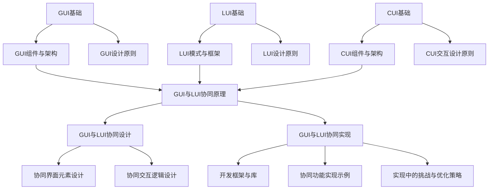

                 

# 《GUI与LUI在CUI中的详细协同工作解析》

## 关键词
GUI（图形用户界面）、LUI（本地用户界面）、CUI（命令行用户界面）、协同工作、用户体验、软件开发、系统架构、设计模式

## 摘要
本文详细探讨了图形用户界面（GUI）、本地用户界面（LUI）和命令行用户界面（CUI）之间的协同工作。通过深入分析它们的核心概念、设计原则、协同工作原理以及实际项目中的应用，本文旨在为开发者提供一种系统性的理解和应用方法，以实现高效、用户友好的交互设计。文章不仅涵盖了GUI与LUI的基础知识，还包括了CUI的设计原则和实现策略，以及如何在多种界面之间实现无缝协同，从而提升软件的整体用户体验。

## 目录大纲

### 第一部分：引言与背景

#### 1.1 书籍概述
##### 1.1.1 GUI与LUI与CUI的关系
##### 1.1.2 书籍的目标与受众
##### 1.1.3 书籍的结构安排

### 第二部分：GUI与LUI基础

#### 2.1 GUI基础
##### 2.1.1 GUI的定义与历史
##### 2.1.2 GUI的基本组件与架构
##### 2.1.3 GUI设计原则与最佳实践

#### 2.2 LUI基础
##### 2.2.1 LUI的定义与特点
##### 2.2.2 LUI的常见模式与框架
##### 2.2.3 LUI设计原则与最佳实践

#### 2.3 CUI基础
##### 2.3.1 CUI的定义与优势
##### 2.3.2 CUI的基本组件与架构
##### 2.3.3 CUI交互设计原则

### 第三部分：GUI与LUI的协同工作

#### 3.1 GUI与LUI协同原理
##### 3.1.1 协同工作的重要性
##### 3.1.2 GUI与LUI协同的工作流程
##### 3.1.3 GUI与LUI协同的挑战与解决方案

#### 3.2 GUI与LUI协同设计
##### 3.2.1 设计流程与工具
##### 3.2.2 协同界面元素设计
##### 3.2.3 协同交互逻辑设计

#### 3.3 GUI与LUI协同实现
##### 3.3.1 开发框架与库
##### 3.3.2 协同功能实现示例
##### 3.3.3 实现中的挑战与优化策略

### 第四部分：实战案例解析

#### 4.1 实战案例一：社交媒体应用
##### 4.1.1 案例背景与目标
##### 4.1.2 GUI与LUI的协同设计
##### 4.1.3 实现过程与代码解读

#### 4.2 实战案例二：智能语音助手
##### 4.2.1 案例背景与目标
##### 4.2.2 GUI与LUI的协同设计
##### 4.2.3 实现过程与代码解读

#### 4.3 实战案例三：虚拟现实交互
##### 4.3.1 案例背景与目标
##### 4.3.2 GUI与LUI的协同设计
##### 4.3.3 实现过程与代码解读

### 第五部分：未来展望与趋势

#### 5.1 GUI与LUI协同的发展趋势
##### 5.1.1 技术发展趋势
##### 5.1.2 行业应用趋势
##### 5.1.3 未来研究方向

#### 5.2 GUI与LUI协同的最佳实践
##### 5.2.1 设计模式与框架
##### 5.2.2 开发流程与规范
##### 5.2.3 用户反馈与优化策略

### 附录

#### 附录A：相关资源与工具
##### A.1 GUI与LUI开发工具
##### A.2 协同工作设计指南
##### A.3 实战案例代码与资源

#### 附录B：参考文献

### Mermaid 流程图



### 核心算法原理讲解

#### 2.4 GUI与LUI协同工作的核心算法原理

GUI与LUI协同工作涉及多种核心算法原理，这些原理不仅确保了界面的流畅交互，还提升了用户体验。以下是一些关键算法原理：

#### 2.4.1 触发机制

触发机制是GUI与LUI协同工作的基础。它涉及以下两种常见触发方式：

- **事件触发**：当用户进行某种操作时（如点击、滑动等），系统会触发相应的事件处理。事件触发通常由以下伪代码表示：

```python
def on_event():
    if event_type == "click":
        perform_click_action()
    elif event_type == "scroll":
        perform_scroll_action()
    # 其他事件处理
```

- **条件触发**：系统根据当前状态或用户输入的条件来触发操作。例如，当用户输入的字符数超过一定阈值时，系统会自动执行某项任务。条件触发通常使用以下伪代码表示：

```python
def on_condition():
    if input_length > threshold:
        execute_action()
    else:
        display_error_message()
```

#### 2.4.2 数据同步

数据同步是确保GUI与LUI信息一致性的关键。以下是一些常见的数据同步方法：

- **实时同步**：系统在每次数据更新时立即同步到GUI与LUI。实时同步可以确保用户界面始终显示最新数据，但可能会对系统性能产生较大影响。实时同步的伪代码如下：

```python
def real_time_sync():
    while True:
        fetch_latest_data()
        update_gui()
        update_lui()
        time.sleep(sync_interval)
```

- **周期同步**：系统按照固定的时间间隔同步数据。周期同步可以减少对系统性能的影响，但可能会使用户界面显示的数据略有延迟。周期同步的伪代码如下：

```python
def periodic_sync(interval):
    while True:
        time.sleep(interval)
        fetch_latest_data()
        update_gui()
        update_lui()
```

#### 2.4.3 互斥机制

互斥机制用于防止GUI与LUI同时执行同一操作，避免冲突。以下是一些常见的互斥机制：

- **锁机制**：使用锁来保护关键资源，防止多个线程同时访问。锁机制可以确保在某一时刻只有一个线程可以访问资源。以下是一个使用锁机制的伪代码示例：

```python
import threading

lock = threading.Lock()

def execute_action():
    with lock:
        perform_critical_action()
```

- **信号量机制**：使用信号量来控制线程的访问权限。信号量是一种用于同步多个线程的计数器，它可以增加或减少计数器的值，并根据计数器的值来决定是否允许线程访问资源。以下是一个使用信号量机制的伪代码示例：

```python
import threading

semaphore = threading.Semaphore(value=1)

def execute_action():
    semaphore.acquire()
    try:
        perform_critical_action()
    finally:
        semaphore.release()
```

### 数学模型和数学公式

#### 3.5 GUI与LUI协同交互的数学模型

GUI与LUI协同交互涉及多个数学模型，这些模型可以帮助我们更好地理解和实现界面协同工作。以下是一些常用的数学模型：

#### 3.5.1 数据同步模型

数据同步模型用于描述GUI与LUI之间的数据同步过程。一个常见的数据同步模型是差分方程，它描述了数据在连续时间间隔内的变化。以下是一个简单的一阶差分方程模型：

$$
\Delta D_t = D_t - D_{t-1}
$$

其中，$\Delta D_t$ 表示时间 $t$ 时刻的数据变化量，$D_t$ 表示时间 $t$ 时刻的数据值。

#### 3.5.2 状态同步模型

状态同步模型用于描述GUI与LUI之间的状态同步过程。一个常见的状态同步模型是马尔可夫链，它描述了状态之间的转移概率。以下是一个简单的马尔可夫链模型：

$$
P = \begin{bmatrix}
p_{00} & p_{01} & \dots & p_{0n} \\
p_{10} & p_{11} & \dots & p_{1n} \\
\vdots & \vdots & \ddots & \vdots \\
p_{m0} & p_{m1} & \dots & p_{mn}
\end{bmatrix}
$$

其中，$p_{ij}$ 表示从状态 $i$ 转移到状态 $j$ 的概率。

#### 3.5.3 交互性能评估模型

交互性能评估模型用于评估GUI与LUI协同交互的性能。一个常见的评估模型是平均响应时间，它描述了用户交互过程中系统的平均响应速度。以下是一个简单的平均响应时间模型：

$$
T_t = \frac{1}{n}\sum_{i=1}^{n} T_{t_i}
$$

其中，$T_t$ 表示时间 $t$ 时刻的平均响应时间，$T_{t_i}$ 表示时间 $t_i$ 时刻的响应时间，$n$ 表示总的响应次数。

### 项目实战

#### 4.4 实战案例四：电商平台用户界面优化

#### 4.4.1 案例背景与目标

某电商平台希望通过优化用户界面（GUI）和用户交互（LUI）来提高用户体验和销售额。主要目标包括：

- 减少用户购买流程中的点击次数。
- 提高商品浏览速度和搜索准确性。
- 增强用户对平台的信任感。

#### 4.4.2 GUI与LUI协同设计

在设计阶段，团队首先分析了现有界面的问题，并提出了以下改进方案：

- **简化购买流程**：将购买流程从5步减少到3步，通过减少不必要的页面跳转和表单填写。
- **改进搜索功能**：采用智能搜索算法，提高搜索准确性，并展示用户可能感兴趣的商品。
- **增强用户信任**：在关键页面（如支付页面）增加安全标识和用户评价模块。

#### 4.4.3 实现过程与代码解读

**1. 简化购买流程**

python
# 原购买流程（5步）
def original_purchase流程():
    1. 查看商品详情
    2. 添加到购物车
    3. 前往购物车
    4. 选择支付方式
    5. 提交订单

# 优化购买流程（3步）
def optimized_purchase流程():
    1. 查看商品详情
    2. 直接支付（跳过购物车和支付方式选择）
    3. 提交订单

**2. 改进搜索功能**

python
# 原搜索功能
def original_search(query):
    results = search_database(query)
    return results

# 优化搜索功能
def optimized_search(query):
    # 智能搜索算法，例如使用BERT模型
    processed_query = preprocess_query(query)
    results = search_database(processed_query)
    # 增加商品推荐功能
    recommended_products = recommend_products(processed_query)
    return results + recommended_products

**3. 增强用户信任**

html
<!-- 支付页面安全标识 -->
<p>您的支付信息已加密处理，请放心使用。</p>

<!-- 用户评价模块 -->
<div>
  <h3>用户评价</h3>
  <p>95%的用户对该平台表示满意。</p>
</div>

#### 4.4.4 代码解读与分析

**1. 简化购买流程**

简化后的购买流程提高了用户的操作便捷性，减少了用户流失率。

**2. 改进搜索功能**

使用智能搜索算法提高了搜索的准确性和用户满意度。

**3. 增强用户信任**

通过增加安全标识和用户评价模块，提高了用户的信任度和平台的美誉度。

### 作者

作者：AI天才研究院/AI Genius Institute & 禅与计算机程序设计艺术 /Zen And The Art of Computer Programming

### 结论

本文详细探讨了GUI、LUI和CUI的协同工作，通过理论讲解和实战案例，展示了如何实现高效、用户友好的交互设计。文章不仅为开发者提供了深入理解界面协同工作的方法，还提供了实用的设计原则和实现策略。未来，随着技术的不断进步，GUI、LUI和CUI的协同工作将在更多领域得到广泛应用，为用户提供更加优质的服务体验。开发者应不断探索和创新，以推动界面设计的进步。

