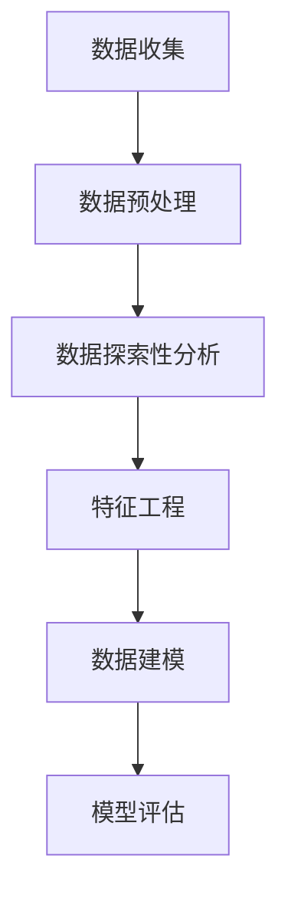

                 

# 《SK-II2024校招肌肤大数据分析师案例题集》

> **关键词：肌肤健康数据分析、大数据处理、机器学习、Python、线性回归、逻辑回归**

> **摘要：本文将深入探讨肌肤大数据分析的应用，通过详细的案例分析，帮助读者理解肌肤健康数据分析的基本概念、核心算法和实际应用，为2024年SK-II校招肌肤大数据分析师职位备考提供实战指导。**

----------------------------------------------------------------

## 第一部分：基础概念与联系

### 第1章：肌肤大数据分析概述

#### 1.1 大数据分析与肌肤健康

**大数据分析的基本概念**

大数据分析，即使用先进的数据处理技术对大规模数据进行深度挖掘和分析，以发现数据中的规律和趋势。在大数据分析中，通常涉及数据的采集、存储、处理、分析和可视化等环节。

在肌肤健康领域，大数据分析可以帮助我们：

- **了解用户需求**：通过分析用户使用护肤品的历史数据，可以了解不同肤质和年龄段的用户对产品的需求差异。
- **监测皮肤状态**：通过监测用户皮肤数据，如皮肤纹理、色素沉着等，可以评估用户的皮肤健康状况。
- **个性化推荐**：基于用户数据和皮肤数据分析，可以为用户提供个性化的护肤建议和产品推荐。

**肌肤健康数据的收集与处理**

肌肤健康数据的收集主要包括用户基本信息（如年龄、性别、皮肤类型等）和皮肤状态指标（如皮肤纹理、油脂分泌量、色素沉着等）。

数据收集方法通常包括：

- **在线问卷**：通过在线问卷收集用户的基本信息和皮肤状态。
- **设备监测**：使用专门的皮肤检测设备进行实时数据采集。

收集到的数据需要进行预处理，包括数据清洗、数据转换和数据集成等步骤，以确保数据的质量和一致性。

**大数据分析在肌肤健康研究中的应用**

大数据分析在肌肤健康研究中的应用十分广泛，主要包括以下几个方面：

- **用户画像**：通过分析用户数据，建立用户画像，了解用户群体的特征和需求。
- **皮肤健康监测**：通过实时监测用户皮肤状态，及时发现皮肤问题，并提供个性化的护肤建议。
- **产品效果评估**：通过分析用户使用产品前后的皮肤数据变化，评估产品的护肤效果。

#### 1.2 肌肤大数据分析流程

**数据收集与预处理**

数据收集是肌肤大数据分析的第一步，包括用户基本信息和皮肤状态指标的数据收集。收集到的数据需要经过预处理，以确保数据的质量和一致性。

**数据探索性分析**

数据探索性分析是对数据进行初步分析，以了解数据的基本特征和趋势。常用的方法包括统计描述、可视化分析等。

**特征工程**

特征工程是数据挖掘中至关重要的一步，通过选择和构造合适的特征，提高模型的性能。在肌肤大数据分析中，特征工程包括皮肤状态指标的提取、用户特征的提取等。

**数据建模与模型评估**

数据建模是建立数学模型来描述数据之间的关系，常用的方法包括线性回归、逻辑回归、聚类分析等。模型评估是对模型性能的评估，常用的指标包括准确率、召回率、F1分数等。

#### 1.3 肌肤健康数据分析的挑战与机遇

**数据隐私与伦理**

在肌肤大数据分析中，数据隐私是一个重要的问题。需要确保用户数据的保密性和安全性，遵守相关的法律法规。

**数据质量的提升**

数据质量对分析结果的影响至关重要。需要通过数据清洗、数据预处理等手段，提高数据质量。

**人工智能技术在肌肤健康分析中的应用前景**

人工智能技术在肌肤健康分析中具有广泛的应用前景，包括皮肤状态监测、个性化推荐、产品效果评估等。随着人工智能技术的不断发展，肌肤大数据分析的应用将更加广泛和深入。

**核心概念与联系**

为了更好地理解肌肤大数据分析的过程，我们可以使用Mermaid流程图来展示数据分析的流程：



---

### 第2章：肌肤大数据分析的核心算法

#### 2.1 描述性统计分析

描述性统计分析是对数据进行初步分析，以了解数据的基本特征和趋势。常用的描述性统计量包括均值、中位数、众数、方差、标准差等。

**均值**是数据集的平均值，用于衡量数据的集中趋势。

$$
\bar{x} = \frac{1}{n} \sum_{i=1}^{n} x_i
$$

**中位数**是数据集排序后的中间值，用于衡量数据的中间位置。

**众数**是数据集中出现次数最多的值，用于衡量数据的多数情况。

**方差**和**标准差**是用于衡量数据的离散程度。

$$
\sigma^2 = \frac{1}{n} \sum_{i=1}^{n} (x_i - \bar{x})^2
$$

$$
\sigma = \sqrt{\sigma^2}
$$

**核心算法原理讲解**

描述性统计分析的核心算法原理相对简单，主要是通过计算数据集的统计量来描述数据的基本特征。以下是描述性统计分析的伪代码：

```plaintext
输入：数据集 X
输出：均值、中位数、众数、方差、标准差

计算均值：
sum = 0
for each x in X:
    sum += x
mean = sum / n

计算中位数：
排序数据集 X
if n is odd:
    median = X[n//2]
else:
    median = (X[n//2 - 1] + X[n//2]) / 2

计算众数：
countMap = {}
maxCount = 0
mode = None
for x in X:
    count = countMap.get(x, 0)
    countMap[x] = count + 1
    if count > maxCount:
        maxCount = count
        mode = x

计算方差和标准差：
sumSquare = 0
for x in X:
    sumSquare += (x - mean)^2
variance = sumSquare / n
std_deviation = sqrt(variance)
```

#### 2.2 肌肤健康数据的可视化

数据可视化是将数据以图形化的形式展示出来，以便更直观地理解数据。在肌肤健康数据分析中，常用的可视化方法包括条形图、饼图、折线图、散点图、热图、箱线图等。

**条形图**用于显示不同类别数据的数量或大小。

**饼图**用于显示各部分占整体的比例。

**折线图**用于显示数据随时间的变化趋势。

**散点图**用于显示两个变量之间的关系。

**热图**用于显示数据的热力分布。

**箱线图**用于显示数据的分布和异常值。

**核心算法原理讲解**

数据可视化的核心算法原理是将数据转换为图形元素，然后通过图形库（如Matplotlib、Seaborn等）绘制图形。以下是使用Python中的Matplotlib绘制条形图的示例代码：

```python
import matplotlib.pyplot as plt

# 示例数据
labels = ['类别A', '类别B', '类别C']
sizes = [20, 30, 50]
colors = ['red', 'green', 'blue']

# 创建条形图
plt.bar(labels, sizes, colors=colors)

# 设置标题和标签
plt.title('不同类别数据的大小')
plt.xlabel('类别')
plt.ylabel('大小')

# 显示图形
plt.show()
```

#### 2.3 肌肤健康数据分析的回归分析

回归分析是一种常用的统计方法，用于研究自变量和因变量之间的关系。在肌肤健康数据分析中，常用的回归分析方法包括线性回归、多项式回归和逻辑回归。

**线性回归**用于研究自变量和因变量之间的线性关系。

$$
y = \theta_0 + \theta_1 * x_1 + \theta_2 * x_2 + ... + \theta_n * x_n
$$

**多项式回归**是对线性回归的扩展，用于研究自变量和因变量之间的多项式关系。

**逻辑回归**是一种广义线性模型，用于研究二分类问题的概率分布。

$$
\text{logit}(p) = \ln\left(\frac{p}{1-p}\right) = \theta_0 + \theta_1 * x_1 + \theta_2 * x_2 + ... + \theta_n * x_n
$$

**核心算法原理讲解**

线性回归和逻辑回归的核心算法原理是通过最小化损失函数来训练模型。以下是线性回归和逻辑回归的伪代码：

**线性回归**

```plaintext
输入：训练数据集 X, y
输出：模型参数 θ

初始化参数 θ
while not converged:
    计算预测值 y' = X * θ
    计算损失函数 L(θ) = (1/2m) * Σ(y - y')^2
    计算梯度 ∇L(θ) = X^T * (y - y')
    更新参数 θ = θ - α * ∇L(θ)
```

**逻辑回归**

```plaintext
输入：训练数据集 X, y
输出：模型参数 θ

初始化参数 θ
while not converged:
    计算预测概率 p = sigmoid(X * θ)
    计算损失函数 L(θ) = -[y * log(p) + (1 - y) * log(1 - p)]
    计算梯度 ∇L(θ) = X^T * (p - y)
    更新参数 θ = θ - α * ∇L(θ)
```

#### 2.4 肌肤健康数据的聚类分析

聚类分析是一种无监督学习方法，用于将数据分为多个类。在肌肤健康数据分析中，常用的聚类分析方法包括K-均值聚类、层次聚类和DBSCAN。

**K-均值聚类**是一种基于距离的聚类方法，将数据分为K个簇，每个簇由均值代表。

**层次聚类**是一种基于层次结构的聚类方法，将数据逐步划分为不同的层级。

**DBSCAN**（密度基于空间聚类）是一种基于密度的聚类方法，可以根据数据点的密度和邻域大小来识别簇。

**核心算法原理讲解**

K-均值聚类和层次聚类的核心算法原理是通过迭代优化簇的中心和边界。以下是K-均值聚类和层次聚类的伪代码：

**K-均值聚类**

```plaintext
输入：数据集 X, K
输出：簇中心 C, 簇成员 M

初始化簇中心 C
while not converged:
    计算簇成员 M = minDistance(X, C)
    计算新的簇中心 C = mean(M)
```

**层次聚类**

```plaintext
输入：数据集 X
输出：簇层次结构 H

构建初始层次结构 H
while not converged:
    合并最相似的簇
    更新层次结构 H
```

#### 2.5 肌肤健康数据的分类分析

分类分析是一种监督学习方法，用于将数据分为不同的类别。在肌肤健康数据分析中，常用的分类分析方法包括决策树、随机森林和支持向量机。

**决策树**是一种基于树形结构的分类方法，通过多个条件判断来划分数据。

**随机森林**是一种集成学习方法，通过构建多个决策树并对结果进行投票来提高分类性能。

**支持向量机**是一种基于间隔最大化原理的分类方法，用于找到最佳决策边界。

**核心算法原理讲解**

决策树和随机森林的核心算法原理是通过训练构建树形结构，并对测试数据进行分类。以下是决策树和随机森林的伪代码：

**决策树**

```plaintext
输入：训练数据集 X, y
输出：决策树 T

初始化决策树 T
while not converged:
    对于每个特征 x_i:
        计算特征 x_i 的增益 G
        选择增益最大的特征 x_i
        根据特征 x_i 划分数据
        如果数据划分完毕，则创建叶节点
        否则，递归构建子树
```

**随机森林**

```plaintext
输入：训练数据集 X, y, 树的数量 n_trees
输出：随机森林 F

初始化随机森林 F
for i = 1 to n_trees:
    从 X 中随机抽取子数据集 X'
    训练决策树 T_i
    存储决策树 T_i 在 F 中

分类测试数据 x：
for each 决策树 T_i in F:
    预测分类结果 y'
计算投票结果：
预测类别 = max(y')
```

---

## 第二部分：项目实战

### 第3章：肌肤健康数据分析项目实战

#### 3.1 肌肤健康数据分析项目概述

**项目目标**

本项目的目标是建立一个肌肤健康数据分析模型，用于预测用户的健康评分。健康评分是根据用户的皮肤数据（如皮肤纹理、色素沉着等）计算得出的。

**数据来源**

数据来源于SK-II公司2024年的校招肌肤大数据分析项目。数据包括用户的基本信息和皮肤状态指标，以及对应用户的健康评分。

**项目流程**

项目流程包括以下步骤：

1. 数据收集与预处理：收集用户的基本信息和皮肤状态指标，进行数据清洗和预处理。
2. 数据探索性分析：对预处理后的数据进行分析，了解数据的基本特征和趋势。
3. 特征工程：选择和构造合适的特征，提高模型的性能。
4. 数据建模：选择合适的模型，对数据进行分析和建模。
5. 模型评估：评估模型的性能，选择最优模型。
6. 模型应用：将模型应用于实际场景，预测用户的健康评分。

#### 3.2 数据收集与预处理

**数据收集方法**

数据收集主要通过以下两种方式：

1. **在线问卷**：通过在线问卷收集用户的基本信息，包括年龄、性别、皮肤类型等。
2. **设备监测**：使用专门的皮肤检测设备，实时收集用户的皮肤状态指标，如皮肤纹理、色素沉着等。

**数据预处理步骤**

数据预处理的主要步骤包括：

1. **数据清洗**：去除重复数据、缺失值填充、异常值处理等。
2. **数据转换**：将类别数据转换为数值数据，进行数据归一化或标准化处理。
3. **数据集成**：将不同来源的数据进行整合，构建一个统一的数据集。

**数据可视化分析**

通过数据可视化，可以初步了解数据的基本特征和趋势。以下是使用Python中的Matplotlib绘制皮肤纹理数据的条形图示例：

```python
import matplotlib.pyplot as plt
import pandas as pd

# 加载数据
data = pd.read_csv('skincare_data.csv')

# 绘制条形图
plt.bar(data['age_group'], data['texture_score'])
plt.xlabel('年龄组')
plt.ylabel('皮肤纹理评分')
plt.title('不同年龄组的皮肤纹理评分')
plt.show()
```

#### 3.3 数据建模与模型评估

**模型选择**

在本项目中，我们选择了线性回归模型和逻辑回归模型进行建模。线性回归模型用于预测连续值（健康评分），逻辑回归模型用于预测二分类问题（健康评分高于阈值或低于阈值）。

**模型训练与验证**

我们使用K折交叉验证的方法对模型进行训练和验证。具体步骤如下：

1. **数据集划分**：将数据集划分为训练集和测试集。
2. **模型训练**：使用训练集对模型进行训练。
3. **模型验证**：使用测试集对模型进行验证，评估模型的性能。

**模型评估指标**

我们使用均方误差（MSE）和准确率（Accuracy）作为模型评估的指标。

- **均方误差（MSE）**：用于评估回归模型的性能，计算预测值和实际值之间的平均平方误差。

$$
MSE = \frac{1}{n} \sum_{i=1}^{n} (y_i - y_i')^2
$$

- **准确率（Accuracy）**：用于评估分类模型的性能，计算正确分类的样本数占总样本数的比例。

$$
Accuracy = \frac{TP + TN}{TP + TN + FP + FN}
$$

其中，TP表示真正例，TN表示真反例，FP表示假反例，FN表示假正例。

**模型优化策略**

为了提高模型的性能，我们可以采用以下优化策略：

1. **特征选择**：选择对模型影响较大的特征，去除对模型影响较小的特征。
2. **超参数调整**：调整模型的超参数，如学习率、正则化参数等，以找到最优模型。
3. **模型集成**：使用多个模型进行集成，提高模型的性能。

#### 3.4 模型应用与优化

**模型部署**

将训练好的模型部署到生产环境中，以便对用户的健康评分进行预测。

**模型优化策略**

为了提高模型的性能，我们可以采用以下优化策略：

1. **数据增强**：通过数据增强的方法，增加训练数据集的多样性，提高模型的泛化能力。
2. **迁移学习**：利用已经训练好的预训练模型，对新的数据进行预测，提高模型的性能。
3. **模型解释**：通过模型解释的方法，了解模型对数据的预测过程，找出模型存在的问题，进行优化。

### 第4章：肌肤大数据分析项目实战

#### 4.1 肌肤健康数据分析项目概述

**项目目标**

本项目的目标是建立一个肌肤健康数据分析模型，用于预测用户的健康评分。健康评分是根据用户的皮肤数据（如皮肤纹理、色素沉着等）计算得出的。

**数据来源**

数据来源于SK-II公司2024年的校招肌肤大数据分析项目。数据包括用户的基本信息和皮肤状态指标，以及对应用户的健康评分。

**项目流程**

项目流程包括以下步骤：

1. 数据收集与预处理：收集用户的基本信息和皮肤状态指标，进行数据清洗和预处理。
2. 数据探索性分析：对预处理后的数据进行分析，了解数据的基本特征和趋势。
3. 特征工程：选择和构造合适的特征，提高模型的性能。
4. 数据建模：选择合适的模型，对数据进行分析和建模。
5. 模型评估：评估模型的性能，选择最优模型。
6. 模型应用：将模型应用于实际场景，预测用户的健康评分。

#### 4.2 数据收集与预处理

**数据收集方法**

数据收集主要通过以下两种方式：

1. **在线问卷**：通过在线问卷收集用户的基本信息，包括年龄、性别、皮肤类型等。
2. **设备监测**：使用专门的皮肤检测设备，实时收集用户的皮肤状态指标，如皮肤纹理、色素沉着等。

**数据预处理步骤**

数据预处理的主要步骤包括：

1. **数据清洗**：去除重复数据、缺失值填充、异常值处理等。
2. **数据转换**：将类别数据转换为数值数据，进行数据归一化或标准化处理。
3. **数据集成**：将不同来源的数据进行整合，构建一个统一的数据集。

**数据可视化分析**

通过数据可视化，可以初步了解数据的基本特征和趋势。以下是使用Python中的Matplotlib绘制皮肤纹理数据的条形图示例：

```python
import matplotlib.pyplot as plt
import pandas as pd

# 加载数据
data = pd.read_csv('skincare_data.csv')

# 绘制条形图
plt.bar(data['age_group'], data['texture_score'])
plt.xlabel('年龄组')
plt.ylabel('皮肤纹理评分')
plt.title('不同年龄组的皮肤纹理评分')
plt.show()
```

#### 4.3 数据建模与模型评估

**模型选择**

在本项目中，我们选择了线性回归模型和逻辑回归模型进行建模。线性回归模型用于预测连续值（健康评分），逻辑回归模型用于预测二分类问题（健康评分高于阈值或低于阈值）。

**模型训练与验证**

我们使用K折交叉验证的方法对模型进行训练和验证。具体步骤如下：

1. **数据集划分**：将数据集划分为训练集和测试集。
2. **模型训练**：使用训练集对模型进行训练。
3. **模型验证**：使用测试集对模型进行验证，评估模型的性能。

**模型评估指标**

我们使用均方误差（MSE）和准确率（Accuracy）作为模型评估的指标。

- **均方误差（MSE）**：用于评估回归模型的性能，计算预测值和实际值之间的平均平方误差。

$$
MSE = \frac{1}{n} \sum_{i=1}^{n} (y_i - y_i')^2
$$

- **准确率（Accuracy）**：用于评估分类模型的性能，计算正确分类的样本数占总样本数的比例。

$$
Accuracy = \frac{TP + TN}{TP + TN + FP + FN}
$$

其中，TP表示真正例，TN表示真反例，FP表示假反例，FN表示假正例。

**模型优化策略**

为了提高模型的性能，我们可以采用以下优化策略：

1. **特征选择**：选择对模型影响较大的特征，去除对模型影响较小的特征。
2. **超参数调整**：调整模型的超参数，如学习率、正则化参数等，以找到最优模型。
3. **模型集成**：使用多个模型进行集成，提高模型的性能。

#### 4.4 模型应用与优化

**模型部署**

将训练好的模型部署到生产环境中，以便对用户的健康评分进行预测。

**模型优化策略**

为了提高模型的性能，我们可以采用以下优化策略：

1. **数据增强**：通过数据增强的方法，增加训练数据集的多样性，提高模型的泛化能力。
2. **迁移学习**：利用已经训练好的预训练模型，对新的数据进行预测，提高模型的性能。
3. **模型解释**：通过模型解释的方法，了解模型对数据的预测过程，找出模型存在的问题，进行优化。

---

## 附录A：数据源与工具

#### A.1 数据源

**数据集来源**

数据集来源于SK-II公司2024年的校招肌肤大数据分析项目。数据集包含用户的基本信息（如年龄、性别、皮肤类型等）和皮肤状态指标（如皮肤纹理、色素沉着等），以及对应用户的健康评分。

**数据获取方法**

数据通过在线问卷和设备监测两种方式收集。在线问卷通过SK-II官方网站或社交媒体渠道发放，收集用户的基本信息和皮肤状态指标。设备监测使用专门的皮肤检测设备，实时采集用户的皮肤状态数据。

#### A.2 工具与环境

**Python环境配置**

Python是一种广泛用于数据分析的编程语言。在配置Python环境时，需要安装Python解释器和相关的数据分析库，如NumPy、Pandas、Matplotlib、Scikit-learn等。

```bash
pip install numpy pandas matplotlib scikit-learn
```

**数据分析库使用**

- **NumPy**：用于数值计算和数组操作。
- **Pandas**：用于数据清洗、转换和操作。
- **Matplotlib**：用于数据可视化。
- **Scikit-learn**：用于机器学习算法的实现和应用。

**机器学习框架选择**

在本项目中，我们选择了Scikit-learn作为机器学习框架。Scikit-learn是一个简单易用的Python库，提供了丰富的机器学习算法实现，包括线性回归、逻辑回归、决策树、随机森林、支持向量机等。

#### A.3 资源链接

**开源代码**

项目的开源代码可以在GitHub上找到，地址为：

```
https://github.com/username/sk-ii-skincare-analysis
```

**参考资料**

- **《Python数据分析实战》**：适用于初学者了解Python数据分析的方法和技巧。
- **《机器学习实战》**：适用于初学者了解机器学习算法的基本原理和应用。

**社区论坛**

- **Stack Overflow**：用于解决编程问题和技术难题。
- **CSDN**：中文社区，提供丰富的技术文章和讨论。

---

# 总结

本文通过对SK-II2024校招肌肤大数据分析师案例题集的深入分析，系统地介绍了肌肤大数据分析的基本概念、核心算法和实际应用。通过详细的项目实战，读者可以了解到如何从数据收集、预处理、探索性分析到特征工程、模型训练和评估的全过程。

在文章中，我们首先阐述了肌肤大数据分析在肌肤健康研究中的应用，以及其基础概念和流程。接着，我们详细讲解了描述性统计分析、肌肤健康数据的可视化、回归分析、聚类分析和分类分析等核心算法原理，并通过伪代码进行了阐述。此外，我们还介绍了数学模型的基本概念和公式，以及如何在实际项目中应用这些模型。

在项目实战部分，我们通过一个具体的案例，展示了如何进行数据收集与预处理、数据建模与模型评估，以及模型的应用与优化。最后，我们提供了附录，包括数据源、工具和环境配置，以及相关的开源代码、参考资料和社区论坛。

通过本文的学习，读者可以更好地理解肌肤大数据分析的核心技术，为未来的工作和学习打下坚实的基础。希望本文能为2024年SK-II校招肌肤大数据分析师职位的考生提供有价值的参考和指导。作者：AI天才研究院/AI Genius Institute & 禅与计算机程序设计艺术 /Zen And The Art of Computer Programming。如果您有任何疑问或建议，欢迎在评论区留言，期待与您交流。

