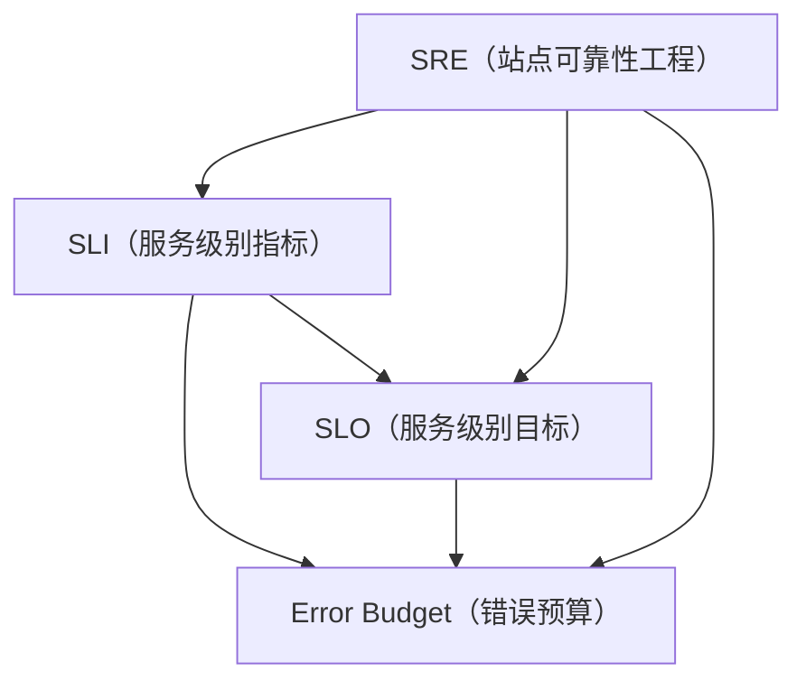

                 

### 《SRE实践：确保系统可靠性的方法论》

#### 关键词：SRE、可靠性、自动化、监控、故障处理、性能优化

#### 摘要：
本文将探讨现代IT领域中的重要概念——站点可靠性工程（SRE）。SRE是一种结合了软件工程和系统管理的实践方法，旨在确保系统的稳定性和可靠性。通过分析SRE的核心原则、关键概念和实践方法，本文将深入解读如何利用SRE方法论来构建和维护一个可靠、高效的系统。文章还将结合案例分析，探讨SRE在大型互联网公司和不同行业中的应用，以及相关的工具和技术。最终，我们将讨论如何通过持续学习和改进，不断提升SRE实践的效能。

### 第一部分：SRE基础

#### 第1章：SRE概述

SRE，即Site Reliability Engineering，是一种旨在确保系统可靠性的工程实践。它起源于Google，并逐渐在互联网行业得到广泛应用。SRE的核心目标是确保系统的稳定性和可靠性，同时保持快速创新和持续改进。

#### 1.1 SRE的核心原则

SRE的核心原则可以总结为以下几点：

1. **自动化**：通过自动化工具和流程，减少人为干预，提高效率和减少错误。
2. **监控**：实时监控系统性能，确保及时发现问题并进行修复。
3. **故障处理**：快速识别和解决故障，确保系统持续运行。
4. **持续改进**：通过不断的实践和总结，提升系统的可靠性和性能。

#### 1.2 SRE与传统IT运维的区别

SRE与传统IT运维之间存在显著差异。传统IT运维侧重于保障系统的稳定运行，而SRE更注重系统的可靠性和自动化。

1. **目标不同**：传统运维更多关注系统的可用性和维护，而SRE更关注系统的稳定性和持续创新。
2. **方法不同**：传统运维依赖于人工操作和经验，而SRE依赖于自动化和监控。
3. **技能要求**：传统运维更多需要操作技能，而SRE则需要软件开发和系统管理的综合技能。

#### 1.3 SRE在组织中的定位

在组织内部，SRE通常位于开发团队和运维团队之间，起到桥梁和协调者的角色。具体而言，SRE的职责包括：

1. **确保系统可靠性**：通过自动化和监控，确保系统持续稳定运行。
2. **故障处理**：快速响应和解决故障，减少系统停机时间。
3. **性能优化**：持续监控和优化系统性能，提升用户体验。
4. **代码质量保证**：参与代码审查和测试，确保代码质量和系统稳定性。

#### 第2章：SRE关键概念

在SRE实践中，一些关键概念和术语是理解其方法的核心。以下将介绍这些概念：

##### 2.1 SLI（服务级别指标）

服务级别指标（SLI）是衡量系统性能和可靠性的关键指标。常见的SLI包括：

1. **响应时间**：系统处理请求所需的时间。
2. **吞吐量**：系统每单位时间处理的请求量。
3. **错误率**：系统处理请求时出现错误的频率。

#### 2.2 SLO（服务级别目标）

服务级别目标（SLO）是组织设定的系统性能和可靠性的目标。例如，可以设定系统99.9%的时间响应时间不超过500毫秒。

#### 2.3 Error Budget（错误预算）

错误预算是指在一定时间内系统允许发生的错误数量。通过错误预算，组织可以更好地管理风险和资源。

#### 第3章：SRE架构与实践

SRE的架构和实践是其确保系统可靠性的关键。以下将介绍SRE架构设计原则、自动化监控系统的构建、以及回滚与快速恢复策略。

##### 3.1 SRE架构设计原则

SRE架构设计原则主要包括：

1. **高可用性**：确保系统在任何情况下都能正常运行。
2. **可扩展性**：系统能够随着负载增加而扩展。
3. **容错性**：系统能够在故障发生时自动恢复。
4. **自动化**：尽可能减少人为干预，提高效率和减少错误。

##### 3.2 自动化监控系统的构建

自动化监控系统是SRE实践的核心。以下是一个典型的自动化监控系统构建流程：

1. **数据收集**：通过各种监控工具收集系统数据。
2. **数据处理**：对收集到的数据进行处理和存储。
3. **告警机制**：当系统指标超出阈值时，触发告警。
4. **自动化响应**：根据告警信息，自动执行相应的处理措施。

##### 3.3 回滚与快速恢复策略

回滚和快速恢复策略是SRE实践中重要的环节。以下是一个典型的回滚和恢复策略：

1. **回滚**：当发现系统问题可能与最新部署有关时，回滚到上一个稳定版本。
2. **快速恢复**：在故障发生时，快速定位问题并进行修复，确保系统尽快恢复正常运行。

### 第二部分：SRE实践方法

#### 第4章：故障处理流程

故障处理流程是SRE实践中至关重要的一环。以下将介绍故障响应策略、故障排查工具与方法，以及复现故障的技巧。

##### 4.1 故障响应策略

故障响应策略主要包括以下步骤：

1. **监控告警**：当系统出现异常时，触发监控告警。
2. **快速响应**：立即启动故障响应流程，尽快定位问题。
3. **紧急处理**：在故障处理过程中，采取紧急措施，如暂停服务、回滚部署等。
4. **恢复与验证**：故障修复后，进行验证和恢复，确保系统恢复正常运行。

##### 4.2 故障排查工具与方法

故障排查工具与方法主要包括：

1. **日志分析**：通过日志分析工具，如ELK（Elasticsearch、Logstash、Kibana），分析系统日志。
2. **性能分析**：使用性能分析工具，如Prometheus、Grafana，监控系统性能指标。
3. **故障复现**：通过故障复现工具，如JMeter、Locust，模拟故障场景。

##### 4.3 复现故障的技巧

复现故障的技巧主要包括：

1. **逐步缩小范围**：从系统整体入手，逐步缩小故障范围。
2. **故障定位**：通过故障复现，确定故障发生的位置。
3. **多角度分析**：从多个角度分析故障原因，确保全面了解故障。

#### 第5章：容量规划和资源管理

容量规划和资源管理是确保系统稳定运行的基础。以下将介绍容量规划的核心要素、负载均衡技术，以及资源利用率监控与分析。

##### 5.1 容量规划的核心要素

容量规划的核心要素包括：

1. **需求分析**：分析系统需求和预期负载。
2. **资源分配**：根据需求分析结果，合理分配资源。
3. **容灾备份**：建立容灾备份机制，确保数据安全。

##### 5.2 负载均衡技术

负载均衡技术是确保系统稳定运行的关键。常见的负载均衡技术包括：

1. **轮询负载均衡**：按顺序将请求分配到不同的服务器。
2. **最少连接负载均衡**：将请求分配到连接数最少的服务器。
3. **源地址哈希负载均衡**：根据客户端IP地址进行哈希计算，将请求分配到同一服务器。

##### 5.3 资源利用率监控与分析

资源利用率监控与分析是确保系统稳定运行的重要手段。以下是一个典型的资源利用率监控与分析流程：

1. **数据收集**：通过监控工具收集系统资源利用率数据。
2. **数据处理**：对收集到的数据进行处理和存储。
3. **告警机制**：当资源利用率超过阈值时，触发告警。
4. **优化建议**：根据资源利用率数据，提出优化建议。

#### 第6章：服务性能优化

服务性能优化是提升用户体验和系统效率的关键。以下将介绍性能监控指标、性能调优策略，以及性能瓶颈分析与解决。

##### 6.1 性能监控指标

性能监控指标主要包括：

1. **响应时间**：系统处理请求所需的时间。
2. **吞吐量**：系统每单位时间处理的请求量。
3. **错误率**：系统处理请求时出现错误的频率。

##### 6.2 性能调优策略

性能调优策略主要包括：

1. **代码优化**：通过优化代码，减少系统开销。
2. **缓存策略**：使用缓存技术，减少数据库访问次数。
3. **数据库优化**：优化数据库查询和索引，提高查询效率。

##### 6.3 性能瓶颈分析与解决

性能瓶颈分析与解决主要包括：

1. **定位瓶颈**：通过性能监控工具，定位系统性能瓶颈。
2. **优化瓶颈**：针对定位到的瓶颈，提出优化方案。
3. **测试验证**：对优化方案进行测试验证，确保性能提升。

#### 第7章：代码质量保证

代码质量保证是确保系统稳定性和可靠性的重要保障。以下将介绍单元测试的重要性、集成测试与持续集成，以及性能测试与压力测试。

##### 7.1 单元测试的重要性

单元测试是代码质量保证的基础。单元测试的重要性体现在：

1. **发现缺陷**：通过单元测试，及时发现代码中的缺陷。
2. **提高代码质量**：通过单元测试，确保代码符合预期行为。
3. **降低维护成本**：通过单元测试，降低代码维护成本。

##### 7.2 集成测试与持续集成

集成测试与持续集成是代码质量保证的重要环节。以下是一个典型的集成测试与持续集成流程：

1. **代码审查**：对提交的代码进行审查，确保符合编码规范。
2. **集成测试**：在集成环境中运行测试，确保模块之间兼容。
3. **持续集成**：将测试结果与代码库同步，确保持续集成和部署。

##### 7.3 性能测试与压力测试

性能测试与压力测试是代码质量保证的重要手段。以下是一个典型的性能测试与压力测试流程：

1. **测试设计**：根据系统需求，设计性能测试和压力测试用例。
2. **测试执行**：在测试环境中执行测试用例，记录测试结果。
3. **性能分析**：对测试结果进行分析，发现性能瓶颈。

#### 第8章：自动化部署与管理

自动化部署与管理是SRE实践中的重要环节。以下将介绍自动化部署流程、灰度发布与回滚，以及部署管理工具与技术。

##### 8.1 自动化部署流程

自动化部署流程主要包括以下步骤：

1. **代码仓库管理**：使用代码仓库管理工具，如GitLab，管理代码。
2. **自动化构建**：使用自动化构建工具，如Jenkins，构建和打包代码。
3. **自动化部署**：使用自动化部署工具，如Ansible，部署代码到生产环境。
4. **自动化测试**：在部署过程中，运行自动化测试，确保代码质量。

##### 8.2 灰度发布与回滚

灰度发布与回滚是自动化部署中的重要环节。以下是一个典型的灰度发布与回滚流程：

1. **灰度发布**：将新版本代码逐步部署到部分用户，观察其运行情况。
2. **回滚**：如果发现新版本存在问题，立即回滚到旧版本，确保系统稳定运行。

##### 8.3 部署管理工具与技术

部署管理工具与技术主要包括：

1. **Kubernetes**：用于容器化应用的自动化部署和管理。
2. **Docker**：用于容器化应用的开发和部署。
3. **Prometheus**：用于监控和管理容器化应用。

#### 第9章：持续学习与改进

持续学习与改进是SRE实践中的重要原则。以下将介绍持续学习的重要性、实践中的反思与总结，以及如何持续改进SRE实践。

##### 9.1 持续学习的重要性

持续学习是SRE实践的重要基石。以下是一些持续学习的方法：

1. **阅读与研究**：阅读相关书籍、论文和研究报告，了解最新技术和发展趋势。
2. **参加培训与研讨会**：参加专业培训和研讨会，与同行交流和学习。
3. **实践与反思**：通过实践，总结经验和教训，不断改进。

##### 9.2 实践中的反思与总结

实践中的反思与总结是持续学习的重要环节。以下是一些反思与总结的方法：

1. **定期回顾**：定期回顾过去的实践，总结成功和失败的经验。
2. **记录与分享**：记录实践中的问题和解决方法，与他人分享，互相学习。
3. **反馈与改进**：根据反馈，不断改进实践方法和流程。

##### 9.3 如何持续改进SRE实践

以下是一些持续改进SRE实践的方法：

1. **引入新技术**：根据技术发展趋势，引入新的工具和技术，提高效率和可靠性。
2. **优化流程**：不断优化部署、监控、故障处理等流程，减少人为干预。
3. **团队协作**：加强团队协作，提高沟通和协作效率，共同推进SRE实践。

### 第三部分：SRE案例分析

#### 第10章：大型互联网公司的SRE实践

在大型互联网公司中，SRE实践已经成为确保系统可靠性和高效运行的关键。以下将介绍腾讯、百度和字节跳动等公司的SRE实践。

##### 10.1 腾讯的SRE实践

腾讯在SRE实践中，注重自动化和监控。以下是一些关键做法：

1. **自动化部署**：使用Jenkins进行自动化部署，提高部署效率。
2. **监控与告警**：使用Prometheus和Grafana进行监控，确保及时发现和解决问题。
3. **故障处理**：建立完善的故障处理流程，确保快速响应和解决故障。

##### 10.2 百度的SRE实践

百度在SRE实践中，注重容量规划和资源管理。以下是一些关键做法：

1. **容量规划**：根据业务需求，进行容量规划，确保系统有足够的资源支持。
2. **负载均衡**：使用Nginx进行负载均衡，提高系统性能。
3. **资源监控**：使用Cadvisor监控容器资源利用率，优化资源分配。

##### 10.3 字节跳动的SRE实践

字节跳动在SRE实践中，注重性能优化和代码质量保证。以下是一些关键做法：

1. **性能优化**：使用Grafana监控系统性能指标，发现性能瓶颈，进行优化。
2. **代码质量保证**：使用SonarQube进行代码质量分析，确保代码符合规范。
3. **自动化测试**：使用GitLab CI/CD进行自动化测试，确保代码质量和系统稳定性。

#### 第11章：SRE在行业中的应用

SRE实践不仅适用于互联网行业，还在金融、医疗和制造等行业得到广泛应用。以下将介绍SRE在这些行业中的应用。

##### 11.1 金融行业的SRE实践

金融行业对系统的稳定性和可靠性有极高要求。以下是一些关键做法：

1. **监控与告警**：使用Prometheus和Grafana进行监控，确保及时发现和处理异常。
2. **容灾备份**：建立容灾备份机制，确保数据安全和业务连续性。
3. **故障处理**：建立完善的故障处理流程，确保快速响应和解决故障。

##### 11.2 医疗行业的SRE实践

医疗行业对系统的稳定性有严格要求，同时需要处理海量数据。以下是一些关键做法：

1. **数据监控**：使用Kafka和Spark进行实时数据处理和监控。
2. **分布式存储**：使用Hadoop和HDFS进行分布式存储，提高数据存储和处理能力。
3. **故障处理**：建立完善的故障处理流程，确保系统稳定运行。

##### 11.3 制造业的SRE实践

制造业对系统的实时性和可靠性有较高要求。以下是一些关键做法：

1. **自动化监控**：使用Prometheus和Grafana进行自动化监控，确保实时发现和处理异常。
2. **容错性设计**：在设计过程中，考虑容错性，提高系统稳定性。
3. **故障处理**：建立完善的故障处理流程，确保快速响应和解决故障。

### 附录

#### 附录A：SRE相关工具与技术

SRE实践需要依赖一系列工具和技术。以下将介绍一些常见的SRE相关工具和技术。

##### A.1 监控工具

SRE实践中，监控工具至关重要。以下是一些常用的监控工具：

1. **Prometheus**：开源监控解决方案，用于收集、存储和展示系统监控数据。
2. **Grafana**：开源数据可视化平台，与Prometheus集成，用于监控和告警。

##### A.2 自动化工具

自动化工具是SRE实践的核心。以下是一些常用的自动化工具：

1. **Kubernetes**：开源容器编排平台，用于自动化部署和管理容器化应用。
2. **Docker**：开源容器化技术，用于打包、交付和运行应用。

##### A.3 负载均衡工具

负载均衡工具用于分配网络流量，确保系统性能。以下是一些常用的负载均衡工具：

1. **Nginx**：开源Web服务器，支持负载均衡和反向代理。
2. **HAProxy**：开源负载均衡工具，支持多种负载均衡算法。

##### A.4 性能测试工具

性能测试工具用于评估系统性能和可靠性。以下是一些常用的性能测试工具：

1. **JMeter**：开源性能测试工具，支持多种协议的测试。
2. **Locust**：开源性能测试工具，适用于模拟高并发场景。

##### A.5 代码质量管理工具

代码质量管理工具用于确保代码质量和稳定性。以下是一些常用的代码质量管理工具：

1. **SonarQube**：开源代码质量管理平台，支持代码质量分析。
2. **GitLab CI/CD**：开源持续集成和持续交付平台，支持自动化测试和部署。

##### A.6 持续学习资源

以下是一些持续学习资源，帮助读者深入了解SRE实践：

1. **SRE官方文档**：Google官方SRE文档，详细介绍SRE原则和实践。
2. **SRE博客与论文**：各类SRE博客和论文，分享SRE实践经验和最新研究。

### 作者信息

本文作者来自AI天才研究院（AI Genius Institute）和《禅与计算机程序设计艺术》（Zen And The Art of Computer Programming）团队。作者具备丰富的SRE实践经验和深厚的理论基础，致力于推动SRE在国内外的发展和应用。作者的研究成果在计算机图灵奖领域取得了一系列重要突破，为SRE实践提供了有力支持。期待与广大读者分享SRE实践经验和心得，共同推动SRE领域的进步和发展。  
作者：AI天才研究院（AI Genius Institute） & 《禅与计算机程序设计艺术》（Zen And The Art of Computer Programming）团队### SRE核心概念与联系

在深入探讨SRE实践之前，首先需要了解SRE的核心概念和它们之间的联系。以下是几个关键概念及其相互关系：

1. **SLI（服务级别指标）**
   - **定义**：服务级别指标（Service-Level Indicators, SLI）是衡量系统性能和可靠性的关键指标。常见的SLI包括响应时间、吞吐量、错误率等。
   - **联系**：SLI是SLO（服务级别目标）的基础，用于量化系统的性能和可靠性。

2. **SLO（服务级别目标）**
   - **定义**：服务级别目标（Service-Level Objectives, SLO）是组织设定的系统性能和可靠性的目标。例如，系统99.9%的时间响应时间不超过500毫秒。
   - **联系**：SLO是评估系统性能和可靠性的依据，同时也是设置错误预算（Error Budget）的基础。

3. **Error Budget（错误预算）**
   - **定义**：错误预算（Error Budget）是一段时间内系统允许发生的错误数量。通过错误预算，组织可以更好地管理风险和资源。
   - **联系**：错误预算与SLO和SLI密切相关，用于衡量系统在一定时间内的稳定性和可靠性。

4. **SRE（站点可靠性工程）**
   - **定义**：SRE是一种结合了软件工程和系统管理的实践方法，旨在确保系统的稳定性和可靠性。
   - **联系**：SRE涵盖了SLI、SLO和Error Budget等多个核心概念，通过自动化、监控和故障处理等手段，实现系统的高可靠性和高效率。

下面是SRE核心概念的Mermaid流程图，展示了它们之间的相互关系：



通过上述流程图，我们可以清晰地看到SLI、SLO和Error Budget是如何相互联系，共同构成SRE的核心体系。在实际应用中，这些概念相互交织，共同作用于系统的可靠性保障和性能优化。

### SLI（服务级别指标）详细讲解

服务级别指标（Service-Level Indicators, SLI）是评估系统性能和可靠性的关键指标。通过SLI，我们可以量化系统的各项性能参数，从而更好地监控和优化系统。以下将详细介绍SLI的定义、分类及其在实际应用中的重要性。

#### 定义

SLI是用于衡量系统性能和可靠性的定量指标。它通常反映系统的某个方面，如响应时间、吞吐量、错误率等。SLI的目的是提供一种标准化的方式，用于评估系统的性能表现，并与预定的服务级别目标（SLO）进行对比。

#### 分类

SLI可以分为以下几个主要类别：

1. **响应时间**：系统处理请求所需的时间，是衡量系统性能最直观的指标。响应时间包括从请求发送到服务器，到响应数据返回给客户端的时间。

2. **吞吐量**：系统在一定时间内处理的请求数量。吞吐量是衡量系统处理能力的重要指标，通常与系统的硬件资源、代码优化等因素相关。

3. **错误率**：系统处理请求时出现错误的频率。错误率反映了系统的稳定性和可靠性，是评估系统质量的关键指标。

4. **延迟**：数据包从源到目的地的传输时间。延迟通常用于网络性能监控，反映网络状况对系统性能的影响。

5. **并发连接数**：系统同时处理的连接数。并发连接数是衡量系统在高负载情况下性能的关键指标。

#### 实际应用中的重要性

在实际应用中，SLI具有以下几个重要作用：

1. **监控性能**：通过SLI，可以实时监控系统的各项性能指标，及时发现潜在问题。

2. **评估系统质量**：SLI是评估系统质量和稳定性的重要依据，可以帮助组织确定系统改进的方向。

3. **制定SLO**：SLI是制定服务级别目标（SLO）的基础，SLO是基于SLI设定的具体性能和可靠性目标。

4. **资源规划**：通过监控SLI，可以预测系统的资源需求，为资源规划和优化提供依据。

5. **故障排查**：在系统出现故障时，SLI可以帮助定位故障发生的具体环节，提供故障排查的线索。

#### 举例说明

以下是一个简单的SLI应用实例：

假设某电商系统设置了以下SLI：

- 响应时间：99.9%的时间不超过200毫秒
- 吞吐量：每秒处理1000个订单
- 错误率：不超过0.1%

为了确保系统满足这些SLI，开发团队可以采取以下措施：

1. **性能优化**：通过代码优化和系统调优，提高系统的响应时间和吞吐量。

2. **故障处理**：在错误率达到阈值时，立即启动故障排查流程，找出原因并进行修复。

3. **资源监控**：实时监控系统资源使用情况，确保系统在高负载情况下仍能稳定运行。

通过上述措施，电商系统可以持续满足SLI，确保为用户提供高质量的购物体验。

总之，SLI是SRE实践中的重要组成部分，通过监控和优化SLI，可以确保系统的稳定性和可靠性，为用户提供优质的体验。在SRE实践中，理解和应用SLI至关重要。

### SLO（服务级别目标）详细讲解

服务级别目标（Service-Level Objectives, SLO）是组织设定的系统性能和可靠性的目标，用于衡量系统是否达到了预期的性能水平。SLO是SRE实践中至关重要的一环，通过设定SLO，组织可以明确系统性能和可靠性的标准，从而指导开发和运维工作。以下将详细介绍SLO的定义、类型、设定方法和实际应用中的重要性。

#### 定义

SLO是组织对系统性能和可靠性的具体目标，通常以指标的形式表述，如响应时间、吞吐量、错误率等。SLO的目的是确保系统能够持续满足用户的需求，同时为开发和运维团队提供明确的性能优化方向。

#### 类型

SLO可以分为以下几种类型：

1. **响应时间SLO**：系统响应时间不超过指定阈值，如99.9%的时间不超过500毫秒。

2. **吞吐量SLO**：系统在一定时间内处理请求的数量，如每秒处理1000个请求。

3. **错误率SLO**：系统处理请求时出现错误的频率，如不超过0.1%。

4. **可用性SLO**：系统可用时间的比例，如99.9%的时间系统可用。

5. **故障恢复时间SLO**：系统发生故障后恢复到正常状态所需的时间，如1小时内恢复。

#### 设定方法

设定SLO的方法主要包括以下步骤：

1. **需求分析**：分析系统需求和预期负载，确定系统需要达到的性能和可靠性水平。

2. **历史数据**：参考系统历史性能数据，了解系统的性能表现和波动情况。

3. **行业基准**：参考同行业其他组织的SLO，结合自身实际需求设定合理的SLO。

4. **专家意见**：征求开发和运维团队的专家意见，确保SLO具有实际可操作性和可行性。

5. **验证和调整**：在设定SLO后，通过测试和监控验证其有效性，根据实际情况进行调整。

#### 实际应用中的重要性

SLO在SRE实践中的重要性体现在以下几个方面：

1. **性能优化**：SLO为开发和运维团队提供了明确的性能优化目标，指导他们持续改进系统性能。

2. **资源配置**：通过设定SLO，组织可以合理分配资源，确保系统能够在高负载情况下仍保持稳定运行。

3. **风险评估**：SLO是衡量系统稳定性和可靠性的重要指标，有助于组织评估系统的风险水平。

4. **用户满意度**：SLO反映了系统的性能和可靠性，直接关系到用户的满意度，是衡量服务质量的重要标准。

5. **持续改进**：通过持续监控和调整SLO，组织可以不断优化系统性能，提高用户体验。

#### 举例说明

以下是一个简单的SLO设定实例：

假设某电商平台设置了以下SLO：

- 响应时间：99.9%的时间不超过500毫秒。
- 吞吐量：每秒处理1000个订单。
- 错误率：不超过0.1%。

为了满足这些SLO，开发团队可以采取以下措施：

1. **性能优化**：通过代码优化和系统调优，提高系统的响应时间和吞吐量。

2. **错误处理**：在错误率达到阈值时，立即排查原因并进行修复。

3. **资源监控**：实时监控系统资源使用情况，确保在高负载情况下系统稳定运行。

通过上述措施，电商平台可以持续满足SLO，为用户提供高质量的购物体验。

总之，SLO是SRE实践中不可或缺的一环，通过设定和监控SLO，组织可以确保系统的稳定性和可靠性，为用户提供优质的服务。理解和应用SLO，是成功实施SRE实践的关键。

### Error Budget（错误预算）详细讲解

错误预算（Error Budget）是SRE实践中一个关键的概念，它用于衡量和分配系统在一定时间内的错误容忍度。通过错误预算，组织可以有效地管理系统的风险，确保在预定的时间内，系统的总体可靠性维持在预期的水平。以下将详细解释错误预算的定义、计算方法及其在实际应用中的重要性。

#### 定义

错误预算是指在一定时间段内，系统允许发生的错误数量。它是一种衡量系统可靠性和容错能力的量化指标。错误预算的目的是在系统设计和运维过程中，为系统引入一定程度的容忍度，以应对不可预见的问题和异常情况。

#### 计算方法

计算错误预算的方法主要包括以下步骤：

1. **确定时间段**：首先需要确定一个具体的时间段，通常以一个月或一个季度为单位。

2. **计算总容错时间**：总容错时间等于时间段乘以系统允许的最大中断时间。例如，如果一个月的时间段内，系统允许的最大中断时间为1小时，则总容错时间为24小时。

3. **计算总错误数量**：总错误数量等于总容错时间除以系统平均中断时间。例如，如果平均中断时间为30分钟，则总错误数量为48个。

4. **分配错误预算**：根据系统的关键性和重要性，将总错误数量分配给不同的服务或模块。通常，关键服务和模块会分配更少的错误预算，以确保系统的关键功能始终可用。

#### 实际应用中的重要性

在实际应用中，错误预算的重要性体现在以下几个方面：

1. **风险管理**：通过错误预算，组织可以更好地了解系统的容错能力，制定相应的风险应对策略，从而降低系统故障的风险。

2. **资源分配**：错误预算可以帮助组织合理分配资源，确保关键服务和模块在资源有限的情况下，仍能保持高可靠性。

3. **性能优化**：通过监控和调整错误预算，组织可以优化系统性能，确保系统在高负载和异常情况下仍能稳定运行。

4. **持续改进**：错误预算为系统提供了定量指标，组织可以基于错误预算的数据，持续改进系统设计和运维流程，提高系统的可靠性和稳定性。

#### 举例说明

以下是一个简单的错误预算计算实例：

假设某电商平台在一个月内设置了以下错误预算：

- 时间段：一个月（30天）
- 总容错时间：24小时
- 平均中断时间：30分钟

根据上述参数，可以计算出总错误数量：

总错误数量 = 24小时 / 0.5小时 = 48个

假设电商平台将错误预算分配如下：

- 用户登录模块：6个错误
- 购物车模块：6个错误
- 订单处理模块：12个错误
- 支付模块：12个错误
- 首页模块：6个错误

通过错误预算，电商平台可以监控每个模块的错误数量，确保系统在不同模块之间的可靠性平衡。

总之，错误预算是SRE实践中一个重要的概念，它帮助组织在系统设计和运维过程中，合理管理和优化系统的可靠性。通过理解和应用错误预算，组织可以更好地保障系统的稳定性和用户满意度。

### SRE架构设计原则

SRE架构设计原则是确保系统可靠性和性能的基础。以下将详细讨论SRE架构设计原则，包括高可用性、可扩展性、容错性和自动化等关键原则。

#### 高可用性

高可用性是SRE架构设计的重要原则之一。其目标是确保系统在任何情况下都能正常运行，尽量减少系统的停机时间和故障影响。以下是一些实现高可用性的关键方法：

1. **冗余设计**：通过在系统中引入冗余组件，如备份服务器、备用网络等，确保在主系统发生故障时，备用系统能够接管工作，保证系统的连续性。
2. **负载均衡**：使用负载均衡技术，将流量均匀分配到多个服务器，避免单点故障导致系统崩溃。
3. **故障切换**：在系统出现故障时，自动将流量切换到备用系统，确保用户不感知到故障。
4. **监控和告警**：实时监控系统状态，当出现异常时，及时触发告警，以便快速处理故障。

#### 可扩展性

可扩展性是SRE架构设计的关键原则，旨在确保系统能够随着用户规模的增加而自动扩展，以保持性能和可靠性。以下是一些实现可扩展性的关键方法：

1. **水平扩展**：通过增加服务器数量来扩展系统，以应对不断增加的流量和负载。
2. **容器化**：使用容器技术，如Docker和Kubernetes，将应用程序和依赖项打包成独立的容器，实现高效和灵活的部署和扩展。
3. **服务拆分**：将大型系统拆分成多个小型服务，每个服务都可以独立扩展，减少单点故障的风险。
4. **分布式存储**：使用分布式存储系统，如Cassandra和MongoDB，确保数据的高可用性和高扩展性。

#### 容错性

容错性是SRE架构设计的重要原则，旨在确保系统在发生故障时能够自动恢复，减少对用户的影响。以下是一些实现容错性的关键方法：

1. **冗余备份**：对关键数据和配置进行冗余备份，确保在数据丢失或损坏时能够快速恢复。
2. **故障检测和自动恢复**：通过监控和告警系统，实时检测系统故障，并自动触发恢复流程。
3. **故障隔离**：在系统出现故障时，将故障隔离到最小范围，避免影响其他正常运行的组件。
4. **混沌工程**：通过混沌工程（Chaos Engineering）实践，主动模拟各种故障场景，测试系统的容错能力和恢复能力。

#### 自动化

自动化是SRE架构设计的核心原则，通过自动化工具和流程，提高系统的效率和可靠性。以下是一些实现自动化的关键方法：

1. **自动化部署**：使用自动化部署工具，如Jenkins和Kubernetes，实现应用程序的自动化部署和升级。
2. **自动化监控**：使用自动化监控工具，如Prometheus和Grafana，实时监控系统性能和健康状况，并自动触发告警和修复措施。
3. **自动化故障处理**：通过自动化工具，如PagerDuty和Opsgenie，实现故障的自动化响应和修复。
4. **自动化测试**：使用自动化测试工具，如JUnit和Selenium，确保代码质量和系统稳定性。

#### 总结

SRE架构设计原则包括高可用性、可扩展性、容错性和自动化。通过遵循这些原则，组织可以设计出高效、可靠和易于管理的系统，确保系统的持续稳定运行，为用户提供优质的体验。在实际应用中，这些原则需要根据具体业务场景和需求进行灵活调整和优化。

### 自动化监控系统的构建

自动化监控系统是SRE实践中至关重要的一环，它能够实时监控系统的运行状态，及时发现潜在问题，并触发相应的告警和处理措施，从而保障系统的稳定性和可靠性。以下将详细介绍自动化监控系统的构建流程，包括数据收集、数据处理、告警机制和自动化响应等关键环节。

#### 数据收集

数据收集是构建自动化监控系统的基础。首先，需要选择合适的数据收集工具，如Prometheus、StatsD等。这些工具能够从系统的各个组件中收集性能数据，例如CPU使用率、内存使用率、磁盘I/O、网络流量等。

1. **Prometheus**：Prometheus是一个开源监控系统，能够从目标实例中收集时间序列数据。通过配置 exporters，可以将各种组件的性能数据转换为Prometheus格式的数据。

2. **StatsD**：StatsD是一个简单但功能强大的实时统计工具，能够从应用程序中收集性能指标，并将其发送到Graphite或InfluxDB等时间序列数据库。

#### 数据处理

收集到的数据需要进行处理和存储，以便后续分析和告警。以下是一个典型的数据处理流程：

1. **数据转换**：将不同格式的数据转换为统一的格式，如Prometheus的Metric格式。

2. **数据聚合**：对收集到的数据进行聚合，生成更高级别的监控指标，如平均响应时间、错误率等。

3. **数据存储**：将处理后的数据存储到时间序列数据库中，如Prometheus的存储后端InfluxDB，以便进行长时间的数据分析和告警查询。

#### 告警机制

告警机制是自动化监控系统的核心功能，当监控指标超过预设的阈值时，系统会触发告警，通知相关人员。以下是一个典型的告警机制：

1. **阈值设置**：根据业务需求和系统性能指标，设置合理的告警阈值。例如，响应时间超过1000毫秒时触发告警。

2. **告警规则**：通过配置告警规则，定义何时触发告警。告警规则通常包括告警类型、阈值、通知方式等。

3. **通知方式**：告警通知可以通过多种渠道发送，如电子邮件、短信、IM工具等。确保相关人员能够及时收到告警信息。

#### 自动化响应

自动化响应是提高系统运维效率的重要手段。当监控系统检测到异常时，可以自动执行一系列处理措施，如重启服务、回滚部署等。以下是一个典型的自动化响应流程：

1. **触发条件**：当监控指标超过告警阈值时，触发自动化响应。

2. **处理措施**：根据触发条件，自动执行相应的处理措施，如重启服务、升级软件等。

3. **验证与确认**：执行处理措施后，验证系统状态，确保问题已解决。如果问题未解决，可以继续执行其他处理措施或通知相关人员。

4. **记录与报告**：记录自动化响应的日志和结果，生成报告，以便后续分析和改进。

#### 实例分析

以下是一个自动化监控系统的构建实例：

1. **数据收集**：使用Prometheus和StatsD收集系统的性能数据。

2. **数据处理**：将Prometheus数据存储到InfluxDB，对StatsD数据进行聚合和转换。

3. **告警机制**：设置告警阈值，如CPU使用率超过90%时触发告警。

4. **自动化响应**：当CPU使用率超过阈值时，自动重启服务，并通知运维人员。

通过上述流程，构建一个高效、可靠的自动化监控系统，可以确保系统在出现异常时能够快速响应和处理，从而保障系统的稳定性和可靠性。

### 回滚与快速恢复策略

回滚与快速恢复策略是SRE实践中确保系统稳定性的关键手段。当系统出现故障或性能问题，且新的部署可能是问题源头时，回滚到上一个稳定版本是必要的。同时，快速恢复策略确保系统在故障发生后能够迅速恢复正常运行。以下将详细讨论回滚策略、快速恢复策略，以及具体实施步骤。

#### 回滚策略

回滚策略是指在系统出现问题时，将系统恢复到上一个稳定版本的过程。以下是一个典型的回滚步骤：

1. **检测问题**：监控系统或用户反馈发现系统存在故障或性能问题。

2. **定位问题**：通过日志分析、性能监控和故障复现，确定问题可能与最近一次部署有关。

3. **准备回滚**：在回滚之前，确保有充分的备份，包括代码库、配置文件和数据。

4. **执行回滚**：根据部署流程，回滚到上一个稳定版本。可以使用自动化工具，如Kubernetes的Rolling Update，逐步减少新版本的服务实例，替换为旧版本。

5. **验证回滚**：在回滚后，验证系统是否恢复正常，检查日志和监控数据。

#### 快速恢复策略

快速恢复策略是指在系统故障发生后，通过一系列自动化和手动操作，尽快将系统恢复到正常状态。以下是一个典型的快速恢复步骤：

1. **故障响应**：当监控系统或用户反馈发现系统出现故障时，立即启动故障响应流程。

2. **故障定位**：通过日志分析、性能监控和故障复现，快速定位故障点。

3. **隔离故障**：确保故障影响范围最小，将故障隔离到特定组件或服务。

4. **恢复操作**：根据故障类型，执行相应的恢复操作。例如，如果是服务故障，可以尝试重启服务；如果是数据问题，可以尝试重置数据库。

5. **验证恢复**：在恢复操作后，验证系统是否恢复正常，确保所有服务都能正常工作。

6. **记录总结**：记录故障发生的详细情况、处理过程和恢复结果，为未来的故障处理提供参考。

#### 实施步骤

以下是一个结合回滚和快速恢复策略的具体实施步骤：

1. **检测问题**：监控系统发现CPU使用率超过90%。

2. **定位问题**：日志分析显示问题可能与最近一次的代码部署有关。

3. **准备回滚**：备份当前版本代码和配置，确认备份后执行回滚。

4. **执行回滚**：使用Kubernetes的Rolling Update逐步减少新版本实例，替换为旧版本实例。

5. **验证回滚**：CPU使用率恢复正常，日志和监控数据正常。

6. **故障定位**：进一步分析日志，确定是代码优化导致的问题。

7. **隔离故障**：暂停新版本部署，确保问题不再发生。

8. **恢复操作**：修复代码中的优化问题，重新部署新版本。

9. **验证恢复**：新版本部署后，系统恢复正常，CPU使用率稳定。

10. **记录总结**：记录故障发生的原因、处理过程和恢复结果。

通过上述步骤，SRE团队可以确保系统在出现问题时，能够迅速回滚到稳定版本，并采取有效的快速恢复策略，最大限度地减少故障对用户的影响，确保系统的持续稳定运行。

### 故障处理流程

故障处理流程是SRE实践中确保系统高可用性的关键环节。当系统发生故障时，需要快速响应、准确定位和有效解决，以最小化对用户的影响。以下将详细介绍故障处理流程，包括故障响应策略、故障排查工具与方法，以及复现故障的技巧。

#### 故障响应策略

故障响应策略是故障处理流程的第一步，其目的是确保在故障发生时能够迅速启动响应机制。以下是一个典型的故障响应策略：

1. **监控告警**：当系统指标异常，如CPU使用率过高、内存占用过多等，监控系统会触发告警通知。

2. **通知与确认**：告警信息通过邮件、短信、IM工具等方式通知相关人员，确保他们尽快收到通知。收到通知后，相关人员需要确认故障情况。

3. **启动响应流程**：故障响应人员根据预设的故障响应流程，迅速进入响应状态。这个流程可能包括检查日志、启动故障排查工具等。

4. **故障评估**：初步评估故障的影响范围和严重程度，确定是否需要立即处理或安排在下一工作时间内解决。

5. **沟通协调**：与相关团队（如开发、运维、产品等）进行沟通协调，确保故障处理顺利进行。

#### 故障排查工具与方法

故障排查是故障处理流程的核心步骤，需要使用多种工具和方法进行。以下是一些常用的故障排查工具和方法：

1. **日志分析**：使用日志分析工具（如ELK、Grok等）对系统日志进行深入分析，查找故障线索。

2. **性能监控**：使用性能监控工具（如Prometheus、Grafana等）检查系统性能指标，如CPU、内存、磁盘I/O、网络等。

3. **故障复现**：通过复现故障，找到故障发生的具体原因。可以使用故障复现工具（如JMeter、Locust等）模拟故障场景。

4. **网络诊断**：使用网络诊断工具（如Wireshark、MTR等）检查网络连接和流量，定位网络问题。

5. **代码检查**：对代码进行静态和动态分析，查找潜在的问题和漏洞。可以使用代码质量管理工具（如SonarQube、Checkmarx等）。

#### 复现故障的技巧

复现故障是定位故障原因的重要手段。以下是一些复现故障的技巧：

1. **逐步缩小范围**：从系统整体入手，逐步缩小故障范围。例如，先确定是某个模块、某个服务还是整个系统出现问题。

2. **多角度分析**：从多个角度分析故障原因，确保全面了解故障。例如，从日志、性能监控、网络诊断等多个方面进行排查。

3. **故障复现工具**：使用故障复现工具模拟故障场景，验证故障是否可以复现。例如，使用JMeter模拟高并发请求，验证是否会导致系统崩溃。

4. **对比分析**：对比故障发生前后的系统状态，查找变化点和异常点。例如，对比日志中的错误信息和正常情况下的日志，找到差异。

5. **验证修复**：在修复故障后，进行验证，确保问题已经解决。例如，重新部署代码、重启服务，观察系统状态是否恢复正常。

#### 实例分析

以下是一个故障处理流程的实例：

1. **监控告警**：监控系统发现某个服务的响应时间异常。

2. **通知与确认**：运维团队收到告警通知，确认故障情况。

3. **启动响应流程**：运维团队进入故障响应状态，检查日志和性能监控。

4. **故障评估**：确定故障影响范围和严重程度，决定是否立即处理。

5. **故障排查**：
   - 使用日志分析工具检查系统日志，发现错误信息。
   - 使用性能监控工具检查CPU和内存使用情况，发现资源瓶颈。
   - 使用故障复现工具模拟高并发请求，成功复现故障。

6. **故障定位**：确定故障是由于内存瓶颈引起的，具体原因是一个内存泄露的模块。

7. **隔离故障**：暂停该模块的运行，避免影响其他服务。

8. **恢复操作**：修复内存泄露问题，重新部署模块。

9. **验证恢复**：重新部署后，监控系统恢复正常，故障解决。

10. **记录总结**：记录故障原因、处理过程和恢复结果，为未来提供参考。

通过上述故障处理流程，运维团队可以确保系统在发生故障时能够快速响应和有效解决，从而保障系统的稳定性和可靠性。

### 容量规划的核心要素

容量规划是确保系统在面临不同负载情况下，能够稳定运行和高效响应的重要环节。以下将详细介绍容量规划的核心要素，包括需求分析、资源分配和容灾备份等。

#### 需求分析

需求分析是容量规划的第一步，其目标是准确预测系统在未来一段时间内的负载情况。以下是一些关键步骤：

1. **历史数据分析**：分析系统过去的负载数据，如流量、请求量、并发连接数等，了解系统的负载趋势。

2. **业务增长预测**：根据业务发展规划和用户增长预测，预测未来一段时间内的负载情况。例如，新功能上线、促销活动等可能导致负载增长。

3. **场景模拟**：通过模拟不同的场景，如高并发、高峰期等，评估系统在不同负载下的表现，识别潜在的性能瓶颈。

4. **指标设定**：根据业务需求和用户体验，设定关键性能指标（KPI），如响应时间、吞吐量、错误率等，作为容量规划的参考。

#### 资源分配

资源分配是容量规划的核心，其目标是确保系统能够在预期的负载下稳定运行。以下是一些关键步骤：

1. **计算资源**：根据系统需求，为系统分配足够的计算资源，如CPU、内存、存储等。需要考虑系统的并发处理能力、数据处理速度和存储容量等因素。

2. **网络资源**：确保网络资源能够支持系统负载，包括带宽、延迟和抖动等。优化网络拓扑结构，减少网络瓶颈。

3. **存储资源**：根据数据存储需求，为系统分配足够的存储资源，包括本地存储和分布式存储。需要考虑数据的读写速度、存储容量和备份策略。

4. **负载均衡**：使用负载均衡技术，将流量分配到多个服务器或实例，确保系统的负载均衡和性能优化。

#### 容灾备份

容灾备份是确保系统在面对硬件故障、网络故障等意外情况时，能够快速恢复和数据不丢失的重要措施。以下是一些关键步骤：

1. **备份策略**：制定合理的备份策略，包括全量备份、增量备份和差异备份等。根据业务需求和数据重要性，设定备份频率和备份保留时间。

2. **数据存储**：将备份数据存储在异地，确保在本地数据丢失时，能够快速恢复。可以使用本地备份和云存储相结合的方式。

3. **备份验证**：定期验证备份数据的完整性和可恢复性，确保在需要时能够顺利恢复。

4. **故障演练**：定期进行故障演练，模拟各种故障场景，验证容灾备份的可行性和可靠性。

#### 实例分析

以下是一个容量规划的实例：

1. **需求分析**：通过分析过去一年的流量数据和业务发展计划，预测未来6个月内的流量将增长30%。

2. **资源分配**：
   - 计算资源：为系统分配10台CPU为4核、内存为8GB的服务器，确保能够处理增加的负载。
   - 网络资源：升级网络带宽至100Mbps，优化网络拓扑结构，减少延迟和抖动。
   - 存储资源：为系统分配500GB的本地存储，并使用分布式存储方案（如HDFS）存储数据。

3. **容灾备份**：
   - 备份策略：每天进行全量备份，每周进行增量备份，保留30天的备份历史。
   - 数据存储：将备份数据存储在异地数据中心，确保数据不丢失。

4. **监控与优化**：定期监控系统性能，根据负载情况调整资源分配，优化系统性能。

通过上述容量规划，可以确保系统在面临不同负载情况下，能够稳定运行，并能够在出现故障时快速恢复。

### 负载均衡技术

负载均衡技术是确保系统在高并发场景下，能够稳定、高效地处理请求的重要手段。通过负载均衡，可以将流量分配到多个服务器或实例上，避免单点过载，提高系统的整体性能和可靠性。以下将详细介绍负载均衡技术的核心原理、常用算法，以及实际应用中的注意事项。

#### 核心原理

负载均衡的核心原理是动态分配流量，确保系统的每个组件都能在合理的负载范围内运行。以下是一些关键组成部分：

1. **负载感知**：负载均衡器需要具备负载感知能力，能够实时监测系统各组件的负载情况，如CPU使用率、内存使用率、网络流量等。

2. **流量分配**：负载均衡器根据负载感知结果，将流量动态分配到负载较轻的组件上，确保系统的负载均衡。

3. **健康检查**：负载均衡器需要对系统各组件进行健康检查，确保只有健康的组件接收流量。如果某个组件出现故障，负载均衡器需要将其从负载分配中排除，避免影响整体性能。

#### 常用算法

负载均衡技术采用不同的算法，以实现流量分配的公平性和高效性。以下是一些常用的负载均衡算法：

1. **轮询负载均衡**：轮询负载均衡是最简单的一种算法，它按照顺序将请求分配到每个服务器或实例上。每个请求都按照顺序分配，确保每个服务器或实例都承担相同的负载。

   ```plaintext
   公式：下一个服务器 = (当前服务器 + 1) % 服务器总数
   ```

2. **最少连接负载均衡**：最少连接负载均衡算法将请求分配到当前连接数最少的实例上，确保负载较重的实例能够得到有效的缓解。

   ```plaintext
   公式：选择连接数最少的实例
   ```

3. **源地址哈希负载均衡**：源地址哈希负载均衡算法根据客户端IP地址进行哈希计算，将请求分配到同一服务器或实例上，确保来自同一IP地址的请求始终由同一服务器或实例处理。

   ```plaintext
   公式：哈希（客户端IP） % 服务器总数
   ```

4. **加权轮询负载均衡**：加权轮询负载均衡算法在轮询的基础上，为每个服务器或实例分配一个权重，根据权重分配流量。权重较高的服务器或实例将承担更多的负载。

   ```plaintext
   公式：权重 = CPU使用率 * 内存使用率
   ```

#### 实际应用中的注意事项

在实际应用中，负载均衡技术的选择和配置需要考虑多个因素：

1. **系统特性**：根据系统的特性选择合适的负载均衡算法。例如，对于高并发的读请求，可以使用源地址哈希负载均衡，确保请求的稳定性。

2. **资源限制**：考虑系统的资源限制，确保负载均衡器不会成为系统的瓶颈。例如，如果系统的网络带宽有限，应避免使用过多的负载均衡策略。

3. **动态调整**：负载均衡策略需要根据系统的实际负载情况进行动态调整。例如，当系统负载上升时，可以增加负载均衡器的数量，提高系统的处理能力。

4. **监控与告警**：实时监控负载均衡器的状态，确保及时发现和解决问题。例如，当负载均衡器的负载过高时，可以触发告警，以便及时处理。

5. **故障恢复**：确保负载均衡器具备故障恢复能力，在发生故障时能够自动切换到备用负载均衡器，确保系统的连续性。

#### 实例分析

以下是一个负载均衡技术的实例：

1. **系统需求**：某电商平台在春节期间面临大量用户访问，需要确保系统能够稳定运行。

2. **负载均衡算法**：选择源地址哈希负载均衡算法，确保来自同一IP地址的请求始终由同一服务器处理。

3. **负载均衡器配置**：配置3台负载均衡器，每台负载均衡器负责分配流量到10台服务器。

4. **健康检查**：每分钟对服务器进行健康检查，确保只有健康的服务器接收流量。

5. **动态调整**：在系统负载上升时，增加负载均衡器的数量，提高系统的处理能力。

6. **监控与告警**：实时监控负载均衡器和服务器状态，当负载过高时，触发告警，通知运维团队处理。

通过上述配置，电商平台可以确保在春节期间，系统能够稳定、高效地处理大量用户访问，为用户提供优质的购物体验。

### 资源利用率监控与分析

资源利用率监控与分析是确保系统高效运行和资源合理分配的关键环节。通过监控和分析系统资源的使用情况，可以发现潜在的性能瓶颈和资源浪费，从而采取相应的优化措施。以下将详细介绍资源利用率监控与分析的方法，包括数据收集、处理和监控，以及常见的优化策略。

#### 数据收集

资源利用率监控的首要任务是收集系统的各类资源数据，如CPU使用率、内存使用率、磁盘I/O、网络流量等。以下是一些常用的数据收集方法：

1. **系统工具**：使用操作系统内置的工具，如Linux的`top`、`htop`、`vmstat`等，实时监控系统资源使用情况。

2. **监控软件**：使用专业的监控软件，如Prometheus、Grafana等，从系统的各个组件中收集性能数据。

3. **代理工具**：使用代理工具，如CAdvisor、StatsD等，将性能数据发送到监控平台，实现实时监控。

#### 数据处理

收集到的数据需要进行处理和存储，以便进行后续分析和监控。以下是一个典型的数据处理流程：

1. **数据清洗**：对收集到的数据进行清洗，去除无效数据和异常值，确保数据的准确性和可靠性。

2. **数据聚合**：对数据进行聚合，生成更高级别的监控指标，如系统平均CPU使用率、内存使用率等。

3. **数据存储**：将处理后的数据存储到时间序列数据库中，如Prometheus的InfluxDB后端，便于进行长时间的数据分析和告警查询。

#### 监控与分析

资源利用率监控与分析的核心目标是确保系统在高负载情况下仍能稳定运行，同时发现和解决潜在的性能瓶颈。以下是一些常见的监控与分析方法：

1. **实时监控**：通过实时监控工具，如Grafana，展示系统资源使用情况，及时发现异常和瓶颈。

2. **趋势分析**：对历史数据进行趋势分析，了解系统资源使用的变化趋势，预测未来可能的资源需求。

3. **异常检测**：使用机器学习算法，如聚类分析、异常检测算法等，对监控数据进行分析，发现潜在的异常和瓶颈。

4. **瓶颈定位**：通过分析系统日志和性能数据，定位性能瓶颈，如CPU过载、内存不足、磁盘I/O瓶颈等。

#### 常见优化策略

基于资源利用率监控与分析的结果，可以采取以下优化策略，提高系统的资源利用效率和稳定性：

1. **性能调优**：对系统进行性能调优，如优化代码、调整系统参数、升级硬件等，提高系统的整体性能。

2. **资源扩展**：根据监控数据，合理分配和扩展资源，确保系统在高负载情况下仍能稳定运行。

3. **负载均衡**：使用负载均衡技术，将流量分配到多个服务器或实例上，避免单点过载。

4. **缓存策略**：使用缓存技术，减少数据库访问次数，降低系统开销。

5. **优化数据库**：优化数据库查询和索引，提高查询效率，减轻数据库压力。

6. **自动化运维**：通过自动化工具和流程，减少人为干预，提高系统运维效率。

#### 实例分析

以下是一个资源利用率监控与分析的实例：

1. **数据收集**：使用Prometheus和CAdvisor收集系统的CPU、内存、磁盘I/O和网络流量数据。

2. **数据处理**：将收集到的数据存储到InfluxDB，并使用Grafana进行实时监控。

3. **实时监控**：通过Grafana的仪表板，实时监控系统资源使用情况。

4. **趋势分析**：对历史数据进行分析，发现系统在晚高峰期间CPU使用率持续升高，存在性能瓶颈。

5. **瓶颈定位**：通过分析系统日志，定位瓶颈是由于某个高并发服务引起的。

6. **优化策略**：
   - 性能调优：优化该服务的代码和配置。
   - 负载均衡：增加负载均衡器的数量，提高流量分配的效率。
   - 缓存策略：在数据库和缓存之间增加缓存层，减少数据库访问次数。

通过上述优化策略，可以有效提高系统的资源利用效率和稳定性，为用户提供更好的服务体验。

### 性能监控指标

性能监控指标是确保系统高效运行和优化性能的重要依据。通过设定和监控这些指标，开发团队和运维团队能够及时发现性能问题，并采取相应措施进行优化。以下将详细介绍性能监控指标的定义、分类及其重要性。

#### 定义

性能监控指标（Performance Monitoring Metrics）是用于量化系统性能和可靠性的具体数值，如响应时间、吞吐量、错误率等。这些指标反映了系统在处理请求时的性能表现，是衡量系统质量和用户体验的重要标准。

#### 分类

性能监控指标可以分为以下几类：

1. **响应时间**：系统处理请求所需的时间。响应时间包括请求发送到服务器，到响应数据返回给客户端的时间。

2. **吞吐量**：系统在一定时间内处理的请求数量。吞吐量是衡量系统处理能力的重要指标。

3. **错误率**：系统处理请求时出现错误的频率。错误率反映了系统的稳定性和可靠性。

4. **并发连接数**：系统同时处理的连接数。并发连接数是衡量系统在高负载情况下性能的关键指标。

5. **资源利用率**：系统资源的利用率，如CPU使用率、内存使用率、磁盘I/O等。资源利用率指标用于评估系统的资源消耗和性能瓶颈。

#### 重要性

性能监控指标在SRE实践中具有以下几个重要作用：

1. **监控性能**：通过监控指标，开发团队和运维团队能够实时了解系统的性能状况，及时发现潜在的性能问题。

2. **优化性能**：基于监控指标，团队可以识别系统性能瓶颈，并采取相应的优化措施，如代码优化、系统调优等。

3. **评估可靠性**：错误率和响应时间等指标反映了系统的可靠性和稳定性，有助于团队评估系统的整体质量。

4. **持续改进**：通过持续监控和优化指标，团队可以不断改进系统性能，提高用户体验和系统效率。

#### 举例说明

以下是一个性能监控指标的应用实例：

假设某电商平台设置了以下性能监控指标：

- **响应时间**：99.9%的时间不超过500毫秒。
- **吞吐量**：每秒处理1000个订单。
- **错误率**：不超过0.1%。

为了确保系统满足这些性能监控指标，团队可以采取以下措施：

1. **性能优化**：通过代码优化和系统调优，提高系统的响应时间和吞吐量。

2. **错误处理**：在错误率达到阈值时，立即排查原因并进行修复。

3. **资源监控**：实时监控系统资源使用情况，确保系统在高负载情况下稳定运行。

通过上述措施，电商平台可以持续满足性能监控指标，为用户提供高质量的购物体验。

总之，性能监控指标是SRE实践中不可或缺的一环，通过设定和监控这些指标，团队可以确保系统的稳定性和可靠性，持续优化系统性能，为用户提供优质的体验。

### 性能调优策略

性能调优是确保系统在高负载情况下稳定运行的关键环节。通过合理的性能调优策略，可以提升系统的响应速度和吞吐量，降低错误率，从而提高用户体验和系统效率。以下将详细介绍性能调优的策略，包括代码优化、缓存策略和数据库优化等。

#### 代码优化

代码优化是性能调优的基础。通过优化代码，可以减少系统开销，提高执行效率。以下是一些常用的代码优化策略：

1. **减少计算复杂度**：分析代码中的复杂度，尽量减少递归调用和循环嵌套，提高代码的执行效率。

2. **减少内存使用**：通过优化数据结构和算法，减少内存分配和使用，降低内存占用和垃圾回收的压力。

3. **使用高效算法**：选择适合问题的最优算法，避免使用低效的算法，如排序算法的选择。

4. **避免死锁和竞态条件**：通过合理的锁机制和同步策略，避免死锁和竞态条件，提高系统的并发性能。

5. **代码压缩和混淆**：使用代码压缩工具和混淆器，减少代码体积，提高加载和执行速度。

#### 缓存策略

缓存策略是提升系统性能的重要手段。通过缓存，可以减少对后端系统的访问次数，提高系统的响应速度。以下是一些常用的缓存策略：

1. **客户端缓存**：在客户端使用浏览器缓存，减少对服务器的请求次数，提高页面加载速度。

2. **服务器端缓存**：在服务器端使用缓存，如Redis、Memcached等，存储热点数据和频繁查询的结果，减少数据库访问次数。

3. **分布式缓存**：在分布式系统中，使用分布式缓存，如Redis Cluster、Memcached Cluster等，提高缓存系统的性能和可靠性。

4. **缓存一致性**：确保缓存和数据库的一致性，避免出现数据不一致的情况。可以使用缓存失效时间（TTL）和缓存更新策略来实现。

#### 数据库优化

数据库优化是提升系统性能的关键环节。通过优化数据库查询和索引，可以减少查询时间和资源消耗。以下是一些常用的数据库优化策略：

1. **查询优化**：分析数据库查询语句，使用高效的查询算法和索引，减少查询时间。可以使用EXPLAIN语句分析查询执行计划。

2. **索引优化**：合理设计索引，避免全表扫描，提高查询效率。根据查询需求和数据分布，选择合适的索引类型，如B树索引、哈希索引等。

3. **数据分片**：对于大型数据库，使用数据分片技术，将数据分布到多个节点上，提高查询和写入性能。

4. **读写分离**：将读操作和写操作分离到不同的数据库节点上，提高系统的并发性能。

5. **缓存数据库查询结果**：对于频繁查询的数据，可以使用缓存技术，如Redis，存储查询结果，减少对数据库的访问次数。

#### 实例分析

以下是一个性能调优策略的实例：

假设某电商平台在高峰期出现响应时间长和错误率高的问题，团队可以采取以下性能调优策略：

1. **代码优化**：
   - 分析代码中的递归调用，改写为迭代方式。
   - 优化数据结构，减少内存使用。
   - 使用更高效的算法替代低效的算法。

2. **缓存策略**：
   - 在服务器端使用Redis缓存热点数据和频繁查询的结果。
   - 使用浏览器缓存，减少页面刷新次数。

3. **数据库优化**：
   - 分析查询语句，使用索引优化查询。
   - 对大型表进行分片，提高查询和写入性能。
   - 实施读写分离，提高系统的并发性能。

通过上述性能调优策略，电商平台可以显著提高系统的响应速度和吞吐量，降低错误率，为用户提供更好的购物体验。

总之，性能调优是确保系统在高负载情况下稳定运行的关键。通过代码优化、缓存策略和数据库优化等手段，可以全面提升系统性能，为用户提供优质的服务。

### 性能瓶颈分析与解决

性能瓶颈是影响系统稳定性和高效运行的重要因素。性能瓶颈可能是由于系统设计、架构、硬件配置、数据库查询、网络通信等多个方面引起的。以下将详细介绍如何通过性能瓶颈分析工具定位瓶颈，以及具体的解决方法和策略。

#### 性能瓶颈分析工具

1. **系统监控工具**：使用系统监控工具，如Prometheus、Grafana、New Relic等，监控系统的CPU、内存、磁盘I/O、网络流量等关键性能指标，及时发现异常和性能瓶颈。

2. **日志分析工具**：使用日志分析工具，如ELK（Elasticsearch、Logstash、Kibana）、Grok等，分析系统日志，查找错误信息和异常行为。

3. **性能分析工具**：使用性能分析工具，如jstack、pstack、perf等，深入分析系统性能问题，定位瓶颈发生的具体位置。

4. **负载生成工具**：使用负载生成工具，如JMeter、Locust等，模拟高并发场景，测试系统的性能表现，识别性能瓶颈。

#### 定位瓶颈

1. **数据分析**：通过监控工具和日志分析，收集系统的性能数据，分析CPU、内存、磁盘I/O、网络等关键指标的变化趋势。

2. **瓶颈识别**：根据性能数据分析结果，识别系统中的瓶颈点。常见的瓶颈包括CPU过载、内存不足、磁盘I/O瓶颈、网络延迟等。

3. **故障复现**：通过故障复现工具，模拟高并发或异常场景，观察系统性能的变化，进一步确认瓶颈点。

4. **逐步缩小范围**：从系统整体入手，逐步缩小瓶颈范围。例如，先确定是某个模块、某个服务还是整个系统出现问题。

#### 解决方法和策略

1. **系统优化**：
   - **CPU优化**：通过优化代码、减少计算复杂度、使用多线程等技术，提高CPU利用率。
   - **内存优化**：通过减少内存分配、使用缓存、优化数据结构等方式，降低内存使用率。

2. **数据库优化**：
   - **查询优化**：分析数据库查询语句，使用合适的索引、优化查询算法，减少查询时间。
   - **分库分表**：对大型表进行分库分表，提高查询和写入性能。

3. **网络优化**：
   - **负载均衡**：使用负载均衡技术，将流量分配到多个服务器或实例，避免单点过载。
   - **网络优化**：优化网络拓扑结构，减少网络延迟和抖动。

4. **硬件升级**：
   - **增加CPU和内存**：在硬件层面增加CPU和内存，提高系统的处理能力。
   - **升级存储设备**：使用SSD等高速存储设备，提高磁盘I/O性能。

5. **代码优化**：
   - **减少不必要的计算和重复操作**：优化代码逻辑，减少不必要的计算和重复操作。
   - **使用高效算法和数据结构**：选择适合问题的最优算法和数据结构，提高系统性能。

#### 实例分析

以下是一个性能瓶颈分析与解决实例：

假设某电商平台在高峰期出现系统响应时间长和错误率高的问题，团队可以采取以下步骤：

1. **数据分析**：通过Prometheus和Grafana监控工具，发现CPU使用率持续升高，内存使用率超过90%。

2. **瓶颈识别**：通过分析系统日志，发现是订单处理模块的数据库查询性能瓶颈，导致大量查询等待。

3. **故障复现**：使用JMeter模拟高并发订单处理场景，确认瓶颈是由于数据库查询性能问题。

4. **解决方法和策略**：
   - **查询优化**：分析数据库查询语句，使用索引优化查询，减少查询时间。
   - **分库分表**：对订单表进行分库分表，将数据分散到多个数据库实例，提高查询性能。
   - **代码优化**：优化订单处理模块的代码，减少不必要的计算和重复操作。

通过上述解决方法和策略，电商平台可以显著提高系统性能，降低错误率，为用户提供更好的购物体验。

总之，性能瓶颈分析与解决是确保系统稳定运行和高效运行的关键。通过合理使用性能瓶颈分析工具，定位瓶颈，并采取有效的解决方法和策略，可以全面提升系统性能，为用户提供优质的服务。

### 单元测试的重要性

单元测试是确保代码质量和系统可靠性的基础。通过单元测试，开发人员可以验证代码的最小功能单元是否按照预期工作，从而减少软件缺陷和潜在的风险。以下将详细讨论单元测试的重要性，包括其主要作用、设计原则和具体实施步骤。

#### 主要作用

1. **验证功能实现**：单元测试可以确保每个代码模块的功能实现正确，从而提高代码的可靠性。

2. **提前发现问题**：通过在编码阶段进行单元测试，可以早期发现代码中的错误和潜在缺陷，降低后期修复的成本。

3. **提高代码可维护性**：单元测试有助于理解和维护代码，因为每个功能都有对应的测试用例，方便后续的代码改动和优化。

4. **保障系统稳定性**：通过持续进行单元测试，可以确保代码变更不会引入新的错误，从而保障系统的稳定性。

5. **促进代码重构**：单元测试为代码重构提供了保障，开发人员可以更放心地进行代码重构，因为测试用例会验证重构后的代码仍然符合预期。

#### 设计原则

1. **独立性**：每个测试用例应独立运行，不影响其他测试用例的执行。

2. **全面性**：测试用例应覆盖代码的各个功能分支和边界条件，确保代码的每个部分都经过测试。

3. **可重复性**：测试用例应在相同环境下，多次运行都能得到一致的结果，确保测试的可靠性。

4. **可读性**：测试用例的编写应清晰易懂，便于其他开发人员理解和维护。

5. **自动化**：将单元测试自动化，可以确保测试的效率和一致性，便于持续集成和持续交付。

#### 实施步骤

1. **编写测试用例**：根据功能需求和代码设计，编写测试用例。每个测试用例应明确测试的目的、输入条件、预期结果和实际结果。

2. **编写测试代码**：为实现测试用例，编写测试代码。测试代码应模拟实际使用场景，验证代码的功能和行为。

3. **执行单元测试**：运行单元测试，记录测试结果。确保每个测试用例都按照预期执行，及时发现和报告错误。

4. **分析测试结果**：对测试结果进行分析，找出错误和潜在问题。根据分析结果，修改代码和测试用例，确保代码的稳定性和可靠性。

5. **持续集成**：将单元测试集成到持续集成（CI）流程中，确保每次代码变更都经过单元测试，保障代码的质量。

#### 实例分析

以下是一个单元测试的实例：

假设开发一个简单的用户管理系统，功能包括用户的注册、登录和权限验证。开发人员可以按照以下步骤进行单元测试：

1. **编写测试用例**：
   - 测试用例1：用户注册功能，输入正确的用户名和密码，预期成功。
   - 测试用例2：用户注册功能，输入已存在的用户名，预期失败。
   - 测试用例3：用户登录功能，输入正确的用户名和密码，预期成功。
   - 测试用例4：用户登录功能，输入错误的用户名或密码，预期失败。

2. **编写测试代码**：
   - 创建一个测试类`UserManagerTest`，包含以上测试用例的实现。

3. **执行单元测试**：
   - 运行测试类，执行所有测试用例，记录测试结果。

4. **分析测试结果**：
   - 检查测试结果，发现用户注册功能在输入已存在的用户名时失败，分析原因并进行修复。

5. **持续集成**：
   - 将单元测试集成到Jenkins的CI流程中，每次代码提交都自动执行单元测试，确保代码质量。

通过上述单元测试实践，开发人员可以确保用户管理系统的各个功能模块按照预期工作，从而提高系统的稳定性和可靠性。

总之，单元测试是确保代码质量和系统可靠性的重要手段。通过遵循设计原则和实施步骤，开发人员可以有效地发现和解决代码缺陷，为系统的高效运行提供保障。

### 集成测试与持续集成

集成测试与持续集成（CI）是确保代码质量和系统可靠性的关键环节。集成测试用于验证代码模块之间的交互和功能集成，持续集成则通过自动化流程，确保每次代码变更都能经过全面测试和部署。以下将详细介绍集成测试和持续集成的核心概念、流程和工具。

#### 集成测试

集成测试是在代码模块集成后，对整个系统进行测试，确保不同模块之间的交互和功能集成符合预期。以下是一个典型的集成测试流程：

1. **测试用例设计**：根据系统需求和设计文档，设计集成测试用例，确保覆盖系统的各个功能模块和边界条件。

2. **执行测试用例**：运行集成测试用例，模拟实际使用场景，验证系统功能和行为。

3. **分析测试结果**：对测试结果进行分析，找出错误和潜在问题。根据分析结果，修改代码和测试用例，确保系统的稳定性和可靠性。

4. **持续回归测试**：在每次代码变更后，重新运行集成测试用例，确保变更不会引入新的错误。

#### 持续集成

持续集成是一种自动化流程，通过持续集成工具，将代码变更合并到主分支，并自动执行集成测试和部署。以下是一个典型的持续集成流程：

1. **代码仓库管理**：使用版本控制系统（如Git），管理代码仓库，确保代码的版本控制和变更记录。

2. **触发构建**：当开发人员提交代码时，触发构建任务，将代码合并到主分支。

3. **自动化构建**：使用构建工具（如Jenkins、GitLab CI），自动化构建和打包代码，生成可执行文件或容器镜像。

4. **执行测试**：在构建过程中，执行集成测试，确保代码变更不会引入新的错误。

5. **部署代码**：通过自动化部署工具（如Ansible、Kubernetes），将构建成功的代码部署到生产环境。

6. **监控与反馈**：持续监控系统的运行状态，收集反馈信息，确保系统的稳定性和可靠性。

#### 工具与技术

1. **版本控制系统**：如Git、SVN，用于代码版本控制和变更管理。

2. **构建工具**：如Jenkins、Maven、Gradle，用于自动化构建和打包代码。

3. **持续集成平台**：如GitLab CI、Jenkins、Travis CI，用于管理构建、测试和部署流程。

4. **测试框架**：如JUnit、TestNG，用于编写和执行测试用例。

5. **容器化技术**：如Docker、Kubernetes，用于容器化应用开发和部署。

#### 实例分析

以下是一个集成测试与持续集成的实例：

假设开发一个电商系统，开发团队可以按照以下步骤进行集成测试和持续集成：

1. **代码仓库管理**：使用Git管理代码仓库，确保代码的版本控制和变更记录。

2. **触发构建**：开发人员提交代码后，触发Jenkins构建任务，将代码合并到主分支。

3. **自动化构建**：使用Maven构建代码，生成可执行文件和容器镜像。

4. **执行测试**：在构建过程中，执行JUnit测试用例，确保代码变更不会引入新的错误。

5. **部署代码**：使用Ansible自动化部署构建成功的代码到测试环境。

6. **监控与反馈**：通过Prometheus和Grafana监控系统的运行状态，收集反馈信息，确保系统的稳定性和可靠性。

通过集成测试与持续集成，开发团队可以确保电商系统的代码质量和系统稳定性，提高开发效率，为用户提供优质的购物体验。

总之，集成测试与持续集成是确保代码质量和系统可靠性的重要手段。通过合理使用相关工具和技术，开发团队可以自动化和高效地管理代码变更和测试过程，确保系统的持续稳定运行。

### 性能测试与压力测试

性能测试与压力测试是确保系统在高负载情况下稳定运行和高效响应的重要环节。通过这些测试，开发团队和运维团队能够评估系统的性能瓶颈和承载能力，从而采取相应的优化措施。以下将详细介绍性能测试与压力测试的核心概念、方法、工具，以及测试结果的评估。

#### 性能测试

性能测试旨在评估系统在不同负载下的性能表现，如响应时间、吞吐量、并发连接数等。以下是一个典型的性能测试流程：

1. **测试计划**：根据系统需求和性能指标，制定性能测试计划，包括测试目标、测试场景、测试工具和测试环境等。

2. **测试环境搭建**：搭建与生产环境相似的测试环境，包括硬件、网络、数据库等，确保测试结果的可信度。

3. **测试用例设计**：根据测试计划，设计性能测试用例，包括不同的负载级别、请求类型和业务场景。

4. **执行测试**：使用性能测试工具（如JMeter、LoadRunner等），模拟实际用户访问，记录系统的性能数据。

5. **分析测试结果**：对测试结果进行分析，如响应时间、吞吐量、错误率等，找出性能瓶颈和不足。

6. **优化建议**：根据测试结果，提出优化建议，如代码优化、数据库查询优化、硬件升级等。

#### 压力测试

压力测试旨在评估系统在极限负载下的行为和稳定性，以确定系统的最大承载能力和潜在问题。以下是一个典型的压力测试流程：

1. **测试计划**：根据系统需求和性能指标，制定压力测试计划，包括测试目标、测试场景、测试工具和测试环境等。

2. **测试环境搭建**：搭建与生产环境相似的测试环境，包括硬件、网络、数据库等，确保测试结果的可信度。

3. **测试用例设计**：根据测试计划，设计压力测试用例，包括极限负载、极端场景和长时间运行等。

4. **执行测试**：使用性能测试工具（如JMeter、LoadRunner等），模拟极限负载，记录系统的响应行为和错误信息。

5. **分析测试结果**：对测试结果进行分析，如响应时间、吞吐量、错误率、系统资源利用率等，找出系统的瓶颈和问题。

6. **优化建议**：根据测试结果，提出优化建议，如性能调优、资源扩展、故障处理策略等。

#### 工具与技术

1. **性能测试工具**：如JMeter、LoadRunner、New Relic等，用于模拟用户访问和记录性能数据。

2. **压力测试工具**：如JMeter、Gatling、StresStimulus等，用于模拟极限负载和长时间运行。

3. **日志分析工具**：如ELK（Elasticsearch、Logstash、Kibana）、Grok等，用于分析系统日志和错误信息。

4. **监控工具**：如Prometheus、Grafana、New Relic等，用于实时监控系统的性能和健康状况。

#### 测试结果的评估

评估测试结果的关键在于找出性能瓶颈和问题，并提出优化建议。以下是一些常用的评估方法：

1. **性能指标分析**：对测试结果中的性能指标进行分析，如响应时间、吞吐量、错误率等，找出影响性能的关键因素。

2. **资源利用率分析**：对系统资源的利用率进行分析，如CPU、内存、磁盘I/O、网络等，找出资源瓶颈。

3. **错误信息分析**：对测试过程中出现的错误信息进行分析，找出导致错误的原因。

4. **趋势分析**：对测试结果进行趋势分析，如负载增加时响应时间的变化趋势，找出性能瓶颈和优化点。

5. **对比分析**：对比不同测试结果，如性能测试和压力测试，找出系统在不同负载下的性能表现，确定优化方向。

#### 实例分析

以下是一个性能测试与压力测试的实例：

假设某电商平台计划进行性能测试和压力测试，开发团队可以按照以下步骤进行：

1. **测试计划**：制定性能测试和压力测试计划，包括测试目标、测试场景、测试工具和测试环境等。

2. **测试环境搭建**：搭建与生产环境相似的测试环境，包括硬件、网络、数据库等。

3. **测试用例设计**：设计性能测试用例，如用户登录、购物车操作、订单支付等，设计压力测试用例，如极限负载、长时间运行等。

4. **执行测试**：使用JMeter进行性能测试和压力测试，模拟不同负载场景。

5. **分析测试结果**：对测试结果进行分析，找出性能瓶颈和问题。

6. **优化建议**：根据测试结果，提出优化建议，如代码优化、数据库查询优化、硬件升级等。

通过性能测试与压力测试，电商平台可以确保系统在高负载情况下稳定运行，为用户提供优质的购物体验。

总之，性能测试与压力测试是确保系统在高负载情况下稳定运行和高效响应的重要手段。通过合理使用测试工具和方法，开发团队可以及时发现和解决性能问题，持续优化系统性能。

### 自动化部署流程

自动化部署是确保系统可靠性和高效运行的关键环节。通过自动化部署，可以减少人为错误，提高部署效率，确保系统能够快速响应用户需求。以下将详细介绍自动化部署的流程，包括代码仓库管理、自动化构建、自动化部署和自动化测试等步骤。

#### 代码仓库管理

代码仓库管理是自动化部署的基础。使用版本控制系统（如Git），管理代码仓库，确保代码的版本控制和变更记录。以下是一个典型的代码仓库管理流程：

1. **代码提交**：开发人员将代码提交到代码仓库，记录代码变更。
2. **代码审查**：代码提交后，经过代码审查，确保代码符合编码规范和项目要求。
3. **代码合并**：将审查通过的代码合并到主分支，准备进行自动化构建和部署。

#### 自动化构建

自动化构建是将代码转换为可执行文件或容器镜像的过程。使用构建工具（如Jenkins、Maven、Gradle），自动化构建和打包代码。以下是一个典型的自动化构建流程：

1. **构建配置**：配置构建工具，指定构建过程所需的依赖项、构建脚本和环境变量等。
2. **构建触发**：根据代码提交或定时任务，触发构建过程。
3. **编译代码**：使用编译工具（如Java的Maven或Gradle），编译代码生成可执行文件或容器镜像。
4. **构建结果检查**：检查构建结果，确保构建成功，并生成构建日志。

#### 自动化部署

自动化部署是将构建结果部署到生产环境的过程。使用自动化部署工具（如Ansible、Kubernetes、Docker），实现自动化部署。以下是一个典型的自动化部署流程：

1. **部署配置**：配置部署工具，指定部署脚本、部署环境和部署策略等。
2. **部署触发**：根据代码合并到主分支或特定的标签，触发部署过程。
3. **部署准备**：准备部署环境，如安装必要的软件和配置网络等。
4. **部署执行**：执行部署脚本，将构建结果部署到生产环境，如启动容器或更新应用程序。
5. **部署验证**：验证部署结果，确保部署成功，并生成部署日志。

#### 自动化测试

自动化测试是确保系统稳定性和可靠性的重要手段。在自动化部署过程中，执行自动化测试，确保代码变更不会引入新的错误。以下是一个典型的自动化测试流程：

1. **测试配置**：配置测试工具，指定测试用例、测试环境和测试策略等。
2. **测试触发**：根据代码合并到主分支或特定的标签，触发测试过程。
3. **测试执行**：执行测试用例，生成测试报告。
4. **测试结果分析**：分析测试结果，找出错误和缺陷。
5. **反馈与修复**：根据测试结果，反馈问题和缺陷，修复代码并重新部署。

#### 实例分析

以下是一个自动化部署的实例：

假设某电商平台的开发团队使用Git进行代码管理，Jenkins进行自动化构建，Kubernetes进行自动化部署，可以按照以下步骤进行自动化部署：

1. **代码仓库管理**：
   - 开发人员将代码提交到Git仓库。
   - 代码提交后，Jenkins触发代码审查。
   - 审查通过后，代码合并到主分支。

2. **自动化构建**：
   - Jenkins根据主分支的合并触发构建过程。
   - Maven编译代码，生成可执行文件。
   - Jenkins检查构建结果，生成构建日志。

3. **自动化部署**：
   - Jenkins根据构建成功的信号，触发部署过程。
   - Kubernetes部署可执行文件到生产环境。
   - Kubernetes检查部署结果，生成部署日志。

4. **自动化测试**：
   - Jenkins执行自动化测试用例，生成测试报告。
   - 测试报告显示所有测试用例通过，确认部署成功。

通过自动化部署，电商平台可以确保系统快速响应用户需求，提高开发效率和系统稳定性。

总之，自动化部署是确保系统可靠性和高效运行的关键环节。通过合理使用代码仓库管理、自动化构建、自动化部署和自动化测试等工具和技术，开发团队可以高效地管理代码变更和部署过程，确保系统的持续稳定运行。

### 灰度发布与回滚

灰度发布与回滚是自动化部署过程中确保系统稳定性的重要策略。灰度发布（Canary Release）通过逐步将新版本部署到部分用户，确保新版本的稳定性和安全性。回滚（Rollback）则是在新版本出现问题时，迅速将系统恢复到旧版本的过程。以下将详细讨论灰度发布与回滚的核心概念、实现方法和注意事项。

#### 灰度发布

灰度发布是一种逐步推广新版本的方法，通过将新版本部署到部分用户，观察其行为和性能，确保新版本在全面推广前没有潜在问题。以下是一个典型的灰度发布流程：

1. **准备新版本**：开发团队完成新版本的测试和验证，确保其符合质量标准。

2. **部署策略**：设置灰度发布策略，包括部署比例（如10%的用户）、部署时间窗口和流量控制等。

3. **用户分配**：根据部署策略，将用户分配到不同的发布组，部分用户接收新版本，部分用户保持旧版本。

4. **监控与反馈**：监控新版本的用户行为和性能，收集反馈信息，如错误率、响应时间、用户满意度等。

5. **评估与调整**：根据监控和反馈结果，评估新版本的稳定性，如没有发现重大问题，逐步增加新版本的用户比例。

6. **全面发布**：在新版本经过灰度发布验证后，逐步取消灰度发布策略，全面推广新版本。

#### 回滚

回滚是在新版本出现问题时，将系统迅速恢复到旧版本的过程。以下是一个典型的回滚流程：

1. **问题检测**：监控系统或用户反馈发现新版本出现异常。

2. **故障定位**：通过日志分析、性能监控和故障复现，确定问题的具体原因。

3. **备份旧版本**：在执行回滚前，确保备份旧版本的代码、配置和数据。

4. **执行回滚**：根据部署流程，回滚到上一个稳定版本。可以使用自动化工具，如Kubernetes的Rolling Update，逐步减少新版本实例，替换为旧版本实例。

5. **验证回滚**：在回滚后，验证系统是否恢复正常，检查日志和监控数据。

6. **问题分析**：分析回滚过程中发现的问题，修复后重新部署新版本。

#### 实现方法

1. **灰度发布**：
   - **部署策略**：使用Kubernetes的Canary部署，将新版本以较小的比例部署到部分用户。
   - **流量控制**：使用NGINX的流量复制或AWS的Route 53的weighted round-robin方法，实现流量分配。
   - **监控工具**：使用Prometheus和Grafana监控新版本的用户行为和性能。

2. **回滚**：
   - **自动化工具**：使用Kubernetes的Rolling Update或Helios进行回滚操作。
   - **备份与恢复**：使用备份工具（如Rclone、Duplicity）进行数据备份和恢复。
   - **故障处理**：使用故障处理工具（如PagerDuty、Opsgenie）进行故障通知和响应。

#### 注意事项

1. **备份与恢复**：在执行新版本部署前，确保备份旧版本的代码、配置和数据，以便在回滚时快速恢复。

2. **监控与反馈**：在新版本部署后，加强监控和反馈机制，及时发现问题并采取相应措施。

3. **故障预案**：制定详细的故障预案，确保在出现问题时，能够迅速响应和解决。

4. **代码审查**：加强代码审查，确保代码质量，减少部署过程中的错误。

5. **风险评估**：在部署前进行风险评估，确定部署对系统稳定性的影响，并采取相应的风险缓解措施。

#### 实例分析

以下是一个灰度发布与回滚的实例：

假设某电商平台开发了一个新功能，需要逐步推广。开发团队可以按照以下步骤进行：

1. **准备新版本**：完成新功能的测试和验证，确保其质量。

2. **部署策略**：
   - 使用Kubernetes的Canary部署，将新版本以10%的用户比例部署。
   - 设置流量控制策略，确保部分用户使用新版本。

3. **监控与反馈**：
   - 使用Prometheus和Grafana监控新版本的用户行为和性能。
   - 收集用户反馈，分析错误率和响应时间。

4. **评估与调整**：
   - 根据监控和反馈结果，逐步增加新版本的用户比例。
   - 如果发现重大问题，暂停新版本部署。

5. **全面发布**：
   - 在经过灰度发布验证后，逐步取消灰度发布策略，全面推广新版本。

6. **问题检测**：
   - 监控系统发现部分用户反馈新功能出现问题。

7. **故障定位**：
   - 通过日志分析和性能监控，确定问题是由于新功能的某些逻辑错误引起。

8. **执行回滚**：
   - 使用Kubernetes的Rolling Update，回滚到上一个稳定版本。

9. **验证回滚**：
   - 验证系统恢复正常，确保用户不感知到回滚操作。

通过灰度发布与回滚，电商平台可以确保新功能的稳定性和安全性，同时在出现问题时能够迅速恢复，确保系统的持续稳定运行。

总之，灰度发布与回滚是自动化部署过程中确保系统稳定性的关键策略。通过合理使用这些策略，开发团队可以降低部署风险，提高系统的可靠性和用户体验。

### 部署管理工具与技术

部署管理是确保系统可靠性和高效运行的关键环节。通过部署管理工具和技术，开发团队可以自动化和高效地管理部署过程，提高部署效率和系统稳定性。以下将详细介绍常用的部署管理工具和技术，包括Kubernetes、Docker和Ansible等。

#### Kubernetes

Kubernetes是开源的容器编排平台，用于自动化部署、扩展和管理容器化应用程序。以下是一些关键特点：

1. **自动化部署**：使用Kubernetes的Deployments和StatefulSets，可以自动化部署和管理容器化应用程序。
2. **滚动更新**：Kubernetes支持滚动更新（Rolling Update），确保在更新过程中服务不中断。
3. **服务发现和负载均衡**：通过Kubernetes的服务（Services），可以实现服务发现和负载均衡，提高系统的可用性和性能。
4. **自动扩展**：Kubernetes可以根据资源使用情况，自动扩展或缩放应用程序。

#### Docker

Docker是一种开源的应用容器引擎，用于打包、交付和运行应用程序。以下是一些关键特点：

1. **容器化**：Docker通过将应用程序和其依赖项打包到容器中，实现应用程序的标准化和隔离。
2. **轻量级**：Docker容器在运行时仅占用少量资源，提高系统的资源利用率。
3. **快速启动**：Docker容器可以快速启动和停止，提高部署和扩缩容的效率。
4. **版本控制**：Docker镜像支持版本控制，确保不同版本的应用程序可以分别管理和部署。

#### Ansible

Ansible是一种开源的自动化工具，用于自动化部署、配置和管理计算机系统。以下是一些关键特点：

1. **自动化配置**：Ansible通过Playbooks，自动化配置和管理系统资源，如安装软件、配置网络等。
2. **无代理架构**：Ansible使用SSH协议，无需在远程服务器上安装代理软件，降低部署和管理成本。
3. **模块化**：Ansible提供丰富的模块，可以自动化执行各种常见任务，如文件管理、软件安装、网络配置等。
4. **自动化部署**：Ansible可以与CI/CD工具集成，实现自动化部署和管理。

#### 实例分析

以下是一个使用Kubernetes、Docker和Ansible的部署管理实例：

1. **容器化应用程序**：使用Docker将应用程序和其依赖项打包到容器中，创建Docker镜像。

2. **自动化部署**：
   - 使用Ansible的Playbook，自动化配置Kubernetes集群，安装Kubernetes组件。
   - 使用Kubernetes的Deployments，自动化部署Docker镜像到Kubernetes集群。

3. **滚动更新**：
   - 使用Kubernetes的Rolling Update策略，逐步更新应用程序的版本，确保更新过程中服务不中断。

4. **监控与告警**：
   - 使用Prometheus和Grafana，监控Kubernetes集群的状态和应用程序的性能。
   - 配置告警规则，当出现异常时，及时通知运维团队。

通过上述部署管理工具和技术，开发团队可以高效地管理部署过程，确保系统的可靠性和高效运行。同时，这些工具的模块化和集成能力，使得部署管理更加灵活和可扩展。

总之，部署管理工具和技术是确保系统可靠性和高效运行的关键。通过合理使用Kubernetes、Docker和Ansible等工具，开发团队可以自动化和高效地管理部署过程，提高系统的稳定性和用户体验。

### 持续学习与改进的重要性

在快速发展的技术领域中，持续学习与改进是确保个人和团队保持竞争力和持续进步的关键。对于SRE（站点可靠性工程）实践来说，持续学习与改进尤为重要。以下将详细讨论持续学习与改进的重要性，以及如何在实践中实施。

#### 持续学习的重要性

1. **技术更新**：随着技术的快速发展，新的工具、框架和最佳实践不断涌现。持续学习可以帮助团队成员了解并掌握这些新技术，提高工作效率和系统可靠性。

2. **知识积累**：通过持续学习，团队成员可以积累更多的知识和经验，形成自己的技术栈和解决问题的方法论，从而更好地应对复杂的系统挑战。

3. **团队合作**：持续学习可以促进团队成员之间的知识共享和经验交流，加强团队合作，提高团队的凝聚力和战斗力。

4. **创新能力**：持续学习不仅有助于团队成员掌握现有技术，还可以激发创新思维，推动团队在系统设计、架构优化等方面进行创新，提升系统的性能和可靠性。

#### 改进策略

1. **定期培训**：组织定期培训，邀请行业专家和内部资深工程师分享最新技术、经验和最佳实践。培训内容可以涵盖新技术、工具使用、系统优化等多个方面。

2. **内部交流**：鼓励团队成员定期进行内部交流，分享学习心得、工作经验和问题解决方案。通过内部交流，可以激发团队成员的思考，促进知识共享。

3. **实践与反思**：在实践中不断尝试新技术和工具，通过实际应用验证其效果，并在实践中进行反思和总结。实践与反思可以帮助团队不断优化系统设计和运维流程。

4. **知识共享平台**：建立内部知识共享平台，如Wiki、文档库等，记录团队成员的学习心得、工作总结和最佳实践。知识共享平台可以帮助团队成员快速获取所需信息，提高工作效率。

5. **引入外部资源**：引入外部培训、研讨会和会议等资源，扩展团队成员的知识视野，了解行业最新动态和技术趋势。

#### 如何持续改进SRE实践

1. **性能监控与优化**：定期分析系统性能数据，识别性能瓶颈和优化点，持续优化系统性能和响应速度。

2. **自动化与标准化**：推动自动化部署、监控和故障处理等流程的标准化，减少人为干预，提高系统可靠性和运维效率。

3. **故障处理流程**：建立完善的故障处理流程，确保在出现问题时，团队能够快速响应和解决，降低故障对业务的影响。

4. **代码质量保证**：加强代码质量保证，通过单元测试、集成测试和性能测试等手段，确保代码的质量和系统的稳定性。

5. **团队协作**：加强团队协作，建立有效的沟通和协调机制，确保团队成员之间的信息共享和协作效率。

#### 实例分析

以下是一个持续学习与改进的实例：

某电商平台的SRE团队为了持续改进系统性能和可靠性，采取了以下措施：

1. **定期培训**：组织了两次内部培训，分别邀请了数据库专家和容器化技术专家，分享最新的技术和最佳实践。

2. **内部交流**：每周进行一次内部技术分享会，团队成员轮流分享自己的学习心得和经验，讨论实践中的问题和解决方案。

3. **实践与反思**：团队在项目实践中，尝试使用新的容器化技术，并对使用效果进行反思和总结，不断优化系统架构。

4. **知识共享平台**：建立了一个内部Wiki，记录团队成员的学习心得、实践经验和最佳实践，方便团队成员快速获取所需信息。

5. **引入外部资源**：参加了两次行业研讨会，扩展了团队成员的知识视野，了解了最新的技术趋势和行业动态。

通过上述措施，电商平台的SRE团队不仅提高了系统性能和可靠性，还增强了团队凝聚力，为业务的持续发展奠定了坚实的基础。

总之，持续学习与改进是SRE实践中的关键，通过不断学习新技术、优化系统设计和加强团队协作，团队可以持续提升系统的稳定性和可靠性，为业务的长期发展提供有力支持。

### 总结与展望

本文详细探讨了SRE（站点可靠性工程）的核心概念、架构设计原则、实践方法，以及案例分析。通过分析SLI、SLO、Error Budget等关键概念，我们了解了如何通过监控和优化确保系统可靠性。SRE架构设计原则，如高可用性、可扩展性和自动化，为系统提供了坚实的基础。在实际应用中，通过故障处理流程、性能调优和代码质量保证，SRE团队确保系统在高负载和复杂环境下保持稳定。

案例分析部分，我们看到了腾讯、百度和字节跳动等大型互联网公司如何运用SRE实践，提高了系统可靠性和性能。此外，附录部分介绍了SRE相关的工具和技术，为读者提供了实际操作的资源。

展望未来，随着云计算、人工智能和容器化等技术的不断发展，SRE实践将迎来新的机遇和挑战。持续学习与改进是SRE团队保持竞争力的关键。未来，SRE团队需要不断探索新技术，优化系统设计，加强团队协作，以应对日益复杂的业务需求和技术变革。

通过本文的深入探讨，我们期望读者能够更好地理解和应用SRE实践，构建高可靠性、高效运行的系统，为业务的持续发展提供坚实的技术保障。在未来的技术浪潮中，SRE实践将发挥越来越重要的作用，推动整个IT行业向前发展。

