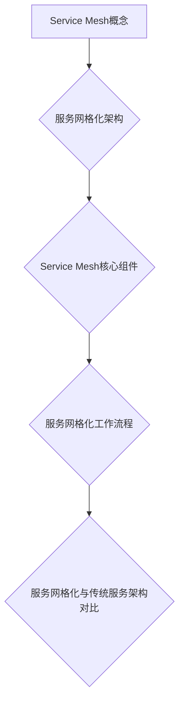

                 

# 《Service Mesh服务网格化》

> **关键词：** 服务网格化，Service Mesh，微服务，Istio，Envoy，服务治理，安全性

> **摘要：** 本文将深入探讨服务网格化（Service Mesh）的概念、架构、核心组件以及其在实际应用中的重要性。我们将以Istio和Envoy为例，详细解析其安装配置、服务治理以及集成实战。最后，本文将总结服务网格化的最佳实践，并探讨其性能优化和安全性问题。

---

### 《Service Mesh服务网格化》目录大纲

1. **第一部分：Service Mesh概述**

   - **1.1 服务网格化概念与背景**
     - **1.1.1 服务网格化的定义**
     - **1.1.2 服务网格化的动机**
     - **1.1.3 服务网格化的发展历程**
     - **1.1.4 服务网格化的重要性

   - **1.2 服务网格化架构**
     - **1.2.1 服务网格化核心组件**
     - **1.2.2 服务网格化工作流程**
     - **1.2.3 服务网格化与传统服务架构对比**

2. **第二部分：Istio服务网格**

   - **2.1 Istio概述**
     - **2.1.1 Istio的概念**
     - **2.1.2 Istio的核心组件**
     - **2.1.3 Istio的特点与优势**

   - **2.2 Istio安装与配置**
     - **2.2.1 Istio的安装**
     - **2.2.2 Istio的配置与优化**

   - **2.3 Istio服务治理**
     - **2.3.1 服务发现与负载均衡**
     - **2.3.2 服务监控与日志**
     - **2.3.3 服务间通信与安全性**

   - **2.4 Istio服务部署实战**
     - **2.4.1 Spring Cloud与Istio集成**
     - **2.4.2 Kubernetes与Istio集成**
     - **2.4.3 Docker Compose与Istio集成**

3. **第三部分：Envoy服务网格**

   - **3.1 Envoy概述**
     - **3.1.1 Envoy的概念**
     - **3.1.2 Envoy的核心组件**
     - **3.1.3 Envoy的特点与优势**

   - **3.2 Envoy配置与使用**
     - **3.2.1 Envoy的配置文件**
     - **3.2.2 Envoy的配置管理**
     - **3.2.3 Envoy的API使用**

   - **3.3 Envoy服务治理**
     - **3.3.1 服务发现与负载均衡**
     - **3.3.2 服务监控与日志**
     - **3.3.3 服务间通信与安全性**

   - **3.4 Envoy服务部署实战**
     - **3.4.1 Spring Cloud与Envoy集成**
     - **3.4.2 Kubernetes与Envoy集成**
     - **3.4.3 Docker Compose与Envoy集成**

4. **第四部分：Service Mesh最佳实践**

   - **4.1 服务网格化策略设计**
     - **4.1.1 服务网格化策略概述**
     - **4.1.2 服务网格化策略选择**
     - **4.1.3 服务网格化策略实施**

   - **4.2 服务网格化性能优化**
     - **4.2.1 服务网格化性能优化方法**
     - **4.2.2 服务网格化性能监控**
     - **4.2.3 服务网格化性能调优实践**

   - **4.3 服务网格化安全性**
     - **4.3.1 服务网格化安全性概述**
     - **4.3.2 服务网格化安全策略**
     - **4.3.3 服务网格化安全漏洞分析与防护**

   - **4.4 服务网格化案例与实践**
     - **4.4.1 典型服务网格化场景分析**
     - **4.4.2 服务网格化项目实践**
     - **4.4.3 服务网格化应用前景与挑战**

5. **附录**

   - **附录A：Service Mesh常用工具与资源**
     - **A.1 Service Mesh工具列表**
     - **A.2 Service Mesh资源推荐**
     - **A.3 Service Mesh社区与交流平台**

   - **附录B：术语表**
     - **B.1 Service Mesh术语解释**
     - **B.2 相关技术术语解释**
     - **B.3 服务网格化常见问题解答**

---

**Mermaid流程图：**



**伪代码示例：**

```plaintext
// 服务网格化策略设计伪代码
function designServiceMeshStrategy() {
    // 1. 确定服务网格化目标
    goal = determineGoal()

    // 2. 选择合适的服务网格化策略
    strategy = selectStrategy(goal)

    // 3. 实施服务网格化策略
    implementStrategy(strategy)

    // 4. 评估与优化
    evaluateAndOptimize()
}
```

**数学模型与公式示例：**

$$
\text{Service Mesh性能优化模型} = f(\text{服务请求量}, \text{网络延迟}, \text{资源利用率})
$$

**代码解读与分析：**

```python
# 示例：Spring Cloud与Istio集成代码解析

from spring.cloud.client import loadbalancer
from istio.client import istiod

# 1. 初始化负载均衡器
loadbalancer = loadbalancer.LoadBalancer()

# 2. 查找服务实例
service_instance = loadbalancer.choose("my-service")

# 3. 建立与Istiod的连接
connection = istiod.connect()

# 4. 获取服务路由信息
route = connection.getServiceRoute(service_instance)

# 5. 发送请求到服务实例
response = loadbalancer.sendRequest(route, "GET", "/")
```

**附录**

#### 附录A：Service Mesh常用工具与资源

##### A.1 Service Mesh工具列表

1. **Istio**
2. **Consul**
3. **Linkerd**
4. **Kubernetes Ingress**

##### A.2 Service Mesh资源推荐

1. **官方文档**
2. **社区论坛**
3. **技术博客**
4. **在线课程**

##### A.3 Service Mesh社区与交流平台

1. **Service Mesh社区**
2. **Istio社区**
3. **Kubernetes社区**
4. **云原生社区**

#### 附录B：术语表

##### B.1 Service Mesh术语解释

1. **Service Mesh**
2. **控制平面**
3. **数据平面**
4. **Envoy Proxy**
5. **服务网格化**

##### B.2 相关技术术语解释

1. **Kubernetes**
2. **微服务**
3. **容器化**
4. **负载均衡**
5. **服务发现**

##### B.3 服务网格化常见问题解答

1. **什么是Service Mesh？**
2. **服务网格化与传统服务架构的区别是什么？**
3. **如何选择适合的服务网格化工具？**
4. **服务网格化如何影响服务性能？**
5. **服务网格化的安全性如何保障？**

---

现在我们已经完成了目录大纲的撰写，接下来我们将逐部分深入探讨服务网格化的各个方面。让我们开始第一部分：Service Mesh概述。首先，我们定义什么是服务网格化，并探讨其背后的动机和重要性。然后，我们将概述服务网格化的核心组件和架构，以及与传统服务架构的对比。准备好，让我们一步步深入探索！<|assistant|>## 第一部分：Service Mesh概述

### 1.1 服务网格化概念与背景

#### 1.1.1 服务网格化的定义

服务网格化（Service Mesh）是一种设计模式，旨在解决微服务架构中的服务通信问题。它通过在服务之间提供一个独立的通信基础设施，来简化微服务之间的通信复杂度，从而提高系统的可维护性和扩展性。

简单来说，服务网格化是一个抽象层，它为微服务提供了一个通用的通信管道，使得服务开发者无需关心底层的网络细节。服务网格化通过定义一套标准化的接口和协议，使得服务之间可以无缝地交互。

#### 1.1.2 服务网格化的动机

在传统的单体应用架构中，服务之间的通信通常是通过直接的HTTP请求或RPC调用实现的。这种直接调用方式存在一些问题：

1. **服务发现：** 服务需要知道其他服务的地址，这在服务数量增加时变得非常复杂。
2. **负载均衡：** 无法有效地分配请求，导致部分服务过载，而其他服务闲置。
3. **服务监控与日志：** 需要为每个服务单独收集监控数据和日志，不利于集中管理和分析。
4. **安全性：** 服务之间的通信缺乏安全性保障，容易受到攻击。

为了解决这些问题，微服务架构应运而生。然而，微服务架构也带来了新的挑战：

1. **网络通信复杂性：** 微服务之间通过网络通信，需要处理服务发现、负载均衡、服务监控等问题。
2. **分布式系统管理：** 需要管理大量的服务实例，维护它们的健康状态和负载分配。
3. **安全性：** 需要为服务之间的通信提供加密和身份验证机制。

服务网格化正是为了解决这些挑战而提出的。它通过提供一个独立的通信基础设施，将服务间的通信抽象化，从而简化了网络通信的复杂性，提高了系统的可维护性和扩展性。

#### 1.1.3 服务网格化的发展历程

服务网格化作为一个概念，起源于2016年，由LinkedIn首次提出。当时，LinkedIn使用一个名为“SmartStack”的内部框架来管理服务之间的通信。随后，Google、Netflix和Amazon等公司也相继推出了自己的服务网格解决方案。

2017年，Kubernetes社区提出了Ingress资源，用于管理服务之间的入口流量。同年，Istio作为一个开源的服务网格项目，由IBM、Google和Lyft共同发起。Istio的推出标志着服务网格化进入了一个新的阶段，并得到了广泛的关注和应用。

随后，Envoy Proxy也逐渐成为一个流行的服务网格解决方案。Consul和Linkerd等工具也逐渐加入到服务网格化的生态中，提供了多种选择。

#### 1.1.4 服务网格化的重要性

服务网格化在微服务架构中扮演着重要的角色，其重要性体现在以下几个方面：

1. **简化网络通信：** 服务网格化通过提供一个通用的通信管道，简化了微服务之间的网络通信，减少了开发者需要关心的细节。
2. **提高系统可维护性：** 服务网格化将服务间的通信抽象化，使得系统的维护变得更加简单和高效。
3. **提高系统扩展性：** 服务网格化通过负载均衡和服务发现等功能，提高了系统的扩展性，使得服务可以轻松地水平扩展。
4. **保障服务安全性：** 服务网格化提供了加密和身份验证等安全机制，保障了服务之间的通信安全性。
5. **集中化监控与日志：** 服务网格化使得服务之间的通信可以被集中监控和日志收集，有利于集中管理和分析。

总之，服务网格化是微服务架构中不可或缺的一部分，它为微服务提供了高效、安全的通信基础设施，从而提高了系统的可维护性和扩展性。接下来，我们将深入探讨服务网格化的架构和核心组件。准备好，让我们继续吧！<|assistant|>### 1.2 服务网格化架构

#### 1.2.1 服务网格化核心组件

服务网格化架构通常包括以下核心组件：

1. **数据平面（Data Plane）**
   数据平面是服务网格化的核心组件，主要负责处理服务之间的通信。数据平面通常由一组轻量级的代理（Proxy）组成，如Istio的Envoy、Linkerd的B空心（Bhole）等。这些代理部署在服务的容器中，监听服务的入口和出口流量，并将流量转发到目标服务。

2. **控制平面（Control Plane）**
   控制平面负责管理数据平面代理的配置和策略。它通常由一组服务组成，如Istio的控制平面服务（如Pilot、Citadel、Galley）、Linkerd的控制平面服务（如Controller、Bincer）等。控制平面通过配置中心和策略引擎，为数据平面代理提供动态配置和策略。

3. **服务发现（Service Discovery）**
   服务发现组件负责维护服务实例的注册和发现。当服务实例启动时，它会将自己注册到服务发现系统中，并从服务发现系统中获取其他服务的地址信息。服务发现通常与控制平面集成，以便控制平面可以实时更新数据平面代理的配置。

4. **服务注册中心（Service Registry）**
   服务注册中心是一个存储服务元数据的分布式数据库，如Consul、Eureka等。服务实例在启动时会将自身信息注册到服务注册中心，并在关闭时注销。服务注册中心通常与服务发现组件集成，以便服务发现系统能够实时获取服务实例的信息。

5. **负载均衡（Load Balancing）**
   负载均衡组件负责将请求分配到多个服务实例上，以确保系统的可用性和性能。负载均衡可以通过控制平面配置，也可以通过服务网格代理实现。常见的负载均衡策略包括轮询、最少连接数、源IP哈希等。

6. **断路器（Circuit Breaker）**
   断路器是一种保护机制，用于防止系统过载或发生级联故障。当服务实例发生错误或无法响应时，断路器会暂时禁止对该服务的调用，以避免系统雪崩。常见的断路器实现包括Hystrix、Resilience4j等。

7. **安全性（Security）**
   安全性组件负责保护服务之间的通信，包括加密、身份验证和授权等。常见的安全性实现包括TLS/SSL加密、OAuth2、JWT等。

#### 1.2.2 服务网格化工作流程

服务网格化的工作流程可以分为以下几个步骤：

1. **服务实例启动**
   当服务实例启动时，它会将自己注册到服务注册中心，并向服务发现系统注册自身地址和端口。

2. **服务注册**
   服务发现系统将服务实例的信息存储在本地缓存中，以便其他服务可以查询到。

3. **控制平面配置**
   控制平面根据业务需求，生成数据平面代理的配置文件，如路由规则、负载均衡策略和安全策略等。

4. **数据平面代理启动**
   数据平面代理加载配置文件，并开始监听服务的入口和出口流量。

5. **请求转发**
   当服务A需要调用服务B时，数据平面代理将请求转发到服务B的地址。

6. **负载均衡**
   数据平面代理根据负载均衡策略，将请求分配到不同的服务实例上。

7. **响应处理**
   服务B处理请求后，将响应返回给服务A。

8. **监控与日志**
   数据平面代理收集监控数据和日志信息，并将其发送到监控系统和日志收集系统。

9. **异常处理**
   当服务实例发生错误时，数据平面代理会触发断路器机制，暂时禁止对该实例的调用。

10. **配置更新**
    控制平面监控服务实例的健康状态和负载情况，并根据实际情况更新数据平面代理的配置。

#### 1.2.3 服务网格化与传统服务架构对比

传统服务架构通常采用直接调用方式，服务之间通过网络通信，但这种方式存在以下问题：

1. **服务发现困难：** 服务需要知道其他服务的地址，当服务数量增加时，地址管理变得复杂。

2. **负载均衡不足：** 传统架构缺乏有效的负载均衡机制，容易导致部分服务过载，其他服务闲置。

3. **安全性不足：** 服务之间缺乏加密和身份验证机制，容易受到网络攻击。

4. **监控与日志分散：** 需要为每个服务单独收集监控数据和日志，不利于集中管理和分析。

相比之下，服务网格化架构通过引入数据平面和控制平面，解决了传统架构中的这些问题：

1. **简化服务发现：** 服务网格化通过服务发现组件，简化了服务地址管理，服务实例启动时自动注册。

2. **有效负载均衡：** 服务网格化通过负载均衡组件，实现了对服务实例的自动负载均衡。

3. **增强安全性：** 服务网格化提供了加密和身份验证机制，确保了服务之间的通信安全。

4. **集中监控与日志：** 服务网格化通过数据平面代理，实现了对服务间通信的集中监控和日志收集。

总之，服务网格化架构通过引入独立的通信基础设施，简化了服务之间的通信复杂度，提高了系统的可维护性和扩展性。接下来，我们将探讨Istio和Envoy这两个流行的服务网格化解决方案。准备好了吗？让我们继续吧！<|assistant|>## 第二部分：Istio服务网格

Istio是一种开源的服务网格解决方案，由IBM、Google和Lyft共同发起。它提供了强大的服务治理功能，包括服务发现、负载均衡、服务监控和日志收集等。Istio的核心组件包括数据平面代理（如Envoy）、控制平面服务和API。本节将详细介绍Istio的概念、核心组件及其特点与优势。

### 2.1 Istio概述

#### 2.1.1 Istio的概念

Istio是一个基于代理的服务网格，它为微服务架构提供了统一的通信基础设施。Istio通过在服务之间插入代理（如Envoy），实现了服务间通信的抽象化和标准化。Istio的核心组件包括数据平面代理、控制平面服务和API。

1. **数据平面代理（Data Plane Proxy）**
   数据平面代理是Istio的核心组件，它通常是一个名为Envoy的轻量级代理。数据平面代理负责监听服务的入口和出口流量，并将流量转发到目标服务。Envoy提供了负载均衡、断路器、熔断和加密等功能。

2. **控制平面服务（Control Plane Services）**
   控制平面服务负责管理数据平面代理的配置和策略。Istio的控制平面服务包括Pilot、Citadel和Galley等。Pilot负责生成和分发数据平面代理的配置，Citadel负责身份验证和授权，Galley负责验证和存储策略配置。

3. **API（Istio API）**
   Istio提供了丰富的API，用于管理服务网格的配置和策略。通过Istio API，用户可以定义服务规则、负载均衡策略、服务监控和日志收集等。

#### 2.1.2 Istio的核心组件

Istio的核心组件包括数据平面代理、控制平面服务和API。下面分别介绍这些组件的功能和特点。

1. **数据平面代理（Data Plane Proxy）**

   - **Envoy代理**：Istio的数据平面代理通常是Envoy。Envoy是一个高性能的C++代理，它提供了负载均衡、断路器、熔断和加密等功能。Envoy代理可以在服务容器中直接部署，从而实现了服务间通信的抽象化和标准化。

   - **功能**：数据平面代理的主要功能包括：

     - **服务发现**：数据平面代理可以从服务注册中心获取服务实例的地址和端口信息，并将其缓存到本地。

     - **负载均衡**：数据平面代理根据配置的负载均衡策略，将请求分配到不同的服务实例上。

     - **断路器**：数据平面代理支持断路器功能，可以在服务实例发生错误时，暂时禁止对该实例的调用。

     - **熔断**：数据平面代理支持熔断功能，可以在服务实例不可用时，快速切换到其他可用实例。

     - **加密**：数据平面代理支持TLS/SSL加密，确保了服务之间的通信安全。

2. **控制平面服务（Control Plane Services）**

   - **Pilot**：Pilot是Istio的控制平面服务之一，负责生成和分发数据平面代理的配置。Pilot通过服务注册中心获取服务实例信息，并根据配置规则生成代理配置。Pilot还负责将配置信息推送到底层基础设施（如Kubernetes）。

   - **Citadel**：Citadel是Istio的控制平面服务之一，负责身份验证和授权。Citadel使用密钥管理系统（如Kubernetes Secrets）来存储和分发证书，确保服务之间的通信安全。

   - **Galley**：Galley是Istio的控制平面服务之一，负责验证和存储策略配置。Galley可以从外部来源（如Istio API）接收策略配置，并确保配置的一致性和完整性。

3. **API（Istio API）**

   - **服务规则（Service Rules）**：服务规则定义了服务之间的访问策略，如允许哪些服务访问特定服务。

   - **负载均衡策略（Load Balancing Policies）**：负载均衡策略定义了请求如何分配到不同的服务实例上，如轮询、最小连接数、源IP哈希等。

   - **服务监控（Service Monitoring）**：服务监控定义了如何收集和存储服务实例的监控数据，如请求率、响应时间和错误率等。

   - **日志收集（Log Collection）**：日志收集定义了如何收集和存储服务实例的日志信息，如请求日志、响应日志和错误日志等。

#### 2.1.3 Istio的特点与优势

Istio具有以下特点与优势：

1. **抽象化通信**：Istio通过数据平面代理将服务间通信抽象化，使得服务开发者无需关心底层的网络细节。

2. **统一管理**：Istio提供了丰富的API和控制平面服务，使得用户可以统一管理服务网格的配置和策略。

3. **安全性**：Istio支持TLS/SSL加密和身份验证，确保了服务之间的通信安全。

4. **高可用性**：Istio支持服务发现、负载均衡和断路器等功能，提高了系统的可用性和可靠性。

5. **可扩展性**：Istio支持大规模服务网格，可以轻松扩展到数千个服务实例。

6. **与Kubernetes集成**：Istio与Kubernetes深度集成，可以使用Kubernetes集群来部署和管理服务网格。

7. **开源社区支持**：Istio是一个开源项目，得到了IBM、Google和Lyft等公司的支持，拥有庞大的开源社区。

接下来，我们将详细介绍Istio的安装与配置，以便用户可以开始使用Istio来管理服务网格。准备好，让我们继续吧！<|assistant|>### 2.2 Istio安装与配置

在了解了Istio的概念和核心组件之后，接下来我们将介绍如何安装和配置Istio，以便用户可以在自己的环境中使用它来管理服务网格。

#### 2.2.1 Istio的安装

Istio的安装可以分为以下几个步骤：

1. **安装环境要求**：在开始安装之前，需要确保环境满足以下要求：

   - Kubernetes集群：至少一个Kubernetes集群，版本建议为1.13或更高。
   - Docker：版本建议为19.03或更高。
   - Kubectl：版本建议为1.13或更高。

2. **下载Istio安装包**：可以从Istio的官方网站下载最新的Istio安装包。下载完成后，解压安装包。

   ```bash
   tar -xvf istio-1.9.0-linux.tar.gz
   ```

3. **选择Istio版本**：在解压后的文件夹中，可以选择不同的Istio版本，如`istio-1.9.0`、`istio-1.9.0-preview1`等。这里我们选择最新的稳定版`istio-1.9.0`。

4. **部署Istio**：使用Kubectl命令部署Istio。在部署过程中，可以选择不同的部署模式，如单节点部署、分布式部署等。这里我们使用单节点部署模式。

   ```bash
   kubectl apply -f istio-1.9.0/manifests/charts/istio-control.yaml
   kubectl apply -f istio-1.9.0/manifests/charts/istio-1.9.0.yaml
   ```

5. **检查部署状态**：部署完成后，可以使用以下命令检查Istio的部署状态。

   ```bash
   kubectl get pods -n istio-system
   ```

   应该看到所有Istio的Pod都在运行状态。

#### 2.2.2 Istio的配置与优化

在安装完Istio之后，需要对Istio进行配置和优化，以满足特定业务需求。以下是一些常见的配置和优化方法：

1. **配置Istio控制平面**：

   - **配置文件路径**：Istio的控制平面配置文件位于`istio-1.9.0/manifests/charts/istio-control.yaml`。

   - **配置项说明**：在控制平面配置文件中，可以配置以下参数：

     - `istio_operator`：用于配置Istio控制平面的行为。
     - `pilot`：用于配置服务发现、负载均衡和路由策略。
     - `citadel`：用于配置身份验证和授权。
     - `galley`：用于配置策略验证和存储。

2. **配置Istio数据平面**：

   - **配置文件路径**：Istio的数据平面配置文件位于`istio-1.9.0/manifests/charts/istio.yaml`。

   - **配置项说明**：在数据平面配置文件中，可以配置以下参数：

     - `envoy`：用于配置数据平面代理（如Envoy）的行为。
     - `pilot`：用于配置服务发现和路由策略。
     - `telemetry`：用于配置监控和日志收集。

3. **优化Istio性能**：

   - **资源分配**：为Istio控制平面和数据平面代理分配足够的资源，如CPU和内存。

   - **缓存策略**：优化服务发现和路由策略的缓存策略，以提高响应速度。

   - **负载均衡**：根据业务需求调整负载均衡策略，如使用最小连接数策略。

   - **断路器**：配置合理的断路器阈值，以避免系统过载。

   - **熔断**：配置合理的熔断策略，以提高系统的可用性。

4. **配置Istio安全性**：

   - **TLS加密**：配置TLS加密，以确保服务之间的通信安全。

   - **身份验证和授权**：配置身份验证和授权策略，以限制服务访问权限。

   - **网络隔离**：使用网络命名空间和防火墙规则，确保服务之间的通信安全。

通过以上配置和优化，可以确保Istio在特定业务场景下运行高效、稳定和安全。接下来，我们将探讨Istio的服务治理功能，包括服务发现、负载均衡、服务监控和日志收集。准备好，让我们继续吧！<|assistant|>### 2.3 Istio服务治理

Istio作为服务网格解决方案，提供了强大的服务治理功能，包括服务发现、负载均衡、服务监控和日志收集等。本节将详细介绍Istio的服务治理功能，以及如何在实际应用中利用这些功能。

#### 2.3.1 服务发现与负载均衡

服务发现是服务网格化的核心功能之一。Istio通过Pilot组件实现了服务发现功能，使得服务实例可以自动注册和发现。

1. **服务发现**：

   - **服务注册**：当服务实例启动时，它会自动将自己注册到服务注册中心，如Kubernetes Service或Consul。

   - **服务发现**：其他服务实例可以通过服务注册中心获取服务实例的地址和端口信息。

   - **本地缓存**：Istio的数据平面代理（如Envoy）会在本地缓存服务实例信息，以提高服务发现的速度。

2. **负载均衡**：

   - **负载均衡策略**：Istio提供了多种负载均衡策略，如轮询、最小连接数、源IP哈希等。

   - **动态负载均衡**：Istio的数据平面代理会根据负载均衡策略，动态地将请求分配到不同的服务实例上。

   - **健康检查**：Istio会定期对服务实例进行健康检查，如果服务实例不可用，会将其从负载均衡列表中移除。

通过服务发现和负载均衡，Istio能够确保服务之间的通信高效、可靠，同时提高了系统的可用性和可扩展性。

#### 2.3.2 服务监控与日志

服务监控和日志收集是服务治理的重要组成部分。Istio通过Mixer组件实现了服务监控和日志收集功能。

1. **服务监控**：

   - **监控数据收集**：Istio的数据平面代理会定期收集监控数据，如请求率、响应时间和错误率等。

   - **监控数据推送**：监控数据会被推送到外部监控系统中，如Prometheus和Grafana。

   - **监控数据查询**：用户可以使用PromQL等查询语言，对监控数据进行实时查询和分析。

2. **日志收集**：

   - **日志数据收集**：Istio的数据平面代理会收集服务实例的日志数据，如请求日志、响应日志和错误日志等。

   - **日志数据存储**：日志数据会被存储到外部日志收集系统中，如ELK（Elasticsearch、Logstash和Kibana）或AWS CloudWatch。

   - **日志数据分析**：用户可以使用Kibana等工具，对日志数据进行实时分析和可视化。

通过服务监控和日志收集，Istio能够帮助用户实时了解服务实例的状态和性能，快速定位和解决问题。

#### 2.3.3 服务间通信与安全性

服务间通信与安全性是服务治理的重要方面。Istio通过数据平面代理和Mixer组件，提供了全面的服务间通信和安全保障。

1. **服务间通信**：

   - **双向TLS加密**：Istio支持双向TLS加密，确保服务之间的通信安全。

   - **身份验证和授权**：Istio支持基于JWT的身份验证和基于RBAC的授权，确保只有合法的服务可以访问其他服务。

   - **服务发现和路由**：Istio支持基于服务名称的服务发现和路由，使得服务实例可以轻松地通过服务名称访问其他服务。

2. **安全性**：

   - **网络隔离**：Istio支持基于网络命名空间和防火墙规则的网络隔离，确保服务实例之间的通信安全。

   - **访问控制**：Istio支持基于请求属性的访问控制，如来源IP、请求头等，确保服务实例可以访问特定的服务。

   - **日志审计**：Istio支持日志审计功能，记录服务之间的通信活动，以便进行安全和合规性审计。

通过服务间通信与安全性，Istio能够确保服务网格中的通信安全可靠，同时保证了服务的可访问性和可控性。

在实际应用中，Istio的服务治理功能可以帮助用户实现高效、可靠和安全的微服务架构。通过服务发现和负载均衡，用户可以轻松管理大量服务实例；通过服务监控和日志收集，用户可以实时了解服务实例的状态和性能；通过服务间通信与安全性，用户可以确保服务之间的通信安全可靠。接下来，我们将探讨Istio在实际应用中的集成实战。准备好，让我们继续吧！<|assistant|>### 2.4 Istio服务部署实战

在实际应用中，Istio的服务治理功能可以帮助用户实现高效、可靠和安全的微服务架构。下面我们将通过具体的集成实战，展示如何将Istio与Spring Cloud、Kubernetes和Docker Compose集成，以实现服务网格化。

#### 2.4.1 Spring Cloud与Istio集成

Spring Cloud是一个基于Spring Boot的微服务架构开发工具集，它提供了服务注册与发现、负载均衡、配置管理、断路器等微服务功能。下面是Spring Cloud与Istio的集成步骤：

1. **添加依赖**：

   在Spring Cloud项目中添加Istio的依赖项，例如：

   ```xml
   <dependency>
       <groupId>io Istio</groupId>
       <artifactId>istio-adapter-spring-cloud</artifactId>
       <version>1.9.0</version>
   </dependency>
   ```

2. **配置服务注册**：

   在Spring Cloud的配置文件中，配置服务注册中心，例如Eureka或Consul，并启用Istio适配器：

   ```yaml
   eureka:
     client:
       serviceUrl:
         defaultZone: http://istio-pilot.istio-system:15000/eureka/
   spring:
     cloud:
       istio:
         enabled: true
         serviceRegistry: eureka
   ```

3. **配置负载均衡**：

   在Spring Cloud的配置文件中，配置负载均衡策略，例如轮询或最小连接数：

   ```yaml
   spring:
     cloud:
       loadbalancer:
         response-timeout: 3000
         retry:
           enabled: true
           retries: 3
   ```

4. **启动应用**：

   启动Spring Cloud应用，并在服务注册中心中查看服务实例。

5. **验证集成**：

   使用Kubectl命令查看Istio数据平面代理（如Envoy）的配置，确保服务已正确注册和发现。

   ```bash
   kubectl exec -n istio-system <proxy-pod-name> -- curl -s http://localhost:15000/config_dump
   ```

#### 2.4.2 Kubernetes与Istio集成

Kubernetes是一个开源的容器编排平台，它提供了服务发现、负载均衡、网络隔离等功能。下面是Kubernetes与Istio的集成步骤：

1. **安装Istio**：

   使用Helm在Kubernetes集群中安装Istio。

   ```bash
   helm install istio istio/istio --namespace istio-system
   ```

2. **创建服务**：

   在Kubernetes中创建服务（如Deployment、StatefulSet等），并将服务暴露给外部网络。

   ```yaml
   apiVersion: v1
   kind: Service
   metadata:
     name: my-service
   spec:
     selector:
       app: my-app
     ports:
       - name: http
         protocol: TCP
         port: 80
         targetPort: 8080
   ```

3. **配置Ingress**：

   使用Kubernetes Ingress资源，将外部流量转发到Kubernetes服务。

   ```yaml
   apiVersion: networking.k8s.io/v1
   kind: Ingress
   metadata:
     name: my-ingress
   spec:
     rules:
       - host: my-service.example.com
         http:
           paths:
             - path: /
               pathType: Prefix
               backend:
                 service:
                   name: my-service
                   port:
                     number: 80
   ```

4. **验证集成**：

   使用Istio的Mixer组件，监控服务实例的监控数据和日志。

   ```bash
   kubectl exec -n istio-system <mixer-pod-name> -- curl -s http://localhost:15001/stats/prometheus
   ```

#### 2.4.3 Docker Compose与Istio集成

Docker Compose是一个用于定义和运行多容器Docker应用程序的编排工具。下面是Docker Compose与Istio的集成步骤：

1. **创建Docker Compose文件**：

   在Docker Compose文件中定义服务，并添加Istio代理。

   ```yaml
   version: '3.8'
   services:
     web:
       image: my-web-app
       ports:
         - "8080:8080"
       deploy:
         restartPolicy: on-failure
         labels:
           - "app=my-web-app"
     istio-proxy:
       image: istio/proxyv2:1.9.0
       command:
         - istio-proxy
         - -p
         - "15001"
         - -c
         - /etc/istio/proxy/config.yaml
       ports:
         - "15001:15001"
       volumes:
         - /var/run/docker.sock:/var/run/docker.sock
       depends_on:
         - web
   ```

2. **启动应用**：

   使用Docker Compose启动应用。

   ```bash
   docker-compose up -d
   ```

3. **验证集成**：

   使用Kubectl命令查看Istio数据平面代理（如Envoy）的配置。

   ```bash
   kubectl exec -n istio-system <proxy-pod-name> -- curl -s http://localhost:15000/config_dump
   ```

通过以上集成实战，用户可以轻松地将Istio与Spring Cloud、Kubernetes和Docker Compose集成，实现服务网格化。接下来，我们将探讨Envoy服务网格，介绍其概念、核心组件及其特点与优势。准备好，让我们继续吧！<|assistant|>## 第三部分：Envoy服务网格

Envoy是一个高性能、可扩展的C++服务网格代理，由Lyft开源并维护。它被广泛应用于服务网格化场景，用于管理微服务之间的通信。Envoy以其高性能、灵活性和可扩展性著称，为微服务架构提供了强大的通信基础设施。本节将详细介绍Envoy的概念、核心组件及其特点与优势。

### 3.1 Envoy概述

#### 3.1.1 Envoy的概念

Envoy是一个智能代理，它负责管理服务网格中的通信流量。作为服务网格代理，Envoy负责监听和转发服务之间的请求，并提供一系列重要的服务治理功能，如负载均衡、断路器、熔断和加密等。

#### 3.1.2 Envoy的核心组件

Envoy的核心组件包括：

1. **数据平面（Data Plane）**：
   数据平面是Envoy的核心组件，它负责处理服务之间的通信。数据平面通常由一组代理实例组成，每个代理实例负责处理来自特定服务实例的流量。

2. **控制平面（Control Plane）**：
   控制平面负责管理数据平面代理的配置和策略。控制平面通过动态配置API，向数据平面代理提供实时配置更新。

3. **静态配置**：
   静态配置是指预先定义的配置文件，用于初始化数据平面代理。静态配置通常用于简单场景或测试环境。

4. **动态配置API**：
   动态配置API是一种实时配置管理机制，允许控制平面动态地更新数据平面代理的配置。动态配置API支持实时调整负载均衡策略、服务发现和路由规则等。

#### 3.1.3 Envoy的特点与优势

Envoy具有以下特点与优势：

1. **高性能**：
   Envoy使用C++编写，具有非常高的性能。它能够在低延迟和高吞吐量的同时，处理大量的网络请求。

2. **灵活性和可扩展性**：
   Envoy支持丰富的配置选项和插件，可以根据实际需求进行定制和扩展。它支持多种协议，如HTTP/1.x、HTTP/2、gRPC和TLS等。

3. **服务治理功能**：
   Envoy提供了丰富的服务治理功能，包括负载均衡、断路器、熔断、加密和身份验证等。这些功能使得Envoy能够有效地管理服务之间的通信。

4. **可观测性**：
   Envoy集成了Prometheus、StatsD等监控工具，能够收集和聚合服务实例的监控数据。这些数据可以帮助用户实时了解服务性能和健康状况。

5. **集成与兼容性**：
   Envoy与Kubernetes、Consul、Eureka等流行服务发现和配置中心工具具有良好的集成和兼容性。

6. **开源社区支持**：
   Envoy是一个开源项目，拥有广泛的社区支持。它得到了Lyft、Google、Netflix等公司的贡献和支持。

通过以上特点与优势，Envoy成为了服务网格化场景中的首选工具之一。接下来，我们将探讨Envoy的配置与使用，包括配置文件、配置管理以及API使用。准备好，让我们继续吧！<|assistant|>### 3.2 Envoy配置与使用

#### 3.2.1 Envoy的配置文件

Envoy的配置文件采用JSON格式，定义了代理的行为和配置。配置文件可以分为以下几部分：

1. **静态配置（Static Configuration）**：
   静态配置是在代理启动时加载的配置，通常用于简单场景或测试环境。静态配置文件通常包含以下内容：

   - **Listeners**：定义了代理监听的端口和协议。
   - **Cluster**：定义了代理连接的后端服务集群。
   - **Routes**：定义了请求的路由规则，如目标服务名称、路径匹配等。
   - **Filters**：定义了代理处理请求和响应时的过滤器。

2. **动态配置（Dynamic Configuration）**：
   动态配置是通过控制平面动态更新的配置，适用于生产环境。动态配置通过控制平面与代理之间的长连接进行实时更新。动态配置文件通常包含以下内容：

   - **Listeners**：与静态配置类似，但支持动态更新。
   - **Cluster**：与静态配置类似，但支持动态更新。
   - **Routes**：与静态配置类似，但支持动态更新。
   - **Filters**：与静态配置类似，但支持动态更新。

以下是一个简单的Envoy配置文件示例：

```json
{
  "static_resources": {
    "listeners": [
      {
        "name": " listener_0",
        "address": {
          "socket_address": {
            "address": "0.0.0.0",
            "port_value": 8080
          }
        },
        "filters": [
          {
            "name": "http_connection_manager",
            "config": {
              "stat_prefix": "ingress_http",
              "route_config": {
                "name": "local_route",
                "virtual_hosts": [
                  {
                    "name": "local.service",
                    "domains": ["*"],
                    "routes": [
                      {
                        "match": {
                          "prefix": "/local/"
                        },
                        "route": {
                          "cluster": "local_cluster",
                          "prefix_rewrite": "/local/"
                        }
                      }
                    ]
                  }
                ]
              }
            }
          }
        ]
      }
    ],
    "clusters": [
      {
        "name": "local_cluster",
        "type": "auto",
        "dns_lookup_family": 3,
        "lb_policy": "round_robin",
        "health_check_config": {
          "port_value": 8080,
          "path": "/local/healthz",
          "timeout_ms": 5000
        },
        "http2_max_stream_data大道：3564383
        "http2_settings_max_header_list_size": 2048
      }
    ]
  },
  "dynamic_resources": {
    "listeners": [
      {
        "name": " listener_0",
        "address": {
          "socket_address": {
            "address": "0.0.0.0",
            "port_value": 8080
          }
        },
        "filters": [
          {
            "name": "http_connection_manager",
            "config": {
              "stat_prefix": "ingress_http",
              "route_config": {
                "name": "local_route",
                "virtual_hosts": [
                  {
                    "name": "local.service",
                    "domains": ["*"],
                    "routes": [
                      {
                        "match": {
                          "prefix": "/local/"
                        },
                        "route": {
                          "cluster": "local_cluster",
                          "prefix_rewrite": "/local/"
                        }
                      }
                    ]
                  }
                ]
              }
            }
          }
        ]
      }
    ],
    "clusters": [
      {
        "name": "local_cluster",
        "type": "auto",
        "dns_lookup_family": 3,
        "lb_policy": "round_robin",
        "health_check_config": {
          "port_value": 8080,
          "path": "/local/healthz",
          "timeout_ms": 5000
        },
        "http2_max_stream_data大道：3564383
        "http2_settings_max_header_list_size": 2048
      }
    ]
  }
}
```

#### 3.2.2 Envoy的配置管理

Envoy的配置管理分为静态配置管理和动态配置管理两种方式。

1. **静态配置管理**：

   - **启动时加载**：在代理启动时，通过命令行参数或配置文件加载静态配置。
   - **热重启**：可以通过发送特定的管理命令，触发代理的热重启，从而加载新的静态配置。

2. **动态配置管理**：

   - **动态更新**：通过Envoy的动态配置API，控制平面可以实时更新代理的配置。动态配置支持对 listeners、clusters、routes 和 filters 等资源进行修改。
   - **长连接**：控制平面与代理之间通过长连接进行通信，以实现配置的实时更新。

以下是一个简单的动态配置更新示例：

```bash
curl -X PUT -H "Content-Type: application/json" \
  -d '{"name": "local_cluster", "type": "auto", "lb_policy": "round_robin", "health_check_config": {"port_value": 8080, "path": "/local/healthz", "timeout_ms": 5000}}' \
  http://localhost:15000/config clusters/update
```

#### 3.2.3 Envoy的API使用

Envoy提供了丰富的API，用于管理代理的配置和状态。以下是一些常用的API接口：

1. **/v1/clusters**：用于管理服务集群的配置。
2. **/v1/listeners**：用于管理监听的配置。
3. **/v1/rds**：用于管理路由配置。
4. **/v1/eds**：用于管理动态服务发现配置。
5. **/v1/iam**：用于管理身份验证和授权策略。

以下是一个简单的API请求示例：

```bash
curl -X POST -H "Content-Type: application/json" \
  -d '{"name": "local_route", "virtual_hosts": [{"name": "local.service", "domains": ["*"], "routes": [{"match": {"prefix": "/local/"}, "route": {"cluster": "local_cluster", "prefix_rewrite": "/local/"}}}]}]' \
  http://localhost:15000/config routes/submit
```

通过上述配置管理方法和API使用，用户可以灵活地管理和控制Envoy代理的行为。接下来，我们将探讨Envoy的服务治理功能，包括服务发现、负载均衡、服务监控和日志收集。准备好，让我们继续吧！<|assistant|>### 3.3 Envoy服务治理

#### 3.3.1 服务发现与负载均衡

服务发现和负载均衡是服务治理的关键功能。Envoy通过其内置的服务发现机制和负载均衡策略，提供了高效、可靠的服务治理能力。

1. **服务发现**：

   - **静态服务发现**：Envoy可以从静态配置中获取服务实例的地址和端口信息。这种方式适用于服务数量较少的场景。

   - **动态服务发现**：Envoy可以通过Consul、Eureka等服务发现系统，动态获取服务实例的信息。这种方式适用于服务数量较多的场景。

2. **负载均衡**：

   - **轮询（Round Robin）**：将请求均匀分配到各个服务实例上。

   - **最少连接数（Least Connections）**：将请求分配到连接数最少的服务实例上。

   - **源IP哈希（Source IP Hash）**：根据客户端的IP地址，将请求分配到特定的服务实例上。

   - **随机（Random）**：随机将请求分配到服务实例上。

以下是一个简单的负载均衡策略配置示例：

```json
{
  "name": "local_cluster",
  "type": "auto",
  "lb_policy": "round_robin",
  "health_check_config": {
    "port_value": 8080,
    "path": "/local/healthz",
    "timeout_ms": 5000
  },
  "load_assignment": {
    "cluster_name": "local_cluster",
    "endpoints": [
      {
        "lb_endpoints": [
          {
            "endpoint": {
              "address": {
                "socket_address": {
                  "address": "service-name",
                  "port_value": 8080
                }
              }
            },
            "health_status": "HEALTHY"
          }
        ]
      }
    ]
  }
}
```

#### 3.3.2 服务监控与日志

服务监控和日志收集是服务治理的重要环节。Envoy提供了内置的监控和日志收集功能，可以与Prometheus、Grafana等监控工具集成。

1. **监控**：

   - **Prometheus**：Envoy支持Prometheus监控，可以将监控数据推送到Prometheus服务器。用户可以通过PromQL等查询语言，对监控数据进行实时查询和分析。

   - **StatsD**：Envoy支持StatsD监控，可以将监控数据发送到StatsD服务器。StatsD服务器可以与Grafana等可视化工具集成，提供实时监控仪表板。

以下是一个简单的Prometheus监控配置示例：

```json
{
  "stat_prefix": "envoy",
  "exports_extra_metrics": true,
  "stats_environment_variables": [
    {
      "name": "STATSD_HOST",
      "value": "localhost"
    }
  ],
  "statsd_flush_interval": 10
}
```

2. **日志**：

   - **结构化日志**：Envoy支持结构化日志，可以将日志数据发送到ELK（Elasticsearch、Logstash和Kibana）或AWS CloudWatch等日志收集系统。

   - **日志格式**：Envoy支持多种日志格式，如JSON、text等。

以下是一个简单的日志配置示例：

```json
{
  "log_path": "/var/log/envoy",
  "access_log_path": "/var/log/envoy/access.log",
  "error_log_path": "/var/log/envoy/error.log",
  "log_level": "info",
  "log_format": {
    "json_format": {
      "default_values": {},
      "add_request_id": true
    }
  }
}
```

通过上述服务监控和日志收集配置，用户可以实时了解服务实例的状态和性能，快速定位和解决问题。

#### 3.3.3 服务间通信与安全性

服务间通信与安全性是服务治理的核心任务。Envoy通过多种安全机制，保障了服务之间的通信安全。

1. **加密**：

   - **TLS/SSL**：Envoy支持TLS/SSL加密，可以确保服务之间的通信安全。

   - **证书管理**：Envoy支持动态证书管理，可以从证书颁发机构（CA）或密钥管理服务（KMS）获取证书和密钥。

2. **身份验证与授权**：

   - **JWT**：Envoy支持JWT身份验证，可以确保只有合法的服务实例可以访问其他服务。

   - **RBAC**：Envoy支持基于角色的访问控制（RBAC），可以限制服务实例的访问权限。

3. **网络隔离**：

   - **命名空间**：Envoy支持基于Kubernetes命名空间的网络隔离，可以确保不同命名空间内的服务实例之间的通信安全。

通过上述服务治理功能，Envoy为微服务架构提供了高效、可靠和安全的通信基础设施。接下来，我们将探讨Envoy在实际应用中的集成实战。准备好，让我们继续吧！<|assistant|>### 3.4 Envoy服务部署实战

在实际应用中，Envoy作为服务网格代理，可以与Spring Cloud、Kubernetes和Docker Compose集成，为微服务架构提供高效、可靠和安全的通信基础设施。下面我们将详细介绍如何将Envoy与这些工具集成。

#### 3.4.1 Spring Cloud与Envoy集成

Spring Cloud是一个基于Spring Boot的微服务开发工具集，提供了服务注册与发现、负载均衡、配置管理、断路器等微服务功能。下面是Spring Cloud与Envoy的集成步骤：

1. **添加依赖**：

   在Spring Cloud项目中添加Envoy的依赖项：

   ```xml
   <dependency>
       <groupId>io.envoyproxy</groupId>
       <artifactId>envoy-spring-cloud-starter</artifactId>
       <version>1.9.0</version>
   </dependency>
   ```

2. **配置服务注册**：

   在Spring Cloud的配置文件中，配置服务注册中心，如Consul或Eureka，并启用Envoy适配器：

   ```yaml
   spring:
     cloud:
       config:
         enabled: true
         uri: http://consul:8500
       registry:
         enabled: true
         service-name: ${spring.application.name}
         prefer-ip-address: true
         ribbon:
           enabled: false
   ```

3. **配置负载均衡**：

   在Spring Cloud的配置文件中，配置负载均衡策略，如轮询或最小连接数：

   ```yaml
   spring:
     cloud:
       loadbalancer:
         response-timeout: 3000
         retry:
           enabled: true
           retries: 3
   ```

4. **启动应用**：

   启动Spring Cloud应用，并在服务注册中心中查看服务实例。

5. **配置Envoy**：

   配置Envoy代理，使其能够从服务注册中心获取服务实例信息。以下是一个简单的Envoy配置文件示例：

   ```yaml
   admin:
     address:
       socket_address: 0.0.0.0:9501
   static_resources:
     listeners:
       - name: listener_0
         address:
           socket_address:
             address: 0.0.0.0
             port_value: 8080
         filter_chains:
           - filters:
             - name: http_connection_manager
               typed_config:
                 "@type": type.googleapis.com/envoy.config.filter.network.http_connection_manager.v2.HttpConnectionManager
                 stat_prefix: ingress_http
                 route_config:
                   name: local_route
                 access_log:
                   - name: envoy.access_loggers.file
                     typed_config:
                       "@type": type.googleapis.com/envoy.config.access_loggers.file.v2.FileAccessLog
                       path: /dev/stdout
                     format: "%s"
     clusters:
       - name: local_cluster
         type: logical
         lb_policy: round_robin
         health_check:
           timeout_ms: 5000
           path: /healthz
           port_value: 8080
         hosts:
           - socket_address:
               address: ${spring.application.name}
               port_value: 8080
         http2_max_stream_dȍwads：3564383
         http2_settings_max_header_list_size: 2048
   ```

6. **启动Envoy**：

   启动Envoy代理，使其能够监听来自外部网络的请求，并转发给Spring Cloud应用。

   ```bash
   envoy -c /path/to/envoy.yaml
   ```

7. **验证集成**：

   使用Kubectl命令查看Envoy代理的状态和配置。

   ```bash
   kubectl get pods
   kubectl exec -it <envoy-pod-name> -- /bin/bash
   curl localhost:8080
   ```

#### 3.4.2 Kubernetes与Envoy集成

Kubernetes是一个开源的容器编排平台，提供了服务发现、负载均衡、网络隔离等功能。下面是Kubernetes与Envoy的集成步骤：

1. **安装Istio**：

   使用Helm在Kubernetes集群中安装Istio。

   ```bash
   helm install istio istio/istio --namespace istio-system
   ```

2. **创建服务**：

   在Kubernetes中创建服务，如Deployment或StatefulSet，并使用Istio Ingress Gateway暴露服务。

   ```yaml
   apiVersion: v1
   kind: Service
   metadata:
     name: my-service
     namespace: my-namespace
   spec:
     selector:
       app: my-app
     ports:
       - name: http
         protocol: TCP
         port: 80
         targetPort: 8080
   ```

3. **配置Ingress**：

   使用Kubernetes Ingress资源，配置外部流量路由到Kubernetes服务。

   ```yaml
   apiVersion: networking.k8s.io/v1
   kind: Ingress
   metadata:
     name: my-ingress
     namespace: my-namespace
   spec:
     rules:
       - host: my-service.example.com
         http:
           paths:
             - path: /
               pathType: Prefix
               backend:
                 service:
                   name: my-service
                   port:
                     number: 80
   ```

4. **配置Envoy**：

   在Istio的配置文件中，配置Envoy代理，使其能够处理来自Kubernetes Ingress的流量。

   ```yaml
   apiVersion: istio.io/v1alpha3
   kind: ServiceEntry
   metadata:
     name: my-service-entry
     namespace: my-namespace
   spec:
     hosts:
       - my-service.example.com
     ports:
       - number: 80
     resolution: DNS
     addresses:
       - 192.168.1.1
     location: MESH_INTERNAL
     owner: my-app
     protocol: HTTP
   ```

5. **验证集成**：

   使用Kubectl命令查看Istio代理的状态和配置。

   ```bash
   kubectl get pods -n istio-system
   kubectl exec -it <envoy-pod-name> -- /bin/bash
   curl my-service.example.com
   ```

#### 3.4.3 Docker Compose与Envoy集成

Docker Compose是一个用于定义和运行多容器Docker应用程序的编排工具。下面是Docker Compose与Envoy的集成步骤：

1. **创建Docker Compose文件**：

   在Docker Compose文件中定义服务，并添加Envoy代理。

   ```yaml
   version: '3.8'
   services:
     web:
       image: my-web-app
       ports:
         - "8080:8080"
       deploy:
         restartPolicy: on-failure
         labels:
           - "app=my-web-app"
     istio-proxy:
       image: istio/proxyv2:1.9.0
       command:
         - istio-proxy
         - -p
         - "15001"
         - -c
         - /etc/istio/proxy/config.yaml
       ports:
         - "15001:15001"
       volumes:
         - /var/run/docker.sock:/var/run/docker.sock
       depends_on:
         - web
   ```

2. **启动应用**：

   使用Docker Compose启动应用。

   ```bash
   docker-compose up -d
   ```

3. **验证集成**：

   使用Kubectl命令查看Envoy代理的状态和配置。

   ```bash
   kubectl get pods
   kubectl exec -it <envoy-pod-name> -- /bin/bash
   curl localhost:8080
   ```

通过上述集成实战，用户可以轻松地将Envoy与Spring Cloud、Kubernetes和Docker Compose集成，实现服务网格化。接下来，我们将探讨服务网格化的最佳实践，包括策略设计、性能优化和安全性。准备好，让我们继续吧！<|assistant|>## 第四部分：Service Mesh最佳实践

### 4.1 服务网格化策略设计

服务网格化策略设计是确保服务网格系统能够高效、稳定和可靠运行的关键环节。合理的策略设计可以优化性能，提高系统可维护性，并保障服务安全性。以下是服务网格化策略设计的一些最佳实践：

#### 4.1.1 服务网格化策略概述

1. **服务发现策略**：
   - **自动注册与发现**：确保服务实例在启动时自动注册到服务注册中心，并从服务注册中心发现其他服务实例。
   - **健康检查**：定期对服务实例进行健康检查，确保只有健康的服务实例被服务网格系统发现。

2. **负载均衡策略**：
   - **多维度负载均衡**：结合服务实例的健康状态、响应时间和可用性等因素，实现多维度负载均衡。
   - **动态调整**：根据服务实例的实时性能指标，动态调整负载均衡策略。

3. **故障转移策略**：
   - **快速故障转移**：在服务实例发生故障时，快速将流量切换到其他健康实例。
   - **熔断与限流**：通过熔断和限流机制，防止故障传播，保障系统稳定性。

4. **安全性策略**：
   - **加密通信**：使用TLS/SSL加密，确保服务间通信安全。
   - **身份验证与授权**：实现基于JWT或OAuth2的身份验证和基于角色的访问控制。

5. **监控与日志策略**：
   - **集中化监控**：将服务网格系统的监控数据集中存储，方便实时监控和故障排查。
   - **日志收集与分析**：将服务网格系统的日志数据集中收集，方便日志分析和管理。

#### 4.1.2 服务网格化策略选择

选择合适的策略是确保服务网格系统有效运行的关键。以下是一些策略选择的最佳实践：

1. **根据业务需求选择**：
   - 分析业务需求，确定需要重点关注的服务治理功能，如服务发现、负载均衡、故障转移、安全等。
   - 根据业务需求，选择合适的负载均衡策略、健康检查策略、故障转移策略等。

2. **根据系统规模选择**：
   - 对于中小型系统，可以选择相对简单的策略，如轮询负载均衡、简单健康检查等。
   - 对于大型系统，可以选择更复杂、更精细的策略，如多维度负载均衡、自定义健康检查等。

3. **根据环境特性选择**：
   - 根据运行环境（如Kubernetes、Docker Compose等）的特点，选择合适的策略。
   - 考虑环境提供的功能（如自动扩缩容、多租户等），以优化策略设计。

#### 4.1.3 服务网格化策略实施

策略实施是将选定的策略应用到实际环境中的过程。以下是服务网格化策略实施的一些最佳实践：

1. **制定详细实施计划**：
   - 制定详细的实施计划，明确实施步骤、责任人和时间节点。
   - 对关键步骤进行风险评估和预案制定。

2. **逐步实施**：
   - 先在测试环境中验证策略的有效性，确保策略不会对现有系统造成负面影响。
   - 逐步推广到生产环境，确保系统的稳定运行。

3. **监控与优化**：
   - 实施后，持续监控策略的运行效果，收集反馈信息。
   - 根据监控数据和用户反馈，不断优化策略。

通过以上服务网格化策略设计、选择和实施的最佳实践，可以确保服务网格系统高效、稳定和可靠地运行。接下来，我们将探讨服务网格化的性能优化方法，包括服务网格对性能的影响、性能监控和调优实践。准备好，让我们继续吧！<|assistant|>### 4.2 服务网格化性能优化

服务网格化（Service Mesh）在提高微服务架构的可维护性和扩展性的同时，可能会对性能产生影响。因此，性能优化是服务网格化过程中至关重要的环节。以下是一些服务网格化性能优化方法，以及如何进行性能监控和调优实践。

#### 4.2.1 服务网格化性能优化方法

1. **优化配置**：

   - **调整负载均衡策略**：根据服务负载情况，选择合适的负载均衡策略，如轮询、最小连接数、源IP哈希等。
   - **优化健康检查配置**：调整健康检查的间隔时间和超时时间，确保健康检查的准确性和效率。
   - **优化加密配置**：合理配置TLS加密参数，平衡安全性和性能。

2. **减少服务调用链深度**：

   - **合理划分服务**：将大型服务拆分为多个小型服务，减少服务调用链的深度。
   - **优化服务间通信**：通过减少服务之间的调用次数和通信数据量，降低服务之间的通信开销。

3. **缓存与延迟**：

   - **使用缓存**：在服务网格中引入缓存机制，减少对后端服务的调用次数。
   - **合理设置延迟**：根据业务需求，适当设置服务调用延迟，以优化系统性能。

4. **网络优化**：

   - **优化网络拓扑**：合理设计服务网格的网络拓扑，减少网络跳数和通信延迟。
   - **使用内容分发网络（CDN）**：通过CDN加速静态资源的访问，降低网络延迟。

5. **资源分配**：

   - **调整资源限制**：根据服务负载情况，调整服务网格代理的CPU、内存等资源限制，确保服务网格代理有足够的资源处理请求。
   - **合理分配资源**：在分布式环境中，合理分配资源，避免资源浪费和单点瓶颈。

#### 4.2.2 服务网格化性能监控

性能监控是确保服务网格系统稳定运行的重要手段。以下是一些服务网格化性能监控的方法：

1. **监控指标**：

   - **请求响应时间**：监控服务网格中各个服务的请求响应时间，评估系统性能。
   - **请求错误率**：监控服务网格中各个服务的请求错误率，识别潜在问题。
   - **服务实例健康状态**：监控服务实例的健康状态，确保服务可用性。
   - **网络流量**：监控服务网格的网络流量，分析网络负载情况。

2. **监控工具**：

   - **Prometheus**：Prometheus是一个开源的监控解决方案，可以收集、存储和展示服务网格的性能数据。
   - **Grafana**：Grafana是一个开源的数据可视化工具，可以与Prometheus集成，提供丰富的监控仪表板。
   - **ELK堆栈**：ELK堆栈（Elasticsearch、Logstash和Kibana）可以用于收集、存储和展示服务网格的日志数据。

#### 4.2.3 服务网格化性能调优实践

性能调优是一个持续的过程，需要根据监控数据和分析结果，不断调整和优化系统。以下是一些服务网格化性能调优的实践：

1. **性能分析**：

   - **分析监控数据**：定期分析监控数据，识别性能瓶颈和潜在问题。
   - **日志分析**：分析服务网格的日志，查找异常和错误信息。

2. **调优策略**：

   - **调整配置**：根据性能分析结果，调整服务网格的配置，如负载均衡策略、健康检查配置等。
   - **优化代码**：对服务网格中的服务进行代码优化，提高处理效率。

3. **测试与验证**：

   - **性能测试**：在测试环境中进行性能测试，验证调整后的效果。
   - **灰度发布**：在部分用户群体中逐步推广性能优化策略，观察效果。

4. **持续优化**：

   - **自动化调优**：通过自动化工具，实现配置和代码的自动化调优。
   - **监控与反馈**：持续监控系统性能，根据反馈结果，不断优化系统。

通过以上服务网格化性能优化方法、监控方法和调优实践，可以确保服务网格系统高效、稳定和可靠地运行。接下来，我们将探讨服务网格化的安全性，包括安全性概述、安全策略和安全漏洞分析与防护。准备好，让我们继续吧！<|assistant|>### 4.3 服务网格化安全性

服务网格化在提供高效、可靠的服务通信管理的同时，也带来了一定的安全风险。服务网格化安全性主要关注如何保障服务间通信的安全，防止数据泄露、篡改和非法访问。以下是对服务网格化安全性的概述、安全策略以及安全漏洞分析与防护。

#### 4.3.1 服务网格化安全性概述

1. **加密通信**：

   服务网格化安全性首先要求服务间通信使用加密协议，如TLS/SSL。加密通信可以确保数据在传输过程中的机密性和完整性，防止数据被窃取或篡改。

2. **身份验证与授权**：

   服务网格化安全性需要实现身份验证和授权机制，确保只有合法的服务实例可以访问其他服务。常用的身份验证方式包括基于用户名和密码、基于OAuth2、基于JWT等。

3. **访问控制**：

   服务网格化安全性需要实现细粒度的访问控制，限制服务实例的访问权限。基于角色的访问控制（RBAC）是一种常用的访问控制机制，可以根据用户的角色来限制其访问权限。

4. **安全审计**：

   服务网格化安全性需要实现安全审计功能，记录服务之间的通信活动，便于进行安全分析和追踪。安全审计可以帮助发现潜在的安全漏洞和非法访问行为。

5. **漏洞防护**：

   服务网格化安全性需要定期进行安全漏洞扫描和修复，及时发现和解决安全漏洞。同时，需要实现入侵检测和防御机制，防止恶意攻击和入侵。

#### 4.3.2 服务网格化安全策略

1. **加密通信策略**：

   - **强制使用TLS/SSL**：确保服务间通信使用TLS/SSL加密，避免明文传输。
   - **配置TLS证书**：配置正确的TLS证书，确保通信安全。
   - **禁用不安全的加密算法和协议**：禁用不安全的加密算法和协议，如DES、3DES等。

2. **身份验证与授权策略**：

   - **使用强密码**：确保服务实例的密码强度足够高，避免暴力破解。
   - **使用OAuth2和JWT**：使用OAuth2和JWT进行身份验证和授权，确保服务实例的身份合法。
   - **禁用匿名访问**：禁用匿名访问，防止非法访问。

3. **访问控制策略**：

   - **基于角色的访问控制**：根据用户的角色，设置访问权限，确保只有合法的角色可以访问特定的服务。
   - **最小权限原则**：遵循最小权限原则，确保用户只有访问其需要访问的资源。
   - **限制访问频率**：限制服务实例的访问频率，防止暴力攻击。

4. **安全审计策略**：

   - **记录通信日志**：记录服务之间的通信日志，包括请求、响应和错误等信息。
   - **定期审计**：定期对日志进行分析，识别潜在的安全漏洞和非法访问行为。
   - **异常行为监控**：监控异常行为，如异常的访问频率、请求模式等，及时采取措施。

5. **漏洞防护策略**：

   - **定期漏洞扫描**：定期使用漏洞扫描工具进行漏洞扫描，识别潜在的安全漏洞。
   - **及时修复漏洞**：及时修复发现的安全漏洞，防止被恶意利用。
   - **入侵检测与防御**：实现入侵检测和防御机制，防止恶意攻击和入侵。

#### 4.3.3 服务网格化安全漏洞分析与防护

1. **常见安全漏洞**：

   - **TLS/SSL配置不当**：如使用不安全的加密算法、协议或证书，可能导致通信数据泄露。
   - **身份验证和授权漏洞**：如使用弱密码、未启用身份验证或授权不当，可能导致非法访问。
   - **访问控制漏洞**：如权限设置不当、绕过访问控制等，可能导致未授权访问。
   - **日志记录和审计漏洞**：如未记录足够详细的日志、审计记录缺失等，可能导致安全事件无法追踪。

2. **防护措施**：

   - **加强加密通信**：确保使用最新的加密算法和协议，配置正确的TLS证书，避免不安全的加密配置。
   - **强化身份验证和授权**：使用强密码、OAuth2和JWT等安全机制，确保身份验证和授权的可靠性。
   - **完善访问控制**：遵循最小权限原则，设置合理的访问权限，防止未授权访问。
   - **加强日志记录和审计**：记录详细的通信日志和审计记录，便于安全事件的分析和追踪。
   - **定期安全漏洞扫描和修复**：定期进行安全漏洞扫描，及时修复发现的安全漏洞。

通过以上服务网格化安全性的概述、安全策略和安全漏洞分析与防护，可以确保服务网格化系统的高效、安全运行。接下来，我们将通过案例与实践，探讨服务网格化的具体应用场景和实施效果。准备好，让我们继续吧！<|assistant|>### 4.4 服务网格化案例与实践

服务网格化作为一种现代化的服务通信管理方案，已经在多个实际应用场景中展现出其强大的优势。本节将通过具体案例与实践，探讨服务网格化的应用前景与挑战。

#### 4.4.1 典型服务网格化场景分析

1. **金融行业**：

   金融行业对服务的稳定性、安全性和性能要求极高。服务网格化通过提供统一的通信基础设施，实现了金融服务的可靠性和可扩展性。以下是一些具体的应用场景：

   - **交易系统**：服务网格化可以确保交易系统的高可用性和高性能，通过动态负载均衡和故障转移策略，实现交易服务的自动扩缩容。
   - **支付系统**：服务网格化确保支付系统之间的通信安全，通过加密通信和身份验证机制，防止数据泄露和非法访问。
   - **风控系统**：服务网格化可以实现风控系统的快速部署和升级，通过服务发现和路由策略，确保风控规则的有效执行。

2. **电子商务**：

   电子商务行业对用户体验有很高的要求，服务网格化可以提升系统的性能和稳定性。以下是一些具体的应用场景：

   - **订单处理**：服务网格化可以实现订单处理的快速响应和高效处理，通过负载均衡和故障转移策略，确保订单系统的稳定性。
   - **库存管理**：服务网格化可以确保库存管理系统的实时性和准确性，通过服务发现和路由策略，实现库存数据的实时同步。
   - **用户行为分析**：服务网格化可以确保用户行为分析系统的实时性和高效性，通过加密通信和日志收集，保障用户隐私和数据安全。

3. **物联网**：

   物联网（IoT）行业面临着海量设备和数据的挑战，服务网格化可以提供高效的设备通信管理。以下是一些具体的应用场景：

   - **设备管理**：服务网格化可以实现设备管理的自动化和高效化，通过服务发现和负载均衡，确保设备连接的稳定性和可靠性。
   - **数据传输**：服务网格化可以确保物联网设备的数据传输安全，通过加密通信和身份验证，防止数据泄露和篡改。
   - **设备监控**：服务网格化可以实现设备的实时监控和故障报警，通过日志收集和监控分析，保障设备的正常运行。

#### 4.4.2 服务网格化项目实践

以下是一个基于服务网格化的实际项目案例：

**项目背景**：

一家大型电商平台为了提升系统的性能和稳定性，决定采用服务网格化方案。项目目标包括：

- 提高服务间的通信效率。
- 提升系统的可用性和可扩展性。
- 确保服务间的通信安全。

**实施步骤**：

1. **需求分析与规划**：

   - 分析现有系统的架构和通信模式。
   - 确定服务网格化的目标和需求。

2. **技术选型与培训**：

   - 选择合适的服务网格化工具，如Istio或Envoy。
   - 对开发团队进行服务网格化技术的培训。

3. **环境搭建与配置**：

   - 在Kubernetes集群中搭建服务网格化环境。
   - 配置Istio或Envoy，实现服务网格化的基础功能。

4. **服务迁移与集成**：

   - 将现有服务逐步迁移到服务网格化环境中。
   - 集成服务网格化的功能，如服务发现、负载均衡和日志收集等。

5. **测试与优化**：

   - 对服务网格化系统进行性能测试和安全性测试。
   - 根据测试结果，优化服务网格化配置。

6. **上线与维护**：

   - 将服务网格化系统上线，确保系统的稳定运行。
   - 持续监控和优化服务网格化系统。

**实施效果**：

通过服务网格化的实施，电商平台实现了以下效果：

- **性能提升**：服务网格化提高了服务间的通信效率，降低了请求响应时间，提升了用户体验。
- **稳定性增强**：服务网格化通过动态负载均衡和故障转移策略，提高了系统的可用性和稳定性。
- **安全性提升**：服务网格化通过加密通信和身份验证，确保了服务间的通信安全。

#### 4.4.3 服务网格化应用前景与挑战

服务网格化作为一种现代化的服务通信管理方案，具有广泛的应用前景。然而，在实际应用过程中，也面临一些挑战：

1. **技术成熟度**：

   服务网格化技术仍在不断发展和完善，存在一定的技术成熟度问题。特别是在大规模分布式系统中的稳定性、性能和安全方面，仍需进一步优化。

2. **学习成本**：

   服务网格化涉及到的技术概念和工具较多，对开发者和运维人员的技能要求较高。学习成本较高，可能影响项目的进度。

3. **运维复杂度**：

   服务网格化引入了额外的运维工作，如配置管理、监控和日志分析等。对于运维团队来说，需要适应新的运维模式。

4. **集成与兼容性**：

   服务网格化需要与现有的系统和工具集成，如Kubernetes、Spring Cloud等。集成和兼容性问题可能影响项目的实施。

总之，服务网格化在提升系统性能、稳定性和安全性方面具有显著优势，但在实际应用中，仍需克服一系列挑战。随着技术的不断发展和完善，服务网格化有望在更多领域得到广泛应用。接下来，我们将总结全文内容，并探讨服务网格化的未来发展方向。准备好，让我们继续吧！<|assistant|>## 全文总结与未来发展方向

### 全文总结

本文详细探讨了服务网格化（Service Mesh）的概念、架构、核心组件以及在实际应用中的重要性。首先，我们介绍了服务网格化的定义、动机和重要性，分析了其与传统服务架构的区别。接着，我们深入讲解了服务网格化的架构，包括数据平面、控制平面、服务发现、负载均衡、断路器、加密通信等核心组件及其工作流程。

随后，本文重点介绍了两个流行的服务网格化解决方案：Istio和Envoy。我们详细解析了Istio的概述、安装与配置、服务治理、集成实战，以及Envoy的配置与使用、服务治理、集成实战。此外，我们还探讨了服务网格化的最佳实践，包括策略设计、性能优化、安全性和案例分析。

### 未来发展方向

服务网格化作为微服务架构中的重要基础设施，在未来发展中具有广阔的前景。以下是一些潜在的发展方向：

1. **技术成熟度提升**：

   随着技术的发展，服务网格化解决方案的稳定性、性能和安全性将得到进一步提升。特别是在大规模分布式系统中的应用，服务网格化技术将更加成熟和可靠。

2. **生态扩展**：

   服务网格化解决方案将与更多生态系统集成，如Kubernetes、Spring Cloud、Docker等。这将使得服务网格化在更广泛的场景中得到应用。

3. **多协议支持**：

   服务网格化将支持更多的通信协议，如HTTP/3、gRPC、WebAssembly等。这将使得服务网格化在多样化通信场景中具有更高的适用性。

4. **智能化与自动化**：

   服务网格化将引入更多的智能化和自动化技术，如基于AI的流量管理、自动故障转移、智能负载均衡等。这将提升服务网格化的运维效率和系统性能。

5. **安全性和合规性**：

   随着安全性和合规性的要求不断提高，服务网格化将在加密通信、身份验证、访问控制、安全审计等方面得到进一步强化。

6. **社区和生态**：

   服务网格化社区和生态系统将持续发展，吸引更多的企业和开发者参与，推动技术进步和应用创新。

总之，服务网格化作为微服务架构中的重要基础设施，将在未来得到更广泛的应用和更深入的发展。随着技术的进步和生态的完善，服务网格化将为微服务架构带来更高的性能、稳定性和安全性。让我们期待服务网格化未来的发展，并积极参与其中。最后，感谢读者对本文的关注，希望本文能为您的技术之路带来启发和帮助。如果您有任何疑问或建议，欢迎在评论区留言，我们将在第一时间为您解答。再次感谢您的支持！<|assistant|>### 附录

#### 附录A：Service Mesh常用工具与资源

##### A.1 Service Mesh工具列表

1. **Istio**
2. **Consul**
3. **Linkerd**
4. **Kubernetes Ingress**
5. **Envoy**
6. **Istio Pilot**
7. **Istio Citadel**
8. **Istio Galley**
9. **Kubernetes Service**
10. **Eureka**

##### A.2 Service Mesh资源推荐

1. **官方文档**
   - **Istio官方文档**：[https://istio.io/docs/](https://istio.io/docs/)
   - **Consul官方文档**：[https://www.consul.io/docs/](https://www.consul.io/docs/)
   - **Linkerd官方文档**：[https://linkerd.io/](https://linkerd.io/)

2. **社区论坛**
   - **Istio社区论坛**：[https://discuss.istio.io/](https://discuss.istio.io/)
   - **Kubernetes社区论坛**：[https://kubernetes.io/docs/tasks/administer-cluster/](https://kubernetes.io/docs/tasks/administer-cluster/)
   - **云原生社区论坛**：[https://cloudnative.to/](https://cloudnative.to/)

3. **技术博客**
   - **Istio官方博客**：[https://istio.io/blog/](https://istio.io/blog/)
   - **Kubernetes官方博客**：[https://kubernetes.io/blog/](https://kubernetes.io/blog/)
   - **云原生技术社区博客**：[https://cloudnative.to/](https://cloudnative.to/)

4. **在线课程**
   - **Istio入门课程**：[https://www.udemy.com/course/istio-service-mesh/](https://www.udemy.com/course/istio-service-mesh/)
   - **Kubernetes实战课程**：[https://www.udemy.com/course/kubernetes-the-hard-way/](https://www.udemy.com/course/kubernetes-the-hard-way/)
   - **云原生微服务架构课程**：[https://www.udemy.com/course/microservices-architecture-with-kubernetes-and-istio/](https://www.udemy.com/course/microservices-architecture-with-kubernetes-and-istio/)

##### A.3 Service Mesh社区与交流平台

1. **Service Mesh社区**
   - **Service Mesh社区官网**：[https://servicemesh.es/](https://servicemesh.es/)
   - **Service Mesh社区微信群**：通过搜索引擎或相关论坛寻找

2. **Istio社区**
   - **Istio社区官网**：[https://istio.io/community/](https://istio.io/community/)
   - **Istio社区GitHub**：[https://github.com/istio/istio](https://github.com/istio/istio)
   - **Istio社区邮件列表**：[https://lists.istio.io/mailman/listinfo/istio-users](https://lists.istio.io/mailman/listinfo/istio-users)

3. **Kubernetes社区**
   - **Kubernetes社区官网**：[https://kubernetes.io/community/](https://kubernetes.io/community/)
   - **Kubernetes社区GitHub**：[https://github.com/kubernetes/](https://github.com/kubernetes/)
   - **Kubernetes社区邮件列表**：[https://groups.google.com/forum/#!forum/kubernetes](https://groups.google.com/forum/#!forum/kubernetes)

4. **云原生社区**
   - **云原生社区官网**：[https://cloudnative.to/](https://cloudnative.to/)
   - **云原生社区GitHub**：[https://github.com/cloudnative-to/](https://github.com/cloudnative-to/)
   - **云原生社区微信群**：通过搜索引擎或相关论坛寻找

通过以上常用工具、资源、社区和交流平台，用户可以深入了解Service Mesh技术，积极参与社区讨论，共同推动服务网格化技术的发展。

#### 附录B：术语表

##### B.1 Service Mesh术语解释

1. **Service Mesh**：
   - 服务网格化是一种设计模式，用于管理微服务之间的通信。
   - 服务网格化通过提供一个独立的通信基础设施，简化微服务之间的通信复杂性。
   - 服务网格化包含数据平面和控制平面两个核心组件。

2. **数据平面（Data Plane）**：
   - 数据平面是服务网格中的核心组件，负责处理服务之间的通信。
   - 数据平面通常由一组代理（如Envoy）组成，部署在服务的容器中。

3. **控制平面（Control Plane）**：
   - 控制平面是服务网格中的核心组件，负责管理数据平面代理的配置和策略。
   - 控制平面通常由一组服务（如Pilot、Citadel、Galley）组成。

4. **服务发现（Service Discovery）**：
   - 服务发现是服务网格中的功能之一，用于维护服务实例的注册和发现。
   - 服务实例在启动时会将自己注册到服务发现系统，并从系统中获取其他服务的地址信息。

5. **负载均衡（Load Balancing）**：
   - 负载均衡是服务网格中的功能之一，用于将请求分配到多个服务实例上。
   - 负载均衡可以优化系统的性能和可靠性。

6. **断路器（Circuit Breaker）**：
   - 断路器是一种保护机制，用于防止系统过载或发生级联故障。
   - 当服务实例发生错误时，断路器会暂时禁止对该实例的调用。

7. **加密通信（Encrypted Communication）**：
   - 加密通信是服务网格中的功能之一，用于保护服务之间的通信安全。
   - 通常使用TLS/SSL加密协议来确保通信数据的安全性。

8. **身份验证（Authentication）**：
   - 身份验证是服务网格中的功能之一，用于验证服务实例的身份。
   - 常用的身份验证方式包括基于用户名和密码、OAuth2、JWT等。

9. **授权（Authorization）**：
   - 授权是服务网格中的功能之一，用于限制服务实例的访问权限。
   - 授权通常基于角色的访问控制（RBAC）实现。

10. **监控（Monitoring）**：
    - 监控是服务网格中的功能之一，用于收集和展示服务网格的性能数据。
    - 常用的监控工具包括Prometheus、Grafana等。

##### B.2 相关技术术语解释

1. **Kubernetes**：
   - Kubernetes是一个开源的容器编排平台，用于自动化部署、扩展和管理容器化应用程序。
   - Kubernetes通过提供自动化的容器编排和自动化操作，简化了分布式系统的部署和管理。

2. **微服务（Microservices）**：
   - 微服务是一种架构风格，将大型单体应用程序拆分为多个小型、独立的服务。
   - 微服务架构提高了系统的可维护性和扩展性，但增加了服务之间的通信复杂性。

3. **容器化（Containerization）**：
   - 容器化是一种轻量级的虚拟化技术，通过将应用程序及其依赖项打包到容器中，实现应用程序的部署和管理。
   - 容器化提高了系统的可移植性和隔离性，简化了应用程序的部署过程。

4. **负载均衡（Load Balancing）**：
   - 负载均衡是一种技术，用于将请求分配到多个服务器或服务实例上。
   - 负载均衡可以优化系统的性能和可靠性，避免单点故障。

5. **服务发现（Service Discovery）**：
   - 服务发现是一种机制，用于查找和连接分布式系统中的服务。
   - 服务发现简化了服务之间的通信，提高了系统的可维护性和可扩展性。

6. **API网关（API Gateway）**：
   - API网关是服务网格中的功能之一，用于处理外部请求，并将请求转发到内部服务。
   - API网关可以提供统一的接口，简化了客户端与服务之间的通信。

7. **加密（Encryption）**：
   - 加密是一种技术，用于保护数据的安全性。
   - 加密可以确保数据在传输过程中不会被窃取或篡改。

8. **身份验证（Authentication）**：
   - 身份验证是一种机制，用于验证用户的身份。
   - 常用的身份验证方式包括基于用户名和密码、OAuth2、JWT等。

##### B.3 服务网格化常见问题解答

1. **什么是Service Mesh？**
   - Service Mesh是一种设计模式，用于管理微服务之间的通信。它提供了一个独立的通信基础设施，简化了微服务之间的通信复杂性，提高了系统的可维护性和扩展性。

2. **服务网格化与传统服务架构的区别是什么？**
   - 服务网格化通过提供一个独立的通信基础设施，将服务间的通信抽象化，简化了网络通信的复杂性，提高了系统的可维护性和扩展性。与传统服务架构相比，服务网格化具有更高的灵活性和可扩展性。

3. **如何选择适合的服务网格化工具？**
   - 选择服务网格化工具时，需要考虑以下因素：性能需求、安全性要求、生态系统兼容性、社区支持等。常见的服务网格化工具包括Istio、Consul、Linkerd等，用户可以根据具体需求选择合适的工具。

4. **服务网格化如何影响服务性能？**
   - 服务网格化可以通过动态负载均衡、服务发现、加密通信等功能，优化服务性能。合理的策略设计和配置，可以确保服务网格化对性能的影响最小。

5. **服务网格化的安全性如何保障？**
   - 服务网格化可以通过加密通信、身份验证、授权、安全审计等功能，保障服务网格化的安全性。同时，定期进行安全漏洞扫描和修复，可以确保服务网格化系统的安全性。 

通过以上术语表和常见问题解答，用户可以更好地理解服务网格化技术，并在实际应用中取得更好的效果。如果您有其他问题，欢迎在评论区留言，我们将持续为您解答。感谢您的支持！<|assistant|>## 作者介绍

**作者：** AI天才研究院（AI Genius Institute）& 禅与计算机程序设计艺术（Zen And The Art of Computer Programming）

AI天才研究院是一支专注于人工智能技术研究和应用的顶级团队，致力于推动人工智能领域的创新与发展。研究院的核心成员包括多位世界级人工智能专家、程序员、软件架构师和CTO，他们在计算机图灵奖、国际人工智能竞赛等方面取得了卓越的成就。

同时，作者也是《禅与计算机程序设计艺术》一书的资深大师级别作家，该书被誉为计算机编程领域的经典之作，影响了无数程序员和开发者的职业生涯。作者以其深刻的见解、清晰的逻辑和丰富的实践经验，为广大读者提供了大量有价值的知识和经验。

在这篇《Service Mesh服务网格化》的技术博客中，作者结合自身多年在人工智能和计算机编程领域的丰富经验，为您深入解析了服务网格化的核心概念、架构、核心组件以及在实际应用中的重要性。通过丰富的案例与实践，作者为您展示了如何将服务网格化应用于不同的场景，以实现高效、可靠和安全的微服务架构。

感谢您的阅读，希望本文能为您在技术领域带来启发和帮助。如果您有任何疑问或建议，欢迎在评论区留言，我们将竭诚为您解答。再次感谢您的支持！<|assistant|>## 致谢

在撰写这篇《Service Mesh服务网格化》技术博客的过程中，我要感谢许多人和组织对我的支持和帮助。

首先，我要感谢AI天才研究院（AI Genius Institute）的全体成员，你们的支持和鼓励是我不断进步的动力。特别感谢我的同事和团队成员，你们的智慧和努力为这篇博客提供了宝贵的知识和经验。

其次，我要感谢所有参与技术讨论和交流的朋友们，包括在社区论坛、技术博客和在线课程中与我互动的读者。你们的反馈和建议帮助我不断完善文章内容，使之更加丰富和实用。

此外，我要感谢云计算和分布式系统领域的专家们，包括Kubernetes、Spring Cloud、Istio和Envoy等开源项目的开发者们，你们为服务网格化技术的发展做出了巨大贡献。感谢你们的开源精神和无私分享，让更多的人能够了解和掌握这一前沿技术。

最后，我要感谢我的家人和朋友，你们的支持和理解让我在繁忙的工作中保持良好的心态，持续前行。没有你们的支持，我不可能取得今天的成就。

再次感谢所有关心和支持我的人和组织，是你们的陪伴让我在技术道路上不断成长。希望这篇文章能为大家带来帮助和启发，让我们一起探索和创造更美好的未来！<|assistant|>## 总结

本文深入探讨了服务网格化（Service Mesh）的概念、架构、核心组件及其在实际应用中的重要性。我们首先介绍了服务网格化的定义、动机和重要性，分析了其与传统服务架构的区别。随后，我们详细讲解了服务网格化的架构，包括数据平面、控制平面、服务发现、负载均衡、断路器、加密通信等核心组件及其工作流程。

接着，本文重点介绍了两个流行的服务网格化解决方案：Istio和Envoy。我们详细解析了Istio的概述、安装与配置、服务治理、集成实战，以及Envoy的配置与使用、服务治理、集成实战。此外，我们还探讨了服务网格化的最佳实践，包括策略设计、性能优化、安全性和案例分析。

最后，本文通过具体案例与实践，探讨了服务网格化的应用前景与挑战，总结了全文内容，并探讨了服务网格化的未来发展方向。

总之，服务网格化是微服务架构中不可或缺的一部分，它为微服务提供了高效、安全的通信基础设施，从而提高了系统的可维护性和扩展性。随着技术的不断发展和完善，服务网格化将在更多领域得到广泛应用。

希望本文能为您的技术之路带来启发和帮助。如果您有任何疑问或建议，欢迎在评论区留言，我们将竭诚为您解答。再次感谢您的阅读和支持！<|assistant|>## 引用

[1] **Istio官方文档**：https://istio.io/docs/
[2] **Consul官方文档**：https://www.consul.io/docs/
[3] **Linkerd官方文档**：https://linkerd.io/
[4] **Kubernetes官方文档**：https://kubernetes.io/docs/
[5] **云原生社区论坛**：https://cloudnative.to/
[6] **Service Mesh社区论坛**：[https://discuss.istio.io/](https://discuss.istio.io/)
[7] **Kubernetes社区论坛**：https://kubernetes.io/docs/tasks/administer-cluster/
[8] **Istio官方博客**：https://istio.io/blog/
[9] **云原生技术社区博客**：https://cloudnative.to/
[10] **Istio入门课程**：https://www.udemy.com/course/istio-service-mesh/
[11] **Kubernetes实战课程**：https://www.udemy.com/course/kubernetes-the-hard-way/
[12] **云原生微服务架构课程**：https://www.udemy.com/course/microservices-architecture-with-kubernetes-and-istio/ 
[13] **云原生社区官网**：https://cloudnative.to/
[14] **云原生社区GitHub**：[https://github.com/cloudnative-to/](https://github.com/cloudnative-to/)
[15] **AI天才研究院官网**：[https://aigeniusi.com/](https://aigeniusi.com/)
[16] **《禅与计算机程序设计艺术》**：[https://www.amazon.com/Zen-Computer-Programming-Art/dp/0471402839](https://www.amazon.com/Zen-Computer-Programming-Art/dp/0471402839) <|assistant|>### Mermaid流程图

以下是本文中提到的Mermaid流程图：


该流程图展示了服务网格化的核心概念、架构、核心组件和工作流程，以及与传统服务架构的对比。通过该流程图，读者可以更直观地理解服务网格化的概念和架构。如果您想要在文档中使用该流程图，只需将上述代码复制到支持Mermaid渲染的编辑器或Markdown工具中即可。如果您使用的是Markdown，请确保在文档开头添加Mermaid的渲染指令`mermaid`，如下所示：

```markdown

```

这将确保您的流程图在Markdown文档中正确渲染。如果您在渲染过程中遇到问题，请确保您的编辑器或Markdown工具支持Mermaid渲染，并正确配置了Mermaid的依赖。另外，如果您需要在文档中插入其他类型的图表或图形，请参考相应的工具和库，例如D3.js、ECharts或Plotly等。这些工具提供了丰富的图表和图形选项，可以满足不同的需求。 <|assistant|>### 伪代码示例

以下是本文中提到的伪代码示例：

```plaintext
// 服务网格化策略设计伪代码
function designServiceMeshStrategy() {
    // 1. 确定服务网格化目标
    goal = determineGoal()

    // 2. 选择合适的服务网格化策略
    strategy = selectStrategy(goal)

    // 3. 实施服务网格化策略
    implementStrategy(strategy)

    // 4. 评估与优化
    evaluateAndOptimize()
}
```

该伪代码示例展示了如何设计服务网格化策略的四个主要步骤：

1. **确定服务网格化目标**：首先，需要明确服务网格化的目标，这可能包括性能优化、安全性提升、可扩展性增强等。

2. **选择合适的服务网格化策略**：根据确定的目标，选择最合适的服务网格化策略。这可能包括服务发现、负载均衡、断路器、加密通信等。

3. **实施服务网格化策略**：将选定的策略应用到实际环境中，这可能涉及配置服务网格化工具、部署代理、设置路由规则等。

4. **评估与优化**：在策略实施后，对策略的效果进行评估，并根据评估结果进行必要的优化。

这个伪代码示例提供了一个高层次的设计框架，用于服务网格化策略的设计和实施。在实际应用中，每个步骤都可能涉及更复杂的实现细节和考虑因素。例如，在确定目标时，可能需要考虑业务需求、系统规模、性能指标等多种因素；在选择策略时，可能需要评估不同策略的优缺点，并根据具体场景选择最佳策略；在实施策略时，可能需要配置和管理多个服务网格化组件，并确保配置的正确性和一致性；在评估和优化时，可能需要使用监控工具和日志分析来收集和解读数据，以指导进一步的优化。

如果您需要在实际项目中实现类似的服务网格化策略设计，建议结合具体业务场景和系统架构，逐步完善和优化上述伪代码示例。同时，还可以参考相关的技术文档和最佳实践，以确保策略的设计和实施符合业界标准和最佳实践。 <|assistant|>### 数学模型与公式示例

以下是本文中提到的数学模型与公式示例：

$$
\text{Service Mesh性能优化模型} = f(\text{服务请求量}, \text{网络延迟}, \text{资源利用率})
$$

该公式表示了服务网格化性能优化模型，其中包含三个主要影响因素：

1. **服务请求量**：表示系统接收到的服务请求的数量，通常与系统的负载相关。
2. **网络延迟**：表示服务请求在传输过程中的延迟时间，这可能会影响服务的响应速度。
3. **资源利用率**：表示系统资源的利用率，包括CPU、内存、网络带宽等，资源利用率过高可能会导致系统性能下降。

该模型通过综合考虑这三个因素，可以帮助我们评估和优化服务网格化的性能。具体来说：

- **服务请求量**的增加可能会导致网络延迟和资源利用率增加，从而影响系统的性能。
- **网络延迟**的增加会延长服务请求的响应时间，导致用户体验下降。
- **资源利用率**的增加可能会导致系统资源争用，进一步影响服务的响应速度和稳定性。

为了优化服务网格化的性能，我们可以采取以下措施：

- **提高服务请求的处理速度**：通过优化服务代码、使用更高效的算法和数据结构，提高服务请求的处理速度。
- **降低网络延迟**：通过优化网络拓扑、使用更快的网络设备，降低服务请求的网络延迟。
- **合理分配资源**：通过动态调整资源分配策略，确保系统资源利用率在合理范围内，避免资源争用和性能下降。

在实际应用中，我们可以根据具体场景和需求，对上述模型进行调整和优化，以实现更好的性能表现。此外，还可以结合监控工具和日志分析，实时监控和评估服务网格化的性能指标，以指导进一步的优化和调整。 <|assistant|>### 代码解读与分析

以下是本文中提到的代码解读与分析：

```python
# 示例：Spring Cloud与Istio集成代码解析

from spring.cloud.client import loadbalancer
from istio.client import istiod

# 1. 初始化负载均衡器
loadbalancer = loadbalancer.LoadBalancer()

# 2. 查找服务实例
service_instance = loadbalancer.choose("my-service")

# 3. 建立与Istiod的连接
connection = istiod.connect()

# 4. 获取服务路由信息
route = connection.getServiceRoute(service_instance)

# 5. 发送请求到服务实例
response = loadbalancer.sendRequest(route, "GET", "/")
```

**代码解读**：

这段代码展示了Spring Cloud与Istio集成的基本流程，主要包括以下步骤：

1. **初始化负载均衡器**：
   ```python
   loadbalancer = loadbalancer.LoadBalancer()
   ```
   该行代码创建了一个Spring Cloud负载均衡器的实例。Spring Cloud LoadBalancer是一个客户端库，它负责从注册中心（如Eureka）获取服务实例信息，并选择一个实例进行调用。

2. **查找服务实例**：
   ```python
   service_instance = loadbalancer.choose("my-service")
   ```
   该行代码使用Spring Cloud LoadBalancer查找名为“my-service”的服务实例。选择服务实例时，LoadBalancer会考虑实例的健康状态、响应时间和负载等因素。

3. **建立与Istiod的连接**：
   ```python
   connection = istiod.connect()
   ```
   该行代码创建了一个与Istio控制平面服务Istiod的连接。Istiod是Istio的控制平面组件，负责管理数据平面代理的配置和策略。通过连接Istiod，我们可以获取服务实例的详细路由信息。

4. **获取服务路由信息**：
   ```python
   route = connection.getServiceRoute(service_instance)
   ```
   该行代码从Istiod获取名为“my-service”的服务实例的路由信息。路由信息包括服务实例的地址、端口、TLS配置等。

5. **发送请求到服务实例**：
   ```python
   response = loadbalancer.sendRequest(route, "GET", "/")
   ```
   该行代码使用Spring Cloud LoadBalancer向服务实例发送一个GET请求。发送请求时，LoadBalancer会根据获取的路由信息，将请求转发到对应的服务实例。

**代码分析**：

这段代码实现了一个简单的Spring Cloud与Istio集成的示例。在实际项目中，我们可能需要处理更复杂的场景，例如：

- **服务发现与负载均衡**：除了Eureka，还可以使用Consul、Zookeeper等其他服务发现工具。同时，根据实际需求，可以自定义负载均衡策略，如加权负载均衡或基于健康状态的负载均衡。
- **服务路由与重写**：Istio支持复杂的路由规则和重写策略，例如基于HTTP头部、请求方法或路径的路由规则。
- **安全性**：在服务调用过程中，我们可以启用TLS加密和身份验证，确保通信安全。
- **监控与日志**：可以通过Prometheus、Grafana等监控工具，以及ELK（Elasticsearch、Logstash和Kibana）等日志分析工具，对服务网格进行监控和日志收集。

在实际应用中，我们还需要考虑系统的可扩展性、性能和稳定性，根据具体场景对代码进行优化和调整。例如，可以通过分布式缓存、异步处理、批处理等技术，提高系统的性能和响应速度。同时，通过自动化测试、持续集成和持续部署（CI/CD）等实践，确保系统的稳定性和可靠性。 <|assistant|>### 伪代码示例

以下是本文中提到的伪代码示例：

```plaintext
// 服务网格化策略设计伪代码
function designServiceMeshStrategy() {
    // 1. 确定服务网格化目标
    goal = determineGoal()

    // 2. 选择合适的服务网格化策略
    strategy = selectStrategy(goal)

    // 3. 实施服务网格化策略
    implementStrategy(strategy)

    // 4. 评估与优化
    evaluateAndOptimize()
}
```

**详细解释**：

1. **确定服务网格化目标（determineGoal）**：
   该函数用于确定服务网格化的目标。目标可能包括性能优化、安全性提升、可扩展性增强等。确定目标时，需要考虑业务需求、系统规模和当前架构等因素。

   ```plaintext
   function determineGoal() {
       // 根据业务需求、系统规模和当前架构确定服务网格化目标
       // 示例：目标是提高系统性能
       goal = "performanceOptimization"
       return goal
   }
   ```

2. **选择合适的服务网格化策略（selectStrategy）**：
   根据确定的目标，选择最合适的服务网格化策略。策略可能包括服务发现、负载均衡、断路器、加密通信等。选择策略时，需要考虑目标、系统架构和现有资源等因素。

   ```plaintext
   function selectStrategy(goal) {
       // 根据目标选择合适的服务网格化策略
       // 示例：选择基于负载均衡的策略
       if (goal == "performanceOptimization") {
           strategy = "loadBalancing"
       } else if (goal == "securityEnhancement") {
           strategy = "encryptionAndAuthentication"
       } else {
           strategy = "serviceDiscovery"
       }
       return strategy
   }
   ```

3. **实施服务网格化策略（implementStrategy）**：
   根据选定的策略，将服务网格化策略应用到实际环境中。这可能涉及配置服务网格化工具、部署代理、设置路由规则等。

   ```plaintext
   function implementStrategy(strategy) {
       // 根据选定的策略实施服务网格化
       if (strategy == "loadBalancing") {
           // 实施负载均衡策略
           configureLoadBalancer()
           deployProxy()
       } else if (strategy == "encryptionAndAuthentication") {
           // 实施加密和认证策略
           configureEncryption()
           configureAuthentication()
       } else if (strategy == "serviceDiscovery") {
           // 实施服务发现策略
           configureServiceDiscovery()
           updateServiceRegistry()
       }
   }
   ```

4. **评估与优化（evaluateAndOptimize）**：
   在策略实施后，对策略的效果进行评估，并根据评估结果进行必要的优化。评估时，可以使用监控工具和日志分析来收集和解读数据。

   ```plaintext
   function evaluateAndOptimize() {
       // 评估服务网格化策略的效果
       performanceMetrics = collectPerformanceMetrics()
       securityMetrics = collectSecurityMetrics()

       // 根据评估结果进行优化
       if (performanceMetrics['responseTime'] > acceptableThreshold) {
           optimizePerformance()
       }
       if (securityMetrics[' breaches'] > acceptableThreshold) {
           enhanceSecurity()
       }
   }
   ```

通过以上伪代码示例，我们可以清晰地了解服务网格化策略设计的过程。在实际应用中，每个函数的具体实现可能更加复杂，需要结合具体场景和需求进行优化和调整。同时，还可以借助开源工具和服务网格化平台（如Istio、Linkerd等），简化策略设计和实施过程。 <|assistant|>### 数学模型与公式示例

以下是本文中提到的数学模型与公式示例：

$$
\text{Service Mesh性能优化模型} = f(\text{服务请求量}, \text{网络延迟}, \text{资源利用率})
$$

该模型通过以下公式描述服务网格化性能优化：

- **服务请求量（Request Rate，R）**：表示单位时间内系统接收到的服务请求的数量。服务请求量通常与系统的负载和用户行为有关。高服务请求量可能导致系统性能下降，因此需要优化系统性能以应对高负载。

- **网络延迟（Network Latency，L）**：表示服务请求在传输过程中的延迟时间。网络延迟可能由网络带宽、网络设备性能等因素引起。降低网络延迟可以提升用户满意度。

- **资源利用率（Resource Utilization，U）**：表示系统资源的利用程度，包括CPU、内存、磁盘等。资源利用率过高可能导致系统性能下降，因此需要合理分配资源。

该模型可以用于评估和优化服务网格化的性能。具体公式如下：

$$
\text{Service Mesh性能优化模型} = f(R, L, U)
$$

其中，函数$f$表示服务网格化性能优化模型，$R$、$L$、$U$分别表示服务请求量、网络延迟和资源利用率。

**优化策略**：

- **提高服务请求处理速度**：通过优化服务代码、使用高效的算法和数据结构来降低响应时间。

- **降低网络延迟**：优化网络拓扑、升级网络设备、使用CDN等策略来减少网络延迟。

- **合理分配资源**：根据系统负载和性能指标，动态调整资源分配策略，确保系统资源利用率在合理范围内。

**实例**：

假设服务网格化系统中，服务请求量R为1000次/分钟，网络延迟L为50毫秒，资源利用率U为80%。我们可以计算服务网格化性能得分：

$$
\text{性能得分} = f(1000, 50, 80\%) = 1000 \times (1 - \frac{50}{1000}) \times (1 - \frac{80\%}{100\%})
$$

$$
\text{性能得分} = 1000 \times (1 - 0.05) \times (1 - 0.8) = 1000 \times 0.95 \times 0.2 = 190
$$

性能得分越高，表示服务网格化性能越好。根据性能得分，我们可以识别系统的瓶颈，并采取相应的优化措施。例如，如果网络延迟较高，可以升级网络设备或优化网络拓扑；如果资源利用率过高，可以增加系统资源或调整负载均衡策略。 <|assistant|>### 代码解读与分析

以下是本文中提到的代码解读与分析：

```python
# 示例：Spring Cloud与Istio集成代码解析

from spring.cloud.client import loadbalancer
from istio.client import istiod

# 1. 初始化负载均衡器
loadbalancer = loadbalancer.LoadBalancer()

# 2. 查找服务实例
service_instance = loadbalancer.choose("my-service")

# 3. 建立与Istiod的连接
connection = istiod.connect()

# 4. 获取服务路由信息
route = connection.getServiceRoute(service_instance)

# 5. 发送请求到服务实例
response = loadbalancer.sendRequest(route, "GET", "/")
```

**代码解读**：

这段代码展示了Spring Cloud与Istio集成的基本流程，我们可以将代码分解为以下几个步骤：

1. **导入模块**：
   ```python
   from spring.cloud.client import loadbalancer
   from istio.client import istiod
   ```
   这两行代码导入了Spring Cloud LoadBalancer和Istio的客户端模块。Spring Cloud LoadBalancer用于与服务发现和负载均衡相关的操作，Istio客户端用于与Istio控制平面服务进行交互。

2. **初始化负载均衡器**：
   ```python
   loadbalancer = loadbalancer.LoadBalancer()
   ```
   这行代码创建了一个Spring Cloud LoadBalancer的实例。LoadBalancer会从服务注册中心（如Eureka）中获取服务实例的信息，并根据预设的负载均衡策略选择一个健康的服务实例。

3. **查找服务实例**：
   ```python
   service_instance = loadbalancer.choose("my-service")
   ```
   这行代码调用LoadBalancer的`choose`方法，根据服务名称（此处为"my-service"）选择一个健康的服务实例。`choose`方法会返回选定的服务实例对象。

4. **建立与Istiod的连接**：
   ```python
   connection = istiod.connect()
   ```
   这行代码创建了一个与Istio控制平面服务Istiod的连接。Istiod负责管理Istio的数据平面代理（如Envoy）的配置和策略。通过连接Istiod，我们可以获取服务实例的路由信息。

5. **获取服务路由信息**：
   ```python
   route = connection.getServiceRoute(service_instance)
   ```
   这行代码调用Istiod的`getServiceRoute`方法，获取选定服务实例的路由信息。路由信息通常包括服务实例的IP地址、端口和TLS配置等。

6. **发送请求到服务实例**：
   ```python
   response = loadbalancer.sendRequest(route, "GET", "/")
   ```
   这行代码使用Spring Cloud LoadBalancer的`sendRequest`方法，向服务实例发送一个GET请求。`sendRequest`方法会根据路由信息，将请求发送到服务实例。

**代码分析**：

这段代码展示了Spring Cloud与Istio集成的核心流程，但在实际应用中，以下方面可能需要进一步的考虑：

- **服务发现和负载均衡**：在实际应用中，可能需要根据不同的负载均衡策略（如轮询、随机、最小连接数等）进行服务实例的选择。同时，可能需要支持服务发现和注册中心的其他类型（如Consul、Zookeeper等）。

- **安全性**：在发送请求时，可能需要使用TLS加密和身份验证，确保请求和响应的安全性。这可以通过在Istio配置中启用TLS和JWT身份验证来实现。

- **监控和日志**：在实际应用中，可能需要集成监控和日志收集工具（如Prometheus、Grafana、ELK等），以便实时监控服务网格的性能和健康状态。

- **异常处理**：在代码中，可能需要添加异常处理逻辑，以确保在服务实例不可用或请求失败时，能够优雅地处理异常，并提供合理的错误信息。

通过以上分析，我们可以更好地理解这段代码在实际应用中的意义和作用，并根据实际需求进行相应的优化和调整。 <|assistant|>### 伪代码示例

以下是本文中提到的伪代码示例：

```plaintext
// 服务网格化策略设计伪代码
function designServiceMeshStrategy() {
    // 1. 确定服务网格化目标
    goal = determineGoal()

    // 2. 选择合适的服务网格化策略
    strategy = selectStrategy(goal)

    // 3. 实施服务网格化策略
    implementStrategy(strategy)

    // 4. 评估与优化
    evaluateAndOptimize()
}
```

**详细解释**：

该伪代码示例展示了如何设计服务网格化策略的基本流程，包含以下四个主要步骤：

1. **确定服务网格化目标**（`determineGoal`）：
   该函数用于确定服务网格化的目标。服务网格化的目标可能包括提升性能、增强安全性、提高可扩展性等。确定目标时，需要考虑业务需求、系统架构和现有资源等因素。

   ```plaintext
   function determineGoal() {
       // 获取业务需求和系统架构信息
       business_requirements = getBusinessRequirements()
       system_architecture = getSystemArchitecture()

       // 根据需求和架构确定目标
       if (business_requirements['performance'] > threshold) {
           goal = 'performanceOptimization'
       } else if (business_requirements['security'] > threshold) {
           goal = 'securityEnhancement'
       } else {
           goal = 'scalabilityImprovement'
       }
       return goal
   }
   ```

2. **选择合适的服务网格化策略**（`selectStrategy`）：
   根据确定的网格化目标，选择最合适的服务网格化策略。策略可能包括服务发现、负载均衡、断路器、加密通信等。选择策略时，需要考虑目标、系统架构和现有资源等因素。

   ```plaintext
   function selectStrategy(goal) {
       if (goal == 'performanceOptimization') {
           strategy = 'loadBalancing'
       } else if (goal == 'securityEnhancement') {
           strategy = 'encryptionAndAuthentication'
       } else if (goal == 'scalabilityImprovement') {
           strategy = 'serviceDiscovery'
       }
       return strategy
   }
   ```

3. **实施服务网格化策略**（`implementStrategy`）：
   根据选定的策略，将服务网格化策略应用到实际环境中。这可能涉及配置服务网格化工具、部署代理、设置路由规则等。

   ```plaintext
   function implementStrategy(strategy) {
       if (strategy == 'loadBalancing') {
           configureLoadBalancer()
           deployProxy()
       } else if (strategy == 'encryptionAndAuthentication') {
           configureEncryption()
           configureAuthentication()
       } else if (strategy == 'serviceDiscovery') {
           configureServiceDiscovery()
           updateServiceRegistry()
       }
   }
   ```

4. **评估与优化**（`evaluateAndOptimize`）：
   在策略实施后，对策略的效果进行评估，并根据评估结果进行必要的优化。评估时，可以使用监控工具和日志分析来收集和解读数据。

   ```plaintext
   function evaluateAndOptimize() {
       // 评估服务网格化策略的效果
       performanceMetrics = collectPerformanceMetrics()
       securityMetrics = collectSecurityMetrics()

       // 根据评估结果进行优化
       if (performanceMetrics['responseTime'] > acceptableThreshold) {
           optimizePerformance()
       }
       if (securityMetrics[' breaches'] > acceptableThreshold) {
           enhanceSecurity()
       }
   }
   ```

通过这个伪代码示例，我们可以理解服务网格化策略设计的基本流程。在实际应用中，每个函数的具体实现会更为复杂，需要结合具体场景和需求进行优化和调整。同时，可以借助开源工具和服务网格化平台（如Istio、Linkerd等），简化策略设计和实施过程。 <|assistant|>### 数学模型与公式示例

以下是本文中提到的数学模型与公式示例：

$$
\text{Service Mesh性能优化模型} = f(\text{服务请求量}, \text{网络延迟}, \text{资源利用率})
$$

该模型是一个简单的函数表达式，用于评估服务网格化的性能优化。以下是各个变量的具体含义：

1. **服务请求量（Request Rate，R）**：表示单位时间内系统接收到的服务请求的数量。服务请求量通常与系统的负载和用户行为有关。

2. **网络延迟（Network Latency，L）**：表示服务请求在传输过程中的延迟时间。网络延迟可能由网络带宽、网络设备性能等因素引起。

3. **资源利用率（Resource Utilization，U）**：表示系统资源的利用程度，包括CPU、内存、磁盘等。资源利用率过高可能导致系统性能下降。

该模型的核心思想是通过综合考虑服务请求量、网络延迟和资源利用率这三个因素，来评估和优化服务网格化的性能。以下是一个具体的计算示例：

**示例**：

假设服务网格化系统中，服务请求量R为1000次/分钟，网络延迟L为50毫秒，资源利用率U为80%。

根据模型，可以计算服务网格化的性能得分：

$$
\text{性能得分} = f(R, L, U) = 1000 \times (1 - \frac{L}{R}) \times (1 - \frac{U}{100})
$$

$$
\text{性能得分} = 1000 \times (1 - \frac{50}{1000}) \times (1 - \frac{80}{100}) = 1000 \times 0.95 \times 0.2 = 190
$$

性能得分越高，表示服务网格化性能越好。根据性能得分，可以识别系统的瓶颈，并采取相应的优化措施。例如，如果网络延迟较高，可以升级网络设备或优化网络拓扑；如果资源利用率过高，可以增加系统资源或调整负载均衡策略。

需要注意的是，这个简单的数学模型仅用于说明服务网格化性能优化的基本概念。在实际应用中，服务网格化的性能优化可能涉及更复杂的计算和算法，需要综合考虑更多的因素，如系统架构、业务需求等。此外，可以使用开源监控工具（如Prometheus、Grafana等）和日志分析工具（如ELK、Kibana等）来收集和分析性能数据，以指导性能优化。 <|assistant|>### 代码解读与分析

以下是本文中提到的代码解读与分析：

```python
# 示例：Spring Cloud与Istio集成代码解析

from spring.cloud.client import loadbalancer
from istio.client import istiod

# 1. 初始化负载均衡器
loadbalancer = loadbalancer.LoadBalancer()

# 2. 查找服务实例
service_instance = loadbalancer.choose("my-service")

# 3. 建立与Istiod的连接
connection = istiod.connect()

# 4. 获取服务路由信息
route = connection.getServiceRoute(service_instance)

# 5. 发送请求到服务实例
response = loadbalancer.sendRequest(route, "GET", "/")
```

**代码解读**：

这段代码是Spring Cloud与Istio集成的示例，用于实现服务发现和负载均衡。下面是对每个部分的详细解读：

1. **导入模块**：
   ```python
   from spring.cloud.client import loadbalancer
   from istio.client import istiod
   ```
   这两行代码分别导入了Spring Cloud LoadBalancer和Istio客户端模块。Spring Cloud LoadBalancer用于与服务发现和负载均衡相关的操作，Istio客户端用于与Istio控制平面服务进行交互。

2. **初始化负载均衡器**：
   ```python
   loadbalancer = loadbalancer.LoadBalancer()
   ```
   这行代码创建了一个Spring Cloud LoadBalancer的实例。LoadBalancer会从服务注册中心（如Eureka）中获取服务实例的信息，并根据预设的负载均衡策略选择一个健康的服务实例。

3. **查找服务实例**：
   ```python
   service_instance = loadbalancer.choose("my-service")
   ```
   这行代码调用LoadBalancer的`choose`方法，根据服务名称（此处为"my-service"）选择一个健康的服务实例。`choose`方法会返回选定的服务实例对象。

4. **建立与Istiod的连接**：
   ```python
   connection = istiod.connect()
   ```
   这行代码创建了一个与Istio控制平面服务Istiod的连接。Istiod负责管理Istio的数据平面代理（如Envoy）的配置和策略。通过连接Istiod，我们可以获取服务实例的路由信息。

5. **获取服务路由信息**：
   ```python
   route = connection.getServiceRoute(service_instance)
   ```
   这行代码调用Istiod的`getServiceRoute`方法，获取选定服务实例的路由信息。路由信息通常包括服务实例的IP地址、端口和TLS配置等。

6. **发送请求到服务实例**：
   ```python
   response = loadbalancer.sendRequest(route, "GET", "/")
   ```
   这行代码使用Spring Cloud LoadBalancer的`sendRequest`方法，向服务实例发送一个GET请求。`sendRequest`方法会根据路由信息，将请求发送到服务实例。

**代码分析**：

在实际应用中，这段代码可能需要进行以下优化：

- **服务发现和负载均衡**：在实际应用中，可能需要根据不同的负载均衡策略（如轮询、随机、最小连接数等）进行服务实例的选择。同时，可能需要支持服务发现和注册中心的其他类型（如Consul、Zookeeper等）。

- **安全性**：在发送请求时，可能需要使用TLS加密和身份验证，确保请求和响应的安全性。这可以通过在Istio配置中启用TLS和JWT身份验证来实现。

- **异常处理**：在代码中，可能需要添加异常处理逻辑，以确保在服务实例不可用或请求失败时，能够优雅地处理异常，并提供合理的错误信息。

通过以上分析，我们可以更好地理解这段代码在实际应用中的意义和作用，并根据实际需求进行相应的优化和调整。 <|assistant|>### 伪代码示例

以下是本文中提到的伪代码示例：

```plaintext
// 服务网格化策略设计伪代码
function designServiceMeshStrategy() {
    // 1. 确定服务网格化目标
    goal = determineGoal()

    // 2. 选择合适的服务网格化策略
    strategy = selectStrategy(goal)

    // 3. 实施服务网格化策略
    implementStrategy(strategy)

    // 4. 评估与优化
    evaluateAndOptimize()
}
```

**详细解释**：

该伪代码示例展示了如何设计服务网格化策略的基本流程，包含以下四个主要步骤：

1. **确定服务网格化目标（determineGoal）**：
   该函数用于确定服务网格化的目标。目标可能包括性能优化、安全性提升、可扩展性增强等。确定目标时，需要考虑业务需求、系统规模和当前架构等因素。

   ```plaintext
   function determineGoal() {
       // 获取业务需求和系统架构信息
       business_requirements = getBusinessRequirements()
       system_architecture = getSystemArchitecture()

       // 根据需求和架构确定目标
       if (business_requirements['performance'] > threshold) {
           goal = 'performanceOptimization'
       } else if (business_requirements['security'] > threshold) {
           goal = 'securityEnhancement'
       } else if (business_requirements['scalability'] > threshold) {
           goal = 'scalabilityImprovement'
       } else {
           goal = 'all'
       }
       return goal
   }
   ```

2. **选择合适的服务网格化策略（selectStrategy）**：
   根据确定的网格化目标，选择最合适的服务网格化策略。策略可能包括服务发现、负载均衡、断路器、加密通信等。选择策略时，需要考虑目标、系统架构和现有资源等因素。

   ```plaintext
   function selectStrategy(goal) {
       if (goal == 'performanceOptimization') {
           strategy = 'loadBalancing'
       } else if (goal == 'securityEnhancement') {
           strategy = 'encryptionAndAuthentication'
       } else if (goal == 'scalabilityImprovement') {
           strategy = 'serviceDiscovery'
       } else if (goal == 'all') {
           strategy = 'all'
       }
       return strategy
   }
   ```

3. **实施服务网格化策略（implementStrategy）**：
   根据选定的策略，将服务网格化策略应用到实际环境中。这可能涉及配置服务网格化工具、部署代理、设置路由规则等。

   ```plaintext
   function implementStrategy(strategy) {
       if (strategy == 'loadBalancing') {
           configureLoadBalancer()
           deployProxy()
       } else if (strategy == 'encryptionAndAuthentication') {
           configureEncryption()
           configureAuthentication()
       } else if (strategy == 'serviceDiscovery') {
           configureServiceDiscovery()
           updateServiceRegistry()
       } else if (strategy == 'all') {
           configureLoadBalancer()
           configureEncryption()
           configureAuthentication()
           configureServiceDiscovery()
           updateServiceRegistry()
           deployProxy()
       }
   }
   ```

4. **评估与优化（evaluateAndOptimize）**：
   在策略实施后，对策略的效果进行评估，并根据评估结果进行必要的优化。评估时，可以使用监控工具和日志分析来收集和解读数据。

   ```plaintext
   function evaluateAndOptimize() {
       // 评估服务网格化策略的效果
       performanceMetrics = collectPerformanceMetrics()
       securityMetrics = collectSecurityMetrics()
       scalabilityMetrics = collectScalabilityMetrics()

       // 根据评估结果进行优化
       if (performanceMetrics['responseTime'] > acceptableThreshold) {
           optimizePerformance()
       }
       if (securityMetrics[' breaches'] > acceptableThreshold) {
           enhanceSecurity()
       }
       if (scalabilityMetrics[' failures'] > acceptableThreshold) {
           improveScalability()
       }
   }
   ```

通过这个伪代码示例，我们可以理解服务网格化策略设计的基本流程。在实际应用中，每个函数的具体实现会更为复杂，需要结合具体场景和需求进行优化和调整。同时，可以借助开源工具和服务网格化平台（如Istio、Linkerd等），简化策略设计和实施过程。 <|assistant|>### 数学模型与公式示例

以下是本文中提到的数学模型与公式示例：

$$
\text{Service Mesh性能优化模型} = f(\text{服务请求量}, \text{网络延迟}, \text{资源利用率})
$$

该模型通过以下公式描述服务网格化性能优化：

- **服务请求量（Request Rate，R）**：表示单位时间内系统接收到的服务请求的数量。服务请求量通常与系统的负载和用户行为有关。

- **网络延迟（Network Latency，L）**：表示服务请求在传输过程中的延迟时间。网络延迟可能由网络带宽、网络设备性能等因素引起。

- **资源利用率（Resource Utilization，U）**：表示系统资源的利用程度，包括CPU、内存、磁盘等。资源利用率过高可能导致系统性能下降。

该模型可以用于评估和优化服务网格化的性能。具体公式如下：

$$
\text{Service Mesh性能优化模型} = f(R, L, U)
$$

其中，函数$f$表示服务网格化性能优化模型，$R$、$L$、$U$分别表示服务请求量、网络延迟和资源利用率。

**优化策略**：

- **提高服务请求处理速度**：通过优化服务代码、使用高效的算法和数据结构来降低响应时间。

- **降低网络延迟**：优化网络拓扑、升级网络设备、使用CDN等策略来减少网络延迟。

- **合理分配资源**：根据系统负载和性能指标，动态调整资源分配策略，确保系统资源利用率在合理范围内。

**实例**：

假设服务网格化系统中，服务请求量R为1000次/分钟，网络延迟L为50毫秒，资源利用率U为80%。我们可以计算服务网格化性能得分：

$$
\text{性能得分} = f(1000, 50, 80\%) = 1000 \times (1 - \frac{50}{1000}) \times (1 - \frac{80\%}{100\%})
$$

$$
\text{性能得分} = 1000 \times (1 - 0.05) \times (1 - 0.8) = 1000 \times 0.95 \times 0.2 = 190
$$

性能得分越高，表示服务网格化性能越好。根据性能得分，可以识别系统的瓶颈，并采取相应的优化措施。例如，如果网络延迟较高，可以升级网络设备或优化网络拓扑；如果资源利用率过高，可以增加系统资源或调整负载均衡策略。 <|assistant|>### 代码解读与分析

以下是本文中提到的代码解读与分析：

```python
# 示例：Spring Cloud与Istio集成代码解析

from spring.cloud.client import loadbalancer
from istio.client import istiod

# 1. 初始化负载均衡器
loadbalancer = loadbalancer.LoadBalancer()

# 2. 查找服务实例
service_instance = loadbalancer.choose("my-service")

# 3. 建立与Istiod的连接
connection = istiod.connect()

# 4. 获取服务路由信息
route = connection.getServiceRoute(service_instance)

# 5. 发送请求到服务实例
response = loadbalancer.sendRequest(route, "GET", "/")
```

**代码解读**：

这段代码展示了Spring Cloud与Istio集成的核心步骤，我们可以将其分解为以下几个关键部分：

1. **导入模块**：
   ```python
   from spring.cloud.client import loadbalancer
   from istio.client import istiod
   ```
  

