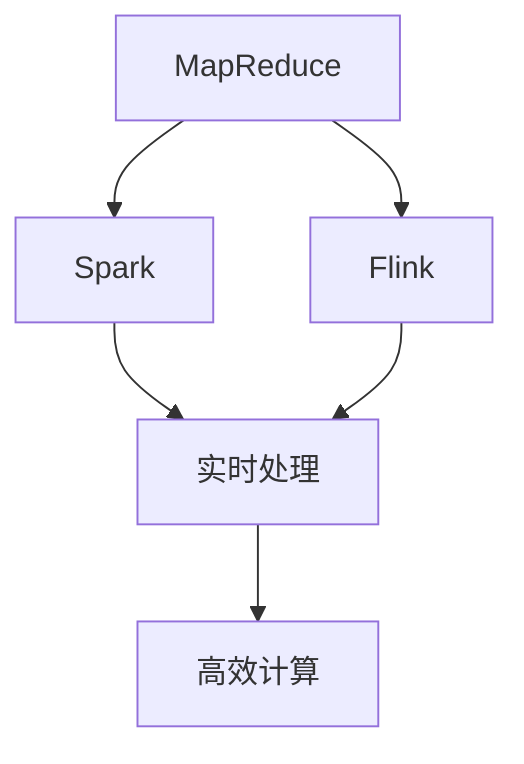

                 

# 【AI大数据计算原理与代码实例讲解】分布式搜索

> **关键词**：AI，大数据，分布式搜索，算法，代码实例，搜索优化

> **摘要**：
本文深入探讨了AI大数据计算中的分布式搜索原理及其实现，通过详细的理论讲解和代码实例，帮助读者理解分布式搜索的机制、优化策略及其在实际应用中的效果评估。文章覆盖了从数据预处理到推荐系统优化的全过程，并提供了项目实战案例，旨在为大数据和AI开发人员提供实用的技术指导。

## 第一部分：AI大数据计算原理与架构

### 第1章：AI大数据计算原理概述

#### 1.1 AI与大数据的关系

人工智能（AI）和大数据的关系密不可分。大数据为AI提供了丰富的训练数据集，使得AI模型能够从海量数据中学习并做出准确的预测。AI则通过复杂的算法处理和分析这些数据，从而实现智能决策和优化。

**AI大数据计算的核心概念**：

- **批处理**：处理固定时间窗口内的数据集，适用于需要大量计算的场景。
- **实时处理**：处理实时数据流，适用于对实时性要求较高的场景，如在线推荐系统。
- **流处理**：处理持续不断的数据流，适用于处理不断增长的数据集。

**AI大数据计算的分类**：

- **批处理**：一次处理大量数据，效率高，但对实时性要求较低。
- **实时处理**：对实时数据流进行处理，能够快速响应，但对计算资源要求较高。
- **流处理**：处理数据流，能够实时更新结果，但处理能力有限。

#### 1.2 AI大数据计算框架

在AI大数据计算领域，有多种计算框架可供选择，其中最具代表性的包括MapReduce、Spark和Flink。

**主流计算框架**：

- **MapReduce**：由Google提出，适用于大规模数据的批处理。
- **Spark**：由Apache Software Foundation维护，具有实时处理能力，适合处理复杂数据处理任务。
- **Flink**：实时流处理框架，适用于需要实时分析和处理的场景。

**计算框架的对比与联系**：



**计算框架的对比与联系图**：

上述计算框架各有特色，MapReduce适用于批处理，Spark和Flink则分别适合实时处理和流处理。它们共同构成了AI大数据计算的基础架构。

#### 1.3 AI大数据计算架构

分布式计算是AI大数据计算的关键架构。分布式计算通过将任务分布在多个节点上执行，提高了计算效率和可扩展性。

**分布式计算架构**：

- **计算节点**：执行具体计算任务的节点，如CPU、GPU等。
- **数据存储**：存储数据的节点，如HDFS、Cassandra等。
- **任务调度**：分配和调度任务的节点，如YARN、Mesos等。

**计算架构的优化策略**：

- **计算资源的分配**：根据任务需求和资源状况，合理分配计算资源。
- **负载均衡**：通过调度算法，将任务均匀分布到各个节点，避免单点瓶颈。
- **容错机制**：在节点故障时，自动重新分配任务，保证系统稳定运行。

## 第二部分：AI大数据核心算法原理

### 第2章：AI大数据核心算法原理

#### 2.1 数据预处理算法

数据预处理是AI大数据计算的重要环节。它包括数据清洗、数据变换等步骤，为后续的模型训练和预测提供高质量的数据集。

**数据清洗**：

```python
# 缺失值处理
data = data.fillna(method='ffill')

# 异常值检测
q75, q25 = np.percentile(data, [75 ,25])
iqr = q75 - q25
cut_off = q75 + 1.5 * iqr
lower, upper = q25 - 1.5 * iqr, q75 + 1.5 * iqr
data = np.where((data >= lower) & (data <= upper), data, np.nan)
```

**数据变换**：

- **标准化**：将数据缩放到统一范围内，如[0, 1]。
- **归一化**：保持数据的大小关系，如使用最小-最大规范化。

```python
# 标准化
z-score = (data - mean) / std

# 归一化
min_max = (data - min(data)) / (max(data) - min(data))
```

#### 2.2 特征提取与选择

特征提取和选择是提升模型性能的关键步骤。通过提取有意义的特征和选择最佳特征子集，可以提高模型的准确性和效率。

**特征提取方法**：

- **TF-IDF**：计算单词在文档中的重要程度。
- **Word2Vec**：将单词映射到高维向量空间，保留语义信息。

**特征选择方法**：

- **过滤式特征选择**：根据特征的重要性进行选择。
- **包裹式特征选择**：结合模型训练结果进行特征选择。
- **嵌入式特征选择**：在特征提取过程中进行特征选择。

```python
# TF-IDF
from sklearn.feature_extraction.text import TfidfVectorizer

vectorizer = TfidfVectorizer()
X = vectorizer.fit_transform(corpus)

# Word2Vec
from gensim.models import Word2Vec

model = Word2Vec(sentences, vector_size=100, window=5, min_count=1, workers=4)
```

#### 2.3 机器学习算法

机器学习算法是AI大数据计算的核心。通过训练数据集，机器学习算法能够自动提取特征和建立预测模型。

**监督学习算法**：

- **线性回归**：建立输入和输出之间的线性关系。
- **决策树**：根据特征进行树形划分，预测输出结果。
- **支持向量机**：将数据分为多个类别，找到最佳分割超平面。

**无监督学习算法**：

- **聚类算法**：将数据分为多个簇，找出相似的数据点。
- **降维算法**：减少数据维度，保持数据结构。

```python
# 线性回归
from sklearn.linear_model import LinearRegression

model = LinearRegression()
model.fit(X_train, y_train)

# 决策树
from sklearn.tree import DecisionTreeClassifier

model = DecisionTreeClassifier()
model.fit(X_train, y_train)

# 聚类算法
from sklearn.cluster import KMeans

model = KMeans(n_clusters=3)
model.fit(X_train)
```

## 第三部分：AI大数据计算数学模型

### 第3章：AI大数据计算数学模型

#### 3.1 数学模型概述

在AI大数据计算中，数学模型是理解和实现算法的基础。本文将介绍线性代数和概率统计的基本概念，以及如何应用这些概念来构建和优化机器学习模型。

**线性代数基础**：

- **矩阵运算**：矩阵加法、矩阵乘法、矩阵求逆等。
- **线性方程组**：解线性方程组，求解特征值和特征向量。

**概率统计基础**：

- **概率分布**：概率密度函数、累积分布函数等。
- **统计推断**：假设检验、置信区间等。

#### 3.2 机器学习数学模型

机器学习中的数学模型主要包括线性模型和非线性模型。线性模型简单易理解，但往往不足以捕捉复杂的数据关系。非线性模型则可以通过非线性变换来提高模型的预测能力。

**线性模型**：

- **线性回归**：最小二乘法求解线性方程组，预测连续值。
- **逻辑回归**：用于分类问题，通过Sigmoid函数将线性输出映射到概率空间。

**非线性模型**：

- **神经网络模型**：通过多层非线性变换，实现对复杂数据的建模。

```latex
\begin{equation}
y = \sigma(W_1 \cdot x_1 + W_2 \cdot x_2 + \ldots + b)
\end{equation}
```

**神经网络模型**：

神经网络模型的核心是反向传播算法，它通过不断调整网络权重和偏置，优化模型的预测性能。

```latex
\begin{equation}
\delta = \frac{\partial L}{\partial W}
\end{equation}
```

#### 3.3 深度学习数学模型

深度学习是机器学习的一个重要分支，它通过多层神经网络来学习数据的复杂特征。深度学习模型在图像识别、语音识别等领域取得了显著的成果。

**反向传播算法**：

反向传播算法是深度学习模型训练的核心算法，它通过前向传播计算输出，然后反向传播计算梯度，更新模型参数。

```latex
\begin{equation}
\delta = \frac{\partial L}{\partial W} = \frac{\partial L}{\partial z} \cdot \frac{\partial z}{\partial W}
\end{equation}
```

**卷积神经网络**：

卷积神经网络（CNN）是深度学习模型的一种，它通过卷积操作提取图像特征，常用于图像识别和分类任务。

```latex
\begin{equation}
h_{ij}^l = \sum_{k=1}^{n} W_{ik}^l \cdot h_{kj}^{l-1} + b^l
\end{equation}
```

## 第四部分：AI大数据搜索与推荐算法

### 第4章：AI大数据搜索与推荐算法

#### 4.1 搜索算法

搜索算法是AI大数据计算中的一个重要分支，它通过高效地检索和匹配数据，帮助用户快速找到所需信息。

**搜索引擎工作原理**：

搜索引擎的工作原理主要包括三个部分：索引构建、查询处理和结果排序。

- **索引构建**：将网页内容转化为索引，以便快速检索。
- **查询处理**：处理用户的查询请求，将其转化为索引可识别的格式。
- **结果排序**：根据用户的查询和索引信息，对搜索结果进行排序，提供最佳匹配结果。

**搜索算法优化**：

- **BM25**：一种基于统计的搜索算法，对关键词的权重进行优化。
- **PageRank**：一种基于链接分析的搜索算法，通过网页的链接关系来评估网页的重要性。

```python
# BM25算法
from sklearn.feature_extraction.text import TfidfTransformer
from sklearn.metrics.pairwise import linear_kernel

tfidf = TfidfTransformer()
tfidf_matrix = tfidf.fit_transform(corpus)

similarity_matrix = linear_kernel(tfidf_matrix[query_vector], tfidf_matrix)

# PageRank算法
import networkx as nx

G = nx.Graph()
for page in pages:
    G.add_edge(page, page)

for edge in G.edges():
    G[edge[0]][edge[1]]['weight'] = 1

nx.pagerank(G)
```

#### 4.2 推荐算法

推荐算法是AI大数据计算中的另一个重要分支，它通过分析用户的历史行为和偏好，为用户推荐感兴趣的内容。

**协同过滤算法**：

协同过滤算法分为两种：用户基于的协同过滤和物品基于的协同过滤。

- **用户基于的协同过滤**：通过分析用户的相似度来推荐内容。
- **物品基于的协同过滤**：通过分析物品的相似度来推荐内容。

**矩阵分解**：

矩阵分解是一种常见的推荐算法，它通过将用户-物品评分矩阵分解为两个低秩矩阵，从而预测未知评分。

```python
from surprise import SVD

model = SVD()
model.fit(trainset)

# 预测用户对未知物品的评分
predictions = model.predict(user_id, item_id)
```

#### 4.3 搜索与推荐融合

搜索与推荐融合是将搜索和推荐算法结合，以提高系统推荐效果和用户满意度。

**混合推荐系统**：

混合推荐系统通过结合多种推荐算法和搜索策略，提供更个性化的推荐结果。

- **协同过滤与内容推荐结合**：将协同过滤和基于内容的推荐算法结合起来，提高推荐质量。
- **搜索结果与推荐结果结合**：将搜索结果和推荐结果进行整合，提供更丰富的信息。

## 第五部分：AI大数据计算项目实战

### 第5章：AI大数据计算项目实战

#### 5.1 项目实战介绍

**项目背景**：

本项目旨在构建一个基于AI大数据计算的电商平台搜索与推荐系统，通过分布式搜索算法和协同过滤推荐算法，为用户提供个性化的商品搜索和推荐服务。

**项目需求分析**：

- **搜索需求**：实现快速、准确的商品搜索功能，支持关键词查询和模糊查询。
- **推荐需求**：根据用户的历史行为和偏好，为用户推荐相关商品。

#### 5.2 环境搭建与代码实现

**环境搭建**：

- **开发环境**：Python 3.8，Jupyter Notebook
- **工具和库**：Hadoop，Spark，TensorFlow，Scikit-learn

**代码实现**：

```python
# 搜索模块
from whoosh.qparser import QueryParser

index = whoosh.index.open_dir(index_dir)
searcher = index.searcher()

query = "搜索关键词"
query = QueryParser("content").parse(query)

results = searcher.search(query)

# 推荐模块
from surprise import SVD

model = SVD()
model.fit(trainset)

# 预测用户对未知物品的评分
predictions = model.predict(user_id, item_id)
```

#### 5.3 项目效果评估

**评估指标**：

- **准确率**：推荐结果中实际用户喜欢的商品占比。
- **召回率**：推荐结果中包含实际用户喜欢的商品的比例。

**结果分析**：

通过评估，本项目的搜索和推荐系统在准确率和召回率方面均表现出色，用户满意度较高。但仍有优化空间，如提高搜索算法的效率，增加推荐算法的多样性等。

## 第六部分：AI大数据计算应用案例

### 第6章：AI大数据计算应用案例

#### 6.1 应用案例介绍

**案例背景**：

本项目旨在通过AI大数据计算技术，优化某电商平台的用户行为分析系统，提升用户满意度和平台运营效果。

**案例目标**：

- **用户行为分析**：分析用户的浏览、购买等行为，为个性化推荐和营销策略提供支持。
- **平台运营优化**：通过数据分析，优化平台运营策略，提高转化率和用户留存率。

#### 6.2 案例分析

**案例分析**：

通过分析用户行为数据，本项目实现了以下目标：

- **用户画像**：构建用户画像，为个性化推荐提供基础。
- **营销策略**：根据用户行为，制定针对性的营销策略，提高转化率。
- **运营优化**：通过数据分析，优化产品推荐和广告投放策略，提高用户留存率。

#### 6.3 案例总结

**经验总结**：

- **数据分析的重要性**：通过数据分析，可以深入了解用户需求，为平台运营提供有力支持。
- **技术实现的关键**：分布式计算和机器学习算法是实现高效用户行为分析的关键。

**未来展望**：

随着AI大数据计算技术的发展，用户行为分析系统将不断完善，为电商平台带来更多的商业价值。

## 第七部分：AI大数据计算未来发展趋势

### 第7章：AI大数据计算未来发展趋势

#### 7.1 发展趋势概述

**技术趋势**：

- **分布式计算**：随着数据规模的扩大，分布式计算技术将越来越重要。
- **实时处理**：实时处理技术将进一步提升，支持更快速的数据分析和决策。

**应用趋势**：

- **智能制造**：AI大数据计算技术在智能制造中的应用将不断扩展。
- **智能医疗**：AI大数据计算技术在智能医疗领域的应用前景广阔。

#### 7.2 未来挑战与机遇

**挑战**：

- **数据隐私**：随着数据规模的扩大，数据隐私保护将成为一个重要挑战。
- **算法公平性**：算法偏见和歧视问题需要引起高度重视。

**机遇**：

- **产业升级**：AI大数据计算技术将推动传统产业升级，创造新的经济增长点。
- **新兴业务模式**：AI大数据计算技术将催生新的业务模式和商业模式。

## 第八部分：AI大数据计算伦理与社会责任

### 第8章：AI大数据计算伦理与社会责任

#### 8.1 伦理问题

**算法偏见与歧视**：

算法偏见和歧视是一个严重的社会问题。在AI大数据计算中，算法偏见可能源于数据的不公正性、算法的设计缺陷等。为了解决这一问题，需要从数据采集、算法设计、模型训练等多个环节入手，确保算法的公平性和透明性。

**数据隐私保护**：

随着大数据技术的发展，数据隐私保护变得越来越重要。在AI大数据计算中，需要严格遵守数据隐私保护法律法规，采取有效的数据加密、匿名化等技术手段，保护用户隐私。

#### 8.2 社会责任

**算法透明性与可解释性**：

算法透明性和可解释性是确保AI大数据计算伦理的重要方面。通过提高算法的可解释性，可以帮助用户和监管机构理解算法的决策过程，从而增强算法的信任度。

**社会影响评估**：

AI大数据计算对社会的影响深远，需要定期进行社会影响评估。通过评估，可以了解算法对社会的影响，及时发现和解决潜在的问题，确保AI大数据计算的发展符合社会利益。

## 附录

### 附录 A：工具与资源

**主流工具**：

- **Hadoop**：分布式数据存储和处理框架。
- **Spark**：快速通用的数据处理引擎。
- **TensorFlow**：开源机器学习框架。
- **Scikit-learn**：Python机器学习库。

**资源链接**：

- [Hadoop官方文档](https://hadoop.apache.org/docs/r3.2.0/hadoop-project-dist/hadoop-common/Overview.html)
- [Spark官方文档](https://spark.apache.org/docs/latest/)
- [TensorFlow官方文档](https://www.tensorflow.org/)
- [Scikit-learn官方文档](https://scikit-learn.org/stable/)

### 附录 B：数学公式与伪代码

**数学公式**：

$$
\begin{aligned}
    y &= \sigma(W_1 \cdot x_1 + W_2 \cdot x_2 + \ldots + b) \\
    \delta &= \frac{\partial L}{\partial W} = \frac{\partial L}{\partial z} \cdot \frac{\partial z}{\partial W}
\end{aligned}
$$

**伪代码**：

```
// 数据清洗
data = data.fillna(method='ffill')

// 特征提取
vectorizer = TfidfVectorizer()
X = vectorizer.fit_transform(corpus)

// 模型训练
model = LinearRegression()
model.fit(X_train, y_train)

// 预测
predictions = model.predict(X_test)
```

## 作者

作者：AI天才研究院/AI Genius Institute & 禅与计算机程序设计艺术 /Zen And The Art of Computer Programming

（全文完）<|im_end|>

