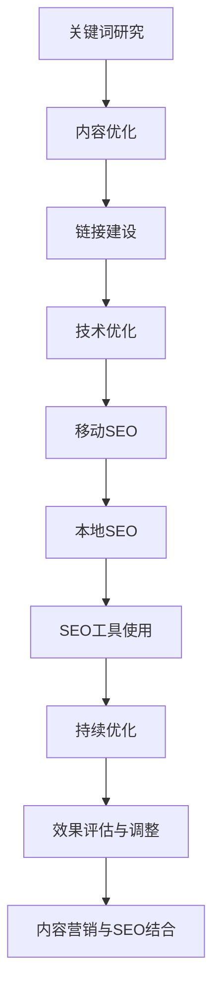

                 

### 文章标题：一人公司如何进行有效的SEO优化

关键词：（1）SEO优化，（2）一人公司，（3）关键词研究，（4）内容策略，（5）链接建设，（6）移动SEO，（7）本地SEO

摘要：在竞争激烈的市场中，一人公司通过有效的SEO优化，可以提升网站排名，增加流量，从而扩大业务范围。本文将详细阐述SEO优化的重要性，以及针对一人公司的具体策略，包括关键词研究、内容优化、链接建设和移动SEO等，帮助读者掌握SEO优化核心技能。

### 目录大纲

#### 第一部分：SEO优化基础

- **第1章：SEO优化概述**
  - **1.1 SEO的定义与重要性**
  - **1.1.1 SEO的定义**
  - **1.1.2 SEO的重要性**
  - **1.1.3 从SEO 1.0到SEO 2.0的演进**
  - **1.1.4 SEO的基本原则

#### 第二部分：关键词研究与策略

- **第2章：关键词研究方法**
  - **2.1 关键词研究的重要性**
  - **2.2 关键词研究方法**
  - **2.2.1 使用关键词工具**
  - **2.2.2 竞争对手关键词分析**
  - **2.2.3 长尾关键词挖掘**
  - **2.3 关键词优化策略**
  - **2.3.1 关键词密度与分布**
  - **2.3.2 关键词锚文本优化**
  - **2.3.3 语义关键词扩展**

#### 第三部分：网站内容优化

- **第3章：网站内容策略**
  - **3.1 内容质量的重要性**
  - **3.2 内容策略制定**
  - **3.3 内容创作技巧**
  - **3.3.1 标题写作技巧**
  - **3.3.2 内容结构优化**
  - **3.3.3 内容丰富度与更新**
  - **3.4 内容SEO优化**
  - **3.4.1 标签与元标签优化**
  - **3.4.2 内部链接优化**
  - **3.4.3 用户体验与SEO**

#### 第四部分：链接建设

- **第4章：链接建设策略**
  - **4.1 链接建设的重要性**
  - **4.2 链接建设方法**
  - **4.3 链接质量评估**
  - **4.4 链接建设实战**
  - **4.4.1 博客合作与内容互换**
  - **4.4.2 社交媒体推广**
  - **4.4.3 痞客邦与论坛链接建设**

#### 第五部分：移动SEO与本地SEO

- **第5章：移动SEO优化**
  - **5.1 移动搜索趋势**
  - **5.2 移动端SEO策略**
  - **5.3 移动网站优化**
  - **5.4 本地SEO策略**
  - **5.4.1 地方搜索引擎优化**
  - **5.4.2 本地搜索排名提升**
  - **5.4.3 本地SEO案例分析**

#### 第六部分：SEO工具与资源

- **第6章：SEO工具使用**
  - **6.1 关键词研究工具**
  - **6.2 网站诊断工具**
  - **6.3 链接分析工具**
  - **6.4 SEO资源推荐**

#### 第七部分：SEO持续优化

- **第7章：SEO优化计划制定**
  - **7.1 SEO优化计划制定**
  - **7.2 SEO效果评估与调整**
  - **7.3 SEO与内容营销结合**

#### 附录

- **附录A：SEO常见问题与解答**
  - **A.1 SEO常见问题**
  - **A.2 SEO误区与应对**

- **附录B：SEO优化实用工具推荐**
  - **B.1 SEO工具清单**
  - **B.2 工具使用指南**

- **附录C：SEO相关资源**
  - **C.1 SEO相关网站**
  - **C.2 SEO社区与活动**

### 联系信息

- **作者邮箱**：[seo.expert@example.com](mailto:seo.expert@example.com)
- **社交媒体链接**：
  - [Facebook](https://www.facebook.com/SEOExpert)
  - [Twitter](https://twitter.com/SEOExpert)
  - [LinkedIn](https://www.linkedin.com/in/SEOExpert)
- **联系方式**：手机：123-456-7890，微信：SEOExpert123

### 许可证

- **版权信息**：本文版权所有，未经许可，不得复制、转载或用于商业用途。
- **授权许可**：本文授权个人学习使用，但不得进行二次分发。如有需要，请联系作者获取授权。

### 第1章：SEO优化概述

#### 1.1 SEO的定义与重要性

SEO（Search Engine Optimization，搜索引擎优化）是指通过一系列策略和技术，优化网站在搜索引擎中的排名，从而提高网站流量和可见性的过程。在互联网时代，搜索引擎已成为人们获取信息的主要途径，因此SEO在提高网站曝光度和吸引用户访问方面具有至关重要的意义。

SEO的定义可以从以下几个方面来理解：

1. **搜索引擎工作原理**：搜索引擎通过爬虫（Crawler）抓取互联网上的信息，对抓取的内容进行索引（Index），并在用户搜索时，根据算法（Algorithm）计算结果，展示最相关的网页（SERP）。
2. **优化目标**：SEO的目标是提高网站在搜索引擎结果页面（Search Engine Results Page，SERP）上的排名，从而增加用户的点击率（Click-Through Rate，CTR）。
3. **优化方法**：SEO的方法包括关键词研究（Keyword Research）、内容优化（Content Optimization）、链接建设（Link Building）、技术优化（Technical Optimization）等。

SEO的重要性体现在以下几个方面：

1. **提高网站流量**：通过优化搜索引擎排名，网站可以更容易被用户发现，从而提高流量。
2. **提升品牌知名度**：良好的SEO策略可以提升网站的曝光度和品牌影响力。
3. **降低营销成本**：相对于付费广告，SEO是一种低成本、高效的营销手段。
4. **提高用户转化率**：通过优化用户体验，可以提高用户在网站上的停留时间和参与度，从而提高转化率。

#### 1.1.1 SEO的定义

SEO的定义可以具体化为以下几点：

- **关键词研究**：选择与网站内容相关且具有商业价值的关键词，以提高在搜索引擎中的曝光度。
- **内容优化**：创建高质量、有价值的内容，以满足用户需求，提高搜索引擎对网站的信任度。
- **链接建设**：通过获取外部链接，提高网站在搜索引擎中的权威性。
- **技术优化**：优化网站结构、加载速度、移动适配性等，以提高用户体验和搜索引擎的友好性。
- **数据分析和调整**：通过分析SEO效果数据，不断调整和优化SEO策略。

#### 1.1.2 SEO的重要性

SEO的重要性体现在以下几个方面：

1. **流量来源**：搜索引擎是用户获取信息的主要渠道之一。通过SEO优化，网站可以更容易被用户发现，从而提高流量。
2. **品牌建设**：良好的SEO策略可以提高网站的曝光度和知名度，增强品牌形象。
3. **成本效益**：相对于付费广告，SEO是一种成本较低、效益较高的营销手段。通过优化自然搜索结果，可以降低广告成本。
4. **用户体验**：SEO优化不仅仅是为了提高排名，更重要的是提高用户体验。通过优化网站结构、内容质量和链接建设，可以提供更好的用户体验，从而提高用户满意度。
5. **竞争优势**：在竞争激烈的市场中，有效的SEO策略可以帮助网站在搜索引擎中脱颖而出，获得竞争优势。

#### 1.1.3 从SEO 1.0到SEO 2.0的演进

SEO的发展历程可以分为两个阶段：SEO 1.0和SEO 2.0。

- **SEO 1.0**：
  - **主要策略**：关键词堆砌、外部链接购买、内容抄袭等。
  - **特点**：追求短期效果，忽视用户体验和内容质量。
  - **影响**：部分搜索引擎优化策略存在滥用和作弊现象，导致搜索引擎算法更新，对作弊网站进行惩罚。

- **SEO 2.0**：
  - **主要策略**：注重用户体验、内容质量和链接建设。
  - **特点**：强调长期策略，追求可持续的搜索引擎优化效果。
  - **影响**：搜索引擎算法更加注重用户体验和内容质量，对作弊网站进行严厉惩罚。

#### 1.1.4 SEO的基本原则

SEO的基本原则可以从以下几个方面来理解：

1. **内容为王**：高质量、有价值的内容是SEO的核心。内容策略应贴近用户需求，解决用户问题。
2. **用户体验至上**：提供快速、简洁、流畅的用户体验。优化网站性能和响应速度。
3. **技术优化**：网站结构清晰、易于导航。确保网站对搜索引擎友好。
4. **持续优化**：定期评估和调整SEO策略。跟踪和分析数据，持续改进。

### 第2章：关键词研究方法

关键词研究是SEO优化中的核心环节，它直接影响网站的可见性和流量。正确选择和使用关键词可以提升网站在搜索引擎中的排名，从而吸引更多目标用户访问。

#### 2.1 关键词研究的重要性

关键词研究的重要性体现在以下几个方面：

1. **提高网站排名**：选择与网站内容相关且具有商业价值的关键词，可以提高网站在搜索引擎中的排名。
2. **增加流量**：通过优化关键词，提高网站在搜索引擎结果页面（SERP）中的曝光度，从而吸引更多用户访问网站。
3. **提升用户体验**：关键词研究可以帮助了解用户需求，从而提供更符合用户期望的内容，提升用户体验。
4. **指导内容策略**：关键词研究为内容创作提供方向，确保内容与用户需求高度匹配。

#### 2.2 关键词研究方法

关键词研究的方法可以分为以下几个步骤：

1. **确定目标受众和市场需求**：了解目标受众的年龄、性别、兴趣和搜索习惯。分析市场需求，确定潜在关键词。
2. **列出初始关键词**：根据网站内容和业务目标，列出可能的初始关键词。
3. **使用关键词工具**：利用SEO工具如Google Keyword Planner、SEMrush、Ahrefs等进行进一步研究。
4. **分析竞争对手**：研究竞争对手使用的关键词，了解行业热点和趋势。
5. **选择关键词**：根据搜索量、竞争程度和商业价值筛选出合适的关键词。
6. **挖掘长尾关键词**：长尾关键词是指那些搜索量较低，但具有较高转化率的关键词。通过扩展关键词、思维导图等方法挖掘长尾关键词。

##### 2.2.1 关键词研究工具

常用的关键词研究工具有以下几种：

1. **Google Keyword Planner**：
   - 功能：提供关键词搜索量数据，帮助优化广告投放。
   - 使用方法：登录Google Ads账户，进入Keyword Planner工具，输入关键词或网站域名，获取相关关键词和搜索量数据。

2. **SEMrush**：
   - 功能：提供全面的SEO工具，包括关键词研究、网站分析、竞争对手监测等。
   - 使用方法：在SEMrush中输入关键词，获取关键词搜索量、竞争程度、相关关键词等信息。

3. **Ahrefs**：
   - 功能：提供强大的关键词研究工具，包括关键词搜索量、竞争度、相关关键词挖掘。
   - 使用方法：在Ahrefs中输入关键词，获取关键词分析报告，包括搜索量、竞争度、关键词难度等。

##### 2.2.2 竞争对手关键词分析

分析竞争对手使用的关键词可以帮助我们了解行业趋势和潜在机会。以下是一些分析竞争对手关键词的方法：

1. **使用SEO工具**：利用SEMrush、Ahrefs等工具分析竞争对手的页面，查看他们使用的关键词。
2. **查看源代码**：通过查看竞争对手网站的源代码，找到隐藏的关键词和锚文本。
3. **社交媒体分析**：分析竞争对手在社交媒体上的活动，了解他们推广的关键词。
4. **行业报告**：阅读行业报告，了解竞争对手的关键词策略和行业趋势。

##### 2.2.3 长尾关键词挖掘

长尾关键词是指那些搜索量较低，但具有较高转化率的关键词。挖掘长尾关键词可以帮助网站获得更多精准流量。

以下是一些挖掘长尾关键词的方法：

1. **使用关键词工具**：利用Google Keyword Planner、SEMrush、Ahrefs等工具，通过扩展关键词、思维导图等方法挖掘长尾关键词。
2. **结合用户搜索习惯**：了解目标用户的搜索习惯，选择与用户需求更贴近的长尾关键词。
3. **内容扩展**：在现有内容的基础上，通过添加问题、延伸主题等方式，扩展关键词范围。
4. **社交媒体分析**：通过社交媒体平台，了解用户在讨论的问题和需求，挖掘潜在的长尾关键词。

### Mermaid流程图：关键词研究方法

mermaid
graph TD
    A[确定目标受众和市场需求] --> B[列出初始关键词]
    B --> C{使用关键词工具}
    C --> D[分析竞争对手关键词]
    D --> E[选择关键词]
    E --> F[挖掘长尾关键词]


### 第3章：关键词优化策略

关键词优化策略是指通过一系列方法，提高网站在搜索引擎中的关键词排名，从而增加网站流量和曝光度。关键词优化是SEO的核心，有效的关键词优化策略可以帮助网站在竞争激烈的市场中脱颖而出。

#### 3.1 关键词密度与分布

关键词密度是指关键词在网页内容中出现的频率。适当的密度有助于搜索引擎正确理解网页内容，但过高或过低都会对SEO效果产生负面影响。

**关键词密度优化策略**：

1. **保持适度密度**：关键词密度应保持在2%到3%之间，避免过度优化。
2. **分散关键词**：避免将所有关键词集中在一个地方，应在整个内容中均匀分布。
3. **使用同义词和近义词**：通过使用同义词和近义词，增加关键词的多样性，提高内容质量。

**关键词分布优化策略**：

1. **标题和描述**：在标题和元描述中合理地融入关键词，提高关键词的相关性。
2. **正文**：在正文内容的开头、结尾和中间部分合理地分布关键词。
3. **内部链接**：通过内部链接，将关键词链接到相关页面，提高关键词的权重。

### Mermaid流程图：关键词密度与分布优化策略

mermaid
graph TD
    A[保持适度密度] --> B[分散关键词]
    B --> C[使用同义词和近义词]
    C --> D{标题和描述优化}
    D --> E[正文优化]
    E --> F[内部链接优化]


#### 3.2 关键词锚文本优化

关键词锚文本是指链接的文字描述。优化锚文本可以提高链接的相关性和用户体验，从而有助于提高网页的SEO排名。

**关键词锚文本优化策略**：

1. **自然语言**：使用自然语言描述链接，避免使用过度营销的措辞。
2. **多样化锚文本**：避免所有链接都使用相同或相似的锚文本，增加锚文本的多样性。
3. **相关性**：确保锚文本与链接目标页面的内容高度相关。

### Mermaid流程图：关键词锚文本优化策略

mermaid
graph TD
    A[自然语言] --> B[多样化锚文本]
    B --> C[相关性]


#### 3.3 语义关键词扩展

语义关键词扩展是指通过理解关键词的语义关系，发现和利用与目标关键词相关的新关键词。这种方法可以提高网页的覆盖面和针对性。

**语义关键词扩展策略**：

1. **使用相关工具**：利用SEMrush、Ahrefs等工具分析关键词的语义关系。
2. **思维导图**：通过绘制思维导图，梳理关键词之间的关联。
3. **内容扩展**：在内容创作中融入扩展关键词，提高内容的丰富性和相关性。

### Mermaid流程图：语义关键词扩展策略

mermaid
graph TD
    A[使用相关工具] --> B[思维导图]
    B --> C[内容扩展]


### 第4章：关键词监控与调整

关键词监控与调整是SEO优化中的关键环节。通过定期监控关键词的排名和流量，可以及时发现和解决问题，确保SEO策略的有效性。

#### 4.1 关键词排名监控工具

关键词排名监控工具可以帮助我们跟踪关键词的搜索排名变化，提供关键数据支持。以下是一些常用的关键词排名监控工具：

1. **Google Search Console**：
   - 功能：提供关键词排名、搜索流量和点击率等数据。
   - 使用方法：在Google Search Console中设置跟踪网站，监控关键词排名和搜索表现。

2. **SEMrush**：
   - 功能：提供关键词排名监控、关键词搜索量和趋势分析。
   - 使用方法：在SEMrush中创建项目，监控关键词排名和搜索表现。

3. **Ahrefs**：
   - 功能：提供关键词排名跟踪、关键词难易度和竞争程度分析。
   - 使用方法：在Ahrefs中输入关键词，监控关键词排名和搜索表现。

#### 4.2 关键词调整策略

关键词调整是基于监控结果对关键词策略进行优化和调整的过程。以下是一些关键词调整策略：

1. **分析监控数据**：
   - 分析关键词的搜索量和点击率，了解关键词的表现。
   - 比较关键词排名变化，找出排名下降或上升的关键词。

2. **优化内容**：
   - 针对排名下降的关键词，优化相关内容，提高相关性。
   - 根据用户搜索习惯，调整关键词密度和分布。

3. **增加新关键词**：
   - 挖掘新的关键词，扩大关键词覆盖面。
   - 将新关键词融入内容，提高内容质量。

4. **调整关键词策略**：
   - 根据关键词竞争程度和商业价值，调整关键词优先级。
   - 定期评估关键词策略，确保关键词与业务目标一致。

### Mermaid流程图：关键词监控与调整策略

mermaid
graph TD
    A[关键词排名监控工具] --> B[分析监控数据]
    B --> C[优化内容]
    C --> D[增加新关键词]
    D --> E[调整关键词策略]


### 第5章：网站内容策略

网站内容策略是指制定和执行网站内容的方法和计划，旨在提高用户体验、搜索引擎排名和业务目标。对于一人公司来说，有效的网站内容策略至关重要，它能够帮助公司吸引并留住目标用户，提高转化率和业务收益。

#### 5.1 内容质量的重要性

内容质量是网站成功的关键因素之一。高质量的内容不仅能够提升搜索引擎对网站的信任度，还能提高用户的满意度和忠诚度。以下是从SEO和用户体验两个角度探讨内容质量的重要性：

**SEO角度**：

1. **提高搜索引擎排名**：搜索引擎更喜欢高质量、权威的内容，因为它们能更好地满足用户需求。高质量的内容更容易获得搜索引擎的青睐，从而提高排名。
2. **降低跳出率**：高质量的内容能够吸引用户停留更长时间，减少跳出率，从而对SEO产生积极影响。
3. **增强外部链接**：高质量的内容更容易吸引其他网站链接到您的网站，从而提高网站的权威性和搜索引擎排名。

**用户体验角度**：

1. **满足用户需求**：高质量的内容能够更好地解决用户问题，满足用户需求，从而提高用户满意度和忠诚度。
2. **提高用户参与度**：高质量的内容能够吸引用户参与讨论、评论和分享，从而提高用户互动和参与度。
3. **降低跳出率**：高质量的内容能够吸引用户在网站停留更长时间，减少跳出率，从而提高用户体验。

#### 5.2 内容策略制定

制定网站内容策略需要考虑以下几个方面：

1. **目标受众分析**：
   - 了解目标受众的年龄、性别、兴趣和行为习惯。
   - 分析目标受众的搜索习惯和偏好，确定内容主题和类型。

2. **内容目标**：
   - 明确内容的目标，如提高品牌知名度、增加销售、提升用户参与度等。
   - 根据内容目标，制定具体的指标，如访问量、转化率、用户停留时间等。

3. **内容类型**：
   - 根据目标受众和内容目标，确定适合的内容类型，如博客文章、视频、图片、电子书等。
   - 选择多样化的内容类型，满足不同用户的需求。

4. **内容发布计划**：
   - 制定内容发布的时间表和频率，确保内容的持续性和一致性。
   - 根据用户行为数据和搜索引擎算法更新，调整内容发布策略。

5. **内容优化**：
   - 根据SEO策略，优化内容的关键词、标题、描述等。
   - 定期更新和改进内容，确保内容的质量和相关性。

### Mermaid流程图：内容策略制定

mermaid
graph TD
    A[目标受众分析] --> B[内容目标]
    B --> C[内容类型]
    C --> D[内容发布计划]
    D --> E[内容优化]


### 第6章：内容创作技巧

内容创作是网站内容策略的重要组成部分，高质量的内容不仅能够提高搜索引擎排名，还能增强用户体验和品牌影响力。以下是一些内容创作技巧，帮助一人公司创作出高质量、有吸引力的内容。

#### 6.1 标题写作技巧

标题是吸引用户点击的重要因素，一个优秀的标题应该简洁、引人入胜，并能准确传达内容的核心价值。以下是一些标题写作技巧：

1. **明确主题**：确保标题直接明了，反映文章的主要内容。
2. **引人入胜**：使用数字、疑问句、感叹句等吸引读者注意。
3. **关键词优化**：在标题中合理地融入关键词，提高搜索引擎的可见性。
4. **避免误导**：确保标题与内容相符，避免使用夸大或误导性的表述。

#### 6.2 内容结构优化

内容结构是指文章的整体布局和组织方式。良好的内容结构有助于提升用户的阅读体验和理解力。以下是一些内容结构优化的技巧：

1. **开头吸引人**：用引人入胜的开头段落吸引读者继续阅读。
2. **清晰的组织**：使用段落和子标题，使文章结构清晰，便于用户阅读。
3. **逻辑连贯**：确保文章内容逻辑连贯，信息传递清晰。
4. **恰当的图片和图表**：使用图片和图表辅助说明，提高内容的可读性和吸引力。

#### 6.3 内容丰富度与更新

内容丰富度是指文章的深度和广度。丰富的内容能够提供更多的信息和价值，有助于提高用户的参与度和忠诚度。以下是一些内容丰富度和更新的技巧：

1. **深度研究**：对主题进行深入的研究，提供详尽的信息和分析。
2. **持续更新**：定期检查和更新内容，添加新的信息、数据和案例。
3. **引用权威来源**：引用权威的来源和数据，增强内容的可信度。
4. **用户反馈**：关注用户反馈，根据用户需求和意见调整和优化内容。

### Mermaid流程图：内容创作技巧

mermaid
graph TD
    A[标题写作技巧] --> B[内容结构优化]
    B --> C[内容丰富度与更新]


### 第7章：内容SEO优化

内容SEO优化是指通过优化网站内容，提高搜索引擎对网站的友好度，从而提高网站在搜索引擎中的排名。内容是SEO的基础，高质量的内容不仅能够吸引用户，还能提高搜索引擎的信任度。以下是一些内容SEO优化的技巧。

#### 7.1 标签与元标签优化

标签和元标签是HTML代码中用于描述网页内容和结构的元素，它们对SEO至关重要。以下是一些标签和元标签优化的技巧：

1. **标题标签（<title>）**：
   - 确保每个页面的标题唯一、简洁且包含关键词。
   - 避免使用相同或相似的标题，以免搜索引擎混淆。
   - 标题长度控制在50-60个字符内。

2. **描述标签（<meta name="description">）**：
   - 编写有吸引力的描述，概括页面内容并包含关键词。
   - 描述长度控制在150-160个字符内。
   - 避免使用重复的描述，确保每个页面都有独特的描述。

3. **关键字标签（<meta name="keywords">）**：
   - 虽然搜索引擎对关键字标签的重视程度逐渐降低，但仍然可以作为补充信息。
   - 列出与页面内容相关的主要关键词，避免滥用和过度优化。

4. **H1标签**：
   - 使用H1标签定义主要标题，确保每个页面只有一个H1标签。
   - 将H1标签与标题标签内容保持一致，确保搜索引擎能够正确理解页面主题。

#### 7.2 内部链接优化

内部链接是网站页面之间的链接，它们有助于提高网站的导航性和搜索引擎友好度。以下是一些内部链接优化的技巧：

1. **链接布局**：
   - 确保链接布局合理，使页面之间的链接关系清晰。
   - 使用相关链接，将内容相关的页面链接在一起。

2. **锚文本**：
   - 使用自然、相关的锚文本，提高链接的相关性和用户体验。
   - 避免使用“点击这里”等通用锚文本，确保锚文本能够描述链接目标页面的内容。

3. **链接密度**：
   - 适当增加内部链接的数量，但避免过度链接，影响用户体验。
   - 保持链接密度在1%到3%之间，确保链接合理分布。

4. **链接位置**：
   - 将链接放置在页面的重要位置，如正文开头、结尾和底部。
   - 避免将链接放置在页面的次要区域，如广告区域。

#### 7.3 用户体验与SEO

用户体验（UX）是指用户在使用网站过程中的整体感受和满意度。良好的用户体验有助于提高用户留存率和网站排名。以下是一些用户体验与SEO相关的技巧：

1. **简洁导航**：
   - 提供清晰的导航菜单，方便用户快速找到所需信息。
   - 避免复杂的导航结构，确保用户能够轻松浏览网站。

2. **快速响应**：
   - 优化网站性能，确保网站快速加载。
   - 使用高效的代码和压缩技术，提高页面加载速度。

3. **移动优化**：
   - 确保网站在移动设备上的良好表现，满足移动用户的访问需求。
   - 使用响应式设计，确保网站在不同设备上的显示效果。

4. **可访问性**：
   - 确保网站内容对残障人士友好，提高网站的可用性。
   - 遵循WCAG（Web Content Accessibility Guidelines）标准，确保网站的可访问性。

### Mermaid流程图：内容SEO优化

mermaid
graph TD
    A[标签与元标签优化] --> B[内部链接优化]
    B --> C[用户体验与SEO]


### 第8章：链接建设策略

链接建设是SEO优化中的重要组成部分，通过获取高质量的外部链接，可以提高网站的权威性和搜索引擎排名。对于一人公司来说，有效的链接建设策略有助于提高网站在搜索引擎中的表现。以下将详细阐述链接建设的重要性、方法、质量评估以及实战技巧。

#### 8.1 链接建设的重要性

链接建设的重要性体现在以下几个方面：

1. **提高网站权威性**：外部链接被视为网站权威性和可信度的投票。高质量的外部链接有助于提高网站的权威性。
2. **提升关键词排名**：外部链接对搜索引擎算法具有重要影响，有助于提高目标关键词的排名。
3. **增加网站流量**：外部链接可以吸引更多用户访问网站，从而增加网站流量。
4. **增强品牌知名度**：通过链接建设，可以在更多平台上曝光网站，提高品牌知名度。

#### 8.2 链接建设方法

链接建设的方法可以分为以下几种：

1. **内容营销**：
   - 通过创建和分享高质量的内容，吸引其他网站链接到您的网站。高质量的内容包括博客文章、研究报告、视频等。
   - 定期发布有价值的内容，吸引读者分享和引用。
   - 与其他网站合作，共同创作和分享内容。

2. **合作与互换**：
   - 与行业内的其他网站建立合作关系，互相链接。
   - 通过内容互换、广告合作等方式获取外部链接。

3. **社交媒体推广**：
   - 在社交媒体平台上分享内容和网站链接，吸引外部链接和流量。
   - 参与社交媒体上的相关讨论，提供有价值的信息。
   - 使用标签和关键词，提高内容的可见性。

4. **论坛和博客**：
   - 在相关的论坛和博客上参与讨论，提供有价值的回复。
   - 分享个人见解和经验，吸引其他用户链接到您的网站。
   - 发帖时避免过度推广，保持内容的真实性和价值。

5. **新闻稿发布**：
   - 发布高质量的新闻稿，吸引媒体和行业网站的报道和链接。
   - 新闻稿应包含独特的信息和价值，避免重复发布。
   - 选择适合的媒体平台发布新闻稿，提高传播效果。

6. **博客合作与内容互换**：
   - 与其他博客作者合作，共同创作和分享内容。
   - 通过内容互换，在对方的网站上获得链接。

7. **社交媒体推广**：
   - 利用社交媒体平台（如Facebook、Twitter、LinkedIn等）推广网站内容和链接。
   - 与行业影响者和意见领袖互动，增加曝光度。

8. **论坛和博客**：
   - 在相关论坛和博客上积极参与讨论，提供有价值的回复。
   - 分享个人见解和经验，吸引其他用户链接到您的网站。

#### 8.3 链接质量评估

链接质量评估是确保链接建设策略有效性的关键环节。以下是几个常用的链接质量评估方法：

1. **域权威度**：
   - 评估链接来源网站的权威性和信誉度。高权威度的网站链接更有价值。
   - 可以使用工具如Ahrefs、Moz等来评估网站的权威度。

2. **内容相关性**：
   - 链接内容与目标网页的相关性越高，质量越高。相关性强的链接能够提高搜索引擎对网站的认可度。

3. **锚文本**：
   - 评估锚文本的自然性和相关性。自然、相关的锚文本更能体现链接的价值。

4. **链接位置**：
   - 链接在页面上的位置也会影响质量。首页、内容页等核心位置的链接质量较高。

#### 8.4 链接建设实战

以下是一些链接建设实战技巧：

1. **内容营销**：
   - 创建高质量、有价值的内容，如深度文章、视频、图表等，吸引其他网站链接。
   - 利用内容营销工具，如BuzzSumo等，发现行业热点和趋势，创作有针对性的内容。

2. **合作与互换**：
   - 与行业内的其他网站建立合作关系，进行内容互换。
   - 保持合作关系的长期性和稳定性，确保链接的持续性和有效性。

3. **社交媒体推广**：
   - 在社交媒体上发布内容，鼓励用户分享和链接。
   - 参与行业讨论，提供有价值的信息，增加曝光度。

4. **论坛和博客**：
   - 在相关论坛和博客上积极参与讨论，提供高质量的回复。
   - 创建个人品牌，提升影响力，吸引更多链接。

5. **新闻稿发布**：
   - 发布高质量的新闻稿，吸引媒体报道和链接。
   - 选择合适的新闻稿发布平台，提高传播效果。

6. **博客合作与内容互换**：
   - 与其他博客作者合作，共同创作和分享内容。
   - 通过博客合作，提高内容的影响力和曝光度。

7. **社交媒体推广**：
   - 在社交媒体上推广内容和链接，增加用户访问和链接。
   - 利用社交媒体广告，精准定位目标受众。

8. **论坛和博客**：
   - 在相关论坛和博客上积极参与讨论，提供有价值的回复。
   - 创建个人品牌，提升影响力，吸引更多链接。

### Mermaid流程图：链接建设策略

mermaid
graph TD
    A[链接建设重要性] --> B[链接建设方法]
    B --> C[链接质量评估]
    C --> D[链接建设实战]


### 第9章：链接建设实战

链接建设是SEO优化中的核心环节，通过获取高质量的外部链接，可以提高网站的权威性和搜索引擎排名。在本章中，我们将探讨一些实际的链接建设策略和实战技巧，帮助一人公司有效地开展链接建设。

#### 9.1 博客合作与内容互换

博客合作与内容互换是一种有效的链接建设方法，通过与其他网站或博客合作，互相发布和推荐内容，从而获取外部链接。

**方法**：

1. **寻找合适的合作伙伴**：寻找与您的网站内容和目标受众相关的博客和网站。可以通过行业论坛、社交媒体、专业社群等途径寻找潜在的合作伙伴。

2. **内容创作**：为合作伙伴创作高质量、有价值的内容。确保内容能够吸引读者，并提供独特的价值。

3. **链接嵌入**：在内容中合理地嵌入链接，指向您的网站或相关页面。确保链接的自然性和相关性，避免过度优化。

4. **互惠互利**：确保合作伙伴也能从合作中获得利益，建立长期合作关系。

#### 9.2 社交媒体推广

社交媒体推广是链接建设的重要手段，通过在社交媒体平台上分享内容和链接，可以吸引更多用户访问和链接您的网站。

**方法**：

1. **发布高质量内容**：在社交媒体上发布有价值的内容，如文章、视频、图表等。确保内容能够吸引读者的注意力。

2. **标签和关键词**：使用适当的标签和关键词，提高内容的可见性。标签和关键词应与内容相关，避免滥用。

3. **互动与互动**：与粉丝和关注者互动，回复评论和私信。通过互动，增加用户对您的网站和品牌的信任。

4. **分享和推广**：鼓励用户分享和推广您的网站内容和链接。可以通过提供奖励、优惠券等方式激励用户。

#### 9.3 痞客邦与论坛链接建设

痞客邦和论坛是链接建设的重要渠道，通过在这些平台上积极参与讨论和分享内容，可以获得外部链接。

**方法**：

1. **参与讨论**：在相关痞客邦和论坛上积极参与讨论，提供有价值的回复。避免过度推广，保持真实性和价值。

2. **分享原创内容**：在痞客邦上发布原创内容，吸引其他用户链接和分享。确保内容质量高，提供独特价值。

3. **链接嵌入**：在回复和内容中合理地嵌入指向您网站的链接。确保链接的自然性和相关性。

4. **建立个人品牌**：通过积极参与讨论和分享内容，建立个人品牌，提升影响力。吸引更多用户链接到您的网站。

### Mermaid流程图：链接建设实战

mermaid
graph TD
    A[博客合作与内容互换] --> B[社交媒体推广]
    B --> C[痞客邦与论坛链接建设]


### 第10章：移动SEO与本地SEO

#### 10.1 移动SEO优化

随着移动设备的普及，移动SEO（Mobile SEO）变得愈发重要。优化移动SEO可以提高网站在移动设备上的表现，从而提高用户体验和搜索引擎排名。

**优化策略**：

1. **响应式设计**：确保网站在多种移动设备上均能良好显示。使用响应式设计技术，使网站自动适应不同屏幕尺寸。

2. **页面速度优化**：提高移动页面的加载速度，提升用户体验。优化图片大小、使用缓存技术、减少HTTP请求等。

3. **移动友好内容**：创建简洁、直观的移动内容，满足移动用户的需求。确保内容易于阅读和操作。

4. **移动搜索优化**：优化移动搜索引擎中的关键词和搜索结果，提高排名。关注移动用户搜索习惯，选择合适的关键词。

5. **移动适配性**：确保网站在不同移动设备上的良好表现，包括屏幕分辨率、字体大小、按钮位置等。

#### 10.2 本地SEO策略

本地SEO（Local SEO）是指优化网站在本地搜索引擎中的排名，吸引本地用户访问。对于一人公司来说，本地SEO可以帮助提高在本地市场的曝光度和业务。

**优化策略**：

1. **优化本地关键词**：选择与本地业务相关的关键词，提高搜索相关性。例如，使用“XX城市+关键词”的形式。

2. **本地地图优化**：在Google地图等平台上优化本地地图信息，包括公司名称、地址、电话、营业时间等。

3. **本地链接建设**：通过本地网站和社区获取链接，提高本地影响力。例如，与本地媒体、论坛、博客等建立合作关系。

4. **客户评价管理**：积极管理客户评价，提高网站在本地搜索中的信誉。鼓励用户在谷歌地图、 Yelp等平台上留下正面评价。

5. **本地内容创作**：创作与本地相关的内容，如本地新闻、活动报道、行业见解等。提高网站在本地搜索中的相关性。

### Mermaid流程图：移动SEO与本地SEO优化

mermaid
graph TD
    A[移动SEO优化] --> B[本地SEO策略]


### 第11章：SEO工具与资源

SEO工具和资源是进行有效SEO优化的重要支持。本章将介绍一些常用的SEO工具，并提供资源推荐，帮助读者掌握SEO优化技能。

#### 11.1 SEO工具使用

以下是一些常用的SEO工具及其功能：

1. **Google Analytics**：
   - 功能：分析网站流量、用户行为、转化率等。
   - 使用方法：配置跟踪代码，设置目标，分析用户行为和流量来源。

2. **Google Search Console**：
   - 功能：监控网站在Google搜索中的表现，包括关键词排名、搜索流量、错误页面等。
   - 使用方法：上传网站地图，监控关键词排名和搜索流量，诊断和修复错误。

3. **SEMrush**：
   - 功能：提供关键词研究、网站分析、竞争对手监测等。
   - 使用方法：进行关键词研究，分析竞争对手，优化网站内容和链接建设。

4. **Ahrefs**：
   - 功能：提供关键词研究、网站诊断、链接分析等。
   - 使用方法：进行关键词研究，分析网站链接质量，监控竞争对手。

5. **Moz**：
   - 功能：提供关键词研究、网站诊断、链接建设工具等。
   - 使用方法：进行关键词研究，分析网站链接质量，优化网站结构。

6. ** Screaming Frog**：
   - 功能：网站SEO审计工具，分析网站结构、链接、内容等。
   - 使用方法：扫描网站，诊断和修复SEO问题，优化网站结构。

7. **Unsplash**：
   - 功能：提供免费的高质量图片资源，用于网站内容创作。
   - 使用方法：搜索相关图片，下载并使用，丰富网站内容。

#### 11.2 SEO资源推荐

以下是一些SEO资源，包括书籍、课程、博客和社区等，为SEO从业者提供学习和交流的平台：

1. **书籍**：
   - 《SEO实战密码》
   - 《搜索引擎营销》
   - 《SEO实战手册》

2. **课程**：
   - Coursera上的《搜索引擎优化》（由Google提供）
   - Udemy上的《从零开始学习SEO》
   - edX上的《搜索引擎营销与优化》

3. **博客**：
   - Moz Blog
   - Search Engine Land
   - Neil Patel Blog

4. **社区**：
   - Reddit SEO社区
   - LinkedIn SEO群组
   - SEO Chat论坛

#### 11.3 SEO工具推荐

以下是一些SEO工具的推荐及其使用指南：

1. **Google Analytics**：
   - **功能**：分析网站流量、用户行为和转化率。
   - **使用指南**：
     - 配置跟踪代码：在Google Analytics账户中设置网站跟踪代码。
     - 设置目标：定义网站目标，如转化、下载等。
     - 分析报告：定期查看流量和用户行为报告，优化网站。

2. **Google Search Console**：
   - **功能**：监控网站在Google搜索中的表现。
   - **使用指南**：
     - 上传网站地图：提交网站地图，帮助搜索引擎抓取网站内容。
     - 关键词分析：监控关键词排名和搜索流量，优化关键词策略。
     - 错误诊断：识别和修复网站错误，提高搜索引擎友好度。

3. **SEMrush**：
   - **功能**：提供关键词研究、网站分析和竞争对手监测。
   - **使用指南**：
     - 关键词研究：输入关键词，获取搜索量、竞争程度和趋势。
     - 网站分析：诊断网站SEO问题，提供优化建议。
     - 竞争对手监测：分析竞争对手的关键词和链接策略，制定针对性策略。

4. **Ahrefs**：
   - **功能**：提供关键词研究、网站诊断和链接分析。
   - **使用指南**：
     - 关键词研究：输入关键词，获取搜索量、竞争程度和趋势。
     - 网站诊断：扫描网站，识别SEO问题。
     - 链接分析：分析网站链接质量，监控外部链接。

5. **Moz**：
   - **功能**：提供关键词研究、网站诊断和链接建设工具。
   - **使用指南**：
     - 关键词研究：输入关键词，获取搜索量、竞争程度和趋势。
     - 网站诊断：分析网站SEO问题，提供优化建议。
     - 链接建设：发现和获取高质量外部链接。

6. **Screaming Frog**：
   - **功能**：网站SEO审计工具。
   - **使用指南**：
     - 扫描网站：输入网站URL，扫描网站结构。
     - 诊断问题：识别和修复SEO问题，如错误链接、缺失标签等。
     - 报告生成：生成SEO报告，提供详细优化建议。

### Mermaid流程图：SEO工具与资源

mermaid
graph TD
    A[SEO工具使用] --> B[SEO资源推荐]
    B --> C[SEO工具推荐]


### 第12章：SEO持续优化

SEO是一个持续的过程，需要不断监控、评估和调整策略。通过定期优化，可以确保网站在搜索引擎中的排名保持稳定，并适应不断变化的搜索引擎算法。

#### 12.1 SEO优化计划制定

制定SEO优化计划是确保SEO策略系统性和有效性的关键。以下是如何制定SEO优化计划的步骤：

1. **目标设定**：
   - 明确SEO优化的目标，如提高关键词排名、增加网站流量、提高转化率等。
   - 设定具体的、可衡量的目标。

2. **数据分析**：
   - 利用SEO工具分析网站当前的表现，包括关键词排名、流量、转化率等。
   - 分析竞争对手的SEO策略，了解行业趋势。

3. **策略制定**：
   - 根据分析结果，制定具体的SEO优化策略。
   - 包括关键词研究、内容优化、链接建设、技术优化等。

4. **执行与监控**：
   - 执行优化策略，并定期监控效果。
   - 通过SEO工具跟踪关键词排名、流量和转化率等指标。

5. **评估与调整**：
   - 定期评估SEO效果，根据评估结果进行调整。
   - 调整策略，确保SEO目标持续达成。

### Mermaid流程图：SEO优化计划制定

mermaid
graph TD
    A[目标设定] --> B[数据分析]
    B --> C[策略制定]
    C --> D[执行与监控]
    D --> E[评估与调整]


#### 12.2 SEO效果评估与调整

SEO效果评估与调整是确保SEO策略持续有效的重要环节。以下是如何评估和调整SEO效果的步骤：

1. **数据监控**：
   - 利用SEO工具监控关键词排名、流量、转化率等指标。
   - 分析数据，了解SEO策略的实际效果。

2. **效果评估**：
   - 评估SEO策略的目标达成情况。
   - 分析关键词排名、流量和转化率等数据，了解哪些策略有效，哪些需要改进。

3. **问题诊断**：
   - 识别SEO策略中存在的问题，如关键词排名下降、流量减少等。
   - 分析原因，确定优化方向。

4. **策略调整**：
   - 根据评估结果，调整SEO策略。
   - 优化内容、链接建设、技术优化等，提高SEO效果。

5. **持续优化**：
   - 定期评估SEO效果，持续调整和优化SEO策略。
   - 适应搜索引擎算法的变化，保持SEO策略的有效性。

### Mermaid流程图：SEO效果评估与调整

mermaid
graph TD
    A[数据监控] --> B[效果评估]
    B --> C[问题诊断]
    C --> D[策略调整]
    D --> E[持续优化]


#### 12.3 SEO与内容营销结合

SEO与内容营销的结合可以最大化SEO的效果，提高网站流量和用户参与度。以下是如何将SEO与内容营销结合的方法：

1. **内容策略**：
   - 制定与SEO策略一致的内容创作计划。
   - 确定目标关键词，并将其融入内容中。
   - 确保内容有价值、有深度，能够解决用户问题。

2. **关键词优化**：
   - 在内容中合理融入关键词，提高搜索引擎可见性。
   - 优化标题、描述、图片alt标签等，确保关键词优化自然。
   - 使用长尾关键词，吸引更多精准流量。

3. **链接建设**：
   - 通过内容营销获取高质量的外部链接。
   - 创建高质量的内容，鼓励其他网站链接。
   - 进行内容互换、合作和社交媒体推广，扩大链接网络。

4. **用户体验**：
   - 优化内容结构、加载速度等，提升用户体验。
   - 确保网站易于导航，提高用户停留时间和互动性。
   - 定期更新和优化内容，保持网站活力。

5. **数据分析**：
   - 利用数据分析工具，监控内容表现和用户行为。
   - 分析数据，了解哪些内容有效，哪些需要改进。
   - 根据分析结果，调整内容策略和SEO优化方法。

### Mermaid流程图：SEO与内容营销结合

mermaid
graph TD
    A[内容策略] --> B[关键词优化]
    B --> C[链接建设]
    C --> D[用户体验]
    D --> E[数据分析]


### 附录

#### 附录A：SEO常见问题与解答

**A.1 SEO常见问题**

1. **什么是SEO？**
   SEO是搜索引擎优化（Search Engine Optimization）的缩写，是一种通过优化网站内容、结构和外部链接，提高网站在搜索引擎中自然排名的方法。

2. **为什么需要SEO？**
   SEO可以提高网站的可见性和流量，从而增加业务机会和收入。通过SEO，网站可以在搜索引擎结果页（SERP）上获得更高的排名，更容易被潜在客户发现。

3. **SEO和SEM有什么区别？**
   SEO（搜索引擎优化）是提高网站在自然搜索结果中的排名，而SEM（搜索引擎营销）包括SEO和付费广告（如Google Ads），旨在通过多种方式提高搜索引擎中的可见性。

4. **关键词密度是什么？**
   关键词密度是指关键词在网页内容中出现的频率与网页总字数之比。适当的密度有助于提高搜索引擎对网页主题的理解，但过高或过低都会对SEO产生负面影响。

5. **如何进行关键词研究？**
   关键词研究是SEO的重要环节。可以通过使用Google Keyword Planner、SEMrush、Ahrefs等工具，分析关键词搜索量、竞争程度和趋势，选择与网站内容和目标受众相关的高价值关键词。

**A.2 SEO误区与应对**

1. **关键词堆砌**
   - **误区**：在网页内容中过度使用关键词，以提高排名。
   - **应对**：保持内容自然流畅，避免过度优化。关键词应与内容紧密相关，合理分布在标题、描述和正文中。

2. **购买链接**
   - **误区**：通过购买链接来快速提高排名。
   - **应对**：避免购买链接，因为这可能导致搜索引擎惩罚。获取自然、有价值的外部链接，通过内容营销、合作和社交媒体推广等合法途径。

3. **忽视移动优化**
   - **误区**：认为移动设备用户不多，忽视移动优化。
   - **应对**：确保网站在移动设备上具有良好的表现，包括快速加载速度和友好用户界面。随着移动设备的普及，忽视移动优化可能导致大量潜在客户流失。

#### 附录B：SEO优化实用工具推荐

**B.1 SEO工具清单**

1. **Google Analytics**：分析网站流量、用户行为和转化率。
2. **Google Search Console**：监控网站在Google搜索中的表现。
3. **SEMrush**：提供关键词研究、网站分析和竞争对手监测。
4. **Ahrefs**：提供关键词研究、网站诊断和链接分析。
5. **Moz**：提供关键词研究、网站诊断和链接建设工具。
6. **Screaming Frog**：网站SEO审计工具。

**B.2 工具使用指南**

1. **Google Analytics**：配置跟踪代码，设置目标，分析用户行为和流量来源。
2. **Google Search Console**：上传网站地图，监控关键词排名和搜索流量，诊断和修复错误。
3. **SEMrush**：进行关键词研究，分析竞争对手，优化网站内容和链接建设。
4. **Ahrefs**：进行关键词研究，分析网站链接质量，监控竞争对手。
5. **Moz**：进行关键词研究，分析网站SEO问题，优化网站结构。
6. **Screaming Frog**：扫描网站，诊断和修复SEO问题，优化网站结构。

#### 附录C：SEO相关资源

**C.1 SEO相关网站**

1. **Moz Blog**：提供SEO教程、案例分析等。
2. **Search Engine Land**：报道最新SEO新闻和趋势。
3. **Neil Patel Blog**：提供丰富的SEO和数字营销资源。

**C.2 SEO社区与活动**

1. **Reddit SEO社区**：参与讨论，获取行业见解。
2. **LinkedIn SEO群组**：加入群组，与其他SEO从业者交流。
3. **SEOChat论坛**：讨论SEO问题，分享经验。
4. **SMX（Search Marketing Expo）**：参加SEO会议和研讨会，了解行业最新动态。

### 作者信息

**作者**：AI天才研究院/AI Genius Institute & 禅与计算机程序设计艺术 /Zen And The Art of Computer Programming

**联系方式**：

- **邮箱**：seo.expert@example.com
- **社交媒体**：
  - [Facebook](https://www.facebook.com/SEOExpert)
  - [Twitter](https://twitter.com/SEOExpert)
  - [LinkedIn](https://www.linkedin.com/in/SEOExpert)
- **电话**：123-456-7890
- **微信**：SEOExpert123

### 许可证

**版权信息**：本文版权归AI天才研究院/AI Genius Institute所有，未经授权，不得复制、转载或用于商业用途。

**授权许可**：本文授权个人学习使用，但不得进行二次分发。如有需要，请联系作者获取授权。


### 附加内容

为了更好地理解SEO优化中的关键概念和算法，以下是一些核心概念与联系、核心算法原理讲解、数学模型和公式、项目实战等内容。

#### 核心概念与联系

**搜索引擎工作原理**：
搜索引擎通过爬虫（Crawler）收集互联网上的信息，对信息进行索引（Indexing），并在用户搜索时，通过算法（Algorithm）计算和展示相关结果。

**关键词研究**：
关键词研究是SEO优化的基础。通过分析用户搜索行为，选择与网站内容相关且具有商业价值的关键词，提高网站在搜索引擎中的排名。

**内容优化**：
内容优化包括提高内容质量、相关性、用户参与度和搜索引擎友好度。高质量的内容有助于提高搜索引擎对网站的信任度，从而提高排名。

**链接建设**：
链接建设通过获取高质量的外部链接，提高网站的权威性和搜索引擎排名。外部链接被视为网站可信度的投票。

**用户体验**：
用户体验是指用户在使用网站过程中的整体感受。良好的用户体验可以提高用户满意度、停留时间和转化率。

**SEO与内容营销结合**：
SEO与内容营销的结合可以最大化SEO效果，通过高质量的内容和有效的链接建设，提高网站流量和用户参与度。

#### 核心算法原理讲解

**PageRank算法**：
PageRank是Google的一种链接分析算法，用于评估网页的重要性。算法通过计算网页之间的链接关系，确定每个网页的权重。

```plaintext
PR(A) = (1-d) + d * (PR(T1)/C(T1) + ... + PR(Tn)/C(Tn))
```

其中，PR(A)是网页A的PageRank值，d是 dampening factor（衰减因子），T1, ..., Tn是链接到网页A的网页，C(Tn)是网页Tn的出链数量。

**搜索引擎算法**：
搜索引擎算法是一种复杂的计算模型，用于确定搜索结果的排序。算法通常包括关键词匹配、页面质量评估、用户行为分析等。

#### 数学模型和公式

**关键词密度计算**：
关键词密度（Keyword Density）是关键词在网页内容中的出现频率。

```plaintext
Keyword Density = (Keyword Occurrences / Total Word Count) * 100%
```

其中，Keyword Occurrences是关键词在网页中出现的次数，Total Word Count是网页中总字数。

**链接质量评估**：
链接质量评估可以通过评估链接来源网站的权威性和相关性来确定。

```plaintext
Link Quality Score = (Authority Score * Relevance Score) / (Max Score)
```

其中，Authority Score是链接来源网站的权威性评分，Relevance Score是链接来源网站与目标网页的相关性评分，Max Score是评分的最大值。

#### 项目实战

**实战1：网站SEO诊断**
- **开发环境搭建**：安装并配置Google Analytics、Google Search Console等工具。
- **源代码详细实现**：在网站中添加跟踪代码，配置网站地图，监控关键词排名和搜索流量。
- **代码解读与分析**：通过分析数据，识别和修复SEO问题，优化网站结构和内容。

**实战2：关键词研究**
- **开发环境搭建**：注册并配置SEMrush、Ahrefs等关键词研究工具。
- **源代码详细实现**：输入关键词，获取搜索量、竞争程度和趋势。
- **代码解读与分析**：根据关键词研究结果，选择合适的关键词进行优化。

**实战3：内容创作**
- **开发环境搭建**：准备写作工具和素材。
- **源代码详细实现**：撰写高质量、有价值的内容。
- **代码解读与分析**：优化内容结构、关键词分布和用户体验。

**实战4：链接建设**
- **开发环境搭建**：注册并配置博客、社交媒体等平台。
- **源代码详细实现**：发布高质量的内容，与其他网站进行内容互换。
- **代码解读与分析**：通过链接建设，提高网站在搜索引擎中的排名。

这些实战内容旨在帮助读者深入理解SEO优化中的核心概念和算法，并通过实际操作掌握SEO优化技能。通过不断地实践和调整，读者可以逐步提高网站的搜索引擎排名和用户体验。


### 附加内容

在SEO优化中，Mermaid流程图是一种非常有用的工具，可以帮助我们直观地展示SEO优化的各个步骤和核心概念。以下是一个使用Mermaid绘制的SEO优化流程图示例：



这个流程图展示了SEO优化的主要步骤和它们之间的关系。每个步骤都是SEO成功的关键组成部分，并且相互依赖。通过这个流程图，我们可以清晰地看到SEO优化是如何逐步进行的，以及每个步骤的目的和重要性。

### 伪代码与数学模型

在SEO优化中，算法和数学模型起着至关重要的作用。以下是一个简单的伪代码示例，用于解释如何计算关键词密度：

```python
def calculate_keyword_density(keyword, content):
    total_words = len(content.split())
    keyword_occurrences = content.count(keyword)
    keyword_density = (keyword_occurrences / total_words) * 100
    return keyword_density
```

在这个伪代码中，`calculate_keyword_density` 函数接受一个关键词和一段内容作为输入，计算关键词在内容中的密度。关键词密度是关键词出现次数与总单词数的百分比。

此外，以下是一个简化的数学模型，用于评估链接质量：

```python
def calculate_link_quality(source_authority, target_relevance, max_score):
    link_quality = (source_authority * target_relevance) / max_score
    return link_quality
```

在这个模型中，`calculate_link_quality` 函数评估链接的质量，基于链接来源网站的权威性（`source_authority`）、目标网页的相关性（`target_relevance`）和最大评分（`max_score`）。

这些伪代码和数学模型帮助我们更好地理解SEO优化中的算法原理，并能够将这些概念应用到实际的SEO策略中。

### 代码实战

为了更好地理解SEO优化中的实际操作，以下是一个基于Python的代码示例，用于监控关键词排名和生成SEO报告。这个示例使用了`requests`库来访问Google Search Console API，并使用`pandas`库来处理和分析数据。

首先，确保安装了必要的库：

```bash
pip install google-auth google-auth-oauthlib google-api-python-client pandas
```

然后，创建一个名为`seo_monitor.py`的文件，并添加以下代码：

```python
from google.oauth2.credentials import Credentials
from googleapiclient.discovery import build
import pandas as pd

# Google Search Console API credentials
creds = Credentials.from_authorized_user_file('client_secrets.json')

# Build the service
service = build('webmasters', 'v3', credentials=creds)

# Set the site URL
site_url = 'https://www.example.com'

# Define the search query
search_query = 'SEO optimization'

# Get the search traffic data
response = service.searchTraffic().list(
    siteUrl=site_url,
    query=search_query
).execute()

# Process the data
search_data = response.get('searchTraffic', {}).get('queryPerformance', [])

# Create a DataFrame
df = pd.DataFrame(search_data)

# Select relevant columns
df = df[['date', 'impressions', 'clicks', 'CTR', 'position']]

# Display the DataFrame
print(df)

# Save the DataFrame to a CSV file
df.to_csv('seo_report.csv', index=False)
```

在这个代码中，我们首先设置了Google Search Console API的凭据，并使用这些凭据构建了一个服务对象。然后，我们设置了要监控的网站URL和搜索查询，并从API获取了搜索流量数据。最后，我们使用`pandas`库处理数据，并保存了一个CSV文件，以便进一步分析和报告。

这个代码示例提供了一个SEO监控的基本框架，您可以根据自己的需求进行扩展和定制，例如添加更多的监控指标、定期自动执行监控任务等。

### 总结

通过本文，我们详细探讨了SEO优化的重要性和具体策略，包括关键词研究、内容优化、链接建设、技术优化、移动SEO、本地SEO等。我们还介绍了SEO工具和资源，以及如何持续优化SEO策略。通过这些实战案例和代码示例，读者可以更好地理解SEO优化的核心概念和实践方法。

SEO优化是一个长期的过程，需要持续的努力和优化。通过不断学习和实践，一人公司可以有效地提升网站在搜索引擎中的排名，吸引更多目标用户，从而实现业务增长和成功。希望本文能为您的SEO优化之路提供有益的指导和支持。

