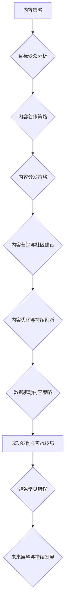

                 

### 一人公司的内容策略：吸引和留住目标受众

> **关键词**：内容策略、一人公司、目标受众、内容创作、内容分发、内容优化

> **摘要**：本文将探讨一人公司在内容策略方面的重要性和必要性，从目标受众分析、内容创作与分发、内容营销与社区建设等多个维度出发，提供一系列实用策略和案例，帮助读者构建和实施有效的个人品牌内容策略，以吸引和留住目标受众。

在当今数字化时代，内容策略已经成为企业成功的关键因素，尤其是对于一人公司而言。通过精心设计的内容策略，一人公司可以有效地传达其品牌理念，吸引目标受众，建立忠实用户群体，并在竞争激烈的市场中脱颖而出。本文将分为五个部分，逐一探讨内容策略的各个方面，并辅以具体案例和实践技巧，帮助读者深入理解和实施个人内容策略。

### 目录大纲

1. **内容策略概述**
   1.1 内容策略的重要性
   1.2 内容策略的目标
   1.3 内容策略的构成要素

2. **内容策略框架**
   2.1 目标受众分析
   2.2 内容创作策略
   2.3 内容分发策略
   2.4 内容营销与社区建设
   2.5 内容优化与持续创新

3. **内容营销与社区建设**
   3.1 内容营销策略
   3.2 社区建设策略
   3.3 用户互动与反馈

4. **内容优化与持续创新**
   4.1 内容优化策略
   4.2 内容创新策略
   4.3 数据驱动内容策略

5. **成功案例与实战技巧**
   5.1 成功案例分享
   5.2 实战技巧解析
   5.3 避免常见错误

6. **未来展望与持续发展**
   6.1 内容策略的发展趋势
   6.2 技术革新对内容策略的影响
   6.3 持续发展的策略与建议

7. **附录**
   7.1 相关资源与工具
   7.2 参考文献
   7.3 拓展阅读

**附：核心概念与联系 Mermaid 流程图**



**附：核心算法原理讲解（伪代码）**

```python
# 内容创作策略伪代码
def create_content(topic, style, originality):
    content = ""
    # 确定内容主题
    content += generate_topic(topic)
    # 确定内容格式与风格
    content += format_content(content, style)
    # 保持内容原创性
    content = ensure_originality(content)
    return content

# 内容分发策略伪代码
def distribute_content(content, channels, promotion_methods, data_analysis):
    # 确定分发渠道
    selected_channels = choose_channels(channels)
    # 内容推广方法
    promotion_methods = choose_promotion_methods(selected_channels)
    # 数据分析与应用
    data_analysis = analyze_data(content, selected_channels, promotion_methods)
    return data_analysis
```

**附：数学模型和数学公式 & 详细讲解 & 举例说明**

### 用户留存率模型

$$
R(t) = \frac{N(t) - N(t_0)}{N(0)}
$$

其中，$R(t)$ 为用户留存率，$N(t)$ 为时间 $t$ 时的用户数量，$N(t_0)$ 为初始用户数量，$N(0)$ 为初始用户数量。

举例说明：

假设一家公司初始有1000名用户，在一个月后，有800名用户仍然活跃，那么用户留存率为：

$$
R(1) = \frac{800 - 1000}{1000} = 0.2 = 20\%
$$

### 项目实战

#### 案例一：如何通过内容策略吸引目标受众

##### 开发环境搭建

- 安装WordPress作为内容管理系统
- 安装SEO插件以优化内容搜索引擎排名
- 使用Google Analytics跟踪网站访问数据

##### 源代码详细实现和代码解读

```php
// WordPress主题文件：index.php
<?php
get_header();
if (have_posts()) {
    while (have_posts()) {
        the_post();
        echo '<article>';
        the_title();
        the_content();
        echo '</article>';
    }
}
get_footer();
```

##### 代码解读与分析

- 该代码片段负责渲染WordPress网站的主页，显示所有已发布的文章。
- `get_header()` 和 `get_footer()` 负责调用网站的头部和尾部模板文件，确保每个页面都有统一的布局。
- `have_posts()` 和 `while (have_posts())` 循环负责遍历所有发布过的文章，并使用 `the_title()` 和 `the_content()` 函数分别获取文章标题和内容并输出。
- 通过SEO插件，优化文章的标题和元描述，提高搜索引擎排名，从而吸引目标受众。

#### 案例二：如何通过社区建设留住用户

##### 社区平台的选择

- Reddit：适合讨论和分享信息
- Discord：适合建立实时互动的社群
- LinkedIn：适合专业领域知识分享和建立人脉

##### 社区运营与维护

- 定期发布话题，鼓励用户参与讨论
- 设立管理员团队，维护社区秩序
- 组织线上活动，提高用户参与度

##### 用户互动与反馈的技巧

- 及时回复用户提问和评论，建立信任
- 鼓励用户分享自己的经验和观点，增加社区活力
- 通过问卷调查收集用户反馈，持续改进社区体验

通过以上步骤，可以有效构建和运营一个能够留住目标用户的社区。

### 文章作者信息

**作者**：AI天才研究院/AI Genius Institute & 禅与计算机程序设计艺术 /Zen And The Art of Computer Programming

---

现在，我们已经为文章奠定了坚实的基础。接下来，我们将深入探讨内容策略的各个方面，为读者提供详细的指导和实用技巧。让我们一步步来，确保每个环节都经过深思熟虑和精确执行。

---

### 第一部分：内容策略概述

#### 1.1 内容策略的重要性

在数字化时代，内容策略已经成为企业成功的关键因素。对于一人公司而言，内容策略不仅能够帮助其建立品牌形象，还能够吸引目标受众，增强用户忠诚度，并最终转化为商业价值。

首先，内容策略有助于构建品牌形象。通过发布高质量、具有针对性的内容，一人公司可以传递其核心价值观和独特卖点，从而在目标受众心中建立专业和可信赖的品牌形象。这种品牌形象不仅能够提升公司的声誉，还能够吸引更多的潜在客户。

其次，内容策略有助于吸引目标受众。通过深入分析目标受众的需求和行为，一人公司可以创作出更具吸引力和相关性的内容，从而在竞争激烈的市场中脱颖而出。例如，通过撰写技术博客、发布教程、分享行业见解等，一人公司可以吸引那些对特定技术或领域感兴趣的用户。

第三，内容策略能够增强用户忠诚度。通过持续发布有价值的内容，一人公司可以与用户建立更紧密的联系。这种联系不仅能够增加用户的参与度，还能够提高用户对品牌的忠诚度。例如，通过定期发布行业动态、分享专业见解、提供独家优惠等，一人公司可以维持用户的兴趣和参与度。

最后，内容策略能够转化为商业价值。通过高质量的内容，一人公司可以吸引更多的潜在客户，增加销售机会，提高客户满意度，从而实现商业增长。例如，通过发布详细的产品评测、案例研究、用户故事等，一人公司可以展示其实力和专业能力，吸引潜在客户的关注和信任。

总之，内容策略对于一人公司的成功至关重要。它不仅能够帮助公司建立品牌形象，吸引目标受众，增强用户忠诚度，还能够转化为商业价值。因此，无论是初创企业还是个人品牌，都需要重视并实施有效的内容策略。

#### 1.2 内容策略的目标

在制定内容策略时，明确目标是非常重要的。内容策略的目标可以分为以下几个方面：

首先，内容策略的目标之一是建立品牌知名度。通过发布高质量、具有影响力的内容，一人公司可以在目标受众中建立品牌认知。例如，通过撰写行业报告、发布技术博客、分享专业知识等，公司可以展示其在特定领域的专业性和权威性，从而吸引更多潜在客户的关注。

其次，内容策略的目标是吸引目标受众。通过深入分析目标受众的需求和行为，一人公司可以创作出更具吸引力和相关性的内容，从而在竞争激烈的市场中脱颖而出。例如，通过发布教程、实用指南、案例分析等，公司可以解决目标受众的实际问题，提供有价值的信息，从而吸引更多用户的关注。

第三，内容策略的目标是增强用户忠诚度。通过持续发布有价值的内容，一人公司可以与用户建立更紧密的联系。这种联系不仅能够增加用户的参与度，还能够提高用户对品牌的忠诚度。例如，通过定期发布行业动态、分享专业见解、提供独家优惠等，公司可以维持用户的兴趣和参与度。

最后，内容策略的目标是促进商业转化。通过高质量的内容，一人公司可以吸引更多的潜在客户，增加销售机会，提高客户满意度，从而实现商业增长。例如，通过发布详细的产品评测、案例研究、用户故事等，公司可以展示其实力和专业能力，吸引潜在客户的关注和信任。

为了实现这些目标，一人公司需要制定具体的、可衡量的内容策略指标，例如：

- **内容覆盖率**：衡量公司内容在目标受众中的覆盖程度。可以通过跟踪关键词搜索量、社交媒体分享数、网站访问量等指标来评估。
- **用户参与度**：衡量用户对公司内容的互动程度。可以通过评论数、点赞数、分享数、回访率等指标来评估。
- **内容质量**：衡量内容的专业性和原创性。可以通过专业评价、用户反馈、内容评分等指标来评估。
- **商业转化率**：衡量内容对商业目标的影响。可以通过销售转化率、客户忠诚度、市场份额等指标来评估。

通过设定这些指标，一人公司可以更好地评估内容策略的效果，并根据实际情况进行调整和优化。

#### 1.3 内容策略的构成要素

内容策略的构成要素可以分为四个主要方面：内容创作、内容分发、内容营销和内容优化。

首先是内容创作。内容创作是内容策略的核心，它决定了内容的质量和影响力。在内容创作过程中，需要考虑以下几个关键因素：

- **目标受众分析**：了解目标受众的需求、兴趣和行为，以便创作出符合他们需求的内容。这可以通过市场调研、用户访谈、竞争对手分析等方法实现。
- **内容主题选择**：选择与品牌和目标受众相关的内容主题。主题应具有时效性、实用性和独特性，能够吸引用户的关注。
- **内容格式与风格**：根据目标受众的偏好和内容主题选择合适的格式和风格。常见的格式包括文章、视频、图像、音频等；风格则包括专业、幽默、亲和等。
- **内容原创性**：确保内容具有原创性和独特性，避免抄袭和侵权问题。这可以通过深度调研、独立创作和合理引用等方式实现。

接下来是内容分发。内容分发是将内容传递给目标受众的重要环节。有效的分发策略能够提高内容的曝光度和影响力。以下是几个关键因素：

- **分发渠道选择**：选择适合目标受众的渠道，包括社交媒体平台、电子邮件营销、内容合作伙伴等。不同渠道具有不同的特点和适用场景，需要根据具体情况选择。
- **内容推广方法**：通过广告投放、社交媒体推广、内容合作等方式提高内容的可见性和传播范围。这需要根据预算和目标受众的特点进行优化。
- **数据分析与应用**：通过数据分析了解内容在不同渠道的表现，并根据数据结果调整分发策略。关键指标包括点击率、转化率、用户留存率等。

其次是内容营销。内容营销是将内容作为营销手段的一种策略，旨在提高品牌知名度和用户参与度。以下是几个关键因素：

- **内容营销目标**：明确内容营销的目标，例如提高品牌知名度、增加用户参与度、促进销售转化等。
- **内容营销计划**：制定详细的内容营销计划，包括内容主题、发布频率、推广方式等。这需要综合考虑品牌策略和目标受众的需求。
- **内容营销效果评估**：通过跟踪关键指标评估内容营销的效果，如用户参与度、转化率、ROI等，并根据评估结果进行调整。

最后是内容优化。内容优化是持续改进内容质量和效果的过程。以下是几个关键因素：

- **内容更新与迭代**：定期更新和迭代内容，保持内容的新鲜度和相关性。这可以通过定期回顾和评估内容的表现来实现。
- **内容结构与格式优化**：优化内容的结构和格式，使其更易于阅读和理解。这包括清晰的结构、简明的标题、分段和列表等。
- **内容质量提升**：通过提高内容的专业性、原创性和实用性来提升内容的质量。这可以通过深入研究、高质量编写和用户反馈来实现。

总之，内容策略的构成要素包括内容创作、内容分发、内容营销和内容优化。这些要素相互关联，共同构成了一个完整的内容策略框架。通过合理规划和执行这些要素，一人公司可以有效地吸引和留住目标受众，实现品牌的长期发展。

---

在第一部分中，我们探讨了内容策略的重要性、目标以及构成要素。内容策略不仅有助于建立品牌知名度，吸引目标受众，增强用户忠诚度，还能够转化为商业价值。通过明确目标、分析受众、选择合适的格式和风格、制定分发策略和营销计划，以及持续优化内容，一人公司可以构建一个有效的个人品牌内容策略。

接下来，我们将深入探讨内容策略的具体框架，从目标受众分析、内容创作、内容分发到内容营销和社区建设，为读者提供详细的指导。让我们一起继续深入探讨这些关键环节，确保每个步骤都能为个人品牌的发展贡献力量。

---

### 第二部分：内容策略框架

#### 2.1 目标受众分析

在制定内容策略时，了解目标受众是至关重要的第一步。只有深入了解目标受众的需求、兴趣和行为，我们才能创作出能够真正吸引他们的内容。

首先，我们需要确定目标受众。这可以通过以下几种方法实现：

1. **市场调研**：通过调查问卷、在线调查、访谈等方式收集目标受众的基本信息，包括年龄、性别、职业、教育背景等。
2. **用户画像**：根据收集到的信息创建用户画像，描述目标受众的特征和需求。用户画像可以包括他们的兴趣爱好、行为习惯、购买偏好等。
3. **数据分析**：通过分析网站访问数据、社交媒体互动数据等，了解目标受众的访问习惯和内容偏好。

接下来，我们需要分析目标受众的需求。这包括以下几个方面：

1. **信息需求**：目标受众最关心哪些信息？他们希望通过内容了解什么？例如，技术用户可能关心最新的技术趋势和解决方案，而企业家可能关心市场动态和商业策略。
2. **情感需求**：目标受众的情感需求是什么？他们希望在内容中感受到什么？例如，他们可能希望获得娱乐、共鸣或启发。
3. **参与需求**：目标受众希望如何参与互动？他们希望如何与品牌互动？例如，他们可能希望参与评论、分享或参与社区活动。

在确定了目标受众和分析他们的需求后，我们需要创造共鸣。这可以通过以下几个方面实现：

1. **故事叙述**：通过故事叙述建立与目标受众的情感联系。故事应该能够触动目标受众的情感，引发共鸣。
2. **个性化内容**：根据目标受众的特征和需求创作个性化内容。这可以包括定制化的教程、案例分析、个人故事等。
3. **互动体验**：提供互动体验，让目标受众参与内容创作和分享。例如，通过问卷调查、互动游戏、用户论坛等方式增加用户的参与度。

通过这些方法，我们可以更好地了解目标受众，满足他们的需求，并创造共鸣。这将为内容策略的成功实施奠定坚实基础。

#### 2.2 内容创作策略

内容创作是内容策略的核心，是吸引和留住目标受众的关键。为了确保内容的高质量和影响力，我们需要从内容主题、内容格式与风格、内容原创性三个方面进行深入分析和规划。

首先，确定内容主题。选择合适的主题对于吸引目标受众至关重要。以下是几个关键步骤：

1. **目标受众分析**：根据目标受众的需求和兴趣选择主题。了解他们最关心的问题、最感兴趣的话题，以及他们在日常生活中面临的挑战。
2. **热点与趋势**：关注行业热点和趋势，选择与当前市场环境相关的内容主题。这可以帮助内容保持新鲜度和吸引力。
3. **独特性**：选择具有独特性和创新性的主题，避免与竞争对手的内容重复。这可以通过深入研究和独特角度实现。

其次，考虑内容格式与风格。不同的内容格式和风格适用于不同的受众和场景。以下是几种常见的内容格式和风格：

1. **文章**：文章是内容创作中最常见的格式。它们适合详细阐述主题、分享专业知识和分析见解。文章应保持逻辑清晰、结构紧凑、语言简洁。
2. **视频**：视频适合传达复杂的概念和演示实际操作。它们具有更高的互动性和可视化效果，能够吸引目标受众的注意力。
3. **图像与图表**：图像和图表适合展示数据、统计信息和视觉信息。它们能够直观地传达信息，增加内容的可读性和吸引力。
4. **音频**：音频适合在移动场景中传达信息，例如播客和有声书。它们可以提供便捷的学习和娱乐体验。

在选择内容格式与风格时，需要考虑以下因素：

1. **目标受众**：根据目标受众的偏好和使用习惯选择适合的格式与风格。例如，对于忙碌的职场人士，视频和音频可能更受欢迎；而对于技术爱好者，详细的技术博客可能更合适。
2. **内容主题**：根据内容主题选择最适合的格式与风格。某些主题可能更适合以图像和图表的形式呈现，而其他主题则可能更适合通过文章或视频传达。
3. **媒介特性**：考虑不同媒介的特性，例如文字的可扩展性、视频的视觉冲击力、图像的直观性等，以便选择最合适的内容格式与风格。

最后，保持内容原创性。原创性是内容质量的重要保障，也是吸引目标受众的关键因素。以下是几个保持内容原创性的方法：

1. **深度调研**：在创作内容前进行充分的调研，确保内容具有独特性和准确性。这可以通过查阅相关文献、采访专家、参与行业讨论等方式实现。
2. **独立创作**：尽量避免直接复制粘贴他人的内容。即使需要引用，也应确保合理引用并注明出处。
3. **创新表达**：尝试以不同的角度和方式表达相同或类似的内容。这可以通过独特的故事叙述、创新的视觉设计、有趣的互动体验等方式实现。
4. **用户反馈**：定期收集用户反馈，了解他们对内容的看法和建议。这可以帮助我们识别和改进潜在的问题，提高内容的原创性和吸引力。

通过以上方法，我们可以确保内容创作策略的高质量和影响力，从而更好地吸引和留住目标受众。

#### 2.3 内容分发策略

内容分发是确保内容策略成功实施的关键环节。通过选择合适的分发渠道、采用有效的推广方法以及进行细致的数据分析，我们可以最大化内容的曝光度和影响力。

首先，选择合适的分发渠道。不同的分发渠道适用于不同的内容类型和目标受众。以下是几种常见的内容分发渠道：

1. **社交媒体平台**：如Facebook、Twitter、LinkedIn、Instagram等。这些平台具有广泛的用户基础和强大的传播力，适合发布文章、图片、视频等。
2. **电子邮件营销**：通过电子邮件向订阅用户发送内容，可以直接触达目标受众。这种方法适用于定期发布新闻简报、促销活动等。
3. **内容合作伙伴**：与相关领域的网站、博客、媒体等合作，发布内容并互相推广。这可以增加内容的曝光度和可信度。
4. **内容平台**：如YouTube、TikTok、Podcast等。这些平台适合发布视频、音频等互动性强的内容。

在选择分发渠道时，需要考虑以下因素：

1. **目标受众**：根据目标受众的偏好和使用习惯选择合适的渠道。例如，对于年轻的科技爱好者，TikTok可能更受欢迎；而对于专业领域的从业者，LinkedIn可能更为合适。
2. **内容类型**：根据内容类型选择最合适的渠道。例如，长篇文章适合在博客或新闻网站上发布；视频内容适合在YouTube等视频平台上发布。
3. **渠道特性**：了解不同渠道的特性，例如社交媒体平台的互动性、电子邮件营销的精准性、内容合作伙伴的权威性等，以便选择最合适的渠道。

接下来，采用有效的推广方法。以下是一些常见的推广方法：

1. **广告投放**：通过付费广告在社交媒体平台、搜索引擎等渠道上推广内容。这种方法可以快速提高内容的曝光度，适用于急需吸引流量的情况。
2. **社交媒体推广**：通过社交媒体平台的互动和分享功能推广内容。这可以通过发布有趣的帖文、参与话题讨论、与用户互动等方式实现。
3. **内容合作**：与其他网站、博客、媒体等进行内容合作，互相推广。这可以通过撰写 guest post、合作发布报告等方式实现。
4. **口碑营销**：通过用户的口碑传播来推广内容。这可以通过提供高质量的内容、积极回应用户反馈、建立良好的品牌形象等方式实现。

最后，进行细致的数据分析。通过跟踪和分析内容在不同渠道的表现，我们可以了解哪些渠道和推广方法最有效，并据此调整分发策略。以下是一些关键指标：

1. **曝光度**：衡量内容被多少人看到。可以通过总访问量、页面浏览量等指标来评估。
2. **参与度**：衡量用户对内容的互动程度。可以通过点赞数、评论数、分享数等指标来评估。
3. **转化率**：衡量内容对商业目标的影响。可以通过点击率、转化率、销售量等指标来评估。

通过以上方法，我们可以确保内容分发策略的有效性和影响力，从而最大限度地吸引和留住目标受众。

#### 2.4 内容营销与社区建设

内容营销和社区建设是内容策略的重要组成部分，它们不仅能够帮助吸引和留住目标受众，还能够增强品牌的忠诚度和影响力。

首先，内容营销的核心要素包括：

1. **目标明确**：明确内容营销的目标，例如增加品牌知名度、提升用户参与度、促进销售转化等。这有助于制定具体的内容营销策略。
2. **内容规划**：制定详细的内容规划，包括内容主题、发布频率、内容类型等。这有助于确保内容的一致性和持续性。
3. **渠道选择**：根据目标受众的偏好和内容类型选择合适的渠道，例如社交媒体、电子邮件、网站等。这有助于最大化内容的传播效果。
4. **数据分析**：通过数据分析评估内容营销的效果，例如点击率、转化率、参与度等。这有助于优化内容营销策略。

接下来，制定内容营销计划。以下是一些建议：

1. **季度内容计划**：根据业务目标和市场趋势，制定每季度的内容计划。这有助于确保内容的针对性和时效性。
2. **主题策划**：围绕关键主题策划内容，例如行业趋势、产品发布、用户故事等。这有助于吸引目标受众的关注。
3. **内容格式多样化**：使用不同的内容格式，例如文章、视频、图像、音频等，以满足不同受众的需求。
4. **互动与反馈**：积极回应用户的互动和反馈，例如在社交媒体上回复评论、参与用户论坛等。这有助于增强用户参与度和忠诚度。

评估内容营销效果是内容营销的重要环节。以下是一些常用的评估指标：

1. **曝光度**：衡量内容被多少人看到。可以通过总访问量、页面浏览量等指标来评估。
2. **参与度**：衡量用户对内容的互动程度。可以通过点赞数、评论数、分享数等指标来评估。
3. **转化率**：衡量内容对商业目标的影响。可以通过点击率、转化率、销售量等指标来评估。
4. **ROI**：衡量内容营销的投资回报率。可以通过计算收入与成本之间的比率来评估。

社区建设是内容营销的重要补充，它能够提供用户互动和反馈的平台。以下是社区建设策略：

1. **平台选择**：选择适合的社区平台，例如Reddit、Discord、LinkedIn等。这取决于目标受众的偏好和社区类型。
2. **内容规划**：在社区中发布有价值的内容，例如教程、案例分析、用户故事等。这有助于吸引和留住用户。
3. **互动与维护**：积极回应用户的提问和评论，建立良好的社区氛围。这有助于增强用户参与度和忠诚度。
4. **用户管理**：建立管理员团队，负责维护社区秩序和处理用户问题。这有助于确保社区的健康和可持续发展。

通过内容营销和社区建设，一人公司可以更好地吸引和留住目标受众，增强品牌的忠诚度和影响力。这将为公司的长期发展奠定坚实基础。

#### 2.5 内容优化与持续创新

内容优化和持续创新是确保内容策略长期有效的重要环节。通过定期更新内容、优化内容结构和格式，以及保持内容新鲜度，我们可以提高内容的吸引力，增强用户参与度，从而实现品牌的长期发展。

首先，定期更新内容。内容更新不仅有助于保持内容的时效性和相关性，还可以吸引目标受众的持续关注。以下是一些内容更新的策略：

1. **定期回顾**：定期回顾已发布的内容，评估其表现和受众反馈。这可以帮助我们识别需要更新或改进的内容。
2. **热点与趋势**：根据当前的热点话题和行业趋势更新内容，使其保持新鲜和吸引人。这可以通过添加新的数据、案例研究或分析报告来实现。
3. **用户反馈**：根据用户的反馈和建议进行内容更新。用户的反馈可以揭示他们在内容中遇到的问题或需求，从而为我们提供改进的方向。

其次，优化内容结构和格式。内容结构和格式的优化可以提高内容的可读性和易理解性，从而增强用户的阅读体验。以下是一些优化策略：

1. **清晰的结构**：确保内容具有清晰的结构，例如使用标题、子标题、段落和列表等。这有助于用户快速获取关键信息。
2. **简明的标题**：使用简明扼要的标题，使其能够准确传达内容的核心信息。这有助于提高内容的点击率和阅读量。
3. **图像和图表**：在适当的地方添加图像和图表，以增强内容的视觉吸引力。图像和图表可以帮助用户更直观地理解复杂的信息。
4. **优化格式**：根据目标受众的阅读习惯和设备类型，优化内容的格式。例如，对于移动用户，可以使用响应式设计，以确保内容在不同设备上的可读性。

保持内容新鲜度也是内容优化的重要方面。以下是一些保持内容新鲜度的策略：

1. **定期发布**：定期发布新的内容，以保持内容的更新和活跃度。这可以通过制定内容发布计划来实现。
2. **热点话题**：关注热点话题和时事新闻，及时发布相关内容。这可以吸引更多的用户关注和参与。
3. **互动内容**：发布互动性强的内容，例如问卷调查、投票、互动游戏等。这可以增加用户的参与度和互动性。

通过以上策略，我们可以确保内容策略的持续优化和创新，从而提高内容的吸引力，增强用户参与度，实现品牌的长期发展。

#### 2.6 内容创新策略

内容创新是确保内容策略长期有效和吸引目标受众的关键。通过探索新的内容形式、挖掘新话题和热点，以及保持内容的新鲜度，我们可以不断为用户带来新鲜感和价值。

首先，探索新的内容形式。随着技术和媒介的发展，新的内容形式不断涌现，这些形式可以提供更丰富的用户体验和互动性。以下是一些创新的内容形式：

1. **互动视频**：结合视频内容和用户互动，例如通过弹幕、投票、问答等方式，增加用户的参与感和互动性。
2. **虚拟现实（VR）和增强现实（AR）**：通过VR和AR技术，提供沉浸式的体验，让用户能够身临其境地参与内容。
3. **直播和实时互动**：通过直播平台，实时与用户互动，回答用户问题，分享实时信息。这可以增强用户与品牌之间的联系。
4. **多媒体内容**：结合多种媒介，如文字、图像、音频、视频等，创作多媒体内容，提供更全面和吸引人的内容体验。

其次，挖掘新话题和热点。关注行业趋势、社会热点和用户兴趣，及时捕捉和创作相关内容，可以吸引更多的用户关注和参与。以下是一些挖掘新话题和热点的策略：

1. **市场调研**：通过市场调研了解目标受众的兴趣和需求，发现新的话题和热点。
2. **数据分析**：通过数据分析了解用户的行为和兴趣，发现潜在的热点话题。
3. **社交媒体监控**：关注社交媒体上的热门话题和讨论，及时捕捉和创作相关内容。
4. **专业社群**：参与专业社群和行业论坛，了解行业动态和用户关注的热点话题。

保持内容的新鲜度是内容创新的重要方面。以下是一些保持内容新鲜度的策略：

1. **定期更新**：定期发布新的内容，以保持内容的更新和活跃度。
2. **热点话题**：关注热点话题和时事新闻，及时发布相关内容。
3. **用户互动**：通过用户互动，了解他们的需求和兴趣，创作符合用户期待的内容。
4. **内容多样化**：尝试不同的内容形式和风格，为用户带来新鲜感和多样化的体验。

通过以上策略，我们可以确保内容策略的持续创新，从而提高内容的吸引力和用户的参与度，实现品牌的长期发展。

#### 2.7 数据驱动内容策略

在当今数字化时代，数据已成为制定和优化内容策略的重要依据。通过数据收集与分析，我们可以更好地了解目标受众的需求和行为，从而实现数据驱动的内容创作和优化。

首先，数据收集是数据驱动内容策略的基础。以下是一些常见的数据收集方法：

1. **用户行为数据**：通过网站分析工具（如Google Analytics）收集用户访问数据，包括页面浏览量、停留时间、转化率等。
2. **社交媒体数据**：通过社交媒体平台（如Facebook、Twitter、LinkedIn）收集用户互动数据，包括点赞数、评论数、分享数等。
3. **用户反馈数据**：通过问卷调查、用户评论、论坛讨论等方式收集用户反馈数据，了解用户对内容的满意度和建议。
4. **市场调研数据**：通过市场调研和行业报告收集相关数据，了解市场趋势和竞争对手的表现。

收集到数据后，我们需要进行深入分析，以获取有价值的信息。以下是一些数据分析的方法：

1. **用户行为分析**：通过分析用户行为数据，了解用户的兴趣点、访问习惯和内容偏好。这可以帮助我们优化内容策略，提高内容的吸引力和转化率。
2. **内容表现分析**：通过分析不同内容的表现，了解哪些内容最受欢迎，哪些内容表现不佳。这可以帮助我们调整内容创作策略，提高内容的整体质量。
3. **用户反馈分析**：通过分析用户反馈数据，了解用户的意见和建议。这可以帮助我们改进内容，提高用户体验。
4. **市场趋势分析**：通过分析市场调研数据，了解行业趋势和竞争对手的表现。这可以帮助我们把握市场动态，制定更具前瞻性的内容策略。

基于数据分析的结果，我们可以进行数据驱动的内容创作和优化。以下是一些具体策略：

1. **个性化内容**：根据用户的兴趣和行为，创作个性化的内容。这可以通过内容推荐系统、个性化邮件营销等方式实现。
2. **内容优化**：根据内容表现分析的结果，优化内容结构、格式和风格。这可以通过调整标题、增加图像、改进段落结构等方式实现。
3. **用户反馈改进**：根据用户反馈分析的结果，改进内容，提高用户体验。这可以通过改进文章质量、增加互动元素、优化页面加载速度等方式实现。
4. **数据监控与迭代**：定期监控和分析数据，根据数据结果不断优化内容策略。这可以通过建立数据监控机制、定期进行内容评估等方式实现。

通过以上数据驱动的策略，我们可以实现更精准的内容创作和优化，从而提高内容的吸引力、用户参与度和转化率，实现品牌的长期发展。

#### 2.8 内容策略的实施步骤

成功实施内容策略需要一系列精心设计的步骤和持续的努力。以下是实施内容策略的八个关键步骤：

1. **明确目标和目标受众**：首先，确定内容策略的目标，例如提高品牌知名度、吸引新用户、增强用户忠诚度等。然后，分析目标受众，了解他们的需求、兴趣和行为，以便为内容创作提供指导。

2. **制定内容计划**：根据目标和目标受众，制定详细的内容计划。这包括确定内容主题、发布频率、内容类型和格式等。内容计划应确保内容的持续性和一致性。

3. **创作高质量内容**：根据内容计划，创作高质量的内容。确保内容具有独特性、原创性和相关性。内容应满足目标受众的需求，提供有价值的信息和见解。

4. **选择合适的分发渠道**：根据目标受众的偏好和内容类型，选择合适的分发渠道，例如社交媒体平台、电子邮件营销、内容合作伙伴等。确保内容能够有效地触达到目标受众。

5. **推广内容**：采用各种推广方法，如广告投放、社交媒体推广、内容合作等，提高内容的曝光度和影响力。根据预算和目标受众的特点，优化推广策略。

6. **分析数据**：定期收集和分析数据，了解内容在不同渠道的表现，包括曝光度、参与度、转化率等。根据数据结果，优化内容策略和推广方法。

7. **持续优化内容**：根据用户反馈和数据分析结果，不断优化内容。这包括更新和迭代现有内容，改进内容结构和格式，以及尝试新的内容形式和话题。

8. **评估和调整**：定期评估内容策略的效果，根据评估结果进行调整和优化。确保内容策略始终与目标保持一致，并在变化的市场环境中保持竞争力。

通过以上步骤，一人公司可以成功地实施内容策略，吸引和留住目标受众，实现品牌的长期发展。

### 第三部分：内容营销与社区建设

#### 3.1 内容营销策略

内容营销是一种通过创作和分发有价值的内容来吸引目标受众、建立品牌信任并促进商业转化的一种营销策略。对于一人公司而言，内容营销不仅是品牌建设的关键，也是提升品牌知名度、增强用户参与度和忠诚度的有效手段。以下将详细探讨内容营销策略的核心要素、制定内容营销计划的方法，以及如何评估和优化内容营销效果。

**核心要素**

1. **目标明确**：内容营销的首要任务是明确目标。目标应具体、可衡量，如增加品牌曝光度、提升用户参与度、提高销售转化率等。明确的目标有助于制定针对性的策略，确保内容营销活动有的放矢。

2. **受众分析**：了解目标受众是内容营销的基础。通过市场调研、用户画像分析等手段，深入了解目标受众的需求、兴趣、行为习惯，以便创作出符合他们需求的内容。

3. **内容创意**：内容创意是吸引目标受众的关键。内容应具有原创性、独特性和针对性，能够解决用户的问题或满足他们的需求。形式上可以多样，如文章、视频、图片、图表、音频等。

4. **内容质量**：高质量的内容是内容营销的核心。内容应确保信息准确、逻辑清晰、语言流畅，能够为用户带来价值。此外，内容应定期更新，以保持其新鲜度和相关性。

5. **渠道选择**：选择合适的分发渠道对于内容营销的成功至关重要。应根据目标受众的偏好和使用习惯，选择适合的社交媒体平台、电子邮件、网站、内容合作伙伴等。

6. **互动与反馈**：内容营销不仅是单向传播，更是双向互动。积极回应用户的反馈和评论，鼓励用户参与内容创作和分享，可以增强用户对品牌的忠诚度。

**制定内容营销计划**

1. **确定内容主题**：根据目标受众的需求和兴趣，选择具有吸引力的内容主题。这些主题应与品牌相关，并能够为用户带来价值。

2. **内容规划**：制定详细的内容规划，包括内容类型、发布频率、内容格式等。内容规划应确保内容的持续性和一致性，避免内容发布的断断续续。

3. **内容创作**：根据内容规划，创作高质量的内容。内容创作过程中，应注意内容的原创性和独特性，确保内容能够吸引用户的注意力。

4. **内容发布**：制定内容发布计划，确保内容按期发布。发布时，应选择合适的渠道，并根据渠道特性进行优化，以提高内容的曝光度和参与度。

5. **推广策略**：制定内容推广策略，包括广告投放、社交媒体推广、内容合作等。推广策略应根据预算和目标受众的特点进行优化，以提高内容的传播效果。

**评估与优化**

1. **关键指标**：设定关键指标（KPI），如曝光度、参与度、转化率等，以评估内容营销的效果。这些指标应与内容营销目标密切相关。

2. **数据分析**：定期收集和分析数据，了解内容在不同渠道的表现，以及用户对内容的反馈。数据分析应包括内容点击率、用户停留时间、转化率等。

3. **效果评估**：根据数据分析结果，评估内容营销的效果，识别成功和不足之处。效果评估应定期进行，以便及时调整策略。

4. **优化策略**：根据效果评估结果，优化内容创作、发布和推广策略。优化策略应注重内容质量、用户参与度和传播效果。

通过以上内容营销策略，一人公司可以有效地提升品牌知名度、增强用户忠诚度，并实现商业转化。接下来，我们将进一步探讨社区建设策略，帮助公司留住用户并建立强大的用户群体。

#### 3.2 社区建设策略

社区建设是内容营销的重要组成部分，它不仅能够帮助一人公司留住用户，还能够增强用户忠诚度和品牌影响力。以下将详细探讨社区建设的价值、如何选择合适的社区平台、以及如何进行社区运营与维护。

**社区建设的价值**

1. **用户互动**：社区提供了一个用户互动的平台，用户可以在社区中分享观点、提出问题、参与讨论，从而增强用户之间的联系和互动。

2. **用户参与度**：通过社区建设，用户可以更加积极地参与到品牌活动中来，从而提高用户参与度和忠诚度。例如，用户可以在社区中分享使用心得、参与产品评测等。

3. **品牌影响力**：社区是品牌展示和传播的重要渠道。通过在社区中发布高质量的内容、积极回应用户、展示品牌专业知识，可以增强品牌的影响力和公信力。

4. **用户反馈**：社区提供了一个用户反馈的平台，用户可以在社区中提出建议和意见，品牌可以及时收集并分析这些反馈，以便改进产品和服务。

**社区平台的选择**

选择合适的社区平台对于社区建设至关重要。以下是几种常见的社区平台及其特点：

1. **Reddit**：Reddit是一个开放式的讨论社区，用户可以在不同的子版块中发布和讨论内容。Reddit的优点是用户基数大、话题多样，但管理难度较高。

2. **Discord**：Discord是一个专为游戏和社交设计的平台，支持语音、文字和视频聊天。它的优点是用户界面友好、互动性强，适合建立实时互动的社群。

3. **LinkedIn**：LinkedIn是一个专业社交平台，适合在商业领域建立社区。它的优点是用户质量高、专业性强，但用户基数相对较小。

4. **论坛软件**：如phpBB、Discuz！等，这些论坛软件适用于建立独立的社区平台。它们的优点是自定义度高、功能丰富，但需要一定的技术支持。

选择社区平台时，应考虑以下因素：

1. **用户需求**：根据目标受众的需求选择合适的平台。例如，如果目标受众是年轻人，可以选择Reddit或Discord；如果目标是专业人士，可以选择LinkedIn。

2. **互动形式**：根据社区互动的形式选择平台。例如，如果需要实时互动，可以选择Discord；如果需要长期讨论和知识分享，可以选择论坛软件。

3. **管理难度**：考虑社区管理的难度和资源投入。例如，Reddit虽然管理难度较高，但用户基数大，适合追求广泛影响力的品牌。

**社区运营与维护**

1. **内容发布**：定期发布高质量的内容，包括行业动态、专业见解、用户故事等，以吸引用户参与和关注。

2. **用户互动**：积极回应用户的问题和评论，建立良好的互动氛围。鼓励用户参与讨论和分享，提高社区的活跃度。

3. **活动组织**：定期举办线上活动，如问答环节、主题讨论、抽奖活动等，以增加用户参与度和互动性。

4. **社区规范**：制定社区规范，明确用户行为准则，维护社区秩序。设立管理员团队，负责监控社区活动和处理违规行为。

5. **数据分析**：通过数据分析了解社区的表现，包括用户活跃度、内容参与度等。根据数据结果调整社区运营策略。

6. **用户反馈**：定期收集用户反馈，了解他们的需求和意见。根据反馈改进社区体验，提高用户满意度。

通过以上策略，一人公司可以有效地建立和运营一个有价值的社区，留住用户并增强品牌影响力。

#### 3.3 用户互动与反馈

用户互动与反馈是内容营销和社区建设的重要组成部分。有效的用户互动不仅可以增强用户忠诚度和品牌影响力，还能够为产品和服务提供宝贵的改进意见。以下将详细探讨用户互动的方式、技巧以及如何收集和分析用户反馈。

**用户互动的方式**

1. **社交媒体互动**：通过社交媒体平台（如Facebook、Twitter、LinkedIn等）与用户进行互动。发布有趣的话题、问答环节、有奖竞猜等，鼓励用户参与讨论。

2. **社区互动**：在社区平台（如Reddit、Discord、论坛软件等）中与用户互动。定期发布内容、组织活动、回答用户问题等，提高社区的活跃度。

3. **电子邮件互动**：通过定期发送电子邮件与用户互动。发送新闻简报、促销活动信息、用户调查等，增加用户参与度和忠诚度。

4. **线上活动**：举办线上活动，如问答环节、主题讨论、抽奖活动等，鼓励用户参与。通过互动活动，提高用户参与度和品牌知名度。

**用户互动的技巧**

1. **积极回应用户**：及时回应用户的问题和评论，展示品牌的关心和专业性。这不仅可以增强用户信任，还可以提高用户满意度。

2. **鼓励用户分享**：鼓励用户分享他们的观点、经验和故事。通过用户生成内容，增加社区活力和互动性。

3. **提供个性化服务**：根据用户的行为和偏好，提供个性化的内容和服务。这可以提高用户的参与度和忠诚度。

4. **互动方式多样化**：采用多种互动方式，如问答、投票、投票、投票、调查等，满足不同用户的需求和偏好。

**收集和分析用户反馈**

1. **问卷调查**：通过问卷调查收集用户反馈，了解用户对产品、服务、内容等的满意度。问卷调查可以提供定量数据，帮助识别问题和改进方向。

2. **用户访谈**：通过用户访谈收集深度反馈，了解用户的真实想法和感受。用户访谈可以提供定性数据，帮助理解用户需求和痛点。

3. **在线反馈表**：在网站、社交媒体、社区等平台上设置在线反馈表，方便用户随时提交意见和建议。

4. **数据分析**：通过数据分析工具（如Google Analytics、Social Media Analytics等）收集和分析用户行为数据，了解用户偏好、互动模式等。

**分析用户反馈**

1. **分类和分析**：将用户反馈进行分类和分析，识别常见的主题和问题。这可以帮助确定优先改进的方向。

2. **优先级排序**：根据反馈的重要性和紧急性，对改进措施进行优先级排序。优先解决用户最关注的问题。

3. **制定改进计划**：根据分析结果，制定详细的改进计划，包括具体措施、责任人和时间表。

4. **持续跟踪和评估**：持续跟踪和评估改进措施的效果，根据反馈结果进行迭代和优化。

通过以上用户互动与反馈策略，一人公司可以更好地了解用户需求，增强用户满意度和忠诚度，从而实现品牌的长期发展。

### 第四部分：内容优化与持续创新

#### 4.1 内容优化策略

内容优化是确保内容策略持续有效的重要环节。通过不断优化内容结构和格式，提高内容质量，一人公司可以更好地满足目标受众的需求，提高内容的吸引力和参与度。以下是内容优化策略的几个关键方面：

**优化内容结构**

1. **清晰的层次结构**：确保内容具有清晰的层次结构，使读者能够轻松找到关键信息。使用标题、子标题、段落和列表等工具，将内容分成易于理解的几个部分。

2. **逻辑连贯性**：确保内容逻辑连贯，避免信息跳跃和重复。通过逻辑性的叙述，引导读者从问题的提出到解决方案的介绍。

3. **模块化内容**：将内容模块化，使读者可以根据自己的需求和兴趣选择阅读。这可以通过添加标签、分类和相关的内部链接来实现。

**优化内容格式**

1. **可读性**：提高内容的可读性，包括使用简明扼要的语言、避免长篇大论。同时，注意段落长度，避免过于拥挤的页面。

2. **视觉吸引力**：使用图像、图表、视频和音频等视觉元素，增加内容的吸引力。这不仅可以提高用户的阅读体验，还可以帮助传达复杂的信息。

3. **移动优化**：确保内容在移动设备上具有良好的可读性和响应性。这可以通过使用响应式设计、优化图像尺寸和加载速度等方式实现。

**提高内容质量**

1. **专业性和原创性**：确保内容具有专业性和原创性，避免抄袭和重复。通过深度研究和独立创作，为用户提供有价值的信息和见解。

2. **实时更新**：定期更新内容，确保信息的新鲜度和相关性。这可以通过定期回顾和评估已发布的内容来实现。

3. **用户参与**：鼓励用户参与内容创作和分享。通过互动问答、用户故事、用户生成内容等方式，增加内容的多样性和参与度。

**案例分析**

假设一家技术公司发布了一篇关于最新人工智能技术的博客文章。为了优化这篇文章：

1. **结构优化**：将文章分为几个部分，包括技术背景、应用案例、未来展望等，使读者可以快速找到感兴趣的内容。

2. **格式优化**：使用图表和图像展示技术原理和应用案例，增加文章的视觉吸引力。同时，优化文本格式，提高可读性。

3. **内容质量**：确保文章内容具有原创性和专业性，通过引用权威来源和实际案例来支持论点。

通过以上优化策略，这篇文章不仅能够更好地满足目标受众的需求，还可以提高其阅读体验和参与度，从而实现更好的内容营销效果。

#### 4.2 内容创新策略

在内容营销中，创新是保持竞争力的关键。通过探索新的内容形式、挖掘新话题和热点，以及保持内容的新鲜度，一人公司可以不断为用户带来新鲜感和价值。以下是内容创新策略的几个关键方面：

**探索新的内容形式**

1. **视频内容**：视频是当前最受欢迎的内容形式之一。通过制作教学视频、产品演示视频、行业分析视频等，可以吸引更多的用户。例如，制作一个关于如何使用新技术的视频教程，可以帮助用户更好地理解和应用技术。

2. **互动内容**：互动内容能够提高用户的参与度和互动性。例如，创建一个互动游戏或模拟器，让用户在实际操作中体验产品的功能。这种内容形式不仅有趣，还可以帮助用户更好地了解产品。

3. **虚拟现实（VR）和增强现实（AR）**：通过VR和AR技术，可以提供沉浸式的体验，让用户身临其境地参与内容。例如，创建一个虚拟展览，让用户在虚拟空间中参观产品或了解技术。

**挖掘新话题和热点**

1. **市场调研**：通过市场调研了解目标受众的兴趣和需求，发现新的话题和热点。这可以通过问卷调查、用户访谈和社交媒体监控等方式实现。

2. **数据分析**：通过数据分析了解用户的行为和兴趣，发现潜在的热点话题。这可以通过分析网站访问数据、社交媒体互动数据等方式实现。

3. **社交媒体监控**：关注社交媒体上的热门话题和讨论，及时捕捉和创作相关内容。这可以帮助内容保持时效性和吸引力。

**保持内容新鲜度**

1. **定期更新**：定期发布新的内容，以保持内容的更新和活跃度。这可以通过制定内容发布计划来实现。

2. **热点话题**：关注热点话题和时事新闻，及时发布相关内容。这可以吸引更多的用户关注和参与。

3. **用户互动**：通过用户互动，了解他们的需求和兴趣，创作符合用户期待的内容。这可以通过互动问答、用户故事和用户生成内容等方式实现。

4. **内容多样化**：尝试不同的内容形式和风格，为用户带来新鲜感和多样化的体验。例如，可以制作系列视频、发布漫画或绘制信息图表等。

**案例分析**

假设一家科技博客想要保持内容的新鲜度和吸引力，可以采取以下创新策略：

1. **视频内容**：定期发布技术教程和产品评测视频，提供直观的学习和体验。

2. **互动内容**：创建互动式图表和模拟器，让用户可以实时体验科技产品的功能。

3. **热点话题**：关注科技行业的最新动态和趋势，及时发布相关内容，如5G技术、人工智能应用等。

4. **用户互动**：通过用户调查和互动问答，了解用户的需求和兴趣，创作符合用户期待的内容。

通过以上内容创新策略，科技博客可以吸引更多的用户，提高用户参与度和忠诚度，从而在竞争激烈的市场中保持领先地位。

#### 4.3 数据驱动内容策略

在数字化时代，数据已成为制定和优化内容策略的重要依据。数据驱动的内容策略可以帮助一人公司更好地了解用户需求和行为，从而创作出更符合目标受众期望的内容，提高内容的吸引力和参与度。以下是数据驱动内容策略的几个关键方面：

**数据收集**

1. **用户行为数据**：通过网站分析工具（如Google Analytics）收集用户行为数据，包括页面浏览量、停留时间、转化率等。这些数据可以帮助了解用户在网站上的行为和兴趣。

2. **社交媒体数据**：通过社交媒体平台（如Facebook、Twitter、LinkedIn）收集用户互动数据，包括点赞数、评论数、分享数等。这些数据可以帮助了解用户对内容的反应和偏好。

3. **用户反馈数据**：通过问卷调查、用户访谈、论坛讨论等方式收集用户反馈数据，了解用户对产品和服务的满意度、建议和需求。这些数据可以帮助识别问题和改进方向。

4. **市场数据**：通过市场调研和行业报告收集市场数据，了解行业趋势和竞争对手的表现。这些数据可以帮助把握市场动态和用户需求。

**数据分析**

1. **用户画像**：通过分析用户行为数据和反馈数据，创建用户画像，了解目标受众的特征和需求。这可以帮助定制化内容，提高内容的吸引力和相关性。

2. **内容表现分析**：通过分析不同内容的表现，包括点击率、停留时间、转化率等，了解哪些内容最受欢迎，哪些内容表现不佳。这可以帮助优化内容创作策略。

3. **用户参与度分析**：通过分析用户互动数据，了解用户的参与度和忠诚度。这可以帮助识别活跃用户和潜在用户，并制定相应的营销策略。

4. **反馈分析**：通过分析用户反馈数据，了解用户的意见和建议。这可以帮助改进内容质量和用户体验。

**数据驱动的内容创作**

1. **个性化内容**：根据用户画像和用户行为数据，创作个性化的内容。例如，为经常访问特定页面的用户推送相关内容，以提高他们的参与度和满意度。

2. **优化内容格式**：根据用户偏好和互动数据，调整内容格式和风格。例如，如果用户更喜欢视频内容，可以增加视频的比例；如果用户更喜欢长篇内容，可以创作更详细的文章。

3. **热点话题**：根据市场数据和用户行为数据，捕捉热点话题和趋势，及时创作相关内容。这可以吸引更多的用户关注和参与。

4. **持续优化**：根据数据分析结果，不断优化内容策略。定期回顾和评估内容表现，调整内容创作和分发策略，以提高内容的吸引力和参与度。

**案例分析**

假设一家电子商务网站想要通过数据驱动的内容策略提高用户参与度和销售额，可以采取以下步骤：

1. **数据收集**：通过网站分析工具收集用户行为数据，如页面浏览量、停留时间、转化率等。同时，通过用户反馈和调查收集用户需求和满意度。

2. **数据分析**：创建用户画像，了解目标受众的特征和需求。分析不同内容的表现，了解哪些内容最受欢迎，哪些内容需要改进。

3. **个性化内容**：根据用户画像和用户行为数据，创作个性化的内容。例如，为经常购买某类产品的用户推送相关优惠和推荐。

4. **内容优化**：根据用户偏好和互动数据，调整内容格式和风格。例如，增加视频内容的比例，以提高用户的参与度。

5. **热点话题**：捕捉市场热点和用户兴趣，及时创作相关内容。例如，在购物节期间发布相关促销和推荐。

6. **持续优化**：定期回顾和评估内容表现，根据数据分析结果调整内容创作和分发策略。例如，如果某类内容表现不佳，可以尝试其他形式或话题。

通过以上数据驱动的内容策略，电子商务网站可以更好地了解用户需求，提高内容质量和参与度，从而实现更高的销售额和用户满意度。

### 第五部分：成功案例与实战技巧

#### 5.1 成功案例分享

**案例一：如何通过内容策略吸引目标受众**

**背景**：一家初创科技公司希望通过内容策略吸引技术爱好者和潜在客户，提高品牌知名度和用户参与度。

**解决方案**：

1. **目标受众分析**：通过市场调研和用户访谈，确定了目标受众为科技爱好者和中小型企业的技术决策者。

2. **内容主题选择**：选择与公司核心技术和产品相关的主题，如人工智能、大数据、云计算等。

3. **内容格式与风格**：采用技术博客、案例分析、视频教程等多种格式，以专业、深入和易于理解的方式展示技术知识和应用案例。

4. **内容分发**：通过社交媒体平台（如LinkedIn、Twitter）和内容合作伙伴（如技术博客和行业论坛）进行内容分发。

5. **互动与反馈**：定期举办线上问答环节和用户论坛活动，鼓励用户参与讨论和分享经验。

**结果**：通过上述策略，公司的品牌知名度显著提升，用户参与度和忠诚度增加，网站流量和社交媒体粉丝数均有显著增长。

**案例二：如何通过社区建设留住用户**

**背景**：一家在线教育平台希望通过社区建设留住用户，提高用户参与度和粘性。

**解决方案**：

1. **社区平台选择**：选择了Reddit作为社区平台，因为它具有广泛的用户基础和活跃的讨论氛围。

2. **内容发布**：定期发布教育内容，如学习指南、行业动态、专业见解等，以吸引用户参与。

3. **互动与维护**：设立管理员团队，负责回复用户问题、组织线上活动和维护社区秩序。

4. **用户反馈**：通过问卷调查和用户论坛收集用户反馈，了解他们的需求和意见，持续改进社区体验。

**结果**：社区建设成功提高了用户的参与度和粘性，用户满意度显著提升，用户留存率和复购率也有明显改善。

#### 5.2 实战技巧解析

**1. 创作高质量内容的技巧**

- **深度调研**：在创作内容前进行充分的调研，确保内容的准确性和权威性。
- **独特角度**：尝试从不同的角度和视角分析问题，提供独特的见解和解决方案。
- **逻辑清晰**：确保内容逻辑清晰，结构紧凑，易于阅读和理解。
- **视觉效果**：使用图表、图像和视频等视觉元素，提高内容的吸引力和可读性。

**2. 分发与推广内容的技巧**

- **多渠道分发**：选择多个渠道（如社交媒体、电子邮件、合作伙伴等）进行内容分发，以提高内容的曝光度。
- **优化标题**：使用吸引人的标题，确保标题简洁明了、具有吸引力，能够引起用户的兴趣。
- **广告投放**：根据预算和目标受众的特点，进行精准的广告投放，以提高内容的传播效果。
- **互动推广**：通过用户互动（如点赞、评论、分享等）和社交媒体活动，增加内容的传播范围。

**3. 用户互动与反馈的技巧**

- **及时回复**：及时回复用户的提问和评论，建立信任和良好的用户关系。
- **鼓励分享**：鼓励用户分享内容，通过社交媒体和社区活动，提高内容的参与度和影响力。
- **用户调研**：定期进行用户调研，了解他们的需求和意见，持续改进内容和用户体验。
- **数据分析**：通过数据分析了解用户的互动行为和反馈，优化互动策略，提高用户满意度。

通过以上实战技巧，一人公司可以更有效地实施内容策略，吸引和留住目标受众，实现品牌的长期发展。

#### 5.3 避免常见错误

在内容策略的实施过程中，一些常见错误可能会导致策略效果不佳，甚至损害品牌形象。以下是一些常见错误及避免策略：

**1. 缺乏明确的目标和受众分析**

- **错误**：没有明确的内容目标和受众群体，导致内容缺乏针对性。
- **避免策略**：在制定内容策略前，明确目标和受众，进行深入的市场调研和用户画像分析。

**2. 内容缺乏原创性和专业性**

- **错误**：内容抄袭、复制粘贴，缺乏原创性和专业性，难以吸引目标受众。
- **避免策略**：确保内容的原创性，通过深度调研和独立创作提高内容的专业性。

**3. 内容更新不及时**

- **错误**：内容长期不更新，信息过时，影响用户参与度和忠诚度。
- **避免策略**：制定内容更新计划，定期发布新的内容，保持内容的新鲜度和相关性。

**4. 内容格式和结构不优化**

- **错误**：内容格式混乱，结构不清晰，影响用户的阅读体验。
- **避免策略**：优化内容格式和结构，确保内容逻辑清晰、易于阅读和理解。

**5. 分发策略单一**

- **错误**：仅依赖单一渠道进行内容分发，无法最大化内容的曝光度。
- **避免策略**：选择多个分发渠道，根据目标受众的特点和内容类型进行优化。

**6. 缺乏用户互动和反馈**

- **错误**：忽视用户互动和反馈，导致用户参与度低，品牌影响力有限。
- **避免策略**：积极回应用户，鼓励用户互动，定期收集用户反馈，持续改进内容和用户体验。

通过避免以上常见错误，一人公司可以更有效地实施内容策略，提高内容的吸引力和用户参与度，实现品牌的长期发展。

### 第六部分：未来展望与持续发展

#### 6.1 内容策略的发展趋势

随着技术的不断进步和用户需求的变化，内容策略也在不断演变。以下是未来内容策略可能的发展趋势：

1. **个性化内容**：随着数据分析和人工智能技术的进步，内容策略将更加注重个性化。通过分析用户行为和偏好，内容创作者将能够为每个用户提供定制化的内容，提高用户的参与度和满意度。

2. **互动性增强**：未来的内容策略将更加注重用户的互动体验。通过引入虚拟现实（VR）、增强现实（AR）和互动游戏等技术，内容创作者可以提供更加沉浸式和互动性的内容，增强用户的参与感。

3. **短视频和直播**：随着短视频平台的普及和直播技术的成熟，短视频和直播将成为重要的内容形式。这些形式具有更强的即时性和视觉冲击力，能够快速吸引观众的注意力。

4. **多媒体融合**：未来的内容策略将更加注重多媒体的融合，结合文字、图像、视频、音频等多种形式，提供更加丰富和全面的内容体验。

5. **垂直细分领域**：随着用户需求的多样化和专业化，内容策略将更加注重垂直细分领域。通过深入研究和专业知识，内容创作者将在特定领域建立专业声誉，吸引特定的目标受众。

#### 6.2 技术革新对内容策略的影响

技术革新对内容策略产生了深远的影响，以下是一些关键影响：

1. **人工智能（AI）**：人工智能技术可以帮助内容创作者进行数据分析、内容推荐和自动生成。通过AI技术，内容创作者可以更高效地了解用户需求，提高内容创作的效率和质量。

2. **大数据**：大数据技术可以帮助内容创作者深入了解用户行为和偏好，从而制定更加精准的内容策略。通过大数据分析，内容创作者可以更好地了解用户需求，优化内容创作和分发策略。

3. **区块链**：区块链技术可以确保内容的原创性和可追溯性，减少版权纠纷和侵权问题。通过区块链技术，内容创作者可以建立可信的内容生态系统，提高内容的可信度和价值。

4. **虚拟现实（VR）和增强现实（AR）**：VR和AR技术可以为内容创作者提供全新的内容形式和体验。通过这些技术，内容创作者可以提供更加沉浸式和互动性的内容，吸引更多的用户。

5. **社交媒体平台**：社交媒体平台的发展对内容策略产生了巨大的影响。通过社交媒体平台，内容创作者可以更方便地与用户互动和分发内容。社交媒体平台的算法和数据分析功能也为内容创作者提供了更多的机会和工具。

#### 6.3 持续发展的策略与建议

为了在未来保持持续发展，内容创作者可以采取以下策略和建议：

1. **持续学习和创新**：随着技术的不断进步和用户需求的变化，内容创作者需要保持学习和创新，不断适应新的趋势和变化。

2. **重视用户互动**：用户互动是内容策略的重要组成部分。通过积极回应用户、鼓励用户参与和收集用户反馈，内容创作者可以建立更紧密的社区和用户关系。

3. **数据驱动决策**：通过数据分析和用户反馈，内容创作者可以更好地了解用户需求和行为，从而制定更加科学和有效的策略。

4. **内容多样化**：尝试不同的内容形式和风格，满足不同用户的需求和偏好。通过内容多样化，内容创作者可以吸引更广泛的受众群体。

5. **持续优化和迭代**：定期回顾和评估内容策略的效果，根据数据分析结果进行优化和迭代。持续优化和迭代可以帮助内容创作者不断提升内容质量和用户体验。

通过以上策略和建议，内容创作者可以更好地应对未来的挑战，实现持续发展和成功。

### 附录

#### A.1 相关资源与工具

**内容创作工具**

- **Markdown编辑器**：如Typora、MarkdownPad等，方便快速编写和格式化文本。
- **图像编辑工具**：如Canva、Photoshop等，用于创建和优化图像。
- **视频编辑工具**：如Adobe Premiere Pro、Final Cut Pro等，用于剪辑和制作视频。
- **音频编辑工具**：如Audacity、Adobe Audition等，用于录制和编辑音频。

**内容分析工具**

- **Google Analytics**：用于分析网站流量、用户行为和转化率。
- **SEMrush**：用于搜索引擎优化（SEO）和内容营销分析。
- **Hootsuite**：用于社交媒体管理、内容规划和分析。
- **Mailchimp**：用于电子邮件营销和用户数据分析。

**社区建设工具**

- **Discord**：用于建立实时互动的社群和论坛。
- **Trello**：用于项目管理、任务分配和团队协作。
- **Slack**：用于团队沟通和协作。
- **Asana**：用于项目管理、任务分配和进度跟踪。

#### A.2 参考文献

- **基础理论书籍**：
  - 《内容营销：如何通过内容吸引和留住客户》（作者：乔·普利齐）
  - 《社交媒体营销：策略、工具和实践》（作者：艾伦·威尔逊）
  - 《数据驱动营销：如何通过数据分析优化营销策略》（作者：马克·米克尔）

- **实战案例书籍**：
  - 《内容创业：如何利用内容创造商业价值》（作者：李笑来）
  - 《社交媒体营销实战手册》（作者：劳拉·布朗）
  - 《数字营销：策略、工具和实践》（作者：戴夫·查菲）

- **研究论文与报告**：
  - “The Future of Content Marketing: Trends and Opportunities”（作者：Content Marketing Institute）
  - “The State of Content Marketing 2021”（作者：Content Marketing Institute）
  - “Data-Driven Content Marketing: How to Use Data to Create and Optimize Content”（作者：HubSpot）

#### A.3 拓展阅读

- **内容策略相关文章**：
  - “The Ultimate Guide to Content Marketing”（作者：Content Marketing Institute）
  - “How to Create a Content Strategy That Works”（作者：CoSchedule）
  - “The Importance of Content Strategy in Digital Marketing”（作者：Neil Patel）

- **内容营销相关文章**：
  - “The Complete Guide to Content Marketing”（作者：HubSpot）
  - “The 7 Pillars of Successful Content Marketing”（作者：Marketo）
  - “Content Marketing vs. Traditional Marketing: What's the Difference?”（作者：Content Marketing Institute）

- **社区建设相关文章**：
  - “How to Build a Community Around Your Brand”（作者：Buffer）
  - “The Ultimate Guide to Community Management”（作者：Hootsuite）
  - “The Importance of Community Building in Content Marketing”（作者：CoSchedule）

通过以上相关资源与工具、参考文献和拓展阅读，读者可以进一步深入了解内容策略、内容营销和社区建设，为实施有效的个人品牌内容策略提供更多支持和参考。

### 全文总结

本文系统地探讨了内容策略在一人公司中的重要性、目标、构成要素以及具体实施方法。首先，我们阐述了内容策略的基本概念，并强调了其在品牌建设、用户吸引和忠诚度提升等方面的关键作用。接着，我们从目标受众分析、内容创作策略、内容分发策略、内容营销与社区建设、内容优化与持续创新、数据驱动内容策略等多个维度详细讨论了内容策略的各个环节，提供了具体的方法和技巧。

通过深入分析目标受众的需求，我们能够创作出更具吸引力的内容；通过精心设计的内容创作策略，我们能够提高内容的专业性和原创性；通过有效的分发策略和互动，我们能够确保内容得到广泛传播和用户参与。此外，内容营销和社区建设是内容策略的重要组成部分，它们不仅能够增强用户互动，还能提升用户忠诚度和品牌影响力。

我们提出了数据驱动的内容策略，强调通过数据分析优化内容创作和分发，从而实现更精准的内容营销。同时，我们还讨论了内容优化和持续创新的重要性，以及如何通过技术革新保持内容的新鲜度和吸引力。

通过成功案例和实战技巧的分享，我们展示了如何在实际操作中实施有效的内容策略。最后，我们对未来的内容策略趋势进行了展望，并提出了持续发展的策略与建议。

总之，内容策略是一人公司成功的关键。通过合理规划和执行内容策略，一人公司可以构建强大的品牌形象，吸引并留住目标受众，实现商业目标。希望本文能为读者提供有益的指导和启示，助力他们在内容策略的实践中取得成功。作者：AI天才研究院/AI Genius Institute & 禅与计算机程序设计艺术 /Zen And The Art of Computer Programming。

