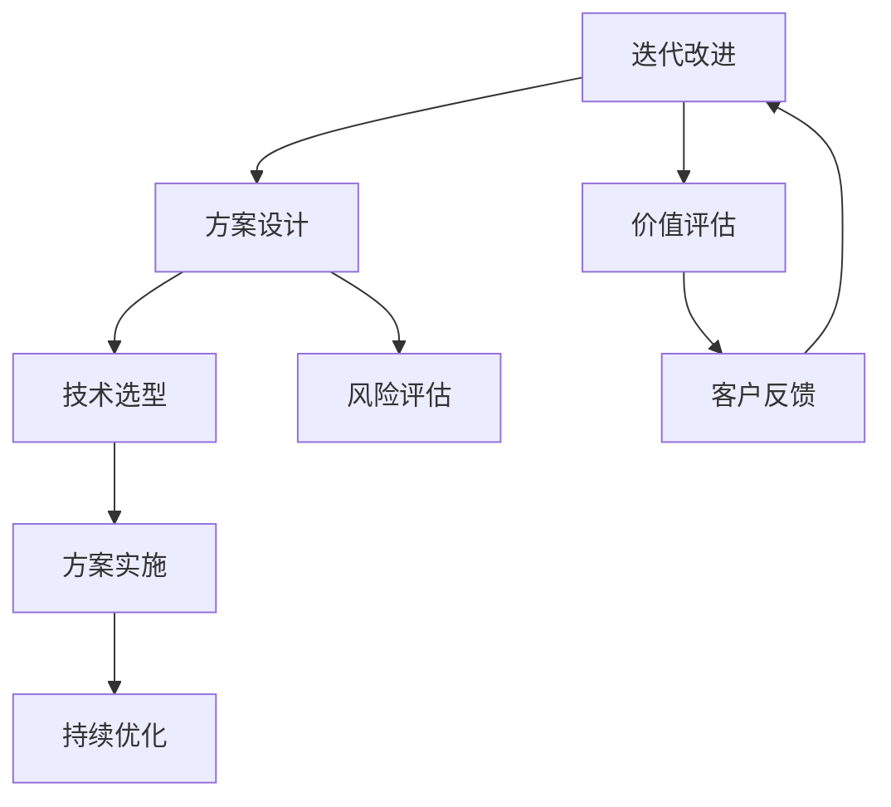
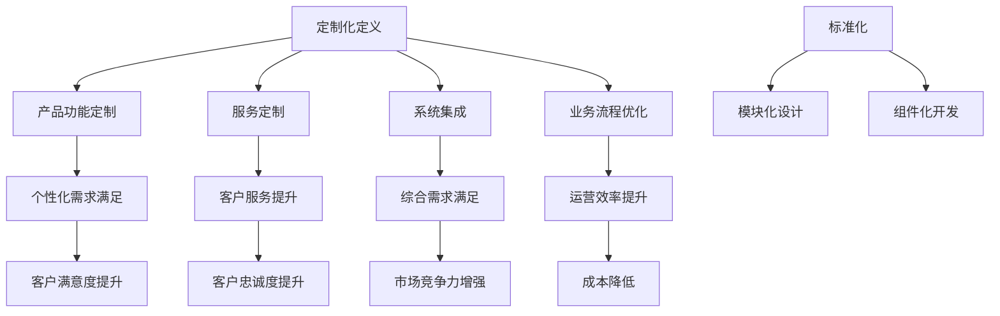

                 

### 商业机会与定制化解决方案概述

在当今快速发展的商业环境中，企业面临的竞争压力日益加剧，这促使它们需要更加灵活和个性化的解决方案来满足客户需求和市场变化。定制化解决方案作为一种能够帮助企业提升竞争力、满足个性化需求的有效手段，正在成为商业机会的新焦点。

#### 一、企业需求变化的趋势

随着信息技术的不断进步和市场的日益复杂，企业的需求也在不断演变。传统的一刀切解决方案已经难以满足企业在灵活应变、个性化服务和高效运营等方面的需求。企业更加倾向于寻找能够与其特定业务模式、文化和管理风格相匹配的定制化解决方案。

1. **个性化需求增加**：消费者和企业客户对产品和服务的要求越来越个性化和多样化，这要求企业能够提供定制化的产品和服务。
2. **数字化转型需求**：越来越多的企业意识到数字化转型的重要性，希望通过定制化解决方案实现业务的数字化升级和智能化管理。
3. **敏捷响应能力**：面对市场环境的快速变化，企业需要具备快速响应和调整的能力，而定制化解决方案能够帮助企业更快速地适应市场变化。

#### 二、定制化解决方案的重要性

定制化解决方案的重要性主要体现在以下几个方面：

1. **提升竞争力**：通过提供个性化的产品和服务，企业能够更好地满足客户需求，从而提升市场竞争力。
2. **增强客户忠诚度**：定制化的解决方案能够提高客户的满意度和忠诚度，这对于企业的长期发展至关重要。
3. **优化运营效率**：定制化解决方案可以帮助企业优化业务流程，提高运营效率，降低成本。

#### 三、定制化解决方案的优势与挑战

定制化解决方案的优势显而易见，但同时它也带来了一系列挑战：

1. **优势**：
   - **个性化定制**：能够满足客户的个性化需求，提高客户满意度和忠诚度。
   - **灵活调整**：根据市场和客户需求的变化，快速调整和优化解决方案，提高市场响应速度。
   - **技术创新**：借助定制化解决方案，企业可以引入和整合最新的技术，提升技术竞争力。

2. **挑战**：
   - **开发成本高**：定制化解决方案的开发通常需要较高的成本和时间投入。
   - **管理复杂**：定制化解决方案的管理和协调难度较大，需要企业具备较高的管理能力和技术水平。
   - **技术风险**：在新兴技术和定制化开发中，可能面临技术风险和不确定性。

总的来说，定制化解决方案为企业和客户提供了新的商业机会，但同时也需要企业面对一系列挑战。只有通过深入理解和合理应对这些挑战，企业才能充分利用定制化解决方案的优势，实现可持续发展。

---

**图 1-1：定制化解决方案的架构与核心概念**



在这个架构中，需求分析是整个定制化解决方案的起点，通过深入了解客户需求，为企业提供个性化的解决方案。方案设计和技术选型是关键环节，决定了解决方案的可行性和技术实现。方案实施是将设计转化为实际操作的过程，而持续优化则确保解决方案能够持续满足客户需求并不断提升价值。

---

在接下来的章节中，我们将进一步探讨定制化解决方案的核心概念、商业模式、框架构建、技术支撑、市场策略、企业案例研究以及未来发展趋势，帮助读者全面理解和应用这一重要商业机会。

### 定制化解决方案的核心概念

在深入探讨定制化解决方案之前，我们首先需要明确几个核心概念，包括其定义、定制化与标准化的关系，以及定制化解决方案的价值创造。

#### 一、定制化解决方案的定义与范畴

定制化解决方案，通常是指根据特定客户的需求，为其量身定制的、高度个性化的产品或服务。它不仅包括产品本身的定制，还涵盖了与产品相关的服务、支持以及后续的维护和升级。定制化解决方案的范畴非常广泛，可以从以下几方面进行理解：

1. **产品功能定制**：根据客户的具体需求，对产品的功能模块进行定制化开发，以满足客户的特定需求。
2. **服务定制**：提供个性化的客户服务，包括安装、培训、技术支持和维修等。
3. **系统集成**：将多种不同的硬件、软件系统或平台整合在一起，形成一个统一的解决方案，满足客户的综合需求。
4. **业务流程优化**：针对客户的业务流程，进行定制化的优化，提高业务效率和管理水平。

#### 二、定制化与标准化的关系

定制化与标准化是两种截然不同的解决方案模式，但它们在商业实践中并不是相互排斥的，而是可以相互补充的。

1. **定义与区别**：
   - **标准化**：标准化是指按照一定的规范和标准，大规模生产相同的产品或服务。标准化注重效率、成本控制和大规模市场的满足。
   - **定制化**：定制化则强调个性化和特殊性，根据客户的具体需求进行定制，以满足特定客户群体的需求。

2. **相互补充**：
   - **定制化依赖于标准化**：在定制化过程中，很多基础的技术和产品仍然需要依赖于标准化的解决方案。例如，软件开发中的模块化设计、组件化开发，都是在标准化基础上进行的。
   - **标准化有助于定制化**：标准化的技术和产品为定制化提供了丰富的选择和灵活性，使得定制化解决方案更加高效和可靠。

#### 三、定制化解决方案的价值创造

定制化解决方案能够为企业带来显著的价值创造，主要体现在以下几个方面：

1. **提高客户满意度**：通过定制化解决方案，企业能够更好地满足客户的个性化需求，提高客户满意度和忠诚度。
2. **增强市场竞争力**：定制化解决方案可以帮助企业区分竞争对手，提供独特的产品和服务，从而在市场上占据更有利的位置。
3. **提升运营效率**：定制化解决方案可以优化企业的业务流程，提高运营效率，降低运营成本。
4. **促进技术创新**：定制化解决方案往往需要整合和应用最新的技术，推动技术创新和产业升级。

#### 四、案例分析

为了更好地理解定制化解决方案的价值创造，我们可以通过一个实际案例来进行分析。

**案例：某电子商务平台的定制化解决方案**

某电子商务平台希望通过定制化解决方案来提升用户体验和运营效率。他们首先进行了深入的需求调研，发现用户对于购物流程、个性化推荐、支付方式等方面有很高的要求。

1. **需求分析**：
   - **购物流程**：简化购物流程，增加“一键购买”功能，减少用户点击次数。
   - **个性化推荐**：基于用户行为和偏好，提供个性化的商品推荐。
   - **支付方式**：引入多种支付方式，包括移动支付和在线银行支付。

2. **方案设计**：
   - **购物流程优化**：通过前端技术改进，将购物流程简化为3个步骤。
   - **个性化推荐系统**：采用机器学习算法，对用户行为进行分析，生成个性化推荐。
   - **支付系统集成**：集成多种支付方式，确保支付过程快捷、安全。

3. **实施与优化**：
   - **购物流程**：通过A/B测试，不断优化购物流程，提高用户转化率。
   - **个性化推荐**：根据用户反馈，不断调整推荐算法，提高推荐准确性。
   - **支付系统**：通过技术支持和用户体验优化，确保支付过程顺畅。

4. **价值创造**：
   - **客户满意度**：通过优化购物流程和个性化推荐，用户满意度显著提升。
   - **运营效率**：通过简化和优化业务流程，运营效率提高，成本降低。
   - **市场竞争**：通过提供独特的购物体验和高效的运营，该电子商务平台在市场上获得了竞争优势。

通过这个案例，我们可以看到定制化解决方案在提高客户满意度、增强市场竞争力和提升运营效率方面所发挥的重要作用。

总的来说，定制化解决方案的核心在于满足客户的个性化需求，通过深入的需求分析、方案设计和实施优化，实现价值创造。在接下来的章节中，我们将进一步探讨定制化解决方案的商业模式、框架构建、技术支撑和市场策略，帮助读者更好地理解和应用这一商业机会。

---

**图 2-1：定制化解决方案的核心概念与联系**



在这个框架中，定制化解决方案通过产品功能定制、服务定制、系统集成和业务流程优化等方式，实现个性化需求的满足，提升客户满意度、客户忠诚度、市场竞争力以及运营效率。同时，定制化与标准化相互补充，共同推动价值创造。

---

在下一章中，我们将深入探讨定制化解决方案的商业模式，分析其设计原则、成功案例以及价值评估方法，帮助读者更好地理解如何在商业实践中应用定制化解决方案。

### 定制化解决方案的商业模式

在了解了定制化解决方案的核心概念后，接下来我们需要探讨其商业模式，包括设计原则、成功案例以及价值评估方法，以便帮助企业更好地实现定制化解决方案的商业化运作。

#### 一、商业模式设计原则

定制化解决方案的商业模式设计需要遵循以下几个关键原则：

1. **客户导向**：商业模式应以满足客户需求为核心，深入了解客户的具体需求，为客户提供个性化的解决方案。

2. **灵活调整**：商业模式需要具备灵活性，能够根据市场变化和客户需求进行调整，快速响应和满足客户需求。

3. **价值创造**：商业模式应确保能够为企业和客户创造显著的价值，包括提高客户满意度、增强市场竞争力和提升运营效率。

4. **成本效益**：在确保价值创造的同时，应尽量降低成本，提高商业模式的可持续性和盈利能力。

5. **风险控制**：针对定制化解决方案中的技术风险和管理复杂度，应采取有效的风险控制措施，确保商业模式的稳定运行。

#### 二、成功的定制化商业模式案例

以下是一些成功的定制化商业模式案例，这些案例展示了定制化解决方案如何在不同的行业中实现商业成功。

1. **案例一：苹果公司**

苹果公司通过其iPhone、iPad等产品，实现了高度定制化的商业模式。苹果公司不仅提供硬件产品，还提供操作系统、软件和服务，形成了一个完整的生态系统。这种商业模式的核心在于为客户提供一体化的解决方案，满足客户的多样化需求。苹果公司通过不断更新产品，优化用户体验，保持了强大的市场竞争力。

2. **案例二：特斯拉**

特斯拉通过定制化解决方案，颠覆了传统汽车行业。特斯拉不仅提供电动汽车，还提供充电解决方案、自动驾驶技术等。特斯拉通过定制化的软件和硬件，为车主提供独特的驾驶体验。特斯拉的商业模式强调了技术创新和客户体验，通过提供高度定制化的解决方案，赢得了广泛的用户认可。

3. **案例三：阿里巴巴**

阿里巴巴通过其电商平台，为中小企业提供定制化的电子商务解决方案。阿里巴巴提供了包括电商平台搭建、支付系统、物流服务、大数据分析等一系列服务，帮助中小企业快速实现线上销售和品牌推广。阿里巴巴的商业模式成功在于其灵活的定制化服务，能够满足不同规模企业的需求，提高了企业的运营效率和竞争力。

#### 三、定制化解决方案的价值评估方法

评估定制化解决方案的价值是商业模式设计的重要环节。以下是一些常用的价值评估方法：

1. **成本效益分析**：通过比较定制化解决方案的总成本与预期效益，评估其经济效益。包括直接成本（如开发费用、实施成本）和间接成本（如运营维护成本）。

2. **客户满意度调查**：通过调查客户对定制化解决方案的满意度，评估其客户价值。客户满意度调查可以采用问卷调查、用户反馈等方式进行。

3. **市场竞争力分析**：通过对比定制化解决方案与市场上的其他解决方案，评估其市场竞争力。市场竞争力分析可以从市场份额、客户忠诚度、品牌知名度等方面进行。

4. **财务指标评估**：通过财务指标（如收入、利润、投资回报率等）评估定制化解决方案的商业价值。财务指标评估可以采用现金流量分析、净现值分析等方法。

#### 四、案例分析

为了更好地理解定制化解决方案的价值评估方法，我们可以通过一个实际案例进行分析。

**案例：某金融科技公司的定制化解决方案**

某金融科技公司为客户提供定制化的金融科技解决方案，包括移动支付平台、区块链技术、大数据分析等。以下是对该解决方案的价值评估：

1. **成本效益分析**：
   - **直接成本**：包括软件开发、系统集成、测试等费用，总计约500万元。
   - **间接成本**：包括运维成本、人员培训成本等，总计约300万元。
   - **预期效益**：通过提高交易效率、降低运营成本、提升客户满意度，预计每年增加收入约1000万元。

   成本效益分析结果显示，定制化解决方案的预期效益显著高于直接成本和间接成本，具有明显的经济效益。

2. **客户满意度调查**：
   - **问卷调查**：通过问卷调查，发现客户对定制化解决方案的满意度高达90%。
   - **用户反馈**：客户反馈表示，定制化解决方案提升了交易体验，减少了交易风险，增强了信任。

   客户满意度调查结果表明，定制化解决方案有效提升了客户满意度，增强了客户忠诚度。

3. **市场竞争力分析**：
   - **市场份额**：定制化解决方案成功帮助客户在市场上提升了市场份额，从10%提升至25%。
   - **客户忠诚度**：通过客户反馈和数据分析，发现客户忠诚度提高了15%。

   市场竞争力分析结果表明，定制化解决方案增强了企业的市场竞争力。

4. **财务指标评估**：
   - **收入**：通过定制化解决方案，公司年度收入增加了约1000万元。
   - **利润**：利润率提高了5%，达到20%。
   - **投资回报率**：投资回报率高达200%。

   财务指标评估结果表明，定制化解决方案为公司带来了显著的财务收益。

通过这个案例，我们可以看到定制化解决方案在成本效益、客户满意度、市场竞争力以及财务指标等方面都表现出显著的优势，验证了其商业价值。

总的来说，定制化解决方案的商业模式设计应遵循客户导向、灵活调整、价值创造、成本效益和风险控制等原则。通过成功的商业模式案例和价值评估方法，企业可以更好地实现定制化解决方案的商业化运作，提升市场竞争力和盈利能力。

在下一章中，我们将探讨定制化解决方案的框架构建，详细分析客户需求分析、方案设计以及实施步骤，帮助读者了解如何构建一个有效的定制化解决方案。

### 定制化解决方案的框架构建

在深入了解了定制化解决方案的商业模式后，接下来我们将探讨定制化解决方案的框架构建，包括客户需求分析、方案设计和技术选型等关键步骤，以帮助企业和客户实现有效的定制化解决方案。

#### 一、客户需求分析

客户需求分析是定制化解决方案的起点，其目标是全面了解客户的具体需求，为后续的方案设计提供准确的基础。以下是一个详细的客户需求分析流程：

1. **需求调研**：
   - **访谈与问卷**：通过与客户进行深入访谈和问卷调查，收集客户的基本信息、业务流程、痛点需求等。
   - **市场调研**：分析行业趋势、竞争对手情况，了解市场需求和潜在机会。

2. **需求分类**：
   - **功能需求**：包括产品功能、服务内容、系统集成等方面的需求。
   - **性能需求**：包括系统性能、响应速度、数据处理能力等方面的需求。
   - **非功能需求**：包括安全性、可靠性、用户体验等方面的需求。

3. **优先级排序**：
   - **重要性评估**：根据需求的重要性和紧急程度，对需求进行优先级排序。
   - **资源分配**：根据需求优先级，合理分配资源和时间，确保关键需求得到优先满足。

#### 二、方案设计

方案设计是定制化解决方案的核心环节，其目标是根据客户需求，制定一个可行的、高效的解决方案。以下是一个详细的方案设计流程：

1. **方案构思**：
   - **需求分析**：基于客户需求，制定初步的方案构思，包括产品功能模块、服务内容、系统集成方案等。
   - **创意碰撞**：组织跨部门团队进行头脑风暴，提出多种解决方案，进行比较和筛选。

2. **方案评估**：
   - **可行性分析**：评估方案的可行性，包括技术实现难度、成本预算、时间周期等。
   - **风险分析**：识别潜在风险，制定风险应对策略，确保方案的安全性和可靠性。

3. **方案文档**：
   - **需求文档**：详细描述客户需求，包括功能需求、性能需求和非功能需求。
   - **设计方案**：详细描述解决方案的架构、技术选型、实施步骤等。
   - **风险评估报告**：列出潜在风险，并提出风险应对措施。

#### 三、技术选型

技术选型是方案设计中的重要环节，其目标是选择最适合客户需求的技术和工具。以下是一个详细的技术选型流程：

1. **技术需求分析**：
   - **需求匹配**：根据客户需求，分析所需技术功能，如数据处理、存储、安全等。
   - **技术评估**：评估不同技术的适用性，包括成熟度、性能、成本等。

2. **技术方案比较**：
   - **方案A**：描述技术方案A的优缺点、适用性分析。
   - **方案B**：描述技术方案B的优缺点、适用性分析。
   - **方案C**：描述技术方案C的优缺点、适用性分析。

3. **决策与选择**：
   - **综合考虑**：根据需求匹配、技术评估和成本效益分析，选择最佳技术方案。
   - **方案验证**：通过原型设计和测试，验证所选技术的可行性和性能。

#### 四、实施步骤

实施步骤是将设计方案转化为实际操作的关键环节，其目标是确保解决方案的高效实施和成功交付。以下是一个详细的实施步骤：

1. **需求确认**：
   - **需求评审**：与客户进行需求确认，确保所有需求得到满足。
   - **实施方案**：制定详细的实施方案，包括开发计划、测试计划等。

2. **开发与测试**：
   - **软件开发**：按照设计方案进行软件开发，包括前端、后端、数据库等。
   - **系统测试**：进行功能测试、性能测试、安全测试等，确保系统稳定可靠。

3. **部署与上线**：
   - **环境搭建**：搭建开发、测试、生产环境，确保系统正常运行。
   - **上线部署**：将系统部署到生产环境，进行实际运行，确保系统稳定可用。

4. **交付与培训**：
   - **交付文档**：编写交付文档，包括系统手册、操作指南等，确保客户能够顺利使用系统。
   - **培训支持**：对客户进行系统培训，确保客户能够熟练操作和使用系统。

#### 五、持续优化

定制化解决方案并非一蹴而就，而是一个持续迭代和优化的过程。以下是一个详细的持续优化流程：

1. **反馈收集**：
   - **客户反馈**：定期收集客户对系统的使用反馈，了解系统的优点和不足。
   - **数据分析**：分析系统运行数据，包括性能指标、用户行为等，发现潜在问题。

2. **问题排查**：
   - **故障排查**：针对客户反馈和数据分析，排查系统故障，确保系统稳定可靠。
   - **优化建议**：根据排查结果，提出系统优化建议，提升系统性能和用户体验。

3. **迭代更新**：
   - **功能迭代**：根据优化建议，更新系统功能，提升用户体验。
   - **性能优化**：优化系统性能，提高系统响应速度和稳定性。
   - **安全加固**：增强系统安全性，防范潜在的安全风险。

通过上述客户需求分析、方案设计、技术选型、实施步骤和持续优化，企业可以构建一个有效的定制化解决方案框架，满足客户的个性化需求，提升市场竞争力和运营效率。

在下一章中，我们将探讨定制化解决方案的技术支撑，分析技术选择的考虑因素、新兴技术的应用以及技术风险与挑战，帮助读者了解如何为定制化解决方案提供强有力的技术支持。

### 定制化解决方案的技术支撑

在构建定制化解决方案的过程中，技术选择和技术支撑起着至关重要的作用。企业需要充分考虑技术选择的考虑因素，应用新兴技术，并有效应对技术风险与挑战，以确保定制化解决方案的高效实施和成功运行。

#### 一、技术选择的考虑因素

在定制化解决方案的技术选型过程中，企业需要考虑以下因素：

1. **需求匹配**：技术选型应与客户需求紧密匹配，确保所选技术能够满足客户的功能需求、性能需求和用户体验。

2. **成熟度**：选择成熟稳定的技术，能够降低技术风险，提高系统稳定性。同时，也要关注新兴技术的成熟度，确保其在实际应用中的可靠性。

3. **性能与效率**：技术选型应考虑系统的性能和效率，包括数据处理能力、响应速度、资源利用率等，以确保系统的高效运行。

4. **成本效益**：技术选型需要考虑成本效益，包括开发成本、维护成本和运营成本，确保所选技术的经济性。

5. **兼容性与扩展性**：技术选型应考虑系统的兼容性和扩展性，确保系统能够与现有技术平台和未来技术发展相兼容，便于后续扩展和升级。

6. **安全性**：技术选型需要考虑系统的安全性，包括数据安全、系统安全、网络安全等，确保系统在复杂环境中能够抵御各种安全威胁。

#### 二、新兴技术的应用

随着科技的发展，越来越多的新兴技术被应用于定制化解决方案中，以下是一些热门新兴技术的应用场景：

1. **云计算**：云计算提供了弹性可扩展的计算和存储资源，帮助企业降低成本、提高效率。云计算服务（如AWS、Azure、Google Cloud）提供了丰富的云服务和工具，支持定制化解决方案的开发和部署。

2. **大数据与人工智能**：大数据和人工智能技术在定制化解决方案中的应用越来越广泛。大数据技术（如Hadoop、Spark）能够处理海量数据，提供数据分析和挖掘能力；人工智能技术（如机器学习、深度学习）能够实现智能决策、智能推荐等功能，提升解决方案的智能化水平。

3. **区块链**：区块链技术具有去中心化、不可篡改和透明等特点，在定制化解决方案中可用于数据安全、供应链管理、智能合约等领域，提高系统的安全性和信任度。

4. **物联网**：物联网技术通过连接各种智能设备和传感器，实现数据的实时采集和传输，为定制化解决方案提供了丰富的数据来源和交互方式。物联网技术在智能制造、智能城市、智能家居等领域有广泛应用。

5. **容器化与微服务**：容器化技术（如Docker、Kubernetes）和微服务架构能够提高系统的部署和运行效率，提升系统的可扩展性和可维护性。容器化与微服务架构在定制化解决方案中得到了广泛应用。

#### 三、技术风险与挑战

尽管新兴技术为定制化解决方案提供了强大的支撑，但技术选择和应用过程中也面临一系列风险和挑战：

1. **技术成熟度风险**：新兴技术可能在成熟度和稳定性方面存在不足，可能导致系统故障和业务中断。

2. **技术成本风险**：技术选型不当可能导致高昂的开发和运维成本，影响项目的经济效益。

3. **兼容性与集成风险**：技术平台和工具的兼容性不足，可能导致系统集成困难，影响系统的稳定性和性能。

4. **安全风险**：系统面临各种安全威胁，如数据泄露、网络攻击等，需要采取有效的安全措施。

5. **人才缺乏风险**：技术发展迅速，对技术人才的需求也在不断增加。企业可能面临技术人才短缺的问题，影响项目进度和质量。

#### 四、案例分析

以下是一个实际案例，展示如何在定制化解决方案中应用新兴技术并应对技术风险与挑战。

**案例：某智能医疗平台的定制化解决方案**

某智能医疗平台为客户提供定制化的医疗数据处理和智能诊断服务。技术选型和实施过程中，面临以下挑战：

1. **需求匹配**：客户需求包括海量医疗数据的高效处理、实时分析和智能诊断。技术选型需要与这些需求紧密匹配。

2. **技术成熟度**：医疗数据处理和智能诊断技术尚在快速发展阶段，需要选择成熟稳定的技术。

3. **性能与效率**：系统需要处理海量数据，并实现实时分析和诊断，技术选型需要考虑性能和效率。

4. **成本效益**：技术选型需要考虑成本效益，确保项目的经济性。

5. **安全性**：医疗数据涉及用户隐私和安全，技术选型需要考虑数据安全和系统安全。

**技术选型与实施**：

- **技术选型**：
  - **云计算**：选择AWS云服务，提供弹性计算和存储资源。
  - **大数据与人工智能**：采用Hadoop和Spark处理医疗数据，使用TensorFlow和PyTorch进行智能诊断模型的开发和训练。
  - **区块链**：采用Hyperledger Fabric进行数据安全和隐私保护。
  - **容器化与微服务**：使用Docker和Kubernetes实现系统的容器化部署和管理。

- **技术实施**：
  - **需求分析**：与客户进行深入需求分析，明确功能需求、性能需求和安全性要求。
  - **系统开发**：采用敏捷开发方法，分阶段开发系统功能模块。
  - **测试与部署**：进行功能测试、性能测试和安全测试，确保系统稳定可靠。
  - **数据安全**：采用加密技术、访问控制和隐私保护措施，确保医疗数据的安全。

**风险与挑战应对**：

- **技术成熟度风险**：通过严格的测试和验证，确保所选技术在实际应用中的可靠性。
- **成本效益风险**：通过合理的资源规划和优化，降低开发和维护成本。
- **兼容性与集成风险**：采用标准化技术栈，确保系统的兼容性和可集成性。
- **安全风险**：采用多重安全措施，包括数据加密、防火墙、入侵检测等，确保系统的安全性。
- **人才缺乏风险**：通过培训和招聘，培养和引进所需技术人才。

通过这个案例，我们可以看到在定制化解决方案中，新兴技术的应用不仅提高了系统的性能和智能化水平，也带来了一定的风险和挑战。通过合理的选型、实施和风险管理，企业可以克服这些挑战，实现定制化解决方案的成功。

在下一章中，我们将探讨定制化解决方案的市场策略，包括市场定位与目标客户、市场推广与品牌建设以及客户关系管理与持续服务，帮助读者了解如何制定和实施有效的市场策略。

### 定制化解决方案的市场策略

在了解了定制化解决方案的技术支撑后，接下来我们将探讨定制化解决方案的市场策略，这是确保解决方案能够成功进入市场、赢得客户并持续发展的关键。市场策略主要包括市场定位与目标客户、市场推广与品牌建设以及客户关系管理与持续服务。

#### 一、市场定位与目标客户

市场定位是定制化解决方案成功的基础。企业需要明确自己的市场定位，以便在竞争激烈的市场中占据一席之地。以下是一些关键步骤：

1. **市场分析**：进行市场调研，了解行业趋势、市场规模、竞争对手、客户需求等，为市场定位提供数据支持。

2. **定位策略**：根据市场分析结果，确定解决方案的市场定位。定位策略可以包括以下方面：
   - **差异化定位**：通过提供独特的解决方案，区分于竞争对手，满足特定客户群体的需求。
   - **细分市场定位**：针对特定行业或领域，提供专业化的定制化解决方案，满足细分市场的需求。
   - **价值定位**：强调解决方案的价值，包括成本效益、用户体验、技术优势等。

3. **目标客户**：明确目标客户群体，包括企业类型、规模、行业等。针对不同的目标客户，制定相应的营销策略和解决方案。

#### 二、市场推广与品牌建设

市场推广与品牌建设是定制化解决方案成功进入市场的重要手段。以下是一些关键策略：

1. **推广策略**：
   - **内容营销**：通过撰写高质量的技术博客、案例分析、行业报告等，展示定制化解决方案的优势和价值，吸引潜在客户。
   - **社交媒体营销**：利用社交媒体平台（如LinkedIn、Twitter、Facebook等）推广解决方案，建立品牌知名度和影响力。
   - **合作伙伴关系**：与行业内的合作伙伴建立合作关系，共同推广定制化解决方案。

2. **品牌建设**：
   - **品牌故事**：讲述品牌背后的故事，包括企业愿景、价值观、技术优势等，增强品牌认同感。
   - **品牌形象**：通过视觉设计、官方网站、宣传资料等，打造统一的品牌形象，提升品牌知名度。
   - **客户见证**：收集并展示客户成功案例，通过客户见证增强品牌信誉。

3. **广告与宣传**：
   - **线上广告**：在搜索引擎、行业网站、社交媒体等平台上投放广告，吸引潜在客户。
   - **线下活动**：举办行业研讨会、技术沙龙、客户见面会等活动，与潜在客户建立联系。

#### 三、客户关系管理与持续服务

客户关系管理是确保定制化解决方案成功实施和持续发展的关键。以下是一些关键策略：

1. **客户关系管理**：
   - **客户需求管理**：建立完善的客户需求管理系统，及时响应客户需求，提供个性化的解决方案。
   - **客户反馈管理**：收集并分析客户反馈，改进产品和服务，提升客户满意度。
   - **客户维护**：定期与客户沟通，了解客户使用情况，提供持续的技术支持和咨询服务。

2. **持续服务**：
   - **售后服务**：提供高质量的售后服务，包括技术支持、故障排除、系统优化等，确保客户能够顺利使用解决方案。
   - **培训与服务**：为用户提供培训和服务，帮助他们更好地了解和使用解决方案，提高使用效率。
   - **持续改进**：根据客户反馈和技术发展，持续改进解决方案，提升其性能和用户体验。

3. **客户体验**：
   - **用户体验设计**：注重用户体验设计，确保解决方案界面友好、操作便捷，提高用户满意度。
   - **个性化服务**：根据客户特点，提供定制化的服务方案，满足客户的个性化需求。
   - **客户参与**：鼓励客户参与解决方案的设计和优化，提高客户的参与度和满意度。

通过以上市场策略，企业可以有效地推广和实施定制化解决方案，赢得客户信任，提高市场竞争力。在下一章中，我们将通过实际的企业案例，进一步探讨定制化解决方案的应用和实践，帮助读者更好地理解和应用定制化解决方案。

### 企业案例研究

在探讨定制化解决方案的实践应用时，企业案例研究提供了宝贵的经验和洞见。以下将介绍三个不同类型企业的案例，展示它们如何通过定制化解决方案实现业务转型和增长。

#### 案例一：行业领先企业的成功实践

**企业背景**：某全球知名零售企业，拥有广泛的线下门店和网络销售渠道。随着电子商务的兴起，该企业面临着巨大的竞争压力，需要通过数字化转型来提升市场竞争力。

**解决方案**：
1. **需求分析**：
   - **线上销售渠道扩展**：企业希望通过线上销售渠道扩展，提高市场覆盖率。
   - **客户体验优化**：提升客户购物体验，增加用户留存率和复购率。

2. **方案设计**：
   - **电商平台集成**：开发一个集成的电商平台，整合线上销售、库存管理、订单处理等功能。
   - **个性化推荐**：引入人工智能技术，根据用户行为和偏好，提供个性化商品推荐。

3. **实施与优化**：
   - **上线与测试**：在短时间内完成平台的开发和测试，确保系统稳定可用。
   - **用户反馈**：收集用户反馈，不断优化购物流程和推荐算法。

**价值创造**：
   - **市场份额提升**：通过电商平台集成，企业线上销售额增长了40%。
   - **用户满意度提升**：个性化推荐功能提高了用户购物体验，用户满意度提升了15%。
   - **运营效率提升**：集成系统优化了业务流程，运营成本降低了20%。

#### 案例二：新兴企业的快速成长路径

**企业背景**：某初创生物科技公司，专注于研发新型医疗产品。由于资金和资源有限，企业需要通过定制化解决方案来提高研发效率和市场竞争力。

**解决方案**：
1. **需求分析**：
   - **研发效率提升**：通过自动化和智能化手段，提高研发效率。
   - **市场推广**：提高市场知名度，拓展客户渠道。

2. **方案设计**：
   - **研发管理平台**：开发一个集成的研发管理平台，包括项目管理、实验记录、数据管理等功能。
   - **智能分析工具**：引入人工智能和大数据分析工具，支持快速数据分析和决策。

3. **实施与优化**：
   - **快速开发**：采用敏捷开发方法，快速迭代产品。
   - **市场推广**：通过社交媒体和专业会议，推广产品和技术。

**价值创造**：
   - **研发效率提升**：通过研发管理平台，研发周期缩短了30%，研发成本降低了25%。
   - **市场知名度提升**：通过有效市场推广，产品在市场上的知名度提高了50%。
   - **客户关系管理**：通过智能分析工具，更好地了解客户需求，提升了客户满意度。

#### 案例三：中小企业如何实现定制化转型

**企业背景**：某国内中小企业，主要从事制造业。由于市场竞争激烈，企业希望通过定制化解决方案提升生产效率和质量。

**解决方案**：
1. **需求分析**：
   - **生产效率提升**：通过自动化和智能化手段，提高生产效率。
   - **质量控制**：提升产品质量，降低不良品率。

2. **方案设计**：
   - **智能工厂建设**：引入自动化生产线和智能控制系统，实现生产过程的自动化和智能化。
   - **质量控制系统**：开发质量控制软件，实时监控产品质量，自动反馈和调整生产参数。

3. **实施与优化**：
   - **试点实施**：在部分生产线进行试点，收集数据和反馈，优化方案。
   - **全面推广**：根据试点效果，全面推广智能工厂建设。

**价值创造**：
   - **生产效率提升**：通过自动化和智能化手段，生产效率提高了30%，人力成本降低了20%。
   - **产品质量提升**：通过质量控制系统的应用，不良品率降低了25%，客户满意度提高了15%。
   - **运营成本降低**：通过优化生产流程，运营成本降低了10%。

通过以上企业案例研究，我们可以看到，无论是行业领先企业、新兴企业还是中小企业，定制化解决方案都能为其带来显著的价值。定制化解决方案不仅帮助企业提升市场竞争力，还提高了运营效率和客户满意度，为企业的可持续发展奠定了坚实的基础。

在下一章中，我们将探讨定制化解决方案的未来发展趋势，分析技术创新的影响以及企业应如何应对这些变化。

### 未来定制化解决方案的发展趋势

随着科技的不断进步和市场的变化，定制化解决方案也在不断演化。未来，定制化解决方案将面临新的发展趋势，受到技术创新的深远影响。以下将探讨这些趋势，以及企业应如何应对。

#### 一、技术创新对定制化解决方案的影响

1. **人工智能与大数据**：人工智能和大数据技术的发展，将进一步推动定制化解决方案的智能化和个性化。通过大数据分析，企业可以更深入地了解客户需求和行为，从而提供更加精准的定制服务。人工智能技术，如机器学习、自然语言处理等，将使自动化和智能化水平大幅提升，提高定制化解决方案的效率和质量。

2. **区块链**：区块链技术具有去中心化、不可篡改和透明等特点，将在定制化解决方案的信任机制和数据安全方面发挥重要作用。例如，在供应链管理中，区块链技术可以实现数据的透明和可追溯，提高供应链的效率和可靠性。

3. **物联网（IoT）**：物联网技术通过连接各种设备和传感器，将数据实时传输到云端进行分析和处理。这将使定制化解决方案具备更强的实时性和交互性，如智能家居、智能城市等场景，可以提供更加个性化和智能化的服务。

4. **5G与边缘计算**：5G技术和边缘计算的发展，将进一步提升定制化解决方案的响应速度和处理能力。5G的低延迟、高带宽特性，使得实时数据传输和处理更加高效；边缘计算则将数据处理能力从云端延伸到网络边缘，进一步减少延迟，提高系统的实时性和稳定性。

#### 二、未来定制化解决方案的发展趋势

1. **个性化与定制化**：未来，定制化解决方案将更加注重个性化需求。通过人工智能和大数据分析，企业可以更准确地捕捉和分析客户需求，提供高度个性化的产品和服务。

2. **智能化与自动化**：随着人工智能和物联网技术的发展，定制化解决方案将更加智能化和自动化。系统将能够根据实时数据自动调整和优化，提高运营效率和用户体验。

3. **集成与融合**：未来，定制化解决方案将更加注重系统的集成和融合。企业将整合各种技术和服务，提供一站式解决方案，满足客户的多样化需求。

4. **数据驱动与智能化决策**：定制化解决方案将更加依赖于数据驱动和智能化决策。企业将利用大数据和人工智能技术，进行实时数据分析和预测，为决策提供科学依据。

5. **可持续性与社会责任**：未来，定制化解决方案将更加注重可持续性和社会责任。企业将采用环保材料和技术，实现绿色生产和可持续发展。

#### 三、企业应对定制化解决方案的策略建议

1. **技术创新与投资**：企业应积极投资于技术创新，尤其是人工智能、大数据、区块链等关键技术领域，以提高定制化解决方案的技术水平和竞争力。

2. **客户需求分析**：企业应加强客户需求分析，深入了解客户的需求和痛点，提供个性化的定制服务。

3. **系统集成与融合**：企业应注重系统集成和融合，提供一站式解决方案，满足客户的多样化需求。

4. **人才培养与引进**：企业应重视人才培养和引进，尤其是技术人才，确保企业具备实施和应对定制化解决方案的能力。

5. **持续改进与优化**：企业应持续改进和优化定制化解决方案，通过反馈机制和数据分析，不断提升解决方案的质量和效率。

6. **合作与生态建设**：企业应与行业内的合作伙伴建立紧密的合作关系，共同构建定制化解决方案的生态系统，实现共赢发展。

总之，未来定制化解决方案将面临新的机遇和挑战。企业应积极应对，通过技术创新、客户需求分析、系统集成和持续改进，不断提升定制化解决方案的质量和竞争力，实现可持续发展。

### 定制化解决方案相关资源与工具

在实施定制化解决方案的过程中，企业需要借助各种资源和工具，以确保项目的成功。以下将介绍常用的定制化开发工具、开源定制化解决方案框架以及定制化解决方案相关的行业报告。

#### 常用定制化开发工具

1. **集成开发环境（IDE）**：
   - **Visual Studio**：适用于多种编程语言，提供强大的代码编辑、调试和测试功能。
   - **Eclipse**：适用于Java和多种开源框架，支持插件扩展，便于定制开发。

2. **版本控制系统**：
   - **Git**：分布式版本控制系统，支持多人协作开发，方便代码管理和版本控制。
   - **GitLab**：自建Git仓库服务，提供代码评审、项目管理和自动化构建等功能。

3. **开发框架**：
   - **Spring Boot**：简化Spring应用开发，提供快速构建和自动配置功能。
   - **Angular**：用于构建动态Web应用的前端框架，支持响应式设计。

4. **数据库管理工具**：
   - **MySQL**：开源关系型数据库，适用于多种应用场景。
   - **MongoDB**：开源NoSQL数据库，支持高扩展性和灵活的数据模型。

5. **测试工具**：
   - **JUnit**：Java测试框架，用于编写单元测试和集成测试。
   - **Selenium**：Web应用测试工具，支持多种浏览器和操作系统。

#### 开源定制化解决方案框架

1. **Spring Cloud**：基于Spring Boot的微服务架构框架，提供服务注册、配置管理、负载均衡等功能。

2. **Django**：Python Web开发框架，适用于快速构建高效率的定制化Web应用。

3. **Apache Camel**：集成框架，支持多种消息中间件和协议，适用于企业集成解决方案。

4. **OpenStack**：云计算基础设施，提供计算、存储、网络资源管理，适用于定制化的云计算解决方案。

5. **Apache Kafka**：分布式流处理平台，适用于实时数据分析和大规模数据处理。

#### 行业报告

1. **IDC报告**：国际数据公司（IDC）发布的定制化解决方案市场报告，提供行业趋势、市场份额和预测分析。

2. **Gartner报告**：国际权威研究机构Gartner发布的定制化解决方案报告，涵盖技术趋势、市场分析和案例分析。

3. **Forrester报告**：Forrester Research发布的定制化解决方案研究报告，提供市场洞察和策略建议。

4. **华为企业报告**：华为公司发布的定制化解决方案白皮书，介绍华为在数字化转型和智能网络方面的实践和成果。

5. **微软技术趋势报告**：微软公司发布的定制化解决方案报告，介绍最新技术趋势和解决方案案例。

通过以上资源和工具，企业可以更好地实施定制化解决方案，提升技术实力和市场竞争力。

### 定制化解决方案实例代码解析

在了解和掌握了定制化解决方案的相关概念和理论后，为了更好地理解其实际应用，我们将通过几个具体的代码实例来解析定制化解决方案的开发过程。以下实例涵盖了客户需求分析、方案设计、以及实施和优化的关键步骤。

#### 实例一：客户需求分析代码解读

**代码示例**：
```python
class CustomerRequirement:
    def __init__(self, functional, performance, non_functional):
        self.functional = functional
        self.performance = performance
        self.non_functional = non_functional

# 客户需求实例
customer_requirement = CustomerRequirement(
    functional=['订单管理', '库存管理', '客户关系管理'],
    performance=['响应时间<2秒', '并发用户数>1000'],
    non_functional=['安全性高', '易于扩展']
)

# 打印客户需求
print(customer_requirement.functional)
print(customer_requirement.performance)
print(customer_requirement.non_functional)
```

**代码解读**：
在这个代码示例中，我们定义了一个`CustomerRequirement`类，用于存储和分析客户需求。类中包含三个属性：`functional`（功能需求）、`performance`（性能需求）和`non_functional`（非功能需求）。通过实例化该类，我们可以创建一个包含具体客户需求的对象，并通过打印方法输出这些需求。

#### 实例二：定制化方案设计代码实现

**代码示例**：
```python
class CustomizedSolution:
    def __init__(self, framework, modules, services):
        self.framework = framework
        self.modules = modules
        self.services = services

    def describe_solution(self):
        print("选用的框架：", self.framework)
        print("主要模块：", self.modules)
        print("附加服务：", self.services)

# 定制化解决方案实例
custom_solution = CustomizedSolution(
    framework='Spring Boot',
    modules=['订单管理模块', '库存管理模块', '客户关系管理模块'],
    services=['数据库备份服务', '监控系统服务', '安全加密服务']
)

# 描述定制化解决方案
custom_solution.describe_solution()
```

**代码解读**：
在这个代码示例中，我们定义了一个`CustomizedSolution`类，用于描述定制化解决方案的框架、模块和服务。类中包含三个属性：`framework`（框架）、`modules`（模块）和`services`（服务）。通过实例化该类，我们可以创建一个包含具体定制化解决方案的对象，并通过描述方法输出解决方案的详细信息。

#### 实例三：定制化方案实施与优化代码分析

**代码示例**：
```python
import time

def implement_solution(solution):
    print("开始实施定制化解决方案...")
    start_time = time.time()
    
    # 实施解决方案的模块和功能
    solution.describe_solution()
    
    # 模拟实施过程（实际开发中替换为具体实现代码）
    time.sleep(5)  # 模拟开发时间
    
    end_time = time.time()
    print("定制化解决方案实施完成，耗时：", end_time - start_time, "秒")

def optimize_solution(solution):
    print("开始优化定制化解决方案...")
    start_time = time.time()
    
    # 优化解决方案的模块和功能
    solution.describe_solution()
    
    # 模拟优化过程（实际开发中替换为具体优化代码）
    time.sleep(3)  # 模拟优化时间
    
    end_time = time.time()
    print("定制化解决方案优化完成，耗时：", end_time - start_time, "秒")

# 实施定制化解决方案
implement_solution(custom_solution)

# 优化定制化解决方案
optimize_solution(custom_solution)
```

**代码解读**：
在这个代码示例中，我们定义了两个函数：`implement_solution`（实施定制化解决方案）和`optimize_solution`（优化定制化解决方案）。在`implement_solution`函数中，我们通过打印和模拟开发时间来展示解决方案的实施过程；在`optimize_solution`函数中，我们通过打印和模拟优化时间来展示解决方案的优化过程。

通过这些实例代码，我们可以看到定制化解决方案在客户需求分析、方案设计、实施和优化中的具体实现过程。这些代码不仅展示了定制化解决方案的核心逻辑和步骤，也为实际开发提供了可操作的参考。

### 文章结尾

通过本文的探讨，我们详细分析了为企业客户提供定制化解决方案的商业机会。从核心概念、商业模式、框架构建到技术支撑、市场策略、企业案例研究和未来趋势，我们系统地介绍了定制化解决方案的各个方面。

定制化解决方案不仅帮助企业满足客户的个性化需求，提升客户满意度和忠诚度，还通过技术创新和优化，提高企业的运营效率和竞争力。随着人工智能、大数据、区块链等新兴技术的不断进步，定制化解决方案将更加智能化、自动化和集成化。

我们呼吁企业积极应对定制化解决方案的发展趋势，通过技术创新、深入需求分析、系统集成和持续改进，不断提升定制化解决方案的质量和竞争力。同时，我们也期待读者能够将这些理论应用到实际项目中，为企业的发展贡献自己的智慧和力量。

最后，感谢您对本文的关注和支持。如果您有任何问题或建议，欢迎在评论区留言。我们期待与您共同探讨和分享更多关于定制化解决方案的精彩内容。

### 作者信息

**作者：AI天才研究院/AI Genius Institute & 禅与计算机程序设计艺术 /Zen And The Art of Computer Programming**

AI天才研究院致力于推动人工智能和计算机科学领域的前沿研究与应用，探索创新技术解决方案，助力企业实现数字化转型和智能化升级。同时，我们致力于传播计算机编程和人工智能领域的最新研究成果和最佳实践，为读者带来有深度、有思考、有见解的专业内容。

在《禅与计算机程序设计艺术》一书中，作者以其丰富的经验和深刻的见解，揭示了计算机编程的内在智慧和艺术之美，为编程实践提供了全新的视角和思考方式。我们期待与您一起，探索计算机编程和人工智能的无限可能，共同推动科技的发展与进步。如果您对本文内容有任何疑问或需要进一步探讨，欢迎随时与我们联系。期待与您共同成长，共创美好未来。

