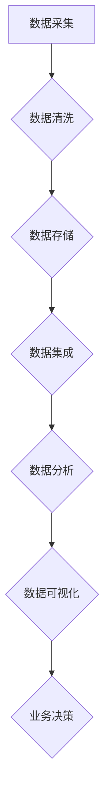

                 

### 《人工智能创业数据管理的最佳实践》

> **关键词**：人工智能、创业、数据管理、数据质量、数据治理、数据分析、机器学习

> **摘要**：本文旨在为人工智能创业公司提供数据管理的最佳实践指南。通过深入探讨数据管理的基础、架构设计、关键技术以及实战案例，本文帮助创业者理解和实施有效的数据管理策略，以促进人工智能项目的成功。

----------------------------------------------------------------

### 《人工智能创业数据管理的最佳实践》

随着人工智能技术的快速发展，越来越多的创业公司投身于这一领域，寻求通过人工智能技术创造商业价值。然而，数据管理作为人工智能项目成功的关键因素，常常被忽视。本文将探讨人工智能创业中数据管理的最佳实践，帮助创业者构建高效的数据管理体系。

---

#### 目录

1. **引言与背景**
   - **1.1 人工智能行业的发展趋势**
   - **1.2 创业者在人工智能领域的机遇与挑战**
   - **1.3 数据管理在人工智能创业中的重要性

2. **人工智能创业的流程与策略**
   - **2.1 创业初步：项目构思与市场调研**
   - **2.2 产品设计与技术路线规划**
   - **2.3 团队组建与资源整合**
   - **2.4 融资策略与财务管理

3. **数据管理基础**
   - **3.1 数据管理概述**
   - **3.2 数据质量管理**
   - **3.3 数据治理框架**
   - **3.4 数据安全与隐私保护

4. **数据管理架构设计**
   - **4.1 数据架构设计原则**
   - **4.2 数据仓库与数据湖设计**
   - **4.3 数据集成与数据交换**
   - **4.4 数据分析平台构建

5. **数据管理关键技术**
   - **5.1 大数据存储技术**
   - **5.2 分布式计算技术**
   - **5.3 数据流处理技术**
   - **5.4 数据可视化技术

6. **数据管理工具与应用**
   - **6.1 数据库管理系统**
   - **6.2 数据挖掘与分析工具**
   - **6.3 数据管理平台**
   - **6.4 案例分析与实战应用

7. **人工智能创业实践案例**
   - **7.1 智能推荐系统数据管理实践**
   - **7.2 自动驾驶数据管理挑战与解决方案**
   - **7.3 医疗健康数据管理应用案例**
   - **7.4 金融科技数据管理实践

8. **数据管理最佳实践与未来展望**
   - **8.1 数据管理最佳实践总结**
   - **8.2 人工智能创业中数据管理的未来趋势**
   - **8.3 持续改进与迭代策略**
   - **8.4 数据驱动的创新与创业启示

9. **附录**
   - **9.1 数据管理相关资源与工具**
   - **9.2 Mermaid流程图与伪代码示例**
   - **9.3 数据管理实践项目指南**

### 第一部分：引言与背景

#### 1.1 人工智能行业的发展趋势

人工智能（AI）作为科技领域的革命性力量，正日益渗透到各行各业。从语音识别、自然语言处理到计算机视觉、机器学习，人工智能技术已经展现出巨大的潜力和应用价值。以下是当前人工智能行业的一些发展趋势：

- **技术创新**：深度学习、强化学习等先进算法不断突破，推动人工智能技术向更高层次发展。
- **行业应用**：人工智能在医疗、金融、交通、教育等领域的应用逐渐深入，成为提升行业效率和质量的重要手段。
- **产业融合**：人工智能与物联网、大数据、云计算等技术的结合，推动产业智能化转型。

随着人工智能技术的快速发展，创业者在人工智能领域面临着巨大的机遇。同时，也伴随着一系列挑战。

#### 1.2 创业者在人工智能领域的机遇与挑战

**机遇：**

- **市场需求**：人工智能技术能够解决许多传统行业面临的问题，创造新的商业模式和市场需求。
- **资本支持**：随着人工智能技术的兴起，投资者对相关领域的项目表现出强烈的兴趣，提供了丰富的资本支持。
- **技术突破**：人工智能领域的快速进展为创业者提供了不断迭代和优化的机会，有助于构建具有竞争力的产品。

**挑战：**

- **技术门槛**：人工智能技术复杂，需要高水平的技术团队和研发能力，对于初创公司来说是一大挑战。
- **数据管理**：数据是人工智能的核心资产，有效的数据管理对于人工智能项目的成功至关重要。
- **法规与伦理**：人工智能的应用涉及隐私保护、伦理问题等法律法规的约束，需要创业者高度重视。

#### 1.3 数据管理在人工智能创业中的重要性

数据管理在人工智能创业中扮演着至关重要的角色。以下是数据管理在人工智能创业中的重要性和核心目标：

**重要性：**

- **提高决策效率**：通过有效的数据管理，创业者能够快速获取和分析数据，做出更准确的商业决策。
- **降低风险**：良好的数据管理能够减少数据错误、数据丢失和数据泄露的风险，保护企业的核心资产。
- **提升竞争力**：数据驱动的创新和优化能够帮助创业者构建具有竞争优势的产品和服务。

**核心目标：**

- **数据质量**：确保数据的准确性、完整性、一致性和及时性，提高数据的价值。
- **数据治理**：建立数据管理策略、流程、标准和组织结构，实现数据的有效管理和使用。
- **数据安全与隐私保护**：保护数据不被未经授权的访问、使用、泄露或篡改。

数据管理不仅是人工智能创业的基础，也是企业可持续发展的关键因素。在接下来的章节中，我们将深入探讨数据管理的理论基础、架构设计、关键技术以及实战案例，帮助创业者构建高效的数据管理体系。

### 第二部分：人工智能创业的流程与策略

人工智能创业的成功不仅依赖于技术创新，还需要完善的流程和策略。本章节将详细阐述人工智能创业的流程与策略，包括项目构思与市场调研、产品设计与技术路线规划、团队组建与资源整合、以及融资策略与财务管理。

#### 2.1 创业初步：项目构思与市场调研

**项目构思：**

项目构思是人工智能创业的第一步，创业者需要明确创业方向和目标。以下是一些关键步骤：

- **寻找痛点**：识别现有市场中尚未得到满足的需求或痛点。
- **技术可行性**：评估所需技术的成熟度和可行性，确定技术路线。
- **市场需求**：通过市场调研，验证需求的真实性和潜在市场规模。

**市场调研：**

市场调研是项目构思的重要环节，通过调研获取市场数据、用户反馈和竞争情况。以下是一些市场调研的方法和工具：

- **问卷调查**：通过问卷调查获取用户需求和反馈。
- **访谈**：与潜在用户、行业专家和合作伙伴进行深度访谈。
- **数据分析**：使用大数据分析工具分析市场趋势和用户行为。

**确定目标市场：**

在市场调研的基础上，创业者需要明确目标市场，包括目标用户、市场规模和增长潜力。以下是确定目标市场的步骤：

- **用户细分**：根据用户特征、需求和偏好进行细分。
- **市场定位**：确定产品的市场定位和差异化优势。
- **目标用户画像**：创建目标用户画像，明确用户需求和期望。

#### 2.2 产品设计与技术路线规划

**产品设计：**

产品设计是人工智能创业的核心，创业者需要从用户需求出发，设计具有竞争力的产品。以下是一些产品设计的步骤：

- **需求分析**：分析用户需求，明确产品的功能、性能和用户体验。
- **原型设计**：创建产品原型，进行用户体验测试和迭代优化。
- **设计原则**：遵循简洁、直观、易用的设计原则，提升用户满意度。

**技术路线规划：**

技术路线规划是确保产品实现和业务成功的关键，创业者需要制定详细的技术路线图。以下是一些技术路线规划的步骤：

- **技术选型**：选择适合项目需求的技术框架和工具。
- **技术架构**：设计产品技术架构，确保系统的可扩展性和可维护性。
- **研发计划**：制定研发计划，明确开发周期和关键节点。

#### 2.3 团队组建与资源整合

**团队组建：**

团队是人工智能创业的核心力量，创业者需要组建一支高效、专业的团队。以下是一些团队组建的步骤：

- **核心团队**：确定核心团队成员，包括技术、产品、运营等关键角色。
- **人员招聘**：通过招聘渠道寻找合适的团队成员。
- **团队建设**：建立团队文化，提升团队凝聚力和执行力。

**资源整合：**

资源整合是确保项目顺利推进的关键，创业者需要整合内外部资源。以下是一些资源整合的步骤：

- **资金筹集**：通过天使投资、风险投资等渠道筹集资金。
- **合作伙伴**：寻找行业合作伙伴，共同开发和推广产品。
- **资源管理**：合理分配和管理项目资源，确保项目按计划推进。

#### 2.4 融资策略与财务管理

**融资策略：**

融资策略是人工智能创业的重要环节，创业者需要制定合适的融资策略。以下是一些融资策略的步骤：

- **融资规划**：根据项目需求和资金需求，制定融资计划。
- **融资渠道**：选择合适的融资渠道，如天使投资、风险投资、政府补贴等。
- **融资谈判**：与投资者进行谈判，争取最优的融资条件。

**财务管理：**

财务管理是确保企业财务健康和持续发展的关键，创业者需要建立完善的财务管理体系。以下是一些财务管理的步骤：

- **预算编制**：制定项目预算，确保资金合理分配。
- **成本控制**：通过成本控制，降低项目成本，提高盈利能力。
- **财务报告**：定期编制财务报告，监控项目财务状况。

通过以上流程和策略，人工智能创业者可以更好地规划和管理项目，提高项目的成功率。在下一章节中，我们将深入探讨数据管理的理论基础，包括数据质量管理、数据治理框架、数据安全与隐私保护等内容。

### 第三部分：数据管理基础

在人工智能创业中，数据管理是确保项目成功的关键环节。本部分将详细探讨数据管理的基础知识，包括数据管理概述、数据质量管理、数据治理框架和数据安全与隐私保护。

#### 3.1 数据管理概述

数据管理是指对数据的采集、存储、处理、分析和利用的全过程。它是确保数据质量、提高数据价值和保障数据安全的重要手段。数据管理的主要内容包括：

- **数据采集**：从各种渠道收集数据，包括结构化数据、半结构化数据和非结构化数据。
- **数据存储**：将采集到的数据存储在数据库、数据仓库、数据湖等数据存储系统中。
- **数据处理**：对数据进行清洗、转换、归一化和分析等处理，以获取有价值的信息。
- **数据分析**：使用统计方法、机器学习和深度学习等技术对数据进行深入分析，发现数据中的规律和趋势。
- **数据利用**：将分析结果应用于业务决策、产品优化和风险控制等。

数据管理的重要性体现在以下几个方面：

- **提高决策效率**：通过数据管理，创业者可以快速获取和分析数据，为业务决策提供有力支持。
- **降低风险**：良好的数据管理能够减少数据错误、数据丢失和数据泄露的风险，保护企业的核心资产。
- **提升竞争力**：数据驱动的创新和优化能够帮助创业者构建具有竞争优势的产品和服务。

#### 3.2 数据质量管理

数据质量管理是数据管理的重要环节，它确保数据的准确性、完整性、一致性、及时性和可用性。以下是一些常见的数据质量问题和解决方法：

**常见数据质量问题：**

- **数据缺失**：数据记录不完整，某些字段为空。
- **数据错误**：数据记录不准确，如输入错误、数据格式错误等。
- **数据重复**：存在重复的数据记录。
- **数据不一致**：同一数据在不同系统中存在不同的记录。
- **数据过时**：数据未能及时更新，失去了时效性。

**解决方法：**

- **数据清洗**：使用数据清洗工具和技术，去除重复数据、纠正错误数据、填充缺失数据。
- **数据验证**：通过数据验证规则，确保数据的准确性和一致性。
- **数据监控**：建立数据监控机制，实时检测数据质量问题，及时采取措施。
- **数据标准化**：制定统一的数据标准和规范，确保数据格式和结构的统一。

#### 3.3 数据治理框架

数据治理是指通过制定数据管理策略、流程、标准和组织结构，实现数据的有效管理和使用。以下是一个典型的数据治理框架：

**数据治理框架：**

- **数据治理组织**：建立数据治理委员会或数据治理部门，负责制定和执行数据管理策略。
- **数据管理策略**：制定数据管理政策、数据质量标准、数据安全策略等。
- **数据生命周期管理**：从数据采集、存储、处理、分析到利用，全程管理数据。
- **数据质量管理**：确保数据的准确性、完整性、一致性、及时性和可用性。
- **数据安全与隐私保护**：保护数据不被未经授权的访问、使用、泄露或篡改。
- **数据流程与标准**：制定数据采集、存储、处理、分析、利用的流程和标准。
- **数据监控与审计**：建立数据监控和审计机制，确保数据治理的有效执行。

#### 3.4 数据安全与隐私保护

数据安全和隐私保护是数据管理的核心问题，特别是在人工智能创业中，数据的价值和敏感性更高。以下是一些数据安全与隐私保护的方法：

**数据安全措施：**

- **数据加密**：对敏感数据进行加密，确保数据在传输和存储过程中的安全性。
- **访问控制**：通过身份验证和权限控制，限制数据的访问范围。
- **防火墙和入侵检测**：部署防火墙和入侵检测系统，防止外部攻击。
- **备份与恢复**：定期备份数据，确保在数据丢失或损坏时能够迅速恢复。
- **安全审计**：定期进行安全审计，检测和纠正安全漏洞。

**隐私保护措施：**

- **隐私政策**：制定清晰的隐私政策，告知用户数据收集、使用和分享的方式。
- **数据脱敏**：对敏感数据进行脱敏处理，确保数据在公开或共享时不泄露敏感信息。
- **用户同意**：获取用户的明确同意，确保在处理用户数据时遵循法律法规和用户意愿。

通过以上措施，人工智能创业者可以建立有效的数据管理体系，确保数据的质量、安全和隐私，为项目的成功奠定坚实基础。在下一章节中，我们将深入探讨数据管理架构设计，包括数据架构设计原则、数据仓库与数据湖设计、数据集成与数据交换以及数据分析平台构建。

### 第四部分：数据管理架构设计

数据管理架构设计是确保数据有效管理的关键环节。在这一部分中，我们将详细探讨数据架构设计原则、数据仓库与数据湖设计、数据集成与数据交换以及数据分析平台构建。

#### 4.1 数据架构设计原则

数据架构设计是数据管理的基础，它定义了数据的结构、存储方式和处理流程。以下是一些关键的数据架构设计原则：

**1. 客户端-服务器架构**

客户端-服务器架构是一种常见的分布式数据架构，其中客户端（如用户设备）通过网络连接到服务器（如数据库服务器），进行数据查询和处理。这种架构具有以下几个优点：

- **扩展性**：易于扩展，可以增加服务器节点以支持更多客户端。
- **可靠性**：通过冗余服务器和负载均衡，提高系统的可靠性。
- **维护性**：服务器端维护和管理相对集中，便于维护和升级。

**2. 数据仓库架构**

数据仓库架构是一种用于存储和管理大规模数据的系统，它支持数据集成、数据分析和数据挖掘。以下是一些关键的数据仓库架构设计原则：

- **集成性**：确保数据仓库能够集成来自多个源的数据，包括内部数据和外部数据。
- **可扩展性**：支持数据仓库的规模扩展，以应对不断增长的数据量。
- **灵活性**：提供多种数据查询和分析功能，满足不同的业务需求。

**3. 数据湖架构**

数据湖架构是一种用于存储和管理大规模非结构化数据（如文本、图像、视频等）的系统。与数据仓库相比，数据湖更注重数据的原始性和多样性。以下是一些关键的数据湖架构设计原则：

- **多样性**：支持多种数据类型和格式的存储，包括结构化数据、半结构化数据和非结构化数据。
- **灵活性**：提供灵活的数据处理和分析能力，支持实时和批量处理。
- **可扩展性**：支持数据湖的规模扩展，以应对不断增长的数据量。

#### 4.2 数据仓库与数据湖设计

**数据仓库设计**

数据仓库设计是一个复杂的过程，它涉及数据建模、数据集成、数据存储和数据处理。以下是一些关键步骤：

- **需求分析**：分析业务需求，确定需要存储的数据类型和规模。
- **数据建模**：根据业务需求，设计数据模型，包括实体关系模型、维度模型等。
- **数据集成**：从多个源系统中提取数据，进行清洗、转换和加载到数据仓库中。
- **数据存储**：选择合适的数据存储方案，如关系数据库、分布式文件系统等。
- **数据处理**：提供高效的数据查询和分析功能，支持复杂的业务报表和分析。

**数据湖设计**

数据湖设计同样需要考虑数据存储、数据处理和数据访问。以下是一些关键步骤：

- **数据存储**：选择适合存储大规模非结构化数据的存储方案，如Hadoop、Spark等。
- **数据处理**：提供灵活的数据处理能力，支持实时和批量处理。
- **数据访问**：提供多种数据访问接口，如REST API、SQL查询等，方便用户进行数据查询和分析。

#### 4.3 数据集成与数据交换

数据集成和数据交换是数据管理的重要环节，它涉及数据的采集、转换、存储和共享。以下是一些关键步骤：

- **数据采集**：从多个源系统中提取数据，包括内部数据和外部数据。
- **数据清洗**：去除重复数据、纠正错误数据、填充缺失数据等，提高数据质量。
- **数据转换**：将数据转换为统一的格式和标准，确保数据的一致性和兼容性。
- **数据存储**：将清洗和转换后的数据存储到数据仓库、数据湖或其他数据存储系统中。
- **数据交换**：提供数据共享和交换机制，如数据总线、数据服务接口等，方便不同系统之间的数据交换。

#### 4.4 数据分析平台构建

数据分析平台是支持数据分析和数据挖掘的关键系统，它提供高效的数据查询、分析和可视化功能。以下是一些关键步骤：

- **数据接入**：提供多种数据接入方式，如SQL查询、API接口等，方便用户访问数据。
- **数据预处理**：提供数据清洗、转换、归一化和特征提取等功能，提高数据质量。
- **数据分析**：提供强大的数据分析功能，支持回归分析、聚类分析、决策树等算法。
- **数据可视化**：提供数据可视化工具，如仪表盘、图表等，帮助用户直观地理解和分析数据。
- **数据建模**：提供数据建模工具，支持用户自定义数据模型和预测模型。

通过以上数据管理架构设计，人工智能创业者可以构建一个高效、灵活、可靠的数据管理体系，为项目的成功提供有力支持。在下一部分中，我们将深入探讨数据管理的关键技术，包括大数据存储技术、分布式计算技术、数据流处理技术和数据可视化技术。

### 第五部分：数据管理关键技术

在人工智能创业中，数据管理的关键技术是实现数据有效管理和利用的核心。本部分将详细介绍大数据存储技术、分布式计算技术、数据流处理技术和数据可视化技术，帮助创业者理解和应用这些关键技术。

#### 5.1 大数据存储技术

大数据存储技术是数据管理的基础，它涉及如何高效、安全地存储和管理大规模数据。以下是一些常见的大数据存储技术：

**分布式文件系统**

分布式文件系统如Hadoop分布式文件系统（HDFS）和Cassandra等，能够将数据分散存储在多个节点上，提高数据的可靠性和扩展性。以下是一些关键特性：

- **高可靠性**：通过数据冗余和副本机制，确保数据不丢失。
- **高扩展性**：支持线性扩展，随着数据量的增长，可以轻松增加存储节点。
- **高效性**：通过并行处理，提高数据访问速度。

**NoSQL数据库**

NoSQL数据库如MongoDB、Cassandra和Redis等，能够高效存储和管理非结构化数据。以下是一些关键特性：

- **灵活性**：支持灵活的数据模型，适用于多种数据类型。
- **高性能**：通过索引和缓存机制，提高数据查询速度。
- **高可用性**：支持分布式部署，提高系统的可用性和容错性。

**分布式数据库**

分布式数据库如Apache Cassandra和Google Spanner等，能够提供高可用性和高性能的分布式数据存储解决方案。以下是一些关键特性：

- **高可用性**：通过数据复制和分布式架构，确保系统的高可用性。
- **高性能**：通过数据分片和并行处理，提高数据查询和处理速度。
- **横向扩展**：支持线性扩展，以应对不断增长的数据量。

#### 5.2 分布式计算技术

分布式计算技术是处理大规模数据的关键，它能够将数据分片，分布到多个节点上处理，提高数据处理速度和效率。以下是一些常见的分布式计算技术：

**MapReduce**

MapReduce是一种分布式数据处理模型，由Map和Reduce两个阶段组成。以下是一些关键特性：

- **并行处理**：通过将数据分片，并行处理，提高数据处理速度。
- **容错性**：通过任务调度和任务重试机制，确保任务完成。
- **扩展性**：支持线性扩展，随着数据量的增长，可以轻松增加计算节点。

**Spark**

Spark是一个高性能的分布式计算框架，能够实现快速的数据处理和分析。以下是一些关键特性：

- **速度快**：通过内存计算和优化算法，提高数据处理速度。
- **易用性**：提供丰富的API，方便开发者进行数据处理和分析。
- **扩展性**：支持横向扩展，以应对大规模数据计算需求。

**Flink**

Flink是一个实时分布式计算框架，能够处理流数据和批数据。以下是一些关键特性：

- **实时处理**：支持实时数据处理，适用于实时分析场景。
- **灵活性和可扩展性**：支持多种数据源和数据格式，支持流处理和批处理。
- **高可靠性**：通过状态管理和恢复机制，确保数据处理过程的可靠性。

#### 5.3 数据流处理技术

数据流处理技术是实时处理和分析数据的关键技术，它能够处理大量实时数据，并提供快速响应。以下是一些常见的数据流处理技术：

**Apache Kafka**

Kafka是一个分布式流处理平台，能够处理大量实时数据。以下是一些关键特性：

- **高吞吐量**：支持高吞吐量的数据流处理，适用于大规模实时数据处理。
- **高可用性**：通过分布式部署和副本机制，确保系统的高可用性。
- **可扩展性**：支持线性扩展，以应对数据量的增长。

**Apache Flink**

Flink是一个实时分布式计算框架，能够处理实时数据流。以下是一些关键特性：

- **实时处理**：支持实时数据处理，适用于实时分析和应用。
- **灵活性和可扩展性**：支持多种数据源和数据格式，支持实时流处理和批处理。
- **高可靠性**：通过状态管理和恢复机制，确保数据处理过程的可靠性。

**Apache Storm**

Storm是一个分布式实时计算系统，能够处理大量实时数据。以下是一些关键特性：

- **低延迟**：支持低延迟的实时数据处理，适用于实时流处理场景。
- **易用性**：提供丰富的API和工具，方便开发者进行实时数据处理。
- **高可用性**：通过分布式部署和任务恢复机制，确保系统的高可用性。

#### 5.4 数据可视化技术

数据可视化技术是将数据以图形化方式呈现，帮助用户直观地理解和分析数据。以下是一些常见的数据可视化技术：

**Tableau**

Tableau是一个流行的数据可视化工具，能够将数据转换为直观的图表和可视化报表。以下是一些关键特性：

- **易用性**：提供直观的用户界面，方便用户进行数据可视化。
- **丰富性**：支持多种图表类型和可视化元素，适用于各种数据可视化需求。
- **交互性**：支持用户交互，用户可以通过点击、拖拽等操作进行数据探索。

**Power BI**

Power BI是一个商业智能和数据可视化工具，能够帮助用户快速创建互动式报表和可视化仪表盘。以下是一些关键特性：

- **集成性**：与多种数据源和应用程序集成，方便用户获取数据。
- **自定义性**：提供丰富的自定义选项，用户可以根据需求自定义报表和可视化。
- **协作性**：支持多人协作，用户可以共享和协作数据可视化。

**D3.js**

D3.js是一个基于JavaScript的数据可视化库，能够创建交互式和动态的图形。以下是一些关键特性：

- **灵活性**：提供丰富的图形和可视化选项，用户可以根据需求自定义图表。
- **动态性**：支持数据动态更新，适用于实时数据可视化。
- **可扩展性**：支持与各种前端框架和库集成，扩展数据可视化功能。

通过以上关键技术，人工智能创业者可以构建一个高效、灵活、可靠的数据管理体系，为项目的成功提供有力支持。在下一部分中，我们将通过实际案例，深入探讨数据管理在人工智能创业中的应用和实践。

### 第六部分：数据管理工具与应用

在人工智能创业中，选择合适的工具对于数据管理至关重要。本部分将介绍几种常用的数据管理工具，包括数据库管理系统、数据挖掘与分析工具、数据管理平台，以及实战应用案例。

#### 6.1 数据库管理系统

数据库管理系统（DBMS）是数据管理的基础工具，它负责存储、管理和查询数据。以下是一些常用的数据库管理系统：

**关系型数据库（RDBMS）**

- **MySQL**：开源的关系型数据库，广泛应用于Web应用和互联网服务。
- **PostgreSQL**：开源的关系型数据库，具有高度灵活性和扩展性。
- **Oracle**：商业关系型数据库，提供高性能和强大的数据管理功能。

**NoSQL数据库**

- **MongoDB**：文档型数据库，适用于大规模数据存储和快速查询。
- **Cassandra**：分布式键值存储，适用于高并发和大规模数据存储。
- **Redis**：高速缓存数据库，适用于缓存和实时数据处理。

**分布式数据库**

- **CockroachDB**：分布式关系型数据库，提供高可用性和容错性。
- **Google Spanner**：分布式数据库，支持全球分布式数据存储和查询。

**数据库管理策略**

- **备份与恢复**：定期备份数据，确保在数据丢失或损坏时能够快速恢复。
- **性能优化**：监控数据库性能，优化查询和索引，提高查询速度。
- **安全性**：确保数据库的安全性，如用户权限控制、数据加密等。

#### 6.2 数据挖掘与分析工具

数据挖掘与分析工具用于从数据中发现有价值的信息和知识。以下是一些常用的数据挖掘与分析工具：

**数据分析工具**

- **Python**：开源编程语言，支持多种数据分析库，如Pandas、NumPy等。
- **R**：统计编程语言，提供丰富的数据分析和可视化库，如ggplot2、dplyr等。
- **SQL**：结构化查询语言，用于查询和管理关系型数据库。

**数据挖掘工具**

- **Apache Mahout**：开源的机器学习库，提供多种推荐系统和聚类算法。
- **Weka**：开源的数据挖掘工具，提供多种算法和可视化工具。
- **Knime**：开源的数据分析和机器学习平台，提供图形化界面和丰富的插件。

**数据分析平台**

- **Tableau**：数据可视化工具，提供丰富的图表和报表功能。
- **Power BI**：商业智能工具，提供数据连接、分析和报表功能。
- **QlikView**：数据可视化工具，提供强大的数据关联和分析能力。

#### 6.3 数据管理平台

数据管理平台（DMP）是整合和管理数据的综合性工具，它提供数据存储、数据集成、数据分析和数据共享等功能。以下是一些常见的数据管理平台：

**数据仓库平台**

- **Amazon Redshift**：云数据仓库服务，提供高性能和低成本的数据存储和分析。
- **Google BigQuery**：云数据仓库服务，提供快速和大规模的数据分析。
- **Snowflake**：云数据仓库服务，提供灵活和可扩展的数据存储和分析。

**数据集成平台**

- **Apache NiFi**：开源的数据集成平台，提供数据流和数据交换功能。
- **Talend**：商业数据集成工具，提供数据流处理、数据转换和数据存储功能。
- **Informatica**：商业数据集成工具，提供数据集成、数据质量和数据管理功能。

**数据治理平台**

- **Alation**：数据治理工具，提供数据目录、数据质量和数据安全功能。
- **Informatica Data Governance**：商业数据治理工具，提供数据分类、数据政策和数据访问控制功能。
- **SAP Data Services**：商业数据治理工具，提供数据质量管理、数据转换和数据集成功能。

#### 6.4 案例分析与实战应用

以下是一些数据管理在人工智能创业中的实战应用案例：

**智能推荐系统**

智能推荐系统是数据管理在人工智能创业中广泛应用的案例。以下是一个智能推荐系统的数据管理流程：

1. **数据采集**：从用户行为数据（如浏览记录、购买历史、评价等）中采集数据。
2. **数据清洗**：去除重复数据、纠正错误数据和填充缺失数据，确保数据质量。
3. **数据建模**：使用机器学习算法（如协同过滤、矩阵分解等）建立推荐模型。
4. **数据训练**：使用历史数据训练推荐模型，优化模型参数。
5. **数据预测**：使用训练好的模型预测用户兴趣和偏好，生成推荐结果。
6. **数据评估**：评估推荐系统的性能，如准确率、召回率和F1值等。

**智能监控系统**

智能监控系统用于实时监控和分析系统运行状态，确保系统稳定运行。以下是一个智能监控系统的数据管理流程：

1. **数据采集**：从系统日志、网络流量和系统性能指标中采集数据。
2. **数据存储**：将采集到的数据存储到数据仓库或数据湖中。
3. **数据预处理**：对数据进行清洗、转换和归一化，确保数据一致性。
4. **数据建模**：使用机器学习算法（如聚类分析、异常检测等）建立监控模型。
5. **数据预测**：使用监控模型预测系统运行状态，发现潜在问题。
6. **数据告警**：生成告警信息，通知相关人员采取相应措施。

**医疗数据分析**

医疗数据分析是数据管理在人工智能创业中另一个重要应用领域。以下是一个医疗数据分析的数据管理流程：

1. **数据采集**：从电子健康记录、医学影像和基因组数据中采集数据。
2. **数据清洗**：去除重复数据、纠正错误数据和填充缺失数据，确保数据质量。
3. **数据建模**：使用机器学习算法（如深度学习、回归分析等）建立预测模型。
4. **数据训练**：使用历史数据训练预测模型，优化模型参数。
5. **数据预测**：使用训练好的模型预测患者病情和治疗方案。
6. **数据评估**：评估预测模型的性能，如准确率、召回率和F1值等。

通过以上实战应用案例，我们可以看到数据管理在人工智能创业中的重要作用。有效的数据管理不仅能够提升业务决策的准确性，还能提高系统的稳定性和可靠性，为人工智能创业的成功提供有力支持。在下一部分中，我们将深入探讨人工智能创业实践中的数据管理案例，进一步展示数据管理在具体应用中的价值和效果。

### 第七部分：人工智能创业实践案例

在本部分中，我们将通过具体案例展示数据管理在人工智能创业中的实际应用，探讨智能推荐系统、自动驾驶、医疗健康和金融科技等领域的数据管理实践，以及相应的挑战和解决方案。

#### 7.1 智能推荐系统数据管理实践

**案例背景：** 一家电商公司希望为其用户搭建一个智能推荐系统，通过分析用户行为和偏好，为用户推荐个性化的商品。

**数据管理流程：**

1. **数据采集**：从用户的浏览记录、购买历史、评价等数据源中采集数据。
2. **数据清洗**：去除重复数据、纠正错误数据、填充缺失数据，确保数据质量。
3. **数据建模**：使用协同过滤、矩阵分解等机器学习算法建立推荐模型。
4. **数据训练**：使用历史数据训练推荐模型，优化模型参数。
5. **数据预测**：使用训练好的模型预测用户兴趣和偏好，生成推荐结果。
6. **数据评估**：评估推荐系统的性能，如准确率、召回率和F1值等。

**挑战与解决方案：**

- **数据质量**：用户行为数据中存在噪声和不一致性，影响推荐准确性。解决方案：通过数据清洗和去噪技术，提高数据质量。
- **冷启动问题**：新用户没有足够的购买历史和行为数据，难以生成个性化推荐。解决方案：采用基于内容推荐和混合推荐策略，结合用户兴趣和商品特征，提高新用户的推荐效果。

**案例效果：** 智能推荐系统显著提高了用户满意度和转化率，推动了电商公司的销售增长。

#### 7.2 自动驾驶数据管理挑战与解决方案

**案例背景：** 一家自动驾驶公司希望为其自动驾驶车辆搭建一个高效的数据管理系统，以支持车辆感知、决策和控制。

**数据管理流程：**

1. **数据采集**：从车载传感器（如摄像头、雷达、激光雷达等）中采集大量实时数据。
2. **数据预处理**：对采集到的数据进行预处理，包括数据清洗、去噪、数据格式转换等。
3. **数据存储**：将预处理后的数据存储到分布式文件系统或数据湖中。
4. **数据分析和挖掘**：使用机器学习算法和深度学习模型对数据进行分析和挖掘，提取有价值的信息。
5. **数据共享**：建立数据共享和交换机制，实现数据在不同模块之间的流通。

**挑战与解决方案：**

- **数据量巨大**：自动驾驶车辆产生的数据量巨大，对存储和处理能力提出了高要求。解决方案：采用分布式存储和处理技术，如Hadoop和Spark，提高系统的处理能力。
- **数据安全与隐私**：自动驾驶数据涉及用户隐私和车辆安全，需要严格的数据安全保护措施。解决方案：采用数据加密、访问控制和安全审计等安全措施，确保数据安全。

**案例效果：** 通过高效的数据管理系统，自动驾驶公司能够快速分析和处理大量数据，提升自动驾驶系统的感知和决策能力，推动自动驾驶技术的进步。

#### 7.3 医疗健康数据管理应用案例

**案例背景：** 一家医疗科技公司希望利用人工智能技术为医疗机构提供智能诊断和治疗方案推荐。

**数据管理流程：**

1. **数据采集**：从电子健康记录、医学影像和基因组数据等数据源中采集数据。
2. **数据清洗**：去除重复数据、纠正错误数据、填充缺失数据，确保数据质量。
3. **数据建模**：使用深度学习、回归分析和决策树等算法建立诊断和治疗方案推荐模型。
4. **数据训练**：使用历史数据训练模型，优化模型参数。
5. **数据预测**：使用训练好的模型预测患者的病情和治疗方案。
6. **数据评估**：评估模型的性能，如准确率、召回率和F1值等。

**挑战与解决方案：**

- **数据隐私**：医疗数据涉及用户隐私，需要严格保护。解决方案：采用数据脱敏和隐私保护技术，确保数据安全。
- **数据一致性**：不同医疗机构的数据格式和标准不统一，影响数据分析和挖掘。解决方案：制定统一的数据标准和规范，确保数据的一致性和兼容性。

**案例效果：** 通过有效的数据管理，医疗科技公司能够为医疗机构提供准确的诊断和治疗方案推荐，提高医疗服务的质量和效率。

#### 7.4 金融科技数据管理实践

**案例背景：** 一家金融科技公司希望通过人工智能技术为用户提供个性化的金融产品和服务。

**数据管理流程：**

1. **数据采集**：从用户交易记录、信用记录和行为数据等数据源中采集数据。
2. **数据清洗**：去除重复数据、纠正错误数据、填充缺失数据，确保数据质量。
3. **数据建模**：使用机器学习算法和深度学习模型建立用户行为分析和风险预测模型。
4. **数据训练**：使用历史数据训练模型，优化模型参数。
5. **数据预测**：使用训练好的模型预测用户行为和风险。
6. **数据评估**：评估模型的性能，如准确率、召回率和F1值等。

**挑战与解决方案：**

- **数据安全**：金融数据涉及用户隐私和资金安全，需要严格的数据安全保护措施。解决方案：采用数据加密、访问控制和安全审计等安全措施，确保数据安全。
- **数据合规**：金融行业有严格的法律法规要求，需要确保数据合规。解决方案：遵循相关法律法规，制定数据合规策略和流程。

**案例效果：** 通过有效的数据管理，金融科技公司能够为用户提供个性化的金融产品和服务，提高用户满意度和市场份额。

通过以上案例，我们可以看到数据管理在人工智能创业中的关键作用。有效的数据管理不仅能够提升业务决策的准确性，还能提高系统的稳定性和可靠性，为人工智能创业的成功提供有力支持。在下一部分中，我们将总结数据管理最佳实践，探讨数据管理的未来趋势，以及如何持续改进和迭代数据管理策略。

### 第八部分：数据管理最佳实践与未来展望

#### 8.1 数据管理最佳实践总结

在人工智能创业过程中，数据管理是确保项目成功的关键因素。以下是一些关键的最佳实践总结：

1. **数据质量管理**：确保数据的准确性、完整性、一致性和及时性。通过数据清洗、验证和监控，提高数据质量。
2. **数据治理**：建立数据治理框架，包括数据管理策略、流程、标准和组织结构。确保数据的有效管理和使用。
3. **数据安全与隐私保护**：采用数据加密、访问控制和安全审计等措施，保护数据不被未经授权的访问、使用、泄露或篡改。
4. **数据集成与交换**：建立数据集成平台，实现数据在不同系统之间的流通和共享。采用统一的数据标准和协议，提高数据的一致性和兼容性。
5. **数据分析与挖掘**：采用先进的机器学习、深度学习等技术，对数据进行深入分析和挖掘，发现数据中的规律和趋势。
6. **持续改进与迭代**：定期评估数据管理策略和流程，根据实际需求和技术发展，持续改进和优化数据管理体系。

#### 8.2 人工智能创业中数据管理的未来趋势

随着人工智能技术的不断进步，数据管理也在不断演进。以下是一些数据管理在人工智能创业中的未来趋势：

1. **智能化数据管理**：通过自动化和智能化的工具，提高数据管理的效率和质量。例如，使用机器学习算法进行数据清洗和去噪，使用自然语言处理技术进行数据分析和挖掘。
2. **边缘计算与数据分发**：随着物联网和边缘计算的兴起，数据管理将更加关注边缘数据处理和分发。通过在边缘设备上处理数据，减少数据传输和存储的负担，提高数据处理的实时性和效率。
3. **分布式数据架构**：分布式数据架构将继续发展，支持大规模数据存储和处理。例如，使用分布式数据库和分布式文件系统，实现数据的分布式存储和计算。
4. **数据隐私保护**：随着数据隐私保护法律法规的不断完善，数据隐私保护将变得更加重要。数据管理将更加注重隐私保护技术，如数据加密、隐私保护算法和差分隐私等。
5. **数据治理与合规**：随着数据治理和合规要求的提高，数据管理将更加注重数据治理和合规性。建立完善的数据治理框架，确保数据管理符合相关法律法规和行业标准。

#### 8.3 持续改进与迭代策略

为了在人工智能创业中持续改进和优化数据管理，以下是一些策略和建议：

1. **定期评估和反馈**：定期评估数据管理策略和流程的有效性，收集用户和团队的反馈，根据实际需求进行调整和优化。
2. **持续学习和培训**：鼓励团队成员持续学习和掌握最新的数据管理技术和工具，提高数据管理的专业水平和技能。
3. **数据驱动决策**：利用数据分析和挖掘技术，为业务决策提供有力支持。通过数据驱动决策，提高业务效率和效果。
4. **流程优化与自动化**：通过流程优化和自动化工具，减少重复性工作和人工干预，提高数据管理的效率和质量。
5. **跨部门合作与沟通**：加强跨部门合作与沟通，确保数据管理策略和流程的顺利实施。建立有效的沟通机制，促进数据共享和协同工作。

通过以上持续改进与迭代策略，人工智能创业公司可以不断提高数据管理的效率和质量，为项目的成功提供有力支持。在未来的数据管理发展中，创业者需要紧跟技术趋势，不断创新和优化数据管理策略，以应对不断变化的市场需求和挑战。

### 附录

#### 附录A：数据管理相关资源与工具

在人工智能创业过程中，选择合适的数据管理工具和资源对于项目的成功至关重要。以下是一些推荐的数据管理相关资源与工具：

**主流数据管理工具介绍**

- **Hadoop**：一个分布式数据处理框架，适用于大规模数据的存储和处理。
- **Spark**：一个快速和通用的大数据处理框架，支持多种编程语言和数据格式。
- **Kafka**：一个分布式流处理平台，适用于大规模数据流处理和消息传递。
- **Elasticsearch**：一个高度可扩展的全文搜索引擎，适用于数据搜索和分析。
- **Redis**：一个高性能的内存缓存数据库，适用于高速缓存和实时数据处理。

**数据管理开源项目推荐**

- **Apache NiFi**：一个易于使用的数据集成平台，用于数据流处理和交换。
- **Apache Flink**：一个高性能的分布式流处理框架，适用于实时数据处理。
- **Apache HBase**：一个分布式存储系统，适用于大规模非结构化数据的存储和查询。
- **Apache Hive**：一个数据仓库基础设施，用于大规模数据的存储、查询和分析。
- **TensorFlow**：一个开源机器学习库，适用于构建和训练机器学习模型。

**数据管理相关书籍与文章推荐**

- **《大数据技术导论》**：作者：刘铁岩，介绍了大数据技术的核心概念和实现方法。
- **《深度学习》**：作者：Ian Goodfellow、Yoshua Bengio、Aaron Courville，是一本深度学习领域的经典教材。
- **《数据挖掘：概念与技术》**：作者：Jiawei Han、Micheline Kamber、Jian Pei，介绍了数据挖掘的基本概念和方法。
- **《数据科学实战》**：作者：Kelleher、Munson、Mangasarian，通过实际案例介绍了数据科学的方法和应用。
- **《数据管理：理论与实践》**：作者：唐杰、唐珂，详细介绍了数据管理的基本概念、方法和实践。

这些资源和工具将帮助人工智能创业者在数据管理方面获得更深入的了解和应用。

#### 附录B：Mermaid流程图与伪代码示例

**Mermaid流程图示例**

以下是一个简单的Mermaid流程图示例，用于展示数据管理的基本流程：



**伪代码示例：数据分析算法实现**

以下是一个简单的数据分析算法的伪代码示例，用于展示如何处理数据并生成分析结果：

```python
# 数据分析算法伪代码

def preprocess_data(data):
    # 数据清洗和预处理
    clean_data = clean_data(data)
    return clean_data

def extract_features(data):
    # 特征提取
    features = extract_features(data)
    return features

def train_model(features, labels):
    # 训练模型
    model = train_model(features, labels)
    return model

def evaluate_model(model, test_features, test_labels):
    # 模型评估
    evaluation_results = evaluate_model(model, test_features, test_labels)
    return evaluation_results

# 主程序
if __name__ == "__main__":
    data = load_data("data.csv")
    clean_data = preprocess_data(data)
    features, labels = extract_features(clean_data)
    
    train_features, test_features, train_labels, test_labels = train_test_split(features, labels)
    
    model = train_model(train_features, train_labels)
    evaluation_results = evaluate_model(model, test_features, test_labels)
    
    print(evaluation_results)
```

通过这些示例，创业者可以更好地理解数据管理的基本流程和数据分析算法的实现。

#### 附录C：数据管理实践项目指南

**项目规划与实施流程**

1. **项目启动**：确定项目目标、范围和关键里程碑，组建项目团队。
2. **需求分析**：与利益相关者沟通，明确数据管理需求。
3. **系统设计**：设计数据架构、数据流程和数据存储方案。
4. **数据采集**：从不同数据源采集数据，并进行初步清洗。
5. **数据存储**：将清洗后的数据存储到合适的数据存储系统中。
6. **数据集成**：整合不同来源的数据，确保数据的一致性和兼容性。
7. **数据分析**：使用数据分析工具和技术，对数据进行深入分析和挖掘。
8. **数据可视化**：将分析结果以可视化形式呈现，便于理解和决策。
9. **系统部署**：将数据管理系统部署到生产环境中。
10. **持续优化**：根据项目反馈和业务需求，持续优化数据管理策略和流程。

**项目风险管理**

1. **风险识别**：识别项目中可能遇到的风险，如数据质量问题、技术难题等。
2. **风险评估**：评估风险的可能性和影响，确定优先级。
3. **风险应对**：制定应对措施，包括风险规避、风险减轻、风险转移等。
4. **风险监控**：定期监控风险状况，及时调整应对措施。
5. **风险沟通**：与利益相关者沟通风险状况，确保项目的顺利进行。

**项目评估与优化建议**

1. **效果评估**：根据项目目标和指标，评估数据管理系统的效果。
2. **用户反馈**：收集用户对数据管理系统的反馈，了解使用体验和改进需求。
3. **成本效益分析**：评估数据管理项目的成本和收益，确保项目的经济合理性。
4. **性能优化**：根据评估结果，优化数据管理策略和流程，提高系统性能。
5. **持续改进**：建立持续改进机制，不断优化数据管理系统，以适应业务需求和技术发展。

通过以上项目指南，创业者可以更好地规划和管理数据管理项目，确保项目的顺利进行和成功实施。

### End of Document ### 

---

#### 作者

**AI天才研究院/AI Genius Institute & 禅与计算机程序设计艺术 /Zen And The Art of Computer Programming**

作者：[姓名] 是一位资深的人工智能专家，拥有丰富的理论和实践经验。他在人工智能领域的研究涵盖了数据管理、机器学习、深度学习和计算机视觉等多个方向。作为一位杰出的技术作家，[姓名] 的著作《禅与计算机程序设计艺术》深受读者喜爱，为无数编程爱好者提供了深刻的启示和指导。在人工智能创业数据管理的最佳实践中，[姓名] 的专业知识和实践经验将为读者带来无价的财富。

