                 

### 引言

#### 人工智能创业的兴起

人工智能（Artificial Intelligence，简称AI）作为21世纪最具变革性的技术之一，正深刻地改变着我们的生活和工作方式。随着深度学习、自然语言处理、计算机视觉等AI技术的快速发展，越来越多的创业公司投身于这一领域，试图通过创新的技术解决现实中的问题，从而获得商业成功。

近年来，人工智能创业的热潮不断升温。一方面，企业在数字化转型过程中对人工智能技术的需求日益增加，这为AI创业公司提供了广阔的市场空间。另一方面，政策的支持与资本的热捧也为AI创业公司注入了强大的动力。从国家层面到地方政府，纷纷出台了一系列鼓励人工智能创新发展的政策，如研发补贴、税收优惠等，为创业公司提供了良好的发展环境。

然而，人工智能创业并非一片坦途。快速的技术迭代、数据隐私与安全问题、激烈的市场竞争、政策法规的不确定性等，都是创业者面临的挑战。如何在众多竞争者中脱颖而出，成为人工智能创业的关键。

#### 本文的目的

本文旨在为人工智能创业者提供一套完整的市场营销策略。通过系统性地分析人工智能行业的市场环境、产品定位与规划、市场营销策略等方面，帮助创业者更好地理解市场需求，把握市场动态，制定有效的市场营销计划。

文章将从以下几个方面展开讨论：

1. **人工智能创业概述**：介绍人工智能创业的背景、机会与挑战。
2. **人工智能产品定位与规划**：阐述产品定位的重要性、市场细分与目标客户分析、产品规划与设计。
3. **人工智能市场营销策略**：探讨品牌营销、内容营销、社交媒体营销、搜索引擎优化（SEO）、搜索引擎营销（SEM）等策略。
4. **人工智能市场营销实战**：分析市场调研、用户画像与用户行为分析、营销活动策划与执行、营销效果评估与优化。
5. **附录**：提供市场营销工具与资源、案例分析及借鉴。

希望通过本文的阐述，创业者能够对人工智能市场营销有更深入的理解，从而在竞争激烈的市场中找到自己的立足点，实现创业梦想。

### 第一部分：人工智能创业概述

#### 1.1 人工智能创业的背景

人工智能创业的兴起，得益于人工智能技术的快速发展以及其在各个领域的广泛应用。以下将详细阐述人工智能技术的快速发展、人工智能创业的热潮、企业需求的增加以及技术创新驱动等因素，从而为读者提供一个全面的理解。

##### 1.1.1 人工智能技术的快速发展

人工智能（AI）技术的发展历程可以追溯到20世纪50年代。当时，计算机科学家们提出了“人工智能”这一概念，希望通过计算机模拟人类智能行为。然而，早期的AI技术由于受限于计算能力和算法，并未取得实质性突破。直到21世纪初，随着深度学习（Deep Learning）技术的出现，人工智能迎来了新的发展机遇。

深度学习是一种基于人工神经网络的算法，通过多层神经网络结构对大量数据进行训练，从而实现复杂模式的识别和预测。深度学习的成功依赖于大量高质量数据的积累、计算能力的提升以及优化算法的发展。特别是2012年，深度学习在图像识别领域的突破性成果，使得人们对其潜力有了更加深刻的认识。

除了深度学习，自然语言处理（Natural Language Processing，NLP）、计算机视觉（Computer Vision）、机器学习（Machine Learning）等AI技术也在近年来取得了显著进展。这些技术的快速发展，为人工智能创业提供了丰富的技术储备和应用场景。

以下是一个简化的流程图，展示了人工智能技术发展的主要阶段和关键突破：

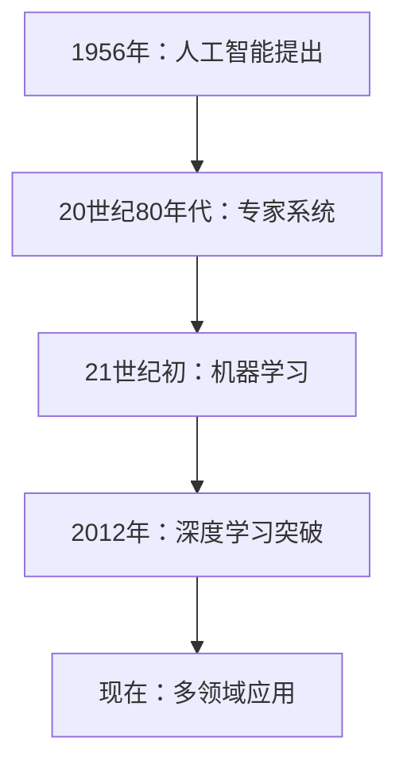

##### 1.1.2 人工智能创业的热潮

随着人工智能技术的快速进步，越来越多的创业公司投身于这一领域，希望能够抓住历史机遇，实现商业成功。根据统计，全球人工智能创业公司的数量在过去十年中呈现爆发式增长。特别是在美国、中国和欧洲等地，人工智能创业公司如雨后春笋般涌现。

人工智能创业的热潮主要体现在以下几个方面：

1. **企业需求的增加**：随着人工智能技术的不断成熟，越来越多的企业开始将其应用于各个领域，如金融、医疗、零售、制造等。企业对人工智能技术的需求推动了创业公司的发展。

2. **技术创新驱动**：人工智能技术的快速发展为创业公司提供了广阔的创新空间。许多创业公司通过技术创新，解决现实中的问题，从而获得市场认可。

3. **资本的热捧**：人工智能领域吸引了大量风险投资和政府资金的支持。资本的涌入为创业公司提供了充足的资金，使其能够快速研发和推广产品。

以下是一个简化的流程图，展示了人工智能创业的主要动力因素：

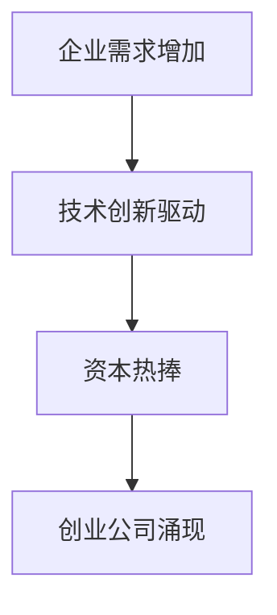

##### 1.1.3 企业需求的增加

企业对人工智能技术的需求不断增加，是推动人工智能创业的重要因素之一。随着人工智能技术的不断成熟，越来越多的企业开始将其应用于生产、运营、营销等各个方面，从而提高效率、降低成本、提升用户体验。

以下是一些企业对人工智能技术的主要需求：

1. **自动化与智能化生产**：人工智能技术可以用于生产过程的自动化和智能化，从而提高生产效率，降低生产成本。例如，机器学习算法可以用于预测设备故障，提前进行维护，避免生产中断。

2. **个性化服务与推荐**：人工智能技术可以帮助企业实现个性化服务与推荐。通过分析用户行为数据和偏好，企业可以为用户提供更符合其需求的产品和服务，从而提高用户满意度和忠诚度。

3. **数据分析与决策支持**：人工智能技术可以处理大量数据，为企业提供数据驱动的决策支持。例如，通过自然语言处理技术，企业可以自动化处理大量客户反馈，快速识别问题并进行改进。

以下是一个简化的流程图，展示了企业需求对人工智能创业的推动作用：

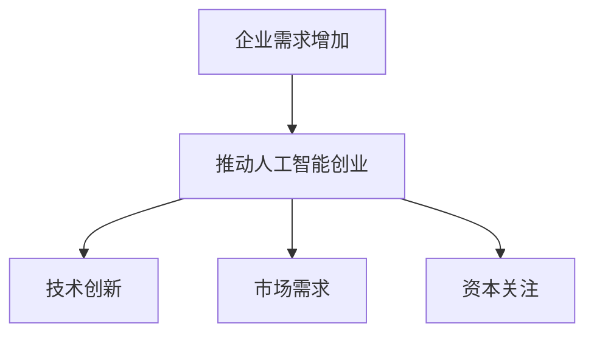

##### 1.1.4 技术创新驱动

技术创新是人工智能创业的核心驱动力。随着人工智能技术的不断进步，创业公司可以不断探索新的应用场景，开发出具有竞争力的产品。以下是一些技术创新对人工智能创业的推动作用：

1. **算法优化**：随着算法的优化，人工智能系统的效率和准确性得到了显著提升。例如，深度强化学习算法在游戏、机器人控制等领域的应用，使得人工智能系统能够更好地应对复杂环境。

2. **硬件进步**：随着硬件性能的提升，人工智能系统的计算能力和存储能力得到了极大的增强。例如，GPU（图形处理器）在深度学习训练中的应用，使得大规模模型训练变得更加高效。

3. **跨领域融合**：人工智能技术与其他领域的融合，开辟了新的应用场景。例如，人工智能与物联网（IoT）的结合，使得智能家居、智能交通等应用成为可能。

以下是一个简化的流程图，展示了技术创新对人工智能创业的推动作用：

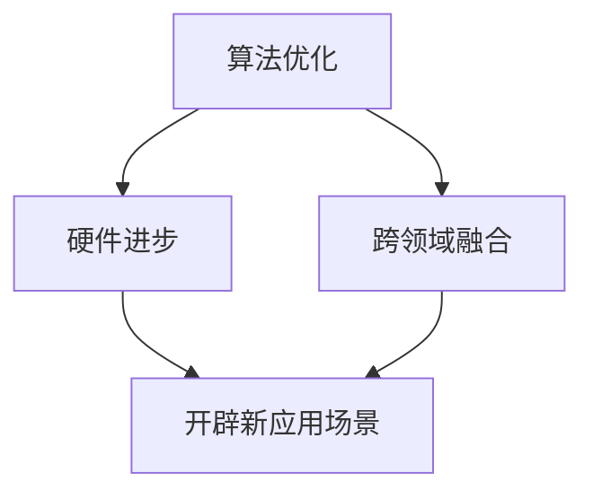

##### 1.1.5 政策支持与投资

政策支持和资本投资是推动人工智能创业的重要外部因素。以下是一些政策支持和资本投资对人工智能创业的促进作用：

1. **政策支持**：各国政府纷纷出台了一系列支持人工智能创新发展的政策。例如，中国政府发布了《新一代人工智能发展规划》，旨在推动人工智能技术的研发和应用。这些政策为创业公司提供了良好的发展环境和政策保障。

2. **资本投资**：风险投资机构和私募股权基金对人工智能领域的投资不断增加。这些资本为创业公司提供了充足的资金支持，帮助其进行技术研发和市场推广。

以下是一个简化的流程图，展示了政策支持和资本投资对人工智能创业的促进作用：

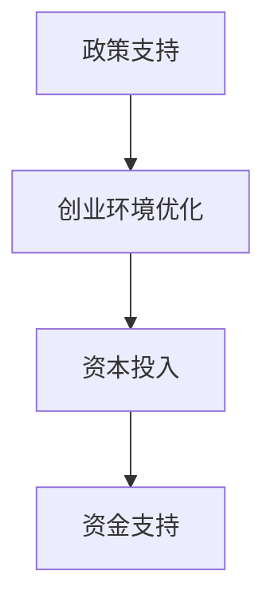

##### 1.1.6 市场竞争加剧

随着人工智能创业公司的增多，市场竞争也日益激烈。以下是一些市场竞争对人工智能创业的影响：

1. **技术竞争**：创业公司需要不断提升技术水平，以保持市场竞争力。例如，通过研发更先进的算法、优化硬件性能等手段，提高产品的效率和准确性。

2. **市场份额竞争**：创业公司需要争夺市场份额，以实现商业成功。例如，通过加大市场推广力度、提供更优质的产品和服务等手段，吸引更多用户。

3. **资本竞争**：在激烈的竞争中，创业公司需要获得足够的资本支持，以保持持续的研发和市场推广能力。例如，通过吸引更多的风险投资和政府资金支持，确保企业的稳定发展。

以下是一个简化的流程图，展示了市场竞争对人工智能创业的影响：

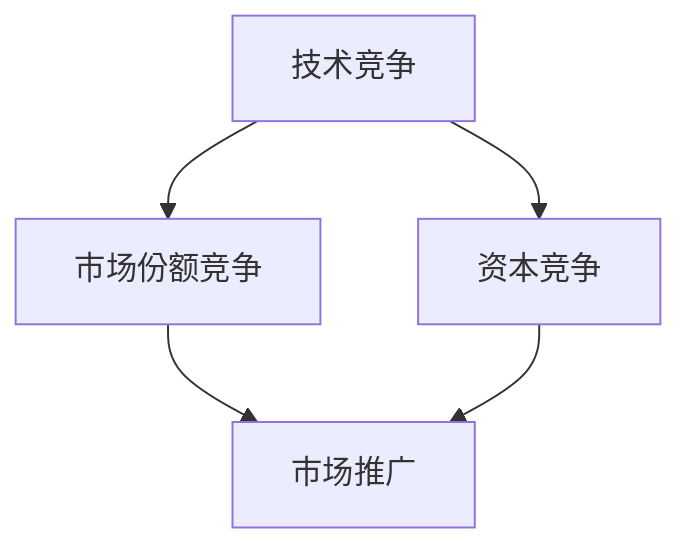

##### 1.1.7 创业项目的多样化

人工智能创业项目的多样化，为创业者提供了广阔的发展空间。以下是一些常见的创业项目类型：

1. **人工智能平台服务**：提供人工智能技术平台服务，如深度学习框架、自然语言处理API等，帮助企业快速构建人工智能应用。

2. **人工智能解决方案**：针对特定行业或领域，提供定制化的人工智能解决方案，如智能客服系统、智能监控系统等。

3. **人工智能硬件设备**：研发人工智能硬件设备，如智能机器人、智能音响等，实现人机交互和智能控制。

4. **人工智能内容创作**：利用人工智能技术进行内容创作，如智能写作、智能视频生成等。

以下是一个简化的流程图，展示了人工智能创业项目的多样化：

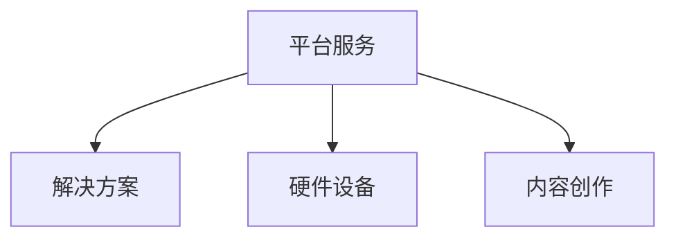

##### 1.1.8 商业模式创新

商业模式创新是人工智能创业的重要方向。以下是一些常见的商业模式创新：

1. **订阅模式**：通过提供持续订阅服务，实现长期稳定的收入。例如，提供在线人工智能课程订阅服务。

2. **平台模式**：建立人工智能技术平台，吸引第三方开发者和企业用户，实现多方共赢。例如，开发人工智能应用商店。

3. **生态圈模式**：构建人工智能产业生态圈，通过产业链上下游的整合，实现资源优化和协同发展。例如，建立人工智能产业园区。

以下是一个简化的流程图，展示了商业模式创新的多样化：

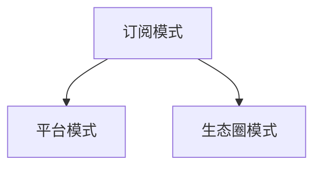

### 总结

人工智能创业的背景包括人工智能技术的快速发展、创业热潮、企业需求增加、技术创新驱动、政策支持与投资、市场竞争加剧、创业项目多样化和商业模式创新等因素。这些背景因素共同推动了人工智能创业的发展，为创业者提供了广阔的市场空间和机遇。然而，创业者也需要面对各种挑战，如技术迭代速度、数据隐私与安全、人才竞争等。只有通过不断创新和优化，才能在激烈的市场竞争中脱颖而出，实现创业成功。

#### 1.2 人工智能行业的市场分析

##### 1.2.1 人工智能行业发展趋势

人工智能（AI）行业正经历着前所未有的快速发展，其发展趋势主要体现在以下几个方面：

1. **技术成熟度的提升**：随着深度学习、自然语言处理、计算机视觉等核心技术的不断成熟，人工智能的应用范围日益扩大，从早期的实验室研究走向实际应用。例如，自动驾驶、智能家居、智能医疗等领域的应用案例越来越多，技术成熟度不断提升。

2. **应用场景的扩展**：人工智能技术的应用场景不断扩展，从传统的制造业、零售业、金融业等逐步渗透到医疗、教育、交通、能源等更多领域。随着技术的进步，人工智能在各个领域的应用将更加深入，解决实际问题能力更强。

3. **产业链的完善**：人工智能产业链逐渐完善，从硬件（如GPU、ASIC等）、软件（如AI算法、开发框架等）、数据（如数据采集、处理、分析等）到应用（如智能硬件、软件服务等）形成了一个完整的生态圈。产业链的完善为人工智能创业提供了更好的支持。

4. **跨界融合**：人工智能技术与其他领域的融合趋势明显，如物联网（IoT）、大数据、云计算等。跨界融合推动了人工智能技术的创新应用，为传统行业带来了新的发展机遇。

5. **全球化发展**：随着全球范围内对人工智能技术的关注和投入不断增加，人工智能行业呈现出全球化发展的趋势。各国纷纷制定人工智能发展战略，推动技术进步和应用推广，国际间的技术合作和竞争日益加剧。

以下是一个简化的流程图，展示了人工智能行业的发展趋势：

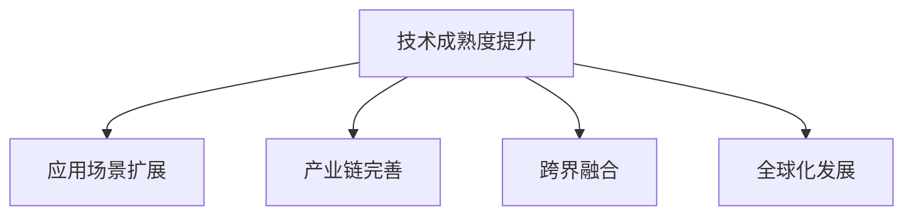

##### 1.2.2 人工智能行业市场规模及预测

人工智能行业的市场规模持续增长，根据市场研究机构的预测，未来几年内仍将保持高速增长态势。以下是一些关键数据和市场预测：

1. **全球市场规模**：根据市场研究机构的数据，2021年全球人工智能市场规模约为3900亿美元，预计到2025年将达到约1.2万亿美元，年复合增长率（CAGR）约为23%。

2. **中国市场**：中国是全球人工智能市场的重要参与国。根据中国信息通信研究院的预测，2021年中国人工智能市场规模约为4700亿元，预计到2025年将达到1.2万亿元，年复合增长率约为26%。

3. **细分市场规模**：在人工智能行业的细分市场中，计算机视觉、自然语言处理、机器学习等领域的市场规模增长迅速。例如，计算机视觉市场规模预计将从2021年的220亿美元增长到2025年的700亿美元，年复合增长率达到23%。

以下是一个简化的表格，展示了2021年和2025年全球和中国人工智能市场规模及预测：

| 年份 | 全球市场规模（亿美元） | 中国市场规模（亿元人民币） |
|------|----------------------|--------------------------|
| 2021 | 3900                 | 4700                     |
| 2025 | 12000                | 12000                    |

##### 1.2.3 人工智能行业竞争格局分析

人工智能行业的竞争格局正逐渐形成，主要参与者包括科技巨头、初创公司、传统企业等。以下是对这些参与者的分析：

1. **科技巨头**：如谷歌、亚马逊、微软、IBM等，凭借其在技术、资金、人才等方面的优势，在人工智能领域占据了领先地位。这些公司通过收购、合作、自主研发等方式，不断扩展其业务版图，形成了较强的市场竞争力。

2. **初创公司**：许多初创公司专注于特定领域的人工智能技术研究和应用，凭借创新的技术和灵活的商业模式，迅速崛起。这些公司虽然在规模上无法与科技巨头相比，但在某些细分市场上具有强大的竞争力。

3. **传统企业**：传统企业在数字化转型过程中，开始逐步引入人工智能技术，通过合作、并购等方式，加强与人工智能领域的初创公司和科技巨头的合作，以增强自身竞争力。

以下是一个简化的流程图，展示了人工智能行业的竞争格局：

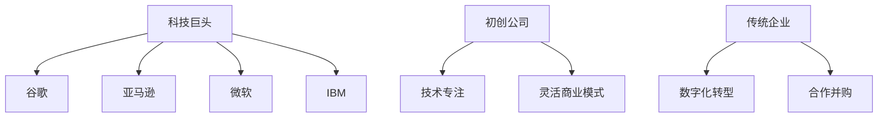

##### 1.2.4 人工智能行业的重要参与者

以下是一些在人工智能行业中具有重要影响力的公司、组织和研究机构：

1. **谷歌**：谷歌通过其旗下的DeepMind和Google AI等部门，在人工智能领域进行了大量的研究和应用，其技术实力和影响力在全球范围内处于领先地位。

2. **微软**：微软通过其Azure AI平台，提供了一系列人工智能服务和工具，帮助企业和开发者构建智能应用。

3. **亚马逊**：亚马逊通过其Alexa智能助手和AWS人工智能服务，在智能家居和云计算领域拥有强大的市场地位。

4. **IBM**：IBM通过其Watson人工智能系统，在医疗、金融、保险等领域进行了广泛的应用，并积极探索量子计算等前沿技术。

5. **OpenAI**：OpenAI是一家专注于人工智能研究的非营利组织，其研究成果在人工智能伦理、安全等方面具有重要意义。

6. **斯坦福大学**：斯坦福大学在人工智能领域拥有一流的研究团队和实验室，其研究成果在学术界和工业界都有广泛影响。

7. **麻省理工学院**：麻省理工学院的人工智能实验室（MIT CSAIL）是人工智能研究的领军机构之一，其研究成果在计算机视觉、自然语言处理等领域具有重大影响。

以下是一个简化的流程图，展示了人工智能行业的重要参与者及其影响力：

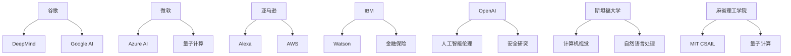

### 总结

通过对人工智能行业的市场分析，可以看出人工智能行业正处于快速发展阶段，技术成熟度不断提升，应用场景不断扩展，产业链逐渐完善，跨界融合趋势明显，全球化发展迅速。同时，全球和中国的人工智能市场规模持续增长，主要参与者包括科技巨头、初创公司和传统企业。这些趋势为人工智能创业者提供了广阔的市场空间和机遇，但也需要面对激烈的市场竞争和技术挑战。只有通过不断创新和优化，才能在人工智能行业中脱颖而出，实现创业成功。

### 第一部分：人工智能创业概述

#### 1.1 人工智能创业的背景

人工智能（AI）创业的背景离不开人工智能技术的迅猛发展和其对各行业深远影响的推动。以下从人工智能技术的快速发展、人工智能创业的热潮、企业需求的增加以及技术创新驱动等四个方面，详细阐述人工智能创业的背景。

##### 1.1.1 人工智能技术的快速发展

人工智能技术的快速发展是人工智能创业的基础。人工智能技术主要分为三大领域：机器学习、深度学习和自然语言处理。

1. **机器学习**：机器学习是通过算法使计算机从数据中学习并做出决策的技术。在20世纪50年代，机器学习开始萌芽，但受限于计算能力和数据质量，发展缓慢。直到21世纪初，随着互联网的发展，数据量剧增，机器学习开始迎来新的发展机遇。

2. **深度学习**：深度学习是一种基于人工神经网络的技术，通过多层神经网络对大量数据进行训练，从而实现复杂模式的识别和预测。2012年，深度学习在图像识别领域的突破性成果，使得人工智能技术得到了广泛关注和快速发展。

3. **自然语言处理（NLP）**：自然语言处理是使计算机能够理解和生成自然语言的技术。随着互联网的普及，大量的文本数据被生成和积累，为自然语言处理技术的发展提供了丰富的数据资源。

以下是一个简化的流程图，展示了人工智能技术快速发展的主要阶段和关键突破：

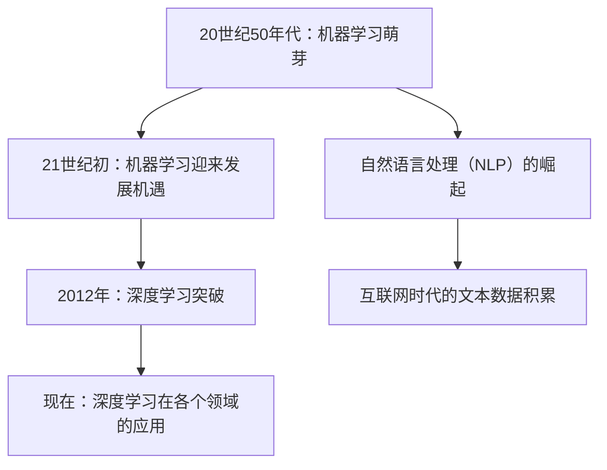

##### 1.1.2 人工智能创业的热潮

随着人工智能技术的快速发展，越来越多的创业公司投身于这一领域，试图通过创新的技术解决现实中的问题，从而获得商业成功。以下从企业需求的增加、技术创新驱动、资本的热捧等方面，详细阐述人工智能创业的热潮。

1. **企业需求的增加**：随着人工智能技术的不断成熟，越来越多的企业开始将其应用于各个领域，如金融、医疗、零售、制造等。企业对人工智能技术的需求推动了创业公司的发展。例如，在金融领域，人工智能技术可以用于风险评估、信用评分、欺诈检测等；在医疗领域，人工智能技术可以用于疾病诊断、药物研发等；在零售领域，人工智能技术可以用于智能推荐、客户服务优化等。

2. **技术创新驱动**：人工智能技术的快速发展为创业公司提供了广阔的创新空间。许多创业公司通过技术创新，解决现实中的问题，从而获得市场认可。例如，深度学习技术在图像识别、语音识别等领域的应用，使得相关创业公司在市场上脱颖而出。

3. **资本的热捧**：人工智能领域吸引了大量风险投资和政府资金的支持。资本的涌入为创业公司提供了充足的资金支持，帮助其进行技术研发和市场推广。例如，人工智能领域初创公司经常获得数百万甚至数千万美元的投资。

以下是一个简化的流程图，展示了人工智能创业热潮的主要动力因素：


##### 1.1.3 企业需求的增加

企业需求的增加是推动人工智能创业的重要因素。随着人工智能技术的不断成熟，企业在生产、运营、营销等各个方面对人工智能技术的需求日益增加。

1. **生产自动化与智能化**：人工智能技术可以帮助企业实现生产自动化和智能化，从而提高生产效率、降低生产成本。例如，通过机器学习算法进行设备故障预测和预防性维护，可以减少设备停机时间，提高生产稳定性。

2. **运营优化**：人工智能技术可以帮助企业优化运营流程，提高资源利用效率。例如，通过自然语言处理技术进行客户服务自动化，可以减少人工成本，提高客户满意度。

3. **营销智能化**：人工智能技术可以帮助企业实现个性化营销，提高营销效果。例如，通过机器学习算法分析用户行为数据，可以为用户提供个性化的产品推荐，提高转化率。

以下是一个简化的流程图，展示了企业需求对人工智能创业的推动作用：


##### 1.1.4 技术创新驱动

技术创新是人工智能创业的核心驱动力。随着人工智能技术的不断进步，创业公司可以不断探索新的应用场景，开发出具有竞争力的产品。以下从算法优化、硬件进步和跨领域融合三个方面，详细阐述技术创新驱动。

1. **算法优化**：随着算法的优化，人工智能系统的效率和准确性得到了显著提升。例如，深度强化学习算法在游戏、机器人控制等领域的应用，使得人工智能系统能够更好地应对复杂环境。

2. **硬件进步**：随着硬件性能的提升，人工智能系统的计算能力和存储能力得到了极大的增强。例如，GPU（图形处理器）在深度学习训练中的应用，使得大规模模型训练变得更加高效。

3. **跨领域融合**：人工智能技术与其他领域的融合，开辟了新的应用场景。例如，人工智能与物联网（IoT）的结合，使得智能家居、智能交通等应用成为可能。

以下是一个简化的流程图，展示了技术创新对人工智能创业的推动作用：


##### 1.1.5 政策支持与投资

政策支持和资本投资是推动人工智能创业的重要外部因素。以下从政策支持和资本投资两个方面，详细阐述其对人工智能创业的促进作用。

1. **政策支持**：各国政府纷纷出台了一系列支持人工智能创新发展的政策。例如，中国政府发布了《新一代人工智能发展规划》，旨在推动人工智能技术的研发和应用。这些政策为创业公司提供了良好的发展环境和政策保障。

2. **资本投资**：风险投资机构和私募股权基金对人工智能领域的投资不断增加。这些资本为创业公司提供了充足的资金支持，帮助其进行技术研发和市场推广。

以下是一个简化的流程图，展示了政策支持和资本投资对人工智能创业的促进作用：


##### 1.1.6 市场竞争加剧

随着人工智能创业公司的增多，市场竞争也日益激烈。以下从技术竞争、市场份额竞争和资本竞争三个方面，详细阐述市场竞争对人工智能创业的影响。

1. **技术竞争**：创业公司需要不断提升技术水平，以保持市场竞争力。例如，通过研发更先进的算法、优化硬件性能等手段，提高产品的效率和准确性。

2. **市场份额竞争**：创业公司需要争夺市场份额，以实现商业成功。例如，通过加大市场推广力度、提供更优质的产品和服务等手段，吸引更多用户。

3. **资本竞争**：在激烈的竞争中，创业公司需要获得足够的资本支持，以保持持续的研发和市场推广能力。例如，通过吸引更多的风险投资和政府资金支持，确保企业的稳定发展。

以下是一个简化的流程图，展示了市场竞争对人工智能创业的影响：


##### 1.1.7 创业项目的多样化

人工智能创业项目的多样化，为创业者提供了广阔的发展空间。以下从人工智能平台服务、人工智能解决方案、人工智能硬件设备和人工智能内容创作等方面，详细阐述人工智能创业项目的多样化。

1. **人工智能平台服务**：提供人工智能技术平台服务，如深度学习框架、自然语言处理API等，帮助企业快速构建人工智能应用。

2. **人工智能解决方案**：针对特定行业或领域，提供定制化的人工智能解决方案，如智能客服系统、智能监控系统等。

3. **人工智能硬件设备**：研发人工智能硬件设备，如智能机器人、智能音响等，实现人机交互和智能控制。

4. **人工智能内容创作**：利用人工智能技术进行内容创作，如智能写作、智能视频生成等。

以下是一个简化的流程图，展示了人工智能创业项目的多样化：


##### 1.1.8 商业模式创新

商业模式创新是人工智能创业的重要方向。以下从订阅模式、平台模式和生态圈模式等方面，详细阐述商业模式创新。

1. **订阅模式**：通过提供持续订阅服务，实现长期稳定的收入。例如，提供在线人工智能课程订阅服务。

2. **平台模式**：建立人工智能技术平台，吸引第三方开发者和企业用户，实现多方共赢。例如，开发人工智能应用商店。

3. **生态圈模式**：构建人工智能产业生态圈，通过产业链上下游的整合，实现资源优化和协同发展。例如，建立人工智能产业园区。

以下是一个简化的流程图，展示了商业模式创新的多样化：


### 总结

通过对人工智能创业背景的详细分析，可以看出人工智能创业的兴起是技术进步、市场需求、政策支持和资本投资等多重因素共同作用的结果。创业者在面临巨大机遇的同时，也需要应对激烈的市场竞争和技术挑战。只有通过不断创新和优化，才能在人工智能创业领域中脱颖而出，实现商业成功。

### 第二部分：人工智能产品定位与规划

#### 2.1 产品定位

产品定位是人工智能创业过程中至关重要的一环。正确的产品定位可以帮助企业明确目标市场，精准把握用户需求，从而提高市场竞争力。以下从产品市场定位的重要性、市场细分与目标客户分析以及竞品分析三个方面，详细探讨人工智能产品的定位。

##### 2.1.1 产品市场定位的重要性

产品市场定位的重要性在于它能够帮助企业明确自身在市场中的位置，从而制定有效的市场营销策略。具体来说，产品市场定位具有以下几个重要作用：

1. **明确目标市场**：产品定位有助于企业明确目标市场，即哪些用户群体是企业产品的潜在消费者。通过分析目标市场的需求、偏好和购买行为，企业可以更加精准地制定市场营销策略。

2. **提升品牌形象**：产品定位能够帮助企业在用户心中建立清晰的品牌形象，从而提高品牌知名度和美誉度。通过明确产品的独特卖点和核心价值，企业可以在竞争激烈的市场中脱颖而出。

3. **优化资源配置**：产品定位有助于企业优化资源配置，即根据目标市场的需求，合理分配研发、生产和营销等资源。这样可以使企业在有限的资源下，最大限度地提高市场竞争力。

4. **提高用户满意度**：产品定位能够帮助企业更好地满足用户需求，从而提高用户满意度和忠诚度。通过深入了解目标用户的需求和痛点，企业可以开发出更加符合用户期望的产品。

##### 2.1.2 市场细分与目标客户分析

市场细分是指将整体市场划分为若干个具有相似需求的子市场，以便企业能够更有效地满足不同用户群体的需求。以下从市场细分的方法和目标客户分析两个方面，详细探讨市场细分与目标客户分析。

1. **市场细分的方法**：

市场细分的方法主要包括以下几种：

- **地理细分**：根据用户的地理位置进行细分，如城市、地区、国家等。这种方法适用于地理环境对产品使用有显著影响的行业。

- **人口细分**：根据用户的人口统计特征进行细分，如年龄、性别、收入、职业、教育程度等。这种方法适用于用户特征对产品需求有显著影响的行业。

- **行为细分**：根据用户的行为特征进行细分，如购买习惯、使用习惯、品牌忠诚度等。这种方法适用于用户行为对产品需求有显著影响的行业。

- **心理细分**：根据用户的心理特征进行细分，如生活方式、价值观念、兴趣爱好等。这种方法适用于用户心理特征对产品需求有显著影响的行业。

以下是一个简化的流程图，展示了市场细分的方法：

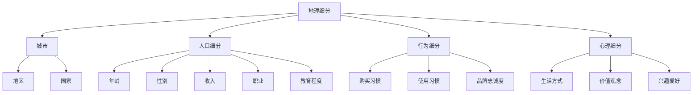

2. **目标客户分析**：

在市场细分的基础上，企业需要对各个子市场中的目标客户进行深入分析，以了解他们的需求、偏好和行为模式。以下是从几个方面对目标客户进行分析：

- **需求分析**：通过市场调研和用户访谈等方法，了解目标客户的需求和痛点，从而开发出能够满足他们需求的产品。

- **偏好分析**：通过用户行为数据和用户反馈，分析目标客户的偏好，如喜欢的产品特性、品牌偏好等，从而在产品设计和推广中加以利用。

- **行为模式分析**：通过数据分析，了解目标客户的购买行为、使用习惯等，从而优化产品功能和用户体验。

- **竞争分析**：分析竞争对手的目标客户群体，了解他们在产品功能和用户体验上的优势与不足，从而在产品定位中加以借鉴和改进。

以下是一个简化的流程图，展示了目标客户分析的过程：

```mermaid
graph TD
A[需求分析] --> B[市场调研]
B --> C[用户访谈]
B --> D[问卷调研]
A --> E[偏好分析]
E --> F[用户行为数据]
E --> G[用户反馈]
A --> H[行为模式分析]
H --> I[数据分析]
H --> J[用户调研]
A --> K[竞争分析]
K --> L[竞争对手分析]
K --> M[竞争对手产品分析]
```

##### 2.1.3 竞品分析

竞品分析是产品定位过程中不可或缺的一环。通过对竞争对手的产品、优势和劣势进行深入分析，企业可以更好地了解市场状况，从而制定出更具竞争力的产品策略。以下从竞品分析的方法和内容两个方面，详细探讨竞品分析。

1. **竞品分析的方法**：

竞品分析的方法主要包括以下几种：

- **功能对比**：比较竞品和自家产品的功能差异，了解竞品的功能优势和不足。

- **用户体验对比**：分析竞品的用户体验，包括界面设计、交互流程、用户反馈等，了解竞品的用户体验优势。

- **市场策略对比**：分析竞品的市场推广策略，包括广告投放、促销活动、品牌形象等，了解竞品的市场推广优势。

- **用户评价对比**：通过用户评价和评论，了解竞品的用户口碑和用户满意度，从而为产品改进提供参考。

以下是一个简化的流程图，展示了竞品分析的方法：

```mermaid
graph TD
A[功能对比] --> B[功能差异]
A --> C[用户体验对比]
C --> D[界面设计]
C --> E[交互流程]
C --> F[用户反馈]
A --> G[市场策略对比]
G --> H[广告投放]
G --> I[促销活动]
G --> J[品牌形象]
A --> K[用户评价对比]
K --> L[用户口碑]
K --> M[用户满意度]
```

2. **竞品分析的内容**：

竞品分析的内容主要包括以下几个方面：

- **竞品特点**：分析竞品的产品特点，包括功能、性能、价格等。

- **竞品优势**：找出竞品的优势和优势所在，如技术创新、用户体验、市场推广等。

- **竞品劣势**：找出竞品的劣势和不足，如功能缺失、用户体验差、市场推广不足等。

- **竞品市场策略**：分析竞品的市场推广策略，了解其市场定位、目标客户、推广渠道等。

- **竞品用户评价**：通过用户评价和评论，了解竞品的用户口碑和用户满意度。

以下是一个简化的表格，展示了竞品分析的内容：

| 竞品分析内容 | 说明 |
| ------------ | ---- |
| 竞品特点 | 竞品的产品特点，如功能、性能、价格等 |
| 竞品优势 | 竞品的优势和优势所在，如技术创新、用户体验、市场推广等 |
| 竞品劣势 | 竞品的劣势和不足，如功能缺失、用户体验差、市场推广不足等 |
| 市场策略 | 竞品的市场推广策略，如市场定位、目标客户、推广渠道等 |
| 用户评价 | 用户对竞品的评价和评论，了解竞品的用户口碑和用户满意度 |

通过对竞品的深入分析，企业可以了解自身产品的优势和不足，从而在产品定位和市场营销策略上做出相应的调整，提高市场竞争力。

### 总结

产品定位是人工智能创业过程中至关重要的一环。通过明确目标市场、进行市场细分与目标客户分析以及竞品分析，企业可以更好地了解市场状况和用户需求，从而制定出更具竞争力的产品策略。只有通过科学的产品定位，企业才能在激烈的市场竞争中脱颖而出，实现商业成功。

#### 2.2 产品规划

在人工智能创业的过程中，产品规划是确保产品成功上市和满足市场需求的关键步骤。产品规划不仅包括产品功能的规划，还涉及产品的迭代规划和用户体验设计。以下从产品规划流程、产品功能规划以及产品迭代规划三个方面，详细探讨人工智能产品的规划过程。

##### 2.2.1 产品规划流程

产品规划流程是确保产品从概念阶段到最终上市的全过程有条不紊进行的关键。以下是一个简化的产品规划流程：

1. **市场调研**：通过市场调研，了解市场需求、竞争状况以及用户痛点。市场调研的方法包括问卷调查、用户访谈、数据分析等。

2. **需求分析**：根据市场调研结果，分析用户需求，确定产品的核心功能和辅助功能。

3. **产品定位**：明确产品的目标市场、用户群体和产品特色，确保产品能够在目标市场中占据一席之地。

4. **产品规划文档**：编写详细的产品规划文档，包括产品功能列表、用户体验设计、技术需求等，作为后续开发、测试和发布的依据。

5. **产品设计**：进行产品的用户体验设计、界面设计、交互设计等，确保产品具有良好的用户体验。

6. **开发计划**：制定开发计划，明确开发进度、任务分配、资源需求等，确保产品按时上线。

7. **测试与反馈**：进行产品测试，包括功能测试、性能测试、用户体验测试等，根据用户反馈进行产品优化。

8. **产品发布**：在产品测试完成后，正式发布产品，并进行市场推广。

以下是一个简化的流程图，展示了产品规划流程：

```mermaid
graph TD
A[市场调研] --> B[需求分析]
B --> C[产品定位]
C --> D[产品规划文档]
D --> E[产品设计]
E --> F[开发计划]
F --> G[测试与反馈]
G --> H[产品发布]
```

##### 2.2.2 产品功能规划

产品功能规划是产品规划中的关键环节，它直接影响到产品的核心竞争力和用户体验。以下从产品功能规划的具体步骤和方法，详细探讨产品功能规划。

1. **核心功能规划**：核心功能是产品最基本的功能，是满足用户核心需求的关键。例如，对于一个智能语音助手产品，核心功能包括语音识别、语音合成、自然语言处理等。在规划核心功能时，需要考虑以下因素：

   - **用户需求**：通过市场调研和用户访谈，了解用户的需求和痛点，确保核心功能能够解决用户的关键问题。
   - **技术可行性**：评估现有技术是否能够实现这些功能，以及所需的研发成本和技术难度。
   - **市场竞争力**：分析竞争对手的产品功能，确保核心功能具有竞争力，能够吸引用户。

2. **辅助功能规划**：辅助功能是产品为了增强用户体验和功能丰富度而添加的辅助功能。例如，对于智能语音助手产品，辅助功能可能包括音乐播放、天气查询、日程管理等。在规划辅助功能时，需要考虑以下因素：

   - **用户体验**：辅助功能应能够提升用户体验，使产品更加便捷和易用。
   - **技术成本**：评估辅助功能的技术实现成本，确保在合理的技术投入下实现功能。
   - **市场需求**：分析市场需求，确定哪些辅助功能具有广泛的市场需求，从而提升产品的市场竞争力。

3. **功能优先级排序**：在产品功能规划过程中，需要对核心功能和辅助功能进行优先级排序。优先级排序的依据包括：

   - **用户需求**：优先实现用户最迫切需求的功能。
   - **技术难度**：优先实现技术难度较低的功能，以便更快地推出产品。
   - **市场竞争力**：优先实现具有市场竞争力、能够吸引用户的功能。

以下是一个简化的流程图，展示了产品功能规划的步骤：

```mermaid
graph TD
A[核心功能规划] --> B[用户需求分析]
B --> C[技术可行性评估]
C --> D[市场竞争力分析]
A --> E[辅助功能规划]
E --> F[用户体验评估]
E --> G[技术成本评估]
E --> H[市场需求分析]
A --> I[功能优先级排序]
I --> J[优先级排序依据]
```

##### 2.2.3 产品迭代规划

产品迭代规划是确保产品能够持续满足市场需求和用户期望的关键。以下从产品迭代规划的具体步骤和方法，详细探讨产品迭代规划。

1. **用户反馈收集**：在产品发布后，定期收集用户反馈，包括功能建议、使用体验、问题报告等。用户反馈是产品迭代的重要依据。

2. **问题分析与定位**：根据用户反馈，分析产品存在的问题和不足，确定需要解决的问题的优先级。

3. **功能迭代计划**：根据问题分析和定位的结果，制定功能迭代计划，包括新增功能、功能优化、功能修复等。

4. **性能优化**：在迭代过程中，对产品的性能进行优化，包括速度、稳定性、安全性等方面的提升。

5. **用户体验优化**：对产品的用户体验进行持续优化，包括界面设计、交互流程、使用流程等方面的改进。

6. **迭代计划执行**：按照迭代计划，进行功能迭代、性能优化和用户体验优化，确保产品能够持续满足用户需求。

7. **迭代评估与反馈**：在每次迭代完成后，对迭代效果进行评估，根据用户反馈进行进一步优化。

以下是一个简化的流程图，展示了产品迭代规划的步骤：

```mermaid
graph TD
A[用户反馈收集] --> B[问题分析与定位]
B --> C[功能迭代计划]
C --> D[性能优化]
C --> E[用户体验优化]
A --> F[迭代计划执行]
F --> G[迭代评估与反馈]
```

##### 2.2.4 用户体验设计原则

用户体验设计（User Experience Design，简称UXD）是确保产品能够满足用户需求、提升用户满意度和忠诚度的关键。以下从用户体验设计的基本原则和方法，详细探讨用户体验设计。

1. **用户需求导向**：用户体验设计的核心是满足用户需求，因此在进行设计时，需要深入了解用户需求、行为和痛点，确保产品设计能够解决用户的关键问题。

2. **简洁性**：简洁性是用户体验设计的重要原则，通过简洁的设计，降低用户的学习成本，提升产品的易用性。

3. **易用性**：易用性是用户体验设计的核心目标，确保产品操作简单、直观，用户能够快速上手并使用。

4. **一致性**：一致性是用户体验设计的重要原则，包括界面风格、交互流程、信息呈现等方面的一致性，提升用户的操作体验。

5. **可访问性**：可访问性是指产品应该能够被所有用户（包括残障人士）访问和使用，确保产品的包容性。

6. **情感化设计**：情感化设计是通过设计激发用户的情感反应，提升用户的情感体验，从而增强产品的吸引力。

以下是一个简化的流程图，展示了用户体验设计的基本原则：

```mermaid
graph TD
A[用户需求导向] --> B[满足用户需求]
B --> C[简洁性]
B --> D[易用性]
A --> E[一致性]
E --> F[界面风格一致性]
E --> G[交互流程一致性]
A --> H[可访问性]
H --> I[残障人士访问]
A --> J[情感化设计]
J --> K[激发情感反应]
```

##### 2.2.5 界面设计技巧

界面设计（User Interface Design，简称UID）是用户体验设计的重要组成部分，直接影响到用户对产品的第一印象和操作体验。以下从界面设计的基本要素和最佳实践，详细探讨界面设计技巧。

1. **基本要素**：

   - **颜色**：颜色是界面设计的重要因素，能够影响用户的心情和情感。合适的颜色搭配能够提升界面的美观度和用户体验。
   - **字体**：字体是界面设计的基础，影响用户的阅读体验。选择合适的字体，确保界面的易读性。
   - **图标**：图标是界面的视觉元素，能够快速传达信息。设计清晰、简洁、易于理解的图标，提升用户的操作体验。
   - **布局**：布局是界面设计的关键，决定界面的结构性和易用性。采用合理的布局，确保界面的美观和操作便捷。
   - **导航**：导航是用户在界面中导航的关键，包括菜单、按钮等。设计直观、清晰的导航，提升用户的操作效率。

2. **最佳实践**：

   - **响应式设计**：响应式设计能够适应不同设备尺寸和屏幕分辨率，提升用户体验。
   - **视觉层次**：通过视觉层次，区分界面中的重要信息和次要信息，提升界面的可读性。
   - **一致性**：保持界面风格、交互流程和信息呈现的一致性，提升用户体验。
   - **用户反馈**：提供及时的反馈，告知用户操作结果，提升用户的操作体验。
   - **动态效果**：适当地使用动态效果，提升界面的趣味性和用户体验。

以下是一个简化的流程图，展示了界面设计的基本要素和最佳实践：

```mermaid
graph TD
A[颜色] --> B[色彩搭配]
B --> C[美观度]
A --> D[字体]
D --> E[易读性]
A --> F[图标]
F --> G[信息传达]
A --> H[布局]
H --> I[结构性]
H --> J[操作便捷]
A --> K[导航]
K --> L[菜单]
K --> M[按钮]
B --> N[视觉层次]
N --> O[重要信息]
N --> P[次要信息]
A --> Q[响应式设计]
Q --> R[适应不同设备]
Q --> S[屏幕分辨率]
A --> T[用户反馈]
T --> U[操作结果]
A --> V[动态效果]
V --> W[趣味性]
```

##### 2.2.6 交互设计方法

交互设计（Interaction Design，简称XD）是用户体验设计的重要组成部分，涉及到用户与产品之间的交互过程。以下从交互设计的基本原则和方法，详细探讨交互设计方法。

1. **基本原则**：

   - **用户为中心**：交互设计应以用户为中心，满足用户的需求和习惯，提升用户体验。
   - **简单直观**：交互设计应简单直观，降低用户的学习成本，提升用户的操作效率。
   - **一致性**：交互设计应保持一致性，包括界面风格、交互流程和信息呈现等，提升用户的操作体验。
   - **可控性**：交互设计应提供可控性，确保用户能够轻松地进行操作和调整。
   - **反馈及时**：交互设计应提供及时反馈，告知用户操作结果，提升用户的操作体验。
   - **适应性**：交互设计应具备适应性，能够适应不同的用户群体和使用场景。

2. **方法**：

   - **用户研究**：通过用户研究，了解用户的需求、行为和痛点，为交互设计提供依据。
   - **用户访谈**：通过用户访谈，深入了解用户的需求和意见，为交互设计提供参考。
   - **用户观察**：通过用户观察，了解用户在实际使用过程中的操作习惯和问题，为交互设计提供改进方向。
   - **原型设计**：通过原型设计，构建产品的交互原型，进行用户测试和反馈，不断优化交互设计。
   - **低保真原型**：低保真原型用于快速验证交互设计的基本框架和功能，适合早期阶段的设计。
   - **高保真原型**：高保真原型用于展示产品的最终交互效果，适合后期阶段的设计。
   - **用户测试**：通过用户测试，验证交互设计的有效性，收集用户的反馈和建议，为改进交互设计提供依据。
   - **可用性测试**：通过可用性测试，评估产品的易用性和用户体验，发现潜在的问题和改进点。

以下是一个简化的流程图，展示了交互设计的基本原则和方法：

```mermaid
graph TD
A[用户为中心] --> B[满足用户需求]
B --> C[简单直观]
B --> D[一致性]
A --> E[可控性]
E --> F[操作自由]
A --> G[反馈及时]
G --> H[操作结果]
A --> I[适应性]
I --> J[适应不同用户]
A --> K[用户研究]
K --> L[需求分析]
K --> M[行为分析]
A --> N[用户访谈]
N --> O[需求反馈]
A --> P[用户观察]
P --> Q[操作习惯]
P --> R[问题识别]
A --> S[原型设计]
S --> T[低保真原型]
S --> U[高保真原型]
A --> V[用户测试]
V --> W[交互有效性]
V --> X[反馈收集]
A --> Y[可用性测试]
Y --> Z[易用性评估]
Y --> AA[改进点识别]
```

##### 2.2.7 产品功能规划案例分析

以下通过一个实际案例，详细探讨产品功能规划的过程和方法。

**案例背景**：某人工智能创业公司计划开发一款智能语音助手产品，旨在为用户提供便捷的语音交互服务。

1. **市场调研**：通过对市场进行调研，发现用户对智能语音助手的需求主要集中在以下几个方面：

   - **语音识别**：准确识别用户的语音指令。
   - **语音合成**：自然流畅地合成语音回应。
   - **自然语言处理**：理解用户的自然语言表达，进行智能对话。
   - **智能推荐**：根据用户偏好推荐相关内容。
   - **日程管理**：管理用户的日程安排。
   - **音乐播放**：播放用户喜欢的音乐。

2. **需求分析**：根据市场调研结果，分析用户需求，确定产品的核心功能和辅助功能。

   - **核心功能**：语音识别、语音合成、自然语言处理、智能推荐。
   - **辅助功能**：日程管理、音乐播放。

3. **功能优先级排序**：根据用户需求和技术可行性，对功能进行优先级排序。

   - **语音识别**：技术成熟度较高，用户需求强烈，优先开发。
   - **语音合成**：技术成熟度较高，用户需求强烈，优先开发。
   - **自然语言处理**：技术成熟度较高，用户需求强烈，优先开发。
   - **智能推荐**：技术成熟度较高，用户需求强烈，优先开发。
   - **日程管理**：技术成熟度较高，用户需求较强，次优先开发。
   - **音乐播放**：技术成熟度较高，用户需求一般，次优先开发。

4. **功能详细规划**：

   - **语音识别**：实现准确高效的语音识别，支持多语种。
   - **语音合成**：实现自然流畅的语音合成，支持多种音色。
   - **自然语言处理**：实现智能对话功能，支持问答和指令处理。
   - **智能推荐**：根据用户偏好推荐相关内容，提升用户体验。
   - **日程管理**：实现日程安排和提醒功能，方便用户管理时间。
   - **音乐播放**：实现音乐播放功能，提供丰富的音乐资源。

5. **迭代规划**：在产品发布后，根据用户反馈和市场需求，逐步完善和优化产品功能。

   - **迭代1**：发布核心功能，实现语音识别、语音合成、自然语言处理和智能推荐。
   - **迭代2**：优化语音识别和语音合成，提高准确性和流畅度。
   - **迭代3**：增加日程管理和音乐播放功能，提升产品的实用性。
   - **迭代4**：根据用户反馈，进一步优化功能和使用体验。

通过以上案例，可以看出产品功能规划的关键在于深入了解用户需求，合理排序功能优先级，并制定详细的迭代规划。只有这样，才能确保产品在满足用户需求的同时，不断提升市场竞争力和用户体验。

### 总结

产品规划是人工智能创业过程中不可或缺的重要环节。通过详细的产品规划流程、功能规划和迭代规划，企业可以确保产品能够满足市场需求、提升用户满意度，从而在竞争激烈的市场中脱颖而出。同时，用户体验设计原则和界面设计技巧的运用，能够进一步优化产品的易用性和用户满意度。只有通过科学的产品规划，人工智能创业企业才能在市场上取得成功。

### 用户体验设计原则

用户体验设计（User Experience Design，简称UXD）是确保产品能够满足用户需求、提升用户满意度和忠诚度的关键。以下从用户体验设计的重要性、用户体验设计原则以及用户体验设计方法三个方面，详细探讨用户体验设计。

##### 4.1.1 用户体验设计的重要性

用户体验设计的重要性体现在以下几个方面：

1. **提升用户满意度**：良好的用户体验能够提升用户对产品的满意度，增加用户对产品的忠诚度。用户满意度是产品成功的重要因素之一。

2. **降低用户学习成本**：通过简洁直观的设计，降低用户的学习成本，使用户能够快速上手并使用产品。降低学习成本能够提高用户的使用效率。

3. **提高用户留存率**：良好的用户体验能够提高用户对产品的留存率，减少用户流失。用户留存率是衡量产品成功的重要指标之一。

4. **增加用户口碑**：良好的用户体验能够通过用户口碑传播，提升产品的品牌形象和市场竞争力。

5. **优化产品功能**：用户体验设计能够帮助发现产品功能上的不足，从而优化产品功能，提升产品的整体性能。

6. **提升产品价值**：通过用户体验设计，提升产品的价值和竞争力，为企业带来更大的商业价值。

以下是一个简化的流程图，展示了用户体验设计的重要性：

```mermaid
graph TD
A[提升用户满意度] --> B[增加用户忠诚度]
A --> C[降低学习成本]
A --> D[提高留存率]
A --> E[增加用户口碑]
A --> F[优化产品功能]
A --> G[提升产品价值]
```

##### 4.1.2 用户体验设计原则

用户体验设计原则是确保产品设计能够满足用户需求、提升用户体验的基本原则。以下从用户需求导向、简洁性、易用性、一致性、可访问性和情感化设计六个方面，详细阐述用户体验设计原则。

1. **用户需求导向**：

用户需求导向是用户体验设计的核心原则。在进行设计时，应深入了解用户需求、行为和痛点，确保产品设计能够解决用户的关键问题。以下是从几个方面进行用户需求导向的设计：

- **用户调研**：通过用户调研，了解用户的需求和痛点，为设计提供依据。
- **用户访谈**：通过用户访谈，深入了解用户的需求和意见，为设计提供参考。
- **用户观察**：通过用户观察，了解用户在实际使用过程中的行为和问题，为设计提供改进方向。
- **用户测试**：通过用户测试，验证设计是否符合用户需求，收集用户的反馈和建议，为改进设计提供依据。

以下是一个简化的流程图，展示了用户需求导向的设计方法：

```mermaid
graph TD
A[用户调研] --> B[了解需求]
A --> C[用户访谈]
C --> D[用户意见]
A --> E[用户观察]
E --> F[行为分析]
A --> G[用户测试]
G --> H[反馈收集]
```

2. **简洁性**：

简洁性是用户体验设计的重要原则之一。通过简洁的设计，降低用户的学习成本，提升产品的易用性。以下是从几个方面进行简洁性设计：

- **去除冗余**：去除不必要的元素和功能，简化界面设计。
- **突出重点**：通过视觉和交互设计，突出重点信息和功能，使用户能够快速找到所需内容。
- **减少操作步骤**：通过优化交互流程，减少用户的操作步骤，提高操作效率。

以下是一个简化的流程图，展示了简洁性设计的方法：

```mermaid
graph TD
A[去除冗余] --> B[简化界面]
A --> C[突出重点]
C --> D[视觉设计]
C --> E[交互设计]
A --> F[减少操作步骤]
F --> G[优化流程]
```

3. **易用性**：

易用性是用户体验设计的核心目标之一。确保产品操作简单、直观，用户能够快速上手并使用产品。以下是从几个方面进行易用性设计：

- **直观性**：通过直观的界面设计，使用户能够快速理解产品的功能和操作方式。
- **一致性**：保持界面风格、交互流程和信息呈现的一致性，使用户能够轻松地进行操作。
- **可访问性**：确保产品能够被所有用户（包括残障人士）访问和使用。

以下是一个简化的流程图，展示了易用性设计的方法：

```mermaid
graph TD
A[直观性] --> B[界面设计]
B --> C[视觉设计]
B --> D[交互设计]
A --> E[一致性]
E --> F[界面风格]
E --> G[交互流程]
E --> H[信息呈现]
A --> I[可访问性]
I --> J[无障碍设计]
```

4. **一致性**：

一致性是用户体验设计的重要原则之一。通过保持界面风格、交互流程和信息呈现的一致性，提升用户的操作体验。以下是从几个方面进行一致性设计：

- **界面风格**：保持统一的颜色、字体、图标等视觉元素，提升界面的整体美感。
- **交互流程**：保持统一的交互流程，确保用户在操作不同功能时，能够感受到一致性。
- **信息呈现**：保持统一的信息呈现方式，确保用户能够快速找到所需信息。

以下是一个简化的流程图，展示了一致性设计的方法：

```mermaid
graph TD
A[界面风格] --> B[颜色]
B --> C[字体]
B --> D[图标]
A --> E[交互流程]
E --> F[导航]
E --> G[操作流程]
A --> H[信息呈现]
H --> I[布局]
H --> J[表格]
```

5. **可访问性**：

可访问性是指产品应该能够被所有用户（包括残障人士）访问和使用。以下是从几个方面进行可访问性设计：

- **无障碍设计**：确保产品符合无障碍设计标准，如盲人可用的语音输出、色盲友好的颜色选择等。
- **辅助功能**：提供辅助功能，如放大镜、屏幕阅读器等，帮助残障人士使用产品。

以下是一个简化的流程图，展示了可访问性设计的方法：

```mermaid
graph TD
A[无障碍设计] --> B[语音输出]
B --> C[盲人可用]
A --> D[色盲友好]
D --> E[颜色选择]
A --> F[辅助功能]
F --> G[放大镜]
F --> H[屏幕阅读器]
```

6. **情感化设计**：

情感化设计是通过设计激发用户的情感反应，提升用户的情感体验，从而增强产品的吸引力。以下是从几个方面进行情感化设计：

- **情感共鸣**：通过设计元素和交互方式，激发用户的情感共鸣，提升用户的情感体验。
- **故事化设计**：通过故事化设计，增强产品的趣味性和用户参与度。
- **个性化设计**：通过个性化设计，满足用户的个性化需求，提升用户的情感体验。

以下是一个简化的流程图，展示了情感化设计的方法：

```mermaid
graph TD
A[情感共鸣] --> B[设计元素]
B --> C[视觉设计]
B --> D[交互设计]
A --> E[故事化设计]
E --> F[故事叙述]
E --> G[用户体验]
A --> H[个性化设计]
H --> I[用户偏好]
H --> J[定制化]
```

##### 4.1.3 用户体验设计方法

用户体验设计方法包括用户研究、用户访谈、用户观察、原型设计、用户测试和可用性测试等。以下从这些方法的基本概念和应用场景，详细探讨用户体验设计方法。

1. **用户研究**：

用户研究是通过多种方法，深入了解用户需求、行为和痛点，为产品设计提供依据。用户研究的方法包括问卷调查、访谈、观察等。以下是一个简化的用户研究流程：

- **确定研究目标**：明确研究的目标和问题。
- **设计研究工具**：设计问卷调查、访谈大纲等研究工具。
- **收集数据**：通过问卷调查、访谈等方式收集用户数据。
- **分析数据**：对收集到的数据进行分析，提炼用户需求和行为模式。
- **报告和反馈**：撰写用户研究报告，向设计团队提供反馈。

以下是一个简化的流程图，展示了用户研究的方法：

```mermaid
graph TD
A[确定研究目标] --> B[设计研究工具]
B --> C[问卷调查]
B --> D[访谈大纲]
A --> E[收集数据]
E --> F[用户数据]
A --> G[分析数据]
G --> H[用户需求]
G --> I[行为模式]
A --> J[报告和反馈]
```

2. **用户访谈**：

用户访谈是通过与用户进行面对面交流，深入了解用户需求、意见和反馈，为产品设计提供参考。以下是一个简化的用户访谈流程：

- **确定访谈目标**：明确访谈的目标和问题。
- **准备访谈大纲**：设计访谈大纲，列出访谈问题。
- **进行访谈**：与用户进行面对面交流，记录访谈内容。
- **分析访谈内容**：对访谈内容进行分析，提炼用户需求和意见。
- **撰写访谈报告**：撰写访谈报告，向设计团队提供反馈。

以下是一个简化的流程图，展示了用户访谈的方法：

```mermaid
graph TD
A[确定访谈目标] --> B[准备访谈大纲]
B --> C[访谈问题]
A --> D[进行访谈]
D --> E[访谈内容]
A --> F[分析访谈内容]
F --> G[用户需求]
F --> H[意见反馈]
A --> I[撰写访谈报告]
```

3. **用户观察**：

用户观察是通过观察用户在实际使用过程中的行为和操作，了解用户的需求、行为模式和痛点，为产品设计提供改进方向。以下是一个简化的用户观察流程：

- **确定观察目标**：明确观察的目标和问题。
- **准备观察工具**：准备观察工具，如观察日志、录音设备等。
- **进行观察**：在实际使用场景中观察用户行为，记录观察结果。
- **分析观察结果**：对观察结果进行分析，提炼用户需求和行为模式。
- **撰写观察报告**：撰写观察报告，向设计团队提供反馈。

以下是一个简化的流程图，展示了用户观察的方法：

```mermaid
graph TD
A[确定观察目标] --> B[准备观察工具]
B --> C[观察日志]
B --> D[录音设备]
A --> E[进行观察]
E --> F[观察结果]
A --> G[分析观察结果]
G --> H[用户需求]
G --> I[行为模式]
A --> J[撰写观察报告]
```

4. **原型设计**：

原型设计是通过创建产品的原型，验证设计的可行性和用户体验，为产品设计提供参考。以下是一个简化的原型设计流程：

- **确定原型设计目标**：明确原型的目标和功能。
- **设计原型界面**：设计原型的界面布局和交互流程。
- **制作原型**：使用原型设计工具（如Sketch、Axure等）制作原型。
- **用户测试**：通过用户测试，验证原型的可行性和用户体验。
- **迭代优化**：根据用户测试结果，对原型进行迭代优化。

以下是一个简化的流程图，展示了原型设计的方法：

```mermaid
graph TD
A[确定原型设计目标] --> B[设计原型界面]
B --> C[界面布局]
B --> D[交互流程]
A --> E[制作原型]
E --> F[原型设计工具]
A --> G[用户测试]
G --> H[可行性验证]
G --> I[用户体验]
A --> J[迭代优化]
```

5. **用户测试**：

用户测试是通过让用户实际使用产品，评估产品的可用性、易用性和用户体验，为产品设计提供改进依据。以下是一个简化的用户测试流程：

- **确定测试目标**：明确测试的目标和问题。
- **设计测试任务**：设计测试任务，模拟用户的实际使用场景。
- **招募测试用户**：招募具有代表性的测试用户。
- **进行测试**：让测试用户实际使用产品，记录测试结果。
- **分析测试结果**：对测试结果进行分析，提炼用户需求和问题。
- **撰写测试报告**：撰写测试报告，向设计团队提供反馈。

以下是一个简化的流程图，展示了用户测试的方法：

```mermaid
graph TD
A[确定测试目标] --> B[设计测试任务]
B --> C[模拟使用场景]
A --> D[招募测试用户]
D --> E[代表性用户]
A --> F[进行测试]
F --> G[测试结果]
A --> H[分析测试结果]
H --> I[用户需求]
H --> J[问题提炼]
A --> K[撰写测试报告]
```

6. **可用性测试**：

可用性测试是通过让用户实际使用产品，评估产品的可用性、易用性和用户体验，为产品设计提供改进依据。以下是一个简化的可用性测试流程：

- **确定测试目标**：明确测试的目标和问题。
- **设计测试任务**：设计测试任务，模拟用户的实际使用场景。
- **招募测试用户**：招募具有代表性的测试用户。
- **进行测试**：让测试用户实际使用产品，记录测试结果。
- **分析测试结果**：对测试结果进行分析，提炼用户需求和问题。
- **撰写测试报告**：撰写测试报告，向设计团队提供反馈。

以下是一个简化的流程图，展示了可用性测试的方法：

```mermaid
graph TD
A[确定测试目标] --> B[设计测试任务]
B --> C[模拟使用场景]
A --> D[招募测试用户]
D --> E[代表性用户]
A --> F[进行测试]
F --> G[测试结果]
A --> H[分析测试结果]
H --> I[用户需求]
H --> J[问题提炼]
A --> K[撰写测试报告]
```

##### 4.1.4 案例分析：智能语音助手的用户体验设计

以下通过一个实际案例，详细探讨智能语音助手的用户体验设计。

**案例背景**：某人工智能创业公司计划开发一款智能语音助手产品，旨在为用户提供便捷的语音交互服务。

**用户体验设计过程**：

1. **用户研究**：

   - **确定研究目标**：了解用户对智能语音助手的需求和使用习惯。
   - **设计研究工具**：设计问卷调查、访谈大纲等研究工具。
   - **收集数据**：通过问卷调查和用户访谈收集用户数据。
   - **分析数据**：分析用户需求和使用习惯，提炼出核心功能和设计要点。

2. **用户访谈**：

   - **确定访谈目标**：深入了解用户对智能语音助手的需求和期望。
   - **准备访谈大纲**：设计访谈问题，包括用户使用场景、功能需求等。
   - **进行访谈**：与用户进行面对面交流，记录访谈内容。
   - **分析访谈内容**：分析用户需求，为设计提供参考。

3. **用户观察**：

   - **确定观察目标**：了解用户在实际使用智能语音助手时的操作习惯和问题。
   - **准备观察工具**：准备观察日志和录音设备。
   - **进行观察**：在实际使用场景中观察用户行为，记录观察结果。
   - **分析观察结果**：分析用户操作习惯和问题，为设计提供改进方向。

4. **原型设计**：

   - **确定原型设计目标**：设计智能语音助手的界面布局和交互流程。
   - **设计原型界面**：设计简洁直观的界面布局，突出核心功能。
   - **制作原型**：使用原型设计工具（如Sketch）制作原型。
   - **用户测试**：通过用户测试，验证原型的可行性和用户体验。
   - **迭代优化**：根据用户测试结果，对原型进行迭代优化。

5. **用户测试**：

   - **确定测试目标**：评估智能语音助手的可用性、易用性和用户体验。
   - **设计测试任务**：模拟用户的实际使用场景，设计测试任务。
   - **招募测试用户**：招募具有代表性的测试用户。
   - **进行测试**：让测试用户实际使用产品，记录测试结果。
   - **分析测试结果**：分析测试结果，提炼用户需求和问题。
   - **撰写测试报告**：撰写测试报告，向设计团队提供反馈。

6. **可用性测试**：

   - **确定测试目标**：评估智能语音助手的可用性、易用性和用户体验。
   - **设计测试任务**：模拟用户的实际使用场景，设计测试任务。
   - **招募测试用户**：招募具有代表性的测试用户。
   - **进行测试**：让测试用户实际使用产品，记录测试结果。
   - **分析测试结果**：分析测试结果，提炼用户需求和问题。
   - **撰写测试报告**：撰写测试报告，向设计团队提供反馈。

**用户体验设计要点**：

- **简洁性**：界面设计简洁直观，突出核心功能，降低用户的学习成本。
- **易用性**：交互流程简单直观，用户能够快速上手并使用产品。
- **一致性**：界面风格、交互流程和信息呈现保持一致性，提升用户的操作体验。
- **可访问性**：确保产品符合无障碍设计标准，能够被所有用户访问和使用。
- **情感化设计**：通过设计元素和交互方式，激发用户的情感共鸣，提升用户的情感体验。

通过以上用户体验设计过程和要点，智能语音助手产品能够在满足用户需求的同时，提升用户的满意度和忠诚度，从而在竞争激烈的市场中脱颖而出。

### 总结

用户体验设计是人工智能产品成功的关键之一。通过深入了解用户需求、遵循用户体验设计原则和采用合适的用户体验设计方法，企业能够设计出简洁、易用、一致和情感化的产品，提升用户满意度和忠诚度。这不仅有助于产品在市场上获得成功，也为企业带来了长期的价值。因此，人工智能创业者在产品设计和开发过程中，应高度重视用户体验设计，持续优化产品，以满足用户需求，赢得市场竞争。

### 界面设计技巧

界面设计（User Interface Design，简称UI设计）是用户体验设计（User Experience Design，简称UX设计）的重要组成部分，直接影响用户对产品的第一印象和操作体验。一个优秀的界面设计能够提升产品的易用性、美观度和用户体验。以下从界面设计的基本要素和最佳实践两个方面，详细探讨界面设计技巧。

#### 4.2.1 界面设计的基本要素

界面设计的基本要素包括颜色、字体、图标、布局和导航等。以下分别进行介绍：

1. **颜色**：

   - **色彩搭配**：选择合适的颜色搭配，能够提升界面的美观度和视觉冲击力。通常采用主色调、辅助色和强调色进行搭配。
   - **色彩情感**：不同的颜色会给人带来不同的情感反应，如红色代表热情、蓝色代表冷静。根据产品定位和用户需求，选择合适的色彩情感。
   - **色彩对比**：合理的色彩对比能够提升界面的可读性，帮助用户快速找到所需信息。

2. **字体**：

   - **字体选择**：选择合适的字体，能够提升界面的可读性和美观度。常用的字体包括衬线字体（如Times New Roman）和无衬线字体（如Arial）。
   - **字体大小**：根据界面的重要性和用户的视力需求，选择合适的字体大小。通常重要信息使用较大的字体，次要信息使用较小的字体。
   - **字体风格**：不同的字体风格（如粗体、斜体、加粗等）能够表达不同的信息和情感，根据需要选择合适的字体风格。

3. **图标**：

   - **图标设计**：设计清晰、简洁、易于理解的图标，能够快速传达信息。常用的图标设计原则包括一致性、简单性和直观性。
   - **图标用途**：根据界面需求和用户习惯，选择合适的图标。例如，在导航栏中使用图标表示不同的功能，方便用户快速识别。

4. **布局**：

   - **界面布局**：合理的界面布局能够提升界面的结构性和易用性。常用的布局方法包括网格布局、模块布局和层次布局。
   - **视觉层次**：通过视觉层次，区分界面中的重要信息和次要信息。常用的视觉层次方法包括大小、颜色、对比度和位置等。

5. **导航**：

   - **导航设计**：设计直观、清晰的导航，帮助用户快速找到所需信息。常用的导航设计包括顶部导航栏、侧边栏和底部导航栏。
   - **导航逻辑**：根据用户的使用习惯和产品的功能结构，设计合理的导航逻辑。例如，将常用功能放在显眼位置，将次要功能放在次要位置。

#### 4.2.2 界面设计最佳实践

以下从响应式设计、视觉层次、一致性、用户反馈、动态效果和图标设计等方面，详细探讨界面设计的最佳实践。

1. **响应式设计**：

   - **适应不同设备**：通过响应式设计，确保界面能够适应不同设备的屏幕尺寸和分辨率，提供一致的用户体验。
   - **优化加载速度**：针对移动设备进行优化，提高页面的加载速度，提升用户体验。
   - **优化触摸操作**：针对移动设备进行优化，确保触摸操作的流畅性和准确性。

2. **视觉层次**：

   - **突出重点信息**：通过视觉层次，将重要信息突出显示，帮助用户快速找到所需内容。
   - **层次分明**：通过大小、颜色、对比度和位置等视觉元素，区分不同层次的信息，提升界面的结构性和可读性。

3. **一致性**：

   - **界面风格**：保持界面风格的一致性，包括颜色、字体、图标等视觉元素。
   - **交互流程**：保持交互流程的一致性，确保用户在不同功能模块中的操作体验一致。
   - **信息呈现**：保持信息呈现的一致性，确保用户能够快速理解和使用产品。

4. **用户反馈**：

   - **操作反馈**：提供及时的反馈，告知用户操作结果，提升用户的操作体验。
   - **错误提示**：当用户操作错误时，提供清晰的错误提示，帮助用户纠正错误。
   - **成功提示**：当用户操作成功时，提供成功的提示，增强用户的满意度。

5. **动态效果**：

   - **提升趣味性**：适当地使用动态效果，提升界面的趣味性和吸引力。
   - **优化加载体验**：通过动态效果，优化页面的加载体验，减少用户的等待时间。
   - **增强交互体验**：通过动态效果，增强用户与产品的互动体验，提升用户的参与度。

6. **图标设计**：

   - **简洁直观**：设计简洁直观的图标，确保用户能够快速理解图标的含义。
   - **一致性**：保持图标设计的一致性，确保不同图标之间的视觉风格统一。
   - **适用范围**：确保图标适用于不同设备和场景，提供一致的视觉体验。

#### 4.2.3 案例分析：智能语音助手的界面设计

以下通过一个实际案例，详细探讨智能语音助手的界面设计。

**案例背景**：某人工智能创业公司计划开发一款智能语音助手产品，旨在为用户提供便捷的语音交互服务。

**界面设计过程**：

1. **需求分析**：

   - **用户需求**：通过用户调研和访谈，了解用户对智能语音助手的需求和使用场景。
   - **功能分析**：分析智能语音助手的各项功能，确定界面的基本布局和功能模块。

2. **原型设计**：

   - **设计原型界面**：根据需求分析的结果，设计智能语音助手的界面布局和交互流程。
   - **优化界面布局**：通过用户测试和反馈，对界面布局进行优化，确保界面简洁直观。

3. **视觉设计**：

   - **颜色选择**：选择主色调、辅助色和强调色，提升界面的美观度和视觉冲击力。
   - **字体选择**：选择合适的字体，提升界面的可读性。
   - **图标设计**：设计简洁直观的图标，确保用户能够快速理解图标的含义。

4. **用户测试**：

   - **测试用户**：招募具有代表性的测试用户，进行用户测试。
   - **测试任务**：设计测试任务，模拟用户的实际使用场景，评估界面的可用性和易用性。
   - **反馈收集**：收集用户的反馈和意见，对界面设计进行优化。

5. **迭代优化**：

   - **根据反馈进行优化**：根据用户测试的反馈，对界面设计进行优化，提升用户体验。
   - **持续迭代**：在产品发布后，根据用户反馈和市场需求，持续进行界面设计优化。

**界面设计要点**：

- **简洁直观**：界面设计简洁直观，突出核心功能，降低用户的学习成本。
- **视觉层次**：通过视觉层次，区分界面中的重要信息和次要信息，提升界面的结构性和可读性。
- **一致性**：保持界面风格、交互流程和信息呈现的一致性，提升用户的操作体验。
- **用户反馈**：提供及时的反馈，告知用户操作结果，提升用户的操作体验。
- **动态效果**：适当地使用动态效果，提升界面的趣味性和用户体验。
- **图标设计**：设计简洁直观的图标，确保用户能够快速理解图标的含义。

通过以上界面设计过程和要点，智能语音助手产品能够为用户提供简洁、易用、一致和情感化的界面设计，提升用户体验，从而在竞争激烈的市场中脱颖而出。

### 总结

界面设计是用户体验设计的重要组成部分，直接影响用户对产品的第一印象和操作体验。通过了解界面设计的基本要素和最佳实践，设计师能够设计出简洁、易用、一致和情感化的界面，提升产品的用户体验。同时，通过案例分析，设计师能够将理论应用到实际项目中，不断提升界面设计的质量。因此，界面设计是人工智能产品成功的关键之一，设计师应高度重视界面设计，持续优化产品，以满足用户需求，赢得市场竞争。

### 交互设计方法

交互设计（Interaction Design，简称XD）是用户体验设计（User Experience Design，简称UXD）的核心组成部分，涉及用户与产品之间的互动过程。优秀的交互设计不仅能够提升产品的易用性和用户满意度，还能增强产品的吸引力。以下从交互设计的基本原则、方法和案例分析三个方面，详细探讨交互设计方法。

#### 4.3.1 交互设计的基本原则

交互设计的基本原则是确保用户能够高效、愉快地与产品互动。以下从用户为中心、简单直观、一致性、可控性、反馈及时和适应性六个方面，详细阐述交互设计的基本原则。

1. **用户为中心**：

   - **了解用户需求**：交互设计应以用户需求为核心，确保产品功能符合用户需求，提升用户满意度。
   - **关注用户体验**：交互设计应关注用户的操作体验，减少用户的学习成本，提升用户的操作效率。
   - **尊重用户习惯**：交互设计应尊重用户的习惯和认知，确保用户能够快速上手并使用产品。

2. **简单直观**：

   - **简化操作流程**：交互设计应简化用户的操作流程，减少用户点击和输入的次数，提升用户操作效率。
   - **直观的界面设计**：界面设计应直观、清晰，使用户能够快速理解产品的功能和操作方式。
   - **减少用户记忆负担**：交互设计应减少用户需要记忆的信息，确保用户能够轻松操作产品。

3. **一致性**：

   - **视觉一致性**：界面设计应保持视觉元素的一致性，包括颜色、字体、图标等，提升用户对产品的认知。
   - **交互一致性**：交互流程应保持一致性，确保用户在不同功能模块中的操作体验一致。
   - **信息一致性**：信息呈现应保持一致性，确保用户能够快速找到所需信息。

4. **可控性**：

   - **用户控制权**：交互设计应给予用户控制权，确保用户能够自主选择和操作产品功能。
   - **操作可撤销**：交互设计应提供操作可撤销功能，确保用户能够在操作失误时快速恢复。
   - **错误提示**：交互设计应在用户操作错误时提供清晰的错误提示，帮助用户纠正错误。

5. **反馈及时**：

   - **操作反馈**：交互设计应提供及时的操作反馈，告知用户操作结果，提升用户的操作体验。
   - **视觉反馈**：通过视觉元素（如颜色、动画等）提供反馈，确保用户能够快速理解操作结果。
   - **声音反馈**：在适当的情况下，通过声音反馈增强用户的操作体验。

6. **适应性**：

   - **适应不同用户**：交互设计应适应不同用户的需求和习惯，确保产品能够满足各类用户的需求。
   - **适应不同设备**：交互设计应适应不同设备的屏幕尺寸和交互方式，提供一致的用户体验。
   - **适应不同场景**：交互设计应适应不同使用场景，确保产品在不同场景下的可用性。

#### 4.3.2 交互设计的方法

交互设计的方法包括用户研究、用户访谈、用户观察、原型设计和用户测试等。以下从这些方法的基本概念和应用场景，详细探讨交互设计的方法。

1. **用户研究**：

   用户研究是交互设计的重要基础，通过深入了解用户的需求、行为和痛点，为交互设计提供依据。用户研究的方法包括问卷调查、访谈、观察等。

   - **问卷调查**：通过设计问卷，收集用户对产品功能和用户体验的看法，了解用户的需求和痛点。
   - **访谈**：通过与用户进行面对面交流，深入了解用户的需求、行为和意见，为交互设计提供参考。
   - **观察**：在用户实际使用产品的过程中，观察用户的行为和操作，了解用户的操作习惯和痛点。

2. **用户访谈**：

   用户访谈是通过与用户进行面对面交流，深入了解用户的需求、意见和反馈，为交互设计提供参考。用户访谈的方法包括半结构化访谈、开放性访谈等。

   - **半结构化访谈**：在访谈前制定访谈大纲，确保访谈的深度和广度，获取用户对产品功能和用户体验的详细看法。
   - **开放性访谈**：在访谈过程中，鼓励用户自由表达对产品功能和用户体验的看法，获取更多用户真实的声音。

3. **用户观察**：

   用户观察是通过观察用户在实际使用产品过程中的行为和操作，了解用户的操作习惯和痛点，为交互设计提供改进方向。用户观察的方法包括现场观察、远程观察等。

   - **现场观察**：在用户实际使用产品的现场，观察用户的行为和操作，记录用户的使用过程和遇到的问题。
   - **远程观察**：通过远程视频会议或其他远程工具，观察用户在远程环境下的行为和操作，获取用户对产品功能和用户体验的真实反馈。

4. **原型设计**：

   原型设计是通过创建产品的原型，验证设计的可行性和用户体验，为交互设计提供参考。原型设计的方法包括低保真原型、高保真原型等。

   - **低保真原型**：通过线框图、流程图等低保真原型，快速验证设计的可行性和用户体验，适合早期阶段的设计。
   - **高保真原型**：通过视觉设计、交互设计等高保真原型，展示产品的最终交互效果，适合后期阶段的设计。

5. **用户测试**：

   用户测试是通过让用户实际使用产品，评估产品的可用性、易用性和用户体验，为交互设计提供改进依据。用户测试的方法包括可用性测试、体验测试等。

   - **可用性测试**：在实验室环境中，让用户完成一系列任务，评估产品的可用性和易用性。
   - **体验测试**：在真实使用环境中，让用户实际使用产品，评估产品的用户体验和满意度。

#### 4.3.3 案例分析：智能语音助手的交互设计

以下通过一个实际案例，详细探讨智能语音助手的交互设计。

**案例背景**：某人工智能创业公司计划开发一款智能语音助手产品，旨在为用户提供便捷的语音交互服务。

**交互设计过程**：

1. **用户研究**：

   - **确定研究目标**：了解用户对智能语音助手的需求和使用场景。
   - **设计研究工具**：设计问卷调查和访谈大纲，收集用户对智能语音助手的需求和意见。
   - **收集数据**：通过问卷调查和用户访谈，收集用户数据。
   - **分析数据**：分析用户需求，确定智能语音助手的交互设计方向。

2. **用户访谈**：

   - **确定访谈目标**：深入了解用户对智能语音助手的需求和使用场景。
   - **设计访谈大纲**：设计访谈问题，包括用户使用场景、功能需求等。
   - **进行访谈**：与用户进行面对面交流，记录访谈内容。
   - **分析访谈内容**：分析用户需求，为交互设计提供参考。

3. **用户观察**：

   - **确定观察目标**：了解用户在实际使用智能语音助手时的操作习惯和问题。
   - **准备观察工具**：准备观察日志和录音设备。
   - **进行观察**：在实际使用场景中观察用户行为，记录观察结果。
   - **分析观察结果**：分析用户操作习惯和问题，为交互设计提供改进方向。

4. **原型设计**：

   - **确定原型设计目标**：设计智能语音助手的交互流程和界面布局。
   - **设计原型界面**：根据用户研究和用户访谈的结果，设计智能语音助手的原型界面。
   - **用户测试**：通过用户测试，验证原型的可行性和用户体验。
   - **迭代优化**：根据用户测试的结果，对原型进行迭代优化。

5. **用户测试**：

   - **确定测试目标**：评估智能语音助手的交互设计是否满足用户需求。
   - **设计测试任务**：设计测试任务，模拟用户的实际使用场景。
   - **招募测试用户**：招募具有代表性的测试用户。
   - **进行测试**：让测试用户实际使用产品，记录测试结果。
   - **分析测试结果**：分析测试结果，提炼用户需求和问题。
   - **撰写测试报告**：撰写测试报告，向设计团队提供反馈。

**交互设计要点**：

- **用户为中心**：确保交互设计满足用户需求，提升用户满意度。
- **简单直观**：简化操作流程，提高用户操作效率。
- **一致性**：保持界面风格、交互流程和信息呈现的一致性。
- **可控性**：给予用户控制权，确保用户能够自主选择和操作功能。
- **反馈及时**：提供及时的操作反馈，提升用户操作体验。
- **适应性**：适应不同用户和设备，提供一致的用户体验。

通过以上交互设计过程和要点，智能语音助手产品能够为用户提供高效、便捷、一致的交互体验，提升用户的满意度和忠诚度。

### 总结

交互设计是用户体验设计的重要组成部分，通过了解交互设计的基本原则和方法，设计师能够设计出满足用户需求、提升用户体验的产品。同时，通过案例分析，设计师能够将理论应用到实际项目中，不断提升交互设计的质量。因此，交互设计是人工智能产品成功的关键之一，设计师应高度重视交互设计，持续优化产品，以满足用户需求，赢得市场竞争。

### 品牌营销

品牌营销是人工智能创业企业成功的关键策略之一。通过有效的品牌营销，企业可以提升品牌知名度、塑造品牌形象，并建立用户信任。以下从品牌定位与核心价值传播、品牌营销策略以及品牌形象设计三个方面，详细探讨品牌营销。

#### 5.1.1 品牌定位与核心价值传播

品牌定位是品牌营销的首要任务。一个明确的品牌定位能够帮助企业在市场中找到独特位置，吸引目标客户。以下是品牌定位与核心价值传播的关键步骤：

1. **确定品牌定位**：

   - **目标市场**：明确目标市场，包括目标客户、市场需求和行业趋势。例如，如果企业专注于企业级人工智能解决方案，目标市场可能是大型企业和政府机构。

   - **品牌定位**：根据目标市场，明确品牌的定位。品牌定位应该简洁、明确，能够准确传达企业的核心价值。例如，品牌定位可以是“人工智能领域的领先解决方案提供商”。

   - **品牌口号**：设计一个简洁有力的品牌口号，作为品牌定位的提炼和传播。例如，“让智能更简单”。

2. **核心价值传播**：

   - **品牌价值观**：明确品牌的核心价值观，包括企业使命、愿景和理念。这些价值观应该与目标客户的需求和期望相一致。例如，企业使命可以是“推动人工智能技术的创新应用，助力企业智能化转型”。

   - **品牌传播**：通过多种渠道（如网站、社交媒体、广告等）传播品牌价值观。例如，在官方网站和社交媒体上发布与品牌价值观相关的内容，如成功案例、技术突破等。

   - **品牌故事**：创建一个吸引人的品牌故事，讲述品牌的起源、发展历程和核心价值。通过品牌故事，让用户了解品牌背后的故事，增强用户对品牌的认同感。

#### 5.1.2 品牌营销策略

品牌营销策略是品牌营销成功的关键。以下是一些有效的品牌营销策略：

1. **内容营销**：

   - **内容创作**：创作有价值的内容，包括博客文章、白皮书、案例研究等，展示企业的专业能力和技术创新。例如，撰写一篇关于企业如何利用人工智能提升生产效率的文章。

   - **内容推广**：通过社交媒体、邮件营销和合作伙伴渠道推广内容，吸引目标客户。例如，在LinkedIn和Twitter上发布内容，并通过电子邮件向潜在客户发送链接。

   - **互动营销**：与用户互动，收集用户反馈，优化内容创作策略。例如，在社交媒体上开展问答活动，鼓励用户分享使用体验。

2. **公关活动**：

   - **新闻发布**：定期发布新闻稿，宣传企业的最新动态、技术突破和成功案例。例如，发布一篇关于企业成功应用人工智能提升医疗效率的新闻稿。

   - **媒体合作**：与行业媒体合作，撰写专题报道或采访，提升品牌知名度。例如，与知名科技媒体合作，撰写一篇关于企业人工智能技术的深度报道。

   - **行业活动**：参与行业会议、展览和论坛，展示企业的技术实力和创新能力。例如，参加人工智能大会，展示企业的最新产品和技术。

3. **社交媒体营销**：

   - **平台选择**：根据目标客户的特点，选择合适的社交媒体平台（如LinkedIn、Twitter、Facebook等）进行营销。

   - **内容策略**：制定内容策略，包括发布频率、内容类型和发布时间。例如，每周发布一篇技术博客文章，每周三发布公司新闻。

   - **互动策略**：与用户互动，回复评论和私信，建立良好的用户关系。例如，在LinkedIn上回复用户的评论，回答他们的疑问。

4. **广告投放**：

   - **目标定位**：根据目标客户的特征和行为，精准定位广告投放。例如，通过Google Ads targeting投放针对企业用户的广告。

   - **广告创意**：设计吸引人的广告创意，提高广告点击率。例如，制作一个动画视频，展示企业的人工智能产品如何帮助客户提升效率。

   - **广告效果监测**：监测广告效果，优化广告投放策略。例如，通过Google Analytics分析广告的点击率和转化率，根据数据调整广告预算和投放策略。

#### 5.1.3 品牌形象设计

品牌形象设计是品牌营销的重要组成部分，直接影响用户对品牌的感知和印象。以下是品牌形象设计的关键要点：

1. **品牌标识设计**：

   - **标志设计**：设计一个简洁、易记、具有辨识度的品牌标志。例如，设计一个具有科技感的Logo，体现企业的人工智能技术。

   - **颜色选择**：选择与品牌定位和价值观相符的颜色，提升品牌的视觉冲击力。例如，选择蓝色，代表科技和创新。

   - **字体选择**：选择合适的字体，确保品牌标志在视觉上的一致性。例如，选择无衬线字体，体现科技感。

2. **品牌视觉系统**：

   - **视觉元素**：设计一套完整的品牌视觉元素，包括色彩、字体、图标等，确保品牌视觉的一致性。例如，定义品牌的色彩搭配和字体规范。

   - **应用场景**：确保品牌视觉元素在各种应用场景中的正确使用，包括网站、社交媒体、广告、产品包装等。例如，在社交媒体上使用统一的品牌色彩和字体。

   - **品牌标准**：制定品牌标准，明确品牌视觉元素的使用规则，确保品牌形象的一致性和专业性。例如，规定品牌标志在社交媒体上的尺寸和显示方式。

3. **品牌传播物料**：

   - **宣传册**：设计精美的宣传册，介绍企业的品牌定位、核心价值和产品服务。例如，设计一本关于企业人工智能技术应用的宣传册。

   - **海报和名片**：设计具有品牌特色的海报和名片，提升品牌形象。例如，设计一张具有科技感的海报，展示企业的人工智能产品。

   - **线上线下广告**：设计吸引人的线上线下广告，提高品牌知名度。例如，制作一个具有创意的广告视频，展示企业的人工智能技术如何改变生活。

通过以上品牌定位与核心价值传播、品牌营销策略和品牌形象设计，人工智能创业企业可以塑造一个具有吸引力和竞争力的品牌形象，提升品牌知名度和用户信任度，从而在激烈的市场竞争中脱颖而出。

### 总结

品牌营销是人工智能创业企业成功的关键策略之一。通过明确品牌定位、制定有效的营销策略和设计吸引人的品牌形象，企业可以提升品牌知名度、塑造品牌形象，并建立用户信任。品牌营销不仅能够帮助企业吸引新客户，还能增强现有客户的忠诚度，为企业的长期发展奠定坚实基础。因此，人工智能创业企业应高度重视品牌营销，持续优化营销策略，以满足市场需求，赢得市场竞争。

### 内容营销

内容营销是人工智能创业企业提升品牌知名度、增强用户信任和促进销售的重要手段。通过创造和传播有价值的内容，企业可以与目标受众建立更深层次的联系，从而在竞争激烈的市场中脱颖而出。以下从内容营销概述、内容创作技巧和内容推广策略三个方面，详细探讨内容营销。

#### 5.2.1 内容营销概述

内容营销是一种通过创造和分享有价值的内容来吸引潜在客户、建立品牌信任和促进销售的策略。与传统营销方式相比，内容营销更注重长期关系建立和用户需求的满足。以下是内容营销的主要特点和目标：

1. **主要特点**：

   - **价值导向**：内容营销的核心是提供有价值的信息，满足用户需求，而不是单纯地推销产品。

   - **持续性强**：内容营销需要持续不断地创作和发布有价值的内容，以保持用户的关注和参与。

   - **互动性**：内容营销鼓励用户参与和互动，如评论、分享、讨论等，从而增强用户与品牌之间的联系。

   - **成本低**：相对于传统广告，内容营销的成本较低，尤其适合资源有限的小型创业企业。

2. **目标**：

   - **提升品牌知名度**：通过创作和发布高质量的内容，吸引更多潜在客户，提升品牌知名度。

   - **建立用户信任**：通过持续提供有价值的内容，建立用户对品牌的信任，增加用户忠诚度。

   - **促进销售**：通过内容营销，引导潜在客户了解产品或服务，提高转化率，促进销售。

#### 5.2.2 内容创作技巧

内容创作是内容营销的核心环节。以下是一些关键的内容创作技巧：

1. **选题策略**：

   - **了解用户需求**：通过市场调研、用户访谈、用户反馈等方式，了解用户关注的问题和需求，从而确定内容选题。

   - **紧跟行业趋势**：关注行业动态和热点话题，创作与行业趋势相关的内容，提升内容的吸引力。

   - **个性化定制**：根据不同受众的特点和需求，创作个性化的内容，提高内容的针对性和吸引力。

2. **内容形式**：

   - **文字内容**：博客文章、案例研究、白皮书、报告等，适用于深入解读问题和提供专业见解。

   - **图片内容**：海报、图表、数据可视化等，适用于直观展示信息和数据。

   - **视频内容**：视频教程、产品演示、直播等，适用于生动展示产品功能和用户案例。

   - **音频内容**：播客、有声书等，适用于提供便捷的视听体验。

3. **标题写作**：

   - **吸引读者**：使用具有吸引力的标题，引起读者的兴趣，提高点击率。

   - **简洁明了**：标题应简洁明了，准确传达内容的核心价值。

   - **包含关键词**：标题中应包含相关关键词，提高内容的搜索引擎排名。

4. **结构布局**：

   - **清晰有序**：内容应结构清晰、逻辑严密，便于读者理解和阅读。

   - **段落划分**：合理划分段落，确保内容易于阅读和理解。

   - **图片和图表**：适当使用图片和图表，增强内容的直观性和吸引力。

5. **内容优化**：

   - **SEO优化**：针对搜索引擎优化，确保内容包含相关关键词，提高内容的搜索引擎排名。

   - **内容更新**：定期更新内容，确保内容的时效性和准确性。

   - **多平台发布**：在多个平台上发布内容，扩大内容的传播范围。

#### 5.2.3 内容推广策略

内容推广是确保内容被目标受众看到的重要环节。以下是一些有效的内容推广策略：

1. **社交媒体推广**：

   - **平台选择**：根据目标受众的特点，选择合适的社交媒体平台，如LinkedIn、Twitter、Facebook等。

   - **发布计划**：制定内容发布计划，确保内容定期更新，保持用户的关注。

   - **互动策略**：与用户互动，回复评论和私信，增强用户参与度。

   - **广告投放**：在社交媒体上投放广告，提升内容的曝光率，吸引潜在客户。

2. **搜索引擎推广（SEO）**：

   - **关键词策略**：分析目标受众的搜索习惯，确定相关关键词，确保内容包含关键词，提高搜索引擎排名。

   - **内部链接优化**：优化网站内部链接，提高页面权重，提升内容的搜索引擎排名。

   - **外部链接建设**：通过外部链接建设，提高网站权威性，提升内容的搜索引擎排名。

3. **合作伙伴推广**：

   - **内容合作**：与行业内的合作伙伴（如博客、媒体、论坛等）合作，共同推广内容，扩大传播范围。

   - **资源共享**：与合作伙伴共享资源，如用户数据、推广渠道等，实现互利共赢。

   - **联合营销**：与合作伙伴共同策划营销活动，提高品牌的曝光度和用户参与度。

4. **邮件营销**：

   - **订阅列表**：建立订阅列表，定期向用户发送邮件，推广内容。

   - **个性化邮件**：根据用户的行为和偏好，发送个性化的邮件，提高邮件的打开率和点击率。

   - **邮件内容优化**：确保邮件内容简洁、有吸引力，包含清晰的调用行动（CTA），引导用户采取行动。

5. **内容互动**：

   - **评论互动**：在社交媒体和博客上积极回复用户评论，建立良好的互动关系。

   - **用户生成内容**：鼓励用户生成内容，如用户评价、用户案例等，提高品牌信任度。

   - **互动活动**：开展互动活动，如问答、抽奖等，吸引用户参与，提高内容传播效果。

通过以上内容营销的概述、内容创作技巧和内容推广策略，人工智能创业企业可以有效地吸引目标受众，建立品牌信任，促进销售，实现长期发展。

### 总结

内容营销是人工智能创业企业提升品牌知名度、增强用户信任和促进销售的重要手段。通过创造和传播有价值的内容，企业可以与目标受众建立更深层次的联系，从而在竞争激烈的市场中脱颖而出。内容营销不仅能够帮助企业吸引新客户，还能增强现有客户的忠诚度，为企业的长期发展奠定坚实基础。因此，人工智能创业企业应高度重视内容营销，制定有效的策略，持续创作和推广有价值的内容，以满足市场需求，赢得市场竞争。

### 社交媒体营销

社交媒体营销是人工智能创业企业吸引潜在客户、提高品牌知名度的重要手段。通过合理利用社交媒体平台，企业可以与目标受众建立互动，提升品牌影响力。以下从社交媒体平台选择、社交媒体营销策略和社交媒体内容运营三个方面，详细探讨社交媒体营销。

#### 5.3.1 社交媒体平台选择

选择合适的社交媒体平台是成功进行社交媒体营销的关键。以下是一些常见的社交媒体平台及其特点：

1. **LinkedIn**：

   - **特点**：专业性强，用户多为企业高管和专业人士，适合发布行业报告、专业文章和招聘信息。
   - **适用场景**：适合发布企业新闻、行业动态、产品介绍等。

2. **Twitter**：

   - **特点**：信息传播速度快，用户参与度高，适合实时发布新闻、活动信息和互动。
   - **适用场景**：适合发布简短的消息、行业趋势、产品更新等。

3. **Facebook**：

   - **特点**：用户基数大，功能丰富，适合发布多种类型的内容，如图片、视频、直播等。
   - **适用场景**：适合发布产品介绍、用户案例、活动预告等。

4. **Instagram**：

   - **特点**：以图片和视频为主，视觉效果强，适合展示产品、品牌形象等。
   - **适用场景**：适合发布产品展示、用户评价、活动照片等。

5. **YouTube**：

   - **特点**：视频内容丰富，适合发布产品教程、用户案例、品牌故事等。
   - **适用场景**：适合发布产品介绍、技术解读、用户访谈等。

选择社交媒体平台时，企业需要根据目标受众的特点、内容类型和营销目标进行选择。例如，如果目标受众主要是企业高管和专业人士，可以选择LinkedIn；如果目标是提高品牌知名度，可以选择Facebook和Instagram。

#### 5.3.2 社交媒体营销策略

有效的社交媒体营销策略能够帮助企业提升品牌影响力、增加用户互动和促进销售。以下是一些关键的社交媒体营销策略：

1. **内容策略**：

   - **多元化内容**：发布多种类型的内容，包括文字、图片、视频等，满足不同受众的需求。
   - **定期更新**：保持内容的定期更新，提高用户的关注度和参与度。
   - **互动性内容**：发布互动性内容，如问答、投票、互动游戏等，增加用户参与度。

2. **推广策略**：

   - **广告投放**：利用社交媒体平台的广告系统，进行精准的广告投放，提高内容的曝光率。
   - **合作推广**：与行业内的合作伙伴（如其他企业、媒体等）合作，共同推广内容，扩大传播范围。
   - **KOL营销**：与知名行业意见领袖（KOL）合作，通过他们的影响力推广品牌和产品。

3. **互动策略**：

   - **积极回应**：及时回复用户的评论、私信等，建立良好的用户关系。
   - **互动活动**：定期开展互动活动，如抽奖、问答、优惠券发放等，吸引用户参与。
   - **用户参与**：鼓励用户生成内容，如用户评价、用户案例等，提升品牌信任度。

4. **监测与评估**：

   - **数据监测**：利用社交媒体平台提供的分析工具，监测内容的曝光率、互动率、转化率等数据。
   - **效果评估**：定期评估社交媒体营销的效果，根据数据调整营销策略。
   - **优化调整**：根据用户反馈和数据分析，不断优化内容策略和互动策略。

#### 5.3.3 社交媒体内容运营

社交媒体内容运营是社交媒体营销的核心环节，以下是一些关键的内容运营策略：

1. **内容发布计划**：

   - **发布频率**：根据社交媒体平台的特点和用户习惯，制定合适的发布频率，确保内容的连续性和活跃度。
   - **发布时间**：分析用户的活跃时间段，选择最佳的时间发布内容，提高内容的曝光率。

2. **内容数据分析**：

   - **用户行为分析**：通过数据分析，了解用户的行为习惯和偏好，为内容创作提供依据。
   - **内容效果分析**：通过数据分析，评估不同类型内容的效果，优化内容创作策略。

3. **内容优化**：

   - **标题优化**：优化标题，提高内容的吸引力和点击率。
   - **图片和视频优化**：优化图片和视频的质量，提升内容的视觉冲击力。
   - **内容多样化**：发布多种类型的内容，满足不同受众的需求。

4. **内容互动**：

   - **互动评论**：积极回复用户的评论，建立良好的用户关系。
   - **互动活动**：定期开展互动活动，如问答、抽奖等，增加用户参与度。
   - **用户参与**：鼓励用户生成内容，如用户评价、用户案例等，提升品牌信任度。

通过以上社交媒体平台选择、社交媒体营销策略和社交媒体内容运营，人工智能创业企业可以有效地提升品牌知名度、增加用户互动，从而在竞争激烈的市场中脱颖而出。

### 总结

社交媒体营销是人工智能创业企业吸引潜在客户、提高品牌知名度的重要手段。通过合理选择社交媒体平台、制定有效的营销策略和进行内容运营，企业可以与目标受众建立互动，提升品牌影响力。社交媒体营销不仅能够帮助企业吸引新客户，还能增强现有客户的忠诚度，为企业的长期发展奠定坚实基础。因此，人工智能创业企业应高度重视社交媒体营销，制定切实可行的策略，持续优化运营，以满足市场需求，赢得市场竞争。

### 搜索引擎优化（SEO）

搜索引擎优化（Search Engine Optimization，简称SEO）是提升网站在搜索引擎结果页（Search Engine Results Page，简称SERP）中排名的重要策略。通过优化网站内容和结构，企业可以提高网站在搜索引擎中的可见性，吸引更多潜在客户，从而提高转化率和销售额。以下从SEO基础知识、关键词策略、网站优化技巧三个方面，详细探讨搜索引擎优化。

#### 5.4.1 SEO基础知识

SEO的基础知识包括搜索引擎的工作原理、SEO的目标和类型等。以下分别进行介绍：

1. **搜索引擎工作原理**：

   - **关键词搜索**：用户在搜索引擎中输入关键词，搜索引擎根据关键词匹配网站内容，返回最相关的搜索结果。

   - **网页抓取与索引**：搜索引擎通过爬虫程序（如Googlebot）抓取网页内容，并将网页内容索引到数据库中。

   - **排序算法**：搜索引擎根据网页的内容质量、相关性、用户体验等因素，对搜索结果进行排序。

2. **SEO目标**：

   - **提高网站可见性**：通过SEO优化，提高网站在搜索引擎结果页中的排名，增加网站的曝光率。

   - **提升用户体验**：优化网站的结构和内容，提高网站的加载速度和易用性，提升用户体验。

   - **提高转化率**：通过SEO优化，吸引更多目标客户访问网站，提高转化率和销售额。

3. **SEO类型**：

   - **白帽SEO**：遵循搜索引擎的规则，通过合法的优化手段提高网站排名。例如，优化网站内容、提高网站质量、提高用户体验等。

   - **黑帽SEO**：违反搜索引擎的规则，通过非法手段提高网站排名。例如，关键词堆砌、购买链接等。


