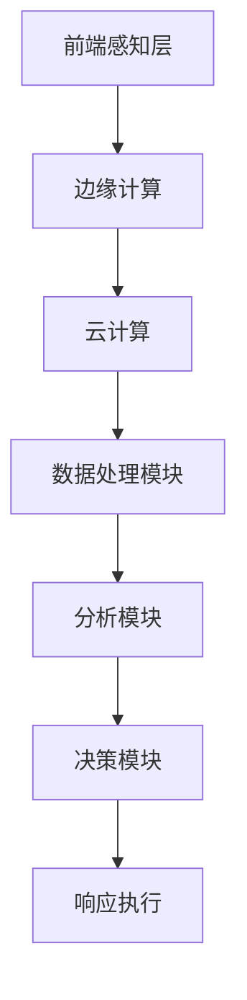
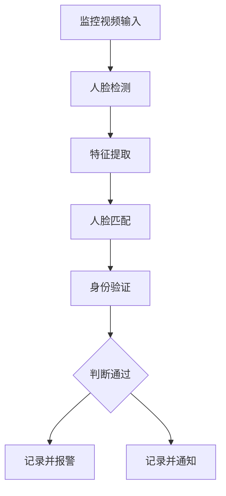
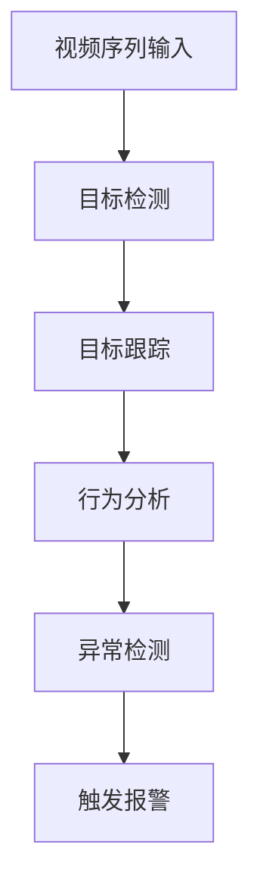

                 

### 概述

#### 智能安防的定义与发展历程

智能安防是指通过应用先进的计算机技术、传感器技术、网络通信技术、图像处理技术等，实现对安全相关信息的自动监测、自动分析和自动响应，从而达到预防、监控和处置各种安全事件的目的。它的发展历程可以追溯到20世纪90年代，当时视频监控技术开始进入家庭和企业。随着信息技术和互联网的迅猛发展，智能安防技术逐渐成熟，并开始广泛应用于各种场景。

智能安防系统主要包括前端感知层、传输层和后端处理层。前端感知层由摄像头、传感器、门禁系统等设备组成，用于收集现场的安全信息。传输层主要是指网络通信技术，负责将前端收集到的信息传输到后端处理层。后端处理层则由智能分析算法、数据库、决策系统等组成，用于对收集到的信息进行智能分析、存储和处理，并根据分析结果做出相应的决策和响应。

#### 人工智能的基本原理

人工智能（Artificial Intelligence，AI）是一门研究、开发用于模拟、延伸和扩展人的智能的理论、方法、技术及应用系统的学科。它包括机器学习、计算机视觉、自然语言处理、智能控制等多个分支。人工智能的基本原理是通过计算机模拟人类大脑的神经元结构和工作方式，利用海量数据和智能算法，实现对信息的处理、理解和学习。

人工智能的核心技术主要包括：

1. **机器学习**：通过训练模型，让计算机从数据中自动学习和发现规律。
2. **深度学习**：一种特殊的机器学习方法，通过多层神经网络模拟人脑的学习过程。
3. **计算机视觉**：让计算机具备像人一样的视觉能力，能够识别、理解和处理图像信息。
4. **自然语言处理**：让计算机理解和处理人类自然语言的能力。

人工智能的发展历程可以分为几个阶段：

1. **早期的探索**（1950年代-1970年代）：以逻辑推理和知识表示为核心，代表性的工作是“逻辑理论家”（Logic Theorist）。
2. **人工智能的中断与复苏**（1970年代-1980年代）：由于实际应用困难，人工智能研究陷入低谷。但在1980年代，专家系统的出现使得人工智能重新获得了关注。
3. **机器学习的兴起**（1990年代-2000年代）：以机器学习为核心，人工智能技术取得了显著进展。
4. **深度学习的革命**（2010年代至今）：深度学习技术的突破，使得人工智能在图像识别、语音识别、自然语言处理等领域取得了巨大的成功。

#### 智能安防与人工智能的结合

人工智能技术在智能安防中的应用主要体现在以下几个方面：

1. **图像识别与分类**：通过深度学习算法，实现对监控视频中的图像进行实时识别和分类，从而识别出目标物体。
2. **人脸识别**：通过人脸检测和特征提取技术，实现对监控视频中的人脸进行识别，用于身份验证和人员追踪。
3. **目标跟踪**：通过计算机视觉算法，实现对监控视频中的目标物体进行跟踪，用于行为分析和异常检测。
4. **智能决策**：通过大数据分析和智能算法，实现对安全事件进行预测和预警，从而提高安全监控的效率和准确性。

人工智能对智能安防的推动作用主要体现在以下几个方面：

1. **提高监控效率和准确性**：通过人工智能技术，可以实现对监控视频的自动分析和处理，大大提高了监控效率和准确性。
2. **降低人力成本**：智能安防系统可以自动完成许多原本需要人工完成的工作，从而降低了人力成本。
3. **提高安全性**：通过智能分析，可以及时发现潜在的安全威胁，提高安全性。
4. **拓宽应用场景**：人工智能技术的应用，使得智能安防系统可以应用于更广泛的应用场景，如城市安全监控、住宅安防、工业安全等。

在智能安防中，人工智能技术的挑战主要体现在以下几个方面：

1. **数据隐私和安全**：监控视频和人员信息等敏感数据的安全问题，需要采用有效的数据加密和隐私保护技术。
2. **计算资源和能耗**：大规模的智能安防系统需要大量的计算资源和能源支持，这对系统的稳定性和可持续性提出了挑战。
3. **算法优化和可靠性**：智能安防系统的算法需要不断优化，以提高准确性和效率，同时确保系统的可靠性。

总之，智能安防与人工智能的结合，为安全领域带来了巨大的变革和机遇。随着人工智能技术的不断发展和成熟，智能安防的应用前景将更加广阔。

#### 文章关键词

人工智能，智能安防，图像识别，人脸识别，目标跟踪，数据分析，安全监控，智能决策。

#### 文章摘要

本文详细探讨了人工智能在智能安防中的应用前景。首先，介绍了智能安防的定义、发展历程以及人工智能的基本原理。接着，分析了人工智能技术在智能安防中的核心算法原理，如图像识别与分类、人脸识别和目标跟踪等。随后，阐述了智能安防系统的架构与设计，并列举了实际应用场景。文章还探讨了人工智能在智能安防中的挑战与未来发展，包括数据隐私与安全、模型安全性与可靠性等问题。最后，提出了智能安防系统的实施与运营策略，以及国际合作与标准的重要性。通过本文的探讨，期望为读者提供对智能安防与人工智能结合的全面了解。

### 第1章：智能安防与人工智能概述

#### 1.1 智能安防的定义与发展历程

智能安防是指利用先进的技术手段，如计算机技术、传感器技术、网络通信技术、图像处理技术等，来实现对安全信息的自动监测、分析和响应。其目标是通过智能化的手段，提高安防系统的监控效率和准确性，降低人力成本，同时提升安全性能。

智能安防的发展历程可以追溯到20世纪90年代。当时，视频监控技术开始进入家庭和企业，初步实现了对现场情况的实时监控。随着互联网和通信技术的发展，视频监控逐渐向数字化、网络化、智能化方向演进。进入21世纪，随着人工智能技术的崛起，智能安防系统逐渐具备了自主分析和决策的能力，开始进入一个全新的发展阶段。

智能安防系统一般包括以下几个层次：

1. **前端感知层**：这是智能安防系统的最外层，主要负责收集各类安全信息。前端感知设备包括摄像头、传感器、门禁系统、入侵报警设备等，这些设备通过实时采集图像、声音、温度、湿度等信息，为后续的分析和处理提供数据基础。

2. **传输层**：传输层负责将前端感知设备收集到的信息传输到后端处理层。传输层通常采用无线或有线网络，如Wi-Fi、4G/5G、光纤等，确保信息传输的及时性和稳定性。

3. **后端处理层**：后端处理层是智能安防系统的核心，包括智能分析算法、数据库、决策系统等。后端处理层通过对前端传输的数据进行智能分析和处理，实现对安全事件的高效监控和响应。智能分析算法包括图像识别、人脸识别、行为分析、异常检测等，这些算法利用大数据分析和深度学习技术，实现对监控数据的实时处理和智能决策。

智能安防的发展历程可以分为以下几个阶段：

1. **模拟监控阶段**：20世纪90年代，视频监控设备主要采用模拟信号传输，监控范围有限，功能较为简单。

2. **数字化监控阶段**：21世纪初，视频监控设备逐渐数字化，监控图像的质量和清晰度得到显著提升，同时数据传输和存储技术也得到了很大的发展。

3. **智能化监控阶段**：随着人工智能技术的崛起，视频监控设备逐渐具备了智能分析能力，能够通过图像识别、人脸识别等技术，实现对监控场景的智能分析和决策。

4. **综合化监控阶段**：当前，智能安防系统正朝着综合化、智能化方向不断演进，不仅涵盖视频监控，还涉及入侵报警、门禁管理、电子巡更等多种安全设备，形成一个全面的智能化安全监控系统。

#### 智能安防的市场前景

智能安防市场随着技术的进步和需求的增加，正呈现快速增长的趋势。根据市场研究机构的预测，全球智能安防市场的规模将在未来几年内持续扩大，具体体现在以下几个方面：

1. **城市安全监控**：随着城市化进程的加快，城市安全和公共安全需求日益增加，智能安防技术在城市安全监控中的应用前景广阔。智能视频监控、交通流量监控、公共安全事件预警等应用场景将推动城市安全监控市场的发展。

2. **住宅安防**：随着人们生活水平的提高，对家庭安全的需求也越来越高。智能门锁、入侵检测、家居安全监控等智能安防产品在住宅市场的需求不断增加，预计将保持高速增长。

3. **工业安全**：在工业生产过程中，智能安防系统可以提高生产安全性，降低事故风险。智能工厂监控、设备故障预警、安全生产管理等应用场景将为工业安全市场带来巨大的需求。

4. **交通安全**：智能安防技术在交通安全中的应用，如车辆识别、交通流量监控、智能交通信号控制等，可以有效提高道路安全和交通效率，预计将推动交通安全市场的发展。

总之，智能安防市场的快速发展得益于技术的进步和用户需求的增加。随着人工智能、物联网等新兴技术的不断融合，智能安防的应用场景将更加丰富，市场前景十分广阔。

### 1.2 人工智能的基本原理

人工智能（Artificial Intelligence，简称AI）是计算机科学的一个重要分支，旨在使计算机模拟人类的智能行为，包括学习、推理、解决问题、理解自然语言等。人工智能的基本原理主要涉及以下几个方面：

#### 人工智能的定义

人工智能是指通过计算机技术实现的，使计算机具有类似人类智能的功能和能力的科学。它不仅包括智能行为，还涉及知识的获取、表示和应用。人工智能的目标是构建智能系统，这些系统能够在不同的环境和任务中表现出类似人类的智能行为。

#### 人工智能的核心技术

1. **机器学习**：机器学习是人工智能的一个重要分支，主要研究如何从数据中自动学习规律和模式，并利用这些规律和模式进行预测和决策。机器学习包括监督学习、无监督学习和强化学习等多种方法。

2. **深度学习**：深度学习是一种基于人工神经网络的机器学习方法，通过多层神经网络模拟人脑的学习过程，从而实现对复杂数据的分析和处理。深度学习在图像识别、语音识别、自然语言处理等领域取得了显著的成功。

3. **计算机视觉**：计算机视觉是指使计算机能够“看到”和理解图像信息的技术。计算机视觉技术包括图像识别、图像分类、图像分割、目标检测等，广泛应用于视频监控、自动驾驶、医疗诊断等领域。

4. **自然语言处理**：自然语言处理（Natural Language Processing，NLP）是使计算机能够理解和处理自然语言的技术。NLP包括文本分类、情感分析、机器翻译、语音识别等，是人工智能领域的一个重要研究方向。

5. **智能控制**：智能控制是指利用人工智能技术，实现对系统或过程的自动控制和优化。智能控制广泛应用于工业自动化、机器人控制、无人机等领域。

#### 人工智能的发展历程

人工智能的发展历程可以分为以下几个阶段：

1. **早期的探索**（1950年代-1970年代）：人工智能的概念提出，初步的算法和研究工作开始。代表性的工作是“逻辑理论家”（Logic Theorist），它使用逻辑推理解决了数学定理证明问题。

2. **人工智能的中断与复苏**（1970年代-1980年代）：由于实际应用困难，人工智能研究陷入低谷。但在1980年代，专家系统的出现使得人工智能重新获得了关注。专家系统是一种基于规则的人工智能系统，通过知识库和推理机，实现专家级别的决策和问题解决。

3. **机器学习的兴起**（1990年代-2000年代）：以机器学习为核心，人工智能技术取得了显著进展。机器学习方法通过从数据中学习规律和模式，提高了人工智能系统的性能和实用性。

4. **深度学习的革命**（2010年代至今）：深度学习技术的突破，使得人工智能在图像识别、语音识别、自然语言处理等领域取得了巨大的成功。深度学习通过多层神经网络，能够自动提取复杂数据的特征，显著提升了人工智能系统的能力。

#### 人工智能在智能安防中的应用

人工智能技术在智能安防中的应用主要体现在以下几个方面：

1. **图像识别与分类**：通过深度学习算法，实现对监控视频中的图像进行实时识别和分类，从而识别出目标物体。

2. **人脸识别**：通过人脸检测和特征提取技术，实现对监控视频中的人脸进行识别，用于身份验证和人员追踪。

3. **目标跟踪**：通过计算机视觉算法，实现对监控视频中的目标物体进行跟踪，用于行为分析和异常检测。

4. **智能决策**：通过大数据分析和智能算法，实现对安全事件进行预测和预警，从而提高安全监控的效率和准确性。

人工智能技术在智能安防中的应用，不仅提高了监控效率和准确性，还大大降低了人力成本，提高了安全性。随着人工智能技术的不断进步，智能安防的应用前景将更加广阔。

#### 1.3 智能安防与人工智能的结合

智能安防与人工智能的结合，不仅为安全领域带来了革命性的变化，也为人工智能技术的应用拓展了新的场景。这种结合主要体现在以下几个方面：

##### AI技术在智能安防中的应用

1. **图像识别与分类**：图像识别是智能安防中最基础也是最重要的技术之一。通过卷积神经网络（CNN）等深度学习算法，可以实现对监控视频中的图像进行实时识别和分类。例如，在公共场所的监控系统中，可以自动识别出违反规定的行为，如吸烟、打架等，从而实现实时预警和自动报警。

   **数学模型与公式**：
   - 卷积神经网络（CNN）的核心是卷积层和池化层，其基本公式如下：
     $$ f(x) = \sigma(\sum_{i=1}^{k} w_i \odot x_i + b) $$
     其中，$x_i$是输入特征，$w_i$是权重，$b$是偏置，$\sigma$是激活函数（如ReLU函数），$\odot$表示点积操作。

2. **人脸识别**：人脸识别技术通过检测和识别监控视频中的人脸，实现身份验证和人员追踪。人脸识别包括人脸检测、特征提取和匹配三个步骤。

   **数学模型与公式**：
   - 人脸检测通常采用深度学习算法，如YOLO（You Only Look Once），其基本公式如下：
     $$ P(x) = \prod_{i=1}^{n} p(x_i | y_i = 1) $$
     其中，$P(x)$是目标存在的概率，$p(x_i | y_i = 1)$是给定目标类别下的特征概率。

3. **目标跟踪**：目标跟踪技术通过在视频序列中持续跟踪目标物体，实现行为分析和异常检测。常用的目标跟踪算法包括卡尔曼滤波器、光流法、粒子滤波器等。

   **数学模型与公式**：
   - 卡尔曼滤波器的基本公式如下：
     $$ \hat{x}_{t|t-1} = F_t \hat{x}_{t-1|t-1} + B_t u_t $$
     $$ P_t|t-1 = F_t P_{t-1|t-1} F_t^T + Q_t $$
     其中，$\hat{x}_{t|t-1}$是预测状态，$P_t|t-1$是预测误差协方差，$F_t$是状态转移矩阵，$B_t$是控制矩阵，$u_t$是控制输入，$Q_t$是过程噪声协方差。

##### AI对智能安防的推动作用

1. **提高监控效率和准确性**：传统的安防监控系统主要依靠人工进行监控和判断，效率低下且易出错。通过人工智能技术，可以实现自动化监控和智能分析，大大提高了监控效率和准确性。

2. **降低人力成本**：人工智能技术可以自动处理大量监控视频数据，减少了人工干预的需求，从而降低了人力成本。

3. **提高安全性**：人工智能技术可以实时监测和分析监控视频，及时发现异常情况并报警，提高了安全性能。

4. **拓宽应用场景**：人工智能技术的应用，使得智能安防系统可以应用于更广泛的应用场景，如城市安全监控、住宅安防、工业安全等。

##### 智能安防中的AI技术挑战

1. **数据隐私和安全**：监控视频和人员信息等敏感数据的安全问题，需要采用有效的数据加密和隐私保护技术。

2. **计算资源和能耗**：大规模的智能安防系统需要大量的计算资源和能源支持，这对系统的稳定性和可持续性提出了挑战。

3. **算法优化和可靠性**：智能安防系统的算法需要不断优化，以提高准确性和效率，同时确保系统的可靠性。

总之，智能安防与人工智能的结合，不仅推动了安防技术的发展，也为人工智能技术的应用拓展了新的场景。随着技术的不断进步，智能安防的应用前景将更加广阔。

### 人工智能在智能安防中的核心算法原理

在智能安防系统中，人工智能技术的核心算法原理主要包括图像识别与分类、人脸识别和目标跟踪等。这些算法通过深度学习、计算机视觉等先进技术，实现对监控视频的智能分析和处理，从而提高监控效率和准确性。以下是这些核心算法原理的详细解析。

#### 2.1 图像识别与分类算法

图像识别与分类是智能安防系统中最重要的算法之一，它通过识别监控视频中的图像内容，将其分类为不同的类别，如人、车辆、动物等。常用的图像识别与分类算法包括卷积神经网络（CNN）和深度学习算法。

**卷积神经网络（CNN）**

卷积神经网络是一种专门用于处理图像数据的深度学习算法。它通过卷积层、池化层和全连接层等结构，提取图像的特征并进行分类。

**算法原理**：

1. **卷积层**：卷积层通过卷积操作提取图像的局部特征。卷积操作的基本公式如下：
   $$ (f * g)(x) = \sum_{y} f(y) \cdot g(x-y) $$
   其中，$f$是卷积核，$g$是输入图像，$x$是卷积位置。

2. **激活函数**：激活函数用于引入非线性特性，常用的激活函数有ReLU（Rectified Linear Unit）函数：
   $$ \sigma(x) = \max(0, x) $$

3. **池化层**：池化层用于降低特征图的维度，减少参数数量，提高训练效率。常用的池化操作有最大池化和平均池化。

4. **全连接层**：全连接层将卷积层和池化层提取的特征映射到具体的类别，进行分类。全连接层的基本公式如下：
   $$ y = \sigma(W \cdot x + b) $$
   其中，$W$是权重矩阵，$b$是偏置项，$\sigma$是激活函数。

**图像识别的数学模型与公式**：

CNN的数学模型可以表示为：
$$ \hat{y} = \sigma(\text{FC}(\text{Pooling}(\text{Conv}(\text{Input}))) $$
其中，$\text{FC}$表示全连接层，$\text{Pooling}$表示池化层，$\text{Conv}$表示卷积层，$\text{Input}$是输入图像。

**应用案例**：

在智能安防中，图像识别算法可以用于实时监控视频中的异常行为检测，如盗窃、打架等。例如，通过检测视频中的物体，可以识别出违反规定的行为，并触发报警。

#### 2.2 人脸识别算法

人脸识别是通过检测和识别监控视频中的人脸，实现身份验证和人员追踪的技术。人脸识别包括人脸检测、特征提取和匹配三个步骤。

**人脸检测与特征提取**

1. **人脸检测**：人脸检测是识别视频帧中是否存在人脸的过程。常用的算法包括基于深度学习的方法，如SSD（Single Shot MultiBox Detector）和YOLO（You Only Look Once）。

2. **特征提取**：特征提取是从人脸图像中提取具有区分性的特征，用于后续的匹配。常用的特征提取算法包括局部二值模式（LBP）、尺度不变特征变换（SIFT）和深度学习算法（如VGGFace）。

**人脸识别的数学模型与公式**

人脸识别的数学模型主要包括：

1. **特征提取**：
   $$ \text{Feature} = \text{Extractor}(\text{Input}) $$
   其中，$\text{Extractor}$是特征提取算法，$\text{Input}$是输入人脸图像。

2. **特征匹配**：
   $$ \text{Score} = \text{Distance}(\text{Feature}_1, \text{Feature}_2) $$
   其中，$\text{Distance}$是特征距离计算函数，$\text{Feature}_1$和$\text{Feature}_2$是两个待匹配的特征向量。

**实际应用案例**

在智能安防中，人脸识别可以用于监控视频中的身份验证和人员追踪。例如，在火车站、机场等公共场所，通过人脸识别技术，可以自动识别出已录入数据库的嫌疑人员，及时触发报警。

#### 2.3 目标跟踪算法

目标跟踪是在视频序列中持续跟踪特定目标的技术，用于行为分析和异常检测。目标跟踪算法包括卡尔曼滤波器、光流法、粒子滤波器等。

**卡尔曼滤波器**

卡尔曼滤波器是一种基于统计模型的线性递归滤波器，用于估计目标的位置和速度。其基本公式如下：

1. **预测**：
   $$ \hat{x}_t = F_t \hat{x}_{t-1} + B_t u_t $$
   $$ P_t = F_t P_{t-1} F_t^T + Q_t $$

2. **更新**：
   $$ K_t = P_t H_t^T (H_t P_t H_t^T + R_t)^{-1} $$
   $$ \hat{x}_t = \hat{x}_t|t-1 + K_t (z_t - H_t \hat{x}_t|t-1) $$
   $$ P_t = (I - K_t H_t) P_t|t-1 $$

其中，$\hat{x}_t$是预测状态，$P_t$是预测误差协方差，$F_t$是状态转移矩阵，$B_t$是控制矩阵，$u_t$是控制输入，$Q_t$是过程噪声协方差，$K_t$是卡尔曼增益，$H_t$是观测矩阵，$R_t$是观测噪声协方差，$z_t$是观测值。

**光流法**

光流法是通过分析视频帧之间的像素运动，估计目标的位置和速度。其基本公式如下：

$$ \dot{x} = \frac{I(x, y) - I(x + \Delta x, y)}{\Delta t} $$
$$ \dot{y} = \frac{I(x, y) - I(x, y + \Delta y)}{\Delta t} $$

其中，$I(x, y)$是像素值，$\Delta x$和$\Delta y$是像素移动量，$\Delta t$是时间间隔。

**粒子滤波器**

粒子滤波器是一种基于蒙特卡罗方法的非线性滤波器，用于处理复杂的目标跟踪问题。其基本公式如下：

1. **初始化**：
   $$ w_i = \frac{p(x_t|z_1:t, \theta)}{M} $$
   $$ x_t|z_1:t \sim \text{pdf}(x_t|z_1:t, \theta) $$

2. **预测**：
   $$ x_t|z_1:t \sim \text{pdf}(x_t|z_1:t-1, \theta) $$
   $$ w_i \propto p(x_t|z_1:t-1, \theta) p(z_t|x_t, \theta) $$

3. **重采样**：
   $$ x_{t+1}|z_1:t \sim \text{Resampled}(w_i) $$
   $$ w_i = \frac{w_i}{\sum_j w_j} $$

其中，$x_t$是目标状态，$z_t$是观测值，$w_i$是粒子权重，$M$是粒子数量，$\text{pdf}$是概率密度函数，$\text{Resampled}$是重采样操作。

**实际应用案例**

在智能安防中，目标跟踪算法可以用于监控视频中的目标行为分析，如异常行为检测、入侵预警等。例如，通过跟踪视频中的行人，可以识别出异常行为，如奔跑、爬行等，从而触发报警。

### 总结

图像识别与分类、人脸识别和目标跟踪是智能安防中常用的核心算法，通过深度学习、计算机视觉等先进技术，实现对监控视频的智能分析和处理。这些算法不仅在提高监控效率和准确性方面发挥了重要作用，也为智能安防系统的广泛应用提供了技术支持。

### 3.1 智能安防系统的总体架构

智能安防系统是一个复杂且高度集成的系统，其总体架构主要包括前端感知层、边缘计算与云计算、后端数据处理与决策层。这三个层次相互配合，共同实现了智能安防系统的功能。

#### 前端感知层

前端感知层是智能安防系统的最外层，也是系统的信息采集模块。前端感知层主要由各种传感器和摄像头组成，这些设备能够实时采集环境中的图像、声音、温度、湿度等数据。前端感知层的核心任务是捕捉并记录安全事件的发生，为后端分析提供原始数据。

前端感知层的关键设备包括：

1. **摄像头**：摄像头是前端感知层最重要的设备，用于捕捉视频图像，实现监控功能。根据应用场景的不同，摄像头可以分为固定摄像头、移动摄像头和红外摄像头等。

2. **传感器**：传感器用于采集环境中的各种物理量，如温度、湿度、烟雾、震动等。这些传感器可以实现对特定环境参数的实时监测，为安全事件的预警提供数据支持。

3. **门禁系统**：门禁系统是前端感知层的重要组成部分，包括门禁卡、指纹识别、人脸识别等设备。门禁系统可以实现对出入口的管控，记录人员进出信息。

#### 边缘计算与云计算

边缘计算与云计算是智能安防系统的信息处理与存储模块。边缘计算是指在靠近数据源的地方进行数据分析和处理，以减少数据传输的延迟和带宽消耗。云计算则通过云服务器提供强大的计算能力和存储资源，实现对海量数据的存储和处理。

边缘计算与云计算在智能安防系统中的作用如下：

1. **边缘计算**：边缘计算主要负责对前端感知层采集的数据进行初步处理和筛选。通过在本地设备上进行数据处理，可以减少数据传输的延迟，提高系统的响应速度。边缘计算还可以对数据进行分析，识别出潜在的安全威胁，并及时触发报警。

2. **云计算**：云计算主要负责对海量数据进行存储、管理和分析。云计算平台提供了强大的计算能力和存储资源，可以处理前端感知层和边缘计算传输过来的数据。通过云计算平台，可以实现对监控数据的深度挖掘，提取出有价值的信息，为安全决策提供支持。

#### 后端数据处理与决策层

后端数据处理与决策层是智能安防系统的核心模块，负责对前端采集的数据进行综合分析、存储和处理，并生成决策和响应。后端数据处理与决策层的核心任务是对监控数据进行分析，识别出异常行为和安全事件，并采取相应的措施。

后端数据处理与决策层的关键组件包括：

1. **数据处理模块**：数据处理模块负责对前端采集的数据进行清洗、转换和存储。通过数据处理模块，可以实现对数据的统一管理和高效利用。

2. **分析模块**：分析模块是智能安防系统的核心，负责对数据进行分析和处理。分析模块包括图像识别、人脸识别、行为分析、异常检测等算法，可以实现对监控数据的实时分析和决策。

3. **决策模块**：决策模块根据分析模块的结果，生成相应的决策和响应。决策模块可以实现对安全事件的自动报警、联动处置和应急响应。

#### 智能安防系统的架构流程图

为了更好地理解智能安防系统的总体架构，下面提供了一个简单的架构流程图：

```
[前端感知层] --> [边缘计算] --> [云计算]
      |                        |
      |                        |
[数据处理模块] --> [分析模块] --> [决策模块]
```

在这个架构流程图中，前端感知层通过传感器和摄像头实时采集数据，这些数据首先通过边缘计算进行初步处理和筛选。随后，部分重要数据被传输到云计算平台，进行深度分析和存储。数据处理模块负责对数据进行分析和处理，分析模块根据算法结果生成决策和响应，决策模块则根据决策结果采取相应的措施。

通过上述架构，智能安防系统可以实现高效、实时和智能的安全监控，为人们的安全提供强有力的保障。

### 智能安防系统的设计原则

智能安防系统的设计原则是确保系统在安全性、可靠性、易用性和可扩展性方面达到最佳状态，以满足不同应用场景的需求。以下是智能安防系统的四大设计原则及其重要性：

#### 1. 安全性

安全性是智能安防系统的首要设计原则。系统必须能够确保数据的安全传输、存储和访问，防止未经授权的访问和数据泄露。为实现数据安全，可以采取以下措施：

- **数据加密**：对传输和存储的数据进行加密处理，确保数据在传输和存储过程中不会被窃取或篡改。
- **访问控制**：通过身份验证和权限管理，确保只有授权用户才能访问系统数据和功能。
- **安全审计**：记录系统操作日志，实现对系统操作的监控和审计，及时发现和防范安全风险。

安全性对智能安防系统至关重要，因为它直接关系到用户隐私和数据安全。如果系统安全性不足，可能会导致用户信息泄露，甚至引发严重的经济损失和安全事故。

#### 2. 可靠性

可靠性是智能安防系统稳定运行的基础。系统必须能够在各种环境下稳定运行，不因硬件故障、软件错误或网络中断等问题导致服务中断。提高可靠性的措施包括：

- **冗余设计**：通过在系统关键部分添加备份设备或系统，确保在单点故障时系统能够自动切换到备份系统，保证服务连续性。
- **容错机制**：设计故障检测和恢复机制，能够在检测到故障时自动进行故障恢复，减少系统停机时间。
- **持续监控**：通过实时监控系统的运行状态，及时发现潜在问题并进行修复。

可靠性对智能安防系统至关重要，因为安防系统的连续运行是保障安全的关键。如果系统可靠性不足，可能会导致监控中断，从而影响安全监控效果。

#### 3. 易用性

易用性是智能安防系统的设计原则之一，系统需要方便用户使用和维护。易用性包括用户界面的友好性、操作流程的简便性和系统管理的便捷性。提高易用性的措施包括：

- **直观的用户界面**：设计直观、易于操作的界面，减少用户的学习成本。
- **简洁的操作流程**：简化系统操作流程，使用户能够快速上手并高效使用系统。
- **自动化管理**：通过自动化工具实现系统配置、监控和故障处理，减少人工干预。

易用性对智能安防系统至关重要，因为它直接影响用户对系统的满意度。如果系统难以使用或维护，用户可能会放弃使用，从而影响系统的实际应用效果。

#### 4. 可扩展性

可扩展性是智能安防系统适应未来需求的关键。系统设计需要考虑未来的扩展性，能够方便地增加新功能、扩展硬件设备或升级软件系统。实现可扩展性的措施包括：

- **模块化设计**：通过模块化设计，使系统能够灵活扩展功能模块，满足不同应用场景的需求。
- **标准化接口**：采用标准化的接口和协议，方便新设备和软件的集成和升级。
- **弹性计算资源**：通过云技术和分布式架构，实现计算资源的动态扩展，满足大规模数据处理的计算需求。

可扩展性对智能安防系统至关重要，因为它决定了系统在未来能否持续满足不断变化的需求。如果系统不可扩展，可能会因为技术升级或功能扩展困难而逐渐落后。

#### 设计原则的重要性

智能安防系统的设计原则对于系统的整体性能和用户体验至关重要。安全性确保了用户数据和系统的保护，可靠性保障了系统的稳定运行，易用性提升了用户的操作体验，可扩展性则确保了系统的持续发展。只有综合考虑这些设计原则，智能安防系统才能在实际应用中发挥最大的作用，为人们的生命财产安全提供可靠保障。

### 3.3 智能安防系统的实际案例

#### 大型安防项目案例分析

智能安防系统在大型安防项目中得到了广泛应用，以下是一些典型案例分析：

1. **北京奥运会安保系统**：
   北京奥运会期间，我国建设了一个涵盖整个奥运场馆及周边区域的智能安防系统。该系统集成了数以万计的摄像头、传感器、入侵检测设备等。系统通过图像识别、人脸识别和目标跟踪等技术，实现了对活动现场的实时监控和预警。例如，通过人脸识别技术，系统可以自动识别出重点保护对象，并在发现异常行为时及时报警。该系统在保障奥运会安全方面发挥了重要作用，取得了显著效果。

2. **上海磁浮列车监控系统**：
   上海磁浮列车采用了一套智能安防系统，通过摄像头、入侵检测和智能分析等技术，实现了对列车运行状况的实时监控。系统可以检测到列车的异常震动、车辆出轨等安全隐患，并自动报警。此外，系统还通过图像识别技术，实现了对乘客行为的监控，有效预防了车内盗窃等犯罪行为。该系统提高了列车运行的安全性和乘客的满意度。

#### 中小企业安防项目案例分析

除了大型项目，智能安防系统在中小企业中也有广泛的应用，以下是一些典型案例：

1. **中小企业门禁系统**：
   许多中小企业为了保障员工和公司资产的安全，采用了智能门禁系统。系统通过人脸识别、指纹识别等技术，实现了对员工和访客的严格管控。例如，通过人脸识别技术，系统可以自动记录员工的出勤情况，并实现考勤管理。此外，系统还可以根据访客的身份信息，决定是否允许其进入公司内部。这有效地提高了公司的安全管理水平，减少了人工管理的成本。

2. **小型商场视频监控系统**：
   小型商场为了提高安全性和顾客体验，采用了智能视频监控系统。系统通过图像识别技术，实现了对店内顾客行为的监控和异常行为检测。例如，系统可以识别出偷窃行为，并自动报警。此外，系统还支持人脸识别技术，可以识别出商场会员，为会员提供个性化的服务。这提高了商场的运营效率，增加了顾客的满意度。

通过以上案例可以看出，智能安防系统在大型和中小企业中都有广泛的应用。它不仅提高了安全监控的效率和准确性，还降低了人力成本，为企业和组织提供了可靠的安全保障。

### 人工智能在智能安防中的应用场景

人工智能技术在智能安防中的应用场景非常广泛，涵盖了城市安全监控、住宅安防、工业安全等多个领域。以下将详细探讨这些应用场景，并分析其优势和应用效果。

#### 城市安全监控

城市安全监控是人工智能在智能安防中最典型的应用场景之一。通过智能视频监控和人工智能技术，城市安全监控系统能够实现对城市公共场所、交通枢纽、重要设施等的实时监控，及时发现和预警潜在的安全威胁。

1. **智能视频监控**：
   智能视频监控通过图像识别和人脸识别技术，可以自动识别监控视频中的异常行为，如打架、纵火、盗窃等。系统可以实时报警，并将事件记录下来，供后续分析。例如，在夜间监控中，系统可以通过检测到的人脸、移动目标等特征，识别出潜在的安全威胁，并在第一时间通知相关部门进行处理。

2. **交通流量监控**：
   智能交通监控系统能够实时监测城市交通流量，识别出交通拥堵、事故等异常情况，并及时发布预警信息。通过人工智能算法，系统可以对交通数据进行深度分析，优化交通信号控制，提高道路通行效率，减少交通事故。

3. **公共安全事件预警**：
   智能安防系统可以整合多源数据，如视频监控、气象数据、社交媒体等，实现对公共安全事件的预警。例如，在自然灾害发生前，系统可以通过气象数据和传感器数据，预测可能发生的洪水、泥石流等灾害，提前预警并采取预防措施，减少人员伤亡和财产损失。

#### 住宅安防

住宅安防是人工智能在智能安防中另一个重要的应用场景。通过智能家居设备和人工智能技术，住宅安防系统能够提供全方位的安全保障，提高居民的生活质量。

1. **智能门锁与入侵检测**：
   智能门锁通过人脸识别、指纹识别等技术，实现了无钥匙开门，提高了住宅的安全性和便利性。同时，系统可以通过入侵检测技术，实时监测住宅内部的情况，一旦检测到异常，如非法入侵、火灾等，会立即报警并通知住户。

2. **家居安全监控**：
   智能家居监控系统可以实现对住宅内各个房间的监控，通过图像识别技术，识别出异常情况，如烟雾、燃气泄漏等。系统可以自动报警，并触发相应的应急措施，如关闭燃气阀门、开启灭火器等。

3. **智能门禁系统**：
   智能门禁系统通过人脸识别、指纹识别等技术，实现了对访客的严格管控，防止未经授权的人员进入住宅。系统还可以记录访客信息，便于后续查询和管理。

#### 工业安全

工业安全是人工智能在智能安防中另一个重要的应用场景。通过智能监控系统，工业企业能够实现对生产环境的实时监控和安全管理，提高生产效率和安全性。

1. **智能工厂监控**：
   智能工厂监控系统通过摄像头、传感器等设备，实现了对生产线的实时监控。系统可以检测到生产过程中的异常情况，如设备故障、异常噪声等，并及时报警，防止事故发生。

2. **设备故障预警**：
   通过人工智能算法，系统可以对设备运行数据进行分析，预测可能发生的故障，并在故障发生前提前预警。例如，通过分析设备的振动数据，可以预测设备的磨损程度，提前进行维护，避免设备意外停机。

3. **安全生产管理**：
   智能安防系统可以整合生产数据和监控视频，实现对安全生产过程的实时监控和管理。系统可以检测到生产过程中的安全隐患，如高处作业、设备违规操作等，并及时报警，防止安全事故发生。

#### 应用优势和应用效果

人工智能在智能安防中的应用，不仅提高了安全监控的效率和准确性，还降低了人力成本，提高了安全性。具体优势和应用效果如下：

1. **提高监控效率和准确性**：通过人工智能算法，系统可以自动分析监控视频，实时识别和预警异常情况，大大提高了监控效率和准确性。

2. **降低人力成本**：智能安防系统可以自动完成许多原本需要人工完成的工作，如视频监控、数据分析等，从而降低了人力成本。

3. **提高安全性**：通过智能分析和实时预警，智能安防系统可以及时发现和应对潜在的安全威胁，提高了安全性能。

4. **拓宽应用场景**：人工智能技术的应用，使得智能安防系统可以应用于更广泛的应用场景，如城市安全监控、住宅安防、工业安全等。

总之，人工智能在智能安防中的应用，为安全领域带来了巨大的变革和机遇。随着人工智能技术的不断发展和成熟，智能安防的应用前景将更加广阔。

### 人工智能在智能安防中的挑战与未来发展

随着人工智能技术的不断进步，其在智能安防领域的应用也日益广泛，然而，这一领域也面临着诸多挑战。以下将详细探讨人工智能在智能安防中面临的主要挑战以及未来的发展方向。

#### 数据隐私与安全

在智能安防系统中，监控视频和人员信息等敏感数据的安全问题是不可忽视的挑战。这些数据一旦泄露或被滥用，可能会对个人隐私和公共安全造成严重威胁。为了应对这一挑战，可以采取以下措施：

1. **数据加密技术**：对传输和存储的数据进行加密处理，确保数据在传输和存储过程中不会被窃取或篡改。
2. **隐私保护算法**：开发和应用隐私保护算法，如差分隐私、同态加密等，以保护用户隐私。
3. **法律法规与道德伦理**：制定严格的法律法规和道德伦理规范，加强对数据隐私的保护，确保数据收集、存储和使用过程中的合法性和合规性。

#### 模型安全性与可靠性

智能安防系统中的算法模型需要具备高安全性和可靠性，否则可能会出现误报或漏报，影响安全监控的效果。为了提高模型的安全性和可靠性，可以采取以下措施：

1. **模型评估与优化**：在模型训练和部署过程中，进行全面的评估和优化，确保模型能够准确识别和分类目标。
2. **模型安全防护**：开发模型安全防护技术，如对抗样本防御、模型防御蒸馏等，防止攻击者对模型进行攻击。
3. **模型可靠性的评估方法**：建立科学的模型可靠性评估方法，通过多种评估指标和测试方法，确保模型在实际应用中的可靠性和稳定性。

#### 人工智能与智能安防的未来发展

随着人工智能技术的不断发展，智能安防领域也将迎来新的发展机遇。以下是一些未来发展的方向：

1. **智能安防的趋势分析**：分析人工智能在智能安防领域的发展趋势，如深度学习、物联网、大数据分析等技术的应用，探讨其对智能安防的影响。

2. **人工智能技术的创新应用**：探索人工智能技术在智能安防中的创新应用，如基于增强现实和虚拟现实的安全培训、基于自然语言处理的安全沟通等。

3. **智能安防的市场前景与挑战**：预测智能安防市场的未来前景，分析市场潜力、市场规模以及面临的主要挑战，为企业和政策制定者提供决策参考。

#### 发展策略

为了推动人工智能在智能安防领域的健康发展，可以采取以下策略：

1. **加强技术研发**：加大人工智能技术的研发投入，推动关键技术的突破和创新，提升智能安防系统的性能和可靠性。
2. **推动行业合作**：加强国内外企业和研究机构的合作，共同推进人工智能在智能安防领域的应用和发展。
3. **完善法规和标准**：制定和完善相关的法律法规和标准，规范数据收集、存储和使用，保护用户隐私和公共安全。
4. **提升公众认知**：加强公众对人工智能和智能安防的认知，提高用户对智能安防系统的接受度和信任度。

总之，人工智能在智能安防领域面临着诸多挑战，但同时也拥有广阔的发展前景。通过加强技术研发、推动行业合作、完善法规和标准以及提升公众认知，智能安防领域将迎来更加美好的发展前景。

### 智能安防系统的实施与运营

智能安防系统的实施与运营是确保其功能发挥和安全保障的关键环节。以下将详细探讨智能安防系统的实施步骤、运营管理以及效益评估。

#### 实施步骤

1. **需求分析**：
   需求分析是智能安防系统实施的第一步，旨在明确系统需要实现的功能和性能要求。通过需求分析，可以确定系统的核心模块、设备配置、数据流程和接口需求等。

2. **系统设计**：
   在明确需求后，进行系统设计。系统设计包括总体架构设计、模块设计、接口设计和数据流程设计等。设计阶段需要考虑系统的安全性、可靠性、易用性和可扩展性。

3. **系统实施**：
   系统实施阶段是按照设计文档进行系统的搭建和部署。包括前端感知设备的安装、网络布线、服务器和存储设备的配置以及中间件和应用程序的部署。

4. **系统验收**：
   系统实施完成后，需要进行系统验收。验收内容包括系统功能测试、性能测试、安全测试和用户培训。只有通过验收，系统才能正式投入使用。

#### 运营管理

1. **运维团队建设**：
   运维团队是智能安防系统正常运行的核心力量。团队需要具备专业的技术知识和丰富的实践经验，能够应对各种故障和异常情况。运维团队应包括系统管理员、网络工程师、数据库管理员等。

2. **系统监控与维护**：
   系统监控是确保系统稳定运行的关键。通过监控工具，可以实时了解系统的运行状态，及时发现和处理故障。系统维护包括硬件设备的定期检查和维护、软件系统的更新和升级、数据备份和恢复等。

3. **用户培训与支持**：
   用户培训是确保系统正常运行的重要环节。通过对用户进行培训，使其掌握系统的基本操作和使用方法，提高系统的使用效率。用户支持包括热线支持、在线帮助和现场服务，确保用户在遇到问题时能够及时得到解决。

#### 效益评估

1. **经济效益分析**：
   智能安防系统的经济效益主要体现在减少人力成本、提高监控效率和降低安全事件损失等方面。通过对系统实施前后的成本和收益进行对比分析，可以评估系统的经济效益。

2. **社会效益分析**：
   智能安防系统的社会效益包括提高公共安全水平、减少犯罪率、提升市民安全感等。通过社会调查和数据分析，可以评估系统对社会的积极影响。

3. **风险评估与对策**：
   在系统实施和运营过程中，可能会面临各种风险，如技术风险、数据隐私风险、系统可靠性风险等。通过风险评估，可以识别出潜在的风险点，并采取相应的对策进行防范。

通过科学合理的实施与运营管理，智能安防系统可以充分发挥其功能，为公共安全和信息安全提供强有力的保障。

### 人工智能与智能安防的国际合作与标准

在全球化背景下，人工智能与智能安防的国际合作与标准制定显得尤为重要。这不仅有助于推动技术进步和产业发展，还能够确保系统在全球范围内的安全性和互操作性。

#### 国际合作的重要性

国际合作在人工智能与智能安防领域具有以下几个重要意义：

1. **技术共享**：各国通过合作，可以共享最新的研究成果和技术创新，促进技术的快速发展和应用。
2. **资源整合**：国际合作有助于整合全球资源和优势，推动智能安防系统的规模化和产业化。
3. **市场拓展**：通过国际合作，企业可以进入更多国际市场，提高产品的竞争力和市场份额。
4. **合规性**：国际合作可以推动各国在智能安防领域的法规和标准趋同，确保产品在全球范围内的合规性。

#### 国际标准的制定

国际标准在智能安防领域起着至关重要的作用，它确保了不同系统和产品之间的互操作性、兼容性和安全性。以下是一些重要的国际标准：

1. **ISO/IEC 27001**：这是关于信息安全管理的国际标准，用于指导企业建立、实施和维护信息安全管理系统。
2. **ISO/IEC 27017**：这是关于云服务的信息安全管理的国际标准，适用于云服务提供商和用户，确保云服务中的数据安全。
3. **ITU-T X.1200**：这是关于智能交通系统的国际标准，包括智能交通信号控制、车辆识别和交通流量监控等方面的规范。

#### 技术交流与合作项目

为了推动人工智能与智能安防的国际合作，各国政府和企业积极参与了多个技术交流与合作项目：

1. **欧盟框架计划**：欧盟的框架计划（如Horizon 2020）资助了许多与人工智能和智能安防相关的国际合作项目，促进了欧洲内部的技术交流与合作。
2. **国际标准化组织（ISO）**：ISO通过国际合作，制定了一系列关于人工智能和智能安防的国际标准，推动了全球范围内的标准统一。
3. **国际电信联盟（ITU）**：ITU通过其电信标准化部门（ITU-T），制定了许多与智能安防相关的国际标准，促进了全球智能安防技术的发展。
4. **跨国企业合作**：许多跨国企业，如谷歌、微软、IBM等，通过合作项目，共同研发智能安防技术和解决方案，推动了人工智能在智能安防领域的应用。

总之，国际合作与标准制定在人工智能与智能安防领域具有重要意义。通过国际合作，各国可以共享技术、整合资源、拓展市场，并通过制定国际标准，确保系统的安全性和互操作性。这将有助于推动智能安防技术的全球发展，为全球公共安全和社会稳定提供有力保障。

### 智能安防系统的案例研究与最佳实践

#### 典型智能安防系统案例

1. **智能城市安防系统**：
   智能城市安防系统是利用人工智能技术，实现对城市安全管理的全面监控和响应。该系统集成了视频监控、人脸识别、交通流量监控等多种功能，通过大数据分析和实时预警，提高了城市安全管理水平。例如，在杭州的智慧城市项目中，智能安防系统通过监控视频，实时识别出违规停车、交通拥堵等异常情况，并自动报警，提高了城市交通效率和安全性。

2. **智能交通管理系统**：
   智能交通管理系统通过实时监控和分析交通数据，优化交通信号控制，减少交通事故，提高道路通行效率。例如，北京的路网监控系统，通过人工智能技术，实时监测交通流量，动态调整交通信号灯时间，有效缓解了高峰期的交通拥堵问题。

3. **智能园区安防系统**：
   智能园区安防系统利用人工智能技术，实现对园区内部的安全监控和管理。例如，上海某高科技园区采用智能安防系统，通过人脸识别技术，实现了对出入园区的严格管控，同时通过视频监控和入侵检测技术，提高了园区内部的安全性。

#### 最佳实践与经验分享

1. **技术创新**：
   智能安防系统的最佳实践之一是持续技术创新。企业应不断引入最新的人工智能技术，如深度学习、计算机视觉、自然语言处理等，提升系统的智能化水平和性能。例如，阿里巴巴在智能安防领域，通过引入深度学习算法，实现了高精度的图像识别和实时预警，大大提高了系统的智能化水平。

2. **项目管理**：
   智能安防项目的成功离不开科学的项目管理。企业应制定详细的项目计划，明确项目目标、任务分配、时间节点和质量标准。同时，应建立有效的沟通机制，确保项目团队能够高效协同工作。例如，华为在智能安防项目中，采用敏捷开发方法，通过快速迭代和持续优化，确保项目能够按计划顺利推进。

3. **运维管理**：
   智能安防系统的运维管理是保障系统长期稳定运行的关键。企业应建立完善的运维团队，制定详细的运维流程，确保系统的正常运行和及时维护。同时，应建立监控系统，实时监测系统运行状态，及时发现和解决故障。例如，腾讯在智能安防系统的运维管理中，采用智能运维平台，通过自动化工具和大数据分析，提高了运维效率和系统稳定性。

通过以上案例研究和最佳实践分享，可以看出，智能安防系统的成功实施不仅需要先进的技术，还需要科学的项目管理和高效的运维管理。企业应不断探索创新，优化项目管理，提升运维水平，从而为智能安防系统的广泛应用提供有力支持。

### 附录 A：智能安防常用工具与资源

在智能安防系统的开发与实施过程中，使用适当的工具和资源可以大大提高效率和效果。以下列举了一些常用的开源算法库、智能安防产品与解决方案，以及行业报告与资讯，供开发者和技术人员参考。

#### 开源算法库

1. **OpenCV**：OpenCV（Open Source Computer Vision Library）是一个强大的开源计算机视觉库，提供了丰富的图像处理和计算机视觉功能，如人脸识别、目标跟踪、图像识别等。

2. **TensorFlow**：TensorFlow是由Google开发的开源机器学习框架，适用于构建和训练深度学习模型。在智能安防中，可以用于图像识别、语音识别和自然语言处理等任务。

3. **PyTorch**：PyTorch是另一个流行的开源机器学习库，由Facebook开发。它提供了灵活的动态计算图，便于构建复杂的深度学习模型，广泛应用于图像识别、视频分析和智能安防等领域。

4. **Keras**：Keras是一个高级神经网络API，能够简化TensorFlow和Theano的使用，使得构建和训练神经网络更加容易。

#### 智能安防产品与解决方案

1. **海康威视**：海康威视是一家提供智能安防产品和解决方案的领先企业，产品包括视频监控摄像头、人脸识别设备、智能交通管理系统等。

2. **大华股份**：大华股份是另一家专注于智能安防领域的知名企业，其产品涵盖视频监控、智能交通、智能家居等多个方面。

3. **华为智能安防解决方案**：华为提供的智能安防解决方案，包括视频监控、智能识别、大数据分析等模块，广泛应用于城市安全、交通管理、公共场所等领域。

#### 行业报告与资讯

1. **IDC**：国际数据公司（IDC）发布的智能安防市场报告，提供了全球和国内智能安防市场的趋势分析、市场规模预测以及主要企业分析。

2. **Gartner**：Gartner公司发布的智能安防研究报告，对全球智能安防市场的主要技术和企业进行了详细评估，为行业用户提供决策参考。

3. **市场研究社**：市场研究社提供的智能安防行业报告，涵盖了市场动态、竞争格局、技术发展等多个方面，有助于企业了解行业趋势和市场需求。

通过使用这些工具和资源，开发者可以更好地进行智能安防系统的开发与优化，提高系统的性能和可靠性，为用户提供更优质的安全服务。

### 附录 B：Mermaid 流程图

在智能安防系统中，流程图可以帮助我们更好地理解和分析系统的运行逻辑。以下使用Mermaid语法绘制了智能安防系统架构流程图、人脸识别流程图和目标跟踪流程图，供读者参考。

#### 智能安防系统架构流程图



#### 人脸识别流程图



#### 目标跟踪流程图



通过这些流程图，我们可以清晰地看到智能安防系统从数据输入到最终响应执行的整个过程，有助于深入理解系统的工作原理和运行逻辑。

### 附录 C：代码案例与解读

在本节中，我们将提供几个智能安防系统中的代码案例，包括智能视频监控、人脸识别和目标跟踪。通过这些案例，读者可以了解如何实现这些功能，并学习到相关的编程技巧和算法原理。

#### 智能视频监控代码案例

**开发环境**：Python 3.x，OpenCV库，TensorFlow库

以下是一个简单的智能视频监控代码示例，使用OpenCV和TensorFlow来实现实时视频监控和异常行为检测。

```python
import cv2
import tensorflow as tf

# 加载预训练的深度学习模型
model = tf.keras.models.load_model('path_to_your_model.h5')

# 初始化视频捕获对象
cap = cv2.VideoCapture(0)  # 使用摄像头作为视频输入

while True:
    # 读取一帧图像
    ret, frame = cap.read()
    
    if not ret:
        print("无法捕获视频帧")
        break
    
    # 对图像进行预处理
    processed_frame = preprocess_frame(frame)
    
    # 使用模型进行图像识别
    prediction = model.predict(processed_frame)
    
    # 根据预测结果进行异常行为检测
    if prediction > threshold:
        print("检测到异常行为，触发报警！")
    
    # 显示图像
    cv2.imshow('Video', frame)
    
    # 按下ESC键退出循环
    if cv2.waitKey(1) & 0xFF == 27:
        break

# 释放摄像头资源
cap.release()
cv2.destroyAllWindows()

def preprocess_frame(frame):
    # 对图像进行缩放、裁剪、灰度转换等预处理操作
    frame = cv2.resize(frame, (224, 224))
    frame = cv2.cvtColor(frame, cv2.COLOR_BGR2GRAY)
    frame = frame.astype(tf.float32) / 255.0
    frame = tf.expand_dims(frame, axis=0)
    return frame
```

**代码解读与分析**：

1. **导入库和模型**：首先，导入所需的Python库，包括OpenCV和TensorFlow。然后，加载一个预训练的深度学习模型，该模型用于图像识别和异常行为检测。

2. **视频捕获**：使用OpenCV的`VideoCapture`类初始化视频捕获对象，指定摄像头作为视频输入。

3. **实时监控**：进入一个循环，读取视频帧，并对每帧图像进行预处理，然后使用加载的模型进行预测。

4. **预处理函数**：`preprocess_frame`函数用于对图像进行缩放、裁剪、灰度转换等预处理操作，以适应模型的输入要求。

5. **异常行为检测**：根据模型预测结果，判断是否检测到异常行为。如果预测结果超过设定的阈值，则触发报警。

6. **显示图像和退出**：在循环中显示图像，并等待用户按下ESC键退出循环。

通过这个示例，读者可以了解如何使用OpenCV和TensorFlow实现简单的智能视频监控。在实际情况中，可以根据需求对模型和算法进行优化和扩展。

#### 人脸识别代码案例

**开发环境**：Python 3.x，OpenCV库，dlib库，dlib的人脸识别模型

以下是一个使用OpenCV和dlib实现人脸识别的代码示例。

```python
import cv2
import dlib

# 初始化dlib的人脸检测器
detector = dlib.get_frontal_face_detector()

# 加载预训练的人脸识别模型
predictor = dlib.shape_predictor('shape_predictor_68_face_landmarks.dat')

# 初始化摄像头
cap = cv2.VideoCapture(0)

while True:
    # 读取一帧视频
    ret, frame = cap.read()
    
    if not ret:
        print("无法捕获视频帧")
        break
    
    # 将视频帧转换为灰度图像
    gray_frame = cv2.cvtColor(frame, cv2.COLOR_BGR2GRAY)
    
    # 使用人脸检测器检测人脸
    faces = detector(gray_frame)
    
    for face in faces:
        # 计算人脸轮廓
        shape = predictor(gray_frame, face)
        
        # 画出人脸轮廓
        cv2.polylines(frame, [shape.parts()), color=(0, 255, 0), thickness=1)
        
        # 在图像上标注人脸坐标
        for i in range(68):
            cv2.circle(frame, (shape.part(i).x, shape.part(i).y), 1, (0, 0, 255), -1)

    # 显示图像
    cv2.imshow('Face Detection', frame)
    
    # 按下ESC键退出循环
    if cv2.waitKey(1) & 0xFF == 27:
        break

# 释放摄像头资源
cap.release()
cv2.destroyAllWindows()
```

**代码解读与分析**：

1. **导入库和模型**：导入OpenCV和dlib库，并加载dlib的人脸检测和特征提取模型。

2. **视频捕获**：使用OpenCV的`VideoCapture`类初始化视频捕获对象，指定摄像头作为视频输入。

3. **人脸检测**：读取视频帧，将视频帧转换为灰度图像，使用dlib的人脸检测器检测人脸。

4. **人脸轮廓计算与绘制**：对于检测到的人脸，使用dlib的特征提取模型计算人脸轮廓，并在原图上绘制人脸轮廓和标注人脸坐标。

5. **显示图像和退出**：在循环中显示图像，并等待用户按下ESC键退出循环。

通过这个示例，读者可以了解如何使用OpenCV和dlib实现人脸检测和轮廓计算。在实际应用中，可以结合人脸识别算法，实现人脸识别和身份验证等功能。

#### 目标跟踪代码案例

**开发环境**：Python 3.x，OpenCV库

以下是一个使用OpenCV实现目标跟踪的代码示例，使用卡尔曼滤波器算法。

```python
import cv2

# 初始化摄像头
cap = cv2.VideoCapture(0)

# 初始化卡尔曼滤波器
measurement_variance = 1.0
process_variance = 1.0
kalman = cv2.KalmanFilter(4, 2, 0)
kalman.measurementMatrix = cv2Mat([[1], [1]])
kalman.transitionMatrix = cv2Mat([[1, 1], [1, 1]])
kalman.processNoiseCov = cv2Mat([[process_variance, 0], [0, process_variance]])

while True:
    # 读取一帧视频
    ret, frame = cap.read()
    
    if not ret:
        print("无法捕获视频帧")
        break
    
    # 转换视频帧为灰度图像
    gray_frame = cv2.cvtColor(frame, cv2.COLOR_BGR2GRAY)
    
    # 使用Haar特征分类器进行目标检测
    face_cascade = cv2.CascadeClassifier('haarcascade_frontalface_default.xml')
    faces = face_cascade.detectMultiScale(gray_frame, scaleFactor=1.1, minNeighbors=5)
    
    for (x, y, w, h) in faces:
        # 更新卡尔曼滤波器的状态
        measurement = np.array([[x + w / 2], [y + h / 2]], dtype=np.float32)
        kalman.correct(measurement)
        
        # 画出目标轮廓
        cv2.rectangle(frame, (int(kalman.state[0, 0] - w / 2), int(kalman.state[1, 0] - h / 2)), (int(kalman.state[0, 0] + w / 2), int(kalman.state[1, 0] + h / 2)), (0, 0, 255), 2)

    # 显示图像
    cv2.imshow('Object Tracking', frame)
    
    # 按下ESC键退出循环
    if cv2.waitKey(1) & 0xFF == 27:
        break

# 释放摄像头资源
cap.release()
cv2.destroyAllWindows()
```

**代码解读与分析**：

1. **导入库和初始化**：导入OpenCV库，并初始化摄像头和卡尔曼滤波器。

2. **视频捕获**：使用OpenCV的`VideoCapture`类初始化视频捕获对象，指定摄像头作为视频输入。

3. **目标检测**：读取视频帧，将视频帧转换为灰度图像，使用Haar特征分类器进行目标检测。

4. **卡尔曼滤波器**：使用卡尔曼滤波器进行目标跟踪。首先更新卡尔曼滤波器的状态，然后使用`correct`方法进行状态估计。

5. **目标轮廓绘制**：根据卡尔曼滤波器的估计结果，在原图上绘制目标轮廓。

6. **显示图像和退出**：在循环中显示图像，并等待用户按下ESC键退出循环。

通过这个示例，读者可以了解如何使用OpenCV实现目标跟踪。在实际应用中，可以根据需求对算法和模型进行调整和优化。

这些代码案例提供了智能安防系统中常见的功能实现方法，读者可以根据实际需求进行修改和扩展，以构建更复杂的智能安防系统。

