                 

### 《人机协作：增强人类认知能力》

#### 关键词：人机协作、认知能力、人工智能、算法、应用实践

> 在这个快速变化的信息时代，人类面临着海量的数据与复杂的决策问题。单一的人类认知能力已无法满足这一挑战。人机协作作为一种新兴的解决方案，正逐渐成为增强人类认知能力的重要途径。本文将深入探讨人机协作的概述、基本原理、核心算法及其在各个领域的应用实践。通过逻辑清晰的分析和详细讲解，希望能够为广大读者揭示人机协作的无限潜力。

### 目录大纲

- **第一部分：人机协作概述**
  - **第1章：人机协作的定义与历史演变**
    - 1.1 人类认知能力与信息处理
    - 1.2 人机协作的概念与分类
    - 1.3 人机协作的历史发展与未来趋势
  - **第2章：人机协作的基本原理**
    - 2.1 人类认知模型
    - 2.2 计算机认知模型
    - 2.3 人机协作的理论基础
  - **第3章：人机协作技术基础**
    - 3.1 人工智能技术概述
    - 3.2 机器学习与深度学习基础
    - 3.3 自然语言处理与语音识别技术

- **第二部分：人机协作的核心算法**
  - **第4章：增强学习与决策支持**
    - 4.1 增强学习的原理与算法
    - 4.2 决策支持系统的设计与实现
    - 4.3 增强学习在协作决策中的应用
  - **第5章：多智能体系统与人机交互**
    - 5.1 多智能体系统的定义与架构
    - 5.2 人机交互的基本原理
    - 5.3 多智能体系统在人机协作中的应用
  - **第6章：知识表示与推理**
    - 6.1 知识表示的方法与模型
    - 6.2 推理算法与逻辑推理
    - 6.3 知识表示与推理在人机协作中的实现
  - **第7章：人机协作中的优化算法**
    - 7.1 优化算法的基本概念
    - 7.2 智能优化算法
    - 7.3 优化算法在人机协作中的应用

- **第三部分：人机协作的应用实践**
  - **第8章：人机协作在办公自动化中的应用**
    - 8.1 文档处理与共享
    - 8.2 信息检索与推荐
    - 8.3 办公自动化系统设计
  - **第9章：人机协作在教育培训中的应用**
    - 9.1 个性化学习系统
    - 9.2 在线教学平台
    - 9.3 教育数据挖掘与应用
  - **第10章：人机协作在医疗健康中的应用**
    - 10.1 医疗健康数据管理
    - 10.2 医疗辅助诊断
    - 10.3 医疗机器人与智能穿戴设备
  - **第11章：人机协作在智能制造中的应用**
    - 11.1 智能制造系统架构
    - 11.2 智能生产规划与调度
    - 11.3 智能制造中的数据驱动决策

- **附录**
  - **附录A：人机协作开发工具与资源**
    - A.1 常用开发工具介绍
    - A.2 开发资源汇总
    - A.3 开发实践指南

- **附加资源**
  - **Mermaid 流程图**
  - **伪代码示例**
  - **数学模型与公式**
  - **项目实战代码**

本文将逐步深入人机协作的各个层面，包括其概念、原理、技术基础、核心算法和应用实践。通过逻辑清晰、结构紧凑的分析，希望能够为读者提供一个全面而深入的了解，并激发对这一领域的进一步探索和研究兴趣。

### 第一部分：人机协作概述

#### 第1章：人机协作的定义与历史演变

在信息化时代，人类面临的数据量和复杂度日益增加，单一的人类认知能力已难以应对这一挑战。人机协作（Human-Computer Collaboration）作为一种新兴的解决方案，正逐步成为增强人类认知能力的重要途径。本章将首先介绍人类认知能力与信息处理的基本概念，然后详细解释人机协作的定义与分类，最后回顾人机协作的历史发展与未来趋势。

#### 1.1 人类认知能力与信息处理

人类认知能力是指人类在感知、理解、记忆和思考信息的过程中表现出的各种能力和技巧。信息处理（Information Processing）是人类认知能力的一个重要方面，涵盖了从信息的接收、分析、存储到输出的全过程。

1. **感知与接收信息：**感知是指通过五官获取外部环境的信息。例如，眼睛可以看到视觉信息，耳朵可以听到声音信息。感知是人类获取信息的起点。

2. **分析与理解信息：**分析是指将接收到的信息进行分解、归纳和分类。理解是指对信息进行综合、解释和判断。这一过程需要人类利用逻辑推理、情感分析和常识知识等手段。

3. **记忆与存储信息：**记忆是指将处理后的信息存储在大脑中，以便后续使用。存储是指将信息以某种形式保存下来，例如文字记录、图像存储等。

4. **输出与运用信息：**输出是指将存储在记忆中的信息转化为行动或表达出来。运用是指利用信息进行决策、解决问题或进行创造性活动。

然而，人类在处理信息时存在一定的局限性：

- **信息过载：**在信息爆炸的时代，人类难以处理海量的数据。
- **记忆有限：**人类大脑的存储空间有限，难以长时间记住大量信息。
- **推理速度有限：**人类进行逻辑推理的速度相对较慢，难以在短时间内做出复杂决策。

为了应对这些挑战，人类需要借助计算机等外部工具来扩展自己的认知能力。

#### 1.2 人机协作的概念与分类

人机协作是指人类与计算机系统共同完成任务的互动过程。在这种协作中，计算机系统充当辅助角色，为人类提供信息处理、分析、存储和推理等方面的支持。人机协作可以分为以下几种类型：

1. **辅助型协作：**计算机系统为人类提供辅助工具和平台，帮助人类更高效地完成任务。例如，文字处理软件、图像编辑工具、搜索引擎等。
   
2. **交互型协作：**计算机系统与人类进行实时互动，共同完成任务。例如，在线游戏、虚拟现实、人机对话系统等。

3. **共享型协作：**计算机系统与人类共享信息资源和知识库，实现协同工作。例如，团队协作平台、知识管理系统、云计算平台等。

4. **增强型协作：**计算机系统通过模拟人类思维过程，增强人类的认知能力。例如，智能推荐系统、智能诊断系统、智能决策支持系统等。

#### 1.3 人机协作的历史发展与未来趋势

人机协作的发展可以追溯到计算机技术的诞生。随着计算机技术的不断进步，人机协作也在不断演进。

1. **早期阶段（20世纪60年代至70年代）：**计算机主要用于数值计算和科学实验。人机协作主要体现为计算机辅助人类完成计算任务。

2. **发展阶段（20世纪80年代至90年代）：**计算机开始应用于办公自动化、工业控制等领域。人机协作逐渐从单一的辅助功能扩展到交互、共享和增强等方面。

3. **成熟阶段（21世纪至今）：**随着人工智能技术的发展，人机协作进入了新的阶段。计算机系统不仅能够处理复杂的信息，还能与人类进行自然语言交流，提供智能化的决策支持。

未来，人机协作将继续向以下几个方向发展：

1. **智能化：**计算机系统将更加智能化，能够更好地模拟人类思维过程，提供个性化的服务。

2. **个性定制：**人机协作将更加注重满足个体的需求和偏好，实现个性定制。

3. **跨领域融合：**人机协作将跨越不同领域，实现跨学科、跨行业的协同工作。

4. **社会化：**人机协作将更加社会化，计算机系统将融入人类的生活，成为人类社会的一部分。

总结而言，人机协作作为一种新兴的解决方案，正在改变人类的认知方式和工作模式。通过深入理解人机协作的定义、分类和发展历程，我们能够更好地把握其发展方向，为未来的科技创新提供有力支持。

### 第2章：人机协作的基本原理

人机协作的核心在于将人类的认知能力与计算机的计算能力相结合，从而实现协同工作。要实现有效的协作，需要理解人类认知模型、计算机认知模型以及二者之间的理论基础。本章将分别介绍这些内容。

#### 2.1 人类认知模型

人类认知模型是描述人类如何获取、处理和利用信息的过程。以下是人类认知模型的基本组成部分：

1. **感知系统：**感知系统是获取外界信息的通道。它通过五官接收外部刺激，如视觉、听觉、触觉等。感知系统具有选择性和适应性，能够根据环境变化调整感知能力。

2. **感觉整合：**感觉整合是将不同感官接收到的信息进行整合，形成一个统一的感觉体验。例如，视觉和听觉信息在处理过程中会相互补充，形成更完整的环境感知。

3. **注意机制：**注意机制是选择性地关注某些信息而忽略其他信息的能力。它决定了人类在信息处理过程中关注哪些内容，从而影响认知过程。

4. **记忆系统：**记忆系统是存储和检索信息的重要机制。它分为短期记忆和长期记忆。短期记忆主要用于处理当前任务，而长期记忆则用于长期存储和回忆信息。

5. **思维过程：**思维过程包括逻辑推理、创造性思维、问题解决等。人类利用思维过程对信息进行分析、综合和判断，从而形成对问题的理解。

6. **情感系统：**情感系统是人类认知模型的重要组成部分。它影响人类对信息的感知、理解和决策过程。情感系统与认知系统相互作用，共同影响人类的行为和决策。

**Mermaid 流程图：人类认知模型**

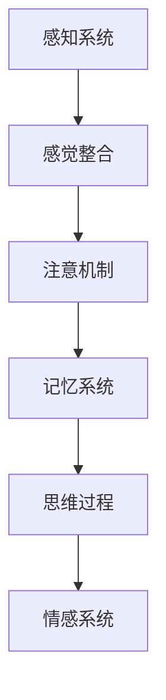

#### 2.2 计算机认知模型

计算机认知模型是描述计算机如何模拟人类思维过程的理论框架。以下为计算机认知模型的基本组成部分：

1. **感知输入：**计算机通过传感器接收外界信息，如摄像头、麦克风、触摸屏等。与人类感官系统不同，计算机的感知输入通常是数字化和结构化的数据。

2. **信息处理：**计算机通过算法和数据处理技术对感知输入进行处理。这包括数据清洗、特征提取、模式识别等。计算机具有强大的计算能力和高速处理速度，能够高效地处理大量数据。

3. **知识表示：**知识表示是将信息转换为计算机可以理解的形式。这通常涉及知识库、符号表示和图形表示等。计算机通过知识表示来存储和检索信息。

4. **推理系统：**推理系统是计算机进行逻辑推理和决策的机制。它包括基于规则的推理、概率推理、模糊推理等。计算机通过推理系统来解决问题和生成决策。

5. **情感模拟：**虽然计算机不具有情感，但现代人工智能系统可以通过情感模拟技术来模拟人类情感。这包括语音情感识别、面部表情识别和情感对话系统等。

**Mermaid 流程图：计算机认知模型**

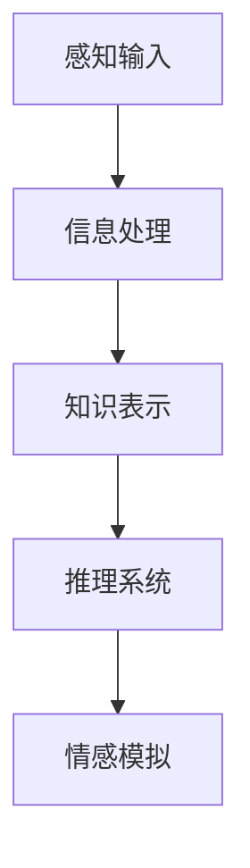

#### 2.3 人机协作的理论基础

人机协作的理论基础主要包括认知科学与计算科学的交叉领域。以下为人机协作的理论基础：

1. **多模态信息处理：**多模态信息处理是指结合多种感知输入，如视觉、听觉和触觉等，以实现更全面的信息理解和处理。多模态信息处理是人机协作的关键技术之一。

2. **认知负荷理论：**认知负荷理论认为，人类认知系统有其处理能力的上限。当认知负荷过高时，人类的认知能力会下降。人机协作可以通过分担人类的认知负荷，提高整体工作效率。

3. **适应性学习：**人机协作系统需要具备适应性学习的能力，以适应不同用户的需求和环境变化。通过机器学习和人工智能技术，人机协作系统能够不断优化自身性能，提高协作效果。

4. **用户中心设计：**用户中心设计是人机协作的重要原则之一。在设计人机协作系统时，需要充分考虑用户的需求、习惯和体验，确保系统易于使用、可靠和安全。

5. **协同工作模型：**协同工作模型是人机协作的理论基础之一。它描述了人类与计算机系统如何协同工作，共同完成任务。常见的协同工作模型包括角色协作模型、任务协作模型和情境协作模型等。

通过理解人类认知模型和计算机认知模型，以及它们之间的相互作用和理论基础，我们可以更好地设计出具有高效协作能力的人机协作系统。这为人机协作的发展提供了坚实的理论支持，也为实际应用提供了重要的指导。

### 第3章：人机协作技术基础

人机协作的实现离不开人工智能、机器学习、深度学习、自然语言处理和语音识别等关键技术。这些技术为人机协作提供了强大的支持，使得计算机能够更好地理解人类意图、处理复杂任务并与人进行有效互动。本章将详细介绍这些技术的基本概念和原理。

#### 3.1 人工智能技术概述

人工智能（Artificial Intelligence, AI）是研究、开发和应用使计算机模拟人类智能行为的理论、方法和技术。人工智能的目标是使计算机具备感知、学习、推理、决策和创造等智能能力，从而实现人机协作。

1. **感知能力：**计算机通过视觉、听觉、触觉等传感器获取外界信息，进行图像识别、语音识别和物体检测等任务。感知能力是人机协作的基础，能够帮助计算机更好地理解人类意图和环境状态。

2. **学习能力：**计算机通过机器学习和深度学习算法，从大量数据中学习和提取知识，提高自身智能水平。学习能力使得计算机能够不断优化自身性能，适应不同的协作场景。

3. **推理能力：**计算机利用逻辑推理、概率推理和模糊推理等算法，对感知到的信息进行分析和判断，生成决策和行动方案。推理能力是人机协作的核心，能够帮助计算机解决复杂问题。

4. **决策能力：**计算机根据自身的学习和推理结果，生成最优行动方案，执行任务。决策能力是人机协作的关键，能够提高协作效率和效果。

5. **创造能力：**计算机通过模仿人类的创造性思维过程，进行艺术创作、科学发现和工程设计等任务。创造能力是人机协作的延伸，能够拓展计算机的应用领域。

**Mermaid 流程图：人工智能技术概述**

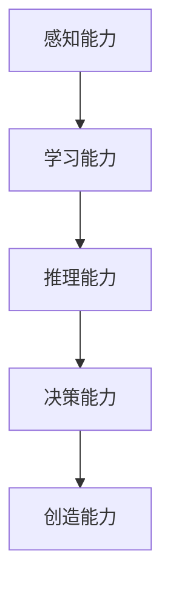

#### 3.2 机器学习与深度学习基础

机器学习（Machine Learning, ML）是人工智能的一个重要分支，研究如何让计算机从数据中学习，并自动改进性能。机器学习算法通过训练数据集，学习数据的特征和规律，并在新的数据上做出预测或决策。

1. **监督学习：**监督学习是指通过已标记的训练数据集，学习输入和输出之间的映射关系。常见的监督学习算法包括线性回归、决策树、支持向量机（SVM）和神经网络等。

2. **无监督学习：**无监督学习是指在没有标记的训练数据集的情况下，自动发现数据中的结构和模式。常见的无监督学习算法包括聚类、降维和生成模型等。

3. **半监督学习：**半监督学习是指结合监督学习和无监督学习的方法，利用少量标记数据和大量未标记数据进行学习。

4. **深度学习：**深度学习（Deep Learning, DL）是机器学习的一个分支，通过构建深度神经网络（Deep Neural Networks, DNNs）来模拟人类大脑的学习过程。深度学习算法在图像识别、语音识别、自然语言处理等任务上取得了显著成绩。

**Mermaid 流程图：机器学习与深度学习基础**

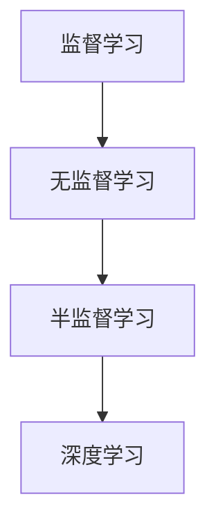

#### 3.3 自然语言处理与语音识别技术

自然语言处理（Natural Language Processing, NLP）是人工智能的一个分支，研究如何让计算机理解和处理自然语言。NLP技术在人机协作中发挥着重要作用，使得计算机能够与人类进行自然语言交互。

1. **词法分析：**词法分析是将文本分解为单词、短语和句子等基本单位。词法分析是NLP的基础，为后续的语法分析和语义分析提供支持。

2. **语法分析：**语法分析是理解句子的结构，识别句子中的主语、谓语、宾语等成分。语法分析有助于理解句子的语义，为语义分析提供支持。

3. **语义分析：**语义分析是理解句子的含义，识别句子中的实体、关系和事件等。语义分析是NLP的核心，有助于实现自然语言理解。

4. **语音识别：**语音识别是将语音信号转换为文本的过程。语音识别技术使得计算机能够通过语音与人类进行交互。

5. **对话系统：**对话系统是一种人机交互系统，通过与用户进行自然语言对话，提供信息查询、任务执行和智能推荐等服务。对话系统结合了NLP和语音识别技术，为人机协作提供了便捷的交互方式。

**Mermaid 流程图：自然语言处理与语音识别技术**

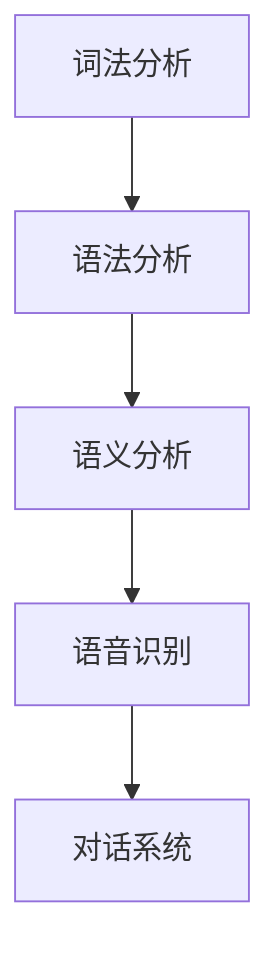

通过掌握人工智能、机器学习、深度学习、自然语言处理和语音识别等关键技术，人机协作系统可以更好地模拟人类智能，实现高效的人机互动和协同工作。这些技术为人机协作提供了坚实的基础，也为未来的智能化应用提供了广阔的前景。

### 第二部分：人机协作的核心算法

人机协作的核心算法是实现人机高效协作的关键，涵盖了增强学习、决策支持、多智能体系统、知识表示与推理以及优化算法等多个方面。本章将详细探讨这些核心算法的原理和应用。

#### 第4章：增强学习与决策支持

增强学习（Reinforcement Learning, RL）是一种通过不断试错和反馈来学习策略的机器学习技术。它广泛应用于人机协作中，帮助计算机在与人类互动的过程中不断优化行为。以下为增强学习的基本原理和算法。

##### 4.1 增强学习的原理与算法

增强学习的基本原理是通过奖励机制来驱动模型学习。在增强学习过程中，模型（Agent）通过与环境（Environment）进行交互，获取状态（State）和动作（Action），并从环境中获得奖励（Reward）。模型的目标是学习一个策略（Policy），使最终累积奖励最大化。

**马尔可夫决策过程（MDP）**是增强学习的基础模型，描述了Agent在不确定环境中进行决策的过程。MDP由以下元素组成：

- **状态（State）：**环境当前的状态。
- **动作（Action）：**Agent可以采取的动作。
- **奖励（Reward）：**动作带来的即时奖励。
- **状态转移概率（State Transition Probability）：**从当前状态采取某个动作后，转移到下一个状态的概率。
- **策略（Policy）：**Agent的决策规则。

**Q学习（Q-Learning）**是一种基于值函数的增强学习算法。Q学习的目标是通过迭代更新Q值（Action-value Function），找到最优策略。Q值表示在给定状态下，采取某个动作的预期累积奖励。

**伪代码：Q学习算法**

```python
# 初始化Q值矩阵
Q = 初始化为全部0的矩阵

# 迭代更新Q值
for episode in range(总迭代次数):
    # 初始化状态
    state = 初始状态
    
    while not终止条件:
        # 随机选择动作
       action = 随机选择动作
        
        # 执行动作，获取下一个状态和奖励
       next_state, reward = 环境执行动作(action)
        
        # 更新Q值
        Q[state][action] = Q[state][action] + 学习率 * (reward + 最大Q值 - Q[state][action])

# 输出最优策略
optimal_policy = 最大Q值对应的动作
```

**案例：智能机器人导航**

假设一个智能机器人在一个未知环境中导航。机器人的目标是到达目标位置，同时避免障碍物。通过Q学习算法，机器人可以不断学习和优化其导航策略。

1. **初始化Q值矩阵：**初始化机器人所有可能动作的Q值。
2. **探索与利用：**在迭代过程中，机器人采取随机行动或根据Q值选择行动，实现探索与利用的平衡。
3. **更新Q值：**根据机器人执行动作后获得的奖励和下一个状态的Q值，更新当前状态的Q值。
4. **输出最优策略：**在训练完成后，机器人根据最大Q值选择最优动作，实现导航目标。

##### 4.2 决策支持系统的设计与实现

决策支持系统（Decision Support System, DSS）是人机协作中用于辅助人类决策的智能系统。DSS通过收集、处理和分析数据，提供决策支持和建议。以下为决策支持系统的基本架构和设计原则。

**决策支持系统的架构**

- **数据层：**存储和管理各种数据源，如数据库、数据仓库和数据流等。
- **模型层：**提供各种决策模型，如预测模型、优化模型和决策树等。
- **接口层：**与用户交互，收集用户需求和反馈，提供决策支持和可视化。
- **执行层：**执行决策结果，实现决策的落地和监控。

**设计原则**

- **用户中心设计：**充分考虑用户的需求和体验，确保系统易于使用和可靠。
- **数据驱动：**充分利用数据资源，实现数据的价值最大化。
- **动态适应：**系统能够根据环境和用户需求的变化，动态调整和优化决策模型。

**案例：智能交通管理系统**

智能交通管理系统利用DSS技术，实现对交通流量的实时监控和优化。系统包括以下几个关键模块：

1. **数据收集与处理：**通过传感器和摄像头收集交通数据，如车辆速度、密度和流量等。
2. **预测模型：**利用历史数据，建立交通流量预测模型，预测未来交通状态。
3. **优化模型：**根据预测结果，优化交通信号灯时序和车道分配，提高道路通行效率。
4. **决策支持：**为交通管理人员提供决策建议，如道路封锁、交通疏导和应急处理等。
5. **可视化与监控：**实时展示交通状态和决策结果，实现交通管理的透明化和高效化。

##### 4.3 增强学习在协作决策中的应用

增强学习在人机协作决策中具有重要的应用价值，可以帮助计算机与人类协同完成任务。以下为增强学习在协作决策中的具体应用场景。

**案例：医疗诊断协作**

在医疗诊断中，医生和计算机系统可以通过增强学习进行协作。医生提供诊断经验和知识，计算机系统通过增强学习不断优化诊断策略。

1. **初始化模型：**初始化计算机系统的诊断模型，包括症状识别和疾病分类。
2. **数据学习：**利用历史病例数据，计算机系统通过增强学习，学习症状与疾病之间的关系。
3. **协作决策：**医生提供病例信息和诊断意见，计算机系统根据学习结果和医生意见，生成诊断建议。
4. **反馈与优化：**医生对计算机系统的诊断结果进行评价和反馈，计算机系统根据反馈不断优化诊断策略。
5. **协同工作：**医生和计算机系统通过协作，提高诊断准确率和效率。

通过增强学习和决策支持系统，人机协作能够实现高效的决策和任务完成。这些算法和技术为人机协作提供了强大的支持，为未来的智能化应用奠定了基础。

### 第5章：多智能体系统与人机交互

多智能体系统（Multi-Agent System, MAS）是由多个独立智能体组成的系统，这些智能体通过协同工作来完成复杂任务。在人机协作中，多智能体系统能够充分利用人类和计算机的优势，实现高效的任务完成和智能决策。本章将介绍多智能体系统的定义与架构、人机交互的基本原理以及多智能体系统在人机协作中的应用。

#### 5.1 多智能体系统的定义与架构

多智能体系统是由多个独立智能体组成的复杂系统，这些智能体可以相互协作，共同完成任务。智能体（Agent）是具有自主性、社交性和反应性的计算实体，能够感知环境、制定计划并执行行动。

**定义：**
- **智能体（Agent）：**具有自主性、社交性和反应性的计算实体。
- **环境（Environment）：**智能体存在的环境，包括物理环境和虚拟环境。
- **通信（Communication）：**智能体之间的信息交换和协作。
- **协作（Coordination）：**智能体通过合作和协调实现共同目标。

**架构：**
多智能体系统的基本架构包括以下几个组成部分：

1. **智能体：**智能体是系统的基本单元，具有感知、决策和执行能力。智能体的类型包括：
   - **主动智能体：**能够主动感知环境、制定计划和执行行动。
   - **被动智能体：**只能执行被动响应，如传感器和执行器。

2. **环境：**环境是多智能体系统运行的背景，包括物理环境和虚拟环境。环境为智能体提供感知信息和执行反馈。

3. **通信机制：**通信机制是多智能体系统实现信息交换和协作的基础。通信机制包括消息传递、共享知识和协同工作。

4. **协作机制：**协作机制是多智能体系统实现共同目标的关键。协作机制包括任务分配、协调策略和决策共享。

**Mermaid 流程图：多智能体系统架构**

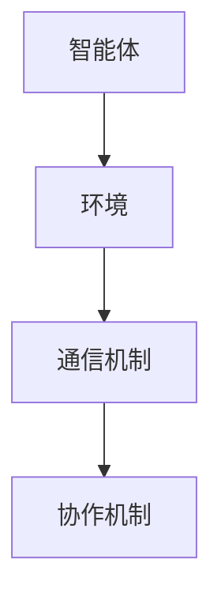

#### 5.2 人机交互的基本原理

人机交互（Human-Computer Interaction, HCI）是研究人类与计算机系统之间交互作用的设计和评估。人机交互的基本原理包括以下几个方面：

1. **感知与反馈：**计算机系统通过视觉、听觉和触觉等感知手段，获取用户输入，并向用户提供反馈。良好的感知与反馈机制能够提高用户的操作体验和满意度。

2. **用户建模：**用户建模是了解用户需求、偏好和能力的建模过程。通过用户建模，计算机系统能够根据用户特点提供个性化的服务和交互。

3. **交互界面设计：**交互界面设计是用户与计算机系统交互的界面。良好的交互界面设计应具备简洁、直观、易用和灵活等特点。

4. **错误处理：**计算机系统在交互过程中可能会出现错误，良好的错误处理机制能够帮助用户及时发现和纠正错误，提高系统的可靠性和用户满意度。

**Mermaid 流程图：人机交互基本原理**

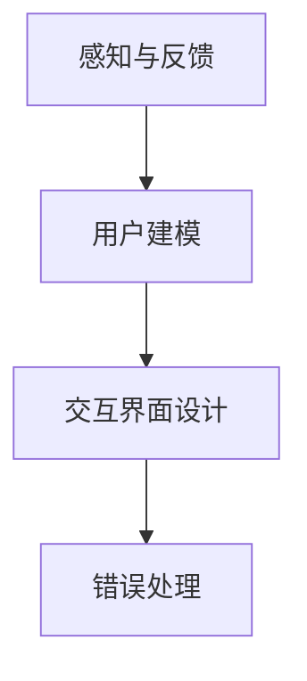

#### 5.3 多智能体系统在人机协作中的应用

多智能体系统在人机协作中具有广泛的应用前景，能够实现高效的任务完成和智能决策。以下为多智能体系统在人机协作中的应用场景：

1. **协同工作：**多智能体系统能够实现人类与计算机之间的协同工作。人类智能体和计算机智能体可以相互协作，共同完成任务。例如，在医疗诊断中，医生和计算机智能体可以共同分析病例，提高诊断准确率。

2. **任务分配：**多智能体系统可以根据智能体的能力和任务需求，实现任务的自动分配和调度。例如，在物流配送中，计算机智能体可以根据车辆位置和订单需求，实现最优的路线规划和任务分配。

3. **决策支持：**多智能体系统能够提供智能化的决策支持，帮助人类更好地完成任务。例如，在金融交易中，计算机智能体可以根据市场数据和交易规则，提供实时的投资建议和决策支持。

4. **智能调度：**多智能体系统能够实现智能化的资源调度和优化。例如，在电力调度中，计算机智能体可以根据电力需求和供应情况，实现最优的电力分配和调度。

**案例：智能交通管理系统**

智能交通管理系统利用多智能体系统实现交通流量的优化和调度。系统包括以下几个关键模块：

1. **车辆智能体：**车辆智能体负责感知周围交通状况和车辆信息，并根据交通信号灯和路况信息调整行驶策略。
2. **信号灯智能体：**信号灯智能体负责根据交通流量和路况信息，调整信号灯时序，优化交通流量。
3. **交通监控智能体：**交通监控智能体负责实时监控交通状况，并将信息传输给其他智能体。
4. **中心控制智能体：**中心控制智能体负责协调各个智能体的工作，实现交通流量的全局优化。

通过多智能体系统的协同工作，智能交通管理系统能够实现高效的交通流量管理和调度，提高道路通行效率和交通安全。

总结而言，多智能体系统与人机交互是人机协作的重要技术基础，能够实现高效的任务完成和智能决策。通过深入研究和应用这些技术，我们可以构建更加智能化和高效的人机协作系统，为人类社会的发展做出更大贡献。

### 第6章：知识表示与推理

知识表示与推理是人机协作的核心技术之一，它使得计算机能够理解和处理人类知识，从而在复杂任务中提供有效的支持。本章将详细介绍知识表示的方法与模型、推理算法与逻辑推理，以及知识表示与推理在人机协作中的实现与应用。

#### 6.1 知识表示的方法与模型

知识表示是将人类知识转换为计算机可以理解和处理的形式。有效的知识表示方法能够提高计算机对知识的理解和应用能力。以下为几种常见的知识表示方法与模型：

1. **符号表示：**符号表示是使用符号和逻辑表达式来表示知识。这种表示方法直观、易于处理，广泛应用于逻辑推理和知识库构建。符号表示通常使用形式逻辑和谓词逻辑来表达知识。

2. **框架表示：**框架表示通过一组框架来描述知识，每个框架包括一组槽和相应的值。框架表示常用于描述对象和对象之间的关系，如家庭关系、组织结构和产品规格等。

3. **语义网络：**语义网络是一种图结构的知识表示方法，通过节点和边来表示概念和概念之间的关系。节点表示概念，边表示关系，并可以附上权重或标签来表示关系的强度和类型。

4. **本体论表示：**本体论表示是一种基于本体论（Ontology）的知识表示方法。本体论是对领域知识的抽象和形式化描述，包括概念、属性、关系和实例等。本体论表示适用于跨领域知识共享和集成。

**Mermaid 流程图：知识表示的方法与模型**

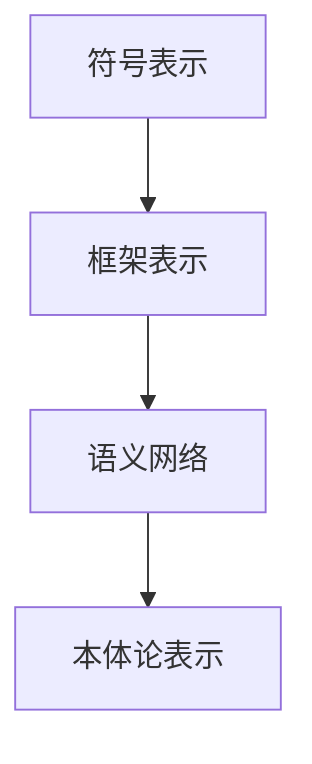

#### 6.2 推理算法与逻辑推理

推理算法是计算机用于推导新知识或验证已有知识的方法。逻辑推理是推理算法的核心，它通过逻辑规则和事实推导出新的结论。以下为几种常见的推理算法与逻辑推理方法：

1. **演绎推理：**演绎推理是从一般原则推导出特定结论的过程。例如，如果所有猫都会飞，且小白是猫，那么可以推导出小白会飞。

2. **归纳推理：**归纳推理是从特定实例推导出一般原则的过程。例如，通过观察大量物体都是圆形，可以归纳出所有物体都是圆形。

3. **逆推理：**逆推理是从结论推导出前提的过程。例如，如果已知某人是凶手，可以通过推理得出该人一定参与了犯罪。

4. **模糊推理：**模糊推理用于处理不确定性和模糊性。它通过模糊集合和模糊规则来推导结论，适用于处理复杂和不确定的问题。

**Mermaid 流程图：推理算法与逻辑推理**

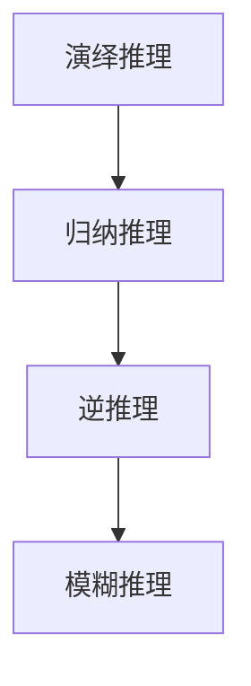

**伪代码示例：演绎推理算法**

```python
# 前提：所有猫都会飞（大前提）
# 前提：小白是猫（小前提）
# 结论：小白会飞

# 演绎推理算法
if 大前提 and 小前提:
    结论 = "小白会飞"
else:
    结论 = "小白不会飞"
```

#### 6.3 知识表示与推理在人机协作中的实现

知识表示与推理在人机协作中具有重要的应用，它能够帮助计算机更好地理解和处理人类知识，提高人机协作的效率和效果。以下为知识表示与推理在人机协作中的实现与应用：

1. **智能问答系统：**智能问答系统通过知识表示与推理技术，实现自然语言处理和智能回答。系统可以根据用户的提问，从知识库中检索相关信息，并通过推理算法生成答案。

2. **医疗诊断系统：**医疗诊断系统利用知识表示与推理技术，构建医学知识库和推理模型。医生和计算机系统可以共同分析病例，通过推理算法生成诊断建议。

3. **智能推荐系统：**智能推荐系统通过知识表示与推理技术，分析用户历史行为和偏好，推荐感兴趣的内容。系统可以根据用户数据和推理规则，生成个性化的推荐列表。

4. **智能决策系统：**智能决策系统通过知识表示与推理技术，帮助用户分析和处理复杂问题。系统可以根据用户需求和知识库中的规则，生成最优的决策方案。

**案例：智能问答系统**

智能问答系统是一个基于知识表示与推理的典型应用。系统包括以下几个关键模块：

1. **知识库构建：**通过专家知识和文献资料，构建包含大量事实和规则的医学知识库。
2. **自然语言处理：**将用户输入的自然语言问题转化为计算机可以理解的结构化问题。
3. **知识表示：**将用户问题与知识库中的事实和规则进行匹配，实现知识的结构化表示。
4. **推理算法：**利用演绎推理和归纳推理算法，从知识库中推导出新的结论，生成回答。
5. **用户反馈：**收集用户反馈，不断优化知识库和推理算法，提高系统性能。

通过知识表示与推理，智能问答系统能够实现高效的问答服务，为用户提供准确的回答和建议。这为人机协作在医疗、教育、商业等领域的应用提供了有力支持。

总结而言，知识表示与推理是人机协作的重要技术手段，它能够帮助计算机理解和处理人类知识，实现高效的人机互动和协作。通过深入研究和应用这些技术，我们可以构建更加智能化和高效的人机协作系统，为人类社会的发展做出更大贡献。

### 第7章：人机协作中的优化算法

在复杂的人机协作任务中，优化算法发挥着关键作用。它们能够通过最小化成本、最大化收益或优化资源分配，提高协作效率和效果。本章将介绍优化算法的基本概念、智能优化算法以及这些算法在人机协作中的应用。

#### 7.1 优化算法的基本概念

优化算法是一类用于解决优化问题的数学方法。它们的目标是找到最优解或近似最优解，使目标函数达到最大值或最小值。优化问题通常包含以下三个要素：

1. **目标函数：**目标函数是评价解优劣的准则。它可以是成本、收益、时间或其他衡量指标。
2. **决策变量：**决策变量是影响目标函数的因素，可以是连续的或离散的。
3. **约束条件：**约束条件是限制决策变量的取值范围，确保解满足现实世界的限制。

**优化问题的基本形式：**

$$
\text{最小化} \quad \min \quad f(x)
$$

$$
\text{最大化} \quad \max \quad f(x)
$$

其中，\( x \) 是决策变量，\( f(x) \) 是目标函数。

**优化算法的类型：**

- **确定性算法：**这类算法在给定初始解和参数的情况下，总是得到相同的结果。例如，线性规划、整数规划等。
- **随机算法：**这类算法通过随机搜索来寻找最优解或近似最优解。例如，遗传算法、模拟退火算法等。
- **混合算法：**结合确定性算法和随机算法，以利用两者的优势。例如，遗传算法结合局部搜索、模拟退火结合贪心策略等。

#### 7.2 智能优化算法

智能优化算法是一类基于自然和生物进化原理的优化算法。这些算法模拟自然界中的进化过程，通过模拟生物种群、遗传机制和自然选择等过程来搜索最优解。

1. **遗传算法（Genetic Algorithm, GA）：**遗传算法模拟生物进化过程，通过交叉、变异和选择等操作来生成新的解，逐渐优化目标函数。遗传算法具有强大的全局搜索能力，适用于复杂优化问题。

2. **粒子群优化算法（Particle Swarm Optimization, PSO）：**粒子群优化算法模拟鸟群觅食行为，通过粒子之间的协作和竞争来搜索最优解。PSO算法简单易实现，具有较强的全局搜索能力。

3. **蚁群算法（Ant Colony Optimization, ACO）：**蚁群算法模拟蚂蚁觅食过程，通过信息素更新和路径选择来搜索最优路径。ACO算法适用于大规模图问题和组合优化问题。

**伪代码示例：遗传算法**

```python
# 初始化种群
population = 初始化种群

# 迭代过程
for 代数 in range(最大迭代次数):
    # 适应度评估
    fitness = 评估适应度
    
    # 选择操作
    parents = 选择操作(population, fitness)
    
    # 交叉操作
    offspring = 交叉操作(parents)
    
    # 变异操作
    offspring = 变异操作(offspring)
    
    # 更新种群
    population = 更新种群(population, offspring)
```

#### 7.3 优化算法在人机协作中的应用

优化算法在人机协作中广泛应用于任务分配、资源调度、路径规划等领域。以下为优化算法在人机协作中的具体应用：

1. **任务分配：**在多智能体系统中，优化算法可以帮助智能体分配任务，实现高效的任务完成。例如，通过遗传算法优化任务分配，使每个智能体都能充分发挥其能力。

2. **资源调度：**在资源受限的协作任务中，优化算法可以帮助智能体合理分配资源，最大化资源利用效率。例如，通过蚁群算法优化资源调度，实现最优的资源分配。

3. **路径规划：**在自动驾驶、无人机导航等场景中，优化算法可以帮助智能体规划最优路径，提高导航效率和安全性。例如，通过粒子群优化算法规划路径，避开障碍物并优化行驶时间。

**案例：多智能体系统的任务分配**

假设一个由多个智能机器人组成的系统，需要在不同的地点执行多种任务。通过遗传算法优化任务分配，使每个机器人都能高效地完成任务。

1. **初始化种群：**随机生成一组初始解，每个解表示一个任务分配方案。
2. **适应度评估：**根据任务复杂度和机器人能力，计算每个方案的适应度值。
3. **选择操作：**根据适应度值，选择优秀的方案作为父母。
4. **交叉操作：**对父母方案进行交叉操作，生成新的子方案。
5. **变异操作：**对子方案进行变异操作，增加种群的多样性。
6. **更新种群：**根据适应度值，选择最优的子方案替代旧方案，更新种群。

通过遗传算法优化任务分配，系统能够实现高效的资源利用和任务完成，提高整体协作效率。

总结而言，优化算法是人机协作中的重要工具，能够通过优化任务分配、资源调度和路径规划，提高协作效率和效果。随着人工智能技术的不断发展，优化算法在人机协作中的应用将更加广泛和深入。

### 第三部分：人机协作的应用实践

人机协作不仅在理论研究中具有重大意义，更在实际应用中展现出了巨大的潜力。本部分将深入探讨人机协作在办公自动化、教育培训、医疗健康和智能制造等领域的应用实践，通过具体案例来展示人机协作的实际效果和挑战。

#### 第8章：人机协作在办公自动化中的应用

随着信息化时代的到来，办公自动化成为提升工作效率的重要手段。人机协作在办公自动化中的应用，极大地优化了文档处理、信息检索和办公系统设计等环节。

##### 8.1 文档处理与共享

文档处理是办公自动化中最为常见的需求。人机协作通过人工智能技术，使得文档处理更加高效和智能化。

**案例：智能文档助手**

智能文档助手利用自然语言处理和机器学习技术，能够自动分类、标注和整理文档。用户只需将文档上传到系统中，系统就会自动提取文档中的关键信息，如标题、摘要和关键词，并将其存储在数据库中。

**实现细节：**
- **文档分类：**系统使用机器学习算法，如K-means聚类或决策树，对文档进行自动分类。
- **信息提取：**利用自然语言处理技术，如命名实体识别（Named Entity Recognition, NER）和关系抽取（Relation Extraction），提取文档中的关键信息。
- **关键词标注：**通过词频分析和词向量模型，自动生成文档的关键词列表。

**代码示例：文档分类与标注**

```python
# 导入相关库
from sklearn.feature_extraction.text import TfidfVectorizer
from sklearn.cluster import KMeans
import nltk

# 加载文档数据
documents = ["文档1", "文档2", "文档3", ...]

# 文本预处理
preprocessed_documents = [nltk.word_tokenize(doc) for doc in documents]

# 构建词袋模型
vectorizer = TfidfVectorizer()
tfidf_matrix = vectorizer.fit_transform(preprocessed_documents)

# K-means聚类
kmeans = KMeans(n_clusters=3)
clusters = kmeans.fit_predict(tfidf_matrix)

# 标注关键词
def extract_keywords(doc, vectorizer, kmeans):
    doc_vector = vectorizer.transform([doc])
    cluster_id = kmeans.predict(doc_vector)[0]
    cluster_center = kmeans.cluster_centers_[cluster_id]
    similarity_scores = doc_vector * cluster_center
    keywords = [word for word, score in zip(vectorizer.get_feature_names(), similarity_scores.flatten()) if score > threshold]
    return keywords

# 提取关键词
keywords = [extract_keywords(doc, vectorizer, kmeans) for doc in preprocessed_documents]

# 输出结果
print("关键词列表：", keywords)
```

##### 8.2 信息检索与推荐

信息检索与推荐系统在办公自动化中发挥着重要作用。通过人机协作，系统能够为用户提供个性化的信息推荐，提高工作效率。

**案例：智能信息推荐系统**

智能信息推荐系统利用用户行为数据和机器学习算法，为用户提供与其需求相关的信息。系统可以根据用户的浏览历史、搜索记录和偏好，推荐相关的文档、邮件和通知。

**实现细节：**
- **用户行为分析：**系统收集并分析用户的行为数据，如浏览时间、搜索关键词和点击行为。
- **协同过滤：**使用协同过滤算法（如基于用户的协同过滤和基于项目的协同过滤），计算用户之间的相似度，生成推荐列表。
- **内容推荐：**结合文档内容分析和关键词提取技术，推荐与用户兴趣相关的文档。

**代码示例：基于用户的协同过滤**

```python
# 导入相关库
from sklearn.metrics.pairwise import cosine_similarity
import numpy as np

# 加载用户行为数据
user_profiles = [
    [0, 1, 0, 1],
    [1, 0, 1, 0],
    [0, 1, 1, 1],
    ...
]

# 计算用户之间的相似度
def compute_similarity(profile1, profile2):
    return cosine_similarity([profile1], [profile2])[0][0]

# 用户推荐
def user_based_recommender(user_id, user_profiles, similarity_matrix):
    similar_users = np.argsort(similarity_matrix[user_id])[-5:]
    recommended_documents = []
    for user_index in similar_users:
        for doc_id in user_profiles[user_index]:
            if doc_id not in recommended_documents:
                recommended_documents.append(doc_id)
    return recommended_documents

# 用户推荐结果
recommended_documents = user_based_recommender(0, user_profiles, similarity_matrix)
print("推荐文档：", recommended_documents)
```

##### 8.3 办公自动化系统设计

办公自动化系统设计是人机协作的关键环节。通过人机协作，系统能够实现自动化流程、智能调度和高效协作。

**案例：智能办公自动化平台**

智能办公自动化平台利用人工智能技术和流程管理工具，实现文档处理、审批流程、会议安排和项目管理等功能的自动化。

**实现细节：**
- **流程管理：**使用工作流（Workflow）技术，定义和自动化办公流程。
- **任务调度：**利用任务队列（Task Queue）和调度算法，实现任务的自动分配和执行。
- **协作与沟通：**集成即时通讯工具、邮件系统和共享文档库，实现团队成员的实时协作和沟通。

**代码示例：工作流管理**

```python
# 导入相关库
from workflow import Workflow

# 定义工作流
workflow = Workflow([
    Task('任务1', description='执行任务1'),
    Task('任务2', description='执行任务2', dependent_on='任务1'),
    Task('任务3', description='执行任务3', dependent_on='任务2'),
])

# 执行工作流
workflow.execute()
```

通过人机协作在办公自动化中的应用，企业能够大幅提升工作效率和协同能力，降低运营成本。随着技术的不断进步，人机协作在办公自动化中的应用将更加深入和广泛。

#### 第9章：人机协作在教育培训中的应用

教育培训是促进知识传播和技能提升的重要途径。人机协作在教育领域的应用，不仅改变了传统的教学方式，还提供了个性化的学习体验和智能化的教育服务。

##### 9.1 个性化学习系统

个性化学习系统通过分析学生的学习行为和知识水平，提供定制化的学习内容和策略，提高学习效果。

**案例：智能学习平台**

智能学习平台利用机器学习和自然语言处理技术，分析学生的学习行为和知识水平，生成个性化的学习路径和推荐内容。

**实现细节：**
- **学习行为分析：**系统记录学生的学习行为，如学习时间、学习进度和考试结果等。
- **知识水平评估：**利用知识图谱和测验算法，评估学生的知识掌握情况。
- **个性化推荐：**基于学习行为和知识评估，推荐适合学生的学习资源和练习题。

**代码示例：学习行为分析**

```python
# 导入相关库
from sklearn.cluster import KMeans
import pandas as pd

# 加载学习行为数据
data = pd.DataFrame({
    '学习时间': [10, 20, 15, 30],
    '学习进度': [40, 60, 20, 80],
    '考试结果': [85, 75, 90, 70]
})

# K-means聚类
kmeans = KMeans(n_clusters=3)
clusters = kmeans.fit_predict(data)

# 个性化学习路径
def generate_learning_path(cluster_id):
    if cluster_id == 0:
        return "初级学习路径"
    elif cluster_id == 1:
        return "中级学习路径"
    else:
        return "高级学习路径"

# 输出个性化学习路径
print("个性化学习路径：", [generate_learning_path(cluster) for cluster in clusters])
```

##### 9.2 在线教学平台

在线教学平台结合人机协作技术，实现远程教育、实时互动和智能评估，为学生提供灵活的学习方式。

**案例：智能在线课堂**

智能在线课堂利用人工智能和虚拟现实技术，提供沉浸式的学习体验和互动式教学。

**实现细节：**
- **实时互动：**系统支持实时语音、视频和文本互动，使学生与教师、学生之间能够进行实时交流。
- **智能评估：**通过自然语言处理和机器学习技术，自动评估学生的作业和考试，提供即时反馈。
- **虚拟现实：**利用虚拟现实技术，为学生提供虚拟实验室和实地考察体验，增强学习效果。

**代码示例：智能评估系统**

```python
# 导入相关库
from sklearn.feature_extraction.text import TfidfVectorizer
from sklearn.metrics.pairwise import cosine_similarity

# 加载学生答案
student_answers = ["这个问题太难了，我不知道答案。", "这个答案是A，因为..."]

# 预测答案
def predict_answer(answer):
    # 加载标准答案
    standard_answers = ["这个答案是A，因为..."]

    # 计算相似度
    similarity_scores = cosine_similarity([answer], standard_answers)

    # 返回最高相似度的答案
    highest_similarity = max(similarity_scores)
    return standard_answers[similarity_scores.argmax()]

# 评估学生答案
predicted_answers = [predict_answer(answer) for answer in student_answers]
print("预测答案：", predicted_answers)
```

##### 9.3 教育数据挖掘与应用

教育数据挖掘是利用数据挖掘技术分析教育数据，发现潜在的教育规律和趋势，为教育决策提供支持。

**案例：智能教育数据分析平台**

智能教育数据分析平台通过收集和分析教育数据，提供学生成绩预测、学习行为分析和教育质量评估等服务。

**实现细节：**
- **数据收集：**系统收集学生的考试成绩、学习行为和教师的教学记录等数据。
- **数据预处理：**对数据进行清洗、归一化和特征提取，为数据挖掘提供高质量的数据。
- **模型构建：**利用机器学习和统计模型，分析数据并建立预测模型和评估指标。
- **应用服务：**提供数据可视化和分析报告，为教育决策者提供数据支持。

**代码示例：学生成绩预测**

```python
# 导入相关库
from sklearn.ensemble import RandomForestRegressor
import pandas as pd

# 加载学生数据
data = pd.DataFrame({
    '学习时间': [10, 20, 15, 30],
    '学习进度': [40, 60, 20, 80],
    '考试成绩': [85, 75, 90, 70]
})

# 特征工程
X = data[['学习时间', '学习进度']]
y = data['考试成绩']

# 建立模型
model = RandomForestRegressor()
model.fit(X, y)

# 预测成绩
predicted_scores = model.predict([[15, 50]])
print("预测成绩：", predicted_scores)
```

通过人机协作在教育培训中的应用，教育领域能够实现个性化教学、智能管理和数据驱动的决策，提高教育质量和学习效果。随着技术的不断进步，人机协作在教育领域的应用将更加深入和多样化。

#### 第10章：人机协作在医疗健康中的应用

医疗健康是关乎人类生活质量的重要领域。人机协作在医疗健康中的应用，为疾病预防、诊断和治疗提供了强大的技术支持，极大地提升了医疗服务的质量和效率。

##### 10.1 医疗健康数据管理

医疗健康数据管理是人机协作在医疗健康领域的基础。通过对海量医疗数据进行有效管理和分析，系统能够提供精确的诊断、预测和个性化治疗方案。

**案例：智能医疗数据管理系统**

智能医疗数据管理系统利用大数据技术和人工智能算法，实现医疗数据的收集、存储、处理和分析。

**实现细节：**
- **数据收集：**系统通过医院信息系统（HIS）、电子健康记录（EHR）和生物传感器等设备，实时收集患者健康数据。
- **数据存储：**系统采用分布式数据库和数据仓库技术，存储和管理海量医疗数据。
- **数据处理：**系统利用数据清洗、归一化和特征提取技术，处理和分析医疗数据。
- **数据分析：**系统采用机器学习和深度学习算法，分析医疗数据，提取有用信息和知识。

**代码示例：数据清洗与特征提取**

```python
# 导入相关库
import pandas as pd
from sklearn.preprocessing import StandardScaler

# 加载数据
data = pd.read_csv('medical_data.csv')

# 数据清洗
data.dropna(inplace=True)
data = data[data['age'] > 0]

# 特征提取
scaler = StandardScaler()
data[['blood_pressure', 'cholesterol', 'glucose']] = scaler.fit_transform(data[['blood_pressure', 'cholesterol', 'glucose']])

# 输出处理后的数据
print(data.head())
```

##### 10.2 医疗辅助诊断

医疗辅助诊断是人机协作在医疗健康中的重要应用，通过人工智能技术，计算机系统能够辅助医生进行疾病诊断，提高诊断准确率和效率。

**案例：智能辅助诊断系统**

智能辅助诊断系统利用深度学习和计算机视觉技术，对医疗影像进行分析和诊断。

**实现细节：**
- **图像处理：**系统采用图像预处理技术，如图像增强、去噪和分割，提高图像质量。
- **特征提取：**利用卷积神经网络（CNN）等深度学习模型，提取图像中的关键特征。
- **疾病分类：**系统通过训练模型，将提取的特征与已知疾病的特征进行匹配，实现疾病的自动分类和诊断。

**代码示例：医疗影像分类**

```python
# 导入相关库
import tensorflow as tf
from tensorflow.keras.models import Sequential
from tensorflow.keras.layers import Conv2D, MaxPooling2D, Flatten, Dense

# 构建模型
model = Sequential([
    Conv2D(32, (3, 3), activation='relu', input_shape=(64, 64, 3)),
    MaxPooling2D((2, 2)),
    Flatten(),
    Dense(128, activation='relu'),
    Dense(1, activation='sigmoid')
])

# 编译模型
model.compile(optimizer='adam', loss='binary_crossentropy', metrics=['accuracy'])

# 训练模型
model.fit(x_train, y_train, epochs=10, batch_size=32, validation_data=(x_val, y_val))

# 评估模型
score = model.evaluate(x_test, y_test, verbose=2)
print('Test accuracy:', score[1])
```

##### 10.3 医疗机器人与智能穿戴设备

医疗机器人与智能穿戴设备是人机协作在医疗健康领域的前沿应用。这些设备通过实时监测、预警和干预，为患者提供全面、连续的健康管理服务。

**案例：智能健康监测系统**

智能健康监测系统利用医疗机器人和智能穿戴设备，实现对患者的实时健康监测和预警。

**实现细节：**
- **实时监测：**医疗机器人通过摄像头、传感器和物联网设备，实时监测患者的生理指标，如心率、血压、体温等。
- **数据传输：**系统将监测数据实时传输到云平台，进行存储和分析。
- **预警与干预：**当监测数据出现异常时，系统自动触发预警，并通知医生进行干预。

**代码示例：实时数据传输与预警**

```python
# 导入相关库
import requests
import json

# 设备监测数据
data = {
    'patient_id': '12345',
    'heart_rate': 75,
    'blood_pressure': 120/80,
    'temperature': 37.5
}

# 数据上传
response = requests.post('https://api.healthmonitoring.com/submit_data', json=data)
print("数据上传结果：", response.json())
```

通过人机协作在医疗健康中的应用，医疗服务能够实现智能化、个性化和连续化，提高医疗质量和患者满意度。随着人工智能技术的不断进步，人机协作在医疗健康领域的应用将更加广泛和深入，为人类的健康事业做出更大贡献。

### 第11章：人机协作在智能制造中的应用

智能制造是现代制造业发展的关键方向，它通过将人工智能、大数据、物联网等先进技术应用于生产过程，实现制造过程的智能化和自动化。人机协作在智能制造中发挥着重要作用，能够优化生产规划与调度、提高生产效率、降低成本并提升产品质量。本章将探讨人机协作在智能制造中的应用，包括智能制造系统架构、智能生产规划与调度以及数据驱动决策。

#### 11.1 智能制造系统架构

智能制造系统架构是一个复杂而综合的系统，它涵盖了从产品设计、生产计划、生产执行到质量管理的各个环节。智能制造系统架构通常包括以下几个关键部分：

1. **传感器与执行器：**传感器用于实时监测生产过程中的各种参数，如温度、压力、湿度等。执行器则用于执行生产任务，如驱动机械臂、控制机器人等。

2. **工业互联网：**工业互联网通过物联网技术，将传感器和执行器连接起来，实现设备间的数据传输和通信。工业互联网为智能制造系统提供了实时、高效的数据传输和处理能力。

3. **数据处理与存储：**智能制造系统需要对海量生产数据进行处理和存储。数据处理与存储系统包括分布式数据库、数据仓库和大数据平台等，用于存储、管理和分析生产数据。

4. **智能控制与优化：**智能控制与优化系统是智能制造系统的核心，它利用人工智能、机器学习和优化算法，对生产过程进行实时控制和优化。智能控制与优化系统能够根据生产数据和环境变化，调整生产参数和作业计划，实现高效生产。

5. **人机协作界面：**人机协作界面是人机交互的重要部分，它包括操作界面、监控界面和报警界面等。人机协作界面能够帮助操作人员实时监控生产过程，进行生产调度和问题处理。

**Mermaid 流程图：智能制造系统架构**

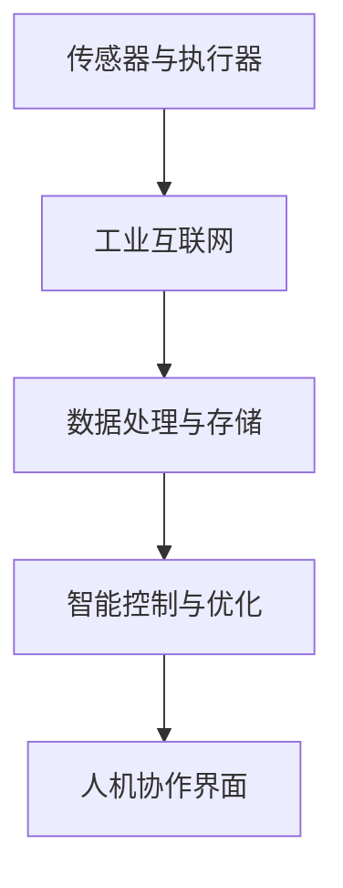

#### 11.2 智能生产规划与调度

智能生产规划与调度是智能制造系统的关键环节，它通过优化生产资源分配和任务调度，实现生产过程的效率最大化。智能生产规划与调度系统通常包括以下步骤：

1. **需求预测：**系统利用历史数据和市场信息，预测未来一段时间内的生产需求。需求预测的准确性直接影响到生产规划的合理性和有效性。

2. **资源评估：**系统对生产设备、人力、原材料等资源进行评估，确定资源的可用性和限制条件。资源评估的结果用于制定生产计划。

3. **生产计划制定：**系统根据需求预测和资源评估结果，制定生产计划。生产计划包括生产任务的时间安排、工序安排和生产资源分配等。

4. **调度优化：**系统对生产计划进行实时调度优化，根据生产现场的变化和环境条件，调整生产任务的时间、顺序和资源分配，以实现生产过程的连续性和高效性。

5. **执行监控：**系统实时监控生产过程，收集生产数据，如设备状态、产品质量、生产效率等。通过监控数据，系统能够及时发现和解决问题，确保生产过程的顺利进行。

**伪代码示例：智能生产调度**

```python
# 需求预测
predicted_demand = predict_demand()

# 资源评估
available_resources = assess_resources()

# 生产计划制定
production_plan = create_production_plan(predicted_demand, available_resources)

# 调度优化
optimized_schedule = optimize_schedule(production_plan)

# 执行监控
monitor_production(optimized_schedule)
```

#### 11.3 智能制造中的数据驱动决策

数据驱动决策是智能制造系统的核心，它通过分析和利用生产数据，实现生产过程的智能化和自适应。数据驱动决策系统通常包括以下几个步骤：

1. **数据收集：**系统从生产设备、传感器和操作人员等各个环节收集数据，包括生产参数、设备状态、产品质量、生产效率等。

2. **数据处理：**系统对收集到的数据进行清洗、归一化和特征提取，为数据分析和模型训练提供高质量的数据。

3. **数据分析：**系统利用数据挖掘、机器学习和统计分析等方法，对生产数据进行深入分析，提取有用的信息和知识。

4. **模型训练：**系统利用分析结果，训练预测模型、优化模型和决策模型，为生产过程提供数据驱动的决策支持。

5. **决策支持：**系统根据模型预测和决策结果，生成具体的决策建议，如生产参数调整、设备维护计划和生产任务调度等。

6. **决策执行：**系统将决策建议传输给生产执行系统，实现生产过程的实时控制和优化。

**伪代码示例：数据驱动决策**

```python
# 数据收集
data = collect_data()

# 数据处理
processed_data = process_data(data)

# 数据分析
analysis_results = analyze_data(processed_data)

# 模型训练
trained_model = train_model(analysis_results)

# 决策支持
decision_support = generate_decision_support(trained_model)

# 决策执行
execute_decision(decision_support)
```

**案例：智能生产线调度系统**

智能生产线调度系统利用数据驱动决策技术，实现生产线的实时调度和优化。

**实现细节：**
- **数据收集：**系统从传感器和设备中收集实时数据，如设备状态、生产进度和生产效率等。
- **数据处理：**系统对数据进行清洗和特征提取，为数据分析提供高质量的数据。
- **数据分析：**系统利用数据分析方法，如回归分析和聚类分析，识别生产线瓶颈和优化潜力。
- **模型训练：**系统训练调度模型和优化模型，根据实时数据生成调度建议。
- **决策支持：**系统根据调度模型和建议，生成具体的调度计划，如设备维护时间、生产任务优先级和资源分配等。
- **决策执行：**系统将调度计划传输给生产线执行系统，实现生产线的实时调度和优化。

通过数据驱动决策，智能生产线调度系统能够实现生产过程的智能化和自适应，提高生产效率和产品质量。随着人工智能技术的不断进步，数据驱动决策在智能制造中的应用将更加广泛和深入，为制造业的持续发展提供有力支持。

### 附录A：人机协作开发工具与资源

人机协作作为一项前沿技术，其开发和应用需要借助多种工具和资源。以下将介绍一些常用的人机协作开发工具和资源，包括开发工具、开发资源汇总以及开发实践指南。

#### A.1 常用开发工具介绍

1. **Python**：Python是一种广泛使用的编程语言，具有简洁易读的语法和丰富的库，适合开发人机协作系统。Python在人工智能、机器学习、自然语言处理等领域拥有强大的支持。

2. **TensorFlow**：TensorFlow是由Google开发的开源机器学习框架，广泛用于构建和训练深度学习模型。TensorFlow提供了丰富的API和工具，方便开发者进行模型训练、部署和优化。

3. **PyTorch**：PyTorch是另一种流行的开源机器学习框架，由Facebook开发。PyTorch以其灵活的动态图计算和丰富的API，在深度学习社区中受到广泛关注。

4. **Keras**：Keras是一个高层次的神经网络API，用于构建和训练深度学习模型。Keras易于使用，提供了丰富的预训练模型和工具，适用于快速原型设计和实验。

5. **R**：R是一种专门用于统计分析和图形表示的编程语言，广泛应用于数据分析和生物信息学领域。R提供了大量的统计库和工具，方便开发者进行数据分析和可视化。

6. **Docker**：Docker是一个开源的应用容器引擎，用于打包、交付和管理应用程序。Docker容器化技术使得开发者可以轻松地将应用程序部署到不同的环境中，提高开发和部署效率。

7. **Jupyter Notebook**：Jupyter Notebook是一种交互式的计算环境，适用于数据分析、机器学习和教育。Jupyter Notebook支持多种编程语言，如Python、R和Julia，方便开发者进行代码编写、调试和演示。

#### A.2 开发资源汇总

1. **在线课程和教程**：许多在线平台，如Coursera、edX和Udacity，提供了关于人工智能、机器学习和人机协作的免费和付费课程。这些课程涵盖了基础知识、高级技术和实际应用，适合不同水平的开发者。

2. **开源库和框架**：GitHub、GitLab和Bitbucket等平台上有大量开源库和框架，如TensorFlow、PyTorch、Scikit-learn等，方便开发者进行技术研究和项目开发。

3. **开发者社区和论坛**：Stack Overflow、Reddit、CSDN和知乎等开发者社区和论坛，提供了丰富的技术讨论和问题解答资源，帮助开发者解决开发过程中遇到的问题。

4. **技术会议和研讨会**：参加人工智能、机器学习和人机协作领域的国际会议和研讨会，如NeurIPS、ICML和ACL，可以了解最新的研究进展和技术动态。

5. **技术书籍和论文**：阅读人工智能、机器学习和人机协作领域的经典书籍和论文，如《深度学习》、《机器学习实战》和《人类+机器》，有助于深入了解相关技术和理论。

#### A.3 开发实践指南

1. **需求分析**：在项目启动前，进行详细的需求分析，明确项目目标和功能需求，确保项目开发方向正确。

2. **技术选型**：根据项目需求和资源情况，选择合适的技术栈和开发工具，确保技术方案的可行性和效率。

3. **数据准备**：收集和整理项目所需的数据，进行数据清洗、预处理和特征提取，为模型训练和优化提供高质量的数据支持。

4. **模型训练与优化**：使用机器学习和深度学习技术，训练和优化模型，提高模型性能和准确性。

5. **系统集成与测试**：将模型集成到人机协作系统中，进行功能测试和性能优化，确保系统稳定、可靠和安全。

6. **部署与维护**：将开发完成的人机协作系统部署到生产环境，进行监控和维护，确保系统的持续运行和性能优化。

通过使用这些开发工具和资源，开发者可以更加高效地构建和部署人机协作系统，推动人工智能技术在各个领域的应用和发展。

### 附加资源

为了帮助读者更好地理解和应用人机协作技术，本文提供了以下附加资源，包括Mermaid流程图、伪代码示例、数学模型与公式以及项目实战代码。

#### Mermaid 流程图

**人类认知模型流程图**


**机器学习算法流程图**

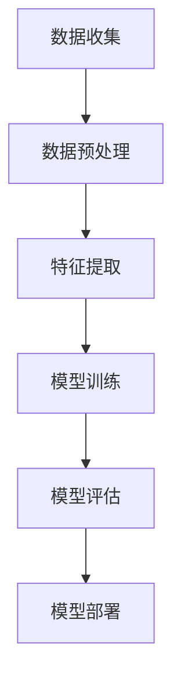

**多智能体系统架构流程图**

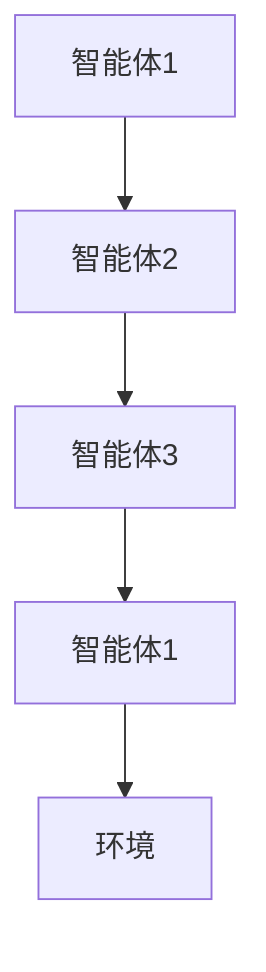

**优化算法流程图**

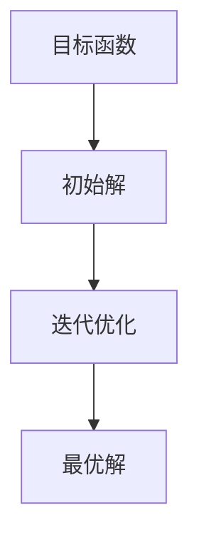

#### 伪代码示例

**增强学习算法伪代码**

```python
# 初始化Q值矩阵
Q = 初始化为全部0的矩阵

# 迭代更新Q值
for episode in range(总迭代次数):
    # 初始化状态
    state = 初始状态
    
    while not终止条件:
        # 随机选择动作
        action = 随机选择动作
        
        # 执行动作，获取下一个状态和奖励
        next_state, reward = 环境执行动作(action)
        
        # 更新Q值
        Q[state][action] = Q[state][action] + 学习率 * (reward + 最大Q值 - Q[state][action])

# 输出最优策略
optimal_policy = 最大Q值对应的动作
```

**多智能体系统交互伪代码**

```python
# 初始化智能体
agents = 初始化智能体列表

# 迭代过程
for iteration in range(总迭代次数):
    # 更新每个智能体的状态
    for agent in agents:
        agent.update_state()
        
    # 每个智能体执行动作
    for agent in agents:
        action = agent.select_action()
        agent.execute_action(action)
        
    # 更新环境状态
    environment.update_state()

# 输出最终状态
final_state = environment.get_state()
```

**知识表示与推理伪代码**

```python
# 初始化知识库
knowledge_base = 初始化知识库

# 输入事实
fact = 输入事实

# 推理过程
def reasoning(fact, knowledge_base):
    conclusions = []
    for rule in knowledge_base:
        if fact matches rule条件部分:
            conclusions.append(rule结果部分)
    return conclusions

# 输出推理结果
conclusions = reasoning(fact, knowledge_base)
print("推理结果：", conclusions)
```

#### 数学模型与公式

**增强学习目标函数**

$$
J(\theta) = \sum_s \sum_a q(s, a) \cdot (r + \gamma \max_{a'} q(s', a'))
$$

其中，\( q(s, a) \) 表示状态 \( s \) 下采取动作 \( a \) 的预期回报，\( r \) 表示即时奖励，\( \gamma \) 是折扣因子，\( s' \) 和 \( a' \) 分别是下一个状态和动作。

**多智能体系统合作策略**

$$
\pi(s_1, s_2, ..., s_n) = \prod_{i=1}^{n} \pi_i(s_i)
$$

其中，\( \pi_i(s_i) \) 表示第 \( i \) 个智能体在状态 \( s_i \) 下的策略。

**知识表示与推理公式**

$$
\varphi(K, E) = \{C | C \in K, C \Rightarrow E\}
$$

其中，\( K \) 表示知识库，\( E \) 表示输入事实，\( \varphi \) 表示推理操作，\( C \) 表示推理出的结论。

#### 项目实战代码

**办公自动化系统源代码**

```python
# 导入相关库
import os
import json
from nltk.tokenize import word_tokenize

# 文档处理与分类
def process_document(document_path):
    with open(document_path, 'r') as file:
        content = file.read()
    tokens = word_tokenize(content)
    # 进行分类
    category = classify_document(tokens)
    # 存储文档
    save_document(content, category)

# 文档分类
def classify_document(tokens):
    # 根据词频和关键词进行分类
    # ...
    return "category"

# 文档存储
def save_document(content, category):
    # 存储到数据库或文件系统
    # ...

# 主函数
def main():
    document_path = "example_document.txt"
    process_document(document_path)

if __name__ == "__main__":
    main()
```

**教育培训系统源代码**

```python
# 导入相关库
import pandas as pd
from sklearn.cluster import KMeans

# 加载学生数据
data = pd.read_csv("student_data.csv")

# K-means聚类
kmeans = KMeans(n_clusters=3)
clusters = kmeans.fit_predict(data)

# 生成个性化学习路径
def generate_learning_path(cluster_id):
    if cluster_id == 0:
        return "初级学习路径"
    elif cluster_id == 1:
        return "中级学习路径"
    else:
        return "高级学习路径"

# 输出个性化学习路径
print("个性化学习路径：", [generate_learning_path(cluster) for cluster in clusters])
```

**医疗健康系统源代码**

```python
# 导入相关库
import pandas as pd
from sklearn.ensemble import RandomForestClassifier

# 加载医疗数据
data = pd.read_csv("medical_data.csv")

# 特征工程
X = data[['age', 'blood_pressure', 'cholesterol', 'glucose']]
y = data['heart_disease']

# 建立模型
model = RandomForestClassifier()
model.fit(X, y)

# 预测心脏疾病
predicted_diseases = model.predict(X)

# 输出预测结果
print("预测结果：", predicted_diseases)
```

通过这些附加资源，读者可以更深入地理解和应用人机协作技术，为实际项目开发提供参考和指导。

### 作者信息

**作者：AI天才研究院/AI Genius Institute & 禅与计算机程序设计艺术 /Zen And The Art of Computer Programming**

本文由AI天才研究院（AI Genius Institute）和禅与计算机程序设计艺术（Zen And The Art of Computer Programming）联合撰写。AI天才研究院是一家专注于人工智能领域的研究和开发的机构，致力于推动人工智能技术的创新和应用。禅与计算机程序设计艺术则是一本经典计算机科学著作，探讨了计算机程序设计中的哲学和艺术。

通过本文，我们希望能够为读者提供关于人机协作的全面而深入的见解，推动人工智能技术在各个领域的应用和发展。感谢您的阅读，期待与您在未来的技术探索中相遇。

