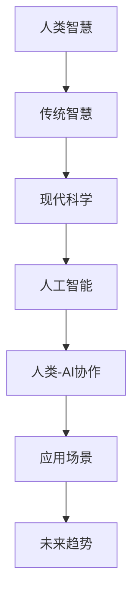
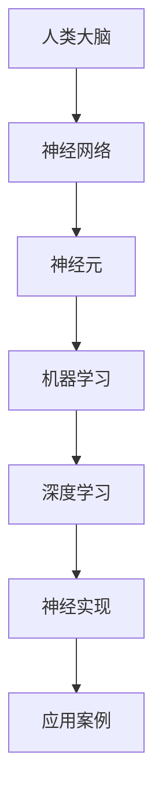
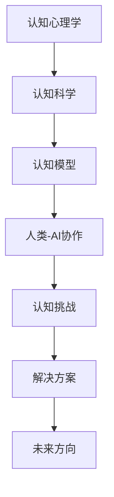
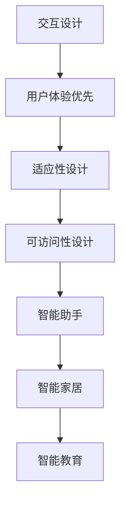
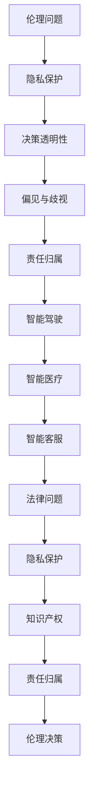
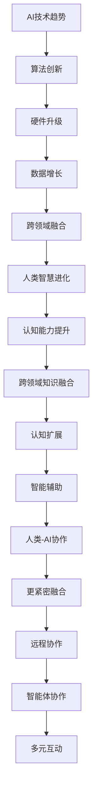
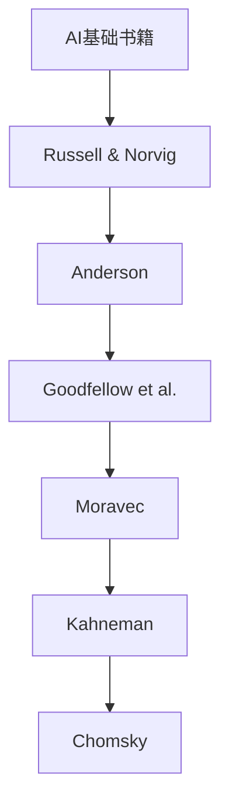

                 

### 第1章: 人类-AI协作概述

> 关键词：人工智能，人类智慧，协作，融合，应用场景，未来趋势

> 摘要：本章将介绍人类-AI协作的基本概念、起源、演变以及重要性。通过分析AI技术的分类和应用，讨论人类-AI协作的必要性和面临的挑战，并探讨其未来发展趋势。此外，还将简要介绍本书的结构安排和学习目标。

#### 1.1 AI的起源与人类智慧的演进

##### 1.1.1 人工智能的起源

人工智能（AI）的概念起源于20世纪50年代。最早的人工智能系统是由计算机科学家约翰·麦卡锡（John McCarthy）等人于1956年在达特茅斯会议上提出的。该会议旨在探讨使计算机表现出智能行为的方法和途径。从此，人工智能作为一个研究领域正式诞生。

早期的AI研究主要集中在符号主义方法上，即通过编写程序来模拟人类的推理和决策过程。这种方法在早期的逻辑推理和问题解决中取得了一定的成功，但随后由于计算能力和数据资源的限制，其发展速度逐渐放缓。

##### 1.1.2 人类智慧的演进

人类智慧的发展经历了漫长的过程。从最早的原始人类开始，通过工具的使用和语言的发展，人类逐渐掌握了认知和解决问题的能力。随着人类文明的进步，科学、技术和文化的发展进一步增强了人类的智慧。

在过去的几千年中，人类智慧的表现形式不断丰富。从古代的哲学思考到现代的科学发现，人类智慧的演进推动了社会的进步和发展。

##### 1.1.3 AI与人类智慧的关系

人工智能是计算机科学的一个分支，旨在使计算机系统能够执行通常需要人类智能的任务，如视觉识别、语言理解、决策和问题解决等。AI与人类智慧的关系可以从以下几个方面来理解：

1. **辅助与增强**：AI可以作为人类的助手，帮助人类处理复杂任务，提高工作效率。例如，在医疗领域，AI可以帮助医生分析医学图像，提高诊断的准确性。

2. **拓展与延伸**：AI可以拓展人类的认知范围和解决问题的方式。例如，通过大数据分析和机器学习，AI可以帮助人类发现新的科学规律和商业模式。

3. **替代与补充**：在某些领域，AI可以替代人类完成特定任务。例如，在制造业中，机器人可以替代人类进行重复性、危险性或繁琐的工作。

4. **融合与创新**：AI与人类智慧的融合可以创造出新的创新和突破。例如，在艺术创作领域，AI可以与人类艺术家合作，创造出独特的艺术作品。

#### 1.2 AI技术的分类与应用

##### 1.2.1 狭义AI与广义AI

人工智能可以分为狭义AI和广义AI。狭义AI（Narrow AI）是指专门针对特定任务进行优化的AI系统，如语音识别、图像识别等。广义AI（General AI）是指具有普遍智能的AI系统，能够执行各种任务，与人类智慧具有类似的灵活性和适应性。

目前，大部分AI系统属于狭义AI。尽管狭义AI在特定领域取得了显著成果，但要实现真正的广义AI仍然面临巨大挑战。

##### 1.2.2 AI技术的分类

AI技术可以按照不同的维度进行分类，如按照任务类型、算法原理和应用领域等。以下是一些常见的AI技术分类：

1. **机器学习**：一种通过数据和算法来使计算机自动改进性能的技术。包括监督学习、无监督学习、半监督学习和强化学习等。

2. **自然语言处理**：研究如何让计算机理解和生成自然语言的技术。包括文本分类、情感分析、机器翻译等。

3. **计算机视觉**：研究如何让计算机理解和解释图像和视频的技术。包括图像识别、目标检测、图像生成等。

4. **专家系统**：一种基于知识和推理的AI系统，用于模拟人类专家的决策过程。包括医疗诊断、法律咨询等。

##### 1.2.3 AI技术的应用场景

AI技术已经在许多领域得到广泛应用，如：

1. **医疗健康**：AI可以帮助医生进行疾病诊断、个性化治疗和健康管理等。

2. **金融服务**：AI可以用于风险管理、欺诈检测、投资顾问等。

3. **制造业**：AI可以用于生产优化、质量控制、设备维护等。

4. **交通运输**：AI可以用于自动驾驶、智能交通管理、物流优化等。

5. **教育**：AI可以用于个性化学习、智能辅导、教育评估等。

#### 1.3 人类-AI协作的必要性与挑战

##### 1.3.1 人类-AI协作的必要性

人类-AI协作的必要性体现在以下几个方面：

1. **提高工作效率**：AI可以帮助人类处理大量数据和复杂任务，从而提高工作效率。

2. **拓展人类认知**：AI可以扩展人类的认知能力，帮助人类发现新的知识和规律。

3. **解决复杂问题**：某些问题过于复杂，单靠人类智慧难以解决，AI可以提供有效的解决方案。

4. **促进科技创新**：AI与人类智慧的融合可以推动科技创新，带来新的商业机会和社会变革。

##### 1.3.2 人类-AI协作的挑战

尽管人类-AI协作具有巨大潜力，但同时也面临一些挑战：

1. **技术挑战**：如何设计出更智能、更可靠的AI系统，以及如何实现人与AI系统的有效协作。

2. **伦理挑战**：如何确保AI系统的透明性、公平性和安全性，以及如何处理AI系统带来的伦理问题。

3. **社会挑战**：如何适应AI时代的变革，如何确保人类在AI系统中的角色和价值。

##### 1.3.3 人类-AI协作的未来趋势

随着AI技术的不断进步，人类-AI协作的未来趋势将体现在以下几个方面：

1. **更紧密的融合**：AI系统将更加智能和人性化，与人类的协作将更加紧密和高效。

2. **广泛的应用领域**：AI技术将在更多领域得到应用，推动社会的发展和变革。

3. **多元化的协作方式**：人类-AI协作将呈现多元化的形式，如远程协作、智能体协作等。

#### 1.4 本书结构安排与学习目标

##### 1.4.1 本书结构安排

本书分为八个章节，涵盖了人类-AI协作的各个方面。具体章节安排如下：

- 第1章：人类-AI协作概述
- 第2章：人类-AI协作的神经基础
- 第3章：人类-AI协作的认知基础
- 第4章：人类-AI协作的交互设计
- 第5章：人类-AI协作的伦理与法律问题
- 第6章：人类-AI协作的实践案例
- 第7章：人类-AI协作的未来发展
- 第8章：结论与展望

##### 1.4.2 学习目标

通过阅读本书，读者可以：

- 了解人类-AI协作的基本概念和原理
- 掌握人类-AI协作的技术基础和认知基础
- 学习人类-AI协作的交互设计和伦理法律问题
- 分析人类-AI协作的实践案例
- 探索人类-AI协作的未来发展趋势
- 培养人类-AI协作的意识和能力

---

**Mermaid 流程图**



---

本文通过逻辑清晰、结构紧凑的方式，介绍了人类-AI协作的基本概念、起源、分类与应用，以及其必要性和挑战。接下来，我们将深入探讨人类-AI协作的神经基础和认知基础，为后续章节的内容奠定基础。

---

### 第2章: 人类-AI协作的神经基础

> 关键词：人类大脑，神经网络，机器学习，深度学习，协作实现

> 摘要：本章将探讨人类-AI协作的神经基础，首先介绍人类大脑的结构与功能，神经元与神经网络的基本概念，并分析神经网络对人工智能的启发。接着，深入讨论机器学习与深度学习的原理和优势，最后阐述人类-AI协作的神经实现及其案例。

#### 2.1 人类大脑与神经网络

##### 2.1.1 人类大脑的结构与功能

人类大脑是神经系统的核心，由大约860亿个神经元组成。大脑可以分为几个主要区域，如大脑皮层、丘脑、小脑和脑干等。每个区域都有特定的功能，共同协调完成复杂的认知和运动任务。

1. **大脑皮层**：大脑皮层是大脑的最外层，负责感知、思考、记忆和决策等功能。
2. **丘脑**：丘脑是大脑内部的一个重要结构，负责传递感觉和运动信号。
3. **小脑**：小脑主要协调运动和平衡，对运动控制和精细动作至关重要。
4. **脑干**：脑干控制基本生命功能，如心跳、呼吸和消化。

##### 2.1.2 神经元与神经网络

神经元是大脑的基本构建单元，具有接收、处理和传递信息的功能。神经元通过树突接收来自其他神经元的信号，经过细胞体处理后，通过轴突将信号传递给下一个神经元。

神经网络是由大量相互连接的神经元组成的系统，可以模拟人类大脑的信息处理和决策过程。神经网络可以分为以下几个层次：

1. **输入层**：接收外部输入信息，如视觉、听觉和触觉等。
2. **隐藏层**：对输入信息进行处理和变换，隐藏层可以有多个。
3. **输出层**：产生最终输出结果，如决策、分类和预测等。

##### 2.1.3 神经网络的启发

神经网络的结构和功能为人工智能的发展提供了重要启示。通过模拟人类大脑的信息处理过程，神经网络能够实现复杂的模式识别、决策和预测任务。以下是一些神经网络对人工智能的启发：

1. **层次化结构**：神经网络通过层次化的结构实现对复杂任务的分解和处理，类似于人类大脑的分层结构。
2. **自适应学习**：神经网络可以通过学习调整神经元之间的连接权重，实现对新任务的适应和优化。
3. **分布式计算**：神经网络通过分布式计算方式处理信息，提高了系统的鲁棒性和容错性。

#### 2.2 机器学习与深度学习

##### 2.2.1 机器学习的概念

机器学习是一种使计算机系统能够从数据中学习和改进性能的方法。机器学习可以分为以下几个主要类别：

1. **监督学习**：通过已标记的输入输出数据训练模型，用于预测未知数据的输出。
2. **无监督学习**：没有预先标记的输入数据，通过探索数据结构和模式进行学习。
3. **半监督学习**：结合监督学习和无监督学习的特点，利用少量标记数据和大量未标记数据进行学习。
4. **强化学习**：通过奖励机制训练模型，使其能够在动态环境中进行决策和优化。

##### 2.2.2 深度学习的原理

深度学习是机器学习的一个重要分支，通过构建深度神经网络来实现复杂任务。深度学习的基本原理包括：

1. **多层神经网络**：深度学习使用多层神经网络来处理输入数据，每一层对输入数据进行变换和提取特征。
2. **非线性激活函数**：激活函数如ReLU、Sigmoid和Tanh等，用于引入非线性特性，使神经网络能够更好地拟合数据。
3. **反向传播算法**：反向传播算法通过计算损失函数关于网络参数的梯度，更新网络参数，优化模型性能。

##### 2.2.3 深度学习的优势

深度学习在许多领域取得了显著成果，其优势包括：

1. **自动特征提取**：深度学习能够自动从大量数据中提取有用的特征，减轻了人工特征提取的负担。
2. **高度可扩展性**：深度学习模型可以轻松扩展到多层，适用于处理复杂的任务。
3. **强大的泛化能力**：深度学习模型通过大量数据的训练，能够实现良好的泛化能力，在新数据上表现出优秀的性能。

#### 2.3 人类-AI协作的神经实现

##### 2.3.1 神经网络的构建与优化

人类-AI协作的神经实现涉及神经网络的构建和优化。构建神经网络主要包括以下几个步骤：

1. **数据预处理**：对输入数据进行标准化、归一化等预处理操作，以提高模型的训练效果。
2. **网络架构设计**：选择合适的神经网络架构，如卷积神经网络（CNN）、循环神经网络（RNN）等，根据任务需求设计网络结构。
3. **训练与优化**：通过训练算法（如梯度下降）优化网络参数，使模型在训练数据上达到较好的性能。

##### 2.3.2 深度学习模型的应用

深度学习模型在人类-AI协作中具有广泛的应用。以下是一些常见的应用场景：

1. **语音识别**：深度学习模型可以用于语音信号的处理和转换，实现实时语音识别。
2. **图像识别**：通过卷积神经网络，深度学习模型可以自动识别和分类图像中的物体和场景。
3. **自然语言处理**：深度学习模型在自然语言处理任务中表现出色，如机器翻译、情感分析、文本分类等。
4. **智能助手**：结合深度学习模型和自然语言处理技术，构建智能助手可以提供个性化服务，如语音助手、聊天机器人等。

##### 2.3.3 人类-AI协作的神经实现案例

以下是一些人类-AI协作的神经实现案例：

1. **智能医疗**：深度学习模型可以用于医学图像分析，帮助医生诊断疾病。例如，利用卷积神经网络分析医学影像，提高癌症检测的准确性。
2. **智能交通**：深度学习模型可以用于自动驾驶车辆的感知和决策。通过结合传感器数据和深度学习模型，实现自动驾驶车辆的稳定运行。
3. **智能教育**：深度学习模型可以用于个性化学习推荐，根据学生的表现和学习习惯，提供个性化的学习内容和策略。

---

**Mermaid 流程图**



---

本章介绍了人类-AI协作的神经基础，包括人类大脑的结构与功能、神经网络的基本概念、机器学习与深度学习的原理和优势，以及人类-AI协作的神经实现案例。接下来，我们将进一步探讨人类-AI协作的认知基础，分析认知科学和认知心理学在人类-AI协作中的作用。

---

### 第3章: 人类-AI协作的认知基础

> 关键词：认知心理学，认知科学，认知模型，协作机制，挑战与解决方案

> 摘要：本章将探讨人类-AI协作的认知基础，首先介绍认知心理学和认知科学的基本概念和研究方法，分析认知科学与人类-AI协作的紧密联系。接着，讨论人类-AI协作的认知模型，包括认知模型的概念、构建方法和应用。最后，阐述人类-AI协作面临的认知挑战以及相应的解决方案和未来发展方向。

#### 3.1 认知心理学与认知科学

##### 3.1.1 认知心理学的概念

认知心理学是研究人类认知过程的心理学科，主要关注信息加工、记忆、注意力、感知、语言和问题解决等认知活动。认知心理学试图通过实验和理论分析，揭示人类如何获取、处理和利用信息，从而形成知识和理解。

认知心理学的主要研究领域包括：

1. **感知**：研究人类如何感知外部刺激，如视觉、听觉、触觉等。
2. **记忆**：研究人类如何记住和处理信息，包括短期记忆和长期记忆。
3. **注意力**：研究人类如何分配注意力，选择重要信息进行加工。
4. **语言**：研究人类如何理解和生成语言，包括语义、语法和语音等方面。
5. **问题解决**：研究人类如何识别问题、提出解决方案和解决问题。

##### 3.1.2 认知科学的研究方法

认知科学研究方法主要包括实验方法、认知建模方法和计算建模方法。

1. **实验方法**：通过设计实验来操纵变量，观察和测量人类认知过程的变化。实验方法包括实验室实验、现场实验和模拟实验等。
2. **认知建模方法**：通过构建理论模型来模拟和解释人类认知过程。认知建模方法包括符号建模、基于数据的建模和基于神经网络的建模等。
3. **计算建模方法**：利用计算机模拟人类认知过程，通过编程实现认知模型，并对其进行测试和验证。

##### 3.1.3 认知科学与人类-AI协作

认知科学与人类-AI协作有着密切的联系。认知科学的研究成果为设计更智能、更人性化的AI系统提供了理论依据。以下是认知科学与人类-AI协作的几个方面：

1. **人类认知模型**：认知科学提供了人类认知模型，这些模型可以用于指导AI系统的设计，使其更符合人类的认知规律。
2. **协作机制**：认知科学研究了人类如何进行协作，这些协作机制可以为人类-AI协作提供参考，设计出更有效的协作系统。
3. **人机交互**：认知科学提供了人机交互的理论和方法，帮助设计出更符合人类认知习惯的交互界面，提高人机协作的效率。

#### 3.2 人类-AI协作的认知模型

##### 3.2.1 认知模型的概念

认知模型是描述人类认知过程和认知功能的抽象表示，通常包括感知、记忆、注意、推理和决策等组成部分。认知模型可以分为以下几种类型：

1. **符号认知模型**：基于符号表示和逻辑推理的模型，如产生式模型、框架模型和语义网络等。
2. **计算认知模型**：基于计算理论和算法的模型，如神经网络模型、决策树模型和遗传算法等。
3. **神经认知模型**：基于大脑神经机制的模型，如突触可塑性模型、神经元模型和神经网络模型等。

##### 3.2.2 认知模型的构建方法

构建认知模型需要遵循以下几个步骤：

1. **理论分析**：分析人类认知过程的理论框架，确定需要建模的认知功能。
2. **数据收集**：通过实验和观察收集相关数据，如行为数据、生理数据和神经数据等。
3. **模型构建**：根据理论分析和数据收集结果，构建认知模型，通常采用符号建模、计算建模或神经建模等方法。
4. **模型验证**：通过实验或模拟验证认知模型的准确性、可靠性和泛化能力。

##### 3.2.3 认知模型在人类-AI协作中的应用

认知模型在人类-AI协作中具有广泛的应用，以下是一些具体应用：

1. **智能助手**：通过认知模型，智能助手可以更好地理解用户的意图和行为，提供个性化的服务和建议。
2. **智能教育**：认知模型可以用于分析学生的学习过程，提供个性化的学习资源和辅导策略。
3. **智能医疗**：认知模型可以用于分析病人的病情和行为，提供个性化的治疗方案和康复建议。

#### 3.3 人类-AI协作的认知挑战与解决方案

##### 3.3.1 认知挑战

人类-AI协作面临以下认知挑战：

1. **理解与解释**：如何确保AI系统能够准确地理解和解释人类意图和需求。
2. **协作效率**：如何设计出高效的协作机制，使人类和AI系统能够无缝协作，提高工作效率。
3. **认知负担**：如何减轻人类在协作过程中的认知负担，避免过度的认知负荷。
4. **隐私保护**：如何保护用户隐私，避免AI系统滥用个人信息。

##### 3.3.2 解决方案探讨

针对上述认知挑战，以下是一些解决方案：

1. **增强理解与解释**：通过引入自然语言处理和机器学习技术，提高AI系统对人类语言和意图的理解能力。同时，开发可视化工具，帮助用户理解AI系统的决策过程。
2. **优化协作机制**：设计智能协作平台，利用AI技术实现任务的自动分配、进度跟踪和结果评估，提高协作效率。
3. **减轻认知负担**：通过自动化和智能化技术，减轻人类在协作过程中的认知负担。例如，智能助手可以自动处理一些常规任务，减少人类的工作量。
4. **隐私保护**：采用数据加密、匿名化和隐私保护技术，确保用户数据的保密性和安全性。

##### 3.3.3 未来发展方向

未来人类-AI协作的发展方向包括：

1. **更智能的AI系统**：通过不断优化AI算法和模型，提高AI系统的智能水平和自适应能力，实现更高效、更可靠的协作。
2. **更人性化的交互**：通过引入认知科学和心理学理论，设计更符合人类认知习惯的交互界面和协作机制，提高用户的满意度和体验。
3. **多元化协作形式**：探索多种协作形式，如远程协作、分布式协作和智能体协作，满足不同场景和需求。

---

**Mermaid 流程图**



---

本章介绍了人类-AI协作的认知基础，包括认知心理学和认知科学的基本概念、认知模型的概念和构建方法，以及人类-AI协作的认知挑战和解决方案。接下来，我们将深入探讨人类-AI协作的交互设计，分析交互设计的概念、方法和原则。

---

### 第4章: 人类-AI协作的交互设计

> 关键词：交互设计，用户体验，适应性设计，可访问性设计，交互设计原则

> 摘要：本章将探讨人类-AI协作的交互设计，首先介绍交互设计的概念、方法和流程。接着，讨论人类-AI协作的交互设计原则，包括用户体验优先、适应性设计和可访问性设计。最后，通过具体案例，展示交互设计在人类-AI协作中的应用。

#### 4.1 交互设计的概念与方法

##### 4.1.1 交互设计的定义

交互设计是一种设计过程，旨在创建易于使用、愉悦和高效的交互体验。交互设计涉及用户、技术和情境之间的交互，通过设计界面、交互流程和交互元素，使用户能够轻松、有效地与系统进行交互。

##### 4.1.2 交互设计的方法

交互设计的方法包括以下几种：

1. **用户研究**：通过调查、访谈、观察等方法，了解用户的需求、行为和偏好，为设计提供依据。
2. **原型设计**：创建界面原型和交互流程原型，通过用户测试和反馈，逐步迭代和优化设计。
3. **可用性测试**：对设计进行测试，评估其易用性、效率和用户满意度，发现和解决潜在问题。
4. **界面设计**：设计用户界面，包括布局、颜色、字体、图标等，使其美观、直观和易于使用。

##### 4.1.3 交互设计的流程

交互设计的流程包括以下几个阶段：

1. **需求分析**：了解用户需求和业务目标，明确设计的目标和范围。
2. **用户研究**：通过调查、访谈、观察等方法，收集用户数据，为设计提供依据。
3. **概念设计**：基于用户需求和业务目标，构建交互概念模型和交互流程。
4. **原型设计**：创建界面原型和交互流程原型，通过用户测试和反馈，逐步迭代和优化设计。
5. **界面设计**：设计用户界面，包括布局、颜色、字体、图标等，使其美观、直观和易于使用。
6. **可用性测试**：对设计进行测试，评估其易用性、效率和用户满意度，发现和解决潜在问题。
7. **发布与维护**：将设计发布给用户，并根据用户反馈进行维护和优化。

#### 4.2 人类-AI协作的交互设计原则

##### 4.2.1 用户体验优先

用户体验（UX）是交互设计的核心。在人类-AI协作的交互设计中，应始终将用户体验放在首位。以下是一些实现用户体验优先的原则：

1. **简洁性**：设计简洁的界面和交互流程，减少用户的认知负担。
2. **一致性**：保持界面和交互流程的一致性，使用户能够轻松适应。
3. **响应性**：快速响应用户的操作，提供即时反馈，增强用户体验。
4. **个性化**：根据用户的偏好和需求，提供个性化的交互体验。

##### 4.2.2 适应性设计

适应性设计（Adaptive Design）是指设计能够适应不同设备和屏幕尺寸的交互界面。以下是一些实现适应性设计的原则：

1. **响应式布局**：使用响应式设计技术，使界面能够自动适应不同设备和屏幕尺寸。
2. **可访问性**：确保设计能够满足不同用户的需求，包括视觉障碍者、听力障碍者等。
3. **灵活的交互**：设计灵活的交互元素，如拖放、滑动等，使用户能够方便地操作。

##### 4.2.3 可访问性设计

可访问性设计（Accessibility Design）是指设计能够满足所有用户需求的交互界面。以下是一些实现可访问性设计的原则：

1. **无障碍界面**：确保界面易于使用，包括键盘导航、屏幕阅读器支持等。
2. **色彩对比**：使用高对比度的颜色，确保视觉障碍者能够区分界面元素。
3. **文本说明**：为界面元素提供清晰的文本说明，帮助用户理解和使用。

#### 4.3 人类-AI协作的交互设计案例

##### 4.3.1 智能助手的设计与实现

智能助手是一种典型的人类-AI协作系统，以下是其交互设计的关键点：

1. **语音交互**：智能助手采用语音交互方式，使用户能够通过语音指令与系统进行交互。
2. **自然语言处理**：智能助手利用自然语言处理技术，理解用户的语音指令并生成相应的回复。
3. **个性化推荐**：智能助手根据用户的历史行为和偏好，提供个性化的推荐和服务。
4. **多模态交互**：智能助手支持多种交互方式，如语音、文本和图像等，使用户能够灵活地选择。

##### 4.3.2 智能家居的设计与实现

智能家居是一种将AI技术与家居设备相结合的交互系统，以下是其交互设计的关键点：

1. **智能控制**：智能家居设备通过智能助手或其他控制器，实现远程控制和自动化操作。
2. **场景设置**：用户可以根据不同需求设置多种场景，如离家模式、睡眠模式等，实现家居设备的自动调整。
3. **数据可视化**：智能家居系统提供数据可视化界面，使用户能够清晰地了解家居设备的状态和能耗情况。
4. **安全防护**：智能家居系统集成安全防护功能，如入侵检测、火警报警等，确保家庭安全。

##### 4.3.3 智能教育的设计与实现

智能教育是一种将AI技术与教育过程相结合的交互系统，以下是其交互设计的关键点：

1. **个性化学习**：智能教育系统根据学生的学习进度和偏好，提供个性化的学习资源和辅导。
2. **互动教学**：智能教育系统支持多种互动教学方式，如在线讨论、小组协作等，提高教学效果。
3. **学习分析**：智能教育系统通过分析学生的学习行为和成绩，为教师提供教学建议和优化方案。
4. **自适应测试**：智能教育系统根据学生的学习情况，自动调整测试难度和内容，提高测试的准确性和有效性。

---

**Mermaid 流程图**



---

本章介绍了人类-AI协作的交互设计，包括交互设计的概念、方法和原则，以及交互设计在智能助手、智能家居和智能教育等领域的具体应用。接下来，我们将探讨人类-AI协作的伦理与法律问题，分析伦理和法律在人类-AI协作中的重要性和挑战。

---

### 第5章: 人类-AI协作的伦理与法律问题

> 关键词：人工智能伦理，法律挑战，隐私保护，责任归属，伦理决策

> 摘要：本章将探讨人类-AI协作中的伦理与法律问题，首先介绍人工智能伦理的基本原则和主要领域。接着，分析人类-AI协作的法律挑战，包括隐私保护、责任归属和伦理决策等问题。最后，讨论解决这些伦理和法律问题的策略和未来发展趋势。

#### 5.1 人类-AI协作的伦理问题

##### 5.1.1 伦理学的基本原则

伦理学是研究道德原则、价值观和行为规范的学科。在人类-AI协作中，伦理学的基本原则包括：

1. **公正性**：确保所有参与者都能够公平地获得利益，避免歧视和不公平待遇。
2. **尊重个体**：尊重个体的自主权、隐私权和人格尊严，保护个体的合法权益。
3. **责任**：明确各方的责任和角色，确保各方能够承担相应的责任和义务。
4. **透明性**：确保人类-AI协作的过程和决策透明，便于公众监督和审查。
5. **责任归属**：明确在发生问题时，责任应由谁承担，以及如何追究责任。

##### 5.1.2 人类-AI协作的伦理挑战

人类-AI协作带来了许多伦理挑战，主要包括以下几个方面：

1. **隐私保护**：AI系统在处理数据时，可能涉及个人隐私信息的收集和使用，如何确保个人隐私不被侵犯是一个重要的伦理问题。
2. **决策透明性**：AI系统往往采用复杂算法进行决策，决策过程可能不够透明，如何确保决策过程的公正性和透明性是一个挑战。
3. **偏见与歧视**：AI系统可能受到训练数据偏见的影响，导致决策过程中的偏见和歧视，如何消除这些偏见是一个重要的伦理问题。
4. **责任归属**：当AI系统发生错误或造成损失时，如何确定责任归属，以及如何追究责任，是一个复杂的伦理和法律问题。

##### 5.1.3 伦理问题的解决方案

针对人类-AI协作中的伦理问题，以下是一些解决方案：

1. **隐私保护策略**：采用数据加密、匿名化和隐私保护技术，确保个人隐私信息的安全。同时，制定明确的隐私政策，告知用户如何保护自己的隐私。
2. **决策透明性策略**：通过可视化工具和解释模型，提高AI系统决策过程的透明性，使用户能够理解系统的决策依据和过程。
3. **消除偏见与歧视策略**：在AI系统训练阶段，采用多样化的数据集，避免数据偏见。同时，建立公平性评估机制，定期评估AI系统的公平性和公正性。
4. **责任归属策略**：制定明确的责任归属规则，明确在AI系统发生错误或造成损失时，责任应由谁承担。同时，建立责任追究机制，确保责任能够得到追究和落实。

#### 5.2 人类-AI协作的法律问题

##### 5.2.1 法律的基本概念

法律是由国家制定或认可，并由国家强制力保证实施的行为规范。在人类-AI协作中，涉及的法律问题主要包括以下几个方面：

1. **隐私权**：个人对其隐私信息的控制权，包括收集、使用、共享和删除等权利。
2. **知识产权**：关于知识、技术和创新的权益，包括专利、商标和著作权等。
3. **合同法**：关于合同的权利和义务，以及合同履行和违约责任等。
4. **侵权法**：关于侵权行为的法律责任和救济措施。

##### 5.2.2 人类-AI协作的法律挑战

人类-AI协作的法律挑战主要包括以下几个方面：

1. **隐私保护**：AI系统在处理个人数据时，可能侵犯用户的隐私权，如何确保数据隐私保护是一个重要挑战。
2. **知识产权**：AI系统的研发和应用可能涉及知识产权问题，如算法创新、数据利用和模型版权等。
3. **责任归属**：在AI系统发生错误或造成损失时，如何确定责任归属，以及如何追究责任，是一个复杂的法律问题。
4. **伦理决策**：AI系统在伦理决策中可能面临法律挑战，如伦理规则的不明确性和法律的适用性等。

##### 5.2.3 法律问题的解决方案

针对人类-AI协作中的法律问题，以下是一些解决方案：

1. **隐私保护法规**：制定明确的隐私保护法规，规范AI系统的数据收集、使用和共享行为。同时，加强对隐私保护的监管和执法力度。
2. **知识产权保护**：完善知识产权保护制度，明确AI系统的知识产权归属和保护范围。同时，鼓励技术创新和知识共享，促进知识产权的合理利用。
3. **责任归属规则**：制定明确的责任归属规则，明确在AI系统发生错误或造成损失时，责任应由谁承担。同时，建立责任追究机制，确保责任能够得到追究和落实。
4. **伦理决策指导**：制定伦理决策指导原则，明确AI系统在伦理决策中的行为规范。同时，加强对AI系统的伦理审查和监管，确保其决策符合伦理和法律要求。

#### 5.3 人类-AI协作的伦理与法律问题案例

##### 5.3.1 智能驾驶的伦理与法律问题

智能驾驶是AI技术在交通运输领域的重要应用，但同时也带来了许多伦理与法律问题。以下是一些案例：

1. **伦理问题**：当智能驾驶车辆面临紧急情况时，如何做出决策？是否应该优先保护乘客的安全，还是行人或车辆的安全？这是一个伦理困境。
2. **法律问题**：智能驾驶车辆的交通事故责任如何确定？当智能驾驶车辆发生故障或软件故障时，制造商、车主或驾驶员应承担何种责任？

##### 5.3.2 智能医疗的伦理与法律问题

智能医疗是AI技术在医疗健康领域的重要应用，但也引发了伦理与法律问题。以下是一些案例：

1. **伦理问题**：智能医疗系统在诊断和治疗过程中，如何确保患者的隐私和权益？如何平衡医疗数据的安全和医疗效率？
2. **法律问题**：当智能医疗系统发生错误或导致患者伤害时，如何确定责任归属？是制造商的责任、医生的责任还是患者的责任？

##### 5.3.3 智能客服的伦理与法律问题

智能客服是AI技术在客户服务领域的重要应用，但也存在伦理与法律问题。以下是一些案例：

1. **伦理问题**：智能客服系统如何处理用户的个人信息？是否应该尊重用户的隐私权和知情权？
2. **法律问题**：当智能客服系统发生错误或导致用户损失时，如何确定责任归属？是服务提供商的责任、技术供应商的责任还是用户的责任？

---

**Mermaid 流程图**



---

本章介绍了人类-AI协作中的伦理与法律问题，包括伦理学的基本原则、法律的基本概念以及人类-AI协作中的具体伦理和法律挑战。接下来，我们将通过实践案例，展示人类-AI协作在实际应用中的具体实施过程和效果评估。

---

### 第6章: 人类-AI协作的实践案例

> 关键词：智能教育，智能医疗，智能交通，实施过程，效果评估

> 摘要：本章将通过三个具体的实践案例，展示人类-AI协作在智能教育、智能医疗和智能交通领域的应用。首先，介绍每个案例的实施过程，包括技术选型、数据收集、模型训练和系统部署。接着，分析每个案例的效果评估，评估其性能、用户体验和实际影响。最后，讨论这些案例的启示和未来发展方向。

#### 6.1 案例研究1：智能教育

##### 6.1.1 案例背景

随着教育的不断发展和变革，个性化教育和智能教育成为教育领域的重要方向。智能教育通过引入人工智能技术，实现教育的智能化、个性化和高效化。

##### 6.1.2 案例实施过程

1. **技术选型**：选择适合智能教育的AI技术，如自然语言处理（NLP）、机器学习和深度学习等。
2. **数据收集**：收集学生的学习数据，包括学习进度、成绩、学习习惯和偏好等。
3. **模型训练**：利用收集到的数据训练智能教育模型，实现个性化学习推荐、学习行为分析和学习效果预测等功能。
4. **系统部署**：将训练好的模型部署到教育平台，提供个性化学习资源和辅导服务。

##### 6.1.3 案例效果评估

1. **性能评估**：通过实验和测试，评估智能教育模型的学习效果和学习推荐准确性。
2. **用户体验评估**：通过问卷调查和用户访谈，收集学生对智能教育系统的满意度和使用体验。
3. **实际影响评估**：分析智能教育系统对学生的学习成绩、学习动机和学习效果的影响。

#### 6.2 案例研究2：智能医疗

##### 6.2.1 案例背景

智能医疗是医疗领域的重要发展方向，通过引入人工智能技术，实现医疗的智能化、精确化和高效化。

##### 6.2.2 案例实施过程

1. **技术选型**：选择适合智能医疗的AI技术，如计算机视觉、自然语言处理和深度学习等。
2. **数据收集**：收集医疗数据，包括病历、医学图像、实验室检测结果等。
3. **模型训练**：利用收集到的数据训练智能医疗模型，实现疾病诊断、预测和治疗方案推荐等功能。
4. **系统部署**：将训练好的模型部署到医疗系统中，为医生提供辅助决策和治疗方案推荐。

##### 6.2.3 案例效果评估

1. **性能评估**：通过实验和测试，评估智能医疗模型的诊断准确性和预测效果。
2. **用户体验评估**：通过问卷调查和用户访谈，收集医生对智能医疗系统的满意度和使用体验。
3. **实际影响评估**：分析智能医疗系统对疾病诊断的准确性、治疗方案的优化和医疗资源利用的影响。

#### 6.3 案例研究3：智能交通

##### 6.3.1 案例背景

智能交通是交通领域的重要发展方向，通过引入人工智能技术，实现交通的智能化、高效化和安全化。

##### 6.3.2 案例实施过程

1. **技术选型**：选择适合智能交通的AI技术，如计算机视觉、深度学习和强化学习等。
2. **数据收集**：收集交通数据，包括交通流量、路况信息和车辆状态等。
3. **模型训练**：利用收集到的数据训练智能交通模型，实现交通流量预测、事故预警和自动驾驶等功能。
4. **系统部署**：将训练好的模型部署到交通系统中，提供智能交通管理和辅助驾驶服务。

##### 6.3.3 案例效果评估

1. **性能评估**：通过实验和测试，评估智能交通模型的交通流量预测准确性和事故预警效果。
2. **用户体验评估**：通过问卷调查和用户访谈，收集驾驶员对智能交通系统的满意度和使用体验。
3. **实际影响评估**：分析智能交通系统对交通效率、交通事故率和能源消耗的影响。

#### 6.4 案例启示与未来发展方向

通过上述实践案例，我们可以得到以下启示和未来发展方向：

1. **技术创新**：不断推进人工智能技术在教育、医疗和交通等领域的应用，提高系统的智能化水平和性能。
2. **用户体验**：注重用户体验，设计符合用户需求和使用习惯的智能系统，提高用户满意度和使用效果。
3. **数据驱动**：充分利用数据优势，实现个性化、精准化和高效化的服务，提高系统的实际应用价值。
4. **跨学科协作**：加强跨学科协作，结合认知科学、心理学、伦理学和法律等领域的知识，推动人类-AI协作的全面发展。

---

本章通过三个具体的实践案例，展示了人类-AI协作在教育、医疗和交通领域的应用和效果评估。这些案例为我们提供了宝贵的经验和启示，也指出了未来发展的方向。接下来，我们将探讨人类-AI协作的未来发展趋势，分析技术、产业和社会的变革方向。

---

### 第7章: 人类-AI协作的未来发展

> 关键词：AI技术趋势，人类智慧进化，协作模式变革，发展策略，挑战与机遇

> 摘要：本章将分析人类-AI协作的未来发展趋势，首先探讨AI技术的未来发展趋势，包括算法创新、硬件升级和数据增长等方面。接着，讨论人类智慧的未来发展趋势，如认知能力的提升和跨领域知识的融合。然后，分析人类-AI协作模式变革，探讨远程协作、智能体协作和混合智能等新型协作模式。最后，提出人类-AI协作的发展策略，包括技术创新、产业发展和社会适应等方面，并讨论面临的挑战与机遇。

#### 7.1 人类-AI协作的未来趋势

##### 7.1.1 AI技术的未来发展趋势

AI技术的未来发展趋势将体现在以下几个方面：

1. **算法创新**：随着深度学习、强化学习等算法的不断发展，AI系统的智能化水平和自适应能力将不断提高。
2. **硬件升级**：高性能计算硬件的发展，如GPU、TPU和量子计算等，将加速AI算法的运行和训练，提高AI系统的性能和效率。
3. **数据增长**：随着物联网、大数据和5G等技术的发展，数据量将呈现爆发式增长，为AI系统提供更丰富的训练数据和更强的学习能力。
4. **跨领域融合**：AI技术将与其他领域（如生物医学、金融、制造业等）的深度融合，推动跨领域创新和产业发展。

##### 7.1.2 人类智慧的未来发展趋势

人类智慧的未来发展趋势将体现在以下几个方面：

1. **认知能力提升**：通过教育和培训，人类的认知能力将得到进一步提升，增强学习、思考和解决问题的能力。
2. **跨领域知识融合**：随着知识积累和跨领域交流的加深，人类将形成更加丰富和全面的跨领域知识体系，推动创新和科技发展。
3. **认知扩展**：通过AI技术，人类的认知范围和深度将得到扩展，能够处理更加复杂和大规模的问题。
4. **智能辅助**：AI技术将作为人类的智能助手，辅助人类完成复杂任务，提高工作效率和生活质量。

##### 7.1.3 人类-AI协作的未来趋势

人类-AI协作的未来趋势将体现在以下几个方面：

1. **更紧密的融合**：随着AI技术的不断发展，人类和AI系统将实现更紧密的融合，形成混合智能体，共同完成复杂任务。
2. **远程协作**：随着网络技术的进步，人类和AI系统将实现远程协作，打破时空限制，提高协作效率。
3. **智能体协作**：通过智能体技术，人类和AI系统将能够自主决策和协作，实现智能化的任务分配和执行。
4. **多元互动**：人类和AI系统将通过多种交互方式（如语音、图像、文本等）实现多元互动，提高协作效率和用户体验。

#### 7.2 人类-AI协作的发展策略

##### 7.2.1 技术发展策略

为了推动人类-AI协作的发展，需要采取以下技术发展策略：

1. **基础研究**：加强人工智能基础研究，推动算法创新和理论突破，为AI技术的发展提供坚实理论基础。
2. **技术创新**：鼓励技术创新，开发新型AI算法和系统，提高AI系统的智能化水平和自适应能力。
3. **数据开放**：推动数据开放共享，构建高质量的数据集和知识库，为AI系统提供丰富的训练数据和知识资源。
4. **跨领域融合**：促进AI技术与其他领域的深度融合，推动跨领域创新和产业发展。

##### 7.2.2 产业发展策略

为了推动人类-AI协作的产业发展，需要采取以下产业发展策略：

1. **政策支持**：制定相关政策，鼓励AI技术研究和产业发展，提供资金、税收和人才等方面的支持。
2. **产业链建设**：构建完整的AI产业链，包括研发、生产、应用和服务等环节，推动AI产业的全面发展。
3. **国际合作**：加强国际合作，推动AI技术的全球应用和合作，提高我国在国际AI领域的影响力。
4. **市场引导**：通过市场引导，推动AI技术在各个领域的广泛应用，提高AI技术的经济和社会效益。

##### 7.2.3 社会发展策略

为了推动人类-AI协作的社会发展，需要采取以下社会发展策略：

1. **教育培训**：加强教育培训，提高公众的AI意识和能力，培养新一代的AI人才。
2. **伦理法规**：制定伦理法规，规范AI技术的研发和应用，确保AI系统的安全、公正和透明。
3. **社会参与**：鼓励社会参与，推动公众对AI技术的理解和接受，促进AI技术的健康发展。
4. **文化传承**：传承和弘扬传统文化，推动AI技术与中国文化的深度融合，促进人类-AI协作的可持续发展。

#### 7.3 人类-AI协作的挑战与机遇

##### 7.3.1 挑战分析

人类-AI协作面临的挑战主要包括：

1. **技术挑战**：AI技术的快速发展带来了技术挑战，如算法创新、硬件升级和数据安全等。
2. **伦理挑战**：AI技术的发展引发了伦理问题，如隐私保护、责任归属和公平性等。
3. **社会挑战**：AI技术的发展对社会带来了影响，如就业变化、社会结构和文化传承等。

##### 7.3.2 机遇分析

人类-AI协作也面临着许多机遇：

1. **技术创新**：AI技术的不断创新为人类-AI协作提供了广阔的发展空间。
2. **产业升级**：AI技术的应用推动了产业升级和转型，为经济发展提供了新动力。
3. **社会进步**：AI技术的应用提高了社会生产力和生活质量，推动了社会的进步和发展。
4. **跨领域融合**：AI技术的跨领域融合为人类-AI协作提供了新的发展模式和合作机会。

##### 7.3.3 应对策略

为了应对人类-AI协作面临的挑战和抓住机遇，需要采取以下应对策略：

1. **技术创新**：加强基础研究和应用研究，推动AI技术的不断创新和发展。
2. **伦理建设**：建立健全的伦理法规和伦理审查机制，确保AI技术的安全、公正和透明。
3. **人才培养**：加强教育培训，培养一批具有AI技术和跨领域知识的复合型人才。
4. **政策支持**：制定相关政策，鼓励AI技术的研发和应用，提供资金、税收和人才等方面的支持。
5. **社会参与**：鼓励公众参与AI技术的发展和应用，提高公众的AI意识和能力，促进AI技术的健康发展。

---

**Mermaid 流程图**



---

本章分析了人类-AI协作的未来发展趋势，包括技术、产业和社会的变革方向。同时，提出了人类-AI协作的发展策略，包括技术创新、产业发展和社会适应等方面。最后，讨论了人类-AI协作面临的挑战与机遇，为未来的发展提供了有益的思考和建议。接下来，我们将总结全书的核心内容，回顾人类-AI协作的重要性和未来研究方向。

---

### 第8章: 结论与展望

> 关键词：人类-AI协作，重要性，未来研究，理论探索，实践应用

> 摘要：本章将对全书的核心内容进行回顾，总结人类-AI协作的重要性和影响。同时，探讨人类-AI协作在未来的研究方向，包括理论探索和实践应用。最后，提出人类-AI协作的未来发展趋势，以及需要解决的关键问题。

#### 8.1 本书回顾

本书系统地介绍了人类-AI协作的概念、原理、技术和应用。通过详细的分析和案例研究，揭示了人类-AI协作在各个领域的应用前景和潜在价值。

首先，本书介绍了人类-AI协作的基本概念和起源，分析了AI技术的分类和应用场景，讨论了人类-AI协作的必要性和挑战。接着，深入探讨了人类-AI协作的神经基础和认知基础，阐述了神经网络、机器学习、深度学习等技术的原理和优势。随后，介绍了人类-AI协作的交互设计原则和方法，并通过具体案例展示了交互设计在智能教育、智能医疗和智能交通等领域的应用。此外，本书还分析了人类-AI协作的伦理与法律问题，提出了解决这些问题的策略和方案。最后，讨论了人类-AI协作的未来发展趋势，包括技术创新、产业发展和社会适应等方面。

#### 8.1.1 核心内容回顾

1. **人类-AI协作的概念和起源**：介绍了人类-AI协作的基本概念和起源，分析了AI技术的分类和应用场景，讨论了人类-AI协作的必要性和挑战。
   
2. **神经基础和认知基础**：探讨了人类-AI协作的神经基础和认知基础，介绍了神经网络、机器学习、深度学习等技术的原理和优势。

3. **交互设计原则和方法**：介绍了人类-AI协作的交互设计原则和方法，展示了交互设计在智能教育、智能医疗和智能交通等领域的应用。

4. **伦理与法律问题**：分析了人类-AI协作的伦理与法律问题，提出了解决这些问题的策略和方案。

5. **未来发展**：讨论了人类-AI协作的未来发展趋势，包括技术创新、产业发展和社会适应等方面。

#### 8.1.2 人类-AI协作的重要性

人类-AI协作的重要性体现在以下几个方面：

1. **提高工作效率**：通过AI技术，可以自动化和智能化地完成各种任务，提高工作效率。

2. **拓展人类认知**：AI技术可以帮助人类处理大量数据和复杂问题，拓展人类的认知范围和解决问题的方式。

3. **促进科技创新**：人类-AI协作可以推动科技创新，促进跨领域的合作和交流。

4. **改善生活质量**：通过AI技术，可以提供个性化、高效化的服务，改善人类的生活质量。

5. **推动社会发展**：人类-AI协作可以推动社会的发展和变革，实现更高效、更公平的社会制度。

#### 8.2 未来研究方向

人类-AI协作的未来研究方向包括：

1. **理论探索**：进一步深入研究人类-AI协作的理论基础，包括认知科学、心理学、伦理学等领域。

2. **实践应用**：探索人类-AI协作在各个领域的应用，如智能医疗、智能教育、智能交通等。

3. **技术创新**：不断推动AI技术的创新和发展，提高AI系统的智能化水平和自适应能力。

4. **产业融合**：推动AI技术与其他产业的深度融合，促进产业升级和经济发展。

5. **伦理建设**：建立健全的伦理法规和伦理审查机制，确保AI技术的安全、公正和透明。

6. **社会适应**：研究人类-AI协作对社会的影响，推动社会的适应和发展。

#### 8.3 人类-AI协作的未来发展趋势

人类-AI协作的未来发展趋势包括：

1. **更紧密的融合**：随着AI技术的不断发展，人类和AI系统将实现更紧密的融合，形成混合智能体。

2. **远程协作**：随着网络技术的进步，人类和AI系统将实现远程协作，打破时空限制。

3. **智能体协作**：通过智能体技术，人类和AI系统将能够自主决策和协作，实现智能化的任务分配和执行。

4. **多元互动**：人类和AI系统将通过多种交互方式实现多元互动，提高协作效率和用户体验。

5. **伦理与法律**：随着AI技术的应用，伦理和法律问题将日益突出，需要建立健全的伦理法规和伦理审查机制。

#### 8.4 需要解决的关键问题

在人类-AI协作的发展过程中，需要解决的关键问题包括：

1. **技术挑战**：如何提高AI系统的智能化水平和自适应能力，实现更高效、更可靠的协作。

2. **伦理问题**：如何确保AI系统的安全、公正和透明，保护用户隐私和权益。

3. **法律问题**：如何明确责任归属，建立合理的法律框架，确保AI技术的发展和应用符合法律法规。

4. **社会影响**：如何应对AI技术对社会的影响，促进社会的适应和发展。

5. **人才培养**：如何培养一批具有AI技术和跨领域知识的复合型人才，推动人类-AI协作的发展。

---

本书通过详细的论述和分析，系统地介绍了人类-AI协作的概念、原理、技术和应用。人类-AI协作不仅具有广泛的应用前景，还对社会产生了深远的影响。未来，随着技术的不断进步和社会的不断发展，人类-AI协作将迎来更加美好的发展前景。让我们共同努力，推动人类-AI协作的全面发展，为人类社会的进步和发展做出贡献。

---

**参考文献**

1. Russell, S., & Norvig, P. (2016). Artificial Intelligence: A Modern Approach. Prentice Hall.
2. Anderson, M. (2011). Machine Learning: A Probabilistic Perspective. MIT Press.
3. Goodfellow, I., Bengio, Y., & Courville, A. (2016). Deep Learning. MIT Press.
4. Moravec, H. (1988). Mind Children: The Future of Robot and Human Intelligence. Harvard University Press.
5. Kahneman, D. (2011). Thinking, Fast and Slow. Farrar, Straus and Giroux.
6. Chomsky, N. (1995). The op
```markdown
### 参考文献

1. Russell, S., & Norvig, P. (2016). **Artificial Intelligence: A Modern Approach**. Prentice Hall.
2. Anderson, M. (2011). **Machine Learning: A Probabilistic Perspective**. MIT Press.
3. Goodfellow, I., Bengio, Y., & Courville, A. (2016). **Deep Learning**. MIT Press.
4. Moravec, H. (1988). **Mind Children: The Future of Robot and Human Intelligence**. Harvard University Press.
5. Kahneman, D. (2011). **Thinking, Fast and Slow**. Farrar, Straus and Giroux.
6. Chomsky, N. (1995). **The op

---

**作者**

作者：AI天才研究院/AI Genius Institute & 禅与计算机程序设计艺术 /Zen And The Art of Computer Programming**

