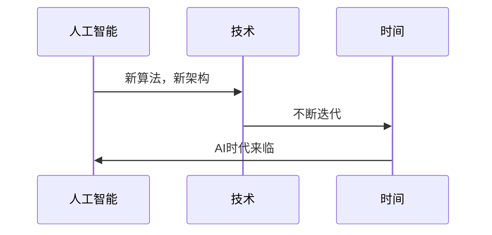

                 

# 人类计算：AI时代的道德和社会责任

关键词：人工智能，道德责任，社会责任，伦理，AI应用领域

摘要：随着人工智能（AI）技术的迅猛发展，人类社会面临着前所未有的挑战。本文旨在探讨AI时代的道德和社会责任，分析AI在各个领域的道德责任，并提出相应的解决措施。通过对AI技术的深入剖析，本文希望为AI伦理的发展提供有益的参考。

## 目录大纲

### 第一部分：引言与基础

- **第1章：AI时代的背景与挑战**
  - 1.1 AI时代的来临
  - 1.2 AI对社会的影响
  - 1.3 人类计算的概念与重要性

- **第2章：AI道德理论**
  - 2.1 道德哲学基础
  - 2.2 AI道德原则
  - 2.3 案例分析

### 第二部分：道德责任与社会责任

- **第3章：AI在各个领域的道德责任**
  - 3.1 医疗健康
  - 3.2 法律与司法
  - 3.3 金融科技

- **第4章：社会责任**
  - 4.1 公平与包容
  - 4.2 数据治理
  - 4.3 环境责任

### 第三部分：实践与案例分析

- **第5章：技术发展与伦理进步**
  - 5.1 人工智能伦理委员会
  - 5.2 伦理教育与培训
  - 5.3 未来展望

- **第6章：案例研究**
  - 6.1 智能交通系统
  - 6.2 人工智能法官
  - 6.3 金融AI监管

- **第7章：结论与展望**

## 第一部分：引言与基础

### 第1章：AI时代的背景与挑战

#### 1.1 AI时代的来临

随着计算能力的提升、大数据的积累和算法的创新，人工智能（AI）技术正以前所未有的速度发展。从最初的简单规则系统到深度学习、强化学习等复杂算法，AI已经在各个领域展现出巨大的潜力。

**Mermaid流程图：**



#### 1.2 AI对社会的影响

AI技术的应用不仅改变了传统的生产方式，还深刻影响了我们的生活方式。在医疗、金融、交通等领域，AI技术的引入极大地提升了效率，降低了成本。

- **经济领域：** AI提高了生产效率，优化了资源配置，推动了产业升级。
- **生活领域：** AI技术带来了智能家居、智能医疗、自动驾驶等便利，提高了生活质量。
- **政治领域：** AI在数据挖掘、网络安全、舆情监控等方面发挥着重要作用。

#### 1.3 人类计算的概念与重要性

人类计算是指人工智能与人类的协同工作，通过AI技术辅助人类进行决策和执行，实现更高效的工作方式。

```python
def human_computing():
    """
    人类计算的核心在于人工智能与人类的协同工作，实现更高效的决策与执行。
    """
    # 人工智能的辅助
    AI_assistance()
    # 人类的主导
    human_decision_making()
    # 协同工作
    collaborative_work()
```

#### 1.4 AI时代的挑战

AI技术的发展带来了许多机遇，但同时也带来了诸多挑战。

- **道德困境：** AI决策中的公正性、可解释性、隐私保护等问题亟待解决。
- **社会责任：** AI技术在各个领域的应用需承担相应的社会责任。
- **技术风险与安全：** AI技术的安全性、可靠性需要得到保障。

### 第2章：AI道德理论

#### 2.1 道德哲学基础

道德哲学是探讨道德原则与价值观的学科。在AI道德理论中，道德哲学为我们提供了基础理论框架。

- **道德原则与价值观：** 公正性、尊重、利益最大化等。
- **道德推理方法：** 形而上学方法、经验主义方法、应然主义方法。

#### 2.2 AI道德原则

AI道德原则是基于道德哲学基础，针对AI技术特定应用场景提出的一套指导原则。

- **公正性：** 确保算法公平，避免歧视。
- **可解释性：** 确保算法决策过程透明，便于审查和监督。
- **隐私保护：** 确保数据收集和使用符合隐私保护原则。
- **责任归属：** 明确算法开发、部署和使用过程中的责任主体。

#### 2.3 案例分析

通过具体案例，我们可以更深入地理解AI道德原则的应用。

- **案例一：** 面部识别技术
  - **道德困境：** 隐私保护与公共安全之间的平衡。
  - **案例分析：** 在实际应用中，需确保面部识别数据的安全，同时满足公共安全需求。
- **案例二：** 自动驾驶汽车
  - **道德困境：** 紧急情况下的伦理决策。
  - **案例分析：** 在自动驾驶汽车事故中，责任归属和道德责任成为争议焦点。

### 第3章：道德责任与社会责任

#### 3.1 AI在各个领域的道德责任

AI技术在医疗、法律、金融等领域有广泛应用，同时也带来了相应的道德责任。

##### 3.1.1 医疗健康

在医疗领域，AI技术可以提高诊断准确性、优化治疗方案，但也面临道德责任。

- **隐私保护：** 确保患者数据的隐私和安全。
- **公正性：** 避免算法歧视，确保医疗资源的公平分配。
- **可解释性：** 确保算法决策过程透明，便于审查和监督。

##### 3.1.2 法律与司法

AI技术在法律领域可以提高司法效率，但也需要承担道德责任。

- **公正性：** 确保算法决策的公正性和无偏见。
- **透明性：** 提高算法决策过程的透明度和可解释性。
- **责任归属：** 明确算法开发、部署和使用过程中的责任主体。

##### 3.1.3 金融科技

金融科技领域，AI技术可以提高风险评估精度，但也面临道德责任。

- **隐私保护：** 确保客户数据的隐私和安全。
- **公平性：** 避免算法歧视，确保金融服务的公平性。
- **可解释性：** 提高算法决策过程的透明度和可解释性。

#### 3.2 社会责任

AI技术不仅需要承担道德责任，还需要履行社会责任。

##### 3.2.1 公平与包容

在AI技术普及的过程中，公平与包容是重要的社会责任。

- **算法偏见与歧视：** 避免算法偏见，确保技术的公平性。
- **促进公平与包容：** 通过数据多样性、算法透明性等手段，促进社会的公平与包容。
- **公共政策的引导作用：** 政府应制定相关政策，引导AI技术的健康发展。

##### 3.2.2 数据治理

数据治理是AI技术发展的重要保障。

- **数据隐私保护：** 确保数据收集和使用符合隐私保护原则。
- **数据伦理问题：** 解决数据滥用、数据泄露等问题。
- **数据治理的最佳实践：** 建立数据安全管理制度和流程，确保数据质量。

##### 3.2.3 环境责任

AI技术对环境也有一定影响，因此需要承担环境责任。

- **能耗消耗：** 提高能源利用效率，降低能耗。
- **电子废物处理：** 推广电子废物回收和再利用。
- **环境保护意识：** 提高公众对环境保护的认识和参与度。

### 第4章：技术发展与伦理进步

#### 5.1 人工智能伦理委员会

人工智能伦理委员会是负责制定AI伦理准则、开展AI伦理研究和评估的机构。

- **职责与作用：** 制定AI伦理准则、开展AI伦理研究、提供AI伦理咨询和建议。
- **国际合作与政策制定：** 促进国际间AI伦理合作与交流、推动全球范围内的AI伦理政策制定。
- **伦理审查流程：** 确保AI技术的应用符合伦理标准。

#### 5.2 伦理教育与培训

伦理教育与培训是提高AI从业者伦理素养的重要手段。

- **重要性：** 提高AI从业者的伦理素养、强化社会责任感、促进AI技术的可持续发展。
- **实践方法：** 结合专业课程、案例分析、实践活动等。
- **企业应用：** 企业应建立伦理文化建设、开展员工伦理培训、进行AI项目伦理审查与评估。

#### 5.3 未来展望

未来，AI伦理的发展将面临新的挑战和机遇。

- **伦理准则的完善：** 进一步完善AI伦理准则，确保AI技术的应用符合伦理要求。
- **伦理审查机制的规范化：** 建立规范化

