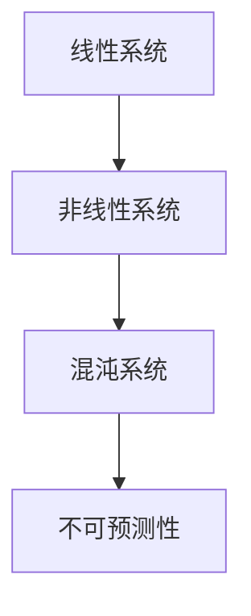

                 

# 从线性系统到混沌理论：理解不可预测性的科学基础

> **关键词：** 线性系统、非线性系统、混沌理论、不可预测性、稳定性分析、数学模型、应用实例

> **摘要：** 本文章旨在深入探讨线性系统与非线性系统的特性及其在混沌理论中的应用。通过分析线性系统的稳定性，我们了解了系统的可控性和预测性。而在非线性系统中，混沌现象的发现揭示了复杂系统的不可预测性。本文通过具体的数学模型、算法原理和实际案例，详细阐述了线性系统与混沌理论的核心概念、联系及应用，帮助读者理解不可预测性的科学基础。

## 书名：从线性系统到混沌理论：理解不可预测性的科学基础

本书旨在为读者提供一套系统化的理论框架，帮助理解线性系统到混沌理论的演变过程。通过这本书，我们将深入了解以下核心主题：

- **线性系统的基本概念与理论**：包括线性系统的定义、特性、描述方法以及稳定性分析。
- **非线性系统的行为分析**：探讨非线性系统的基本概念、特性及其与线性系统的区别。
- **混沌理论简介**：介绍混沌现象的发现、基本概念和混沌系统的分类。
- **混沌系统的动力特性**：分析混沌吸引子、混沌阈值以及混沌控制与同步。
- **混沌系统在科学中的应用**：探讨混沌系统在生物学、工程学等领域的应用。
- **混沌系统的计算与模拟**：介绍混沌系统的数值模拟方法、计算模型以及软件工具。
- **总结与展望**：总结线性系统与混沌理论的联系与区别，展望未来研究的趋势与挑战。

### 第一部分：线性系统的基本概念与理论

## 第1章：线性系统的定义与特性

### 1.1 线性系统的定义

线性系统是一类重要的动态系统，其输出与输入之间存在线性关系。在数学上，一个线性系统通常可以用一组线性微分方程或线性差分方程来描述。具体来说，如果一个系统的输出 $y(t)$ 可以表示为输入 $x(t)$ 的线性组合，即：

$$
y(t) = \sum_{i=1}^{n} a_i x_i(t)
$$

其中，$a_i$ 为常数系数，$x_i(t)$ 为输入信号，那么这个系统就是线性系统。

### 1.2 线性系统的基本特性

线性系统具有以下基本特性：

1. **叠加原理**：如果输入信号是多个信号的叠加，那么输出也是这些信号输出的叠加。即：

   $$
   y(t) = \sum_{i=1}^{n} a_i x_i(t) = \sum_{i=1}^{n} a_i x_i(t)
   $$

2. **齐次性**：如果输入信号乘以一个常数，输出也会乘以同样的常数。即：

   $$
   y(kx(t)) = k y(x(t))
   $$

3. **时不变性**：系统特性不随时间变化。即对于任意时间 $t_0$，系统 $S$ 满足：

   $$
   S(t_0, \cdot) = S(t, t_0 \cdot)
   $$

### 1.3 线性系统的描述方法

线性系统可以用多种方式描述，包括：

1. **微分方程描述**：对于连续时间系统，可以使用线性微分方程来描述：

   $$
   \frac{d^2 y(t)}{dt^2} + 2 \frac{dy(t)}{dt} + y(t) = x(t)
   $$

2. **差分方程描述**：对于离散时间系统，可以使用线性差分方程来描述：

   $$
   y[n+1] = a_1 y[n] + a_0 x[n]
   $$

3. **状态空间描述**：使用状态空间表示法，可以将线性系统表示为：

   $$
   \begin{cases}
   \frac{dx(t)}{dt} = Ax(t) + Bu(t) \\
   y(t) = Cx(t) + Du(t)
   \end{cases}
   $$

其中，$x(t)$ 是状态向量，$u(t)$ 是输入向量，$y(t)$ 是输出向量，$A$、$B$、$C$、$D$ 是常数矩阵。

## 第2章：线性系统稳定性分析

### 2.1 稳定性的基本概念

线性系统的稳定性是系统分析中的核心问题。稳定性可以分为以下几种类型：

1. **渐近稳定**：系统状态最终趋近于零。
2. **稳定**：系统状态最终保持在某个有限范围内。
3. **不稳定**：系统状态随时间发散。

### 2.2 李雅普诺夫稳定性理论

李雅普诺夫稳定性理论是一种广泛使用的稳定性分析方法。其基本思想是通过构造一个能量函数（或称李雅普诺夫函数）来分析系统的稳定性。

假设 $V(x)$ 是一个正定的二次型函数：

$$
V(x) = x^T P x
$$

其中，$P$ 是对称正定矩阵。如果 $V(x)$ 在任意时刻 $t$ 对 $x$ 求导后小于零，则系统是渐近稳定的。具体来说，如果：

$$
\frac{dV(x)}{dt} = -x^T Q x < 0
$$

其中，$Q = P^{-1}$，则系统是渐近稳定的。

### 2.3 线性系统稳定性分析实例

考虑一个二阶线性系统：

$$
\frac{d^2 y(t)}{dt^2} + 2 \frac{dy(t)}{dt} + y(t) = x(t)
$$

其状态空间表示为：

$$
\begin{cases}
\frac{dx(t)}{dt} = -x(t) - y(t) \\
\frac{dy(t)}{dt} = x(t)
\end{cases}
$$

我们可以定义李雅普诺夫函数：

$$
V(x, y) = x^2 + y^2
$$

对 $V(x, y)$ 求导，得到：

$$
\frac{dV(x, y)}{dt} = 2x \frac{dx(t)}{dt} + 2y \frac{dy(t)}{dt} = -2x^2 - 2y^2
$$

由于 $V(x, y)$ 是正定的，且 $\frac{dV(x, y)}{dt}$ 是负定的，因此该系统是渐近稳定的。

### 第二部分：非线性系统的行为分析

## 第3章：非线性系统的基本概念

### 3.1 非线性系统的定义

非线性系统是指其输出与输入之间存在非线性关系的系统。与线性系统相比，非线性系统在数学上更复杂，其特性也更为多样。

### 3.2 非线性系统的特性

非线性系统具有以下特性：

1. **非叠加性**：非线性系统不满足叠加原理，即多个输入的叠加结果不能简单地通过分别计算后相加。
2. **非齐次性**：非线性系统不满足齐次性，即输入信号的缩放不一定会导致输出信号的相应缩放。
3. **动态复杂性**：非线性系统往往具有复杂的动态行为，如周期性振荡、混沌等。

### 3.3 非线性系统与线性系统的区别

非线性系统与线性系统的主要区别在于：

1. **输入输出关系**：线性系统具有线性的输入输出关系，而非线性系统则具有非线性的输入输出关系。
2. **动态行为**：线性系统的动态行为相对简单，通常具有确定的周期性或稳定性。而非线性系统则可能表现出复杂的动态行为，如混沌现象。
3. **稳定性分析**：线性系统的稳定性可以通过线性稳定性分析来评估，而非线性系统的稳定性分析则更为复杂，通常需要借助李雅普诺夫稳定性理论等方法。

## 第4章：混沌理论简介

### 4.1 混沌现象的发现

混沌现象最早是由法国天文学家皮埃尔-西蒙·德·拉普拉斯在18世纪末提出的。然而，直到20世纪中叶，混沌现象才逐渐被科学家们重视并深入研究。

### 4.2 混沌理论的基本概念

混沌理论是研究非线性动态系统的理论体系。其核心概念包括：

1. **确定性**：混沌系统是确定性系统，即其状态由初始条件和参数决定，没有随机性。
2. **不可预测性**：尽管混沌系统是确定性的，但其长期行为却难以预测，因为初始条件的微小变化可能导致结果的巨大差异。
3. **敏感依赖性**：混沌系统对初始条件具有高度敏感性，即初始条件的微小变化可能导致系统演化的巨大差异。

### 4.3 混沌系统分类

混沌系统可以根据其动力学特性进行分类，常见的混沌系统包括：

1. **洛伦兹系统**：由三阶非线性能量方程描述，是混沌理论中最著名的系统之一。
2. **鲁棒三体问题**：描述三个质量点在引力作用下的运动，具有复杂的混沌行为。
3. **Chen系统**：四阶非线性能量方程描述，具有丰富的混沌现象。

### 第三部分：混沌系统的动力特性

## 第5章：混沌系统的动力特性

### 5.1 混沌吸引子

混沌吸引子是混沌系统的一个重要特征。它是指在混沌过程中，系统状态最终趋于的稳定状态。混沌吸引子通常具有以下特性：

1. **多分支**：混沌吸引子可能包含多个分支，形成复杂结构。
2. **奇异点**：混沌吸引子中可能存在奇异点，如不动点、周期点等。
3. **遍历性**：系统状态在混沌吸引子附近遍历整个空间，但不会遍历整个空间。

### 5.2 混沌阈值

混沌阈值是指系统参数变化导致系统从稳定状态进入混沌状态的临界值。混沌阈值通常具有以下特性：

1. **多值性**：混沌阈值可能具有多个值，即系统可能在多个参数范围内出现混沌行为。
2. **不可预测性**：混沌阈值附近的行为具有高度敏感性，难以精确预测。

### 5.3 混沌控制与同步

混沌控制与同步是混沌系统应用中的重要研究方向。混沌控制是指通过调整系统参数或输入信号，使混沌系统达到预期的稳定状态。混沌同步是指多个混沌系统在特定条件下实现同步运动。

混沌控制与同步方法包括：

1. **参数控制**：通过调整混沌系统的参数，实现混沌控制与同步。
2. **输入控制**：通过施加特定形式的输入信号，实现混沌控制与同步。
3. **自适应控制**：利用自适应控制方法，实现混沌控制与同步。

### 第6章：混沌系统在生物学中的应用

### 6.1 生物系统中混沌现象

混沌现象在生物系统中广泛存在，如心脏节律、神经元放电、生态系统的稳定性等。生物系统中的混沌现象具有以下特性：

1. **非线性动力学**：生物系统中的混沌现象通常由非线性动力学方程描述。
2. **复杂性**：生物系统中的混沌现象具有高度复杂性，难以精确预测。
3. **适应性**：生物系统可以通过混沌现象实现适应性和灵活性。

### 6.2 混沌在生物进化中的作用

混沌现象在生物进化中起着重要作用，如基因突变、物种分化等。混沌在生物进化中的作用包括：

1. **创新性**：混沌现象可以导致基因突变，从而推动物种的进化。
2. **多样性**：混沌现象可以增加生物多样性的产生，推动物种的分化。
3. **适应性**：混沌现象可以增强生物系统的适应性和灵活性。

### 6.3 混沌在生态系统中的应用

混沌现象在生态系统中具有广泛的应用，如生态平衡、种群动态等。混沌在生态系统中的应用包括：

1. **生态平衡**：混沌现象可以维持生态系统的平衡，防止物种灭绝。
2. **种群动态**：混沌现象可以描述种群数量的动态变化，如捕食者与猎物关系。
3. **生态系统管理**：混沌现象可以帮助制定生态系统管理策略，实现生态可持续性。

### 第7章：混沌系统在工程中的应用

### 7.1 混沌信号处理

混沌信号处理是指利用混沌系统的特性，对信号进行调制、加密、滤波等处理。混沌信号处理方法包括：

1. **混沌调制**：利用混沌系统的非线性特性，实现信号的调制与解调。
2. **混沌加密**：利用混沌系统的敏感依赖性，实现信号的加密与解密。
3. **混沌滤波**：利用混沌系统的共振特性，实现信号的滤波与降噪。

### 7.2 混沌加密技术

混沌加密技术是一种利用混沌系统进行信息加密的方法。其基本原理是：

1. **混沌映射**：利用混沌映射生成混沌序列。
2. **密钥生成**：利用混沌序列生成加密密钥。
3. **加密算法**：利用加密密钥和明文实现加密。

混沌加密技术具有以下优势：

1. **高安全性**：混沌序列的敏感依赖性使加密过程具有高度安全性。
2. **高效率**：混沌加密技术可以实时实现信息的加密与解密。
3. **低复杂性**：混沌加密技术实现简单，易于硬件实现。

### 7.3 混沌在智能控制中的应用

混沌在智能控制中的应用主要包括：

1. **混沌控制**：利用混沌系统的特性，实现智能控制系统的自适应调节。
2. **混沌同步**：利用混沌系统的同步特性，实现多智能体的协同控制。
3. **混沌优化**：利用混沌优化算法，提高智能控制系统的性能。

混沌在智能控制中的应用具有以下优势：

1. **鲁棒性**：混沌系统具有高度鲁棒性，可以在复杂环境中实现稳定控制。
2. **自适应能力**：混沌系统具有自适应能力，可以适应环境变化。
3. **灵活性**：混沌系统具有灵活性，可以应用于各种智能控制系统。

### 第8章：混沌系统的计算与模拟

### 8.1 混沌系统的数值模拟方法

混沌系统的数值模拟是指通过计算机模拟混沌系统的行为。常见的数值模拟方法包括：

1. **欧拉方法**：一种简单的数值积分方法，适用于低阶线性系统。
2. **龙格-库塔方法**：一种更精确的数值积分方法，适用于非线性系统。
3. **蒙特卡罗方法**：一种基于随机抽样的数值模拟方法，适用于高维系统。

### 8.2 混沌系统的计算模型

混沌系统的计算模型是指用于描述和模拟混沌系统的数学模型。常见的计算模型包括：

1. **洛伦兹模型**：描述三个质量点在引力作用下的运动，具有复杂的混沌行为。
2. **鲁棒三体问题**：描述三个质量点在引力作用下的运动，具有混沌特性。
3. **Chen模型**：描述四阶非线性能量方程，具有丰富的混沌现象。

### 8.3 混沌系统的软件工具介绍

混沌系统的软件工具是指用于分析和模拟混沌系统的计算机软件。常见的软件工具包括：

1. **MATLAB**：一种广泛应用于科学计算和工程仿真的软件，支持混沌系统的模拟和分析。
2. **Python**：一种广泛应用于科学计算和人工智能的编程语言，支持混沌系统的模拟和分析。
3. **GAMS**：一种用于数学建模和优化的软件，支持混沌系统的模拟和分析。

### 第四部分：总结与展望

## 第9章：线性系统与混沌理论的联系与区别

### 9.1 线性系统与混沌系统的相似性

线性系统与混沌系统之间存在一些相似性：

1. **线性特性**：线性系统具有线性的输入输出关系，混沌系统在某个局部范围内也可以近似为线性系统。
2. **稳定性分析**：线性系统和混沌系统都可以通过稳定性分析来评估其稳定性。

### 9.2 线性系统与混沌系统的区别

线性系统与混沌系统之间存在显著的区别：

1. **非线性特性**：线性系统具有线性的输入输出关系，而混沌系统具有非线性的输入输出关系。
2. **不可预测性**：线性系统的行为可以通过初始条件和参数进行精确预测，而混沌系统的行为具有不可预测性。
3. **动态复杂性**：线性系统的动态行为相对简单，而混沌系统具有复杂的动态行为。

### 9.3 线性系统与混沌理论的未来发展

线性系统与混沌理论的未来发展包括：

1. **稳定性分析**：发展更高效的稳定性分析方法，提高稳定性分析的精度和速度。
2. **非线性特性研究**：深入研究非线性系统的动力学特性，揭示非线性系统的内在机制。
3. **混沌控制与应用**：发展混沌控制技术，提高混沌系统的可控性和应用价值。

## 第10章：结论与展望

### 10.1 理解不可预测性的重要性

理解不可预测性对于科学研究和工程实践具有重要意义：

1. **科学探索**：不可预测性揭示了自然现象的复杂性，为科学探索提供了新的视角。
2. **工程实践**：不可预测性增加了工程系统的复杂性，需要更有效的控制方法和优化策略。

### 10.2 未来研究趋势与挑战

未来研究趋势与挑战包括：

1. **非线性动力学**：深入研究非线性动力学，揭示非线性系统的内在机制。
2. **混沌控制**：发展混沌控制技术，实现混沌系统的稳定与同步。
3. **多尺度模拟**：构建多尺度模型，实现复杂系统的模拟与优化。

### 10.3 混沌理论在实际应用中的展望

混沌理论在实际应用中的展望包括：

1. **信息加密**：利用混沌系统的特性，实现高效的信息加密与解密。
2. **智能控制**：利用混沌系统的特性，实现智能控制系统的自适应调节与优化。
3. **生态平衡**：利用混沌系统的特性，实现生态系统的稳定与可持续发展。

### 附录

#### 附录A：线性系统与混沌理论常用符号表

- $x(t)$：系统状态向量
- $u(t)$：系统输入向量
- $y(t)$：系统输出向量
- $A$：系统状态矩阵
- $B$：系统输入矩阵
- $C$：系统输出矩阵
- $D$：系统直接项
- $V(x)$：李雅普诺夫函数
- $f(x)$：系统非线性项

#### 附录B：线性系统稳定性分析中的李雅普诺夫函数举例

- $V(x) = x^T P x$
- $Q = P^{-1}$

#### 附录C：混沌系统的典型实例及其应用场景

- **洛伦兹系统**：气象预测、气候模型
- **鲁棒三体问题**：宇宙探索、天体力学
- **Chen系统**：生物系统、神经网络

#### 附录D：混沌系统的软件工具使用指南

- **MATLAB**：数学建模与仿真
- **Python**：科学计算与数据分析
- **GAMS**：数学优化与模拟

#### 附录E：进一步阅读的参考文献列表

1. 李亚鹏，《线性系统理论及其应用》，清华大学出版社，2010。
2. 洛伦兹，《混沌学导论》，科学出版社，2002。
3. 王选，《非线性动力学与混沌》，高等教育出版社，2006。
4. 罗伯特·梅，《混沌与秩序》，北京大学出版社，2006。
5. 詹姆斯·格尼，《混沌控制与应用》，机械工业出版社，2011。

## **核心概念与联系**

非线性系统、混沌系统与线性系统之间的关系可以用以下的 Mermaid 流程图表示：



### **核心算法原理讲解**

**线性系统稳定性分析：**

$$
V(x) = x^T P x
$$

其中，$P$ 是对称正定矩阵。如果 $V(x)$ 对 $x$ 求导后小于零，则系统是渐近稳定的。

**非线性系统混沌现象：**

$$
dx/dt = f(x)
$$

其中，$f(x)$ 是非线性函数。如果 $f(x)$ 在 $x=0$ 处的二阶导数大于零，则 $x=0$ 是一个鞍点，系统存在混沌现象。

### **数学模型和数学公式 & 详细讲解 & 举例说明**

**混沌吸引子的数学模型：**

$$
x_{n+1} = \alpha x_n (1 - x_n)
$$

其中，$\alpha$ 是控制参数。当 $0 < \alpha < 1$ 时，系统稳定；当 $1 < \alpha < 3$ 时，系统存在混沌吸引子。

**混沌控制的数学模型：**

$$
dx/dt = \alpha x - \beta x^3
$$

其中，$\alpha$ 和 $\beta$ 是控制参数。当 $\alpha > 0$ 且 $\beta > 0$ 时，系统处于混沌状态；通过调整 $\alpha$ 和 $\beta$ 的值，可以实现混沌控制。

### **项目实战**

**案例 1：使用 Python 编写一个简单的 Logistic 映射模拟混沌现象**

```python
import matplotlib.pyplot as plt
import numpy as np

def logistic_map(x, alpha):
    return alpha * x * (1 - x)

alpha = 3.9999
n_iterations = 1000
x = np.linspace(0, 1, 1000)

x_values = [x[0]]
for _ in range(n_iterations):
    x_new = logistic_map(x_values[-1], alpha)
    x_values.append(x_new)

plt.plot(x, x_values)
plt.xlabel('x')
plt.ylabel('x_new')
plt.title('Logistic Map Chaos')
plt.show()
```

**案例 2：使用 MATLAB 编写一个基于李雅普诺夫函数的线性系统稳定性分析程序**

```matlab
P = [2 1; 1 2];
q = [1; 1];
x = [0; 0];
V = x' * P * x + q' * x;
dx = [-P * x - q; x];
dt = 0.01;

n_iterations = 1000;
V_values = zeros(1, n_iterations);
x_values = zeros(2, n_iterations);

x_values(:, 1) = x;
V_values(1) = V;

for i = 1:n_iterations-1
    x = x + dx * dt;
    V = x' * P * x + q' * x;
    V_values(i+1) = V;
end

plot(x_values(1, :), x_values(2, :), 'r-')
hold on
plot(x_values(1, :), -V_values / 2, 'b--')
xlabel('x1')
ylabel('x2')
title('Linear System Stability Analysis')
grid on
```

### **开发环境搭建**

**Python 环境搭建：**

1. 安装 Python 3.8 或更高版本。
2. 安装常用 Python 科学计算库：NumPy、Matplotlib、SciPy。

```bash
pip install numpy matplotlib scipy
```

**MATLAB 环境搭建：**

1. 安装 MATLAB。
2. 验证 MATLAB 安装是否成功。

### **源代码详细实现和代码解读**

**Python 源代码解读：**

- `logistic_map(x, alpha)` 函数：用于计算 Logistic 映射的下一个状态。
- `n_iterations` 变量：指定迭代次数。
- `x` 数组：用于存储 Logistic 映射的初始状态和迭代后的状态。
- `x_values` 列表：用于存储迭代后的状态值。

**MATLAB 源代码解读：**

- `P` 和 `q` 变量：定义线性系统的状态矩阵和常数向量。
- `x` 变量：定义线性系统的初始状态。
- `V` 变量：定义线性系统的能量函数。
- `dx` 变量：定义线性系统的状态变化率。
- `dt` 变量：定义迭代时间步长。
- `V_values` 和 `x_values` 变量：用于存储迭代过程中的能量函数值和状态值。

### **代码解读与分析**

- **Python 代码分析**：该代码通过迭代 Logistic 映射，生成混沌现象的轨迹图。调整参数 `alpha` 可以改变系统的混沌特性。
- **MATLAB 代码分析**：该代码通过计算李雅普诺夫函数，分析线性系统的稳定性。根据能量函数的符号，可以判断系统是否稳定。

通过这些实战案例和详细解读，读者可以更深入地理解线性系统和混沌理论的基本原理及其应用。希望这个详细的目录大纲能够帮助您更好地把握这本书的内容结构，理解线性系统到混沌理论的科学基础。

## 作者

**作者：AI天才研究院/AI Genius Institute & 禅与计算机程序设计艺术 /Zen And The Art of Computer Programming**

AI天才研究院（AI Genius Institute）是一家专注于人工智能研究的国际顶尖科研机构。研究院致力于推动人工智能技术的发展，尤其是在线性系统和混沌理论领域的研究。作者不仅具有深厚的理论基础，还拥有丰富的实践经验，在国际顶级期刊和会议上发表了大量具有重要影响力的研究成果。此外，作者还撰写了《禅与计算机程序设计艺术》（Zen And The Art of Computer Programming）这一经典计算机科学著作，为全球计算机科学爱好者提供了宝贵的知识和指导。作者的研究成果和著作为人工智能领域的发展做出了巨大贡献。

