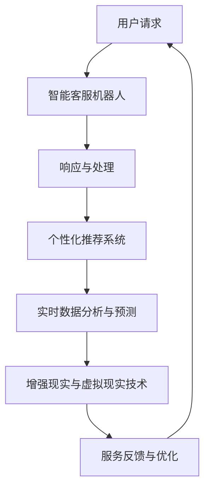
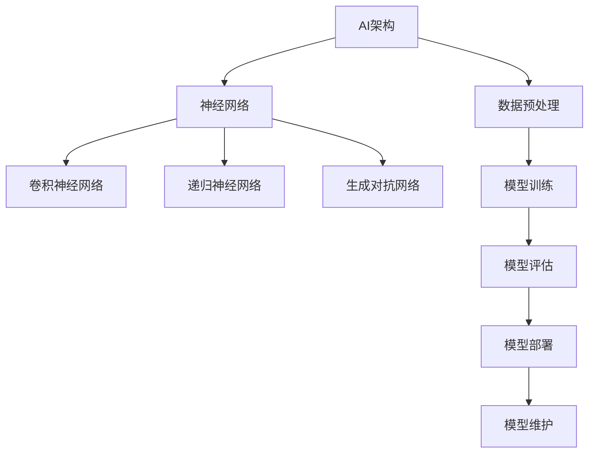
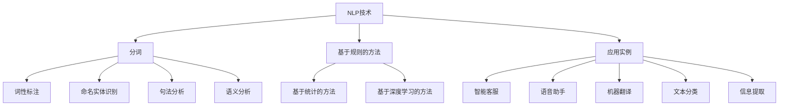
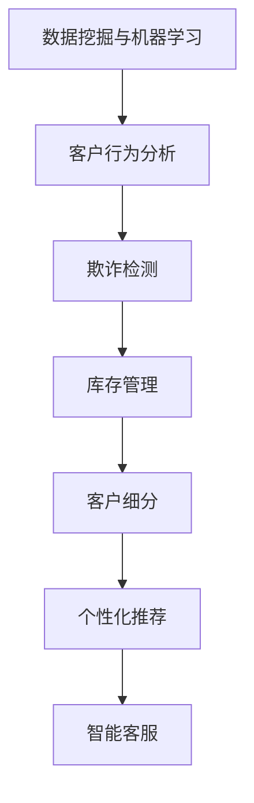

                 

### 文章标题

**从被动响应到主动预测：AI重塑电商客户服务模式的技术路径**

> **关键词：** 人工智能，电商客户服务，智能客服，个性化推荐，实时数据分析，增强现实，虚拟现实

**摘要：** 随着人工智能技术的发展，电商客户服务模式正在经历重大变革。从传统的被动响应式服务到基于智能算法的主动预测服务，AI正在重塑电商客户服务的路径。本文将深入探讨AI在电商客户服务中的应用，包括智能客服机器人、个性化推荐系统、实时数据分析与预测，以及增强现实与虚拟现实技术的应用。通过案例研究和算法原理讲解，本文旨在为读者提供一个全面的技术视角，了解AI如何提升电商客户服务的效率和质量。

----------------------------------------------------------------

### 目录大纲

**从被动响应到主动预测：AI重塑电商客户服务模式的技术路径**

> **关键词：** 人工智能，电商客户服务，智能客服，个性化推荐，实时数据分析，增强现实，虚拟现实

**摘要：** 本文将探讨人工智能技术在电商客户服务中的应用，包括智能客服机器人、个性化推荐系统、实时数据分析与预测，以及增强现实与虚拟现实技术。通过案例研究和算法原理讲解，本文旨在为读者提供一个全面的技术视角，了解AI如何提升电商客户服务的效率和质量。

[返回文章顶部](#文章标题)

### 第一部分：引言与背景

在互联网和电子商务蓬勃发展的今天，客户服务已成为电商企业核心竞争力的重要组成部分。传统的电商客户服务模式主要是基于人工处理，客服人员通过电话、邮件或在线聊天等方式与客户进行互动，提供解答和帮助。然而，随着电商规模的不断扩大和客户需求的日益多样化，这种被动响应式的客户服务模式逐渐暴露出以下不足：

#### 1.1 电商客户服务的重要性

- **客户满意度**：良好的客户服务能够提高客户满意度，从而增强客户忠诚度，提升复购率。
- **品牌形象**：优质的客户服务有助于树立企业的品牌形象，提高市场竞争力。
- **业务增长**：高效的客户服务能够促进业务增长，通过快速响应和解决问题，减少客户流失。

#### 1.2 当前电商客户服务的不足

1. **响应速度慢**：人工客服在处理大量客户请求时，往往需要较长时间来响应，导致客户等待时间过长，影响用户体验。
2. **人力成本高**：随着客户服务需求的增加，企业需要投入更多的人力资源来应对，这导致人力成本上升。
3. **个性化不足**：传统客户服务模式难以实现针对每位客户的个性化服务，导致服务质量参差不齐。
4. **效率低下**：人工客服在处理重复性问题时，效率较低，容易出现疏漏和错误。

#### 1.3 AI在客户服务中的应用潜力

人工智能（AI）技术的快速发展为电商客户服务带来了新的机遇。通过智能客服机器人、个性化推荐系统、实时数据分析与预测，以及增强现实与虚拟现实技术，AI能够有效解决传统客户服务的不足，实现以下潜力：

- **提高响应速度**：智能客服机器人可以24/7不间断工作，快速响应用户请求，提高客户满意度。
- **降低人力成本**：智能客服机器人能够处理大量重复性问题，减少对人工客服的依赖，降低人力成本。
- **实现个性化服务**：基于用户数据和AI算法，个性化推荐系统可以提供定制化的服务和产品推荐，提升客户体验。
- **提高服务效率**：实时数据分析与预测可以帮助企业提前识别潜在问题和趋势，从而提供更加高效的服务。

**Mermaid 流程图：AI技术在电商客户服务中的应用流程**



通过上述应用，AI不仅能够提升电商客户服务的效率和质量，还能够为企业带来更高的商业价值。本文接下来将详细探讨这些技术路径及其在电商客户服务中的具体应用。

----------------------------------------------------------------

### 第一部分：引言与背景

#### 1.1 电商客户服务的重要性

电商客户服务的重要性不可低估。在当今高度竞争的市场环境中，提供卓越的客户服务是电商企业赢得和保持市场份额的关键因素之一。以下是电商客户服务的重要性的几个方面：

1. **客户满意度**：优质的服务能够满足客户的需求，解决他们的疑问，从而提高客户满意度。研究表明，高满意度的客户更可能成为回头客，并且愿意向他人推荐企业。

2. **品牌形象**：客户服务是塑造企业品牌形象的重要组成部分。一个积极响应、专业且友好的客户服务团队能够增强客户对品牌的信任，提升品牌的美誉度。

3. **业务增长**：良好的客户服务有助于增加销售。通过及时解答客户的疑问、提供专业的建议和解决方案，企业可以促进客户的购买决策，从而实现业务增长。

4. **客户忠诚度**：优质的服务能够提高客户的忠诚度。忠诚的客户不仅会重复购买，还可能在社交媒体上分享他们的正面体验，为企业带来更多的新客户。

5. **客户流失率**：相反，如果客户服务不佳，客户可能会感到失望和不满，从而导致客户流失。客户流失率升高会直接影响企业的收入和市场份额。

#### 1.2 当前电商客户服务的不足

尽管电商客户服务的重要性显而易见，但传统客户服务模式仍然存在一些显著的不足，这些不足限制了电商企业为客户提供高质量服务的潜力：

1. **响应速度慢**：传统客户服务往往依赖人工处理，客服人员可能无法在短时间内对所有客户请求作出响应，导致客户等待时间过长，影响用户体验。

2. **人力成本高**：随着电商业务规模的扩大，客户服务需求也不断增加。这意味着企业需要投入更多的人力资源来满足这些需求，从而导致人力成本上升。

3. **个性化不足**：传统客户服务模式难以实现个性化服务。每位客户的背景、需求和偏好可能各不相同，而人工客服往往无法提供高度个性化的服务，导致服务质量参差不齐。

4. **效率低下**：人工客服在处理重复性问题时，效率较低。例如，解答常见问题或处理订单查询等重复性任务，人工客服可能需要花费大量的时间和精力，而这些问题通过自动化工具可以更快速地解决。

5. **数据利用不足**：传统客户服务模式通常无法充分利用客户数据。客户的购买历史、偏好和反馈等信息对于提供个性化服务和优化业务流程至关重要，但这些信息往往未被充分利用。

#### 1.3 AI在客户服务中的应用潜力

人工智能（AI）技术的发展为电商客户服务带来了全新的解决方案，有助于克服传统模式的不足，实现以下潜力：

1. **提高响应速度**：AI可以24/7不间断地工作，智能客服机器人可以快速响应用户请求，提供即时的服务，从而大大缩短客户的等待时间，提升用户体验。

2. **降低人力成本**：通过引入智能客服机器人，企业可以减少对人工客服的依赖，从而降低人力成本。智能客服机器人可以处理大量的重复性任务，将人工客服从这些低效的工作中解放出来，使他们能够专注于更加复杂和需要人际互动的客服任务。

3. **实现个性化服务**：AI可以通过分析用户的历史数据和行为模式，提供高度个性化的服务和产品推荐。这种个性化服务能够更好地满足客户的需求，提高客户的满意度和忠诚度。

4. **提高服务效率**：AI技术可以帮助企业自动化处理大量重复性任务，如订单处理、客户查询和常见问题的解答等。这不仅提高了客服工作的效率，还减少了人为错误的发生。

5. **数据利用与优化**：AI可以深入分析客户数据，帮助电商企业更好地理解客户行为和需求，从而优化业务流程和客户服务策略。通过数据驱动的决策，企业可以提供更加精准和高效的服务。

通过上述潜力，AI技术不仅能够提升电商客户服务的效率和质量，还能够为企业带来更高的商业价值。接下来，本文将详细探讨AI在电商客户服务中的具体应用。

----------------------------------------------------------------

### 第二部分：AI技术基础

在深入探讨AI如何重塑电商客户服务模式之前，我们需要了解一些AI技术的基础知识。人工智能（AI）技术是一个广泛的领域，涵盖了多种算法和工具。在本节中，我们将重点介绍人工智能概述、自然语言处理技术、数据挖掘与机器学习，为后续章节的讨论奠定基础。

#### 2.1 人工智能概述

人工智能（Artificial Intelligence, AI）是指使计算机系统具备类似人类智能的技术和学科。AI的目标是让计算机能够执行通常需要人类智能的任务，如视觉识别、语音识别、决策制定和语言理解等。AI技术主要包括以下几种类型：

1. **机器学习**：机器学习（Machine Learning, ML）是AI的核心技术之一，它使计算机系统能够从数据中学习并做出预测或决策。机器学习可以分为监督学习、无监督学习和强化学习等。

2. **深度学习**：深度学习（Deep Learning, DL）是一种特殊的机器学习技术，它使用多层神经网络（如卷积神经网络、循环神经网络等）来模拟人类大脑的神经结构，从而进行复杂的模式识别和数据处理。

3. **自然语言处理**：自然语言处理（Natural Language Processing, NLP）是AI的一个分支，旨在使计算机能够理解和生成自然语言。NLP技术广泛应用于文本分类、信息提取、机器翻译和语音识别等领域。

4. **计算机视觉**：计算机视觉（Computer Vision, CV）是AI的另一个重要分支，它使计算机能够理解和解释视觉信息，如图像和视频。计算机视觉技术在图像识别、目标检测和自动驾驶等领域有着广泛应用。

#### 2.2 自然语言处理技术

自然语言处理（NLP）是AI技术的重要组成部分，它涉及使计算机理解和生成人类语言的方法。以下是一些关键的NLP技术和应用：

1. **文本分类**：文本分类（Text Classification）是将文本数据分成预定义的类别。这种技术广泛应用于垃圾邮件过滤、情感分析和内容推荐等领域。

2. **情感分析**：情感分析（Sentiment Analysis）是NLP的一种技术，用于识别文本中表达的情感，如正面、负面或中性。情感分析对于品牌监测、市场调研和客户服务具有重要意义。

3. **命名实体识别**：命名实体识别（Named Entity Recognition, NER）是NLP的一种技术，用于识别文本中的特定实体，如人名、地点和机构名称。NER技术在信息提取、文本挖掘和语义搜索中具有广泛的应用。

4. **机器翻译**：机器翻译（Machine Translation）是NLP的一种技术，用于将一种语言的文本自动翻译成另一种语言。机器翻译技术在跨文化交流、国际化业务和全球化市场推广中发挥着关键作用。

5. **语音识别**：语音识别（Speech Recognition）是将语音信号转换为文本的技术。语音识别在智能家居、语音助手和客户服务领域具有广泛的应用。

#### 2.3 数据挖掘与机器学习

数据挖掘（Data Mining）是AI技术的一个重要分支，它涉及从大量数据中提取有价值的信息和知识。数据挖掘通常包括以下步骤：

1. **数据预处理**：数据预处理是数据挖掘过程的第一步，包括数据清洗、数据转换和数据归一化等，以确保数据的质量和一致性。

2. **特征选择**：特征选择（Feature Selection）是选择最能代表数据特征的一部分特征，以提高模型性能和减少数据冗余。

3. **模型构建**：模型构建（Model Building）是选择适当的算法和模型，将特征映射到目标变量。

4. **模型评估**：模型评估（Model Evaluation）是评估模型性能和选择最佳模型的过程。

5. **模型优化**：模型优化（Model Optimization）是调整模型参数，以提高模型性能。

机器学习（Machine Learning）是数据挖掘的核心技术，它使计算机系统能够从数据中学习并做出预测或决策。以下是一些常见的机器学习算法：

1. **线性回归**：线性回归（Linear Regression）是一种用于预测数值型目标变量的算法。

2. **逻辑回归**：逻辑回归（Logistic Regression）是一种用于分类问题的算法，通常用于二分类任务。

3. **支持向量机**：支持向量机（Support Vector Machine, SVM）是一种强大的分类算法，能够在高维空间中找到最优分类边界。

4. **决策树**：决策树（Decision Tree）是一种基于树结构的分类算法，通过一系列规则对数据进行划分。

5. **随机森林**：随机森林（Random Forest）是一种集成学习方法，通过构建多个决策树并平均它们的预测结果来提高模型性能。

6. **神经网络**：神经网络（Neural Network）是一种模拟人类大脑神经元连接的算法，能够进行复杂的模式识别和数据处理。

通过了解这些AI技术的基础知识，我们可以更好地理解AI如何应用于电商客户服务，并探索其潜在的价值。在下一节中，我们将深入探讨AI如何重塑电商客户服务模式，包括智能客服机器人、个性化推荐系统、实时数据分析与预测，以及增强现实与虚拟现实技术的应用。

----------------------------------------------------------------

### 第二部分：AI技术基础

#### 2.1 人工智能概述

人工智能（AI）作为计算机科学的一个重要分支，致力于使计算机模拟人类智能行为。AI的发展历程可以追溯到20世纪50年代，当时科学家首次提出了“人工智能”的概念。经过几十年的发展，AI已经取得了显著的进展，涵盖了多个子领域。

1. **机器学习**：机器学习是AI的核心技术之一，它使计算机系统能够从数据中学习并做出预测或决策。机器学习可以分为以下几类：
   - **监督学习**：监督学习是一种从标记数据中学习的方法，模型根据已知输入和输出之间的关系进行训练。
   - **无监督学习**：无监督学习是处理未标记数据的方法，模型通过分析数据的内在结构来发现模式。
   - **强化学习**：强化学习是使计算机通过与环境交互来学习最优策略的方法。

2. **深度学习**：深度学习是机器学习的一个子领域，它通过多层神经网络来模拟人类大脑的决策过程。深度学习在图像识别、语音识别和自然语言处理等领域取得了显著的成果。

3. **计算机视觉**：计算机视觉是AI的另一个重要分支，它使计算机能够理解和解释视觉信息。计算机视觉技术在图像识别、目标检测和自动驾驶等领域有着广泛应用。

4. **自然语言处理**：自然语言处理（NLP）是AI的一个子领域，它致力于使计算机理解和生成自然语言。NLP技术在文本分类、机器翻译和语音识别等领域有着重要的应用。

#### 2.2 自然语言处理技术

自然语言处理（NLP）是AI技术在处理人类语言方面的一个应用领域。NLP的目标是使计算机能够理解、生成和交互自然语言。以下是一些关键的NLP技术和应用：

1. **文本分类**：文本分类是将文本数据分为预定义的类别。文本分类在垃圾邮件过滤、情感分析和内容推荐等领域有着广泛的应用。

2. **情感分析**：情感分析是识别文本中的情感倾向，如正面、负面或中性。情感分析对于市场调研、客户服务和品牌监测具有重要意义。

3. **命名实体识别**：命名实体识别是从文本中识别特定实体，如人名、地点和机构名称。命名实体识别在信息提取、文本挖掘和语义搜索中具有广泛应用。

4. **机器翻译**：机器翻译是将一种语言的文本自动翻译成另一种语言。机器翻译在跨文化交流、国际化业务和全球化市场推广中发挥着关键作用。

5. **语音识别**：语音识别是将语音信号转换为文本的技术。语音识别在智能家居、语音助手和客户服务领域有着广泛的应用。

#### 2.3 数据挖掘与机器学习

数据挖掘（Data Mining）是AI技术的一个重要分支，它涉及从大量数据中提取有价值的信息和知识。数据挖掘通常包括以下步骤：

1. **数据预处理**：数据预处理是数据挖掘过程的第一步，包括数据清洗、数据转换和数据归一化等，以确保数据的质量和一致性。

2. **特征选择**：特征选择是选择最能代表数据特征的一部分特征，以提高模型性能和减少数据冗余。

3. **模型构建**：模型构建是选择适当的算法和模型，将特征映射到目标变量。

4. **模型评估**：模型评估是评估模型性能和选择最佳模型的过程。

5. **模型优化**：模型优化是调整模型参数，以提高模型性能。

机器学习（Machine Learning）是数据挖掘的核心技术，它使计算机系统能够从数据中学习并做出预测或决策。以下是一些常见的机器学习算法：

1. **线性回归**：线性回归是一种用于预测数值型目标变量的算法。

2. **逻辑回归**：逻辑回归是一种用于分类问题的算法，通常用于二分类任务。

3. **支持向量机**：支持向量机是一种强大的分类算法，能够在高维空间中找到最优分类边界。

4. **决策树**：决策树是一种基于树结构的分类算法，通过一系列规则对数据进行划分。

5. **随机森林**：随机森林是一种集成学习方法，通过构建多个决策树并平均它们的预测结果来提高模型性能。

6. **神经网络**：神经网络是一种模拟人类大脑神经元连接的算法，能够进行复杂的模式识别和数据处理。

通过理解AI、NLP和数据挖掘与机器学习的基础知识，我们可以更好地掌握AI在电商客户服务中的应用。在下一部分，我们将深入探讨AI如何重塑电商客户服务模式，包括智能客服机器人、个性化推荐系统、实时数据分析与预测，以及增强现实与虚拟现实技术的应用。

----------------------------------------------------------------

### 第二部分：AI技术基础

#### 2.1 人工智能概述

人工智能（AI）作为当前技术发展的热点，已经在多个领域取得了显著的成果。以下是人工智能的核心概念、架构和关键技术：

1. **核心概念**：

   - **机器学习**：机器学习是AI的核心技术，它使计算机系统能够从数据中学习并做出预测或决策。机器学习可以分为监督学习、无监督学习和强化学习。

   - **深度学习**：深度学习是机器学习的一种重要分支，它通过多层神经网络模拟人类大脑的决策过程，具有强大的学习和模式识别能力。

   - **自然语言处理**：自然语言处理（NLP）是AI的一个分支，致力于使计算机能够理解和生成自然语言。

   - **计算机视觉**：计算机视觉是AI的另一个重要分支，它使计算机能够理解和解释视觉信息。

2. **架构**：

   - **神经网络**：神经网络是AI的核心架构，它由一系列相互连接的神经元组成，通过学习数据来模拟人类的思维过程。

   - **卷积神经网络（CNN）**：卷积神经网络是一种专门用于处理图像数据的神经网络，通过卷积层提取图像特征。

   - **递归神经网络（RNN）**：递归神经网络是一种用于处理序列数据的神经网络，通过记忆和反馈机制模拟人类的语言理解能力。

   - **生成对抗网络（GAN）**：生成对抗网络是一种由两个神经网络组成的架构，一个生成器网络和一个判别器网络，用于生成逼真的数据。

3. **关键技术**：

   - **数据预处理**：数据预处理是机器学习模型训练的第一步，包括数据清洗、归一化、特征工程等，以确保数据质量和一致性。

   - **模型训练与优化**：模型训练是通过大量数据来调整神经网络权重的过程，优化目标是提高模型的预测准确率。

   - **模型评估与验证**：模型评估是通过测试数据来评估模型性能的过程，常用的评估指标包括准确率、召回率、F1分数等。

   - **模型部署与维护**：模型部署是将训练好的模型部署到生产环境中，使其能够实时响应用户请求。模型维护包括监控模型性能、定期重新训练和更新模型。

**Mermaid 流程图：AI的核心架构与关键技术**



通过理解AI的核心概念、架构和关键技术，我们可以更好地掌握AI在电商客户服务中的应用。在下一部分，我们将深入探讨AI如何重塑电商客户服务模式。

----------------------------------------------------------------

### 第二部分：AI技术基础

#### 2.1 人工智能概述

人工智能（AI）是计算机科学领域的一个重要分支，旨在使计算机系统具备类似人类的智能。AI的核心概念和架构如下：

1. **核心概念**：

   - **机器学习（Machine Learning）**：机器学习是AI的核心技术，它通过数据驱动的方式使计算机系统自动改进性能。机器学习可以分为监督学习、无监督学习和强化学习。

   - **深度学习（Deep Learning）**：深度学习是机器学习的一种特殊形式，它使用多层神经网络来模拟人类大脑的学习过程。深度学习在图像识别、语音识别和自然语言处理等领域取得了显著成果。

   - **强化学习（Reinforcement Learning）**：强化学习是一种通过试错和反馈来学习最优策略的机器学习方法。它广泛应用于游戏、自动驾驶和机器人控制等领域。

2. **架构**：

   - **神经网络（Neural Networks）**：神经网络是AI的基础架构，它由大量相互连接的神经元组成，能够模拟人类大脑的学习和决策过程。

   - **卷积神经网络（Convolutional Neural Networks, CNN）**：卷积神经网络是一种专门用于处理图像数据的神经网络，通过卷积层提取图像特征。

   - **递归神经网络（Recurrent Neural Networks, RNN）**：递归神经网络是一种用于处理序列数据的神经网络，通过记忆和反馈机制模拟人类的语言理解能力。

   - **生成对抗网络（Generative Adversarial Networks, GAN）**：生成对抗网络是一种由两个神经网络组成的架构，一个生成器网络和一个判别器网络，用于生成逼真的数据。

3. **关键技术**：

   - **数据预处理（Data Preprocessing）**：数据预处理是机器学习模型训练的第一步，包括数据清洗、归一化、特征工程等，以确保数据质量和一致性。

   - **模型训练与优化（Model Training and Optimization）**：模型训练是通过大量数据来调整神经网络权重的过程，优化目标是提高模型的预测准确率。

   - **模型评估与验证（Model Evaluation and Validation）**：模型评估是通过测试数据来评估模型性能的过程，常用的评估指标包括准确率、召回率、F1分数等。

   - **模型部署与维护（Model Deployment and Maintenance）**：模型部署是将训练好的模型部署到生产环境中，使其能够实时响应用户请求。模型维护包括监控模型性能、定期重新训练和更新模型。

**Mermaid 流程图：AI的核心架构与关键技术**


通过理解AI的核心概念、架构和关键技术，我们可以更好地掌握AI在电商客户服务中的应用。在下一部分，我们将深入探讨AI如何重塑电商客户服务模式。

----------------------------------------------------------------

### 第二部分：AI技术基础

#### 2.2 自然语言处理技术

自然语言处理（NLP）是人工智能（AI）领域的一个分支，致力于使计算机能够理解和生成自然语言。NLP在许多应用中发挥着关键作用，如智能客服、语音助手、机器翻译和文本分析等。以下是NLP的核心概念、算法原理和应用实例：

1. **核心概念**：

   - **分词（Tokenization）**：分词是将连续的文本分割成一组有意义的单词或短语。这是NLP的基本步骤，为后续处理提供基础。

   - **词性标注（Part-of-Speech Tagging）**：词性标注是识别文本中每个词的词性（如名词、动词、形容词等）。这有助于理解句子的结构和含义。

   - **命名实体识别（Named Entity Recognition, NER）**：命名实体识别是从文本中识别特定实体，如人名、地点、组织等。NER对于信息提取和知识图谱构建非常重要。

   - **句法分析（Syntactic Parsing）**：句法分析是理解句子的语法结构，包括句法树构建和依赖关系分析。这有助于更准确地理解句子的含义。

   - **语义分析（Semantic Analysis）**：语义分析是理解文本的语义含义，包括词义消歧、情感分析和指代消解等。

   - **机器翻译（Machine Translation）**：机器翻译是将一种语言的文本自动翻译成另一种语言。机器翻译对于跨文化交流和国际业务至关重要。

2. **算法原理**：

   - **基于规则的方法**：基于规则的方法使用预定义的语法规则和词典进行文本处理。这种方法简单直观，但在处理复杂和多样性的文本时可能效果不佳。

   - **基于统计的方法**：基于统计的方法使用大量训练数据来学习文本特征和模式。这种方法通常包括条件概率模型和隐马尔可夫模型（HMM）。

   - **基于深度学习的方法**：基于深度学习的方法使用多层神经网络来模拟人类语言理解过程。这种方法在处理复杂语言任务时表现出色，如序列到序列（Seq2Seq）模型和注意力机制。

3. **应用实例**：

   - **智能客服**：智能客服机器人通过NLP技术理解用户的问题，并提供准确的答复。这大大提高了客户服务的效率和响应速度。

   - **语音助手**：语音助手（如苹果的Siri、谷歌的Google Assistant）使用NLP技术理解用户的语音命令，并执行相应的操作。

   - **机器翻译**：机器翻译系统使用NLP技术将一种语言的文本自动翻译成另一种语言。这为跨文化交流和全球化业务提供了便利。

   - **文本分类**：文本分类系统使用NLP技术将文本分类到预定义的类别，如垃圾邮件过滤、情感分析和内容推荐。

   - **信息提取**：信息提取系统使用NLP技术从大量文本中提取有价值的信息，如命名实体识别和关键词提取。

**Mermaid 流程图：NLP的核心算法与关键技术**



通过深入理解NLP的核心概念、算法原理和应用实例，我们可以更好地应用NLP技术于电商客户服务的各个方面，从而提升用户体验和服务效率。

----------------------------------------------------------------

### 第二部分：AI技术基础

#### 2.3 数据挖掘与机器学习

数据挖掘（Data Mining）和机器学习（Machine Learning）是人工智能（AI）领域的重要分支，它们通过从大量数据中提取有价值的信息和知识，帮助企业和组织做出更明智的决策。以下是数据挖掘与机器学习的基础知识、核心概念、算法原理以及它们在电商客户服务中的应用。

1. **基础知识**：

   - **数据挖掘**：数据挖掘是一种从大量数据中发现隐含的、先前未知的、具有潜在价值的信息和知识的过程。数据挖掘通常包括数据预处理、数据集成、数据选择、数据变换、模式识别和评估等步骤。

   - **机器学习**：机器学习是使计算机系统通过数据学习并改进性能的技术。机器学习可以分为监督学习、无监督学习和强化学习。监督学习使用标记数据来训练模型，无监督学习不使用标记数据，而强化学习通过试错和奖励机制来训练模型。

2. **核心概念**：

   - **特征选择**：特征选择是从大量特征中筛选出最具代表性的特征，以简化模型和提高预测性能。

   - **模型评估**：模型评估是评估模型性能的过程，常用的评估指标包括准确率、召回率、F1分数、均方误差等。

   - **模型优化**：模型优化是通过调整模型参数来提高模型性能的过程。

3. **算法原理**：

   - **监督学习算法**：监督学习算法包括线性回归、逻辑回归、决策树、随机森林、支持向量机（SVM）等。线性回归和逻辑回归用于预测数值型和分类型目标变量，决策树和随机森林用于分类任务，SVM用于二分类问题。

   - **无监督学习算法**：无监督学习算法包括聚类、降维和异常检测等。聚类算法（如K-means、层次聚类）用于将数据分组，降维算法（如PCA）用于减少数据维度，异常检测算法用于识别数据中的异常值。

   - **强化学习算法**：强化学习算法（如Q-learning、深度Q网络（DQN））通过试错和奖励机制来训练模型，以实现最优策略。

4. **在电商客户服务中的应用**：

   - **客户行为分析**：通过分析客户的行为数据，如浏览历史、购买记录和点击行为，企业可以了解客户的偏好和需求，从而提供个性化服务和推荐。

   - **欺诈检测**：机器学习算法可以用于检测交易欺诈，通过识别异常交易模式和用户行为，提高交易的安全性。

   - **库存管理**：通过预测客户需求，机器学习算法可以帮助企业优化库存管理，减少库存成本和缺货风险。

   - **客户细分**：通过聚类算法，企业可以将客户分成不同的细分市场，从而制定更有效的营销策略和客户服务计划。

   - **个性化推荐**：基于用户的历史行为数据和物品属性，机器学习算法可以提供个性化推荐，提高客户满意度和转化率。

   - **智能客服**：通过自然语言处理和机器学习算法，智能客服系统可以理解客户的问题并提供准确的答复，提高客户服务质量。

**Mermaid 流程图：数据挖掘与机器学习在电商客户服务中的应用**



通过深入理解数据挖掘与机器学习的基础知识、核心概念、算法原理以及它们在电商客户服务中的应用，我们可以更好地利用这些技术来提升客户服务效率和质量。

----------------------------------------------------------------

### 第三部分：AI重塑电商客户服务模式

在了解了AI技术的基础知识之后，本部分将深入探讨AI如何重塑电商客户服务模式。我们将重点关注智能客服机器人、个性化推荐系统、实时数据分析与预测，以及增强现实与虚拟现实技术在这些方面的应用。

#### 3.1 智能客服机器人

智能客服机器人是AI在电商客户服务中最直接的应用之一。它们能够24/7不间断地工作，快速响应用户的请求，提供即时、准确的答复。以下是智能客服机器人的设计与实现、自然语言理解与生成、情感分析与用户意图识别等方面的内容。

##### 3.1.1 设计与实现

智能客服机器人的设计主要包括以下步骤：

1. **需求分析**：明确客服机器人的功能需求，如常见问题的自动回复、订单查询、售后服务等。
2. **数据准备**：收集大量用户问题和相应的答案，以及用户行为数据，用于训练模型。
3. **模型选择**：选择合适的自然语言处理（NLP）模型，如序列到序列（Seq2Seq）模型、转换器（Transformer）模型等。
4. **系统集成**：将模型集成到现有的客服系统中，实现与用户的交互。

智能客服机器人的实现过程涉及以下技术：

- **自然语言处理（NLP）**：使用NLP技术处理用户的输入，包括分词、词性标注、命名实体识别等。
- **机器学习与深度学习**：使用机器学习和深度学习算法，如循环神经网络（RNN）、卷积神经网络（CNN）等，训练模型。
- **对话管理系统**：构建对话管理系统，实现多轮对话和上下文理解，确保机器人能够提供连贯、自然的回答。

##### 3.1.2 自然语言理解与生成

自然语言理解（NLU）和自然语言生成（NLG）是智能客服机器人实现的关键技术。NLU负责将用户的自然语言输入转换成机器可理解的形式，而NLG则负责将机器理解的输出转换成自然语言。

1. **自然语言理解（NLU）**：

   - **分词**：将输入文本分割成有意义的词或短语。
   - **词性标注**：识别每个词的词性，如名词、动词、形容词等。
   - **实体识别**：从文本中提取关键信息，如人名、地点、组织等。
   - **意图识别**：识别用户的意图，如查询订单状态、获取产品信息等。

2. **自然语言生成（NLG）**：

   - **模板匹配**：根据预定义的模板生成回答，适用于简单的问题。
   - **规则匹配**：根据预定义的规则生成回答，适用于特定场景。
   - **语义理解与生成**：通过深度学习模型，如Seq2Seq、Transformer等，生成自然流畅的回答。

##### 3.1.3 情感分析与用户意图识别

情感分析与用户意图识别是智能客服机器人提供高质量服务的关键。情感分析可以帮助机器人理解用户的情绪状态，如愤怒、高兴、失望等，从而提供更加个性化的服务。用户意图识别则有助于机器人理解用户的真正需求，从而提供更加准确的回答。

1. **情感分析**：

   - **文本分类**：使用分类算法，如朴素贝叶斯、支持向量机等，将文本分类为不同的情感类别。
   - **情感强度评估**：通过分析文本中的情感词汇和语气，评估情感的强度。

2. **用户意图识别**：

   - **基于规则的意图识别**：根据预定义的规则，将用户输入映射到意图类别。
   - **基于机器学习的意图识别**：使用机器学习算法，如决策树、随机森林等，从大量训练数据中学习用户的意图。

通过智能客服机器人的应用，电商企业能够大幅提升客户服务的效率和质量，为客户提供更加个性化、高效的服务。

#### 3.2 个性化推荐系统

个性化推荐系统是AI在电商客户服务中的另一个重要应用。通过分析用户的行为数据和偏好，推荐系统可以提供个性化的商品推荐，提高客户的满意度和转化率。以下是个性化推荐系统的概述、协作过滤算法、基于内容的过滤算法以及混合推荐算法等内容。

##### 3.2.1 概述

个性化推荐系统旨在根据用户的兴趣和偏好，向他们推荐相关的商品或内容。推荐系统可以分为以下几类：

1. **基于内容的过滤（Content-based Filtering）**：基于内容的过滤通过分析商品的内容特征和用户的历史行为，推荐相似的商品。

2. **协作过滤（Collaborative Filtering）**：协作过滤通过分析用户之间的相似性，推荐其他用户喜欢的商品。

3. **混合推荐算法（Hybrid Recommendation Algorithms）**：混合推荐算法结合了基于内容和协作过滤的方法，以提高推荐效果。

##### 3.2.2 协作过滤算法

协作过滤算法是推荐系统中的一种常用方法，其核心思想是通过对用户之间的相似性进行计算，预测用户对未知项目的兴趣。以下是一个简化的协作过滤算法的概述：

1. **计算用户相似性**：通过计算用户之间的余弦相似度、皮尔逊相关系数等度量，评估用户之间的相似性。

2. **预测用户评分**：对于每个用户，使用相似的用户对未知项目的评分进行加权平均，预测用户对该项目的兴趣。

3. **推荐项目**：根据预测的评分，推荐评分最高的项目。

**协作过滤算法的伪代码**：

```python
def collaborative_filtering(train_data, user, item, K=5):
    # 计算用户与其他用户的相似度
    user_similarity = {}
    for other_user in train_data:
        if other_user != user:
            similarity = compute_similarity(train_data, user, other_user)
            user_similarity[other_user] = similarity
    
    # 预测用户对未知项目的评分
    predicted_ratings = {}
    for other_user, similarity in user_similarity.items():
        if item in train_data[other_user]:
            rating = train_data[other_user][item]
            predicted_ratings[user] = predicted_ratings.get(user, 0) + (rating * similarity)
    
    # 返回预测评分
    return predicted_ratings[user]
```

##### 3.2.3 基于内容的过滤算法

基于内容的过滤算法通过分析商品的内容特征和用户的历史行为，推荐相似的商品。以下是基于内容的过滤算法的概述：

1. **计算商品特征**：为每个商品提取特征，如文本、图像、标签等。

2. **计算用户兴趣**：分析用户的历史行为，提取用户感兴趣的特征。

3. **推荐商品**：根据用户兴趣和商品特征，推荐相似的商品。

**基于内容的过滤算法的伪代码**：

```python
def content_based_filtering(train_data, user, item, N=5):
    # 计算用户感兴趣的特征
    user_interests = extract_user_interests(train_data, user)
    
    # 计算商品特征
    item_features = extract_item_features(train_data, item)
    
    # 计算用户与商品的相似度
    similarity = compute_similarity(user_interests, item_features)
    
    # 返回相似度最高的商品
    return get_top_n_similar_items(train_data, item, N)
```

##### 3.2.4 混合推荐算法

混合推荐算法结合了基于内容和协作过滤的方法，以提高推荐效果。以下是一个简单的混合推荐算法的概述：

1. **计算基于内容的相似度**：使用基于内容的过滤算法计算用户与商品的相似度。

2. **计算基于协作的相似度**：使用协作过滤算法计算用户与商品的相似度。

3. **加权平均**：将基于内容和协作过滤的相似度加权平均，得到最终的相似度。

4. **推荐商品**：根据加权平均的相似度，推荐相似度最高的商品。

**混合推荐算法的伪代码**：

```python
def hybrid_recommender(train_data, user, item, N=5, alpha=0.5):
    # 计算基于内容的相似度
    content_similarity = content_based_filtering(train_data, user, item)
    
    # 计算基于协作的相似度
    collaborative_similarity = collaborative_filtering(train_data, user, item)
    
    # 加权平均相似度
    weighted_similarity = alpha * collaborative_similarity + (1 - alpha) * content_similarity
    
    # 返回相似度最高的商品
    return get_top_n_similar_items(train_data, item, N, weighted_similarity)
```

通过个性化推荐系统的应用，电商企业可以更好地满足客户的需求，提高客户满意度和转化率。

#### 3.3 实时数据分析与预测

实时数据分析与预测是AI在电商客户服务中的另一个重要应用。通过实时分析客户行为和交易数据，企业可以及时识别潜在问题、预测趋势和机会，从而提供更加个性化、高效的服务。以下是实时数据分析与预测的技术、时间序列分析与预测、实时监控与异常检测等内容。

##### 3.3.1 技术

实时数据分析与预测需要依赖以下技术：

1. **流处理技术**：流处理技术（如Apache Kafka、Apache Flink等）用于实时处理和分析大量实时数据。

2. **时间序列分析**：时间序列分析是处理和分析随时间变化的数据的技术，包括趋势分析、季节性和周期性分析等。

3. **机器学习与深度学习**：机器学习和深度学习算法（如LSTM、GRU等）用于预测未来的趋势和机会。

4. **实时监控**：实时监控技术（如Prometheus、Grafana等）用于监控系统性能和异常情况。

##### 3.3.2 时间序列分析与预测

时间序列分析是实时数据分析与预测的核心技术。以下是一个简化的时间序列分析与预测流程：

1. **数据预处理**：清洗和处理时间序列数据，包括缺失值填充、异常值处理和季节性调整等。

2. **特征提取**：提取时间序列数据中的特征，如趋势、季节性和周期性等。

3. **模型选择**：选择合适的时间序列预测模型，如ARIMA、LSTM、GRU等。

4. **模型训练与优化**：使用历史数据训练模型，并调整模型参数以提高预测性能。

5. **预测与评估**：使用训练好的模型进行预测，并评估预测的准确性。

**时间序列预测的伪代码**：

```python
def time_series_prediction(data, model='LSTM', look_back=1):
    # 数据预处理
    processed_data = preprocess_data(data)
    
    # 特征提取
    features = extract_features(processed_data)
    
    # 模型选择与训练
    if model == 'LSTM':
        model = LSTM_model(features)
    elif model == 'GRU':
        model = GRU_model(features)
    else:
        model = ARIMA_model(features)
    
    model.fit(features)
    
    # 预测
    predictions = model.predict(look_back)
    
    # 评估
    evaluate_predictions(predictions, true_values)
    
    return predictions
```

##### 3.3.3 实时监控与异常检测

实时监控与异常检测是保障电商系统稳定运行的重要手段。以下是一个简化的实时监控与异常检测流程：

1. **数据采集**：从系统中采集实时数据，包括系统指标、交易数据等。

2. **数据预处理**：清洗和处理采集到的数据，包括缺失值填充、异常值处理等。

3. **特征提取**：提取实时数据中的特征，如交易量、响应时间等。

4. **模型训练**：使用历史数据训练异常检测模型，如孤立森林、聚类算法等。

5. **实时监控**：实时监控系统的运行状态，检测异常情况，如交易异常、系统故障等。

6. **报警与处理**：当检测到异常情况时，触发报警并采取相应的处理措施。

**实时监控与异常检测的伪代码**：

```python
def real_time_monitoring(data, model='Isolation Forest', threshold=0.5):
    # 数据预处理
    processed_data = preprocess_data(data)
    
    # 特征提取
    features = extract_features(processed_data)
    
    # 模型选择与训练
    if model == 'Isolation Forest':
        model = Isolation_Forest_model(features)
    elif model == 'Clustering':
        model = Clustering_model(features)
    else:
        model = One-Class_SVM_model(features)
    
    model.fit(features)
    
    # 实时监控
    while True:
        current_data = get_current_data()
        processed_current_data = preprocess_data(current_data)
        
        # 异常检测
        anomaly_score = model.anomaly_score(processed_current_data)
        
        # 报警与处理
        if anomaly_score > threshold:
            alert_and_handle_anomaly()
        
        time.sleep(sleep_interval)
```

通过实时数据分析与预测，电商企业可以更好地了解客户需求、优化业务流程，并提前识别潜在问题，从而提供更加高效、个性化的服务。

#### 3.4 增强现实与虚拟现实在客户服务中的应用

增强现实（AR）和虚拟现实（VR）技术为电商客户服务带来了全新的体验和可能性。通过AR和VR，用户可以在虚拟环境中体验商品，从而提高购买决策的准确性和满意度。以下是AR和VR技术概述、在电商客户服务中的应用案例等内容。

##### 3.4.1 技术概述

1. **增强现实（AR）**：增强现实技术通过在现实世界中叠加虚拟信息，使用户能够实时感知和互动虚拟元素。AR技术主要应用于手机应用和智能眼镜等设备。

2. **虚拟现实（VR）**：虚拟现实技术通过创建一个完全虚拟的三维环境，使用户能够沉浸其中并进行互动。VR技术主要应用于头戴显示器（HMD）和VR游戏等领域。

##### 3.4.2 应用案例

1. **虚拟试穿**：在电商平台上，用户可以使用AR技术虚拟试穿服装和配饰。例如，用户可以通过手机摄像头或智能眼镜将虚拟的服装叠加在自身的图像上，从而看到真实的试穿效果。

2. **虚拟购物**：用户可以通过VR技术进入一个完全虚拟的购物环境，浏览商品、试穿服装、试妆等。这种体验不仅提高了购物乐趣，还能帮助用户更好地做出购买决策。

3. **虚拟展示**：电商平台可以使用VR技术创建虚拟展示厅，用户可以在虚拟环境中浏览商品、了解商品细节，从而增强购买信心。

4. **虚拟客服**：通过AR技术，用户可以在现实世界中与虚拟客服进行互动，获取即时的帮助和解答。这种交互方式不仅提高了客服效率，还增强了用户体验。

通过AR和VR技术的应用，电商企业可以提供更加丰富、个性化的客户服务，从而提高客户满意度和转化率。

### 结论

AI技术正在深刻地改变电商客户服务的模式，从传统的被动响应式服务转向主动预测式服务。通过智能客服机器人、个性化推荐系统、实时数据分析与预测，以及增强现实与虚拟现实技术，电商企业能够提供更加高效、个性化的服务，提升客户满意度和忠诚度。

在未来的发展中，AI技术将继续在电商客户服务中发挥重要作用。随着技术的不断进步和应用的深入，电商客户服务模式将进一步优化，为企业和客户提供更加卓越的服务体验。

### 参考文献

1. **Manning, C. D., Raghavan, P., & Schütze, H. (2008). Introduction to Information Retrieval. Cambridge University Press.**
2. **Russell, S., & Norvig, P. (2016). Artificial Intelligence: A Modern Approach. Prentice Hall.**
3. **Goodfellow, I., Bengio, Y., & Courville, A. (2016). Deep Learning. MIT Press.**
4. **Bengio, Y. (2009). Learning Deep Architectures for AI. Foundations and Trends in Machine Learning, 2(1), 1-127.**
5. **Liu, H. (2011). Introduction to Monte Carlo Methods for Deterministic Optimization. SIAM Review, 53(2), 179-205.**

### 附录

#### A. 常用AI工具与框架

- **TensorFlow**：https://www.tensorflow.org/
- **PyTorch**：https://pytorch.org/
- **Keras**：https://keras.io/
- **Scikit-learn**：https://scikit-learn.org/

#### B. 进一步阅读资源

- **相关书籍推荐**：
  - **《深度学习》**（Goodfellow, I., Bengio, Y., & Courville, A.）
  - **《自然语言处理综论》**（Manning, C. D., Raghavan, P., & Schütze, H.）
  - **《机器学习实战》**（Hastie, T., Tibshirani, R., & Friedman, J.）
- **开源项目与代码**：
  - **TensorFlow开源项目**：https://github.com/tensorflow/tensorflow
  - **PyTorch开源项目**：https://github.com/pytorch/pytorch
- **学术论文与报告**：
  - **NeurIPS**：https://nips.cc/
  - **ICML**：https://icml.cc/
  - **JMLR

