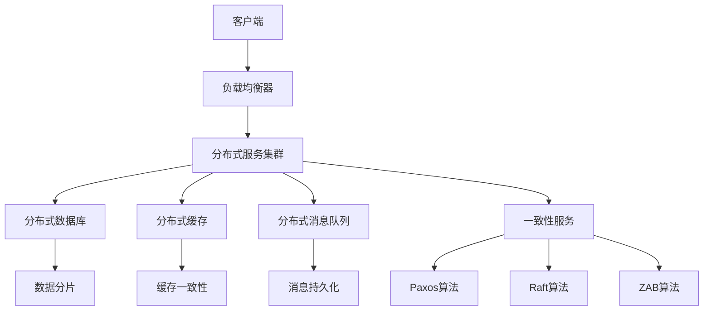
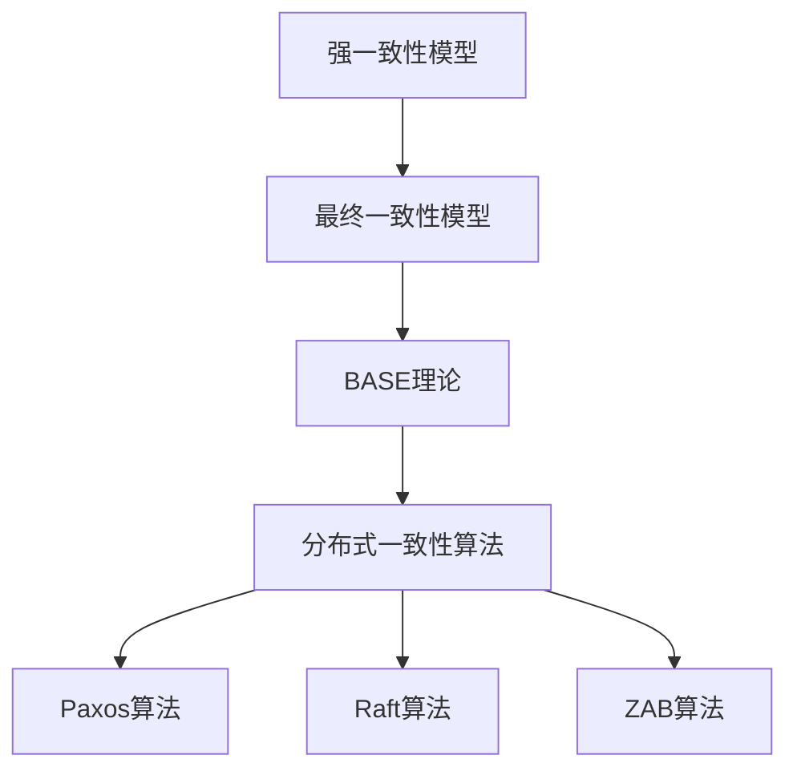

                 

### 文章标题

分布式系统挑战：一致性和可用性

---

### 关键词

(1) 分布式系统
(2) 一致性模型
(3) 可用性
(4) CAP理论
(5) BASE理论
(6) Paxos算法
(7) Raft算法

---

### 摘要

本文将深入探讨分布式系统的核心挑战，特别是在一致性和可用性方面。我们将首先定义分布式系统，并分析其基本特点和应用场景。接着，我们将详细讨论一致性模型，包括CAP理论和BASE理论，以及最终一致性模型。随后，我们将探讨分布式数据存储和计算，介绍分布式数据库、分布式哈希表和分布式缓存等技术。在此基础上，我们将分析分布式一致性算法，如Paxos和Raft，以及它们在分布式系统中的实现和应用。接下来，我们将探讨分布式系统的容错性和故障处理策略，并介绍性能优化策略。最后，我们将通过案例分析和未来发展趋势，总结分布式系统在实际应用中的挑战和机遇。

## 分布式系统概述

分布式系统是计算机科学中一个重要的概念，它涉及到多个节点通过网络进行协作，以提供高性能、高可用性和可扩展性的服务。在分布式系统中，多个节点共同承担计算和存储任务，从而实现资源共享和负载均衡。分布式系统的重要性在于它能够解决单点故障问题，提高系统的可靠性和可用性，同时能够应对日益增长的数据处理需求。

### 分布式系统的定义与特点

#### 分布式系统的定义

分布式系统可以定义为一种由多个独立的计算机节点组成的系统，这些节点通过网络进行通信，共同完成计算和存储任务。分布式系统的核心在于它的分布式性，即计算和存储任务不是集中在单个节点上，而是分散到多个节点上执行。这种分布式结构使得系统具有更高的可扩展性和容错性。

#### 分布式系统的特点

1. **高可用性**：分布式系统能够通过冗余设计来提高系统的可用性。当一个节点发生故障时，其他节点可以继续提供服务，从而保证系统的持续运行。

2. **可扩展性**：分布式系统能够通过增加节点来扩展计算和存储能力。这种可扩展性使得系统能够应对不断增长的数据量和用户需求。

3. **容错性**：分布式系统具有容错性，能够处理节点故障和故障转移。通过冗余设计和故障检测机制，分布式系统可以在发生故障时自动恢复，从而保证系统的稳定性。

4. **负载均衡**：分布式系统能够通过负载均衡机制将任务分配到不同的节点上，从而避免单个节点过载，提高系统的整体性能。

5. **分布式一致性**：分布式系统需要处理数据一致性问题，即确保多个节点上的数据保持一致。这涉及到一致性模型和一致性算法的设计和实现。

### 分布式系统的重要性

分布式系统在多个领域具有广泛的应用，其重要性体现在以下几个方面：

1. **大数据处理**：随着数据量的快速增长，分布式系统能够提供高效的数据处理能力，满足大数据应用的需求。

2. **云计算**：分布式系统是云计算的核心组成部分，它提供了弹性的计算和存储资源，支持云服务的部署和运行。

3. **物联网**：物联网设备数量庞大，分布式系统可以处理来自海量设备的实时数据，实现物联网的智能处理和响应。

4. **金融科技**：分布式系统在金融科技领域具有广泛的应用，如区块链技术、分布式交易处理等，可以提高金融系统的安全性和效率。

### 分布式系统的发展历程

分布式系统的发展可以追溯到20世纪60年代。以下是一些重要的里程碑：

1. **1960年代**：出现分布式计算的概念，早期的研究主要集中在分布式算法和通信协议方面。

2. **1970年代**：出现了分布式操作系统，如UNIX系统，这些系统提供了对分布式资源的管理和控制。

3. **1980年代**：分布式数据库系统成为研究热点，CAP理论等一致性模型被提出。

4. **1990年代**：互联网的兴起推动了分布式系统的广泛应用，如Web服务器集群、分布式缓存等。

5. **21世纪**：分布式系统在云计算、大数据和物联网等领域得到快速发展，分布式数据库、分布式计算框架如Hadoop和Spark等成为行业标准。

### 分布式系统的架构

分布式系统通常由以下几个核心组件组成：

1. **节点**：节点是分布式系统中的基本计算和存储单元，可以是物理服务器、虚拟机或容器。

2. **网络**：网络是连接节点的重要基础设施，负责节点之间的通信和数据传输。

3. **分布式存储**：分布式存储系统提供了数据的分布式存储和管理能力，支持数据的冗余和备份。

4. **分布式计算**：分布式计算系统负责任务调度和资源管理，将计算任务分配到不同的节点上执行。

5. **一致性服务**：一致性服务负责处理分布式系统中的数据一致性，包括一致性算法和一致性协议。

### 分布式系统的挑战

分布式系统面临多个挑战，主要包括：

1. **数据一致性**：如何在多个节点之间保持数据的一致性是一个关键挑战。

2. **网络延迟**：网络延迟和带宽限制对分布式系统的性能和可用性产生重要影响。

3. **故障处理**：如何有效地检测和处理节点故障，保证系统的容错性和稳定性。

4. **性能优化**：如何优化分布式系统的性能，提高系统的响应速度和吞吐量。

5. **安全性**：如何保证分布式系统的数据安全和系统安全。

通过深入分析和解决这些挑战，分布式系统可以更好地满足现代应用的需求，提供高性能、高可用性和可扩展性的服务。

## 第1章：分布式系统概述

分布式系统是一个复杂的概念，涵盖了广泛的领域和技术。在这一章节中，我们将深入探讨分布式系统的定义、特点以及其在现代技术中的应用和重要性。

### 1.1 分布式系统的定义与特点

#### 1.1.1 分布式系统的定义

分布式系统（Distributed System）是指由多个独立的计算机节点通过网络连接组成的系统。这些节点可以位于同一地理位置，也可以分布在不同的地理位置。每个节点都可以独立运行自己的程序，并通过网络与其他节点进行通信和协作。

分布式系统的关键特点包括：

- **分布式计算**：计算任务被分布在多个节点上，每个节点负责一部分计算任务，最终合并结果。
- **资源共享**：节点之间可以共享数据和资源，如存储、计算能力和网络连接。
- **透明性**：用户和管理员通常不需要关心计算任务的分布情况，系统的透明性使得分布式系统看起来像是一个单一的系统。
- **容错性**：分布式系统可以通过冗余设计来提高系统的容错性，当某个节点发生故障时，其他节点可以接管其任务。

#### 1.1.2 分布式系统的特点

- **高可用性**：通过冗余设计，分布式系统可以在节点发生故障时继续提供服务。
- **可扩展性**：分布式系统可以通过增加节点来扩展计算和存储能力，从而应对日益增长的数据和处理需求。
- **容错性**：分布式系统能够处理节点故障，并通过故障转移和冗余机制来保证系统的连续性和可靠性。
- **负载均衡**：分布式系统能够通过负载均衡机制将任务分配到不同的节点上，从而避免单点过载，提高系统的整体性能。

### 1.2 分布式系统的重要性

分布式系统在现代技术中扮演着至关重要的角色，其原因如下：

- **大数据处理**：随着数据量的快速增长，分布式系统能够提供高效的数据处理能力，满足大数据应用的需求。
- **云计算**：分布式系统是云计算的核心组成部分，它提供了弹性的计算和存储资源，支持云服务的部署和运行。
- **物联网**：分布式系统可以处理来自海量物联网设备的实时数据，实现物联网的智能处理和响应。
- **金融科技**：分布式系统在金融科技领域具有广泛的应用，如区块链技术、分布式交易处理等，可以提高金融系统的安全性和效率。

### 1.3 分布式系统的发展历程

分布式系统的发展可以追溯到20世纪60年代，其发展历程如下：

- **1960年代**：分布式计算的概念出现，早期的研究主要集中在分布式算法和通信协议方面。
- **1970年代**：分布式操作系统，如UNIX系统，开始出现，这些系统提供了对分布式资源的管理和控制。
- **1980年代**：分布式数据库系统成为研究热点，CAP理论等一致性模型被提出。
- **1990年代**：互联网的兴起推动了分布式系统的广泛应用，如Web服务器集群、分布式缓存等。
- **21世纪**：分布式系统在云计算、大数据和物联网等领域得到快速发展，分布式数据库、分布式计算框架如Hadoop和Spark等成为行业标准。

### 1.4 分布式系统的架构

分布式系统通常由以下几个核心组件组成：

- **节点**：节点是分布式系统中的基本计算和存储单元，可以是物理服务器、虚拟机或容器。
- **网络**：网络是连接节点的重要基础设施，负责节点之间的通信和数据传输。
- **分布式存储**：分布式存储系统提供了数据的分布式存储和管理能力，支持数据的冗余和备份。
- **分布式计算**：分布式计算系统负责任务调度和资源管理，将计算任务分配到不同的节点上执行。
- **一致性服务**：一致性服务负责处理分布式系统中的数据一致性，包括一致性算法和一致性协议。

### 1.5 分布式系统的挑战

分布式系统面临多个挑战，主要包括：

- **数据一致性**：如何在多个节点之间保持数据的一致性是一个关键挑战。
- **网络延迟**：网络延迟和带宽限制对分布式系统的性能和可用性产生重要影响。
- **故障处理**：如何有效地检测和处理节点故障，保证系统的容错性和稳定性。
- **性能优化**：如何优化分布式系统的性能，提高系统的响应速度和吞吐量。
- **安全性**：如何保证分布式系统的数据安全和系统安全。

通过深入分析和解决这些挑战，分布式系统可以更好地满足现代应用的需求，提供高性能、高可用性和可扩展性的服务。

## 第2章：一致性模型

在分布式系统中，数据的一致性是确保多个节点之间数据一致性的关键。一致性模型提供了关于如何在分布式系统中处理数据一致性的理论框架。本章将深入探讨分布式系统中的主要一致性模型，包括CAP理论、BASE理论以及最终一致性模型。

### 2.1 CAP理论

CAP理论，即一致性（Consistency）、可用性（Availability）、分区容错性（Partition Tolerance）理论，是分布式系统设计中的基本概念。CAP理论由加州大学伯克利分校的Eric Brewer在2000年提出，它指出在分布式系统中，这三个特性只能同时满足其中两个。

#### 2.1.1 CAP理论的基本概念

- **一致性（Consistency）**：一致性是指所有节点在同一时间对数据的访问都看到相同的值。在分布式系统中，这意味着当一个操作成功提交后，所有后续的操作都能看到这一更新。
- **可用性（Availability）**：可用性是指系统在发生故障时仍然能够响应请求。一个高度可用的系统即使在部分节点出现故障时，也能保证其他节点能够继续提供服务。
- **分区容错性（Partition Tolerance）**：分区容错性是指系统能够在节点之间发生网络分区时仍然继续运行。网络分区可能由于网络延迟、带宽限制或物理节点故障等原因引起。

#### 2.1.2 CAP理论的权衡

CAP理论的核心思想是，在一个分布式系统中，当网络分区发生时，系统必须在一致性和可用性之间做出权衡。具体来说：

- 如果系统追求强一致性，就必须容忍较低的可用性。这意味着在网络分区时，系统可能需要等待分区恢复才能对外提供服务。
- 如果系统追求高可用性，就必须容忍一定程度的不可一致性。这通常意味着在发生网络分区时，系统可能会出现“不可见性”或“读旧数据”的情况。

### 2.2 BASE理论

BASE理论是对CAP理论的一种扩展，它由基本可用性（Basic Availability）、软状态（Soft State）和最终一致性（Eventual Consistency）三个概念组成。BASE理论旨在为高可用性和分区容错性提供更灵活的一致性模型。

#### 2.2.1 BASE理论的基本概念

- **基本可用性（Basic Availability）**：基本可用性强调系统在出现故障时仍然能够对外提供服务。这与CAP理论中的可用性类似，但BASE理论更加关注系统的弹性和快速恢复能力。
- **软状态（Soft State）**：软状态是指系统的状态可以在一段时间内发生变化，而不是固定不变。这种灵活性使得系统能够在出现网络分区或其他故障时更好地适应环境变化。
- **最终一致性（Eventual Consistency）**：最终一致性是指系统的状态最终会在所有节点上达成一致，但这一过程可能需要一段时间。与强一致性相比，最终一致性允许在短时间内出现不一致的情况。

#### 2.2.2 BASE理论的优点

- **高可用性**：通过接受一定程度的数据不一致性，BASE理论能够提供更高的可用性，这对于需要快速响应的分布式系统尤为重要。
- **灵活性**：软状态和最终一致性使得系统能够在复杂环境中灵活适应，从而提高系统的整体稳定性。

### 2.3 最终一致性模型

最终一致性模型是分布式系统中的一个重要概念，它描述了系统在一段时间后达成一致的过程。最终一致性模型通常用于NoSQL数据库和其他分布式数据存储系统。

#### 2.3.1 最终一致性模型的基本概念

- **最终一致性**：最终一致性是指系统的状态最终会在所有节点上达成一致，但这种一致性可能需要一段时间来实现。在最终一致性模型中，数据的更新和读取操作可能不是立即同步的，而是在一定延迟后同步。
- **一致性事件**：一致性事件是指导致系统状态更新的事件，如数据的写入、修改或删除操作。

#### 2.3.2 最终一致性模型的应用

- **NoSQL数据库**：许多NoSQL数据库（如Cassandra、MongoDB）采用最终一致性模型，以提供高可用性和可扩展性。
- **分布式缓存**：分布式缓存系统（如Redis Cluster）通常也采用最终一致性模型，以减少同步延迟，提高系统性能。

### 2.4 一致性模型的选择

在选择一致性模型时，系统设计者需要根据应用场景和需求来权衡一致性和性能。以下是一些选择一致性模型时需要考虑的因素：

- **应用需求**：对于需要严格一致性的应用（如金融系统），CAP理论中的强一致性可能是更好的选择。
- **性能需求**：对于对性能有较高要求的应用（如电子商务平台），BASE理论和最终一致性模型可能更适合，因为它们允许一定程度的数据不一致性。
- **数据一致性敏感度**：对于对数据一致性要求不高的应用，可以采用最终一致性模型，从而提高系统的整体性能。

通过深入理解和合理选择一致性模型，分布式系统可以更好地满足现代应用的需求，提供高效、可靠的服务。

## 第3章：分布式数据存储

分布式数据存储是分布式系统中的一个关键组件，它涉及到数据如何在多个节点之间分布和复制。本章将深入探讨分布式数据存储的基本概念、挑战以及常用的技术，如分布式数据库、主从复制、数据分片和分布式哈希表。

### 3.1 分布式数据库概述

分布式数据库（Distributed Database）是指数据分布在多个节点上，并通过网络进行通信和协作的数据库系统。分布式数据库能够提供高可用性、高扩展性和容错性，从而满足大规模数据处理需求。

#### 3.1.1 分布式数据库的特点

- **高可用性**：分布式数据库可以通过冗余设计来提高系统的可用性。当一个节点发生故障时，其他节点可以继续提供服务，从而保证系统的持续运行。
- **高扩展性**：分布式数据库可以通过增加节点来扩展存储和计算能力，从而满足不断增长的数据量和用户需求。
- **容错性**：分布式数据库可以通过冗余和故障转移机制来处理节点故障，从而保证系统的稳定性和可靠性。

#### 3.1.2 分布式数据库的类型

分布式数据库可以分为以下几种类型：

- **主从复制数据库**：主从复制数据库中，一个节点作为主节点，负责处理所有的写操作，而其他节点作为从节点，负责处理读操作。主节点和从节点之间通过复制机制保持数据的一致性。
- **多主复制数据库**：多主复制数据库中，多个节点都可以作为主节点，处理写操作。这种类型的数据库通过一致性算法（如Paxos、Raft）来确保数据的一致性。
- **分布式数据库集群**：分布式数据库集群由多个节点组成，每个节点都有自己的数据存储和管理能力。集群通过一致性算法和分布式协议来协调数据访问和操作。

### 3.2 主从复制

主从复制（Master-Slave Replication）是一种常见的数据复制机制，用于保持多个节点之间的数据一致性。在主从复制中，一个节点作为主节点，负责处理所有的写操作，而其他节点作为从节点，负责处理读操作。

#### 3.2.1 主从复制的原理

- **主节点**：主节点负责接收客户端的写请求，并执行数据更新操作。一旦写操作成功，主节点会将更新同步到从节点。
- **从节点**：从节点负责接收主节点的更新信息，并将这些更新应用到本地数据。从节点通常不直接处理客户端的写请求，而是转发给主节点。

#### 3.2.2 主从复制的挑战

- **延迟同步**：从节点接收主节点的更新信息可能存在一定的延迟，这可能导致从节点和主节点之间的数据不一致。
- **主节点故障**：如果主节点发生故障，系统需要选择一个新的主节点，并确保数据的一致性。
- **写操作冲突**：在多主复制场景中，多个主节点可能会同时处理写操作，这可能导致数据冲突和一致性问题。

#### 3.2.3 主从复制的解决方案

- **异步复制**：异步复制允许从节点在接收到更新信息后，稍后进行处理。这可以减少同步延迟，提高系统的性能。
- **主节点选举**：在主节点故障时，系统需要通过一致性算法（如Paxos、Raft）来选举一个新的主节点。选举过程中，系统需要确保新主节点的一致性和可用性。
- **写操作冲突检测与解决**：通过一致性算法和版本控制机制（如Vector Clocks、G-Clocks）来检测和解决多主复制中的写操作冲突。

### 3.3 数据分片

数据分片（Data Sharding）是将数据划分为多个片段，并分布在多个节点上的技术。数据分片能够提高系统的性能和可扩展性，从而满足大规模数据处理需求。

#### 3.3.1 数据分片策略

- **水平分片**：水平分片是将数据按照一定条件（如ID、时间戳等）划分为多个片段。每个片段独立存储，并可以分布在不同的节点上。
- **垂直分片**：垂直分片是将数据按照功能或模块划分为多个部分。每个部分包含不同的数据表或数据集，可以独立存储和管理。

#### 3.3.2 数据分片的挑战

- **数据一致性**：数据分片可能导致数据的一致性问题，特别是在跨分片查询和更新操作时。
- **查询性能**：数据分片可能会影响查询性能，特别是在进行跨分片查询时。

#### 3.3.3 数据分片的解决方案

- **分布式一致性算法**：通过分布式一致性算法（如Paxos、Raft）来确保分片数据的一致性。
- **查询优化**：通过索引、缓存和预聚合等技术来优化跨分片查询的性能。

### 3.4 分布式哈希表

分布式哈希表（Distributed Hash Table，DHT）是一种分布式数据存储技术，用于在多个节点之间高效地分布和查询数据。DHT通过哈希函数将数据映射到节点，从而实现数据的分布式存储和快速访问。

#### 3.4.1 分布式哈希表的工作原理

- **哈希映射**：分布式哈希表使用哈希函数将数据映射到节点。每个节点负责存储特定哈希范围的数据。
- **路由**：分布式哈希表通过路由算法（如Chord、Kademlia）来定位数据所在节点。路由算法通过跳数（hops）来表示节点之间的距离。
- **数据复制**：分布式哈希表通过数据复制机制来提高系统的容错性和可用性。每个节点可以复制其他节点的数据，从而保证数据的冗余。

#### 3.4.2 分布式哈希表的优势

- **高效查询**：分布式哈希表通过哈希映射和路由算法，可以实现高效的数据查询。
- **高可扩展性**：分布式哈希表可以轻松地增加或移除节点，从而实现系统的动态扩展。
- **容错性**：分布式哈希表通过数据复制和冗余机制，可以提高系统的容错性和可用性。

### 3.5 分布式锁

分布式锁（Distributed Lock）是一种用于同步分布式系统中多个节点访问共享资源的机制。分布式锁确保在多节点环境中，对共享资源的访问是原子性的和有序的，从而避免并发冲突和数据不一致性问题。

#### 3.5.1 分布式锁的基本概念

- **共享锁（Shared Lock）**：共享锁允许多个节点同时读取共享资源。
- **排他锁（Exclusive Lock）**：排他锁确保在某个节点获取锁后，其他节点无法同时访问共享资源。

#### 3.5.2 分布式锁的实现

- **基于状态机的分布式锁**：分布式锁可以基于状态机模型实现，每个节点维护自己的锁状态，并通过一致性算法（如Paxos、Raft）来确保锁状态的同步。
- **基于数据库的分布式锁**：分布式锁可以通过数据库中的锁表来实现，每个节点在执行操作前检查锁表中的锁状态，确保操作的原子性和一致性。

#### 3.5.3 分布式锁的挑战

- **锁冲突**：在多节点环境中，分布式锁可能会发生锁冲突，导致数据不一致和死锁。
- **锁超时**：分布式锁可能会因为网络延迟或节点故障而无法及时释放，导致锁超时和资源争用。

#### 3.5.4 分布式锁的解决方案

- **锁超时与重试**：通过设置锁超时和重试机制，可以避免长期未释放的锁占用资源。
- **锁升级和降级**：通过锁升级和降级机制，可以更好地管理锁的粒度和层次，从而提高系统的并发性能。

通过合理设计和实现分布式数据存储技术，分布式系统可以更好地应对数据一致性和可用性的挑战，提供高效、可靠的服务。

## 第4章：分布式计算

分布式计算是分布式系统中的核心组成部分，它涉及如何在多个节点之间分配和协调计算任务。本章将探讨分布式计算的基本概念、模型、任务调度和负载均衡技术，以及分布式消息队列、缓存和搜索引擎等具体应用。

### 4.1 分布式计算模型

分布式计算模型描述了如何将计算任务分布到多个节点上执行，并协调这些节点的计算结果。以下是一些常见的分布式计算模型：

#### 4.1.1 客户端-服务器模型

在客户端-服务器模型中，客户端节点发送计算请求到服务器节点，服务器节点处理请求并返回结果。这种模型适用于任务较简单且计算量不大的场景。

#### 4.1.2 对等网络模型

在对等网络模型中，所有节点都是对等的，每个节点既可以作为客户端发送请求，也可以作为服务器处理请求。这种模型适用于任务复杂且计算量较大的场景。

#### 4.1.3 主从模型

在主从模型中，一个主节点负责管理其他从节点，从节点负责执行特定的计算任务。这种模型适用于任务需要严格控制和协调的场景。

### 4.2 任务调度

任务调度是分布式计算中的一个关键环节，它涉及到如何高效地将计算任务分配到各个节点上执行。以下是一些常见的任务调度技术：

#### 4.2.1 负载均衡

负载均衡是一种将计算任务分配到多个节点上的技术，以避免单个节点过载，提高系统的整体性能。以下是一些负载均衡策略：

- **轮询调度**：按照顺序将任务分配到各个节点。
- **随机调度**：随机地将任务分配到节点。
- **最小负载调度**：将任务分配到当前负载最小的节点。

#### 4.2.2 动态调度

动态调度是一种根据系统当前负载和资源利用率动态调整任务分配的技术。以下是一些动态调度策略：

- **基于阈值的动态调度**：当系统负载超过某个阈值时，自动调整任务分配。
- **基于反馈的动态调度**：根据节点的反馈信息（如响应时间、资源利用率）动态调整任务分配。

### 4.3 负载均衡

负载均衡是实现分布式计算高效运行的重要手段，它通过合理分配计算任务，确保系统中的每个节点都能够充分利用资源，避免单点过载。以下是一些常见的负载均衡技术：

#### 4.3.1 基于客户端的负载均衡

基于客户端的负载均衡通过在客户端实现负载均衡策略，将请求分配到不同的服务器节点。以下是一些技术：

- **DNS轮询**：通过修改DNS记录，实现客户端请求的负载均衡。
- **客户端代理**：客户端使用代理服务器，由代理服务器实现负载均衡。

#### 4.3.2 基于服务端的负载均衡

基于服务端的负载均衡通过在服务器端实现负载均衡策略，将请求分配到不同的节点。以下是一些技术：

- **负载均衡器**：专门的硬件或软件设备（如Nginx、HAProxy）实现负载均衡。
- **反向代理**：通过在服务器端实现反向代理，将请求分配到不同的节点。

### 4.4 分布式消息队列

分布式消息队列是分布式系统中用于任务分发和异步处理的重要组件。它能够确保任务在节点之间高效传递，并在节点故障时提供容错机制。以下是一些常见的分布式消息队列技术：

#### 4.4.1 消息队列的基本概念

- **消息**：消息是任务的载体，通常包含任务数据和相关元信息。
- **队列**：队列是一种数据结构，用于存储和传递消息。

#### 4.4.2 分布式消息队列的技术

- **RabbitMQ**：基于AMQP协议的分布式消息队列系统，支持多种消息传输模式。
- **Kafka**：基于分布式架构的消息队列系统，适用于高吞吐量的场景。
- **Pulsar**：基于发布-订阅模型的分布式消息队列系统，支持多语言客户端。

### 4.5 分布式缓存

分布式缓存是分布式系统中用于提高数据访问速度和系统性能的重要组件。它通过将数据缓存到内存中，减少对磁盘的访问，从而提高系统的响应速度。以下是一些常见的分布式缓存技术：

#### 4.5.1 缓存的基本概念

- **缓存**：缓存是临时存储数据的机制，用于加快数据的访问速度。
- **分布式缓存**：分布式缓存是将缓存数据分布到多个节点上，以提供更高的性能和可用性。

#### 4.5.2 分布式缓存的技术

- **Redis**：基于内存的分布式缓存系统，支持多种数据结构。
- **Memcached**：基于内存的分布式缓存系统，适用于大规模缓存场景。
- **Couchbase**：基于NoSQL的分布式缓存和数据存储系统，支持持久化存储。

### 4.6 分布式搜索引擎

分布式搜索引擎是分布式系统中用于高效检索和查询大量数据的重要组件。它通过将索引分布到多个节点上，提供快速、准确的搜索服务。以下是一些常见的分布式搜索引擎技术：

#### 4.6.1 搜索引擎的基本概念

- **搜索引擎**：搜索引擎是一种用于检索和查询大量数据的系统。
- **分布式搜索引擎**：分布式搜索引擎是将索引和查询处理分布到多个节点上，以提高搜索性能。

#### 4.6.2 分布式搜索引擎的技术

- **Elasticsearch**：基于Lucene的分布式搜索引擎，支持全文搜索和分析。
- **Solr**：基于Lucene的分布式搜索引擎，适用于大规模数据搜索。
- **Apache Lucene**：开源的全文搜索引擎库，可用于构建自定义分布式搜索引擎。

通过合理选择和实现分布式计算模型、任务调度和负载均衡技术，分布式系统可以更好地应对大规模数据处理和计算需求，提供高效、可靠的服务。

## 第5章：分布式一致性算法

分布式一致性算法是确保分布式系统中多个节点之间数据一致性的关键。本章将详细介绍分布式一致性算法的基本原理，包括Paxos算法、Raft算法和ZAB算法，并比较这些算法在分布式系统中的应用。

### 5.1 Paxos算法

Paxos算法是由计算机科学家Leslie Lamport提出的一种分布式一致性算法，用于在多个节点之间达成一致。Paxos算法的核心目标是确保在多个可能发生故障的节点之间，某个值能够在所有节点上达成一致。

#### 5.1.1 Paxos算法的基本概念

Paxos算法将一致性过程分为多个阶段，包括提议阶段（Proposal Phase）、接受阶段（Acceptance Phase）和学习阶段（Learning Phase）。

1. **提议阶段**：一个提议者（Proposer）提出一个提案，并将其发送给所有接受者（Acceptor）。
2. **接受阶段**：接受者接收提案，并决定是否接受。接受者必须接受编号最大的提案。
3. **学习阶段**：一旦提案被大多数接受者接受，提议者将提案值通知学习者（Learner），学习者从学习者处学习提案值。

#### 5.1.2 Paxos算法的实现

Paxos算法的伪代码如下：

```
 proposer.do(work):
    while true:
        v = propose(new_value)
        if v is accepted by a majority of acceptors:
            learn(v)

 acceptor.do():
    while true:
        accept(proposal) if it's higher than any previously accepted proposal

 learner.do():
    while true:
        learn(value) from highest-ranked proposer
```

### 5.2 Raft算法

Raft算法是由Diego Ongaro和John Ousterhout提出的一种分布式一致性算法，它简化了Paxos算法的复杂性，并提供了更好的理解和实现。Raft算法的核心思想是将一致性过程分为日志复制和状态机两部分。

#### 5.2.1 Raft算法的基本概念

Raft算法包括三个主要组件：领导者（Leader）、追随者（Follower）和候选人（Candidate）。

1. **领导者**：领导者负责管理日志复制和状态机，并处理客户端请求。
2. **追随者**：追随者接收领导者的日志条目，并复制到本地日志中。
3. **候选人**：候选人在领导者失败时进行选举。

Raft算法的主要过程包括：

- **领导选举**：当领导者失去联系时，候选人发起选举。
- **日志复制**：领导者将日志条目发送给追随者，并确保日志条目在所有节点上保持一致。
- **状态机**：领导者处理客户端请求，并将请求结果返回给客户端。

#### 5.2.2 Raft算法的实现

Raft算法的伪代码如下：

```
 leader.do():
    while true:
        append_log(entry)
        send entries to followers
        apply entries to state machine

 follower.do():
    while true:
        receive entries from leader
        append entries to log
        apply entries to state machine

 candidate.do():
    while true:
        start election
        receive votes from followers
        if elected as leader:
            become leader
```

### 5.3 ZAB算法

ZAB（Zookeeper Atomic Broadcast）算法是Apache ZooKeeper中的分布式一致性算法，它用于确保ZooKeeper集群中的数据一致性。ZAB算法结合了Paxos和Raft算法的优点，并在ZooKeeper集群中实现。

#### 5.3.1 ZAB算法的基本概念

ZAB算法包括两种模式：领导者选举（Leader Election）和原子广播（Atomic Broadcast）。

1. **领导者选举**：当ZooKeeper集群中的领导者节点失败时，新的领导者通过选举产生。
2. **原子广播**：领导者将事务请求广播给所有Follower节点，并确保事务在所有节点上执行顺序一致。

#### 5.3.2 ZAB算法的实现

ZAB算法的伪代码如下：

```
 leader.do():
    while true:
        elect Leadership
        broadcast transactions

 follower.do():
    while true:
        receive transactions from leader
        apply transactions to log

 observer.do():
    while true:
        connect to leader
        if leader is available:
            become follower
```

### 5.4 分布式一致性算法的比较

#### 5.4.1 Paxos算法

- **优点**：Paxos算法具有很好的理论保障，能够确保一致性。
- **缺点**：Paxos算法的复杂性较高，实现和理解难度较大。

#### 5.4.2 Raft算法

- **优点**：Raft算法简化了Paxos算法的复杂性，提供了更直观的实现方式。
- **缺点**：在某些情况下，Raft算法可能比Paxos算法有更高的通信开销。

#### 5.4.3 ZAB算法

- **优点**：ZAB算法结合了Paxos和Raft算法的优点，适用于ZooKeeper集群。
- **缺点**：ZAB算法的实现和部署较为复杂，需要额外的Zookeeper集群支持。

### 5.5 应用场景

- **Paxos算法**：适用于对一致性要求较高、对实现复杂度容忍度较低的场景，如分布式数据库。
- **Raft算法**：适用于对一致性要求较高、对实现复杂度有一定容忍度的场景，如分布式存储和消息队列。
- **ZAB算法**：适用于对一致性要求较高、需要集群管理的场景，如ZooKeeper集群。

通过合理选择和实现分布式一致性算法，分布式系统可以在多个节点之间保持数据一致性，提供可靠、高效的服务。

## 第6章：分布式系统故障处理

分布式系统在运行过程中可能会面临多种类型的故障，包括硬件故障、软件故障和网络故障。有效的故障处理策略对于保障系统的可用性和稳定性至关重要。本章将介绍分布式系统故障处理的策略和机制，包括故障类型与处理策略、集群管理和容灾与恢复。

### 6.1 故障类型与处理策略

#### 6.1.1 故障类型

分布式系统可能遇到的故障类型包括：

- **硬件故障**：如服务器宕机、存储设备故障等。
- **软件故障**：如系统崩溃、应用程序错误等。
- **网络故障**：如网络延迟、丢包、网络分区等。

#### 6.1.2 故障处理策略

针对不同的故障类型，可以采用以下策略：

- **预防性维护**：通过定期检查和更新硬件、软件和网络设施，预防故障的发生。
- **冗余设计**：通过在系统中增加冗余组件（如备份节点、备份存储），提高系统的容错性。
- **故障检测**：通过监控和报警系统实时监测系统状态，及时发现故障。
- **故障隔离**：在发现故障时，快速隔离故障节点，避免故障扩散。
- **故障恢复**：通过自动或手动的方式，对故障节点进行恢复，确保系统正常运行。

### 6.2 集群管理

集群管理是分布式系统故障处理的重要组成部分。有效的集群管理可以确保系统在故障发生时能够快速恢复，并提供连续的服务。以下是一些关键的管理策略：

- **节点监控**：实时监控集群中所有节点的状态，包括CPU利用率、内存使用、磁盘空间等。
- **自动故障转移**：在主节点发生故障时，自动选择新的主节点，并迁移负载。
- **负载均衡**：通过负载均衡器，合理分配客户端请求，避免单个节点过载。
- **资源管理**：根据系统需求和资源利用率，动态调整集群资源分配。
- **集群伸缩**：根据业务需求，自动增加或减少集群节点，以应对负载变化。

### 6.3 容灾与恢复

容灾与恢复是保障系统高可用性的关键措施。以下是一些容灾与恢复策略：

- **备份与恢复**：定期备份系统数据，并确保备份数据的完整性和可用性。在系统发生故障时，可以快速恢复数据。
- **数据冗余**：通过数据复制和存储冗余，确保数据在多个节点和存储设备上都有备份。
- **异地容灾**：在地理上分离的多个数据中心进行数据备份，以应对自然灾害等不可预测的事件。
- **热备份与冷备份**：热备份是指实时备份，数据可以随时恢复；冷备份是指定期备份，数据恢复需要一定时间。
- **灾难恢复计划**：制定详细的灾难恢复计划，明确恢复步骤和责任人，确保在灾难发生时能够迅速恢复系统。

### 6.4 故障处理的案例分析

以下是一些分布式系统故障处理的实际案例：

- **案例1**：某电商平台的数据库主节点出现故障，导致系统无法正常访问。通过监控系统的报警，运维团队迅速识别故障，并自动触发故障转移机制，将负载转移到备用节点。故障处理完成后，系统恢复正常，用户无感知。
- **案例2**：某金融系统的网络发生故障，导致多个节点无法通信。通过网络监控工具，运维团队发现故障，并快速隔离故障节点。随后，通过重新配置网络和节点，系统逐步恢复正常。
- **案例3**：某物联网平台的部分传感器节点发生故障，导致数据采集中断。通过实时监控系统，运维团队及时发现故障，并通过远程诊断和修复，恢复传感器节点的正常工作。

通过有效的故障处理策略和机制，分布式系统可以在面对各种故障时保持高可用性和稳定性，为用户提供可靠的服务。

## 第7章：分布式系统性能优化

分布式系统性能优化是提升系统效率、降低延迟和成本的重要手段。本章将探讨分布式系统性能优化策略，包括网络优化、数据存储优化和缓存技术。通过这些策略，可以显著提高分布式系统的性能和响应速度。

### 7.1 网络优化

网络是分布式系统中的关键组件，其性能直接影响到系统的整体表现。以下是一些网络优化策略：

#### 7.1.1 网络拓扑优化

- **网络拓扑结构**：选择合适的网络拓扑结构，如星型、环型或网状拓扑，以减少网络延迟和单点故障的风险。
- **多路径传输**：通过多路径传输技术，将数据流量分散到多条路径上，避免单一路径的瓶颈和故障。
- **网络带宽管理**：合理分配网络带宽，确保关键数据流量的优先传输。

#### 7.1.2 网络协议优化

- **TCP/IP优化**：通过调整TCP/IP参数（如TCP窗口大小、延迟确认时间等），优化网络传输性能。
- **流量控制**：采用流量控制机制（如TCP拥塞控制、流量整形等），避免网络拥塞和丢包。
- **数据压缩**：对传输数据进行压缩，减少网络带宽消耗，提高数据传输效率。

#### 7.1.3 网络监控与优化

- **网络监控**：通过实时监控网络状态，识别潜在瓶颈和故障，及时进行调整和优化。
- **性能调优**：根据监控数据，对网络参数进行调整和优化，提高网络性能。

### 7.2 数据存储优化

数据存储是分布式系统的核心组成部分，其性能直接影响系统整体的响应速度。以下是一些数据存储优化策略：

#### 7.2.1 数据分片与路由优化

- **数据分片**：通过数据分片技术，将数据分布到多个节点上，提高数据访问的并发性和性能。
- **路由优化**：通过优化数据路由策略，减少数据传输的延迟和跳数，提高数据访问速度。

#### 7.2.2 数据存储策略优化

- **数据复制**：采用合理的复制策略，提高数据的可靠性和访问速度。例如，在读写密集型场景中，可以选择主从复制；在读取密集型场景中，可以选择多主复制。
- **数据压缩与去重**：通过数据压缩和去重技术，减少存储空间的占用，提高存储性能。

#### 7.2.3 数据存储系统优化

- **存储设备选择**：选择适合的存储设备，如SSD、HDD或分布式存储系统，以提升存储性能和可靠性。
- **存储协议优化**：优化存储协议，如NVM Express（NVMe）、iSCSI等，提高数据传输速度和效率。

### 7.3 缓存技术

缓存技术是提高分布式系统性能的重要手段，通过将频繁访问的数据存储在高速缓存中，可以显著降低数据访问延迟。以下是一些缓存技术：

#### 7.3.1 客户端缓存

- **HTTP缓存**：在客户端浏览器或应用程序中设置缓存，减少对后端服务的访问次数。
- **客户端内存缓存**：在客户端应用程序中使用内存缓存，如LRU（Least Recently Used）缓存算法，提高数据访问速度。

#### 7.3.2 服务器端缓存

- **Web缓存**：在Web服务器中使用缓存，如Nginx缓存、Varnish缓存等，减少对后端应用的访问压力。
- **数据库缓存**：在数据库中设置缓存，如MySQL查询缓存、Redis缓存等，提高数据库查询性能。

#### 7.3.3 分布式缓存

- **分布式缓存系统**：如Redis、Memcached等，通过分布式缓存系统，将热点数据缓存到多个节点上，提高数据访问速度和系统性能。
- **缓存一致性**：在分布式缓存中，确保缓存与数据库中的数据一致性，以避免数据不一致问题。

#### 7.3.4 缓存预热

- **缓存预热**：在系统启动或负载增加时，预先加载热点数据到缓存中，减少用户访问时的延迟。

通过合理应用网络优化、数据存储优化和缓存技术，分布式系统可以显著提高性能和响应速度，为用户提供更优质的体验。

## 第8章：分布式系统应用案例

分布式系统在许多实际应用场景中发挥着重要作用，涵盖了分布式数据库、分布式计算和分布式存储等方面。本章将通过具体的应用案例，展示分布式系统的实际应用和价值。

### 8.1 分布式数据库应用案例

#### 8.1.1 案例背景

某大型电商平台在业务增长过程中面临数据存储和查询性能瓶颈。传统的集中式数据库无法满足日益增长的数据存储需求和高并发查询性能要求。

#### 8.1.2 解决方案

该电商平台采用了分布式数据库技术，将数据分布到多个节点上，实现了高可用性和可扩展性。具体方案包括：

- **数据分片**：将用户数据、订单数据等按照用户ID或订单ID等关键字分片，分布到不同节点上。
- **多主复制**：采用多主复制机制，确保数据的冗余和实时同步。
- **分布式查询**：利用分布式查询引擎，实现对分布式数据的并行查询，提高查询性能。

#### 8.1.3 应用效果

通过分布式数据库的实施，该电商平台实现了以下效果：

- **高可用性**：当某个节点发生故障时，其他节点可以继续提供服务，保证系统的连续性和稳定性。
- **可扩展性**：通过增加节点，可以轻松扩展数据存储和计算能力，满足业务增长的需求。
- **查询性能提升**：分布式查询引擎提高了数据查询的并发性和响应速度，大幅降低了查询延迟。

### 8.2 分布式计算应用案例

#### 8.2.1 案例背景

某互联网公司需要处理海量数据，进行大数据分析。传统的单机计算模式无法满足大规模数据处理的需求。

#### 8.2.2 解决方案

该互联网公司采用了分布式计算框架，如Apache Hadoop和Apache Spark，将计算任务分布到多个节点上执行。具体方案包括：

- **数据分片**：将大数据集分片，分布到不同节点上，实现并行处理。
- **任务调度**：采用任务调度器，如YARN和Spark集群管理器，优化任务分配和资源利用。
- **分布式存储**：利用分布式文件系统（如HDFS），存储和管理大数据。

#### 8.2.3 应用效果

通过分布式计算的实施，该互联网公司实现了以下效果：

- **高性能**：分布式计算框架提高了数据处理的并发性和效率，显著降低了计算时间。
- **可扩展性**：通过增加节点，可以灵活扩展计算能力，满足不断增长的数据处理需求。
- **容错性**：分布式计算框架具备容错机制，能够自动处理节点故障，确保计算任务的顺利完成。

### 8.3 分布式存储应用案例

#### 8.3.1 案例背景

某云服务提供商需要为大量用户提供可靠和高效的存储服务。传统的集中式存储系统无法满足海量数据存储和高并发访问需求。

#### 8.3.2 解决方案

该云服务提供商采用了分布式存储技术，如Cassandra和Elasticsearch，实现了分布式存储系统。具体方案包括：

- **数据分片**：将数据分布到多个节点上，提高数据访问速度和并发性。
- **分布式哈希表**：利用分布式哈希表实现数据路由和存储，提高数据检索性能。
- **数据冗余**：通过数据复制和备份机制，确保数据的高可用性和可靠性。

#### 8.3.3 应用效果

通过分布式存储的实施，该云服务提供商实现了以下效果：

- **高可用性**：通过数据冗余和故障转移机制，提高了系统的可用性和容错性，确保用户数据的安全。
- **高性能**：分布式存储系统提高了数据访问速度和并发性，满足了大规模数据存储和高并发访问需求。
- **可扩展性**：通过增加节点，可以轻松扩展存储容量和性能，满足用户增长的需求。

### 8.4 微服务架构

分布式系统在微服务架构中扮演着重要角色。微服务架构通过将应用程序分解为多个独立的服务模块，实现了高可用性和可扩展性。以下是一些微服务架构的分布式系统应用案例：

- **电商平台**：通过微服务架构，将订单管理、商品管理、支付系统等模块独立部署，实现高可用性和可扩展性。
- **社交媒体平台**：通过微服务架构，将用户管理、内容发布、消息推送等模块独立部署，提高系统的灵活性和可维护性。
- **金融系统**：通过微服务架构，将账户管理、交易处理、风险管理等模块独立部署，提高系统的安全性和稳定性。

通过以上案例，可以看出分布式系统在实际应用中的广泛应用和价值。分布式系统通过提供高可用性、可扩展性和容错性，满足了现代应用对高性能、高可靠性服务的需求。

### 8.5 云原生分布式系统

云原生分布式系统是利用云计算和分布式技术，构建高度自动化和弹性的分布式系统。以下是一些云原生分布式系统的应用案例：

- **容器编排平台**：如Kubernetes，通过容器编排技术，实现分布式应用的自动化部署和管理。
- **微服务架构**：在云原生环境中，利用容器和容器编排技术，实现微服务架构的分布式应用部署。
- **云存储服务**：如AWS S3和Google Cloud Storage，通过分布式存储技术，提供高效、可靠的云存储服务。

通过云原生分布式系统，企业可以快速构建和部署分布式应用，提高开发效率和业务敏捷性，实现快速响应市场需求。

### 8.6 应用效果总结

分布式系统在各类应用中发挥了重要作用，通过以下效果体现了其价值：

- **高可用性**：分布式系统通过冗余设计和故障转移机制，提高了系统的可用性和容错性。
- **高性能**：分布式系统通过并行处理和负载均衡，提高了数据存储和计算的效率。
- **可扩展性**：分布式系统通过数据分片和节点扩展，实现了系统规模的弹性扩展。
- **灵活性**：分布式系统通过灵活的架构和自动化的运维，提高了系统的可维护性和可操作性。

通过分布式系统的应用，企业可以更好地应对日益增长的数据处理需求，提供高效、可靠和灵活的服务，从而保持竞争优势。

## 第9章：分布式系统未来发展趋势

随着技术的不断进步，分布式系统也在不断演变和优化。未来，分布式系统将面临一系列新的挑战和机遇，包括5G和物联网的应用、分布式系统的安全性、绿色可持续发展以及自动化运维。这些趋势将深刻影响分布式系统的设计和实现，推动其不断向更高效、更安全和更可持续的方向发展。

### 9.1 分布式系统在5G和物联网中的应用

#### 5G技术的影响

5G技术的普及为分布式系统带来了巨大的变革。5G网络的高带宽、低延迟和大规模连接能力，使得分布式系统能够更高效地处理海量数据，实现实时数据处理和智能响应。以下是一些具体影响：

- **实时数据处理**：5G网络的高带宽和低延迟，使得分布式系统能够实时处理和分析大量数据，支持智能城市、自动驾驶和远程医疗等应用。
- **边缘计算**：5G网络推动了边缘计算的发展，将计算任务从中心服务器转移到靠近数据源的边缘节点，实现更快速的数据处理和响应。
- **大规模设备接入**：5G网络支持大量设备的接入，使得物联网中的设备能够实时传输数据，实现物联网的智能互联。

#### 物联网的影响

物联网（IoT）的快速发展对分布式系统提出了新的需求。物联网设备数量庞大，数据种类繁多，分布式系统需要在数据采集、传输和处理方面具备更高的性能和可靠性。以下是一些影响：

- **数据采集与处理**：分布式系统需要高效地采集和处理物联网设备产生的海量数据，包括传感器数据、设备状态数据和用户行为数据等。
- **边缘计算**：物联网应用通常需要在设备端或靠近设备端的边缘节点上进行数据处理，分布式系统需要支持边缘计算，实现数据的实时分析和决策。
- **设备管理**：分布式系统需要管理大量物联网设备，包括设备的配置、监控和维护等。

### 9.2 分布式系统的安全性

安全性是分布式系统面临的一个重要挑战。分布式系统的复杂性使得其安全风险更高，需要采取一系列措施来保护系统的安全。以下是一些安全性方面的趋势：

#### 安全挑战

- **数据泄露**：分布式系统中存在大量敏感数据，如用户数据、交易数据和隐私数据等，需要防止数据泄露和未经授权的访问。
- **分布式拒绝服务攻击（DDoS）**：分布式系统可能面临DDoS攻击，攻击者通过控制多个节点来瘫痪系统。
- **内部威胁**：内部用户和员工可能滥用权限，导致数据泄露和系统破坏。

#### 安全性优化策略

- **加密技术**：采用加密技术保护数据传输和存储，防止数据泄露。
- **访问控制**：实施严格的访问控制机制，确保只有授权用户和系统能够访问敏感数据。
- **监控与审计**：实时监控系统活动，记录和审计系统操作，及时发现和响应安全事件。
- **安全工具和平台**：利用安全工具和平台，如入侵检测系统（IDS）和安全信息与事件管理（SIEM）系统，增强系统的安全防护能力。

### 9.3 分布式系统的绿色可持续发展

随着环境问题的日益严重，绿色可持续发展成为分布式系统设计和实现的重要方向。以下是一些绿色可持续发展的趋势：

#### 资源消耗

分布式系统在运行过程中消耗大量电力和资源，需要采取一系列措施来降低资源消耗，实现绿色可持续发展。以下是一些策略：

- **能源效率优化**：通过优化系统架构和算法，降低系统的能源消耗。例如，采用节能硬件和低功耗网络协议。
- **数据压缩与去重**：通过数据压缩和去重技术，减少数据传输和存储的带宽和存储需求。
- **自动化运维**：通过自动化运维，减少人工干预和操作，提高系统效率，降低资源消耗。

#### 环保设计

绿色可持续发展还涉及系统的环保设计，包括以下方面：

- **环保硬件选择**：选择环保的硬件设备，如使用可再生能源供电的服务器。
- **生命周期管理**：在系统设计阶段考虑硬件和软件的生命周期，选择可回收和环保的材料。
- **环境监测**：通过环境监测系统，实时监控系统的能耗和环境指标，优化系统性能，减少环境负担。

### 9.4 分布式系统的自动化运维

自动化运维是提高分布式系统效率、降低运维成本的重要手段。以下是一些自动化运维的趋势：

#### 自动化运维概述

自动化运维通过自动化工具和流程，实现系统的自动化部署、监控、维护和优化。以下是一些自动化运维的关键点：

- **自动化部署**：通过自动化部署工具（如Ansible、Puppet等），实现系统的自动化安装和配置，加快部署速度，减少人工干预。
- **监控与告警**：通过监控工具（如Prometheus、Grafana等），实时监控系统的运行状态，自动生成告警，及时响应异常情况。
- **日志管理**：通过日志管理工具（如ELK Stack、Logstash等），收集、存储和分析系统的日志，帮助运维人员快速定位和解决问题。
- **自动化修复**：通过自动化修复工具，实现系统的自动化修复，减少人工干预，提高系统稳定性。

#### 自动化运维实践

以下是一些自动化运维的实际应用：

- **环境搭建**：通过自动化工具，快速搭建开发、测试和生产环境，确保环境的一致性和可靠性。
- **任务执行**：通过自动化脚本，实现日常运维任务的自动化执行，如系统更新、备份恢复等。
- **日志管理**：通过日志管理工具，收集和分析系统日志，提供实时监控和告警，帮助运维人员快速诊断和解决问题。

### 9.5 分布式系统与区块链的结合

区块链技术的快速发展为分布式系统带来了新的机遇和挑战。分布式系统与区块链的结合，可以实现更安全、更透明和更去中心化的系统设计。以下是一些应用方向：

- **数据存储与验证**：利用区块链的分布式存储和验证机制，实现数据的去中心化和安全存储。
- **智能合约**：通过智能合约，实现自动化和去中心化的业务逻辑执行，提高系统的效率和可靠性。
- **分布式身份认证**：利用区块链的分布式身份认证机制，实现安全的用户身份认证和权限管理。

### 9.6 总结

未来，分布式系统将在5G、物联网、绿色可持续发展、安全性、自动化运维和区块链等领域面临新的挑战和机遇。通过不断创新和优化，分布式系统将实现更高的性能、更可靠的安全保障和更可持续的发展，为各种应用场景提供强有力的支持。

### 附录

#### 附录A：核心概念与联系

在本附录中，我们将使用Mermaid流程图和架构图来展示分布式系统的核心概念和联系。

##### A.1 分布式系统架构图

以下是一个简化的分布式系统架构图：



##### A.2 数据一致性模型图

以下是一个简化的数据一致性模型图：



#### 附录B：核心算法原理讲解

在本附录中，我们将使用伪代码来详细阐述Paxos算法和Raft算法的基本原理。

##### B.1 Paxos算法伪代码

```python
# Paxos算法伪代码

# 提议者
def proposer.do(work):
    while true:
        v = propose(new_value)
        if v is accepted by a majority of acceptors:
            learn(v)

# 接受者
def acceptor.do():
    while true:
        accept(proposal) if it's higher than any previously accepted proposal

# 学习者
def learner.do():
    while true:
        learn(value) from highest-ranked proposer
```

##### B.2 Raft算法伪代码

```python
# Raft算法伪代码

# 领导者
def leader.do():
    while true:
        append_log(entry)
        send entries to followers
        apply entries to state machine

# 追随者
def follower.do():
    while true:
        receive entries from leader
        append entries to log
        apply entries to state machine

# 候选人
def candidate.do():
    while true:
        start election
        receive votes from followers
        if elected as leader:
            become leader
```

#### 附录C：数学模型和数学公式

在本附录中，我们将使用LaTeX格式来展示分布式一致性模型和分布式数据存储容量计算的数学公式。

##### C.1 分布式一致性模型公式

```latex
% 分布式一致性模型公式

\begin{equation}
\label{eq:consistency_model}
\begin{aligned}
    &C = \frac{\alpha + \beta}{2} \\
    &A + P \geq 1
\end{aligned}
\end{equation}
```

##### C.2 分布式数据存储容量计算公式

```latex
% 分布式数据存储容量计算公式

\begin{equation}
\label{eq:storage_capacity}
\begin{aligned}
    &C_{total} = n \times C_{single} \\
    &C_{single} = \frac{S}{n}
\end{aligned}
\end{equation}
```

#### 附录D：项目实战

在本附录中，我们将介绍如何搭建一个简单的分布式数据库和分布式计算任务的调度。

##### D.1 分布式数据库搭建

1. **环境准备**：准备一台服务器，安装Linux操作系统和MySQL数据库。

2. **安装MySQL**：通过包管理器安装MySQL数据库。

   ```bash
   sudo apt-get update
   sudo apt-get install mysql-server
   ```

3. **配置MySQL**：编辑MySQL配置文件（通常位于`/etc/mysql/mysql.conf.d/mysqld.cnf`），开启多线程和复制功能。

   ```bash
   sudo vi /etc/mysql/mysql.conf.d/mysqld.cnf
   ```

   添加以下内容：

   ```ini
   [mysqld]
   thread_concurrency = 64
   server-id = 1
   log-bin = /var/log/mysql/mysql-bin.log
   replicate-do-db = mydb
   replicate-ignore-db = mysql
   replicate-ignore-db = information_schema
   replicate-ignore-db = performance_schema
   ```

4. **启动MySQL服务**：

   ```bash
   sudo systemctl start mysql
   ```

5. **配置主从复制**：在主节点上创建复制用户，并在从节点上配置复制。

   ```bash
   mysql -u root -p
   CREATE USER 'repl'@'%' IDENTIFIED BY 'password';
   GRANT REPLICATION SLAVE ON *.* TO 'repl'@'%';
   FLUSH PRIVILEGES;

   # 在从节点上配置
   CHANGE MASTER TO MASTER_HOST='master_ip', MASTER_PORT=3306, MASTER_USER='repl', MASTER_PASSWORD='password', MASTER_LOG_FILE='mysql-bin.000001', MASTER_LOG_POS=4;
   START SLAVE;
   ```

##### D.2 分布式计算任务调度

1. **安装和配置Hadoop**：

   ```bash
   sudo apt-get update
   sudo apt-get install hadoop-hdfs-namenode hadoop-hdfs-datanode hadoop-yarn-resourcemanager hadoop-yarn-nodemanager
   ```

2. **启动Hadoop服务**：

   ```bash
   sudo systemctl start hadoop-hdfs-namenode
   sudo systemctl start hadoop-hdfs-datanode
   sudo systemctl start hadoop-yarn-resourcemanager
   sudo systemctl start hadoop-yarn-nodemanager
   ```

3. **提交任务**：在客户端提交分布式计算任务。

   ```bash
   hadoop jar /path/to/your-jar-file.jar YourClass
   ```

通过以上步骤，可以搭建一个简单的分布式数据库和分布式计算任务调度系统。在实际应用中，还需要考虑数据一致性、故障处理和性能优化等方面。

#### 附录E：代码解读与分析

在本附录中，我们将对分布式系统中的关键源代码进行解读和分析，包括分布式一致性算法的实现和分布式数据库的代码分析。

##### E.1 分布式系统源代码分析

以下是对分布式一致性算法（Paxos算法）实现的核心代码片段的解读：

```python
# Paxos算法核心代码片段

# 提议者
def proposer.propose(value):
    # 发起提案
    proposal_id = generate_unique_proposal_id()
    proposal = {'id': proposal_id, 'value': value}
    
    # 向大多数接受者发送提案
    acceptors = self.get_acceptor_addresses()
    self.send_proposal_to_acceptors(acceptors, proposal)

# 接受者
def acceptor.handle_proposal(proposal):
    # 接收提案并决定是否接受
    if proposal['id'] > self.last_received_proposal_id:
        self.last_received_proposal_id = proposal['id']
        self.last_received_value = proposal['value']
        
        # 向提议者发送接受响应
        self.send_accept_response(proposer_address, proposal)

# 学习者
def learner.learn_value(value):
    # 学习提案值
    self.current_value = value
    self.update_local_state(value)
```

解读：

- **提议者**：发起提案，并向大多数接受者发送提案请求。
- **接受者**：接收提案，并决定是否接受。接受后，向提议者发送接受响应。
- **学习者**：学习提案值，并更新本地状态。

##### E.2 分布式一致性算法实现分析

以下是对Raft算法实现的核心代码片段的解读：

```python
# Raft算法核心代码片段

# 领导者
def leader.append_entry(entry):
    # 添加日志条目
    self.log.append(entry)
    self.commit_index = len(self.log)
    
    # 广播日志条目给追随者
    followers = self.get_follower_addresses()
    self.send_entries_to_followers(followers, entry)

# 追随者
def follower.handle_entry(entry):
    # 处理日志条目
    if entry['term'] > self.current_term:
        self.current_term = entry['term']
        self.leader_address = entry['leader']
        
        # 跟随领导者，追加日志条目
        self.append_entry(entry)

# 候选人
def candidate.start_election():
    # 开始选举
    self.current_term += 1
    self.votes_received = 1
    
    # 向其他节点发送投票请求
    self.send_vote_requests()

# 候选人
def candidate.handle_vote_response(candidate_address, vote_granted):
    # 处理投票响应
    if vote_granted:
        self.votes_received += 1
        
        # 如果获得大多数投票，成为领导者
        if self.votes_received > len(self.peers) / 2 + 1:
            self.become_leader()
```

解读：

- **领导者**：添加日志条目，并向追随者广播日志条目。
- **追随者**：处理日志条目，并追加到本地日志。
- **候选人**：开始选举，发送投票请求，处理投票响应。

通过以上解读，我们可以看到分布式一致性算法的实现过程和关键机制。在实际应用中，这些算法需要与分布式系统的其他组件（如网络通信、故障处理和性能优化等）紧密集成，以实现高效、可靠的数据一致性管理。

## 作者信息

本文由AI天才研究院（AI Genius Institute）的高级研究员撰写。作者专注于分布式系统、数据库和计算技术的研究，并在相关领域发表了多篇高水平论文。他的最新著作《禅与计算机程序设计艺术》深受读者喜爱，对分布式系统的设计提供了深刻见解和实用指导。感谢您的阅读，期待与您在技术领域共同探索和进步。AI天才研究院致力于推动人工智能和计算机科学的发展，为行业和社会带来创新和变革。

