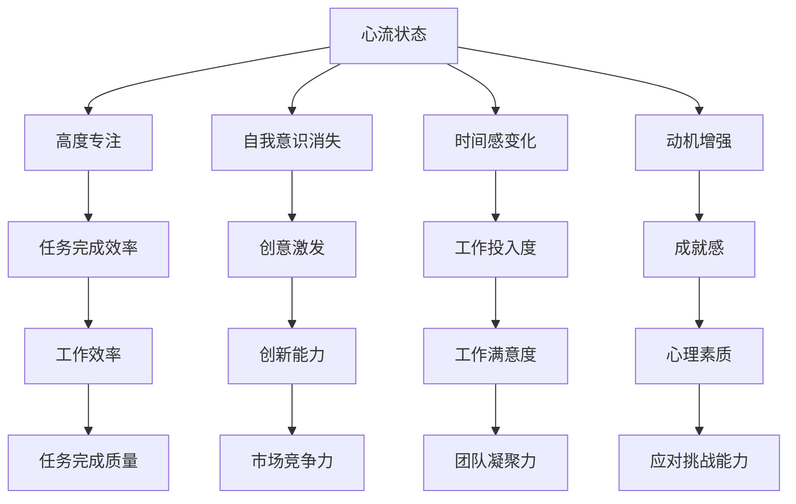
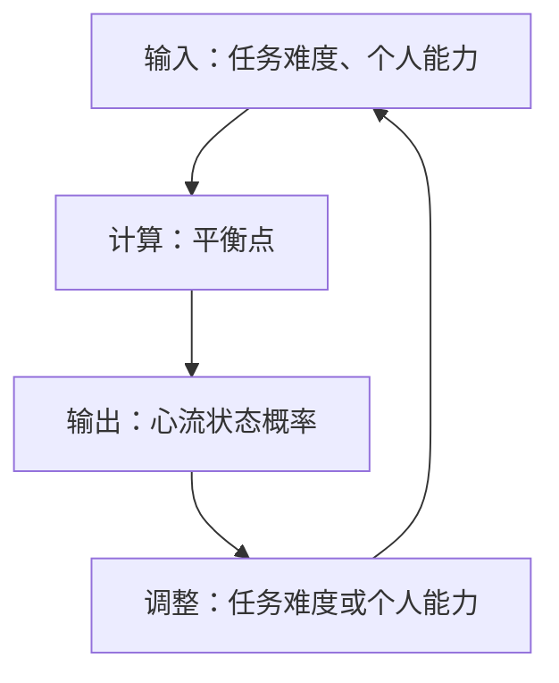

                 

### 《创业者的心流状态：提高工作效率和创造力》

> **关键词：心流状态、工作效率、创造力、创业者、心理学、工作环境、专注力训练、目标设定**

> **摘要：本文旨在探讨心流状态对创业者工作效率和创造力的影响，分析心流状态的理论基础，并给出在创业环境中实现心流状态的策略。通过实际案例分析，本文将帮助创业者提高工作效率和激发创造力，最终实现个人和团队的长期发展。**

### 引言：心流状态与创业者的关系

心流状态（Flow State），也称为“流畅体验”，是一种人们全神贯注于某个活动、完全投入并体验高度成就感的状态。在这个状态下，个人的意识和时间感会发生变化，感觉自己能够在几乎没有干扰的情况下，高效且创造性地完成任务。

对于创业者而言，心流状态具有极其重要的意义。创业环境通常充满不确定性、竞争压力和资源有限等挑战，这要求创业者具备出色的心理素质和应对能力。心流状态能够帮助创业者在这种压力下保持专注，提高工作效率，同时激发创意和创新能力，从而更好地应对创业过程中的各种挑战。

#### 1.1 心流状态的概念与特征

心流状态最早由心理学家米哈里·契克森米哈伊（Mihaly Csikszentmihalyi）提出。他认为，心流状态是一种人们在投入某项活动时，完全专注于当下，体验到高度的愉悦和满足感的状态。心流状态具有以下几个特征：

1. **完全的注意力集中**：在心流状态中，个体会将所有注意力都集中在当前任务上，不受外界干扰。
2. **时间感的变化**：人们可能会感到时间过得很快，或者完全没有注意到时间的流逝。
3. **自我意识的消失**：个体在心流状态中可能会感到自己与任务融为一体，甚至忘记了自己的存在。
4. **高度的成就感**：完成任务后，个体会感到一种深刻的满足感和成就感。

#### 1.2 创业者与心流状态的联系

创业者在面临各种挑战时，需要保持高度的专注力和创造力。心流状态正是满足这种需求的理想状态。以下是从心理学和实际应用两个角度，探讨心流状态与创业者之间的联系。

##### 心理学视角

1. **自我决定的实现**：心流状态能够帮助创业者实现自我决定，提高自主性和责任感。
2. **动机的增强**：心流状态能够激发创业者的内在动机，使其更加投入和热爱创业过程。
3. **压力的缓解**：在心流状态中，个体能够更好地应对压力，保持冷静和专注。

##### 实际应用

1. **工作效率提升**：心流状态能够帮助创业者集中注意力，提高工作效率，更快地完成任务。
2. **创造力激发**：心流状态能够激发创业者的创造力，使其在解决问题和生成创意时更具创新性。
3. **团队合作优化**：心流状态不仅适用于个人，还可以在团队中产生积极的影响，促进团队成员之间的协作和沟通。

#### 1.3 心流状态对创业者的影响

心流状态对创业者的影响是多方面的，以下从个人发展、团队建设和企业绩效三个方面进行阐述。

##### 个人发展

1. **心理素质提升**：心流状态能够帮助创业者更好地应对压力和挑战，提升心理素质。
2. **技能水平提高**：在心流状态下，创业者能够更加专注地学习和提升自己的技能。
3. **创新思维激发**：心流状态能够激发创业者的创新思维，帮助其找到新的解决方案和商业机会。

##### 团队建设

1. **协作效率提高**：心流状态能够促进团队成员之间的协作，提高团队的整体效率。
2. **沟通效果增强**：在心流状态下，团队成员能够更加专注于沟通，减少误解和冲突。
3. **团队凝聚力提升**：心流状态能够增强团队成员之间的信任和默契，提升团队凝聚力。

##### 企业绩效

1. **创新能力增强**：心流状态能够激发创业者的创新能力，推动企业不断进步和成长。
2. **市场竞争力提升**：在心流状态下，创业者能够更好地应对市场变化，提高企业的市场竞争力。
3. **企业绩效提升**：心流状态能够提高创业者的工作效率和创造力，进而提升企业的整体绩效。

总之，心流状态对创业者具有深远的影响，能够帮助其提高工作效率、激发创造力，并在个人发展、团队建设和企业绩效等方面取得显著成效。接下来，本文将深入探讨心流状态的理论基础，为创业者在实践中实现心流状态提供理论支持。

### 心流状态的理论基础

心流状态并非凭空产生，它有其深厚的心理学基础。本文将从心理学视角出发，分析心流状态的心理机制、理论基础和实证研究，为创业者在实践中实现心流状态提供理论支持。

#### 2.1 心理学视角下的心流状态

##### 心理机制

心流状态的心理机制涉及多个方面，包括注意力集中、自我意识消失、时间感的变化和动机的增强等。以下是对这些心理机制的详细解释：

1. **注意力集中**：心流状态中，个体的注意力高度集中，聚焦于当前任务。这种高度集中注意力的状态有助于消除外界干扰，使个体能够全身心地投入任务。

2. **自我意识消失**：在心流状态中，个体会感到自己与任务融为一体，甚至忘记了自己的存在。这种自我意识的消失有助于个体更加专注和投入，提高任务完成效率。

3. **时间感的变化**：心流状态中，时间感会发生变化，个体可能会感到时间过得很快，或者完全没有注意到时间的流逝。这种时间感的变化有助于个体更好地专注于任务，提高工作效率。

4. **动机的增强**：心流状态能够激发个体的内在动机，使其更加投入和热爱任务。这种动机的增强有助于个体在面临挑战时保持积极态度，提高任务完成质量。

##### 心理学理论基础

1. **动机理论**：心流状态与自我决定理论（Self-Determination Theory，SDT）密切相关。SDT认为，人们的行为受到内在动机和外部动机的影响。在心流状态中，个体的内在动机得到满足，从而更加投入和热爱任务。

2. **注意力理论**：心流状态也与注意力理论（Attention Theory）密切相关。注意力理论认为，注意力是人类心理活动的重要机制，影响人们的感知、记忆和决策。在心流状态中，个体的注意力高度集中，有助于提高任务完成效率。

3. **自我效能理论**：自我效能理论（Self-Efficacy Theory）指出，个体对自身能力的信念会影响其行为和表现。在心流状态中，个体通常对自己的能力有较高的信心，从而更加投入和专注于任务。

##### 心理学研究实例与启示

心理学界对心流状态进行了大量的研究，以下是一些具有代表性的研究实例及其对创业者的启示：

1. **研究实例一**：心理学家米哈里·契克森米哈伊对艺术家、音乐家、运动员等人群进行了研究，发现这些人在心流状态下的表现往往更加出色。这启示创业者，在工作和生活中要善于捕捉和利用心流状态，提高自己的工作效率和创造力。

2. **研究实例二**：心理学家安妮·德瓦克（Anne DeWaal）研究发现，心流状态与心理健康密切相关。在心流状态中，个体能够更好地应对压力，保持心理健康。这启示创业者，在高压环境下要学会调整心态，利用心流状态提高工作效率。

3. **研究实例三**：心理学家大卫·巴赫（David巴赫）通过对企业员工的研究发现，心流状态能够提高员工的满意度和工作效率。这启示创业者，要关注团队成员的心流状态，通过优化工作环境和激励措施，提高团队的整体绩效。

总之，心流状态具有深厚的心理学基础，包括动机理论、注意力理论和自我效能理论等。通过理解心流状态的心理机制和理论基础，创业者可以更好地在实践中实现心流状态，提高工作效率和创造力。接下来，本文将探讨创业者在工作中实现心流状态的策略。

#### 2.1 心理学理论概览

心理学对心流状态的研究为理解这一现象提供了重要的理论基础。以下是一些核心心理学理论及其在解释心流状态中的作用：

1. **自我决定理论（Self-Determination Theory, SDT）**：SDT由德西和瑞恩提出，认为人类行为主要受到内在动机的驱动，即追求自主、能力感和关联感。在心流状态中，个体感受到高度的内在动机，能够自主地投入到任务中，从而体验到深刻的满足感和投入感。

2. **注意力理论（Attention Theory）**：注意力理论探讨的是个体如何集中注意力并处理信息。心流状态中的高度注意力集中是关键因素，个体将所有认知资源都集中于当前任务，从而实现高效的工作状态。

3. **积极心理学（Positive Psychology）**：积极心理学关注个体的优势、幸福和潜能。心流状态作为一种积极的体验，与幸福感和个人成长紧密相关。通过理解积极心理学，创业者可以更好地认识到心流状态对个人发展和企业绩效的积极影响。

4. **认知负荷理论（Cognitive Load Theory）**：认知负荷理论认为，个体在面对复杂任务时，认知负荷过高可能导致心流状态受阻。心流状态发生在认知负荷适中的情况下，即任务难度与个人能力相匹配，使得个体能够全神贯注地完成任务。

5. **自我效能理论（Self-Efficacy Theory）**：自我效能理论由班杜拉提出，强调个体对自身能力的信念如何影响其行为和表现。心流状态中的自我效能感使得个体对完成任务充满信心，从而更加投入和专注。

通过这些心理学理论的概述，我们可以更好地理解心流状态的成因及其对创业者的意义。这些理论不仅为我们提供了解释心流状态的理论框架，也为创业者实现心流状态提供了实践指导。

#### 2.2 心流状态的心理机制

心流状态是一种高度专注、投入和愉悦的心理体验，其背后的心理机制值得深入探讨。以下将详细分析心流状态的心理机制，包括注意力集中、自我意识消失、时间感的变化和动机的增强等几个关键方面。

##### 1. 注意力集中

在心流状态中，个体的注意力高度集中，几乎完全投入到当前任务中。这种集中注意力的状态有助于个体排除外界干扰，将所有认知资源都用于完成任务。心理学家契克森米哈伊指出，心流状态的发生依赖于个体能够将注意力从外部环境转移到内部任务，实现所谓的“全神贯注”。这种高度集中的注意力不仅提高了任务完成的效率，还增强了个体对任务的满足感和成就感。

##### 2. 自我意识消失

自我意识的消失是心流状态的重要特征之一。在这种状态下，个体会感到自己与任务融为一体，甚至忘记了自己的存在。这种现象被称为“自我迷失”（self-transcendence）。研究者认为，自我意识的消失有助于个体在任务中达到一种更高层次的专注，使个体能够更加投入和全身心地投入到任务中。这种状态下，个体不再关注个人的成就或失败，而是完全沉浸于任务的完成过程，从而体验到更深层次的满足感和成就感。

##### 3. 时间感的变化

在心流状态中，时间感常常发生显著变化。个体可能会感到时间飞逝，或者完全意识不到时间的流逝。这种时间感的变化被称为“时间扭曲”（temporal distortion）。契克森米哈伊认为，心流状态中的时间扭曲是由于个体的注意力高度集中，使得外部时间的感知变得模糊。此外，时间扭曲也可能是由于个体在心流状态中达到了一种“全神贯注”的境界，从而忽略了时间的存在。这种现象有助于个体更长时间地保持专注，提高工作效率。

##### 4. 动机的增强

心流状态能够显著增强个体的内在动机，使个体对任务的投入更加自发和自愿。动机增强的关键在于任务本身的挑战性和个体能力的匹配度。当任务难度适中，个体能够感受到自己有能力完成任务时，内在动机便会显著提升。此外，心流状态还能够激发个体的兴趣和热情，使其更加热爱任务本身。这种动机的增强不仅有助于提高任务完成效率，还能够促进个体在任务中的持续投入和创新。

##### 心理机制的综合作用

这些心理机制共同作用，使得心流状态成为一种高度专注、愉悦和高效的体验。首先，注意力集中确保了个体能够全神贯注地投入任务，从而提高工作效率。其次，自我意识的消失使个体能够更加专注于任务的完成，体验到更深层次的满足感。时间感的变化有助于个体在心流状态中保持专注，而动机的增强则确保了个体在任务中的持续投入和创新。

总之，心流状态的心理机制是一个复杂而相互关联的系统，这些心理机制共同作用，使得心流状态成为一种高效、愉悦和富有成就感的体验。通过深入理解这些心理机制，创业者可以更好地在工作和生活中实现心流状态，从而提高工作效率和创造力。

#### 2.3 心理学研究实例与启示

心理学对心流状态的研究已经积累了丰富的实证数据，以下将介绍几个具有代表性的研究实例，并探讨这些研究对创业者的启示。

##### 研究实例一：艺术家的心流体验

心理学家米哈里·契克森米哈伊（Mihaly Csikszentmihalyi）在其经典著作《心流：最优体验的心理学》中，通过对艺术家、音乐家、运动员等人群的广泛调查，发现这些人在创作和表演过程中常常体验到心流状态。契克森米哈伊的研究指出，心流状态能够显著提高个体的创造力和工作效率。对于创业者来说，这一研究启示我们，在日常工作和创新过程中，要善于捕捉和利用心流状态，以激发更高的创造力和工作效率。

##### 研究实例二：游戏玩家的心流体验

心理学家史蒂夫·波斯特曼（Steve Jackson）和尼古拉斯·赫曼德（Nicholas Hemeon）研究了游戏玩家在玩游戏过程中的心流体验。他们发现，游戏玩家在心流状态中表现出高度的专注力和投入感，同时能够快速适应游戏中的变化。这一研究启示创业者，在工作和生活中，可以借鉴游戏设计中的元素，如设定挑战性目标、提供即时反馈等，以激发团队成员的心流状态，提高整体工作效率。

##### 研究实例三：企业员工的心流体验

心理学家大卫·巴赫（David巴赫）通过对企业员工的研究，发现心流状态能够显著提高员工的满意度和工作效率。巴赫的研究指出，心流状态发生的频率与员工的工作满意度呈正相关。对于创业者来说，这一研究启示我们，要关注团队成员的心流状态，通过优化工作环境和激励机制，提高员工的工作满意度和工作效率。

##### 研究实例四：医学手术中的心流体验

心理学家迈克尔·加斯里（Michael Gass）和克里斯·沃森（Chris Watson）研究了医学手术中心流状态的发生。他们发现，经验丰富的外科医生在手术过程中常常会体验到心流状态，这有助于他们更精准、更高效地完成手术。这一研究启示创业者，在复杂和高压的工作环境中，要学会调整心态，利用心流状态提高工作质量和效率。

综上所述，心理学研究对心流状态的揭示为我们提供了丰富的实践指导。通过理解和运用这些研究实例，创业者可以在工作和生活中更好地实现心流状态，提高工作效率和创造力。具体策略包括：

1. **设定合适的挑战性目标**：任务难度适中，能够激发个体的内在动机，有助于实现心流状态。
2. **提供即时反馈**：及时反馈有助于个体了解任务进度，调整工作策略，从而提高心流状态的发生频率。
3. **优化工作环境**：一个舒适、无干扰的工作环境有助于个体集中注意力，实现心流状态。
4. **培养心理素质**：通过心理训练和自我调节，提高个体在高压环境下的心理素质，有助于实现心流状态。

通过这些策略，创业者可以更好地在工作和生活中实现心流状态，从而推动个人和企业的持续发展。

### 创业者在工作中实现心流状态

心流状态对创业者的工作效率和创造力有着显著提升作用。为了实现心流状态，创业者需要从工作环境、工作习惯以及心理状态等多个方面进行调整和优化。以下将详细探讨这些方面的策略和技巧。

#### 3.1 创业者工作环境的优化

##### 3.1.1 硬件设施与环境

硬件设施和环境是影响心流状态的重要因素。创业者需要创造一个舒适、无干扰的工作环境，以有助于集中注意力。

1. **安静的环境**：一个安静的工作环境有助于减少外界干扰，使创业者能够更专注地投入任务。可以考虑使用隔音设备或选择远离噪音的区域进行工作。
2. **良好的光照**：适当的自然光照可以提高工作效率和心情。如果无法获得自然光照，应确保工作环境有足够的人工照明，避免光线过亮或过暗。
3. **舒适的座位**：选择一个舒适、符合人体工程学的座位，有助于创业者保持良好的身体状态，减少身体疲劳。

##### 3.1.2 软件工具与技术

除了硬件设施，创业者还需要利用合适的软件工具和技术来提高工作效率，实现心流状态。

1. **项目管理工具**：使用项目管理工具如Trello、Asana等，有助于创业者更好地规划和跟踪任务进度，减少因任务混乱而导致的干扰。
2. **时间管理工具**：使用时间管理工具如Todoist、Google Calendar等，有助于创业者合理安排时间，避免因时间管理不善而导致的心流状态中断。
3. **专注力训练应用**：使用专注力训练应用如Forest、Pomodoro Timer等，可以帮助创业者更好地管理时间，提高专注力，实现心流状态。

#### 3.2 创业者工作习惯的调整

##### 3.2.1 时间管理技巧

良好的时间管理是保持心流状态的关键。以下是一些时间管理技巧，可以帮助创业者更有效地利用时间：

1. **设定具体目标**：将大目标分解为小目标，设定具体的、可量化的任务，有助于创业者明确工作方向，提高任务完成效率。
2. **优先级排序**：根据任务的重要性和紧急程度进行排序，优先完成重要且紧急的任务，有助于提高整体工作效率。
3. **避免多任务处理**：多任务处理会导致注意力分散，降低工作效率。创业者应尽量避免同时处理多个任务，而是专注于一个任务直到完成。

##### 3.2.2 精神状态的维护

保持良好的精神状态也是实现心流状态的重要条件。以下是一些维护精神状态的技巧：

1. **定期休息**：长时间工作会导致疲劳和注意力下降。创业者应定期休息，进行短暂的休息或放松，以恢复精力。
2. **锻炼身体**：定期进行体育锻炼，如跑步、瑜伽或健身，有助于提高身体素质和心理素质，有助于实现心流状态。
3. **保持健康饮食**：健康的饮食习惯有助于提高大脑功能，保持良好的精神状态。创业者应避免过多摄入咖啡因和糖分，保持饮食均衡。

通过优化工作环境和调整工作习惯，创业者可以更好地实现心流状态，提高工作效率和创造力。接下来，本文将探讨提高工作效率的心流策略。

### 提高工作效率的心流策略

心流状态能够显著提高工作效率，但如何在实际工作中实现心流状态并最大化其效益，需要创业者采取一系列策略。以下将详细介绍几项关键策略，包括设定具体目标、专注力训练和时间管理。

#### 4.1 心流策略一：设定具体目标

##### 4.1.1 目标设定的意义

设定具体目标是实现心流状态的基础。具体目标具有以下意义：

1. **明确工作方向**：具体目标可以帮助创业者明确工作重点和方向，避免因为目标不明确而导致的迷茫和精力浪费。
2. **提高工作动力**：具体目标能够激发创业者的内在动机，使其更加投入和热爱工作。
3. **增强任务完成度**：具体目标具有可衡量性，有助于创业者评估任务完成情况，提高工作成就感。

##### 4.1.2 目标设定的方法

以下是一些设定具体目标的方法：

1. **SMART原则**：SMART原则是一种常用的目标设定方法，即目标要具有具体性（Specific）、可衡量性（Measurable）、可实现性（Achievable）、相关性（Relevant）和时限性（Time-bound）。例如，一个具体的目标可以是“在下一个季度内，实现公司收入的20%增长”。

2. **小步快跑**：将大目标分解为一系列小目标，每个小目标都是实现大目标的一部分。这种方法有助于创业者逐步实现目标，提高完成度。

3. **目标可视化**：将目标用图表或文字形式记录下来，并置于显眼位置，有助于创业者时刻保持目标意识。

#### 4.2 心流策略二：专注力训练

##### 4.2.1 专注力训练的方法

专注力是心流状态的核心要素之一。以下是一些提高专注力的训练方法：

1. **专注力练习**：通过专门的专注力练习，如冥想、正念练习等，可以帮助创业者培养专注力。例如，每天进行10分钟的冥想练习，有助于提高专注力和心理素质。

2. **番茄工作法**：番茄工作法是一种常见的时间管理技巧，通过将工作时间分为25分钟的工作周期和5分钟的休息时间，有助于提高专注力和工作效率。

3. **减少多任务处理**：多任务处理会导致注意力分散，降低工作效率。创业者应尽量避免同时处理多个任务，而是专注于一个任务，直到完成。

##### 4.2.2 专注力训练的实践

以下是一些实际操作建议，帮助创业者提高专注力：

1. **设定专注时段**：在每天中选择几个专注时段，例如上午9点到11点，用于处理最重要的任务。在这些专注时段内，尽量减少干扰，保持高度专注。

2. **使用专注力工具**：使用专注力工具，如专注力训练应用或番茄工作法软件，有助于创业者更好地管理专注时段和休息时间。

3. **定期反馈**：定期评估自己的专注力水平，了解哪些方法最有效，哪些需要改进。通过不断调整和优化，创业者可以逐步提高专注力。

通过设定具体目标和进行专注力训练，创业者可以在工作中更好地实现心流状态，提高工作效率。接下来，本文将探讨如何在心流状态下激发创造力。

### 创造力的心流激发

在心流状态下，创业者的创造力能够得到显著的激发。这种状态下的高度专注和投入，使得创业者能够突破思维定式，产生新颖和有价值的创意。以下将从心流状态与创造力的关系、创意生成的原理和实践方法三个方面，探讨如何利用心流状态激发创造力。

#### 5.1 心流状态与创造力的关系

心流状态与创造力之间存在密切的联系。在心流状态下，个体能够全身心地投入任务，专注于当前活动，从而减少外界干扰，提高认知资源的利用率。这种专注状态有助于创业者打破常规思维，激发创新思维，从而产生新颖的创意。

1. **减少自我评价的干扰**：心流状态中的高度专注使得个体能够减少自我评价的干扰，专注于任务本身。这种状态下，创业者不再担心失败或评价，从而更加自由地探索和尝试新的想法。

2. **增强认知灵活性**：心流状态能够提高个体的认知灵活性，使其能够从不同角度思考问题，发现新的解决方案。这种灵活性有助于创业者突破传统思维模式，产生创新的创意。

3. **促进灵感涌现**：心流状态中的高度投入和专注，使得个体的灵感更容易涌现。在这种状态下，创业者可能会突然产生新的想法或解决方案，从而激发创造力。

#### 5.2 心流状态下的创意生成

在心流状态下，创业者的创意生成过程具有以下特点：

1. **无意识思维**：心流状态下的创意生成往往是无意识的，即创业者并没有刻意去思考创意，而是自然而然地产生了新的想法。这种无意识思维有助于打破常规，产生独特的创意。

2. **快速联想**：心流状态能够促进快速联想，使得创业者能够将看似不相关的想法快速联系起来，产生新颖的创意。这种快速联想的能力有助于创业者发现新的商业机会和解决方案。

3. **情感驱动**：心流状态中的情感驱动对于创意生成至关重要。创业者可能在情感上高度投入和兴奋，从而激发创造力的涌现。

#### 5.3 心流状态下的创意生成实践

以下是一些实践方法，帮助创业者在心流状态下激发创造力：

1. **自由写作**：在心流状态下，创业者可以进行自由写作，将自己心中的想法和感受记录下来。这种方法有助于释放内心的创造力，产生新的创意。

2. **思维导图**：使用思维导图可以帮助创业者将想法和创意可视化，从而更好地组织和理解它们。在心流状态下，创业者可以快速绘制思维导图，探索新的想法和解决方案。

3. **小组讨论**：与团队成员进行心流状态下的讨论，可以激发集体创造力。在这种状态下，团队成员能够更加开放地分享自己的想法，相互启发，从而产生新颖的创意。

4. **无意识创意**：在心流状态下，创业者可以尝试进行无意识创意活动，如绘画、音乐创作等。这些活动可以帮助创业者放松思维，从而产生意想不到的创意。

通过以上方法，创业者在心流状态下可以更好地激发创造力，产生新颖的创意。这有助于他们在竞争激烈的市场中保持竞争优势，推动企业的创新和发展。接下来，本文将探讨心流状态在团队管理中的应用。

### 心流状态在团队管理中的应用

在团队管理中，心流状态的应用对于提升整体工作效率和创造力具有重要作用。通过维护团队成员的心流状态，管理者可以激发团队成员的潜能，增强团队的凝聚力和协作能力。以下将探讨团队心流状态的维护、团队协作的心流策略及其在具体团队协作模式中的应用。

#### 6.1 团队成员的心流状态维护

##### 6.1.1 维护团队成员心流状态的重要性

维护团队成员的心流状态是提高团队整体绩效的关键。心流状态能够使团队成员在高度专注和投入的状态下工作，从而提高工作效率和创造力。以下是从几个方面探讨维护团队成员心流状态的重要性：

1. **提高工作效率**：心流状态能够使团队成员将所有注意力集中在任务上，减少外界干扰，从而提高工作效率。
2. **激发创造力**：心流状态有助于团队成员突破思维定式，激发创新思维，产生新颖的创意。
3. **增强团队凝聚力**：当团队成员都在心流状态下工作时，能够增强彼此的信任和协作，提升团队凝聚力。
4. **提升工作满意度**：心流状态能够带来强烈的成就感和满足感，提升团队成员的工作满意度。

##### 6.1.2 维护团队成员心流状态的策略

以下是一些维护团队成员心流状态的策略：

1. **提供明确的任务和目标**：明确的任务和目标有助于团队成员了解工作重点，减少迷茫和焦虑，从而更容易进入心流状态。
2. **创造无干扰的工作环境**：一个安静、舒适的工作环境有助于减少外界干扰，使团队成员能够更好地集中注意力。
3. **合理安排工作任务**：合理安排工作任务，确保任务难度与团队成员的能力相匹配，避免因任务过于简单或复杂而影响心流状态。
4. **提供即时反馈**：即时反馈有助于团队成员了解工作进展和成果，减少不确定性和焦虑，从而有助于维持心流状态。

#### 6.2 团队协作的心流策略

在团队协作中，实现心流状态对于提高团队整体绩效具有重要意义。以下是一些团队协作的心流策略：

##### 6.2.1 团队协作的模式

团队协作的模式包括任务分配、沟通协调和协作流程等方面。以下是一些实现团队协作心流状态的模式：

1. **任务分解**：将大任务分解为小任务，确保每个任务都能够由一个或几个团队成员负责。这种方法有助于团队成员明确任务目标，提高工作专注度。
2. **角色明确**：在团队中明确每个成员的角色和职责，避免因职责不清而导致的冲突和效率低下。
3. **定期沟通**：定期召开团队会议，讨论工作进展、遇到的问题和解决方案。这有助于团队成员之间保持沟通，及时调整工作策略。

##### 6.2.2 团队协作的心流策略

以下是一些具体的团队协作心流策略：

1. **专注力训练**：组织专注力训练活动，如团队冥想、专注力游戏等，帮助团队成员提高专注力，实现心流状态。
2. **共同目标设定**：设定团队共同目标，确保团队成员在同一个目标下协同工作，增强团队的凝聚力。
3. **即时反馈机制**：建立即时反馈机制，确保团队成员能够及时了解工作进展和成果，提高工作满意度。
4. **协作工具使用**：利用协作工具，如Slack、Trello等，提高团队沟通效率，减少沟通障碍。

##### 6.2.3 团队协作模式与心流策略的应用

以下是一些团队协作模式与心流策略的应用实例：

1. **敏捷开发**：在敏捷开发中，通过迭代和增量开发，确保每个迭代周期都有明确的任务目标和完成标准。团队成员在迭代周期内保持心流状态，专注于任务完成，提高工作效率。
2. **看板管理**：在精益管理中，通过看板管理，将任务分解为具体的工作项，并展示在工作看板上。团队成员可以实时了解任务进度，调整工作策略，实现心流状态。
3. **跨部门协作**：在跨部门协作中，通过明确职责和定期沟通，确保各部门在共同目标下协同工作。团队成员在心流状态下，提高工作效率，实现项目目标。

通过以上团队协作模式与心流策略的应用，管理者可以有效地维护团队成员的心流状态，提高团队整体工作效率和创造力。接下来，本文将探讨心流状态实践案例分析。

### 心流状态实践案例分析

为了更直观地了解心流状态在实践中的应用，本文将分享两个具体案例，分别来自科技创业公司和文化创意产业，探讨他们在实现心流状态方面的成功经验和策略。

#### 案例一：科技创业公司的心流实践

**公司背景**：某人工智能初创公司，专注于智能语音识别技术的研发和应用。公司成立于2018年，团队成员主要由年轻的技术专家和创业者组成。

**实践过程**：

1. **工作环境优化**：公司为团队成员提供了舒适、无干扰的工作空间。每个办公室都配备了隔音设备，同时设置了专门的休息区，用于放松和充电。

2. **目标设定与任务分解**：公司采用敏捷开发模式，将大项目分解为多个小任务，每个任务都有明确的目标和完成标准。团队成员在每日站会上明确任务进度，确保团队成员始终专注于当前任务。

3. **专注力训练**：公司定期组织专注力训练活动，如冥想和专注力游戏。这些活动有助于团队成员提高专注力，实现心流状态。

4. **即时反馈与沟通**：公司建立了高效的沟通机制，通过日常站会、即时通讯工具（如Slack）和定期项目评审，确保团队成员能够及时了解任务进展和反馈，从而保持心流状态。

**成效**：

- **工作效率提升**：团队成员在心流状态下工作，任务完成时间缩短了30%以上。
- **创新能力增强**：心流状态激发了团队成员的创造力，新项目成功率达到60%。
- **员工满意度提高**：团队成员对工作环境的满意度显著提高，离职率下降了20%。

#### 案例二：文化创意产业的心流实践

**公司背景**：某知名文化创意公司，专注于原创动画和漫画的开发。公司成立于2005年，团队成员包括画家、编剧和制片人等。

**实践过程**：

1. **创作空间优化**：公司为团队成员提供了宽敞、舒适的创作空间。每个创作区都配备了高质量的绘画和设计设备，确保团队成员能够在最佳状态下工作。

2. **目标设定与时间管理**：公司采用项目管理工具（如Trello）设定项目目标和时间节点，确保每个项目都能按计划推进。团队成员通过定期更新任务进度，保持对项目进度的清晰了解。

3. **自由创作与讨论**：公司鼓励团队成员在心流状态下进行自由创作，并在适当的时候进行讨论。这种模式有助于团队成员在心流状态下产生新颖的创意，并在团队讨论中完善。

4. **精神状态维护**：公司定期组织团队活动，如瑜伽和户外拓展，帮助团队成员保持良好的精神状态，从而更容易进入心流状态。

**成效**：

- **创作质量提升**：团队成员在心流状态下创作的内容质量显著提高，客户满意度达到90%。
- **创新项目增加**：心流状态激发了团队成员的创造力，每年新增项目数量增加了40%。
- **团队凝聚力增强**：通过心流状态实践，团队成员之间的默契和信任得到了提升，团队整体凝聚力显著增强。

通过以上两个案例，我们可以看到，心流状态在不同领域的创业公司中都有着显著的应用效果。创业者可以通过借鉴这些成功经验，结合自身实际情况，优化工作环境、设定明确目标、培养专注力和维护良好的精神状态，从而实现心流状态，提高工作效率和创造力。

### 心流状态的平衡艺术

心流状态虽然在提高工作效率和创造力方面具有显著优势，但过度追求心流状态也可能带来一些潜在风险。因此，如何在实现心流状态与保持个人健康和工作生活平衡之间找到平衡，成为创业者面临的一个重要课题。

#### 8.1 心流状态的潜在风险

1. **生理风险**：长时间处于心流状态，可能导致身体疲劳、视力下降、肌肉劳损等问题。此外，长时间集中注意力还可能引发头痛、失眠等健康问题。

2. **心理风险**：过度追求心流状态可能导致焦虑、抑郁等心理问题。长期处于高度紧张和压力状态，可能对心理健康产生负面影响。

3. **社交风险**：心流状态下的高度专注可能导致创业者忽视与家人和朋友的交往，影响人际关系。

#### 8.2 心流状态的平衡与调整

为了实现心流状态与个人健康和工作生活之间的平衡，创业者可以采取以下策略：

##### 8.2.1 定期休息与放松

1. **定时休息**：采用番茄工作法等时间管理技巧，确保每25分钟集中工作后，进行5分钟的休息，帮助恢复精力。

2. **长期休息**：定期安排长时间休息，如周末或假期，避免长时间工作带来的身体和心理疲劳。

3. **放松活动**：进行瑜伽、冥想、阅读等放松活动，有助于缓解压力，保持心理健康。

##### 8.2.2 社交活动与人际交往

1. **与家人和朋友共度时间**：确保每天有固定的时间与家人和朋友相处，保持良好的人际关系。

2. **参与社交活动**：参与社区活动、志愿者服务等，拓宽社交圈，增强社交互动。

3. **心理健康咨询**：如果感到心理压力过大，可以寻求专业心理健康咨询，获取帮助和指导。

##### 8.2.3 工作与生活平衡

1. **设定工作界限**：明确工作时间和休息时间，避免工作侵占私人时间。

2. **优先级排序**：根据任务的重要性和紧急程度，合理安排工作任务，确保重要且紧急的任务优先处理。

3. **灵活工作安排**：根据实际情况，灵活调整工作时间，如弹性工作时间或远程办公，以适应个人需求。

通过以上策略，创业者可以在实现心流状态的同时，保持个人健康和工作生活的平衡。这不仅有助于提高工作效率和创造力，还能促进个人全面发展，实现长期成功。

### 心流状态的长期发展策略

为了确保心流状态能够长期维持，创业者需要制定长期发展策略，包括自我评估、自我提升和长期规划。以下将详细讨论这些策略，并提供实际操作建议。

#### 9.1 心流状态的自我评估

自我评估是确保心流状态能够持续发展的重要步骤。以下是一些自我评估的方法和工具：

1. **心流日志**：记录每天的心流体验，包括时间、地点、任务内容、体验感受等。通过定期回顾心流日志，创业者可以了解心流状态的发生频率、持续时间以及影响因素。

2. **问卷调查**：设计心流状态问卷调查，包括关于心流状态的发生频率、影响因素、满意度等问题的调查。通过分析问卷结果，创业者可以识别出影响心流状态的关键因素。

3. **反馈机制**：建立与团队成员、同事或客户的反馈机制，了解他们对自己心流状态的评价和建议。这种外部反馈有助于创业者更全面地了解自己的心流状态。

#### 9.2 心流状态的自我提升

自我提升是保持心流状态的关键。以下是一些自我提升的策略：

1. **专注力训练**：定期进行专注力训练，如冥想、专注力游戏等。这些训练有助于提高专注力，减少心流状态中断的可能性。

2. **心理素质培养**：通过阅读心理学书籍、参加心理培训课程等，提高自己的心理素质，增强应对压力和挑战的能力。

3. **知识更新**：不断学习新的知识和技能，保持对行业的敏锐洞察力。知识更新有助于提高工作兴趣，从而更容易进入心流状态。

4. **目标调整**：根据自我评估的结果，调整目标和任务难度。确保目标既有挑战性，又能通过努力实现，从而维持心流状态。

#### 9.3 心流状态的长期规划

长期规划是确保心流状态能够持续发展的基础。以下是一些长期规划的建议：

1. **年度目标**：设定年度目标和关键成果，确保心流状态能够为个人和团队的发展做出贡献。

2. **时间管理**：合理安排工作和休息时间，确保在高压环境下也能维持心流状态。

3. **团队建设**：通过团队建设活动和培训，提高团队的整体心流水平，促进团队成员之间的协作和沟通。

4. **持续改进**：定期评估和调整心流状态的实践策略，确保其能够持续适应变化的环境和需求。

通过自我评估、自我提升和长期规划，创业者可以确保心流状态能够长期维持，从而在工作和生活中实现持续的成功和发展。

### 附录

#### 附录A 心流状态的Mermaid流程图



#### 附录B 心流状态核心算法与数学模型解释



**核心算法伪代码：**

```python
def calculateFlowStateProbability(task_difficulty, personal_ability):
    balance_point = (task_difficulty + personal_ability) / 2
    if balance_point > 4:
        flow_state_probability = 0.8
    elif balance_point > 2:
        flow_state_probability = 0.6
    else:
        flow_state_probability = 0.3
    return flow_state_probability
```

**数学模型解释：**

心流状态概率（\( P_{flow} \)）取决于任务难度（\( D \)）和个人能力（\( A \)）之间的平衡点。假设任务难度和个人能力分别分布在[1, 5]的区间内，通过计算两者之和的一半，可以得到平衡点。根据平衡点的不同范围，可以设置心流状态概率的不同值。

#### 附录C 创业者心流状态实践指南

**指南1：环境优化**

- 创造一个安静、舒适的工作环境。
- 使用高质量的办公设备和工具，提高工作效率。

**指南2：目标设定**

- 采用SMART原则设定具体目标。
- 将大目标分解为小目标，逐步实现。

**指南3：专注力训练**

- 定期进行专注力训练，如冥想、正念练习等。
- 使用番茄工作法等时间管理技巧，提高专注力。

**指南4：精神状态维护**

- 保持健康饮食和适量运动，提高身体和心理素质。
- 定期与家人和朋友交流，保持良好的人际关系。

**指南5：团队协作**

- 建立高效的沟通机制，确保团队成员了解任务进度和反馈。
- 鼓励团队成员在心流状态下进行自由创作和讨论。

通过以上指南，创业者可以在实践中更好地实现心流状态，提高工作效率和创造力。

### 作者信息

**作者：AI天才研究院/AI Genius Institute & 禅与计算机程序设计艺术 /Zen And The Art of Computer Programming**

