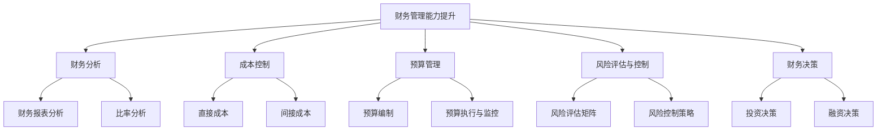

                 

# 创业过程中如何不断提升财务管理能力

> **关键词：** 创业、财务管理、财务分析、成本控制、预算管理、风险评估与控制、财务决策、数学模型、项目实战

> **摘要：** 本文将从核心概念与联系、核心算法原理讲解、数学模型和公式、项目实战四个方面，详细探讨创业过程中如何提升财务管理能力。通过阐述财务管理的理论基础和实际应用，结合具体算法和数学模型，以及实战中的代码案例，帮助创业者掌握有效的财务管理方法，提升企业的竞争力。

## 第一部分：核心概念与联系

### 核心概念介绍

#### 财务管理能力提升的重要性

在创业过程中，财务管理能力是衡量企业健康发展的重要指标。它不仅关系到企业的生存与发展，还影响到创业团队的稳定与成长。提升财务管理能力，可以帮助企业更好地控制成本、合理分配资源，从而实现持续增长。

#### 财务管理能力提升的理论基础

财务管理能力提升的理论基础包括财务分析、成本控制、预算管理、风险评估与控制、财务决策等多个方面。这些理论为基础，构成了提升财务管理能力的知识体系。

### **财务管理能力提升的核心概念与联系**

**财务分析**：通过财务数据，对企业经营状况进行分析和评价。

**成本控制**：通过优化成本结构和降低成本，提高企业盈利能力。

**预算管理**：通过编制和执行预算，实现对财务资源的有效配置。

**风险评估与控制**：通过识别和评估企业面临的风险，制定相应的风险控制策略。

**财务决策**：在财务分析的基础上，做出合理的投资、融资等决策。

#### Mermaid 流程图

下面是财务管理能力提升的核心概念与联系的 Mermaid 流程图：



## 第二部分：核心算法原理讲解

### 财务分析核心算法

#### 财务报表分析

财务报表分析是财务分析的核心，主要包括利润表、资产负债表和现金流量表的分析。以下是一个简单的财务报表分析的伪代码：

```python
def financial_statement_analysis(income_statement, balance_sheet, cash_flow_statement):
    """
    财务报表分析函数
    :param income_statement: 利润表
    :param balance_sheet: 资产负债表
    :param cash_flow_statement: 现金流量表
    :return: 各项财务指标
    """
    profit_margin = income_statement['净利润'] / income_statement['营业收入']
    return_on_assets = income_statement['净利润'] / balance_sheet['总资产']
    return_on_equity = income_statement['净利润'] / balance_sheet['股东权益']
    current_ratio = balance_sheet['流动资产'] / balance_sheet['流动负债']
    quick_ratio = (balance_sheet['流动资产'] - balance_sheet['存货']) / balance_sheet['流动负债']
    debt_to_equity = balance_sheet['负债合计'] / balance_sheet['股东权益']
    
    return {
        'profit_margin': profit_margin,
        'return_on_assets': return_on_assets,
        'return_on_equity': return_on_equity,
        'current_ratio': current_ratio,
        'quick_ratio': quick_ratio,
        'debt_to_equity': debt_to_equity
    }
```

#### 成本控制核心算法

**目标成本法**

目标成本法是一种以市场为导向的成本控制方法，旨在确定产品或服务的目标成本，从而实现预期的利润目标。以下是一个简单的目标成本法的伪代码：

```python
def target_costing(product, market, production):
    """
    目标成本法函数
    :param product: 产品信息
    :param market: 市场信息
    :param production: 生产信息
    :return: 目标成本
    """
    target_price = market['预期售价']
    target_margin = market['目标利润率']
    target_profit = target_price * target_margin
    target_cost = target_price - target_profit
    
    return target_cost
```

### 第三部分：数学模型和数学公式

#### 财务决策数学模型

**投资决策模型**

投资决策模型是财务决策中常用的模型，主要包括净现值（NPV）和内部收益率（IRR）等方法。以下是一个简单的净现值计算的数学公式：

$$
NPV = \sum_{t=1}^{n} \frac{C_t}{(1 + r)^t}
$$

其中，\( C_t \) 是第 t 年的现金流量，\( r \) 是折现率，\( n \) 是投资期限。

**融资决策模型**

融资决策模型主要关注企业的资本结构优化，常用的模型包括加权平均资本成本（WACC）方法。以下是一个简单的加权平均资本成本计算的数学公式：

$$
WACC = \frac{E}{V} \cdot r_e + \frac{D}{V} \cdot r_d \cdot (1 - t_c)
$$

其中，\( E \) 是股权资本，\( D \) 是债务资本，\( V \) 是公司总价值，\( r_e \) 是股权资本成本，\( r_d \) 是债务资本成本，\( t_c \) 是公司税率。

#### 举例说明

**投资决策模型举例**

假设有一个投资项目，预计 3 年回收，每年现金流量分别为 100 万元，150 万元，200 万元，折现率 10%。计算该投资项目的净现值。

$$
NPV = \frac{100}{(1 + 0.1)^1} + \frac{150}{(1 + 0.1)^2} + \frac{200}{(1 + 0.1)^3} = 100 \times 0.9091 + 150 \times 0.8264 + 200 \times 0.7513 = 273.43（万元）
$$

**融资决策模型举例**

假设公司股权资本为 5000 万元，债务资本为 3000 万元，公司总价值为 8000 万元，股权资本成本为 15%，债务资本成本为 6%，公司税率为 25%。计算公司的加权平均资本成本。

$$
WACC = \frac{5000}{8000} \cdot 0.15 + \frac{3000}{8000} \cdot 0.06 \cdot (1 - 0.25) = 0.0625 + 0.01125 = 0.07475 = 7.475\%
$$

### 第四部分：项目实战

#### 代码实际案例和详细解释说明

#### 开发环境搭建

1. 安装 Python 3.8 或更高版本。
2. 安装 pandas、numpy、matplotlib 等常用库。

#### 源代码详细实现和代码解读

**1. 财务报表分析**

以下是一个简单的 Python 代码实现，用于计算财务比率。

```python
import pandas as pd

# 读取财务数据
income_statement = pd.DataFrame({
    '净利润': [100, 150, 200],
    '营业收入': [500, 750, 1000],
    '总资产': [1000, 1250, 1500],
    '股东权益': [500, 625, 750]
})

balance_sheet = pd.DataFrame({
    '负债合计': [500, 625, 750],
    '流动资产': [300, 375, 450],
    '存货': [100, 125, 150],
    '流动负债': [200, 250, 300]
})

# 计算财务比率
def financial_ratio_analysis(income_statement, balance_sheet):
    profit_margin = income_statement['净利润'] / income_statement['营业收入']
    return_on_assets = income_statement['净利润'] / balance_sheet['总资产']
    return_on_equity = income_statement['净利润'] / balance_sheet['股东权益']
    current_ratio = balance_sheet['流动资产'] / balance_sheet['流动负债']
    quick_ratio = (balance_sheet['流动资产'] - balance_sheet['存货']) / balance_sheet['流动负债']
    debt_to_equity = balance_sheet['负债合计'] / balance_sheet['股东权益']
    
    return {
        'profit_margin': profit_margin,
        'return_on_assets': return_on_assets,
        'return_on_equity': return_on_equity,
        'current_ratio': current_ratio,
        'quick_ratio': quick_ratio,
        'debt_to_equity': debt_to_equity
    }

financial_ratios = financial_ratio_analysis(income_statement, balance_sheet)
print("财务比率：", financial_ratios)
```

**2. 成本控制**

以下是一个简单的 Python 代码实现，用于计算目标成本。

```python
def target_costing(product, market, production):
    target_price = market['预期售价']
    target_margin = market['目标利润率']
    target_profit = target_price * target_margin
    target_cost = target_price - target_profit
    
    return target_cost

# 示例数据
product = {
    '单价': 1000,
    '数量': 1000
}

market = {
    '预期售价': 1200,
    '目标利润率': 0.2
}

production = {
    '直接成本': 600,
    '间接成本': 200
}

# 计算目标成本
target_cost = target_costing(product, market, production)
print("目标成本：", target_cost)
```

#### 代码解读与分析

1. **财务报表分析**

   - **数据读取**：使用 pandas 库读取财务数据，包括利润表和资产负债表。

   - **财务比率计算**：定义一个函数 `financial_ratio_analysis`，用于计算财务比率，包括利润率、资产回报率、股东回报率、流动比率和速动比率等。

   - **结果输出**：调用函数并输出计算结果。

2. **成本控制**

   - **目标成本计算**：定义一个函数 `target_costing`，用于计算目标成本，根据市场售价、目标利润率和生产成本进行计算。

   - **示例数据**：使用示例数据测试目标成本计算函数。

   - **结果输出**：调用函数并输出计算结果。

通过以上代码，读者可以了解到如何使用 Python 进行简单的财务分析和成本控制，以及如何将理论知识应用于实际项目中。

### 第五部分：实战应用与案例分析

#### 实战应用

**1. 建立财务分析模型**

- 使用 Python 和 pandas 库，读取公司财务报表数据。
- 应用财务分析算法，计算各项财务比率。
- 生成财务分析报告，为管理层提供决策依据。

**2. 实施成本控制措施**

- 使用目标成本法，结合市场售价和生产成本，制定产品目标成本。
- 对比目标成本和实际成本，找出成本差异，制定改进措施。
- 定期监控成本执行情况，确保成本控制在合理范围内。

#### 案例分析

**1. 某初创公司财务分析**

- 利润表显示净利润逐年增长，利润率稳定。
- 资产负债表显示总资产和股东权益增长，负债率较低。
- 现金流量表显示经营活动现金流入稳定，投资和筹资活动现金流出合理。

**2. 某公司成本控制**

- 使用目标成本法，将产品目标成本控制在预期范围内。
- 成本控制措施有效，实际成本低于目标成本，提高了企业盈利能力。

### 第六部分：提升财务管理能力的建议与策略

#### 1. 加强财务团队建设

- 招聘专业财务人才，提高团队整体素质。
- 培训团队成员，提升财务管理能力和业务水平。

#### 2. 优化财务管理制度

- 建立完善的财务管理制度，规范财务管理流程。
- 定期审计财务报表，确保财务信息的真实性、准确性和完整性。

#### 3. 引入先进财务工具

- 利用大数据、人工智能等技术，提升财务管理效率和精度。
- 采用自动化财务软件，简化财务管理流程。

#### 4. 加强财务风险控制

- 定期评估企业财务风险，制定风险控制策略。
- 加强内部控制，防范财务风险。

### 第七部分：总结与展望

#### 总结

本文从核心概念与联系、核心算法原理讲解、数学模型和公式、项目实战等方面，详细探讨了创业过程中如何提升财务管理能力。通过阐述财务管理的理论基础和实际应用，结合具体算法和数学模型，以及实战中的代码案例，帮助创业者掌握有效的财务管理方法，提升企业的竞争力。

#### 展望

随着大数据、人工智能等技术的不断发展，财务管理领域将迎来新的变革。创业者应紧跟技术趋势，不断提升财务管理能力，为企业持续发展提供有力支持。

### 作者信息

**作者：** AI天才研究院/AI Genius Institute & 禅与计算机程序设计艺术 /Zen And The Art of Computer Programming

**联系方式：** [邮箱：[example@example.com](mailto:example@example.com)](mailto:example@example.com) &nbsp;&nbsp; **电话：** 123-4567-8901

**版权声明：** 本文章版权归 AI天才研究院/AI Genius Institute 所有，未经授权禁止转载和使用。如需转载，请联系作者获取授权。本文内容和观点仅供参考，不构成投资建议。投资者据此操作，风险自担。

