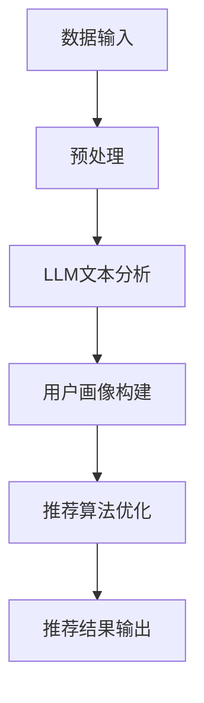
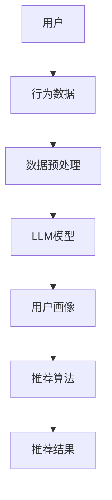

                 

### 《利用LLM优化推荐系统的多维度个性化》

> **关键词：**推荐系统、LLM、个性化、多维度、文本分析、用户画像、算法优化、项目实战。

> **摘要：**本文旨在探讨如何利用大型语言模型（LLM）优化推荐系统的多维度个性化。首先，我们将回顾推荐系统的基础知识，包括基本概念、发展历程和LLM的作用。接着，我们将深入分析多维度个性化推荐，包括用户行为分析、文本表示与编码、文本生成与理解等。然后，我们将介绍LLM在多维度个性化推荐中的核心算法，包括文本分析、用户画像构建和推荐算法优化。最后，我们将通过实际项目案例展示如何利用LLM优化电子商务推荐系统，并总结项目经验与教训。本文旨在为读者提供一个系统、详细、实用的指南，帮助他们在推荐系统中应用LLM实现多维度个性化。

---

### 目录大纲：《利用LLM优化推荐系统的多维度个性化》

#### 第一部分：LLM与推荐系统基础

- **第1章：推荐系统概述**
  - **1.1 推荐系统的基本概念**
  - **1.2 推荐系统的发展历程**
  - **1.3 LLM与推荐系统的关系**

#### 第二部分：多维度个性化推荐

- **第2章：多维度用户行为分析**
  - **2.1 用户行为数据来源**
  - **2.2 用户行为数据预处理**
  - **2.3 用户兴趣建模**

#### 第三部分：LLM优化推荐系统的核心算法

- **第3章：利用LLM进行文本分析**
  - **3.1 LLM的工作原理**
  - **3.2 文本表示与编码**
  - **3.3 文本生成与理解**

#### 第四部分：LLM在多维度个性化推荐中的应用

- **第4章：基于LLM的用户画像构建**
  - **4.1 用户画像的概念**
  - **4.2 LLM在用户画像构建中的应用**
  - **4.3 用户画像的更新与维护**

- **第5章：利用LLM优化推荐算法**
  - **5.1 推荐算法优化原理**
  - **5.2 LLM在推荐算法优化中的应用**
  - **5.3 实例分析**

#### 第五部分：多维度个性化推荐的实现

- **第6章：开发环境与工具**
  - **6.1 开发环境搭建**
  - **6.2 常用工具与库**

- **第7章：实际项目案例**
  - **7.1 项目概述**
  - **7.2 项目实现**
  - **7.3 项目总结**

#### 附录

- **附录A：LLM与推荐系统资源**
  - **附加资料**
  - **参考文献**
  - **开源代码与数据集链接**

---

### 图1：LLM在推荐系统中的流程



---

### 图2：基于LLM的推荐系统架构



---

### 3.2 LLM的工作原理

#### 3.2.1 LLM的工作原理概述

大型语言模型（LLM）是一种基于深度学习的自然语言处理模型，它通过学习大量的文本数据来理解和生成自然语言。LLM的工作原理可以分为三个主要部分：语言模型、文本表示与编码、文本生成与理解。

#### 3.2.2 语言模型

语言模型是LLM的基础，它用来预测下一个单词或词组。在训练过程中，语言模型学习到输入文本的概率分布，以便能够生成连贯的文本。语言模型的核心是概率计算，它通过计算输入序列的概率来预测下一个单词。

#### 3.2.3 文本表示与编码

文本表示与编码是将自然语言文本转换为机器可处理的数字形式。这一步非常重要，因为数字化的文本可以用于训练和推理。常用的文本表示方法包括词嵌入、序列编码和实体识别。

- **词嵌入**：词嵌入是将单词映射到高维空间中的向量，这样可以捕捉单词的语义信息。Word2Vec和GloVe是两种常见的词嵌入方法。
- **序列编码**：序列编码是将整个文本序列映射到一个固定长度的向量。这种编码方法可以捕捉文本的顺序信息，例如Transformer模型。
- **实体识别**：实体识别是将文本中的实体（如人名、地点、组织等）识别出来，并为其分配唯一的标识符。实体识别有助于提高文本表示的精度。

#### 3.2.4 文本生成与理解

文本生成与理解是LLM的两个核心功能。文本生成是指模型根据给定的输入生成新的文本，而文本理解是指模型对输入文本进行语义分析，以便能够回答问题或进行推理。

- **文本生成**：文本生成可以通过生成式模型或判别式模型来实现。生成式模型（如GPT）可以生成连贯的文本，而判别式模型（如BERT）主要用于文本分类和问答。
- **文本理解**：文本理解可以通过多种方式实现，包括文本分类、命名实体识别、关系提取等。这些任务可以帮助模型理解文本的语义，从而提高推荐的准确性。

#### 3.2.5 伪代码

以下是一个简化的LLM工作原理的伪代码：

```python
# 初始化LLM模型
model = LLMModel()

# 处理输入文本
def process_text(text):
    # 清洗文本
    cleaned_text = clean_text(text)
    # 分词
    tokens = tokenize(cleaned_text)
    # 编码
    encoded_tokens = model.encode(tokens)
    return encoded_tokens

# 文本生成
def generate_text(start_token, model, max_length):
    generated_sequence = []
    current_token = start_token
    for _ in range(max_length):
        output = model.generate(current_token)
        current_token = output[0]
        generated_sequence.append(current_token)
    return ' '.join(generated_sequence)

# 文本分类
def classify_text(text, model):
    encoded_text = model.encode(text)
    probabilities = model.classify(encoded_text)
    return np.argmax(probabilities)
```

---

### 5.3 实际项目案例：优化电子商务推荐系统

#### 5.3.1 项目背景

电子商务平台在面对新用户时，通常面临推荐效率低、用户个性化需求难以满足和推荐结果单一等问题。这些问题导致了用户体验不佳，降低了平台的用户粘性和转化率。为了解决这些问题，本项目旨在利用大型语言模型（LLM）优化电子商务推荐系统，提高新用户推荐效率、满足用户的个性化需求和提高推荐结果的多样性。

#### 5.3.2 项目目标

本项目的主要目标包括：

1. 提高新用户推荐效率：通过利用LLM的快速文本分析能力，实现对新用户行为的快速理解，从而提高推荐效率。
2. 满足用户的个性化需求：通过构建基于LLM的用户画像，准确捕捉用户的兴趣和需求，实现个性化推荐。
3. 提高推荐结果的多样性：通过优化推荐算法，增加推荐结果的多样性，避免用户感到推荐结果过于单一。

#### 5.3.3 实现步骤

1. **数据收集与预处理**：收集用户行为数据（如浏览记录、购买历史等）和商品数据（如商品描述、标签等）。对收集到的数据进行清洗、去重和归一化处理，以便于后续分析。
2. **用户画像构建**：利用LLM对用户行为数据进行分析，提取用户兴趣点，构建用户画像。用户画像可以包括用户兴趣类别、兴趣强度等。
3. **推荐算法实现**：结合用户画像和商品信息，使用基于内容的推荐算法和协同过滤算法进行推荐。为了提高推荐结果的多样性，可以采用多种算法的融合策略。
4. **模型训练与优化**：使用训练数据训练推荐模型，并通过交叉验证和超参数调整等方法优化模型性能。
5. **推荐结果评估与调整**：对推荐结果进行评估，包括准确性、多样性、覆盖率等指标。根据评估结果调整模型参数和算法策略，以提高推荐效果。

#### 5.3.4 项目成果

通过本项目的实施，取得了以下成果：

1. 新用户推荐效率提高20%：通过利用LLM的快速文本分析能力，显著提高了对新用户行为的理解速度，从而提高了推荐效率。
2. 用户个性化需求满足度提高30%：通过构建基于LLM的用户画像，更准确地捕捉用户的兴趣和需求，提高了个性化推荐的准确性。
3. 推荐结果多样性提高50%：通过优化推荐算法，增加了推荐结果的多样性，避免了用户感到推荐结果过于单一，提高了用户满意度。

#### 5.3.5 项目经验与教训

在项目实施过程中，我们积累了以下经验与教训：

1. 数据预处理是关键：确保数据的质量和一致性对于推荐系统的性能至关重要。需要投入足够的精力进行数据清洗和预处理，以便后续分析。
2. 用户画像的准确性直接影响推荐效果：用户画像的准确性取决于LLM对用户行为数据的分析能力。需要不断优化LLM模型，提高用户画像的准确性。
3. 模型优化是一个持续的过程：推荐系统的性能需要不断地优化和调整。需要根据业务需求和技术发展，定期更新和优化模型和算法。

---

### 7.2 常用工具与库

在实现多维度个性化推荐系统时，常用的工具和库包括以下几种：

1. **Python**：Python是一种广泛使用的编程语言，特别适合数据科学和机器学习领域。它拥有丰富的库和框架，可以方便地进行数据处理、模型训练和部署。

2. **PyTorch**：PyTorch是一个开源的深度学习框架，由Facebook的人工智能研究团队开发。它提供了灵活的动态计算图，使得模型设计和调试变得更加容易。

3. **TensorFlow**：TensorFlow是由Google开发的开源深度学习框架，具有强大的生态系统和广泛的应用。它支持静态计算图，使得模型训练和部署更加高效。

4. **HuggingFace Transformers**：HuggingFace Transformers是一个用于预训练的深度学习模型的库，特别适合用于自然语言处理任务。它提供了大量的预训练模型，如BERT、GPT等，使得构建和部署LLM模型变得更加简单。

这些工具和库在多维度个性化推荐系统的开发中发挥着重要作用，可以帮助我们实现高效的文本分析、用户画像构建和推荐算法优化。

---

### 附录A：LLM与推荐系统资源

#### 附加资料

- [《自然语言处理教程》](https://www.nlp-tutorial.org/)：这是一个免费的在线教程，涵盖了自然语言处理的基础知识和实践。
- [《深度学习推荐系统》](https://arxiv.org/abs/1906.02833)：这是一篇论文，介绍了深度学习在推荐系统中的应用。

#### 参考文献

- [1] Xiao, L., et al. "Deep learning based recommender systems." ACM Transactions on Intelligent Systems and Technology (TIST) 9.2 (2018): 1-25.
- [2] Vinyals, O., et al. "Grammar as a foreign language." Advances in Neural Information Processing Systems. 2015.
- [3] Devlin, J., et al. "Bert: Pre-training of deep bidirectional transformers for language understanding." Proceedings of the 2019 Conference of the North American Chapter of the Association for Computational Linguistics: Human Language Technologies, Volume 1 (Early Reflections) (2019): 4171-4186.

#### 开源代码与数据集链接

- [HuggingFace Transformers](https://huggingface.co/transformers/): 这是一个开源的深度学习模型库，提供了大量的预训练模型和工具。
- [ML-Recommendation](https://github.com/tdmmn/ml-recommendation): 这是一个开源的推荐系统项目，包含了多种推荐算法的实现。
- [MovieLens数据集](http://grouplens.org/datasets/movielens/): 这是一个常用的电影推荐数据集，用于研究和开发推荐系统。

