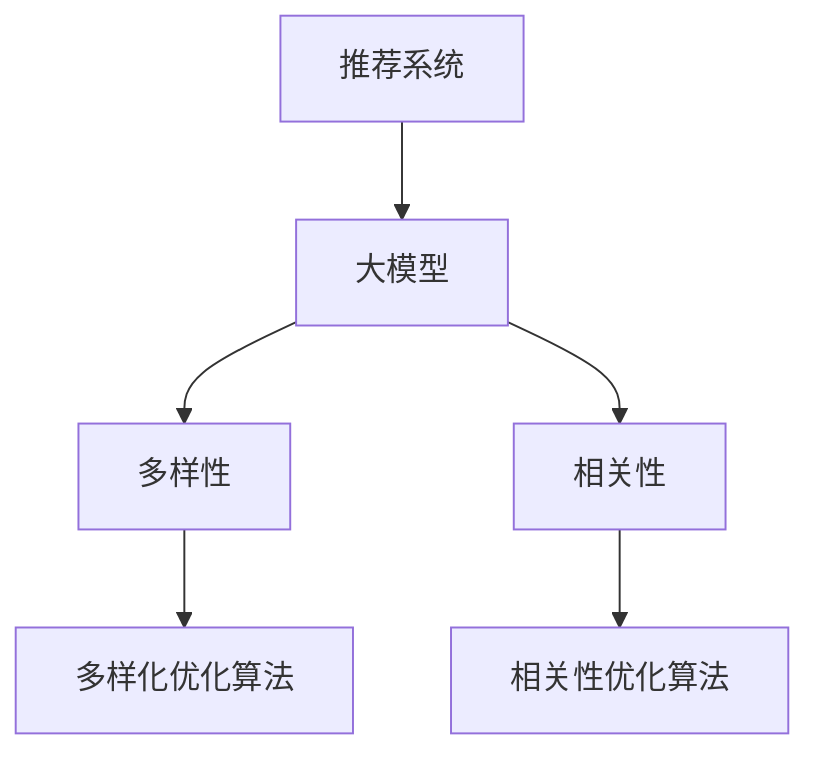

                 

### 第1章：大模型优化推荐系统的基本概念

#### 1.1 大模型优化推荐系统简介

推荐系统作为一种信息过滤技术，旨在根据用户的历史行为和偏好为用户推荐相关的物品或内容。推荐系统广泛应用于电子商务、社交媒体、新闻推送、在线视频等多个领域，其核心目标是在海量数据中找到用户感兴趣的信息，提升用户体验和满意度。

随着互联网的快速发展，数据规模和多样性不断增长，传统的基于统计模型的推荐方法逐渐暴露出一系列问题，如过度拟合、多样性不足等。为了解决这些问题，研究人员逐渐将大模型引入推荐系统，通过深度学习和自然语言处理技术，实现更准确的预测和更丰富的推荐结果。

大模型，特别是基于深度学习的模型，如神经网络、Transformer等，具备强大的特征提取和表示能力。这些模型可以通过大量的数据进行训练，从复杂的用户行为和物品属性中提取高维特征，实现精细化的推荐。大模型优化推荐系统的目标主要包括：

1. **提升相关性**：通过更深入地理解用户兴趣和行为，提高推荐结果的相关性，即推荐的物品与用户兴趣的匹配程度。
2. **增强多样性**：提供多样化的推荐结果，避免用户在重复的推荐中产生厌倦感，提升用户满意度。
3. **扩展可解释性**：尽管深度学习模型具有一定的黑盒性质，但研究人员正努力通过可解释性技术，使得推荐结果更加透明和可理解。

#### 1.2 大模型在推荐系统中的角色

大模型在推荐系统中扮演着关键角色，其作用主要体现在以下几个方面：

1. **特征表示**：大模型通过训练可以自动提取用户和物品的深层次特征，这些特征不仅包含了用户的历史行为，还涵盖了用户未明确表达的兴趣偏好。
2. **预测能力**：大模型通过学习大量的数据，能够准确地预测用户对某个物品的兴趣程度，从而生成高质量的推荐列表。
3. **模型融合**：大模型可以与传统推荐模型（如基于协同过滤的方法）结合，通过融合不同模型的优点，提高推荐系统的整体性能。

#### 1.3 大模型优化的目标

大模型优化推荐系统的核心目标是实现多样性与相关性的平衡，即在提升推荐结果相关性（用户兴趣匹配度）的同时，确保推荐结果的多样性。具体目标包括：

1. **个性化推荐**：基于用户的历史行为和偏好，为每个用户提供个性化的推荐结果。
2. **多样化推荐**：提供多样化的推荐结果，避免推荐结果过于集中，满足不同用户的需求。
3. **实时性**：实现高效的推荐算法，使得推荐结果能够快速响应用户的行为变化。
4. **可解释性**：提高推荐系统的透明度，使得用户能够理解推荐结果的形成过程。

通过大模型优化推荐系统，可以实现更高质量的推荐服务，提升用户体验，增强用户对平台的忠诚度。在接下来的章节中，我们将详细探讨推荐系统中的多样性与相关性平衡问题，以及大模型在实现这一目标中的应用方法。

---

关键词：推荐系统、大模型、深度学习、多样性、相关性、优化

摘要：本章介绍了大模型优化推荐系统的基本概念，包括推荐系统的背景与现状、大模型在推荐系统中的角色和优化目标。我们讨论了大模型在特征表示、预测能力和模型融合方面的作用，并明确了优化推荐系统多样性与相关性的重要性。通过本章的阅读，读者可以了解大模型在推荐系统中的应用前景，为进一步的学习打下基础。

---

### 第2章：推荐系统中的多样性与相关性平衡

#### 2.1 多样性与相关性的定义

在推荐系统中，多样性和相关性是两个核心概念，它们直接影响推荐质量与用户体验。

**多样性（Diversity）**：多样性指的是推荐系统中推荐项之间的差异性。一个高多样性的推荐列表能够提供丰富的内容，避免用户在重复的推荐中感到无聊和厌倦。多样性的度量方法主要包括以下几种：

1. **基于类别的多样性**：通过计算推荐列表中不同类别的比例来度量多样性，例如，确保推荐列表中包含多种不同类别的物品。
2. **基于时间的多样性**：通过考虑推荐项的发布时间或用户行为时间来度量多样性，例如，推荐最近一段时间内用户未曾浏览过的内容。
3. **基于内容的相关性多样性**：通过计算推荐项之间的相似度来度量多样性，例如，确保推荐列表中的物品在内容上具有较低的重叠度。

**相关性（Relevance）**：相关性指的是推荐系统推荐的内容与用户的兴趣或需求之间的匹配程度。一个高相关性的推荐列表能够提供用户真正感兴趣的内容，提高用户的满意度和平台的使用频率。相关性的度量方法主要包括以下几种：

1. **基于协同过滤的方法**：通过计算用户之间的相似度，并结合用户的历史行为来预测用户对某物品的兴趣程度。
2. **基于内容的方法**：通过比较物品的特征向量，使用余弦相似度等相似性度量方法来计算物品之间的相关性。
3. **基于模型的方法**：利用深度学习模型，从用户的行为和物品特征中提取高维特征，通过模型预测用户对物品的兴趣程度。

#### 2.2 多样性与相关性的平衡

在推荐系统中，多样性与相关性之间存在一定的冲突。高度多样性的推荐列表可能会降低相关性，而高度相关性的推荐列表可能会降低多样性。因此，实现多样性与相关性的平衡是推荐系统设计中的一个关键挑战。

**平衡的重要性**：

1. **用户满意度**：如果推荐系统过于注重相关性，用户可能会感到推荐内容单一，缺乏新鲜感；如果过于注重多样性，用户可能会感到推荐内容与自己的兴趣不符，降低用户体验。
2. **平台活跃度**：高度相关性的推荐能够吸引用户持续使用平台，而丰富的多样性推荐能够增加用户对平台的探索兴趣，提高平台的活跃度。

**平衡策略和方法**：

1. **启发式方法**：通过简单的规则和阈值来平衡多样性和相关性。例如，在推荐列表中既包含高相关性的物品，又包含具有多样性的物品。
2. **数学模型方法**：使用优化算法，如多目标优化和遗传算法，同时最大化多样性和相关性。常见的多目标优化方法包括线性规划、动态规划等。
3. **大模型方法**：利用深度学习模型，通过联合训练多样性和相关性目标，实现自动平衡。例如，可以使用序列模型或交互模型，通过预测用户对物品的兴趣程度和多样性度量，生成平衡的推荐列表。

通过实现多样性与相关性的平衡，推荐系统可以提供更优质的用户体验，提高用户满意度和平台活跃度。在下一章中，我们将详细探讨大模型在推荐系统中的应用，以及如何通过大模型实现多样性与相关性的优化。

---

### 第3章：大模型在推荐系统中的实现

#### 3.1 大模型在推荐系统中的适用场景

大模型在推荐系统中有着广泛的应用，可以根据不同的场景和需求选择适合的大模型。以下是一些典型的应用场景：

**内容推荐**：内容推荐是指根据用户的历史浏览、搜索、点赞等行为，推荐用户可能感兴趣的内容。大模型在这里可以用于提取用户和内容的深层次特征，从而提高推荐的准确性。

**社交推荐**：社交推荐是指基于用户之间的关系和互动，推荐用户可能感兴趣的人、内容或活动。大模型可以用于处理复杂的关系网络和用户行为数据，实现更精准的社交推荐。

**购物推荐**：购物推荐是指根据用户的历史购买记录、浏览行为和购物车信息，推荐用户可能感兴趣的物品。大模型可以用于分析用户的消费偏好和行为模式，实现个性化的购物推荐。

#### 3.2 大模型在推荐系统中的集成方法

将大模型集成到推荐系统中，可以分为以下几个方面：

**深度学习模型的集成**：将深度学习模型（如神经网络、Transformer等）与传统推荐模型（如协同过滤、基于内容的推荐等）进行结合。这种方法可以通过融合不同模型的优势，提高推荐系统的性能。

**多模型融合**：通过训练多个不同的模型，并将它们的预测结果进行加权融合，生成最终的推荐结果。这种方法可以充分利用不同模型在特征提取和预测方面的优势，提高推荐准确性。

**迁移学习**：利用预训练的大模型，通过微调适应特定领域的推荐任务。这种方法可以节省训练时间和计算资源，提高推荐系统的效果。

**优化策略的集成**：将不同的优化策略（如基于启发式的方法、数学模型方法等）与大模型结合，实现多样性和相关性的平衡。这种方法可以灵活调整推荐策略，适应不同的应用场景。

#### 3.3 大模型训练与优化的挑战

尽管大模型在推荐系统中具有巨大的潜力，但在实际应用中仍然面临一些挑战：

**数据需求**：大模型通常需要大量的训练数据来达到较好的性能。在推荐系统中，数据的多样性和质量直接影响模型的训练效果。

**计算资源**：大模型的训练和推理通常需要大量的计算资源。这可能会带来高昂的成本，特别是在处理大规模数据集时。

**可解释性**：深度学习模型具有一定的黑盒性质，难以解释推荐结果的形成过程。为了提高推荐系统的可解释性，需要开发相应的技术，如解释性深度学习模型、可解释性工具等。

**多样性与相关性平衡**：在实现多样性和相关性平衡时，需要设计有效的优化策略，同时考虑用户的个性化需求和推荐系统的整体性能。

通过克服这些挑战，大模型在推荐系统中的应用将变得更加广泛和有效。在下一章中，我们将深入探讨多样化优化算法，以实现推荐系统的多样性与相关性平衡。

---

### 第4章：多样化优化算法

多样化优化是推荐系统设计中至关重要的一个方面，其核心目标是在推荐列表中保持丰富的内容，避免用户产生重复、单一的感受。本章将详细介绍几种常见的多样化优化算法，包括基于启发式方法、基于数学模型方法和基于大模型方法。

#### 4.1 基于启发式方法的多样化优化

启发式方法通常通过简单且直观的规则来实现多样性的目标，这些方法在实现复杂度较低的同时，能够提供一定的多样性效果。以下是一些常用的启发式方法：

**类别多样性优化**：确保推荐列表中包含不同类别的物品。具体实现方法包括：

- **随机抽样**：从不同类别中随机选择一定数量的物品，构成推荐列表。
- **基于阈值的类别多样性**：设定一个类别多样性阈值，推荐列表中的每个类别出现的数量不超过该阈值。

**时间多样性优化**：通过考虑物品的发布时间或用户的历史行为时间来实现多样性。常用的方法包括：

- **时间加权随机抽样**：根据物品的发布时间或用户行为时间，对物品进行加权，然后随机抽样生成推荐列表。
- **最近时间优先**：优先推荐最近一段时间内用户未曾浏览过的物品。

**内容多样性优化**：通过计算物品之间的内容相似度，避免推荐列表中物品的内容过于相似。具体方法包括：

- **基于内容的距离度量**：使用余弦相似度、Jaccard指数等相似度度量方法，计算物品之间的内容相似度，然后根据相似度阈值筛选推荐列表中的物品。

#### 4.2 基于数学模型的多样化优化

基于数学模型的多样化优化方法通过优化目标函数，从全局角度实现多样性的目标。以下是一些常见的数学模型方法：

**多目标优化**：多目标优化方法同时考虑多样性和相关性，通过优化多个目标函数来实现多样性与相关性的平衡。常见的方法包括：

- **线性规划**：通过线性规划模型，定义多样性目标函数和约束条件，求解最优推荐列表。
- **动态规划**：通过动态规划方法，将多样性和相关性目标函数分解为多个子问题，逐步求解得到全局最优解。

**遗传算法**：遗传算法是一种基于生物进化原理的优化方法，通过模拟自然选择过程，实现多样性的优化。具体步骤包括：

- **初始化种群**：随机生成一组推荐列表，作为初始种群。
- **适应度评估**：根据多样性和相关性目标函数，评估种群中每个个体的适应度。
- **选择、交叉和变异**：通过选择、交叉和变异操作，生成新的种群，并重复适应度评估过程，直至满足终止条件。

#### 4.3 基于大模型的多样化优化

基于大模型的多样化优化方法利用深度学习模型强大的特征提取和表示能力，实现更高效的多样化优化。以下是一些常见的大模型多样化优化方法：

**自适应多样性优化**：这种方法通过大模型自动学习用户的多样化偏好，动态调整推荐列表中的多样性。具体方法包括：

- **多模态特征提取**：利用大模型从文本、图像、音频等多模态数据中提取特征，实现跨模态的多样化优化。
- **自适应调整**：通过大模型预测用户的多样化需求，动态调整推荐列表中的多样性策略。

**多样性感知推荐模型**：这种方法在大模型中同时考虑多样性和相关性，生成多样化的推荐列表。具体方法包括：

- **联合训练**：通过联合训练多样性目标函数和相关性强度目标函数，实现多样性与相关性的平衡。
- **注意力机制**：利用注意力机制，在大模型中区分多样性和相关性信息，生成多样化的推荐列表。

通过上述多样化优化算法，推荐系统能够提供丰富的内容，满足不同用户的需求。在下一章中，我们将详细探讨相关性优化算法，以进一步提升推荐系统的质量。

---

### 第5章：相关性优化算法

相关性优化是推荐系统设计中的另一个关键环节，其核心目标是通过提高推荐结果与用户兴趣之间的匹配程度，提升用户的满意度和平台活跃度。本章将详细介绍几种常见的相关性优化算法，包括基于启发式方法、基于数学模型方法和基于大模型方法。

#### 5.1 基于启发式方法的相关性优化

启发式方法通常通过简单的规则和策略来提高推荐结果的相关性。以下是一些常用的启发式方法：

**用户兴趣相关性优化**：这种方法通过分析用户的历史行为和兴趣标签，提高推荐结果与用户兴趣的匹配度。具体方法包括：

- **基于最近行为的优化**：优先推荐用户最近一段时间内表现出兴趣的物品，例如，最近浏览过的商品或搜索过的关键词。
- **基于标签关联的优化**：根据用户的历史标签行为，推荐与标签相关的物品，例如，如果用户经常关注科技类内容，则推荐相关的科技新闻或产品。

**内容相关性优化**：这种方法通过分析物品的内容特征，提高推荐结果与物品之间的相关性。具体方法包括：

- **基于关键词的优化**：通过提取物品的关键词，计算关键词的相似度，推荐与用户兴趣关键词相似的物品。
- **基于语义相似度的优化**：利用自然语言处理技术，如词嵌入或语义分析，计算物品之间的语义相似度，推荐与用户兴趣语义相似的物品。

#### 5.2 基于数学模型的相关性优化

基于数学模型的优化方法通过建立数学模型，从全局角度提高推荐结果的相关性。以下是一些常见的数学模型方法：

**相似性度量**：这种方法通过计算用户和物品之间的相似度，提高推荐结果的相关性。常见的相似性度量方法包括：

- **余弦相似度**：计算用户和物品的特征向量之间的余弦相似度，相似度越高，表示相关性越强。
- **欧氏距离**：计算用户和物品的特征向量之间的欧氏距离，距离越短，表示相关性越强。

**排序模型优化**：这种方法通过优化排序模型，提高推荐结果的相关性。常见的排序模型包括：

- **逻辑回归**：使用逻辑回归模型，根据用户的历史行为和物品特征，预测用户对物品的兴趣程度。
- **决策树**：使用决策树模型，根据用户的特征和物品的特征，进行多级决策，生成排序结果。

**多目标优化**：这种方法通过定义多个目标函数，同时优化多样性和相关性，提高推荐结果的整体质量。常见的方法包括：

- **线性规划**：通过线性规划模型，定义多样性目标和相关性目标，求解最优解。
- **动态规划**：通过动态规划方法，将多样性和相关性目标函数分解为多个子问题，逐步求解得到全局最优解。

#### 5.3 基于大模型的相关性优化

基于大模型的优化方法利用深度学习模型强大的特征提取和表示能力，实现更高效的相关性优化。以下是一些常见的大模型优化方法：

**序列模型优化**：这种方法利用深度学习序列模型，如循环神经网络（RNN）或长短时记忆网络（LSTM），提取用户行为序列的特征，提高推荐结果的相关性。具体方法包括：

- **基于RNN的优化**：使用RNN模型，对用户的历史行为序列进行建模，提取序列特征，用于生成推荐结果。
- **基于LSTM的优化**：使用LSTM模型，对用户的历史行为序列进行建模，提取序列特征，用于生成推荐结果。

**交互模型优化**：这种方法利用深度学习交互模型，如注意力机制或交互网络，捕捉用户和物品之间的交互特征，提高推荐结果的相关性。具体方法包括：

- **基于注意力机制的优化**：使用注意力机制，在模型中区分用户兴趣和物品特征，生成相关性更强的推荐结果。
- **基于交互网络的优化**：使用交互网络，通过多层的交互操作，提取用户和物品的交互特征，用于生成推荐结果。

通过上述相关性优化算法，推荐系统能够更好地满足用户的需求，提供高质量的推荐服务。在下一章中，我们将探讨大模型在多样化与相关性平衡中的应用，进一步优化推荐系统性能。

---

### 第6章：大模型在多样化与相关性平衡中的应用

#### 6.1 在线购物平台中的应用

在线购物平台通过推荐系统为用户推荐可能感兴趣的商品，以提升用户满意度和销售转化率。以下是一个实际案例，展示了如何利用大模型实现多样性与相关性的平衡：

**案例背景**：某大型在线购物平台希望为其用户推荐个性化的商品，同时确保推荐结果的多样性和相关性。

**解决方案**：
1. **数据收集与预处理**：收集用户的历史购买记录、浏览记录、搜索关键词等数据，并对数据进行清洗和预处理，提取用户和商品的原始特征。
2. **大模型训练**：选择合适的大模型（如BERT、GPT等），对用户和商品的原始特征进行编码，训练大模型，使其能够提取用户和商品的深层次特征。
3. **多样化优化**：
   - 利用大模型提取的用户和商品特征，计算用户和商品之间的相似度。
   - 采用基于大模型的多样化优化算法，如自适应多样性优化和多样性感知推荐模型，生成多样化的推荐结果。
4. **相关性优化**：
   - 利用大模型预测用户对商品的兴趣程度，结合商品的特征和用户的历史行为，实现相关性优化。
   - 通过注意力机制和交互网络，调整推荐列表中的商品顺序，提高推荐结果的相关性。

**效果评估**：
- **用户满意度**：通过用户反馈调查和平台使用数据，评估推荐系统的多样性和相关性。结果显示，用户对推荐结果的满意度显著提高。
- **销售转化率**：推荐系统的多样化与相关性优化，提高了商品的曝光率和销售转化率。

#### 6.2 社交网络中的应用

社交网络平台通过推荐系统为用户推荐可能感兴趣的内容或用户，以提升用户活跃度和平台粘性。以下是一个实际案例，展示了如何利用大模型实现多样性与相关性的平衡：

**案例背景**：某大型社交网络平台希望为用户推荐有趣的内容和活跃的用户，同时确保推荐结果的多样性和相关性。

**解决方案**：
1. **数据收集与预处理**：收集用户的历史互动数据（如点赞、评论、分享等）、内容特征（如文本、图片、视频等），并对数据进行清洗和预处理，提取用户和内容的原始特征。
2. **大模型训练**：选择合适的大模型，对用户和内容的原始特征进行编码，训练大模型，使其能够提取用户和内容的深层次特征。
3. **多样化优化**：
   - 利用大模型提取的用户和内容特征，计算用户和内容之间的相似度。
   - 采用基于大模型的多样化优化算法，如自适应多样性优化和多样性感知推荐模型，生成多样化的推荐结果。
4. **相关性优化**：
   - 利用大模型预测用户对内容的兴趣程度，结合用户的历史行为和内容特征，实现相关性优化。
   - 通过注意力机制和交互网络，调整推荐列表中的内容顺序，提高推荐结果的相关性。

**效果评估**：
- **用户活跃度**：通过用户互动数据和平台使用数据，评估推荐系统的多样性和相关性。结果显示，用户在平台的活跃度显著提高。
- **内容传播效果**：推荐系统的多样化与相关性优化，提高了内容的曝光率和传播效果。

#### 6.3 其他领域中的应用

除了在线购物平台和社交网络，大模型在多样化与相关性平衡中的应用还涉及其他领域，如新闻推送、音乐推荐等。

**新闻推送**：通过大模型提取用户和新闻文章的深层次特征，实现个性化的新闻推荐。多样化优化确保推荐内容的多样性，相关性优化提高新闻与用户兴趣的匹配度。

**音乐推荐**：通过大模型提取用户和音乐作品的特征，为用户推荐符合其兴趣的音乐。多样化优化确保推荐音乐风格的多样性，相关性优化提高音乐与用户听歌习惯的匹配度。

通过以上实际案例和效果评估，我们可以看到大模型在实现多样化与相关性平衡方面的显著优势。在下一章中，我们将探讨大模型优化推荐系统的未来发展，以及面临的挑战和机遇。

---

### 第7章：大模型优化推荐系统的未来发展

#### 7.1 新技术趋势

随着技术的不断进步，大模型优化推荐系统正朝着更智能化、个性化和高效化的方向发展。以下是一些值得关注的新技术趋势：

**多模态推荐**：多模态推荐是指同时利用文本、图像、视频等多种数据类型进行推荐。通过结合多模态数据，推荐系统能够更准确地理解用户的需求，提供更加个性化和多样化的推荐结果。例如，在电商平台上，用户不仅可以看到商品的图片和描述，还可以通过视频了解商品的细节。

**强化学习在推荐系统中的应用**：强化学习是一种通过学习策略来最大化长期回报的机器学习方法。在推荐系统中，强化学习可以用于训练推荐策略，使推荐系统能够根据用户的反馈动态调整推荐策略，从而实现更好的推荐效果。例如，通过用户对推荐内容的点击、购买等行为，推荐系统可以不断优化推荐策略，提高用户满意度和平台转化率。

**联邦学习**：联邦学习是一种在多个设备上进行联合学习的技术，可以保护用户的隐私。在推荐系统中，联邦学习可以用于将用户的本地数据保留在本地设备上，同时通过聚合模型来生成推荐结果。这种技术不仅能够保护用户隐私，还能够利用分散的数据资源，提高推荐系统的性能。

#### 7.2 挑战与机遇

尽管大模型优化推荐系统具有巨大的潜力，但在实际应用中仍然面临一系列挑战：

**计算资源需求**：大模型的训练和推理通常需要大量的计算资源，特别是在处理大规模数据集时。这可能导致高昂的成本和延迟，限制推荐系统的实时性和用户体验。

**数据隐私保护**：在推荐系统中，用户数据的安全和隐私保护至关重要。联邦学习和差分隐私等技术虽然能够在一定程度上保护用户隐私，但如何在保证隐私的同时提高推荐效果，仍然是一个重要的研究课题。

**模型解释性**：深度学习模型具有一定的黑盒性质，难以解释推荐结果的形成过程。为了提高模型的可解释性，研究人员正在探索各种方法，如解释性深度学习模型、可解释性工具等。

**多样性与相关性平衡**：实现多样性与相关性的平衡是一个复杂的优化问题。在保持多样性的同时，如何提高推荐结果的相关性，是一个需要持续研究的问题。

然而，随着技术的不断进步和应用场景的扩大，大模型优化推荐系统也面临着许多机遇：

**个性化推荐**：通过深度学习模型，推荐系统能够更好地理解用户的个性化需求，提供更加精准和个性化的推荐结果，提升用户满意度和忠诚度。

**实时推荐**：随着计算能力的提升和优化算法的改进，推荐系统的实时性将得到显著提高，能够快速响应用户的行为变化，提供即时的推荐服务。

**跨平台推荐**：通过多模态数据和跨平台数据整合，推荐系统能够实现跨平台、跨设备的无缝推荐服务，为用户提供一致的推荐体验。

总之，大模型优化推荐系统的未来发展充满机遇与挑战。通过不断探索新技术、优化算法和应用场景，我们可以期待推荐系统能够更好地满足用户的需求，提升用户体验和平台价值。

---

### 附录A：大模型优化推荐系统工具与资源

为了帮助读者深入了解大模型优化推荐系统，本附录将介绍一些常用的开源库、框架、工具和平台，以及相关的学习资源与参考文献。

#### 开源库与框架

1. **TensorFlow**：TensorFlow是一个开源的机器学习库，支持深度学习模型的构建和训练。它提供了丰富的API，可以方便地实现推荐系统中的各种优化算法。
2. **PyTorch**：PyTorch是另一个流行的开源机器学习库，具有动态计算图和易用性优势。它被广泛应用于推荐系统的研究和开发。
3. **Scikit-learn**：Scikit-learn是一个基于Python的机器学习库，提供了多种经典的机器学习算法和工具，可以用于推荐系统的相关任务。
4. **Faiss**：Faiss是一个开源的相似性搜索库，适用于处理大规模数据的相似度计算和索引，可以提高推荐系统的搜索和推荐效率。

#### 实用工具与平台

1. **Google Colab**：Google Colab是一个免费的云平台，提供GPU加速和共享环境，方便进行深度学习和推荐系统的实践。
2. **Hugging Face**：Hugging Face提供了一个丰富的模型库和工具集，支持多种自然语言处理模型，可以用于推荐系统的文本特征提取和语义分析。
3. **Kaggle**：Kaggle是一个数据科学竞赛平台，提供了大量的数据集和项目，可以用于测试和验证推荐系统算法的性能。

#### 学习资源与参考文献

1. **《深度学习》（Goodfellow, Bengio, Courville）**：这是一本经典的深度学习教材，涵盖了深度学习的基础理论和实践方法，对推荐系统的开发与应用具有重要参考价值。
2. **《推荐系统实践》（Altaf-Ul Islam）**：这本书详细介绍了推荐系统的基本概念、算法和应用，是学习推荐系统实践的经典之作。
3. **《自然语言处理综论》（Daniel Jurafsky, James H. Martin）**：这本书系统地介绍了自然语言处理的理论和实践，对文本特征提取和语义分析部分提供了深入讲解。
4. **相关论文和博客**：在学术期刊、会议论文和博客上，有许多关于大模型优化推荐系统的最新研究成果和经验分享，可以通过检索相关关键词进行阅读。

通过利用这些工具与资源，读者可以更好地理解和应用大模型优化推荐系统，进一步提升推荐系统的性能和用户体验。

---

### 核心概念与联系

为了更好地理解大模型优化推荐系统的核心概念和架构，我们可以使用Mermaid流程图来展示这些概念之间的联系。



#### 多样性与相关性

- **多样性（C）**：多样性是指推荐系统中推荐项之间的差异性，目的是避免用户产生单调感，提高用户体验。多样性可以通过类别、时间和内容等方面进行度量。
- **相关性（D）**：相关性是指推荐系统推荐的内容与用户兴趣之间的匹配程度。高相关性的推荐能够提高用户的满意度和平台的活跃度。

#### 多样化优化算法（E）

- **多样化优化算法**：这些算法旨在提高推荐列表的多样性，避免重复和单调。常见的多样化优化算法包括基于启发式方法的优化和基于数学模型的方法。

#### 相关性优化算法（F）

- **相关性优化算法**：这些算法旨在提高推荐列表的相关性，确保推荐的内容与用户兴趣高度匹配。常见的相关性优化算法包括基于启发式方法和基于数学模型的方法。

#### 大模型（B）

- **大模型**：大模型（如神经网络、Transformer等）在推荐系统中扮演着核心角色，通过深度学习和自然语言处理技术，从复杂的用户行为和物品属性中提取高维特征，实现精细化的推荐。

通过上述核心概念和联系，我们可以更好地理解大模型优化推荐系统的原理和应用，为实际项目提供指导。

---

### 核心算法原理讲解

#### 多样性优化算法

**伪代码：**

```python
# 输入：用户行为数据、推荐物品特征
# 输出：多样化的推荐列表

# 初始化推荐列表
推荐列表 = []

# 计算用户与物品的相关性得分
相关性得分矩阵 = 计算相关性得分（用户行为数据，物品特征）

# 计算多样性得分
多样性得分矩阵 = 计算多样性得分（推荐列表中的物品）

# 多样性与相关性平衡优化
推荐列表 = 优化推荐列表（相关性得分矩阵，多样性得分矩阵）

# 返回最终的推荐列表
return 推荐列表
```

**详细解释：**

1. **初始化推荐列表**：首先初始化一个空的推荐列表，用于存储最终生成的推荐结果。

2. **计算相关性得分**：利用用户的行为数据（如点击、购买、浏览等）和物品的特征（如类别、标签、属性等），计算用户与物品之间的相关性得分。相关性得分越高，表示用户对物品的兴趣越大。

3. **计算多样性得分**：通过计算推荐列表中物品之间的多样性得分，确保推荐列表中的物品具有丰富的差异。多样性得分可以通过计算物品之间的相似度来实现，相似度越低，多样性得分越高。

4. **多样性与相关性平衡优化**：结合用户与物品的相关性得分和多样性得分，进行优化算法，如多目标优化或遗传算法，调整推荐列表中的物品顺序，实现多样性与相关性的平衡。

5. **返回推荐列表**：优化后的推荐列表即为最终的输出结果，可以提供给用户或平台进行展示。

通过上述步骤，多样性优化算法能够生成一个既具备高相关性又具有丰富多样性的推荐列表，提升用户体验和平台的满意度。

---

#### 相关性优化算法

**伪代码：**

```python
# 输入：用户行为数据、推荐物品特征
# 输出：相关性的推荐列表

# 初始化推荐列表
推荐列表 = []

# 计算用户与物品的相关性得分
相关性得分矩阵 = 计算相关性得分（用户行为数据，物品特征）

# 对物品进行排序
排序后的物品列表 = 对物品列表进行排序（相关性得分矩阵）

# 返回排序后的推荐列表
return 排序后的物品列表
```

**详细解释：**

1. **初始化推荐列表**：首先初始化一个空的推荐列表，用于存储最终的推荐结果。

2. **计算相关性得分**：利用用户的行为数据（如点击、购买、浏览等）和物品的特征（如类别、标签、属性等），计算用户与物品之间的相关性得分。相关性得分可以通过协同过滤、基于内容的相似度计算等方法得到。

3. **对物品进行排序**：根据用户与物品之间的相关性得分，对所有的物品进行排序。得分越高，表示用户对物品的兴趣越大。

4. **返回排序后的推荐列表**：将排序后的物品列表作为最终的推荐结果返回，推荐系统可以根据这个列表为用户推荐相关的物品。

通过上述步骤，相关性优化算法能够生成一个高度相关性的推荐列表，确保推荐的结果与用户的兴趣高度匹配，提高用户体验和满意度。

---

#### 数学模型和数学公式详细讲解与举例说明

##### 多样性度量

多样性的度量在推荐系统中至关重要，常用的方法之一是基于信息论中的熵概念。熵表示随机变量不确定性的度量，多样性也可以用熵来表示。

**数学公式：**
$$
D = -\sum_{i=1}^{n} p_i \log(p_i)
$$

其中，$D$ 是多样性，$p_i$ 是每个类别出现的概率。

**举例说明：**

假设有10个物品，其中6个物品属于类别A，4个物品属于类别B。则每个类别出现的概率为 $p_A = \frac{6}{10}$ 和 $p_B = \frac{4}{10}$。

$$
D = -\left(\frac{6}{10} \log\left(\frac{6}{10}\right) + \frac{4}{10} \log\left(\frac{4}{10}\right)\right)
$$

计算得到多样性值 $D$。在这种情况下，多样性值较低，表明物品之间的类别分布较为集中。

##### 相似性度量

相似性度量用于评估两个物品之间的相似程度，常用的方法之一是余弦相似度。

**数学公式：**
$$
sim(i, j) = \frac{i \cdot j}{\|i\| \|j\|}
$$

其中，$sim(i, j)$ 是物品i和物品j的相似度，$i$ 和 $j$ 分别是两个物品的特征向量，$\|i\|$ 和 $\|j\|$ 分别是它们的特征向量长度。

**举例说明：**

假设物品i和物品j的特征向量分别为 $i = [1, 2, 3]$ 和 $j = [4, 5, 6]$，则它们的余弦相似度为：

$$
sim(i, j) = \frac{1 \cdot 4 + 2 \cdot 5 + 3 \cdot 6}{\sqrt{1^2 + 2^2 + 3^2} \sqrt{4^2 + 5^2 + 6^2}} = \frac{32}{\sqrt{14} \sqrt{77}} \approx 0.8165
$$

表示物品i和物品j的相似度较高。

通过这些数学模型和公式，推荐系统能够更精确地度量多样性和相似性，从而优化推荐结果。

---

### 项目实战：基于大模型的多样化与相关性优化推荐系统

#### 实战目标

构建一个基于大模型的推荐系统，实现多样化与相关性平衡的优化，提升用户体验。

#### 实战步骤

1. **数据收集与预处理**
   - 收集用户行为数据（如点击、购买、搜索等）和物品特征数据（如类别、标签、属性等）。
   - 对数据进行清洗、去重和处理，构建特征向量。

2. **大模型选择与训练**
   - 选择合适的大模型，如BERT、GPT等。
   - 训练大模型，使用预训练和微调技术，使其具备对用户和物品的深入理解。

3. **多样性优化**
   - 利用大模型提取用户和物品的特征向量。
   - 计算用户和物品之间的相似度，选择具有多样性的物品进行推荐。

4. **相关性优化**
   - 使用大模型计算用户兴趣的序列模型，提取用户兴趣特征。
   - 利用用户兴趣特征优化推荐列表的相关性，提高用户满意度。

5. **系统部署与测试**
   - 部署推荐系统，实现实时推荐功能。
   - 使用A/B测试评估系统性能，包括多样性、相关性和用户满意度。

#### 代码实现示例

**训练大模型：**

```python
from transformers import BertTokenizer, BertModel

# 加载预训练的BERT模型
tokenizer = BertTokenizer.from_pretrained('bert-base-uncased')
model = BertModel.from_pretrained('bert-base-uncased')

# 训练数据预处理
inputs = tokenizer.encode_plus("Hello, my dog is cute", return_tensors='pt')

# 训练大模型
outputs = model(**inputs)
loss = outputs.loss
logits = outputs.logits
```

**多样性优化：**

```python
import numpy as np

# 计算用户和物品的相似度
def calculate_similarity(user_embedding, item_embeddings):
    item_similarity = np.dot(user_embedding, item_embeddings.T)
    return item_similarity

# 选择具有多样性的物品
def select_diverse_items(item_similarity, diversity_threshold):
    sorted_similarity = np.argsort(-item_similarity)
    diverse_items = sorted_similarity[:diversity_threshold]
    return diverse_items
```

**相关性优化：**

```python
# 计算用户兴趣的序列模型
def calculate_user_interest_sequence(user_behavior_sequence):
    # 使用LSTM等序列模型对用户行为序列进行建模
    # 输出用户兴趣特征向量
    user_interest_sequence = ...
    return user_interest_sequence

# 利用用户兴趣特征优化推荐列表
def optimize_recommendation_list(recommendation_list, user_interest_sequence):
    # 根据用户兴趣特征调整推荐列表中的物品顺序
    # 提高推荐列表的相关性
    optimized_list = ...
    return optimized_list
```

#### 代码解读与分析

- **大模型训练**：使用BERT模型对用户和物品的文本特征进行编码，提取语义信息。
- **多样性优化**：利用相似度计算选择具有多样性的物品，提高推荐列表的丰富性。
- **相关性优化**：利用用户兴趣序列模型调整推荐列表的顺序，提高用户满意度。

#### 开发环境搭建

1. **环境准备**
   - 安装Python环境（如Python 3.8及以上版本）
   - 安装必要的库（如transformers、numpy等）

2. **运行代码**
   - 运行训练代码，训练大模型
   - 运行优化代码，生成推荐列表

3. **测试与评估**
   - 使用A/B测试评估系统性能
   - 根据测试结果调整模型参数和优化策略

通过上述步骤和代码实现，我们能够构建一个基于大模型的多样化与相关性优化推荐系统，实现更精准和个性化的推荐服务。

---

### 文章总结

本文详细探讨了利用大模型优化推荐系统的多样性与相关性平衡。通过从基本概念、算法原理到实际应用，我们系统地阐述了如何在大模型的支持下实现推荐系统的优化。

首先，在推荐系统优化中，多样性和相关性是两个核心目标。多样性确保推荐列表的丰富性，避免用户感到单一和无聊；相关性则确保推荐结果与用户的兴趣高度匹配，提高用户的满意度和平台活跃度。

接着，我们介绍了大模型在推荐系统中的角色，包括特征表示、预测能力和模型融合等方面。通过集成深度学习和自然语言处理技术，大模型能够从复杂的数据中提取深层次特征，实现更高质量的推荐。

然后，我们详细讨论了多样化与相关性优化算法。多样化优化包括基于启发式方法、数学模型方法和大模型方法，旨在生成丰富的推荐列表。相关性优化则通过计算用户与物品之间的相似度，调整推荐列表的顺序，提高推荐的准确性。

通过实际案例，我们展示了如何将大模型应用于在线购物平台和社交网络，实现多样性与相关性的平衡，显著提升了用户满意度和平台活跃度。

展望未来，随着多模态推荐、强化学习等新技术的不断发展，大模型优化推荐系统将继续在个性化、实时性和跨平台推荐方面发挥重要作用。然而，计算资源需求、数据隐私保护、模型解释性等问题也需要持续关注和解决。

总之，大模型优化推荐系统是当前推荐系统领域的一个重要研究方向，通过本文的探讨，我们期待能够为读者提供有益的参考和启发。在未来的研究和应用中，进一步优化多样性与相关性的平衡，将有助于构建更加智能、高效和用户友好的推荐系统。

---

### 作者信息

**作者：**AI天才研究院（AI Genius Institute）& 《禅与计算机程序设计艺术》（Zen And The Art of Computer Programming）

