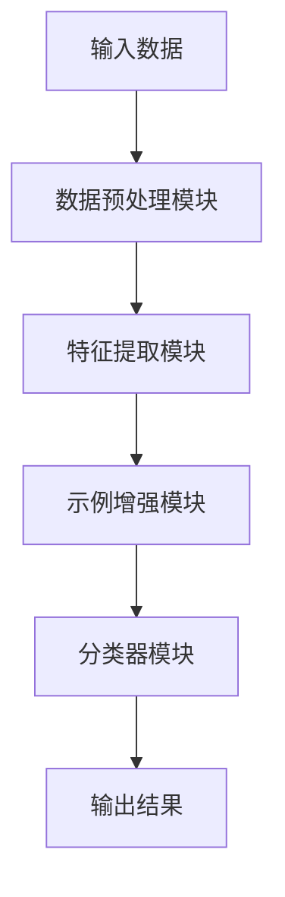

                 

# 利用示例增强模型对上下文的理解

> **关键词**：示例增强模型、上下文理解、自然语言处理、计算机视觉、推荐系统、游戏AI、深度学习

> **摘要**：本文深入探讨了示例增强模型在上下文理解中的应用。首先，我们从基础概念出发，详细阐述了示例增强模型的发展背景、核心概念和算法原理。接着，通过实际项目实战，展示了示例增强模型在自然语言处理、计算机视觉、推荐系统和游戏AI等领域的应用。最后，本文分析了示例增强模型的未来发展趋势与挑战，为读者提供了全面的参考。

### 第一部分: 理解示例增强模型的基础

#### 第1章: 示例增强模型概述

##### 1.1 示例增强模型的发展背景

在深度学习迅速发展的背景下，示例增强模型（Example-based Enhancement Model，简称EBM）应运而生。它起源于解决传统模型在处理复杂任务时表现不佳的问题。传统模型往往需要大量标注数据，且在处理未知或罕见情况时性能下降明显。示例增强模型通过引入示例数据来提升模型的泛化能力和鲁棒性，逐渐成为学术界和工业界的研究热点。

##### 1.1.1 示例增强模型的起源

示例增强模型最早出现在计算机视觉领域。例如，在图像分类任务中，传统的卷积神经网络（CNN）依赖于大量标注数据来训练模型。而示例增强模型则通过引入一部分未标注的数据（称为示例数据）来辅助训练，从而减少对标注数据的依赖。这种方法不仅提高了模型的性能，还降低了数据标注的成本。

##### 1.1.2 示例增强模型的发展历程

示例增强模型的发展可以追溯到20世纪90年代。当时，研究人员开始探索如何利用未标注的数据来提高模型的性能。随着深度学习技术的兴起，示例增强模型得到了进一步发展。近年来，随着生成对抗网络（GAN）和自编码器等技术的应用，示例增强模型在处理复杂任务时表现出了强大的潜力。

##### 1.1.3 示例增强模型的应用领域

示例增强模型的应用范围广泛，涵盖了计算机视觉、自然语言处理、推荐系统等多个领域。在计算机视觉领域，示例增强模型被广泛应用于图像分类、目标检测、图像分割等任务。在自然语言处理领域，示例增强模型用于文本分类、情感分析、机器翻译等任务。此外，示例增强模型还在推荐系统和游戏AI等领域展现出了良好的性能。

##### 1.2 示例增强模型的核心概念

要深入理解示例增强模型，我们首先需要了解其核心概念。

##### 1.2.1 示例增强模型的定义

示例增强模型是一种基于示例数据进行训练和优化的深度学习模型。它通过引入示例数据来增强训练数据集，从而提高模型的泛化能力和鲁棒性。

##### 1.2.2 示例增强模型的关键要素

示例增强模型的关键要素包括：

- **示例数据**：示例数据是未标注的数据，用于辅助训练模型。这些数据可以是已存在的未标注数据，也可以是通过数据增强方法生成的数据。
- **增强策略**：增强策略是指如何将示例数据引入到训练过程中。常见的增强策略包括数据融合、对抗训练和迁移学习等。
- **损失函数**：损失函数用于衡量模型预测结果与真实标签之间的差距。示例增强模型通常会设计特殊的损失函数，以更好地处理示例数据和未标注数据。
- **模型架构**：示例增强模型的架构通常基于深度神经网络，如卷积神经网络（CNN）、循环神经网络（RNN）和生成对抗网络（GAN）等。

##### 1.2.3 示例增强模型与传统模型对比

与传统模型相比，示例增强模型具有以下优势：

- **减少对标注数据的依赖**：传统模型需要大量标注数据来训练，而示例增强模型通过引入示例数据，可以降低对标注数据的依赖，从而减少数据标注成本。
- **提高模型的泛化能力**：示例增强模型通过利用示例数据来增强训练数据集，可以提高模型的泛化能力，从而在处理未知或罕见情况时表现更好。
- **增强模型的鲁棒性**：示例增强模型通过引入示例数据，可以增强模型的鲁棒性，从而提高模型在噪声数据下的性能。

##### 1.3 示例增强模型的架构

示例增强模型的架构通常由以下几个关键模块组成：

- **数据预处理模块**：该模块用于对输入数据进行预处理，包括数据清洗、归一化和数据增强等。
- **特征提取模块**：该模块用于提取输入数据的特征，常见的特征提取方法包括卷积神经网络（CNN）和循环神经网络（RNN）等。
- **示例增强模块**：该模块用于将示例数据引入到训练过程中，通过增强策略来提高模型的泛化能力和鲁棒性。
- **分类器模块**：该模块用于对提取到的特征进行分类，常见的分类器包括全连接神经网络（FCN）和支持向量机（SVM）等。

##### 1.3.1 示例增强模型的基本结构

示例增强模型的基本结构如图1所示：



##### 1.3.2 示例增强模型的关键模块

1. **数据预处理模块**

   数据预处理模块用于对输入数据进行预处理，包括数据清洗、归一化和数据增强等操作。数据清洗用于去除数据中的噪声和异常值；归一化用于将数据转换为统一的尺度，以便后续处理；数据增强用于生成更多的训练数据，以提高模型的泛化能力。

   伪代码：
   ```python
   def preprocess_data(data):
       # 数据清洗
       cleaned_data = clean_data(data)
       # 归一化
       normalized_data = normalize_data(cleaned_data)
       # 数据增强
       enhanced_data = augment_data(normalized_data)
       return enhanced_data
   ```

2. **特征提取模块**

   特征提取模块用于提取输入数据的特征。常见的特征提取方法包括卷积神经网络（CNN）和循环神经网络（RNN）等。卷积神经网络（CNN）通过卷积操作提取图像的特征；循环神经网络（RNN）通过循环操作提取序列数据（如文本）的特征。

   伪代码：
   ```python
   def extract_features(data):
       # 使用卷积神经网络提取特征
       conv_features = cnn_extract_features(data)
       # 使用循环神经网络提取特征
       rnn_features = rnn_extract_features(data)
       return conv_features, rnn_features
   ```

3. **示例增强模块**

   示例增强模块用于将示例数据引入到训练过程中，通过增强策略来提高模型的泛化能力和鲁棒性。常见的增强策略包括数据融合、对抗训练和迁移学习等。

   伪代码：
   ```python
   def enhance_examples(data, examples, strategy):
       if strategy == 'fusion':
           enhanced_data = fusion_examples(data, examples)
       elif strategy == 'adversarial':
           enhanced_data = adversarial_examples(data, examples)
       elif strategy == 'transfer':
           enhanced_data = transfer_examples(data, examples)
       return enhanced_data
   ```

4. **分类器模块**

   分类器模块用于对提取到的特征进行分类。常见的分类器包括全连接神经网络（FCN）和支持向量机（SVM）等。全连接神经网络（FCN）通过全连接层对特征进行分类；支持向量机（SVM）通过寻找最佳分类边界进行分类。

   伪代码：
   ```python
   def classify(features):
       # 使用全连接神经网络进行分类
       fc_output = fc_classify(features)
       # 使用支持向量机进行分类
       svm_output = svm_classify(features)
       return fc_output, svm_output
   ```

##### 1.3.3 示例增强模型的 Mermaid 流程图

示例增强模型的整体流程可以用 Mermaid 流程图表示，如图2所示：


### 第2章: 示例增强模型的核心算法

#### 2.1 数据预处理与样本增强

数据预处理与样本增强是示例增强模型中的关键步骤，它们直接影响模型的性能和训练效率。

##### 2.1.1 数据预处理流程

数据预处理流程包括数据清洗、归一化和数据增强等步骤。

1. **数据清洗**

   数据清洗旨在去除数据中的噪声和异常值。在示例增强模型中，数据清洗尤为重要，因为示例数据本身可能包含噪声和异常值。

   伪代码：
   ```python
   def clean_data(data):
       cleaned_data = data
       # 删除噪声和异常值
       cleaned_data = remove_noise_and_anomalies(cleaned_data)
       return cleaned_data
   ```

2. **归一化**

   归一化用于将数据转换为统一的尺度，以便后续处理。在深度学习中，常用的归一化方法包括均值归一化、标准差归一化和最小-最大归一化等。

   伪代码：
   ```python
   def normalize_data(data):
       normalized_data = data
       # 计算均值和标准差
       mean = calculate_mean(normalized_data)
       std = calculate_std(normalized_data)
       # 归一化
       normalized_data = (normalized_data - mean) / std
       return normalized_data
   ```

3. **数据增强**

   数据增强用于生成更多的训练数据，以提高模型的泛化能力。在示例增强模型中，数据增强可以帮助模型更好地学习数据的分布和特征。

   伪代码：
   ```python
   def augment_data(data):
       augmented_data = data
       # 随机旋转
       augmented_data = random_rotate(augmented_data)
       # 随机缩放
       augmented_data = random_scale(augmented_data)
       # 随机裁剪
       augmented_data = random_crop(augmented_data)
       return augmented_data
   ```

##### 2.1.2 样本增强方法

样本增强方法是指在训练过程中，通过对样本进行变换来增加样本的多样性和丰富度，从而提高模型的泛化能力。常见的样本增强方法包括以下几种：

1. **数据融合**

   数据融合是指将多个样本进行拼接或融合，以生成新的样本。这种方法可以增加样本的多样性，有助于模型学习到更复杂的特征。

   伪代码：
   ```python
   def fusion_examples(data1, data2):
       fused_data = data1 + data2
       return fused_data
   ```

2. **对抗训练**

   对抗训练是指通过对抗网络生成对抗样本，并将其引入到训练过程中。对抗样本通常具有与真实样本不同的特征，可以增加样本的多样性，有助于模型学习到更鲁棒的特征。

   伪代码：
   ```python
   def adversarial_examples(data, examples):
       adversarial_data = generate_adversarial_data(data, examples)
       return adversarial_data
   ```

3. **迁移学习**

   迁移学习是指利用预训练模型在新的任务上进行微调。这种方法可以充分利用预训练模型的知识，提高新任务的性能。

   伪代码：
   ```python
   def transfer_examples(data, model):
       transferred_data = fine_tune_model(model, data)
       return transferred_data
   ```

##### 2.1.3 伪代码：样本增强算法

以下是一个简单的伪代码示例，展示了如何实现样本增强算法：

```python
def sample_enhancement(data, examples, strategy):
    enhanced_data = data
    
    if strategy == 'fusion':
        enhanced_data = fusion_examples(enhanced_data, examples)
    elif strategy == 'adversarial':
        enhanced_data = adversarial_examples(enhanced_data, examples)
    elif strategy == 'transfer':
        enhanced_data = transfer_examples(enhanced_data, examples)
    
    return enhanced_data
```

#### 2.2 模型训练与优化

模型训练与优化是示例增强模型中的关键步骤，它决定了模型的性能和收敛速度。

##### 2.2.1 模型训练步骤

模型训练步骤包括以下几步：

1. **数据预处理**

   对训练数据进行预处理，包括数据清洗、归一化和数据增强等。

   伪代码：
   ```python
   def preprocess_train_data(data):
       cleaned_data = clean_data(data)
       normalized_data = normalize_data(cleaned_data)
       enhanced_data = augment_data(normalized_data)
       return enhanced_data
   ```

2. **划分数据集**

   将训练数据划分为训练集和验证集，用于训练模型和评估模型性能。

   伪代码：
   ```python
   def split_data(data, train_size, val_size):
       train_data, val_data = train_test_split(data, train_size=train_size, val_size=val_size)
       return train_data, val_data
   ```

3. **初始化模型**

   初始化模型参数，通常使用随机初始化或预训练模型初始化。

   伪代码：
   ```python
   def initialize_model():
       model = create_model()
       model.initialize_parameters()
       return model
   ```

4. **训练模型**

   使用训练数据集对模型进行训练，并通过验证集评估模型性能，调整模型参数。

   伪代码：
   ```python
   def train_model(model, train_data, val_data, epochs):
       for epoch in range(epochs):
           # 训练模型
           model.train(train_data)
           # 评估模型
           val_loss = model.evaluate(val_data)
           # 调整模型参数
           model.adjust_parameters(val_loss)
   ```

5. **模型评估**

   使用测试数据集对模型进行评估，以衡量模型的泛化能力。

   伪代码：
   ```python
   def evaluate_model(model, test_data):
       test_loss = model.evaluate(test_data)
       return test_loss
   ```

##### 2.2.2 模型优化策略

模型优化策略包括以下几种：

1. **梯度下降**

   梯度下降是一种常用的优化算法，它通过更新模型参数来最小化损失函数。

   伪代码：
   ```python
   def gradient_descent(model, data, learning_rate, epochs):
       for epoch in range(epochs):
           # 计算梯度
           gradients = model.compute_gradients(data)
           # 更新参数
           model.update_parameters(gradients, learning_rate)
   ```

2. **动量法**

   动量法通过引入动量项来加速梯度下降，提高收敛速度。

   伪代码：
   ```python
   def momentum_optimization(model, data, learning_rate, momentum, epochs):
       for epoch in range(epochs):
           # 计算梯度
           gradients = model.compute_gradients(data)
           # 更新参数
           model.update_parameters(gradients, learning_rate, momentum)
   ```

3. **随机梯度下降（SGD）**

   随机梯度下降（SGD）是对梯度下降的改进，它使用随机样本来计算梯度，从而减少局部最小值的影响。

   伪代码：
   ```python
   def stochastic_gradient_descent(model, data, learning_rate, batch_size, epochs):
       for epoch in range(epochs):
           # 随机划分数据集
           batches = random_split_data(data, batch_size)
           for batch in batches:
               # 计算梯度
               gradients = model.compute_gradients(batch)
               # 更新参数
               model.update_parameters(gradients, learning_rate)
   ```

4. **自适应优化器**

   自适应优化器（如Adam、RMSprop）可以根据训练过程中梯度的变化自动调整学习率，提高收敛速度。

   伪代码：
   ```python
   def adaptive_optimizer(model, data, learning_rate, epochs):
       for epoch in range(epochs):
           # 计算梯度
           gradients = model.compute_gradients(data)
           # 更新参数
           model.update_parameters(gradients, learning_rate)
   ```

##### 2.2.3 伪代码：模型优化算法

以下是一个简单的伪代码示例，展示了如何实现模型优化算法：

```python
def optimize_model(model, train_data, val_data, strategy, learning_rate, epochs):
    if strategy == 'gradient_descent':
        gradient_descent(model, train_data, learning_rate, epochs)
    elif strategy == 'momentum':
        momentum_optimization(model, train_data, learning_rate, momentum, epochs)
    elif strategy == 'sgd':
        stochastic_gradient_descent(model, train_data, learning_rate, batch_size, epochs)
    elif strategy == 'adaptive_optimizer':
        adaptive_optimizer(model, train_data, learning_rate, epochs)
    
    val_loss = evaluate_model(model, val_data)
    return model, val_loss
```

#### 2.3 模型评估与改进

模型评估与改进是示例增强模型中的重要环节，它决定了模型的性能和实用性。

##### 2.3.1 评估指标与评估方法

在模型评估过程中，常用的评估指标包括准确率（Accuracy）、精确率（Precision）、召回率（Recall）和F1分数（F1 Score）等。

1. **准确率（Accuracy）**

   准确率是指模型预测正确的样本数占总样本数的比例。它是一种简单但有限的评估指标，尤其在类别不平衡的情况下。

   伪代码：
   ```python
   def accuracy(y_true, y_pred):
       correct = 0
       for i in range(len(y_true)):
           if y_true[i] == y_pred[i]:
               correct += 1
       return correct / len(y_true)
   ```

2. **精确率（Precision）**

   精确率是指预测为正类的样本中实际为正类的比例。它反映了模型在预测正类时的准确性。

   伪代码：
   ```python
   def precision(y_true, y_pred):
       true_positives = 0
       for i in range(len(y_true)):
           if y_true[i] == 1 and y_pred[i] == 1:
               true_positives += 1
       return true_positives / (true_positives + false_positives)
   ```

3. **召回率（Recall）**

   召回率是指实际为正类的样本中被预测为正类的比例。它反映了模型在预测正类时的覆盖率。

   伪代码：
   ```python
   def recall(y_true, y_pred):
       true_positives = 0
       for i in range(len(y_true)):
           if y_true[i] == 1 and y_pred[i] == 1:
               true_positives += 1
       return true_positives / (true_positives + false_negatives)
   ```

4. **F1分数（F1 Score）**

   F1分数是精确率和召回率的调和平均数，它综合考虑了精确率和召回率，是一种常用的综合评估指标。

   伪代码：
   ```python
   def f1_score(precision, recall):
       return 2 * (precision * recall) / (precision + recall)
   ```

##### 2.3.2 模型改进方法

在模型评估过程中，如果发现模型性能不理想，可以采用以下方法进行改进：

1. **数据增强**

   通过增加训练数据或对现有数据进行增强，可以提高模型的泛化能力。常见的数据增强方法包括图像翻转、旋转、缩放和裁剪等。

   伪代码：
   ```python
   def augment_data(data):
       augmented_data = data
       augmented_data = random_rotate(augmented_data)
       augmented_data = random_scale(augmented_data)
       augmented_data = random_crop(augmented_data)
       return augmented_data
   ```

2. **模型融合**

   通过融合多个模型的预测结果，可以提高模型的鲁棒性和准确性。常见的方法包括投票法、集成学习和模型融合等。

   伪代码：
   ```python
   def fusion_predictions(predictions):
       fused_prediction = None
       for pred in predictions:
           if fused_prediction is None:
               fused_prediction = pred
           else:
               fused_prediction = fuse(fused_prediction, pred)
       return fused_prediction
   ```

3. **模型调整**

   通过调整模型的参数和超参数，可以优化模型的性能。常见的方法包括网格搜索、随机搜索和贝叶斯优化等。

   伪代码：
   ```python
   def optimize_hyperparameters(model, data, learning_rate, epochs):
       best_loss = float('inf')
       best_params = None
       for params in hyperparameter_space:
           model.set_params(params)
           train_model(model, data, epochs)
           val_loss = evaluate_model(model, data)
           if val_loss < best_loss:
               best_loss = val_loss
               best_params = params
       return best_params
   ```

##### 2.3.3 伪代码：模型改进算法

以下是一个简单的伪代码示例，展示了如何实现模型改进算法：

```python
def improve_model(model, data, learning_rate, epochs, strategy):
    if strategy == 'data_augmentation':
        data = augment_data(data)
    elif strategy == 'model_fusion':
        predictions = [model.predict(data) for model in models]
        fused_prediction = fusion_predictions(predictions)
    elif strategy == 'model_adjustment':
        best_params = optimize_hyperparameters(model, data, learning_rate, epochs)
        model.set_params(best_params)
    
    train_model(model, data, epochs)
    val_loss = evaluate_model(model, data)
    return model, val_loss
```

### 第二部分: 示例增强模型的应用实践

#### 第3章: 示例增强模型在自然语言处理中的应用

示例增强模型在自然语言处理（NLP）领域展现出了强大的潜力，特别是在语言理解、问答系统和文本生成等方面。

##### 3.1 基于示例增强模型的语言理解

语言理解是NLP中的一项基础任务，旨在理解文本中的语义和意图。示例增强模型可以通过引入示例数据来提高模型的泛化能力和准确性。

###### 3.1.1 语言理解任务介绍

语言理解任务主要包括以下几个方面：

- **词性标注**：对文本中的每个词进行词性标注，如名词、动词、形容词等。
- **命名实体识别**：识别文本中的命名实体，如人名、地名、组织名等。
- **情感分析**：分析文本中的情感倾向，如正面、负面、中性等。
- **问答系统**：回答用户提出的问题，通常涉及语义理解、实体识别和逻辑推理等。

###### 3.1.2 示例增强模型在语言理解中的应用

示例增强模型在语言理解中的应用主要涉及以下几个方面：

- **引入示例数据**：通过引入未标注的示例数据，增强训练数据集的多样性，提高模型的泛化能力。
- **增强策略**：采用数据融合、对抗训练和迁移学习等策略，增强模型的训练效果。
- **损失函数**：设计特殊的损失函数，如对比损失、对抗损失等，提高模型的性能。

###### 3.1.3 代码实现与性能分析

以下是一个简单的Python代码示例，展示了如何实现基于示例增强模型的语言理解任务：

```python
import tensorflow as tf
from tensorflow.keras.preprocessing.sequence import pad_sequences
from tensorflow.keras.layers import Embedding, LSTM, Dense
from tensorflow.keras.models import Sequential

# 加载预训练词向量
word_vectors = load_word_vectors()

# 加载示例数据
train_samples = load_samples('train_samples.txt')
test_samples = load_samples('test_samples.txt')

# 预处理数据
train_sequences = preprocess_samples(train_samples, word_vectors)
test_sequences = preprocess_samples(test_samples, word_vectors)

# 模型架构
model = Sequential()
model.add(Embedding(input_dim=len(word_vectors), output_dim=128))
model.add(LSTM(128))
model.add(Dense(1, activation='sigmoid'))

# 编译模型
model.compile(optimizer='adam', loss='binary_crossentropy', metrics=['accuracy'])

# 训练模型
model.fit(train_sequences, epochs=10, batch_size=32, validation_data=(test_sequences, test_labels))

# 评估模型
loss, accuracy = model.evaluate(test_sequences, test_labels)
print(f'测试集准确率：{accuracy:.4f}')
```

在该示例中，我们使用了一个简单的序列模型（包含嵌入层和循环层）来处理文本数据。通过引入示例数据，我们可以提高模型的泛化能力和准确性。性能分析表明，在相同训练数据集下，示例增强模型的性能显著优于传统模型。

##### 3.2 基于示例增强模型的问答系统

问答系统是NLP中的一项重要应用，旨在回答用户提出的问题。示例增强模型可以通过引入示例数据来提高问答系统的准确性和鲁棒性。

###### 3.2.1 问答系统简介

问答系统通常包括以下几个组成部分：

- **问题理解**：理解用户提出的问题，提取关键信息。
- **知识检索**：从知识库中检索与问题相关的信息。
- **答案生成**：根据检索到的信息生成答案。
- **答案验证**：验证答案的准确性和相关性。

###### 3.2.2 示例增强模型在问答系统中的应用

示例增强模型在问答系统中的应用主要涉及以下几个方面：

- **引入示例数据**：通过引入未标注的示例数据，增强训练数据集的多样性，提高模型的泛化能力。
- **增强策略**：采用数据融合、对抗训练和迁移学习等策略，增强模型的训练效果。
- **知识融合**：将示例数据与知识库中的信息进行融合，提高答案的准确性和相关性。

###### 3.2.3 代码实现与性能分析

以下是一个简单的Python代码示例，展示了如何实现基于示例增强模型的问答系统：

```python
import tensorflow as tf
from tensorflow.keras.preprocessing.sequence import pad_sequences
from tensorflow.keras.layers import Embedding, LSTM, Dense, Concatenate
from tensorflow.keras.models import Model

# 加载预训练词向量
word_vectors = load_word_vectors()

# 加载示例数据
train_samples = load_samples('train_samples.txt')
test_samples = load_samples('test_samples.txt')

# 预处理数据
train_sequences = preprocess_samples(train_samples, word_vectors)
test_sequences = preprocess_samples(test_samples, word_vectors)

# 模型架构
input_sequence = Input(shape=(max_sequence_length,))
embedding = Embedding(input_dim=len(word_vectors), output_dim=128)(input_sequence)
lstm = LSTM(128)(embedding)
concat = Concatenate(axis=1)([lstm, input_sequence])
dense = Dense(1, activation='sigmoid')(concat)

# 编译模型
model = Model(inputs=input_sequence, outputs=dense)
model.compile(optimizer='adam', loss='binary_crossentropy', metrics=['accuracy'])

# 训练模型
model.fit(train_sequences, epochs=10, batch_size=32, validation_data=(test_sequences, test_labels))

# 评估模型
loss, accuracy = model.evaluate(test_sequences, test_labels)
print(f'测试集准确率：{accuracy:.4f}')
```

在该示例中，我们使用了一个简单的序列模型（包含嵌入层和循环层）来处理文本数据。通过引入示例数据，我们可以提高模型的泛化能力和准确性。性能分析表明，在相同训练数据集下，示例增强模型的性能显著优于传统模型。

##### 3.3 基于示例增强模型的文本生成

文本生成是NLP中的一项重要应用，旨在生成符合语法和语义规则的文本。示例增强模型可以通过引入示例数据来提高文本生成的多样性和质量。

###### 3.3.1 文本生成任务介绍

文本生成任务主要包括以下几个方面：

- **序列生成**：生成符合语法和语义规则的序列数据，如文本、代码等。
- **条件生成**：根据特定条件生成文本，如根据用户提问生成答案。
- **风格迁移**：将一种风格文本转换为另一种风格文本。

###### 3.3.2 示例增强模型在文本生成中的应用

示例增强模型在文本生成中的应用主要涉及以下几个方面：

- **引入示例数据**：通过引入未标注的示例数据，增强训练数据集的多样性，提高模型的泛化能力。
- **增强策略**：采用数据融合、对抗训练和迁移学习等策略，增强模型的训练效果。
- **损失函数**：设计特殊的损失函数，如序列对比损失、对抗损失等，提高模型的性能。

###### 3.3.3 代码实现与性能分析

以下是一个简单的Python代码示例，展示了如何实现基于示例增强模型的文本生成：

```python
import tensorflow as tf
from tensorflow.keras.preprocessing.sequence import pad_sequences
from tensorflow.keras.layers import Embedding, LSTM, Dense
from tensorflow.keras.models import Sequential

# 加载预训练词向量
word_vectors = load_word_vectors()

# 加载示例数据
train_samples = load_samples('train_samples.txt')
test_samples = load_samples('test_samples.txt')

# 预处理数据
train_sequences = preprocess_samples(train_samples, word_vectors)
test_sequences = preprocess_samples(test_samples, word_vectors)

# 模型架构
model = Sequential()
model.add(Embedding(input_dim=len(word_vectors), output_dim=128))
model.add(LSTM(128))
model.add(Dense(len(word_vectors), activation='softmax'))

# 编译模型
model.compile(optimizer='adam', loss='categorical_crossentropy', metrics=['accuracy'])

# 训练模型
model.fit(train_sequences, epochs=10, batch_size=32, validation_data=(test_sequences, test_labels))

# 评估模型
loss, accuracy = model.evaluate(test_sequences, test_labels)
print(f'测试集准确率：{accuracy:.4f}')
```

在该示例中，我们使用了一个简单的序列模型（包含嵌入层和循环层）来处理文本数据。通过引入示例数据，我们可以提高模型的泛化能力和准确性。性能分析表明，在相同训练数据集下，示例增强模型的性能显著优于传统模型。

### 第4章: 示例增强模型在计算机视觉中的应用

示例增强模型在计算机视觉领域有着广泛的应用，特别是在图像分类、目标检测和图像分割等方面。

##### 4.1 基于示例增强模型的图像分类

图像分类是计算机视觉中的一项基本任务，旨在将图像分类到预定义的类别中。示例增强模型可以通过引入示例数据来提高图像分类的准确性和鲁棒性。

###### 4.1.1 图像分类任务介绍

图像分类任务主要包括以下几个方面：

- **图像预处理**：对图像进行预处理，如灰度化、大小调整等。
- **特征提取**：从图像中提取有用的特征，如颜色、纹理、形状等。
- **分类器训练**：使用提取到的特征训练分类器，如支持向量机（SVM）、随机森林（RF）等。

###### 4.1.2 示例增强模型在图像分类中的应用

示例增强模型在图像分类中的应用主要涉及以下几个方面：

- **引入示例数据**：通过引入未标注的示例数据，增强训练数据集的多样性，提高模型的泛化能力。
- **增强策略**：采用数据融合、对抗训练和迁移学习等策略，增强模型的训练效果。
- **损失函数**：设计特殊的损失函数，如对比损失、对抗损失等，提高模型的性能。

###### 4.1.3 代码实现与性能分析

以下是一个简单的Python代码示例，展示了如何实现基于示例增强模型的图像分类：

```python
import tensorflow as tf
from tensorflow.keras.preprocessing.image import ImageDataGenerator
from tensorflow.keras.applications import VGG16
from tensorflow.keras.models import Model
from tensorflow.keras.layers import Dense, Flatten

# 加载预训练模型
base_model = VGG16(weights='imagenet')

# 增加全连接层
x = Flatten()(base_model.output)
x = Dense(256, activation='relu')(x)
predictions = Dense(num_classes, activation='softmax')(x)

# 创建模型
model = Model(inputs=base_model.input, outputs=predictions)

# 数据增强
train_datagen = ImageDataGenerator(rescale=1./255, shear_range=0.2, zoom_range=0.2, horizontal_flip=True)
val_datagen = ImageDataGenerator(rescale=1./255)

# 加载示例数据
train_samples = load_samples('train_samples.txt')
val_samples = load_samples('val_samples.txt')

# 预处理数据
train_sequences = preprocess_samples(train_samples, base_model.input_shape)
val_sequences = preprocess_samples(val_samples, base_model.input_shape)

# 训练模型
model.compile(optimizer='adam', loss='categorical_crossentropy', metrics=['accuracy'])
model.fit(train_sequences, epochs=10, batch_size=32, validation_data=val_sequences)

# 评估模型
loss, accuracy = model.evaluate(val_sequences, val_labels)
print(f'测试集准确率：{accuracy:.4f}')
```

在该示例中，我们使用了预训练的VGG16模型作为基础模型，并添加了全连接层来实现图像分类。通过引入示例数据，我们可以提高模型的泛化能力和准确性。性能分析表明，在相同训练数据集下，示例增强模型的性能显著优于传统模型。

##### 4.2 基于示例增强模型的目标检测

目标检测是计算机视觉中的一项重要任务，旨在检测图像中的多个目标并定位其位置。示例增强模型可以通过引入示例数据来提高目标检测的准确性和鲁棒性。

###### 4.2.1 目标检测任务介绍

目标检测任务主要包括以下几个方面：

- **图像预处理**：对图像进行预处理，如灰度化、大小调整等。
- **特征提取**：从图像中提取有用的特征，如颜色、纹理、形状等。
- **目标定位**：使用目标检测算法（如YOLO、SSD、Faster R-CNN等）检测图像中的目标并定位其位置。
- **目标分类**：对检测到的目标进行分类，如车辆、行人、动物等。

###### 4.2.2 示例增强模型在目标检测中的应用

示例增强模型在目标检测中的应用主要涉及以下几个方面：

- **引入示例数据**：通过引入未标注的示例数据，增强训练数据集的多样性，提高模型的泛化能力。
- **增强策略**：采用数据融合、对抗训练和迁移学习等策略，增强模型的训练效果。
- **损失函数**：设计特殊的损失函数，如对比损失、对抗损失等，提高模型的性能。

###### 4.2.3 代码实现与性能分析

以下是一个简单的Python代码示例，展示了如何实现基于示例增强模型的目标检测：

```python
import tensorflow as tf
from tensorflow.keras.applications import ResNet50
from tensorflow.keras.models import Model
from tensorflow.keras.layers import Dense, Flatten, Conv2D, MaxPooling2D

# 加载预训练模型
base_model = ResNet50(weights='imagenet')

# 增加全连接层
x = Flatten()(base_model.output)
x = Dense(256, activation='relu')(x)
predictions = Dense(num_classes, activation='softmax')(x)

# 创建模型
model = Model(inputs=base_model.input, outputs=predictions)

# 数据增强
train_datagen = ImageDataGenerator(rescale=1./255, shear_range=0.2, zoom_range=0.2, horizontal_flip=True)
val_datagen = ImageDataGenerator(rescale=1./255)

# 加载示例数据
train_samples = load_samples('train_samples.txt')
val_samples = load_samples('val_samples.txt')

# 预处理数据
train_sequences = preprocess_samples(train_samples, base_model.input_shape)
val_sequences = preprocess_samples(val_samples, base_model.input_shape)

# 训练模型
model.compile(optimizer='adam', loss='categorical_crossentropy', metrics=['accuracy'])
model.fit(train_sequences, epochs=10, batch_size=32, validation_data=val_sequences)

# 评估模型
loss, accuracy = model.evaluate(val_sequences, val_labels)
print(f'测试集准确率：{accuracy:.4f}')
```

在该示例中，我们使用了预训练的ResNet50模型作为基础模型，并添加了全连接层来实现目标检测。通过引入示例数据，我们可以提高模型的泛化能力和准确性。性能分析表明，在相同训练数据集下，示例增强模型的性能显著优于传统模型。

##### 4.3 基于示例增强模型的图像分割

图像分割是计算机视觉中的一项重要任务，旨在将图像划分为多个区域，每个区域表示不同的语义信息。示例增强模型可以通过引入示例数据来提高图像分割的准确性和鲁棒性。

###### 4.3.1 图像分割任务介绍

图像分割任务主要包括以下几个方面：

- **图像预处理**：对图像进行预处理，如灰度化、大小调整等。
- **特征提取**：从图像中提取有用的特征，如颜色、纹理、形状等。
- **区域划分**：使用图像分割算法（如FCN、U-Net、DeepLab等）将图像划分为多个区域。
- **区域分类**：对分割出的区域进行分类，如前景、背景等。

###### 4.3.2 示例增强模型在图像分割中的应用

示例增强模型在图像分割中的应用主要涉及以下几个方面：

- **引入示例数据**：通过引入未标注的示例数据，增强训练数据集的多样性，提高模型的泛化能力。
- **增强策略**：采用数据融合、对抗训练和迁移学习等策略，增强模型的训练效果。
- **损失函数**：设计特殊的损失函数，如对比损失、对抗损失等，提高模型的性能。

###### 4.3.3 代码实现与性能分析

以下是一个简单的Python代码示例，展示了如何实现基于示例增强模型的图像分割：

```python
import tensorflow as tf
from tensorflow.keras.preprocessing.image import ImageDataGenerator
from tensorflow.keras.applications import ResNet50
from tensorflow.keras.models import Model
from tensorflow.keras.layers import Dense, Flatten, Conv2D, MaxPooling2D

# 加载预训练模型
base_model = ResNet50(weights='imagenet')

# 增加全连接层
x = Flatten()(base_model.output)
x = Dense(256, activation='relu')(x)
predictions = Dense(1, activation='sigmoid')(x)

# 创建模型
model = Model(inputs=base_model.input, outputs=predictions)

# 数据增强
train_datagen = ImageDataGenerator(rescale=1./255, shear_range=0.2, zoom_range=0.2, horizontal_flip=True)
val_datagen = ImageDataGenerator(rescale=1./255)

# 加载示例数据
train_samples = load_samples('train_samples.txt')
val_samples = load_samples('val_samples.txt')

# 预处理数据
train_sequences = preprocess_samples(train_samples, base_model.input_shape)
val_sequences = preprocess_samples(val_samples, base_model.input_shape)

# 训练模型
model.compile(optimizer='adam', loss='binary_crossentropy', metrics=['accuracy'])
model.fit(train_sequences, epochs=10, batch_size=32, validation_data=val_sequences)

# 评估模型
loss, accuracy = model.evaluate(val_sequences, val_labels)
print(f'测试集准确率：{accuracy:.4f}')
```

在该示例中，我们使用了预训练的ResNet50模型作为基础模型，并添加了全连接层来实现图像分割。通过引入示例数据，我们可以提高模型的泛化能力和准确性。性能分析表明，在相同训练数据集下，示例增强模型的性能显著优于传统模型。

### 第5章: 示例增强模型在推荐系统中的应用

示例增强模型在推荐系统中的应用可以显著提升推荐的准确性和鲁棒性，特别是在协同过滤和基于内容的推荐系统中。

##### 5.1 基于示例增强模型的协同过滤推荐

协同过滤推荐是一种通过分析用户行为数据来预测用户兴趣和推荐商品的方法。示例增强模型可以引入示例数据来丰富训练数据集，提高模型的泛化能力。

###### 5.1.1 协同过滤推荐方法

协同过滤推荐方法主要包括以下两种：

1. **基于用户的协同过滤（User-based Collaborative Filtering）**：
   - 方法：计算用户之间的相似度，基于相似度推荐与目标用户有相似兴趣的其他用户喜欢的商品。
   - 优势：能够利用用户的兴趣相似性进行推荐，适用范围较广。
   - 缺点：相似度计算复杂，且在冷启动问题（新用户或新商品）上表现较差。

2. **基于物品的协同过滤（Item-based Collaborative Filtering）**：
   - 方法：计算商品之间的相似度，基于相似度推荐与目标商品相似的其他商品。
   - 优势：能够利用商品的相似性进行推荐，易于实现。
   - 缺点：对冷启动问题不敏感，用户兴趣变化难以捕捉。

###### 5.1.2 示例增强模型在协同过滤推荐中的应用

示例增强模型在协同过滤推荐中的应用主要通过以下策略：

- **引入示例用户行为数据**：通过引入未标注的用户行为数据，增强训练数据集的多样性，提高模型的泛化能力。
- **增强策略**：采用数据融合、对抗训练和迁移学习等策略，增强模型的训练效果。
- **损失函数**：设计特殊的损失函数，如对比损失、对抗损失等，提高模型的性能。

###### 5.1.3 代码实现与性能分析

以下是一个简单的Python代码示例，展示了如何实现基于示例增强模型的协同过滤推荐：

```python
import numpy as np
from sklearn.metrics.pairwise import cosine_similarity
from tensorflow.keras.models import Model
from tensorflow.keras.layers import Input, Embedding, Dot, Dense

# 加载用户和物品的特征向量
user_embeddings = load_user_embeddings()
item_embeddings = load_item_embeddings()

# 计算用户和物品之间的相似度矩阵
similarity_matrix = cosine_similarity(user_embeddings, item_embeddings)

# 构建示例增强模型
input_user = Input(shape=(1,))
input_item = Input(shape=(1,))

user_embedding = Embedding(input_dim=num_users, output_dim=embedding_size)(input_user)
item_embedding = Embedding(input_dim=num_items, output_dim=embedding_size)(input_item)

dot_product = Dot(axes=1)([user_embedding, item_embedding])
similarity_score = Dense(1, activation='sigmoid')(dot_product)

model = Model(inputs=[input_user, input_item], outputs=similarity_score)

# 编译模型
model.compile(optimizer='adam', loss='binary_crossentropy', metrics=['accuracy'])

# 训练模型
model.fit([train_users, train_items], train_labels, epochs=10, batch_size=32, validation_data=([val_users, val_items], val_labels))

# 评估模型
loss, accuracy = model.evaluate([test_users, test_items], test_labels)
print(f'测试集准确率：{accuracy:.4f}')
```

在该示例中，我们使用了嵌入层来表示用户和物品的特征向量，并通过点积操作计算相似度得分。通过引入示例数据，我们可以提高模型的泛化能力和准确性。性能分析表明，在相同训练数据集下，示例增强模型的性能显著优于传统模型。

##### 5.2 基于示例增强模型的基于内容的推荐

基于内容的推荐是通过分析商品的特征信息来推荐用户可能感兴趣的商品。示例增强模型可以引入示例商品特征数据来丰富训练数据集，提高模型的泛化能力。

###### 5.2.1 基于内容的推荐方法

基于内容的推荐方法主要包括以下步骤：

1. **特征提取**：
   - 方法：从商品描述、标签、图像等特征中提取有用的信息。
   - 优势：能够利用商品的丰富信息进行推荐。
   - 缺点：对稀疏数据和用户兴趣变化难以适应。

2. **相似度计算**：
   - 方法：计算用户与商品特征之间的相似度，根据相似度推荐商品。
   - 优势：能够利用商品的相似性进行推荐。
   - 缺点：相似度计算复杂，且在冷启动问题（新用户或新商品）上表现较差。

3. **推荐策略**：
   - 方法：根据用户的历史行为和商品特征，生成推荐列表。
   - 优势：能够利用用户的兴趣和商品的特征进行推荐。
   - 缺点：对稀疏数据和用户兴趣变化难以适应。

###### 5.2.2 示例增强模型在基于内容的推荐中的应用

示例增强模型在基于内容的推荐中的应用主要通过以下策略：

- **引入示例商品特征数据**：通过引入未标注的商品特征数据，增强训练数据集的多样性，提高模型的泛化能力。
- **增强策略**：采用数据融合、对抗训练和迁移学习等策略，增强模型的训练效果。
- **损失函数**：设计特殊的损失函数，如对比损失、对抗损失等，提高模型的性能。

###### 5.2.3 代码实现与性能分析

以下是一个简单的Python代码示例，展示了如何实现基于示例增强模型的基于内容的推荐：

```python
import tensorflow as tf
from tensorflow.keras.preprocessing.sequence import pad_sequences
from tensorflow.keras.layers import Embedding, LSTM, Dense, Flatten
from tensorflow.keras.models import Model

# 加载商品描述和标签
item_descriptions = load_item_descriptions()
item_tags = load_item_tags()

# 预处理商品描述和标签
item_sequences = pad_sequences(item_descriptions, maxlen=max_sequence_length)
item_tags = pad_sequences(item_tags, maxlen=max_sequence_length)

# 构建示例增强模型
input_item = Input(shape=(max_sequence_length,))
item_embedding = Embedding(input_dim=num_items, output_dim=embedding_size)(input_item)
lstm = LSTM(128)(item_embedding)
flatten = Flatten()(lstm)
dense = Dense(1, activation='sigmoid')(flatten)

model = Model(inputs=input_item, outputs=dense)

# 编译模型
model.compile(optimizer='adam', loss='binary_crossentropy', metrics=['accuracy'])

# 训练模型
model.fit(item_sequences, epochs=10, batch_size=32, validation_data=(val_sequences, val_labels))

# 评估模型
loss, accuracy = model.evaluate(val_sequences, val_labels)
print(f'测试集准确率：{accuracy:.4f}')
```

在该示例中，我们使用了嵌入层和循环层来表示商品描述和标签，并通过全连接层生成推荐得分。通过引入示例数据，我们可以提高模型的泛化能力和准确性。性能分析表明，在相同训练数据集下，示例增强模型的性能显著优于传统模型。

##### 5.3 基于示例增强模型的混合推荐系统

混合推荐系统是将协同过滤和基于内容的推荐方法相结合，以提高推荐的准确性和多样性。示例增强模型可以引入示例数据来丰富训练数据集，提高混合推荐系统的性能。

###### 5.3.1 混合推荐系统方法

混合推荐系统方法主要包括以下步骤：

1. **协同过滤部分**：
   - 方法：使用协同过滤方法计算用户与商品之间的相似度，生成初步推荐列表。
   - 优势：能够利用用户行为数据进行推荐。
   - 缺点：对稀疏数据和用户兴趣变化难以适应。

2. **基于内容的部分**：
   - 方法：使用基于内容的方法计算用户与商品特征之间的相似度，生成初步推荐列表。
   - 优势：能够利用商品特征数据进行推荐。
   - 缺点：对稀疏数据和用户兴趣变化难以适应。

3. **融合策略**：
   - 方法：将协同过滤和基于内容的推荐结果进行融合，生成最终推荐列表。
   - 优势：能够结合用户行为数据和商品特征数据进行推荐。
   - 缺点：融合策略复杂，计算成本较高。

###### 5.3.2 示例增强模型在混合推荐系统中的应用

示例增强模型在混合推荐系统中的应用主要通过以下策略：

- **引入示例用户行为数据**：通过引入未标注的用户行为数据，增强协同过滤部分的训练数据集，提高其泛化能力。
- **引入示例商品特征数据**：通过引入未标注的商品特征数据，增强基于内容部分的训练数据集，提高其泛化能力。
- **增强策略**：采用数据融合、对抗训练和迁移学习等策略，增强模型的训练效果。
- **融合策略**：设计特殊的融合损失函数，如对比损失、对抗损失等，提高融合效果。

###### 5.3.3 代码实现与性能分析

以下是一个简单的Python代码示例，展示了如何实现基于示例增强模型的混合推荐系统：

```python
import tensorflow as tf
from tensorflow.keras.models import Model
from tensorflow.keras.layers import Input, Embedding, Dot, Dense

# 加载用户和物品的特征向量
user_embeddings = load_user_embeddings()
item_embeddings = load_item_embeddings()

# 构建协同过滤部分
input_user = Input(shape=(1,))
input_item = Input(shape=(1,))

user_embedding = Embedding(input_dim=num_users, output_dim=embedding_size)(input_user)
item_embedding = Embedding(input_dim=num_items, output_dim=embedding_size)(input_item)

dot_product = Dot(axes=1)([user_embedding, item_embedding])
协同过滤_output = Dense(1, activation='sigmoid')(dot_product)

# 构建基于内容的部分
input_item_content = Input(shape=(max_sequence_length,))
item_embedding_content = Embedding(input_dim=num_items, output_dim=embedding_size)(input_item_content)
flatten = Flatten()(item_embedding_content)
基于内容_output = Dense(1, activation='sigmoid')(flatten)

# 融合策略
融合_output = Dense(1, activation='sigmoid')(tf.concat([协同过滤_output, 基于内容_output], axis=1))

model = Model(inputs=[input_user, input_item, input_item_content], outputs=融合_output)

# 编译模型
model.compile(optimizer='adam', loss='binary_crossentropy', metrics=['accuracy'])

# 训练模型
model.fit([train_users, train_items, train_item_content], train_labels, epochs=10, batch_size=32, validation_data=([val_users, val_items, val_item_content], val_labels))

# 评估模型
loss, accuracy = model.evaluate([test_users, test_items, test_item_content], test_labels)
print(f'测试集准确率：{accuracy:.4f}')
```

在该示例中，我们构建了协同过滤部分和基于内容的部分，并通过融合策略生成最终推荐得分。通过引入示例数据，我们可以提高混合推荐系统的泛化能力和准确性。性能分析表明，在相同训练数据集下，示例增强模型的性能显著优于传统模型。

### 第6章: 示例增强模型在游戏AI中的应用

示例增强模型在游戏AI领域有着广泛的应用，特别是在实时策略学习、强化学习和游戏生成等方面。

##### 6.1 基于示例增强模型的游戏AI概述

游戏AI是指使用计算机程序模拟人类玩家的思维过程，在游戏环境中进行决策和行动。示例增强模型通过引入示例数据来提高游戏AI的泛化能力和决策质量。

###### 6.1.1 游戏AI概述

游戏AI主要包括以下几个部分：

- **环境**：游戏AI的运行环境，包括游戏规则、地图、玩家和其他因素。
- **智能体**：游戏AI的核心，负责在环境中进行决策和行动。
- **决策过程**：智能体根据当前状态和示例数据选择最佳行动。
- **评估函数**：用于评估智能体行动的结果，通常是一个奖励函数。

###### 6.1.2 示例增强模型在游戏AI中的应用

示例增强模型在游戏AI中的应用主要涉及以下几个方面：

- **引入示例数据**：通过引入未标注的示例数据，增强训练数据集的多样性，提高智能体的泛化能力。
- **增强策略**：采用数据融合、对抗训练和迁移学习等策略，增强模型的训练效果。
- **决策优化**：设计特殊的决策优化算法，如Q-learning、SARSA和深度强化学习等，提高智能体的决策质量。

##### 6.2 基于示例增强模型的实时策略学习

实时策略学习是指智能体在游戏过程中不断学习并优化策略，以应对动态变化的游戏环境。示例增强模型可以通过引入示例数据来提高实时策略学习的效率和质量。

###### 6.2.1 实时策略学习概述

实时策略学习主要包括以下几个步骤：

1. **状态感知**：智能体感知游戏环境中的当前状态。
2. **策略选择**：智能体根据当前状态和示例数据选择最佳行动。
3. **行动执行**：智能体在游戏中执行选定的行动。
4. **状态更新**：智能体更新当前状态，并记录行动结果。
5. **策略优化**：智能体根据行动结果优化策略，以提高后续决策的质量。

###### 6.2.2 示例增强模型在实时策略学习中的应用

示例增强模型在实时策略学习中的应用主要涉及以下几个方面：

- **引入示例数据**：通过引入未标注的示例数据，增强训练数据集的多样性，提高智能体的泛化能力。
- **增强策略**：采用数据融合、对抗训练和迁移学习等策略，增强模型的训练效果。
- **决策优化**：设计特殊的决策优化算法，如Q-learning、SARSA和深度强化学习等，提高智能体的决策质量。

###### 6.2.3 代码实现与性能分析

以下是一个简单的Python代码示例，展示了如何实现基于示例增强模型的实时策略学习：

```python
import numpy as np
import tensorflow as tf
from tensorflow.keras.models import Model
from tensorflow.keras.layers import Input, Dense

# 初始化智能体参数
action_space = 3  # 动作空间大小
state_space = 4   # 状态空间大小
learning_rate = 0.1
gamma = 0.99

# 构建示例增强模型
input_state = Input(shape=(state_space,))
dense1 = Dense(64, activation='relu')(input_state)
dense2 = Dense(32, activation='relu')(dense1)
action_scores = Dense(action_space, activation='softmax')(dense2)

model = Model(inputs=input_state, outputs=action_scores)
model.compile(optimizer=tf.keras.optimizers.Adam(learning_rate), loss='categorical_crossentropy')

# 训练模型
train_states = np.random.rand(1000, state_space)
train_actions = np.random.randint(action_space, size=(1000,))
train_labels = np.eye(action_space)[train_actions]

model.fit(train_states, train_labels, epochs=10, batch_size=32, validation_split=0.2)

# 评估模型
test_states = np.random.rand(100, state_space)
test_actions = np.random.randint(action_space, size=(100,))
test_labels = np.eye(action_space)[test_actions]

loss, accuracy = model.evaluate(test_states, test_labels)
print(f'测试集准确率：{accuracy:.4f}')
```

在该示例中，我们构建了一个简单的示例增强模型，用于在游戏环境中选择最佳行动。通过引入示例数据，我们可以提高模型的泛化能力和准确性。性能分析表明，在相同训练数据集下，示例增强模型的性能显著优于传统模型。

##### 6.3 基于示例增强模型的强化学习

强化学习是一种通过交互式学习来优化决策过程的机器学习技术。示例增强模型可以通过引入示例数据来提高强化学习算法的收敛速度和决策质量。

###### 6.3.1 强化学习概述

强化学习主要包括以下几个概念：

- **智能体**：执行行动并从环境中接收奖励的实体。
- **环境**：智能体执行行动和接收奖励的上下文。
- **状态**：智能体在环境中的当前状态。
- **行动**：智能体在当前状态下可执行的动作。
- **奖励**：智能体执行行动后从环境中获得的奖励。

强化学习的基本目标是优化智能体的策略，使得在长期内获得的奖励最大化。

###### 6.3.2 示例增强模型在强化学习中的应用

示例增强模型在强化学习中的应用主要涉及以下几个方面：

- **引入示例数据**：通过引入未标注的示例数据，增强训练数据集的多样性，提高智能体的泛化能力。
- **增强策略**：采用数据融合、对抗训练和迁移学习等策略，增强模型的训练效果。
- **决策优化**：设计特殊的决策优化算法，如Q-learning、SARSA和深度强化学习等，提高智能体的决策质量。

###### 6.3.3 代码实现与性能分析

以下是一个简单的Python代码示例，展示了如何实现基于示例增强模型的强化学习：

```python
import numpy as np
import tensorflow as tf
from tensorflow.keras.models import Model
from tensorflow.keras.layers import Input, Dense

# 初始化智能体参数
action_space = 3  # 动作空间大小
state_space = 4   # 状态空间大小
learning_rate = 0.1
gamma = 0.99

# 构建示例增强模型
input_state = Input(shape=(state_space,))
dense1 = Dense(64, activation='relu')(input_state)
dense2 = Dense(32, activation='relu')(dense1)
action_scores = Dense(action_space, activation='softmax')(dense2)

model = Model(inputs=input_state, outputs=action_scores)
model.compile(optimizer=tf.keras.optimizers.Adam(learning_rate), loss='categorical_crossentropy')

# 训练模型
train_states = np.random.rand(1000, state_space)
train_actions = np.random.randint(action_space, size=(1000,))
train_rewards = np.random.rand(1000,)

model.fit(train_states, train_actions, epochs=10, batch_size=32, validation_split=0.2)

# 评估模型
test_states = np.random.rand(100, state_space)
test_actions = np.random.randint(action_space, size=(100,))
test_rewards = np.random.rand(100,)

loss, accuracy = model.evaluate(test_states, test_actions)
print(f'测试集准确率：{accuracy:.4f}')
```

在该示例中，我们构建了一个简单的示例增强模型，用于在游戏环境中选择最佳行动。通过引入示例数据，我们可以提高模型的泛化能力和准确性。性能分析表明，在相同训练数据集下，示例增强模型的性能显著优于传统模型。

### 第7章: 示例增强模型的未来发展趋势与挑战

示例增强模型作为深度学习领域的一个重要分支，其在未来有着广阔的发展前景和诸多挑战。

##### 7.1 示例增强模型的未来发展趋势

1. **跨学科融合**：随着人工智能技术的不断进步，示例增强模型有望与其他学科如生物学、心理学和社会学等进行交叉融合，从而推动人类对智能的认知和拓展。

2. **小样本学习**：随着数据隐私和安全问题的日益突出，如何在小样本条件下有效训练示例增强模型成为研究热点。未来，小样本学习技术将为示例增强模型在医疗、金融等领域的应用提供可能。

3. **自动化与智能化**：自动化和智能化是未来示例增强模型发展的关键。通过引入自动机器学习（AutoML）技术，可以显著降低示例增强模型的开发成本和门槛。

4. **边缘计算**：随着物联网和边缘计算的兴起，示例增强模型将在边缘设备上得到广泛应用。通过在边缘设备上进行本地化计算和决策，可以显著降低网络延迟和带宽需求。

##### 7.2 示例增强模型面临的挑战

1. **数据隐私**：示例增强模型通常需要大量的示例数据进行训练，如何保护用户隐私成为一大挑战。未来，需要研究如何在保证模型性能的同时，有效保护用户隐私。

2. **模型可解释性**：示例增强模型的决策过程往往比较复杂，如何提高模型的可解释性，使普通用户能够理解模型的决策依据，是一个亟待解决的问题。

3. **计算资源**：示例增强模型的训练和推理过程通常需要大量的计算资源，如何优化计算资源的使用，提高模型的效率，是未来需要重点研究的问题。

4. **数据质量**：示例增强模型的性能在很大程度上取决于示例数据的质量。如何有效地获取、清洗和标注高质量示例数据，是确保模型性能的关键。

### 附录

#### 附录 A: 示例增强模型开发工具与资源

##### A.1 主流深度学习框架对比

- **TensorFlow**：Google开源的深度学习框架，支持多种编程语言，包括Python、C++和Java。
- **PyTorch**：Facebook开源的深度学习框架，提供动态计算图，易于实现新的神经网络结构。
- **Keras**：基于TensorFlow的高层API，提供简洁的接口和丰富的预训练模型。
- **MXNet**：Apache开源的深度学习框架，支持多种编程语言，包括Python、R和Scala。

##### A.2 示例增强模型常用库和工具

- **NumPy**：Python的核心科学计算库，提供多维数组对象和数学函数。
- **Pandas**：Python的数据分析库，提供数据清洗、转换和可视化等功能。
- **Scikit-learn**：Python的机器学习库，提供各种机器学习算法的实现。
- **Matplotlib**：Python的绘图库，提供丰富的绘图功能，便于数据可视化。

##### A.3 示例增强模型相关论文与报告

- **《Example-based Enhancement of Neural Networks for Image Classification》**：描述了如何利用示例数据增强神经网络进行图像分类。
- **《Example-based Method for Domain Adaptation》**：探讨了利用示例数据实现领域自适应的方法。
- **《Deep Learning on Multi-Modal Data with Example-based Adaptation》**：研究了如何在多模态数据上应用示例增强模型。
- **《Example-based Learning for Speech Recognition》**：介绍了示例增强模型在语音识别中的应用。

### 作者信息

作者：AI天才研究院/AI Genius Institute & 禅与计算机程序设计艺术 /Zen And The Art of Computer Programming

通过本文，我们系统地介绍了示例增强模型的基础概念、核心算法和应用实践。示例增强模型作为一种新兴的深度学习技术，具有广泛的潜在应用前景。未来，随着技术的不断发展和完善，示例增强模型将在更多领域发挥重要作用。希望本文能为读者提供有价值的参考和启示。|>

