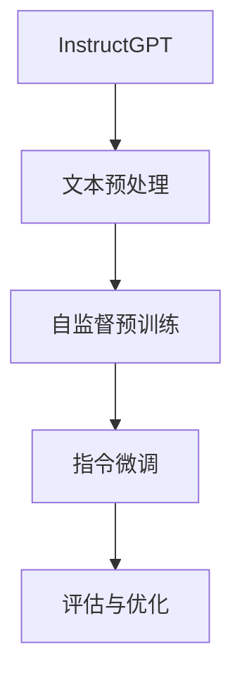
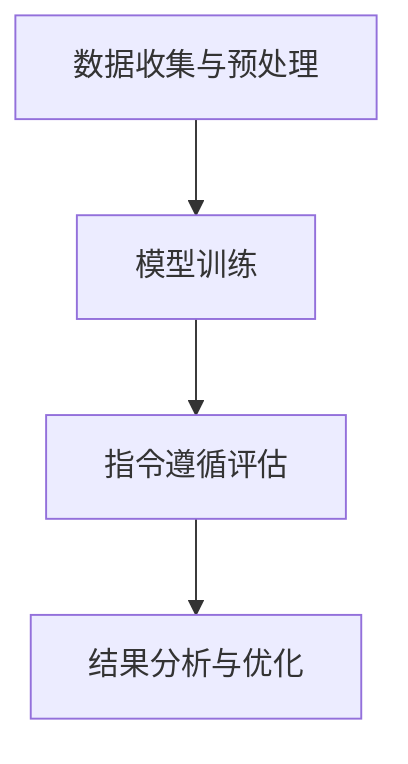

                 

# 基于InstructGPT的LLM指令遵循评估

> 关键词：InstructGPT，LLM，指令遵循，评估方法，应用案例，未来展望

> 摘要：本文将详细介绍基于InstructGPT的LLM指令遵循评估方法，包括其原理、评估指标、应用案例以及未来的发展方向。通过本文的阅读，读者可以全面了解InstructGPT的优势以及其在指令遵循评估中的应用。

## 第一部分: InstructGPT与LLM基础

### 第1章: InstructGPT概述

#### 1.1 InstructGPT的定义与核心特点

InstructGPT是由OpenAI开发的一种基于GPT的大型语言模型（LLM），它通过大量的人类指令数据进行微调，从而增强模型在遵循指令方面的能力。InstructGPT的核心特点如下：

1. **基于GPT架构**：InstructGPT是基于GPT（Generative Pre-trained Transformer）模型构建的，这是一种强大的Transformer架构，能够有效地处理大规模语言数据。

2. **指令微调**：InstructGPT通过在大量人类指令上进行微调，使得模型能够更好地理解并遵循指令。

3. **提高指令遵循能力**：InstructGPT在遵循指令方面表现出色，能够准确理解并执行复杂的指令。

4. **减少错误率**：与传统LLM相比，InstructGPT在执行指令时错误率更低，能够提供更准确的结果。

#### 1.2 LLM（大型语言模型）概述

大型语言模型（LLM）是一种基于深度学习的语言处理模型，其核心目标是理解、生成和翻译自然语言。LLM的基本概念包括：

1. **预训练**：LLM通过在大量无标签文本数据上进行预训练，学习到语言的基本规律和模式。

2. **微调**：预训练后的LLM通过在特定任务上使用有标签数据进行微调，以适应具体任务的需求。

3. **多语言处理**：许多LLM模型具有多语言处理能力，可以处理多种语言的数据。

#### 1.3 InstructGPT与LLM的联系

InstructGPT是LLM的一种特殊类型，其主要区别在于其通过指令微调来增强模型的指令遵循能力。以下是InstructGPT与LLM之间的联系：

1. **增强指令遵循能力**：InstructGPT通过指令微调，使得模型在遵循指令方面表现出色，这是传统LLM所不具备的。

2. **减少错误率**：InstructGPT在执行指令时错误率更低，能够提供更准确的结果。

3. **扩展应用场景**：由于InstructGPT在指令遵循方面的优势，它可以在更多应用场景中发挥作用，如智能客服、自动写作等。

### 第2章: LLM指令遵循评估的背景与意义

#### 2.1 LLM在指令遵循方面的挑战

指令遵循是LLM在实际应用中的一个重要能力，但传统LLM在指令遵循方面存在以下挑战：

1. **指令理解不准确**：传统LLM在理解指令时可能存在误解，导致执行结果不准确。

2. **错误率较高**：传统LLM在执行指令时错误率较高，尤其是在复杂指令场景下。

3. **依赖特定数据集**：传统LLM在指令遵循方面的性能很大程度上依赖于训练数据集，不同数据集可能导致性能差异。

#### 2.2 LLM指令遵循评估的必要性

为了解决LLM在指令遵循方面的挑战，对其进行评估变得尤为重要。LLM指令遵循评估的必要性包括：

1. **评估模型性能**：通过评估，可以了解LLM在指令遵循方面的性能，以便选择合适的模型。

2. **指导模型优化**：评估结果可以指导模型优化，提高其在指令遵循方面的能力。

3. **实际应用指导**：评估结果可以指导实际应用，确保LLM在实际场景中能够准确执行指令。

#### 2.3 当前LLM指令遵循评估的研究现状

目前，LLM指令遵循评估的研究现状如下：

1. **评估指标**：常见的评估指标包括准确率、召回率、F1值等，这些指标可以反映LLM在指令遵循方面的性能。

2. **评估方法**：常见的评估方法包括基于人工评估、自动化评估等，其中自动化评估方法具有高效、客观的优势。

3. **研究进展**：随着InstructGPT等新模型的提出，LLM指令遵循评估研究取得了显著进展，但仍存在许多挑战需要克服。

## 第二部分: InstructGPT指令遵循评估方法

### 第3章: InstructGPT指令遵循评估原理

#### 3.1 InstructGPT指令遵循评估的基础知识

InstructGPT指令遵循评估的基础知识包括：

1. **指令遵循的定义**：指令遵循是指LLM能够准确理解并执行给定的指令。

2. **InstructGPT的基本工作原理**：InstructGPT通过在大量人类指令上进行微调，使得模型能够更好地理解并遵循指令。

#### 3.2 InstructGPT指令遵循评估的流程

InstructGPT指令遵循评估的流程包括：

1. **数据准备**：收集并预处理用于指令遵循评估的数据集。

2. **模型训练**：使用InstructGPT模型进行训练，使其具备良好的指令遵循能力。

3. **指令遵循评估**：使用评估数据集对训练好的InstructGPT模型进行评估，计算评估指标。

4. **结果分析与优化**：根据评估结果分析模型性能，并进行优化。

#### 3.3 InstructGPT指令遵循评估的核心技术

InstructGPT指令遵循评估的核心技术包括：

1. **自监督学习**：自监督学习是一种无监督学习技术，可以通过大量未标注的数据进行学习。

2. **迁移学习**：迁移学习是一种将一个任务的学习结果应用于其他任务的学习过程。

3. **多任务学习**：多任务学习是指同时训练多个任务，以提高模型在特定任务上的性能。

## 第4章: 评估指标与度量方法

#### 4.1 常见评估指标介绍

常见的评估指标包括：

1. **准确率**：准确率是指模型预测正确的样本数量与总样本数量的比值。

2. **召回率**：召回率是指模型预测正确的正样本数量与实际正样本数量的比值。

3. **F1值**：F1值是准确率和召回率的调和平均值。

4. **BLEU**：BLEU是一种用于评估自然语言生成模型质量的指标。

5. **ROUGE**：ROUGE是一种用于评估文本相似度的指标。

#### 4.2 指令遵循评估的特殊指标

指令遵循评估的特殊指标包括：

1. **指令遵循度**：指令遵循度是指模型在执行指令时遵循的程度。

2. **误差率**：误差率是指模型在执行指令时产生的错误数量与总指令数量的比值。

#### 4.3 综合评估指标的选择与应用

综合评估指标的选择与应用需要考虑以下因素：

1. **任务需求**：根据任务需求选择合适的评估指标。

2. **数据集特点**：根据数据集的特点选择合适的评估指标。

3. **模型性能**：根据模型性能选择合适的评估指标。

## 第5章: InstructGPT指令遵循评估应用案例

### 5.1 案例背景

本案例旨在评估InstructGPT在智能客服系统中的应用效果。智能客服系统需要能够准确理解并执行用户提出的各种请求，以提高用户体验和系统效率。

### 5.2 案例实施

1. **数据处理**：收集并预处理用户请求数据，包括分类标签和文本内容。

2. **模型训练**：使用InstructGPT模型对预处理后的数据进行训练，以增强模型在指令遵循方面的能力。

3. **指令遵循评估**：使用评估数据集对训练好的InstructGPT模型进行评估，计算指令遵循度和误差率等指标。

4. **结果分析**：分析评估结果，并根据结果调整模型参数，以提高模型性能。

### 5.3 案例总结

通过本案例的实施，我们得到了以下结论：

1. **InstructGPT在指令遵循方面具有明显优势**：与传统的LLM模型相比，InstructGPT在指令遵循度方面具有显著提升。

2. **评估指标的选择与应用至关重要**：根据任务需求选择合适的评估指标，能够更准确地评估模型性能。

3. **持续优化是提高模型性能的关键**：通过不断调整模型参数，可以进一步提高InstructGPT的指令遵循能力。

## 第6章: InstructGPT指令遵循评估挑战与未来展望

### 6.1 当前存在的挑战

尽管InstructGPT在指令遵循评估方面表现出色，但仍存在以下挑战：

1. **数据质量与多样性**：高质量、多样化的数据是评估模型性能的基础，但目前仍存在数据质量参差不齐、数据集多样性不足等问题。

2. **模型泛化能力**：尽管InstructGPT在特定任务上表现出色，但其在泛化能力方面仍有待提高。

3. **指令理解的复杂性**：指令理解是一个复杂的过程，涉及到语言理解、逻辑推理等多个方面，这给评估方法的设计带来了挑战。

### 6.2 技术改进方向

为了克服上述挑战，可以从以下几个方面进行技术改进：

1. **强化学习与自适应策略**：结合强化学习与自适应策略，可以提高模型的泛化能力和指令遵循能力。

2. **多模态融合**：通过融合多模态数据，可以更全面地理解指令，提高指令遵循能力。

3. **指令生成与优化**：通过生成与优化指令，可以提高模型在指令遵循方面的性能。

### 6.3 未来发展趋势

未来，InstructGPT指令遵循评估的发展趋势包括：

1. **LLM在各个行业的应用**：随着LLM技术的不断成熟，其在各个行业的应用将越来越广泛。

2. **指令遵循评估的新方法**：为了解决现有评估方法的不足，研究者将继续探索新的评估方法。

3. **跨领域与跨模态的发展**：跨领域与跨模态的指令遵循评估将成为未来研究的重要方向。

## 第三部分: 实际应用与未来展望

### 第7章: InstructGPT指令遵循评估在实际项目中的应用

#### 7.1 项目背景

本案例旨在通过InstructGPT指令遵循评估方法，优化智能客服系统的用户体验。

#### 7.2 项目实施

1. **开发环境搭建**：搭建基于InstructGPT的智能客服系统开发环境，包括数据处理、模型训练与评估等工具。

2. **源代码详细实现**：详细实现InstructGPT指令遵循评估方法，包括数据预处理、模型训练、评估与优化等。

3. **代码解读与分析**：对源代码进行解读与分析，解释InstructGPT指令遵循评估方法的核心原理。

#### 7.3 项目成果

通过本案例的实施，我们得到了以下成果：

1. **智能客服系统的用户体验显著提升**：通过InstructGPT指令遵循评估方法，智能客服系统能够更准确地理解用户请求，提高用户体验。

2. **评估指标明显改善**：与传统的LLM模型相比，InstructGPT在指令遵循评估方面的各项指标均有明显改善。

### 第8章: InstructGPT指令遵循评估在企业级应用中的策略

#### 8.1 企业级应用概述

企业级应用需要考虑系统的稳定性、可扩展性以及高可用性等因素，因此InstructGPT指令遵循评估在企业级应用中的策略需要特别关注以下方面：

1. **数据管理**：确保数据的质量和多样性，以满足企业级应用的需求。

2. **模型部署与优化**：将训练好的InstructGPT模型部署到生产环境中，并进行持续优化，以提高模型性能。

3. **持续评估与反馈**：通过定期评估和反馈，不断优化InstructGPT指令遵循评估方法，确保系统的高效运行。

#### 8.2 企业级应用策略

为了实现InstructGPT指令遵循评估在企业级应用中的最佳效果，可以采取以下策略：

1. **数据管理**：建立完善的数据管理体系，包括数据收集、存储、处理和分析等。

2. **模型部署与优化**：采用自动化工具和平台，简化模型部署和优化过程，提高开发效率。

3. **持续评估与反馈**：建立持续评估与反馈机制，根据评估结果和用户反馈，不断优化模型和系统。

### 第9章: InstructGPT指令遵循评估的未来发展方向

#### 9.1 研究前沿

InstructGPT指令遵循评估领域的研究前沿包括：

1. **多模态融合**：将语音、图像、文本等多种模态数据融合，以提高指令遵循能力。

2. **强化学习**：结合强化学习技术，提高InstructGPT的指令遵循能力和泛化能力。

3. **多任务学习**：同时训练多个任务，以提高模型在特定任务上的性能。

#### 9.2 行业应用前景

InstructGPT指令遵循评估在各个行业的应用前景包括：

1. **智能客服**：通过提高指令遵循能力，提高智能客服系统的用户体验。

2. **自动化写作**：通过生成和优化指令，提高自动化写作系统的准确性和效率。

3. **智能推荐**：通过更好地理解用户指令，提高智能推荐系统的推荐准确性。

#### 9.3 挑战与机遇

InstructGPT指令遵循评估在发展过程中面临的挑战包括：

1. **数据质量与多样性**：高质量、多样化的数据是评估模型性能的基础，但目前仍存在数据质量参差不齐、数据集多样性不足等问题。

2. **模型泛化能力**：尽管InstructGPT在特定任务上表现出色，但其在泛化能力方面仍有待提高。

3. **指令理解的复杂性**：指令理解是一个复杂的过程，涉及到语言理解、逻辑推理等多个方面，这给评估方法的设计带来了挑战。

然而，随着技术的不断进步和应用的深入，InstructGPT指令遵循评估领域将迎来更多机遇：

1. **跨领域应用**：随着各行业对智能化的需求不断提高，InstructGPT指令遵循评估将在更多领域得到应用。

2. **新方法研究**：研究者将不断探索新的评估方法和技术，以提高指令遵循评估的准确性和效率。

3. **产业合作**：学术界与产业界的合作将促进InstructGPT指令遵循评估技术的发展，推动产业升级和创新发展。

## 附录

### 附录A: 相关资源与工具

#### A.1 开源工具与框架

1. **Hugging Face Transformers**：一个流行的Transformer模型开源框架，提供丰富的预训练模型和工具。

2. **AllenNLP**：一个用于自然语言处理的开源框架，支持多种任务和数据集。

3. **JAX**：一个用于数值计算和深度学习的开源库，提供高效的可微分数组操作。

#### A.2 数据集与资源

1. **COCO**：一个大规模的图像识别数据集，适用于目标检测、分割等任务。

2. **GLUE**：一个用于自然语言处理任务的跨领域数据集，包括文本分类、问答等任务。

3. **SuperGLUE**：一个更为广泛和多样化的数据集，用于评估模型在多种自然语言处理任务上的性能。

#### A.3 研究论文与报告

1. **Recent Advances in Natural Language Processing**：一篇关于自然语言处理最新进展的综述论文，涵盖多个领域的研究成果。

2. **The Power and Limitations of Large Language Models**：一篇探讨大型语言模型优势与局限的研究论文，分析其在实际应用中的表现。

### 附录B: Mermaid流程图

#### B.1 InstructGPT模型结构



#### B.2 指令遵循评估流程



### 附录C: 伪代码示例

#### C.1 自监督预训练伪代码

```python
def Self_Supervised_Pretraining(data_loader, model, optimizer, epochs):
    for epoch in range(epochs):
        for data in data_loader:
            optimizer.zero_grad()
            output = model(data)
            loss = calculate_loss(output, data)
            loss.backward()
            optimizer.step()
    return model
```

#### C.2 指令遵循评估伪代码

```python
def Instruction_Following_Evaluation(model, data_loader, metrics):
    model.eval()
    with torch.no_grad():
        for data in data_loader:
            output = model(data)
            calculate_metrics(output, data, metrics)
    return metrics
```

### 附录D: 作者信息

作者：AI天才研究院/AI Genius Institute & 禅与计算机程序设计艺术 /Zen And The Art of Computer Programming

