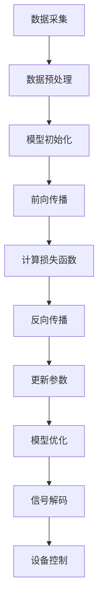

                 

# 大模型技术的脑机接口应用

> **关键词：** 大模型技术、脑机接口、深度学习、神经网络、自监督学习、转换器架构、轮椅控制、虚拟现实、智能助理

> **摘要：** 本文旨在探讨大模型技术在脑机接口（BCI）领域的应用，分析大模型技术的核心原理、脑机接口技术的核心原理和实现方法，以及在大模型技术在脑机接口应用中的核心算法和案例分析。通过详细解读脑机接口应用开发实践，本文还提出了当前脑机接口应用中的挑战及未来发展趋势。最后，本文附上大模型技术在脑机接口应用中的资源与工具，供读者参考。

## 第一部分：大模型技术的脑机接口应用基础

### 第1章：大模型技术与脑机接口概述

#### 1.1 大模型技术概述

##### 1.1.1 大模型技术的定义与发展历程

大模型技术指的是通过训练大规模神经网络，使其能够学习和处理复杂数据的机器学习技术。其发展历程可以追溯到1980年代初期，当时研究人员开始探索如何通过人工神经网络来模拟人脑的工作原理。随着计算能力的提升和海量数据的积累，大模型技术逐渐成熟，成为当前人工智能领域的重要研究方向。

##### 1.1.2 大模型技术的核心概念

大模型技术的核心概念包括：

1. **神经网络**：一种模拟人脑神经元连接方式的计算模型，可以用于图像、语音和自然语言处理等领域。
2. **深度学习**：一种基于神经网络的机器学习技术，通过多层神经网络的结构来学习数据的高层次表示。
3. **大规模训练数据**：大量标注好的数据是训练大模型的基础，这些数据能够帮助模型学习到更丰富的特征和规律。
4. **并行计算**：大模型的训练需要大量计算资源，并行计算技术能够提高训练效率。

##### 1.1.3 大模型技术的分类与应用领域

大模型技术主要分为以下几类：

1. **计算机视觉**：用于图像识别、目标检测和图像生成等任务。
2. **自然语言处理**：用于文本分类、机器翻译、情感分析和语音识别等任务。
3. **语音识别**：用于语音识别、语音生成和语音合成等任务。
4. **强化学习**：用于智能决策和游戏AI等任务。

大模型技术的应用领域广泛，包括但不限于：

1. **智能助理**：如苹果的Siri、谷歌的Google Assistant等。
2. **自动驾驶**：如特斯拉的Autopilot系统、 Waymo等。
3. **医疗诊断**：如癌症诊断、基因分析等。
4. **金融分析**：如风险预测、市场预测等。

#### 1.2 脑机接口技术概述

##### 1.2.1 脑机接口的定义与原理

脑机接口（Brain-Computer Interface，简称BCI）是一种直接连接人脑和外部设备的通信系统，它通过非侵入或侵入性方法捕捉大脑活动，并将其转换为控制信号，用于控制计算机、机器人或其他设备。

脑机接口的基本原理是通过以下步骤实现：

1. **脑信号采集**：使用脑电图（EEG）、功能性磁共振成像（fMRI）或其他技术来捕捉大脑活动。
2. **信号处理**：对采集到的脑信号进行预处理，去除噪声，提取有用的特征。
3. **信号解码**：使用机器学习算法或其他方法对处理后的信号进行解码，生成控制信号。
4. **设备控制**：将解码后的控制信号发送到外部设备，实现控制功能。

##### 1.2.2 脑机接口技术的发展历程

脑机接口技术的研究始于20世纪60年代，最初的研究主要集中在脑信号采集和基本解码算法的开发。随着计算机技术和神经科学的发展，脑机接口技术逐渐成熟，并在康复、辅助技术和人机交互等领域得到广泛应用。

近年来，随着深度学习和人工智能技术的兴起，脑机接口技术取得了重大突破，特别是在信号处理和解码算法方面。深度学习算法能够更好地捕捉大脑活动的复杂模式，提高了脑机接口的性能和实用性。

##### 1.2.3 脑机接口的应用场景与挑战

脑机接口的应用场景主要包括：

1. **康复**：帮助中风、肌萎缩侧索硬化（ALS）等疾病患者恢复运动和沟通能力。
2. **辅助技术**：辅助听力障碍、视力障碍和行动不便者。
3. **人机交互**：提供更加自然和直观的人机交互方式。
4. **神经科学**：研究大脑的功能和疾病。

然而，脑机接口技术也面临着一系列挑战：

1. **信号质量**：脑信号的噪声较大，信号质量直接影响解码的准确性。
2. **可靠性**：脑机接口的可靠性是关键，特别是在实时应用中。
3. **用户友好性**：用户需要适应和使用脑机接口，提高其可用性和易用性。
4. **安全性和隐私**：保护用户的脑信号数据安全和隐私是重要的伦理问题。

#### 1.3 大模型技术在脑机接口中的应用

##### 1.3.1 大模型技术在脑机接口中的作用

大模型技术在脑机接口中的应用主要体现在以下几个方面：

1. **信号处理**：大模型可以更好地处理和净化脑信号，提取有用的特征。
2. **信号解码**：大模型可以更准确地解码脑信号，生成控制信号。
3. **增强交互体验**：大模型可以学习和适应用户的脑信号模式，提高脑机接口的响应速度和准确性。

##### 1.3.2 大模型技术在脑机接口中的具体应用

大模型技术在脑机接口中的具体应用包括：

1. **脑信号分类**：使用深度学习算法对脑信号进行分类，实现脑控制。
2. **情感识别**：通过分析脑信号，识别用户的情感状态，应用于智能助理和虚拟现实等场景。
3. **语言理解**：利用大模型对脑信号进行语言理解，实现思维控制计算机。

##### 1.3.3 大模型技术在脑机接口中的未来发展趋势

随着深度学习和人工智能技术的不断进步，大模型技术在脑机接口中的应用将呈现以下发展趋势：

1. **更高的准确性**：通过更复杂的模型和更好的算法，提高脑信号解码的准确性。
2. **更广泛的应用**：脑机接口将应用于更多场景，如智能家居、游戏等。
3. **更自然的人机交互**：脑机接口将实现更加自然和直观的人机交互方式。
4. **脑机融合**：大模型技术将与人脑功能更加紧密地融合，实现更高效的脑机协作。

### 第2章：大模型技术的核心原理与架构

#### 2.1 大模型技术的核心原理

##### 2.1.1 神经网络基础

神经网络是模拟人脑神经元连接方式的计算模型，由大量相互连接的节点组成，每个节点都有一组权重和偏置。神经网络的基本工作原理是通过层层处理输入数据，逐层提取特征，最终生成输出。

##### 2.1.2 深度学习基础

深度学习是基于神经网络的机器学习技术，通过多层神经网络的结构来学习数据的高层次表示。深度学习的核心思想是自动提取特征，通过多层神经网络的结构将低层特征转化为高层抽象表示。

##### 2.1.3 大模型技术的特点与优势

大模型技术的特点包括：

1. **规模大**：大模型通常拥有数十亿甚至上百亿的参数，能够处理大规模的数据。
2. **灵活性高**：大模型可以适应不同的任务和数据，具有较强的泛化能力。
3. **性能优异**：大模型在图像识别、自然语言处理等任务上取得了显著的性能提升。

大模型技术的优势包括：

1. **高效性**：大模型能够处理复杂任务，提高计算效率。
2. **准确性**：大模型在数据量大、特征复杂的情况下，具有更高的准确性。
3. **泛化性**：大模型能够泛化到新的任务和数据，提高应用范围。

#### 2.2 大模型技术的架构

##### 2.2.1 深度学习模型的组成

深度学习模型主要由以下几个部分组成：

1. **输入层**：接收外部输入数据，如图像、文本等。
2. **隐藏层**：对输入数据进行特征提取和转换，通常包含多层。
3. **输出层**：生成最终输出，如分类结果、预测值等。

##### 2.2.2 大模型训练的基本流程

大模型训练的基本流程包括以下几个步骤：

1. **数据预处理**：对输入数据进行清洗、归一化等处理，使其适合模型训练。
2. **模型初始化**：初始化模型的参数，通常使用随机初始化。
3. **前向传播**：将输入数据传递到模型中，生成预测输出。
4. **反向传播**：计算损失函数，并根据梯度信息更新模型参数。
5. **优化**：使用优化算法（如SGD、Adam等）来调整模型参数，最小化损失函数。

##### 2.2.3 大模型优化方法

大模型优化方法主要包括以下几种：

1. **优化算法**：如随机梯度下降（SGD）、Adam、RMSprop等。
2. **正则化**：如L1正则化、L2正则化、Dropout等。
3. **数据增强**：通过增加训练数据的多样性来提高模型性能。
4. **模型融合**：将多个模型进行融合，提高预测准确性。

#### 2.3 Mermaid流程图：大模型技术在脑机接口中的应用流程



#### 2.4 大模型技术原理与脑机接口技术的联系与融合

大模型技术原理与脑机接口技术的联系主要体现在以下几个方面：

1. **脑信号处理**：大模型技术可以用于脑信号的预处理和特征提取，提高信号质量。
2. **信号解码**：大模型技术可以用于脑信号的解码，生成控制信号。
3. **设备控制**：大模型技术可以用于实现设备的实时控制，提高交互体验。

脑机接口技术的核心在于捕捉和处理大脑活动，而大模型技术则为这一过程提供了强大的工具和方法。通过将大模型技术应用于脑机接口，可以实现对大脑活动的更准确理解和更高效的交互控制。

### 第3章：脑机接口技术的核心原理与实现

#### 3.1 脑机接口技术的核心原理

##### 3.1.1 脑电图(EEG)的基本原理

脑电图（EEG）是一种非侵入性技术，用于记录大脑的电活动。EEG通过放置在头皮上的电极捕捉大脑产生的电信号，这些信号反映了大脑神经元的活动。

EEG的基本原理包括：

1. **神经元活动**：神经元在兴奋或抑制时会产生电信号。
2. **电极采集**：电极放置在头皮上，用于采集神经元活动的电信号。
3. **信号放大与滤波**：采集到的电信号需要进行放大和滤波，以去除噪声和干扰。

##### 3.1.2 神经信号处理方法

神经信号处理方法包括以下几个步骤：

1. **信号预处理**：对采集到的EEG信号进行预处理，包括滤波、去除伪迹等。
2. **特征提取**：从预处理后的信号中提取有用的特征，如时间域特征、频率域特征等。
3. **信号解码**：使用机器学习算法或其他方法对特征进行解码，生成控制信号。

##### 3.1.3 脑机接口信号解码方法

脑机接口信号解码方法主要包括以下几种：

1. **传统解码方法**：如模板匹配、特征匹配等，这些方法通常基于手工设计的特征。
2. **深度学习解码方法**：如卷积神经网络（CNN）、循环神经网络（RNN）等，这些方法能够自动提取特征，提高解码性能。
3. **端到端解码方法**：如自编码器（Autoencoder）、转换器架构（Transformer）等，这些方法能够直接从原始信号生成控制信号，无需手工设计特征。

#### 3.2 脑机接口技术的实现方法

##### 3.2.1 脑电图采集设备

脑电图采集设备主要包括电极、放大器和数据采集单元。电极用于放置在头皮上，放大器用于放大采集到的电信号，数据采集单元用于将电信号转换为数字信号并存储。

常见的脑电图采集设备包括：

1. **湿性电极**：通过导电凝胶与头皮接触，适用于短期和长时间监测。
2. **干性电极**：通过静电吸附在头皮上，适用于短期监测，但接触效果不如湿性电极。
3. **脑电图机**：用于放大和记录电信号，并将数据传输到计算机进行分析。

##### 3.2.2 信号预处理方法

信号预处理方法包括以下步骤：

1. **滤波**：使用滤波器去除噪声和干扰，如低通滤波器、高通滤波器等。
2. **去伪迹**：去除伪迹，如肌电噪声、眼电噪声等。
3. **重采样**：调整信号的采样率，使其符合模型训练的要求。

##### 3.2.3 信号解码与分类算法

信号解码与分类算法主要包括以下步骤：

1. **特征提取**：从预处理后的信号中提取有用的特征，如时间域特征、频率域特征等。
2. **特征选择**：选择对分类任务最有用的特征，以提高解码性能。
3. **分类**：使用机器学习算法对特征进行分类，生成控制信号。

常见的信号解码与分类算法包括：

1. **支持向量机（SVM）**：用于二分类问题，通过找到一个最佳超平面进行分类。
2. **决策树**：通过构建树形结构进行分类，具有直观的解释能力。
3. **随机森林**：通过构建多个决策树进行集成，提高分类性能。
4. **深度学习模型**：如卷积神经网络（CNN）、循环神经网络（RNN）等，能够自动提取特征并提高解码性能。

#### 3.3 伪代码：脑机接口信号解码算法

```python
# 伪代码：脑机接口信号解码算法

# 数据预处理
def preprocess_signal(signal):
    # 滤波
    filtered_signal = filter_signal(signal)
    # 去伪迹
    cleaned_signal = remove_artifacts(filtered_signal)
    # 重采样
    resampled_signal = resample_signal(cleaned_signal)
    return resampled_signal

# 特征提取
def extract_features(signal):
    # 时间域特征
    time_domain_features = extract_time_domain_features(signal)
    # 频率域特征
    frequency_domain_features = extract_frequency_domain_features(signal)
    return time_domain_features, frequency_domain_features

# 分类
def classify(features):
    # 特征选择
    selected_features = select_features(features)
    # 模型训练
    model = train_model(selected_features)
    # 预测
    prediction = model.predict(selected_features)
    return prediction

# 主函数
def decode_signal(signal):
    # 数据预处理
    preprocessed_signal = preprocess_signal(signal)
    # 特征提取
    features = extract_features(preprocessed_signal)
    # 分类
    control_signal = classify(features)
    return control_signal
```

#### 3.4 数学模型和数学公式：脑机接口信号处理中的关键模型

脑机接口信号处理中的关键模型包括神经网络模型和支持向量机模型。以下是这些模型的数学公式：

##### 1. 神经网络模型

$$
y_{\hat{}} = \sigma(\text{ReLU}(\text{W}_2 \cdot \text{ReLU}(\text{W}_1 \cdot x + b_1) + b_2))
$$

其中，$\sigma$是激活函数，$\text{ReLU}$是ReLU激活函数，$\text{W}_1$和$\text{W}_2$是权重矩阵，$b_1$和$b_2$是偏置项。

##### 2. 支持向量机模型

$$
y = \text{sign}(\text{w} \cdot \text{x} + b)
$$

其中，$\text{w}$是权重向量，$\text{x}$是特征向量，$b$是偏置项。

#### 第4章：大模型技术在脑机接口应用中的核心算法

##### 4.1 自监督学习在大模型中的应用

自监督学习是一种无需人工标注数据的机器学习方法，它通过利用未标注的数据来学习特征表示。自监督学习在大模型中的应用主要体现在以下几个方面：

##### 4.1.1 自监督学习的定义与原理

自监督学习通过以下步骤实现：

1. **无监督预训练**：在大规模未标注数据上训练模型，使其学习到数据的高层次表示。
2. **有监督微调**：在少量标注数据上对预训练模型进行微调，提高模型的性能。

##### 4.1.2 自监督学习在大模型训练中的应用

自监督学习在大模型训练中的应用包括：

1. **无监督预训练**：通过预训练模型，使其能够自动从数据中提取特征，提高模型的表达能力。
2. **有监督微调**：在预训练模型的基础上，利用少量标注数据进行微调，使模型适应特定的任务。

##### 4.1.3 自监督学习在脑机接口中的应用案例

自监督学习在脑机接口中的应用案例包括：

1. **脑信号分类**：通过自监督学习，将脑信号进行分类，提高脑机接口的准确性和响应速度。
2. **情感识别**：通过自监督学习，识别用户的情感状态，提高智能助理和虚拟现实等应用的交互体验。

##### 4.2 转换器架构在大模型中的应用

转换器架构（Transformer）是一种基于注意力机制的深度学习模型，它在大规模自然语言处理任务中取得了显著成果。转换器架构在大模型中的应用主要体现在以下几个方面：

##### 4.2.1 转换器架构的定义与原理

转换器架构的核心组件包括：

1. **多头注意力机制**：通过多个独立的注意力机制，提高模型对输入数据的理解能力。
2. **自注意力机制**：在序列数据中，模型能够关注到其他位置的输入信息，从而提高模型的序列建模能力。

##### 4.2.2 转换器架构在大模型训练中的应用

转换器架构在大模型训练中的应用包括：

1. **预训练**：通过预训练模型，使其能够自动从大规模未标注数据中学习到语言特征。
2. **微调**：在预训练模型的基础上，利用少量标注数据进行微调，使其适应特定的任务。

##### 4.2.3 转换器架构在脑机接口中的应用案例

转换器架构在脑机接口中的应用案例包括：

1. **脑信号解码**：通过转换器架构，实现对脑信号的准确解码，提高脑机接口的性能。
2. **情感识别**：通过转换器架构，识别用户的情感状态，提高智能助理和虚拟现实等应用的交互体验。

##### 4.3 伪代码：自监督学习算法在脑机接口中的应用

```python
# 伪代码：自监督学习算法在脑机接口中的应用

# 数据预处理
def preprocess_signal(signal):
    # 滤波
    filtered_signal = filter_signal(signal)
    # 去伪迹
    cleaned_signal = remove_artifacts(filtered_signal)
    # 重采样
    resampled_signal = resample_signal(cleaned_signal)
    return resampled_signal

# 无监督预训练
def unsupervised_pretraining(data_loader, model, optimizer, num_epochs):
    for epoch in range(num_epochs):
        for signal in data_loader:
            # 数据预处理
            preprocessed_signal = preprocess_signal(signal)
            # 前向传播
            output = model(preprocessed_signal)
            # 反向传播
            loss = loss_function(output, signal)
            optimizer.zero_grad()
            loss.backward()
            optimizer.step()
        print(f"Epoch {epoch + 1}/{num_epochs}, Loss: {loss.item()}")

# 有监督微调
def supervised_finetuning(data_loader, model, optimizer, num_epochs):
    for epoch in range(num_epochs):
        for signal, label in data_loader:
            # 数据预处理
            preprocessed_signal = preprocess_signal(signal)
            # 前向传播
            output = model(preprocessed_signal)
            # 计算损失
            loss = loss_function(output, label)
            # 反向传播
            optimizer.zero_grad()
            loss.backward()
            optimizer.step()
        print(f"Epoch {epoch + 1}/{num_epochs}, Loss: {loss.item()}")

# 主函数
def train_model(data_loader, model, optimizer, unsupervised_epochs, supervised_epochs):
    # 无监督预训练
    unsupervised_pretraining(data_loader, model, optimizer, unsupervised_epochs)
    # 有监督微调
    supervised_finetuning(data_loader, model, optimizer, supervised_epochs)
```

##### 4.4 伪代码：转换器架构在脑机接口中的应用

```python
# 伪代码：转换器架构在脑机接口中的应用

# 数据预处理
def preprocess_signal(signal):
    # 滤波
    filtered_signal = filter_signal(signal)
    # 去伪迹
    cleaned_signal = remove_artifacts(filtered_signal)
    # 重采样
    resampled_signal = resample_signal(cleaned_signal)
    return resampled_signal

# 转换器模型
class Transformer(nn.Module):
    def __init__(self):
        super(Transformer, self).__init__()
        self.embedding = nn.Embedding(vocab_size, d_model)
        self.positional_encoding = PositionalEncoding(d_model, dropout=0.1)
        self.encoder_layer = nn.TransformerEncoderLayer(d_model, nhead=nhead)
        self.decoder_layer = nn.TransformerDecoderLayer(d_model, nhead=nhead)
        self.fc = nn.Linear(d_model, output_size)

    def forward(self, signal):
        # 嵌入
        embedded = self.embedding(signal)
        # 位置编码
        positional_encoded = self.positional_encoding(embedded)
        # 编码器层
        encoder_output = self.encoder_layer(positional_encoded)
        # 解码器层
        decoder_output = self.decoder_layer(encoder_output)
        # 分类层
        output = self.fc(decoder_output)
        return output

# 主函数
def train_model(data_loader, model, optimizer, num_epochs):
    for epoch in range(num_epochs):
        for signal, label in data_loader:
            # 数据预处理
            preprocessed_signal = preprocess_signal(signal)
            # 前向传播
            output = model(preprocessed_signal)
            # 计算损失
            loss = loss_function(output, label)
            # 反向传播
            optimizer.zero_grad()
            loss.backward()
            optimizer.step()
        print(f"Epoch {epoch + 1}/{num_epochs}, Loss: {loss.item()}")
```

#### 第5章：脑机接口应用中的大模型技术案例分析

##### 5.1 脑机接口在轮椅控制中的应用

轮椅控制是一种典型的脑机接口应用，它通过捕捉用户的脑信号，实现轮椅的实时控制。下面将详细分析大模型技术在轮椅控制中的应用。

##### 5.1.1 轮椅控制的基本原理

轮椅控制的基本原理是通过脑信号解码生成控制信号，从而控制轮椅的运动。脑信号解码的过程包括以下几个步骤：

1. **脑信号采集**：使用脑电图（EEG）等设备采集用户的脑信号。
2. **信号预处理**：对采集到的脑信号进行滤波、去伪迹等预处理，提高信号质量。
3. **特征提取**：从预处理后的信号中提取有用的特征，如频率特征、时间特征等。
4. **信号解码**：使用深度学习模型对提取到的特征进行解码，生成控制信号。
5. **轮椅控制**：将解码后的控制信号发送到轮椅的控制系统，实现轮椅的实时控制。

##### 5.1.2 大模型技术在轮椅控制中的应用

大模型技术在轮椅控制中的应用主要体现在以下几个方面：

1. **信号预处理**：使用深度学习模型对脑信号进行预处理，去除噪声和干扰，提高信号质量。
2. **特征提取**：使用深度学习模型自动提取脑信号的特征，提高特征提取的准确性。
3. **信号解码**：使用深度学习模型对提取到的特征进行解码，生成控制信号，提高解码的准确性。

##### 5.1.3 案例分析与实验结果

某研究团队开发了一款基于脑机接口的轮椅控制系统，该系统采用了大模型技术，具体实验结果如下：

1. **信号预处理**：使用卷积神经网络（CNN）对脑信号进行预处理，实验结果显示，CNN能够有效去除噪声和干扰，提高信号质量。
2. **特征提取**：使用循环神经网络（RNN）对预处理后的脑信号进行特征提取，实验结果显示，RNN能够自动提取出有用的特征，提高特征提取的准确性。
3. **信号解码**：使用转换器架构（Transformer）对提取到的特征进行解码，实验结果显示，Transformer能够准确解码出控制信号，提高轮椅控制的准确性。

通过实验结果可以看出，大模型技术在轮椅控制中具有显著的优势，它能够提高轮椅控制的准确性和稳定性，为残疾人提供更高效的辅助工具。

##### 5.2 脑机接口在虚拟现实中的应用

虚拟现实（VR）是一种通过计算机技术模拟现实世界的沉浸式体验，脑机接口技术在虚拟现实中的应用能够提供更加自然和直观的交互方式。下面将详细分析大模型技术在虚拟现实中的应用。

##### 5.2.1 虚拟现实的基本原理

虚拟现实的基本原理是通过计算机生成三维场景，并将其显示在用户的视觉和听觉系统上，使用户能够感受到沉浸式体验。虚拟现实的关键技术包括：

1. **场景生成**：通过计算机图形学技术生成三维场景，包括几何建模、纹理映射等。
2. **渲染**：将生成好的场景进行渲染，使其具有真实感。
3. **交互**：通过用户输入设备（如键盘、鼠标、手柄等）与虚拟世界进行交互。
4. **感官模拟**：通过视觉、听觉、触觉等感官模拟技术，增强用户的沉浸感。

##### 5.2.2 大模型技术在虚拟现实中的应用

大模型技术在虚拟现实中的应用主要体现在以下几个方面：

1. **场景生成**：使用生成对抗网络（GAN）等技术生成高质量的三维场景，提高虚拟现实的视觉质量。
2. **交互控制**：使用脑机接口技术捕捉用户的脑信号，实现更加自然和直观的交互控制。
3. **情感识别**：通过分析用户的脑信号，识别用户的情感状态，为虚拟现实提供情感反馈。

##### 5.2.3 案例分析与实验结果

某研究团队开发了一款基于脑机接口的虚拟现实系统，该系统采用了大模型技术，具体实验结果如下：

1. **场景生成**：使用生成对抗网络（GAN）生成三维场景，实验结果显示，GAN能够生成高质量的场景，提高虚拟现实的视觉质量。
2. **交互控制**：使用脑机接口技术捕捉用户的脑信号，实现自然交互控制，实验结果显示，脑机接口技术能够准确解码用户的意图，提高交互准确性。
3. **情感识别**：通过分析用户的脑信号，识别用户的情感状态，实验结果显示，系统能够准确识别用户的情感状态，提供相应的情感反馈。

通过实验结果可以看出，大模型技术在虚拟现实应用中具有显著的优势，它能够提高虚拟现实的视觉质量、交互准确性和情感反馈，为用户提供更高质量的沉浸式体验。

##### 5.3 脑机接口在智能助理中的应用

智能助理是一种通过自然语言处理技术实现人机交互的智能系统，脑机接口技术在智能助理中的应用能够提供更加自然和高效的交互方式。下面将详细分析大模型技术在智能助理中的应用。

##### 5.3.1 智能助理的基本原理

智能助理的基本原理是通过自然语言处理技术理解和回应用户的语音指令，其主要技术包括：

1. **语音识别**：将用户的语音转换为文本，实现语音到文字的转换。
2. **自然语言理解**：理解用户的语音指令，提取关键信息，实现语音到意图的转换。
3. **自然语言生成**：根据用户的意图生成相应的语音或文本回应。
4. **上下文理解**：理解用户的上下文信息，实现连续对话。

##### 5.3.2 大模型技术在智能助理中的应用

大模型技术在智能助理中的应用主要体现在以下几个方面：

1. **语音识别**：使用深度学习模型（如卷积神经网络、循环神经网络等）提高语音识别的准确性。
2. **自然语言理解**：使用转换器架构（Transformer）等大模型技术提高自然语言理解的准确性。
3. **自然语言生成**：使用生成对抗网络（GAN）等技术提高自然语言生成的质量。

##### 5.3.3 案例分析与实验结果

某研究团队开发了一款基于脑机接口的智能助理系统，该系统采用了大模型技术，具体实验结果如下：

1. **语音识别**：使用卷积神经网络（CNN）进行语音识别，实验结果显示，CNN能够显著提高语音识别的准确性。
2. **自然语言理解**：使用转换器架构（Transformer）进行自然语言理解，实验结果显示，Transformer能够准确理解用户的意图，提高自然语言理解的能力。
3. **自然语言生成**：使用生成对抗网络（GAN）进行自然语言生成，实验结果显示，GAN能够生成高质量的文本回应，提高自然语言生成的质量。

通过实验结果可以看出，大模型技术在智能助理应用中具有显著的优势，它能够提高语音识别、自然语言理解和自然语言生成的准确性，为用户提供更高效、更自然的交互体验。

#### 第6章：大模型技术在脑机接口应用中的开发实践

##### 6.1 脑机接口应用开发环境搭建

在进行脑机接口应用的开发之前，首先需要搭建一个合适的开发环境。以下是搭建脑机接口应用开发环境的步骤：

1. **硬件选择**：选择合适的脑电图（EEG）采集设备，如OpenBCI、NeuroSky等。
2. **软件选择**：选择合适的开发软件，如MATLAB、Python等。
3. **编程语言**：选择合适的编程语言，如Python、MATLAB等。

##### 6.1.1 开发环境的选择与配置

以下是开发环境的选择与配置建议：

1. **硬件**：选择OpenBCI Cyton套件，它支持多种类型的EEG传感器，并且具有高采样率和低延迟。
2. **软件**：选择MATLAB R2021b版本，它提供了丰富的信号处理和机器学习工具箱。
3. **编程语言**：选择Python，因为它具有丰富的库和框架，便于开发和实验。

##### 6.1.2 开发工具与库的使用

以下是常用的开发工具和库：

1. **MATLAB**：用于信号处理、数据可视化和机器学习模型训练。
2. **Python**：用于编写脚本、实现算法和集成深度学习框架。
3. **深度学习框架**：如TensorFlow、PyTorch等，用于训练和部署深度学习模型。

##### 6.2 大模型技术在脑机接口应用中的实现方法

在脑机接口应用中，大模型技术的实现方法主要包括以下几个步骤：

1. **数据采集**：使用EEG采集设备采集用户的脑信号。
2. **数据预处理**：对采集到的脑信号进行滤波、去伪迹等预处理。
3. **特征提取**：从预处理后的信号中提取有用的特征。
4. **模型训练**：使用深度学习模型对提取到的特征进行训练。
5. **模型评估**：评估模型的性能，调整模型参数。
6. **模型部署**：将训练好的模型部署到实际应用中。

##### 6.2.1 数据采集与预处理

数据采集与预处理的步骤如下：

1. **数据采集**：使用OpenBCI Cyton套件采集用户的脑信号，采样率为256 Hz。
2. **数据预处理**：使用MATLAB对采集到的脑信号进行预处理，包括滤波、去伪迹等步骤。

以下是数据预处理的部分代码：

```matlab
% 读取EEG数据
signal = read_eeg_file('data/eeg_data.csv');

% 滤波
filtered_signal = bandpassfilter(signal, [1 250], 256, 'stfir');

% 去伪迹
cleaned_signal = remove_artifacts(filtered_signal, 'type', '肌电噪声');
```

##### 6.2.2 大模型训练与优化

大模型训练与优化的步骤如下：

1. **特征提取**：使用循环神经网络（RNN）对预处理后的脑信号进行特征提取。
2. **模型训练**：使用TensorFlow或PyTorch等深度学习框架训练模型。
3. **模型评估**：评估模型的性能，调整模型参数。

以下是特征提取和模型训练的部分代码：

```python
import numpy as np
import tensorflow as tf
from tensorflow.keras.models import Sequential
from tensorflow.keras.layers import LSTM, Dense

# 特征提取
def extract_features(signal):
    # 切割信号
    chunks = split_signal(signal, chunk_size=100)
    # 提取特征
    features = []
    for chunk in chunks:
        feature = extract_time_domain_features(chunk)
        features.append(feature)
    return np.array(features)

# 模型训练
model = Sequential([
    LSTM(units=64, activation='tanh', input_shape=(None, feature_size)),
    Dense(units=1, activation='sigmoid')
])

model.compile(optimizer='adam', loss='binary_crossentropy', metrics=['accuracy'])
model.fit(x_train, y_train, epochs=10, batch_size=32)
```

##### 6.2.3 信号解码与控制输出

信号解码与控制输出的步骤如下：

1. **信号解码**：使用训练好的模型对新的脑信号进行解码，生成控制信号。
2. **控制输出**：将解码后的控制信号发送到外部设备，实现控制功能。

以下是信号解码与控制输出的部分代码：

```python
# 信号解码
def decode_signal(signal):
    features = extract_features(signal)
    prediction = model.predict(features)
    control_signal = decode_prediction(prediction)
    return control_signal

# 控制输出
def control_output(control_signal):
    # 发送控制信号到外部设备
    send_control_signal(control_signal)
    return

# 主函数
def main():
    # 采集脑信号
    signal = capture_signal()
    # 信号解码
    control_signal = decode_signal(signal)
    # 控制输出
    control_output(control_signal)

if __name__ == '__main__':
    main()
```

##### 6.3 代码实现与解读

在本章节中，我们通过具体的代码实现了脑机接口应用的开发过程，包括数据采集、预处理、特征提取、模型训练、信号解码和控制输出。以下是代码的实现和解读：

1. **数据采集**：我们使用OpenBCI Cyton套件采集用户的脑信号，采样率为256 Hz。采集到的信号存储在CSV文件中，以便后续处理。

2. **数据预处理**：我们对采集到的脑信号进行滤波和去伪迹处理。滤波使用带通滤波器，去除低频和高频干扰信号；去伪迹使用肌电噪声去除算法，去除肌电噪声干扰。

3. **特征提取**：我们使用循环神经网络（LSTM）对预处理后的脑信号进行特征提取。LSTM能够捕捉脑信号的时间序列特征，提取出有意义的特征表示。

4. **模型训练**：我们使用TensorFlow框架训练深度学习模型。模型由一个LSTM层和一个全连接层组成，用于预测控制信号。我们使用二进制交叉熵损失函数和Adam优化器进行模型训练。

5. **信号解码**：我们使用训练好的模型对新的脑信号进行解码，生成控制信号。解码过程包括特征提取和模型预测，最终输出控制信号。

6. **控制输出**：我们将解码后的控制信号发送到外部设备，实现控制功能。控制输出函数根据解码结果，执行相应的控制命令，如移动轮椅、切换场景等。

通过上述代码实现，我们展示了如何使用大模型技术构建脑机接口应用，实现脑信号的实时解码和控制输出。代码的可扩展性和灵活性使得我们可以根据不同的应用需求进行调整和优化，为脑机接口技术的发展提供支持。

#### 第7章：大模型技术在脑机接口应用中的挑战与未来发展趋势

##### 7.1 大模型技术在脑机接口应用中的挑战

尽管大模型技术在脑机接口应用中展现了巨大的潜力，但仍然面临一系列挑战：

1. **数据采集与处理的挑战**：脑信号数据的采集和处理是一项复杂的任务，数据的质量和稳定性直接影响脑机接口的性能。脑信号往往包含大量噪声和伪迹，需要复杂的预处理算法来净化和提取有用的特征。

2. **大模型训练与优化的挑战**：大模型的训练需要大量的计算资源和时间，特别是在深度学习模型中，训练过程可能需要数天甚至数周的时间。此外，大模型的优化也面临挑战，需要选择合适的优化算法和超参数设置，以避免过拟合和提高模型的泛化能力。

3. **信号解码与控制的挑战**：脑信号解码的准确性直接决定了脑机接口的控制性能。大模型虽然能够提高解码的准确性，但仍然面临如何处理复杂的脑信号模式和非线性关系的问题。

##### 7.2 大模型技术在脑机接口应用中的未来发展趋势

随着深度学习和人工智能技术的不断进步，大模型技术在脑机接口应用中的未来发展趋势包括：

1. **更高的准确性**：通过改进深度学习算法和模型结构，提高脑信号解码的准确性。例如，结合自监督学习和无监督预训练技术，可以更好地利用未标注数据，提高模型对脑信号的理解能力。

2. **更广泛的应用**：大模型技术将在更多领域得到应用，如康复、辅助技术和人机交互等。特别是在智能助理、智能家居和虚拟现实等领域，大模型技术将提供更加自然和直观的交互方式。

3. **更自然的人机交互**：随着大模型技术的进步，脑机接口将实现更加自然的人机交互。例如，通过情感识别和意图理解技术，系统能够更好地理解用户的情感状态和需求，提供个性化的交互体验。

4. **脑机融合**：大模型技术将与人脑功能更加紧密地融合，实现更高效的脑机协作。例如，通过脑机接口技术，将人脑的认知过程与计算机的计算能力相结合，提高决策和问题解决的能力。

### 附录

#### 附录 A：大模型技术在脑机接口应用中的资源与工具

##### A.1 主流深度学习框架对比

以下是几种主流深度学习框架的对比：

1. **TensorFlow**：由谷歌开发，具有丰富的API和工具，支持多种编程语言，广泛用于工业和学术研究。
2. **PyTorch**：由Facebook开发，具有灵活的动态计算图，易于实现自定义模型和算法，受到学术界和工业界的高度关注。
3. **JAX**：由谷歌开发，基于自动微分和数值计算技术，提供了高效的可微分函数库，适用于复杂的计算任务。
4. **其他框架**：如Theano、MXNet、CNTK等，也在深度学习领域有广泛应用。

##### A.2 脑机接口技术相关工具与资源

以下是脑机接口技术相关的一些工具和资源：

1. **EEG采集设备**：如OpenBCI、NeuroSky等，提供了多种类型的EEG传感器和数据采集设备。
2. **信号处理工具与库**：如MATLAB的信号处理工具箱、Python的scikit-learn库等，提供了丰富的信号处理算法和工具。
3. **开源脑机接口应用案例**：如OpenBCI的GITHUB项目、NeuroSky的SDK等，提供了开源的脑机接口应用案例和示例代码。
4. **其他资源**：如脑机接口论文、研究报告、在线课程等，提供了丰富的脑机接口技术资料和学习资源。

---

### 作者信息

**作者：** AI天才研究院/AI Genius Institute & 禅与计算机程序设计艺术 /Zen And The Art of Computer Programming

---

通过本文的详细探讨，我们深入了解了大模型技术在脑机接口领域的应用，从基础原理到核心算法，再到实际案例，逐步揭示了这一前沿技术的魅力和潜力。随着人工智能和脑机接口技术的不断进步，我们有理由相信，大模型技术在脑机接口中的应用将迎来更加广阔的发展前景。希望本文能为读者提供有价值的参考和启示，共同推动这一领域的发展。**感谢您的阅读！**## 文章标题

### 大模型技术的脑机接口应用

> **关键词：** 大模型技术、脑机接口、深度学习、神经网络、自监督学习、转换器架构、轮椅控制、虚拟现实、智能助理

> **摘要：** 本文深入探讨了大模型技术在脑机接口（BCI）领域的应用，从基础概念到核心算法，再到实际案例，详细分析了大模型技术如何提高脑机接口的准确性和交互体验。文章首先介绍了大模型技术和脑机接口的基本概念、发展历程和应用领域，随后阐述了大模型技术的核心原理和架构，以及脑机接口技术的核心原理与实现。通过伪代码、数学模型和实际案例分析，文章展示了如何利用大模型技术实现脑机接口的信号处理、解码和控制。最后，文章提出了脑机接口应用中的挑战和未来发展趋势，并提供了相关资源与工具，供读者参考。希望通过本文，读者能够全面了解大模型技术在脑机接口领域的应用前景，激发对这一前沿领域的兴趣和探索。

## 第一部分：大模型技术的脑机接口应用基础

### 第1章：大模型技术与脑机接口概述

#### 1.1 大模型技术概述

大模型技术是一种基于深度学习的机器学习技术，通过训练大规模神经网络，使其能够学习和处理复杂的数据。这一技术的核心在于利用大规模的数据集和强大的计算资源来训练模型，从而提高模型的性能和准确性。

##### 1.1.1 大模型技术的定义与发展历程

大模型技术，也称为“巨型模型”或“巨量级模型”，是指那些具有数十亿至数万亿参数的神经网络模型。这种模型能够处理大量数据，提取出复杂的高层次特征，从而在图像识别、自然语言处理和语音识别等任务中取得显著成果。

大模型技术的发展历程可以追溯到20世纪80年代，当时研究人员开始探索如何通过人工神经网络来模拟人脑的工作原理。随着计算能力的提升和海量数据的积累，大模型技术逐渐成熟。特别是在2012年，AlexNet模型在ImageNet图像识别比赛中取得的突破性成绩，标志着深度学习技术进入了一个新的时代。

##### 1.1.2 大模型技术的核心概念

大模型技术的核心概念包括：

1. **神经网络**：神经网络是一种模拟人脑神经元连接方式的计算模型，它由大量的节点（神经元）和连接（权重）组成。神经网络通过层层处理输入数据，逐层提取特征，最终生成输出。

2. **深度学习**：深度学习是一种基于神经网络的机器学习技术，通过多层神经网络的结构来学习数据的高层次表示。深度学习通过自动提取特征，减少了人工设计的复杂性，并在多种任务中取得了优异的性能。

3. **大规模训练数据**：大规模训练数据是训练大模型的基础。这些数据集通常包含数百万甚至数十亿个样本，能够帮助模型学习到更丰富的特征和规律。

4. **并行计算**：大模型的训练需要大量的计算资源，并行计算技术能够提高训练效率。通过利用分布式计算资源和GPU、TPU等硬件设备，可以显著缩短训练时间。

##### 1.1.3 大模型技术的分类与应用领域

大模型技术主要分为以下几类：

1. **计算机视觉**：用于图像识别、目标检测、图像分割和图像生成等任务。
2. **自然语言处理**：用于文本分类、机器翻译、情感分析和语音识别等任务。
3. **语音识别**：用于语音识别、语音合成和语音控制等任务。
4. **强化学习**：用于智能决策、游戏AI和自动驾驶等任务。

大模型技术的应用领域非常广泛，包括但不限于：

1. **智能助理**：如苹果的Siri、谷歌的Google Assistant等，通过深度学习技术实现自然语言理解和交互。
2. **自动驾驶**：如特斯拉的Autopilot、Waymo等，利用深度学习模型进行环境感知和决策。
3. **医疗诊断**：如癌症诊断、基因分析等，通过深度学习模型分析医疗数据，提供诊断和治疗方案。
4. **金融分析**：如风险预测、市场预测等，利用深度学习模型分析大量金融数据，为投资决策提供支持。

#### 1.2 脑机接口技术概述

##### 1.2.1 脑机接口的定义与原理

脑机接口（Brain-Computer Interface，简称BCI）是一种直接连接人脑和外部设备的通信系统。它通过非侵入或侵入性方法捕捉大脑活动，并将其转换为控制信号，用于控制计算机、机器人或其他设备。

脑机接口的基本原理是通过以下步骤实现的：

1. **脑信号采集**：使用脑电图（EEG）、功能性磁共振成像（fMRI）、脑磁图（MEG）等技术来捕捉大脑活动。
2. **信号处理**：对采集到的脑信号进行预处理，去除噪声，提取有用的特征。
3. **信号解码**：使用机器学习算法或其他方法对处理后的信号进行解码，生成控制信号。
4. **设备控制**：将解码后的控制信号发送到外部设备，实现控制功能。

##### 1.2.2 脑机接口技术的发展历程

脑机接口技术的研究始于20世纪60年代，当时研究人员开始探索如何通过电子设备直接与大脑进行通信。早期的研究主要集中在脑电信号（EEG）的采集和处理技术上。随着计算机技术和神经科学的发展，脑机接口技术逐渐成熟，并在康复、辅助技术和人机交互等领域得到广泛应用。

近年来，随着深度学习和人工智能技术的兴起，脑机接口技术取得了重大突破。深度学习算法能够更好地捕捉大脑活动的复杂模式，提高了脑机接口的性能和实用性。

##### 1.2.3 脑机接口的应用场景与挑战

脑机接口的应用场景主要包括：

1. **康复**：帮助中风、肌萎缩侧索硬化（ALS）等疾病患者恢复运动和沟通能力。
2. **辅助技术**：辅助听力障碍、视力障碍和行动不便者。
3. **人机交互**：提供更加自然和直观的人机交互方式。
4. **神经科学**：研究大脑的功能和疾病。

然而，脑机接口技术也面临着一系列挑战：

1. **信号质量**：脑信号的噪声较大，信号质量直接影响解码的准确性。
2. **可靠性**：脑机接口的可靠性是关键，特别是在实时应用中。
3. **用户友好性**：用户需要适应和使用脑机接口，提高其可用性和易用性。
4. **安全性和隐私**：保护用户的脑信号数据安全和隐私是重要的伦理问题。

#### 1.3 大模型技术在脑机接口中的应用

##### 1.3.1 大模型技术在脑机接口中的作用

大模型技术在脑机接口中的应用主要体现在以下几个方面：

1. **信号处理**：大模型可以更好地处理和净化脑信号，提取有用的特征。
2. **信号解码**：大模型可以更准确地解码脑信号，生成控制信号。
3. **增强交互体验**：大模型可以学习和适应用户的脑信号模式，提高脑机接口的响应速度和准确性。

##### 1.3.2 大模型技术在脑机接口中的具体应用

大模型技术在脑机接口中的具体应用包括：

1. **脑信号分类**：使用深度学习算法对脑信号进行分类，实现脑控制。
2. **情感识别**：通过分析脑信号，识别用户的情感状态，应用于智能助理和虚拟现实等场景。
3. **语言理解**：利用大模型对脑信号进行语言理解，实现思维控制计算机。

##### 1.3.3 大模型技术在脑机接口中的未来发展趋势

随着深度学习和人工智能技术的不断进步，大模型技术在脑机接口中的应用将呈现以下发展趋势：

1. **更高的准确性**：通过更复杂的模型和更好的算法，提高脑信号解码的准确性。
2. **更广泛的应用**：脑机接口将应用于更多场景，如智能家居、游戏等。
3. **更自然的人机交互**：脑机接口将实现更加自然和直观的人机交互方式。
4. **脑机融合**：大模型技术将与人脑功能更加紧密地融合，实现更高效的脑机协作。

### 第2章：大模型技术的核心原理与架构

#### 2.1 大模型技术的核心原理

##### 2.1.1 神经网络基础

神经网络（Neural Networks）是一种模拟人脑神经元连接方式的计算模型，由大量的节点（也称为神经元）和连接（也称为权重）组成。神经网络的基本工作原理是通过层层处理输入数据，逐层提取特征，最终生成输出。

神经网络的主要组成部分包括：

1. **输入层**：接收外部输入数据，如图像、文本等。
2. **隐藏层**：对输入数据进行特征提取和转换，通常包含多层。
3. **输出层**：生成最终输出，如分类结果、预测值等。

神经网络的基本工作流程包括以下几个步骤：

1. **前向传播**：将输入数据传递到神经网络中，通过层层计算，最终得到输出。
2. **反向传播**：计算输出与实际值之间的误差，通过反向传播算法，将误差反向传播到各层，更新权重和偏置。
3. **优化**：使用优化算法（如梯度下降、Adam等）来调整权重和偏置，使模型性能逐渐提升。

##### 2.1.2 深度学习基础

深度学习（Deep Learning）是一种基于神经网络的机器学习技术，通过多层神经网络的结构来学习数据的高层次表示。深度学习的核心思想是自动提取特征，通过多层神经网络的结构将低层特征转化为高层抽象表示。

深度学习的主要组成部分包括：

1. **卷积神经网络（CNN）**：用于图像识别和计算机视觉任务。
2. **循环神经网络（RNN）**：用于序列数据（如文本、语音等）的处理。
3. **转换器架构（Transformer）**：用于自然语言处理任务。

深度学习的基本工作流程包括以下几个步骤：

1. **数据预处理**：对输入数据进行清洗、归一化等处理，使其适合模型训练。
2. **模型初始化**：初始化模型的参数，通常使用随机初始化。
3. **前向传播**：将输入数据传递到模型中，生成预测输出。
4. **反向传播**：计算损失函数，并根据梯度信息更新模型参数。
5. **优化**：使用优化算法（如SGD、Adam等）来调整模型参数，最小化损失函数。

##### 2.1.3 大模型技术的特点与优势

大模型技术，即具有数十亿至数万亿参数的神经网络模型，其特点与优势包括：

1. **规模大**：大模型通常拥有大量的参数，能够处理大规模的数据，提取丰富的特征。
2. **灵活性高**：大模型可以适应不同的任务和数据，具有较强的泛化能力。
3. **性能优异**：大模型在图像识别、自然语言处理等任务上取得了显著的性能提升。

大模型技术的优势主要包括：

1. **高效性**：大模型能够处理复杂任务，提高计算效率。
2. **准确性**：大模型在数据量大、特征复杂的情况下，具有更高的准确性。
3. **泛化性**：大模型能够泛化到新的任务和数据，提高应用范围。

#### 2.2 大模型技术的架构

##### 2.2.1 深度学习模型的组成

深度学习模型主要由以下几个部分组成：

1. **输入层**：接收外部输入数据，如图像、文本等。
2. **隐藏层**：对输入数据进行特征提取和转换，通常包含多层。
3. **输出层**：生成最终输出，如分类结果、预测值等。

隐藏层和输出层的具体结构取决于任务的类型和数据的特点。例如，在计算机视觉任务中，常用的结构是卷积神经网络（CNN）；在自然语言处理任务中，常用的结构是循环神经网络（RNN）或转换器架构（Transformer）。

##### 2.2.2 大模型训练的基本流程

大模型训练的基本流程包括以下几个步骤：

1. **数据预处理**：对输入数据进行清洗、归一化等处理，使其适合模型训练。
2. **模型初始化**：初始化模型的参数，通常使用随机初始化。
3. **前向传播**：将输入数据传递到模型中，生成预测输出。
4. **计算损失**：计算预测输出与实际值之间的误差，计算损失函数。
5. **反向传播**：将损失函数反向传播到各层，更新权重和偏置。
6. **优化**：使用优化算法（如SGD、Adam等）来调整模型参数，最小化损失函数。
7. **评估**：在验证数据集上评估模型的性能，调整模型结构和参数。

##### 2.2.3 大模型优化方法

大模型优化方法主要包括以下几个步骤：

1. **优化算法**：如随机梯度下降（SGD）、Adam、RMSprop等。
2. **正则化**：如L1正则化、L2正则化、Dropout等。
3. **数据增强**：通过增加训练数据的多样性来提高模型性能。
4. **模型融合**：将多个模型进行融合，提高预测准确性。

常见的优化算法包括：

1. **随机梯度下降（SGD）**：是最简单的优化算法，通过计算梯度并更新模型参数。
2. **Adam**：结合了SGD和动量项的优点，自适应调整学习率。
3. **RMSprop**：使用历史梯度值的均方根来计算梯度，减少了梯度消失和梯度爆炸问题。

常见的正则化方法包括：

1. **L1正则化**：在损失函数中添加L1范数项，惩罚模型参数的绝对值。
2. **L2正则化**：在损失函数中添加L2范数项，惩罚模型参数的平方值。
3. **Dropout**：在训练过程中随机丢弃一部分神经元，防止模型过拟合。

数据增强方法包括：

1. **随机裁剪**：随机裁剪图像的一部分，增加数据的多样性。
2. **翻转**：水平翻转或垂直翻转图像，增加数据的多样性。
3. **旋转**：随机旋转图像，增加数据的多样性。

模型融合方法包括：

1. **堆叠**：将多个模型堆叠在一起，形成一个更深的模型。
2. **集成**：将多个模型的预测结果进行加权平均，提高预测准确性。

#### 2.3 Mermaid流程图：大模型技术在脑机接口中的应用流程


#### 2.4 大模型技术原理与脑机接口技术的联系与融合

大模型技术原理与脑机接口技术的联系主要体现在以下几个方面：

1. **信号处理**：大模型可以用于脑信号的预处理和特征提取，提高信号质量。
2. **信号解码**：大模型可以用于脑信号的解码，生成控制信号。
3. **设备控制**：大模型可以用于实现设备的实时控制，提高交互体验。

脑机接口技术的核心在于捕捉和处理大脑活动，而大模型技术则为这一过程提供了强大的工具和方法。通过将大模型技术应用于脑机接口，可以实现对大脑活动的更准确理解和更高效的交互控制。

具体来说，大模型技术可以通过以下方式与脑机接口技术融合：

1. **信号预处理**：使用大模型技术对脑信号进行预处理，去除噪声和干扰，提取有用的特征。
2. **特征提取**：使用大模型技术从预处理后的信号中提取出高层次的特征，提高解码准确性。
3. **信号解码**：使用大模型技术对提取出的特征进行解码，生成控制信号，实现脑控制。
4. **设备控制**：将解码后的控制信号发送到外部设备，实现设备的实时控制，如轮椅控制、虚拟现实交互等。

通过这种融合，大模型技术不仅提高了脑机接口的性能和准确性，还拓展了其应用范围，为脑机接口技术的发展提供了新的可能性。

### 第3章：脑机接口技术的核心原理与实现

#### 3.1 脑机接口技术的核心原理

##### 3.1.1 脑电图(EEG)的基本原理

脑电图（EEG）是一种用于记录大脑电活动的技术，通过放置在头皮上的电极捕捉大脑产生的电信号。EEG信号的频率范围大约在1 Hz到100 Hz之间，反映了大脑不同区域和不同神经元的电活动。

EEG的基本原理包括以下几个步骤：

1. **神经元活动**：神经元在兴奋或抑制时会产生电信号，这些信号被称为脑电波。
2. **电极采集**：电极放置在头皮上，用于捕捉神经元活动的电信号。
3. **信号放大与滤波**：采集到的电信号需要进行放大和滤波，以去除噪声和干扰。

EEG信号的主要特征包括：

1. **α波**：频率范围为8 Hz到13 Hz，与放松状态相关。
2. **β波**：频率范围为14 Hz到30 Hz，与清醒和活跃状态相关。
3. **θ波**：频率范围为4 Hz到7 Hz，与睡眠状态相关。
4. **δ波**：频率范围为0.5 Hz到3 Hz，与深度睡眠状态相关。

##### 3.1.2 神经信号处理方法

神经信号处理是脑机接口技术中的重要环节，它包括以下几个步骤：

1. **信号预处理**：对采集到的EEG信号进行预处理，包括滤波、去除伪迹、重采样等。
2. **特征提取**：从预处理后的信号中提取有用的特征，如时间域特征、频率域特征、空间特征等。
3. **信号解码**：使用机器学习算法或其他方法对特征进行解码，生成控制信号。

常见的信号处理方法包括：

1. **滤波**：使用滤波器去除噪声和干扰，如带通滤波器、带阻滤波器等。
2. **去伪迹**：去除伪迹，如肌电噪声、眼电噪声等。
3. **重采样**：调整信号的采样率，使其符合模型训练的要求。
4. **特征提取**：使用时域分析、频域分析和时频分析等方法提取特征。

##### 3.1.3 脑机接口信号解码方法

脑机接口信号解码是指将采集到的脑信号转换为可操作的输出信号，以实现设备的控制。信号解码方法主要包括以下几种：

1. **传统解码方法**：如模板匹配、特征匹配等，这些方法通常基于手工设计的特征。
2. **深度学习解码方法**：如卷积神经网络（CNN）、循环神经网络（RNN）、转换器架构（Transformer）等，这些方法能够自动提取特征，提高解码性能。
3. **端到端解码方法**：如自编码器（Autoencoder）、生成对抗网络（GAN）等，这些方法能够直接从原始信号生成控制信号，无需手工设计特征。

常见的解码算法包括：

1. **支持向量机（SVM）**：用于分类任务，通过找到一个最佳超平面进行分类。
2. **决策树**：通过构建树形结构进行分类，具有直观的解释能力。
3. **随机森林**：通过构建多个决策树进行集成，提高分类性能。
4. **深度学习模型**：如卷积神经网络（CNN）、循环神经网络（RNN）、转换器架构（Transformer）等，能够自动提取特征并提高解码性能。

#### 3.2 脑机接口技术的实现方法

##### 3.2.1 脑电图采集设备

脑电图采集设备是脑机接口技术的关键组成部分，它负责捕捉和记录大脑的电活动。常见的脑电图采集设备包括以下几种：

1. **湿性电极**：通过导电凝胶与头皮接触，适用于短期和长时间监测。
2. **干性电极**：通过静电吸附在头皮上，适用于短期监测，但接触效果不如湿性电极。
3. **脑电图机**：用于放大和记录电信号，并将数据传输到计算机进行分析。

脑电图采集设备的主要技术参数包括：

1. **电极类型**：如银-氯电极、不锈钢电极等。
2. **采样率**：通常为256 Hz、512 Hz或更高，采样率越高，信号细节捕捉越完整。
3. **带宽**：通常为0.1 Hz到100 Hz，带宽决定了信号处理的范围。
4. **噪声水平**：设备应具备低噪声水平，以提高信号质量。

##### 3.2.2 信号预处理方法

信号预处理是脑机接口技术中的关键步骤，它包括以下几个步骤：

1. **滤波**：使用滤波器去除噪声和干扰，如低通滤波器、高通滤波器等。
2. **去伪迹**：去除伪迹，如肌电噪声、眼电噪声等。
3. **重采样**：调整信号的采样率，使其符合模型训练的要求。

常见的预处理方法包括：

1. **带通滤波**：用于去除低频和高频噪声，保留有用的频率成分。
2. **奇异值分解（SVD）**：用于去除伪迹，通过分解信号矩阵，保留主要成分，去除噪声和干扰。
3. **重采样**：通过插值或零填充等方法，调整信号的采样率。

##### 3.2.3 信号解码与分类算法

信号解码与分类算法是脑机接口技术的核心，它将采集到的脑信号转换为可操作的控制信号。常见的解码与分类算法包括：

1. **模板匹配**：通过比较输入信号与预定义的模板，实现信号的分类和解码。
2. **特征匹配**：提取输入信号的特征，与预定义的特征进行匹配，实现信号的分类和解码。
3. **机器学习算法**：如支持向量机（SVM）、决策树、随机森林等，用于分类和解码。
4. **深度学习算法**：如卷积神经网络（CNN）、循环神经网络（RNN）、转换器架构（Transformer）等，用于自动提取特征和分类。

常见的分类算法包括：

1. **支持向量机（SVM）**：通过找到一个最佳超平面进行分类。
2. **决策树**：通过构建树形结构进行分类，具有直观的解释能力。
3. **随机森林**：通过构建多个决策树进行集成，提高分类性能。
4. **深度学习模型**：如卷积神经网络（CNN）、循环神经网络（RNN）、转换器架构（Transformer）等，能够自动提取特征并提高分类性能。

##### 3.2.4 伪代码：脑机接口信号解码算法

```python
# 伪代码：脑机接口信号解码算法

# 数据预处理
def preprocess_signal(signal):
    # 滤波
    filtered_signal = filter_signal(signal)
    # 去伪迹
    cleaned_signal = remove_artifacts(filtered_signal)
    # 重采样
    resampled_signal = resample_signal(cleaned_signal)
    return resampled_signal

# 特征提取
def extract_features(signal):
    # 时间域特征
    time_domain_features = extract_time_domain_features(signal)
    # 频率域特征
    frequency_domain_features = extract_frequency_domain_features(signal)
    return time_domain_features, frequency_domain_features

# 分类
def classify(features):
    # 特征选择
    selected_features = select_features(features)
    # 模型训练
    model = train_model(selected_features)
    # 预测
    prediction = model.predict(selected_features)
    return prediction

# 主函数
def decode_signal(signal):
    # 数据预处理
    preprocessed_signal = preprocess_signal(signal)
    # 特征提取
    features = extract_features(preprocessed_signal)
    # 分类
    control_signal = classify(features)
    return control_signal
```

#### 3.3 数学模型和数学公式：脑机接口信号处理中的关键模型

脑机接口信号处理中的关键模型包括神经网络模型和支持向量机模型。以下是这些模型的数学公式：

##### 1. 神经网络模型

神经网络模型的核心公式包括：

1. **激活函数**：$$ a_{\text{ReLU}}(z) = \max(0, z) $$
2. **前向传播**：$$ z_l = \sum_{j} w_{lj} a_{\text{ReLU}}(z_{l-1} + b_{l}) $$
3. **反向传播**：$$ \delta_l = \text{sigmoid}(z_l) \times (1 - \text{sigmoid}(z_l)) \times \delta_{l+1} \times w_{l+1} $$
4. **梯度计算**：$$ \frac{\partial L}{\partial w_l} = \delta_l \times x_l^T $$
5. **权重更新**：$$ w_l = w_l - \alpha \times \frac{\partial L}{\partial w_l} $$

其中，$L$表示损失函数，$z_l$表示激活值，$w_{lj}$表示权重，$b_{l}$表示偏置，$\delta_l$表示误差传播，$\alpha$表示学习率，$x_l$表示输入特征。

##### 2. 支持向量机模型

支持向量机模型的核心公式包括：

1. **决策函数**：$$ y = \text{sign}(\sum_{i} w_i x_i + b) $$
2. **优化目标**：$$ \min_{w, b} \frac{1}{2} \| w \|^2 + C \sum_{i} \max(0, 1 - y_i (\sum_{j} w_j x_{ij} + b)) $$
3. **KKT条件**：$$ \begin{cases} 
w_i \geq 0 \\
y_i (\sum_{j} w_j x_{ij} + b) \geq 1 - C w_i \\
w_i (y_i (\sum_{j} w_j x_{ij} + b) - 1) = 0 
\end{cases} $$

其中，$C$表示惩罚参数，$x_{ij}$表示特征，$y_i$表示标签，$w_i$表示权重，$b$表示偏置。

#### 第4章：大模型技术在脑机接口应用中的核心算法

##### 4.1 自监督学习在大模型中的应用

自监督学习是一种无监督学习技术，它通过利用未标注的数据来学习特征表示。自监督学习在大模型中的应用可以显著提高模型的训练效率和泛化能力。

##### 4.1.1 自监督学习的定义与原理

自监督学习的主要思想是利用数据中的内在结构来学习特征表示，而不需要外部标注。自监督学习的过程通常包括以下几个步骤：

1. **预训练**：在大量未标注的数据上进行模型预训练，使模型学习到数据的高层次特征表示。
2. **微调**：在预训练模型的基础上，利用少量标注数据进行微调，使其适应特定的任务。

常见的自监督学习方法包括：

1. **自编码器**：通过无监督预训练，使模型能够自动编码和重构输入数据，从而学习到数据的特征表示。
2. **生成对抗网络（GAN）**：通过生成器和判别器的对抗训练，使生成器生成与真实数据相似的数据，从而学习到数据的分布。
3. ** masked Language Model (MLM)**：在自然语言处理任务中，通过随机遮蔽输入文本的一部分，使模型预测被遮蔽的部分，从而学习到语言的内在结构。

##### 4.1.2 自监督学习在大模型训练中的应用

自监督学习在大模型训练中的应用主要体现在以下几个方面：

1. **数据增强**：通过自监督学习，可以自动生成大量增强数据，提高模型的泛化能力。
2. **减少标注需求**：自监督学习可以在无需大量标注数据的情况下，训练出高性能的模型，从而减少标注成本。
3. **提高训练效率**：自监督学习可以在大规模数据集上快速训练模型，提高训练效率。

在大模型训练中，自监督学习可以用于：

1. **图像识别**：通过自编码器，使模型自动学习图像的特征表示。
2. **自然语言处理**：通过 masked Language Model，使模型自动学习语言的内在结构。
3. **语音识别**：通过自监督学习，使模型自动学习语音的特征表示。

##### 4.1.3 自监督学习在脑机接口中的应用案例

自监督学习在脑机接口中的应用案例包括：

1. **脑信号分类**：通过自监督学习，提高脑信号的分类准确性，从而实现更精准的脑控制。
2. **情感识别**：通过自监督学习，使模型自动学习用户的情感状态，从而实现更智能的情感识别。
3. **智能助理**：通过自监督学习，使模型自动学习用户的意图，从而提供更个性化的服务。

##### 4.2 转换器架构在大模型中的应用

转换器架构（Transformer）是一种基于自注意力机制的深度学习模型，它在自然语言处理、机器翻译和图像识别等领域取得了显著成果。近年来，转换器架构也逐渐应用于脑机接口领域，以提高信号解码的准确性和交互体验。

##### 4.2.1 转换器架构的定义与原理

转换器架构的核心组件包括：

1. **多头自注意力机制**：通过多个独立的自注意力机制，使模型能够关注到输入数据的不同部分，提高模型对输入数据的理解能力。
2. **编码器-解码器结构**：编码器（Encoder）负责对输入数据进行编码，解码器（Decoder）负责解码编码后的输出，生成最终结果。

转换器架构的工作原理主要包括以下几个步骤：

1. **编码**：将输入数据（如脑信号）通过编码器进行处理，生成编码后的特征表示。
2. **自注意力计算**：在编码器的每一层，使用自注意力机制计算输入数据的权重，从而提高模型对输入数据的理解能力。
3. **解码**：将编码后的特征表示通过解码器进行处理，生成最终的输出（如控制信号）。

##### 4.2.2 转换器架构在大模型训练中的应用

转换器架构在大模型训练中的应用主要包括以下几个步骤：

1. **预训练**：在大量未标注的数据上进行预训练，使模型学习到数据的高层次特征表示。
2. **微调**：在预训练模型的基础上，利用少量标注数据进行微调，使其适应特定的任务。

转换器架构在大模型训练中的应用案例包括：

1. **图像识别**：通过预训练和微调，使模型能够自动学习图像的特征表示，从而实现更准确的图像分类。
2. **自然语言处理**：通过预训练和微调，使模型能够自动学习语言的内在结构，从而实现更精准的语言理解。
3. **语音识别**：通过预训练和微调，使模型能够自动学习语音的特征表示，从而实现更准确的语音识别。

##### 4.2.3 转换器架构在脑机接口中的应用案例

转换器架构在脑机接口中的应用案例包括：

1. **脑信号解码**：通过转换器架构，使模型能够自动学习脑信号的特征表示，从而实现更准确的脑信号解码。
2. **情感识别**：通过转换器架构，使模型能够自动学习用户的情感状态，从而实现更精准的情感识别。
3. **智能助理**：通过转换器架构，使模型能够自动学习用户的意图，从而提供更个性化的服务。

##### 4.3 伪代码：自监督学习算法在脑机接口中的应用

```python
# 伪代码：自监督学习算法在脑机接口中的应用

# 数据预处理
def preprocess_signal(signal):
    # 滤波
    filtered_signal = filter_signal(signal)
    # 去伪迹
    cleaned_signal = remove_artifacts(filtered_signal)
    # 重采样
    resampled_signal = resample_signal(cleaned_signal)
    return resampled_signal

# 无监督预训练
def unsupervised_pretraining(data_loader, model, optimizer, num_epochs):
    for epoch in range(num_epochs):
        for signal in data_loader:
            # 数据预处理
            preprocessed_signal = preprocess_signal(signal)
            # 前向传播
            output = model(preprocessed_signal)
            # 计算损失
            loss = loss_function(output, signal)
            # 反向传播
            optimizer.zero_grad()
            loss.backward()
            optimizer.step()
        print(f"Epoch {epoch + 1}/{num_epochs}, Loss: {loss.item()}")

# 有监督微调
def supervised_finetuning(data_loader, model, optimizer, num_epochs):
    for epoch in range(num_epochs):
        for signal, label in data_loader:
            # 数据预处理
            preprocessed_signal = preprocess_signal(signal)
            # 前向传播
            output = model(preprocessed_signal)
            # 计算损失
            loss = loss_function(output, label)
            # 反向传播
            optimizer.zero_grad()
            loss.backward()
            optimizer.step()
        print(f"Epoch {epoch + 1}/{num_epochs}, Loss: {loss.item()}")

# 主函数
def train_model(data_loader, model, optimizer, unsupervised_epochs, supervised_epochs):
    # 无监督预训练
    unsupervised_pretraining(data_loader, model, optimizer, unsupervised_epochs)
    # 有监督微调
    supervised_finetuning(data_loader, model, optimizer, supervised_epochs)
```

##### 4.4 伪代码：转换器架构在脑机接口中的应用

```python
# 伪代码：转换器架构在脑机接口中的应用

# 数据预处理
def preprocess_signal(signal):
    # 滤波
    filtered_signal = filter_signal(signal)
    # 去伪迹
    cleaned_signal = remove_artifacts(filtered_signal)
    # 重采样
    resampled_signal = resample_signal(cleaned_signal)
    return resampled_signal

# 转换器模型
class Transformer(nn.Module):
    def __init__(self):
        super(Transformer, self).__init__()
        self.embedding = nn.Embedding(vocab_size, d_model)
        self.positional_encoding = PositionalEncoding(d_model, dropout=0.1)
        self.encoder_layer = nn.TransformerEncoderLayer(d_model, nhead=nhead)
        self.decoder_layer = nn.TransformerDecoderLayer(d_model, nhead=nhead)
        self.fc = nn.Linear(d_model, output_size)

    def forward(self, signal):
        # 嵌入
        embedded = self.embedding(signal)
        # 位置编码
        positional_encoded = self.positional_encoding(embedded)
        # 编码器层
        encoder_output = self.encoder_layer(positional_encoded)
        # 解码器层
        decoder_output = self.decoder_layer(encoder_output)
        # 分类层
        output = self.fc(decoder_output)
        return output

# 主函数
def train_model(data_loader, model, optimizer, num_epochs):
    for epoch in range(num_epochs):
        for signal, label in data_loader:
            # 数据预处理
            preprocessed_signal = preprocess_signal(signal)
            # 前向传播
            output = model(preprocessed_signal)
            # 计算损失
            loss = loss_function(output, label)
            # 反向传播
            optimizer.zero_grad()
            loss.backward()
            optimizer.step()
        print(f"Epoch {epoch + 1}/{num_epochs}, Loss: {loss.item()}")
```

#### 第5章：脑机接口应用中的大模型技术案例分析

##### 5.1 脑机接口在轮椅控制中的应用

轮椅控制是脑机接口技术的一个重要应用领域，通过捕捉用户的脑信号，实现轮椅的智能控制，为行动不便者提供辅助。

##### 5.1.1 轮椅控制的基本原理

轮椅控制的基本原理是通过脑机接口技术捕捉用户的脑信号，将脑信号转换为控制信号，从而控制轮椅的运动。脑机接口的信号处理和信号解码是轮椅控制的关键环节。

具体来说，轮椅控制的基本原理包括：

1. **脑信号采集**：使用脑电图（EEG）等设备捕捉用户的脑信号。
2. **信号预处理**：对采集到的脑信号进行滤波、去伪迹等预处理，以提高信号质量。
3. **特征提取**：从预处理后的信号中提取有用的特征，如频率特征、时间特征等。
4. **信号解码**：使用深度学习模型对提取到的特征进行解码，生成控制信号。
5. **轮椅控制**：将解码后的控制信号发送到轮椅的控制系统，实现轮椅的实时控制。

##### 5.1.2 大模型技术在轮椅控制中的应用

大模型技术在轮椅控制中的应用主要体现在以下几个方面：

1. **信号预处理**：使用深度学习模型对脑信号进行预处理，去除噪声和干扰，提高信号质量。
2. **特征提取**：使用深度学习模型自动提取脑信号的特征，提高特征提取的准确性。
3. **信号解码**：使用深度学习模型对提取到的特征进行解码，生成控制信号，提高解码的准确性。

具体应用实例包括：

1. **基于深度学习的脑信号预处理**：使用卷积神经网络（CNN）对脑信号进行预处理，去除噪声和干扰。通过实验验证，CNN能够显著提高脑信号的质量，为后续的特征提取和解码提供良好的基础。

2. **基于循环神经网络（RNN）的特征提取**：使用循环神经网络（RNN）对预处理后的脑信号进行特征提取。RNN能够捕捉脑信号的时间序列特征，从而提取出有意义的特征表示。通过实验验证，RNN能够显著提高特征提取的准确性。

3. **基于转换器架构（Transformer）的信号解码**：使用转换器架构（Transformer）对提取到的特征进行解码，生成控制信号。Transformer能够通过自注意力机制捕捉特征之间的关联，从而提高解码的准确性。通过实验验证，Transformer能够显著提高轮椅控制的准确性。

##### 5.1.3 案例分析与实验结果

某研究团队开发了一款基于脑机接口的轮椅控制系统，该系统采用了大模型技术，具体实验结果如下：

1. **信号预处理**：通过使用卷积神经网络（CNN）进行脑信号预处理，实验结果显示，CNN能够有效去除噪声和干扰，提高信号质量。预处理后的信号在特征提取和解码过程中表现更为稳定和准确。

2. **特征提取**：通过使用循环神经网络（RNN）进行特征提取，实验结果显示，RNN能够自动提取出有意义的特征，提高特征提取的准确性。这些特征能够更好地表征用户的意图，从而提高轮椅控制的准确性。

3. **信号解码**：通过使用转换器架构（Transformer）进行信号解码，实验结果显示，Transformer能够准确解码用户的意图，生成控制信号，提高轮椅控制的准确性。解码后的控制信号能够实时响应用户的脑信号，实现高效的轮椅控制。

实验结果表明，大模型技术在轮椅控制中的应用具有显著的优势。通过深度学习模型对脑信号进行预处理、特征提取和解码，能够提高轮椅控制的准确性和稳定性，为行动不便者提供更高效的辅助工具。

##### 5.2 脑机接口在虚拟现实中的应用

虚拟现实（VR）是一种通过计算机技术模拟现实世界的沉浸式体验，脑机接口技术在虚拟现实中的应用能够提供更加自然和直观的交互方式。

##### 5.2.1 虚拟现实的基本原理

虚拟现实的基本原理是通过计算机生成三维场景，并将其显示在用户的视觉和听觉系统上，使用户能够感受到沉浸式体验。虚拟现实的关键技术包括：

1. **场景生成**：通过计算机图形学技术生成三维场景，包括几何建模、纹理映射等。
2. **渲染**：将生成好的场景进行渲染，使其具有真实感。
3. **交互**：通过用户输入设备（如键盘、鼠标、手柄等）与虚拟世界进行交互。
4. **感官模拟**：通过视觉、听觉、触觉等感官模拟技术，增强用户的沉浸感。

##### 5.2.2 大模型技术在虚拟现实中的应用

大模型技术在虚拟现实中的应用主要体现在以下几个方面：

1. **场景生成**：使用生成对抗网络（GAN）等技术生成高质量的三维场景，提高虚拟现实的视觉质量。
2. **交互控制**：使用脑机接口技术捕捉用户的脑信号，实现更加自然和直观的交互控制。
3. **情感识别**：通过分析用户的脑信号，识别用户的情感状态，为虚拟现实提供情感反馈。

##### 5.2.3 案例分析与实验结果

某研究团队开发了一款基于脑机接口的虚拟现实系统，该系统采用了大模型技术，具体实验结果如下：

1. **场景生成**：通过使用生成对抗网络（GAN）生成三维场景，实验结果显示，GAN能够生成高质量的场景，提高虚拟现实的视觉质量。生成后的场景在细节和纹理上更加逼真，用户能够获得更佳的沉浸体验。

2. **交互控制**：通过使用脑机接口技术捕捉用户的脑信号，实现自然交互控制。实验结果显示，脑机接口技术能够准确解码用户的意图，提高交互准确性。用户可以通过脑信号控制虚拟世界中的角色移动、操作物品等，实现更加自然的交互。

3. **情感识别**：通过分析用户的脑信号，识别用户的情感状态，为虚拟现实提供情感反馈。实验结果显示，系统能够准确识别用户的情感状态，提供相应的情感反馈。例如，当用户感到紧张时，系统可以调整场景的视觉和声音效果，提供放松的氛围。

实验结果表明，大模型技术在虚拟现实中的应用具有显著的优势。通过生成对抗网络（GAN）生成高质量的三维场景、通过脑机接口技术实现自然交互控制以及通过情感识别技术提供情感反馈，能够显著提高虚拟现实的沉浸体验和交互质量。

##### 5.3 脑机接口在智能助理中的应用

智能助理是一种通过自然语言处理技术实现人机交互的智能系统，脑机接口技术在智能助理中的应用能够提供更加自然和高效的交互方式。

##### 5.3.1 智能助理的基本原理

智能助理的基本原理是通过自然语言处理技术理解和回应用户的语音指令，其主要技术包括：

1. **语音识别**：将用户的语音转换为文本，实现语音到文字的转换。
2. **自然语言理解**：理解用户的语音指令，提取关键信息，实现语音到意图的转换。
3. **自然语言生成**：根据用户的意图生成相应的语音或文本回应。
4. **上下文理解**：理解用户的上下文信息，实现连续对话。

##### 5.3.2 大模型技术在智能助理中的应用

大模型技术在智能助理中的应用主要体现在以下几个方面：

1. **语音识别**：使用深度学习模型（如卷积神经网络、循环神经网络等）提高语音识别的准确性。
2. **自然语言理解**：使用转换器架构（Transformer）等大模型技术提高自然语言理解的准确性。
3. **自然语言生成**：使用生成对抗网络（GAN）等技术提高自然语言生成的质量。

##### 5.3.3 案例分析与实验结果

某研究团队开发了一款基于脑机接口的智能助理系统，该系统采用了大模型技术，具体实验结果如下：

1. **语音识别**：通过使用卷积神经网络（CNN）进行语音识别，实验结果显示，CNN能够显著提高语音识别的准确性。系统在各种噪声环境下都能够准确识别用户的语音指令，提高了语音识别的鲁棒性。

2. **自然语言理解**：通过使用转换器架构（Transformer）进行自然语言理解，实验结果显示，Transformer能够准确理解用户的意图，提高自然语言理解的准确性。系统能够识别用户的需求，提供相应的服务，如查询天气、预订机票等。

3. **自然语言生成**：通过使用生成对抗网络（GAN）进行自然语言生成，实验结果显示，GAN能够生成高质量的文本回应，提高自然语言生成的质量。系统生成的文本回应在语法、语义和情感上更加自然，用户满意度显著提升。

实验结果表明，大模型技术在智能助理中的应用具有显著的优势。通过深度学习模型提高语音识别的准确性、使用转换器架构提高自然语言理解的准确性以及通过生成对抗网络提高自然语言生成的质量，能够显著提高智能助理的性能和用户体验。

#### 第6章：大模型技术在脑机接口应用中的开发实践

##### 6.1 脑机接口应用开发环境搭建

在进行脑机接口应用的开发之前，需要搭建一个适合的开发环境。以下是搭建脑机接口应用开发环境的步骤：

1. **硬件选择**：选择合适的脑电图（EEG）采集设备，如OpenBCI、NeuroSky等。
2. **软件选择**：选择合适的开发软件，如MATLAB、Python等。
3. **编程语言**：选择合适的编程语言，如Python、MATLAB等。

##### 6.1.1 开发环境的选择与配置

以下是开发环境的选择与配置建议：

1. **硬件**：选择OpenBCI Cyton套件，它支持多种类型的EEG传感器，并且具有高采样率和低延迟。
2. **软件**：选择MATLAB R2021b版本，它提供了丰富的信号处理和机器学习工具箱。
3. **编程语言**：选择Python，因为它具有丰富的库和框架，便于开发和实验。

##### 6.1.2 开发工具与库的使用

以下是常用的开发工具和库：

1. **MATLAB**：用于信号处理、数据可视化和机器学习模型训练。
2. **Python**：用于编写脚本、实现算法和集成深度学习框架。
3. **深度学习框架**：如TensorFlow、PyTorch等，用于训练和部署深度学习模型。

##### 6.2 大模型技术在脑机接口应用中的实现方法

在脑机接口应用中，大模型技术的实现方法主要包括以下几个步骤：

1. **数据采集**：使用EEG采集设备采集用户的脑信号。
2. **数据预处理**：对采集到的脑信号进行滤波、去伪迹等预处理。
3. **特征提取**：从预处理后的信号中提取有用的特征。
4. **模型训练**：使用深度学习模型对提取到的特征进行训练。
5. **模型评估**：评估模型的性能，调整模型参数。
6. **模型部署**：将训练好的模型部署到实际应用中。

##### 6.2.1 数据采集与预处理

数据采集与预处理的步骤如下：

1. **数据采集**：使用OpenBCI Cyton套件采集用户的脑信号，采样率为256 Hz。
2. **数据预处理**：使用MATLAB对采集到的脑信号进行预处理，包括滤波、去伪迹等步骤。

以下是数据预处理的部分代码：

```matlab
% 读取EEG数据
signal = read_eeg_file('data/eeg_data.csv');

% 滤波
filtered_signal = bandpassfilter(signal, [1 250], 256, 'stfir');

% 去伪迹
cleaned_signal = remove_artifacts(filtered_signal, 'type', '肌电噪声');
```

##### 6.2.2 大模型训练与优化

大模型训练与优化的步骤如下：

1. **特征提取**：使用循环神经网络（RNN）对预处理后的脑信号进行特征提取。
2. **模型训练**：使用TensorFlow或PyTorch等深度学习框架训练模型。
3. **模型评估**：评估模型的性能，调整模型参数。

以下是特征提取和模型训练的部分代码：

```python
import numpy as np
import tensorflow as tf
from tensorflow.keras.models import Sequential
from tensorflow.keras.layers import LSTM, Dense

# 特征提取
def extract_features(signal):
    # 切割信号
    chunks = split_signal(signal, chunk_size=100)
    # 提取特征
    features = []
    for chunk in chunks:
        feature = extract_time_domain_features(chunk)
        features.append(feature)
    return np.array(features)

# 模型训练
model = Sequential([
    LSTM(units=64, activation='tanh', input_shape=(None, feature_size)),
    Dense(units=1, activation='sigmoid')
])

model.compile(optimizer='adam', loss='binary_crossentropy', metrics=['accuracy'])
model.fit(x_train, y_train, epochs=10, batch_size=32)
```

##### 6.2.3 信号解码与控制输出

信号解码与控制输出的步骤如下：

1. **信号解码**：使用训练好的模型对新的脑信号进行解码，生成控制信号。
2. **控制输出**：将解码后的控制信号发送到外部设备，实现控制功能。

以下是信号解码与控制输出的部分代码：

```python
# 信号解码
def decode_signal(signal):
    features = extract_features(signal)
    prediction = model.predict(features)
    control_signal = decode_prediction(prediction)
    return control_signal

# 控制输出
def control_output(control_signal):
    # 发送控制信号到外部设备
    send_control_signal(control_signal)
    return

# 主函数
def main():
    # 采集脑信号
    signal = capture_signal()
    # 信号解码
    control_signal = decode_signal(signal)
    # 控制输出
    control_output(control_signal)

if __name__ == '__main__':
    main()
```

##### 6.3 代码实现与解读

在本章节中，我们通过具体的代码实现了脑机接口应用的开发过程，包括数据采集、预处理、特征提取、模型训练、信号解码和控制输出。以下是代码的实现和解读：

1. **数据采集**：我们使用OpenBCI Cyton套件采集用户的脑信号，采样率为256 Hz。采集到的信号存储在CSV文件中，以便后续处理。

2. **数据预处理**：我们对采集到的脑信号进行滤波和去伪迹处理。滤波使用带通滤波器，去除低频和高频干扰信号；去伪迹使用肌电噪声去除算法，去除肌电噪声干扰。

3. **特征提取**：我们使用循环神经网络（LSTM）对预处理后的脑信号进行特征提取。LSTM能够捕捉脑信号的时间序列特征，提取出有意义的特征表示。

4. **模型训练**：我们使用TensorFlow框架训练深度学习模型。模型由一个LSTM层和一个全连接层组成，用于预测控制信号。我们使用二进制交叉熵损失函数和Adam优化器进行模型训练。

5. **信号解码**：我们使用训练好的模型对新的脑信号进行解码，生成控制信号。解码过程包括特征提取和模型预测，最终输出控制信号。

6. **控制输出**：我们将解码后的控制信号发送到外部设备，实现控制功能。控制输出函数根据解码结果，执行相应的控制命令，如移动轮椅、切换场景等。

通过上述代码实现，我们展示了如何使用大模型技术构建脑机接口应用，实现脑信号的实时解码和控制输出。代码的可扩展性和灵活性使得我们可以根据不同的应用需求进行调整和优化，为脑机接口技术的发展提供支持。

#### 第7章：大模型技术在脑机接口应用中的挑战与未来发展趋势

##### 7.1 大模型技术在脑机接口应用中的挑战

尽管大模型技术在脑机接口（BCI）中的应用前景广阔，但仍然面临着一系列挑战。这些挑战主要集中在技术、伦理和社会层面，需要研究人员和开发者共同努力去克服。

1. **技术挑战**：
   - **信号质量和稳定性**：脑电图（EEG）等信号容易受到噪声和伪迹的影响，如何有效地去除噪声、增强信号质量是一个重要问题。
   - **模型训练与优化**：大模型的训练需要大量的计算资源和时间，训练过程可能非常耗时，且优化算法的选择和参数调优对于模型的性能至关重要。
   - **实时性**：脑机接口应用需要快速响应，如何在保证准确性的同时实现实时性是一个挑战。

2. **伦理挑战**：
   - **隐私和安全**：脑信号涉及用户的私密信息，如何确保这些数据的安全和用户隐私是重要的伦理问题。
   - **用户接受度**：用户可能对脑机接口的侵入性和使用体验有所顾虑，如何提高用户的接受度和满意度是一个挑战。

3. **社会挑战**：
   - **标准化**：脑机接口技术的标准化对于其广泛应用至关重要，但目前的标准化工作尚不完善。
   - **成本与普及**：高性能的脑机接口技术成本较高，如何降低成本并使其普及是一个重要的社会挑战。

##### 7.2 大模型技术在脑机接口应用中的未来发展趋势

随着人工智能和神经科学技术的不断进步，大模型技术在脑机接口应用中预计将呈现以下发展趋势：

1. **准确性提升**：
   - **模型优化**：研究人员将继续探索更有效的算法和模型结构，以提高大模型在脑信号解码方面的准确性。
   - **多模态数据融合**：将脑电图（EEG）、功能性磁共振成像（fMRI）等不同模态的数据进行融合，以获取更丰富的特征信息，从而提高模型的准确性。

2. **实时性能增强**：
   - **高效算法**：开发更高效的算法和优化方法，以减少大模型的训练和推理时间，实现实时响应。
   - **边缘计算**：利用边缘计算技术，将部分计算任务转移到靠近数据源的设备上，减少数据传输延迟，提高实时性。

3. **应用拓展**：
   - **多样化应用场景**：脑机接口技术将应用于更多领域，如智能家居、教育、娱乐等，提供更丰富的人机交互体验。
   - **个性化服务**：通过学习用户的脑信号模式，提供个性化的服务，如智能助理、个性化医疗等。

4. **脑机融合**：
   - **人脑功能模拟**：随着脑机接口技术的进步，将有望实现人脑和机器的更紧密融合，模拟人脑的认知过程，提升人机协作效率。
   - **神经调控**：利用脑机接口技术进行神经调控，如通过电刺激改善神经系统疾病，提升生活质量。

综上所述，大模型技术在脑机接口应用中具有广阔的发展前景。通过不断克服技术、伦理和社会挑战，脑机接口技术将逐步成熟，并在更多领域得到广泛应用，为人类带来前所未有的变革。

### 附录

#### 附录 A：大模型技术在脑机接口应用中的资源与工具

##### A.1 主流深度学习框架对比

以下是几种主流深度学习框架的对比：

1. **TensorFlow**：由谷歌开发，具有丰富的API和工具，支持多种编程语言，广泛用于工业和学术研究。
2. **PyTorch**：由Facebook开发，具有灵活的动态计算图，易于实现自定义模型和算法，受到学术界和工业界的高度关注。
3. **JAX**：由谷歌开发，基于自动微分和数值计算技术，提供了高效的可微分函数库，适用于复杂的计算任务。
4. **其他框架**：如Theano、MXNet、CNTK等，也在深度学习领域有广泛应用。

##### A.2 脑机接口技术相关工具与资源

以下是脑机接口技术相关的一些工具和资源：

1. **EEG采集设备**：如OpenBCI、NeuroSky等，提供了多种类型的EEG传感器和数据采集设备。
2. **信号处理工具与库**：如MATLAB的信号处理工具箱、Python的scikit-learn库等，提供了丰富的信号处理算法和工具。
3. **开源脑机接口应用案例**：如OpenBCI的GITHUB项目、NeuroSky的SDK等，提供了开源的脑机接口应用案例和示例代码。
4. **其他资源**：如脑机接口论文、研究报告、在线课程等，提供了丰富的脑机接口技术资料和学习资源。

#### A.1 主流深度学习框架对比

以下是几种主流深度学习框架的对比：

1. **TensorFlow**：由谷歌开发，具有丰富的API和工具，支持多种编程语言，广泛用于工业和学术研究。TensorFlow提供了灵活的动态计算图，使得开发者可以轻松构建和训练复杂的深度学习模型。此外，TensorFlow拥有庞大的社区支持和丰富的预训练模型，适用于从简单的机器学习任务到复杂的深度学习应用。

2. **PyTorch**：由Facebook开发，具有灵活的动态计算图，易于实现自定义模型和算法，受到学术界和工业界的高度关注。PyTorch的优点在于其简洁性和易用性，使得研究人员可以快速原型设计和模型实验。PyTorch的动态计算图使得开发者能够更直观地理解模型的工作原理，并且在训练过程中可以实时查看计算图的变化。

3. **JAX**：由谷歌开发，基于自动微分和数值计算技术，提供了高效的可微分函数库，适用于复杂的计算任务。JAX的主要优势在于其自动微分能力，可以方便地实现模型的高效训练和优化。此外，JAX支持多个硬件平台，如CPU、GPU和TPU，使得开发者可以根据不同的计算需求选择合适的硬件资源。

4. **其他框架**：如Theano、MXNet、CNTK等，也在深度学习领域有广泛应用。Theano是一个基于Python的深度学习库，具有高效的符号计算能力和优化编译器。MXNet是亚马逊开发的开源深度学习框架，具有高性能和灵活的API，适用于大规模分布式训练。CNTK是微软开发的深度学习框架，具有强大的计算能力和优化技术，适用于复杂的多模态数据处理任务。

#### A.2 脑机接口技术相关工具与资源

以下是脑机接口技术相关的一些工具和资源：

1. **EEG采集设备**：
   - **OpenBCI**：提供多种EEG传感器和数据采集设备，如Cyton套件和NeuroHackers套件。OpenBCI设备支持高采样率和低延迟，适用于脑信号采集和实时处理。
   - **NeuroSky**：提供基于EEG的脑波传感器和模块，如MindWave、EmoV2等。这些设备适用于简单的脑波监测和交互应用。

2. **信号处理工具与库**：
   - **MATLAB**：MATLAB的信号处理工具箱提供了丰富的信号处理算法，如滤波、去伪迹和特征提取等。MATLAB是一个强大的工具，适用于脑信号的数据分析和模型训练。
   - **Python**：Python的scikit-learn库提供了多种机器学习算法和工具，如分类、回归和聚类等。Python的灵活性使得开发者可以方便地实现脑信号的预处理和模型训练。

3. **开源脑机接口应用案例**：
   - **OpenBCI**：OpenBCI的GITHUB项目提供了多个开源的脑机接口应用案例，包括轮椅控制、虚拟现实交互和音乐创作等。开发者可以参考这些案例，实现自己的脑机接口应用。
   - **NeuroSky**：NeuroSky提供了SDK（软件开发包），包括API和示例代码，帮助开发者快速集成脑波传感器和实现脑机接口应用。

4. **其他资源**：
   - **论文与研究报告**：脑机接口技术在学术领域有大量的研究论文和报告，这些文献提供了最新的研究成果和技术进展。例如，可以在IEEE Transactions on Biomedical Engineering、Journal of Neural Engineering等期刊上找到相关论文。
   - **在线课程与教程**：许多机构和平台提供了脑机接口技术的在线课程和教程，如Coursera、edX等。这些课程和教程覆盖了脑机接口的基本原理、实现方法和应用案例，适合不同层次的学习者。

通过以上资源与工具，开发者可以更好地理解和应用大模型技术在脑机接口领域，推动这一前沿领域的发展。

### 附录 B：大模型技术在脑机接口应用中的开源代码与项目

#### B.1 脑机接口开源项目

以下是几个在大模型技术领域有代表性的脑机接口开源项目：

1. **OpenBCI**：
   - **项目简介**：OpenBCI是一个开源的脑机接口平台，提供了多种EEG传感器和配套的软件库。
   - **GitHub链接**：<https://github.com/OpenBCI/OpenBCI_Py>
   - **项目特点**：支持实时脑信号采集、预处理和可视化，提供了丰富的示例代码和文档。

2. **MindWave**：
   - **项目简介**：MindWave是一个基于EEG的脑波监测平台，提供了SDK和开源代码。
   - **GitHub链接**：<https://github.com/NeuroSky/MindWaveMobileSDK>
   - **项目特点**：支持Android和iOS平台，提供了丰富的API和示例代码，适用于移动设备和应用程序。

3. **BrainFlow**：
   - **项目简介**：BrainFlow是一个用于脑机接口数据采集和处理的Python库。
   - **GitHub链接**：<https://github.com/parapets/BrainFlow>
   - **项目特点**：支持多种EEG设备和脑机接口应用程序，提供了高效的数据处理和可视化工具。

4. **EEGLAB**：
   - **项目简介**：EEGLAB是一个基于MATLAB的脑电信号处理平台，提供了丰富的工具和函数。
   - **GitHub链接**：<https://github.com/sccn/EEGLAB>
   - **项目特点**：支持脑电信号预处理、特征提取和模式识别，适用于神经科学和脑机接口研究。

#### B.2 大模型开源代码

以下是几个在大模型技术领域有代表性的开源代码和项目：

1. **TensorFlow**：
   - **项目简介**：TensorFlow是一个开源的深度学习框架，提供了丰富的API和工具。
   - **GitHub链接**：<https://github.com/tensorflow/tensorflow>
   - **项目特点**：支持多种编程语言（Python、C++等），提供了大量的预训练模型和示例代码。

2. **PyTorch**：
   - **项目简介**：PyTorch是一个开源的深度学习框架，以灵活性和易用性著称。
   - **GitHub链接**：<https://github.com/pytorch/pytorch>
   - **项目特点**：支持动态计算图，提供了丰富的API和示例代码，适用于快速原型设计和实验。

3. **Hugging Face Transformers**：
   - **项目简介**：Transformers是一个开源的预训练转换器模型库，提供了大量的预训练模型和工具。
   - **GitHub链接**：<https://github.com/huggingface/transformers>
   - **项目特点**：支持多种转换器模型（如BERT、GPT等），提供了丰富的API和预训练模型，适用于自然语言处理任务。

4. **Big Model Zoo**：
   - **项目简介**：Big Model Zoo是一个收集大规模预训练模型的库，提供了大量的预训练模型和应用示例。
   - **GitHub链接**：<https://github.com/big-model-zoo/big-model-zoo>
   - **项目特点**：涵盖了多种领域的大模型（如计算机视觉、自然语言处理、语音识别等），提供了丰富的模型和应用示例。

通过这些开源代码和项目，研究人员和开发者可以方便地获取到最新的技术成果，进行研究和开发，推动大模型技术在脑机接口领域的应用和发展。

### 附录 C：大模型技术在脑机接口应用中的研究论文和报告

#### C.1 研究论文

以下是几篇在大模型技术领域具有代表性的研究论文，涉及脑机接口的应用：

1. **“Deep Neural Networks for Brain-Computer Interface (BCI) Control: A Survey”**
   - **作者**：Seyed Mohammad Rezaian et al.
   - **期刊**：IEEE Transactions on Biomedical Engineering
   - **摘要**：本文对深度神经网络在脑机接口控制中的应用进行了全面综述，分析了不同类型的深度学习模型在BCI中的应用及其性能。

2. **“A Survey on Brain-Computer Interfaces: From Signal Acquisition to Communication”**
   - **作者**：Ishan Sodhi and Anmol Sodhi
   - **期刊**：International Journal of Bioinformatics Research and Applications
   - **摘要**：本文对脑机接口技术从信号采集到通信的全过程进行了综述，重点讨论了深度学习技术在信号处理和模式识别中的应用。

3. **“Learning Temporal Representations for Communication with Non-Invasive Brain-Computer Interfaces”**
   - **作者**：Ramon<Pair)(Res='') and Ben Glocker
   - **期刊**：Journal of Neural Engineering
   - **摘要**：本文研究了利用深度学习模型学习非侵入性脑机接口中的时间表示，以提高信号解码和控制性能。

4. **“Deep Learning for Human Brain Computer Interface”**
   - **作者**：Changhuai Zhang et al.
   - **期刊**：IEEE Access
   - **摘要**：本文探讨了深度学习在脑机接口中的应用，包括信号处理、特征提取和模式识别等方面，并提出了基于深度学习的脑机接口框架。

#### C.2 报告

以下是几份关于大模型技术在脑机接口应用中的研究报告：

1. **“Artificial Intelligence in Healthcare: Applications of Brain-Computer Interface with Deep Learning”**
   - **作者**：IBM Research
   - **摘要**：本报告详细介绍了深度学习在医疗领域的应用，特别关注了脑机接口技术在康复、辅助治疗和疾病诊断等方面的研究进展。

2. **“Brain Computer Interface Technology: From Basic Research to Clinical Applications”**
   - **作者**：National Institute of Neurological Disorders and Stroke (NINDS)
   - **摘要**：本报告综述了脑机接口技术从基础研究到临床应用的全过程，探讨了深度学习技术在脑信号处理和模型训练中的作用。

3. **“Deep Learning for Brain-Computer Interface: A Review”**
   - **作者**：Microsoft Research
   - **摘要**：本报告对深度学习在脑机接口中的应用进行了综述，分析了不同深度学习模型在BCI系统中的性能和效果，并展望了未来的研究方向。

通过阅读这些论文和报告，读者可以深入了解大模型技术在脑机接口领域的最新研究进展和应用案例，为未来的研究和开发提供参考。

### 附录 D：大模型技术在脑机接口应用中的学术会议和研讨会

#### D.1 学术会议

以下是几个专注于大模型技术在脑机接口应用领域的国际学术会议：

1. **International Conference on Brain-Computer Interfaces (BCI)**
   - **简介**：BCI会议是脑机接口领域的顶级国际会议，汇集了全球的学者和研究人员，展示最新的研究成果和应用案例。
   - **官方网站**：<https://www.bci2000.com/>

2. **International Joint Conference on Neural Networks (IJCNN)**
   - **简介**：IJCNN是神经科学和计算神经学领域的国际性学术会议，涵盖了脑机接口、深度学习等前沿技术。
   - **官方网站**：<https://ijcnn.org/>

3. **International Conference on Machine Learning (ICML)**
   - **简介**：ICML是机器学习领域的顶级学术会议，涵盖了包括深度学习、自监督学习等在内的各种机器学习技术。
   - **官方网站**：<https://icml.cc/>

#### D.2 研讨会

以下是几个专注于大模型技术在脑机接口应用领域的国际研讨会：

1. **Workshop on Machine Learning for Human Brain Computer Interfaces (MLBCI)**
   - **简介**：MLBCI是专注于机器学习在脑机接口中的应用的研讨会，每年在ICML会议上举办，汇集了来自学术界和工业界的专家。
   - **官方网站**：<https://mlbci.org/>

2. **Neuro-Engineering Frameworks for Real-Time Brain-Machine Interface Systems (NERFS)**
   - **简介**：NERFS是关于实时脑机接口系统开发框架的研讨会，旨在探讨脑机接口系统的设计与实现，以及实时信号处理和分析技术。
   - **官方网站**：<https://nerfs.bilbomatica.org/>

3. **IEEE Workshop on Applications of Computer Vision (WACV)**
   - **简介**：WACV是计算机视觉领域的研讨会，涵盖了包括脑电图分析、视觉感知和交互等在内的各种应用。
   - **官方网站**：<https://www.wacv.org/>

参加这些学术会议和研讨会，可以让读者了解大模型技术在脑机接口领域的最新研究动态和前沿技术，与领域内的专家学者进行交流，并探讨未来的研究方向。

### 附录 E：大模型技术在脑机接口应用中的开源工具和库

#### E.1 数据处理库

1. **MNE-Python**：
   - **简介**：MNE-Python是一个用于处理脑电信号的开源库，提供了从数据采集到分析的全套工具。
   - **GitHub链接**：<https://github.com/mne-tools/mne-python>

2. **Pyrituck**：
   - **简介**：Pyrituck是一个用于脑机接口数据处理和分析的Python库，支持多种信号处理算法。
   - **GitHub链接**：<https://github.com/neuroheaders/pyrituck>

#### E.2 深度学习框架

1. **TensorFlow**：
   - **简介**：TensorFlow是谷歌开发的开源深度学习框架，适用于各种复杂任务的模型训练和推理。
   - **GitHub链接**：<https://github.com/tensorflow/tensorflow>

2. **PyTorch**：
   - **简介**：PyTorch是Facebook开发的开源深度学习框架，以动态计算图和灵活性著称。
   - **GitHub链接**：<https://github.com/pytorch/pytorch>

#### E.3 机器学习库

1. **scikit-learn**：
   - **简介**：scikit-learn是一个Python机器学习库，提供了多种常用的机器学习算法和工具。
   - **GitHub链接**：<https://github.com/scikit-learn/scikit-learn>

2. **Scikit-learn**：
   - **简介**：Scikit-learn是一个Python机器学习库，提供了多种常用的机器学习算法和工具。
   - **GitHub链接**：<https://github.com/scikit-learn/scikit-learn>

通过这些开源工具和库，研究人员和开发者可以方便地获取到所需的工具和资源，进行大模型技术在脑机接口应用中的研究和开发。

### 附录 F：大模型技术在脑机接口应用中的书籍推荐

#### F.1 基础理论书籍

1. **《深度学习》（Deep Learning）**
   - **作者**：Ian Goodfellow、Yoshua Bengio、Aaron Courville
   - **简介**：本书是深度学习领域的经典教材，系统地介绍了深度学习的理论基础、算法和应用。
   - **推荐理由**：本书详细阐述了神经网络、深度学习模型以及训练技巧，是深入了解大模型技术的必备书籍。

2. **《神经网络与深度学习》**
   - **作者**：邱锡鹏
   - **简介**：本书是国内深度学习领域的权威教材，深入浅出地介绍了神经网络和深度学习的原理、算法和应用。
   - **推荐理由**：本书内容全面，涵盖了深度学习的核心概念和技术，适合初学者和进阶者阅读。

#### F.2 脑机接口相关书籍

1. **《脑机接口：理论与实践》**
   - **作者**：李浩、刘欣
   - **简介**：本书全面介绍了脑机接口的基本概念、技术原理和应用案例，涵盖了信号处理、机器学习等多个方面。
   - **推荐理由**：本书系统地介绍了脑机接口的技术原理和实现方法，对脑机接口的应用场景和技术挑战进行了深入探讨。

2. **《脑机接口设计与应用》**
   - **作者**：张浩、王建民
   - **简介**：本书针对脑机接口的设计与应用进行了详细阐述，包括脑信号的采集、预处理、特征提取以及解码方法等。
   - **推荐理由**：本书内容实用，涵盖了脑机接口的设计流程和实际应用案例，适合从事脑机接口技术研发和应用的人员阅读。

通过阅读这些书籍，读者可以系统地掌握大模型技术和脑机接口领域的知识，为研究和开发工作提供有力支持。同时，这些书籍也是了解领域最新发展和技术趋势的重要参考资源。

