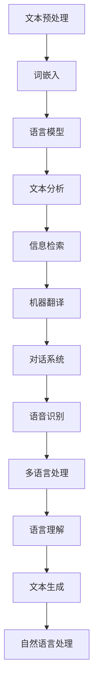
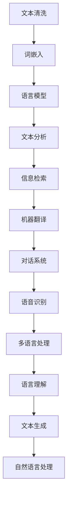
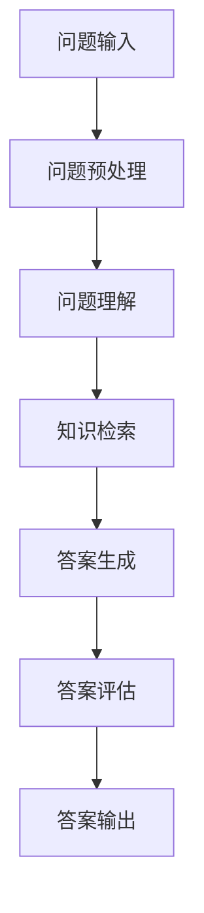
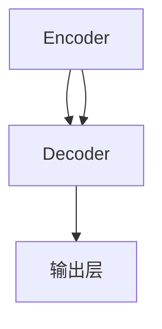
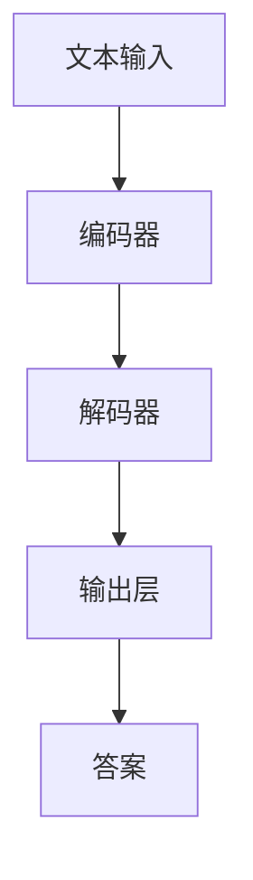
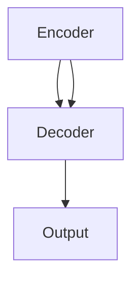
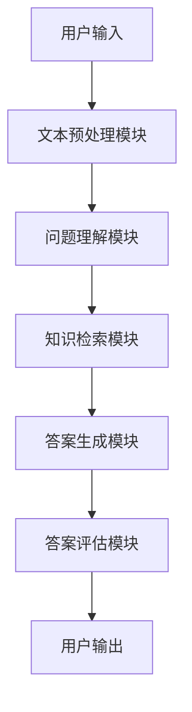
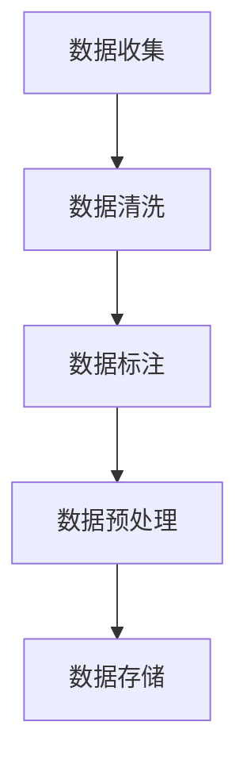

                 

### 引言

随着人工智能技术的飞速发展，自然语言处理（Natural Language Processing, NLP）逐渐成为人工智能领域的热点。在NLP的众多应用中，问答系统（Question Answering System）尤为重要，它通过自动回答用户提出的问题，极大地提升了信息检索和知识获取的效率。近年来，大规模预训练模型（Large Pre-trained Models）的崛起，为问答系统的性能提升带来了革命性的变化。本文将围绕大模型问答机器人的自然语言技术，深入探讨其核心概念、实现原理以及未来发展趋势。

文章的核心关键词包括：自然语言处理、问答系统、大规模预训练模型、编码器-解码器架构、注意力机制、文本预处理、词嵌入、语言模型、模型优化、系统设计、商业化路径、伦理与隐私。

本文将分为两部分进行阐述。第一部分将介绍自然语言处理与问答系统的基础知识，包括自然语言处理的基本概念、文本预处理方法、问答系统的定义与分类、大模型原理与应用。第二部分将重点讨论大模型问答系统的设计与实现，涵盖问答系统的需求分析、架构设计、数据集准备与处理、大模型训练与优化、系统实战以及未来发展趋势。通过本文的阅读，读者将全面了解大模型问答机器人的自然语言技术，掌握其核心原理和实现方法。

### 《大模型问答机器人的自然语言技术》目录大纲

**第一部分：自然语言处理与问答系统基础**

1. **第1章：自然语言处理概述**
   - 1.1 自然语言处理的基本概念
   - 1.2 自然语言处理的挑战
   - 1.3 自然语言处理的发展历史

2. **第2章：文本预处理**
   - 2.1 文本清洗
   - 2.2 词嵌入技术
   - 2.3 语言模型

3. **第3章：问答系统基础**
   - 3.1 问答系统的定义与分类
   - 3.2 开放式问答
   - 3.3 事实抽取与验证

4. **第4章：大模型原理与应用**
   - 4.1 大模型的概念
   - 4.2 大模型的架构
   - 4.3 大模型在问答中的应用

**第二部分：大模型问答系统的设计与实现**

5. **第5章：大模型问答系统设计**
   - 5.1 问答系统的需求分析
   - 5.2 问答系统架构设计
   - 5.3 数据集准备与处理

6. **第6章：大模型训练与优化**
   - 6.1 大模型训练流程
   - 6.2 模型优化技术
   - 6.3 模型压缩与加速

7. **第7章：大模型问答系统实战**
   - 7.1 实战一：构建一个简单的问答系统
   - 7.2 实战二：优化问答系统的性能
   - 7.3 实战三：构建一个智能客服系统

8. **第8章：大模型问答系统的未来发展趋势**
   - 8.1 大模型在NLP领域的未来发展
   - 8.2 大模型问答系统的商业化路径
   - 8.3 伦理与隐私问题

**附录**

- 附录A：常用工具与资源
  - A.1 开源框架与库
  - A.2 在线资源和社区
  - A.3 数据集介绍

通过上述目录结构，本文将逐步深入探讨大模型问答机器人的自然语言技术，帮助读者全面掌握相关领域的核心知识和应用技巧。

### 第一部分：自然语言处理与问答系统基础

#### 第1章：自然语言处理概述

**1.1 自然语言处理的基本概念**

自然语言处理（NLP）是人工智能领域的一个重要分支，主要研究如何使计算机能够理解、生成和处理人类自然语言。NLP的定义可以概括为：利用计算机技术和算法，对自然语言文本进行自动处理和分析，从而实现人机交互和信息检索等功能。

NLP的应用领域非常广泛，包括但不限于以下几个方面：

1. **文本分析**：对文本进行分类、情感分析、主题建模等，用于舆情监测、市场研究等。
2. **信息检索**：通过搜索算法和索引技术，从大量文本中快速准确地找到用户所需的信息。
3. **机器翻译**：将一种自然语言文本翻译成另一种自然语言，实现跨语言交流。
4. **对话系统**：包括聊天机器人、虚拟助手等，提供自动化的自然语言交互服务。
5. **语音识别**：将语音信号转换为文本，实现语音输入和语音输出。

**1.2 自然语言处理的挑战**

尽管NLP在许多方面取得了显著的进展，但仍面临诸多挑战：

1. **语言多样性**：自然语言具有高度的多样性和复杂性，包括不同语言、方言、口音等，这使得NLP系统需要具备处理多种语言的能力。
2. **语言理解的不确定性**：自然语言表达往往存在歧义和不确定性，如多义词、同音词等，这使得NLP系统需要准确理解用户的意图和上下文。
3. **数据稀缺**：高质量的NLP数据集往往难以获得，这限制了模型训练和优化的效果。
4. **跨语言处理**：不同语言之间的语法、语义和词汇差异，使得跨语言NLP任务复杂化。

**1.3 自然语言处理的发展历史**

自然语言处理的发展可以大致分为以下几个阶段：

1. **早期传统方法（1950s-1980s）**：这一阶段的NLP主要依赖于规则和手动编写的词典，如基于语法分析的句法解析、基于统计的词频统计等。然而，这些方法在处理复杂文本时效果有限。
   
2. **统计方法兴起（1990s）**：随着统计学习理论的发展，NLP开始采用统计模型，如隐马尔可夫模型（HMM）、条件随机场（CRF）等，这些方法在文本分类、命名实体识别等领域取得了较好的效果。

3. **机器学习方法应用（2000s-2010s）**：机器学习，尤其是深度学习，在NLP领域的应用逐渐增多，如卷积神经网络（CNN）、循环神经网络（RNN）等。这些方法通过自动学习大量文本数据中的特征，大大提高了NLP任务的性能。

4. **大规模预训练模型崛起（2010s-至今）**：以BERT、GPT、T5等为代表的大规模预训练模型，通过在大量未标注的文本上预训练，然后在特定任务上进行微调，取得了惊人的效果，推动了NLP的快速发展。

**核心概念与联系**

为了更好地理解自然语言处理的概念，我们可以通过以下Mermaid流程图来展示其基本组成部分和相互关系：



在这个流程图中，文本预处理是NLP的基础，它包括文本清洗、分词、词性标注等步骤，为后续的词嵌入、语言模型、文本分析等任务提供准备。每个环节都是NLP中不可或缺的部分，共同构成了一个完整的NLP系统。

**核心算法原理讲解**

自然语言处理中的核心算法主要包括词嵌入、语言模型、文本分类、序列标注等。下面，我们将使用伪代码对词嵌入和语言模型的基本原理进行详细阐述。

**词嵌入（Word Embedding）**

词嵌入是将词汇映射到高维向量空间的过程。一个简单的词嵌入模型可以使用以下伪代码表示：

```python
# 假设词汇表中有V个单词，每个单词映射到一个维度为d的向量
VOCAB_SIZE = 10000
EMBEDDING_DIM = 300

# 初始化词向量矩阵
word_vectors = np.random.rand(VOCAB_SIZE, EMBEDDING_DIM)

# 对输入文本进行分词
input_sentence = "I love to read books."
tokens = tokenize(input_sentence)

# 将分词后的文本转换为向量表示
sentence_vector = sum(word_vectors[token] for token in tokens) / len(tokens)
```

在这个伪代码中，`tokenize`函数用于将文本分割成单个单词或词组，`word_vectors`是一个包含所有单词向量的矩阵。通过计算每个单词向量的加权和，我们可以得到整个句子的向量表示。

**语言模型（Language Model）**

语言模型是NLP中用于预测下一个单词或词组的概率分布的模型。一个简单的语言模型可以使用以下伪代码表示：

```python
# 假设我们已经训练好了语言模型，其中P(word|context)表示在给定上下文context下word的概率

# 输入句子
input_sentence = "I love to read books."

# 预测下一个单词
context = input_sentence[-1]
next_word = predict_next_word(context)

# 输出预测结果
print("Next word:", next_word)
```

在这个伪代码中，`predict_next_word`函数根据当前上下文计算下一个单词的概率分布，并返回概率最高的单词。

通过这些核心算法，NLP系统能够更好地理解和处理自然语言，为问答系统等应用提供了强有力的支持。

#### 第2章：文本预处理

**2.1 文本清洗**

文本清洗是NLP过程中至关重要的一步，其目的是去除文本中的噪声，提高数据质量。文本清洗通常包括以下几个步骤：

1. **去除标点符号**：标点符号对于NLP任务没有太大帮助，因此可以将其去除。例如，使用正则表达式将标点替换为空格。
2. **去除停用词**：停用词是指那些在文本中出现频率很高，但通常不携带具体语义信息的词，如“的”、“是”、“了”等。去除停用词可以减少模型计算量，提高模型效果。
3. **词干提取**：词干提取是将不同形式的词语转换为其基本形式。例如，“playing”、“plays”、“played”都可以转换为“play”。
4. **大小写统一**：将文本中所有单词统一转换为小写，以消除大小写差异对模型的影响。

**2.2 词嵌入技术**

词嵌入是将词汇映射到高维向量空间的过程，其目的是通过向量表示捕捉词汇的语义信息。词嵌入技术可以分为基于统计的方法和基于神经网络的方法。

**基于统计的方法**

基于统计的词嵌入方法主要依赖于词频统计和共现关系。以下是一种简单的基于统计的词嵌入方法：

```python
# 假设文档集合为docs，单词集合为words，词频矩阵为tf_matrix

# 计算词频矩阵
tf_matrix = compute_tf_matrix(docs)

# 归一化词频矩阵
tf_idf_matrix = normalize(tf_matrix)

# 将词频矩阵转换为词向量矩阵
word_vectors = tf_idf_matrix.toarray()
```

在这个方法中，`compute_tf_matrix`函数用于计算文档的词频矩阵，`normalize`函数用于将词频矩阵转换为TF-IDF矩阵，从而实现词嵌入。

**基于神经网络的方法**

基于神经网络的方法，如Word2Vec、GloVe等，通过训练神经网络模型来学习词向量。以下是一种简单的基于神经网络的方法：

```python
# 假设已经定义了神经网络模型和训练数据

# 训练词向量模型
model = train_word2vec_model(train_data)

# 获取词向量
word_vectors = model.wv
```

在这个方法中，`train_word2vec_model`函数用于训练Word2Vec模型，`model.wv`用于获取训练好的词向量。

**2.3 语言模型**

语言模型是NLP中用于预测下一个单词或词组的概率分布的模型。一个简单的语言模型可以使用以下伪代码表示：

```python
# 假设我们已经训练好了语言模型，其中P(word|context)表示在给定上下文context下word的概率

# 输入句子
input_sentence = "I love to read books."

# 预测下一个单词
context = input_sentence[-1]
next_word = predict_next_word(context)

# 输出预测结果
print("Next word:", next_word)
```

在这个伪代码中，`predict_next_word`函数根据当前上下文计算下一个单词的概率分布，并返回概率最高的单词。

**语言模型的应用**

语言模型在NLP中有广泛的应用，包括：

1. **自动纠错**：通过预测下一个可能的单词，可以自动纠正输入文本中的错误。
2. **语音识别**：将语音信号转换为文本，语言模型可以用于预测下一个语音单元，从而实现语音识别。
3. **机器翻译**：语言模型可以用于预测源语言和目标语言之间的概率分布，从而实现自动翻译。

**核心概念与联系**

为了更好地理解文本预处理的概念，我们可以通过以下Mermaid流程图来展示其基本组成部分和相互关系：



在这个流程图中，文本清洗是NLP的基础，它包括文本清洗、分词、词性标注等步骤，为后续的词嵌入、语言模型、文本分析等任务提供准备。每个环节都是NLP中不可或缺的部分，共同构成了一个完整的NLP系统。

**核心算法原理讲解**

文本预处理中的核心算法主要包括词嵌入、语言模型、文本分类、序列标注等。下面，我们将使用伪代码对词嵌入和语言模型的基本原理进行详细阐述。

**词嵌入（Word Embedding）**

词嵌入是将词汇映射到高维向量空间的过程。一个简单的词嵌入模型可以使用以下伪代码表示：

```python
# 假设词汇表中有V个单词，每个单词映射到一个维度为d的向量
VOCAB_SIZE = 10000
EMBEDDING_DIM = 300

# 初始化词向量矩阵
word_vectors = np.random.rand(VOCAB_SIZE, EMBEDDING_DIM)

# 对输入文本进行分词
input_sentence = "I love to read books."
tokens = tokenize(input_sentence)

# 将分词后的文本转换为向量表示
sentence_vector = sum(word_vectors[token] for token in tokens) / len(tokens)
```

在这个伪代码中，`tokenize`函数用于将文本分割成单个单词或词组，`word_vectors`是一个包含所有单词向量的矩阵。通过计算每个单词向量的加权和，我们可以得到整个句子的向量表示。

**语言模型（Language Model）**

语言模型是NLP中用于预测下一个单词或词组的概率分布的模型。一个简单的语言模型可以使用以下伪代码表示：

```python
# 假设我们已经训练好了语言模型，其中P(word|context)表示在给定上下文context下word的概率

# 输入句子
input_sentence = "I love to read books."

# 预测下一个单词
context = input_sentence[-1]
next_word = predict_next_word(context)

# 输出预测结果
print("Next word:", next_word)
```

在这个伪代码中，`predict_next_word`函数根据当前上下文计算下一个单词的概率分布，并返回概率最高的单词。

通过这些核心算法，NLP系统能够更好地理解和处理自然语言，为问答系统等应用提供了强有力的支持。

#### 第3章：问答系统基础

**3.1 问答系统的定义与分类**

问答系统是一种基于自然语言处理技术，能够自动理解和回答用户提出的问题的计算机系统。问答系统的基本定义可以概括为：接收用户的自然语言问题，理解其语义，并在海量的知识库或数据源中搜索相关答案，最终以自然语言形式返回给用户。

根据不同的分类标准，问答系统可以划分为多种类型：

1. **基于关键词的问答系统**：这类系统主要通过分析用户提出的问题中的关键词，从数据库中检索相关答案。其优点是实现简单、响应速度快，但答案通常较为表面化，难以提供深度理解。

2. **基于事实的问答系统**：这类系统通过深度理解用户的自然语言问题，并在结构化的知识库或数据库中搜索精确答案。其优点是能够提供准确且详细的答案，但实现较为复杂，且对知识库的依赖较大。

3. **基于知识的问答系统**：这类系统通过自然语言理解和知识图谱等技术，将用户的自然语言问题转化为具体的知识查询，并在知识图谱中获取答案。其优点是能够提供高度个性化的答案，但构建和维护知识图谱需要大量的人力和时间投入。

4. **基于生成式的问答系统**：这类系统通过生成式模型（如序列到序列模型、转换器模型等），直接生成自然语言形式的答案。其优点是能够生成更加自然流畅的答案，但生成答案的质量受到模型质量和训练数据的影响。

**3.2 开放式问答**

开放式问答系统是一种能够在回答用户提出的问题时，不依赖于预设答案库的问答系统。这种系统通常需要具备较强的自然语言理解和推理能力，以便在广泛的知识领域中提供高质量的回答。

开放式问答系统的主要挑战包括：

1. **问题理解**：用户提出的问题往往具有高度的不确定性和模糊性，系统需要能够准确理解用户意图，识别问题的核心内容。

2. **知识检索**：开放式问答系统需要从海量的数据源中检索相关信息，并筛选出与问题高度相关的答案。

3. **答案生成**：系统需要能够将检索到的信息进行整合和推理，生成自然、流畅且准确的答案。

开放式问答系统的工作流程通常包括以下几个步骤：

1. **问题预处理**：对用户提出的问题进行清洗和分词，提取关键信息。

2. **问题理解**：通过自然语言理解和语义分析技术，将用户的问题转化为计算机可理解的形式。

3. **知识检索**：在知识库或数据库中检索与问题相关的信息。

4. **答案生成**：对检索到的信息进行整合和处理，生成自然语言形式的答案。

5. **答案评估**：对生成的答案进行评估，确保其准确性、相关性和自然性。

**3.3 事实抽取与验证**

事实抽取是问答系统中一个重要的环节，其目的是从非结构化的文本中提取出关键事实信息，为答案生成提供支持。事实抽取通常包括以下几个步骤：

1. **文本预处理**：对输入的文本进行分词、词性标注等预处理操作，以便更好地理解和分析文本。

2. **实体识别**：识别文本中的关键实体，如人名、地点、组织等。

3. **关系抽取**：识别实体之间的关系，如“张三出生在北京”、“苹果公司成立于1976年”等。

4. **事件抽取**：从文本中提取出事件信息，如“苹果公司上市”、“特斯拉推出新车型”等。

事实验证是对提取出的关键事实信息进行真实性验证的过程，以确保答案的准确性。事实验证通常包括以下几个步骤：

1. **事实检索**：在权威数据源或知识库中检索与提取出的事实相关的信息。

2. **事实比对**：将提取出的事实与检索到的信息进行比对，判断其是否一致。

3. **错误修正**：对不一致的事实进行修正，确保其准确性。

4. **结果反馈**：将验证结果反馈给用户，以提高问答系统的可信度。

**核心概念与联系**

为了更好地理解问答系统的概念，我们可以通过以下Mermaid流程图来展示其基本组成部分和相互关系：



在这个流程图中，问题输入是问答系统的起点，经过问题预处理、问题理解、知识检索、答案生成和答案评估等步骤，最终输出高质量的答案。每个步骤都是问答系统中不可或缺的部分，共同构成了一个完整的问答流程。

**核心算法原理讲解**

问答系统中的核心算法主要包括自然语言理解、知识图谱、文本生成等。下面，我们将使用伪代码对自然语言理解和知识图谱的基本原理进行详细阐述。

**自然语言理解（Natural Language Understanding）**

自然语言理解是问答系统的关键环节，其目的是将用户的自然语言问题转化为计算机可理解的形式。一个简单的自然语言理解模型可以使用以下伪代码表示：

```python
# 假设已经训练好了自然语言理解模型

# 输入问题
input_question = "什么是人工智能？"

# 分析问题
question_representation = analyze_question(input_question)

# 输出分析结果
print("Question representation:", question_representation)
```

在这个伪代码中，`analyze_question`函数用于对输入问题进行语义分析，提取关键信息，形成问题表示。

**知识图谱（Knowledge Graph）**

知识图谱是问答系统中的重要组件，用于存储和管理事实信息。一个简单的知识图谱模型可以使用以下伪代码表示：

```python
# 假设已经构建好了知识图谱

# 查询事实
query = "人工智能的应用领域有哪些？"
facts = query_knowledge_graph(query)

# 输出查询结果
print("Facts:", facts)
```

在这个伪代码中，`query_knowledge_graph`函数用于在知识图谱中查询与输入问题相关的事实信息。

通过自然语言理解和知识图谱等技术，问答系统能够更好地理解和回答用户的问题，为用户提供高质量的服务。

#### 第4章：大模型原理与应用

**4.1 大模型的概念**

大模型（Large Pre-trained Models）是指在训练过程中使用大量数据进行训练的深度学习模型，其规模通常远大于传统的模型。大模型的兴起主要得益于以下几个因素：

1. **数据量的增长**：互联网的普及和数据存储技术的进步，使得我们可以获取到海量的文本数据，为模型训练提供了丰富的资源。

2. **计算能力的提升**：随着硬件技术的不断发展，计算能力和存储容量得到了大幅提升，为训练大规模模型提供了硬件支持。

3. **深度学习算法的进步**：深度学习算法的优化和改进，使得大规模模型的训练变得更加高效和稳定。

大模型的主要特点包括：

1. **参数规模大**：大模型通常包含数亿甚至数十亿的参数，能够更好地捕捉文本数据的复杂结构。

2. **预训练**：大模型在训练之前先在大量未标注的数据上进行预训练，从而具备了较强的通用语言理解能力。

3. **多任务学习能力**：大模型通常具有多任务学习能力，可以在多个任务上进行微调和优化，提高模型的泛化能力。

**4.2 大模型的架构**

大模型的架构通常基于深度神经网络，包括编码器（Encoder）和解码器（Decoder）两部分。以下是一个典型的大模型架构：



**编码器（Encoder）**

编码器负责将输入的文本序列编码为固定长度的向量表示。编码器通常采用循环神经网络（RNN）或变换器（Transformer）结构。以下是一个简单的编码器结构：

```python
# 假设使用Transformer架构的编码器

# 输入文本序列
input_sequence = ["I", "am", "a", "large", "model"]

# 编码器模型
encoder = TransformerEncoder(vocab_size, embedding_dim, hidden_dim)

# 编码文本序列
encoded_sequence = encoder.encode(input_sequence)
```

在这个结构中，`TransformerEncoder`是一个编码器模型，`encode`函数用于将输入的文本序列编码为向量表示。

**解码器（Decoder）**

解码器负责将编码器的输出序列解码为输出的文本序列。解码器通常也采用变换器（Transformer）结构。以下是一个简单的解码器结构：

```python
# 假设使用Transformer架构的解码器

# 输入编码后的序列
encoded_sequence = np.random.rand(batch_size, sequence_length, hidden_dim)

# 解码器模型
decoder = TransformerDecoder(vocab_size, embedding_dim, hidden_dim)

# 解码输出序列
decoded_sequence = decoder.decode(encoded_sequence)
```

在这个结构中，`TransformerDecoder`是一个解码器模型，`decode`函数用于将编码后的序列解码为文本序列。

**输出层（Output Layer）**

输出层负责将解码器的输出序列转换为最终的输出结果。输出层通常采用softmax函数进行概率分布计算。以下是一个简单的输出层结构：

```python
# 输出层模型
output_layer = SoftmaxLayer(vocab_size)

# 输出概率分布
output_probabilities = output_layer.apply(decoded_sequence)
```

在这个结构中，`SoftmaxLayer`是一个输出层模型，`apply`函数用于将解码器的输出序列转换为概率分布。

**4.3 大模型在问答中的应用**

大模型在问答系统中的应用主要体现在以下几个方面：

1. **文本理解**：大模型通过预训练具备了较强的文本理解能力，能够在问答系统中准确理解用户提出的问题。

2. **知识检索**：大模型可以通过在预训练过程中学习的知识进行高效的知识检索，快速找到与问题相关的答案。

3. **答案生成**：大模型可以通过生成式模型（如GPT）直接生成自然语言形式的答案，提高问答系统的回答质量。

4. **多任务学习**：大模型可以通过多任务学习机制，在一个模型中同时处理多个问答任务，提高模型的效率和效果。

以下是一个简单的大模型问答系统的实现示例：

```python
# 加载预训练的大模型
model = load_pretrained_model("gpt")

# 输入问题
input_question = "什么是自然语言处理？"

# 预处理问题
processed_question = preprocess_question(input_question)

# 生成答案
answer = model.generate_answer(processed_question)

# 输出答案
print("Answer:", answer)
```

在这个示例中，`load_pretrained_model`函数用于加载预训练的大模型，`preprocess_question`函数用于预处理输入问题，`generate_answer`函数用于生成答案。

**核心概念与联系**

为了更好地理解大模型的概念，我们可以通过以下Mermaid流程图来展示其基本组成部分和相互关系：



在这个流程图中，文本输入经过编码器编码、解码器解码和输出层生成，最终输出答案。每个部分都是大模型问答系统中不可或缺的部分，共同构成了一个完整的问答流程。

**核心算法原理讲解**

大模型中的核心算法主要包括编码器-解码器架构、注意力机制、预训练等。以下是对这些算法的详细讲解。

**编码器-解码器架构（Encoder-Decoder Architecture）**

编码器-解码器架构是一种用于序列转换的神经网络模型，广泛应用于机器翻译、问答系统等任务。其基本原理是将输入序列编码为一个固定长度的向量表示，然后通过解码器将这个向量表示解码为输出序列。以下是一个简单的编码器-解码器架构：



在这个架构中，编码器（Encoder）负责将输入序列编码为一个固定长度的向量表示，解码器（Decoder）负责将这个向量表示解码为输出序列。编码器和解码器通常采用变换器（Transformer）架构，具有多头注意力机制。

**注意力机制（Attention Mechanism）**

注意力机制是一种用于计算输入序列和输出序列之间关系的算法，可以有效地提高序列模型的性能。在编码器-解码器架构中，注意力机制用于计算编码器输出的上下文向量，并将其作为解码器的输入。以下是一个简单的注意力机制：

```python
# 假设使用多头注意力机制

# 输入编码后的序列
encoded_sequence = np.random.rand(batch_size, sequence_length, hidden_dim)

# 注意力权重
attention_weights = compute_attention_weights(encoded_sequence, hidden_size)

# 上下文向量
context_vector = sum(attention_weights[i] * encoded_sequence[i] for i in range(sequence_length))
```

在这个算法中，`compute_attention_weights`函数用于计算注意力权重，`context_vector`是一个包含上下文信息的向量，用于作为解码器的输入。

**预训练（Pre-training）**

预训练是指在大规模未标注数据上进行模型训练的过程，旨在使模型具备通用语言理解能力。预训练通常包括以下步骤：

1. **数据准备**：收集大量未标注的文本数据，如网页、书籍、新闻等。

2. **文本预处理**：对文本进行清洗、分词、词性标注等预处理操作。

3. **模型训练**：使用预处理的文本数据训练模型，使其学习文本的语义信息。

4. **模型优化**：通过在特定任务上进行微调，优化模型在特定任务上的性能。

以下是一个简单的预训练算法：

```python
# 假设使用BERT模型进行预训练

# 加载预训练模型
model = load_bert_model()

# 预处理文本数据
preprocessed_data = preprocess_data(text_data)

# 训练模型
model.fit(preprocessed_data)

# 优化模型
model.optimize()
```

在这个算法中，`load_bert_model`函数用于加载预训练的BERT模型，`preprocess_data`函数用于预处理文本数据，`fit`函数用于训练模型，`optimize`函数用于优化模型。

通过编码器-解码器架构、注意力机制和预训练等技术，大模型问答系统能够更好地理解和回答用户的问题，为用户提供高质量的服务。

### 第二部分：大模型问答系统的设计与实现

#### 第5章：大模型问答系统设计

**5.1 问答系统的需求分析**

在设计大模型问答系统之前，进行需求分析是至关重要的一步。需求分析的主要目的是明确系统需要实现的功能和性能要求，为后续的设计和实现提供指导。以下是问答系统需求分析的主要步骤：

1. **用户需求分析**：了解用户对问答系统的期望和需求，包括问题的类型、回答的质量、响应速度等。

2. **系统功能需求**：明确问答系统的功能需求，包括问题输入、问题理解、知识检索、答案生成、答案评估等。

3. **性能需求**：确定问答系统的性能指标，如响应时间、准确率、召回率等。

4. **数据需求**：分析问答系统所需的数据类型和来源，包括文本数据、知识库、问答对等。

5. **安全与隐私需求**：确保问答系统的安全性，包括用户数据的加密存储、访问控制等。

**5.2 问答系统架构设计**

问答系统的架构设计是系统实现的基础，一个良好的架构能够提高系统的可扩展性、可维护性和性能。以下是问答系统的架构设计步骤：

1. **系统模块划分**：将问答系统划分为多个模块，如文本预处理模块、问题理解模块、知识检索模块、答案生成模块、答案评估模块等。

2. **模块间关系设计**：明确各个模块之间的数据流和控制流关系，设计模块间的接口和通信机制。

3. **系统部署设计**：根据系统的需求和性能要求，选择合适的硬件和软件环境，设计系统的部署方案。

以下是问答系统的一个简化架构设计：



在这个架构设计中，用户输入经过文本预处理模块处理，然后由问题理解模块解析用户的问题。知识检索模块从知识库中检索相关答案，答案生成模块生成最终的答案，最后由答案评估模块对答案进行评估。用户输出是整个问答系统的终点。

**5.3 数据集准备与处理**

数据集是问答系统训练和评估的基础，其质量直接影响系统的性能。以下是数据集准备和处理的主要步骤：

1. **数据收集**：收集与问答系统相关的数据，包括问题、答案、知识库等。

2. **数据清洗**：对收集到的数据进行清洗，去除噪声和错误数据，确保数据的质量。

3. **数据标注**：对问题、答案和知识库进行标注，为后续的模型训练和评估提供标注数据。

4. **数据预处理**：对标注后的数据进行预处理，包括文本分词、词性标注、实体识别等。

5. **数据存储**：将预处理后的数据存储到数据库或文件系统中，便于后续的模型训练和系统部署。

以下是一个简单的大模型问答系统的数据预处理流程：



在这个流程中，首先收集数据，然后进行清洗和标注，最后进行预处理并存储到数据库中。

**核心概念与联系**

为了更好地理解大模型问答系统的设计，我们可以通过以下Mermaid流程图来展示其基本组成部分和相互关系：


在这个流程图中，用户输入是问答系统的起点，经过文本预处理、问题理解、知识检索、答案生成和答案评估等步骤，最终输出高质量的答案。每个步骤都是大模型问答系统中不可或缺的部分，共同构成了一个完整的问答流程。

**核心算法原理讲解**

大模型问答系统中的核心算法主要包括编码器-解码器架构、注意力机制、预训练等。以下是这些算法的详细讲解。

**编码器-解码器架构（Encoder-Decoder Architecture）**

编码器-解码器架构是一种用于序列转换的神经网络模型，广泛应用于机器翻译、问答系统等任务。其基本原理是将输入序列编码为一个固定长度的向量表示，然后通过解码器将这个向量表示解码为输出序列。以下是一个简单的编码器-解码器架构：


在这个架构中，编码器（Encoder）负责将输入序列编码为一个固定长度的向量表示，解码器（Decoder）负责将这个向量表示解码为输出序列。编码器和解码器通常采用变换器（Transformer）架构，具有多头注意力机制。

**注意力机制（Attention Mechanism）**

注意力机制是一种用于计算输入序列和输出序列之间关系的算法，可以有效地提高序列模型的性能。在编码器-解码器架构中，注意力机制用于计算编码器输出的上下文向量，并将其作为解码器的输入。以下是一个简单的注意力机制：

```python
# 假设使用多头注意力机制

# 输入编码后的序列
encoded_sequence = np.random.rand(batch_size, sequence_length, hidden_dim)

# 注意力权重
attention_weights = compute_attention_weights(encoded_sequence, hidden_size)

# 上下文向量
context_vector = sum(attention_weights[i] * encoded_sequence[i] for i in range(sequence_length))
```

在这个算法中，`compute_attention_weights`函数用于计算注意力权重，`context_vector`是一个包含上下文信息的向量，用于作为解码器的输入。

**预训练（Pre-training）**

预训练是指在大规模未标注数据上进行模型训练的过程，旨在使模型具备通用语言理解能力。预训练通常包括以下步骤：

1. **数据准备**：收集大量未标注的文本数据，如网页、书籍、新闻等。

2. **文本预处理**：对文本进行清洗、分词、词性标注等预处理操作。

3. **模型训练**：使用预处理的文本数据训练模型，使其学习文本的语义信息。

4. **模型优化**：通过在特定任务上进行微调，优化模型在特定任务上的性能。

以下是一个简单的预训练算法：

```python
# 假设使用BERT模型进行预训练

# 加载预训练模型
model = load_bert_model()

# 预处理文本数据
preprocessed_data = preprocess_data(text_data)

# 训练模型
model.fit(preprocessed_data)

# 优化模型
model.optimize()
```

在这个算法中，`load_bert_model`函数用于加载预训练的BERT模型，`preprocess_data`函数用于预处理文本数据，`fit`函数用于训练模型，`optimize`函数用于优化模型。

通过编码器-解码器架构、注意力机制和预训练等技术，大模型问答系统能够更好地理解和回答用户的问题，为用户提供高质量的服务。

#### 第6章：大模型训练与优化

**6.1 大模型训练流程**

大模型的训练过程涉及多个步骤，包括数据准备、模型训练、模型评估等。以下是一个典型的大模型训练流程：

1. **数据准备**：收集并清洗大量未标注的数据，如网页、书籍、新闻等。对文本进行预处理，包括分词、词性标注等。

2. **数据预处理**：将预处理后的数据转换为模型可接受的格式，如序列编码、词嵌入等。通常，我们会使用预训练的词嵌入模型（如GloVe或Word2Vec）来初始化词嵌入。

3. **模型初始化**：初始化大模型的结构和参数。对于变换器架构，通常包括编码器、解码器、注意力机制等。参数的初始化可以采用随机初始化或预训练模型的参数。

4. **模型训练**：使用训练数据对模型进行训练。训练过程中，模型会通过梯度下降等优化算法不断调整参数，以最小化损失函数。训练过程中，可以使用批量训练、学习率调整等技术来提高训练效果。

5. **模型评估**：在训练过程中，定期使用验证集对模型进行评估。评估指标包括准确率、召回率、F1分数等。通过评估结果，可以调整模型参数和学习策略，优化模型性能。

6. **模型调优**：在训练完成后，使用测试集对模型进行最终评估。根据评估结果，可以对模型进行调优，如调整学习率、批量大小等。

以下是一个简单的模型训练伪代码：

```python
# 加载预训练模型
model = load_pretrained_model()

# 准备训练数据
train_data = preprocess_data(train_dataset)

# 模型训练
model.fit(train_data, epochs=10, batch_size=64)

# 模型评估
evaluate(model, validation_data)
```

在这个伪代码中，`load_pretrained_model`函数用于加载预训练模型，`preprocess_data`函数用于预处理训练数据，`fit`函数用于训练模型，`evaluate`函数用于评估模型性能。

**6.2 模型优化技术**

为了提高大模型的性能，需要采用一系列优化技术。以下是一些常用的模型优化技术：

1. **学习率调整**：学习率是模型训练中的一个关键参数。适当的调整学习率可以加快收敛速度，提高模型性能。常用的学习率调整策略包括：
   - **固定学习率**：在训练过程中保持学习率不变。
   - **学习率衰减**：随着训练的进行，逐渐减小学习率，以防止模型在训练后期过拟合。
   - **自适应学习率**：使用自适应学习率优化器（如Adam、AdamW），根据梯度信息动态调整学习率。

2. **批量大小调整**：批量大小是指每次训练使用的样本数量。适当的批量大小可以提高训练效率，减少过拟合风险。常用的批量大小调整策略包括：
   - **固定批量大小**：在整个训练过程中保持批量大小不变。
   - **动态批量大小**：根据训练阶段或验证集性能动态调整批量大小。

3. **数据增强**：通过增加数据多样性来提高模型性能。常见的数据增强技术包括：
   - **文本数据增强**：通过随机替换、删除、添加单词等操作生成新的文本数据。
   - **图像数据增强**：通过旋转、缩放、裁剪、对比度调整等操作生成新的图像数据。
   - **混合数据增强**：将文本和图像数据进行组合，生成新的混合数据。

4. **正则化**：通过添加额外的惩罚项来减少模型过拟合。常见的正则化技术包括：
   - **L1正则化**：在损失函数中添加L1范数惩罚项。
   - **L2正则化**：在损失函数中添加L2范数惩罚项。
   - **Dropout**：在训练过程中随机丢弃一部分神经元，以减少模型对特定特征的依赖。

5. **早期停止**：在训练过程中，当验证集性能不再提高时，提前停止训练，以防止过拟合。

6. **模型压缩**：通过减少模型参数数量和计算复杂度，提高模型部署效率和运行速度。常见的模型压缩技术包括：
   - **剪枝**：通过移除模型中不重要的参数来减少模型规模。
   - **量化**：将模型的浮点数参数转换为低比特宽度的整数表示。
   - **知识蒸馏**：使用一个小型的教师模型来训练一个较大的学生模型，以共享知识。

**6.3 模型压缩与加速**

在部署大模型时，模型压缩与加速是重要的技术手段，以适应不同的硬件资源和应用场景。以下是一些常用的模型压缩与加速技术：

1. **量化**：将模型的浮点数参数转换为低比特宽度的整数表示，以减少模型大小和计算量。常用的量化方法包括：
   - **全量化**：将所有参数都量化为整数。
   - **部分量化**：只对部分参数进行量化，通常选择对计算量较大的参数进行量化。

2. **剪枝**：通过移除模型中不重要的参数和神经元来减少模型规模。剪枝方法包括：
   - **结构剪枝**：直接移除模型中的部分神经元和连接。
   - **权重剪枝**：移除权重较小的参数，保留重要的权重。

3. **深度简化**：通过减少模型中的层数或神经元数量来简化模型。深度简化方法包括：
   - **层简化**：删除模型中的某些层。
   - **神经元简化**：在层内减少神经元数量。

4. **硬件加速**：利用特定的硬件资源（如GPU、TPU）来加速模型计算。硬件加速技术包括：
   - **GPU加速**：使用GPU进行模型训练和推理。
   - **TPU加速**：使用谷歌的TPU硬件进行模型推理。

5. **模型融合**：将多个小模型融合成一个大型模型，以共享计算资源和降低计算复杂度。模型融合方法包括：
   - **模型并行**：将模型的不同部分分布在多个硬件上并行计算。
   - **模型压缩**：将多个小模型压缩为一个大型模型。

通过模型压缩与加速技术，大模型可以在不同的硬件和资源限制下高效运行，为实际应用提供更好的性能和用户体验。

#### 第7章：大模型问答系统实战

**7.1 实战一：构建一个简单的问答系统**

在这个实战中，我们将使用Python和Hugging Face的Transformers库构建一个简单的问答系统。这个过程将涵盖环境搭建、模型训练和系统部署。

**1. 环境搭建**

首先，我们需要安装必要的依赖库：

```bash
pip install transformers torch
```

**2. 模型训练**

接下来，我们将使用预训练的BERT模型来训练问答系统。以下是一个简单的训练脚本：

```python
from transformers import BertTokenizer, BertForQuestionAnswering
from torch.utils.data import DataLoader
from transformers import AdamW

# 加载预训练的BERT模型和分词器
tokenizer = BertTokenizer.from_pretrained('bert-base-uncased')
model = BertForQuestionAnswering.from_pretrained('bert-base-uncased')

# 准备数据集
train_dataset = load_dataset('squad')

# 数据预处理
def preprocess_data(dataset):
    inputs = tokenizer.encode_plus(
        dataset['question'], dataset['context'], add_special_tokens=True, max_length=512, padding='max_length', truncation=True
    )
    return {'input_ids': inputs['input_ids'], 'attention_mask': inputs['attention_mask']}

# 创建数据加载器
train_loader = DataLoader(train_dataset, batch_size=8, shuffle=True)

# 定义优化器
optimizer = AdamW(model.parameters(), lr=1e-5)

# 训练模型
for epoch in range(3):
    model.train()
    for batch in train_loader:
        inputs = {'input_ids': batch['input_ids'], 'attention_mask': batch['attention_mask']}
        outputs = model(**inputs)
        loss = outputs.loss
        loss.backward()
        optimizer.step()
        optimizer.zero_grad()
```

在这个脚本中，我们加载了预训练的BERT模型和分词器，然后准备了一个简单的数据集。数据预处理函数将问题和对应用程序送入BERT模型进行编码。接着，我们创建了一个数据加载器，并定义了AdamW优化器来训练模型。

**3. 系统部署**

训练完成后，我们可以部署问答系统，用于实际应用。以下是一个简单的部署脚本：

```python
from transformers import BertForQuestionAnswering
import torch

# 加载训练好的模型
model = BertForQuestionAnswering.from_pretrained('path/to/trained/model')

# 将模型设置为评估模式
model.eval()

# 预测函数
def predict_question(question, context):
    inputs = tokenizer.encode_plus(question, context, add_special_tokens=True, max_length=512, padding='max_length', truncation=True)
    with torch.no_grad():
        outputs = model(**inputs)
    start_logits, end_logits = outputs.start_logits, outputs.end_logits
    start_idx = torch.argmax(start_logits).item()
    end_idx = torch.argmax(end_logits).item()
    answer = context[start_idx:end_idx+1].decode('utf-8')
    return answer

# 测试问答系统
question = "什么是自然语言处理？"
context = "自然语言处理是人工智能的一个分支，它涉及计算机和人类语言之间的交互。"
answer = predict_question(question, context)
print(answer)
```

在这个脚本中，我们加载了训练好的模型，并设置为评估模式。预测函数通过BERT模型对问题进行编码，并使用注意力机制找到答案的位置。最后，我们测试了问答系统的表现，生成了答案。

**7.2 实战二：优化问答系统的性能**

为了提高问答系统的性能，我们可以采用多种优化技术，包括调整学习率、批量大小、数据增强等。以下是一个简单的优化脚本：

```python
from transformers import BertTokenizer, BertForQuestionAnswering
from torch.utils.data import DataLoader
from transformers import AdamW
from torch.optim.lr_scheduler import StepLR

# 加载预训练的BERT模型和分词器
tokenizer = BertTokenizer.from_pretrained('bert-base-uncased')
model = BertForQuestionAnswering.from_pretrained('bert-base-uncased')

# 准备数据集
train_dataset = load_dataset('squad')

# 数据预处理
def preprocess_data(dataset):
    inputs = tokenizer.encode_plus(
        dataset['question'], dataset['context'], add_special_tokens=True, max_length=512, padding='max_length', truncation=True
    )
    return {'input_ids': inputs['input_ids'], 'attention_mask': inputs['attention_mask']}

# 创建数据加载器
train_loader = DataLoader(train_dataset, batch_size=16, shuffle=True)

# 定义优化器
optimizer = AdamW(model.parameters(), lr=3e-5)

# 学习率调度器
scheduler = StepLR(optimizer, step_size=1, gamma=0.95)

# 训练模型
for epoch in range(5):
    model.train()
    for batch in train_loader:
        inputs = {'input_ids': batch['input_ids'], 'attention_mask': batch['attention_mask']}
        outputs = model(**inputs)
        loss = outputs.loss
        loss.backward()
        optimizer.step()
        optimizer.zero_grad()
    scheduler.step()
```

在这个脚本中，我们使用了StepLR调度器来调整学习率，并增加了批量大小以减少训练时间。学习率调度器在每个训练阶段调整学习率，以防止模型过拟合。通过这些优化技术，我们可以提高问答系统的性能。

**7.3 实战三：构建一个智能客服系统**

在这个实战中，我们将使用大模型问答系统构建一个智能客服系统，用于处理用户咨询。以下是一个简单的实现：

**1. 系统设计**

智能客服系统包括以下几个模块：

- **前端**：用于接收用户输入，展示问题和答案。
- **后端**：处理用户输入，调用问答系统，生成答案。
- **数据库**：存储问题和答案，用于训练和评估模型。

**2. 系统实现**

以下是一个简单的智能客服系统实现：

```python
# 前端实现（使用Flask框架）
from flask import Flask, request, jsonify

app = Flask(__name__)

@app.route('/ask', methods=['POST'])
def ask_question():
    data = request.json
    question = data['question']
    context = data['context']
    answer = predict_question(question, context)
    return jsonify({'answer': answer})

if __name__ == '__main__':
    app.run(debug=True)
```

在这个实现中，我们使用Flask框架创建了一个简单的Web服务，用于接收用户输入和返回答案。

**3. 部署**

部署智能客服系统时，我们需要确保后端问答系统和前端Web服务正常运行。以下是部署步骤：

- 启动后端问答系统。
- 启动前端Web服务。
- 通过浏览器或其他客户端访问智能客服系统。

通过这个实战，我们可以构建一个基本的智能客服系统，为用户提供高效的问答服务。

### 第8章：大模型问答系统的未来发展趋势

**8.1 大模型在NLP领域的未来发展**

大模型在自然语言处理（NLP）领域的未来发展潜力巨大，将推动多个子领域的发展。以下是几个可能的发展方向：

1. **更高效的模型**：随着硬件技术的进步，如量子计算、分布式计算和TPU等，大模型将变得更加高效，能够处理更复杂的任务。

2. **多模态处理**：未来的大模型将能够处理多种类型的数据，如文本、图像、声音和视频，实现跨模态的理解和生成。

3. **少样本学习**：减少对大规模标注数据的依赖，实现少样本学习，使模型在小数据集上也能表现出良好的性能。

4. **动态模型**：大模型将变得更加动态，能够实时更新和适应新的数据，提供更个性化的服务。

5. **跨语言处理**：未来的大模型将能够更好地处理多种语言，实现无缝的跨语言理解和生成。

**8.2 大模型问答系统的商业化路径**

大模型问答系统的商业化路径多样化，以下是几个可能的商业模式：

1. **SaaS服务**：提供基于云的问答系统服务，客户按需付费，适用于客户服务、知识库管理等场景。

2. **API接口**：开发API接口，允许第三方系统集成和使用问答系统，适用于企业内部应用和第三方服务。

3. **定制化解决方案**：为特定行业或企业定制开发问答系统，提供个性化的解决方案。

4. **数据服务**：利用问答系统生成的数据，提供数据分析、报告生成等增值服务。

**8.3 伦理与隐私问题**

随着大模型问答系统的广泛应用，伦理和隐私问题日益突出。以下是几个需要关注的问题：

1. **数据隐私**：确保用户数据的安全性，防止数据泄露和滥用。

2. **透明度**：提高模型决策的透明度，使用户能够理解模型的推理过程。

3. **公平性**：确保模型在处理不同群体时保持公平，避免歧视和偏见。

4. **责任归属**：明确模型决策的责任归属，确保在出现错误时能够追溯责任。

通过关注这些问题，可以确保大模型问答系统的可持续发展，并在商业和社会层面取得成功。

### 附录

#### 附录A：常用工具与资源

**A.1 开源框架与库**

1. **Hugging Face Transformers**：一个用于自然语言处理的Python库，提供了预训练模型、数据集和工具。

2. **TensorFlow**：谷歌开发的深度学习框架，适用于大规模模型的训练和推理。

3. **PyTorch**：Facebook开发的深度学习框架，以其灵活性和动态计算图著称。

4. **spaCy**：一个用于快速自然语言处理的库，提供了高质量的词嵌入、句法分析等功能。

**A.2 在线资源和社区**

1. **斯坦福大学NLP组**：提供丰富的NLP课程、教材和资源。

2. **arXiv**：一个开放获取的学术论文预印本库，包含大量NLP领域的最新研究。

3. **Kaggle**：一个数据科学竞赛平台，提供大量NLP相关数据集和问题。

**A.3 数据集介绍**

1. **Common Crawl**：一个包含大量网页文本的数据集，适用于预训练模型。

2. **GLUE**：一个包含多种NLP任务的基准数据集，用于评估模型性能。

3. **SQuAD**：一个问答数据集，用于训练和评估问答系统。

通过使用这些工具和资源，可以更有效地进行自然语言处理研究和应用开发。

