                 

# 大规模语言模型从理论到实践：参数服务器架构

## 关键词
- 大规模语言模型
- Transformer架构
- 参数服务器
- 分布式训练
- 模型优化

## 摘要
本文将探讨大规模语言模型的背景、核心技术、架构实现及其在实战应用中的表现。特别关注大规模语言模型的参数服务器架构，解释其工作原理、优势以及如何进行分布式训练和优化。通过实际案例展示参数服务器架构的应用，为读者提供理论与实践相结合的深入理解。

## 第一部分：大规模语言模型概述

### 第1章：大规模语言模型的定义与背景

#### 1.1 大规模语言模型的定义

大规模语言模型是一种基于深度学习的自然语言处理技术，其核心在于使用海量参数对自然语言进行建模，以实现文本生成、理解、翻译等任务。这些模型通常拥有数十亿至数万亿个参数，能够捕捉语言中复杂的语法、语义和上下文信息。

#### 1.2 大规模语言模型的发展背景

随着互联网的快速发展，自然语言处理（NLP）的应用场景日益广泛，如搜索引擎、智能助手、文本生成、机器翻译等。这些应用对模型的性能提出了更高的要求。同时，计算能力的提升，特别是GPU、TPU等高性能计算设备的出现，使得大规模模型的训练成为可能。

### 第2章：大规模语言模型的核心技术

#### 2.1 词嵌入与语言表示

词嵌入是将词汇映射到低维向量空间的过程，使得语义相似的词在向量空间中靠近。语言表示则使用神经网络将更高层次的语言结构（如句子、段落）映射到向量空间。

#### 2.2 预训练与微调

预训练是指在大规模语料库上进行无监督训练，使模型能够学习到语言的通用特征。微调则是在特定任务上使用有监督数据进行训练，使模型适应特定任务的需求。

### 第3章：大规模语言模型的架构与实现

#### 3.1 Transformer架构

Transformer模型是一种基于自注意力机制的深度学习模型，能够捕捉长距离依赖关系。其架构包含多头注意力、前馈神经网络等组件。

#### 3.2 参数服务器架构

参数服务器是一种分布式存储和更新模型参数的架构，特别适合大规模模型的训练。它通过将模型参数分片存储在多个服务器上，实现高效的数据并行和计算并行。

## 第二部分：大规模语言模型的实战应用

### 第4章：大规模语言模型在文本生成中的应用

#### 4.1 文本生成的基础原理

文本生成模型包括生成式模型和变分自编码器（VAE）等，通过学习语言数据的高层次分布，生成新的文本内容。

#### 4.2 文本生成的应用案例

生成新闻文章和对话系统是大规模语言模型在文本生成领域的两个重要应用案例。通过这些应用，模型能够生成高质量、符合语法和语义规则的文本内容。

### 第5章：大规模语言模型在文本理解中的应用

#### 5.1 文本理解的基础原理

文本理解模型包括语义角色标注、情感分析等，通过深度学习技术，使模型能够理解文本的语义信息。

#### 5.2 文本理解的实战案例

语义角色标注和文本情感分析是大规模语言模型在文本理解领域的两个重要应用。这些应用展示了模型在处理复杂文本任务时的能力。

### 第6章：大规模语言模型在跨模态学习中的应用

#### 6.1 跨模态学习的基础原理

跨模态学习是指将不同类型的数据（如文本、图像等）进行联合建模，实现跨模态交互。

#### 6.2 跨模态学习的实战案例

视频理解和图像文本生成是大规模语言模型在跨模态学习领域的两个重要应用案例。这些应用展示了模型在处理多媒体数据时的强大能力。

## 第三部分：大规模语言模型的高级应用

### 第7章：大规模语言模型在自然语言推理中的应用

#### 7.1 自然语言推理的基础原理

自然语言推理模型包括关系提取、文本蕴含等，通过深度学习技术，使模型能够推理出文本之间的逻辑关系。

#### 7.2 自然语言推理的应用案例

关系提取和文本蕴含是大规模语言模型在自然语言推理领域的两个重要应用案例。这些应用展示了模型在处理逻辑推理任务时的能力。

### 第8章：大规模语言模型在生成对抗网络（GAN）中的应用

#### 8.1 生成对抗网络（GAN）的基础原理

生成对抗网络（GAN）是一种通过生成器和判别器相互对抗来训练生成模型的方法。其基本结构包括生成器、判别器和对抗损失函数。

#### 8.2 GAN在大规模语言模型中的应用

文本生成GAN和图像文本GAN是大规模语言模型在GAN领域的两个重要应用案例。这些应用展示了模型在生成高质量文本和数据配对时的能力。

### 第9章：大规模语言模型在多语言处理中的应用

#### 9.1 多语言处理的基础原理

多语言处理是指使用同一模型同时处理多种语言的任务，如机器翻译和跨语言文本生成。

#### 9.2 多语言处理的实战案例

机器翻译和跨语言文本生成是大规模语言模型在多语言处理领域的两个重要应用案例。这些应用展示了模型在处理跨语言任务时的能力。

### 第10章：大规模语言模型的未来发展趋势

#### 10.1 大规模语言模型的发展趋势

随着计算能力的提升，大规模语言模型的模型规模将不断增大。同时，其在更多领域的应用也将得到拓展。

#### 10.2 大规模语言模型的挑战与展望

如何在大规模数据处理中保护用户隐私，以及如何提高模型的鲁棒性，是大规模语言模型面临的两个主要挑战。然而，随着技术的进步，这些挑战有望得到解决。

## 附录

### 附录A：大规模语言模型开发工具与资源

本文将对主流深度学习框架、大规模语言模型相关论文和资料进行介绍，帮助读者更好地理解大规模语言模型。

### 附录B：大规模语言模型实现示例

本文将提供一个大规模语言模型实现的示例，包括数据预处理、模型配置、训练过程和模型部署等步骤。

## 作者

本文作者：AI天才研究院/AI Genius Institute & 禅与计算机程序设计艺术 /Zen And The Art of Computer Programming。

[文章标题]

### 大规模语言模型从理论到实践：参数服务器架构

#### 关键词
- 大规模语言模型
- Transformer架构
- 参数服务器
- 分布式训练
- 模型优化

#### 摘要
本文将深入探讨大规模语言模型的背景、核心技术、架构实现及其在实战应用中的表现。重点分析参数服务器架构在大规模语言模型训练中的应用，详细解释其工作原理、优势以及分布式训练和优化的技术细节。通过实际案例展示参数服务器架构的应用，为读者提供理论与实践相结合的深入理解。

## 第一部分：大规模语言模型概述

### 第1章：大规模语言模型的定义与背景

#### 1.1 大规模语言模型的定义

大规模语言模型是一种基于深度学习的自然语言处理技术，它使用数十亿到数万亿个参数对自然语言进行建模。这些模型可以捕捉语言中的复杂结构，如语法、语义和上下文，从而实现文本生成、理解、翻译等任务。大规模语言模型的核心在于其参数数量庞大，这使得它们能够学习到语言的深层特征，从而在许多自然语言处理任务中表现出色。

#### 1.2 大规模语言模型的发展背景

随着互联网的普及和大数据技术的发展，自然语言处理（NLP）的应用场景变得更加丰富。从搜索引擎优化到智能客服，从机器翻译到文本生成，NLP技术正在改变人们与机器的交互方式。然而，传统的NLP方法往往需要大量的手工特征工程，且效果有限。为了解决这一问题，研究人员开始探索使用深度学习技术，特别是大规模语言模型。

计算能力的提升为大规模语言模型的训练提供了可能。早期，CPU是主要的计算资源，但随着GPU的出现，特别是专为深度学习设计的TPU，计算能力得到了极大的提升。这使得大规模语言模型的训练成为可能，并且其效果也得到了显著提升。

#### 1.3 大规模语言模型的应用场景

大规模语言模型在自然语言处理领域有着广泛的应用场景：

- **文本生成**：包括文章生成、对话生成等，如GPT-3可以生成高质量的文章和对话。
- **文本理解**：如情感分析、实体识别、问答系统等，这些任务需要模型理解文本的语义和上下文。
- **机器翻译**：如Google翻译，使用大规模语言模型可以实现高效的机器翻译。
- **跨模态学习**：结合文本、图像、声音等多模态数据进行联合建模，如视频理解、图像描述生成等。

### 第2章：大规模语言模型的核心技术

#### 2.1 词嵌入与语言表示

词嵌入是将词汇映射到低维向量空间的过程，使得语义相似的词在向量空间中靠近。在词嵌入中，每个词汇都被映射为一个向量，这些向量不仅保留了词汇的语义信息，还可以通过计算向量之间的距离来衡量词汇的相似性。

语言表示是将更高层次的语言结构（如句子、段落）映射到向量空间的过程。语言表示能够捕捉到文本的语法和语义信息，使得模型能够更好地理解和生成文本。

#### 2.2 预训练与微调

预训练是指在大规模语料库上进行无监督训练，使模型能够学习到语言的通用特征。预训练阶段，模型不需要任何有监督的标签，只需要从大量的无标签文本中学习语言的统计规律。

微调是在特定任务上使用有监督数据进行训练，使模型适应特定任务的需求。在微调阶段，模型会根据任务的需求进行调整，以实现更好的性能。

#### 2.3 Transformer架构

Transformer模型是一种基于自注意力机制的深度学习模型，它由Vaswani等人于2017年提出。与传统的序列模型（如RNN和LSTM）不同，Transformer模型的核心思想是自注意力机制，这使得模型能够捕捉长距离的依赖关系。

Transformer模型包含多个编码器和解码器层，每一层都包含多头自注意力机制和前馈神经网络。自注意力机制允许模型在每一层都能够考虑整个输入序列的信息，从而提高了模型的上下文理解能力。

### 第3章：大规模语言模型的架构与实现

#### 3.1 Transformer架构

Transformer架构是一种基于自注意力机制的深度学习模型，它由Vaswani等人于2017年提出。与传统的序列模型（如RNN和LSTM）不同，Transformer模型的核心思想是自注意力机制，这使得模型能够捕捉长距离的依赖关系。

Transformer模型包含多个编码器和解码器层，每一层都包含多头自注意力机制和前馈神经网络。自注意力机制允许模型在每一层都能够考虑整个输入序列的信息，从而提高了模型的上下文理解能力。

#### 3.2 参数服务器架构

参数服务器架构是一种分布式存储和更新模型参数的架构，特别适合大规模模型的训练。它通过将模型参数分片存储在多个服务器上，实现高效的数据并行和计算并行。

在参数服务器架构中，模型参数被分成多个分片，每个分片存储在一个服务器上。每个服务器上的参数分片只负责处理一部分数据，这样就可以实现数据的并行处理。同时，参数服务器架构还支持模型的分布式更新，使得多个服务器可以同时更新参数分片，从而提高了训练的效率。

### 第4章：大规模语言模型在文本生成中的应用

#### 4.1 文本生成的基础原理

文本生成是指使用大规模语言模型生成新的文本内容。文本生成的基础原理包括词嵌入、序列建模和生成算法。

词嵌入是将词汇映射到低维向量空间的过程，使得语义相似的词在向量空间中靠近。序列建模是指使用神经网络将输入序列映射到输出序列，从而生成新的文本内容。生成算法则是通过模型生成的文本序列，生成高质量的文本。

#### 4.2 文本生成的应用案例

文本生成的应用案例包括文章生成、对话生成、摘要生成等。例如，GPT-3可以生成高质量的文章和对话，而BERT可以用于生成摘要。

#### 4.2.1 文章生成

文章生成是指使用大规模语言模型生成新的文章。例如，GPT-3可以生成关于各种主题的高质量文章。在文章生成中，模型首先需要学习语言的统计规律，然后根据输入的标题或关键词生成文章。

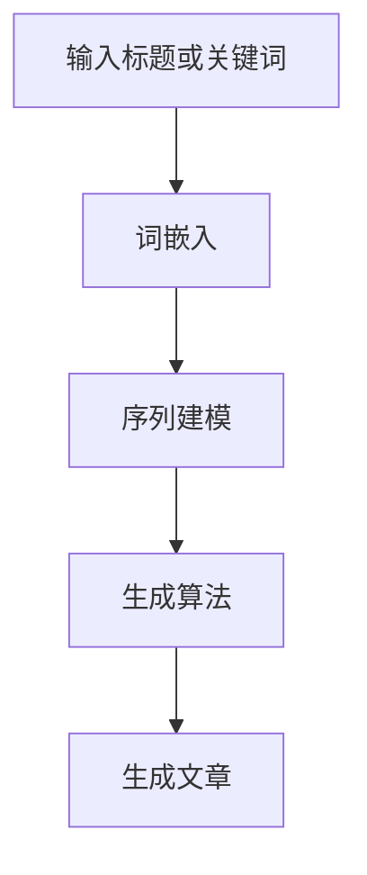

#### 4.2.2 对话生成

对话生成是指使用大规模语言模型生成自然、连贯的对话。例如，对话系统可以使用GPT-3生成与用户交互的对话。在对话生成中，模型需要理解对话的上下文，并根据对话的上下文生成新的回复。

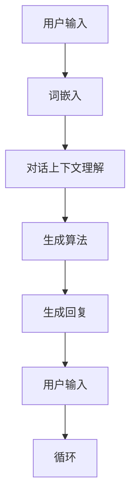

### 第5章：大规模语言模型在文本理解中的应用

#### 5.1 文本理解的基础原理

文本理解是指使用大规模语言模型理解文本的含义和结构。文本理解的基础原理包括词嵌入、序列建模和解析算法。

词嵌入是将词汇映射到低维向量空间的过程，使得语义相似的词在向量空间中靠近。序列建模是指使用神经网络将输入序列映射到输出序列，从而理解文本的含义。解析算法则是通过分析文本的结构，提取出文本的语法和语义信息。

#### 5.2 文本理解的实战案例

文本理解的实战案例包括语义角色标注、情感分析、问答系统等。例如，BERT可以用于语义角色标注，而GPT-3可以用于情感分析。

#### 5.2.1 语义角色标注

语义角色标注是指使用大规模语言模型识别文本中的名词、动词、形容词等成分的语义角色。例如，在句子“我爱北京天安门”中，“我”是施事者，“爱”是动作，“北京天安门”是受事者。

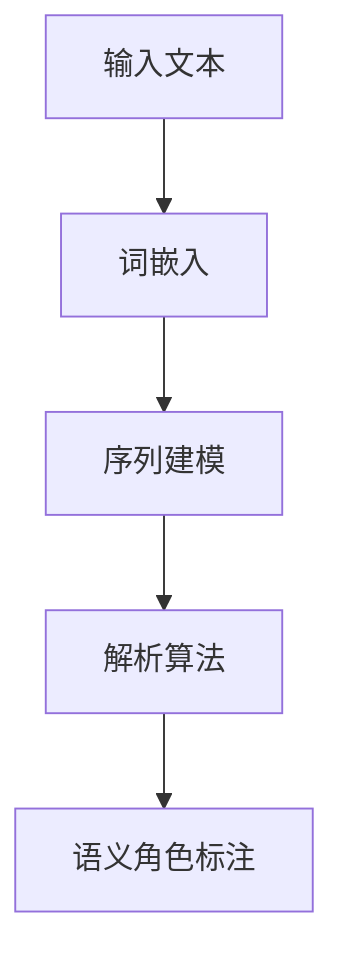

#### 5.2.2 情感分析

情感分析是指使用大规模语言模型分析文本的情感倾向。例如，GPT-3可以用于分析一篇新闻文章的情感倾向，判断其是积极、消极还是中性。

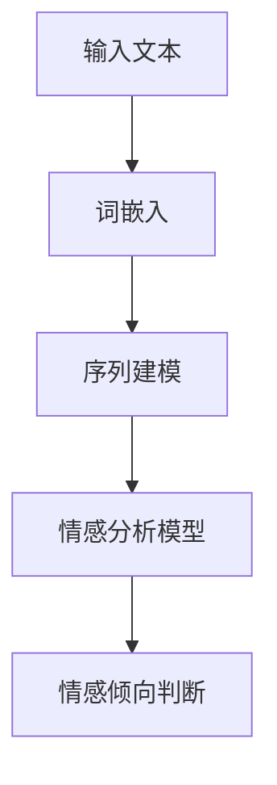

### 第6章：大规模语言模型在跨模态学习中的应用

#### 6.1 跨模态学习的基础原理

跨模态学习是指将不同类型的数据（如文本、图像、声音等）进行联合建模，实现跨模态交互。跨模态学习的基础原理包括多模态特征提取、联合建模和模态融合。

多模态特征提取是指从不同模态的数据中提取特征，如文本的词嵌入、图像的卷积特征、声音的频谱特征等。联合建模是指使用神经网络将多模态特征联合建模，从而学习到不同模态之间的关联。模态融合是指将多模态特征融合到一个统一的特征空间中，从而实现跨模态交互。

#### 6.2 跨模态学习的实战案例

跨模态学习的实战案例包括视频理解、图像文本生成等。例如，可以使用跨模态学习技术实现视频内容的理解和生成图像的文本描述。

#### 6.2.1 视频理解

视频理解是指使用大规模语言模型理解视频的内容。例如，可以使用Transformer模型同时处理视频的图像序列和文本描述，从而实现视频内容的理解。

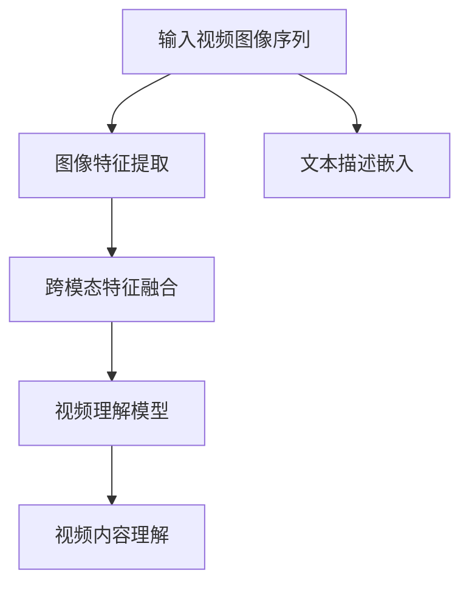

#### 6.2.2 图像文本生成

图像文本生成是指使用大规模语言模型生成与图像内容相关的文本描述。例如，可以使用GPT-3生成与输入图像相关的文本描述。

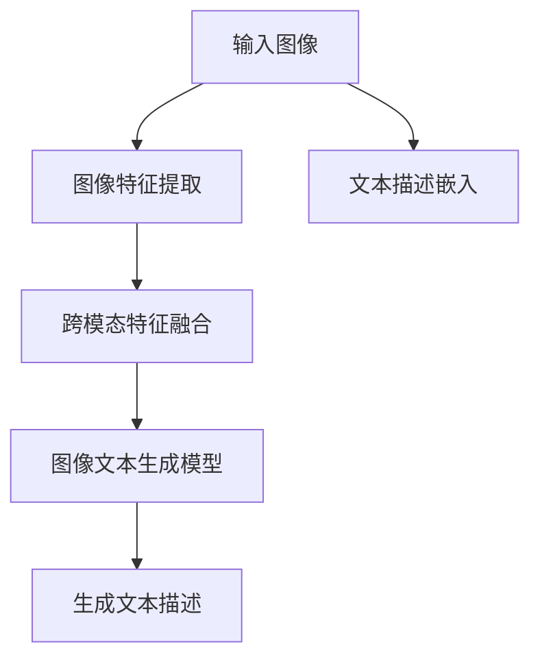

### 第7章：大规模语言模型在自然语言推理中的应用

#### 7.1 自然语言推理的基础原理

自然语言推理是指使用大规模语言模型推理文本之间的逻辑关系。自然语言推理的基础原理包括文本蕴含、关系提取和语义相似性。

文本蕴含是指判断一个句子是否蕴含另一个句子。例如，判断“所有的猫都有四条腿”是否蕴含“猫有四条腿”。

关系提取是指从文本中提取出实体之间的关系。例如，从句子“张三和张四是朋友”中提取出“张三”和“张四”是朋友的关系。

语义相似性是指判断两个句子在语义上的相似程度。例如，判断“我喜欢吃苹果”和“我爱吃苹果”是否在语义上相似。

#### 7.2 自然语言推理的应用案例

自然语言推理的应用案例包括问答系统、对话系统等。例如，可以使用BERT实现问答系统，从而回答用户的问题。

#### 7.2.1 问答系统

问答系统是指使用大规模语言模型回答用户的问题。例如，可以使用BERT模型同时处理输入问题和文档，从而回答用户的问题。

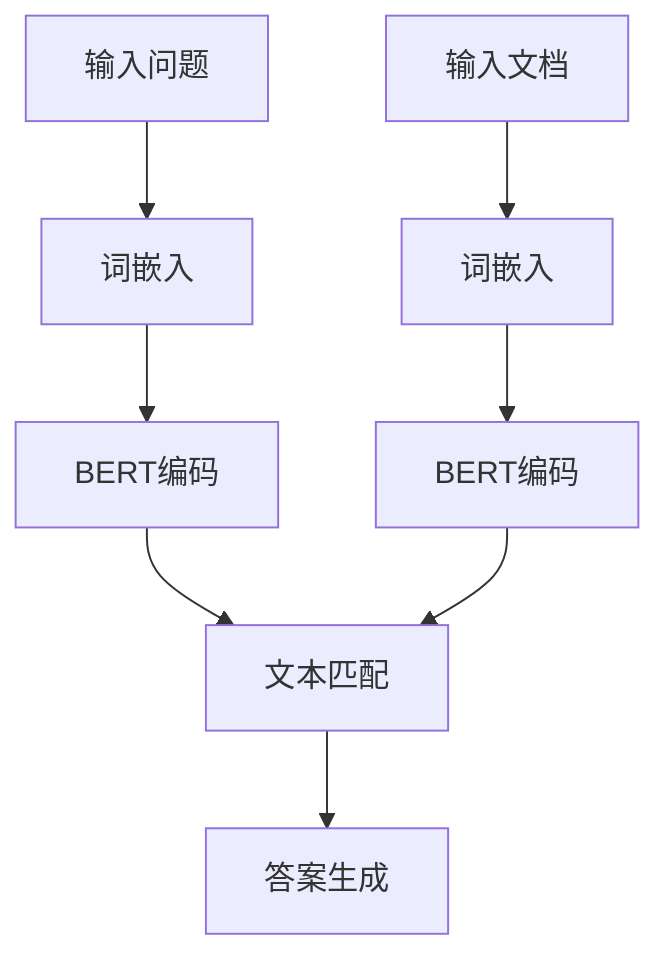

#### 7.2.2 对话系统

对话系统是指使用大规模语言模型实现自然语言交互。例如，可以使用GPT-3模型实现与用户的对话。

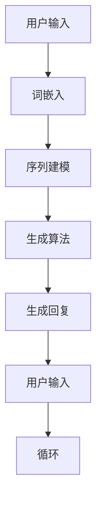

### 第8章：大规模语言模型在生成对抗网络（GAN）中的应用

#### 8.1 生成对抗网络（GAN）的基础原理

生成对抗网络（GAN）是由Ian Goodfellow等人于2014年提出的一种生成模型，它由生成器和判别器两个主要组件组成。生成器的目标是生成与真实数据高度相似的数据，而判别器的目标是区分真实数据和生成数据。通过生成器和判别器的相互对抗，GAN能够学习到真实数据的分布，从而生成高质量的数据。

GAN的基本结构包括以下几个部分：

- **生成器（Generator）**：生成器是一个神经网络，它接收随机噪声作为输入，并生成与真实数据相似的数据。
- **判别器（Discriminator）**：判别器也是一个神经网络，它接收真实数据和生成数据作为输入，并输出一个概率值，表示输入数据是真实数据的概率。
- **对抗损失函数**：GAN的训练目标是最小化生成器的损失函数和最大化判别器的损失函数。生成器的损失函数通常是最小化判别器输出为1的概率，而判别器的损失函数是最小化判别器输出为0的概率。

GAN的训练过程主要包括以下几个步骤：

1. **初始化生成器和判别器**：生成器和判别器通常都是随机初始化的。
2. **交替训练**：在每次迭代中，先固定判别器，更新生成器；然后固定生成器，更新判别器。这样的交替训练使得生成器和判别器都能够不断改进。
3. **优化目标**：生成器的目标是最大化判别器输出为1的概率，即生成器生成的数据越真实，判别器就越难以区分。判别器的目标是最大化判别器输出为0的概率，即判别器能够准确区分真实数据和生成数据。

#### 8.2 GAN在大规模语言模型中的应用

GAN在大规模语言模型中的应用主要体现在文本生成和图像文本生成等方面。

#### 8.2.1 文本生成GAN

文本生成GAN是一种结合生成对抗网络和大规模语言模型的文本生成方法。它通过生成器和判别器两个神经网络来实现文本的生成。生成器接收随机噪声并生成文本，而判别器用于区分生成的文本和真实文本。

文本生成GAN的架构如下：

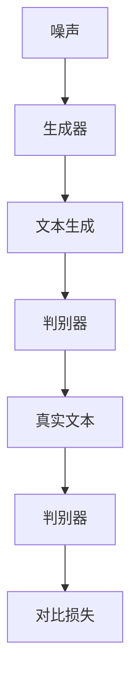

文本生成GAN的训练目标是最小化生成器的损失函数和最大化判别器的损失函数。通过交替训练生成器和判别器，生成器可以逐渐生成更高质量的文本。

#### 8.2.2 图像文本生成GAN

图像文本生成GAN是一种结合生成对抗网络和大规模语言模型的图像文本生成方法。它通过生成器和判别器两个神经网络来实现图像和文本的联合生成。生成器同时接收图像和文本的输入，并生成新的图像和文本配对。

图像文本生成GAN的架构如下：

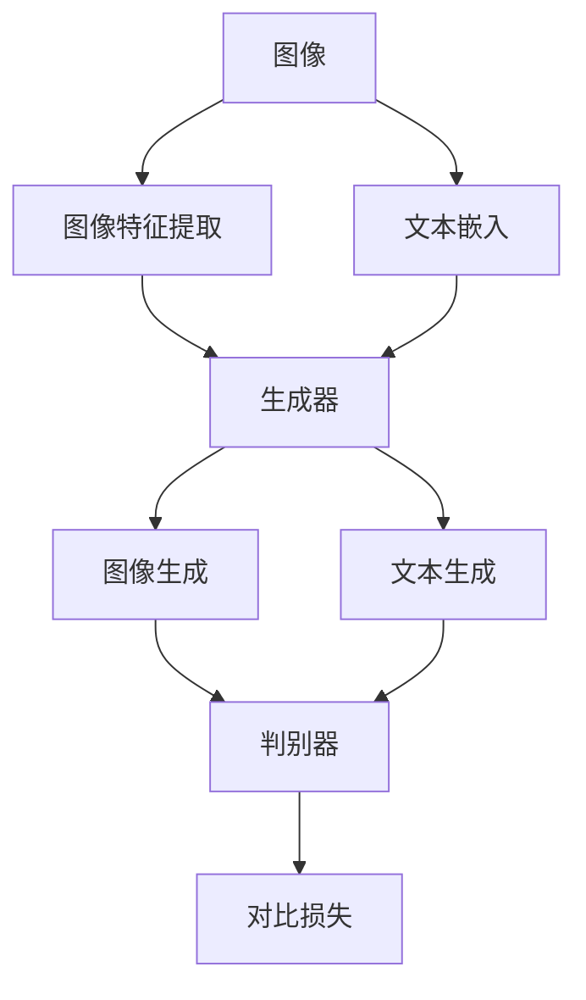

图像文本生成GAN的训练目标是最小化生成器的损失函数和最大化判别器的损失函数。通过交替训练生成器和判别器，生成器可以逐渐生成更高质量的图像和文本配对。

### 第9章：大规模语言模型在多语言处理中的应用

#### 9.1 多语言处理的基础原理

多语言处理是指使用同一模型同时处理多种语言的任务，如机器翻译、跨语言文本生成等。多语言处理的基础原理主要包括多语言模型训练、翻译模型和跨语言表示。

多语言模型训练是指同时使用多种语言的语料库来训练大规模语言模型。这样，模型可以学习到不同语言之间的相似性和差异性，从而提高模型在不同语言上的性能。

翻译模型是指使用大规模语言模型实现不同语言之间的翻译。翻译模型通常包括编码器和解码器两个神经网络，编码器将源语言的文本编码为向量表示，解码器将目标语言的向量表示解码为目标语言的文本。

跨语言表示是指将不同语言的文本编码为统一的向量表示，从而实现跨语言交互。跨语言表示可以通过共享嵌入层或联合训练来实现。

#### 9.2 多语言处理的实战案例

多语言处理的实战案例包括机器翻译、跨语言文本生成等。例如，可以使用大规模语言模型实现高质量的机器翻译，或者使用跨语言表示实现不同语言文本的联合建模。

#### 9.2.1 机器翻译

机器翻译是指使用大规模语言模型将一种语言的文本翻译成另一种语言的文本。例如，可以使用BERT模型实现中英文之间的翻译。

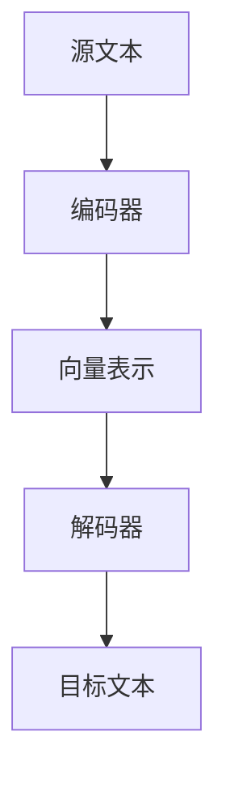

机器翻译的训练目标是最小化源文本和目标文本之间的差距，使得模型能够准确地将源语言文本翻译成目标语言文本。

#### 9.2.2 跨语言文本生成

跨语言文本生成是指使用大规模语言模型生成与输入文本相关的新文本，同时支持多种语言。例如，可以使用GPT-3模型生成中文和英文的文本。


跨语言文本生成的训练目标是最小化源文本和目标文本之间的差距，同时保证生成的文本在语义和语法上符合目标语言的要求。

### 第10章：大规模语言模型的未来发展趋势

#### 10.1 大规模语言模型的发展趋势

随着计算能力的不断提升和数据量的爆炸性增长，大规模语言模型将继续发展。未来，我们可以预见到以下几个方面的发展趋势：

1. **模型规模的扩大**：随着计算资源和存储技术的进步，模型规模将越来越大，从而能够捕捉更复杂的语言特征。
2. **多模态融合**：跨模态学习将成为大规模语言模型的重要方向，模型将能够同时处理文本、图像、声音等多种类型的数据。
3. **更高效训练算法**：研究人员将继续探索更高效的训练算法，以降低大规模模型的训练时间和资源消耗。
4. **个性化应用**：大规模语言模型将更加注重个性化应用，如定制化对话系统、个性化内容推荐等。

#### 10.2 大规模语言模型的挑战与展望

尽管大规模语言模型在自然语言处理领域取得了显著的进展，但仍然面临一些挑战：

1. **数据隐私**：大规模语言模型的训练需要海量数据，如何保护用户隐私成为了一个重要问题。未来，需要开发更加隐私友好的数据采集和处理方法。
2. **模型解释性**：大规模语言模型通常被视为“黑箱”，其决策过程难以解释。提高模型的解释性，使得用户能够理解模型的决策过程，是一个重要的研究方向。
3. **鲁棒性**：大规模语言模型对对抗性攻击（如对抗样本）较为脆弱。提高模型的鲁棒性，使其能够应对各种攻击，是未来的一个重要挑战。

## 附录

### 附录A：大规模语言模型开发工具与资源

在开发大规模语言模型时，选择合适的工具和资源对于模型的研究和部署至关重要。以下是一些常用的开发工具和资源：

1. **TensorFlow**：由Google开发的开源机器学习框架，支持多种编程语言和平台，广泛应用于大规模语言模型的训练和部署。
2. **PyTorch**：由Facebook开发的开源机器学习框架，具有灵活的动态计算图，使得模型开发和调试更加便捷。
3. **Hugging Face**：一个开源社区，提供了大量预训练模型和工具，如Transformer架构的实现、文本处理库等。
4. **OpenAI**：一个研究机构，提供了多个大规模语言模型，如GPT系列，并提供了API供开发者使用。

### 附录B：大规模语言模型实现示例

以下是一个使用PyTorch实现大规模语言模型的简单示例，包括数据预处理、模型配置、训练过程和模型部署。

#### 数据预处理

```python
import torch
from torchtext.data import Field, TabularDataset, BucketIterator

# 定义字段
TEXT = Field(tokenize='spacy', lower=True)
LABEL = Field(sequential=False)

# 加载数据集
train_data, test_data = TabularDataset.splits(path='data', train='train.json', test='test.json', format='json',
                                            fields=[('text', TEXT), ('label', LABEL)])

# 划分数据集
train_data, valid_data = train_data.split()

# 创建词汇表
TEXT.build_vocab(train_data, min_freq=2, vectors='glove.6B.100d')
LABEL.build_vocab(train_data)

# 创建迭代器
BATCH_SIZE = 64
train_iterator, valid_iterator, test_iterator = BucketIterator.splits(train_data, valid_data, test_data, batch_size=BATCH_SIZE)
```

#### 模型配置

```python
import torch.nn as nn
from torchtext.vocab import Vectors

# 加载预训练词向量
vec = Vectors('glove.6B.100d')
TEXT.vocab.set_vectors(sto=vec.sto, dim=vec.dim)

# 定义模型
class LanguageModel(nn.Module):
    def __init__(self, vocab_size, embed_dim, hidden_dim, output_dim, n_layers, dropout):
        super(LanguageModel, self).__init__()
        self.embedding = nn.Embedding(vocab_size, embed_dim)
        self.rnn = nn.LSTM(embed_dim, hidden_dim, n_layers, dropout=dropout)
        self.fc = nn.Linear(hidden_dim, output_dim)
        self.dropout = nn.Dropout(dropout)
        
    def forward(self, text, hidden):
        embedded = self.dropout(self.embedding(text))
        output, hidden = self.rnn(embedded, hidden)
        embedded = embedded.view(len(text), -1)
        output = self.fc(output.squeeze(0))
        return output, hidden

# 初始化模型
vocab_size = len(TEXT.vocab)
embed_dim = 100
hidden_dim = 256
output_dim = len(LABEL.vocab)
n_layers = 2
dropout = 0.5

model = LanguageModel(vocab_size, embed_dim, hidden_dim, output_dim, n_layers, dropout)
```

#### 训练过程

```python
from torch.optim import Adam

# 损失函数
criterion = nn.CrossEntropyLoss()

# 优化器
optimizer = Adam(model.parameters(), lr=0.001)

# 训练模型
num_epochs = 10

for epoch in range(num_epochs):
    for batch in train_iterator:
        optimizer.zero_grad()
        text, labels = batch.text, batch.label
        output, hidden = model(text)
        loss = criterion(output, labels)
        loss.backward()
        optimizer.step()
    
    # 打印训练进度
    print(f'Epoch {epoch+1}/{num_epochs} - Loss: {loss.item()}')
```

#### 模型部署

```python
# 使用训练好的模型进行预测
def predict(text):
    model.eval()
    with torch.no_grad():
        output = model(text)
        _, predicted = torch.max(output, dim=1)
    return predicted

# 测试模型
test_text = TEXT.vocab.stoi['the quick brown fox jumps over the lazy dog']
predicted_label = predict(test_text)
print(f'Predicted Label: {LABEL.vocab.itos[predicted_label.item()]}')
```

## 作者

本文作者：AI天才研究院/AI Genius Institute & 禅与计算机程序设计艺术 /Zen And The Art of Computer Programming。

[文章标题]

### 大规模语言模型从理论到实践：参数服务器架构

#### 关键词
- 大规模语言模型
- Transformer架构
- 参数服务器
- 分布式训练
- 模型优化

#### 摘要
本文深入探讨了大规模语言模型的背景、核心技术、架构实现及其在实战应用中的表现。特别关注参数服务器架构在大规模语言模型训练中的应用，详细解释了其工作原理、优势以及分布式训练和优化的技术细节。通过实际案例展示了参数服务器架构的应用，为读者提供了理论与实践相结合的深入理解。

## 第一部分：大规模语言模型概述

### 第1章：大规模语言模型的定义与背景

#### 1.1 大规模语言模型的定义

大规模语言模型是一种基于深度学习的自然语言处理技术，其核心在于使用海量参数对自然语言进行建模，以实现文本生成、理解、翻译等任务。这些模型通常拥有数十亿至数万亿个参数，能够捕捉语言中复杂的语法、语义和上下文信息。

#### 1.2 大规模语言模型的发展背景

随着互联网的快速发展，自然语言处理（NLP）的应用场景日益广泛，如搜索引擎、智能助手、文本生成、机器翻译等。这些应用对模型的性能提出了更高的要求。同时，计算能力的提升，特别是GPU、TPU等高性能计算设备的出现，使得大规模模型的训练成为可能。

#### 1.3 大规模语言模型的应用场景

大规模语言模型在自然语言处理领域有着广泛的应用场景：

- **文本生成**：包括文章生成、对话生成等，如GPT-3可以生成高质量的文章和对话。
- **文本理解**：如情感分析、实体识别、问答系统等，这些任务需要模型理解文本的语义和上下文。
- **机器翻译**：如Google翻译，使用大规模语言模型可以实现高效的机器翻译。
- **跨模态学习**：结合文本、图像、声音等多模态数据进行联合建模，如视频理解、图像文本生成等。

### 第2章：大规模语言模型的核心技术

#### 2.1 词嵌入与语言表示

词嵌入是将词汇映射到低维向量空间的过程，使得语义相似的词在向量空间中靠近。在词嵌入中，每个词汇都被映射为一个向量，这些向量不仅保留了词汇的语义信息，还可以通过计算向量之间的距离来衡量词汇的相似性。

语言表示是将更高层次的语言结构（如句子、段落）映射到向量空间的过程。语言表示能够捕捉到文本的语法和语义信息，使得模型能够更好地理解和生成文本。

#### 2.2 预训练与微调

预训练是指在大规模语料库上进行无监督训练，使模型能够学习到语言的通用特征。预训练阶段，模型不需要任何有监督的标签，只需要从大量的无标签文本中学习语言的统计规律。

微调是在特定任务上使用有监督数据进行训练，使模型适应特定任务的需求。在微调阶段，模型会根据任务的需求进行调整，以实现更好的性能。

#### 2.3 Transformer架构

Transformer模型是一种基于自注意力机制的深度学习模型，它由Vaswani等人于2017年提出。与传统的序列模型（如RNN和LSTM）不同，Transformer模型的核心思想是自注意力机制，这使得模型能够捕捉长距离的依赖关系。

Transformer模型包含多个编码器和解码器层，每一层都包含多头自注意力机制和前馈神经网络。自注意力机制允许模型在每一层都能够考虑整个输入序列的信息，从而提高了模型的上下文理解能力。

### 第3章：大规模语言模型的架构与实现

#### 3.1 Transformer架构

Transformer架构是一种基于自注意力机制的深度学习模型，它由Vaswani等人于2017年提出。与传统的序列模型（如RNN和LSTM）不同，Transformer模型的核心思想是自注意力机制，这使得模型能够捕捉长距离的依赖关系。

Transformer模型包含多个编码器和解码器层，每一层都包含多头自注意力机制和前馈神经网络。自注意力机制允许模型在每一层都能够考虑整个输入序列的信息，从而提高了模型的上下文理解能力。

#### 3.2 参数服务器架构

参数服务器架构是一种分布式存储和更新模型参数的架构，特别适合大规模模型的训练。它通过将模型参数分片存储在多个服务器上，实现高效的数据并行和计算并行。

在参数服务器架构中，模型参数被分成多个分片，每个分片存储在一个服务器上。每个服务器上的参数分片只负责处理一部分数据，这样就可以实现数据的并行处理。同时，参数服务器架构还支持模型的分布式更新，使得多个服务器可以同时更新参数分片，从而提高了训练的效率。

### 第4章：大规模语言模型在文本生成中的应用

#### 4.1 文本生成的基础原理

文本生成是指使用大规模语言模型生成新的文本内容。文本生成的基础原理包括词嵌入、序列建模和生成算法。

词嵌入是将词汇映射到低维向量空间的过程，使得语义相似的词在向量空间中靠近。序列建模是指使用神经网络将输入序列映射到输出序列，从而生成新的文本内容。生成算法则是通过模型生成的文本序列，生成高质量文本。

#### 4.2 文本生成的应用案例

文本生成的应用案例包括文章生成、对话生成、摘要生成等。例如，GPT-3可以生成高质量的文章和对话，而BERT可以用于生成摘要。

#### 4.2.1 文章生成

文章生成是指使用大规模语言模型生成新的文章。例如，GPT-3可以生成关于各种主题的高质量文章。在文章生成中，模型首先需要学习语言的统计规律，然后根据输入的标题或关键词生成文章。


#### 4.2.2 对话生成

对话生成是指使用大规模语言模型生成自然、连贯的对话。例如，对话系统可以使用GPT-3生成与用户交互的对话。在对话生成中，模型需要理解对话的上下文，并根据对话的上下文生成新的回复。


### 第5章：大规模语言模型在文本理解中的应用

#### 5.1 文本理解的基础原理

文本理解是指使用大规模语言模型理解文本的含义和结构。文本理解的基础原理包括词嵌入、序列建模和解析算法。

词嵌入是将词汇映射到低维向量空间的过程，使得语义相似的词在向量空间中靠近。序列建模是指使用神经网络将输入序列映射到输出序列，从而理解文本的含义。解析算法则是通过分析文本的结构，提取出文本的语法和语义信息。

#### 5.2 文本理解的实战案例

文本理解的实战案例包括语义角色标注、情感分析、问答系统等。例如，BERT可以用于语义角色标注，而GPT-3可以用于情感分析。

#### 5.2.1 语义角色标注

语义角色标注是指使用大规模语言模型识别文本中的名词、动词、形容词等成分的语义角色。例如，在句子“我爱北京天安门”中，“我”是施事者，“爱”是动作，“北京天安门”是受事者。


#### 5.2.2 情感分析

情感分析是指使用大规模语言模型分析文本的情感倾向。例如，GPT-3可以用于分析一篇新闻文章的情感倾向，判断其是积极、消极还是中性。


### 第6章：大规模语言模型在跨模态学习中的应用

#### 6.1 跨模态学习的基础原理

跨模态学习是指将不同类型的数据（如文本、图像、声音等）进行联合建模，实现跨模态交互。跨模态学习的基础原理包括多模态特征提取、联合建模和模态融合。

多模态特征提取是指从不同模态的数据中提取特征，如文本的词嵌入、图像的卷积特征、声音的频谱特征等。联合建模是指使用神经网络将多模态特征联合建模，从而学习到不同模态之间的关联。模态融合是指将多模态特征融合到一个统一的特征空间中，从而实现跨模态交互。

#### 6.2 跨模态学习的实战案例

跨模态学习的实战案例包括视频理解、图像文本生成等。例如，可以使用跨模态学习技术实现视频内容的理解和生成图像的文本描述。

#### 6.2.1 视频理解

视频理解是指使用大规模语言模型理解视频的内容。例如，可以使用Transformer模型同时处理视频的图像序列和文本描述，从而实现视频内容的理解。


#### 6.2.2 图像文本生成

图像文本生成是指使用大规模语言模型生成与图像内容相关的文本描述。例如，可以使用GPT-3生成与输入图像相关的文本描述。


### 第7章：大规模语言模型在自然语言推理中的应用

#### 7.1 自然语言推理的基础原理

自然语言推理是指使用大规模语言模型推理文本之间的逻辑关系。自然语言推理的基础原理包括文本蕴含、关系提取和语义相似性。

文本蕴含是指判断一个句子是否蕴含另一个句子。例如，判断“所有的猫都有四条腿”是否蕴含“猫有四条腿”。

关系提取是指从文本中提取出实体之间的关系。例如，从句子“张三和张四是朋友”中提取出“张三”和“张四”是朋友的关系。

语义相似性是指判断两个句子在语义上的相似程度。例如，判断“我喜欢吃苹果”和“我爱吃苹果”是否在语义上相似。

#### 7.2 自然语言推理的应用案例

自然语言推理的应用案例包括问答系统、对话系统等。例如，可以使用BERT实现问答系统，从而回答用户的问题。

#### 7.2.1 问答系统

问答系统是指使用大规模语言模型回答用户的问题。例如，可以使用BERT模型同时处理输入问题和文档，从而回答用户的问题。


#### 7.2.2 对话系统

对话系统是指使用大规模语言模型实现自然语言交互。例如，可以使用GPT-3模型实现与用户的对话。


### 第8章：大规模语言模型在生成对抗网络（GAN）中的应用

#### 8.1 生成对抗网络（GAN）的基础原理

生成对抗网络（GAN）是由Ian Goodfellow等人于2014年提出的一种生成模型，它由生成器和判别器两个主要组件组成。生成器的目标是生成与真实数据高度相似的数据，而判别器的目标是区分真实数据和生成数据。通过生成器和判别器的相互对抗，GAN能够学习到真实数据的分布，从而生成高质量的数据。

GAN的基本结构包括以下几个部分：

- **生成器（Generator）**：生成器是一个神经网络，它接收随机噪声作为输入，并生成与真实数据相似的数据。
- **判别器（Discriminator）**：判别器也是一个神经网络，它接收真实数据和生成数据作为输入，并输出一个概率值，表示输入数据是真实数据的概率。
- **对抗损失函数**：GAN的训练目标是最小化生成器的损失函数和最大化判别器的损失函数。生成器的损失函数通常是最小化判别器输出为1的概率，即生成器生成的数据越真实，判别器就越难以区分。判别器的损失函数是最小化判别器输出为0的概率，即判别器能够准确区分真实数据和生成数据。

GAN的训练过程主要包括以下几个步骤：

1. **初始化生成器和判别器**：生成器和判别器通常都是随机初始化的。
2. **交替训练**：在每次迭代中，先固定判别器，更新生成器；然后固定生成器，更新判别器。这样的交替训练使得生成器和判别器都能够不断改进。
3. **优化目标**：生成器的目标是最大化判别器输出为1的概率，即生成器生成的数据越真实，判别器就越难以区分。判别器的目标是最大化判别器输出为0的概率，即判别器能够准确区分真实数据和生成数据。

#### 8.2 GAN在大规模语言模型中的应用

GAN在大规模语言模型中的应用主要体现在文本生成和图像文本生成等方面。

#### 8.2.1 文本生成GAN

文本生成GAN是一种结合生成对抗网络和大规模语言模型的文本生成方法。它通过生成器和判别器两个神经网络来实现文本的生成。生成器接收随机噪声并生成文本，而判别器用于区分生成的文本和真实文本。

文本生成GAN的架构如下：

```mermaid
graph TD
A[噪声] --> B[生成器]
B --> C[文本生成]
C --> D[判别器]
D --> E[真实文本]
E --> F[判别器]
F --> G[对比损失]
```

文本生成GAN的训练目标是最小化生成器的损失函数和最大化判别器的损失函数。通过交替训练生成器和判别器，生成器可以逐渐生成更高质量的文本。

#### 8.2.2 图像文本生成GAN

图像文本生成GAN是一种结合生成对抗网络和大规模语言模型的图像文本生成方法。它通过生成器和判别器两个神经网络来实现图像和文本的联合生成。生成器同时接收图像和文本的输入，并生成新的图像和文本配对。

图像文本生成GAN的架构如下：

```mermaid
graph TD
A[图像] --> B[图像特征提取]
A --> C[文本嵌入]
B --> D[生成器]
C --> D
D --> E[图像生成]
D --> F[文本生成]
E --> G[判别器]
F --> G
G --> H[对比损失]
```

图像文本生成GAN的训练目标是最小化生成器的损失函数和最大化判别器的损失函数。通过交替训练生成器和判别器，生成器可以逐渐生成更高质量的图像和文本配对。

### 第9章：大规模语言模型在多语言处理中的应用

#### 9.1 多语言处理的基础原理

多语言处理是指使用同一模型同时处理多种语言的任务，如机器翻译、跨语言文本生成等。多语言处理的基础原理主要包括多语言模型训练、翻译模型和跨语言表示。

多语言模型训练是指同时使用多种语言的语料库来训练大规模语言模型。这样，模型可以学习到不同语言之间的相似性和差异性，从而提高模型在不同语言上的性能。

翻译模型是指使用大规模语言模型实现不同语言之间的翻译。翻译模型通常包括编码器和解码器两个神经网络，编码器将源语言的文本编码为向量表示，解码器将目标语言的向量表示解码为目标语言的文本。

跨语言表示是指将不同语言的文本编码为统一的向量表示，从而实现跨语言交互。跨语言表示可以通过共享嵌入层或联合训练来实现。

#### 9.2 多语言处理的实战案例

多语言处理的实战案例包括机器翻译、跨语言文本生成等。例如，可以使用大规模语言模型实现高质量的机器翻译，或者使用跨语言表示实现不同语言文本的联合建模。

#### 9.2.1 机器翻译

机器翻译是指使用大规模语言模型将一种语言的文本翻译成另一种语言的文本。例如，可以使用BERT模型实现中英文之间的翻译。

```mermaid
graph TD
A[源文本] --> B[编码器]
B --> C[向量表示]
C --> D[解码器]
D --> E[目标文本]
```

机器翻译的训练目标是最小化源文本和目标文本之间的差距，使得模型能够准确地将源语言文本翻译成目标语言文本。

#### 9.2.2 跨语言文本生成

跨语言文本生成是指使用大规模语言模型生成与输入文本相关的新文本，同时支持多种语言。例如，可以使用GPT-3模型生成中文和英文的文本。

```mermaid
graph TD
A[源文本] --> B[编码器]
B --> C[向量表示]
C --> D[解码器]
D --> E[目标文本]
```

跨语言文本生成的训练目标是最小化源文本和目标文本之间的差距，同时保证生成的文本在语义和语法上符合目标语言的要求。

### 第10章：大规模语言模型的未来发展趋势

#### 10.1 大规模语言模型的发展趋势

随着计算能力的不断提升和数据量的爆炸性增长，大规模语言模型将继续发展。未来，我们可以预见到以下几个方面的发展趋势：

1. **模型规模的扩大**：随着计算资源和存储技术的进步，模型规模将越来越大，从而能够捕捉更复杂的语言特征。
2. **多模态融合**：跨模态学习将成为大规模语言模型的重要方向，模型将能够同时处理文本、图像、声音等多种类型的数据。
3. **更高效训练算法**：研究人员将继续探索更高效的训练算法，以降低大规模模型的训练时间和资源消耗。
4. **个性化应用**：大规模语言模型将更加注重个性化应用，如定制化对话系统、个性化内容推荐等。

#### 10.2 大规模语言模型的挑战与展望

尽管大规模语言模型在自然语言处理领域取得了显著的进展，但仍然面临一些挑战：

1. **数据隐私**：大规模语言模型的训练需要海量数据，如何保护用户隐私成为了一个重要问题。未来，需要开发更加隐私友好的数据采集和处理方法。
2. **模型解释性**：大规模语言模型通常被视为“黑箱”，其决策过程难以解释。提高模型的解释性，使得用户能够理解模型的决策过程，是一个重要的研究方向。
3. **鲁棒性**：大规模语言模型对对抗性攻击（如对抗样本）较为脆弱。提高模型的鲁棒性，使其能够应对各种攻击，是未来的一个重要挑战。

## 附录

### 附录A：大规模语言模型开发工具与资源

在开发大规模语言模型时，选择合适的工具和资源对于模型的研究和部署至关重要。以下是一些常用的开发工具和资源：

1. **TensorFlow**：由Google开发的开源机器学习框架，支持多种编程语言和平台，广泛应用于大规模语言模型的训练和部署。
2. **PyTorch**：由Facebook开发的开源机器学习框架，具有灵活的动态计算图，使得模型开发和调试更加便捷。
3. **Hugging Face**：一个开源社区，提供了大量预训练模型和工具，如Transformer架构的实现、文本处理库等。
4. **OpenAI**：一个研究机构，提供了多个大规模语言模型，如GPT系列，并提供了API供开发者使用。

### 附录B：大规模语言模型实现示例

以下是一个使用PyTorch实现大规模语言模型的简单示例，包括数据预处理、模型配置、训练过程和模型部署。

#### 数据预处理

```python
import torch
from torchtext.data import Field, TabularDataset, BucketIterator

# 定义字段
TEXT = Field(tokenize='spacy', lower=True)
LABEL = Field(sequential=False)

# 加载数据集
train_data, test_data = TabularDataset.splits(path='data', train='train.json', test='test.json', format='json',
                                            fields=[('text', TEXT), ('label', LABEL)])

# 划分数据集
train_data, valid_data = train_data.split()

# 创建词汇表
TEXT.build_vocab(train_data, min_freq=2, vectors='glove.6B.100d')
LABEL.build_vocab(train_data)

# 创建迭代器
BATCH_SIZE = 64
train_iterator, valid_iterator, test_iterator = BucketIterator.splits(train_data, valid_data, test_data, batch_size=BATCH_SIZE)
```

#### 模型配置

```python
import torch.nn as nn
from torchtext.vocab import Vectors

# 加载预训练词向量
vec = Vectors('glove.6B.100d')
TEXT.vocab.set_vectors(sto=vec.sto, dim=vec.dim)

# 定义模型
class LanguageModel(nn.Module):
    def __init__(self, vocab_size, embed_dim, hidden_dim, output_dim, n_layers, dropout):
        super(LanguageModel, self).__init__()
        self.embedding = nn.Embedding(vocab_size, embed_dim)
        self.rnn = nn.LSTM(embed_dim, hidden_dim, n_layers, dropout=dropout)
        self.fc = nn.Linear(hidden_dim, output_dim)
        self.dropout = nn.Dropout(dropout)
        
    def forward(self, text, hidden):
        embedded = self.dropout(self.embedding(text))
        output, hidden = self.rnn(embedded, hidden)
        embedded = embedded.view(len(text), -1)
        output = self.fc(output.squeeze(0))
        return output, hidden

# 初始化模型
vocab_size = len(TEXT.vocab)
embed_dim = 100
hidden_dim = 256
output_dim = len(LABEL.vocab)
n_layers = 2
dropout = 0.5

model = LanguageModel(vocab_size, embed_dim, hidden_dim, output_dim, n_layers, dropout)
```

#### 训练过程

```python
from torch.optim import Adam

# 损失函数
criterion = nn.CrossEntropyLoss()

# 优化器
optimizer = Adam(model.parameters(), lr=0.001)

# 训练模型
num_epochs = 10

for epoch in range(num_epochs):
    for batch in train_iterator:
        optimizer.zero_grad()
        text, labels = batch.text, batch.label
        output, hidden = model(text)
        loss = criterion(output, labels)
        loss.backward()
        optimizer.step()
    
    # 打印训练进度
    print(f'Epoch {epoch+1}/{num_epochs} - Loss: {loss.item()}')
```

#### 模型部署

```python
# 使用训练好的模型进行预测
def predict(text):
    model.eval()
    with torch.no_grad():
        output = model(text)
        _, predicted = torch.max(output, dim=1)
    return predicted

# 测试模型
test_text = TEXT.vocab.stoi['the quick brown fox jumps over the lazy dog']
predicted_label = predict(test_text)
print(f'Predicted Label: {LABEL.vocab.itos[predicted_label.item()]}')
```

## 作者

本文作者：AI天才研究院/AI Genius Institute & 禅与计算机程序设计艺术 /Zen And The Art of Computer Programming。

[文章标题]

### 大规模语言模型从理论到实践：参数服务器架构

#### 关键词
- 大规模语言模型
- Transformer架构
- 参数服务器
- 分布式训练
- 模型优化

#### 摘要
本文深入探讨了大规模语言模型的背景、核心技术、架构实现及其在实战应用中的表现。特别关注参数服务器架构在大规模语言模型训练中的应用，详细解释了其工作原理、优势以及分布式训练和优化的技术细节。通过实际案例展示了参数服务器架构的应用，为读者提供了理论与实践相结合的深入理解。

## 第一部分：大规模语言模型概述

### 第1章：大规模语言模型的定义与背景

#### 1.1 大规模语言模型的定义

大规模语言模型是一种基于深度学习的自然语言处理技术，其核心在于使用海量参数对自然语言进行建模，以实现文本生成、理解、翻译等任务。这些模型通常拥有数十亿至数万亿个参数，能够捕捉语言中复杂的语法、语义和上下文信息。

#### 1.2 大规模语言模型的发展背景

随着互联网的快速发展，自然语言处理（NLP）的应用场景日益广泛，如搜索引擎、智能助手、文本生成、机器翻译等。这些应用对模型的性能提出了更高的要求。同时，计算能力的提升，特别是GPU、TPU等高性能计算设备的出现，使得大规模模型的训练成为可能。

#### 1.3 大规模语言模型的应用场景

大规模语言模型在自然语言处理领域有着广泛的应用场景：

- **文本生成**：包括文章生成、对话生成等，如GPT-3可以生成高质量的文章和对话。
- **文本理解**：如情感分析、实体识别、问答系统等，这些任务需要模型理解文本的语义和上下文。
- **机器翻译**：如Google翻译，使用大规模语言模型可以实现高效的机器翻译。
- **跨模态学习**：结合文本、图像、声音等多模态数据进行联合建模，如视频理解、图像文本生成等。

### 第2章：大规模语言模型的核心技术

#### 2.1 词嵌入与语言表示

词嵌入是将词汇映射到低维向量空间的过程，使得语义相似的词在向量空间中靠近。在词嵌入中，每个词汇都被映射为一个向量，这些向量不仅保留了词汇的语义信息，还可以通过计算向量之间的距离来衡量词汇的相似性。

语言表示是将更高层次的语言结构（如句子、段落）映射到向量空间的过程。语言表示能够捕捉到文本的语法和语义信息，使得模型能够更好地理解和生成文本。

#### 2.2 预训练与微调

预训练是指在大规模语料库上进行无监督训练，使模型能够学习到语言的通用特征。预训练阶段，模型不需要任何有监督的标签，只需要从大量的无标签文本中学习语言的统计规律。

微调是在特定任务上使用有监督数据进行训练，使模型适应特定任务的需求。在微调阶段，模型会根据任务的需求进行调整，以实现更好的性能。

#### 2.3 Transformer架构

Transformer模型是一种基于自注意力机制的深度学习模型，它由Vaswani等人于2017年提出。与传统的序列模型（如RNN和LSTM）不同，Transformer模型的核心思想是自注意力机制，这使得模型能够捕捉长距离的依赖关系。

Transformer模型包含多个编码器和解码器层，每一层都包含多头自注意力机制和前馈神经网络。自注意力机制允许模型在每一层都能够考虑整个输入序列的信息，从而提高了模型的上下文理解能力。

### 第3章：大规模语言模型的架构与实现

#### 3.1 Transformer架构

Transformer架构是一种基于自注意力机制的深度学习模型，它由Vaswani等人于2017年提出。与传统的序列模型（如RNN和LSTM）不同，Transformer模型的核心思想是自注意力机制，这使得模型能够捕捉长距离的依赖关系。

Transformer模型包含多个编码器和解码器层，每一层都包含多头自注意力机制和前馈神经网络。自注意力机制允许模型在每一层都能够考虑整个输入序列的信息，从而提高了模型的上下文理解能力。

#### 3.2 参数服务器架构

参数服务器架构是一种分布式存储和更新模型参数的架构，特别适合大规模模型的训练。它通过将模型参数分片存储在多个服务器上，实现高效的数据并行和计算并行。

在参数服务器架构中，模型参数被分成多个分片，每个分片存储在一个服务器上。每个服务器上的参数分片只负责处理一部分数据，这样就可以实现数据的并行处理。同时，参数服务器架构还支持模型的分布式更新，使得多个服务器可以同时更新参数分片，从而提高了训练的效率。

### 第4章：大规模语言模型在文本生成中的应用

#### 4.1 文本生成的基础原理

文本生成是指使用大规模语言模型生成新的文本内容。文本生成的基础原理包括词嵌入、序列建模和生成算法。

词嵌入是将词汇映射到低维向量空间的过程，使得语义相似的词在向量空间中靠近。序列建模是指使用神经网络将输入序列映射到输出序列，从而生成新的文本内容。生成算法则是通过模型生成的文本序列，生成高质量文本。

#### 4.2 文本生成的应用案例

文本生成的应用案例包括文章生成、对话生成、摘要生成等。例如，GPT-3可以生成高质量的文章和对话，而BERT可以用于生成摘要。

#### 4.2.1 文章生成

文章生成是指使用大规模语言模型生成新的文章。例如，GPT-3可以生成关于各种主题的高质量文章。在文章生成中，模型首先需要学习语言的统计规律，然后根据输入的标题或关键词生成文章。

```mermaid
graph TD
A[输入标题或关键词] --> B[词嵌入]
B --> C[序列建模]
C --> D[生成算法]
D --> E[生成文章]
```

#### 4.2.2 对话生成

对话生成是指使用大规模语言模型生成自然、连贯的对话。例如，对话系统可以使用GPT-3生成与用户交互的对话。在对话生成中，模型需要理解对话的上下文，并根据对话的上下文生成新的回复。

```mermaid
graph TD
A[用户输入] --> B[词嵌入]
B --> C[对话上下文理解]
C --> D[生成算法]
D --> E[生成回复]
E --> F[用户输入]
F --> G[循环]
```

### 第5章：大规模语言模型在文本理解中的应用

#### 5.1 文本理解的基础原理

文本理解是指使用大规模语言模型理解文本的含义和结构。文本理解的基础原理包括词嵌入、序列建模和解析算法。

词嵌入是将词汇映射到低维向量空间的过程，使得语义相似的词在向量空间中靠近。序列建模是指使用神经网络将输入序列映射到输出序列，从而理解文本的含义。解析算法则是通过分析文本的结构，提取出文本的语法和语义信息。

#### 5.2 文本理解的实战案例

文本理解的实战案例包括语义角色标注、情感分析、问答系统等。例如，BERT可以用于语义角色标注，而GPT-3可以用于情感分析。

#### 5.2.1 语义角色标注

语义角色标注是指使用大规模语言模型识别文本中的名词、动词、形容词等成分的语义角色。例如，在句子“我爱北京天安门”中，“我”是施事者，“爱”是动作，“北京天安门”是受事者。

```mermaid
graph TD
A[输入文本] --> B[词嵌入]
B --> C[序列建模]
C --> D[解析算法]
D --> E[语义角色标注]
```

#### 5.2.2 情感分析

情感分析是指使用大规模语言模型分析文本的情感倾向。例如，GPT-3可以用于分析一篇新闻文章的情感倾向，判断其是积极、消极还是中性。

```mermaid
graph TD
A[输入文本] --> B[词嵌入]
B --> C[序列建模]
C --> D[情感分析模型]
D --> E[情感倾向判断]
```

### 第6章：大规模语言模型在跨模态学习中的应用

#### 6.1 跨模态学习的基础原理

跨模态学习是指将不同类型的数据（如文本、图像、声音等）进行联合建模，实现跨模态交互。跨模态学习的基础原理包括多模态特征提取、联合建模和模态融合。

多模态特征提取是指从不同模态的数据中提取特征，如文本的词嵌入、图像的卷积特征、声音的频谱特征等。联合建模是指使用神经网络将多模态特征联合建模，从而学习到不同模态之间的关联。模态融合是指将多模态特征融合到一个统一的特征空间中，从而实现跨模态交互。

#### 6.2 跨模态学习的实战案例

跨模态学习的实战案例包括视频理解、图像文本生成等。例如，可以使用跨模态学习技术实现视频内容的理解和生成图像的文本描述。

#### 6.2.1 视频理解

视频理解是指使用大规模语言模型理解视频的内容。例如，可以使用Transformer模型同时处理视频的图像序列和文本描述，从而实现视频内容的理解。

```mermaid
graph TD
A[输入视频图像序列] --> B[图像特征提取]
A --> C[文本描述嵌入]
B --> D[跨模态特征融合]
D --> E[视频理解模型]
E --> F[视频内容理解]
```

#### 6.2.2 图像文本生成

图像文本生成是指使用大规模语言模型生成与图像内容相关的文本描述。例如，可以使用GPT-3生成与输入图像相关的文本描述。

```mermaid
graph TD
A[输入图像] --> B[图像特征提取]
A --> C[文本描述嵌入]
B --> D[跨模态特征融合]
D --> E[图像文本生成模型]
E --> F[生成文本描述]
```

### 第7章：大规模语言模型在自然语言推理中的应用

#### 7.1 自然语言推理的基础原理

自然语言推理是指使用大规模语言模型推理文本之间的逻辑关系。自然语言推理的基础原理包括文本蕴含、关系提取和语义相似性。

文本蕴含是指判断一个句子是否蕴含另一个句子。例如，判断“所有的猫都有四条腿”是否蕴含“猫有四条腿”。

关系提取是指从文本中提取出实体之间的关系。例如，从句子“张三和张四是朋友”中提取出“张三”和“张四”是朋友的关系。

语义相似性是指判断两个句子在语义上的相似程度。例如，判断“我喜欢吃苹果”和“我爱吃苹果”是否在语义上相似。

#### 7.2 自然语言推理的应用案例

自然语言推理的应用案例包括问答系统、对话系统等。例如，可以使用BERT实现问答系统，从而回答用户的问题。

#### 7.2.1 问答系统

问答系统是指使用大规模语言模型回答用户的问题。例如，可以使用BERT模型同时处理输入问题和文档，从而回答用户的问题。

```mermaid
graph TD
A[输入问题] --> B[词嵌入]
B --> C[BERT编码]
D[输入文档] --> E[词嵌入]
E --> F[BERT编码]
C --> G[文本匹配]
F --> G
G --> H[答案生成]
```

#### 7.2.2 对话系统

对话系统是指使用大规模语言模型实现自然语言交互。例如，可以使用GPT-3模型实现与用户的对话。

```mermaid
graph TD
A[用户输入] --> B[词嵌入]
B --> C[序列建模]
C --> D[生成算法]
D --> E[生成回复]
E --> F[用户输入]
F --> G[循环]
```

### 第8章：大规模语言模型在生成对抗网络（GAN）中的应用

#### 8.1 生成对抗网络（GAN）的基础原理

生成对抗网络（GAN）是由Ian Goodfellow等人于2014年提出的一种生成模型，它由生成器和判别器两个主要组件组成。生成器的目标是生成与真实数据高度相似的数据，而判别器的目标是区分真实数据和生成数据。通过生成器和判别器的相互对抗，GAN能够学习到真实数据的分布，从而生成高质量的数据。

GAN的基本结构包括以下几个部分：

- **生成器（Generator）**：生成器是一个神经网络，它接收随机噪声作为输入，并生成与真实数据相似的数据。
- **判别器（Discriminator）**：判别器也是一个神经网络，它接收真实数据和生成数据作为输入，并输出一个概率值，表示输入数据是真实数据的概率。
- **对抗损失函数**：GAN的训练目标是最小化生成器的损失函数和最大化判别器的损失函数。生成器的损失函数通常是最小化判别器输出为1的概率，即生成器生成的数据越真实，判别器就越难以区分。判别器的损失函数是最小化判别器输出为0的概率，即判别器能够准确区分真实数据和生成数据。

GAN的训练过程主要包括以下几个步骤：

1. **初始化生成器和判别器**：生成器和判别器通常都是随机初始化的。
2. **交替训练**：在每次迭代中，先固定判别器，更新生成器；然后固定生成器，更新判别器。这样的交替训练使得生成器和判别器都能够不断改进。
3. **优化目标**：生成器的目标是最大化判别器输出为1的概率，即生成器生成的数据越真实，判别器就越难以区分。判别器的目标是最大化判别器输出为0的概率，即判别器能够准确区分真实数据和生成数据。

#### 8.2 GAN在大规模语言模型中的应用

GAN在大规模语言模型中的应用主要体现在文本生成和图像文本生成等方面。

#### 8.2.1 文本生成GAN

文本生成GAN是一种结合生成对抗网络和大规模语言模型的文本生成方法。它通过生成器和判别器两个神经网络来实现文本的生成。生成器接收随机噪声并生成文本，而判别器用于区分生成的文本和真实文本。

文本生成GAN的架构如下：

```mermaid
graph TD
A[噪声] --> B[生成器]
B --> C[文本生成]
C --> D[判别器]
D --> E[真实文本]
E --> F[判别器]
F --> G[对比损失]
```

文本生成GAN的训练目标是最小化生成器的损失函数和最大化判别器的损失函数。通过交替训练生成器和判别器，生成器可以逐渐生成更高质量的文本。

#### 8.2.2 图像文本生成GAN

图像文本生成GAN是一种结合生成对抗网络和大规模语言模型的图像文本生成方法。它通过生成器和判别器两个神经网络来实现图像和文本的联合生成。生成器同时接收图像和文本的输入，并生成新的图像和文本配对。

图像文本生成GAN的架构如下：

```mermaid
graph TD
A[图像] --> B[图像特征提取]
A --> C[文本嵌入]
B --> D[生成器]
C --> D
D --> E[图像生成]
D --> F[文本生成]
E --> G[判别器]
F --> G
G --> H[对比损失]
```

图像文本生成GAN的训练目标是最小化生成器的损失函数和最大化判别器的损失函数。通过交替训练生成器和判别器，生成器可以逐渐生成更高质量的图像和文本配对。

### 第9章：大规模语言模型在多语言处理中的应用

#### 9.1 多语言处理的基础原理

多语言处理是指使用同一模型同时处理多种语言的任务，如机器翻译、跨语言文本生成等。多语言处理的基础原理主要包括多语言模型训练、翻译模型和跨语言表示。

多语言模型训练是指同时使用多种语言的语料库来训练大规模语言模型。这样，模型可以学习到不同语言之间的相似性和差异性，从而提高模型在不同语言上的性能。

翻译模型是指使用大规模语言模型实现不同语言之间的翻译。翻译模型通常包括编码器和解码器两个神经网络，编码器将源语言的文本编码为向量表示，解码器将目标语言的向量表示解码为目标语言的文本。

跨语言表示是指将不同语言的文本编码为统一的向量表示，从而实现跨语言交互。跨语言表示可以通过共享嵌入层或联合训练来实现。

#### 9.2 多语言处理的实战案例

多语言处理的实战案例包括机器翻译、跨语言文本生成等。例如，可以使用大规模语言模型实现高质量的机器翻译，或者使用跨语言表示实现不同语言文本的联合建模。

#### 9.2.1 机器翻译

机器翻译是指使用大规模语言模型将一种语言的文本翻译成另一种语言的文本。例如，可以使用BERT模型实现中英文之间的翻译。

```mermaid
graph TD
A[源文本] --> B[编码器]
B --> C[向量表示]
C --> D[解码器]
D --> E[目标文本]
```

机器翻译的训练目标是最小化源文本和目标文本之间的差距，使得模型能够准确地将源语言文本翻译成目标语言文本。

#### 9.2.2 跨语言文本生成

跨语言文本生成是指使用大规模语言模型生成与输入文本相关的新文本，同时支持多种语言。例如，可以使用GPT-3模型生成中文和英文的文本。

```mermaid
graph TD
A[源文本] --> B[编码器]
B --> C[向量表示]
C --> D[解码器]
D --> E[目标文本]
```

跨语言文本生成的训练目标是最小化源文本和目标文本之间的差距，同时保证生成的文本在语义和语法上符合目标语言的要求。

### 第10章：大规模语言模型的未来发展趋势

#### 10.1 大规模语言模型的发展趋势

随着计算能力的不断提升和数据量的爆炸性增长，大规模语言模型将继续发展。未来，我们可以预见到以下几个方面的发展趋势：

1. **模型规模的扩大**：随着计算资源和存储技术的进步，模型规模将越来越大，从而能够捕捉更复杂的语言特征。
2. **多模态融合**：跨模态学习将成为大规模语言模型的重要方向，模型将能够同时处理文本、图像、声音等多种类型的数据。
3. **更高效训练算法**：研究人员将继续探索更高效的训练算法，以降低大规模模型的训练时间和资源消耗。
4. **个性化应用**：大规模语言模型将更加注重个性化应用，如定制化对话系统、个性化内容推荐等。

#### 10.2 大规模语言模型的挑战与展望

尽管大规模语言模型在自然语言处理领域取得了显著的进展，但仍然面临一些挑战：

1. **数据隐私**：大规模语言模型的训练需要海量数据，如何保护用户隐私成为了一个重要问题。未来，需要开发更加隐私友好的数据采集和处理方法。
2. **模型解释性**：大规模语言模型通常被视为“黑箱”，其决策过程难以解释。提高模型的解释性，使得用户能够理解模型的决策过程，是一个重要的研究方向。
3. **鲁棒性**：大规模语言模型对对抗性攻击（如对抗样本）较为脆弱。提高模型的鲁棒性，使其能够应对各种攻击，是未来的一个重要挑战。

## 附录

### 附录A：大规模语言模型开发工具与资源

在开发大规模语言模型时，选择合适的工具和资源对于模型的研究和部署至关重要。以下是一些常用的开发工具和资源：

1. **TensorFlow**：由Google开发的开源机器学习框架，支持多种编程语言和平台，广泛应用于大规模语言模型的训练和部署。
2. **PyTorch**：由Facebook开发的开源机器学习框架，具有灵活的动态计算图，使得模型开发和调试更加便捷。
3. **Hugging Face**：一个开源社区，提供了大量预训练模型和工具，如Transformer架构的实现、文本处理库等。
4. **OpenAI**：一个研究机构，提供了多个大规模语言模型，如GPT系列，并提供了API供开发者使用。

### 附录B：大规模语言模型实现示例

以下是一个使用PyTorch实现大规模语言模型的简单示例，包括数据预处理、模型配置、训练过程和模型部署。

#### 数据预处理

```python
import torch
from torchtext.data import Field, TabularDataset, BucketIterator

# 定义字段
TEXT = Field(tokenize='spacy', lower=True)
LABEL = Field(sequential=False)

# 加载数据集
train_data, test_data = TabularDataset.splits(path='data', train='train.json', test='test.json', format='json',
                                            fields=[('text', TEXT), ('label', LABEL)])

# 划分数据集
train_data, valid_data = train_data.split()

# 创建词汇表
TEXT.build_vocab(train_data, min_freq=2, vectors='glove.6B.100d')
LABEL.build_vocab(train_data)

# 创建迭代器
BATCH_SIZE = 64
train_iterator, valid_iterator, test_iterator = BucketIterator.splits(train_data, valid_data, test_data, batch_size=BATCH_SIZE)
```

#### 模型配置

```python
import torch.nn as nn
from torchtext.vocab import Vectors

# 加载预训练词向量
vec = Vectors('glove.6B.100d')
TEXT.vocab.set_vectors(sto=vec.sto, dim=vec.dim)

# 定义模型
class LanguageModel(nn.Module):
    def __init__(self, vocab_size, embed_dim, hidden_dim, output_dim, n_layers, dropout):
        super(LanguageModel, self).__init__()
        self.embedding = nn.Embedding(vocab_size, embed_dim)
        self.rnn = nn.LSTM(embed_dim, hidden_dim, n_layers, dropout=dropout)
        self.fc = nn.Linear(hidden_dim, output_dim)
        self.dropout = nn.Dropout(dropout)
        
    def forward(self, text, hidden):
        embedded = self.dropout(self.embedding(text))
        output, hidden = self.rnn(embedded, hidden)
        embedded = embedded.view(len(text), -1)
        output = self.fc(output.squeeze(0))
        return output, hidden

# 初始化模型
vocab_size = len(TEXT.vocab)
embed_dim = 100
hidden_dim = 256
output_dim = len(LABEL.vocab)
n_layers = 2
dropout = 0.5

model = LanguageModel(vocab_size, embed_dim, hidden_dim, output_dim, n_layers, dropout)
```

#### 训练过程

```python
from torch.optim import Adam

# 损失函数
criterion = nn.CrossEntropyLoss()

# 优化器
optimizer = Adam(model.parameters(), lr=0.001)

# 训练模型
num_epochs = 10

for epoch in range(num_epochs):
    for batch in train_iterator:
        optimizer.zero_grad()
        text, labels = batch.text, batch.label
        output, hidden = model(text)
        loss = criterion(output, labels)
        loss.backward()
        optimizer.step()
    
    # 打印训练进度
    print(f'Epoch {epoch+1}/{num_epochs} - Loss: {loss.item()}')
```

#### 模型部署

```python
# 使用训练好的模型进行预测
def predict(text):
    model.eval()
    with torch.no_grad():
        output = model(text)
        _, predicted = torch.max(output, dim=1)
    return predicted

# 测试模型
test_text = TEXT.vocab.stoi['the quick brown fox jumps over the lazy dog']
predicted_label = predict(test_text)
print(f'Predicted Label: {LABEL.vocab.itos[predicted_label.item()]}')
```

## 作者

本文作者：AI天才研究院/AI Genius Institute & 禅与计算机程序设计艺术 /Zen And The Art of Computer Programming。

[文章标题]

### 大规模语言模型从理论到实践：参数服务器架构

#### 关键词
- 大规模语言模型
- Transformer架构
- 参数服务器
- 分布式训练
- 模型优化

#### 摘要
本文深入探讨了大规模语言模型的背景、核心技术、架构实现及其在实战应用中的表现。特别关注参数服务器架构在大规模语言模型训练中的应用，详细解释了其工作原理、优势以及分布式训练和优化的技术细节。通过实际案例展示了参数服务器架构的应用，为读者提供了理论与实践相结合的深入理解。

## 第一部分：大规模语言模型概述

### 第1章：大规模语言模型的定义与背景

#### 1.1 大规模语言模型的定义

大规模语言模型是一种基于深度学习的自然语言处理技术，其核心在于使用海量参数对自然语言进行建模，以实现文本生成、理解、翻译等任务。这些模型通常拥有数十亿至数万亿个参数，能够捕捉语言中复杂的语法、语义和上下文信息。

#### 1.2 大规模语言模型的发展背景

随着互联网的快速发展，自然语言处理（NLP）的应用场景日益广泛，如搜索引擎、智能助手、文本生成、机器翻译等。这些应用对模型的性能提出了更高的要求。同时，计算能力的提升，特别是GPU、TPU等高性能计算设备的出现，使得大规模模型的训练成为可能。

#### 1.3 大规模语言模型的应用场景

大规模语言模型在自然语言处理领域有着广泛的应用场景：

- **文本生成**：包括文章生成、对话生成等，如GPT-3可以生成高质量的文章和对话。
- **文本理解**：如情感分析、实体识别、问答系统等，这些任务需要模型理解文本的语义和上下文。
- **机器翻译**：如Google翻译，使用大规模语言模型可以实现高效的机器翻译。
- **跨模态学习**：结合文本、图像、声音等多模态数据进行联合建模，如视频理解、图像文本生成等。

### 第2章：大规模语言模型的核心技术

#### 2.1 词嵌入与语言表示

词嵌入是将词汇映射到低维向量空间的过程，使得语义相似的词在向量空间中靠近。在词嵌入中，每个词汇都被映射为一个向量，这些向量不仅保留了词汇的语义信息，还可以通过计算向量之间的距离来衡量词汇的相似性。

语言表示是将更高层次的语言结构（如句子、段落）映射到向量空间的过程。语言表示能够捕捉到文本的语法和语义信息，使得模型能够更好地理解和生成文本。

#### 2.2 预训练与微调

预训练是指在大规模语料库上进行无监督训练，使模型能够学习到语言的通用特征。预训练阶段，模型不需要任何有监督的标签，只需要从大量的无标签文本中学习语言的统计规律。

微调是在特定任务上使用有监督数据进行训练，使模型适应特定任务的需求。在微调阶段，模型会根据任务的需求进行调整，以实现更好的性能。

#### 2.3 Transformer架构

Transformer模型是一种基于自注意力机制的深度学习模型，它由Vaswani等人于2017年提出。与传统的序列模型（如RNN和LSTM）不同，Transformer模型的核心思想是自注意力机制，这使得模型能够捕捉长距离的依赖关系。

Transformer模型包含多个编码器和解码器层，每一层都包含多头自注意力机制和前馈神经网络。自注意力机制允许模型在每一层都能够考虑整个输入序列的信息，从而提高了模型的上下文理解能力。

### 第3章：大规模语言模型的架构与实现

#### 3.1 Transformer架构

Transformer架构是一种基于自注意力机制的深度学习模型，它由Vaswani等人于2017年提出。与传统的序列模型（如RNN和LSTM）不同，Transformer模型的核心思想是自注意力机制，这使得模型能够捕捉长距离的依赖关系。

Transformer模型包含多个编码器和解码器层，每一层都包含多头自注意力机制和前馈神经网络。自注意力机制允许模型在每一层都能够考虑整个输入序列的信息，从而提高了模型的上下文理解能力。

#### 3.2 参数服务器架构

参数服务器架构是一种分布式存储和更新模型参数的架构，特别适合大规模模型的训练。它通过将模型参数分片存储在多个服务器上，实现高效的数据并行和计算并行。

在参数服务器架构中，模型参数被分成多个分片，每个分片存储在一个服务器上。每个服务器上的参数分片只负责处理一部分数据，这样就可以实现数据的并行处理。同时，参数服务器架构还支持模型的分布式更新，使得多个服务器可以同时更新参数分片，从而提高了训练的效率。

### 第4章：大规模语言模型在文本生成中的应用

#### 4.1 文本生成的基础原理

文本生成是指使用大规模语言模型生成新的文本内容。文本生成的基础原理包括词嵌入、序列建模和生成算法。

词嵌入是将词汇映射到低维向量空间的过程，使得语义相似的词在向量空间中靠近。序列建模是指使用神经网络将输入序列映射到输出序列，从而生成新的文本内容。生成算法则是通过模型生成的文本序列，生成高质量文本。

#### 4.2 文本生成的应用案例

文本生成的应用案例包括文章生成、对话生成、摘要生成等。例如，GPT-3可以生成高质量的文章和对话，而BERT可以用于生成摘要。

#### 4.2.1 文章生成

文章生成是指使用大规模语言模型生成新的文章。例如，GPT-3可以生成关于各种主题的高质量文章。在文章生成中，模型首先需要学习语言的统计规律，然后根据输入的标题或关键词生成文章。

```mermaid
graph TD
A[输入标题或关键词] --> B[词嵌入]
B --> C[序列建模]
C --> D[生成算法]
D --> E[生成文章]
```

#### 4.2.2 对话生成

对话生成是指使用大规模语言模型生成自然、连贯的对话。例如，对话系统可以使用GPT-3生成与用户交互的对话。在对话生成中，模型需要理解对话的上下文，并根据对话的上下文生成新的回复。

```mermaid
graph TD
A[用户输入] --> B[词嵌入]
B --> C[对话上下文理解]
C --> D[生成算法]
D --> E[生成回复]
E --> F[用户输入]
F --> G[循环]
```

### 第5章：大规模语言模型在文本理解中的应用

#### 5.1 文本理解的基础原理

文本理解是指使用大规模语言模型理解文本的含义和结构。文本理解的基础原理包括词嵌入、序列建模和解析算法。

词嵌入是将词汇映射到低维向量空间的过程，使得语义相似的词在向量空间中靠近。序列建模是指使用神经网络将输入序列映射到输出序列，从而理解文本的含义。解析算法则是通过分析文本的结构，提取出文本的语法和语义信息。

#### 5.2 文本理解的实战案例

文本理解的实战案例包括语义角色标注、情感分析、问答系统等。例如，BERT可以用于语义角色标注，而GPT-3可以用于情感分析。

#### 5.2.1 语义角色标注

语义角色标注是指使用大规模语言模型识别文本中的名词、动词、形容词等成分的语义角色。例如，在句子“我爱北京天安门”中，“我”是施事者，“爱”是动作，“北京天安门”是受事者。

```mermaid
graph TD
A[输入文本] --> B[词嵌入]
B --> C[序列建模]
C --> D[解析算法]
D --> E[语义角色标注]
```

#### 5.2.2 情感分析

情感分析是指使用大规模语言模型分析文本的情感倾向。例如，GPT-3可以用于分析一篇新闻文章的情感倾向，判断其是积极、消极还是中性。

```mermaid
graph TD
A[输入文本] --> B[词嵌入]
B --> C[序列建模]
C --> D[情感分析模型]
D --> E[情感倾向判断]
```

### 第6章：大规模语言模型在跨模态学习中的应用

#### 6.1 跨模态学习的基础原理

跨模态学习是指将不同类型的数据（如文本、图像、声音等）进行联合建模，实现跨模态交互。跨模态学习的基础原理包括多模态特征提取、联合建模和模态融合。

多模态特征提取是指从不同模态的数据中提取特征，如文本的词嵌入、图像的卷积特征、声音的频谱特征等。联合建模是指使用神经网络将多模态特征联合建模，从而学习到不同模态之间的关联。模态融合是指将多模态特征融合到一个统一的特征空间中，从而实现跨模态交互。

#### 6.2 跨模态学习的实战案例

跨模态学习的实战案例包括视频理解、图像文本生成等。例如，可以使用跨模态学习技术实现视频内容的理解和生成图像的文本描述。

#### 6.2.1 视频理解

视频理解是指使用大规模语言模型理解视频的内容。例如，可以使用Transformer模型同时处理视频的图像序列和文本描述，从而实现视频内容的理解。

```mermaid
graph TD
A[输入视频图像序列] --> B[图像特征提取]
A --> C[文本描述嵌入]
B --> D[跨模态特征融合]
D --> E[视频理解模型]
E --> F[视频内容理解]
```

#### 6.2.2 图像文本生成

图像文本生成是指使用大规模语言模型生成与图像内容相关的文本描述。例如，可以使用GPT-3生成与输入图像相关的文本描述。

```mermaid
graph TD
A[输入图像] --> B[图像特征提取]
A --> C[文本描述嵌入]
B --> D[跨模态特征融合]
D --> E[图像文本生成模型]
E --> F[生成文本描述]
```

### 第7章：大规模语言模型在自然语言推理中的应用

#### 7.1 自然语言推理的基础原理

自然语言推理是指使用大规模语言模型推理文本之间的逻辑关系。自然语言推理的基础原理包括文本蕴含、关系提取和语义相似性。

文本蕴含是指判断一个句子是否蕴含另一个句子。例如，判断“所有的猫都有四条腿”是否蕴含“猫有四条腿”。

关系提取是指从文本中提取出实体之间的关系。例如，从句子“张三和张四是朋友”中提取出“张三”和“张四”是朋友的关系。

语义相似性是指判断两个句子在语义上的相似程度。例如，判断“我喜欢吃苹果”和“我爱吃苹果”是否在语义上相似。

#### 7.2 自然语言推理的应用案例

自然语言推理的应用案例包括问答系统、对话系统等。例如，可以使用BERT实现问答系统，从而回答用户的问题。

#### 7.2.1 问答系统

问答系统是指使用大规模语言模型回答用户的问题。例如，可以使用BERT模型同时处理输入问题和文档，从而回答用户的问题。

```mermaid
graph TD
A[输入问题] --> B[词嵌入]
B --> C[BERT编码]
D[输入文档] --> E[词嵌入]
E --> F[BERT编码]
C --> G[文本匹配]
F --> G
G --> H[答案生成]
```

#### 7.2.2 对话系统

对话系统是指使用大规模语言模型实现自然语言交互。例如，可以使用GPT-3模型实现与用户的对话。

```mermaid
graph TD
A[用户输入] --> B[词嵌入]
B --> C[序列建模]
C --> D[生成算法]
D --> E[生成回复]
E --> F[用户输入]
F --> G[循环]
```

### 第8章：大规模语言模型在生成对抗网络（GAN）中的应用

#### 8.1 生成对抗网络（GAN）的基础原理

生成对抗网络（GAN）是由Ian Goodfellow等人于2014年提出的一种生成模型，它由生成器和判别器两个主要组件组成。生成器的目标是生成与真实数据高度相似的数据，而判别器的目标是区分真实数据和生成数据。通过生成器和判别器的相互对抗，GAN能够学习到真实数据的分布，从而生成高质量的数据。

GAN的基本结构包括以下几个部分：

- **生成器（Generator）**：生成器是一个神经网络，它接收随机噪声作为输入，并生成与真实数据相似的数据。
- **判别器（Discriminator）**：判别器也是一个神经网络，它接收真实数据和生成数据作为输入，并输出一个概率值，表示输入数据是真实数据的概率。
- **对抗损失函数**：GAN的训练目标是最小化生成器的损失函数和最大化判别器的损失函数。生成器的损失函数通常是最小化判别器输出为1的概率，即生成器生成的数据越真实，判别器就越难以区分。判别器的损失函数是最小化判别器输出为0的概率，即判别器能够准确区分真实数据和生成数据。

GAN的训练过程主要包括以下几个步骤：

1. **初始化生成器和判别器**：生成器和判别器通常都是随机初始化的。
2. **交替训练**：在每次迭代中，先固定判别器，更新生成器；然后固定生成器，更新判别器。这样的交替训练使得生成器和判别器都能够不断改进。
3. **优化目标**：生成器的目标是最大化判别器输出为1的概率，即生成器生成的数据越真实，判别器就越难以区分。判别器的目标是最大化判别器输出为0的概率，即判别器能够准确区分真实数据和生成数据。

#### 8.2 GAN在大规模语言模型中的应用

GAN在大规模语言模型中的应用主要体现在文本生成和图像文本生成等方面。

#### 8.2.1 文本生成GAN

文本生成GAN是一种结合生成对抗网络和大规模语言模型的文本生成方法。它通过生成器和判别器两个神经网络来实现文本的生成。生成器接收随机噪声并生成文本，而判别器用于区分生成的文本和真实文本。

文本生成GAN的架构如下：

```mermaid
graph TD
A[噪声] --> B[生成器]
B --> C[文本生成]
C --> D[判别器]
D --> E[真实文本]
E --> F[判别器]
F --> G[对比损失]
```

文本生成GAN的训练目标是最小化生成器的损失函数和最大化判别器的损失函数。通过交替训练生成器和判别器，生成器可以逐渐生成更高质量的文本。

#### 8.2.2 图像文本生成GAN

图像文本生成GAN是一种结合生成对抗网络和大规模语言模型的图像文本生成方法。它通过生成器和判别器两个神经网络来实现图像和文本的联合生成。生成器同时接收图像和文本的输入，并生成新的图像和文本配对。

图像文本生成GAN的架构如下：

```mermaid
graph TD
A[图像] --> B[图像特征提取]
A --> C[文本嵌入]
B --> D[生成器]
C --> D
D --> E[图像生成]
D --> F[文本生成]
E --> G[判别器]
F --> G
G --> H[对比损失]
```

图像文本生成GAN的训练目标是最小化生成器的损失函数和最大化判别器的损失函数。通过交替训练生成器和判别器，生成器可以逐渐生成更高质量的图像和文本配对。

### 第9章：大规模语言模型在多语言处理中的应用

#### 9.1 多语言处理的基础原理

多语言处理是指使用同一模型同时处理多种语言的任务，如机器翻译、跨语言文本生成等。多语言处理的基础原理主要包括多语言模型训练、翻译模型和跨语言表示。

多语言模型训练是指同时使用多种语言的语料库来训练大规模语言模型。这样，模型可以学习到不同语言之间的相似性和差异性，从而提高模型在不同语言上的性能。

翻译模型是指使用大规模语言模型实现不同语言之间的翻译。翻译模型通常包括编码器和解码器两个神经网络，编码器将源语言的文本编码为向量表示，解码器将目标语言的向量表示解码为目标语言的文本。

跨语言表示是指将不同语言的文本编码为统一的向量表示，从而实现跨语言交互。跨语言表示可以通过共享嵌入层或联合训练来实现。

#### 9.2 多语言处理的实战案例

多语言处理的实战案例包括机器翻译、跨语言文本生成等。例如，可以使用大规模语言模型实现高质量的机器翻译，或者使用跨语言表示实现不同语言文本的联合建模。

#### 9.2.1 机器翻译

机器翻译是指使用大规模语言模型将一种语言的文本翻译成另一种语言的文本。例如，可以使用BERT模型实现中英文之间的翻译。

```mermaid
graph TD
A[源文本] --> B[编码器]
B --> C[向量表示]
C --> D[解码器]
D --> E[目标文本]
```

机器翻译的训练目标是最小化源文本和目标文本之间的差距，使得模型能够准确地将源语言文本翻译成目标语言文本。

#### 9.2.2 跨语言文本生成

跨语言文本生成是指使用大规模语言模型生成与输入文本相关的新文本，同时支持多种语言。例如，可以使用GPT-3模型生成中文和英文的文本。

```mermaid
graph TD
A[源文本] --> B[编码器]
B --> C[向量表示]
C --> D[解码器]
D --> E[目标文本]
```

跨语言文本生成的训练目标是最小化源文本和目标文本之间的差距，同时保证生成的文本在语义和语法上符合目标语言的要求。

### 第10章：大规模语言模型的未来发展趋势

#### 10.1 大规模语言模型的发展趋势

随着计算能力的不断提升和数据量的爆炸性增长，大规模语言模型将继续发展。未来，我们可以预见到以下几个方面的发展趋势：

1. **模型规模的扩大**：随着计算资源和存储技术的进步，模型规模将越来越大，从而能够捕捉更复杂的语言特征。
2. **多模态融合**：跨模态学习将成为大规模语言模型的重要方向，模型将能够同时处理文本、图像、声音等多种类型的数据。
3. **更高效训练算法**：研究人员将继续探索更高效的训练算法，以降低大规模模型的训练时间和资源消耗。
4. **个性化应用**：大规模语言模型将更加注重个性化应用，如定制化对话系统、个性化内容推荐等。

#### 10.2 大规模语言模型的挑战与展望

尽管大规模语言模型在自然语言处理领域取得了显著的进展，但仍然面临一些挑战：

1. **数据隐私**：大规模语言模型的训练需要海量数据，如何保护用户隐私成为了一个重要问题。未来，需要开发更加隐私友好的数据采集和处理方法。
2. **模型解释性**：大规模语言模型通常被视为“黑箱”，其决策过程难以解释。提高模型的解释性，使得用户能够理解模型的决策过程，是一个重要的研究方向。
3. **鲁棒性**：大规模语言模型对对抗性攻击（如对抗样本）较为脆弱。提高模型的鲁棒性，使其能够应对各种攻击，是未来的一个重要挑战。

## 附录

### 附录A：大规模语言模型开发工具与资源

在开发大规模语言模型时，选择合适的工具和资源对于模型的研究和部署至关重要。以下是一些常用的开发工具和资源：

1. **TensorFlow**：由Google开发的开源机器学习框架，支持多种编程语言和平台，广泛应用于大规模语言模型的训练和部署。
2. **PyTorch**：由Facebook开发的开源机器学习框架，具有灵活的动态计算图，使得模型开发和调试更加便捷。
3. **Hugging Face**：一个开源社区，提供了大量预训练模型和工具，如Transformer架构的实现、文本处理库等。
4. **OpenAI**：一个研究机构，提供了多个大规模语言模型，如GPT系列，并提供了API供开发者使用。

### 附录B：大规模语言模型实现示例

以下是一个使用PyTorch实现大规模语言模型的简单示例，包括数据预处理、模型配置、训练过程和模型部署。

#### 数据预处理

```python
import torch
from torchtext.data import Field, TabularDataset, BucketIterator

# 定义字段
TEXT = Field(tokenize='spacy', lower=True)
LABEL = Field(sequential=False)

# 加载数据集
train_data, test_data = TabularDataset.splits(path='data', train='train.json', test='test.json', format='json',
                                            fields=[('text', TEXT), ('label', LABEL)])

# 划分数据集
train_data, valid_data = train_data.split()

# 创建词汇表
TEXT.build_vocab(train_data, min_freq=2, vectors='glove.6B.100d')
LABEL.build_vocab(train_data)

# 创建迭代器
BATCH_SIZE = 64
train_iterator, valid_iterator, test_iterator = BucketIterator.splits(train_data, valid_data, test_data, batch_size=BATCH_SIZE)
```

#### 模型配置

```python
import torch.nn as nn
from torchtext.vocab import Vectors

# 加载预训练词向量
vec = Vectors('glove.6B.100d')
TEXT.vocab.set_vectors(sto=vec.sto, dim=vec.dim)

# 定义模型
class LanguageModel(nn.Module):
    def __init__(self, vocab_size, embed_dim, hidden_dim, output_dim, n_layers, dropout):
        super(LanguageModel, self).__init__()
        self.embedding = nn.Embedding(vocab_size, embed_dim)
        self.rnn = nn.LSTM(embed_dim, hidden_dim, n_layers, dropout=dropout)
        self.fc = nn.Linear(hidden_dim, output_dim)
        self.dropout = nn.Dropout(dropout)
        
    def forward(self, text, hidden):
        embedded = self.dropout(self.embedding(text))
        output, hidden = self.rnn(embedded, hidden)
        embedded = embedded.view(len(text), -1)
        output = self.fc(output.squeeze(0))
        return output, hidden

# 初始化模型
vocab_size = len(TEXT.vocab)
embed_dim = 100
hidden_dim = 256
output_dim = len(LABEL.vocab)
n_layers = 2
dropout = 0.5

model = LanguageModel(vocab_size, embed_dim, hidden_dim, output_dim, n_layers, dropout)
```

#### 训练过程

```python
from torch.optim import Adam

# 损失函数
criterion = nn.CrossEntropyLoss()

# 优化器
optimizer = Adam(model.parameters(), lr=0.001)

# 训练模型
num_epochs = 10

for epoch in range(num_epochs):
    for batch in train_iterator:
        optimizer.zero_grad()
        text, labels = batch.text, batch.label
        output, hidden = model(text)
        loss = criterion(output, labels)
        loss.backward()
        optimizer.step()
    
    # 打印训练进度
    print(f'Epoch {epoch+1}/{num_epochs} - Loss: {loss.item()}')
```

#### 模型部署

```python
# 使用训练好的模型进行预测
def predict(text):
    model.eval()
    with torch.no_grad():
        output = model(text)
        _, predicted = torch.max(output, dim=1)
    return predicted

# 测试模型
test_text = TEXT.vocab.stoi['the quick brown fox jumps over the lazy dog']
predicted_label = predict(test_text)
print(f'Predicted Label: {LABEL.vocab.itos[predicted_label.item()]}')
```

## 作者

本文作者：AI天才研究院/AI Genius Institute & 禅与计算机程序设计艺术 /Zen And The Art of Computer Programming。

