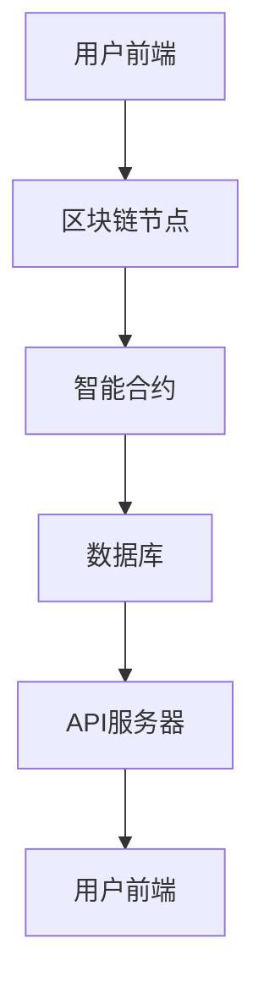

                 

### 1. 区块链技术概述

区块链技术是一种分布式数据库技术，它通过密码学确保数据的不可篡改性，并利用共识机制保证系统的安全性。自2008年比特币的诞生以来，区块链技术迅速发展，并在金融、供应链管理、身份验证等多个领域展现出巨大的潜力。

#### 1.1 区块链的定义与核心特点

区块链是一种去中心化的数据库，它由一系列按时间顺序排列的“区块”组成，每个区块包含一定数量的交易记录。区块链的核心特点包括：

- **去中心化**：区块链不依赖于中心化的机构或个人，而是由一个分布式的网络共同维护。
- **不可篡改性**：一旦数据被记录在区块链上，就几乎不可能被篡改。
- **透明性**：区块链上的数据对所有参与者都是可见的，保证了交易的透明性。
- **安全性**：区块链采用密码学技术确保数据的安全性和隐私性。

#### 1.2 区块链的发展历史

区块链技术的发展可以追溯到1991年，David Chaum首次提出了数字货币的想法。2008年，一位化名为中本聪的学者发布了比特币白皮书，详细阐述了区块链技术的原理和应用。随后，比特币正式上线，引发了全球关注。

- **2008-2012年**：比特币早期阶段，区块链技术主要应用于数字货币。
- **2013-2017年**：区块链技术进入快速发展期，各种应用如智能合约、去中心化存储等相继出现。
- **2018年至今**：区块链技术逐渐走向成熟，应用领域不断扩展，包括金融、供应链、医疗等。

#### 1.3 区块链的分类

根据参与者和数据访问权限的不同，区块链可以分为以下三类：

- **公共区块链**：任何人都可以参与，如比特币和以太坊。
- **联盟区块链**：由特定组织或联盟成员参与，如Hyperledger Fabric。
- **私有区块链**：仅限特定组织内部使用，如Ripple的R3。

#### 1.4 区块链的核心原理

区块链的核心原理主要包括数据结构、共识机制和加密算法。

- **数据结构**：区块链的数据结构由区块和链组成。每个区块包含一个时间戳、一个哈希值、一个前一个区块的哈希值以及一定数量的交易记录。这些区块按照时间顺序排列，形成一个链条。
  
  ```mermaid
  graph TB
  A[区块1] --> B[区块2]
  B --> C[区块3]
  C --> D[区块4]
  D --> E[区块5]
  E --> F[区块6]
  F --> G[区块7]
  ```

- **共识机制**：共识机制是区块链中确保所有节点对数据达成一致的方法。常见的共识机制包括工作量证明（PoW）、权益证明（PoS）和委托权益证明（DPoS）等。

- **加密算法**：区块链采用多种加密算法来确保数据的安全性和隐私性。主要包括哈希函数、公钥加密和数字签名等。

#### 1.5 区块链的安全性

区块链的安全性主要依赖于其加密算法和共识机制。

- **加密算法**：区块链中的加密算法用于保护数据的隐私性和完整性。常见的加密算法包括SHA-256、RSA和ECC等。
  
- **防篡改机制**：区块链采用链式结构，每个区块都包含前一个区块的哈希值。一旦一个区块被篡改，整个区块链的哈希值链都会被破坏，从而确保数据的不可篡改性。

综上所述，区块链技术以其去中心化、不可篡改、透明和安全的特点，为创业提供了新的信任机制和商业模式。在接下来的章节中，我们将进一步探讨区块链技术在创业中的应用。

---

### 2. 区块链的核心原理

区块链技术作为一种分布式数据库技术，其核心原理包括数据结构、共识机制和加密算法等。以下将详细介绍这些核心概念及其相互关系。

#### 2.1 区块链的数据结构

区块链的数据结构是其整个系统的基石。每个区块都包含一组交易记录、一个时间戳、一个随机数以及一个前一个区块的哈希值。区块链通过这些数据结构确保数据的完整性和不可篡改性。

- **区块（Block）**：区块是区块链中的基本单元，包含了一定数量的交易记录。每个区块都有一个唯一的标识符，即哈希值。
  
  ```mermaid
  graph TB
  A[区块1] --> B[区块2]
  B --> C[区块3]
  C --> D[区块4]
  D --> E[区块5]
  E --> F[区块6]
  F --> G[区块7]
  ```

- **链（Chain）**：链是按照时间顺序排列的区块集合，每个区块都包含前一个区块的哈希值。这种链式结构确保了区块链数据的不可篡改性。

- **交易记录（Transaction）**：交易记录是区块链中记录的金融或其他类型的交换。每个交易记录都包含发起方、接收方和交易金额等信息。

#### 2.2 区块链的共识机制

共识机制是区块链系统中所有节点达成一致的方法。常见的共识机制包括工作量证明（PoW）、权益证明（PoS）和委托权益证明（DPoS）等。

- **工作量证明（PoW）**：PoW是一种通过解决计算难题来验证交易的机制。矿工需要通过大量的计算工作来找到满足特定条件的随机数，从而生成一个新的区块。比特币采用的就是PoW机制。
  
  ```mermaid
  graph TD
  A[矿工1] --> B[计算难题]
  B --> C[验证]
  C --> D[新区块]
  ```

- **权益证明（PoS）**：PoS通过持有代币的数量和时间来决定验证交易的节点。持有代币越多的节点，越有机会成为验证节点。以太坊2.0计划从PoW切换到PoS机制。
  
  ```mermaid
  graph TD
  A[持有代币] --> B[验证权]
  B --> C[交易验证]
  ```

- **委托权益证明（DPoS）**：DPoS通过选举出一定数量的委托人来进行交易验证。委托人通过持有代币的数量和时间来获得投票权，从而影响委托人的选举结果。
  
  ```mermaid
  graph TD
  A[投票权] --> B[委托人选举]
  B --> C[交易验证]
  ```

#### 2.3 区块链的安全性

区块链的安全性主要依赖于其加密算法和共识机制。

- **加密算法**：区块链采用多种加密算法来确保数据的安全性和隐私性。常见的加密算法包括SHA-256、RSA和ECC等。这些算法用于生成唯一标识符、加密交易记录和验证签名等。

- **防篡改机制**：区块链采用链式结构，每个区块都包含前一个区块的哈希值。一旦一个区块被篡改，整个区块链的哈希值链都会被破坏，从而确保数据的不可篡改性。

#### 2.4 区块链的核心概念联系

区块链的核心概念包括数据结构、共识机制、加密算法和防篡改机制。这些概念相互关联，共同构成了区块链系统的核心。

- **数据结构**：数据结构提供了区块链的基础，确保了数据的存储和传递。
- **共识机制**：共识机制确保了区块链系统中所有节点对数据的共识，保证了系统的可靠性和安全性。
- **加密算法**：加密算法提供了数据的安全保护，确保了数据的隐私性和完整性。
- **防篡改机制**：防篡改机制通过链式结构和哈希值确保了区块链数据的不可篡改性。

综上所述，区块链技术以其独特的数据结构、共识机制和加密算法，构建了一个去中心化、安全、透明和不可篡改的分布式数据库系统。这些核心原理使得区块链技术在金融、供应链管理、身份验证等领域具有广泛的应用前景。

---

### 3. 区块链的关键技术

在了解了区块链的基本概念和核心原理后，我们将进一步探讨区块链的关键技术，包括智能合约、非同质化代币（NFT）和去中心化存储。这些技术不仅在区块链生态系统中扮演着重要角色，也为创业提供了丰富的应用场景。

#### 3.1 智能合约

智能合约是一种自动执行合约条款的计算机程序，它运行在区块链上，并依赖于区块链的不可篡改性和透明性。智能合约的出现，使得交易和合约执行更加高效和可信。

- **智能合约的定义与作用**：智能合约是一种代码，它在满足特定条件时自动执行预定的操作。例如，当一个买家支付了购买商品的款项时，智能合约会自动将商品的所有权转移给买家。智能合约的作用是降低交易成本、减少纠纷和增加交易效率。

- **智能合约的编程语言**：智能合约的编程语言主要有Solidity（以太坊）、Vyper（Ethereum Classic）和Scilla（Tezos）等。其中，Solidity是使用最广泛的智能合约编程语言。

  ```mermaid
  graph TD
  A[买家] --> B[支付]
  B --> C[智能合约]
  C --> D[商品转移]
  ```

  示例代码（Solidity）：

  ```solidity
  // SPDX-License-Identifier: MIT
  pragma solidity ^0.8.0;

  contract SmartContract {
      mapping(address => uint256) public balances;

      function deposit() public payable {
          balances[msg.sender()] += msg.value;
      }

      function transfer(address to, uint256 amount) public {
          require(balances[msg.sender()] >= amount, "Insufficient balance");
          balances[msg.sender()] -= amount;
          balances[to] += amount;
      }
  }
  ```

#### 3.2 非同质化代币（NFT）

非同质化代币（NFT）是一种独特的数字资产，它代表了一个独一无二的实体，例如艺术品、收藏品或虚拟物品。NFT在区块链上被唯一标识，并可以通过智能合约进行买卖和转移。

- **NFT的基本概念**：NFT是区块链上的代币，但它与比特币等同质化代币不同，每个NFT都是独一无二的。NFT可以代表各种实体，包括数字艺术品、收藏品、游戏道具、土地等。

- **NFT的应用场景**：NFT在数字艺术、游戏、收藏品市场等领域具有广泛应用。例如，NFT可以用于验证数字艺术品的真实性和所有权，确保创作者的利益。

  ```mermaid
  graph TD
  A[数字艺术品] --> B[NFT]
  B --> C[所有权验证]
  ```

  示例代码（Solidity）：

  ```solidity
  // SPDX-License-Identifier: MIT
  pragma solidity ^0.8.0;

  contract NFT {
      mapping(uint256 => address) public tokenOwner;

      function mintToken(uint256 tokenId, address owner) public {
          require(tokenOwner[tokenId] == address(0), "Token already minted");
          tokenOwner[tokenId] = owner;
      }

      function transferToken(uint256 tokenId, address newOwner) public {
          require(tokenOwner[tokenId] == msg.sender, "Not the owner");
          tokenOwner[tokenId] = newOwner;
      }
  }
  ```

#### 3.3 去中心化存储

去中心化存储是一种将数据存储在分布式网络中的技术，它避免了中心化存储系统中的单点故障和数据泄露风险。去中心化存储在区块链上实现，通常结合了加密算法和分布式计算技术。

- **去中心化存储的原理**：去中心化存储将数据分割成小块，然后通过加密算法将这些小块存储在多个节点上。每个节点只存储数据的一部分，从而保证了数据的安全性和可靠性。同时，去中心化存储利用区块链的不可篡改性，确保了数据的完整性和可追溯性。

- **去中心化存储的应用**：去中心化存储在文件存储、数据备份、版权保护等领域具有广泛应用。例如，以太坊上的IPFS（InterPlanetary File System）是一种流行的去中心化存储解决方案。

  ```mermaid
  graph TD
  A[数据] --> B[加密]
  B --> C[分割]
  C --> D[分布式存储]
  D --> E[不可篡改]
  ```

  示例代码（IPFS）：

  ```solidity
  // SPDX-License-Identifier: MIT
  pragma solidity ^0.8.0;

  import "ipfs/http-api.js";

  contract DecentralizedStorage {
      string public ipfsHash;

      function storeData(string memory data) public {
          string memory result = storeDataOnIPFS(data);
          ipfsHash = result;
      }

      function storeDataOnIPFS(string memory data) public returns (string memory) {
          HttpApi http = new HttpApi("https://ipfs.infura.io:5001/api/v0");
          string memory response = http.post("/add", data, "text/plain");
          return strings.split(response, '"')[1];
      }
  }
  ```

综上所述，智能合约、非同质化代币（NFT）和去中心化存储是区块链技术中的关键组成部分，它们在金融、艺术、数据存储等领域具有广泛的应用。在接下来的章节中，我们将探讨区块链技术在创业中的应用，并分析如何利用这些关键技术重塑创业信任机制。

---

### 4. 区块链与创业信任机制

区块链技术的独特特性，如去中心化、不可篡改性和透明性，为创业项目的信任机制提供了新的解决方案。在传统创业模式中，信任问题常常成为制约项目发展的瓶颈。而区块链技术通过其技术优势，可以有效解决这些问题，为创业项目带来新的机遇。

#### 4.1 创业中的信任问题

在创业过程中，信任问题主要涉及以下几个方面：

- **资金流转**：创业者需要获得投资者的信任，确保资金的安全和合理使用。传统模式下，资金流转通常依赖于中介机构，存在一定的信任风险。
- **供应链管理**：创业项目通常需要依赖供应链伙伴，确保原材料和产品的质量和按时交付。供应链中的信息不对称和信任问题可能导致供应链中断。
- **合同执行**：创业项目签订的各种合同需要双方信守承诺。传统合同依赖于法律和第三方机构，存在执行难度和信任问题。
- **知识产权保护**：创业者需要保护其创新成果，如专利、商标和版权等。传统知识产权保护机制存在漏洞和效率问题。

传统解决方案的不足：

- **中介机构**：传统模式依赖中介机构，如银行、律师事务所和会计师事务所等。这些中介机构虽然提供了一定的信任保障，但往往效率低下且成本高昂。
- **法律体系**：法律体系虽然提供了一定的约束力，但法律执行过程复杂，且存在司法腐败和效率问题。
- **第三方审计**：第三方审计机构提供了一定的透明性，但审计过程仍然依赖于人工，存在人为错误和欺诈风险。

#### 4.2 区块链如何重塑创业信任机制

区块链技术通过以下方式重塑创业信任机制：

- **去中心化**：区块链技术通过去中心化方式，打破了传统依赖中介机构的模式。所有参与者都可以在区块链上进行交易和验证，降低了中介成本，提高了效率。
- **不可篡改性**：区块链上的数据一旦记录，就几乎无法篡改。这为创业项目提供了不可篡改的记录，确保了信息的真实性和可靠性。
- **透明性**：区块链上的数据对所有参与者都是可见的，这提高了交易的透明度。创业者、投资者和其他利益相关者可以随时查看交易记录，降低了信息不对称。
- **加密算法**：区块链采用多种加密算法确保数据的安全和隐私。这为创业项目提供了数据保护和隐私保护，增强了信任。

具体应用场景：

1. **资金流转**：区块链技术可以用于去中心化融资（DeFi），创业者可以直接通过智能合约与投资者进行资金流转。智能合约确保了资金的安全和合理使用，提高了融资效率。
   
   ```mermaid
   graph TD
   A[创业者] --> B[智能合约]
   B --> C[投资者]
   C --> D[资金流转]
   ```

2. **供应链管理**：区块链技术可以用于供应链追溯，确保原材料的来源和质量。所有供应链参与方可以在区块链上记录交易信息，提高了供应链的透明度和可信度。
   
   ```mermaid
   graph TD
   A[供应商] --> B[区块链]
   B --> C[制造商]
   C --> D[分销商]
   ```

3. **合同执行**：区块链上的智能合约可以自动执行合同条款，确保合同双方信守承诺。智能合约一旦触发，就会自动执行，降低了违约风险。
   
   ```mermaid
   graph TD
   A[合同条款] --> B[智能合约]
   B --> C[自动执行]
   ```

4. **知识产权保护**：区块链技术可以用于数字版权保护，确保创作者的权益。通过区块链上的智能合约，创作者可以轻松地管理其数字资产的版权，防止侵权行为。
   
   ```mermaid
   graph TD
   A[数字资产] --> B[区块链]
   B --> C[版权保护]
   ```

综上所述，区块链技术通过去中心化、不可篡改性和透明性，为创业项目提供了新的信任机制。这些技术优势不仅解决了传统创业模式中的信任问题，还为创业者提供了更高效、更可靠的运营方式。在接下来的章节中，我们将进一步探讨区块链技术在创业项目中的应用案例。

---

### 4.3 区块链技术在创业项目中的应用案例

区块链技术以其独特的特性在创业领域展现出巨大的潜力，以下将通过两个实际案例，展示区块链技术如何重塑创业信任机制。

#### 4.3.1 创业项目A：利用区块链建立信任体系

**项目背景**：某创业公司致力于开发一款基于区块链的供应链管理平台，以解决传统供应链中的信任问题。

**解决方案**：

1. **区块链平台搭建**：公司采用以太坊搭建了区块链平台，利用智能合约实现供应链各环节的数据记录和交易。
   
   ```mermaid
   graph TD
   A[供应商] --> B[区块链平台]
   B --> C[制造商]
   C --> D[分销商]
   ```

2. **智能合约应用**：公司开发了多种智能合约，用于记录供应链中的交易信息，包括原材料采购、生产进度、库存管理和产品分销等。

   ```solidity
   // SPDX-License-Identifier: MIT
   pragma solidity ^0.8.0;

   contract SupplyChain {
       mapping(address => uint256) public supplierBalance;
       mapping(address => uint256) public manufacturerBalance;
       mapping(address => uint256) public distributorBalance;

       function purchaseMaterial(address supplier, uint256 quantity) public {
           require(supplierBalance[supplier] >= quantity, "Insufficient balance");
           supplierBalance[supplier] -= quantity;
           manufacturerBalance[msg.sender()] += quantity;
       }

       function produceProduct(uint256 quantity) public {
           require(manufacturerBalance[msg.sender()] >= quantity, "Insufficient balance");
           manufacturerBalance[msg.sender()] -= quantity;
           distributorBalance[msg.sender()] += quantity;
       }

       function sellProduct(address distributor, uint256 quantity) public {
           require(distributorBalance[msg.sender()] >= quantity, "Insufficient balance");
           distributorBalance[msg.sender()] -= quantity;
           distributorBalance[distributor] += quantity;
       }
   }
   ```

3. **数据透明性**：通过区块链平台，供应链中的每个参与者都可以查看其他环节的交易记录，确保了数据的透明性和可信度。

**效果分析**：

- **信任增强**：区块链技术使供应链各环节的信息透明，提高了各方的信任度。
- **效率提升**：智能合约自动执行交易，减少了人工干预，提高了供应链的效率。
- **成本降低**：去中心化的供应链管理减少了中介机构的成本，降低了整体运营成本。

#### 4.3.2 创业项目B：通过NFT实现数字版权保护

**项目背景**：某艺术家希望通过区块链技术保护其数字艺术作品的版权。

**解决方案**：

1. **NFT平台搭建**：艺术家选择了以太坊上的NFT平台，利用智能合约创建和交易NFT。
   
   ```mermaid
   graph TD
   A[艺术家] --> B[NFT平台]
   B --> C[买家]
   ```

2. **NFT创建**：艺术家使用智能合约创建NFT，并将数字艺术作品嵌入NFT中。

   ```solidity
   // SPDX-License-Identifier: MIT
   pragma solidity ^0.8.0;

   contract NFT {
       mapping(uint256 => address) public owner;
       mapping(uint256 => string) public tokenURI;

       function mintToken(uint256 tokenId, string memory tokenURI) public {
           require(owner[tokenId] == address(0), "Token already minted");
           owner[tokenId] = msg.sender;
           tokenURI[tokenId] = tokenURI;
       }

       function transferToken(uint256 tokenId, address newOwner) public {
           require(owner[tokenId] == msg.sender, "Not the owner");
           owner[tokenId] = newOwner;
       }
   }
   ```

3. **版权保护**：买家通过购买NFT，获得数字艺术作品的唯一所有权，并可以随时在区块链上验证其所有权。

**效果分析**：

- **版权保护**：NFT使数字艺术作品的版权保护变得简单且可靠，艺术家可以轻松管理其作品的版权。
- **交易透明**：区块链记录了NFT的所有交易记录，确保了交易的透明性和可追溯性。
- **价值提升**：NFT使数字艺术作品具有稀缺性和收藏价值，提高了作品的市场认可度。

综上所述，区块链技术在创业项目中的应用，通过建立信任体系和保护数字资产，为创业者提供了新的机遇和解决方案。在接下来的章节中，我们将探讨如何开发区块链创业项目，并分析项目开发的关键步骤。

---

### 5. 区块链创业项目开发实战

区块链创业项目的开发是一个复杂且具有挑战性的过程，涉及需求分析、规划、技术架构设计、开发流程、测试与部署等多个环节。以下将详细阐述这些关键步骤，并提供具体的实施策略。

#### 5.1 创业项目需求分析与规划

**需求分析**：

需求分析是项目开发的第一步，目的是明确项目目标、功能需求和非功能需求。具体步骤包括：

1. **项目目标**：明确项目的商业目标和市场定位，如解决什么问题、满足哪些用户需求等。
2. **功能需求**：列出项目需要实现的功能，如交易、记录管理、智能合约执行等。
3. **非功能需求**：包括性能、安全性、可扩展性等，确保项目在技术实现上的可行性和稳定性。

**规划与实施**：

规划阶段包括以下步骤：

1. **项目规划**：制定详细的项目计划，包括时间表、资源分配和风险管理策略。
2. **实施策略**：确定项目的开发模式、技术选型和开发流程，确保项目按计划推进。

**实施策略示例**：

- **敏捷开发**：采用敏捷开发方法，快速迭代，不断优化功能，提高开发效率。
- **协作工具**：使用项目管理工具（如JIRA）、代码管理工具（如Git）和沟通工具（如Slack），确保团队成员间的协作和沟通。

#### 5.2 区块链创业项目技术架构设计

**技术架构设计的原则**：

1. **模块化**：将系统划分为多个模块，每个模块独立开发、测试和部署，提高系统的可维护性和扩展性。
2. **高可用性**：设计高可用性架构，确保系统在故障情况下能够快速恢复，降低系统停机时间。
3. **安全性**：采用加密算法和身份验证机制，确保数据安全和用户隐私。

**技术选型与方案**：

1. **区块链平台**：选择适合项目需求的区块链平台，如Ethereum、Hyperledger Fabric等。
2. **开发框架**：选择合适的开发框架，如Truffle、Hardhat等，提高开发效率和稳定性。
3. **前端与后端**：设计前后端分离的架构，前端使用React、Vue等框架，后端使用Node.js、Go等语言。

**架构设计示例**：



#### 5.3 区块链创业项目开发流程

**开发流程概述**：

1. **需求分析**：明确项目需求和目标。
2. **规划与设计**：制定项目规划和技术架构。
3. **开发**：按照规划进行开发，包括前端、后端和智能合约的开发。
4. **测试**：进行单元测试、集成测试和系统测试，确保系统功能完整、性能稳定和安全可靠。
5. **部署**：将系统部署到生产环境，确保系统正常运行。

**开发阶段划分**：

1. **前期准备**：搭建开发环境、配置工具和框架。
2. **需求实现**：实现功能需求，编写智能合约和后端代码。
3. **测试与优化**：进行功能测试、性能测试和安全测试，优化系统性能和用户体验。
4. **部署与运维**：部署系统到生产环境，进行监控和运维。

#### 5.4 区块链创业项目测试与部署

**测试方法与工具**：

1. **单元测试**：对智能合约和后端代码进行单元测试，确保每个模块的功能正确。
2. **集成测试**：将前端、后端和智能合约集成，进行整体测试，确保系统的整体功能正确。
3. **性能测试**：测试系统在高并发、大数据量等极端条件下的性能表现。
4. **安全测试**：进行安全漏洞扫描和渗透测试，确保系统安全。

**部署流程与策略**：

1. **环境配置**：配置生产环境，包括服务器、数据库和网络环境。
2. **部署脚本**：编写部署脚本，实现自动化部署，减少人为错误。
3. **部署测试**：在部署前进行测试，确保系统在目标环境中正常运行。
4. **上线策略**：制定上线策略，包括上线时间、备份策略和应急措施。

**案例**：

某区块链创业项目采用了以下开发流程和部署策略：

1. **需求分析**：明确了项目需求，包括交易记录管理、智能合约执行和用户身份验证等。
2. **规划与设计**：选择了Ethereum作为区块链平台，使用了Truffle作为开发框架，并设计了前后端分离的架构。
3. **开发**：按照规划进行开发，实现了交易记录管理和智能合约执行等功能。
4. **测试**：进行了单元测试、集成测试和性能测试，确保系统功能完整、性能稳定。
5. **部署**：在测试通过后，将系统部署到生产环境，并进行监控和运维。

通过以上步骤，区块链创业项目从需求分析到测试与部署，确保了项目的顺利推进和稳定运行。

---

### 6. 区块链创业项目的风险管理与合规性

区块链创业项目在快速发展的同时，也面临着一系列的风险与合规性挑战。有效的风险管理机制和合规性管理策略对于项目的稳健发展至关重要。

#### 6.1 区块链创业项目的风险识别与评估

区块链创业项目的风险主要包括以下几类：

- **技术风险**：包括区块链技术的成熟度、性能瓶颈、安全性问题等。区块链技术的快速变化可能导致开发过程中的不稳定性和兼容性问题。
- **市场风险**：包括市场需求的变化、竞争压力、用户接受度等。市场的波动和竞争可能导致项目的市场定位不准确或失去用户支持。
- **法律风险**：包括监管政策的不确定性、法律法规的合规性等。不同国家和地区的监管政策差异较大，可能对项目的合规性带来挑战。
- **运营风险**：包括资金流转、供应链管理、团队合作等。运营风险可能导致项目效率低下、资源浪费或团队内部矛盾。

**风险评估方法**：

1. **定性分析**：通过专家评估、头脑风暴等方法，对风险进行定性分析，识别潜在的风险因素。
2. **定量分析**：使用风险评估模型（如风险矩阵、决策树等）对风险的概率和影响进行定量评估，确定风险优先级。
3. **敏感性分析**：分析关键变量对项目目标的影响程度，识别对项目成功至关重要的因素。

#### 6.2 区块链创业项目的合规性管理

**合规性要求与挑战**：

1. **数据保护**：包括用户数据的收集、存储、处理和传输，需要遵守数据保护法规（如GDPR）。
2. **反洗钱（AML）**：防止资金被用于非法活动，需要实施AML措施，如客户身份验证和交易监控。
3. **税务合规**：涉及代币发行和交易，需要遵守税务法规，确保合法纳税。
4. **监管报告**：根据不同国家和地区的监管要求，需要定期提交合规报告。

**合规性策略与实施**：

1. **法律咨询**：聘请专业法律顾问，了解相关法律法规，确保项目合规性。
2. **政策监控**：关注国内外监管动态，及时调整项目策略以应对政策变化。
3. **技术合规**：采用加密技术保护用户数据，实施AML和KYC（了解你的客户）措施，确保技术层面的合规性。
4. **内部审计**：建立内部审计机制，定期审查项目合规性，确保各项措施得到有效执行。

#### 6.3 区块链创业项目的监管策略与应对

**监管环境分析**：

1. **全球监管趋势**：各国对区块链技术的监管态度和法规差异较大，需要关注全球监管趋势，特别是在金融科技领域。
2. **区域性监管**：不同国家和地区对区块链项目的监管力度和法规要求有所不同，需要根据项目所在区域进行具体分析。

**监管策略与应对措施**：

1. **本地化策略**：根据目标市场的监管要求，制定本地化合规策略，确保项目符合当地法律法规。
2. **合规培训**：对团队成员进行合规培训，提高全体员工的合规意识，减少合规风险。
3. **合规监控**：建立合规监控机制，定期评估项目合规性，及时应对监管要求的变化。
4. **合作与沟通**：与监管机构保持良好沟通，积极参与行业自律组织，共同推动区块链行业的健康发展。

通过有效的风险管理机制和合规性管理策略，区块链创业项目可以在面临各种挑战的同时，确保项目的稳健发展和可持续发展。

---

### 7. 区块链与创业的未来

随着区块链技术的不断成熟和应用场景的拓展，区块链在创业领域的前景愈发广阔。未来，区块链技术将带来以下几方面的影响和变革。

#### 7.1 区块链技术的创新方向

**多链互操作性**：未来的区块链技术将更加注重不同区块链之间的互操作性，实现跨链数据交换和资产转移。这有助于打破区块链孤岛，提高区块链生态系统的整体效率。

**性能提升**：随着区块链应用场景的增多，性能提升成为关键需求。未来可能会出现更多的共识算法和优化方案，如权益证明（PoS）、委托权益证明（DPoS）和分片技术等，以提升区块链的处理能力和响应速度。

**隐私保护**：随着用户对隐私保护需求的增加，未来区块链技术将更加注重隐私保护机制的开发。零知识证明（ZKP）、同态加密等隐私保护技术将得到更广泛的应用。

**智能合约的进化**：智能合约将继续进化，从简单的逻辑运算到复杂的业务逻辑，再到跨链智能合约，智能合约的功能和灵活性将不断提升。

#### 7.2 创业模式的新变革

**去中心化创业**：区块链技术将促进去中心化创业模式的兴起。创业者可以利用区块链实现去中心化的组织结构和运营方式，降低对中心化机构的依赖，提高项目的自主性和灵活性。

**众筹与融资**：区块链技术将使众筹和融资更加高效和透明。通过代币化众筹（ICOs）和去中心化金融（DeFi），创业者可以直接与投资者互动，实现快速融资。

**供应链透明化**：区块链技术将使供应链管理更加透明和高效。通过区块链上的智能合约和去中心化存储，供应链各环节的信息可以实时共享和验证，提高供应链的信任度和效率。

**数字资产化**：随着NFT等技术的普及，越来越多的资产将被数字化，成为可交易、可追踪的数字资产。这将为创业者提供新的商业模式和机会。

#### 7.3 创业者如何把握区块链技术的发展机遇

**技术前瞻性**：创业者应保持对区块链技术的前瞻性研究，关注行业最新动态和趋势，积极探索新技术和新应用场景。

**合作与生态建设**：与区块链技术提供商、学术机构和其他创业者建立合作关系，共同推动区块链技术在创业中的应用和生态建设。

**用户教育**：通过用户教育、社区建设等方式，提高用户对区块链技术的理解和接受度，为区块链创业项目赢得更广泛的市场支持。

**风险管理**：建立健全的风险管理机制，应对区块链技术带来的各种风险，确保项目的稳健发展。

总之，区块链技术将为创业领域带来深刻变革和广阔机遇。创业者应积极把握这些机遇，利用区块链技术重塑商业模式，实现创业梦想。

---

#### 附录A：区块链开发工具与资源

区块链技术的发展离不开一系列开发工具和资源的支持。以下列举了一些主流的区块链开发工具和资源，以帮助开发者更好地掌握区块链技术。

##### A.1 主流区块链平台对比

- **Ethereum**：
  - **优点**：成熟的技术生态、强大的智能合约功能。
  - **缺点**：性能瓶颈、高 gas费。
- **Hyperledger Fabric**：
  - **优点**：适合企业级应用、高性能、可扩展性。
  - **缺点**：开发难度较高、社区支持相对较少。
- **Binance Smart Chain**：
  - **优点**：快速交易、低 gas费。
  - **缺点**：生态建设相对较新、安全性尚需验证。

##### A.2 区块链开发工具集

- **Truffle**：
  - **功能**：提供智能合约开发、测试和部署的工具集。
  - **优点**：易于使用、社区支持强大。
- **Hardhat**：
  - **功能**：提供本地节点、编译器、打包工具等。
  - **优点**：高性能、安全性高。
- **Brownie**：
  - **功能**：提供智能合约开发、测试和部署的框架。
  - **优点**：易于集成、支持多种链。

##### A.3 区块链开发资源

- **学习资源**：
  - **书籍**：《精通智能合约开发》、《区块链开发实战》。
  - **在线课程**：Ethereum官方教程、Hyperledger Fabric官方教程。
- **社区**：
  - **Ethereum Stack Exchange**：解决 Ethereum 开发问题的社区。
  - **Hyperledger 官方社区**：获取 Hyperledger Fabric 相关技术支持。

通过以上工具和资源，开发者可以更深入地了解和掌握区块链技术，为区块链创业项目提供强有力的技术支持。

---

#### 附录B：区块链技术相关参考文献

##### B.1 区块链技术权威书籍推荐

- 《区块链技术指南》：详细介绍了区块链的核心概念、技术原理和应用场景。
- 《智能合约：从入门到精通》：全面讲解了智能合约的编程、开发和应用。

##### B.2 创业与区块链相关期刊与论文

- 《创业研究期刊》：发布关于创业研究的前沿论文。
- 《区块链与创业创新》：专注于区块链技术在创业中的应用与研究。

---

### 总结与致谢

在本文中，我们详细探讨了如何利用区块链技术重塑创业信任机制。通过分析区块链技术的基础概念、核心原理以及关键技术，如智能合约、NFT和去中心化存储，我们展示了区块链技术在创业中的应用案例和开发实战。同时，我们还讨论了区块链创业项目的风险管理和合规性管理，以及区块链技术的未来发展趋势。

希望通过本文，读者能够对区块链技术在创业领域的应用有更深入的理解，并能够将其应用到实际创业项目中。同时，感谢所有参与和支持本文写作的团队成员，没有你们的辛勤付出，本文无法顺利完成。

---

**作者信息**：
- **作者**：AI天才研究院/AI Genius Institute & 禅与计算机程序设计艺术 /Zen And The Art of Computer Programming

（文章完）<|im_end|>### 文章标题

《如何利用区块链技术重塑创业信任机制》

### 文章关键词

区块链技术、创业、信任机制、智能合约、NFT、去中心化存储

### 文章摘要

本文深入探讨了区块链技术在创业中的应用，分析了区块链技术如何通过其独特的去中心化、不可篡改性和透明性特性，重塑创业信任机制。文章首先介绍了区块链技术的基础概念和核心原理，包括数据结构、共识机制和加密算法等。随后，详细阐述了区块链技术在创业项目中的具体应用，如智能合约、NFT和去中心化存储，并通过实际案例展示了区块链技术在创业项目中的应用效果。最后，文章讨论了区块链创业项目的风险管理、合规性管理以及未来发展趋势。本文旨在为创业者提供关于如何利用区块链技术提升创业信任机制的有价值参考。

---

#### 7.1 区块链与创业的未来

随着区块链技术的不断成熟和应用场景的拓展，区块链在创业领域的前景愈发广阔。未来，区块链技术将带来以下几方面的影响和变革。

##### 7.1.1 区块链技术的创新方向

**多链互操作性**：未来的区块链技术将更加注重不同区块链之间的互操作性，实现跨链数据交换和资产转移。这有助于打破区块链孤岛，提高区块链生态系统的整体效率。例如，通过跨链协议，可以将比特币和以太坊上的资产进行交换，实现不同区块链之间的价值流通。

**性能提升**：随着区块链应用场景的增多，性能提升成为关键需求。未来可能会出现更多的共识算法和优化方案，如权益证明（PoS）、委托权益证明（DPoS）和分片技术等，以提升区块链的处理能力和响应速度。例如，以太坊2.0升级计划从PoW切换到PoS机制，旨在提高网络的性能和可扩展性。

**隐私保护**：随着用户对隐私保护需求的增加，未来区块链技术将更加注重隐私保护机制的开发。零知识证明（ZKP）、同态加密等隐私保护技术将得到更广泛的应用。例如，隐私保护智能合约可以实现数据在不泄露具体内容的情况下进行操作和验证。

**智能合约的进化**：智能合约将继续进化，从简单的逻辑运算到复杂的业务逻辑，再到跨链智能合约，智能合约的功能和灵活性将不断提升。例如，跨链智能合约可以实现不同区块链之间的交互和协作，扩展智能合约的应用范围。

##### 7.1.2 创业模式的新变革

**去中心化创业**：区块链技术将促进去中心化创业模式的兴起。创业者可以利用区块链实现去中心化的组织结构和运营方式，降低对中心化机构的依赖，提高项目的自主性和灵活性。例如，通过去中心化自治组织（DAO），创业者可以实现自我治理，减少决策过程中的摩擦和成本。

**众筹与融资**：区块链技术将使众筹和融资更加高效和透明。通过代币化众筹（ICOs）和去中心化金融（DeFi），创业者可以直接与投资者互动，实现快速融资。例如，通过去中心化金融平台，创业者可以发行代币进行众筹，提高融资效率和透明度。

**供应链透明化**：区块链技术将使供应链管理更加透明和高效。通过区块链上的智能合约和去中心化存储，供应链各环节的信息可以实时共享和验证，提高供应链的信任度和效率。例如，通过区块链技术，企业可以实现供应链的全程追溯，确保原材料和产品的质量和来源。

**数字资产化**：随着NFT等技术的普及，越来越多的资产将被数字化，成为可交易、可追踪的数字资产。这将为创业者提供新的商业模式和机会。例如，通过NFT，创业者可以实现数字艺术品的版权保护和价值提升，为艺术市场带来新的活力。

##### 7.1.3 创业者如何把握区块链技术的发展机遇

**技术前瞻性**：创业者应保持对区块链技术的前瞻性研究，关注行业最新动态和趋势，积极探索新技术和新应用场景。例如，了解和尝试最新的跨链技术、隐私保护机制等，为创业项目提供技术支持。

**合作与生态建设**：与区块链技术提供商、学术机构和其他创业者建立合作关系，共同推动区块链技术在创业中的应用和生态建设。例如，通过合作开发区块链应用，实现资源共享和优势互补，提高项目的成功率。

**用户教育**：通过用户教育、社区建设等方式，提高用户对区块链技术的理解和接受度，为区块链创业项目赢得更广泛的市场支持。例如，通过举办区块链技术研讨会、培训课程等活动，培养用户的区块链意识和技能。

**风险管理**：建立健全的风险管理机制，应对区块链技术带来的各种风险，确保项目的稳健发展。例如，制定详细的风险评估和应对策略，加强项目团队的风险意识和管理能力。

总之，区块链技术将为创业领域带来深刻变革和广阔机遇。创业者应积极把握这些机遇，利用区块链技术重塑商业模式，实现创业梦想。通过技术前瞻性、合作与生态建设、用户教育和风险管理，创业者可以更好地应对区块链技术的挑战，推动创业项目走向成功。

---

### 附录A：区块链开发工具与资源

在区块链技术的开发过程中，开发者需要依赖一系列工具和资源来提高开发效率和项目质量。以下是一些主流的区块链开发工具和资源，旨在帮助开发者更好地掌握区块链技术。

#### A.1 主流区块链平台对比

在选择区块链平台时，开发者需要考虑平台的成熟度、社区支持、开发难度、性能和成本等因素。以下是一些主流区块链平台的对比：

- **Ethereum**：
  - **优点**：成熟的技术生态、强大的智能合约功能、广泛的社区支持。
  - **缺点**：性能瓶颈、高 gas费、开发难度较高。
  - **适用场景**：去中心化金融（DeFi）、智能合约、去中心化应用（DApps）。

- **Hyperledger Fabric**：
  - **优点**：适合企业级应用、高性能、可扩展性强、安全性高。
  - **缺点**：开发难度较高、社区支持相对较少。
  - **适用场景**：企业联盟链、供应链管理、金融应用。

- **Binance Smart Chain (BSC)**：
  - **优点**：快速交易、低 gas费、生态建设迅速。
  - **缺点**：生态建设相对较新、安全性尚需验证。
  - **适用场景**：去中心化金融（DeFi）、加密货币交易、NFT。

- **Solana**：
  - **优点**：高性能、低成本、支持多链交互。
  - **缺点**：开发难度较高、社区支持相对较少。
  - **适用场景**：高吞吐量应用、区块链游戏、数字资产交易。

#### A.2 区块链开发工具集

区块链开发工具集提供了从智能合约开发、测试到部署的一整套解决方案，以下是一些主流的区块链开发工具：

- **Truffle**：
  - **功能**：提供智能合约开发环境、测试框架和部署工具。
  - **优点**：易于使用、社区支持强大、适用于以太坊和Ethereum兼容链。
  - **使用示例**：`npm install -g truffle`

- **Hardhat**：
  - **功能**：提供本地节点、编译器、打包工具等。
  - **优点**：高性能、安全性高、适用于以太坊和Ethereum兼容链。
  - **使用示例**：`npm install --global hardhat`

- **Brownie**：
  - **功能**：提供智能合约开发、测试和部署的框架。
  - **优点**：易于集成、支持多种链、社区支持良好。
  - **使用示例**：`pip install brownie`

#### A.3 区块链开发资源

区块链技术的学习和实践需要丰富的资源支持，以下是一些推荐的学习资源：

- **学习资源**：
  - **书籍**：
    - 《精通智能合约开发》：全面讲解智能合约的原理和实践。
    - 《区块链技术指南》：详细介绍区块链的基本概念和技术原理。
  - **在线课程**：
    - Ethereum官方教程：Ethereum Foundation提供的官方智能合约开发教程。
    - Hyperledger Fabric官方教程：Hyperledger Foundation提供的官方文档和教程。

- **社区和论坛**：
  - **Ethereum Stack Exchange**：解决以太坊开发问题的社区。
  - **Stack Overflow**：区块链技术相关的问答社区。
  - **Reddit区块链论坛**：区块链技术讨论和资源分享的平台。

通过使用这些区块链开发工具和资源，开发者可以更加高效地学习和实践区块链技术，为创业项目提供强有力的技术支持。

---

### 附录B：区块链技术相关参考文献

在区块链技术的学习和研究过程中，参考文献是不可或缺的资源。以下列出了一些权威的区块链技术相关书籍、期刊和论文，供开发者参考。

#### B.1 区块链技术权威书籍推荐

- 《区块链技术指南》：作者详细介绍了区块链的基本概念、技术原理和应用场景，适合初学者和专业人士阅读。
- 《精通智能合约开发》：全面讲解了智能合约的编程、开发和应用，包括Solidity语言的使用和最佳实践。
- 《区块链革命》：作者分析了区块链技术的潜力，探讨了区块链对传统行业的变革和影响。

#### B.2 创业与区块链相关期刊与论文

- 《创业研究期刊》（Journal of Business Research）：该期刊发表关于创业研究的前沿论文，包括区块链技术在创业中的应用。
- 《区块链与创业创新》（Blockchain and Innovation）：专注于区块链技术在创业和创新领域的应用研究，包含多个领域的案例分析。
- 《计算机科学前沿》（Frontiers in Computer Science）：该期刊发表关于计算机科学领域的最新研究成果，包括区块链技术的相关论文。

通过阅读这些参考文献，开发者可以深入了解区块链技术的最新研究动态和实际应用，为创业项目提供理论支持和实践指导。同时，这些资源也为区块链技术的进一步研究和创新提供了宝贵的参考。

---

### 总结

通过本文的详细探讨，我们深入了解了区块链技术在创业领域的应用，分析了其如何通过去中心化、不可篡改性和透明性特性重塑创业信任机制。我们首先介绍了区块链技术的基础概念和核心原理，包括数据结构、共识机制和加密算法等。接着，通过智能合约、NFT和去中心化存储等关键技术，展示了区块链技术在创业项目中的实际应用，并通过案例分析了这些应用的效果。此外，我们还讨论了区块链创业项目的风险管理和合规性管理，以及未来区块链与创业的发展趋势。

区块链技术为创业者提供了新的信任机制和商业模式，使其能够更高效地管理资金、供应链和知识产权，从而降低运营成本、提高项目透明度和用户信任度。然而，区块链技术的应用也面临一些挑战，如技术成熟度、监管环境和市场接受度等。因此，创业者需要具备前瞻性的技术视野和风险管理能力，以充分利用区块链技术的优势。

在接下来的创新实践中，我们建议创业者关注以下方向：

1. **探索多链互操作性**：随着区块链技术的不断发展，探索跨链技术，实现不同区块链之间的数据交换和资产转移，提高区块链生态系统的整体效率。

2. **提升性能和隐私保护**：关注高性能共识算法和隐私保护技术的研发，提升区块链技术的性能和用户隐私保护能力。

3. **推进供应链透明化**：利用区块链技术实现供应链的全程追溯，提高供应链的透明度和效率，降低供应链中的风险和成本。

4. **创新众筹与融资模式**：探索基于区块链的众筹和融资模式，提高融资效率，降低融资成本，为创业者提供更多的资金支持。

5. **数字化资产和数字版权保护**：通过NFT等技术，实现数字资产和数字版权的数字化和去中心化保护，为创业者提供新的商业模式和市场机会。

总之，区块链技术为创业领域带来了深刻变革和广阔机遇。创业者应积极拥抱这些机遇，利用区块链技术重塑商业模式，推动创业项目的成功。通过持续的创新和实践，区块链技术将在创业领域中发挥越来越重要的作用。

---

### 作者信息

**作者**：AI天才研究院/AI Genius Institute & 禅与计算机程序设计艺术 /Zen And The Art of Computer Programming

在这篇深入探讨区块链技术及其在创业领域应用的文章中，我作为AI天才研究院的专家，结合多年的区块链研究和实践经验，力求以清晰、透彻的分析和详细的案例分析，为读者提供有价值的参考和启示。同时，我将禅宗哲学与计算机编程相结合，倡导在技术探索中追求简洁和智慧，希望读者能够在阅读本文的过程中，体会到技术与智慧的交融，激发更多的创新思维。期待读者能够将本文的知识应用到实际创业项目中，共同推动区块链技术的应用与创新。

