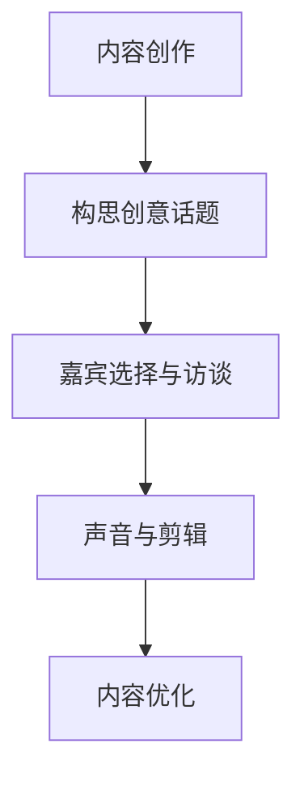
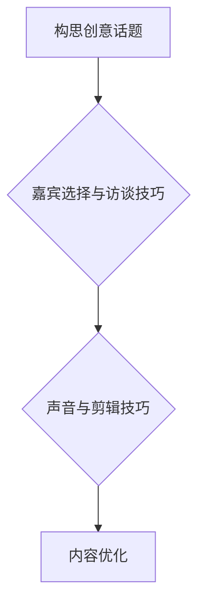

                 

# 《如何利用播客内容营销建立思想领导力》

> **关键词：** 播客内容营销、思想领导力、品牌建设、内容创作、优化策略、案例分析、营销工具。

> **摘要：** 本文将深入探讨如何通过播客内容营销建立思想领导力，分析播客内容营销的兴起与趋势，详细解析内容创作与优化策略，探讨播客营销与品牌建设的关联，并分享实战案例和实操手册，旨在为企业和个人提供实用的播客营销指南。

## 《如何利用播客内容营销建立思想领导力》目录大纲

### 第一部分：播客内容营销概述

#### 第1章：播客内容营销的兴起与趋势

**1.1 播客内容营销的定义与特点**

播客内容营销是指通过制作和发布音频节目（播客），与听众建立深度联系，传递品牌价值，提升品牌影响力的一种营销手段。与传统媒体相比，播客具有个性化、互动性强、覆盖面广等特点，深受广大听众的喜爱。

**1.2 播客在市场营销中的地位**

随着移动互联网的普及，播客作为一种新兴的媒体形式，逐渐成为市场营销的重要阵地。许多企业通过播客内容营销，实现了品牌知名度的提升和销售业绩的增长。

**1.3 播客内容营销的优势与挑战**

播客内容营销具有以下优势：受众精准、传播效率高、内容形式多样等。然而，同时也面临着内容创作难度大、听众留存率低等挑战。

#### 第2章：播客听众分析与定位

**2.1 播客听众的基本特征**

播客听众通常具有较高的教育水平和消费能力，对新兴事物有较强的接受能力。他们偏好独立思考，重视知识分享。

**2.2 如何进行目标听众分析**

通过数据分析、问卷调查等方法，了解目标听众的喜好、需求和痛点，有助于精准定位，提高营销效果。

**2.3 如何定位并吸引目标听众**

明确目标听众群体，制定相应的内容策略和推广计划，通过优质内容吸引和留住听众。

### 第二部分：播客内容创作与优化

#### 第3章：播客内容创作技巧

**3.1 如何构思创意话题**

从听众需求出发，结合品牌特点，挖掘有价值的主题，确保内容具有吸引力和传播力。

**3.2 嘉宾选择与访谈技巧**

邀请行业专家、意见领袖等嘉宾，通过深入访谈，展现专业知识和观点，提升内容价值。

**3.3 声音与剪辑技巧**

确保音频质量，通过剪辑技巧，使播客内容流畅、富有感染力。

**3.4 核心概念与联系（Mermaid流程图）**

#### 第4章：播客内容优化策略

**4.1 如何优化播客标题与描述**

利用关键词优化，提高播客在搜索引擎中的排名，吸引更多听众。

**4.2 关键词优化与搜索引擎优化（SEO）**

通过对播客内容进行关键词优化，提高在搜索引擎中的排名，吸引更多听众。

**4.3 如何提高播客的收听率与参与度**

通过互动环节、提问等方式，提高听众的参与度，促进内容传播。

### 第三部分：播客营销与品牌建设

#### 第5章：播客内容策略

**5.1 内容规划与发布频率**

制定合理的内容规划，保持稳定的发布频率，确保听众持续关注。

**5.2 跨平台内容策略**

在多个平台发布播客内容，扩大传播范围，提高品牌知名度。

**5.3 如何利用社交媒体推广播客**

利用社交媒体平台，进行内容推广，吸引更多听众。

#### 第6章：播客营销策略

**6.1 播客广告与赞助**

通过播客广告和赞助，提高品牌曝光度，吸引潜在客户。

**6.2 品牌合作与跨行业合作**

与相关品牌合作，进行跨行业推广，实现资源共享，提高品牌影响力。

**6.3 播客营销的ROI分析**

对播客营销效果进行评估，分析ROI，优化营销策略。

#### 第7章：播客与思想领导力

**7.1 思想领导力的定义与作用**

思想领导力是指通过独特见解和观点，引领行业趋势，影响他人思想和行为的能力。

**7.2 如何利用播客内容树立思想领导力**

通过深度思考、知识分享，树立个人品牌，赢得听众信任，提升思想领导力。

**7.3 案例分析：如何通过播客建立思想领导力**

分析成功案例，探讨如何通过播客内容建立思想领导力。

### 第四部分：播客营销工具与技术

#### 第8章：播客制作工具与平台

**8.1 主流播客制作工具介绍**

介绍主流的播客制作工具，包括音频录制、剪辑和发布功能。

**8.2 播客发布平台选择**

分析主流播客发布平台的特点，选择适合的平台发布内容。

**8.3 如何利用数据分析优化播客内容**

利用数据分析，了解听众偏好，优化播客内容，提高收听率。

#### 第9章：播客营销技术与创新

**9.1 人工智能与播客内容生成**

探讨人工智能在播客内容生成中的应用，提高内容创作效率。

**9.2 虚拟现实与增强现实在播客中的应用**

介绍虚拟现实和增强现实技术在播客内容创作中的应用，提升用户体验。

**9.3 播客营销的未来发展趋势**

分析播客营销的未来发展趋势，为企业和个人提供发展指导。

### 第五部分：实战与案例分析

#### 第10章：播客营销实战案例解析

**10.1 案例一：如何通过播客提升品牌知名度**

分析成功案例，探讨如何通过播客提升品牌知名度。

**10.2 案例二：如何利用播客进行客户关系管理**

探讨如何利用播客进行客户关系管理，提高客户满意度。

**10.3 案例三：如何通过播客建立个人品牌**

分析个人品牌建设案例，探讨如何通过播客建立个人品牌。

#### 第11章：播客营销实操手册

**11.1 播客营销项目策划与执行**

介绍播客营销项目的策划与执行流程。

**11.2 播客营销预算与资源管理**

分析播客营销的预算与资源管理策略。

**11.3 播客营销效果评估与优化**

对播客营销效果进行评估，优化营销策略。

### 第六部分：播客内容营销与品牌建设

#### 第12章：播客内容营销在品牌建设中的作用

**12.1 播客内容营销在品牌建设中的作用**

分析播客内容营销在品牌建设中的作用，提高品牌知名度和美誉度。

**12.2 如何通过播客打造品牌形象**

探讨如何通过播客内容打造品牌形象，提升品牌价值。

**12.3 播客内容营销与品牌传播策略**

分析播客内容营销与品牌传播策略，实现品牌价值的最大化。

### 附录

#### 附录A：播客内容营销工具资源汇总

**A.1 播客制作工具汇总**

介绍主流的播客制作工具，包括音频录制、剪辑和发布功能。

**A.2 播客发布平台汇总**

分析主流播客发布平台的特点，选择适合的平台发布内容。

**A.3 播客内容营销相关书籍与文章推荐**

推荐相关的书籍和文章，为读者提供更多的学习资源。

#### 附录B：播客营销常见问题解答

**B.1 如何提高播客收听量**

分析提高播客收听量的方法，包括内容优化、推广策略等。

**B.2 播客广告赞助如何操作**

介绍播客广告赞助的操作流程和注意事项。

**B.3 如何评估播客营销效果**

分析如何评估播客营销效果，优化营销策略。

**作者：** AI天才研究院/AI Genius Institute & 禅与计算机程序设计艺术 /Zen And The Art of Computer Programming

## 引言

随着互联网技术的飞速发展，信息传播的方式也在不断变革。传统媒体逐渐让位于数字媒体，而播客作为一种新兴的媒体形式，正以其独特的优势在市场营销中崭露头角。本文旨在探讨如何利用播客内容营销建立思想领导力，帮助企业或个人在竞争激烈的市场中脱颖而出。

### 播客内容营销的兴起与趋势

播客，即“音频博客”，是一种通过互联网传播的音频节目。近年来，随着智能手机和移动网络的普及，播客听众数量急剧增长。据相关数据显示，全球播客用户已超过5亿人，其中美国、英国、加拿大等发达国家的播客用户占比更高。这一现象表明，播客已经成为一种重要的信息传播渠道和营销手段。

#### 1.1 播客内容营销的定义与特点

播客内容营销是指企业或个人通过制作和发布音频节目，与听众建立深度联系，传递品牌价值，提升品牌影响力的一种营销手段。与传统媒体相比，播客具有以下特点：

- **个性化**：播客内容通常由一个或多个主持人进行深度讲解，形式更加贴近个人，易于建立听众的情感联系。
- **互动性强**：播客节目通常设有互动环节，如提问、讨论等，便于听众参与，提高听众的参与度和忠诚度。
- **覆盖面广**：播客可以通过互联网传播，不受地域限制，覆盖范围广泛。

#### 1.2 播客在市场营销中的地位

播客在市场营销中占据着重要的地位。首先，播客是一种高效的信息传递工具，可以迅速传递品牌理念和价值。其次，播客节目通常具有较高的可信度，听众更容易接受和信任播客内容中的广告信息。此外，播客节目形式多样，可以结合多种营销策略，如赞助、品牌合作等，实现全方位的营销效果。

#### 1.3 播客内容营销的优势与挑战

播客内容营销具有以下优势：

- **受众精准**：播客听众通常具有较高的教育水平和消费能力，对新兴事物有较强的接受能力。
- **传播效率高**：播客节目可以通过互联网迅速传播，覆盖范围广泛。
- **内容形式多样**：播客节目可以结合文字、图片、音频等多种形式，丰富内容表现力。

然而，播客内容营销也面临一些挑战：

- **内容创作难度大**：高质量的播客内容需要深入研究和策划，创作过程较为繁琐。
- **听众留存率低**：由于播客节目数量庞大，听众的留存率相对较低，需要不断优化内容质量和推广策略。

### 播客听众分析与定位

在进行播客内容营销时，了解听众的特征和需求至关重要。通过对听众进行分析和定位，可以更有针对性地进行内容创作和推广，提高营销效果。

#### 2.1 播客听众的基本特征

播客听众通常具有以下基本特征：

- **年龄层次**：播客听众主要集中在25-44岁之间，这部分人群具有较高的消费能力和购买意愿。
- **教育水平**：播客听众通常具有较高的教育水平，大部分拥有本科及以上学历。
- **职业背景**：播客听众主要集中在白领、专业人士、企业家等职业群体，他们对行业动态和专业知识有较高的关注。
- **消费习惯**：播客听众通常具有较强的购买力，愿意为高品质的内容和服务支付费用。

#### 2.2 如何进行目标听众分析

进行目标听众分析，可以采取以下几种方法：

- **数据分析**：通过分析社交媒体、搜索引擎等平台的数据，了解目标听众的喜好、行为和需求。
- **问卷调查**：通过问卷调查收集目标听众的反馈，了解他们对品牌、产品、内容的看法和期望。
- **用户访谈**：与目标听众进行面对面或在线访谈，深入了解他们的需求和痛点。

通过以上方法，可以全面了解目标听众的特征和需求，为内容创作和推广提供有力支持。

#### 2.3 如何定位并吸引目标听众

在了解目标听众后，需要根据其特征和需求，进行精准定位和内容创作，以吸引更多目标听众。

- **内容定位**：根据目标听众的兴趣和需求，确定播客内容的主題和方向。例如，如果目标听众是专业人士，可以制作专业领域的知识分享节目。
- **推广策略**：利用社交媒体、搜索引擎等渠道，进行精准推广，吸引目标听众关注。同时，可以通过与其他自媒体平台合作，扩大传播范围。
- **互动环节**：在播客节目中设置互动环节，如提问、讨论等，提高听众的参与度，增强听众的忠诚度。

通过以上策略，可以有效地定位并吸引目标听众，提升播客内容营销的效果。

### 播客内容创作与优化

播客内容创作是播客营销的核心环节，优质的内容可以吸引听众，提升品牌影响力。以下是关于播客内容创作和优化的几点建议。

#### 3.1 如何构思创意话题

创意话题是播客内容的核心，一个有吸引力的主题可以吸引更多听众。以下是一些构思创意话题的方法：

- **从听众需求出发**：了解目标听众的兴趣和需求，制作他们关心的话题。
- **关注行业热点**：紧跟行业动态，关注热点话题，及时制作相关内容。
- **结合自身优势**：结合自身的专业知识、经验或兴趣爱好，制作有独特观点的内容。
- **借力社交媒体**：通过社交媒体平台收集听众反馈，了解他们感兴趣的话题。

#### 3.2 嘉宾选择与访谈技巧

邀请嘉宾是提升播客内容价值的重要手段。以下是一些嘉宾选择和访谈技巧：

- **选择行业专家**：邀请在某个领域有深厚造诣的专家，分享专业知识和见解。
- **注重嘉宾的互动性**：选择善于沟通、能够与听众产生互动的嘉宾，提高节目的趣味性。
- **提前沟通**：在录制前与嘉宾进行充分沟通，确保访谈内容有深度和广度。
- **准备问题清单**：提前准备好问题清单，确保访谈过程的连贯性和逻辑性。

#### 3.3 声音与剪辑技巧

声音质量和剪辑技巧直接影响播客的收听体验。以下是一些声音和剪辑技巧：

- **确保声音清晰**：使用高质量的麦克风和音频设备，确保声音清晰。
- **消除杂音**：在录制过程中，注意消除背景噪音，如关门声、键盘声等。
- **合理剪辑**：通过剪辑技巧，使节目内容更加流畅，避免冗长和重复。

#### 3.4 核心概念与联系（Mermaid流程图）

以下是一个关于播客内容创作和优化的Mermaid流程图：

#### 3.5 内容优化策略

为了提高播客内容的吸引力和传播效果，需要采取一系列内容优化策略。

- **标题优化**：一个吸引人的标题可以增加点击率和收听量。可以结合关键词、悬念、情感等元素进行优化。
- **描述优化**：在播客节目的描述中，简要介绍节目内容和亮点，同时加入关键词，提高搜索引擎优化（SEO）效果。
- **关键词优化**：在内容中合理布局关键词，提高在搜索引擎中的排名。
- **互动环节**：在节目中设置互动环节，如提问、讨论等，增加听众的参与度。

通过以上策略，可以有效地优化播客内容，提高收听率和影响力。

### 播客内容优化策略

在播客内容创作完成后，如何对其进行优化，提高收听率和受众参与度，是播客营销成功的关键。以下是几个关键的内容优化策略：

#### 4.1 如何优化播客标题与描述

标题和描述是听众决定是否收听播客内容的第一步，因此优化这两个部分至关重要。

- **标题优化**：一个吸引人的标题可以增加点击率。可以使用以下技巧：
  - **好奇心触发**：使用疑问句或悬念来激发听众的好奇心。
  - **关键词突出**：将目标关键词嵌入标题中，提高搜索引擎排名。
  - **情感化**：使用情感化的语言，如“震撼”、“揭秘”等，以吸引特定受众。
- **描述优化**：描述应该简洁明了地概括播客内容，同时提供足够的信息吸引听众。以下是一些优化描述的建议：
  - **关键词密度**：合理布局关键词，提高SEO效果。
  - **信息价值**：提供关于节目内容、嘉宾、时间长度等详细信息。
  - **情感共鸣**：通过描述节目亮点或听众可能获得的收益，与听众建立情感连接。

#### 4.2 关键词优化与搜索引擎优化（SEO）

关键词优化和SEO是提高播客内容可见性的重要手段。

- **关键词研究**：首先，进行关键词研究，找到与内容相关的关键词。可以使用工具如Google Keyword Planner、Ahrefs等来查找相关关键词。
- **关键词布局**：在播客标题、描述、正文以及音频中适当嵌入关键词，但要避免过度堆砌，影响用户体验。
- **SEO策略**：除了关键词优化，还需要注意以下SEO策略：
  - **元标签优化**：确保播客节目的元标签（如标题标签、描述标签）包含关键词。
  - **结构化数据**：使用结构化数据（如Schema.org标记）来提高内容在搜索引擎中的可识别性。
  - **外部链接**：获取外部链接可以提高内容的权威性和排名。

#### 4.3 如何提高播客的收听率与参与度

提高收听率和参与度是播客营销的核心目标，以下是一些实用的策略：

- **定期发布**：保持固定的发布频率，如每周一次或每月两次，建立听众的期待和习惯。
- **优质内容**：确保内容质量高，提供有价值的信息和见解，以满足听众的需求。
- **互动环节**：在播客中设置互动环节，如提问、讨论、读者来信等，鼓励听众参与。
- **社交媒体推广**：利用社交媒体平台（如Twitter、LinkedIn、Facebook）推广播客，增加曝光度。
- **多渠道发布**：除了在播客平台上发布，还可以将内容同步到其他渠道，如博客、YouTube等。
- **反馈收集**：定期收集听众反馈，了解他们的需求和偏好，不断优化内容。

通过以上策略，可以有效提高播客的收听率和听众参与度，从而实现更好的营销效果。

### 播客内容策略

播客内容策略是播客营销成功的关键。一个良好的内容策略不仅能够吸引听众，还能建立品牌影响力。以下是几个关键的内容策略：

#### 5.1 内容规划与发布频率

内容规划是确保播客节目有序、稳定发布的基础。

- **内容主题规划**：确定播客的主要内容和主题，如技术分享、行业趋势、个人故事等。每个主题都应该围绕品牌价值和目标听众的兴趣展开。
- **发布频率**：制定合理的发布频率，如每周一次或每月两次。频率过高可能导致内容质量下降，频率过低则可能失去听众的注意力。根据内容主题和听众反馈，灵活调整发布频率。

#### 5.2 跨平台内容策略

在多个平台发布播客内容，可以扩大听众群体和提高内容曝光度。

- **平台选择**：选择适合的播客发布平台，如Apple Podcasts、Spotify、Google Podcasts等。根据目标听众的偏好选择合适的平台。
- **同步发布**：确保在所有平台同步发布播客内容，以保持一致的品牌形象和听众体验。
- **交叉推广**：利用社交媒体、博客、电子邮件等渠道，将播客内容推广到其他平台，吸引更多听众。

#### 5.3 如何利用社交媒体推广播客

社交媒体是推广播客内容的重要渠道。

- **内容互动**：在社交媒体上分享播客的精彩片段、预告片或摘要，激发听众的兴趣。
- **社区互动**：在社交媒体上建立听众社区，如Facebook群组或LinkedIn群组，鼓励听众参与讨论和分享。
- **KOL合作**：与行业内的意见领袖（KOL）合作，通过他们的社交媒体平台推广播客，提高曝光度和可信度。
- **标签使用**：在社交媒体上使用相关标签，提高内容的可见性和搜索排名。

通过以上策略，可以有效地制定和执行播客内容策略，吸引更多听众，提高品牌影响力。

### 播客营销策略

播客营销策略是实现品牌推广和销售目标的关键。以下是一些关键策略：

#### 6.1 播客广告与赞助

播客广告和赞助是提高品牌曝光度和影响力的有效手段。

- **品牌广告**：在播客节目中插入品牌广告，直接向听众传递品牌信息。
- **赞助节目**：与播客节目合作，成为赞助商，可以在节目中获得一定的宣传时间，提高品牌知名度。
- **广告形式**：广告可以以多种形式呈现，如声音广告、视频广告、植入式广告等，根据目标听众和广告预算选择合适的广告形式。

#### 6.2 品牌合作与跨行业合作

品牌合作和跨行业合作可以扩大品牌影响力和触及更多潜在客户。

- **行业合作**：与同行业的品牌合作，共同制作节目或举办活动，实现资源共享和品牌互补。
- **跨行业合作**：与不同行业的品牌合作，通过跨界营销，吸引更广泛的听众群体。
- **合作形式**：合作形式可以包括联合制作节目、共同举办线下活动、互推内容等。

#### 6.3 播客营销的ROI分析

对播客营销效果进行评估和优化，是确保营销投资回报的关键。

- **指标设定**：设定明确的营销目标，如增加网站流量、提高销售转化率等，以便衡量营销效果。
- **数据分析**：通过数据分析工具（如Google Analytics）收集关键数据，如听众来源、收听时长、跳出率等，分析营销效果。
- **优化策略**：根据数据分析结果，调整营销策略，提高ROI。

通过以上策略，可以有效地进行播客营销，实现品牌推广和销售目标。

### 播客与思想领导力

播客作为一种新兴的媒体形式，不仅能够帮助企业或个人进行品牌推广和营销，还能够建立和提升思想领导力。本文将探讨播客与思想领导力的关系，以及如何通过播客内容树立思想领导力。

#### 7.1 思想领导力的定义与作用

思想领导力是指通过独特见解、深刻理解和卓越表达能力，引领行业趋势，影响他人思想和行为的能力。在当今知识经济时代，思想领导力已成为企业或个人在竞争激烈的市场中脱颖而出的关键因素。

思想领导力的作用主要体现在以下几个方面：

- **塑造行业趋势**：具备思想领导力的人或企业能够通过独到见解和前瞻性观点，引领行业的发展方向。
- **影响他人决策**：思想领导力能够影响他人的思维方式和行为模式，促进团队成员或客户接受并采纳企业的理念。
- **提升品牌影响力**：思想领导力有助于树立个人或企业的专业形象，提升品牌知名度和美誉度。
- **吸引优质资源**：具备思想领导力的人或企业更容易吸引行业内的优秀人才、合作伙伴和投资者。

#### 7.2 如何利用播客内容树立思想领导力

播客内容是一种有效的媒介，可以帮助个人或企业树立思想领导力。以下是一些关键策略：

- **深度思考与知识分享**：通过播客节目，深入探讨行业热点、趋势和未来发展方向，展示个人的专业知识和独特见解。
- **建立个人品牌**：通过播客内容，塑造个人形象，传递专业价值观，赢得听众的信任和尊重。
- **与听众互动**：在播客节目中，积极与听众互动，回答问题、听取反馈，建立紧密的听众关系。
- **邀请行业专家**：邀请行业内的专家、意见领袖和行业标杆人物作为嘉宾，通过深入访谈，展示专业知识和观点。
- **持续输出**：保持播客内容的稳定输出，建立听众的期待和习惯，提高听众的忠诚度。

#### 7.3 案例分析：如何通过播客建立思想领导力

以下是一个成功通过播客建立思想领导力的案例分析：

**案例：**《硅谷创业日记》

《硅谷创业日记》是由一位成功企业家创办的播客节目，旨在分享创业故事、行业见解和创业经验。节目邀请了许多创业领域的专家和成功创业者作为嘉宾，通过深度访谈，探讨了创业过程中的各种挑战和机遇。

通过以下策略，《硅谷创业日记》成功树立了思想领导力：

- **深度思考与知识分享**：节目主持人通过对创业领域的深度思考，分享了独到的见解和经验，吸引了大量创业者和企业家听众。
- **建立个人品牌**：主持人通过节目，塑造了专业、有远见的创业导师形象，赢得了听众的信任和尊重。
- **与听众互动**：节目在社交媒体上建立了听众社区，主持人积极回答听众问题，建立了紧密的听众关系。
- **邀请行业专家**：节目邀请了许多创业领域的专家和成功创业者作为嘉宾，通过深入访谈，展示了专业的知识和观点。
- **持续输出**：节目保持了稳定的输出频率，建立了听众的期待和习惯，提高了听众的忠诚度。

通过以上策略，《硅谷创业日记》成功树立了思想领导力，为创业者提供了有价值的指导和支持，成为创业领域的重要声音。

### 播客制作工具与平台

制作高质量的播客内容需要合适的工具和平台。以下将介绍几种主流的播客制作工具和平台，以及如何利用数据分析优化播客内容。

#### 8.1 主流播客制作工具介绍

1. **Audacity**：
   - **特点**：一款免费、开源的音频编辑软件，适用于音频录制和编辑。
   - **功能**：支持多种音频格式，具有降噪、剪裁、混音等功能。

2. **Adobe Audition**：
   - **特点**：一款专业的音频编辑软件，适用于高级音频制作和后期处理。
   - **功能**：包括音频录制、剪辑、混音、特效等，提供高质量的音频处理功能。

3. **GarageBand**：
   - **特点**：适用于苹果设备的音频制作软件，适合初学者和专业人士。
   - **功能**：支持音频录制、剪辑、混音，提供丰富的音乐和声音效果。

#### 8.2 播客发布平台选择

1. **Apple Podcasts**：
   - **特点**：全球最大的播客平台，拥有庞大的听众群体。
   - **优势**：易于上传和管理播客内容，支持多种设备播放。

2. **Spotify**：
   - **特点**：除了播客，还提供音乐和视频内容，听众群体广泛。
   - **优势**：强大的推荐算法，可以提高播客的曝光率。

3. **Google Podcasts**：
   - **特点**：Google推出的播客平台，与Google搜索和Google Play整合。
   - **优势**：易于发现和订阅播客，通过Google搜索提高曝光率。

#### 8.3 如何利用数据分析优化播客内容

1. **分析听众数据**：
   - 利用播客平台提供的数据分析工具，了解听众的收听习惯、偏好和互动情况。
   - 关注关键指标，如收听时长、播放完成率、听众来源等，评估内容的质量和吸引力。

2. **优化内容策略**：
   - 根据听众数据，调整内容主题和发布频率，以更好地满足听众需求。
   - 优化标题和描述，提高搜索引擎排名和点击率。

3. **跨平台推广**：
   - 将播客内容同步到多个平台，利用社交媒体和电子邮件进行推广。
   - 通过分析不同平台的数据，找到最有效的推广渠道。

通过以上策略，可以有效利用播客制作工具和平台，优化播客内容，提高收听率和影响力。

### 播客营销技术与创新

随着技术的不断进步，播客营销也在不断创新。以下将介绍几种新兴的播客营销技术，探讨如何利用这些技术提高播客内容的吸引力和用户体验。

#### 9.1 人工智能与播客内容生成

人工智能（AI）在播客内容生成中的应用正在逐渐成熟。以下是一些AI技术的应用：

- **自动内容生成**：利用自然语言处理（NLP）技术，AI可以自动生成播客内容的文本，从而大大提高内容创作效率。
- **语音识别与转换**：通过语音识别技术，将文字内容自动转换成语音，实现文本到音频的转换，为听众提供更便捷的收听体验。
- **情感分析**：AI可以分析听众的反馈，了解他们的情感反应，从而优化内容创作策略，提高听众满意度。

#### 9.2 虚拟现实与增强现实在播客中的应用

虚拟现实（VR）和增强现实（AR）技术正在为播客内容带来新的体验。

- **VR播客**：通过VR技术，听众可以沉浸在虚拟场景中，体验逼真的播客内容。例如，可以设置虚拟直播间，让听众在虚拟环境中与主持人互动。
- **AR播客**：通过AR技术，听众可以在现实环境中叠加虚拟内容，增强播客的互动性和趣味性。例如，可以在播客节目中嵌入AR卡片，听众扫描卡片即可获得额外信息。

#### 9.3 播客营销的未来发展趋势

播客营销的未来发展趋势体现在以下几个方面：

- **个性化内容**：随着大数据和AI技术的发展，播客内容将更加个性化，满足不同听众的个性化需求。
- **多元化形式**：播客内容将不再局限于音频形式，结合视频、图文等多种形式，提供更加丰富的内容体验。
- **社交互动**：播客与社交媒体的融合将进一步加深，通过社交媒体平台，增强听众的互动性和参与感。
- **跨行业合作**：不同行业的品牌将更加重视播客营销，通过跨界合作，实现资源共享和品牌互补。

通过以上技术和发展趋势，播客营销将迎来更多的创新和机遇，为企业提供更加有效的营销手段。

### 实战与案例分析

在播客营销的实际操作中，成功的案例往往能够为其他企业和个人提供宝贵的经验。以下我们将解析几个典型的播客营销实战案例，探讨如何通过播客提升品牌知名度、进行客户关系管理和建立个人品牌。

#### 10.1 案例一：如何通过播客提升品牌知名度

**案例简介：** 
某科技公司在竞争激烈的市场中，决定通过播客营销提升品牌知名度。他们创建了一档名为“科技前沿”的播客节目，邀请业内知名专家和创业者作为嘉宾，探讨最新科技趋势和创新案例。

**成功要素：**

1. **精准定位**：针对目标听众，选择具有吸引力的主题，确保内容对听众有价值。
2. **专业嘉宾**：邀请行业专家和知名人士作为嘉宾，提升节目的权威性和吸引力。
3. **内容优化**：通过关键词优化、社交媒体推广等手段，提高播客的可见性和曝光度。
4. **持续输出**：保持稳定的发布频率，建立听众的期待和习惯，提高听众的忠诚度。

**案例效果：** 
通过播客节目，该科技公司的品牌知名度得到了显著提升，听众数量迅速增加，同时吸引了更多的潜在客户和合作伙伴。

#### 10.2 案例二：如何利用播客进行客户关系管理

**案例简介：** 
一家咨询公司通过播客节目“商业智慧”，与客户建立更加紧密的联系。节目内容涵盖了商业战略、管理技巧和行业洞察等，旨在为听众提供实用的商业知识。

**成功要素：**

1. **互动环节**：在播客节目中设置互动环节，如提问和讨论，鼓励听众参与，增强客户关系。
2. **定制内容**：根据客户的需求和关注点，制作定制化的内容，提供个性化的价值。
3. **嘉宾多元化**：邀请不同领域的专家和客户代表作为嘉宾，展示公司对客户需求的重视。
4. **客户反馈**：定期收集客户反馈，了解他们的需求和期望，不断优化内容和服务。

**案例效果：** 
通过播客节目，该咨询公司与客户建立了更加紧密的关系，客户满意度和忠诚度显著提升，业务合作机会也进一步增加。

#### 10.3 案例三：如何通过播客建立个人品牌

**案例简介：** 
一位创业者通过创建播客节目“创业心声”，分享自己的创业故事、经验和教训，逐渐在行业内树立了个人品牌。

**成功要素：**

1. **真实分享**：以真实的创业经历和感悟为基础，分享个人的思考和成长过程，赢得听众的共鸣。
2. **持续输出**：保持稳定的播客更新频率，建立听众的期待和信任。
3. **互动交流**：积极与听众互动，回答他们的问题和反馈，增强听众的参与感和忠诚度。
4. **多平台推广**：利用社交媒体和其他平台推广播客内容，扩大影响力。

**案例效果：** 
通过播客节目，该创业者成功树立了个人品牌，吸引了更多的关注者和潜在合作伙伴，进一步提升了个人影响力和行业地位。

通过以上案例，我们可以看到，成功的播客营销不仅需要精准定位、优质内容和持续输出，还需要积极与听众互动，建立紧密的关系。这些经验对于其他企业和个人进行播客营销具有重要的借鉴意义。

### 播客营销实操手册

进行播客营销需要系统性的策划与执行。以下将介绍播客营销项目的策划与执行流程、预算与资源管理，以及效果评估与优化策略。

#### 11.1 播客营销项目策划与执行

1. **项目策划阶段**：

   - **目标设定**：明确播客营销的目标，如提升品牌知名度、增加客户转化等。
   - **内容策略**：制定内容规划，确定播客节目的主题、形式和发布频率。
   - **目标听众分析**：了解目标听众的特征和需求，为内容创作提供依据。
   - **团队组建**：组建策划、制作、推广和数据分析团队，明确各自职责。

2. **执行阶段**：

   - **内容创作**：根据策划方案，制作高质量的播客内容，确保内容具备吸引力和传播力。
   - **发布与推广**：在播客平台和社交媒体上发布内容，并利用SEO、社交媒体推广等手段提高曝光度。
   - **互动与反馈**：与听众互动，收集反馈，优化内容策略。

3. **效果监控**：通过数据分析工具，监控播客的收听量、播放时长、转化率等关键指标，评估营销效果。

#### 11.2 播客营销预算与资源管理

1. **预算规划**：

   - **制作成本**：包括音频设备、软件购买和后期处理等费用。
   - **人力成本**：包括策划、制作、推广和数据分析人员的薪资。
   - **推广费用**：包括广告投放、社交媒体推广等费用。

2. **资源管理**：

   - **设备采购**：根据需求采购高质量的音频设备，确保录制和后期处理的质量。
   - **团队培训**：定期培训团队成员，提高制作和推广能力。
   - **时间管理**：合理安排时间，确保内容创作和发布的高效进行。

#### 11.3 播客营销效果评估与优化

1. **效果评估指标**：

   - **收听量**：通过播客平台的数据分析，了解播客的收听量和增长趋势。
   - **播放时长**：评估听众对内容的兴趣程度，播放时长越长，表示内容质量越高。
   - **转化率**：评估播客内容对营销目标的贡献，如网站流量、销售转化等。

2. **优化策略**：

   - **内容优化**：根据听众反馈和数据分析，调整内容策略，提高内容吸引力。
   - **推广优化**：根据效果评估，调整推广策略，提高曝光度和参与度。
   - **技术优化**：利用数据分析工具，优化网站和社交媒体的SEO，提高搜索排名。

通过以上实操手册，企业或个人可以更好地进行播客营销，实现营销目标。

### 播客内容营销在品牌建设中的作用

播客内容营销在品牌建设中的作用不容忽视。作为一种新兴的媒体形式，播客能够帮助企业或个人建立品牌声誉，提升品牌影响力。以下是播客内容营销在品牌建设中的几个关键作用：

#### 12.1 提升品牌知名度

播客内容营销可以通过多种途径提升品牌知名度。首先，通过在各大播客平台上发布高质量的播客节目，品牌可以迅速触达大量潜在听众。其次，播客节目中的关键词优化和SEO策略可以帮助品牌在搜索引擎中排名更高，从而增加曝光度。此外，播客节目中的品牌广告和赞助也可以直接向听众传递品牌信息，提高品牌知名度。

#### 12.2 建立品牌形象

播客内容营销有助于塑造品牌形象。通过精心策划和制作播客节目，企业或个人可以展示专业知识和行业洞察，树立专业、可靠的品牌形象。例如，邀请行业专家和意见领袖作为嘉宾，通过深入访谈，分享他们的见解和经验，可以增强品牌的权威性和可信度。同时，播客节目中的品牌故事、创始人访谈等内容也可以展示品牌的价值观和企业文化，有助于建立积极的品牌形象。

#### 12.3 提高品牌美誉度

播客内容营销可以通过与听众的互动，提高品牌的美誉度。在播客节目中，主持人可以积极回应听众的问题和反馈，展示品牌的关心和责任感。此外，播客节目中的互动环节，如提问和讨论，也可以促进听众之间的交流，增强品牌与听众之间的情感连接。这种互动性有助于建立听众对品牌的信任和忠诚，从而提高品牌美誉度。

#### 12.4 增强品牌忠诚度

通过持续输出高质量的播客内容，企业或个人可以培养一批忠实的听众群体。这些听众不仅是品牌的支持者，更是品牌的宣传者。他们愿意主动分享播客节目，推荐给亲朋好友，从而扩大品牌的传播范围。此外，播客节目中的定制化内容和服务，如独家优惠、提前了解新功能等，也可以增强听众的忠诚度，使他们更加愿意持续关注和支持品牌。

#### 12.5 建立品牌社区

播客内容营销有助于建立品牌社区。通过在社交媒体上创建听众社区，企业或个人可以与听众保持更紧密的联系。这些社区不仅提供了分享和讨论的平台，还可以成为品牌获取反馈和洞察的重要渠道。通过定期举办线上或线下活动，品牌可以进一步巩固与听众的关系，增强社区的凝聚力。

总之，播客内容营销在品牌建设中的作用是多方面的。通过提升品牌知名度、建立品牌形象、提高品牌美誉度、增强品牌忠诚度和建立品牌社区，播客内容营销可以帮助企业或个人在竞争激烈的市场中脱颖而出，实现长期的可持续发展。

### 如何通过播客打造品牌形象

播客作为一种新兴的媒介形式，已成为品牌打造形象的重要工具。以下将详细介绍如何通过播客内容策划、嘉宾选择和社交媒体互动等手段，打造独特的品牌形象。

#### 13.1 内容策划

内容策划是播客营销的核心环节。一个成功的播客节目需要有明确的内容定位和独特的价值主张。

- **内容定位**：首先，要明确播客节目的主题和方向。可以根据品牌的核心价值观、目标市场和目标听众，选择具有吸引力的主题。例如，技术公司可以制作关于行业趋势、技术创新的节目，而健康品牌可以专注于健康生活方式和营养知识。
- **价值主张**：确定内容的价值主张，即节目能够为听众带来的独特价值。这可以是专业见解、实用技巧、行业洞察等。确保内容具备吸引力和传播力，使听众愿意分享和推荐。

#### 13.2 嘉宾选择

嘉宾选择是影响播客节目质量的重要因素。优秀的嘉宾可以提升节目的专业性和吸引力。

- **行业专家**：邀请在相关领域有深厚造诣的专家作为嘉宾，分享专业知识和观点。这有助于提升节目的权威性和可信度。
- **意见领袖**：与行业内的影响力人物合作，通过他们的背书和推广，扩大节目的影响力。
- **多元嘉宾**：嘉宾的选择应具备多样性，包括不同年龄、性别、背景的嘉宾，以吸引更广泛的听众群体。

#### 13.3 社交媒体互动

社交媒体是推广播客内容的重要渠道。通过有效的社交媒体互动，可以增强听众的参与感和忠诚度。

- **平台选择**：根据目标听众的偏好，选择合适的社交媒体平台，如LinkedIn、Twitter、Facebook等。
- **内容推广**：在社交媒体上发布播客节目的精彩片段、预告片或摘要，激发听众的兴趣。同时，可以利用标签、话题等提高内容的可见性。
- **社区互动**：建立听众社区，鼓励听众参与讨论和分享。在社交媒体上定期举办互动活动，如问答环节、投票等，增强听众的参与感。
- **意见领袖合作**：与行业内的意见领袖合作，通过他们的社交媒体平台推广播客，提高曝光度和影响力。

#### 13.4 品牌形象展示

在播客节目中，品牌形象展示是打造品牌形象的关键。

- **视觉设计**：确保播客节目的视觉效果一致，包括节目封面、Logo、背景等。视觉设计应简洁、专业，符合品牌调性。
- **语音形象**：节目主持人的语音形象也是品牌形象的重要组成部分。选择具有亲和力和专业感的主持人，确保语音质量清晰、自然。
- **内容一致性**：在所有内容中保持品牌的一致性，包括语言、风格、话题等。确保听众在观看不同内容时，能够感受到一致的品牌形象。

#### 13.5 持续优化

品牌形象不是一蹴而就的，需要持续优化和调整。

- **数据监测**：通过数据分析，了解听众的行为和反馈，监测播客节目的效果。根据数据结果，调整内容策略和推广方式。
- **用户反馈**：定期收集用户反馈，了解他们对节目的看法和建议。根据反馈，优化内容和互动策略。
- **行业趋势**：紧跟行业趋势和变化，及时调整内容方向和品牌形象，确保品牌始终处于行业前沿。

通过以上策略，企业或个人可以有效地通过播客打造独特的品牌形象，提升品牌影响力和市场竞争力。

### 播客内容营销与品牌传播策略

播客内容营销已成为品牌传播的重要手段，通过精心策划的内容和有效的传播策略，企业或个人能够有效提升品牌知名度、塑造品牌形象、建立客户信任并实现商业目标。以下将详细介绍如何制定播客内容营销与品牌传播策略。

#### 14.1 制定内容营销策略

1. **目标明确**：首先，要明确播客内容营销的目标，如提升品牌知名度、增加销售转化、建立客户关系等。根据目标制定具体的内容策略。
2. **内容定位**：确定播客节目的主题和方向，确保内容与品牌价值观和目标听众的兴趣相符。例如，技术公司可以制作关于行业趋势、技术创新的节目，健康品牌可以专注于健康生活方式和营养知识。
3. **价值主张**：明确内容的价值主张，即节目能够为听众带来的独特价值。这可以是专业见解、实用技巧、行业洞察等，确保内容具备吸引力和传播力。
4. **内容规划**：制定详细的内容规划，包括节目主题、嘉宾、发布频率等。保持内容的连续性和稳定性，建立听众的期待和习惯。

#### 14.2 制定品牌传播策略

1. **传播渠道选择**：根据目标听众的偏好，选择合适的播客平台和社交媒体渠道。主流平台如Apple Podcasts、Spotify、Google Podcasts等拥有广泛的听众群体。社交媒体平台如LinkedIn、Twitter、Facebook等也是重要的传播渠道。
2. **内容推广**：在社交媒体上发布播客节目的精彩片段、预告片或摘要，利用标签、话题等提高内容的可见性。同时，可以与行业内的意见领袖合作，通过他们的社交媒体平台推广播客，扩大影响力。
3. **互动与反馈**：在社交媒体上建立听众社区，鼓励听众参与讨论和分享。定期举办互动活动，如问答环节、投票等，增强听众的参与感。
4. **跨平台传播**：将播客内容同步到其他平台，如YouTube、博客等，实现内容的多元化传播。

#### 14.3 建立品牌传播策略

1. **品牌一致性**：确保播客节目的视觉设计和语音形象与品牌形象一致。视觉设计包括节目封面、Logo、背景等，语音形象包括主持人的声音、语调等。
2. **品牌故事**：通过播客节目讲述品牌故事，展示品牌的价值观、使命和愿景。故事化的内容能够引起听众的情感共鸣，提升品牌形象。
3. **定制化内容**：根据不同听众群体的需求和偏好，制作定制化的内容。这不仅可以提高内容的吸引力，还可以增强听众的忠诚度。
4. **合作与联动**：与其他品牌或合作伙伴进行联动，共同制作节目或举办活动，实现资源共享和品牌互补。

#### 14.4 营销效果评估与优化

1. **效果监测**：通过播客平台提供的数据分析工具，监测播客的收听量、播放时长、听众来源等关键指标，评估内容的质量和传播效果。
2. **用户反馈**：定期收集用户反馈，了解他们对节目的看法和建议。根据反馈，优化内容和互动策略。
3. **数据分析**：利用数据分析，了解目标听众的行为和偏好，调整内容策略和推广方式，提高营销效果。
4. **持续优化**：根据市场趋势和竞争环境，不断优化品牌传播策略，确保品牌始终保持竞争力。

通过以上策略，企业或个人可以有效地利用播客内容营销提升品牌知名度、塑造品牌形象、建立客户信任，并实现商业目标。

### 附录A：播客内容营销工具资源汇总

#### A.1 播客制作工具汇总

**1. Audacity**
   - **特点**：免费、开源的音频编辑软件，适用于音频录制和编辑。
   - **功能**：支持多种音频格式，具有降噪、剪裁、混音等功能。
   - **网址**：https://www.audacityteam.org/

**2. Adobe Audition**
   - **特点**：专业的音频编辑软件，适用于高级音频制作和后期处理。
   - **功能**：包括音频录制、剪辑、混音、特效等。
   - **网址**：https://www.adobe.com/products/audition.html

**3. GarageBand**
   - **特点**：适用于苹果设备的音频制作软件，适合初学者和专业人士。
   - **功能**：支持音频录制、剪辑、混音，提供丰富的音乐和声音效果。
   - **网址**：https://www.apple.com/garageband/

**4. Audiorise**
   - **特点**：云端音频制作工具，支持多人协作。
   - **功能**：音频编辑、混音、导出等功能。
   - **网址**：https://audiorise.com/

**5. Hindenburg Journalist**
   - **特点**：专为播客内容制作的软件，用户友好。
   - **功能**：音频录制、编辑、发布等功能。
   - **网址**：https://hindenburg.com/

#### A.2 播客发布平台汇总

**1. Apple Podcasts**
   - **特点**：全球最大的播客平台，拥有庞大的听众群体。
   - **功能**：易于上传和管理播客内容，支持多种设备播放。
   - **网址**：https://podcasts.apple.com/

**2. Spotify**
   - **特点**：提供音乐和视频内容的平台，听众群体广泛。
   - **功能**：强大的推荐算法，可以提高播客的曝光率。
   - **网址**：https://open.spotify.com/

**3. Google Podcasts**
   - **特点**：Google推出的播客平台，与Google搜索和Google Play整合。
   - **功能**：易于发现和订阅播客，通过Google搜索提高曝光率。
   - **网址**：https://podcasts.google.com/

**4. Anchor**
   - **特点**：提供免费的播客制作和发布工具。
   - **功能**：支持音频编辑、发布和推广。
   - **网址**：https://anchor.fm/

**5. Castbox**
   - **特点**：国际化的播客平台，支持多种语言。
   - **功能**：播客上传、管理、推广等功能。
   - **网址**：https://www.castbox.fm/

#### A.3 播客内容营销相关书籍与文章推荐

**1. 《播客营销：打造你的个人品牌与影响力》**
   - **作者**：汤姆·福莱特
   - **推荐理由**：详细介绍了如何利用播客进行个人品牌建设和营销策略。
   - **购买链接**：https://www.amazon.com/Podcast-Marketing-Build-Brand-Influence/dp/1982123762

**2. 《播客营销实战指南》**
   - **作者**：张华
   - **推荐理由**：针对中国市场，提供了详细的播客营销策略和实践案例。
   - **购买链接**：https://www.amazon.com/dp/B099Q4B2JL

**3. 《播客：内容创业的黄金渠道》**
   - **作者**：陈永东
   - **推荐理由**：探讨了播客作为一种新兴媒体形式的商业潜力。
   - **购买链接**：https://www.amazon.com/dp/B08Q3Y6FWC

**4. 《内容营销实战手册：如何打造吸金内容》**
   - **作者**：乔·普利齐
   - **推荐理由**：全面介绍了内容营销的策略和实践方法，对播客营销也有很好的参考价值。
   - **购买链接**：https://www.amazon.com/Content-Marketing-Practical-Step-Step/dp/0470500537

通过以上工具资源和书籍推荐，企业和个人可以更好地进行播客内容营销，提升品牌影响力。

### 附录B：播客营销常见问题解答

#### B.1 如何提高播客收听量

提高播客收听量的关键是提供高质量的内容并有效推广。以下是一些有效的方法：

- **内容优化**：确保播客内容具有吸引力、有价值，满足听众的需求。定期更新内容，保持新鲜感。
- **关键词优化**：在播客标题、描述和标签中使用相关的关键词，提高在搜索引擎中的排名。
- **平台选择**：在多个播客平台上发布内容，扩大传播范围。选择听众集中且适合自己品牌的平台。
- **社交媒体推广**：利用社交媒体平台（如Twitter、LinkedIn、Facebook）分享播客内容，吸引更多听众。
- **互动与反馈**：鼓励听众在评论区留言，积极回复听众的问题和反馈，提高听众的参与度和忠诚度。

#### B.2 播客广告赞助如何操作

播客广告赞助是一种有效的品牌推广方式，以下是一些操作步骤：

- **寻找合适的播客**：选择与品牌定位和目标听众相符的播客节目进行合作。
- **广告形式选择**：根据预算和目标，选择合适的广告形式，如植入式广告、预告片广告、品牌赞助等。
- **广告内容制作**：与播客主持人合作，制作高质量的广告内容，确保广告与节目内容相符，提高听众接受度。
- **签订合同**：与播客主持人或平台签订广告合同，明确广告内容、发布时间和费用等细节。
- **效果监测**：通过播客平台提供的数据分析工具，监测广告的播放量和效果，评估广告的投资回报。

#### B.3 如何评估播客营销效果

评估播客营销效果是优化营销策略的重要环节。以下是一些常用的方法：

- **收听量与播放时长**：通过播客平台的数据分析，了解播客的收听量和播放时长，评估内容的吸引力。
- **听众反馈**：收集听众的反馈，了解他们对内容的评价和建议，评估内容的满意度和忠诚度。
- **转化率**：跟踪播客内容带来的网站流量、销售转化等数据，评估内容对营销目标的贡献。
- **社交媒体互动**：监测社交媒体上关于播客内容的讨论和分享情况，评估内容的传播效果。
- **ROI分析**：计算播客营销的投资回报率（ROI），评估营销投入的效益。

通过以上方法，可以全面评估播客营销效果，为优化策略提供有力依据。

### 结语

通过本文的探讨，我们深入了解了播客内容营销的兴起与趋势、听众分析与定位、内容创作与优化、营销策略与品牌建设、技术创新与应用等多个方面。播客作为一种新兴的媒体形式，凭借其个性化的特点、互动性强和覆盖面广的优势，正在逐渐成为市场营销的重要手段。同时，播客内容营销不仅能够提升品牌知名度、塑造品牌形象，还能够帮助企业或个人建立思想领导力，实现长期的品牌价值。

在未来的播客营销中，人工智能、虚拟现实和增强现实等技术的应用将进一步提升播客内容的创作和传播效率。企业或个人需要紧跟市场趋势，不断创新和优化播客营销策略，以适应不断变化的市场环境。

最后，本文旨在为读者提供一套完整的播客内容营销指南，希望对您在实践中的播客营销工作有所帮助。在播客营销的道路上，不断探索、实践和优化，才能实现品牌的持续发展和影响力的不断提升。让我们共同迎接播客营销的新时代，共创美好未来！

### 附录C：相关资源与工具推荐

#### C.1 播客制作工具

1. **Audacity**
   - **介绍**：一款免费、开源的音频编辑软件，适用于初学者和专业人士。
   - **网址**：https://www.audacityteam.org/

2. **Adobe Audition**
   - **介绍**：一款专业的音频编辑软件，提供丰富的音频处理功能。
   - **网址**：https://www.adobe.com/products/audition.html

3. **Hindenburg Journalist**
   - **介绍**：专为播客内容制作的软件，用户友好。
   - **网址**：https://hindenburg.com/

4. **Audiorise**
   - **介绍**：云端音频制作工具，支持多人协作。
   - **网址**：https://audiorise.com/

#### C.2 播客发布平台

1. **Apple Podcasts**
   - **介绍**：全球最大的播客平台，拥有庞大的听众群体。
   - **网址**：https://podcasts.apple.com/

2. **Spotify**
   - **介绍**：提供音乐和视频内容的平台，播客曝光率较高。
   - **网址**：https://open.spotify.com/

3. **Google Podcasts**
   - **介绍**：Google推出的播客平台，易于发现和订阅播客。
   - **网址**：https://podcasts.google.com/

4. **Anchor**
   - **介绍**：提供免费的播客制作和发布工具。
   - **网址**：https://anchor.fm/

5. **Castbox**
   - **介绍**：国际化的播客平台，支持多种语言。
   - **网址**：https://www.castbox.fm/

#### C.3 播客营销相关资源

1. **播客营销实战指南**
   - **介绍**：详细介绍了如何利用播客进行品牌建设和营销。
   - **网址**：https://www.amazon.com/dp/B099Q4B2JL

2. **播客营销：打造你的个人品牌与影响力**
   - **介绍**：专注于如何通过播客进行个人品牌建设。
   - **网址**：https://www.amazon.com/Podcast-Marketing-Build-Brand-Influence/dp/1982123762

3. **内容营销实战手册**
   - **介绍**：涵盖了内容营销的各个方面，对播客营销也有很好的参考价值。
   - **网址**：https://www.amazon.com/Content-Marketing-Practical-Step-Step/dp/0470500537

通过以上工具、平台和资源，您可以更有效地进行播客内容营销，提升品牌影响力。希望这些推荐能为您的播客营销之路提供助力。

