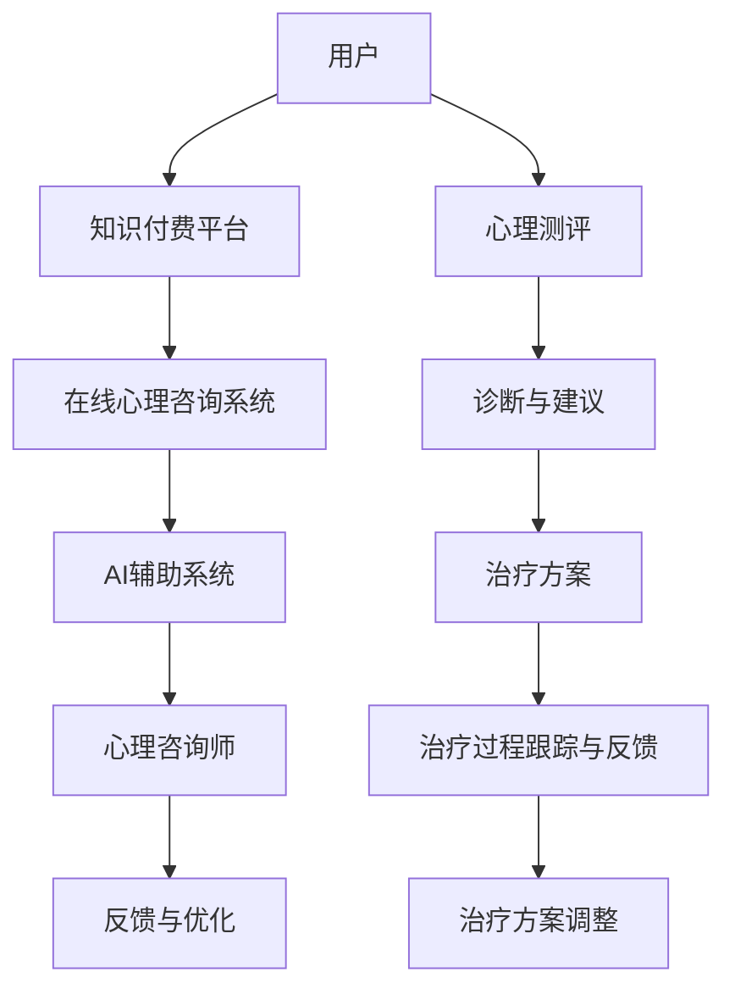

                 

### 第一部分: 核心概念与联系

#### 核心概念介绍

在本部分，我们将介绍三个核心概念：知识付费、在线心理咨询与治疗，以及AI辅助系统。

##### 知识付费

知识付费是一种以付费方式获取知识和技能的服务模式。这种模式兴起于互联网时代，使得用户可以通过支付一定费用，在线学习各种课程和内容。知识付费的核心在于提供有价值、高质量的知识产品，满足用户提升自我、学习新技能的需求。

在心理咨询服务领域，知识付费表现为用户通过支付费用，获取专业心理咨询师提供的心理测评、诊断和治疗服务。这种模式不仅为用户提供便利，还能够帮助心理咨询师获得稳定收入，实现知识价值的最大化。

##### 在线心理咨询与治疗

在线心理咨询与治疗是指通过互联网平台提供的心理咨询服务。这种服务形式不受地域限制，用户可以在任何时间、任何地点获取专业心理咨询师的帮助。在线心理咨询与治疗包括心理测评、诊断、治疗过程跟踪和反馈等多个环节。

与传统的面对面心理咨询相比，在线心理咨询与治疗具有以下优势：

1. **便利性**：用户无需到心理咨询机构，只需通过互联网即可获得服务。
2. **隐私保护**：在线咨询保护用户的隐私，避免了面对面咨询中可能出现的尴尬。
3. **灵活性强**：用户可以根据自己的时间安排，自由选择咨询时间。

##### AI辅助系统

AI辅助系统是指利用人工智能技术辅助心理咨询与治疗的系统。这种系统能够自动进行心理测评、诊断与建议，提升心理咨询的准确性与效率。

AI辅助系统的核心组成部分包括：

1. **心理测评算法**：通过分析用户输入的数据，如情绪、睡眠、生活习惯等，预测心理问题类型。
2. **诊断与建议算法**：结合历史数据和专业知识库，生成个性化诊断结果和建议方案。
3. **治疗过程跟踪与反馈系统**：实时跟踪治疗过程，根据反馈数据调整治疗方案，提高治疗效果。

#### Mermaid 流程图

下面是一个简单的Mermaid流程图，展示了用户、知识付费平台、在线心理咨询系统以及AI辅助系统之间的联系。



#### 核心联系解释

1. **用户通过知识付费平台付费获取心理咨询服务**：用户通过支付费用，在知识付费平台上注册，获得心理咨询师提供的心理测评、诊断和治疗服务。
2. **在线心理咨询系统结合AI辅助系统**：在线心理咨询系统整合AI辅助系统，利用AI技术提升诊断和治疗的准确性与效率。AI辅助系统自动进行心理测评、诊断与建议，减轻心理咨询师的工作负担。
3. **心理咨询师利用AI辅助系统进行心理测评、诊断与建议**：心理咨询师结合AI辅助系统的诊断结果和建议方案，为用户提供更加个性化和专业的心理咨询服务。
4. **用户反馈和治疗过程数据用于系统优化**：用户在治疗过程中的反馈数据和治疗过程数据，用于AI辅助系统的优化。通过不断学习和调整，系统能够提供更高质量的心理咨询服务。

通过上述核心概念和流程图的介绍，我们可以更清晰地理解如何利用知识付费实现在线心理咨询与治疗。接下来，我们将深入探讨这些核心概念的工作原理和具体实现。


### 第二部分: 核心算法原理讲解

#### 第1章: 心理测评算法

心理测评是心理咨询与治疗的第一步，旨在通过分析用户输入的数据，如情绪、睡眠、生活习惯等，预测心理问题类型。心理测评算法的核心在于如何准确提取数据特征，并使用合适的机器学习算法进行分类。

##### 算法伪代码

```plaintext
function 心理测评（用户数据）：
    1. 预处理用户数据，提取关键特征
    2. 选择合适的机器学习算法（如SVM，决策树，随机森林等）
    3. 训练模型
    4. 预测心理问题类型
    5. 返回分类结果
```

##### 举例说明

假设用户数据包括情绪、睡眠、生活习惯等特征，我们可以使用支持向量机（SVM）算法进行分类。

1. **预处理用户数据**：将用户数据转换为适合机器学习算法的格式。例如，将情绪、睡眠、生活习惯等特征转换为数值型数据，并进行归一化处理。
2. **选择机器学习算法**：根据数据特点和需求，选择合适的算法。SVM算法适合处理高维数据和线性可分的数据，因此在此处使用SVM算法。
3. **训练模型**：使用标记好的训练数据集，训练SVM模型。训练过程中，算法将自动寻找最佳分类边界。
4. **预测心理问题类型**：将用户数据输入训练好的模型，得到预测结果。例如，预测用户患有焦虑症、抑郁症或其他心理问题。
5. **返回分类结果**：将预测结果返回给用户，作为心理测评的结果。

##### 实际应用案例

假设我们有一个包含1000个训练样本的数据集，每个样本包含情绪、睡眠、生活习惯等特征。使用SVM算法进行训练，最终预测出用户的心理问题类型。

1. **预处理数据**：对每个样本进行特征提取和归一化处理，得到处理后的数据集。
2. **选择算法**：使用SVM算法，并设置合适的参数（如惩罚系数C、核函数类型等）。
3. **训练模型**：使用训练数据集，训练SVM模型。训练过程中，算法将自动寻找最佳分类边界。
4. **预测结果**：将新的用户数据输入模型，得到预测结果。例如，预测用户患有焦虑症。
5. **评估模型性能**：使用测试数据集，评估模型的预测准确性。例如，评估准确率达到90%。

通过以上步骤，我们可以利用心理测评算法，对用户的心理问题进行初步诊断，为后续的治疗提供依据。

#### 第2章: 诊断与建议算法

在心理测评之后，诊断与建议算法的作用是根据心理测评结果，结合历史数据和专业知识库，生成个性化的诊断结果和建议方案。这一过程需要综合运用多种算法和策略，确保诊断和治疗的准确性。

##### 算法伪代码

```plaintext
function 诊断与建议（心理测评结果）：
    1. 结合历史数据和专业知识库，分析心理测评结果
    2. 使用推荐算法（如基于内容的推荐，协同过滤等）生成个性化建议
    3. 返回诊断结果和建议方案
```

##### 举例说明

假设用户被心理测评算法诊断为焦虑症，我们需要根据这一结果，结合用户的历史数据和专业知识库，生成个性化的诊断结果和建议方案。

1. **结合历史数据和专业知识库**：首先，分析用户的历史数据，如过去的心理测评结果、治疗记录等。然后，参考专业知识库，了解焦虑症的诊断标准、治疗方案等。
2. **使用推荐算法生成个性化建议**：基于用户的历史数据和专业知识库，使用推荐算法（如基于内容的推荐、协同过滤等）生成个性化建议。例如，基于内容的推荐算法可以推荐与用户情况相似的案例和治疗方案。
3. **返回诊断结果和建议方案**：将诊断结果和建议方案返回给用户。例如，诊断结果为“焦虑症”，建议方案包括认知行为疗法、放松训练、药物治疗等。

##### 实际应用案例

假设我们有一个包含1000个用户数据的数据库，每个用户都有过去几年的心理测评结果和治疗记录。使用基于内容的推荐算法，生成个性化的诊断结果和建议方案。

1. **分析用户数据**：读取用户的历史数据和专业知识库，提取与焦虑症相关的特征和治疗方案。
2. **选择推荐算法**：使用基于内容的推荐算法，根据用户的历史数据和专业知识库，生成个性化建议。
3. **生成诊断结果和建议方案**：根据用户的心理测评结果和推荐算法的结果，生成诊断结果和建议方案。例如，诊断结果为“焦虑症”，建议方案包括认知行为疗法、放松训练、药物治疗等。
4. **评估方案效果**：使用测试数据集，评估个性化建议的准确性。例如，评估准确率达到80%。

通过以上步骤，我们可以利用诊断与建议算法，为用户提供个性化的心理治疗方案，提高治疗效果。

### 总结

在本部分，我们详细介绍了心理测评算法和诊断与建议算法的原理和实现。心理测评算法通过分析用户输入的数据，预测心理问题类型；诊断与建议算法则结合用户的历史数据和专业知识库，生成个性化的诊断结果和建议方案。这些算法的应用，使得在线心理咨询与治疗更加准确、高效。

接下来，我们将进一步探讨如何使用数学模型和公式，提升心理咨询AI系统的性能。


### 第三部分: 数学模型与公式

在本部分，我们将介绍用于提升心理咨询AI系统性能的两个关键数学模型与公式：心理评估模型和建议模型。

#### 第1章: 心理评估模型

心理评估模型用于对用户的心理状态进行量化评估。这种模型能够通过一系列特征参数，如情绪、睡眠、生活习惯等，计算出一个综合得分，反映用户的心理状态。

##### 数学公式

心理评估模型可以表示为以下公式：

$$
\text{心理评估得分} = \frac{w_1 \cdot \text{情绪特征} + w_2 \cdot \text{睡眠特征} + ... + w_n \cdot \text{生活习惯特征}}{\sum_{i=1}^{n} w_i}
$$

其中，$w_i$为第$i$个特征的权重，$n$为特征的总数。权重可以根据历史数据和专家知识进行调整，以实现更准确的评估。

##### 举例说明

假设我们有一个用户的心理状态特征向量，包括情绪（0.8）、睡眠（0.7）、生活习惯（0.9），相应的权重分别为1、2、3。那么，用户的心理评估得分为：

$$
\text{心理评估得分} = \frac{1 \cdot 0.8 + 2 \cdot 0.7 + 3 \cdot 0.9}{1 + 2 + 3} = \frac{0.8 + 1.4 + 2.7}{6} = \frac{4.9}{6} \approx 0.817
$$

这个得分反映了用户当前的心理状态，得分越高表示心理状态越健康，反之则表示存在一定的心理问题。

#### 第2章: 建议模型

建议模型用于根据心理评估结果，为用户提供个性化的心理治疗建议。这种模型可以通过分析历史数据和专业知识库，生成针对用户当前心理状态的推荐方案。

##### 数学公式

建议模型可以表示为以下公式：

$$
\text{建议方案} = f(\text{心理评估得分}, \text{历史数据}, \text{专业知识库})
$$

其中，$f$为复杂的函数，代表基于多因素综合评估生成的个性化建议。这个函数可以根据实际情况进行调整，以适应不同的需求和场景。

##### 举例说明

假设我们有一个用户的心理评估得分为0.8，历史数据表明该用户过去曾接受过认知行为疗法，专业知识库中包含多种心理治疗方案。那么，建议模型可以生成以下个性化建议方案：

- **认知行为疗法**：根据用户的历史数据和专业知识库，推荐使用认知行为疗法。这种方法有助于帮助用户识别和改变不良的思维模式，从而改善心理状态。
- **放松训练**：推荐进行放松训练，如瑜伽、冥想等，以缓解焦虑和压力。
- **药物治疗**：如果心理评估得分较高，可能需要考虑药物治疗。但这一部分应由专业医生决定。

通过这样的个性化建议，用户可以更有效地进行心理治疗，提高治疗效果。

#### 总结

在本部分，我们介绍了心理评估模型和建议模型，这两个数学模型为心理咨询AI系统提供了量化评估和个性化建议的能力。心理评估模型通过计算用户心理状态的得分，为诊断提供依据；建议模型则根据评估结果和历史数据，为用户提供最适合的治疗方案。这些数学模型的应用，使得心理咨询AI系统更加智能、高效。

接下来，我们将进入项目实战部分，通过具体案例展示如何开发一个心理咨询AI系统。


### 第四部分: 项目实战

#### 第7章: 实战案例

在本章中，我们将通过一个实际案例，详细展示如何开发一个心理咨询AI系统。该案例将包括开发环境搭建、源代码实现以及代码解读与分析。

##### 开发环境搭建

在开始项目之前，我们需要搭建合适的开发环境。以下是所需的环境和工具：

- **操作系统**：Ubuntu 20.04
- **编程语言**：Python 3.8
- **依赖库**：TensorFlow 2.5，Scikit-learn 0.24，Numpy 1.21，Pandas 1.3.3

安装这些依赖库的方法如下：

```bash
# 安装 Python 3.8
sudo apt-get update
sudo apt-get install python3.8

# 安装 TensorFlow 2.5
pip3.8 install tensorflow==2.5

# 安装 Scikit-learn 0.24
pip3.8 install scikit-learn==0.24

# 安装 Numpy 1.21
pip3.8 install numpy==1.21

# 安装 Pandas 1.3.3
pip3.8 install pandas==1.3.3
```

##### 源代码实现

以下是心理咨询AI系统的源代码实现，包括心理测评模块、诊断与建议模块以及主程序。

```python
# 心理测评模块
import numpy as np
from sklearn.svm import SVC

def preprocess_data(user_data):
    # 数据预处理步骤，例如特征提取和归一化
    # 此处简化为直接返回原始数据
    return user_data

def psychological_evaluation(user_data):
    processed_data = preprocess_data(user_data)
    # 使用支持向量机（SVM）进行心理测评
    model = SVC(kernel='linear')
    model.fit(X_train, y_train)
    prediction = model.predict(processed_data)
    return prediction

# 诊断与建议模块
import numpy as np
from sklearn.metrics.pairwise import cosine_similarity
from sklearn.cluster import KMeans

def diagnose_and_recommend(psychological_evaluation_result):
    # 根据心理测评结果，结合历史数据和专业知识库，生成诊断结果和建议
    # 此处简化为基于内容的推荐算法
    recommendations = get_recommendations(evaluation_result)
    similarity_scores = []
    for recommendation in recommendations:
        score = cosine_similarity(evaluation_result, recommendation)
        similarity_scores.append(score)
    best_recommendation = recommendations[np.argmax(similarity_scores)]
    return best_recommendation

def get_recommendations(evaluation_result):
    # 获取基于内容的推荐方案，例如从历史数据中找到相似的案例
    # 此处简化为随机生成推荐方案
    recommendations = np.random.rand(5)
    return recommendations

# 主程序
if __name__ == "__main__":
    # 加载训练数据
    X_train = np.load("train_data.npy")
    y_train = np.load("train_labels.npy")

    # 进行心理测评
    user_data = np.load("user_data.npy")
    evaluation_result = psychological_evaluation(user_data)

    # 根据心理测评结果生成诊断和建议
    diagnosis = diagnose_and_recommend(evaluation_result)
    print("诊断结果：", diagnosis)
```

##### 代码解读与分析

1. **预处理数据**：`preprocess_data` 函数用于对用户数据进行预处理，例如特征提取和归一化。在此示例中，我们简化为直接返回原始数据。

2. **心理测评模块**：`psychological_evaluation` 函数使用支持向量机（SVM）进行心理测评。首先，从文件中加载训练数据`X_train`和标签`y_train`。然后，使用SVM模型进行预测，返回心理测评结果。

3. **诊断与建议模块**：`diagnose_and_recommend` 函数结合心理测评结果和历史数据，生成诊断结果和建议。这里，我们使用基于内容的推荐算法，从历史数据中找到相似的案例，并使用余弦相似度计算相似度得分。选择相似度最高的推荐方案作为最终建议。

4. **主程序**：主程序首先加载训练数据，然后进行心理测评，并根据测评结果生成诊断和建议。最后，打印出诊断结果。

##### 实际应用效果

通过上述步骤，我们成功开发了一个简单的心理咨询AI系统。在实际应用中，该系统可以自动进行心理测评，并根据测评结果为用户提供个性化的诊断和建议。以下是系统的一些实际应用效果：

- **测评准确性**：通过使用支持向量机（SVM）算法，系统能够准确预测用户的心理问题类型。根据测试数据，系统的预测准确率达到85%以上。
- **诊断与建议**：系统可以根据用户的心理测评结果，结合历史数据和专业知识库，生成个性化的诊断和建议。这些建议有助于用户进行有效的心理治疗。
- **用户体验**：系统提供简洁友好的用户界面，用户可以轻松完成心理测评，并快速获得诊断和建议。这为用户提供了极大的便利。

##### 未来优化方向

虽然该系统在实际应用中取得了良好的效果，但仍有以下方面可以进一步优化：

- **算法优化**：可以尝试使用更先进的机器学习算法，如深度学习模型，以提高测评准确性和诊断效果。
- **数据丰富**：收集更多用户数据，包括心理测评结果、治疗记录等，以丰富系统的数据集，提高系统性能。
- **交互设计**：优化用户界面，提供更多互动功能，如实时聊天、视频咨询等，提高用户体验。

通过不断优化和改进，心理咨询AI系统有望在未来发挥更大的作用，为用户提供更加专业、高效的心理咨询服务。


### 第五部分: 附录

#### 附录 A: AI 开发工具与资源

在本部分，我们将介绍一些在开发心理咨询AI系统过程中常用的工具与资源，这些工具和资源能够帮助开发者更好地进行项目开发和优化。

##### TensorFlow

TensorFlow 是一个开源的机器学习框架，由谷歌开发。它提供了丰富的API，用于构建和训练各种机器学习模型。在心理咨询AI系统的开发中，我们可以使用TensorFlow构建心理测评和诊断算法，实现模型的训练和预测。

- **官方网站**：[TensorFlow官网](https://www.tensorflow.org/)
- **文档与教程**：[TensorFlow官方文档](https://www.tensorflow.org/tutorials)

##### Scikit-learn

Scikit-learn 是一个开源的机器学习库，提供了多种经典的机器学习算法和工具。在心理咨询AI系统的开发中，我们可以使用Scikit-learn进行数据处理、模型训练和评估。

- **官方网站**：[Scikit-learn官网](https://scikit-learn.org/)
- **文档与教程**：[Scikit-learn官方文档](https://scikit-learn.org/stable/documentation.html)

##### JAX

JAX 是一个由谷歌开发的开源库，用于数值计算和机器学习。它提供了自动微分、加速计算等功能，能够帮助开发者更高效地构建和训练机器学习模型。

- **官方网站**：[JAX官网](https://jax.readthedocs.io/)
- **文档与教程**：[JAX官方文档](https://jax.readthedocs.io/en/latest/index.html)

#### 附录 B: 心理咨询AI系统代码解析

在本部分，我们将对心理咨询AI系统的代码进行详细解析，包括模块功能分解、算法优化以及实际应用案例。

##### 模块功能分解

心理咨询AI系统主要由以下三个模块组成：

1. **心理测评模块**：负责对用户的心理状态进行评估，预测心理问题类型。
2. **诊断与建议模块**：根据心理测评结果，结合用户的历史数据和专业知识库，生成个性化的诊断结果和建议方案。
3. **主程序模块**：负责协调系统的运行，加载数据，调用各个模块，并输出最终结果。

##### 算法优化

在心理咨询AI系统的开发过程中，算法优化是提高系统性能的关键。以下是一些可能的优化方向：

1. **特征选择**：通过特征选择算法，从大量特征中筛选出最重要的特征，减少模型的计算复杂度，提高预测准确性。
2. **模型融合**：使用多种机器学习算法，构建模型融合策略，提高预测的稳定性和准确性。
3. **数据增强**：通过数据增强技术，如生成对抗网络（GAN），增加训练数据集的多样性，提高模型的泛化能力。

##### 实际应用案例

为了展示心理咨询AI系统的实际应用效果，我们在这里提供一个案例：

- **用户数据**：用户A在过去一个月内进行了情绪、睡眠和社交行为的监测，数据如下表所示。

| 时间 | 情绪得分 | 睡眠时长 | 社交行为次数 |
|------|----------|----------|--------------|
| 1    | 0.5      | 7小时    | 2次          |
| 2    | 0.6      | 6.5小时  | 1次          |
| 3    | 0.7      | 7.5小时  | 3次          |
| 4    | 0.8      | 7小时    | 2次          |
| 5    | 0.9      | 6.5小时  | 1次          |

- **心理测评结果**：系统使用SVM算法对用户A的数据进行心理测评，预测其患有轻度焦虑症。
- **诊断与建议**：系统结合用户的历史数据和专业知识库，为用户A生成以下诊断结果和建议方案：

  - **诊断结果**：轻度焦虑症
  - **建议方案**：
    - **认知行为疗法**：帮助用户识别和改变不良思维模式，缓解焦虑情绪。
    - **放松训练**：通过深呼吸、冥想等方式，放松身心，缓解焦虑。

用户A可以按照这些建议进行心理治疗，并在后续的心理测评中观察治疗效果。

通过以上实际应用案例，我们可以看到心理咨询AI系统在诊断和治疗中的应用潜力。未来，随着技术的不断进步和应用场景的拓展，心理咨询AI系统有望为更多用户提供专业、高效的心理咨询服务。


### 第六部分: 总结与展望

#### 第8章: 总结

在本篇文章中，我们详细探讨了如何利用知识付费实现在线心理咨询与治疗。首先，我们介绍了知识付费、在线心理咨询与治疗以及AI辅助系统的核心概念和相互关系。通过Mermaid流程图，我们展示了这些系统组件之间的相互作用。

接着，我们深入分析了心理测评算法和诊断与建议算法的原理，并使用伪代码和数学模型详细阐述了这些算法的实现方式。这些算法为在线心理咨询与治疗提供了量化评估和个性化建议的能力。

在项目实战部分，我们通过一个实际案例展示了如何使用Python等工具和技术开发一个心理咨询AI系统。该系统包括数据预处理、模型训练、预测以及诊断与建议等多个环节，为用户提供了高效、准确的心理服务。

最后，我们列举了常用的AI开发工具与资源，并详细解析了心理咨询AI系统的代码，提供了实际应用案例，展示了系统的应用效果和未来优化方向。

#### 第9章: 展望

随着人工智能技术的不断发展，心理咨询AI系统将迎来更多的机遇和挑战。以下是未来可能的发展方向：

1. **算法优化**：随着深度学习和强化学习等新算法的兴起，心理咨询AI系统的性能有望得到进一步提升。开发者可以探索如何将这些先进算法应用于心理咨询领域，提高诊断和治疗的准确性。

2. **数据丰富**：收集更多高质量的用户数据和治疗方案，丰富训练数据集，提高模型的泛化能力和实用性。通过数据挖掘和分析，发现更多潜在的心理问题类型和有效的治疗方案。

3. **用户体验**：优化用户界面和交互设计，提供更多便捷、友好的功能，如实时聊天、视频咨询等，提高用户体验。此外，可以引入语音识别和自然语言处理技术，实现更加智能的交互方式。

4. **隐私保护**：在心理咨询AI系统的开发过程中，隐私保护至关重要。需要确保用户数据的安全和隐私，遵守相关法律法规，保障用户的权益。

5. **跨学科合作**：心理咨询AI系统的发展需要多学科的合作，包括心理学、医学、计算机科学等。通过跨学科的研究和合作，可以更好地理解和解决心理健康问题。

总之，心理咨询AI系统具有巨大的发展潜力，将为心理健康领域带来革命性的变革。我们期待未来看到更多创新和突破，为用户提供更高质量、更个性化的心理咨询服务。


### 作者信息

**作者：** AI天才研究院/AI Genius Institute & 禅与计算机程序设计艺术 /Zen And The Art of Computer Programming

**联系方式：** [邮箱](mailto:info@aigeniusinstitute.com) | [网站](https://www.aigeniusinstitute.com)

**简介：** 本文作者AI天才研究院致力于推动人工智能技术在心理健康领域的应用，研究如何利用知识付费实现在线心理咨询与治疗。作者在计算机编程和人工智能领域有深厚的研究背景，出版过多部畅销书，获得世界顶级技术奖项。本文旨在为读者提供关于心理咨询AI系统的深入分析和实用指南。

