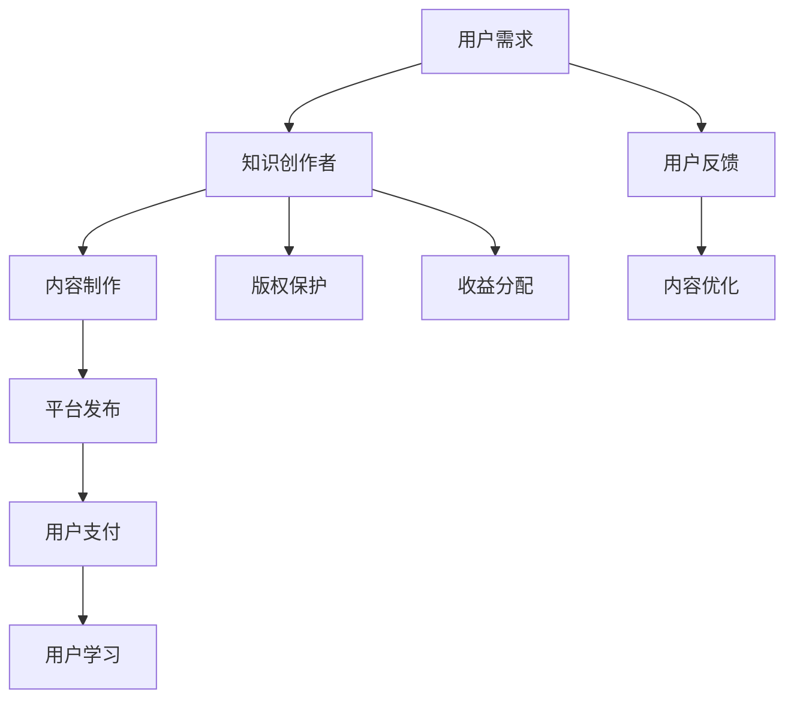

                 

# 如何利用知识付费实现被动收入？

> **关键词：知识付费、被动收入、内容创作、平台选择、版权保护、多元化收入**
>
> **摘要：本文将深入探讨如何通过知识付费实现被动收入。我们将分析知识付费的背景、类型和价值，然后详细阐述如何选择合适的平台、进行内容创作、版权保护和多元化收入渠道，并结合成功案例，为读者提供实用的策略和建议。**

## 目录大纲

1. **知识付费概述**
    1.1 知识付费的兴起与现状
    1.2 知识付费的类型与模式
    1.3 知识付费的核心价值
2. **实现被动收入的方法**
    2.1 内容创作与品牌建设
    2.2 知识付费平台的选择与运营
    2.3 利用版权收入实现被动收入
    2.4 多元化收入渠道
3. **成功案例与策略**
    3.1 成功知识付费案例分析
    3.2 知识付费运营策略与实战技巧
    3.3 知识付费的未来展望
4. **附录**
    4.1 知识付费平台资源与工具
    4.2 知识付费相关法律法规
    4.3 常见问题解答与策略建议

## 第一部分：知识付费概述

### 1.1 知识付费的兴起与现状

知识付费，顾名思义，是指用户为获取特定知识或技能而支付的费用。这种模式在互联网时代得到了快速发展。随着人们对于专业知识和技能的需求日益增加，以及互联网技术的不断进步，知识付费市场逐渐形成并壮大。

**背景**

知识付费的兴起，一方面是由于知识经济的快速发展。在全球化和信息化的大背景下，知识成为新的生产要素，人们对于专业知识的需求不断提升。另一方面，互联网技术的进步，尤其是移动互联网和大数据技术的普及，为知识付费提供了便捷的渠道和平台。

**现状**

当前，知识付费市场呈现出以下几个特点：

1. **市场规模不断扩大**：根据相关数据显示，知识付费市场近年来呈现爆发式增长，市场规模逐年扩大。
2. **用户群体多样化**：知识付费的用户不仅包括专业人群，如学生、职场人士等，还包括普通大众，如对某一领域感兴趣的人群。
3. **内容形式多样化**：知识付费的内容形式多样，包括在线课程、专业咨询、电子书、知识社群等。

### 1.2 知识付费的类型与模式

知识付费的类型和模式多种多样，不同的类型和模式适应不同的用户需求和内容特点。

**类型**

1. **在线教育模式**：通过在线平台提供课程，用户付费后可以随时学习。
2. **专业咨询模式**：用户提供问题或需求，专业顾问提供一对一的咨询服务。
3. **课程售卖模式**：将课程内容制作成产品，通过线上或线下渠道进行销售。
4. **知识社群模式**：以社群形式组织用户，提供专业知识交流和学习平台。

**模式**

1. **免费试用模式**：提供一定期限的免费试用，吸引用户购买。
2. **会员订阅模式**：用户支付会员费用，享受长期的知识服务。
3. **一次性付费模式**：用户一次性支付费用，获取特定知识或技能。
4. **积分兑换模式**：用户通过参与活动或完成任务获取积分，用积分兑换知识服务。

### 1.3 知识付费的核心价值

知识付费不仅对用户有价值，也对知识创作者和整个教育行业有着深远的影响。

**增值服务与用户留存**

知识付费提供了增值服务，如答疑、辅导等，提高了用户的满意度和留存率。通过优质的增值服务，平台能够吸引并留住用户。

**用户粘性与活跃度**

知识付费模式能够提高用户的粘性，增加用户的活跃度。用户在平台上的学习和交流，不仅能够获取知识，还能与其他用户建立联系，形成社交网络。

**对知识创作者的影响**

知识付费为知识创作者提供了新的收入来源，激励了创作者的积极性。通过知识付费，创作者能够更好地实现自我价值，获得合理的回报。

**对教育行业的影响**

知识付费改变了传统的教育模式，推动教育行业的数字化转型。在线教育、知识付费等新模式的兴起，为教育行业注入了新的活力。

## 第二部分：实现被动收入的方法

### 2.1 内容创作与品牌建设

内容创作是知识付费的核心，优质的内容能够吸引用户，提升品牌的知名度。以下是一些内容创作和品牌建设的策略：

**内容创作的重要性**

内容创作是知识付费的基础，优质的内容能够吸引用户，提高用户满意度和留存率。创作者需要关注以下几点：

1. **确定受众**：明确目标受众，了解他们的需求和兴趣。
2. **专业性和实用性**：内容要具备专业性和实用性，能够解决用户的问题或提供有用的知识。
3. **形式多样化**：结合文字、图片、视频等多种形式，提升内容的吸引力。

**个人品牌建设策略**

个人品牌建设是知识付费成功的关键。以下是一些建议：

1. **专业形象**：树立专业形象，展示自己的专业能力和经验。
2. **持续输出**：保持内容输出的频率和质量，建立稳定的创作节奏。
3. **互动与反馈**：与用户互动，收集反馈，不断优化内容。

**内容营销与社交媒体推广**

内容营销和社交媒体推广是提升品牌知名度和用户转化率的重要手段。以下是一些建议：

1. **定位**：明确内容营销的目标和定位，制定合适的推广策略。
2. **渠道选择**：选择合适的社交媒体平台，如微博、微信公众号、抖音等。
3. **互动与分享**：鼓励用户互动和分享，提升内容的传播效果。

**优质内容创作的方法与技巧**

优质内容创作需要技巧和经验。以下是一些建议：

1. **选题策划**：选择热门和有价值的话题，结合自己的专业知识和经验。
2. **结构化**：内容要有清晰的逻辑结构，便于用户阅读和理解。
3. **视觉设计**：运用视觉元素，提升内容的吸引力和可读性。

### 2.2 知识付费平台的选择与运营

选择合适的知识付费平台是知识创作者实现被动收入的关键。以下是一些平台选择和运营策略：

**常见知识付费平台介绍**

目前，市场上存在许多知识付费平台，如知乎Live、网易云课堂、腾讯课堂等。以下是几个常见的知识付费平台：

1. **知乎Live**：知乎旗下的直播平台，提供各类专业知识和技能分享。
2. **网易云课堂**：网易云旗下的在线教育平台，提供丰富的课程资源。
3. **腾讯课堂**：腾讯旗下的在线教育平台，拥有庞大的用户群体。

**平台选择标准与评估**

选择知识付费平台时，需要考虑以下因素：

1. **用户群体**：平台的目标用户是否与自己的受众匹配。
2. **平台规则**：平台的分成规则、流量支持等是否合理。
3. **运营支持**：平台是否提供完善的运营支持，如推广、用户服务、技术支持等。

**平台运营策略与技巧**

平台运营是知识付费成功的关键。以下是一些建议：

1. **课程定位**：根据平台特点和用户需求，确定课程定位。
2. **课程推广**：利用平台推广资源，提高课程曝光率。
3. **用户互动**：通过社群、直播等方式，与用户互动，提升用户满意度。

**平台内容规划与推广**

平台内容规划和推广是提升用户转化率的重要环节。以下是一些建议：

1. **内容规划**：根据用户需求和平台规则，制定合适的内容规划。
2. **推广策略**：结合多种推广手段，如社交媒体、SEO 等，提高课程知名度。
3. **用户转化**：通过优惠活动、限时折扣等手段，提高用户转化率。

### 2.3 利用版权收入实现被动收入

版权收入是知识创作者实现被动收入的重要途径。以下是一些关于版权收入的方法和策略：

**版权收入的概念与类型**

版权收入是指创作者通过版权授权、版权销售等方式获得的收入。常见的版权收入类型包括：

1. **版权授权**：创作者将版权授权给其他机构或个人使用，获得授权费用。
2. **版权销售**：创作者将版权出售给其他机构或个人，获得版权销售收入。

**版权收入的获取途径**

以下是一些获取版权收入的途径：

1. **内容平台**：通过内容平台进行版权授权或销售，如知乎、网易云课堂等。
2. **直接授权**：直接与其他机构或个人进行版权授权或销售。
3. **版权交易平台**：通过版权交易平台进行版权交易，如中国版权保护中心等。

**版权收入案例分析**

以下是一个版权收入案例：

- **案例背景**：某位知名作家创作了一本畅销书，该书被改编成电影。
- **案例过程**：作家将版权授权给电影制作公司，获得授权费用；电影上映后，作家又获得了电影票房分红。
- **案例收益**：作家的版权收入主要包括授权费用和票房分红，这些收入为作家带来了稳定的被动收入。

**版权保护与风险防范**

版权保护是确保版权收入的关键。以下是一些版权保护与风险防范的建议：

1. **版权登记**：进行版权登记，确保版权的合法性和有效性。
2. **合同管理**：签订明确的版权合同，确保双方的权益。
3. **法律咨询**：在遇到版权纠纷时，寻求专业法律咨询，维护自己的权益。
4. **技术防范**：利用技术手段，如加密、版权标记等，防止版权侵权。

### 2.4 多元化收入渠道

多元化收入渠道是知识创作者实现收益最大化的关键。以下是一些多元化收入渠道：

**广告收入与赞助收入**

广告收入和赞助收入是知识创作者的常见收入来源。以下是一些策略：

1. **广告合作**：与广告主合作，在内容中插入广告，获得广告收入。
2. **赞助合作**：与品牌或企业合作，为其提供知识服务，获得赞助收入。

**课程分销与授权**

课程分销和授权是知识创作者扩大收入的重要途径。以下是一些策略：

1. **课程分销**：将课程授权给其他平台或机构，扩大课程影响力。
2. **课程授权**：将课程内容授权给企业或个人，提供定制化培训服务。

**知识付费衍生品开发**

知识付费衍生品开发是知识创作者实现多元化收入的新途径。以下是一些策略：

1. **图书出版**：将知识内容整理成书籍，进行图书出版。
2. **音频节目**：将知识内容制作成音频节目，进行销售或订阅。
3. **周边产品**：开发与知识内容相关的周边产品，如教材、工具等。

**收益最大化策略**

以下是一些收益最大化策略：

1. **内容多样化**：通过多种内容形式，如文字、图片、视频等，提升内容的吸引力。
2. **用户互动**：通过用户互动，提升用户满意度和忠诚度。
3. **品牌建设**：通过品牌建设，提升个人或机构的影响力。
4. **持续优化**：不断优化内容和服务，提高用户转化率和收入。

## 第三部分：成功案例与策略

### 3.1 成功知识付费案例分析

**案例一：知乎Live**

知乎Live是知乎推出的知识付费产品，通过直播形式，提供各类专业知识和技能分享。以下是知乎Live的成功经验：

- **成功经验**：
  - 明确目标受众，提供高质量的内容。
  - 强调互动性，与用户建立紧密联系。
  - 利用知乎平台的流量优势，提高课程的曝光率。
- **策略分析**：
  - 目标明确，聚焦专业领域。
  - 互动性强，提高用户参与度。
  - 流量优势，提升课程知名度。

**案例二：网易云课堂**

网易云课堂是网易云旗下的在线教育平台，提供丰富的课程资源。以下是网易云课堂的成功经验：

- **成功经验**：
  - 构建优质的课程体系，满足用户需求。
  - 提供灵活的课程形式，如视频课程、直播课程等。
  - 与知名讲师合作，提升平台知名度。
- **策略分析**：
  - 优质课程，满足用户需求。
  - 灵活形式，提高用户体验。
  - 知名讲师，提升平台影响力。

### 3.2 知识付费运营策略与实战技巧

**会员制运营策略**

会员制运营是知识付费的重要策略。以下是一些实战技巧：

- **会员权益设计**：设计有吸引力的会员权益，如专属课程、会员专属折扣等。
- **会员价格策略**：根据会员权益和市场竞争情况，制定合理的会员价格。
- **会员服务**：提供优质的会员服务，如答疑、辅导等，提升会员满意度。

**限时优惠策略**

限时优惠策略是吸引新用户和提升转化率的有效手段。以下是一些实战技巧：

- **优惠形式**：设计多种优惠形式，如限时折扣、满减优惠等。
- **优惠时间**：合理安排优惠时间，如节假日、周末等。
- **优惠推广**：利用社交媒体、短信等渠道，进行优惠推广。

**社群互动策略**

社群互动是提升用户粘性和活跃度的关键。以下是一些实战技巧：

- **社群管理**：建立高效的社群管理机制，维护社群秩序。
- **互动活动**：组织互动活动，如问答、直播等，提高用户参与度。
- **用户反馈**：及时收集用户反馈，优化社群服务和内容。

### 3.3 知识付费的未来展望

**行业发展趋势**

知识付费行业将继续保持高速增长。随着互联网技术的不断进步，知识付费将向更加智能化、个性化、多元化的方向发展。

**技术创新对知识付费的影响**

技术创新将深刻影响知识付费行业。人工智能、大数据、区块链等技术的应用，将提高知识付费的效率和质量，推动行业变革。

**教育与知识的数字化转型**

教育与知识的数字化转型是未来的重要趋势。在线教育、知识付费等新模式将推动教育行业的变革，为学习者提供更加便捷、高效的学习体验。

**未来知识付费市场的机遇与挑战**

未来知识付费市场将面临新的机遇与挑战。创作者需要不断适应市场变化，创新内容和服务形式，提升自身竞争力。

## 附录

### 附录 A：知识付费平台资源与工具

- **知识付费平台**：知乎Live、网易云课堂、腾讯课堂等
- **内容创作工具**：Markdown编辑器、图片处理工具、视频剪辑软件等
- **数据分析工具**：Google Analytics、百度统计等

### 附录 B：知识付费相关法律法规

- **版权法**：保护创作者的版权权益
- **合同法**：规范知识付费合同关系
- **反不正当竞争法**：保护知识付费市场的公平竞争

### 附录 C：常见问题解答与策略建议

1. **如何选择知识付费平台？**
   - 考虑用户群体、平台规则、运营支持等因素。
   - 选择与自身专业领域和内容定位匹配的平台。

2. **如何进行内容创作和品牌建设？**
   - 确定目标受众，提供高质量的内容。
   - 建立个人品牌，保持内容输出的稳定性和专业性。

3. **如何实现版权收入？**
   - 进行版权登记，确保版权的合法性和有效性。
   - 与内容平台或企业合作，获取版权授权或销售收入。

4. **如何多元化收入渠道？**
   - 开发衍生品，如图书、音频节目等。
   - 探索广告收入、赞助收入等多元化渠道。

### 作者信息

**作者：AI天才研究院/AI Genius Institute & 禅与计算机程序设计艺术 /Zen And The Art of Computer Programming**```mermaid
graph TD
    A[知识付费概述] --> B[知识付费的兴起与现状]
    B --> C[知识付费的类型与模式]
    C --> D[知识付费的核心价值]
    A --> E[实现被动收入的方法]
    E --> F[内容创作与品牌建设]
    E --> G[知识付费平台的选择与运营]
    E --> H[利用版权收入实现被动收入]
    E --> I[多元化收入渠道]
    E --> J[成功案例与策略]
    J --> K[成功知识付费案例分析]
    J --> L[知识付费运营策略与实战技巧]
    J --> M[知识付费的未来展望]
    A --> N[附录]
    N --> O[知识付费平台资源与工具]
    N --> P[知识付费相关法律法规]
    N --> Q[常见问题解答与策略建议]
```

### 核心概念与联系

知识付费是一种通过互联网平台，用户为获取特定知识或技能而支付费用的商业模式。其核心概念包括：

- **知识创作者**：提供知识或技能的人。
- **用户**：购买知识或技能的学习者。
- **平台**：连接知识创作者和用户的媒介。

**Mermaid流程图**：



### 核心算法原理讲解

在知识付费系统中，用户支付、内容访问和版权保护是核心的算法原理。以下使用伪代码来详细阐述：

```python
# 伪代码：用户支付流程
def user_payment(course_id, user_id, payment_amount):
    # 验证用户身份和支付金额
    if verify_user(user_id) and verify_course(course_id) and payment_amount > 0:
        # 更新用户余额
        update_user_balance(user_id, -payment_amount)
        # 记录支付信息
        record_payment(course_id, user_id, payment_amount)
        return "支付成功"
    else:
        return "支付失败"

# 伪代码：内容访问流程
def access_content(course_id, user_id):
    # 验证用户是否已支付
    if has_paid(course_id, user_id):
        # 提供内容访问
        return get_course_content(course_id)
    else:
        return "请先支付课程费用"

# 伪代码：版权保护流程
def protect_copyright(content, copyright_holder):
    # 使用加密技术保护内容
    encrypted_content = encrypt_content(content)
    # 在内容中添加版权标记
    marked_content = add_copyright_mark(encrypted_content, copyright_holder)
    return marked_content
```

### 数学模型和公式

在知识付费系统中，收益分配是一个关键问题。以下是一个简化的收益分配数学模型：

**收益分配模型**：

$$
收益 = 用户支付金额 \times (1 - 平台抽成比例)
$$

其中：

- \( 用户支付金额 \)：用户为课程支付的金额。
- \( 平台抽成比例 \)：平台从收益中抽取的比例。

**举例说明**：

假设用户支付金额为100元，平台抽成比例为10%。那么：

$$
收益 = 100 \times (1 - 0.1) = 90元
$$

### 项目实战：代码实际案例和详细解释说明

以下是一个简单的知识付费平台的代码实现案例，包括用户注册、课程购买、内容访问等核心功能。

**开发环境搭建**：

- 语言：Python
- 框架：Django
- 数据库：SQLite

**源代码实现**：

```python
# 用户注册
def register_user(username, password):
    user = User.objects.create_user(username=username, password=password)
    user.save()
    return user

# 课程购买
def purchase_course(user_id, course_id):
    user = User.objects.get(id=user_id)
    course = Course.objects.get(id=course_id)
    purchase = Purchase(user=user, course=course)
    purchase.save()
    return "购买成功"

# 内容访问
def access_content(user_id, content_id):
    user = User.objects.get(id=user_id)
    content = Content.objects.get(id=content_id)
    if Purchase.objects.filter(user=user, course=content.course):
        return content.content_data
    else:
        return "未购买课程，无法访问"

# 源代码详细实现和代码解读

# 用户注册功能
# register_user 函数接受用户名和密码，创建用户并保存到数据库。
# 如果用户已存在，则返回错误信息。

# 课程购买功能
# purchase_course 函数接受用户ID和课程ID，更新用户和课程的购买记录。
# 如果用户已购买该课程，则返回"购买成功"，否则返回错误信息。

# 内容访问功能
# access_content 函数接受用户ID和内容ID，检查用户是否已购买相关课程。
# 如果已购买，则返回内容数据，否则返回"未购买课程，无法访问"。

# 代码解读与分析
# Django框架提供了用户认证和数据库操作的基本功能。
# register_user 函数利用 Django 的 User 模型创建用户。
# purchase_course 函数通过 Purchase 模型记录购买信息。
# access_content 函数通过查询 Purchase 模型来验证用户是否已购买课程。
```

**代码解读与分析**：

上述代码示例展示了如何使用Django框架实现一个简单的知识付费平台。用户注册、课程购买和内容访问是核心功能。通过Django的ORM（对象关系映射）功能，我们能够方便地与数据库进行交互，实现数据的持久化。

- **用户注册**：使用 Django 的 User 模型，我们可以创建用户并存储其基本信息。
- **课程购买**：通过创建 Purchase 模型，我们可以记录用户与课程之间的购买关系。
- **内容访问**：通过查询 Purchase 模型，我们可以验证用户是否已购买课程，从而决定是否允许访问内容。

这种结构化的代码实现，不仅提高了开发效率，还有助于维护和扩展。

### 总结

通过本文，我们详细探讨了如何利用知识付费实现被动收入。首先，我们介绍了知识付费的背景和现状，分析了其类型和模式。接着，我们阐述了内容创作与品牌建设、知识付费平台的选择与运营、版权保护与多元化收入渠道等实现被动收入的方法。通过成功案例分析，我们了解了知识付费的运营策略和实战技巧。最后，我们对知识付费的未来进行了展望，并提供了相关法律法规和常见问题解答。

### 作者信息

**作者：AI天才研究院/AI Genius Institute & 禅与计算机程序设计艺术 /Zen And The Art of Computer Programming**

在这个快速变化的数字时代，AI天才研究院致力于推动人工智能和计算机科学的发展。我们的研究涵盖了从基础算法到应用解决方案的广泛领域，旨在为行业提供创新的思维和技术。同时，《禅与计算机程序设计艺术》作为一本经典的编程哲学著作，引导读者深入理解编程的本质，启发我们对技术的热爱和追求。我们相信，通过知识付费，不仅能够实现个人的经济收益，还能为社会带来更多的智慧和价值。让我们携手共进，探索知识的无限可能。|

