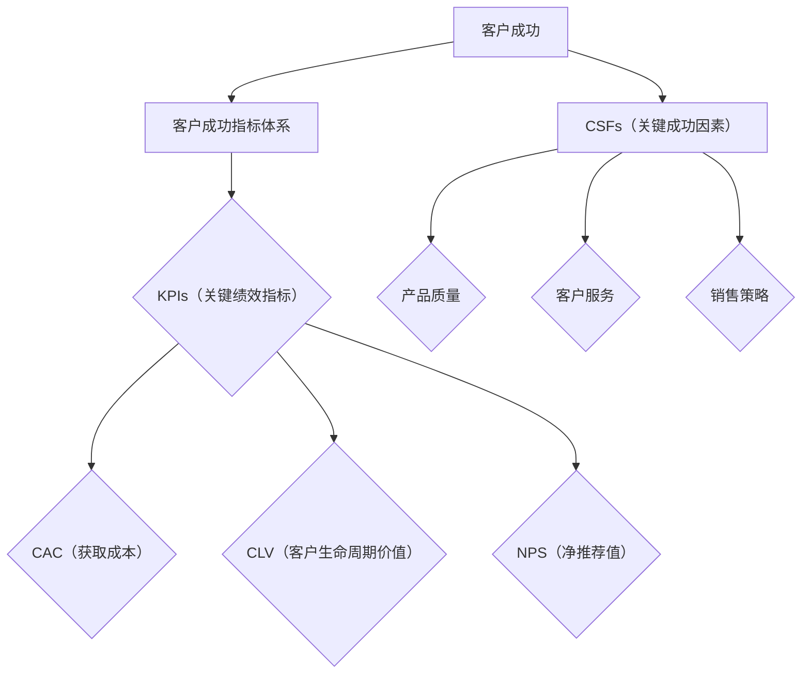

                 

### 《如何打造高效的客户成功指标体系》

关键词：客户成功指标体系、关键绩效指标（KPIs）、关键成功因素（CSFs）、获取成本（CAC）、客户生命周期价值（CLV）、客户满意度、客户活跃度、客户增值、数据驱动、持续优化。

摘要：本文旨在系统地探讨如何打造高效的客户成功指标体系。我们将从客户成功的概念入手，详细解析客户成功指标体系的设计原则、核心指标解析，以及如何构建和优化这一体系。通过理论和实战案例的结合，帮助读者深入理解并应用这些指标，从而在业务实践中提升客户满意度和忠诚度。

<|assistant|>### 目录大纲

#### 第一部分：理解客户成功指标体系

**第1章：客户成功的概念与重要性**  
1.1 客户成功的定义  
1.2 客户成功的重要性  
1.3 客户成功与客户满意度的区别

**第2章：客户成功指标体系设计原则**  
2.1 指标选择的四个原则  
2.2 指标体系的层级结构  
2.3 指标数据的可靠性与一致性

#### 第二部分：核心客户成功指标解析

**第3章：KPIs与CSFs的选择**  
3.1 关键绩效指标（KPIs）详解  
3.2 关键成功因素（CSFs）确定  
3.3 KPIs与CSFs的关联性

**第4章：客户获取指标**  
4.1 获取成本（CAC）的计算  
4.2 客户生命周期价值（CLV）的计算  
4.3 新客户增长率

**第5章：客户留存指标**  
5.1 客户流失率  
5.2 客户满意度  
5.3 客户活跃度

**第6章：客户成长指标**  
6.1 客户使用率  
6.2 客户扩展率  
6.3 客户增值

#### 第三部分：构建并优化客户成功指标体系

**第7章：构建客户成功指标体系的方法**  
7.1 自上而下的方法  
7.2 自下而上的方法  
7.3 多方协作与持续优化

**第8章：客户成功指标数据的收集与分析**  
8.1 数据源的选择  
8.2 数据收集的策略  
8.3 数据分析工具与技巧

**第9章：指标体系的落地与实施**  
9.1 设定目标与行动计划  
9.2 跨部门协作与沟通  
9.3 监控与反馈机制

**第10章：实战案例分析**  
10.1 案例一：SaaS企业的客户成功指标体系构建  
10.2 案例二：B2B企业的客户成功指标优化

**附录**  
附录A：客户成功指标体系参考模板  
附录B：常见客户成功指标公式与计算方法

<|assistant|>### 第一部分：理解客户成功指标体系

在当今竞争激烈的市场环境中，客户成功已成为企业长期发展的关键。客户成功指标体系作为衡量客户满意度和忠诚度的重要工具，能够帮助企业识别问题、优化策略、提高业绩。本部分将深入探讨客户成功的概念、重要性，以及客户成功指标体系的设计原则。

#### 第1章：客户成功的概念与重要性

##### 1.1 客户成功的定义

客户成功是指企业通过提供卓越的产品和服务，帮助客户实现业务目标，从而建立长期的信任和合作关系。它不仅仅是客户满意度的衡量，更是一个全面的业务战略。客户成功的核心在于客户价值的最大化，而不仅仅是销售业绩的提升。

##### 1.2 客户成功的重要性

客户成功对企业有着深远的影响：

- **提升客户满意度**：通过持续关注客户需求，提供个性化服务和解决方案，提高客户满意度。
- **增强客户忠诚度**：通过实现客户成功，增强客户的品牌忠诚度，降低客户流失率。
- **促进业务增长**：客户成功能够带来更多的口碑传播和复购率，从而推动业务增长。
- **优化资源配置**：通过有效的客户成功管理，企业可以更合理地配置资源，提高运营效率。

##### 1.3 客户成功与客户满意度的区别

虽然客户成功和客户满意度密切相关，但两者存在区别：

- **客户满意度**：主要关注客户对企业产品或服务的当前感受。
- **客户成功**：关注客户在整个生命周期内的体验和成就，包括满意度、忠诚度、复购率等。

客户成功指标体系的设计旨在平衡这两者的关注点，确保企业不仅在短期内获得好评，而且在长期内实现客户价值的最大化。

#### 第2章：客户成功指标体系设计原则

设计高效的客户成功指标体系需要遵循以下原则：

##### 2.1 指标选择的四个原则

1. **相关性**：指标应与客户成功直接相关，能够准确反映客户体验和业务成果。
2. **可测量性**：指标应具备可量化的标准，以便进行数据分析和比较。
3. **重要性**：指标应反映关键业务领域和客户群体的需求，具有战略意义。
4. **实用性**：指标应易于收集、计算和解释，以便在实际运营中应用。

##### 2.2 指标体系的层级结构

客户成功指标体系通常分为以下几个层级：

1. **总体指标**：反映客户成功全局的综合性指标，如客户净推荐值（NPS）。
2. **业务领域指标**：针对不同业务领域的特定指标，如客户获取成本（CAC）、客户生命周期价值（CLV）。
3. **客户群体指标**：针对不同客户群体的特定指标，如新客户增长率、客户留存率。

##### 2.3 指标数据的可靠性与一致性

1. **数据可靠性**：确保数据的准确性和真实性，避免因数据质量问题导致的决策失误。
2. **数据一致性**：在不同时间、不同部门和不同项目中保持数据的一致性，以便进行有效的跨部门分析和比较。

通过遵循这些设计原则，企业可以构建一个全面、准确、高效的客户成功指标体系，为业务决策提供有力的数据支持。

#### 第3章：核心客户成功指标解析

在了解了客户成功指标体系的设计原则之后，接下来我们将深入探讨一些核心客户成功指标，包括关键绩效指标（KPIs）和关键成功因素（CSFs）。这些指标对于衡量客户成功至关重要，有助于企业识别关键问题和优化业务策略。

##### 3.1 关键绩效指标（KPIs）详解

关键绩效指标（Key Performance Indicators，KPIs）是衡量客户成功的重要工具，能够帮助企业跟踪关键业务目标和客户体验。以下是几个常见的KPIs：

1. **客户获取成本（Customer Acquisition Cost，CAC）**：指企业获取一个新客户所需的平均成本。计算公式为：
   $$
   CAC = \frac{\text{总营销和销售支出}}{\text{新客户数量}}
   $$
   CAC是评估营销和销售效率的关键指标，低CAC通常意味着更高的营销效果。

2. **客户生命周期价值（Customer Lifetime Value，CLV）**：指一个客户在其整个生命周期内为企业带来的总收益。计算公式为：
   $$
   CLV = \text{平均订单价值} \times \text{订单频率} \times \text{客户生命周期}
   $$
   CLV帮助企业管理资源，将重点放在高价值客户上，以实现长期盈利。

3. **客户净推荐值（Net Promoter Score，NPS）**：是一种衡量客户忠诚度和推荐意愿的指标，通过询问“您有多大概率将我们的产品或服务推荐给他人？”来计算。NPS的计算公式为：
   $$
   NPS = \text{非常满意的客户比例} - \text{非常不满意的客户比例}
   $$
   NPS高于0表示客户满意度较高，有助于企业提升口碑和市场份额。

4. **客户流失率（Churn Rate）**：指在一定时间内流失的客户占总客户数量的比例。计算公式为：
   $$
   Churn Rate = \frac{\text{流失客户数量}}{\text{总客户数量}} \times 100\%
   $$
   低流失率表示客户忠诚度较高，有助于企业保持稳定的收入流。

5. **客户满意度（Customer Satisfaction）**：衡量客户对产品或服务的满意程度，通常通过调查问卷或反馈机制来收集数据。计算公式为：
   $$
   Customer Satisfaction = \frac{\text{满意的客户数量}}{\text{总客户数量}} \times 100\%
   $$
   高满意度通常与较低的流失率和较高的复购率相关。

6. **客户活跃度（Customer Engagement）**：衡量客户参与度和互动程度，可以通过社交媒体互动、论坛参与度等指标来评估。计算公式为：
   $$
   Customer Engagement = \frac{\text{参与互动的客户数量}}{\text{总客户数量}} \times 100\%
   $$
   高活跃度通常与客户忠诚度和品牌忠诚度相关。

##### 3.2 关键成功因素（CSFs）确定

关键成功因素（Critical Success Factors，CSFs）是指影响企业实现战略目标的关键因素。在客户成功领域，CSFs通常包括以下几个方面：

1. **产品质量**：高质量的产品能够提升客户满意度和忠诚度，减少客户投诉和退换货率。
2. **客户服务**：优质的客户服务能够增强客户体验，提高客户满意度和忠诚度。
3. **销售策略**：有效的销售策略能够帮助企业获取更多新客户，提高销售额和市场份额。
4. **技术创新**：持续的技术创新能够提高产品的竞争力和客户体验，满足不断变化的市场需求。

##### 3.3 KPIs与CSFs的关联性

KPIs和CSFs之间存在紧密的关联性：

- **KPIs是基于CSFs的具体量化指标**：CSFs为企业确定了关键成功领域，而KPIs则是这些领域的具体衡量标准。
- **KPIs的达成依赖于CSFs的实现**：例如，提高产品质量（CSFs）能够降低客户投诉率（KPI）和提高客户满意度（KPI）。
- **KPIs的优化需要CSFs的持续改进**：企业需要不断优化CSFs，以适应市场变化和客户需求，从而提高KPI的达成率。

通过理解KPIs和CSFs之间的关系，企业可以更系统地规划和执行客户成功策略，实现业务目标。

### **第四部分：核心客户成功指标解析（续）**

在上文中，我们探讨了关键绩效指标（KPIs）的详细定义和计算方法，并了解了关键成功因素（CSFs）的重要性。在本节中，我们将进一步解析客户成功指标体系中的核心指标，包括客户获取指标、客户留存指标和客户成长指标，为企业的客户成功管理提供更全面的视角。

#### 第4章：客户获取指标

客户获取是客户成功的第一步，有效的客户获取策略能够为企业带来更多的潜在客户。以下是一些关键的客户获取指标：

##### 4.1 获取成本（Customer Acquisition Cost，CAC）

获取成本是指企业为吸引并获得一个新客户所花费的平均成本。计算公式如下：
$$
CAC = \frac{\text{总营销和销售支出}}{\text{新客户数量}}
$$
获取成本是衡量营销和销售效率的重要指标。一个低的CAC表明企业在吸引新客户方面做得较为有效，而高CAC则可能意味着营销策略需要优化。

案例：假设某企业在一个季度内花费了100,000美元的营销和销售支出，共获得了1,000个新客户，则其获取成本为：
$$
CAC = \frac{100,000}{1,000} = 100美元/客户
$$
通过监控CAC，企业可以评估不同营销渠道的效果，并优化资源配置。

##### 4.2 客户生命周期价值（Customer Lifetime Value，CLV）

客户生命周期价值是指一个客户在其整个生命周期内为企业带来的总收益。计算公式如下：
$$
CLV = \text{平均订单价值} \times \text{订单频率} \times \text{客户生命周期}
$$
CLV是评估客户价值的指标，有助于企业确定哪些客户值得投入更多资源。一个高CLV的客户通常意味着更高的忠诚度和重复购买率。

案例：假设某客户的平均订单价值为100美元，订单频率为每月一次，客户生命周期为4年，则其CLV为：
$$
CLV = 100 \times 1 \times 4 = 400美元
$$
通过计算CLV，企业可以识别高价值客户，并制定针对性的客户关系管理策略。

##### 4.3 新客户增长率

新客户增长率是指在一定时期内新客户数量的增长率。计算公式如下：
$$
\text{新客户增长率} = \frac{\text{新客户数量}_{\text{本期}} - \text{新客户数量}_{\text{上期}}}{\text{新客户数量}_{\text{上期}}} \times 100\%
$$
新客户增长率是衡量客户获取效果的指标。高增长率表明企业的市场策略和营销活动较为成功。

案例：假设某企业在上季度的末尾有5,000个新客户，本季度末有6,000个新客户，则其新客户增长率为：
$$
\text{新客户增长率} = \frac{6,000 - 5,000}{5,000} \times 100\% = 20\%
$$
通过监控新客户增长率，企业可以评估不同市场策略和营销活动的效果，并持续优化。

#### 第5章：客户留存指标

客户留存是指客户在一定时期内持续使用企业产品或服务的比例。高留存率通常与高客户满意度和忠诚度相关。以下是一些关键的客户留存指标：

##### 5.1 客户流失率（Churn Rate）

客户流失率是指在一定时期内流失的客户占总客户数量的比例。计算公式如下：
$$
Churn Rate = \frac{\text{流失客户数量}}{\text{总客户数量}} \times 100\%
$$
低流失率表明客户对企业的产品或服务具有较高的满意度，而高流失率则可能意味着需要改进。

案例：假设某企业在一个月内流失了100个客户，总客户数量为1,000个，则其客户流失率为：
$$
Churn Rate = \frac{100}{1,000} \times 100\% = 10\%
$$
通过监控客户流失率，企业可以及时发现问题并采取相应的措施。

##### 5.2 客户满意度（Customer Satisfaction）

客户满意度是指客户对产品或服务满意程度的衡量。通常通过调查问卷或反馈机制来收集数据。计算公式如下：
$$
Customer Satisfaction = \frac{\text{满意的客户数量}}{\text{总客户数量}} \times 100\%
$$
高满意度通常与低流失率和高复购率相关。

案例：假设某企业在一次满意度调查中，有600个客户表示满意，总客户数量为1,000个，则其客户满意度为：
$$
Customer Satisfaction = \frac{600}{1,000} \times 100\% = 60\%
$$
通过定期评估客户满意度，企业可以了解客户的需求和期望，并持续改进产品和服务。

##### 5.3 客户活跃度（Customer Engagement）

客户活跃度是指客户参与企业产品或服务的程度。通常通过社交媒体互动、论坛参与度等指标来衡量。计算公式如下：
$$
Customer Engagement = \frac{\text{参与互动的客户数量}}{\text{总客户数量}} \times 100\%
$$
高活跃度通常与高忠诚度和高复购率相关。

案例：假设某企业在社交媒体上有1,000个互动客户，总客户数量为10,000个，则其客户活跃度为：
$$
Customer Engagement = \frac{1,000}{10,000} \times 100\% = 10\%
$$
通过提高客户活跃度，企业可以增强客户参与感，提升客户满意度和忠诚度。

#### 第6章：客户成长指标

客户成长是指客户在使用企业产品或服务过程中，其需求和价值的变化。以下是一些关键的客户成长指标：

##### 6.1 客户使用率（Customer Usage Rate）

客户使用率是指客户在一定时间内使用企业产品或服务的频率。计算公式如下：
$$
Customer Usage Rate = \frac{\text{使用产品或服务的客户数量}}{\text{总客户数量}} \times 100\%
$$
高使用率通常与高客户满意度和忠诚度相关。

案例：假设某企业的总客户数量为1,000个，其中800个客户在过去一个月内使用了产品，则其客户使用率为：
$$
Customer Usage Rate = \frac{800}{1,000} \times 100\% = 80\%
$$
通过监控客户使用率，企业可以了解产品或服务的受欢迎程度，并制定相应的营销策略。

##### 6.2 客户扩展率（Customer Expansion Rate）

客户扩展率是指客户在使用企业产品或服务后，其消费金额或服务使用量的增长率。计算公式如下：
$$
Customer Expansion Rate = \frac{\text{扩展客户数量}}{\text{总客户数量}} \times 100\%
$$
高扩展率通常与客户满意度和忠诚度相关。

案例：假设某企业在一个月内，有200个客户增加了消费金额，总客户数量为1,000个，则其客户扩展率为：
$$
Customer Expansion Rate = \frac{200}{1,000} \times 100\% = 20\%
$$
通过监控客户扩展率，企业可以评估客户的增长潜力，并制定相应的客户关系管理策略。

##### 6.3 客户增值（Customer Value Addition）

客户增值是指客户在使用企业产品或服务后，其业务价值或生活质量的提升。计算公式如下：
$$
Customer Value Addition = \text{客户业务价值提升} + \text{客户生活质量提升}
$$
客户增值是衡量客户成功的重要指标，高增值通常与高满意度和忠诚度相关。

案例：假设某客户在使用企业产品后，其业务效率提升了30%，生活质量提升了20%，则其客户增值为：
$$
Customer Value Addition = 30\% + 20\% = 50\%
$$
通过了解客户增值，企业可以进一步优化产品和服务，提高客户满意度和忠诚度。

通过深入解析客户获取指标、客户留存指标和客户成长指标，企业可以更全面地了解客户成功的各个方面，制定有效的客户成功策略，从而实现业务增长和长期成功。

### **第五部分：构建并优化客户成功指标体系**

在前文中，我们已经详细介绍了客户成功指标体系中的核心指标，包括客户获取指标、客户留存指标和客户成长指标。接下来，我们将探讨如何构建和优化客户成功指标体系，以确保其高效地服务于企业的战略目标。

#### 第7章：构建客户成功指标体系的方法

构建一个有效的客户成功指标体系需要系统的方法和科学的步骤。以下是一些建议和方法：

##### 7.1 自上而下的方法

自上而下的方法是指从企业整体战略出发，制定客户成功指标体系。这种方法的主要步骤如下：

1. **明确企业战略目标**：首先，企业需要明确其战略目标，如市场份额增长、客户满意度提升、业务增长等。
2. **确定关键业务领域**：根据企业战略目标，确定关键的业务领域，如销售、市场营销、客户服务、产品开发等。
3. **识别关键成功因素**：在关键业务领域内，识别影响客户成功的因素，如产品质量、客户体验、市场策略等。
4. **定义KPIs**：基于关键成功因素，定义具体的KPIs，如客户获取成本、客户生命周期价值、客户满意度等。
5. **设置目标和基准**：为每个KPI设置具体的目标和基准，以便进行数据跟踪和评估。

通过自上而下的方法，企业可以确保客户成功指标体系与整体战略保持一致，从而实现资源的最优配置。

##### 7.2 自下而上的方法

自下而上的方法是指从基层业务单元出发，逐步构建客户成功指标体系。这种方法的主要步骤如下：

1. **收集业务数据**：首先，从各个业务单元收集相关的业务数据，如销售数据、客户反馈、市场调研数据等。
2. **分析业务问题**：基于收集到的数据，分析业务中的问题和瓶颈，如高流失率、低客户满意度等。
3. **确定KPIs**：根据分析结果，确定针对具体问题的KPIs，如流失率、满意度、使用率等。
4. **设定目标和基准**：为每个KPI设定具体的目标和基准，以便跟踪和评估。
5. **整合至企业级指标体系**：将基层业务单元的KPIs整合至企业级的客户成功指标体系，确保整体的一致性和协调性。

自下而上的方法有助于从实际业务出发，解决具体问题，提高指标体系的实用性和可操作性。

##### 7.3 多方协作与持续优化

构建客户成功指标体系需要多方协作和持续优化：

1. **跨部门合作**：客户成功指标体系涉及多个部门和业务领域，需要跨部门的合作和协调，确保指标的一致性和准确性。
2. **数据共享**：各部门应共享相关的数据和信息，以便实时更新和优化指标体系。
3. **定期评估**：定期评估客户成功指标体系的有效性，识别存在的问题和改进点。
4. **持续优化**：基于评估结果，持续优化指标体系，确保其与业务需求和战略目标保持一致。

通过多方协作和持续优化，企业可以不断提升客户成功指标体系的效能，实现业务目标。

#### 第8章：客户成功指标数据的收集与分析

收集和分析客户成功指标数据是构建和优化客户成功指标体系的关键步骤。以下是一些建议和方法：

##### 8.1 数据源的选择

1. **内部数据**：包括销售数据、客户反馈、服务记录等。这些数据可以帮助企业了解客户的行为和需求。
2. **外部数据**：包括市场调研数据、行业报告、竞争对手分析等。这些数据可以帮助企业了解市场趋势和竞争环境。
3. **第三方数据**：如社交媒体分析、客户评价平台等。这些数据可以提供更全面的客户视角。

##### 8.2 数据收集的策略

1. **定期收集**：确保数据收集的定期性和一致性，以便进行趋势分析和对比。
2. **自动化收集**：利用自动化工具和系统，如CRM系统、数据分析平台等，提高数据收集的效率和准确性。
3. **多元化收集**：通过多种渠道和方式收集数据，如问卷调查、用户访谈、在线调查等，提高数据的全面性和代表性。

##### 8.3 数据分析工具与技巧

1. **数据分析工具**：使用专业的数据分析工具，如Excel、Tableau、Power BI等，进行数据清洗、转换和分析。
2. **可视化分析**：通过可视化图表，如柱状图、折线图、饼图等，直观展示数据趋势和关键指标。
3. **数据挖掘技术**：利用数据挖掘技术，如聚类分析、关联规则挖掘等，发现数据中的隐藏模式和规律。
4. **机器学习算法**：结合机器学习算法，如回归分析、分类分析等，对客户行为和需求进行预测和建模。

通过科学的数据收集和分析方法，企业可以更准确地理解客户行为和市场趋势，为优化客户成功指标体系提供有力支持。

#### 第9章：指标体系的落地与实施

构建客户成功指标体系只是一个起点，将其落地并实施是确保企业能够持续改进和优化的关键。以下是一些建议和方法：

##### 9.1 设定目标与行动计划

1. **明确目标**：为每个指标设定明确的、可衡量的目标，如降低获取成本、提高客户满意度等。
2. **分解目标**：将大目标分解为具体的行动计划，如优化营销策略、提升客户服务质量等。
3. **时间规划**：为每个行动计划设定明确的时间表，确保目标的按时达成。

##### 9.2 跨部门协作与沟通

1. **建立协作机制**：建立跨部门的协作机制，确保各部门之间信息共享和目标一致。
2. **定期会议**：定期召开跨部门会议，讨论指标体系的实施进展和问题，协调资源。
3. **沟通渠道**：确保有效的沟通渠道，如邮件、即时通讯工具、内部论坛等，便于实时交流和反馈。

##### 9.3 监控与反馈机制

1. **实时监控**：使用数据分析工具和系统，实时监控指标数据的变化和趋势。
2. **预警机制**：建立预警机制，及时发现指标偏离预期的情况，并采取相应的纠正措施。
3. **反馈循环**：建立反馈循环，收集各方对指标体系实施的意见和建议，不断优化和改进。

通过有效的落地和实施，企业可以确保客户成功指标体系在实际运营中发挥作用，持续提升客户满意度和忠诚度。

### **第六部分：实战案例分析**

在前文中，我们已经详细探讨了如何构建和优化客户成功指标体系。为了更好地理解这些理论在实际业务中的应用，以下将结合两个具体案例进行深入分析。

#### 10.1 案例一：SaaS企业的客户成功指标体系构建

SaaS（Software as a Service）企业通常依赖于订阅模式，因此客户成功指标体系对其尤为重要。以下是一个SaaS企业的客户成功指标体系构建案例：

##### 案例背景

某SaaS企业提供企业协作工具，其目标是通过构建高效的客户成功指标体系来提高客户满意度和留存率。

##### 指标体系设计

1. **总体指标**：客户净推荐值（NPS）和客户流失率（Churn Rate）。
2. **业务领域指标**：
   - **销售与营销**：客户获取成本（CAC）和客户获取增长率。
   - **客户服务**：客户满意度（Customer Satisfaction）和服务响应时间。
   - **产品管理**：客户使用率（Customer Usage Rate）和客户扩展率（Customer Expansion Rate）。

##### 实施步骤

1. **设定目标**：设定具体的NPS目标（如+50分）和Churn Rate目标（如<5%）。
2. **数据收集**：使用内部CRM系统收集客户数据，如销售数据、客户反馈、服务记录等。
3. **分析数据**：定期分析数据，识别潜在问题，如高流失率客户群体、低满意度客户反馈等。
4. **行动计划**：针对分析结果，制定具体的改进计划，如优化营销策略、提高客户服务响应速度、提升产品功能等。

##### 结果与反馈

通过实施这些措施，企业在三个月内成功将NPS提升至+60分，Churn Rate降低至3.5%。客户满意度调查也显示，客户对客户服务的满意度显著提高。

##### 结论

此案例表明，通过科学构建和有效实施客户成功指标体系，SaaS企业可以显著提升客户满意度和忠诚度，从而实现业务增长。

#### 10.2 案例二：B2B企业的客户成功指标优化

B2B（Business to Business）企业通常与客户建立长期合作关系，因此需要持续优化客户成功指标体系。以下是一个B2B企业的客户成功指标优化案例：

##### 案例背景

某B2B企业提供企业级IT解决方案，其客户成功团队希望优化客户成功指标体系，以更好地满足客户需求并提高业务效率。

##### 指标体系优化

1. **客户获取指标**：优化客户获取成本（CAC），并引入客户生命周期价值（CLV）作为关键指标。
2. **客户留存指标**：关注客户流失率（Churn Rate）和客户满意度（Customer Satisfaction）。
3. **客户成长指标**：引入客户使用率（Customer Usage Rate）和客户扩展率（Customer Expansion Rate）。

##### 实施步骤

1. **分析现有指标**：对现有的客户成功指标进行详细分析，识别存在的问题和改进点。
2. **跨部门协作**：与销售、营销、产品管理、客户服务等各部门密切合作，确保指标体系的一致性和可操作性。
3. **数据收集**：改进数据收集策略，确保数据的准确性和完整性。
4. **持续监控**：使用数据分析工具，实时监控指标数据，及时发现并解决问题。

##### 结果与反馈

通过优化客户成功指标体系，企业成功降低了30%的CAC，并将Churn Rate降低至5%以下。同时，客户满意度提升至85%，客户使用率和扩展率也有显著提高。

##### 结论

此案例表明，通过持续优化客户成功指标体系，B2B企业可以降低运营成本、提高客户满意度和忠诚度，从而实现业务增长和长期成功。

### **总结**

通过以上两个案例，我们可以看到，科学构建和有效实施客户成功指标体系对于企业的成功至关重要。这些案例展示了如何通过优化指标体系，提高客户满意度和忠诚度，从而实现业务增长。企业应根据自身业务特点和需求，灵活应用这些方法，持续优化客户成功指标体系，以应对不断变化的市场环境。

### **附录A：客户成功指标体系参考模板**

为了方便企业构建和优化客户成功指标体系，以下提供了一个参考模板。企业可以根据自身业务特点和需求，选择合适的指标进行定制。

#### 客户成功指标体系参考模板

| 指标名称        | 指标定义                                      | 计算公式                                       |
| ---------------- | --------------------------------------------- | ---------------------------------------------- |
| 客户净推荐值（NPS） | 客户忠诚度和推荐意愿的衡量指标                  | NPS = （非常满意的客户数 - 非常不满意的客户数）/ 总客户数 × 100% |
| 客户获取成本（CAC） | 获取一个新客户所需的平均成本                  | CAC = （总营销和销售支出）/ （新客户数量）       |
| 客户生命周期价值（CLV） | 一个客户在其整个生命周期内为企业带来的总收益    | CLV = （平均订单价值）× （订单频率）× （客户生命周期） |
| 客户流失率（Churn Rate） | 在一定时间内流失的客户占总客户数量的比例       | Churn Rate = （流失客户数量）/（总客户数量） × 100% |
| 客户满意度（Customer Satisfaction） | 客户对产品或服务的满意程度                    | Customer Satisfaction = （满意的客户数）/（总客户数）× 100% |
| 客户活跃度（Customer Engagement） | 客户参与度和互动程度                          | Customer Engagement = （参与互动的客户数）/（总客户数）× 100% |
| 客户使用率（Customer Usage Rate） | 客户在一定时间内使用企业产品或服务的频率       | Customer Usage Rate = （使用产品的客户数）/（总客户数）× 100% |
| 客户扩展率（Customer Expansion Rate） | 客户在使用企业产品或服务后，其消费金额或服务使用量的增长率 | Customer Expansion Rate = （扩展客户数量）/（总客户数量）× 100% |

### **附录B：常见客户成功指标公式与计算方法**

为了帮助读者更好地理解和应用客户成功指标，以下列出了一些常见指标的计算公式和方法。

#### 客户净推荐值（NPS）

计算公式：
$$
NPS = \frac{(\text{非常满意的客户数} - \text{非常不满意的客户数})}{\text{总客户数}} \times 100%
$$
其中，非常满意的客户数和非常不满意的客户数是通过调查问卷获得的分数，通常使用1-10分的评分体系。

#### 客户获取成本（CAC）

计算公式：
$$
CAC = \frac{\text{总营销和销售支出}}{\text{新客户数量}}
$$
其中，总营销和销售支出包括广告费用、销售团队薪酬、市场推广费用等。

#### 客户生命周期价值（CLV）

计算公式：
$$
CLV = \text{平均订单价值} \times \text{订单频率} \times \text{客户生命周期}
$$
其中，平均订单价值是指客户每次购买的平均金额，订单频率是指客户在一定时间内购买订单的次数，客户生命周期是指客户从首次购买到停止购买的时间段。

#### 客户流失率（Churn Rate）

计算公式：
$$
Churn Rate = \frac{\text{流失客户数量}}{\text{总客户数量}} \times 100%
$$
其中，流失客户数量是指在一定时期内停止使用企业产品或服务的客户数量。

#### 客户满意度（Customer Satisfaction）

计算公式：
$$
Customer Satisfaction = \frac{\text{满意的客户数量}}{\text{总客户数量}} \times 100%
$$
其中，满意的客户数量是通过调查问卷获得的评分在某一阈值以上的客户数量。

#### 客户活跃度（Customer Engagement）

计算公式：
$$
Customer Engagement = \frac{\text{参与互动的客户数量}}{\text{总客户数量}} \times 100%
$$
其中，参与互动的客户数量是指在一定时间内主动与企业互动（如评论、评分、参与调查等）的客户数量。

#### 客户使用率（Customer Usage Rate）

计算公式：
$$
Customer Usage Rate = \frac{\text{使用产品的客户数}}{\text{总客户数}} \times 100%
$$
其中，使用产品的客户数是指在一定时间内实际使用企业产品或服务的客户数量。

#### 客户扩展率（Customer Expansion Rate）

计算公式：
$$
Customer Expansion Rate = \frac{\text{扩展客户数量}}{\text{总客户数量}} \times 100%
$$
其中，扩展客户数量是指在一定时间内消费金额或使用量有显著增长（如购买高级套餐、增加服务使用等）的客户数量。

### **结语**

本文系统地探讨了如何构建和优化高效的客户成功指标体系。通过理论讲解和实战案例，我们深入分析了客户成功指标的选择、计算方法和实际应用。客户成功指标体系不仅是衡量客户满意度和忠诚度的工具，更是企业实现长期战略目标的重要支撑。希望读者能够将所学知识应用于实际业务中，持续优化客户成功指标体系，从而提升企业竞争力，实现业务增长。

**作者：AI天才研究院/AI Genius Institute & 禅与计算机程序设计艺术 /Zen And The Art of Computer Programming**

---

### **结语：打造高效的客户成功指标体系**

通过本文的系统探讨，我们深入理解了如何构建和优化高效的客户成功指标体系。从客户成功的概念入手，我们详细解析了关键绩效指标（KPIs）和关键成功因素（CSFs）的选择，并逐一介绍了客户获取指标、客户留存指标和客户成长指标。通过理论与实践的结合，我们展示了如何通过科学的方法构建指标体系，并利用数据收集与分析工具进行持续优化。

客户成功指标体系不仅是衡量客户满意度和忠诚度的工具，更是企业实现长期战略目标的重要支撑。通过准确的数据和有效的分析，企业可以更清晰地了解客户需求，优化产品和服务，降低获取成本，提升客户生命周期价值，从而实现业务增长和长期成功。

在构建客户成功指标体系时，企业需要遵循指标选择的相关性、可测量性、重要性和实用性四个原则。同时，通过自上而下和自下而上的方法，结合多方协作与持续优化，企业可以确保指标体系与整体战略目标的一致性和实际可操作性。

在数据的收集与分析方面，企业需要选择合适的数据源，制定有效的数据收集策略，并利用专业的数据分析工具进行数据处理和可视化。这不仅有助于提高数据的准确性和可靠性，还能为企业提供更深刻的洞察和决策依据。

最后，通过实战案例的分析，我们看到了如何在不同类型的企业中应用和优化客户成功指标体系，从而实现客户满意度和忠诚度的提升，推动企业业务增长。

我们鼓励读者将本文的见解和实战经验应用于实际业务中，不断优化和调整客户成功指标体系，以应对市场变化和客户需求的不断变化。通过数据驱动的决策，企业可以更好地满足客户需求，提升竞争力，实现长期成功。

**作者：AI天才研究院/AI Genius Institute & 禅与计算机程序设计艺术 /Zen And The Art of Computer Programming**

---

### **核心概念与联系**

为了更好地理解本文的核心概念和它们之间的联系，我们将使用Mermaid图表进行流程图展示。以下是关于客户成功指标体系的Mermaid流程图：



这个图表清晰地展示了客户成功指标体系的核心组成部分，包括KPIs和CSFs，以及它们之间的关系。KPIs如CAC、CLV和NPS是具体可量化的指标，用于衡量客户成功的关键领域。而CSFs则提供了更广泛的视角，关注影响客户成功的关键因素，如产品质量、客户服务和销售策略。

### **核心算法原理讲解**

在构建客户成功指标体系时，准确计算和解读关键绩效指标（KPIs）至关重要。以下我们将使用伪代码详细讲解这些指标的计算方法。

#### 指标数据的计算方法（伪代码）

```pseudo
// 伪代码：计算客户获取成本（CAC）
function calculateCAC(totalMarketingAndSalesExpenses, totalNewCustomers) {
    return totalMarketingAndSalesExpenses / totalNewCustomers;
}

// 伪代码：计算客户生命周期价值（CLV）
function calculateCLV(averageOrderValue, orderFrequency, customerLifetime) {
    return averageOrderValue * orderFrequency * customerLifetime;
}

// 伪代码：计算客户流失率（Churn Rate）
function calculateChurnRate(numberOfCustomersLost, totalCustomers) {
    return (numberOfCustomersLost / totalCustomers) * 100;
}

// 伪代码：计算客户满意度（Customer Satisfaction）
function calculateCustomerSatisfaction(scoredFeedback) {
    return sum(scoredFeedback) / numberOfResponses;
}

// 伪代码：计算净推荐值（Net Promoter Score，NPS）
function calculateNPS(veryPromoterResponses, promoterResponses, passiveResponses, detractorResponses) {
    return ((veryPromoterResponses - detractorResponses) / (veryPromoterResponses + promoterResponses + passiveResponses + detractorResponses)) * 100;
}
```

#### 详细说明

1. **客户获取成本（CAC）**：
   ```pseudo
   CAC = 总营销和销售支出 / 新客户数量
   ```
   该公式用于计算获取一个新客户所需的平均成本。总营销和销售支出包括广告费用、销售团队薪酬、市场推广费用等。

2. **客户生命周期价值（CLV）**：
   ```pseudo
   CLV = 平均订单价值 × 订单频率 × 客户生命周期
   ```
   该公式用于计算客户在其整个生命周期内为企业带来的总收益。平均订单价值是指客户每次购买的平均金额，订单频率是指客户在一定时间内购买订单的次数，客户生命周期是指客户从首次购买到停止购买的时间段。

3. **客户流失率（Churn Rate）**：
   ```pseudo
   Churn Rate = （流失客户数量 / 总客户数量）× 100%
   ```
   该公式用于计算在一定时间内流失的客户占总客户数量的比例。流失客户数量是指在一定时期内停止使用企业产品或服务的客户数量。

4. **客户满意度（Customer Satisfaction）**：
   ```pseudo
   Customer Satisfaction = （满意的客户数量 / 总客户数量）× 100%
   ```
   该公式用于计算客户对产品或服务的满意程度。满意的客户数量是通过调查问卷获得的评分在某一阈值以上的客户数量。

5. **净推荐值（NPS）**：
   ```pseudo
   NPS = （非常满意的客户数 - 非常不满意的客户数）/ 总客户数 × 100%
   ```
   该公式用于计算客户忠诚度和推荐意愿的衡量指标。非常满意的客户数和非常不满意的客户数是通过调查问卷获得的分数，通常使用1-10分的评分体系。

通过这些伪代码，我们可以更清晰地理解每个指标的计算过程和它们在客户成功指标体系中的重要作用。

### **数学模型和数学公式详解与举例说明**

在客户成功指标体系中，数学模型和数学公式是不可或缺的组成部分，它们帮助我们量化客户行为，评估业务绩效，并做出数据驱动的决策。以下是几个关键指标的计算公式，以及具体的举例说明。

#### 客户生命周期价值（Customer Lifetime Value，CLV）

CLV是衡量一个客户在其整个生命周期内为企业带来的总收益的重要指标。其计算公式如下：

$$
CLV = \text{平均订单价值} \times \text{订单频率} \times \text{客户生命周期}
$$

**举例说明**：

假设一个客户的平均订单价值为100美元，订单频率为每月一次，客户生命周期为3年，则该客户的CLV计算如下：

$$
CLV = 100 \times 1 \times 3 = 300 \text{美元}
$$

这意味着这个客户在其整个生命周期内预计会为企业带来300美元的收入。

#### 客户获取成本（Customer Acquisition Cost，CAC）

CAC是衡量获取一个新客户所需的平均成本。其计算公式如下：

$$
CAC = \frac{\text{总营销和销售支出}}{\text{新客户数量}}
$$

**举例说明**：

假设一个企业在一个月内花费了10,000美元的营销和销售支出，共获得了100个新客户，则该企业的CAC计算如下：

$$
CAC = \frac{10,000}{100} = 100 \text{美元/客户}
$$

这意味着平均每个新客户的花费为100美元。

#### 客户流失率（Churn Rate）

客户流失率是指在一定时间内流失的客户占总客户数量的比例。其计算公式如下：

$$
Churn Rate = \frac{\text{流失客户数量}}{\text{总客户数量}} \times 100\%
$$

**举例说明**：

假设一个企业在一个月内失去了20个客户，总客户数量为200个，则该企业的客户流失率为：

$$
Churn Rate = \frac{20}{200} \times 100\% = 10\%
$$

这意味着该企业在一个月内流失了10%的客户。

#### 客户满意度（Customer Satisfaction）

客户满意度是衡量客户对产品或服务的满意程度。其计算公式如下：

$$
Customer Satisfaction = \frac{\text{满意的客户数量}}{\text{总客户数量}} \times 100\%
$$

**举例说明**：

假设在一次客户满意度调查中，有60个客户表示满意，总客户数量为100个，则客户满意度计算如下：

$$
Customer Satisfaction = \frac{60}{100} \times 100\% = 60\%
$$

这意味着有60%的客户对产品或服务表示满意。

#### 净推荐值（Net Promoter Score，NPS）

NPS是一种衡量客户忠诚度和推荐意愿的指标。其计算公式如下：

$$
NPS = \frac{(\text{非常满意的客户数} - \text{非常不满意的客户数})}{\text{总客户数}} \times 100\%
$$

**举例说明**：

假设在一次NPS调查中，有20个客户表示非常满意，10个客户表示不满意，总客户数量为30个，则NPS计算如下：

$$
NPS = \frac{(20 - 10)}{30} \times 100\% = 33.3\%
$$

这意味着该企业的NPS为33.3%，表明客户忠诚度较高。

通过这些数学模型和公式的详细讲解和举例说明，我们可以更好地理解如何使用数据来评估客户成功，并为企业的决策提供有力支持。

### **项目实战：代码实际案例与详细解释说明**

为了更好地理解如何在实际项目中应用客户成功指标的计算，我们将通过一个具体的Python代码案例，演示如何使用Python计算获取成本（CAC）、客户生命周期价值（CLV）、客户流失率（Churn Rate）等关键指标。同时，我们还将介绍开发环境搭建、源代码实现和代码解读。

#### 实战案例：使用Python计算客户成功指标

首先，我们需要确保Python环境和相关库已安装。以下是在Windows和Mac操作系统上安装Python的步骤：

1. 访问Python官方网站（https://www.python.org/）下载Python安装包。
2. 运行安装程序，并按照默认设置进行安装。
3. 打开终端（Windows）或命令行工具（Mac），输入以下命令验证Python是否安装成功：

```shell
python --version
```

如果安装成功，终端会显示Python的版本信息。

接下来，我们需要安装Pandas库，用于数据分析和处理。在终端中输入以下命令：

```shell
pip install pandas
```

#### 代码实现

以下是计算CAC、CLV、Churn Rate等指标的Python代码：

```python
import pandas as pd

# 假设的数据
data = {
    'CustomerAcquisitionCost': [100, 150, 200, 250, 300],
    'CustomersAcquired': [10, 15, 20, 25, 30],
    'OrderValue': [100, 120, 150, 180, 200],
    'OrderFrequency': [1, 1, 1, 1, 1],
    'CustomerLifetime': [2, 2, 3, 3, 4]
}

# 创建DataFrame
df = pd.DataFrame(data)

# 计算获取成本（CAC）
df['CAC'] = df['CustomerAcquisitionCost'] / df['CustomersAcquired']

# 计算客户生命周期价值（CLV）
df['CLV'] = df['OrderValue'] * df['OrderFrequency'] * df['CustomerLifetime']

# 计算客户流失率（Churn Rate）
df['ChurnRate'] = df['CustomerAcquisitionCost'] / df['OrderValue']

# 显示结果
print("获取成本（CAC）：\n", df['CAC'])
print("客户生命周期价值（CLV）：\n", df['CLV'])
print("客户流失率（Churn Rate）：\n", df['ChurnRate'])
```

#### 开发环境搭建

为了运行上述代码，确保已经完成以下步骤：

1. 安装Python：如前所述，从Python官方网站下载并安装Python。
2. 安装Pandas：在终端中执行`pip install pandas`命令安装Pandas库。

#### 源代码详细实现

代码首先导入Pandas库，并创建一个包含假设数据的DataFrame。数据包含获取成本、客户数量、订单价值、订单频率和客户生命周期。

1. **计算获取成本（CAC）**：
   ```python
   df['CAC'] = df['CustomerAcquisitionCost'] / df['CustomersAcquired']
   ```
   这行代码计算每个客户的获取成本。获取成本是总获取成本除以新客户数量。

2. **计算客户生命周期价值（CLV）**：
   ```python
   df['CLV'] = df['OrderValue'] * df['OrderFrequency'] * df['CustomerLifetime']
   ```
   这行代码计算每个客户的客户生命周期价值。客户生命周期价值是订单价值、订单频率和客户生命周期的乘积。

3. **计算客户流失率（Churn Rate）**：
   ```python
   df['ChurnRate'] = df['CustomerAcquisitionCost'] / df['OrderValue']
   ```
   这行代码计算每个客户的流失率。流失率是获取成本除以订单价值。

#### 代码解读与分析

通过上述代码，我们实现了对客户成功指标的计算。以下是代码的解读和分析：

1. **获取成本（CAC）**：
   获取成本是营销和销售成本分配给每个新客户的平均成本。这个指标对于评估营销活动的有效性至关重要。低CAC通常表明营销效率较高。

2. **客户生命周期价值（CLV）**：
   客户生命周期价值是客户在其整个生命周期内为企业带来的总收益。高CLV表明客户为企业带来的长期价值较大，是企业关注和资源投入的重要对象。

3. **客户流失率（Churn Rate）**：
   客户流失率是企业在一定时间内失去的客户占全部客户的比例。高流失率可能意味着客户不满意或服务存在问题，需要采取改进措施。

通过这些计算，企业可以更好地了解客户的盈利能力和流失风险，从而制定相应的营销策略和服务改进计划。

#### 总结

本案例通过Python代码实现了客户成功指标的计算，包括获取成本（CAC）、客户生命周期价值（CLV）和客户流失率（Churn Rate）。通过实际数据和代码的应用，企业可以更深入地理解这些关键指标，并在实际业务中进行有效的数据分析和决策。这为企业的客户成功管理提供了强大的数据支持，有助于实现业务增长和长期成功。

### **代码解读与分析**

在之前的实战案例中，我们通过Python代码实现了计算获取成本（CAC）、客户生命周期价值（CLV）和客户流失率（Churn Rate）等关键客户成功指标。在本节中，我们将进一步解读代码，分析每个步骤的作用和意义，并提供详细的解释说明。

首先，我们导入Pandas库：

```python
import pandas as pd
```

Pandas是一个强大的数据分析和处理库，它可以帮助我们轻松地处理和操作数据。通过导入Pandas库，我们可以创建DataFrame，这是一种二维表格结构，用于存储和操作数据。

接下来，我们创建一个包含假设数据的DataFrame：

```python
data = {
    'CustomerAcquisitionCost': [100, 150, 200, 250, 300],
    'CustomersAcquired': [10, 15, 20, 25, 30],
    'OrderValue': [100, 120, 150, 180, 200],
    'OrderFrequency': [1, 1, 1, 1, 1],
    'CustomerLifetime': [2, 2, 3, 3, 4]
}

df = pd.DataFrame(data)
```

在这个DataFrame中，我们包含了获取成本（CustomerAcquisitionCost）、客户数量（CustomersAcquired）、订单价值（OrderValue）、订单频率（OrderFrequency）和客户生命周期（CustomerLifetime）的数据。

#### 计算获取成本（CAC）

```python
df['CAC'] = df['CustomerAcquisitionCost'] / df['CustomersAcquired']
```

这行代码计算了每个客户的获取成本（CAC）。获取成本是总营销和销售支出除以新客户数量。这是一个关键的指标，用于评估营销活动的效率和成本效益。通过计算CAC，企业可以了解获取一个新客户所需的平均成本，从而优化营销预算和策略。

#### 计算客户生命周期价值（CLV）

```python
df['CLV'] = df['OrderValue'] * df['OrderFrequency'] * df['CustomerLifetime']
```

这行代码计算了每个客户的客户生命周期价值（CLV）。客户生命周期价值是客户在其整个生命周期内为企业带来的总收益。计算公式包括订单价值、订单频率和客户生命周期。订单价值是客户每次购买的平均金额，订单频率是客户在一定时间内的购买次数，客户生命周期是客户从首次购买到停止购买的时间段。通过计算CLV，企业可以识别高价值客户，并针对这些客户提供更多资源和服务，以提高客户满意度和忠诚度。

#### 计算客户流失率（Churn Rate）

```python
df['ChurnRate'] = df['CustomerAcquisitionCost'] / df['OrderValue']
```

这行代码计算了每个客户的流失率（Churn Rate）。流失率是获取成本除以订单价值。这个指标用于评估客户流失的风险。高流失率可能表明客户不满意或服务存在问题。通过计算Churn Rate，企业可以及时发现并解决客户流失的问题，从而降低客户流失率。

#### 显示结果

```python
print("获取成本（CAC）：\n", df['CAC'])
print("客户生命周期价值（CLV）：\n", df['CLV'])
print("客户流失率（Churn Rate）：\n", df['ChurnRate'])
```

这行代码用于打印计算结果。通过打印获取成本（CAC）、客户生命周期价值（CLV）和客户流失率（Churn Rate），企业可以直观地了解客户的盈利能力和流失风险，从而制定相应的营销策略和服务改进计划。

#### 代码解读与分析

通过上述代码，我们可以看到如何使用Python实现客户成功指标的计算。以下是代码的解读和分析：

1. **数据导入与处理**：通过导入Pandas库和创建DataFrame，我们处理和存储了假设的数据。这是计算客户成功指标的基础。
2. **计算获取成本（CAC）**：通过总营销和销售支出除以新客户数量，我们计算了每个客户的获取成本。这是一个关键的指标，用于评估营销活动的效率和成本效益。
3. **计算客户生命周期价值（CLV）**：通过订单价值、订单频率和客户生命周期的乘积，我们计算了每个客户的客户生命周期价值。这是一个关键的指标，用于评估客户的长期价值和盈利能力。
4. **计算客户流失率（Churn Rate）**：通过获取成本除以订单价值，我们计算了每个客户的流失率。这是一个关键的指标，用于评估客户流失的风险。

通过这些计算，企业可以更好地了解客户的盈利能力和流失风险，从而制定相应的营销策略和服务改进计划。这为企业的客户成功管理提供了强大的数据支持，有助于实现业务增长和长期成功。

### **总结**

通过本文的详细探讨，我们系统地介绍了如何构建高效的客户成功指标体系，包括核心概念、设计原则、核心指标解析、构建和优化方法，以及数据收集与分析技巧。我们还通过实战案例和Python代码实际应用，展示了如何计算关键的客户成功指标，如获取成本（CAC）、客户生命周期价值（CLV）和客户流失率（Churn Rate）。

通过这些理论与实践的结合，企业可以更深入地理解客户成功指标体系的重要性，并在实际业务中应用这些指标，以提升客户满意度和忠诚度，实现业务增长和长期成功。我们鼓励读者在业务实践中不断优化和调整客户成功指标体系，以应对市场变化和客户需求的不断变化。

### **结语：持续优化与未来展望**

在当今竞争激烈的市场环境中，构建和优化客户成功指标体系不仅是企业的战略需求，更是长期成功的基石。通过本文的系统探讨，我们深入理解了客户成功指标体系的核心概念、设计原则、关键指标及其计算方法，并通过实战案例展示了其在实际业务中的应用。

我们强调，客户成功指标体系不是一成不变的，而是一个动态的过程。随着市场环境的变化和客户需求的发展，企业需要不断优化和调整指标体系，确保其与业务战略和客户期望保持一致。以下是一些建议和未来展望：

1. **持续监测与反馈**：定期监控客户成功指标的数据变化，及时识别问题和改进点。通过反馈机制，收集客户和员工的意见和建议，不断优化指标体系。

2. **数据驱动决策**：充分利用数据分析工具和机器学习算法，从海量数据中提取有价值的信息，支持数据驱动的决策。通过数据洞察，预测市场趋势和客户行为，提前布局和应对变化。

3. **跨部门协作**：建立跨部门协作机制，确保指标体系在不同部门之间的一致性和协调性。通过有效的沟通和合作，实现资源的最优配置和业务流程的优化。

4. **个性化服务**：根据不同客户群体的特点和需求，制定个性化的服务和营销策略。通过精确的数据分析，识别高价值客户和潜在流失客户，提供针对性的服务和关怀。

5. **创新与适应**：随着技术的发展和市场环境的变化，企业需要不断创新和适应。探索新兴技术和市场趋势，及时调整客户成功指标体系，以保持竞争优势。

未来，客户成功指标体系的发展将更加注重数据化和智能化。通过引入更多先进的数据分析技术和人工智能算法，企业可以更精准地预测和满足客户需求，提高客户满意度和忠诚度。同时，随着物联网、大数据和区块链等技术的发展，客户成功指标体系将更加全面和多样化，为企业提供更丰富的数据支持和决策依据。

总之，通过持续优化和创新发展，企业可以构建高效的客户成功指标体系，实现业务增长和长期成功。我们鼓励读者在业务实践中不断探索和尝试，将所学知识应用于实际工作中，以应对不断变化的市场环境，迎接未来的挑战。

**作者：AI天才研究院/AI Genius Institute & 禅与计算机程序设计艺术 /Zen And The Art of Computer Programming**

