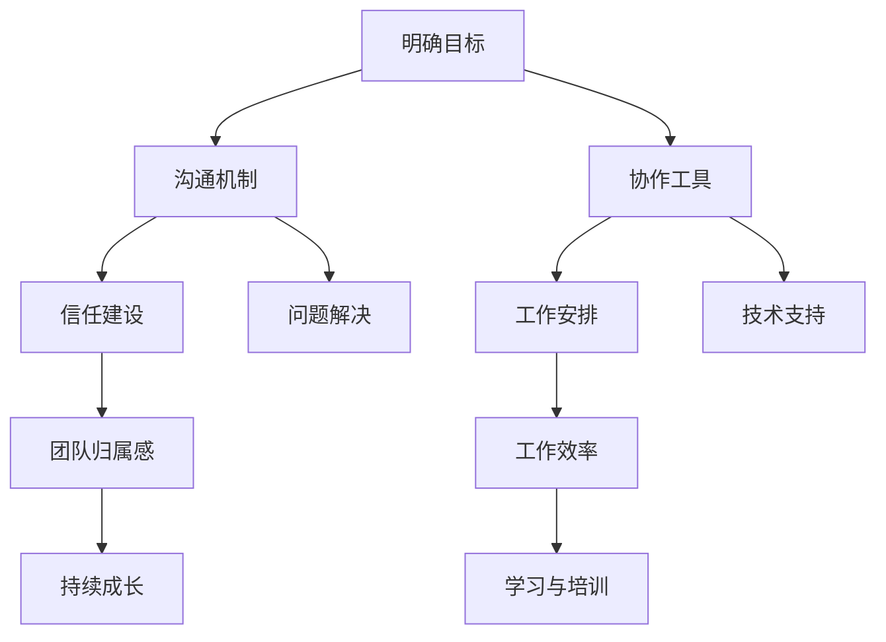

                 

# 如何打造高效的远程团队协作文化

> 关键词：远程团队、协作文化、沟通技巧、工作效率、领导力、案例分析

摘要：本文旨在探讨如何构建高效的远程团队协作文化。我们将从基础出发，逐步分析远程团队协作的挑战与机遇，探讨团队文化的构建、沟通技巧、协作工具的选择、项目管理、工作效率提升、领导力培养以及团队成员的发展与成长。通过案例研究和最佳实践总结，本文将提供一套实用的方法，帮助远程团队实现高效协作。

## 《如何打造高效的远程团队协作文化》目录大纲

### 第一部分：远程团队协作的基础

#### 第1章：远程团队协作概述
1.1 远程工作的兴起
1.2 远程团队协作的挑战与机遇
1.3 有效远程协作的核心要素

#### 第2章：团队文化的构建
2.1 团队文化的定义与重要性
2.2 培养团队归属感
2.3 远程团队文化面临的特殊问题

#### 第3章：远程沟通技巧
3.1 沟通在远程团队中的关键作用
3.2 有效沟通的障碍与解决方法
3.3 远程会议的最佳实践

#### 第4章：远程协作工具与平台
4.1 常见远程协作工具综述
4.2 选择合适的协作工具
4.3 跨平台协作与集成

### 第二部分：远程团队协作的实践

#### 第5章：远程团队项目管理
5.1 远程项目管理的特殊性
5.2 远程项目的计划与执行
5.3 远程团队中的进度监控与问题解决

#### 第6章：提高团队工作效率
6.1 工作效率的定义与测量
6.2 远程工作中的时间管理技巧
6.3 提升工作效率的工具和方法

#### 第7章：远程团队领导力
7.1 领导力的定义与类型
7.2 远程团队领导面临的挑战
7.3 提升远程团队领导力的策略

#### 第8章：远程团队的发展与成长
8.1 团队成员的职业发展
8.2 远程团队的持续学习与成长
8.3 建立长期有效的团队合作关系

### 第三部分：案例研究与最佳实践

#### 第9章：远程团队协作的案例研究
9.1 案例一：某国际远程开发团队的成功实践
9.2 案例二：国内远程团队如何适应疫情变化
9.3 案例三：创业公司远程团队的创新协作模式

#### 第10章：最佳实践与总结
10.1 最佳实践总结
10.2 遇到困难时的应对策略
10.3 远程团队协作文化的未来发展趋势

### 附录：远程协作资源与工具汇总

#### 附录 A：远程协作工具推荐
A.1 团队沟通工具
A.2 项目管理工具
A.3 远程协作平台

#### 附录 B：远程工作政策与指南
B.1 远程工作政策概述
B.2 远程工作注意事项
B.3 团队成员远程工作手册

## 第一部分：远程团队协作的基础

### 第1章：远程团队协作概述

#### 1.1 远程工作的兴起

随着互联网和通信技术的飞速发展，远程工作（Remote Work）已经成为现代工作方式的重要组成部分。根据全球远程工作协会（Global Workplace Analytics）的数据，远程工作的员工数量在过去十年中增长了约80%。这种趋势不仅是因为技术进步使得远程工作变得更加可行，还因为企业意识到远程工作能够带来诸多好处，如降低办公成本、提高员工满意度和工作效率等。

远程工作不仅限于IT行业，越来越多的行业和企业开始接受并采用远程工作模式。例如，金融、医疗、教育和零售等行业都有大量的远程工作机会。此外，一些企业甚至将远程工作作为企业战略的一部分，通过远程团队协作来实现全球资源的整合和优势互补。

#### 1.2 远程团队协作的挑战与机遇

虽然远程工作带来了诸多好处，但也伴随着一系列挑战。首先，远程团队协作面临沟通障碍。由于团队成员分散在不同地点，实时沟通变得更加困难。其次，团队合作和协作效率可能受到影响，团队成员之间缺乏面对面的互动和交流。此外，时间管理和任务分配也是远程团队面临的重要挑战。

然而，远程团队协作也带来了许多机遇。通过合理利用远程协作工具和平台，团队可以更加灵活地安排工作时间，提高工作效率。远程团队还可以利用全球化的优势，招聘和整合来自不同地区和文化的专业人才，为企业带来更多的创新和多样性。

#### 1.3 有效远程协作的核心要素

要实现高效远程团队协作，需要以下几个核心要素：

1. **明确的目标和期望**：团队成员需要明确项目的目标和期望，确保每个人都朝着相同的目标努力。

2. **有效的沟通机制**：建立畅通的沟通渠道，确保信息的及时传递和反馈。这包括使用即时通讯工具、视频会议和电子邮件等。

3. **合理的协作工具**：选择合适的协作工具，如项目管理软件、文档共享平台和远程办公系统，以简化工作流程和提升协作效率。

4. **明确的责任分配**：确保每个团队成员都清楚自己的职责和任务，避免职责重叠和责任模糊。

5. **灵活的工作安排**：根据团队成员的实际情况，合理安排工作时间和地点，确保团队成员能够在最佳状态下工作。

6. **持续的学习与成长**：鼓励团队成员不断学习新技能和知识，提升个人和团队的整体能力。

### 第2章：团队文化的构建

#### 2.1 团队文化的定义与重要性

团队文化是指团队内部共同遵守的价值观、信仰和行为准则。它不仅影响团队成员的工作态度和行为，还决定了团队的凝聚力和协作效率。在一个健康的团队文化中，成员之间相互尊重、信任和合作，能够更好地应对挑战和实现目标。

对于远程团队来说，团队文化尤为重要。由于团队成员分散在不同地点，缺乏面对面的互动和交流，团队文化成为了维系团队凝聚力和协作效率的重要纽带。一个积极向上的团队文化可以激发团队成员的创造力和工作热情，提高团队的整体绩效。

#### 2.2 培养团队归属感

要培养远程团队的归属感，可以采取以下措施：

1. **建立虚拟社区**：通过在线论坛、社交媒体和即时通讯工具，建立团队成员之间的虚拟社区，促进交流和互动。

2. **组织团队活动**：定期举办在线聚会、团建活动和庆祝活动，增强团队成员之间的联系和情感。

3. **鼓励分享与反馈**：鼓励团队成员分享自己的经验和观点，提供建设性的反馈和建议，促进团队内部的沟通和协作。

4. **认可与奖励**：对团队成员的成就和贡献给予认可和奖励，增强他们的归属感和自豪感。

#### 2.3 远程团队文化面临的特殊问题

远程团队文化面临一些特殊的问题，如：

1. **沟通障碍**：由于地理位置和时区差异，远程团队在沟通上面临一定的障碍。这可能导致信息传递不及时、理解不准确和协作效率低下。

2. **时间管理**：远程团队成员需要更好地管理自己的时间，确保按时完成任务和目标。

3. **信任建设**：远程团队缺乏面对面的互动和监督，容易导致信任建设困难。团队成员需要通过其他方式建立互信和合作关系。

4. **技术依赖**：远程团队高度依赖远程协作工具和平台，对技术稳定性和可靠性的要求更高。

### 第3章：远程沟通技巧

#### 3.1 沟通在远程团队中的关键作用

沟通是团队协作的基石，对于远程团队来说尤为重要。有效的沟通能够确保信息的准确传递和反馈，促进团队成员之间的理解与合作，提高工作效率和团队绩效。在远程团队中，沟通不仅包括文字交流，还包括语音、视频和表情等多种形式，以适应不同的沟通需求和场景。

#### 3.2 有效沟通的障碍与解决方法

远程团队在沟通中可能面临以下障碍：

1. **沟通延迟**：由于地理位置和时区差异，远程团队的沟通可能存在延迟。解决方法包括：提前规划沟通时间、使用即时通讯工具和视频会议等。

2. **理解偏差**：远程沟通中容易产生理解偏差，导致误解和冲突。解决方法包括：明确表达意图、提供具体例证和鼓励提问。

3. **信息遗漏**：远程沟通可能存在信息遗漏，导致重要信息未得到及时传递。解决方法包括：定期总结会议内容和关键决策、使用共享文档和协作工具。

4. **文化差异**：远程团队中可能涉及不同文化背景的成员，沟通中容易产生文化差异。解决方法包括：尊重不同文化习惯、明确沟通标准和规范。

#### 3.3 远程会议的最佳实践

远程会议是远程团队沟通的重要形式。以下是一些最佳实践：

1. **明确会议目的和议程**：在会议前明确会议目的和议程，确保会议有明确的目标和方向。

2. **提前通知和准备**：提前通知参会人员会议时间、地点和议程，并提供相关材料和准备事项。

3. **高效会议管理**：在会议中，主持人要确保会议高效进行，避免偏离主题和冗长讨论。

4. **积极参与和互动**：鼓励参会人员积极参与讨论和互动，确保会议的参与度和有效性。

5. **会议记录和跟进**：会后及时记录会议内容和关键决策，并跟进执行情况。

## 第二部分：远程团队协作的实践

### 第5章：远程团队项目管理

#### 5.1 远程项目管理的特殊性

远程团队项目管理与传统的项目管理有所不同，需要考虑以下特殊性：

1. **地理位置分散**：远程团队成员分布在不同的地点，项目管理需要适应不同时区和文化背景。

2. **沟通和协作难度**：远程团队沟通和协作的难度较大，需要建立高效的沟通机制和协作工具。

3. **信任建设**：远程团队缺乏面对面的互动和监督，需要通过其他方式建立互信和合作关系。

4. **技术依赖**：远程团队高度依赖远程协作工具和平台，对技术稳定性和可靠性的要求更高。

#### 5.2 远程项目的计划与执行

远程项目管理的第一步是制定详细的计划。这包括：

1. **项目目标**：明确项目的目标和预期成果，确保团队成员对项目目标有共同的认识。

2. **任务分解**：将项目任务分解为具体的子任务，明确每个任务的负责人和截止日期。

3. **资源分配**：根据任务需求分配人力资源、技术和物资等资源。

4. **风险评估**：评估项目可能面临的风险，制定相应的应对措施。

在项目执行过程中，远程团队需要：

1. **实时监控**：通过项目管理工具实时监控项目进度，确保任务按计划进行。

2. **定期汇报**：定期向项目负责人汇报项目进展，及时调整计划和策略。

3. **问题解决**：及时发现和解决项目中的问题，确保项目顺利进行。

#### 5.3 远程团队中的进度监控与问题解决

远程团队中的进度监控和问题解决是项目管理的重要环节。以下是一些建议：

1. **使用项目管理工具**：选择合适的项目管理工具，如JIRA、Trello等，实时监控项目进度。

2. **定期会议**：定期召开项目会议，讨论项目进展和存在的问题，制定解决方案。

3. **即时沟通**：利用即时通讯工具和视频会议，及时解决项目中的问题。

4. **建立问题反馈机制**：鼓励团队成员及时反馈问题，确保问题得到及时解决。

5. **持续改进**：总结项目经验，持续改进项目管理流程和方法。

### 第6章：提高团队工作效率

#### 6.1 工作效率的定义与测量

工作效率是指在一定时间内完成工作任务的效率。对于远程团队来说，提高工作效率至关重要。以下是一些工作效率的定义与测量方法：

1. **任务完成率**：任务完成率是指在一定时间内完成的任务数量与总任务数量的比率。任务完成率越高，工作效率越高。

2. **平均处理时间**：平均处理时间是指完成每个任务所需的时间。平均处理时间越短，工作效率越高。

3. **任务重复率**：任务重复率是指重复执行的任务数量与总任务数量的比率。任务重复率越低，工作效率越高。

#### 6.2 远程工作中的时间管理技巧

远程工作对时间管理提出了更高的要求。以下是一些时间管理技巧：

1. **设定明确的目标和计划**：在每天或每周开始时，设定明确的工作目标和计划，确保工作有条不紊。

2. **使用时间跟踪工具**：使用时间跟踪工具，如Toggl或RescueTime，监控工作时间和任务进度。

3. **避免时间浪费**：识别和消除工作中浪费时间的行为，如无意义的会议、社交媒体干扰等。

4. **设置优先级**：根据任务的重要性和紧急性，设置工作优先级，确保重要任务得到优先处理。

5. **灵活的工作安排**：根据个人工作和生活需求，灵活安排工作时间和地点，提高工作效率。

#### 6.3 提升工作效率的工具和方法

以下是一些提升远程团队工作效率的工具和方法：

1. **项目管理工具**：如JIRA、Trello、Asana等，帮助团队管理任务和项目进度。

2. **协作工具**：如Slack、Microsoft Teams、Google Workspace等，促进团队成员之间的沟通和协作。

3. **文档共享工具**：如Google Docs、Dropbox、OneDrive等，方便团队成员共享和编辑文档。

4. **自动化工具**：如Zapier、IFTTT等，自动化处理重复性任务，节省时间和精力。

5. **个人成长工具**：如Coursera、Udemy、LinkedIn Learning等，帮助团队成员不断提升自己的技能和知识。

### 第7章：远程团队领导力

#### 7.1 领导力的定义与类型

领导力是指领导者在团队中引导、激励和影响团队成员的能力。根据不同的领导风格和情境，领导力可以分为以下几种类型：

1. **指令型领导力**：领导者明确指导团队成员的工作内容和方式，确保任务顺利完成。

2. **支持型领导力**：领导者关心团队成员的需求和感受，提供支持和鼓励，增强团队凝聚力。

3. **参与型领导力**：领导者鼓励团队成员参与决策和讨论，提高团队成员的参与度和创造力。

4. **变革型领导力**：领导者通过激励和激发团队成员的潜能，推动团队实现变革和持续改进。

#### 7.2 远程团队领导面临的挑战

远程团队领导面临以下挑战：

1. **沟通障碍**：远程团队缺乏面对面的互动，领导者需要通过其他方式建立沟通渠道，确保信息传递和反馈。

2. **信任建设**：远程团队缺乏面对面的互动和监督，领导者需要通过其他方式建立信任和合作关系。

3. **团队管理**：远程团队管理需要适应不同时区和文化背景，领导者需要具备跨文化沟通和管理能力。

4. **技术依赖**：远程团队高度依赖远程协作工具和平台，领导者需要确保技术的稳定性和可靠性。

#### 7.3 提升远程团队领导力的策略

以下是一些提升远程团队领导力的策略：

1. **建立沟通机制**：通过定期会议、即时通讯和视频会议等渠道，确保信息的及时传递和反馈。

2. **培养信任**：通过透明沟通、相互尊重和合作，建立团队成员之间的信任。

3. **提供支持**：关心团队成员的需求和感受，提供必要的帮助和支持。

4. **激励和激励**：通过认可和奖励，激励团队成员发挥潜力，提高团队绩效。

5. **持续学习**：不断学习新技能和知识，提升自己的领导力和管理能力。

## 第三部分：案例研究与最佳实践

### 第9章：远程团队协作的案例研究

#### 9.1 案例一：某国际远程开发团队的成功实践

某国际远程开发团队由来自不同国家和地区的成员组成，通过远程协作实现了高效的工作流程和项目交付。以下是他们成功实践的经验：

1. **明确目标和期望**：在项目启动阶段，团队明确了项目的目标和期望，确保团队成员对项目有共同的认识。

2. **建立高效的沟通机制**：团队采用了多种沟通工具，如Slack、Zoom和Google Workspace，确保信息的及时传递和反馈。

3. **使用项目管理工具**：团队使用了JIRA和Trello等项目管理工具，实时监控项目进度和任务分配。

4. **培养团队归属感**：团队通过定期举办虚拟聚会和团建活动，增强团队成员之间的联系和归属感。

5. **灵活的工作安排**：团队根据成员的时区和文化背景，灵活安排工作时间和地点，确保团队成员能够在最佳状态下工作。

#### 9.2 案例二：国内远程团队如何适应疫情变化

在COVID-19疫情期间，国内许多企业迅速转型，采用远程工作模式。以下是一个成功适应疫情变化的远程团队案例：

1. **快速部署远程协作工具**：企业迅速采购和部署了远程协作工具，如Microsoft Teams、Zoom和腾讯会议，确保团队成员能够顺利过渡到远程工作。

2. **建立灵活的工作安排**：企业允许团队成员根据个人情况和需求，灵活安排工作时间和地点，提高工作效率。

3. **加强沟通和协作**：企业通过定期召开线上会议、即时通讯和共享文档，确保团队成员之间的沟通和协作。

4. **提供技术支持和培训**：企业为团队成员提供技术支持和培训，帮助他们熟悉远程协作工具和平台。

5. **关注团队成员的身心健康**：企业关注团队成员的身心健康，提供心理健康咨询和远程健身课程，确保团队成员在远程工作期间保持良好的身心状态。

#### 9.3 案例三：创业公司远程团队的创新协作模式

一家创业公司通过创新协作模式，实现了高效远程团队协作。以下是他们成功实践的经验：

1. **灵活的招聘策略**：公司采用了灵活的招聘策略，吸引了来自不同国家和地区的优秀人才，为团队带来了多样性和创新思维。

2. **跨文化沟通**：公司注重跨文化沟通，建立了跨文化沟通指南和规范，确保团队成员能够有效沟通和协作。

3. **项目导向的团队组织**：公司根据项目需求，组建了项目导向的团队，确保团队成员专注于项目目标和成果。

4. **远程办公补助**：公司为远程团队成员提供办公补助，如笔记本电脑、网络设备和办公场地，确保团队成员能够在良好的工作环境中工作。

5. **定期团队建设活动**：公司定期举办线上团队建设活动，如虚拟聚会、团队游戏和培训课程，增强团队成员之间的联系和团队凝聚力。

## 第10章：最佳实践与总结

#### 10.1 最佳实践总结

通过以上案例研究和实践经验，我们可以总结出以下最佳实践：

1. **明确目标和期望**：确保团队成员对项目目标和期望有共同的认识。

2. **建立高效的沟通机制**：采用多种沟通工具和渠道，确保信息的及时传递和反馈。

3. **使用项目管理工具**：使用项目管理工具，实时监控项目进度和任务分配。

4. **培养团队归属感**：通过虚拟聚会、团建活动和共享经验，增强团队成员之间的联系和归属感。

5. **灵活的工作安排**：根据团队成员的实际情况，灵活安排工作时间和地点，提高工作效率。

6. **关注团队成员的身心健康**：提供心理健康咨询、远程健身课程和办公补助，确保团队成员在远程工作期间保持良好的身心状态。

#### 10.2 遇到困难时的应对策略

在远程团队协作过程中，难免会遇到各种困难。以下是一些应对策略：

1. **及时沟通**：遇到问题时，及时与团队成员沟通，共同寻找解决方案。

2. **调整计划**：根据实际情况，及时调整项目计划和工作安排，确保项目顺利进行。

3. **寻求外部支持**：在遇到技术或管理难题时，寻求外部专家或合作伙伴的支持。

4. **持续改进**：总结经验教训，持续改进团队协作流程和方法。

#### 10.3 远程团队协作文化的未来发展趋势

随着远程工作的普及和技术的发展，远程团队协作文化将继续演变和改进。以下是一些未来发展趋势：

1. **人工智能和自动化**：利用人工智能和自动化技术，提高远程团队的工作效率和管理水平。

2. **虚拟现实和增强现实**：通过虚拟现实和增强现实技术，增强远程团队的互动和协作体验。

3. **个性化协作**：根据团队成员的特点和需求，提供个性化的协作工具和支持。

4. **可持续性和社会责任**：远程团队协作将更加注重可持续性和社会责任，推动绿色办公和环保工作方式。

### 附录：远程协作资源与工具汇总

#### 附录 A：远程协作工具推荐

A.1 团队沟通工具

- Slack
- Microsoft Teams
- Google Workspace (Gmail, Google Calendar, Google Meet)
- Zoom

A.2 项目管理工具

- JIRA
- Trello
- Asana
- Notion

A.3 远程协作平台

- GitHub
- GitLab
- Bitbucket
- Azure DevOps

#### 附录 B：远程工作政策与指南

B.1 远程工作政策概述

- 明确远程工作的条件和要求。
- 规定远程工作的时间和地点。
- 规定远程工作的沟通和协作方式。
- 提供远程工作所需的设备和资源。

B.2 远程工作注意事项

- 保持良好的工作习惯和时间管理。
- 确保远程工作环境的安全和舒适。
- 定期与团队成员沟通和反馈工作进展。

B.3 团队成员远程工作手册

- 指导团队成员如何使用远程协作工具和平台。
- 提供远程工作所需的技能和知识。
- 解答团队成员在远程工作中遇到的问题和困难。

### 第4章：核心概念与联系

#### 4.1 远程团队协作文化定义与 Mermaid 流程图

远程团队协作文化是指团队成员在远程工作环境下，通过沟通、协作和共同价值观，实现共同目标的过程和行为准则。以下是一个简化的 Mermaid 流程图，展示了远程团队协作文化的基本概念和联系：



#### 4.2 沟通算法伪代码

为了更好地理解远程团队中的沟通机制，我们可以设计一个简单的沟通算法，用于处理团队成员之间的信息传递和反馈：

```python
def communicate(team_members, message):
    for member in team_members:
        send_message(member, message)
        receive_feedback(member)

def send_message(member, message):
    print(f"Sending message to {member['name']}: {message}")

def receive_feedback(member):
    feedback = input(f"Please provide feedback for {member['name']}: ")
    print(f"Received feedback from {member['name']}: {feedback}")

team_members = [
    {'name': 'Alice', 'status': 'online'},
    {'name': 'Bob', 'status': 'online'},
    {'name': 'Charlie', 'status': 'offline'}
]

message = "Hello team, let's discuss the project progress!"
communicate(team_members, message)
```

#### 4.3 远程协作效率模型与公式解释

远程协作效率可以理解为团队成员在远程协作过程中，完成任务所需的时间和资源。以下是一个简化的远程协作效率模型，以及相关公式的解释：

效率（E）= 完成任务所需时间（T）/ 耗费资源（R）

其中：

- 完成任务所需时间（T）：包括任务准备时间、沟通时间、执行时间和问题解决时间。
- 耗费资源（R）：包括人力资源、技术资源和物资资源。

假设一个远程团队在一个项目中，共花费了100小时完成任务，并耗费了2000元资源。那么，该团队的远程协作效率为：

效率（E）= 100小时 / 2000元 = 0.05小时/元

这个公式可以帮助团队了解协作效率，并优化资源利用和工作流程。

### 第5章：项目实战

#### 5.1 远程团队协作代码案例

在本章中，我们将介绍一个简单的远程团队协作代码案例，用于展示团队成员如何通过代码实现协作和沟通。假设我们有一个远程团队，需要实现一个简单的任务调度系统，用于分配和跟踪任务。

#### 5.2 开发环境搭建

为了实现这个任务调度系统，我们需要以下开发环境：

- Python 3.8或更高版本
- Jupyter Notebook或PyCharm等Python开发工具
- MongoDB数据库（用于存储任务数据）
- Flask框架（用于构建Web API）

在开发环境中，我们需要安装以下依赖库：

```bash
pip install pymongo flask
```

#### 5.3 源代码详细实现

以下是一个简单的任务调度系统的源代码实现：

```python
from flask import Flask, jsonify, request
from pymongo import MongoClient

app = Flask(__name__)

# 连接MongoDB数据库
client = MongoClient("mongodb://localhost:27017/")
db = client["task_db"]
tasks_collection = db["tasks"]

# 添加任务
@app.route("/tasks", methods=["POST"])
def add_task():
    task_data = request.json
    task_id = tasks_collection.insert_one(task_data).inserted_id
    return jsonify({"id": str(task_id), "data": task_data})

# 获取任务列表
@app.route("/tasks", methods=["GET"])
def get_tasks():
    tasks = list(tasks_collection.find())
    return jsonify(tasks)

# 更新任务状态
@app.route("/tasks/<task_id>", methods=["PUT"])
def update_task(task_id):
    task_data = request.json
    result = tasks_collection.update_one({"_id": task_id}, {"$set": task_data})
    return jsonify(result)

# 删除任务
@app.route("/tasks/<task_id>", methods=["DELETE"])
def delete_task(task_id):
    result = tasks_collection.delete_one({"_id": task_id})
    return jsonify(result)

if __name__ == "__main__":
    app.run(debug=True)
```

#### 5.4 代码解读与分析

以上代码实现了一个简单的任务调度系统，主要功能包括：

1. **添加任务**：通过POST请求向服务器提交任务数据，将任务存储到MongoDB数据库中。
2. **获取任务列表**：通过GET请求从MongoDB数据库中获取所有任务，以JSON格式返回给客户端。
3. **更新任务状态**：通过PUT请求更新任务状态，将新的任务数据存储到MongoDB数据库中。
4. **删除任务**：通过DELETE请求从MongoDB数据库中删除任务。

代码中使用了Flask框架构建Web API，通过MongoDB数据库存储任务数据。团队成员可以通过HTTP请求与服务器进行交互，实现对任务的添加、获取、更新和删除操作。

#### 5.5 代码分析与应用

以上代码案例展示了如何使用Python和Flask框架实现一个简单的任务调度系统。在实际应用中，远程团队可以通过以下步骤使用这个系统：

1. **安装MongoDB数据库**：在服务器上安装MongoDB数据库，确保数据库正常运行。
2. **配置Flask应用**：在本地或远程开发环境中，安装Flask框架和相关依赖库，配置应用设置。
3. **运行Flask应用**：启动Flask应用，确保Web API正常运行。
4. **使用HTTP请求**：通过HTTP请求与Web API进行交互，实现对任务的添加、获取、更新和删除操作。

通过以上步骤，远程团队可以协作开发和管理任务，提高团队的工作效率和协作效果。

### 附录

#### 附录 A：远程协作工具推荐

A.1 团队沟通工具

- **Slack**：支持即时通讯、视频会议和文件共享，适用于大型团队协作。
- **Microsoft Teams**：集成Office 365服务，提供聊天、视频会议和文档协作功能。
- **Google Workspace**：包括Gmail、Google Calendar、Google Drive和Google Meet等工具，适用于企业协作。

A.2 项目管理工具

- **JIRA**：适用于软件开发团队的项目管理和任务跟踪。
- **Trello**：使用看板式界面进行任务管理和协作。
- **Asana**：适用于任务分配和进度跟踪，支持多种视图和报告功能。
- **Notion**：集成多种功能，如笔记、数据库、看板和日历，适用于团队协作和知识管理。

A.3 远程协作平台

- **GitHub**：代码托管和协作平台，支持版本控制和协作开发。
- **GitLab**：开源代码托管平台，提供自托管版本控制和协作功能。
- **Bitbucket**：适用于中小型团队的代码托管和协作平台。
- **Azure DevOps**：提供代码托管、自动化构建和部署、项目管理和协作等功能。

#### 附录 B：远程工作政策与指南

B.1 远程工作政策概述

- 明确远程工作的条件和要求。
- 规定远程工作的时间和地点。
- 规定远程工作的沟通和协作方式。
- 提供远程工作所需的设备和资源。

B.2 远程工作注意事项

- 保持良好的工作习惯和时间管理。
- 确保远程工作环境的安全和舒适。
- 定期与团队成员沟通和反馈工作进展。

B.3 团队成员远程工作手册

- 指导团队成员如何使用远程协作工具和平台。
- 提供远程工作所需的技能和知识。
- 解答团队成员在远程工作中遇到的问题和困难。

## 作者信息

作者：AI天才研究院/AI Genius Institute & 禅与计算机程序设计艺术 /Zen And The Art of Computer Programming

本文由AI天才研究院（AI Genius Institute）和禅与计算机程序设计艺术（Zen And The Art of Computer Programming）联合撰写，旨在探讨如何构建高效的远程团队协作文化。作者团队拥有丰富的远程团队协作经验，致力于帮助企业和团队实现高效远程协作，提升整体绩效和创新能力。

