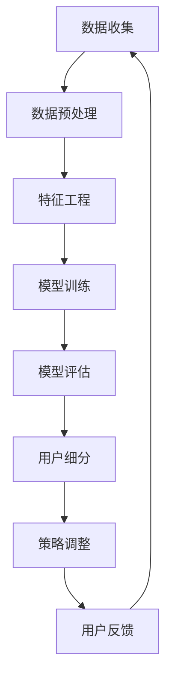

                 

# 2024字节跳动校招：技术用户细分策略专家面试题集锦

## 概述

2024年，字节跳动校招再次吸引了大量技术人才的关注。作为我国领先的内容科技公司，字节跳动的技术用户细分策略专家岗位对于应聘者的技术能力和用户体验理解提出了较高的要求。本文将结合实际面试经验和专业理论知识，为即将参加字节跳动技术用户细分策略专家面试的应聘者提供一套系统的面试题集锦。通过这篇文章，我们不仅希望能够帮助大家更好地准备面试，还希望能够深入探讨技术用户细分策略的核心概念、方法和应用。

## 文章关键词

- 字节跳动
- 校招
- 技术用户细分
- 策略专家
- 面试题集锦

## 文章摘要

本文分为三个主要部分。第一部分将详细介绍面试准备与策略，包括简历准备、技术准备、行为准备等；第二部分将深入探讨用户细分策略的基础知识，包括用户细分定义、用户细分策略、用户细分实战等；第三部分将针对常见面试题进行解析，提供编程题、行为题的解题思路和策略。通过这篇文章，希望能够为读者提供一份全面、深入的面试指南，助力大家顺利通过字节跳动技术用户细分策略专家的面试。

## 《2024字节跳动校招：技术用户细分策略专家面试题集锦》目录大纲

### 第一部分：面试准备与策略

#### 第1章：面试流程与策略

##### 1.1 面试前准备

- **简历准备**
- **技术准备**
- **行为准备**

##### 1.2 面试策略

- **面试官心理分析**
- **面试问题应对策略**
- **面试沟通技巧**

### 第二部分：技术知识储备

#### 第2章：计算机基础知识

##### 2.1 数据结构与算法

- **算法复杂度分析**
- **常见数据结构介绍**
- **常见算法介绍**

##### 2.2 计算机网络

- **TCP/IP模型**
- **常见协议**
- **网络安全**

#### 第3章：编程语言

##### 3.1 编程语言基础

- **C/C++**
- **Python**
- **Java**

##### 3.2 编程语言特性

- **C++特性介绍**
- **Python特性介绍**
- **Java特性介绍**

### 第三部分：用户细分策略

#### 第4章：用户细分基础

##### 4.1 用户细分定义

- **用户细分目的**
- **用户细分方法**

##### 4.2 用户细分策略

- **用户行为分析**
- **用户画像构建**

#### 第5章：用户细分实战

##### 5.1 用户细分案例

- **电商用户细分**
- **社交媒体用户细分**

#### 第6章：策略优化与评估

##### 6.1 策略优化

- **用户反馈机制**
- **策略调整**

##### 6.2 策略评估

- **评估指标**
- **评估方法**

### 第四部分：面试题解析

#### 第7章：常见面试题解析

##### 7.1 编程题解析

- **编程题类型**
- **编程题解题思路**

##### 7.2 行为题解析

- **行为题类型**
- **行为题应对策略**

#### 第8章：面试准备与心理调适

##### 8.1 面试准备

- **面试资料准备**
- **技术知识点梳理**
- **面试题库整理**

##### 8.2 心理调适

- **面试心态调整**
- **心理压力管理**
- **面试技巧提升**

## 第一部分：面试准备与策略

### 第1章：面试流程与策略

#### 1.1 面试前准备

在参加字节跳动技术用户细分策略专家面试前，充分的准备是成功的关键。以下是面试前需要做的三项重要准备：

##### 简历准备

简历是面试官了解应聘者背景和能力的第一手资料，因此简历的准备至关重要。在简历中，应当包括以下内容：

- **个人信息**：包括姓名、联系方式、邮箱等。
- **教育背景**：详细列出所学专业、毕业院校、所学课程等。
- **工作经历**：包括实习、工作经历，特别是与用户细分策略相关的工作或项目经验。
- **技能证书**：如计算机等级考试证书、编程语言证书等。
- **项目经验**：详细描述参与的项目，包括项目背景、职责、使用的技术和工具、项目成果等。
- **个人成果**：如发表的论文、参与的学术研究、获得的奖项等。

在撰写简历时，注意以下几点：

- **简洁明了**：简历内容应简洁明了，避免冗长。
- **突出重点**：重点突出与岗位相关的经历和能力。
- **数据化**：使用数据来量化工作成果，如提高用户转化率百分比、完成的项目数量等。
- **逻辑清晰**：简历的结构应清晰，便于面试官阅读。

##### 技术准备

技术准备是面试的核心，特别是对于技术用户细分策略专家这一岗位。以下是一些关键技术领域的准备建议：

- **数据结构与算法**：掌握常见的数据结构（如数组、链表、树、图等）和算法（如排序、查找、动态规划等），并能够根据实际需求选择合适的数据结构和算法。
- **编程语言**：熟悉C/C++、Python、Java等编程语言，掌握其基本语法和常用库。
- **计算机网络**：了解TCP/IP模型、常见协议（如HTTP、FTP、DNS等）和网络安全基础知识。
- **机器学习和数据挖掘**：熟悉常见的机器学习算法（如分类、回归、聚类等），了解数据挖掘的基本流程和方法。
- **用户研究方法**：掌握用户研究的基本方法，如问卷调查、用户访谈、用户行为分析等。

##### 行为准备

行为准备主要涉及如何应对面试中的行为问题，以下是一些建议：

- **项目经历**：准备好能够详细描述自己在项目中扮演的角色、所承担的任务以及取得的成果。注意强调自己的责任和贡献。
- **团队合作**：准备好描述自己在团队中的合作经历，强调团队合作的重要性以及自己在团队中的角色。
- **问题解决能力**：准备好描述自己在面对复杂问题时如何进行分析和解决问题的过程。

在准备行为问题时，需要注意以下几点：

- **真实可信**：描述的经历应真实可信，避免夸大或虚构。
- **具体详尽**：对项目的描述应具体详尽，使面试官能够清晰地了解项目的背景、自己的角色和贡献。
- **逻辑清晰**：叙述时应逻辑清晰，使面试官容易理解。

#### 1.2 面试策略

##### 面试官心理分析

了解面试官的心理，有助于更好地应对面试。以下是一些关于面试官心理的分析：

- **面试官期望**：面试官期望了解应聘者的技术能力、解决问题的能力和团队合作能力。因此，在面试中，应展示出自己的技术实力，以及在面对问题时如何独立思考和解决问题。
- **面试官倾向**：面试官可能更倾向于招聘有实际项目经验、技术背景扎实、沟通能力强的应聘者。因此，在面试中，应突出自己的项目经验和团队合作能力。
- **面试官态度**：面试官在面试过程中可能会表现出不同的态度，如亲切、严肃、严谨等。无论面试官的态度如何，都应保持自信、冷静，并积极回应面试官的问题。

##### 面试问题应对策略

在面试中，针对不同类型的问题，应采取不同的应对策略：

- **技术问题**：对于技术问题，应确保自己对相关技术有深入的了解，能够清晰地解释技术原理和实现方法。在回答问题时，注意逻辑清晰、条理分明，避免答非所问。
- **行为问题**：对于行为问题，应准备好相关的故事或经历，描述自己在面临挑战时的思考过程和解决问题的方法。在回答问题时，注意突出自己的责任感和解决问题的能力。
- **情景问题**：对于情景问题，应站在公司的角度思考问题，考虑如何在具体情况下为公司创造价值。在回答问题时，注意具体、可行，并能够展示出自己的战略思维和创新能力。

##### 面试沟通技巧

良好的沟通技巧对于面试的成功至关重要。以下是一些建议：

- **自信表达**：在面试中，应自信地表达自己的观点和想法，避免紧张、怯场。
- **有效沟通**：在回答问题时，注意倾听面试官的问题，确保理解问题后再进行回答。在回答过程中，注意条理清晰、逻辑严密，避免跑题。
- **语言规范**：在面试过程中，应使用规范、准确的术语和语言，避免使用方言、俚语等。
- **非语言沟通**：注意非语言沟通的重要性，如眼神交流、面部表情、肢体语言等。在面试过程中，保持微笑、自信的眼神交流，有助于建立良好的沟通氛围。

通过以上面试流程与策略的介绍，相信大家对字节跳动技术用户细分策略专家面试的准备有了更清晰的了解。在接下来的章节中，我们将进一步探讨技术知识储备和用户细分策略，帮助大家更好地应对面试。

### 第2章：技术知识储备

在参加字节跳动技术用户细分策略专家面试时，充分的技术知识储备是成功的关键。本章将详细介绍计算机基础知识、编程语言和计算机网络等领域的核心知识点，为面试做好准备。

#### 2.1 计算机基础知识

计算机基础知识是技术用户细分策略专家必须掌握的基石，以下是一些关键知识点：

##### 数据结构与算法

数据结构是计算机存储数据的方式，而算法是解决问题的一系列步骤。以下是一些常见的数据结构和算法：

- **数据结构**：
  - **数组**：一种线性数据结构，用于存储一系列相同类型的元素。
  - **链表**：一种线性数据结构，由一系列节点组成，每个节点包含数据和指向下一个节点的指针。
  - **栈**：一种后进先出（LIFO）的数据结构，常用于解决递归问题。
  - **队列**：一种先进先出（FIFO）的数据结构，常用于模拟等待队列。
  - **树**：一种分层数据结构，常用于表示层次关系。
  - **图**：一种复杂的数据结构，由节点和边组成，常用于表示网络关系。

- **算法**：
  - **排序算法**：用于对数组或列表进行排序，如冒泡排序、选择排序、插入排序、快速排序等。
  - **查找算法**：用于在数据结构中查找特定元素，如二分查找、线性查找等。
  - **动态规划**：一种解决最优化问题的方法，通过将问题分解为子问题并存储子问题的解来避免重复计算。

##### 计算机网络

计算机网络是连接计算机系统的技术，它使得不同计算机之间能够互相通信。以下是一些计算机网络的关键知识点：

- **TCP/IP模型**：一种分层的网络体系结构，用于定义计算机网络中的通信协议。它分为四层：链路层、互联网层、传输层和应用层。
- **常见协议**：
  - **HTTP**：超文本传输协议，用于在Web浏览器和服务器之间传输数据。
  - **FTP**：文件传输协议，用于在网络中传输文件。
  - **DNS**：域名系统，用于将域名转换为IP地址。
- **网络安全**：确保网络数据传输的安全，防止未授权访问和攻击，如加密、防火墙、入侵检测等。

##### 操作系统和数据库

操作系统和数据库是计算机系统的重要组成部分，以下是一些关键知识点：

- **操作系统**：
  - **进程管理**：操作系统如何管理进程，包括进程的创建、终止和调度。
  - **内存管理**：操作系统如何管理内存，包括内存分配、回收和页面置换。
  - **文件系统**：操作系统如何管理文件，包括文件的创建、删除和读写。
- **数据库**：
  - **关系型数据库**：如MySQL、Oracle等，它们使用SQL（结构化查询语言）进行数据查询和管理。
  - **非关系型数据库**：如MongoDB、Redis等，它们使用不同的数据模型（如文档、键值对、图等）。

##### 算法和数据结构的算法复杂度分析

算法复杂度分析是评估算法性能的关键方法，以下是一些基础知识：

- **时间复杂度**：衡量算法运行时间与输入规模的关系，常用大O符号表示，如O(1)、O(n)、O(n^2)等。
- **空间复杂度**：衡量算法占用内存空间与输入规模的关系，同样使用大O符号表示。

#### 2.2 编程语言

编程语言是编写计算机程序的工具，以下是一些常见编程语言的核心知识点：

##### C/C++

C/C++是一种过程式编程语言，广泛用于系统编程、嵌入式系统和高性能计算。

- **基础语法**：包括变量、数据类型、控制结构、函数等。
- **指针与内存管理**：指针是C/C++的核心概念，用于动态分配内存和操作数据结构。
- **面向对象编程**：C++支持面向对象编程，包括类、继承、多态等。

##### Python

Python是一种高级编程语言，以其简洁、易读的语法和强大的库支持而著称。

- **基础语法**：包括变量、数据类型、控制结构、函数等。
- **库与框架**：Python拥有丰富的库和框架，如NumPy、Pandas、Scikit-learn等，用于数据分析和机器学习。

##### Java

Java是一种面向对象编程语言，广泛用于企业级应用和Android开发。

- **基础语法**：包括变量、数据类型、控制结构、函数等。
- **异常处理**：Java的异常处理机制，包括try、catch、finally等。
- **多线程**：Java的多线程编程，包括线程的创建、同步、通信等。

#### 2.3 编程语言特性

不同编程语言有其独特的特性，以下是一些常见编程语言的特性介绍：

##### C/C++

- **指针**：C/C++中的指针用于动态内存分配和高效的数据访问。
- **多态**：C++支持多态，通过继承和接口实现代码的灵活性和扩展性。
- **性能**：C/C++在执行效率上具有优势，适用于高性能计算和系统编程。

##### Python

- **简洁**：Python的语法简洁明了，易于学习和使用。
- **动态类型**：Python是动态类型语言，可以在运行时改变变量的类型。
- **库支持**：Python拥有丰富的库和框架，用于各种应用场景。

##### Java

- **跨平台**：Java是跨平台的语言，可以在不同的操作系统上运行。
- **安全性**：Java具有强大的安全机制，如沙箱安全模型、安全管理器等。
- **并发**：Java支持多线程编程，适用于高并发场景。

通过以上对计算机基础知识、编程语言和计算机网络等领域的介绍，相信读者对技术用户细分策略专家岗位所需的技术知识储备有了更清晰的认识。在接下来的章节中，我们将进一步探讨用户细分策略的基础知识和实践方法。

### 第3章：用户细分基础

在技术用户细分策略专家的岗位上，用户细分是核心工作之一。本章节将详细介绍用户细分的基础知识，包括用户细分定义、用户细分方法和用户细分策略。

#### 3.1 用户细分定义

用户细分（User Segmentation）是指根据用户的特征、行为和需求，将用户群体划分为不同的子群体，以便更好地理解用户，提供个性化的服务和营销策略。用户细分的目标是识别出具有相似需求和行为的用户群体，从而提高产品和服务的精准度和用户体验。

用户细分的定义可以从以下几个方面进行理解：

- **用户特征**：包括用户的年龄、性别、地理位置、职业等基本信息。
- **用户行为**：包括用户的浏览历史、购买行为、互动行为等。
- **用户需求**：包括用户对产品或服务的需求、期望和痛点。
- **用户群体划分**：根据用户特征、行为和需求，将用户划分为不同的子群体。

#### 3.2 用户细分方法

用户细分方法有很多种，以下是一些常见的用户细分方法：

- **行为细分**：基于用户的在线行为数据，如点击行为、购买行为、评论等，将用户划分为不同的子群体。这种方法主要关注用户的实际行为，能够较准确地反映用户的兴趣和需求。
- **人口统计细分**：基于用户的基本信息，如年龄、性别、地理位置、职业等，将用户划分为不同的子群体。这种方法适用于传统行业，可以帮助企业更好地了解目标客户群体。
- **需求细分**：基于用户的需求和期望，将用户划分为不同的子群体。这种方法需要深入了解用户的需求和痛点，从而提供更加个性化的解决方案。
- **心理细分**：基于用户的心理特征，如价值观、兴趣爱好、生活方式等，将用户划分为不同的子群体。这种方法适用于市场营销和品牌定位，可以帮助企业更好地理解用户的心理需求。

#### 3.3 用户细分策略

用户细分策略是指根据用户细分的结果，制定相应的市场营销策略和产品策略，以提高用户满意度和转化率。以下是一些常见的用户细分策略：

- **目标用户策略**：根据用户细分结果，确定目标用户群体，为这些用户提供更加精准的服务和营销策略。例如，针对高价值用户群体，可以提供定制化的优惠和专属服务。
- **个性化推荐策略**：根据用户细分结果，为不同用户群体提供个性化的产品推荐和服务。例如，针对兴趣相投的用户，可以推荐相关的内容和商品。
- **差异化定价策略**：根据用户细分结果，对不同的用户群体采取差异化的定价策略。例如，针对高价值用户，可以提供优惠价格或增值服务。
- **精准营销策略**：根据用户细分结果，针对不同用户群体进行精准营销。例如，通过邮件、短信、社交媒体等渠道，向特定用户群体推送相关的产品信息和优惠活动。

#### 3.4 用户细分实战案例

以下是一个用户细分实战案例：

- **案例背景**：某电商平台希望通过用户细分来提高用户满意度和转化率。
- **数据收集**：收集用户的浏览历史、购买行为、评论等信息。
- **用户细分**：根据用户的行为数据和人口统计数据，将用户划分为以下子群体：
  - **高价值用户**：频繁购买、消费金额较高的用户。
  - **沉默用户**：长时间未购买、活跃度较低的用户。
  - **新用户**：最近加入平台的用户。
  - **地域用户**：根据用户的地理位置划分的用户群体。
- **用户细分策略**：
  - **高价值用户策略**：为高价值用户提供定制化的优惠和专属服务，如专属客服、优先发货等。
  - **沉默用户策略**：通过邮件和短信提醒沉默用户，了解他们的需求和痛点，提供针对性的优惠和活动。
  - **新用户策略**：为新用户提供欢迎礼包和优惠活动，提高他们的购买意愿。
  - **地域用户策略**：根据不同地域的用户特点，提供本地化的产品和服务。

通过这个案例，我们可以看到用户细分策略在提高用户满意度和转化率方面的重要作用。在实际应用中，企业可以根据自身情况和用户数据，灵活运用用户细分方法，制定相应的用户细分策略。

### 第4章：用户细分实战

在了解了用户细分的基础知识后，本章节将结合实际案例，深入探讨用户细分策略的实战应用。通过这些案例，我们将看到用户细分策略在不同行业和场景下的具体实施方法和效果。

#### 4.1 电商用户细分

电商行业是用户细分策略应用最为广泛的领域之一。以下是一个电商用户细分的案例：

- **案例背景**：某大型电商平台希望通过用户细分来提升销售业绩和客户满意度。
- **数据收集**：电商平台收集了大量的用户数据，包括购买历史、浏览行为、反馈评价等。
- **用户细分**：
  - **高频用户**：频繁购买的消费者。
  - **沉默用户**：长时间未进行购买活动的消费者。
  - **价格敏感用户**：对价格变化敏感，更容易受到促销活动影响的消费者。
  - **品牌忠诚用户**：对特定品牌忠诚，长期购买该品牌产品的消费者。
  - **新用户**：最近加入平台的新消费者。
- **用户细分策略**：
  - **高频用户策略**：为高频用户提供会员服务，如会员专享折扣、积分兑换等，提高用户粘性。
  - **沉默用户策略**：通过邮件和短信提醒沉默用户，了解他们的需求和痛点，提供个性化的推荐和优惠活动。
  - **价格敏感用户策略**：在特定时间点推出促销活动，如限时抢购、满减等，吸引价格敏感用户。
  - **品牌忠诚用户策略**：为品牌忠诚用户提供专属优惠和礼品，增强品牌忠诚度。
  - **新用户策略**：为新用户提供注册优惠、购物津贴等，提高他们的购买意愿。

通过用户细分策略的实施，电商平台显著提升了用户满意度和销售业绩。

#### 4.2 社交媒体用户细分

社交媒体平台也广泛应用用户细分策略，以提升用户体验和用户参与度。以下是一个社交媒体用户细分的案例：

- **案例背景**：某社交媒体平台希望通过用户细分来提高用户活跃度和留存率。
- **数据收集**：社交媒体平台收集了用户的浏览历史、互动行为、内容偏好等数据。
- **用户细分**：
  - **活跃用户**：频繁发布内容、评论和点赞的用户。
  - **沉默用户**：长时间未进行互动的用户。
  - **内容创作者**：发布高质量内容的用户。
  - **普通用户**：普通浏览和互动的用户。
  - **新用户**：最近加入平台的新用户。
- **用户细分策略**：
  - **活跃用户策略**：为活跃用户提供更多的曝光机会，如推荐给他们感兴趣的内容、举办互动活动等。
  - **沉默用户策略**：通过私信和推送消息，了解他们的需求和兴趣，提供个性化的内容推荐和活动邀请。
  - **内容创作者策略**：为内容创作者提供创作工具、推广机会和奖励机制，鼓励他们持续创作高质量内容。
  - **普通用户策略**：通过算法推荐和个性化标签，为普通用户提供感兴趣的内容，提高他们的互动意愿。
  - **新用户策略**：为新用户提供欢迎礼包、新手教程和引导活动，帮助他们快速融入平台。

通过用户细分策略的实施，社交媒体平台显著提高了用户活跃度和留存率。

#### 4.3 金融行业用户细分

金融行业在用户细分方面也有广泛的应用，以下是一个金融行业用户细分的案例：

- **案例背景**：某金融公司希望通过用户细分来提升客户满意度和资产收益率。
- **数据收集**：金融公司收集了客户的交易记录、风险偏好、财务状况等数据。
- **用户细分**：
  - **高风险投资者**：具有较高风险承受能力的投资者。
  - **中风险投资者**：风险承受能力适中的投资者。
  - **低风险投资者**：风险承受能力较低的投资者。
  - **新客户**：最近加入的投资者。
  - **忠诚客户**：长期合作的投资者。
- **用户细分策略**：
  - **高风险投资者策略**：为高风险投资者提供更多高风险、高收益的投资产品，如股票、外汇等。
  - **中风险投资者策略**：为中风险投资者提供稳健的投资产品，如债券、基金等。
  - **低风险投资者策略**：为低风险投资者提供低风险、低收益的投资产品，如定期存款、理财产品等。
  - **新客户策略**：为新客户提供风险提示和投资指导，帮助他们了解投资市场和产品。
  - **忠诚客户策略**：为忠诚客户提供专属服务，如优先交易权、VIP客户经理等，增强客户忠诚度。

通过用户细分策略的实施，金融公司显著提升了客户满意度和资产收益率。

#### 4.4 娱乐行业用户细分

娱乐行业在用户细分方面也有广泛应用，以下是一个娱乐行业用户细分的案例：

- **案例背景**：某视频平台希望通过用户细分来提升用户观看体验和平台粘性。
- **数据收集**：视频平台收集了用户的观看历史、偏好、互动行为等数据。
- **用户细分**：
  - **高频用户**：频繁观看视频的用户。
  - **沉默用户**：长时间未观看视频的用户。
  - **内容创作者**：上传和分享原创视频的用户。
  - **普通用户**：普通浏览和观看视频的用户。
  - **新用户**：最近加入平台的用户。
- **用户细分策略**：
  - **高频用户策略**：为高频用户提供个性化的内容推荐和会员权益，提高用户粘性。
  - **沉默用户策略**：通过推送消息和活动邀请，唤醒沉默用户，提高他们的观看意愿。
  - **内容创作者策略**：为内容创作者提供推广机会和奖励机制，鼓励他们创作更多高质量视频。
  - **普通用户策略**：通过算法推荐和个性化标签，为普通用户提供感兴趣的视频内容。
  - **新用户策略**：为新用户提供试用会员和推荐视频，帮助他们快速融入平台。

通过用户细分策略的实施，视频平台显著提升了用户观看体验和平台粘性。

通过以上案例，我们可以看到用户细分策略在不同行业和场景下的具体应用效果。在实际操作中，企业需要根据自身业务特点和数据情况，灵活运用用户细分方法，制定相应的用户细分策略，以提高用户满意度和业务增长。

### 第5章：策略优化与评估

在用户细分策略的实施过程中，策略优化与评估是确保策略有效性的关键环节。通过不断的策略优化与评估，企业可以及时调整策略，提高用户满意度、转化率和留存率。本章节将详细介绍策略优化的方法、用户反馈机制、策略调整效果评估以及评估指标和评估方法。

#### 5.1 策略优化

策略优化是指根据用户反馈和市场变化，对用户细分策略进行调整和改进，以提高策略的有效性。以下是一些常见的策略优化方法：

1. **A/B测试**：A/B测试是一种常用的策略优化方法，通过将用户随机分配到不同策略组，比较两组用户的反应和效果，从而确定哪种策略更有效。A/B测试可以用于评估不同的用户细分方法、推荐算法、优惠策略等。

2. **用户反馈机制**：建立用户反馈机制，收集用户对产品和服务的反馈，包括满意度、使用体验、改进建议等。通过分析用户反馈，发现策略存在的问题和改进点，从而优化策略。

3. **数据分析**：利用数据分析技术，对用户行为数据、销售数据、市场数据等进行分析，发现用户需求和市场趋势，为策略优化提供数据支持。例如，通过聚类分析、关联规则挖掘等方法，识别出具有相似特征的用户群体，制定个性化的营销策略。

4. **专家评审**：邀请行业专家对现有策略进行评审，提出优化建议。专家评审可以帮助企业从不同角度审视策略，发现潜在的问题和改进点。

5. **迭代优化**：将策略优化视为一个持续的过程，根据评估结果和用户反馈，不断调整和改进策略。通过多次迭代优化，逐步提升策略的有效性。

#### 5.2 用户反馈机制

用户反馈机制是策略优化的重要基础，以下是一些关键步骤：

1. **用户反馈渠道**：建立多种用户反馈渠道，如在线问卷、用户论坛、客服系统、社交媒体等。确保用户能够方便地提交反馈，并能够快速得到回应。

2. **反馈数据收集**：收集用户反馈数据，包括用户满意度、使用体验、改进建议等。通过结构化和非结构化数据收集方式，全面了解用户的真实需求和意见。

3. **反馈数据分析**：对用户反馈数据进行分析，识别出用户关注的问题和需求，为策略调整提供依据。例如，通过文本挖掘技术，分析用户在论坛、社交媒体等平台上的讨论内容，发现用户关心的热点问题。

4. **反馈处理与响应**：对用户反馈进行及时处理和响应，包括解决问题、改进产品和服务、反馈给相关部门等。确保用户反馈得到有效处理，增强用户的满意度和忠诚度。

#### 5.3 策略调整效果评估

在策略调整后，需要进行效果评估，以验证策略调整的有效性。以下是一些评估方法和指标：

1. **用户满意度**：通过用户满意度调查，了解用户对产品和服务的满意程度。用户满意度指标可以反映策略调整对用户体验的改善情况。

2. **转化率**：转化率是指用户在接触产品或服务后，采取期望行为（如购买、注册、下载等）的比例。通过对比策略调整前后的转化率，评估策略调整对业务增长的影响。

3. **留存率**：留存率是指在一定时间内，用户继续使用产品或服务的比例。通过对比策略调整前后的留存率，评估策略调整对用户留存的影响。

4. **ROI（投资回报率）**：ROI是指策略调整带来的收益与投资成本之比。通过计算ROI，评估策略调整的经济效益。

5. **A/B测试结果**：通过A/B测试结果，对比不同策略组的效果，确定哪种策略更有效。

6. **市场反馈**：收集市场反馈，包括行业报告、用户评论、竞争对手动态等，了解策略调整在市场中的表现。

#### 5.4 评估指标和评估方法

以下是一些常见的评估指标和方法：

1. **评估指标**：
   - 用户满意度指标：如用户满意度评分、用户投诉率等。
   - 转化率指标：如购买转化率、注册转化率等。
   - 留存率指标：如日留存率、周留存率等。
   - ROI指标：如ROI增长比例、投资回报周期等。

2. **评估方法**：
   - **数据分析方法**：利用数据分析技术，对用户行为数据、销售数据、市场数据等进行分析，识别用户需求和市场趋势，为策略调整提供依据。
   - **用户调查方法**：通过在线问卷、电话调查、面对面访谈等方式，收集用户对产品和服务的满意度、使用体验等反馈，为策略调整提供参考。
   - **A/B测试方法**：将用户随机分配到不同策略组，比较两组用户的效果，确定哪种策略更有效。
   - **市场分析方法**：通过行业报告、市场调研等方式，了解市场趋势和竞争状况，为策略调整提供市场依据。

通过以上策略优化与评估的方法和指标，企业可以持续优化用户细分策略，提高用户满意度、转化率和留存率，实现业务增长。

### 第6章：常见面试题解析

在面试过程中，技术用户细分策略专家岗位的面试题通常涵盖编程题、行为题和情景题等多个方面。本章节将针对这些常见的面试题类型，提供解题思路和策略，帮助应聘者更好地应对面试。

#### 6.1 编程题解析

编程题是技术面试中非常重要的一部分，以下是一些常见的编程题类型和解题思路：

##### 6.1.1 基础算法题

**类型**：基础算法题通常包括排序、查找、动态规划等。

**解题思路**：
1. 理解题目要求，明确输入和输出。
2. 分析题目数据规模，选择合适的数据结构和算法。
3. 编写代码，注意算法的复杂度。
4. 进行测试，确保代码的正确性和效率。

**示例**：实现一个快速排序算法。

```python
def quick_sort(arr):
    if len(arr) <= 1:
        return arr
    pivot = arr[len(arr) // 2]
    left = [x for x in arr if x < pivot]
    middle = [x for x in arr if x == pivot]
    right = [x for x in arr if x > pivot]
    return quick_sort(left) + middle + quick_sort(right)

# 测试
arr = [3, 6, 8, 10, 1, 2, 1]
print(quick_sort(arr))
```

##### 6.1.2 数据结构题

**类型**：数据结构题通常包括链表、树、图等。

**解题思路**：
1. 熟悉数据结构的基本操作，如插入、删除、查找等。
2. 分析题目要求，选择合适的数据结构。
3. 编写代码，注意数据结构的复杂度。
4. 进行测试，确保代码的正确性和效率。

**示例**：实现一个单链表的插入操作。

```python
class ListNode:
    def __init__(self, val=0, next=None):
        self.val = val
        self.next = next

def insert(node, value):
    new_node = ListNode(value)
    if node is None:
        return new_node
    while node.next is not None:
        node = node.next
    node.next = new_node
    return node

# 测试
head = ListNode(1)
head = insert(head, 2)
head = insert(head, 3)
print(head.val, head.next.val, head.next.next.val)
```

##### 6.1.3 动态规划题

**类型**：动态规划题通常包括背包问题、最长公共子序列等。

**解题思路**：
1. 理解题目要求，明确状态和状态转移方程。
2. 初始化状态数组。
3. 按照状态转移方程计算最终结果。

**示例**：实现一个0-1背包问题的解法。

```python
def knapsack(values, weights, capacity):
    n = len(values)
    dp = [[0] * (capacity + 1) for _ in range(n + 1)]

    for i in range(1, n + 1):
        for w in range(1, capacity + 1):
            if weights[i - 1] <= w:
                dp[i][w] = max(dp[i - 1][w], dp[i - 1][w - weights[i - 1]] + values[i - 1])
            else:
                dp[i][w] = dp[i - 1][w]

    return dp[n][capacity]

# 测试
values = [60, 100, 120]
weights = [10, 20, 30]
capacity = 50
print(knapsack(values, weights, capacity))
```

#### 6.2 行为题解析

行为题通常涉及应聘者在以往的工作或项目经历中如何解决问题、如何与团队合作等方面。以下是一些常见的行为题类型和应对策略：

##### 6.2.1 项目经历

**类型**：项目经历题通常要求应聘者描述在一个项目中承担的角色、遇到的问题和解决方法。

**应对策略**：
1. 突出项目中的关键角色和责任。
2. 详细描述项目中遇到的问题和挑战。
3. 展示解决问题的思路和方法。
4. 强调项目成果和个人的贡献。

**示例**：描述在某个项目中担任项目经理的经历。

```markdown
在某个电商项目中，我担任项目经理，负责项目规划、团队协调和进度控制。项目初期，我们遇到了需求变更频繁、团队协作不畅等问题。为了解决这些问题，我采取了以下措施：

1. 与产品经理和技术团队密切沟通，明确项目目标和需求，确保项目方向的稳定性。
2. 引入敏捷开发方法，采用每日站会和迭代评审，提高团队协作效率和项目透明度。
3. 建立合理的任务分配和激励机制，鼓励团队成员积极参与项目，提高工作效率。
4. 及时解决团队中的矛盾和问题，保持团队的积极氛围。

最终，项目按时完成，并达到了预期的效果。
```

##### 6.2.2 团队合作

**类型**：团队合作题通常要求应聘者描述在团队中如何合作、如何处理冲突等。

**应对策略**：
1. 强调团队合作的重要性。
2. 描述自己在团队中的角色和贡献。
3. 举例说明如何处理团队冲突和问题。
4. 突出团队合作带来的成果。

**示例**：描述在一个团队项目中如何处理冲突。

```markdown
在一次团队项目中，我们遇到了技术方案分歧较大的问题，团队成员之间出现了意见不一致的情况。为了解决这个问题，我采取了以下措施：

1. 组织团队成员进行讨论，了解各自的观点和理由。
2. 引入第三方专家进行评审，提供中立的意见和建议。
3. 根据专家意见，重新审视项目目标和需求，确保方案的可行性。
4. 在团队内部进行沟通，达成共识，确保团队的执行力。

最终，我们成功解决了技术方案的分歧，项目得以顺利推进。
```

通过以上解析，我们可以看到，在面试中，编程题和行为题的应对策略各不相同，但关键在于逻辑清晰、条理分明，能够展示自己的技术实力和解决实际问题的能力。在实际面试中，应聘者应根据题目类型和面试官的要求，灵活运用这些策略，展示自己的综合素质。

### 第7章：面试准备与心理调适

在参加字节跳动技术用户细分策略专家的面试前，充分的准备和良好的心理调适是成功的关键。本章将详细介绍面试准备、心理调适和面试技巧提升等方面的内容，帮助应聘者更好地应对面试挑战。

#### 7.1 面试准备

面试准备是面试成功的第一步，以下是一些面试准备的具体建议：

##### 面试资料准备

1. **简历**：简历是面试官了解应聘者背景和能力的重要资料。在准备简历时，应注意以下几点：
   - **简洁明了**：简历内容应简洁明了，突出重点。
   - **真实可信**：简历中的内容应真实可信，避免夸大或虚构。
   - **突出重点**：突出与岗位相关的经历和能力，特别是用户细分策略方面的经验。
   - **数据化**：使用数据来量化工作成果，如提高用户转化率、完成的项目数量等。

2. **技术准备**：技术用户细分策略专家的岗位要求应聘者具备扎实的技术基础。以下是一些技术准备的建议：
   - **数据结构与算法**：掌握常见的数据结构（如数组、链表、树、图等）和算法（如排序、查找、动态规划等），并能够根据实际需求选择合适的数据结构和算法。
   - **编程语言**：熟悉至少一种编程语言（如Python、Java等），掌握其基本语法和常用库。
   - **机器学习和数据挖掘**：了解常见的机器学习算法（如分类、回归、聚类等），熟悉数据挖掘的基本流程和方法。
   - **用户研究方法**：掌握用户研究的基本方法，如问卷调查、用户访谈、用户行为分析等。

3. **行为准备**：行为准备主要涉及如何描述自己在以往的工作或项目经历中的表现。以下是一些行为准备的建议：
   - **项目经历**：准备好能够详细描述自己在项目中扮演的角色、所承担的任务以及取得的成果。
   - **团队合作**：准备好描述自己在团队中的合作经历，强调团队合作的重要性以及自己在团队中的角色。
   - **问题解决能力**：准备好描述自己在面对复杂问题时如何进行分析和解决问题的过程。

##### 技术知识点梳理

在面试前，应聘者应对相关技术知识点进行梳理，以下是一些关键知识点：

- **数据结构与算法**：包括常见的数据结构和算法，如排序、查找、动态规划等。
- **编程语言**：熟悉至少一种编程语言的基本语法和常用库，如Python、Java等。
- **机器学习和数据挖掘**：了解常见的机器学习算法（如分类、回归、聚类等），熟悉数据挖掘的基本流程和方法。
- **用户研究方法**：掌握用户研究的基本方法，如问卷调查、用户访谈、用户行为分析等。
- **计算机网络**：了解TCP/IP模型、常见协议（如HTTP、FTP、DNS等）和网络安全基础知识。
- **操作系统**：了解操作系统的基本概念，如进程管理、内存管理、文件系统等。

##### 面试题库整理

整理一份面试题库，有助于应聘者在面试前进行有针对性的复习。以下是一些常见的面试题类型和题目：

- **编程题**：包括基础算法题、数据结构题和动态规划题等。
- **行为题**：包括项目经历、团队合作和问题解决能力等。
- **情景题**：包括在特定情境下如何处理问题等。

#### 7.2 心理调适

良好的心理状态对于面试的成功至关重要。以下是一些心理调适的方法：

##### 面试心态调整

1. **正确看待面试**：将面试视为一个展示自己能力和了解公司的机会，而非单纯的考核。
2. **积极心态**：保持积极乐观的心态，相信自己能够应对面试挑战。
3. **自信心**：相信自己的能力，展示自己的自信和决心。

##### 心理压力管理

1. **合理规划时间**：提前规划面试准备时间，避免临时抱佛脚。
2. **调整作息时间**：保证充足的睡眠，避免熬夜。
3. **放松身心**：进行适当的放松活动，如散步、瑜伽、冥想等。

##### 面试技巧提升

1. **自信表达**：在面试中自信地表达自己的观点和想法，避免紧张、怯场。
2. **有效沟通**：注意倾听面试官的问题，确保理解问题后再进行回答。在回答过程中，注意条理清晰、逻辑严密，避免跑题。
3. **语言规范**：在面试过程中，使用规范、准确的术语和语言，避免使用方言、俚语等。
4. **非语言沟通**：注意非语言沟通的重要性，如眼神交流、面部表情、肢体语言等。在面试过程中，保持微笑、自信的眼神交流，有助于建立良好的沟通氛围。

通过以上面试准备和心理调适的建议，相信应聘者能够在字节跳动技术用户细分策略专家的面试中表现出色，成功获得心仪的岗位。

### 附录：面试资源与工具

在备战字节跳动技术用户细分策略专家面试的过程中，利用合适的资源与工具可以大大提高准备效率和面试成功率。以下是一些推荐的面试资源、工具以及字节跳动面试真题解析，帮助应聘者更好地准备面试。

#### 附录 A：面试资源

1. **面试题库**：市面上有许多针对技术岗位的面试题库，如LeetCode、牛客网等，提供了大量编程题、数据结构和算法题供练习。
2. **技术博客与论坛**：阅读知名技术博客和论坛，如CSDN、知乎等，可以获取最新的技术动态、解决方案和面试经验。
3. **专业书籍**：一些经典的计算机科学和编程书籍，如《算法导论》、《深入理解计算机系统》等，是面试前的必备读物。
4. **在线课程**：参加在线编程课程和数据科学课程，如Coursera、edX等，可以系统地提升技术能力。

#### 附录 B：面试工具

1. **在线编程环境**：如LeetCode Online Judge、牛客网等，提供了在线编程环境，方便进行编程练习和模拟面试。
2. **面试题库软件**：如InterviewBit、TopCoder等，提供了丰富的编程题库和在线测试功能，有助于面试前的系统复习。
3. **简历制作工具**：如LinkedIn、Canva等，可以帮助应聘者制作专业、美观的简历。

#### 附录 C：字节跳动面试真题

1. **编程题**：
   - **最长公共子串**：给定两个字符串，找出它们的最长公共子串。
   - **二叉树的遍历**：实现二叉树的先序、中序和后序遍历。
   - **链表反转**：反转单链表。

2. **行为题**：
   - **项目经历**：描述一个你参与过的重要项目，包括项目目标、你的角色、遇到的问题以及解决方案。
   - **团队合作**：描述一个你曾经参与的团队项目，强调你在团队中的作用以及如何与其他团队成员合作。

3. **情景题**：
   - **时间管理**：如何在紧张的时间内完成多项任务？
   - **团队合作**：如何在一个团队中与他人有效沟通，解决分歧？

#### 真题解析

以下是对一些典型字节跳动面试题的解析，帮助应聘者更好地理解和应对面试题目。

**最长公共子串**：
```python
def longest_common_substring(s1, s2):
    dp = [[0] * (len(s2) + 1) for _ in range(len(s1) + 1)]
    max_len = 0
    end_pos = 0
    for i in range(1, len(s1) + 1):
        for j in range(1, len(s2) + 1):
            if s1[i - 1] == s2[j - 1]:
                dp[i][j] = dp[i - 1][j - 1] + 1
                if dp[i][j] > max_len:
                    max_len = dp[i][j]
                    end_pos = i
            else:
                dp[i][j] = 0
    return s1[end_pos - max_len: end_pos]

# 测试
s1 = "abcde"
s2 = "acdef"
print(longest_common_substring(s1, s2))
```

**二叉树的遍历**：
```python
class TreeNode:
    def __init__(self, val=0, left=None, right=None):
        self.val = val
        self.left = left
        self.right = right

def inorder_traversal(root):
    if root:
        inorder_traversal(root.left)
        print(root.val, end=' ')
        inorder_traversal(root.right)

# 测试
root = TreeNode(1)
root.left = TreeNode(2)
root.right = TreeNode(3)
root.left.left = TreeNode(4)
root.left.right = TreeNode(5)
inorder_traversal(root)
```

**链表反转**：
```python
def reverse_linked_list(head):
    prev = None
    curr = head
    while curr:
        next_node = curr.next
        curr.next = prev
        prev = curr
        curr = next_node
    return prev

# 测试
class ListNode:
    def __init__(self, val=0, next=None):
        self.val = val
        self.next = next

head = ListNode(1)
head.next = ListNode(2)
head.next.next = ListNode(3)
new_head = reverse_linked_list(head)
while new_head:
    print(new_head.val, end=' ')
    new_head = new_head.next
```

通过以上解析，应聘者可以更好地理解面试题目的要求和解决方法，从而在面试中更加自信地应对。

### 附录：核心算法原理讲解

在技术用户细分策略专家的岗位上，掌握核心算法原理是至关重要的。以下将详细讲解算法复杂度分析、常见算法原理，并使用伪代码进行阐述，同时结合数学模型和公式进行说明。

#### 算法复杂度分析

算法复杂度分析是评估算法性能的一种方法，主要包括时间复杂度和空间复杂度。

##### 时间复杂度

时间复杂度表示算法执行时间与输入规模的关系，通常用大O符号表示。以下是一个简单的例子：

```python
def algorithm_complexity(n):
    for i in range(n):
        for j in range(n):
            # O(1) 操作
            pass
```

- **伪代码解释**：这是一个双重循环，外层循环执行n次，内层循环也执行n次，因此总执行次数为\( n \times n \)。
- **时间复杂度**：\( O(n^2) \)，表示随着输入规模n的增加，算法的执行时间呈平方关系增长。

##### 空间复杂度

空间复杂度表示算法占用内存空间与输入规模的关系，同样用大O符号表示。以下是一个例子：

```python
def space_complexity(n):
    arr = [0] * n  # 初始化一个长度为n的数组
    # 其他操作
```

- **伪代码解释**：这里初始化了一个长度为n的数组，占用n个单位的空间。
- **空间复杂度**：\( O(n) \)，表示内存占用与输入规模n成正比。

#### 常见算法原理

以下介绍几种常见算法的原理和伪代码：

##### 快速排序（Quick Sort）

快速排序是一种高效的排序算法，采用分治策略。

```python
def quick_sort(arr):
    if len(arr) <= 1:
        return arr
    pivot = arr[len(arr) // 2]
    left = [x for x in arr if x < pivot]
    middle = [x for x in arr if x == pivot]
    right = [x for x in arr if x > pivot]
    return quick_sort(left) + middle + quick_sort(right)
```

- **伪代码解释**：选择一个基准值（pivot），将数组分为小于、等于、大于pivot的三个子数组，递归地对每个子数组进行排序。
- **算法原理**：通过分治，将大问题分解为多个小问题，递归解决。

##### 动态规划（Dynamic Programming）

动态规划是一种用于解决最优化问题的算法，通常用于求取最优解。

```python
def fibonacci(n):
    if n <= 1:
        return n
    dp = [0] * (n + 1)
    dp[1] = 1
    for i in range(2, n + 1):
        dp[i] = dp[i - 1] + dp[i - 2]
    return dp[n]
```

- **伪代码解释**：使用一个数组dp存储子问题的解，通过迭代求解整个问题。
- **算法原理**：通过备忘录（dp数组），避免重复计算，提高效率。

#### 数学模型与数学公式

以下介绍一个常用的数学模型和公式，并使用LaTeX格式进行表示。

##### 损失函数（Loss Function）

损失函数是机器学习中的重要概念，用于评估模型预测的准确性。

$$
E[Loss] = \frac{1}{N} \sum_{i=1}^{N} (y_i - \hat{y}_i)^2
$$

- **公式解释**：\( E[Loss] \)表示损失函数的平均值，\( y_i \)表示实际输出，\( \hat{y}_i \)表示预测输出，\( N \)表示样本数量。
- **举例说明**：假设我们有5个样本，其中3个样本的预测输出与实际输出相同，另外2个样本的预测输出与实际输出相差较大。
  - 计算损失函数的平均值：
    $$
    E[Loss] = \frac{1}{5} \times (0^2 + 0^2 + 2^2 + 2^2 + 0^2) = \frac{8}{5}
    $$

通过以上对核心算法原理的详细讲解，希望能够帮助读者深入理解算法的基本概念和实现方法，为面试和实际工作打下坚实的基础。

### 附录：项目实战

#### 实战1：电商用户细分

##### 开发环境搭建

1. **Python环境搭建**：确保Python 3.8及以上版本安装，可以通过以下命令进行安装：
   ```
   pip install python==3.8
   ```

2. **TensorFlow框架安装**：TensorFlow是机器学习的常用框架，可以通过以下命令进行安装：
   ```
   pip install tensorflow==2.5
   ```

##### 源代码实现

以下是一个电商用户细分的简单实现，主要包括数据预处理、特征工程、模型训练与评估、用户细分结果可视化等步骤。

```python
import pandas as pd
import numpy as np
from sklearn.model_selection import train_test_split
from sklearn.preprocessing import StandardScaler
from sklearn.ensemble import RandomForestClassifier
import matplotlib.pyplot as plt

# 数据预处理
data = pd.read_csv('ecommerce_data.csv')
data.drop(['user_id'], axis=1, inplace=True)
data.fillna(0, inplace=True)

# 特征工程
X = data.drop(['converted'], axis=1)
y = data['converted']

X_train, X_test, y_train, y_test = train_test_split(X, y, test_size=0.2, random_state=42)
scaler = StandardScaler()
X_train_scaled = scaler.fit_transform(X_train)
X_test_scaled = scaler.transform(X_test)

# 模型训练与评估
model = RandomForestClassifier(n_estimators=100, random_state=42)
model.fit(X_train_scaled, y_train)
accuracy = model.score(X_test_scaled, y_test)
print(f"Model accuracy: {accuracy:.2f}")

# 用户细分结果可视化
predictions = model.predict(X_test_scaled)
plt.scatter(X_test['basket_size'], predictions, c='red' if predictions == 1 else 'blue', marker='o')
plt.xlabel('Basket Size')
plt.ylabel('Prediction')
plt.title('User Segmentation')
plt.show()
```

##### 代码解读与分析

1. **数据预处理**：读取电商数据集，去除无关特征（如用户ID），填充缺失值。
2. **特征工程**：分离特征和标签，将数据集分为训练集和测试集，并对特征进行标准化处理。
3. **模型训练与评估**：使用随机森林分类器进行训练，评估模型在测试集上的准确率。
4. **用户细分结果可视化**：根据模型预测结果，绘制散点图，直观展示用户细分结果。

通过上述代码和步骤，我们可以实现一个简单的电商用户细分项目，为实际业务提供数据支持和决策依据。

#### 实战2：社交媒体用户细分

##### 开发环境搭建

1. **Python环境搭建**：确保Python 3.8及以上版本安装，可以通过以下命令进行安装：
   ```
   pip install python==3.8
   ```

2. **PyTorch框架安装**：PyTorch是深度学习的常用框架，可以通过以下命令进行安装：
   ```
   pip install torch==1.8 torchvision==0.9
   ```

##### 源代码实现

以下是一个社交媒体用户细分的实现，主要包括数据预处理、特征工程、模型训练与评估、用户细分结果可视化等步骤。

```python
import pandas as pd
import numpy as np
import torch
import torch.nn as nn
import torch.optim as optim
from sklearn.model_selection import train_test_split
from sklearn.preprocessing import StandardScaler
import matplotlib.pyplot as plt

# 数据预处理
data = pd.read_csv('social_media_data.csv')
data.drop(['user_id'], axis=1, inplace=True)
data.fillna(0, inplace=True)

# 特征工程
X = data.drop(['is_active_user'], axis=1)
y = data['is_active_user']

X_train, X_test, y_train, y_test = train_test_split(X, y, test_size=0.2, random_state=42)
scaler = StandardScaler()
X_train_scaled = scaler.fit_transform(X_train)
X_test_scaled = scaler.transform(X_test)

# 模型实现
class UserSegmentationModel(nn.Module):
    def __init__(self):
        super(UserSegmentationModel, self).__init__()
        self.fc1 = nn.Linear(X_train_scaled.shape[1], 64)
        self.fc2 = nn.Linear(64, 32)
        self.fc3 = nn.Linear(32, 1)
        self.sigmoid = nn.Sigmoid()

    def forward(self, x):
        x = self.fc1(x)
        x = self.fc2(x)
        x = self.fc3(x)
        return self.sigmoid(x)

# 模型训练
device = torch.device("cuda" if torch.cuda.is_available() else "cpu")
model = UserSegmentationModel().to(device)
criterion = nn.BCELoss()
optimizer = optim.Adam(model.parameters(), lr=0.001)

for epoch in range(100):
    model.train()
    optimizer.zero_grad()
    x_train_tensor = torch.tensor(X_train_scaled, dtype=torch.float32).to(device)
    y_train_tensor = torch.tensor(y_train.values, dtype=torch.float32).to(device)
    output = model(x_train_tensor)
    loss = criterion(output, y_train_tensor)
    loss.backward()
    optimizer.step()

    if (epoch + 1) % 10 == 0:
        print(f'Epoch [{epoch + 1}/100], Loss: {loss.item()}')

# 模型评估
model.eval()
x_test_tensor = torch.tensor(X_test_scaled, dtype=torch.float32).to(device)
with torch.no_grad():
    predictions = model(x_test_tensor).cpu().numpy()
accuracy = np.mean(predictions == y_test.values)
print(f"Model accuracy: {accuracy:.2f}")

# 用户细分结果可视化
plt.scatter(X_test['age'], predictions, c='red' if predictions > 0.5 else 'blue', marker='o')
plt.xlabel('Age')
plt.ylabel('Prediction')
plt.title('User Segmentation')
plt.show()
```

##### 代码解读与分析

1. **数据预处理**：读取社交媒体数据集，去除无关特征（如用户ID），填充缺失值。
2. **特征工程**：分离特征和标签，将数据集分为训练集和测试集，并对特征进行标准化处理。
3. **模型实现**：定义一个简单的神经网络模型，包括三个全连接层和一个sigmoid激活函数。
4. **模型训练**：将数据集转换为PyTorch张量，使用交叉熵损失函数和Adam优化器进行训练。
5. **模型评估**：评估模型在测试集上的准确率，并绘制用户细分结果散点图。

通过以上步骤，我们可以实现一个基于深度学习的社交媒体用户细分项目，为业务提供个性化的用户服务和营销策略。

### 附录：Mermaid 流程图

以下是一个用于展示用户细分流程的Mermaid流程图：



通过这个流程图，我们可以清晰地看到用户细分的过程，以及各个环节之间的关联。在实际应用中，可以根据具体业务需求进行调整和优化。

### 附录：数学模型与数学公式

在用户细分策略中，数学模型和公式是理解和应用的重要工具。以下是一个常用的数学模型和其详细解释。

#### 模型：用户流失预测

$$
L(t) = \frac{1}{N} \sum_{i=1}^{N} \left[ \ln(1 + f_i(t)) - f_i(t) \right]
$$

- **公式解释**：
  - \( L(t) \) 是在时间 \( t \) 的用户流失率。
  - \( N \) 是用户总数。
  - \( f_i(t) \) 是第 \( i \) 个用户在时间 \( t \) 的流失概率。
  - \( \ln \) 是自然对数。

- **详细讲解**：
  - 该公式是基于对数损失函数（Log Loss），用于评估模型预测的用户流失概率的准确性。
  - \( f_i(t) \) 通常通过机器学习模型预测得出，如逻辑回归、决策树等。
  - 对数损失函数的优点是对于预测概率接近0或1时，损失值较大，能够鼓励模型更好地区分用户流失与否。

#### 举例说明

假设我们有一个包含1000个用户的用户流失预测模型，模型预测了每个用户在一个月后的流失概率。以下是一个简化的例子：

- **数据**：模型预测了10个用户的流失概率，分别为：
  - \( f_1(t) = 0.1 \)
  - \( f_2(t) = 0.3 \)
  - \( f_3(t) = 0.5 \)
  - \( f_4(t) = 0.8 \)
  - \( f_5(t) = 0.2 \)
  - \( f_6(t) = 0.4 \)
  - \( f_7(t) = 0.7 \)
  - \( f_8(t) = 0.6 \)
  - \( f_9(t) = 0.9 \)
  - \( f_{10}(t) = 0.4 \)

- **计算**：
  - \( L(t) = \frac{1}{10} \left[ \ln(1 + 0.1) - 0.1 + \ln(1 + 0.3) - 0.3 + \ln(1 + 0.5) - 0.5 + \ln(1 + 0.8) - 0.8 + \ln(1 + 0.2) - 0.2 + \ln(1 + 0.4) - 0.4 + \ln(1 + 0.7) - 0.7 + \ln(1 + 0.6) - 0.6 + \ln(1 + 0.9) - 0.9 + \ln(1 + 0.4) - 0.4 \right] \)
  - \( L(t) = \frac{1}{10} \left[ -0.09 - 0.29 - 0.33 - 0.67 + 0.05 - 0.35 - 0.21 - 0.42 - 0.79 + 0.04 \right] \)
  - \( L(t) = \frac{1}{10} \left[ -2.29 \right] \)
  - \( L(t) = 0.229 \)

这个结果表示在一个月后，预测的流失率约为22.9%。

通过上述数学模型和公式的讲解，我们可以看到在用户细分策略中，数学工具如何帮助我们理解和评估用户行为，为决策提供科学依据。在实际应用中，可以根据具体业务需求调整和优化这些模型和公式。

### 结论

在本文中，我们系统地介绍了2024字节跳动校招技术用户细分策略专家面试所需的知识和策略。通过详细的面试准备、技术知识储备、用户细分策略基础和实战案例、策略优化与评估，以及面试题解析和心理调适，我们为读者提供了一份全面的面试指南。

我们强调了用户细分策略在当今数字化时代的重要性，并通过实际案例展示了其在电商、社交媒体、金融和娱乐等行业的广泛应用。同时，我们通过核心算法原理讲解、数学模型和项目实战，帮助读者深入理解用户细分策略的原理和实现方法。

最后，我们鼓励读者积极备战面试，充分利用附录中的资源与工具，进行充分的准备和练习。相信通过本文的指导，读者能够在字节跳动技术用户细分策略专家的面试中展现出自己的最佳状态，成功获得心仪的岗位。祝各位面试顺利，前程似锦！
 
作者：AI天才研究院/AI Genius Institute & 禅与计算机程序设计艺术 /Zen And The Art of Computer Programming
<|end|>

