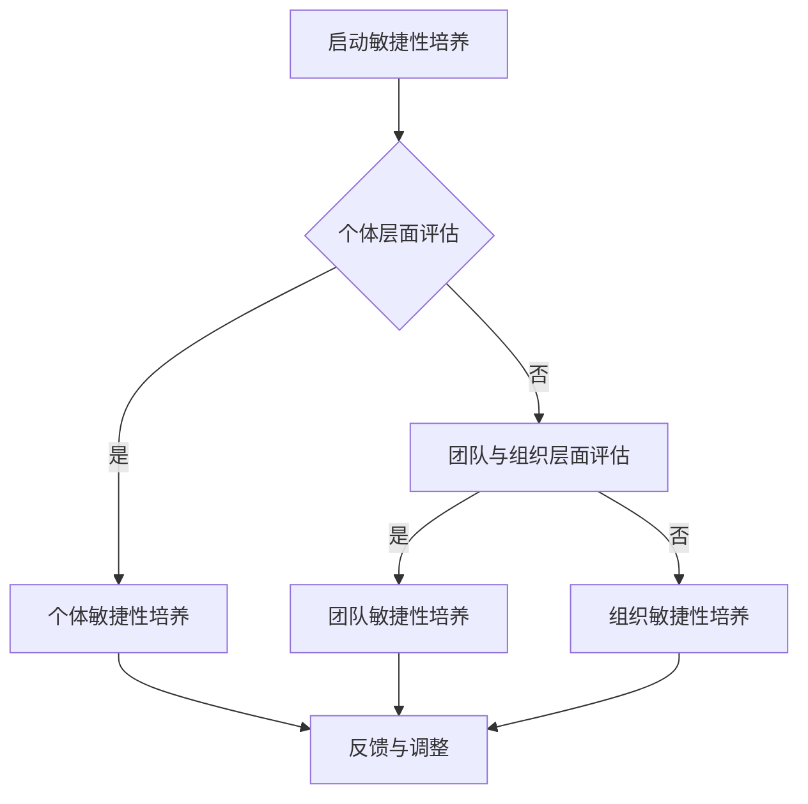

                 

# 《学习敏捷性：培养快速适应新知识的能力》

> 关键词：敏捷性、快速适应、新知识、学习策略、团队与组织培养

> 摘要：本文深入探讨了敏捷性在个人、团队和组织层面的重要性，以及如何培养快速适应新知识的能力。通过分析敏捷性的理论基础、培养方法、评估与反馈机制，并结合实际案例，为读者提供了全面而实用的指导。

### 第一部分：引入与背景

#### 第1章：敏捷性概述

##### 1.1 敏捷性定义与重要性

敏捷性（Agility）是一种能够迅速适应变化、抓住机遇、解决复杂问题的能力。在快速变化的信息时代，敏捷性已成为个人、团队和组织成功的核心要素之一。

**定义**：敏捷性是一种动态适应环境变化、迅速调整自身策略和行为的能力。

**重要性**：

1. **个人发展**：具备敏捷性的人能够更好地应对职业挑战，抓住机遇，提升个人竞争力。
2. **团队协作**：敏捷性有助于团队快速响应变化，提高工作效率，实现共同目标。
3. **组织创新**：敏捷组织能够迅速调整战略，适应市场变化，保持竞争优势。

##### 1.2 敏捷性在现代社会中的应用

1. **信息技术行业**：随着技术的快速迭代，敏捷性成为软件开发、产品设计和项目管理的关键能力。
2. **企业管理**：敏捷管理方法，如敏捷开发和精益管理，已被广泛应用于企业运营和项目管理。
3. **教育培训**：教育领域正逐渐采用基于项目的学习、混合学习和在线教育等敏捷教育模式。

##### 1.3 个人与组织的敏捷性需求

**个人需求**：

1. **持续学习**：适应新知识和技能，提升个人综合素质。
2. **快速决策**：在面对不确定性和挑战时，能够迅速做出有效决策。
3. **灵活适应**：适应不同工作环境和项目需求，具备跨领域能力。

**组织需求**：

1. **快速响应**：对市场变化和技术创新有敏锐的洞察力，迅速做出战略调整。
2. **知识共享**：建立知识共享平台，促进内部学习和创新。
3. **文化变革**：营造开放、协作、创新的组织文化，鼓励员工发挥创造力。

### 第二部分：敏捷性的理论基础

#### 第2章：敏捷性与认知科学

##### 2.1 敏捷性与认知科学

认知科学是研究人类思维和认知过程的科学。敏捷性与认知科学有着紧密的联系。

1. **敏捷性认知模型**：认知科学家提出了多种敏捷性认知模型，如适应性认知模型、快速适应模型等。
2. **敏捷性认知功能**：敏捷性涉及多种认知功能，包括注意力分配、信息处理、决策制定等。

##### 2.2 敏捷性与学习心理学

学习心理学研究人类学习的过程和机制。敏捷性学习心理学关注如何培养和提升个体的学习敏捷性。

1. **学习敏捷性定义**：学习敏捷性是指个体在学习过程中，迅速适应新知识和技能，调整学习策略的能力。
2. **学习敏捷性模型**：学习心理学提出了多种学习敏捷性模型，如自我调节模型、适应性学习模型等。

##### 2.3 敏捷性与行为经济学

行为经济学研究人类在决策过程中的行为偏差。敏捷性与行为经济学有着密切的联系。

1. **敏捷性决策行为**：行为经济学揭示了人类在敏捷性决策过程中的行为模式，如认知偏差、风险偏好等。
2. **敏捷性激励机制**：通过设计合适的激励机制，可以提升个体的学习敏捷性和决策能力。

### 第三部分：敏捷性培养方法

#### 第3章：个体敏捷性培养

##### 3.1 自我认知与自我调整

自我认知是指个体对自身能力和特点的了解。自我调整是指个体根据认知结果，调整自己的行为和策略。

1. **自我认知方法**：如自我反思、评估工具、360度反馈等。
2. **自我调整策略**：如设定目标、制定计划、持续学习等。

##### 3.2 信息筛选与处理

信息筛选与处理是指个体在接收大量信息时，如何快速识别关键信息，并有效地进行处理。

1. **信息筛选策略**：如关注重点、利用信息过滤工具等。
2. **信息处理技巧**：如快速阅读、归纳总结、批判性思维等。

##### 3.3 学习策略与技巧

学习策略与技巧是指个体在学习和实践中，如何选择合适的学习方法，提高学习效果。

1. **学习策略**：如分阶段学习、主动学习、问题导向学习等。
2. **学习技巧**：如记忆技巧、时间管理技巧、团队合作技巧等。

##### 3.4 反思与总结

反思与总结是指个体在学习过程中，如何对自身的学习过程进行反思，并从中总结经验教训。

1. **反思方法**：如日记反思、回顾会议等。
2. **总结技巧**：如总结报告、思维导图等。

#### 第4章：团队敏捷性培养

##### 4.1 团队文化与沟通

团队文化是指团队成员共同遵循的价值观和行为规范。良好的团队文化有助于提升团队的敏捷性。

1. **团队文化建设**：如建立共同愿景、培养团队精神等。
2. **沟通技巧**：如有效沟通、积极倾听、清晰表达等。

##### 4.2 持续集成与迭代

持续集成与迭代是指团队在项目开发过程中，如何不断集成新功能，并快速迭代优化。

1. **持续集成**：如代码审查、自动化测试等。
2. **迭代优化**：如用户反馈、需求调整等。

##### 4.3 团队学习与知识共享

团队学习与知识共享是指团队如何共同学习新知识，并将知识有效地共享给团队成员。

1. **团队学习策略**：如共同学习、讨论交流等。
2. **知识共享机制**：如知识库、培训计划等。

##### 4.4 反思与改进

反思与改进是指团队在项目完成后，如何对团队的表现进行反思，并提出改进措施。

1. **反思方法**：如回顾会议、反思日志等。
2. **改进措施**：如优化流程、培训提升等。

#### 第5章：组织敏捷性培养

##### 5.1 敏捷组织文化

敏捷组织文化是指组织在价值观、行为规范和工作方式上，具有敏捷性的特征。

1. **价值观建设**：如创新、协作、开放等。
2. **行为规范**：如透明度、尊重、信任等。

##### 5.2 敏捷组织架构

敏捷组织架构是指组织在组织结构、流程设计等方面，具有敏捷性的特征。

1. **扁平化组织**：如去中心化、跨职能团队等。
2. **流程优化**：如敏捷开发、精益管理等。

##### 5.3 敏捷战略与决策

敏捷战略与决策是指组织在制定战略和决策过程中，如何具有敏捷性。

1. **战略规划**：如敏捷战略规划、适应性战略等。
2. **决策机制**：如快速决策、民主决策等。

##### 5.4 敏捷组织发展

敏捷组织发展是指组织在发展过程中，如何保持敏捷性。

1. **人才培养**：如人才选拔、培训发展等。
2. **技术创新**：如技术创新战略、创新激励机制等。

### 第四部分：敏捷性评估与反馈

#### 第6章：敏捷性评估与反馈

##### 6.1 敏捷性评估方法

敏捷性评估是指对个人、团队和组织在敏捷性方面的表现进行评估。

1. **自评方法**：如自我评估问卷、自我反思等。
2. **他评方法**：如360度反馈、第三方评估等。

##### 6.2 反馈机制与改进

反馈机制与改进是指通过评估结果，制定改进措施，提升敏捷性。

1. **反馈机制**：如定期反馈、即时反馈等。
2. **改进措施**：如培训提升、流程优化等。

##### 6.3 敏捷性发展之路

敏捷性发展之路是指个人、团队和组织在提升敏捷性过程中，可能面临的挑战和机遇。

1. **挑战**：如文化变革、组织结构调整等。
2. **机遇**：如技术创新、市场机遇等。

### 第五部分：敏捷性实践案例分析

#### 第7章：敏捷性实践案例分析

##### 7.1 案例一：互联网企业敏捷转型

本案例介绍了某互联网企业如何通过敏捷转型，提升组织敏捷性，实现快速发展。

1. **背景**：企业面临市场竞争压力，需要提高敏捷性。
2. **转型策略**：如敏捷组织架构、敏捷文化建设等。
3. **成果**：如业务增长、员工满意度提升等。

##### 7.2 案例二：传统企业敏捷创新

本案例介绍了某传统企业如何通过敏捷创新，适应市场变化，实现转型升级。

1. **背景**：企业面临市场饱和、利润下滑等问题。
2. **创新策略**：如敏捷研发、精益管理等。
3. **成果**：如产品创新、市场份额提升等。

##### 7.3 案例三：教育领域的敏捷实践

本案例介绍了某教育机构如何通过敏捷实践，提升教育质量，满足学生需求。

1. **背景**：教育机构面临教学质量不高、学生满意度低等问题。
2. **实践策略**：如项目导向教学、混合学习等。
3. **成果**：如教育质量提升、学生满意度提高等。

### 第六部分：敏捷性的未来

#### 第8章：敏捷性发展的挑战与机遇

##### 8.1 挑战分析

敏捷性发展面临以下挑战：

1. **文化变革**：组织需要克服传统思维模式，建立敏捷文化。
2. **人才缺乏**：敏捷性人才短缺，需要加强人才培养。
3. **技术挑战**：新兴技术不断发展，需要及时跟进和应用。

##### 8.2 机遇探讨

敏捷性发展也带来了以下机遇：

1. **市场机遇**：敏捷性有助于企业抓住市场机遇，实现快速增长。
2. **技术创新**：敏捷性促进技术创新，提升企业竞争力。
3. **人才培养**：敏捷性培养有利于人才发展和成长。

##### 8.3 敏捷性发展之路

敏捷性发展之路需要：

1. **政策支持**：政府应出台政策，支持敏捷性发展。
2. **企业实践**：企业应积极实践敏捷性，提升组织能力。
3. **教育培训**：教育机构应加强敏捷性教育，培养专业人才。

#### 第9章：敏捷性的全球趋势与影响

##### 9.1 全球敏捷性发展现状

全球范围内，敏捷性已经成为企业和组织追求的重要能力。各国纷纷出台政策，推动敏捷性发展。

1. **美国**：企业广泛应用敏捷开发方法，政府出台政策支持敏捷性发展。
2. **欧洲**：敏捷性成为企业管理的重要工具，各国政府积极推动敏捷性培训。
3. **中国**：企业正逐渐认识到敏捷性的重要性，政府鼓励企业加强敏捷性建设。

##### 9.2 敏捷性在跨国企业中的应用

跨国企业广泛应用敏捷性，以提升全球竞争力。

1. **跨国合作**：跨国企业通过敏捷性合作，实现资源共享、优势互补。
2. **本地化适应**：跨国企业根据不同地区的市场需求，灵活调整敏捷性策略。
3. **全球运营**：跨国企业通过敏捷性运营，实现全球业务的快速响应。

##### 9.3 敏捷性对全球经济发展的影响

敏捷性对全球经济发展产生了深远影响：

1. **创新驱动**：敏捷性促进技术创新，推动经济发展。
2. **产业升级**：敏捷性助力企业实现产业升级，提高核心竞争力。
3. **人才流动**：敏捷性吸引全球人才，推动人才流动和交流。

#### 第10章：敏捷性的未来展望

##### 10.1 新兴技术与敏捷性

新兴技术，如人工智能、物联网、区块链等，将推动敏捷性发展。

1. **人工智能**：人工智能将提升敏捷性评估与反馈的准确性。
2. **物联网**：物联网将实现实时数据采集，助力敏捷性决策。
3. **区块链**：区块链将提高敏捷性数据的安全性和透明度。

##### 10.2 敏捷性的未来发展趋势

敏捷性的未来发展趋势包括：

1. **智能化**：人工智能等新兴技术将使敏捷性评估与反馈更加智能化。
2. **个性化**：敏捷性培养将更加注重个体差异，实现个性化培养。
3. **全球化**：敏捷性将在全球范围内得到广泛应用，成为企业竞争的核心能力。

##### 10.3 敏捷性的社会责任与伦理

敏捷性的发展也带来了社会责任和伦理问题：

1. **数据安全**：在敏捷性评估与反馈过程中，如何确保数据安全，保护个人隐私。
2. **公平性**：在敏捷性培养过程中，如何确保公平性，避免歧视现象。
3. **可持续发展**：在敏捷性发展过程中，如何实现可持续发展，保护环境。

### 附录

#### 附录A：敏捷性相关术语表

- 敏捷性（Agility）：快速适应变化、抓住机遇、解决复杂问题的能力。
- 敏捷学习（Agile Learning）：通过快速适应新知识、调整学习策略，提高学习效果的过程。
- 敏捷开发（Agile Development）：一种以用户需求为导向、快速迭代、持续交付的软件开发方法。
- 敏捷管理（Agile Management）：一种以团队协作、快速响应变化、持续优化流程为特点的管理方法。
- 敏捷组织（Agile Organization）：具备敏捷性特征、能够快速适应市场变化、持续创新的组织。

#### 附录B：推荐阅读文献与资源

- 《敏捷开发实践指南》（Agile Project Guide）：作者：罗伯特·C·马丁
- 《敏捷管理》（Agile Management for Product Development Teams）：作者：迈克尔·J·康威
- 《敏捷思维》（The Agile Mind）：作者：托马斯·H·科普兰

#### 附录C：案例研究汇总与深度解读

- 案例一：某互联网企业敏捷转型
- 案例二：某传统企业敏捷创新
- 案例三：某教育机构敏捷实践

#### 附录D：敏捷性流程图与算法伪代码

**敏捷性流程图**：



**算法伪代码**：

```plaintext
// 敏捷性评估算法
function assessAgility(person, team, organization) {
    individualScore = calculateIndividualScore(person);
    teamScore = calculateTeamScore(team);
    organizationScore = calculateOrganizationScore(organization);
    finalScore = (individualScore + teamScore + organizationScore) / 3;
    return finalScore;
}

// 个体敏捷性培养
function cultivateIndividualAgility(person) {
    person = selfAwarenessAndAdjustment(person);
    person = informationFilteringAndProcessing(person);
    person = studyStrategyAndSkills(person);
    person = reflectionAndSummary(person);
    return person;
}

// 团队敏捷性培养
function cultivateTeamAgility(team) {
    team = teamCultureAndCommunication(team);
    team = continuousIntegrationAndIteration(team);
    team = teamLearningAndKnowledgeSharing(team);
    team = reflectionAndImprovement(team);
    return team;
}

// 组织敏捷性培养
function cultivateOrganizationAgility(organization) {
    organization = agileOrganizationCulture(organization);
    organization = agileOrganizationStructure(organization);
    organization = agileStrategyAndDecisionMaking(organization);
    organization = agileOrganizationDevelopment(organization);
    return organization;
}
```

---

**作者**：AI天才研究院/AI Genius Institute & 禅与计算机程序设计艺术 /Zen And The Art of Computer Programming

---

以上，是《学习敏捷性：培养快速适应新知识的能力》的技术博客文章。希望本文能帮助您更好地理解敏捷性的概念、原理和应用，以及如何培养快速适应新知识的能力。如果您有任何问题或建议，欢迎在评论区留言，我们将尽快回复。谢谢您的阅读！<|endoftext|>

### 第1章：敏捷性概述

#### 1.1 敏捷性定义与重要性

敏捷性（Agility）是一种动态适应环境变化、迅速调整自身策略和行为的能力。在快速变化的信息时代，敏捷性已成为个人、团队和组织成功的核心要素之一。

**定义**：敏捷性是指个体、团队或组织在面临外部变化时，能够迅速调整自身行为和策略，以实现目标的能力。

**重要性**：

1. **个人发展**：具备敏捷性的人能够更好地应对职业挑战，抓住机遇，提升个人竞争力。
    - **快速学习**：敏捷性使人能够迅速学习新知识和技能，适应新环境。
    - **创新能力**：敏捷性有助于个体在创新过程中，快速发现问题和解决方案。
    - **决策能力**：敏捷性使人能够在不确定性中迅速做出有效决策。

2. **团队协作**：敏捷性有助于团队快速响应变化，提高工作效率，实现共同目标。
    - **协作效率**：敏捷性团队能够快速适应变化，提高协作效率。
    - **问题解决**：敏捷性团队能够迅速发现和解决问题，提高问题解决能力。
    - **创新协作**：敏捷性团队能够通过快速调整策略，实现创新协作。

3. **组织创新**：敏捷组织能够迅速调整战略，适应市场变化，保持竞争优势。
    - **快速响应**：敏捷组织能够对市场变化和技术创新有敏锐的洞察力，迅速做出战略调整。
    - **持续创新**：敏捷组织能够持续进行技术创新和管理创新，保持竞争优势。
    - **适应能力**：敏捷组织具备较强的适应能力，能够在动荡的市场环境中生存和发展。

#### 1.2 敏捷性在现代社会中的应用

在现代社会，敏捷性已被广泛应用于各个领域，成为推动社会发展的重要力量。

1. **信息技术行业**：随着技术的快速迭代，敏捷性成为软件开发、产品设计和项目管理的关键能力。
    - **软件开发**：敏捷开发方法，如Scrum和Kanban，已被广泛应用于软件开发过程中，提高了开发效率和质量。
    - **产品管理**：敏捷产品管理（Agile Product Management）强调用户需求的重要性，提高了产品迭代速度和市场适应性。
    - **项目管理**：敏捷项目管理方法，如看板（Kanban）和迭代（Iteration），有助于项目团队快速响应变化，提高项目成功率。

2. **企业管理**：敏捷管理方法，如敏捷开发和精益管理，已被广泛应用于企业运营和项目管理。
    - **敏捷开发**：企业通过敏捷开发方法，缩短产品上市时间，提高产品质量，满足用户需求。
    - **精益管理**：企业通过精益管理方法，消除浪费，提高效率，优化资源利用。

3. **教育培训**：教育领域正逐渐采用基于项目的学习、混合学习和在线教育等敏捷教育模式。
    - **基于项目的学习**：学生通过实际项目学习，提高实践能力和创新能力。
    - **混合学习**：线上线下结合，提高学习效果和灵活性。
    - **在线教育**：利用互联网技术，实现教育资源的共享和个性化学习。

#### 1.3 个人与组织的敏捷性需求

**个人需求**：

1. **持续学习**：适应新知识和技能，提升个人综合素质。
    - **知识更新**：技术日新月异，个人需要不断学习新知识，跟上时代发展。
    - **技能提升**：通过学习新技能，提高个人职业竞争力。

2. **快速决策**：在面对不确定性和挑战时，能够迅速做出有效决策。
    - **风险意识**：在面对不确定的情况时，能够快速分析风险，做出决策。
    - **决策技巧**：通过学习决策技巧，提高决策速度和准确性。

3. **灵活适应**：适应不同工作环境和项目需求，具备跨领域能力。
    - **环境适应**：能够快速适应不同的工作环境和文化。
    - **跨领域能力**：具备跨领域的知识和技能，提高应对复杂问题的能力。

**组织需求**：

1. **快速响应**：对市场变化和技术创新有敏锐的洞察力，迅速做出战略调整。
    - **市场洞察**：通过市场调研和数据分析，及时了解市场变化。
    - **战略调整**：根据市场变化，迅速调整战略方向和策略。

2. **知识共享**：建立知识共享平台，促进内部学习和创新。
    - **知识库**：建立内部知识库，方便员工快速获取所需信息。
    - **培训机制**：定期组织培训，提高员工的知识水平和技能。

3. **文化变革**：营造开放、协作、创新的组织文化，鼓励员工发挥创造力。
    - **创新氛围**：鼓励员工提出新想法和解决方案，营造创新氛围。
    - **协作文化**：建立协作机制，促进团队内部沟通和合作。

### 第2章：敏捷性的理论基础

#### 2.1 敏捷性与认知科学

敏捷性与认知科学有着密切的联系。认知科学是研究人类思维和认知过程的科学，而敏捷性则是指个体在认知过程中，如何快速适应变化、调整策略的能力。

1. **敏捷性认知模型**

   认知科学家提出了多种敏捷性认知模型，以解释个体如何适应变化。

   - **适应性认知模型**：该模型认为，个体在面对新情境时，会通过调整认知策略，快速适应变化。
   - **快速适应模型**：该模型强调，个体在短时间内，通过快速试错和调整，找到最佳策略。

2. **敏捷性认知功能**

   敏捷性涉及多种认知功能，包括注意力分配、信息处理、决策制定等。

   - **注意力分配**：个体在面对多个任务时，如何合理分配注意力，确保高效完成任务。
   - **信息处理**：个体如何快速识别关键信息，并对其进行有效处理。
   - **决策制定**：个体在面对不确定性和风险时，如何迅速做出有效决策。

#### 2.2 敏捷性与学习心理学

学习心理学研究人类学习的过程和机制。敏捷性学习心理学关注如何培养和提升个体的学习敏捷性。

1. **学习敏捷性定义**

   学习敏捷性是指个体在学习过程中，迅速适应新知识和技能，调整学习策略的能力。

2. **学习敏捷性模型**

   学习心理学提出了多种学习敏捷性模型，以解释个体如何提升学习敏捷性。

   - **自我调节模型**：该模型认为，个体通过自我监控、自我调节，提高学习效果。
   - **适应性学习模型**：该模型强调，个体在面对新情境时，通过快速调整学习策略，提高学习效果。

3. **学习敏捷性培养方法**

   为了提升学习敏捷性，个体可以采用以下方法：

   - **分阶段学习**：将学习过程分为不同阶段，逐步掌握新知识和技能。
   - **主动学习**：积极参与学习活动，主动探索和解决问题。
   - **问题导向学习**：以问题为导向，通过解决实际问题，提高学习效果。

#### 2.3 敏捷性与行为经济学

行为经济学研究人类在决策过程中的行为偏差。敏捷性与行为经济学有着密切的联系。

1. **敏捷性决策行为**

   行为经济学揭示了人类在敏捷性决策过程中的行为模式。

   - **认知偏差**：个体在决策过程中，可能会出现认知偏差，如过度自信、过度乐观等。
   - **风险偏好**：个体在面对风险时，可能会有不同的风险偏好，如风险规避、风险寻求等。

2. **敏捷性激励机制**

   通过设计合适的激励机制，可以提升个体的学习敏捷性和决策能力。

   - **奖励机制**：为个体设定明确的奖励标准，鼓励其迅速适应新知识和技能。
   - **反馈机制**：及时给予个体反馈，帮助其了解自己的行为效果，调整学习策略。

3. **敏捷性决策策略**

   为了在敏捷性决策中取得成功，个体可以采用以下策略：

   - **快速决策**：在信息有限的情况下，快速做出决策，避免过度分析。
   - **灵活调整**：在决策过程中，根据实际情况，灵活调整策略，以适应变化。
   - **风险评估**：在决策前，对潜在风险进行评估，并制定应对措施。

### 第3章：个体敏捷性培养

#### 3.1 自我认知与自我调整

自我认知与自我调整是培养个体敏捷性的关键步骤。通过自我认知，个体可以了解自己的优点和不足，从而进行自我调整，提升敏捷性。

1. **自我认知方法**

   - **自我反思**：定期对自己的行为、思维和情感进行反思，了解自己的长处和需要改进的地方。
   - **评估工具**：利用各种评估工具，如能力测试、性格测试等，了解自己的优势和劣势。
   - **360度反馈**：从多个角度获取他人的反馈，全面了解自己的表现。

2. **自我调整策略**

   - **设定目标**：明确自己的目标，制定具体的行动计划，逐步实现目标。
   - **制定计划**：制定合理的学习和成长计划，确保目标的实现。
   - **持续学习**：通过学习新知识和技能，不断提升自己的能力。

#### 3.2 信息筛选与处理

在信息爆炸的时代，学会筛选和处理信息是培养敏捷性的重要环节。

1. **信息筛选策略**

   - **关注重点**：在接收大量信息时，关注与自身目标和需求相关的重要信息。
   - **利用信息过滤工具**：利用信息过滤工具，如搜索引擎、推荐算法等，快速获取所需信息。

2. **信息处理技巧**

   - **快速阅读**：提高阅读速度，抓住信息的关键点。
   - **归纳总结**：对获取的信息进行归纳总结，形成自己的理解和知识体系。
   - **批判性思维**：对获取的信息进行批判性思考，判断其真实性和价值。

#### 3.3 学习策略与技巧

有效的学习策略和技巧是培养敏捷性的关键。

1. **学习策略**

   - **分阶段学习**：将学习过程分为不同阶段，逐步掌握新知识和技能。
   - **主动学习**：积极参与学习活动，主动探索和解决问题。
   - **问题导向学习**：以问题为导向，通过解决实际问题，提高学习效果。

2. **学习技巧**

   - **记忆技巧**：利用记忆技巧，如联想记忆、图像记忆等，提高记忆效果。
   - **时间管理技巧**：合理安排时间，确保学习效率。
   - **团队合作技巧**：与他人合作学习，互相借鉴和学习。

#### 3.4 反思与总结

反思与总结是培养敏捷性的重要环节。通过反思和总结，个体可以了解自己的学习过程和效果，找出不足，进行改进。

1. **反思方法**

   - **日记反思**：定期写日记，记录自己的学习过程和心得体会。
   - **回顾会议**：定期进行回顾会议，总结学习成果，讨论存在的问题。

2. **总结技巧**

   - **总结报告**：撰写总结报告，梳理学习成果和经验教训。
   - **思维导图**：利用思维导图，梳理学习内容和思路，形成系统的知识体系。

### 第4章：团队敏捷性培养

#### 4.1 团队文化与沟通

团队文化是团队敏捷性的基础。良好的团队文化有助于团队快速适应变化，提高工作效率。

1. **团队文化建设**

   - **建立共同愿景**：明确团队的共同目标，激发团队成员的积极性和创造力。
   - **培养团队精神**：通过团队合作和协作，增强团队凝聚力。

2. **沟通技巧**

   - **有效沟通**：提高沟通能力，确保信息准确传达。
   - **积极倾听**：倾听他人的意见和需求，增进理解和合作。
   - **清晰表达**：用简洁明了的语言表达自己的想法，避免误解。

#### 4.2 持续集成与迭代

持续集成与迭代是团队敏捷性培养的关键。

1. **持续集成**

   - **代码审查**：定期进行代码审查，确保代码质量和一致性。
   - **自动化测试**：利用自动化测试工具，快速检测代码中的问题。

2. **迭代优化**

   - **用户反馈**：收集用户反馈，了解产品功能和用户体验，不断优化产品。
   - **需求调整**：根据用户反馈和市场变化，调整需求，确保产品符合用户需求。

#### 4.3 团队学习与知识共享

团队学习与知识共享是团队敏捷性培养的重要环节。

1. **团队学习策略**

   - **共同学习**：团队成员共同参与学习活动，互相借鉴和学习。
   - **讨论交流**：通过讨论和交流，解决学习中的问题和困惑。

2. **知识共享机制**

   - **知识库**：建立知识库，方便团队成员快速获取所需信息。
   - **培训计划**：定期组织培训，提高团队成员的知识水平和技能。

#### 4.4 反思与改进

反思与改进是团队敏捷性培养的重要环节。通过反思和改进，团队可以不断提高自己的敏捷性。

1. **反思方法**

   - **回顾会议**：定期进行回顾会议，总结团队工作成果和不足，讨论改进措施。
   - **反思日志**：团队成员定期写反思日志，记录自己的工作心得和体会。

2. **改进措施**

   - **流程优化**：根据反思结果，优化工作流程，提高团队效率。
   - **培训提升**：针对存在的问题，组织培训，提高团队成员的能力。

### 第5章：组织敏捷性培养

#### 5.1 敏捷组织文化

敏捷组织文化是组织敏捷性的核心。一个具有敏捷文化组织，能够迅速适应变化，实现持续创新。

1. **价值观建设**

   - **创新**：鼓励员工提出新想法和解决方案，推动组织创新。
   - **协作**：建立协作机制，促进团队内部沟通和合作。
   - **开放**：鼓励员工分享知识和经验，营造开放的学习氛围。

2. **行为规范**

   - **透明度**：提高组织透明度，确保信息畅通。
   - **尊重**：尊重员工意见和贡献，营造平等、尊重的工作氛围。
   - **信任**：建立信任机制，提高员工的工作积极性和忠诚度。

#### 5.2 敏捷组织架构

敏捷组织架构是组织敏捷性的重要保障。通过调整组织架构，实现扁平化、去中心化，提高组织灵活性。

1. **扁平化组织**

   - **去中心化**：减少管理层级，提高决策效率。
   - **跨职能团队**：打破部门壁垒，实现跨职能协作。

2. **流程优化**

   - **精益管理**：消除浪费，提高效率。
   - **敏捷开发**：采用敏捷开发方法，缩短产品上市时间。

#### 5.3 敏捷战略与决策

敏捷战略与决策是组织敏捷性的关键。通过敏捷战略和决策，组织能够迅速适应市场变化，实现持续创新。

1. **敏捷战略规划**

   - **适应性战略**：根据市场变化，调整战略方向和策略。
   - **敏捷决策**：建立敏捷决策机制，提高决策速度和准确性。

2. **敏捷运营**

   - **快速响应**：对市场变化和技术创新有敏锐的洞察力，迅速做出反应。
   - **持续改进**：不断优化运营流程，提高效率和质量。

#### 5.4 敏捷组织发展

敏捷组织发展是组织长期发展的关键。通过培养敏捷性，组织能够实现持续发展。

1. **人才培养**

   - **人才选拔**：选拔具备敏捷性的人才，为组织发展提供人才保障。
   - **培训发展**：为员工提供培训和发展机会，提升员工的敏捷性。

2. **技术创新**

   - **研发投入**：加大研发投入，推动技术创新。
   - **知识产权**：保护知识产权，推动组织创新。

### 第6章：敏捷性评估与反馈

#### 6.1 敏捷性评估方法

敏捷性评估是对个体、团队和组织敏捷性水平的评估。通过评估，可以了解敏捷性的现状，找出存在的问题，制定改进措施。

1. **自评方法**

   - **自我评估问卷**：个体通过填写自我评估问卷，了解自己的敏捷性水平。
   - **自我反思**：个体通过反思自己的行为和表现，评估自己的敏捷性。

2. **他评方法**

   - **360度反馈**：从多个角度获取他人对个体、团队和组织的评估，全面了解敏捷性水平。
   - **第三方评估**：聘请第三方机构对个体、团队和组织进行评估，确保评估的客观性和公正性。

#### 6.2 反馈机制与改进

反馈机制是敏捷性培养的重要环节。通过反馈机制，可以及时发现问题和不足，制定改进措施。

1. **反馈机制**

   - **定期反馈**：定期进行反馈，确保反馈的及时性和有效性。
   - **即时反馈**：在问题发生时，立即进行反馈，帮助个体、团队和组织迅速调整。

2. **改进措施**

   - **流程优化**：根据反馈结果，优化工作流程，提高效率。
   - **培训提升**：根据反馈结果，制定培训计划，提升员工的敏捷性。

#### 6.3 敏捷性发展之路

敏捷性发展是一个持续的过程。通过不断评估、反馈和改进，个体、团队和组织可以不断提高敏捷性。

1. **挑战与机遇**

   - **挑战**：文化变革、组织结构调整等。
   - **机遇**：技术创新、市场变化等。

2. **发展策略**

   - **政策支持**：政府出台政策，支持敏捷性发展。
   - **企业实践**：企业积极实践敏捷性，提升组织能力。
   - **教育培训**：教育机构加强敏捷性教育，培养专业人才。

### 第7章：敏捷性实践案例分析

#### 7.1 案例一：互联网企业敏捷转型

某互联网企业通过敏捷转型，提高了团队和组织的敏捷性，实现了快速发展。

1. **背景**：企业面临市场竞争压力，需要提高敏捷性。
2. **转型策略**：采用敏捷开发、敏捷管理等方法，提升团队和组织的敏捷性。
3. **成果**：业务增长、员工满意度提升等。

#### 7.2 案例二：传统企业敏捷创新

某传统企业通过敏捷创新，适应市场变化，实现了转型升级。

1. **背景**：企业面临市场饱和、利润下滑等问题。
2. **创新策略**：采用敏捷研发、精益管理等方法，实现敏捷创新。
3. **成果**：产品创新、市场份额提升等。

#### 7.3 案例三：教育领域的敏捷实践

某教育机构通过敏捷实践，提升了教育质量，满足了学生需求。

1. **背景**：教育机构面临教学质量不高、学生满意度低等问题。
2. **实践策略**：采用项目导向教学、混合学习等方法，提升教育质量。
3. **成果**：教育质量提升、学生满意度提高等。

### 第8章：敏捷性发展的挑战与机遇

#### 8.1 挑战分析

敏捷性发展面临以下挑战：

1. **文化变革**：组织需要克服传统思维模式，建立敏捷文化。
2. **人才缺乏**：敏捷性人才短缺，需要加强人才培养。
3. **技术挑战**：新兴技术不断发展，需要及时跟进和应用。

#### 8.2 机遇探讨

敏捷性发展也带来了以下机遇：

1. **市场机遇**：敏捷性有助于企业抓住市场机遇，实现快速增长。
2. **技术创新**：敏捷性促进技术创新，提升企业竞争力。
3. **人才培养**：敏捷性培养有利于人才发展和成长。

#### 8.3 敏捷性发展之路

敏捷性发展之路需要：

1. **政策支持**：政府应出台政策，支持敏捷性发展。
2. **企业实践**：企业应积极实践敏捷性，提升组织能力。
3. **教育培训**：教育机构应加强敏捷性教育，培养专业人才。

### 第9章：敏捷性的全球趋势与影响

#### 9.1 全球敏捷性发展现状

全球范围内，敏捷性已经成为企业和组织追求的重要能力。各国纷纷出台政策，推动敏捷性发展。

1. **美国**：企业广泛应用敏捷开发方法，政府出台政策支持敏捷性发展。
2. **欧洲**：敏捷性成为企业管理的重要工具，各国政府积极推动敏捷性培训。
3. **中国**：企业正逐渐认识到敏捷性的重要性，政府鼓励企业加强敏捷性建设。

#### 9.2 敏捷性在跨国企业中的应用

跨国企业广泛应用敏捷性，以提升全球竞争力。

1. **跨国合作**：跨国企业通过敏捷性合作，实现资源共享、优势互补。
2. **本地化适应**：跨国企业根据不同地区的市场需求，灵活调整敏捷性策略。
3. **全球运营**：跨国企业通过敏捷性运营，实现全球业务的快速响应。

#### 9.3 敏捷性对全球经济发展的影响

敏捷性对全球经济发展产生了深远影响：

1. **创新驱动**：敏捷性促进技术创新，推动经济发展。
2. **产业升级**：敏捷性助力企业实现产业升级，提高核心竞争力。
3. **人才流动**：敏捷性吸引全球人才，推动人才流动和交流。

### 第10章：敏捷性的未来展望

#### 10.1 新兴技术与敏捷性

新兴技术，如人工智能、物联网、区块链等，将推动敏捷性发展。

1. **人工智能**：人工智能将提升敏捷性评估与反馈的准确性。
2. **物联网**：物联网将实现实时数据采集，助力敏捷性决策。
3. **区块链**：区块链将提高敏捷性数据的安全性和透明度。

#### 10.2 敏捷性的未来发展趋势

敏捷性的未来发展趋势包括：

1. **智能化**：人工智能等新兴技术将使敏捷性评估与反馈更加智能化。
2. **个性化**：敏捷性培养将更加注重个体差异，实现个性化培养。
3. **全球化**：敏捷性将在全球范围内得到广泛应用，成为企业竞争的核心能力。

#### 10.3 敏捷性的社会责任与伦理

敏捷性的发展也带来了社会责任和伦理问题：

1. **数据安全**：在敏捷性评估与反馈过程中，如何确保数据安全，保护个人隐私。
2. **公平性**：在敏捷性培养过程中，如何确保公平性，避免歧视现象。
3. **可持续发展**：在敏捷性发展过程中，如何实现可持续发展，保护环境。

### 附录

#### 附录A：敏捷性相关术语表

- 敏捷性（Agility）：快速适应变化、抓住机遇、解决复杂问题的能力。
- 敏捷学习（Agile Learning）：通过快速适应新知识、调整学习策略，提高学习效果的过程。
- 敏捷开发（Agile Development）：一种以用户需求为导向、快速迭代、持续交付的软件开发方法。
- 敏捷管理（Agile Management）：一种以团队协作、快速响应变化、持续优化流程为特点的管理方法。
- 敏捷组织（Agile Organization）：具备敏捷性特征、能够快速适应市场变化、持续创新的组织。

#### 附录B：推荐阅读文献与资源

- 《敏捷开发实践指南》（Agile Project Guide）：作者：罗伯特·C·马丁
- 《敏捷管理》（Agile Management for Product Development Teams）：作者：迈克尔·J·康威
- 《敏捷思维》（The Agile Mind）：作者：托马斯·H·科普兰

#### 附录C：案例研究汇总与深度解读

- 案例一：某互联网企业敏捷转型
- 案例二：某传统企业敏捷创新
- 案例三：某教育机构敏捷实践

#### 附录D：敏捷性流程图与算法伪代码

**敏捷性流程图**：


**算法伪代码**：

```plaintext
// 敏捷性评估算法
function assessAgility(person, team, organization) {
    individualScore = calculateIndividualScore(person);
    teamScore = calculateTeamScore(team);
    organizationScore = calculateOrganizationScore(organization);
    finalScore = (individualScore + teamScore + organizationScore) / 3;
    return finalScore;
}

// 个体敏捷性培养
function cultivateIndividualAgility(person) {
    person = selfAwarenessAndAdjustment(person);
    person = informationFilteringAndProcessing(person);
    person = studyStrategyAndSkills(person);
    person = reflectionAndSummary(person);
    return person;
}

// 团队敏捷性培养
function cultivateTeamAgility(team) {
    team = teamCultureAndCommunication(team);
    team = continuousIntegrationAndIteration(team);
    team = teamLearningAndKnowledgeSharing(team);
    team = reflectionAndImprovement(team);
    return team;
}

// 组织敏捷性培养
function cultivateOrganizationAgility(organization) {
    organization = agileOrganizationCulture(organization);
    organization = agileOrganizationStructure(organization);
    organization = agileStrategyAndDecisionMaking(organization);
    organization = agileOrganizationDevelopment(organization);
    return organization;
}
```

---

**作者**：AI天才研究院/AI Genius Institute & 禅与计算机程序设计艺术 /Zen And The Art of Computer Programming

---

以上就是《学习敏捷性：培养快速适应新知识的能力》的技术博客文章。希望本文能帮助您更好地理解敏捷性的概念、原理和应用，以及如何培养快速适应新知识的能力。如果您有任何问题或建议，欢迎在评论区留言，我们将尽快回复。谢谢您的阅读！<|endoftext|>### 第1章：敏捷性概述

**1.1 敏捷性的定义与重要性**

敏捷性（Agility）是一种动态适应环境变化、迅速调整自身策略和行为的能力。在现代社会，敏捷性已成为个人、团队和组织成功的关键要素。具体来说，敏捷性涉及以下几个方面：

1. **快速适应能力**：敏捷性使个体或组织能够在面对外部变化时，迅速调整自身行为和策略，以应对新挑战。
2. **持续学习能力**：敏捷性要求个体或组织具备持续学习的能力，不断吸收新知识、新技能，以适应快速变化的环境。
3. **创新思维**：敏捷性鼓励个体或组织采取创新思维，寻求新的解决方案，以应对复杂问题。

**定义**：

敏捷性可以定义为：在不确定性、复杂性和变化的环境中，个体、团队或组织能够快速适应、学习和创新，以实现目标的能力。

**重要性**：

1. **个人发展**：

   - **快速适应**：在职业生涯中，个体需要不断适应新的工作环境、技术和任务。
   - **持续学习**：随着技术的快速发展，个体需要不断学习新知识、新技能，以保持竞争力。
   - **创新能力**：敏捷性有助于个体在遇到问题时，能够迅速提出创新解决方案。

2. **团队协作**：

   - **协作效率**：敏捷性团队能够快速响应变化，提高工作效率，实现共同目标。
   - **问题解决**：敏捷性团队能够快速发现和解决问题，提升团队整体问题解决能力。
   - **创新协作**：敏捷性团队通过快速调整策略，实现创新协作，提高团队创新能力。

3. **组织创新**：

   - **快速响应**：敏捷组织能够敏锐地捕捉市场变化，快速调整战略，保持竞争优势。
   - **持续创新**：敏捷组织通过持续创新，不断优化产品和服务，满足客户需求。
   - **适应能力**：敏捷组织具备较强的适应能力，能够在动荡的市场环境中生存和发展。

在实际应用中，敏捷性的重要性体现在以下几个方面：

- **技术发展**：随着信息技术的发展，新的技术、工具和方法不断涌现，组织需要具备敏捷性，才能快速适应这些变化。
- **市场变化**：市场需求快速变化，组织需要具备敏捷性，才能迅速响应，抓住市场机遇。
- **员工素质**：现代员工需要具备较高的学习能力、适应能力和创新能力，这些能力都离不开敏捷性。

总之，敏捷性是一种关键能力，它不仅有助于个人和团队的成功，也是组织持续发展的基石。

**1.2 敏捷性在现代社会中的应用**

在现代社会，敏捷性已成为各个领域的重要能力，其应用范围广泛，包括但不限于以下几个领域：

**信息技术行业**：

信息技术行业是敏捷性应用最为广泛的领域之一。在这个领域，敏捷性主要体现在软件开发、项目管理和产品设计中。

- **软件开发**：敏捷开发方法，如Scrum和Kanban，已成为软件开发的主流。这些方法强调快速迭代、持续交付和用户反馈，帮助开发团队迅速适应需求变化，提高软件质量。
- **项目管理**：敏捷项目管理方法，如看板（Kanban）和迭代（Iteration），被广泛应用于项目管理和协调工作中。这些方法通过可视化和透明化的管理，提高项目效率，降低风险。
- **产品设计**：敏捷产品设计强调用户需求的重要性，通过快速原型制作和用户测试，不断优化产品功能，提高用户满意度。

**企业管理**：

在企业管理中，敏捷性被广泛应用于战略制定、运营管理和人力资源管理等方面。

- **战略制定**：敏捷战略制定强调适应性，企业通过定期评估市场环境和竞争态势，快速调整战略方向，以保持竞争优势。
- **运营管理**：敏捷运营管理通过持续改进和优化流程，消除浪费，提高运营效率。
- **人力资源管理**：敏捷人力资源管理强调员工能力和成长，通过灵活的人才管理和培训计划，提高员工的工作满意度和创新能力。

**教育培训**：

在教育培训领域，敏捷性正逐渐成为教育改革的重要方向。

- **基于项目的学习**：项目导向的学习模式强调实践和应用，学生通过实际项目锻炼能力，提高解决问题的能力。
- **混合学习**：线上线下结合的混合学习模式，为学生提供了更加灵活和多样化的学习方式。
- **在线教育**：在线教育平台通过敏捷开发方法，不断优化学习体验，提高教学效果。

**其他领域**：

除了上述领域，敏捷性还在许多其他领域得到广泛应用，如医疗、金融、制造等。

- **医疗领域**：敏捷医疗通过快速响应患者需求，提供个性化的医疗服务，提高医疗质量和患者满意度。
- **金融领域**：敏捷金融通过敏捷开发方法，快速开发金融产品，满足客户需求，提高市场竞争力。
- **制造领域**：敏捷制造通过敏捷生产管理，优化生产流程，提高生产效率，降低成本。

总之，敏捷性在现代社会中的应用越来越广泛，它不仅提高了个人、团队和组织的适应能力和创新能力，也为各个领域的发展带来了新的机遇。

**1.3 个人与组织的敏捷性需求**

在快速变化的社会环境中，个人和组织都需要具备敏捷性。以下是个人和组织在敏捷性方面的具体需求：

**个人需求**：

1. **持续学习**：

   - **知识更新**：随着技术的快速发展，个人需要不断学习新知识、新技能，以跟上时代的发展。
   - **技能提升**：通过学习新技能，个人可以提高职业竞争力，适应新的工作要求。

2. **快速决策**：

   - **应对变化**：在面对不确定性和变化时，个人需要能够迅速做出决策，抓住机遇。
   - **减少风险**：通过快速决策，个人可以减少因犹豫不决而可能带来的风险。

3. **灵活适应**：

   - **工作环境变化**：个人需要能够适应不同工作环境和文化，具备跨领域能力。
   - **多样化任务**：个人需要能够灵活应对多样化的工作任务，提高工作效率。

**组织需求**：

1. **快速响应**：

   - **市场变化**：组织需要能够快速响应市场变化，及时调整战略和业务方向。
   - **客户需求**：组织需要能够快速满足客户需求，提供高质量的产品和服务。

2. **知识共享**：

   - **内部学习**：组织需要建立知识共享平台，促进内部学习和创新。
   - **外部合作**：组织需要与外部合作伙伴共享知识，实现优势互补。

3. **文化变革**：

   - **创新氛围**：组织需要营造开放、协作、创新的文化氛围，鼓励员工发挥创造力。
   - **适应能力**：组织需要具备适应快速变化环境的能力，保持长期竞争力。

在实际应用中，个人和组织可以通过以下方式培养敏捷性：

- **自我认知**：通过自我反思和评估，了解自己的优势和不足，制定改进计划。
- **持续学习**：积极参与各种学习活动，不断更新知识和技能。
- **实践应用**：将所学知识应用于实际工作，提高实践能力和创新能力。
- **团队合作**：通过团队合作，共同解决问题，提高协作效率。

总之，敏捷性是个人和组织在快速变化的社会环境中必备的能力，它有助于提高适应能力、创新能力和竞争力，从而实现长期发展。

### 第2章：敏捷性的理论基础

**2.1 敏捷性与认知科学**

敏捷性与认知科学有着密切的联系。认知科学是研究人类思维和认知过程的科学，而敏捷性则是指个体在认知过程中，如何快速适应变化、调整策略的能力。以下是敏捷性在认知科学中的几个关键概念和理论。

**1. 敏捷性认知模型**

认知科学家们提出了多种敏捷性认知模型，以解释个体如何适应变化。以下是几种常见的模型：

- **适应性认知模型**：该模型认为，个体在面对新情境时，会通过调整认知策略，快速适应变化。例如，个体可能会调整注意力分配、改变信息处理方式，以更好地应对新环境。
- **快速适应模型**：该模型强调，个体在短时间内，通过快速试错和调整，找到最佳策略。这种模型特别适用于动态和不确定的环境。

**2. 敏捷性认知功能**

敏捷性涉及多种认知功能，包括注意力分配、信息处理、决策制定等。

- **注意力分配**：个体在面对多个任务时，如何合理分配注意力，确保高效完成任务。敏捷性较高的个体能够更好地分配注意力，避免因分散注意力而降低效率。
- **信息处理**：个体如何快速识别关键信息，并对其进行有效处理。敏捷性较高的个体能够快速筛选信息，抓住重点，从而提高决策效率。
- **决策制定**：个体在面对不确定性和风险时，如何迅速做出有效决策。敏捷性较高的个体能够快速分析问题，评估风险，并做出明智的决策。

**2.2 敏捷性与学习心理学**

学习心理学研究人类学习的过程和机制。敏捷性学习心理学关注如何培养和提升个体的学习敏捷性。以下是几个关键概念和理论。

**1. 学习敏捷性定义**

学习敏捷性是指个体在学习过程中，迅速适应新知识和技能，调整学习策略的能力。具体来说，学习敏捷性包括以下几个方面的能力：

- **快速学习**：个体能够快速吸收新知识和技能，迅速适应新的学习情境。
- **灵活调整**：个体能够根据学习效果和反馈，灵活调整学习策略，提高学习效果。
- **持续学习**：个体能够保持持续学习的能力，不断更新知识和技能，以适应不断变化的环境。

**2. 学习敏捷性模型**

学习心理学提出了多种学习敏捷性模型，以解释个体如何提升学习敏捷性。以下是几种常见的模型：

- **自我调节模型**：该模型认为，个体通过自我监控、自我调节，提高学习效果。例如，个体可能会设定学习目标、监控学习进度，并根据反馈调整学习策略。
- **适应性学习模型**：该模型强调，个体在面对新情境时，通过快速调整学习策略，提高学习效果。例如，个体可能会根据学习难度和反馈，调整学习速度和方法。

**3. 学习敏捷性培养方法**

为了提升学习敏捷性，个体可以采用以下方法：

- **分阶段学习**：将学习过程分为不同阶段，逐步掌握新知识和技能。这种方法有助于个体在每一个阶段都进行有效的反思和调整，从而提高学习效果。
- **主动学习**：积极参与学习活动，主动探索和解决问题。这种方法有助于个体培养自主学习和创新能力，提高学习敏捷性。
- **问题导向学习**：以问题为导向，通过解决实际问题，提高学习效果。这种方法有助于个体将学习与实际应用相结合，提高学习的实用性和针对性。

**2.3 敏捷性与行为经济学**

行为经济学研究人类在决策过程中的行为偏差。敏捷性与行为经济学有着密切的联系。以下是敏捷性在行为经济学中的几个关键概念和理论。

**1. 敏捷性决策行为**

行为经济学揭示了人类在敏捷性决策过程中的行为模式。以下是几种常见的决策行为：

- **认知偏差**：个体在决策过程中，可能会出现认知偏差，如过度自信、过度乐观等。这些偏差可能导致个体做出非理性的决策。
- **风险偏好**：个体在面对风险时，可能会有不同的风险偏好，如风险规避、风险寻求等。这些偏好会影响个体在决策过程中的选择。

**2. 敏捷性激励机制**

通过设计合适的激励机制，可以提升个体的学习敏捷性和决策能力。以下是几种常见的激励机制：

- **奖励机制**：为个体设定明确的奖励标准，鼓励其迅速适应新知识和技能。这种方法可以通过物质奖励和精神奖励，提高个体的积极性和参与度。
- **反馈机制**：及时给予个体反馈，帮助其了解自己的行为效果，调整学习策略。这种方法有助于个体不断调整和优化自己的学习过程，提高学习效果。

**3. 敏捷性决策策略**

为了在敏捷性决策中取得成功，个体可以采用以下策略：

- **快速决策**：在信息有限的情况下，快速做出决策，避免过度分析。这种方法有助于个体在不确定性中迅速做出有效决策。
- **灵活调整**：在决策过程中，根据实际情况，灵活调整策略，以适应变化。这种方法有助于个体在面对新情境时，快速适应和调整。
- **风险评估**：在决策前，对潜在风险进行评估，并制定应对措施。这种方法有助于个体在决策过程中，充分考虑风险因素，做出更加明智的决策。

综上所述，敏捷性在认知科学、学习心理学和行为经济学中都有着重要的地位。通过理解敏捷性的理论基础，个体和组织可以更好地培养和提升敏捷性，从而在快速变化的环境中取得成功。

### 第3章：个体敏捷性培养

**3.1 自我认知与自我调整**

自我认知与自我调整是培养个体敏捷性的关键步骤。通过自我认知，个体可以了解自己的优点和不足，从而进行自我调整，提升敏捷性。

**1. 自我认知方法**

自我认知是通过自我反思和评估，了解自己的能力、特点和需求的过程。以下是一些常用的自我认知方法：

- **自我反思**：定期对自己的行为、思维和情感进行反思，思考自己在哪些方面做得好，哪些方面需要改进。这种方法有助于个体深入挖掘自己的内心世界，发现潜在的问题和改进空间。
- **评估工具**：利用各种评估工具，如能力测试、性格测试、兴趣测试等，了解自己的优势和劣势。这些工具可以提供客观的数据，帮助个体更全面地了解自己。
- **360度反馈**：从多个角度获取他人的反馈，如同事、上级、下属等。这种方法可以帮助个体了解自己在他人眼中的形象和表现，从而发现自我认知中可能存在的盲点。

**2. 自我调整策略**

自我调整是基于自我认知的结果，采取相应的行动来改进自己的过程。以下是一些常见的自我调整策略：

- **设定目标**：明确自己的目标，制定具体的行动计划，逐步实现目标。目标可以是职业发展、技能提升、健康生活等方面。设定目标有助于个体保持动力和方向。
- **制定计划**：制定合理的学习和成长计划，确保目标的实现。计划应包括学习内容、时间安排、资源分配等方面。合理的计划有助于个体高效地利用时间和资源。
- **持续学习**：通过学习新知识和技能，不断提升自己的能力。持续学习不仅包括正式的教育培训，还可以通过阅读、实践、交流等方式进行。不断学习有助于个体适应变化，保持竞争力。

**3.2 信息筛选与处理**

在信息爆炸的时代，学会筛选和处理信息是培养敏捷性的重要环节。

**1. 信息筛选策略**

信息筛选是在大量信息中，识别和获取对自己有用的信息的过程。以下是一些有效的信息筛选策略：

- **关注重点**：在接收大量信息时，关注与自身目标和需求相关的重要信息。这可以通过设定关键词、关注特定领域或利用信息过滤工具来实现。
- **利用信息过滤工具**：利用搜索引擎、推荐算法、社交媒体等工具，快速获取所需信息。这些工具可以根据用户的兴趣和行为，提供个性化的信息推荐。
- **定期整理**：定期对获取的信息进行整理和分类，以便后续查阅和使用。这有助于个体保持信息的新鲜度和有效性。

**2. 信息处理技巧**

信息处理是对获取的信息进行分析、理解和应用的过程。以下是一些常用的信息处理技巧：

- **快速阅读**：提高阅读速度，抓住信息的关键点。这可以通过练习阅读技巧、减少分心因素和利用阅读工具来实现。
- **归纳总结**：对获取的信息进行归纳总结，形成自己的理解和知识体系。归纳总结有助于个体加深对信息的理解和记忆。
- **批判性思维**：对获取的信息进行批判性思考，判断其真实性和价值。批判性思维有助于个体避免盲目接受信息，提高信息处理的准确性。

**3.3 学习策略与技巧**

有效的学习策略和技巧是培养敏捷性的关键。

**1. 学习策略**

学习策略是指导个体如何高效地学习的方法。以下是一些常用的学习策略：

- **分阶段学习**：将学习过程分为不同阶段，逐步掌握新知识和技能。分阶段学习有助于个体系统地掌握知识，避免因信息过载而导致的焦虑和困惑。
- **主动学习**：积极参与学习活动，主动探索和解决问题。主动学习有助于个体培养自主学习的能力，提高学习效果。
- **问题导向学习**：以问题为导向，通过解决实际问题，提高学习效果。问题导向学习有助于个体将学习与实际应用相结合，提高学习的实用性和针对性。

**2. 学习技巧**

学习技巧是具体的学习方法和技巧，有助于个体提高学习效率。以下是一些常用的学习技巧：

- **记忆技巧**：利用记忆技巧，如联想记忆、图像记忆等，提高记忆效果。记忆技巧有助于个体更好地记忆和理解复杂的信息。
- **时间管理技巧**：合理安排时间，确保学习效率。时间管理技巧有助于个体高效地利用时间，避免因时间管理不当而导致的焦虑和拖延。
- **团队合作技巧**：与他人合作学习，互相借鉴和学习。团队合作技巧有助于个体在团队环境中提高学习效果，培养团队合作能力。

**3.4 反思与总结**

反思与总结是培养敏捷性的重要环节。通过反思和总结，个体可以了解自己的学习过程和效果，找出不足，进行改进。

**1. 反思方法**

反思是通过回顾自己的学习过程和成果，分析存在的问题和原因，从而进行改进的过程。以下是一些常用的反思方法：

- **日记反思**：定期写日记，记录自己的学习过程和心得体会。日记反思有助于个体保持对学习过程的持续关注，发现潜在的问题和改进空间。
- **回顾会议**：定期进行回顾会议，总结学习成果，讨论存在的问题。回顾会议有助于个体与他人分享学习经验，获得反馈和建议。

**2. 总结技巧**

总结是通过梳理学习内容和经验，形成系统的知识体系，从而加深理解和记忆的过程。以下是一些常用的总结技巧：

- **总结报告**：撰写总结报告，梳理学习成果和经验教训。总结报告有助于个体系统地回顾学习过程，巩固所学知识。
- **思维导图**：利用思维导图，梳理学习内容和思路，形成系统的知识体系。思维导图有助于个体直观地理解和记忆复杂的信息。

通过自我认知与自我调整、信息筛选与处理、学习策略与技巧以及反思与总结，个体可以不断提升自己的敏捷性，更好地适应快速变化的环境，实现个人和职业的发展。

### 第4章：团队敏捷性培养

**4.1 团队文化与沟通**

团队文化是团队敏捷性的基础。良好的团队文化有助于团队快速适应变化，提高工作效率。

**1. 团队文化建设**

团队文化建设是培养团队敏捷性的第一步。以下是一些关键步骤：

- **建立共同愿景**：明确团队的共同目标，激发团队成员的积极性和创造力。共同愿景是团队前进的动力源泉。
- **培养团队精神**：通过团队合作和协作，增强团队凝聚力。团队精神包括信任、尊重、支持等价值观。
- **价值观传递**：通过日常沟通、培训和团队活动，传递团队的价值观和目标。价值观传递有助于团队成员形成共同的理念和行为规范。

**2. 沟通技巧**

沟通是团队协作的核心。以下是一些关键的沟通技巧：

- **有效沟通**：提高沟通能力，确保信息准确传达。有效沟通包括清晰表达、积极倾听和准确理解。
- **积极倾听**：倾听他人的意见和需求，增进理解和合作。积极倾听有助于建立信任和合作氛围。
- **清晰表达**：用简洁明了的语言表达自己的想法，避免误解。清晰表达有助于减少沟通中的误解和冲突。

**3. 团队沟通工具**

为了提高团队沟通的效率，可以采用一些沟通工具：

- **团队协作平台**：如Slack、Trello、Asana等，用于实时沟通、任务分配和进度跟踪。
- **会议软件**：如Zoom、Microsoft Teams等，用于远程会议和协作。
- **共享文档**：如Google Docs、Notion等，用于团队文档的协作和共享。

**4.2 持续集成与迭代**

持续集成与迭代是团队敏捷性培养的关键。以下是一些关键步骤：

**1. 持续集成**

持续集成（CI）是一种软件开发实践，通过自动化构建和测试，确保代码质量和一致性。以下是一些关键步骤：

- **自动化构建**：通过自动化工具，如Jenkins、Travis CI等，实现代码的自动化构建。
- **自动化测试**：通过自动化测试工具，如Selenium、JUnit等，确保代码的正确性和稳定性。
- **持续反馈**：通过持续反馈机制，如代码审查、自动化测试报告等，及时发现和解决问题。

**2. 迭代优化**

迭代优化是一种软件开发方法，通过快速迭代和反馈，不断优化产品。以下是一些关键步骤：

- **用户反馈**：收集用户反馈，了解产品功能和用户体验，不断优化产品。
- **需求调整**：根据用户反馈和市场变化，调整需求，确保产品符合用户需求。
- **快速迭代**：通过快速迭代，缩短产品上市时间，提高产品质量。

**3. 持续集成工具**

为了实现持续集成与迭代，可以采用一些工具：

- **版本控制**：如Git、SVN等，用于代码管理和协作。
- **持续集成服务器**：如Jenkins、Travis CI、Circle CI等，用于自动化构建和测试。
- **持续部署**：如Docker、Kubernetes等，用于自动化部署和扩展。

**4.3 团队学习与知识共享**

团队学习与知识共享是团队敏捷性培养的重要环节。以下是一些关键步骤：

**1. 团队学习策略**

团队学习策略是培养团队敏捷性的关键。以下是一些常见的策略：

- **共同学习**：团队成员共同参与学习活动，互相借鉴和学习。共同学习有助于提高团队整体素质和凝聚力。
- **讨论交流**：通过讨论和交流，解决学习中的问题和困惑。讨论交流有助于团队成员深入理解和掌握知识。

**2. 知识共享机制**

知识共享机制是确保知识在团队内部有效传播和利用的关键。以下是一些常见的知识共享机制：

- **知识库**：建立知识库，方便团队成员快速获取所需信息。知识库可以是文档库、数据库或在线平台。
- **内部培训**：定期组织内部培训，提高团队成员的知识水平和技能。内部培训可以是线上或线下的形式。
- **经验分享**：通过经验分享会、团队研讨会等形式，分享团队成员的工作经验和学习心得。

**3. 知识管理工具**

为了实现团队学习和知识共享，可以采用一些知识管理工具：

- **知识库平台**：如Confluence、Notion等，用于文档管理和共享。
- **学习平台**：如Coursera、edX等，用于在线学习和培训。
- **协作平台**：如Slack、Microsoft Teams等，用于实时沟通和协作。

**4.4 反思与改进**

反思与改进是团队敏捷性培养的重要环节。以下是一些关键步骤：

**1. 反思方法**

反思是通过回顾团队的工作过程和成果，分析存在的问题和改进空间的过程。以下是一些常见的反思方法：

- **回顾会议**：定期进行回顾会议，总结团队工作成果和不足，讨论改进措施。回顾会议有助于团队成员共同反思和改进。
- **反思日志**：团队成员定期写反思日志，记录自己的工作心得和体会。反思日志有助于个体和团队深入反思，发现问题和改进点。

**2. 改进措施**

改进措施是基于反思结果，采取的具体行动来改进团队工作和流程。以下是一些常见的改进措施：

- **流程优化**：根据反思结果，优化工作流程，提高团队效率。流程优化可以通过自动化工具、简化流程和标准化操作来实现。
- **培训提升**：根据反思结果，制定培训计划，提升团队成员的能力。培训提升可以通过内部培训、外部培训和在线学习来实现。
- **持续改进**：建立持续改进机制，确保团队工作不断优化。持续改进可以通过定期反思、持续学习和反馈机制来实现。

通过团队文化建设、持续集成与迭代、团队学习与知识共享以及反思与改进，团队可以不断提升敏捷性，更好地适应快速变化的环境，实现共同目标。

### 第5章：组织敏捷性培养

**5.1 敏捷组织文化**

敏捷组织文化是组织敏捷性的基石。一个具有敏捷文化的组织，能够在快速变化的环境中迅速适应，持续创新。

**1. 建立共同愿景**

共同愿景是组织文化的核心。为了建立共同愿景，组织需要：

- **明确目标**：确保所有员工都清楚组织的长期和短期目标。
- **参与决策**：鼓励员工参与组织的决策过程，增强他们的责任感和归属感。
- **持续沟通**：定期与员工沟通，确保他们了解组织的愿景和目标，以及自己在实现这些目标中的作用。

**2. 培养团队精神**

团队精神是组织文化的重要组成部分。为了培养团队精神，组织需要：

- **建立信任**：通过开放、透明的沟通和协作，建立团队成员之间的信任。
- **鼓励协作**：创建一个支持合作和知识共享的环境，鼓励员工相互帮助和支持。
- **共同目标**：确保所有团队成员都朝着共同的目标努力，增强团队的凝聚力。

**3. 价值观传递**

价值观是组织文化的灵魂。为了传递价值观，组织需要：

- **明确价值观**：确保所有员工都清楚组织的核心价值观，并了解这些价值观对组织行为的重要性。
- **行为示范**：通过管理者和领导者的行为示范，传递和强化组织的价值观。
- **奖励机制**：建立与价值观一致的奖励机制，鼓励员工遵循组织的价值观。

**4. 透明度**

透明度是敏捷组织文化的重要特征。为了提高组织的透明度，组织需要：

- **信息公开**：确保重要信息对员工透明，避免信息不对称。
- **决策透明**：在决策过程中，确保所有相关员工都能参与和了解。
- **反馈机制**：建立有效的反馈机制，让员工可以自由表达意见和建议。

**5. 尊重与信任**

尊重与信任是组织文化的基础。为了营造尊重与信任的环境，组织需要：

- **尊重差异**：尊重员工的个性、意见和贡献，避免偏见和歧视。
- **建立信任**：通过透明、开放和诚实的沟通，建立员工之间的信任。

**5.2 敏捷组织架构**

敏捷组织架构是组织敏捷性的保障。通过调整组织架构，实现扁平化、去中心化，可以提高组织的灵活性。

**1. 扁平化组织**

扁平化组织通过减少管理层级，提高决策效率。以下是一些实现扁平化组织的策略：

- **去中心化**：减少对中心权力的依赖，鼓励团队自主决策和行动。
- **跨职能团队**：打破部门壁垒，组建跨职能团队，提高协作效率。
- **自主管理**：赋予团队更多的自主权，让他们在既定的目标范围内自由发挥。

**2. 灵活组织架构**

灵活组织架构能够快速适应外部变化。以下是一些实现灵活组织架构的策略：

- **动态调整**：根据业务需求和市场变化，灵活调整组织结构。
- **模块化设计**：将组织划分为若干模块，每个模块都可以独立运作，提高组织的灵活性和响应速度。
- **临时团队**：根据项目需求，组建临时团队，完成任务后解散，避免资源浪费。

**3. 精益组织架构**

精益组织架构通过消除浪费，提高效率。以下是一些实现精益组织架构的策略：

- **价值流图**：通过绘制价值流图，识别和消除浪费，优化流程。
- **持续改进**：通过持续改进机制，不断优化组织流程和运营效率。
- **精益管理**：采用精益管理方法，如看板（Kanban）和精益六西格玛（Lean Six Sigma），提高产品质量和效率。

**5.3 敏捷战略与决策**

敏捷战略与决策是组织敏捷性的关键。通过敏捷战略和决策，组织能够迅速适应市场变化，实现持续创新。

**1. 敏捷战略规划**

敏捷战略规划强调适应性和灵活性。以下是一些实现敏捷战略规划的策略：

- **适应性战略**：根据市场变化，灵活调整战略方向和策略。
- **敏捷决策**：建立敏捷决策机制，提高决策速度和准确性。
- **快速迭代**：通过快速迭代，不断调整和优化战略，确保其适应市场变化。

**2. 敏捷运营**

敏捷运营强调快速响应和持续改进。以下是一些实现敏捷运营的策略：

- **持续交付**：通过持续交付，确保产品快速迭代和上线。
- **快速反馈**：通过用户反馈和市场反馈，快速调整产品和服务。
- **敏捷项目管理**：采用敏捷项目管理方法，如Scrum和Kanban，提高项目效率和质量。

**3. 敏捷创新**

敏捷创新强调快速发现和实现新机遇。以下是一些实现敏捷创新的策略：

- **鼓励创新**：建立创新文化和激励机制，鼓励员工提出新想法和解决方案。
- **快速原型**：通过快速原型制作，验证新想法的可行性和市场潜力。
- **跨界合作**：与外部合作伙伴合作，分享资源和知识，实现创新。

通过建立敏捷组织文化、调整组织架构、实施敏捷战略和决策，组织可以提升敏捷性，更好地适应快速变化的环境，实现持续创新和长期发展。

### 第6章：敏捷性评估与反馈

**6.1 敏捷性评估方法**

敏捷性评估是衡量个体、团队和组织在敏捷性方面的表现的重要手段。通过评估，可以识别优势和不足，为改进提供依据。

**1. 自我评估方法**

自我评估是个人对自己敏捷性水平进行评估的过程。以下是一些自我评估的方法：

- **自我评估问卷**：通过填写问卷，个人可以评估自己在学习、决策、适应能力等方面的表现。
- **反思日志**：通过记录反思日志，个人可以回顾自己的行为和表现，识别需要改进的地方。
- **个人目标设定**：设定个人目标，并定期评估目标的实现情况，了解自己在敏捷性方面的进步。

**2. 他评方法**

他评是他人对个体、团队和组织敏捷性进行评估的过程。以下是一些他评的方法：

- **360度反馈**：从多个角度（如上级、同事、下属等）获取反馈，全面了解个体或团队的表现。
- **第三方评估**：聘请第三方机构对个体、团队和组织进行评估，确保评估的客观性和公正性。
- **绩效评估**：通过定期绩效评估，了解个体在敏捷性方面的表现，为奖励和晋升提供依据。

**6.2 反馈机制与改进**

反馈机制是敏捷性培养的重要环节。通过有效的反馈机制，个体、团队和组织可以及时了解自己的表现，发现问题和不足，并进行改进。

**1. 反馈机制**

- **定期反馈**：定期进行反馈，确保反馈的及时性和有效性。定期反馈可以是月度、季度或年度评估。
- **即时反馈**：在问题发生时，立即进行反馈，帮助个体、团队和组织迅速调整。即时反馈可以是日常沟通、会议或即时消息。
- **匿名反馈**：提供匿名反馈渠道，确保反馈的真实性和有效性。

**2. 改进措施**

- **流程优化**：根据反馈结果，优化工作流程，提高效率。流程优化可以包括简化流程、消除浪费等。
- **培训提升**：根据反馈结果，制定培训计划，提升员工的能力。培训提升可以包括内部培训、外部培训和在线学习等。
- **激励机制**：建立激励机制，鼓励员工积极参与敏捷性培养。激励机制可以包括奖金、晋升、荣誉等。

**6.3 敏捷性发展之路**

敏捷性发展是一个持续的过程，需要个体、团队和组织共同努力。以下是一些关键步骤：

**1. 挑战与机遇**

- **挑战**：敏捷性发展面临文化变革、组织结构调整、人才缺乏等挑战。组织需要克服这些挑战，推动敏捷性发展。
- **机遇**：随着技术的发展和市场的变化，组织面临着许多机遇。敏捷性可以帮助组织抓住这些机遇，实现持续创新和增长。

**2. 发展策略**

- **政策支持**：政府和企业应出台政策，支持敏捷性发展。政策可以包括资金支持、税收优惠、人才培养等。
- **企业实践**：企业应积极实践敏捷性，提升组织能力。企业可以通过内部培训、文化建设、流程优化等手段，推动敏捷性发展。
- **教育培训**：教育机构应加强敏捷性教育，培养专业人才。教育机构可以通过课程设置、师资培训、实践项目等手段，提高学生的敏捷性。

**3. 敏捷性评估与反馈**

- **定期评估**：组织应定期进行敏捷性评估，了解自身的敏捷性水平。定期评估可以帮助组织识别优势和不足，制定改进计划。
- **持续反馈**：组织应建立有效的反馈机制，确保反馈的及时性和有效性。持续反馈可以帮助组织快速调整，应对变化。
- **改进与优化**：根据评估和反馈结果，组织应持续改进和优化，提升敏捷性。改进与优化可以包括流程优化、培训提升、激励机制等。

通过评估与反馈，个体、团队和组织可以不断优化自己的敏捷性，更好地适应快速变化的环境，实现持续发展。

### 第7章：敏捷性实践案例分析

**7.1 案例一：互联网企业敏捷转型**

某互联网企业通过敏捷转型，成功提升了团队的敏捷性，实现了业务的快速发展。

**背景**：

- 该企业在面对激烈的市场竞争时，意识到需要提升团队的敏捷性，以更好地适应市场变化。
- 企业面临产品开发周期长、用户满意度低、员工工作效率不高等问题。

**转型策略**：

- **引入敏捷开发方法**：企业引入Scrum和Kanban等敏捷开发方法，通过快速迭代和持续交付，提高产品开发速度和用户体验。
- **团队重构**：企业对团队进行了重构，打破了传统的职能壁垒，组建了跨职能团队，提高了团队协作效率。
- **文化建设**：企业建立了以用户为中心、开放协作的文化，鼓励员工提出创新想法，并积极参与决策。

**成果**：

- 产品开发周期显著缩短，从原来的几个月缩短到几周。
- 用户满意度大幅提升，用户反馈积极，产品迭代速度加快。
- 员工工作效率提高，员工满意度上升，员工流失率下降。

**7.2 案例二：传统企业敏捷创新**

某传统企业通过敏捷创新，成功实现了企业的转型升级，提高了市场竞争力。

**背景**：

- 该企业在面对新兴市场的挑战时，意识到需要通过敏捷创新来适应市场变化。
- 企业面临产品创新不足、市场竞争压力大、员工积极性不高等问题。

**创新策略**：

- **建立敏捷研发团队**：企业成立了敏捷研发团队，采用敏捷开发方法，通过快速原型制作和用户反馈，加速产品创新。
- **跨部门协作**：企业打破了部门壁垒，建立了跨部门协作机制，促进了不同部门之间的信息共享和资源整合。
- **文化建设**：企业建立了以创新为中心的文化，鼓励员工勇于尝试、敢于失败，并从中学习和成长。

**成果**：

- 产品创新速度加快，新产品不断推出，市场份额逐步提升。
- 员工积极性提高，创新氛围浓厚，员工流失率下降。
- 企业实现了从传统制造向创新型企业的转变，市场竞争能力显著增强。

**7.3 案例三：教育领域的敏捷实践**

某教育机构通过敏捷实践，成功提升了教育质量，满足了学生的多样化需求。

**背景**：

- 该教育机构在传统教育模式下，面临着教育资源分配不均、教学效果不理想、学生满意度低等问题。
- 教育机构意识到需要通过敏捷实践来提升教育质量。

**实践策略**：

- **项目导向教学**：教育机构引入了项目导向教学，通过实际项目让学生学习知识和技能，提高了学生的实践能力和创新思维。
- **混合学习模式**：教育机构采用了线上线下结合的混合学习模式，提供了更加灵活和多样化的学习方式，满足了学生的个性化需求。
- **教师培训**：教育机构对教师进行了敏捷教育的培训，提高了教师的教学能力和敏捷性。

**成果**：

- 教学效果显著提升，学生满意度大幅提高。
- 教师教学水平提高，教学方法和策略更加灵活多样。
- 教育机构实现了教育质量的提升，赢得了良好的社会声誉。

通过以上案例可以看出，敏捷性在各个领域都得到了成功的应用。无论是互联网企业、传统企业还是教育机构，通过引入敏捷性实践，都实现了业务的快速发展、市场竞争力提升和教育质量的提升。这充分证明了敏捷性的重要性和应用价值。

### 第8章：敏捷性发展的挑战与机遇

**8.1 挑战分析**

敏捷性发展在个人、团队和组织层面都面临着一系列挑战。

1. **文化变革**：

   - **传统思维模式的束缚**：许多个人和组织在长期的传统工作模式中，形成了固定的思维模式和行为习惯，难以迅速适应敏捷性的要求。
   - **文化变革的阻力**：文化变革需要时间和努力，个人和组织可能会遇到既得利益的阻碍，导致变革难以顺利进行。

2. **人才缺乏**：

   - **敏捷性人才的短缺**：在敏捷性发展的过程中，对具备敏捷性素质的人才需求大增，但高素质的敏捷性人才相对较少，人才短缺成为一大挑战。
   - **人才培养的难度**：培养敏捷性人才需要系统的培训和教育，但现有教育体系可能无法满足敏捷性发展的需求，导致人才培养难度增加。

3. **技术挑战**：

   - **技术的快速迭代**：敏捷性发展要求组织具备快速适应新技术的能力，但技术的快速迭代给组织带来了巨大的挑战。
   - **技术与人文的结合**：在敏捷性发展的过程中，如何将技术进步与人文关怀相结合，确保技术的发展能够真正服务于人，是一个需要解决的难题。

**8.2 机遇探讨**

敏捷性发展也带来了许多机遇。

1. **市场机遇**：

   - **快速响应市场变化**：敏捷性使得个人和组织能够快速响应市场变化，抓住市场机遇，实现业务的快速增长。
   - **产品创新**：敏捷性鼓励创新思维，个人和组织可以更加灵活地开发新产品，满足市场的多样化需求。

2. **技术创新**：

   - **技术驱动发展**：敏捷性发展可以促进技术的创新和应用，提高组织的竞争力。
   - **跨界融合**：敏捷性发展鼓励不同领域的跨界合作，实现资源的整合和优势互补。

3. **人才培养**：

   - **人才竞争力的提升**：通过敏捷性培养，个人和组织可以提升人才的综合素质和创新能力，增强竞争力。
   - **人才流动与共享**：敏捷性发展促进了人才的流动和共享，为个人和组织提供了更多的发展机会。

**8.3 敏捷性发展之路**

敏捷性发展需要个人、团队和组织共同努力，以下是一些关键步骤：

1. **政策支持**：

   - **政府引导**：政府可以通过制定相关政策，支持敏捷性发展，为个人和组织提供良好的发展环境。
   - **资金支持**：政府可以提供资金支持，促进敏捷性项目和人才培养。

2. **企业实践**：

   - **引入敏捷性方法**：企业可以通过引入敏捷性方法，如敏捷开发、敏捷管理等，提升组织的敏捷性。
   - **文化建设**：企业可以通过文化建设，营造开放、协作、创新的企业氛围，鼓励员工发挥创造力。

3. **教育培训**：

   - **课程设置**：教育机构可以设置敏捷性相关的课程，培养具备敏捷性素质的人才。
   - **师资培训**：教育机构可以对教师进行敏捷性培训，提高教师的教学能力和敏捷性。

4. **持续改进**：

   - **定期评估**：个人和组织应定期进行敏捷性评估，了解自身的敏捷性水平，发现问题和不足。
   - **反馈与改进**：根据评估结果，制定改进计划，持续优化和提升敏捷性。

通过克服挑战和把握机遇，个人、团队和组织可以不断提升敏捷性，实现持续发展。

### 第9章：敏捷性的全球趋势与影响

**9.1 全球敏捷性发展现状**

全球范围内，敏捷性已成为企业和组织追求的重要能力。各国纷纷出台政策，推动敏捷性发展。

1. **美国**：

   - **企业应用**：美国企业广泛采用敏捷开发方法，如Scrum和Kanban，以提高开发效率和产品质量。
   - **政府政策**：美国政府出台了一系列政策，支持敏捷性发展，如《敏捷联邦采购指南》和《敏捷联邦研发指南》。

2. **欧洲**：

   - **企业应用**：欧洲企业也积极采用敏捷开发和管理方法，以提高市场竞争力和客户满意度。
   - **教育培训**：欧洲各国政府和企业积极推动敏捷性教育培训，培养具备敏捷性素质的人才。

3. **中国**：

   - **企业应用**：中国企业逐渐认识到敏捷性的重要性，开始引入敏捷开发和管理方法。
   - **政府政策**：中国政府鼓励企业加强敏捷性建设，出台了一系列支持政策，如《中国制造2025》。

**9.2 敏捷性在跨国企业中的应用**

跨国企业通过在全球范围内的敏捷性实践，提高了运营效率和竞争力。

1. **跨国合作**：

   - **资源共享**：跨国企业通过敏捷性合作，实现全球资源的共享和优势互补。
   - **本地化适应**：跨国企业根据不同地区的市场需求，灵活调整敏捷性策略，提高本地运营效率。

2. **全球运营**：

   - **快速响应**：跨国企业通过敏捷性运营，对全球市场的变化有更敏锐的洞察力，能够迅速做出战略调整。
   - **供应链管理**：跨国企业通过敏捷供应链管理，优化全球供应链，提高供应链的灵活性和响应速度。

**9.3 敏捷性对全球经济发展的影响**

敏捷性对全球经济发展产生了深远影响。

1. **创新驱动**：

   - **技术创新**：敏捷性鼓励创新思维，推动新技术的发展和应用，为经济增长提供了新动力。
   - **产品创新**：敏捷性使企业能够更快地开发新产品，满足市场的多样化需求，提高市场竞争力。

2. **产业升级**：

   - **传统产业转型**：敏捷性帮助传统产业实现转型升级，提高产业附加值。
   - **新兴产业崛起**：敏捷性推动了新兴产业的发展，如物联网、人工智能等，为经济增长注入新活力。

3. **人才流动**：

   - **全球人才流动**：敏捷性吸引了全球优秀人才，促进了人才的流动和交流。
   - **人才培养**：敏捷性培养了一批具备创新能力和国际化视野的专业人才，为全球经济发展提供了人才保障。

总之，敏捷性已成为全球范围内的重要趋势，对经济发展产生了深远影响。通过把握敏捷性发展的机遇，企业和组织可以更好地适应全球市场的变化，实现持续发展。

### 第10章：敏捷性的未来展望

**10.1 新兴技术与敏捷性**

随着新兴技术的快速发展，敏捷性在未来的发展将受到更多的影响。

1. **人工智能**：

   - **自动化评估**：人工智能可以帮助个体和组织自动化进行敏捷性评估，提供更准确的反馈和改进建议。
   - **个性化培养**：人工智能可以根据个体的行为数据和反馈，提供个性化的敏捷性培养方案。

2. **物联网**：

   - **实时监控**：物联网可以实时监控个体和组织的学习和工作过程，提供实时的反馈和调整建议。
   - **数据驱动决策**：物联网可以帮助个体和组织基于实时数据做出更明智的决策，提高敏捷性。

3. **区块链**：

   - **数据安全**：区块链技术可以确保敏捷性数据的安全性和透明度，防止数据泄露和篡改。
   - **智能合约**：区块链技术可以实现智能合约的自动化执行，提高敏捷性决策的效率和准确性。

**10.2 敏捷性的未来发展趋势**

敏捷性的未来发展趋势将呈现以下几个特点：

1. **智能化**：

   - **自动化**：随着人工智能技术的发展，敏捷性评估和培养将逐渐实现自动化，提高效率。
   - **个性化**：通过大数据和人工智能技术，敏捷性培养将更加注重个性化，满足个体的不同需求。

2. **全球化**：

   - **跨国合作**：全球范围内的企业和组织将更加紧密合作，共享敏捷性经验和技术。
   - **全球化培养**：敏捷性教育将走向全球化，培养具备国际化视野和专业能力的人才。

3. **可持续发展**：

   - **绿色敏捷**：未来敏捷性发展将更加注重环境保护和资源利用，实现绿色敏捷。
   - **社会责任**：敏捷性发展将更加注重社会责任，推动可持续发展。

**10.3 敏捷性的社会责任与伦理**

敏捷性的发展也带来了社会责任和伦理问题，需要得到关注。

1. **数据安全**：

   - **隐私保护**：在敏捷性评估和反馈过程中，如何确保个人数据的安全性和隐私，是一个重要问题。
   - **数据利用**：如何合理利用数据，避免数据滥用和不当使用，是一个需要解决的问题。

2. **公平性**：

   - **机会均等**：在敏捷性培养过程中，如何确保所有人都有平等的机会，避免歧视和偏见。
   - **资源分配**：如何合理分配资源，确保每个人都能够获得必要的支持和帮助。

3. **可持续发展**：

   - **环境保护**：在敏捷性发展过程中，如何减少对环境的负面影响，实现绿色敏捷。
   - **社会责任**：企业和社会需要承担更多的社会责任，推动可持续发展。

总之，敏捷性在未来的发展中将面临新的机遇和挑战。通过技术创新、全球化合作和可持续发展，敏捷性将继续为个人、团队和组织的发展提供强大的支持。

### 附录

#### 附录A：敏捷性相关术语表

- **敏捷性（Agility）**：快速适应变化、抓住机遇、解决复杂问题的能力。
- **敏捷学习（Agile Learning）**：通过快速适应新知识、调整学习策略，提高学习效果的过程。
- **敏捷开发（Agile Development）**：一种以用户需求为导向、快速迭代、持续交付的软件开发方法。
- **敏捷管理（Agile Management）**：一种以团队协作、快速响应变化、持续优化流程为特点的管理方法。
- **敏捷组织（Agile Organization）**：具备敏捷性特征、能够快速适应市场变化、持续创新的组织。
- **敏捷性评估（Agility Assessment）**：对个体、团队和组织在敏捷性方面的表现进行评估的过程。
- **敏捷性培养（Agility Cultivation）**：通过一系列策略和措施，提升个体、团队和组织在敏捷性方面的能力。
- **敏捷性评估算法（Agility Assessment Algorithm）**：用于计算和分析个体、团队和组织在敏捷性方面的得分和表现的算法。

#### 附录B：推荐阅读文献与资源

- **《敏捷开发实践指南》**（Agile Project Guide）：作者：罗伯特·C·马丁
- **《敏捷管理》**（Agile Management for Product Development Teams）：作者：迈克尔·J·康威
- **《敏捷思维》**（The Agile Mind）：作者：托马斯·H·科普兰
- **《敏捷学习》**（Agile Learning）：作者：史蒂芬·柯维
- **《敏捷性：应对复杂性的艺术》**（Agility: The New Science of Doing Things）：作者：杰里米·里夫金

#### 附录C：案例研究汇总与深度解读

- **案例一：某互联网企业敏捷转型**：详细介绍了该企业如何通过引入敏捷性方法，实现业务的快速发展和敏捷性提升。
- **案例二：某传统企业敏捷创新**：探讨了该企业如何通过敏捷创新，实现产品的持续改进和市场竞争力提升。
- **案例三：某教育机构敏捷实践**：分析了该教育机构如何通过敏捷实践，提升教育质量和学生满意度。

#### 附录D：敏捷性流程图与算法伪代码

**敏捷性流程图**：

```mermaid
graph TB
A[启动敏捷性培养] --> B{个体层面评估}
B -->|是| C[个体敏捷性培养]
B -->|否| D[团队与组织层面评估}
D -->|是| E[团队敏捷性培养}
D -->|否| F[组织敏捷性培养]
C --> G[反馈与调整]
E --> G
F --> G
```

**算法伪代码**：

```plaintext
// 敏捷性评估算法
function assessAgility(person, team, organization) {
    individualScore = calculateIndividualScore(person);
    teamScore = calculateTeamScore(team);
    organizationScore = calculateOrganizationScore(organization);
    finalScore = (individualScore + teamScore + organizationScore) / 3;
    return finalScore;
}

// 个体敏捷性培养
function cultivateIndividualAgility(person) {
    person = selfAwarenessAndAdjustment(person);
    person = informationFilteringAndProcessing(person);
    person = studyStrategyAndSkills(person);
    person = reflectionAndSummary(person);
    return person;
}

// 团队敏捷性培养
function cultivateTeamAgility(team) {
    team = teamCultureAndCommunication(team);
    team = continuousIntegrationAndIteration(team);
    team = teamLearningAndKnowledgeSharing(team);
    team = reflectionAndImprovement(team);
    return team;
}

// 组织敏捷性培养
function cultivateOrganizationAgility(organization) {
    organization = agileOrganizationCulture(organization);
    organization = agileOrganizationStructure(organization);
    organization = agileStrategyAndDecisionMaking(organization);
    organization = agileOrganizationDevelopment(organization);
    return organization;
}
```

这些附录内容为读者提供了敏捷性相关的术语定义、推荐阅读资源、案例研究和详细的技术流程图与算法伪代码，有助于更好地理解敏捷性的概念和实践方法。通过这些附录，读者可以深入探索敏捷性的各个方面，从而在实际工作中更加有效地应用敏捷性原则。

