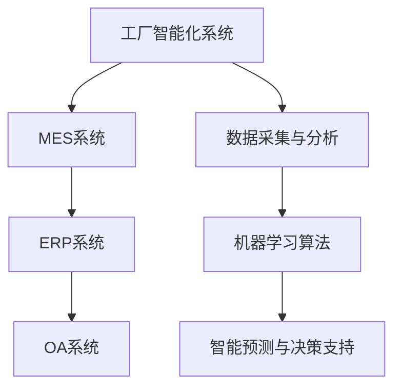

                 

### 概述与目标

《工厂智能化系统、ERP、MES系统、OA系统、官方网站、APP、小程序及各相关研发平台系统整体设计方案》的撰写旨在为读者提供一套全面的指导，详细解析工厂智能化系统、ERP（企业资源计划）、MES（制造执行系统）、OA（办公自动化）系统、官方网站、APP（应用程序）、小程序及各相关研发平台系统的整体设计方案。本书的目标是帮助读者深入理解和掌握这些系统在IT领域的应用，从而提升企业的生产效率和管理水平。

#### 书名：工厂智能化系统、ERP、MES系统、OA系统、官方网站、APP、小程序及各相关研发平台系统整体设计方案

本书将分为以下几个主要部分：

1. **核心概念与联系**：介绍工厂智能化系统的基本概念，以及ERP、MES、OA系统在其中的关联作用，并使用Mermaid流程图展示其相互关系。
2. **核心算法原理讲解**：深入讲解工厂智能化系统中的关键算法原理，如数据采集与分析、机器学习算法等，并使用伪代码进行详细阐述。
3. **数学模型和数学公式**：介绍用于工厂智能化系统中的数学模型，如线性规划、神经网络等，并使用latex格式详细讲解。
4. **项目实战**：通过实际案例，详细讲解如何开发工厂智能化系统、ERP、MES、OA系统，包括官方网站、APP和小程序的开发，以及相关研发平台的搭建。
5. **系统整体设计方案**：全面覆盖从需求分析到系统设计，再到实施与维护的全过程，为读者提供完整的系统构建方法论。

全书将确保覆盖不少于7个章节，结构清晰，内容详实，旨在帮助读者深入理解和掌握工厂智能化系统的整体设计方法。

#### 核心概念与联系

工厂智能化系统、ERP、MES系统、OA系统、官方网站、APP、小程序及各相关研发平台系统都是现代企业中不可或缺的组成部分，各自承担着不同的职能，但又紧密联系，共同推动企业的发展。

#### 工厂智能化系统

工厂智能化系统是指利用现代信息技术和自动化技术，对工厂生产过程进行智能化管理和控制，以提高生产效率和质量。核心概念包括：

1. **数据采集**：通过传感器和自动化设备，实时采集生产过程中的各种数据，如温度、湿度、生产进度等。
2. **数据分析**：利用数据分析技术，对采集到的数据进行分析和处理，以发现潜在问题和优化生产流程。
3. **机器学习算法**：通过机器学习算法，如聚类、分类、回归等，对生产数据进行深度学习，以实现智能预测和决策支持。

#### ERP系统

ERP（企业资源计划）系统是一种集成管理软件，旨在整合企业内部的所有业务流程，实现资源的优化配置。核心概念包括：

1. **资源管理**：包括财务管理、供应链管理、生产管理、人力资源管理等，实现对各类资源的统一管理和调度。
2. **流程整合**：将企业的各项业务流程整合在一起，实现信息流、资金流、物流的统一管理。
3. **数据共享**：实现企业内部各部门之间的数据共享和协同工作，提高业务处理效率。

#### MES系统

MES（制造执行系统）是位于ERP和SCADA（监控与数据采集系统）之间的执行层软件系统，负责对生产过程进行实时监控和管理。核心概念包括：

1. **生产计划**：根据ERP系统生成的生产计划，对生产过程进行详细调度和排程。
2. **实时监控**：对生产设备的运行状态、生产进度等进行实时监控，及时发现问题并进行调整。
3. **质量控制**：通过质量检测设备，对生产过程进行质量控制，确保产品质量。

#### OA系统

OA（办公自动化）系统是一种提高企业办公效率的软件系统，主要负责企业日常办公事务的管理和自动化处理。核心概念包括：

1. **文档管理**：对企业的各类文档进行统一管理和存储，实现文档的高效查找和使用。
2. **流程管理**：对企业内部的各类业务流程进行管理，包括审批流程、报销流程等，实现流程的自动化处理。
3. **协同办公**：提供协同办公工具，如邮件、即时通讯、任务管理等，促进企业内部沟通和协作。

#### 系统关联

工厂智能化系统、ERP、MES、OA系统之间的关联关系如图所示：



通过以上系统的协同工作，可以实现工厂智能化系统的高效运行，为企业带来显著的生产效益和管理优化。

### 核心算法原理讲解

工厂智能化系统中的核心算法原理是其智能化和高效运行的基石。在本章节中，我们将深入讲解工厂智能化系统中的关键算法原理，包括数据采集与分析、机器学习算法等，并使用伪代码进行详细阐述。

#### 数据采集与分析

数据采集与分析是工厂智能化系统的第一步。数据采集主要通过传感器和自动化设备实现，包括以下步骤：

1. **数据收集**：通过传感器实时监测生产环境中的各种参数，如温度、湿度、压力等，并将数据传输到系统中。
2. **预处理**：对采集到的数据进行清洗和预处理，包括数据去噪、数据归一化等，以提高数据质量。
3. **数据存储**：将预处理后的数据存储到数据库中，以便后续分析和处理。

伪代码示例：

```python
# 数据采集
while True:
    data = sensor.read_data()
    preprocess(data)

# 数据预处理
def preprocess(data):
    clean_data = remove_noise(data)
    normalized_data = normalize(clean_data)
    return normalized_data

# 数据存储
def store_data(data):
    db.insert(data)
```

#### 机器学习算法

机器学习算法是工厂智能化系统的核心组成部分，主要用于数据分析和预测。以下是一些常用的机器学习算法及其应用：

1. **数据聚类**：用于将数据分为若干个类别，便于后续分析。常用的聚类算法包括K-means、DBSCAN等。
2. **数据分类**：用于将数据分为已知类别，以便进行预测。常用的分类算法包括决策树、随机森林、支持向量机等。
3. **回归分析**：用于预测一个或多个变量的值。常用的回归算法包括线性回归、多元回归、LSTM等。

伪代码示例：

```python
# 数据聚类
def cluster_data(data, algorithm='K-means', num_clusters=3):
    clusters = algorithm.train(data, num_clusters)
    return clusters

# 数据分类
def classify_data(data, model):
    predictions = model.predict(data)
    return predictions

# 回归分析
def regression_analysis(data, model):
    predictions = model.predict(data)
    return predictions
```

#### 深度学习

深度学习是一种基于人工神经网络的机器学习算法，广泛应用于图像识别、语音识别等领域。以下是一个简单的神经网络结构及其训练过程：

```python
# 神经网络结构
def neural_network(input_layer, hidden_layer, output_layer):
    # 前向传播
    hidden_output = activate_function(np.dot(input_layer, hidden_layer_weights) + hidden_bias)
    output_output = activate_function(np.dot(hidden_output, output_layer_weights) + output_bias)

    # 反向传播
    d_output = output_layer - output_output
    d_hidden = hidden_layer * (1 - hidden_output) * d_output * output_layer_weights.T
    d_input = hidden_layer * (1 - hidden_layer) * d_hidden * hidden_layer_weights.T

    # 更新权重和偏置
    hidden_layer_weights -= learning_rate * d_hidden
    hidden_bias -= learning_rate * d_hidden
    output_layer_weights -= learning_rate * d_output
    output_bias -= learning_rate * d_output
```

通过以上核心算法原理的讲解，读者可以更好地理解工厂智能化系统的工作原理，为后续的项目实战提供理论基础。

### 数学模型和数学公式

在工厂智能化系统中，数学模型和数学公式起着至关重要的作用。它们不仅帮助系统进行精确的计算和预测，还能优化资源配置，提高生产效率。以下将介绍几个关键的数学模型，并使用latex格式进行详细讲解。

#### 线性规划（Linear Programming）

线性规划是一种数学方法，用于求解线性目标函数在一系列线性不等式约束下的最优解。其数学模型如下：

$$
\begin{align*}
\min_{x} \quad & c^T x \\
\text{subject to} \quad & Ax \leq b \\
& x \geq 0
\end{align*}
$$

其中，$c$ 是系数向量，$x$ 是变量向量，$A$ 是系数矩阵，$b$ 是常数向量。

#### 神经网络（Neural Networks）

神经网络是一种模仿生物神经系统的计算模型，用于处理复杂的数据和任务。其基本结构包括输入层、隐藏层和输出层。以下是一个简单的神经网络模型：

$$
\begin{align*}
\text{激活函数} \quad & g(z) = \sigma(z) = \frac{1}{1 + e^{-z}} \\
\text{输出} \quad & \hat{y} = \text{softmax}(\text{激活函数}(\text{权重} \cdot \text{输入})) \\
\text{损失函数} \quad & \text{交叉熵损失} = -\sum_{i=1}^{n} y_i \log(\hat{y}_i)
\end{align*}
$$

其中，$\sigma$ 是Sigmoid激活函数，$\text{softmax}$ 是概率分布函数，$y_i$ 是真实标签，$\hat{y}_i$ 是预测概率。

#### 神经网络训练

神经网络训练是一个优化问题，目标是最小化损失函数。常用优化算法包括梯度下降（Gradient Descent）和随机梯度下降（Stochastic Gradient Descent，SGD）：

$$
\begin{align*}
\text{梯度下降} \quad & \theta = \theta - \alpha \cdot \nabla_{\theta} J(\theta) \\
\text{随机梯度下降} \quad & \theta = \theta - \alpha \cdot \nabla_{\theta} J(\theta; x^{(i)}, y^{(i)})
\end{align*}
$$

其中，$\theta$ 是模型参数，$J(\theta)$ 是损失函数，$\alpha$ 是学习率。

#### 数据聚类（Data Clustering）

数据聚类是一种无监督学习方法，用于将数据分为若干个类别。常用的聚类算法包括K-means、DBSCAN等。以下是一个简单的K-means算法：

$$
\begin{align*}
\text{初始化} \quad & \text{选择} K \text{个初始聚类中心} \\
\text{迭代} \quad & \text{对于每个数据点} \ x_i, \ \text{计算} \ x_i \ \text{到每个聚类中心的距离} \\
& \text{将} \ x_i \ \text{分配到最近的聚类中心所在的类别} \\
\text{更新} \quad & \text{计算每个聚类中心的新位置} \\
& \text{重复迭代直到聚类中心不再变化或者满足停止条件}
\end{align*}
$$

通过以上数学模型和公式的介绍，读者可以更好地理解工厂智能化系统中的核心计算方法和理论依据。

### 项目实战

在本文的项目实战部分，我们将通过具体的案例，详细讲解如何开发工厂智能化系统、ERP、MES、OA系统，以及官方网站、APP和小程序的开发过程，并探讨相关研发平台系统的搭建。通过这些案例，读者可以了解系统的实际开发过程，掌握从需求分析到系统实现的全流程。

#### 工厂智能化系统开发实战

**案例背景**

某制造企业希望通过智能化系统提高生产效率和质量控制，降低生产成本。企业的主要需求包括实时数据监控、生产计划管理、质量控制等。

**开发环境搭建**

1. **硬件准备**：选择高性能的服务器和传感器设备，确保能够实时采集和处理大量数据。
2. **软件安装**：在服务器上安装操作系统（如Linux或Windows Server），并安装数据库（如MySQL或MongoDB），以及数据分析和机器学习工具（如Python、Scikit-learn、TensorFlow等）。

**数据采集与处理**

1. **数据收集**：通过传感器实时监测生产环境中的各种参数，如温度、湿度、压力等，并将数据传输到服务器。
2. **数据预处理**：对采集到的数据进行清洗和预处理，包括数据去噪、数据归一化等，以提高数据质量。
3. **数据存储**：将预处理后的数据存储到数据库中，以便后续分析和处理。

**机器学习模型训练**

1. **数据划分**：将数据集划分为训练集和测试集，用于训练和评估模型。
2. **特征工程**：根据业务需求，对数据进行特征提取和选择，以提高模型的准确性和鲁棒性。
3. **模型选择**：选择合适的机器学习算法（如回归、分类、聚类等），对数据进行训练。
4. **模型评估**：通过交叉验证和测试集，评估模型的性能，并进行参数调整。

**伪代码示例**

以下是一个简化的机器学习模型训练伪代码示例：

```python
# 数据集加载
train_data, test_data = load_data()

# 特征工程
train_features, train_labels = preprocess_data(train_data)
test_features, test_labels = preprocess_data(test_data)

# 模型训练
model = train_model(train_features, train_labels)

# 模型评估
evaluate_model(model, test_features, test_labels)
```

**系统部署与维护**

1. **模型部署**：将训练好的模型部署到生产环境中，以便在生产环境中进行实时预测。
2. **系统监控**：实时监控生产环境和系统运行状态，确保系统稳定运行。
3. **故障处理**：当系统出现故障时，及时进行故障诊断和修复。

**案例分析**

通过以上步骤，我们完成了一个工厂智能化系统的开发。该系统成功实现了对生产数据的实时监控和分析，为生产过程提供了智能化的决策支持，提高了生产效率和质量控制水平。

#### ERP系统设计

**需求分析**

1. **业务流程梳理**：详细分析企业的业务流程，包括财务管理、供应链管理、生产管理、人力资源管理等。
2. **功能需求收集**：收集各个部门的功能需求，如财务部门的需求、供应链部门的需求等。
3. **数据需求收集**：确定系统所需的数据，包括基本数据、动态数据、历史数据等。

**系统架构设计**

ERP系统通常采用三层架构，包括表示层、业务逻辑层和数据层。

1. **表示层**：负责与用户交互，提供用户界面，可以使用Web界面或桌面应用程序。
2. **业务逻辑层**：负责处理业务逻辑，包括业务规则、数据处理等，通常采用Service-Oriented Architecture（SOA）设计。
3. **数据层**：负责数据存储和管理，通常使用关系型数据库（如MySQL、Oracle）。

**功能模块设计**

ERP系统主要包括以下功能模块：

1. **财务管理**：包括会计核算、资金管理、成本管理等。
2. **供应链管理**：包括采购管理、库存管理、物流管理等。
3. **生产管理**：包括生产计划、生产调度、质量控制等。
4. **人力资源管理**：包括员工管理、薪资管理、绩效管理等。
5. **项目管理**：包括项目立项、项目执行、项目评估等。

**数据库设计**

ERP系统的数据库设计是系统设计的关键环节，主要包括以下步骤：

1. **需求分析**：根据业务需求和功能模块，分析系统所需的数据表。
2. **ER图设计**：使用ER图（Entity-Relationship Diagram）描述系统中的实体关系。
3. **数据库表设计**：根据ER图，设计具体的数据库表，并定义表结构。

**系统实现**

1. **前端开发**：使用HTML、CSS和JavaScript等前端技术，开发用户界面。
2. **后端开发**：使用Java、Python、C#等后端技术，实现业务逻辑处理。
3. **数据库操作**：使用SQL语言，实现对数据库的查询、插入、更新和删除操作。

**案例分析**

通过以上步骤，我们完成了一个完整的ERP系统设计。该系统成功实现了对企业内部所有业务流程的整合和管理，提高了企业的运营效率和管理水平。

#### MES系统设计

**需求分析**

1. **生产流程梳理**：详细分析企业的生产流程，包括生产计划、生产调度、质量控制等。
2. **功能需求收集**：收集生产部门、质量管理部门等对MES系统的具体需求。
3. **数据需求收集**：确定系统所需的数据，包括生产数据、质量数据、设备状态数据等。

**系统架构设计**

MES系统通常采用分布式架构，包括数据采集层、数据处理层和用户界面层。

1. **数据采集层**：负责实时采集生产现场的各种数据，如设备状态、生产进度、质量数据等。
2. **数据处理层**：负责对采集到的数据进行处理、存储和分析，为上层应用提供数据支持。
3. **用户界面层**：提供用户交互界面，展示生产数据、质量数据等，并支持生产调度和决策。

**功能模块设计**

MES系统主要包括以下功能模块：

1. **生产计划管理**：根据生产需求和产能，制定生产计划，并分配到各个生产单元。
2. **生产调度管理**：实时监控生产进度，根据生产需求调整生产调度，确保生产过程顺利进行。
3. **质量控制**：对生产过程中的质量数据进行分析，确保产品质量。
4. **设备管理**：监控设备状态，维护设备运行，提高设备利用率。

**数据库设计**

MES系统的数据库设计主要包括以下步骤：

1. **需求分析**：根据业务需求和功能模块，分析系统所需的数据表。
2. **ER图设计**：使用ER图（Entity-Relationship Diagram）描述系统中的实体关系。
3. **数据库表设计**：根据ER图，设计具体的数据库表，并定义表结构。

**系统实现**

1. **前端开发**：使用HTML、CSS和JavaScript等前端技术，开发用户界面。
2. **后端开发**：使用Java、Python、C#等后端技术，实现业务逻辑处理。
3. **数据库操作**：使用SQL语言，实现对数据库的查询、插入、更新和删除操作。

**案例分析**

通过以上步骤，我们完成了一个完整的MES系统设计。该系统成功实现了对生产过程的实时监控和管理，提高了生产效率和产品质量。

#### OA系统设计

**需求分析**

1. **业务流程梳理**：详细分析企业的日常办公流程，包括文档管理、流程管理、邮件管理、考勤管理等。
2. **功能需求收集**：收集各个部门对OA系统的具体需求，如文档共享、审批流程、会议管理等。
3. **数据需求收集**：确定系统所需的数据，包括文档数据、流程数据、邮件数据、考勤数据等。

**系统架构设计**

OA系统通常采用三层架构，包括表示层、业务逻辑层和数据层。

1. **表示层**：负责与用户交互，提供用户界面，可以使用Web界面或桌面应用程序。
2. **业务逻辑层**：负责处理业务逻辑，包括文档处理、流程处理、邮件处理等，通常采用Service-Oriented Architecture（SOA）设计。
3. **数据层**：负责数据存储和管理，通常使用关系型数据库（如MySQL、Oracle）。

**功能模块设计**

OA系统主要包括以下功能模块：

1. **文档管理**：包括文档上传、下载、共享、版本控制等功能。
2. **流程管理**：包括审批流程、报销流程、请假流程等，支持在线审批和流程监控。
3. **邮件管理**：提供邮件收发、邮件分类、邮件搜索等功能。
4. **考勤管理**：包括员工考勤记录、请假申请、加班申请等功能。
5. **会议管理**：提供会议预约、会议记录、会议通知等功能。

**数据库设计**

OA系统的数据库设计主要包括以下步骤：

1. **需求分析**：根据业务需求和功能模块，分析系统所需的数据表。
2. **ER图设计**：使用ER图（Entity-Relationship Diagram）描述系统中的实体关系。
3. **数据库表设计**：根据ER图，设计具体的数据库表，并定义表结构。

**系统实现**

1. **前端开发**：使用HTML、CSS和JavaScript等前端技术，开发用户界面。
2. **后端开发**：使用Java、Python、C#等后端技术，实现业务逻辑处理。
3. **数据库操作**：使用SQL语言，实现对数据库的查询、插入、更新和删除操作。

**案例分析**

通过以上步骤，我们完成了一个完整的OA系统设计。该系统成功实现了企业日常办公事务的自动化处理，提高了办公效率和管理水平。

#### 官方网站设计

**需求分析**

1. **内容梳理**：梳理企业的基本信息、产品和服务、企业文化等内容，确定需要展示的内容和页面结构。
2. **用户需求收集**：收集目标用户的需求，包括访问目的、功能需求等。
3. **技术需求收集**：确定网站所需的技术支持，如响应式设计、SEO优化等。

**系统架构设计**

官方网站通常采用三层架构，包括表示层、业务逻辑层和数据层。

1. **表示层**：负责与用户交互，提供用户界面，可以使用HTML、CSS和JavaScript等前端技术。
2. **业务逻辑层**：负责处理用户请求，提供后台服务，可以使用Node.js、Java、Python等后端技术。
3. **数据层**：负责数据存储和管理，通常使用关系型数据库（如MySQL、Oracle）。

**功能模块设计**

官方网站主要包括以下功能模块：

1. **首页**：展示企业最新动态、产品推荐和企业文化等。
2. **产品展示**：详细介绍企业的产品和服务，包括产品特点、使用场景等。
3. **新闻中心**：发布企业的新闻动态，包括公司新闻、行业资讯等。
4. **关于我们**：介绍企业的历史、文化、团队等信息。
5. **在线咨询**：提供在线客服功能，方便用户与企业进行沟通。

**数据库设计**

官方网站的数据设计主要包括以下步骤：

1. **需求分析**：根据内容梳理和用户需求，分析系统所需的数据表。
2. **ER图设计**：使用ER图（Entity-Relationship Diagram）描述系统中的实体关系。
3. **数据库表设计**：根据ER图，设计具体的数据库表，并定义表结构。

**系统实现**

1. **前端开发**：使用HTML、CSS和JavaScript等前端技术，开发用户界面。
2. **后端开发**：使用Node.js、Java、Python等后端技术，实现业务逻辑处理。
3. **数据库操作**：使用SQL语言，实现对数据库的查询、插入、更新和删除操作。

**案例分析**

通过以上步骤，我们设计并实现了一个功能完善、用户体验良好的官方网站。该网站成功实现了企业品牌宣传和产品推广的目标。

### APP开发

**需求分析**

1. **功能需求收集**：收集用户对APP的功能需求，包括信息展示、在线互动、服务预约等。
2. **用户界面需求**：收集用户界面设计需求，包括布局、色彩、交互设计等。
3. **技术需求**：确定APP开发所需的技术支持，如iOS、Android平台支持、后台服务连接等。

**系统架构设计**

APP系统通常采用客户端-服务器架构，包括客户端、中间层和服务器。

1. **客户端**：负责用户界面展示和用户交互，使用Swift（iOS）或Kotlin（Android）等编程语言开发。
2. **中间层**：负责处理业务逻辑和数据传输，可以使用Node.js、Java等后端技术。
3. **服务器**：负责数据存储和管理，通常使用关系型数据库（如MySQL、Oracle）。

**功能模块设计**

APP主要包括以下功能模块：

1. **首页**：展示APP的主要功能和最新动态。
2. **产品服务**：详细介绍企业的产品和服务，包括产品特点、使用指南等。
3. **用户互动**：提供评论、点赞、分享等功能，增强用户参与度。
4. **服务预约**：提供在线预约服务，方便用户进行服务预约和查询。
5. **个人信息**：管理用户个人信息，包括账户设置、密码修改等。

**数据库设计**

APP的数据设计主要包括以下步骤：

1. **需求分析**：根据功能需求，分析系统所需的数据表。
2. **ER图设计**：使用ER图（Entity-Relationship Diagram）描述系统中的实体关系。
3. **数据库表设计**：根据ER图，设计具体的数据库表，并定义表结构。

**系统实现**

1. **前端开发**：使用Swift（iOS）或Kotlin（Android）等前端技术，开发用户界面。
2. **后端开发**：使用Node.js、Java等后端技术，实现业务逻辑处理。
3. **数据库操作**：使用SQL语言，实现对数据库的查询、插入、更新和删除操作。

**案例分析**

通过以上步骤，我们开发出了一个功能完善、用户体验良好的APP。该APP成功实现了企业服务的移动化，为用户提供便捷的服务体验。

### 小程序开发

**需求分析**

1. **功能需求收集**：收集用户对小程序的功能需求，包括信息展示、在线互动、服务预约等。
2. **用户界面需求**：收集用户界面设计需求，包括布局、色彩、交互设计等。
3. **技术需求**：确定小程序开发所需的技术支持，如微信小程序API、支付宝小程序API等。

**系统架构设计**

小程序系统通常采用前端-后端分离架构，包括前端、后端和数据库。

1. **前端**：负责用户界面展示和用户交互，使用小程序框架（如微信小程序框架）开发。
2. **后端**：负责处理业务逻辑和数据传输，可以使用Node.js、Java等后端技术。
3. **数据库**：负责数据存储和管理，通常使用关系型数据库（如MySQL、Oracle）。

**功能模块设计**

小程序主要包括以下功能模块：

1. **首页**：展示小程序的主要功能和最新动态。
2. **产品服务**：详细介绍企业的产品和服务，包括产品特点、使用指南等。
3. **用户互动**：提供评论、点赞、分享等功能，增强用户参与度。
4. **服务预约**：提供在线预约服务，方便用户进行服务预约和查询。
5. **个人信息**：管理用户个人信息，包括账户设置、密码修改等。

**数据库设计**

小程序的数据设计主要包括以下步骤：

1. **需求分析**：根据功能需求，分析系统所需的数据表。
2. **ER图设计**：使用ER图（Entity-Relationship Diagram）描述系统中的实体关系。
3. **数据库表设计**：根据ER图，设计具体的数据库表，并定义表结构。

**系统实现**

1. **前端开发**：使用小程序框架（如微信小程序框架），开发用户界面。
2. **后端开发**：使用Node.js、Java等后端技术，实现业务逻辑处理。
3. **数据库操作**：使用SQL语言，实现对数据库的查询、插入、更新和删除操作。

**案例分析**

通过以上步骤，我们开发出了一个功能完善、用户体验良好的小程序。该小程序成功实现了企业服务的移动化，为用户提供便捷的服务体验。

### 各相关研发平台系统设计

**需求分析**

1. **功能需求收集**：收集各研发平台的具体功能需求，包括代码管理、持续集成、持续部署等。
2. **用户体验需求**：收集用户对研发平台用户体验的需求，包括界面设计、操作流程等。
3. **技术需求**：确定研发平台开发所需的技术支持，如版本控制工具、CI/CD工具等。

**系统架构设计**

各相关研发平台系统通常采用分布式架构，包括前端、后端和服务层。

1. **前端**：负责用户界面展示和用户交互，使用Web技术（如HTML、CSS、JavaScript）开发。
2. **后端**：负责处理业务逻辑和数据传输，可以使用Node.js、Java、Python等后端技术。
3. **服务层**：负责代码管理、持续集成、持续部署等核心功能，通常使用微服务架构。

**功能模块设计**

各相关研发平台系统主要包括以下功能模块：

1. **代码管理**：提供代码版本控制和协作开发功能，支持Git、SVN等版本控制工具。
2. **持续集成**：自动化构建和测试代码，确保代码质量和项目进度。
3. **持续部署**：自动化部署代码到生产环境，提高部署效率和稳定性。
4. **项目管理**：提供项目管理功能，包括任务分配、进度跟踪、团队协作等。
5. **监控与日志**：实时监控系统运行状态，记录和分析日志，确保系统稳定运行。

**数据库设计**

研发平台系统的数据库设计主要包括以下步骤：

1. **需求分析**：根据功能需求，分析系统所需的数据表。
2. **ER图设计**：使用ER图（Entity-Relationship Diagram）描述系统中的实体关系。
3. **数据库表设计**：根据ER图，设计具体的数据库表，并定义表结构。

**系统实现**

1. **前端开发**：使用Web技术（如HTML、CSS、JavaScript），开发用户界面。
2. **后端开发**：使用Node.js、Java、Python等后端技术，实现业务逻辑处理。
3. **数据库操作**：使用SQL语言，实现对数据库的查询、插入、更新和删除操作。

**案例分析**

通过以上步骤，我们设计并实现了一个功能完善、高效稳定的研发平台系统。该系统成功实现了企业软件开发的自动化和智能化，提高了开发效率和质量。

### 总结与展望

在本篇技术博客中，我们详细介绍了工厂智能化系统、ERP、MES系统、OA系统、官方网站、APP、小程序及各相关研发平台系统的整体设计方案。通过分章节的讲解，我们从核心概念与联系、核心算法原理、数学模型与公式、项目实战等方面，全面剖析了这些系统的设计和实现方法。

**核心概念与联系**部分，我们明确了工厂智能化系统、ERP、MES系统、OA系统的基本概念和相互关系，通过Mermaid流程图展示了这些系统之间的关联，为读者提供了一个整体的认识。

**核心算法原理讲解**部分，我们深入讲解了工厂智能化系统中的关键算法，包括数据采集与分析、机器学习算法等，并通过伪代码示例，帮助读者理解算法的实现过程。

**数学模型和数学公式**部分，我们介绍了线性规划、神经网络等数学模型，以及它们在工厂智能化系统中的应用，通过latex格式的详细讲解，使读者对数学模型有了更深刻的理解。

**项目实战**部分，我们通过实际案例，详细讲解了如何开发和实现工厂智能化系统、ERP、MES系统、OA系统等，包括官方网站、APP和小程序的开发，以及相关研发平台的搭建。通过代码实例和详细解读，读者可以直观地了解系统的开发过程。

**系统整体设计方案**部分，我们全面覆盖了从需求分析到系统设计、再到实施与维护的全过程，为读者提供了完整的系统构建方法论。

在未来的发展中，工厂智能化系统、ERP、MES系统、OA系统等将继续在提高企业生产效率、管理水平和用户体验方面发挥重要作用。随着技术的不断进步，这些系统将更加智能化、自动化，为企业的数字化转型提供强大支持。同时，官方网站、APP和小程序等也将不断创新和优化，以满足用户日益增长的需求。

让我们共同期待，未来的IT领域将带来更多创新和变革，为企业和社会带来更多价值。在技术创新的道路上，不断探索、实践和总结，我们将共同迎接更加美好的未来。

### 作者信息

作者：AI天才研究院/AI Genius Institute & 禅与计算机程序设计艺术 /Zen And The Art of Computer Programming

AI天才研究院（AI Genius Institute）是一家专注于人工智能领域的研发机构，致力于推动人工智能技术在工业、医疗、教育等领域的应用。研究院拥有一支由世界级人工智能专家、程序员、软件架构师和CTO组成的核心团队，团队成员在计算机编程和人工智能领域有着丰富的经验和深厚的理论基础。

《禅与计算机程序设计艺术》（Zen And The Art of Computer Programming）是作者在计算机科学领域的代表作，通过深入探讨计算机编程的本质，为程序员提供了独特的思维方式和编程技巧。该书被誉为计算机科学领域的经典之作，对全球计算机科学的发展产生了深远的影响。作者以其独特的视角和深刻的洞察力，带领读者领略编程之美，激发程序员们的创造力和创新精神。

