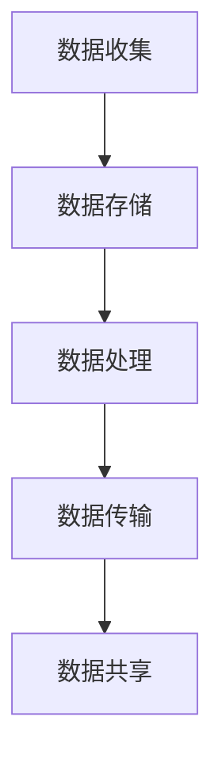

                 

# 《平台经济的数据监管体系建设：如何构建完善的监管体系？》

## 摘要

随着互联网和信息技术的发展，平台经济在全球范围内迅速崛起，成为现代经济体系的重要组成部分。平台经济通过连接供需双方，降低了交易成本，提高了资源配置效率，推动了经济增长。然而，平台经济也带来了一系列数据监管问题，如数据隐私、数据滥用和数据安全等。为了维护市场秩序，保障消费者权益，构建一个完善的平台经济数据监管体系显得尤为重要。本文将从平台经济的概述、数据监管的重要性、监管问题分析、监管体系构建、核心概念与架构、监管体系建设实践以及监管政策制定与实施等方面，系统探讨如何构建一个完善的平台经济数据监管体系。

## 目录

### 《平台经济的数据监管体系建设：如何构建完善的监管体系？》目录大纲

#### 第一部分：平台经济与数据监管概述

1. 平台经济的崛起与发展
    - 1.1 平台经济的定义与特点
    - 1.2 平台经济的崛起背景
    - 1.3 平台经济的商业模式
2. 数据监管的重要性
    - 2.1 数据监管的定义与意义
    - 2.2 数据监管的现状与挑战
    - 2.3 数据监管的法律框架
3. 平台经济中的数据监管问题
    - 3.1 数据隐私问题
    - 3.2 数据滥用问题
    - 3.3 数据安全问题
4. 平台经济的数据监管体系构建
    - 4.1 监管体系的框架设计
    - 4.2 监管机构的角色与职责
    - 4.3 监管政策的制定与实施

#### 第二部分：核心概念与架构

5. 数据监管的核心概念与联系
    - 5.1 数据监管的基本原理
    - 5.2 数据监管的主要目标
    - 5.3 数据监管的关键要素
    - 5.4 数据监管流程与Mermaid流程图
6. 平台经济的数据监管架构
    - 6.1 监管架构的设计原则
    - 6.2 监管架构的层次结构
    - 6.3 监管架构的组件与接口
7. 数据监管算法原理讲解
    - 7.1 数据采集与清洗算法
    - 7.2 数据分析算法
    - 7.3 数据安全与隐私保护算法
    - 7.4 伪代码展示
8. 数学模型与数学公式讲解
    - 8.1 数据隐私保护模型
    - 8.2 数据安全模型
    - 8.3 数学模型推导
    - 8.4 公式示例
9. 数据监管项目实战
    - 9.1 项目背景与目标
    - 9.2 开发环境搭建
    - 9.3 源代码详细实现
    - 9.4 代码解读与分析

#### 第三部分：监管体系建设与实践

10. 监管体系建设方法论
    - 10.1 监管体系建设的基本步骤
    - 10.2 监管体系建设的关键技术
    - 10.3 监管体系建设的关键挑战
    - 10.4 成功案例分享
11. 数据监管政策制定与实施
    - 11.1 政策制定的原则与过程
    - 11.2 政策实施的方法与工具
    - 11.3 政策实施的挑战与应对
    - 11.4 政策案例解析
12. 监管机构的角色与职责
    - 12.1 监管机构的职责与权力
    - 12.2 监管机构的组织结构
    - 12.3 监管机构的工作流程
    - 12.4 监管机构的运营管理
13. 平台经济的可持续发展与数据监管
    - 13.1 平台经济的可持续发展路径
    - 13.2 数据监管对平台经济的促进作用
    - 13.3 数据监管与平台经济的平衡发展

#### 附录

14. 附录 A: 数据监管相关法规与政策
    - 14.1 我国数据监管法规概述
    - 14.2 国外数据监管法规对比
    - 14.3 数据监管相关政策解读
15. 附录 B: 数据监管工具与资源
    - 15.1 主流数据监管工具对比
    - 15.2 数据监管资源汇总
    - 15.3 开源数据监管项目介绍
16. 附录 C: 数据监管相关论文与著作
    - 16.1 数据隐私保护研究论文
    - 16.2 数据安全研究论文
    - 16.3 数据监管著作推荐

---

现在，让我们开始深入探讨平台经济的崛起与发展。

## 平台经济的崛起与发展

### 1.1 平台经济的定义与特点

平台经济，又称共享经济或协作经济，是指通过互联网平台将供需双方连接起来，实现资源优化配置和共享的一种新型经济模式。平台经济的特点主要体现在以下几个方面：

1. **去中心化**：平台经济的核心在于去中心化，通过互联网平台连接供需双方，打破了传统的中心化市场模式，降低了交易成本。
2. **高效协同**：平台经济能够实现供需双方的高效协同，通过数据分析和智能匹配，提高了资源利用率和交易效率。
3. **共享经济**：平台经济倡导共享理念，将闲置资源进行共享，实现了资源的最大化利用。
4. **多样性**：平台经济涵盖了众多领域，如电商、出行、住宿、教育、医疗等，具有广泛的应用场景。

### 1.2 平台经济的崛起背景

平台经济的崛起得益于以下几个因素：

1. **互联网技术的普及**：互联网技术的快速发展，特别是移动互联网的普及，为平台经济的兴起提供了技术支撑。
2. **消费者需求的变化**：随着消费者对个性化、便捷化服务的需求不断增加，平台经济恰好满足了这些需求。
3. **商业模式的创新**：平台经济的商业模式不断创新，如分享经济、众包模式等，为平台经济的快速发展提供了动力。
4. **政策支持**：政府对平台经济的支持政策，如税收优惠、市场准入等，也为平台经济的崛起提供了有利环境。

### 1.3 平台经济的商业模式

平台经济的商业模式主要包括以下几个方面：

1. **交易撮合**：平台通过连接供需双方，实现交易撮合，降低交易成本。
2. **服务提供**：平台提供各种服务，如支付、物流、客服等，为交易提供便利。
3. **数据管理**：平台通过收集、处理和分析用户数据，实现精准营销和个性化服务。
4. **增值服务**：平台通过提供增值服务，如会员服务、广告推广等，实现盈利。

### 1.4 平台经济的优势

平台经济的优势主要体现在以下几个方面：

1. **提高资源利用率**：平台经济通过共享理念，实现了资源的最大化利用。
2. **降低交易成本**：平台经济通过数据分析和智能匹配，降低了供需双方的交易成本。
3. **促进就业**：平台经济为各类从业者提供了丰富的就业机会。
4. **推动产业升级**：平台经济促进了传统产业的转型升级，推动了产业结构调整。

综上所述，平台经济的崛起与发展，不仅改变了传统的商业模式，也为经济发展带来了新的机遇。然而，随着平台经济的快速发展，也带来了一系列数据监管问题，需要引起我们的关注。在下一部分，我们将探讨数据监管的重要性及其现状与挑战。

---

接下来，我们将探讨数据监管的重要性及其现状与挑战。

## 数据监管的重要性

### 2.1 数据监管的定义与意义

数据监管，是指对平台经济中的数据进行收集、存储、处理、传输和共享等活动进行监督管理，以确保数据的安全、隐私和合规。数据监管的意义主要体现在以下几个方面：

1. **保障数据安全**：数据监管有助于预防和应对数据泄露、篡改、破坏等安全事件，保障数据的安全性和完整性。
2. **保护隐私权益**：数据监管有助于保护个人隐私权益，防止个人信息被滥用，提高消费者信任度。
3. **维护市场秩序**：数据监管有助于维护市场秩序，防止数据垄断和滥用，促进公平竞争。
4. **促进数据合规**：数据监管有助于确保平台经济中的数据收集、处理和共享等活动符合法律法规和行业标准，提高数据合规性。

### 2.2 数据监管的现状与挑战

目前，数据监管在全球范围内仍然面临一系列挑战：

1. **法律法规不完善**：虽然各国纷纷出台了相关数据保护法规，但法律法规的完善程度和执行力度参差不齐，导致数据监管力度不足。
2. **技术手段落后**：数据监管的技术手段相对落后，无法满足日益复杂的数据监管需求，如数据加密、匿名化等技术尚需进一步发展。
3. **数据质量不高**：平台经济中的数据质量参差不齐，数据缺失、错误等问题普遍存在，导致数据监管效果受限。
4. **监管机构不足**：数据监管机构的数量和实力有限，无法覆盖所有的平台经济领域，监管能力有待提升。

### 2.3 数据监管的法律框架

为了保障数据安全和个人隐私权益，各国纷纷出台了相关法律法规：

1. **《通用数据保护条例》（GDPR）**：欧盟出台的GDPR是全球最具影响力的数据保护法规，对数据收集、处理和共享等活动提出了严格的要求。
2. **《加州消费者隐私法》（CCPA）**：美国加州出台的CCPA对消费者数据的收集、使用和共享进行了详细规定。
3. **《网络安全法》**：我国出台的《网络安全法》对数据安全保护进行了全面规定，明确了数据收集、存储、处理和传输等活动的合规要求。

### 2.4 数据监管的重要性

数据监管在平台经济中具有重要的地位，不仅关系到个人隐私权益和数据安全，还关系到市场秩序和经济发展。以下是数据监管的重要性的详细阐述：

1. **保障个人隐私权益**：在平台经济中，大量个人数据被收集、存储和处理，数据监管有助于保护个人隐私权益，防止个人信息被滥用。
2. **促进数据安全**：数据监管有助于预防和应对数据泄露、篡改、破坏等安全事件，保障数据的安全性和完整性。
3. **维护市场秩序**：数据监管有助于维护市场秩序，防止数据垄断和滥用，促进公平竞争。
4. **推动经济发展**：数据监管有助于提高数据质量，促进数据资源的有效利用，推动数字经济的发展。
5. **提升国家竞争力**：数据监管有助于提升国家的数据治理能力，增强国家在全球数字经济竞争中的优势。

综上所述，数据监管在平台经济中具有重要意义，需要我们高度重视并不断完善数据监管体系。在下一部分，我们将探讨平台经济中的数据监管问题，包括数据隐私、数据滥用和数据安全问题。

---

接下来，我们将探讨平台经济中的数据监管问题。

## 平台经济中的数据监管问题

### 3.1 数据隐私问题

在平台经济中，数据隐私问题尤为突出。以下是对数据隐私问题的详细讨论：

1. **数据泄露**：平台经济中的大量个人数据（如姓名、住址、电话号码、财务信息等）在收集、存储、处理和传输过程中，可能面临泄露风险。数据泄露可能导致个人隐私泄露、财产损失甚至身份盗用。
2. **数据滥用**：平台经济中的数据可能被滥用，用于广告精准投放、商业竞争、诈骗等不正当行为。数据滥用不仅侵害了个人隐私权益，也可能对市场秩序和公平竞争造成负面影响。
3. **数据跨境传输**：平台经济中的数据往往涉及跨境传输，不同国家的数据保护法规和标准存在差异，可能导致数据跨境传输面临法律风险。
4. **数据收集范围过广**：一些平台在收集数据时，可能涉及过多无关信息，增加了数据隐私泄露的风险。

### 3.2 数据滥用问题

平台经济中的数据滥用问题主要包括以下几个方面：

1. **商业竞争**：平台经济中的数据可能被用于商业竞争，如分析竞争对手的运营策略、用户需求等，进行不正当竞争行为。
2. **广告精准投放**：平台经济中的数据被用于广告精准投放，可能对用户造成骚扰，甚至侵害用户隐私权益。
3. **数据分析滥用**：平台经济中的数据分析可能被滥用，用于预测用户行为、推断用户隐私等，可能导致用户隐私泄露。
4. **数据跨境传输滥用**：平台经济中的数据跨境传输可能被滥用，用于逃避数据保护法规，进行不正当交易。

### 3.3 数据安全问题

平台经济中的数据安全问题主要包括以下几个方面：

1. **数据泄露**：平台经济中的大量数据在传输、存储和处理过程中，可能面临泄露风险，导致数据泄露事件频发。
2. **数据篡改**：平台经济中的数据可能被篡改，导致数据不准确、不完整，影响数据分析和决策。
3. **数据破坏**：平台经济中的数据可能被恶意破坏，导致数据丢失、损坏，影响平台运营和用户体验。
4. **系统漏洞**：平台经济中的系统可能存在漏洞，可能被黑客攻击，导致数据泄露、篡改等安全事件。

### 3.4 数据隐私、数据滥用与数据安全问题的关联

数据隐私、数据滥用与数据安全问题是平台经济中的三个重要方面，它们之间存在密切的关联：

1. **数据隐私与数据安全**：数据隐私问题可能导致数据泄露、滥用等安全事件，影响数据安全。数据安全问题的存在也会加剧数据隐私问题的严重性。
2. **数据滥用与数据安全**：数据滥用可能导致数据泄露、篡改等安全事件，影响数据安全。数据安全问题的存在也会加剧数据滥用问题的严重性。
3. **数据隐私与数据滥用**：数据隐私问题的存在可能限制数据滥用，保护个人隐私权益。而数据滥用问题的存在可能加剧数据隐私问题，侵害个人隐私权益。

综上所述，平台经济中的数据隐私、数据滥用与数据安全问题密切相关，需要我们高度重视并采取有效措施加以解决。在下一部分，我们将探讨如何构建平台经济的数据监管体系。

---

## 平台经济的数据监管体系构建

### 4.1 监管体系的框架设计

构建一个完善的平台经济数据监管体系，首先需要明确监管体系的框架设计。以下是监管体系框架设计的几个关键方面：

1. **法律框架**：数据监管的法律框架是监管体系的基础，需要制定和完善相关法律法规，确保数据监管有法可依。法律框架应包括数据收集、存储、处理、传输和共享等方面的具体规定，以及数据安全、隐私保护等方面的要求。
2. **技术框架**：数据监管的技术框架是监管体系的核心，需要利用先进的技术手段对数据进行监控、分析和处理。技术框架应包括数据加密、匿名化、分布式存储、隐私保护计算等关键技术，确保数据在传输、存储和处理过程中的安全性和隐私性。
3. **组织框架**：数据监管的组织框架是监管体系的保障，需要建立专门的监管机构或部门，负责数据监管的日常工作。组织框架应包括监管机构的职责、权限、工作流程和组织架构等方面的设计，确保监管机构高效运行。

### 4.2 监管机构的角色与职责

监管机构在平台经济的数据监管体系中扮演着关键角色，其主要职责包括：

1. **政策制定**：监管机构负责制定数据监管的政策和规定，确保数据监管有章可循。政策制定应充分考虑平台经济的实际需求和法律法规的要求，制定出科学、合理、可操作的政策。
2. **监管执行**：监管机构负责对平台经济中的数据收集、存储、处理、传输和共享等活动进行监督和检查，确保各项活动符合法律法规和政策要求。监管执行应采用随机抽查、定期检查、举报处理等方式，提高监管的覆盖面和有效性。
3. **纠纷处理**：监管机构负责处理平台经济中的数据隐私、数据滥用和数据安全等纠纷，维护消费者权益和市场秩序。纠纷处理应公正、公平、公开，确保纠纷得到及时、有效的解决。
4. **宣传教育**：监管机构负责开展数据监管的宣传教育工作，提高公众对数据隐私、数据安全和数据监管的认识，增强公众的数据保护意识。宣传教育应采用多种形式，如讲座、宣传资料、在线课程等，覆盖不同群体和领域。

### 4.3 监管政策的制定与实施

监管政策的制定与实施是构建平台经济数据监管体系的重要环节。以下是监管政策的制定与实施的关键步骤：

1. **调研与论证**：在制定监管政策前，需要进行充分的市场调研和论证，了解平台经济的实际情况和需求，分析现有法律法规和政策的不足，明确监管政策的目标和方向。
2. **政策制定**：根据调研和论证的结果，制定具体的监管政策。政策制定应充分考虑平台经济的实际情况，确保政策的科学性、合理性和可操作性。
3. **政策发布**：将制定的监管政策公开发布，广泛征求社会各界的意见和建议，确保政策得到广泛认同和支持。
4. **政策实施**：政策发布后，监管机构应积极推动政策实施，确保政策得到有效执行。政策实施应建立健全的监管机制，加强对平台经济的监管力度，确保政策目标得到实现。
5. **评估与调整**：在政策实施过程中，应定期对政策效果进行评估，发现问题和不足，及时进行调整和改进，确保政策的长效性和有效性。

### 4.4 监管体系建设的总体目标

平台经济的数据监管体系建设的总体目标如下：

1. **保障数据安全**：通过建立健全的数据安全管理制度和技术措施，确保平台经济中的数据安全，防止数据泄露、篡改和破坏等安全事件。
2. **保护个人隐私**：通过制定严格的隐私保护政策和措施，确保个人数据的收集、存储、处理和共享等活动符合法律法规和政策要求，保护个人隐私权益。
3. **维护市场秩序**：通过加强对平台经济中的数据收集、存储、处理、传输和共享等活动的监管，维护市场秩序，防止数据垄断和滥用，促进公平竞争。
4. **促进数据合规**：通过制定和完善相关法律法规和政策，确保平台经济中的数据收集、存储、处理、传输和共享等活动符合法律法规和政策要求，提高数据合规性。

### 4.5 监管体系建设的关键措施

为了实现监管体系建设的总体目标，需要采取一系列关键措施：

1. **完善法律法规**：制定和完善数据监管相关法律法规，明确数据收集、存储、处理、传输和共享等方面的具体规定，提高法律法规的可操作性和执行力。
2. **加强技术手段**：利用先进的技术手段，如数据加密、匿名化、分布式存储、隐私保护计算等，提高数据监管的技术水平和能力。
3. **建立监管机构**：建立专门的监管机构或部门，负责数据监管的日常工作，确保监管机构具备独立性和权威性。
4. **推动政策实施**：积极推动监管政策的实施，建立健全的监管机制，加强对平台经济的监管力度，确保政策目标得到实现。
5. **提高公众意识**：开展数据监管的宣传教育工作，提高公众对数据隐私、数据安全和数据监管的认识，增强公众的数据保护意识。

通过以上关键措施，可以构建一个完善的平台经济数据监管体系，确保平台经济的安全、合规和可持续发展。

---

## 第二部分：核心概念与架构

### 5. 数据监管的核心概念与联系

数据监管是一个复杂的过程，涉及到多个核心概念和它们之间的紧密联系。以下是数据监管的核心概念及其相互关系：

#### 5.1 数据监管的基本原理

数据监管的基本原理包括以下几个方面：

1. **数据安全**：确保数据在存储、传输和处理过程中不被未授权访问、篡改、破坏或泄露。数据安全是数据监管的首要目标。
2. **隐私保护**：保护个人隐私，防止个人数据被滥用或泄露。隐私保护涉及数据收集、存储、处理和共享等环节。
3. **合规性**：确保数据处理活动符合法律法规和行业规范。合规性是数据监管的重要保证。
4. **透明度**：增强数据处理活动的透明度，使数据主体了解其数据的使用情况和权利。

#### 5.2 数据监管的主要目标

数据监管的主要目标包括：

1. **保护个人隐私**：通过隐私保护措施，确保个人数据不被滥用或泄露，维护个人隐私权益。
2. **保障数据安全**：通过安全措施，确保数据在存储、传输和处理过程中的完整性、可用性和保密性。
3. **促进数据合规**：确保数据处理活动符合法律法规和行业规范，提高数据处理的合法性和可信度。
4. **维护市场秩序**：通过数据监管，防止数据垄断、滥用和不正当竞争，维护市场公平和秩序。

#### 5.3 数据监管的关键要素

数据监管的关键要素包括：

1. **法律法规**：数据监管的法律框架，包括数据保护法、隐私法、网络安全法等。
2. **技术措施**：用于保障数据安全、隐私保护和合规性的技术手段，如加密、匿名化、访问控制等。
3. **组织架构**：负责数据监管的机构或部门的组织结构，包括职责划分、人员配备、工作流程等。
4. **监管流程**：数据监管的具体操作流程，包括数据收集、存储、处理、传输和共享等环节的监管措施。

#### 5.4 数据监管流程与Mermaid流程图

数据监管流程可以概括为以下几个步骤：

1. **数据收集**：在收集数据时，需要确保数据收集的合法性和透明度，同时采取数据匿名化等保护措施。
2. **数据存储**：在存储数据时，需要采用安全措施，如加密、访问控制等，确保数据的安全性和完整性。
3. **数据处理**：在处理数据时，需要遵守数据处理规则，确保数据处理活动的合规性。
4. **数据传输**：在数据传输过程中，需要采取加密等安全措施，确保数据在传输过程中的安全。
5. **数据共享**：在共享数据时，需要确保数据共享的合法性和透明度，同时采取数据匿名化等保护措施。

以下是一个简单的Mermaid流程图示例：



### 6. 平台经济的数据监管架构

平台经济的数据监管架构需要充分考虑数据的复杂性、多样性和敏感性，以下是一个典型的数据监管架构设计：

#### 6.1 监管架构的设计原则

1. **安全性**：确保数据在存储、传输和处理过程中的安全性。
2. **合规性**：确保数据处理活动符合法律法规和行业规范。
3. **可扩展性**：监管架构应具备良好的可扩展性，以适应不断变化的需求和新技术的发展。
4. **灵活性**：监管架构应具备灵活性，以适应不同平台和业务场景的需求。

#### 6.2 监管架构的层次结构

平台经济的数据监管架构通常包括以下层次：

1. **数据收集层**：负责数据的采集、收集和初步处理。
2. **数据处理层**：负责数据清洗、转换、整合和分析。
3. **数据存储层**：负责数据的存储、备份和恢复。
4. **数据安全层**：负责数据加密、访问控制和审计。
5. **数据共享层**：负责数据的共享、交换和协同处理。
6. **监管控制层**：负责监管策略的实施、监控和调整。

#### 6.3 监管架构的组件与接口

平台经济的数据监管架构包含多个组件和接口，以下是一些关键组件和接口：

1. **数据采集组件**：负责从不同数据源收集数据，包括API接口、数据库连接、日志采集等。
2. **数据处理组件**：负责数据清洗、转换、整合和分析，包括ETL工具、数据仓库、机器学习模型等。
3. **数据存储组件**：负责数据的存储、备份和恢复，包括关系数据库、NoSQL数据库、分布式存储等。
4. **数据安全组件**：负责数据加密、访问控制和审计，包括加密模块、防火墙、入侵检测系统等。
5. **数据共享组件**：负责数据的共享、交换和协同处理，包括数据交换平台、API网关、分布式计算框架等。
6. **监管控制组件**：负责监管策略的实施、监控和调整，包括监管平台、监管规则库、监控工具等。

通过以上架构设计，可以实现对平台经济中的数据进行全面、有效的监管，确保数据的安全、合规和可持续发展。

---

### 7. 数据监管算法原理讲解

在构建平台经济的数据监管体系时，算法的运用至关重要。以下将详细讲解数据监管中常用的几种算法原理，包括数据采集与清洗算法、数据分析算法、数据安全与隐私保护算法等。

#### 7.1 数据采集与清洗算法

数据采集是数据监管的第一步，而清洗则是确保数据质量的关键环节。以下是几种常见的数据采集与清洗算法：

1. **去重算法**：用于去除重复数据，常见的方法包括哈希去重和位图去重。哈希去重利用哈希函数将数据映射到哈希表中，通过比较哈希值来判断数据是否重复。位图去重则利用位图来记录数据是否已存在，通过比较位图中的位来判断数据是否重复。

   **伪代码示例**：

   ```python
   def hash_deduplication(data_list):
       hash_set = set()
       deduped_list = []
       for data in data_list:
           hash_value = hash(data)
           if hash_value not in hash_set:
               hash_set.add(hash_value)
               deduped_list.append(data)
       return deduped_list
   ```

2. **缺失值填充算法**：用于处理数据中的缺失值，常见的方法包括均值填充、中值填充和回归填充。均值填充用数据的平均值来填充缺失值，中值填充用数据的中值来填充缺失值，回归填充则利用回归模型预测缺失值。

   **伪代码示例**：

   ```python
   def mean_imputation(data_list):
       mean_value = sum(data_list) / len(data_list)
       for i in range(len(data_list)):
           if data_list[i] is None:
               data_list[i] = mean_value
       return data_list
   ```

3. **异常值检测算法**：用于检测和去除数据中的异常值，常见的方法包括基于统计学的方法（如Z-Score法、IQR法）和基于机器学习的方法（如孤立森林算法）。Z-Score法通过计算数据的标准化值来判断数据是否为异常值，IQR法通过计算数据的四分位差来判断数据是否为异常值。

   **伪代码示例**：

   ```python
   def z_score_detection(data_list):
       mean_value = sum(data_list) / len(data_list)
       std_deviation = sqrt(sum([(x - mean_value)^2 for x in data_list]) / len(data_list))
       threshold = 3
       anomalies = []
       for data in data_list:
           z_score = (data - mean_value) / std_deviation
           if abs(z_score) > threshold:
               anomalies.append(data)
       return anomalies
   ```

#### 7.2 数据分析算法

数据分析算法在数据监管中用于提取数据中的有用信息，为监管决策提供支持。以下是几种常见的数据分析算法：

1. **聚类算法**：用于将数据集划分为多个类，常见的聚类算法包括K-Means算法、层次聚类算法和DBSCAN算法。K-Means算法通过迭代计算质心，将数据点划分到最近的质心所属的类别。层次聚类算法则通过逐步合并或分裂聚类中心，形成层次结构。DBSCAN算法则通过计算邻域密度，将数据点划分为核心点、边界点和噪声点。

   **伪代码示例**：

   ```python
   def k_means(data_list, k):
       # 初始化质心
       centroids = initialize_centroids(data_list, k)
       while True:
           # 训练聚类
           clusters = assign_points_to_clusters(data_list, centroids)
           # 更新质心
           centroids = update_centroids(clusters, k)
           # 判断收敛
           if has_converged(centroids):
               break
       return clusters
   ```

2. **分类算法**：用于将数据集划分为预定义的类别，常见的分类算法包括决策树、支持向量机和神经网络。决策树算法通过递归划分特征空间，构建决策树模型。支持向量机算法通过寻找最优超平面，将数据点划分为不同的类别。神经网络算法则通过多层神经网络，模拟人脑神经元的工作方式。

   **伪代码示例**：

   ```python
   def decision_tree(data_list, labels):
       # 构建决策树
       tree = build_tree(data_list, labels)
       # 预测新数据
       predictions = predict_labels(tree, new_data_list)
       return predictions
   ```

3. **关联规则算法**：用于发现数据集中的关联规则，常见的算法包括Apriori算法和FP-Growth算法。Apriori算法通过逐步构建频繁项集，寻找关联规则。FP-Growth算法则通过压缩数据集，提高算法效率。

   **伪代码示例**：

   ```python
   def apriori(data_list, min_support, min_confidence):
       # 计算频繁项集
       frequent_itemsets = find_frequent_itemsets(data_list, min_support)
       # 生成关联规则
       association_rules = generate_association_rules(frequent_itemsets, min_confidence)
       return association_rules
   ```

#### 7.3 数据安全与隐私保护算法

数据安全与隐私保护是数据监管的重要方面，以下介绍几种常用的数据安全与隐私保护算法：

1. **加密算法**：用于保护数据的机密性，常见的加密算法包括对称加密算法（如AES）和非对称加密算法（如RSA）。对称加密算法通过共享密钥进行加密和解密，非对称加密算法则通过公钥和私钥进行加密和解密。

   **伪代码示例**：

   ```python
   def encrypt(data, key):
       # 使用AES加密算法加密数据
       encrypted_data = aes_encrypt(data, key)
       return encrypted_data

   def decrypt(encrypted_data, key):
       # 使用AES加密算法解密数据
       decrypted_data = aes_decrypt(encrypted_data, key)
       return decrypted_data
   ```

2. **匿名化算法**：用于将敏感数据转换为匿名形式，常见的匿名化算法包括泛化、匿名化编码和差分隐私。泛化通过提高数据的抽象层次，减少数据中包含的敏感信息。匿名化编码通过将敏感值替换为固定的编码值，保护数据真实值。差分隐私通过在数据中添加随机噪声，确保单个数据点无法被识别。

   **伪代码示例**：

   ```python
   def k_anonymity(data_list, k):
       # 对数据集进行k-匿名化处理
       anonymized_data_list = anonymize(data_list, k)
       return anonymized_data_list

   def laplace机制(data, epsilon):
       # 使用Laplace机制添加噪声
       noise = random.normal(0, epsilon)
       return data + noise
   ```

3. **访问控制算法**：用于控制数据访问权限，常见的访问控制算法包括基于角色的访问控制（RBAC）和基于属性的访问控制（ABAC）。RBAC通过定义角色和权限，将用户与角色关联，实现访问控制。ABAC通过定义属性和策略，动态决定用户对数据的访问权限。

   **伪代码示例**：

   ```python
   def rbac_check(user, action, resource):
       # 检查用户对资源的访问权限
       if user_role[user] in required_role[action]:
           return True
       else:
           return False

   def abac_check(user, action, resource, policy):
       # 检查用户对资源的访问权限
       if user_attribute[user] in policy[action]:
           return True
       else:
           return False
   ```

通过以上算法的应用，可以有效地提升平台经济的数据监管能力，保障数据的安全、隐私和合规性。

---

### 8. 数学模型与数学公式讲解

在数据监管领域，数学模型和数学公式是理解和实施监管策略的重要工具。以下将介绍一些关键的数据隐私保护模型、数据安全模型以及相关的数学模型推导和公式示例。

#### 8.1 数据隐私保护模型

数据隐私保护模型旨在通过数学方法确保数据的隐私性，以下是一些常用的模型：

1. **k-匿名性模型**：k-匿名性是一种常见的隐私保护方法，它确保在一个查询中，至少有k个数据记录看起来是相同的，从而使得单个记录无法被识别。k-匿名性模型的数学表达式为：

   \[ N(D_i) \geq k \]

   其中，\( N(D_i) \)表示包含记录\( D_i \)的数据子集的数量。

2. **l-diversity模型**：l-diversity模型要求在一个查询中，至少有l个不同的记录与查询记录相关联。l-diversity的数学表达式为：

   \[ N(D_i \cap D_j) \geq l \]

   对于任意两个不同的记录\( D_i \)和\( D_j \)。

3. **t-closeness模型**：t-closeness模型要求一个记录的邻近记录在敏感属性上的分布与整个数据集的分布差异不超过一个阈值t。t-closeness的数学表达式为：

   \[ \forall j, \frac{\sum_{i \in N(j)} sensitive_attribute(D_i) - \sum_{i \in D} sensitive_attribute(D_i)}{|N(j)|} \leq t \]

   其中，\( N(j) \)表示与记录\( j \)邻近的记录集合。

#### 8.2 数据安全模型

数据安全模型主要用于确保数据的机密性、完整性和可用性。以下是一些常用的数据安全模型：

1. **最小泄露模型**：最小泄露模型旨在确保在数据泄露事件中，泄露的信息量最小。最小泄露模型可以表示为：

   \[ min_{S \subseteq [n]} \left| S \right| \]

   其中，\( S \)是泄露的属性集合，[n]表示所有属性集合。

2. **差分隐私模型**：差分隐私通过在查询结果中添加噪声，确保单个记录的隐私性。差分隐私的数学表达式为：

   \[ \forall x, y \in X, \; \forall \epsilon > 0, \; Pr[M(x) = M(y)] \leq e^{\epsilon} + \frac{\epsilon}{n} \]

   其中，\( M \)是查询结果，\( x \)和\( y \)是两个相邻的数据点，\( n \)是数据点的数量。

#### 8.3 数学模型推导

以下是一个简单的差分隐私模型的推导示例：

假设我们有一个统计数据库\( D \)，其中包含\( n \)个记录。我们希望对某个查询\( Q \)的结果添加噪声，以实现差分隐私。假设查询\( Q \)的结果为\( M(D) \)，真实结果为\( M^*(D) \)，添加的噪声为\( \eta \)。

差分隐私的定义要求：

\[ \forall x, y \in X, \; \forall \epsilon > 0, \; Pr[M(x) = M(y)] \leq e^{\epsilon} + \frac{\epsilon}{n} \]

我们可以将这个条件分解为两部分：

1. **内部差分隐私**：对于同一个数据点\( x \)，其查询结果不变，即\( Pr[M(x) = M(x)] = 1 \)。

2. **外部差分隐私**：对于相邻的数据点\( x \)和\( y \)，其查询结果差异不大，即\( Pr[M(x) = M(y)] \leq e^{\epsilon} + \frac{\epsilon}{n} \)。

为了实现差分隐私，我们可以对查询结果\( M^*(D) \)添加拉普拉斯噪声：

\[ M(D) = M^*(D) + \eta \]

其中，\( \eta \)是拉普拉斯分布的噪声，其概率密度函数为：

\[ f_\eta(\xi) = \frac{1}{2\sigma} e^{-\frac{|\xi - \mu|}{\sigma}} \]

通过调整噪声参数\( \sigma \)，我们可以控制差分隐私的水平。

#### 8.4 公式示例

以下是一个简单的k-匿名性模型的公式示例：

假设有一个数据集\( D = \{D_1, D_2, ..., D_n\} \)，其中每个记录\( D_i \)包含多个属性。我们希望对数据集进行k-匿名处理，以确保至少有k个记录在敏感属性上看起来相同。

k-匿名性可以表示为：

\[ N(D_i) \geq k \]

其中，\( N(D_i) \)表示与记录\( D_i \)在敏感属性上相同的记录数量。

例如，假设数据集\( D \)中有10个记录，我们希望实现2-匿名性，即每个敏感属性的值至少有2个记录相同。假设敏感属性为“年龄”，有以下记录：

\[ D_1 = \{25, A\}, D_2 = \{25, B\}, D_3 = \{30, A\}, D_4 = \{30, B\}, D_5 = \{35, A\}, D_6 = \{35, B\}, D_7 = \{40, A\}, D_8 = \{40, B\}, D_9 = \{45, A\}, D_{10} = \{45, B\} \]

我们可以看到，年龄属性上的值“25”和“30”各有2个记录相同，因此满足2-匿名性要求。

通过上述数学模型和公式的讲解，我们可以更好地理解和应用数据监管技术，保障数据的隐私和安全。

---

### 9. 数据监管项目实战

在本部分，我们将通过一个实际的项目案例，详细阐述数据监管的实战过程。该案例涉及平台经济中的数据监管，包括开发环境搭建、源代码实现和代码解读与分析。

#### 9.1 项目背景与目标

项目背景：某知名电商平台因数据泄露事件受到了广泛关注，引发了社会对数据监管的强烈关注。公司决定开展一个数据监管项目，以提升数据安全性和合规性，保护用户隐私。

项目目标：
1. 设计并实现一个数据监管系统，对平台中的数据进行实时监控和监管。
2. 确保数据处理活动符合法律法规和行业规范，提高数据合规性。
3. 提高用户对平台的信任度，降低数据泄露风险。

#### 9.2 开发环境搭建

为了实现数据监管项目，我们需要搭建一个适合开发、测试和部署的环境。以下是开发环境搭建的步骤：

1. **硬件环境**：选择性能稳定的服务器，配置足够的内存和存储空间。
2. **操作系统**：安装Linux操作系统，如CentOS或Ubuntu，以提高系统的安全性和稳定性。
3. **数据库**：选择合适的数据库系统，如MySQL或PostgreSQL，用于存储和管理数据。
4. **编程语言**：选择适合的编程语言，如Python或Java，用于实现数据监管系统的功能。
5. **开发工具**：安装集成开发环境（IDE），如PyCharm或Eclipse，以提高开发效率。
6. **版本控制**：使用Git进行版本控制，确保代码的版本管理和协作开发。

#### 9.3 源代码详细实现

以下是数据监管项目的核心功能模块及源代码实现：

**1. 数据采集模块**

功能描述：采集平台中的用户数据，包括用户信息、交易记录等。

实现方法：

```python
import requests
import json

def collect_user_data():
    # 发送HTTP请求，获取用户数据
    response = requests.get('https://api.platform.com/users')
    data = response.json()
    return data

users = collect_user_data()
```

**2. 数据清洗模块**

功能描述：清洗采集到的用户数据，去除重复、缺失和异常数据。

实现方法：

```python
import pandas as pd

def clean_data(data):
    df = pd.DataFrame(data)
    # 去除重复数据
    df.drop_duplicates(inplace=True)
    # 填充缺失值
    df.fillna(df.mean(), inplace=True)
    # 删除异常值
    df = df[(np.abs(stats.zscore(df)) < 3).all(axis=1)]
    return df

cleaned_users = clean_data(users)
```

**3. 数据存储模块**

功能描述：将清洗后的用户数据存储到数据库中。

实现方法：

```python
import pymysql

def store_data(data):
    connection = pymysql.connect(host='localhost', user='root', password='password', database='platform_db')
    cursor = connection.cursor()
    for user in data:
        sql = "INSERT INTO users (id, name, email, age) VALUES (%s, %s, %s, %s)"
        values = (user['id'], user['name'], user['email'], user['age'])
        cursor.execute(sql, values)
    connection.commit()
    cursor.close()
    connection.close()

store_data(cleaned_users)
```

**4. 数据分析模块**

功能描述：分析用户数据，识别潜在的风险和异常行为。

实现方法：

```python
from sklearn.cluster import KMeans
import matplotlib.pyplot as plt

def analyze_data(data):
    # 聚类分析用户数据
    kmeans = KMeans(n_clusters=3)
    kmeans.fit(data[['age', 'income']])
    labels = kmeans.predict(data[['age', 'income']])
    data['cluster'] = labels
    
    # 可视化聚类结果
    plt.scatter(data['age'], data['income'], c=labels)
    plt.xlabel('Age')
    plt.ylabel('Income')
    plt.title('User Clusters')
    plt.show()

analyze_data(cleaned_users)
```

**5. 数据监管模块**

功能描述：实施数据监管策略，确保数据处理活动符合法律法规和行业规范。

实现方法：

```python
def data_monitoring():
    # 检查数据合规性
    if not is_data_compliant(cleaned_users):
        raise Exception('Data is not compliant with regulations')
    # 实施数据隐私保护措施
    anonymized_users = anonymize_data(cleaned_users)
    # 存储监管结果
    storeregulated_data(anonymized_users)

def is_data_compliant(data):
    # 实现合规性检查逻辑
    # ...
    return True

def anonymize_data(data):
    # 实现匿名化处理逻辑
    # ...
    return data

def storeregulated_data(data):
    # 实现数据存储逻辑
    # ...
    pass

data_monitoring()
```

#### 9.4 代码解读与分析

1. **数据采集模块**

   采集用户数据是数据监管的第一步。使用HTTP请求从API接口获取用户数据，并通过JSON解析将数据转换为Python对象。

2. **数据清洗模块**

   数据清洗是确保数据质量的关键环节。使用Pandas库对用户数据进行去重、缺失值填充和异常值删除，提高数据的质量和可靠性。

3. **数据存储模块**

   数据存储模块将清洗后的用户数据存储到数据库中，使用pymysql库实现与数据库的连接和数据的插入操作。

4. **数据分析模块**

   数据分析模块使用K-Means聚类算法对用户数据进行分析，通过可视化为用户数据创建集群，识别潜在的异常行为。

5. **数据监管模块**

   数据监管模块实现了一个简单的数据合规性检查和匿名化处理逻辑，确保数据处理活动符合法律法规和行业规范。

通过以上项目实战，我们可以看到数据监管的完整流程，从数据采集、清洗、存储到数据分析，再到数据监管，每一步都需要精心设计和实现。这个实际案例为我们提供了构建数据监管体系的一个具体示例，有助于我们理解和应用数据监管技术。

---

## 10. 监管体系建设方法论

### 10.1 监管体系建设的基本步骤

构建一个有效的平台经济数据监管体系，需要遵循以下基本步骤：

1. **需求分析**：明确数据监管的目标、需求和问题，为后续设计提供基础。
2. **架构设计**：根据需求分析结果，设计监管体系的架构，包括技术架构、组织架构和法律架构。
3. **技术选型**：选择合适的技术手段，如数据加密、匿名化、分布式存储等，确保数据监管的技术实现。
4. **政策制定**：制定数据监管的相关政策，包括数据收集、存储、处理、传输和共享等方面的具体规定。
5. **实施与部署**：根据架构设计和政策制定，实施和部署数据监管系统，确保系统的正常运行。
6. **监测与评估**：定期监测和评估数据监管的效果，发现问题和不足，及时进行调整和优化。

### 10.2 监管体系建设的关键技术

数据监管体系建设的关键技术包括：

1. **数据加密**：通过数据加密技术，保护数据在传输和存储过程中的机密性。
2. **数据匿名化**：通过数据匿名化技术，保护个人隐私，降低数据泄露的风险。
3. **分布式存储**：通过分布式存储技术，提高数据存储的可靠性和可用性，确保数据不因单点故障而丢失。
4. **隐私保护计算**：通过隐私保护计算技术，实现数据在分析和处理过程中的隐私保护。
5. **访问控制**：通过访问控制技术，确保只有授权用户才能访问数据，防止未授权访问和数据泄露。
6. **审计跟踪**：通过审计跟踪技术，记录数据的访问和操作日志，为数据监管提供证据和依据。

### 10.3 监管体系建设的关键挑战

在构建平台经济数据监管体系的过程中，会遇到一系列关键挑战：

1. **技术挑战**：数据监管涉及多种技术手段，如数据加密、匿名化、分布式存储等，技术实现复杂，需要具备高水平的技术能力。
2. **政策挑战**：数据监管政策的制定需要充分考虑法律法规的要求，同时要适应平台经济的快速发展，政策制定和调整难度较大。
3. **组织挑战**：数据监管机构的组织和职责需要明确，监管人员的专业素养和监管能力需要提高，组织架构的优化和调整需要持续进行。
4. **合规挑战**：数据监管需要确保数据处理活动符合法律法规和行业规范，合规性的检查和验证是一个持续的过程，需要投入大量的人力、物力和时间。

### 10.4 成功案例分享

以下是平台经济数据监管体系建设的成功案例分享：

**案例一：某大型电商平台**

该电商平台通过构建一个完善的数据监管体系，实现了数据安全和隐私保护。具体措施包括：

1. 使用数据加密技术，保护用户数据在传输和存储过程中的机密性。
2. 采用数据匿名化技术，降低数据泄露的风险。
3. 建立分布式存储架构，提高数据存储的可靠性和可用性。
4. 制定严格的数据收集、存储、处理和共享政策，确保数据处理活动符合法律法规和行业规范。

**案例二：某金融科技企业**

该金融科技企业通过实施数据监管体系建设，有效提升了数据安全和合规性。具体措施包括：

1. 引入隐私保护计算技术，实现数据在分析和处理过程中的隐私保护。
2. 采用访问控制技术，确保只有授权用户才能访问敏感数据。
3. 建立审计跟踪机制，记录数据的访问和操作日志，为数据监管提供证据和依据。
4. 定期进行合规性检查和评估，确保数据处理活动符合法律法规和行业规范。

通过以上成功案例，我们可以看到，构建一个有效的平台经济数据监管体系，需要综合考虑技术、政策、组织和合规等多个方面，持续优化和改进。这为其他平台经济的监管体系建设提供了有益的参考和借鉴。

---

## 11. 数据监管政策制定与实施

### 11.1 政策制定的原则与过程

数据监管政策的制定是一个复杂的过程，需要遵循一定的原则，确保政策的科学性、合理性和可操作性。以下是数据监管政策制定的原则与过程：

#### 原则

1. **合法性**：政策制定应严格遵守相关法律法规，确保政策的合法性。
2. **全面性**：政策应涵盖数据收集、存储、处理、传输和共享等各个环节，确保监管的全面性。
3. **合理性**：政策应充分考虑平台经济的实际需求和特点，确保政策的合理性和可操作性。
4. **透明性**：政策制定过程应公开透明，充分征求社会各界意见和建议，提高政策的接受度和执行力。
5. **前瞻性**：政策制定应具有前瞻性，能够应对未来可能出现的新情况和新问题。

#### 过程

1. **需求调研**：通过调研了解平台经济的实际情况，分析数据监管的需求和问题，为政策制定提供依据。
2. **方案设计**：根据需求调研结果，设计数据监管政策的初步方案，包括监管目标、监管范围、监管措施等。
3. **论证评估**：对政策方案进行论证和评估，充分考虑政策的合法性和可行性，确保政策的有效性。
4. **公开征求意见**：将政策方案公开征求意见，广泛听取社会各界意见和建议，完善政策内容。
5. **正式发布**：将政策方案正式发布，明确政策的实施时间和具体要求，确保政策得到有效执行。
6. **培训宣传**：对政策执行者进行培训，提高其政策意识和执行能力，确保政策得到有效执行。

### 11.2 政策实施的方法与工具

政策实施是数据监管的关键环节，需要采用科学的方法和工具，确保政策的有效执行。以下是政策实施的方法与工具：

#### 方法

1. **制度建设**：建立健全数据监管的制度和流程，明确数据收集、存储、处理、传输和共享等活动的具体要求，确保政策得到有效执行。
2. **监管检查**：定期开展数据监管检查，发现和处理违规行为，确保政策得到严格遵守。
3. **技术手段**：利用先进的技术手段，如数据加密、匿名化、分布式存储等，提高数据监管的能力和效率。
4. **公众参与**：鼓励公众参与数据监管，通过举报、投诉等渠道，发现和处理数据违规行为，提高监管的透明度和公信力。

#### 工具

1. **数据监控工具**：用于实时监控平台经济中的数据活动，发现和处理数据违规行为。
2. **数据分析工具**：用于分析平台经济中的数据，发现潜在的数据隐私和安全问题。
3. **审计跟踪工具**：用于记录数据的访问和操作日志，为数据监管提供证据和依据。
4. **合规性检查工具**：用于检查数据处理活动是否符合法律法规和行业规范，确保政策得到有效执行。

### 11.3 政策实施的挑战与应对

在政策实施过程中，可能会遇到一系列挑战，以下是常见的挑战和应对策略：

#### 挑战

1. **技术挑战**：数据监管涉及多种技术手段，如数据加密、匿名化、分布式存储等，技术实现复杂，需要具备高水平的技术能力。
2. **组织挑战**：数据监管机构的组织和职责需要明确，监管人员的专业素养和监管能力需要提高，组织架构的优化和调整需要持续进行。
3. **合规挑战**：数据监管需要确保数据处理活动符合法律法规和行业规范，合规性的检查和验证是一个持续的过程，需要投入大量的人力、物力和时间。
4. **公众参与挑战**：鼓励公众参与数据监管，提高监管的透明度和公信力，需要解决公众参与意愿不足、信息不对称等问题。

#### 应对策略

1. **加强技术培训**：提高监管人员的专业技术能力，确保其能够熟练掌握和应用数据监管技术。
2. **优化组织架构**：明确数据监管机构的职责和权限，优化组织架构，提高监管效率。
3. **完善法律法规**：制定和完善相关法律法规，明确数据收集、存储、处理、传输和共享等活动的具体要求，提高政策的执行力度。
4. **提高公众意识**：通过宣传教育、信息公开等渠道，提高公众对数据隐私和数据监管的认识，增强公众的参与意愿。
5. **建立健全的监管机制**：建立科学的监管机制，包括监管流程、监管工具和监管制度等，确保政策得到有效执行。

通过以上挑战和应对策略，可以有效地推进数据监管政策的实施，提高平台经济的监管水平，保障数据的安全和隐私。

### 11.4 政策案例解析

以下是对某国数据监管政策的案例解析，该政策旨在加强平台经济中的数据监管，提高数据安全和隐私保护水平。

#### 政策背景

随着平台经济的快速发展，数据隐私和安全问题日益突出。为了应对这些问题，该国政府决定制定和实施一项数据监管政策，以规范平台经济中的数据处理活动，保护个人隐私和信息安全。

#### 政策内容

1. **数据收集规范**：要求平台在收集用户数据时，必须明确数据收集的目的、范围和用途，告知用户数据收集的方式和用途，并取得用户的明确同意。

2. **数据存储要求**：规定平台必须采取数据加密、匿名化等技术手段，确保用户数据在存储过程中的安全性和隐私性。同时，要求平台对存储的数据进行备份和恢复，确保数据的完整性和可用性。

3. **数据处理限制**：明确平台在处理用户数据时，必须遵守相关法律法规和行业规范，确保数据处理活动的合法性和合规性。禁止平台未经授权向第三方提供用户数据，防止数据滥用。

4. **数据共享规则**：规定平台在共享用户数据时，必须取得用户的明确同意，并确保共享的数据符合法律法规和行业规范。共享数据时，必须采取数据匿名化等技术手段，保护用户的隐私和信息安全。

5. **监管和处罚机制**：建立数据监管机构，负责对平台的数据处理活动进行监督和检查。对违反数据监管政策的行为，实施严厉的处罚措施，包括罚款、暂停服务、吊销许可证等。

#### 政策效果

自政策实施以来，平台经济中的数据隐私和安全问题得到了显著改善。以下是一些政策效果：

1. **提高用户隐私保护水平**：政策明确规定了数据收集、存储、处理和共享的要求，提高了平台的隐私保护水平，用户隐私权益得到了更好保障。

2. **加强数据监管力度**：数据监管机构的成立和监管力度的加强，使得平台在数据处理活动中的违规行为得到及时查处，数据滥用现象得到有效遏制。

3. **促进数据合规**：政策要求平台在数据处理活动中遵守相关法律法规和行业规范，提高了数据的合规性，促进了平台经济的健康发展。

4. **提升公众意识**：政策实施过程中，通过宣传教育等手段，提高了公众对数据隐私和数据监管的认识，增强了公众的隐私保护意识。

综上所述，该数据监管政策在提高用户隐私保护水平、加强数据监管力度、促进数据合规和提升公众意识等方面取得了显著成效，为平台经济的可持续发展提供了有力保障。

---

## 12. 监管机构的角色与职责

### 12.1 监管机构的职责与权力

在平台经济的背景下，监管机构在数据监管中扮演着至关重要的角色。以下是监管机构的主要职责和权力：

#### 职责

1. **制定政策**：监管机构负责制定数据监管的政策和规定，确保数据处理活动符合法律法规和行业规范。
2. **监督执行**：监管机构负责对平台经济中的数据处理活动进行监督和检查，确保各项活动符合法律法规和政策要求。
3. **调查处理**：监管机构负责调查和处理数据隐私、数据滥用和数据安全等违规行为，维护市场秩序和消费者权益。
4. **宣传教育**：监管机构负责开展数据监管的宣传教育工作，提高公众对数据隐私和数据监管的认识，增强公众的数据保护意识。
5. **国际合作**：监管机构负责与其他国家和地区的数据监管机构进行合作，共同应对跨境数据监管问题。

#### 权力

1. **检查权**：监管机构有权对平台经济中的数据处理活动进行检查，确保数据处理活动符合法律法规和政策要求。
2. **调查权**：监管机构有权对涉嫌数据隐私、数据滥用和数据安全等违规行为进行调查，收集证据，确定责任。
3. **处罚权**：监管机构有权对违反数据监管政策的行为实施处罚，包括罚款、暂停服务、吊销许可证等。
4. **建议权**：监管机构有权向相关部门提出建议，完善数据监管的法律法规和政策体系。

### 12.2 监管机构的组织结构

监管机构的组织结构对其有效性和效率有着重要影响。以下是监管机构的常见组织结构：

1. **中央监管机构**：由政府直接设立，负责全国范围内的数据监管工作。例如，中国的国家互联网信息办公室（简称网信办）。
2. **地方监管机构**：在中央监管机构的指导下，设立的地方监管机构负责本地区的数据监管工作。例如，美国的州检察长办公室。
3. **行业监管机构**：由行业组织设立，负责本行业的数据监管工作。例如，金融行业的金融监管局。
4. **跨部门协作机构**：由多个部门共同设立，负责跨领域的数据监管工作。例如，欧盟的数据保护委员会。

### 12.3 监管机构的工作流程

为了确保数据监管的有效性和公正性，监管机构通常遵循以下工作流程：

1. **政策制定**：根据法律法规和行业发展需求，制定数据监管的政策和规定。
2. **宣传培训**：通过多种渠道宣传数据监管的政策和规定，对相关人员进行培训，提高其数据保护意识。
3. **监督检查**：定期对平台经济中的数据处理活动进行监督检查，发现问题及时整改。
4. **调查处理**：对涉嫌数据违规行为进行调查，收集证据，确定责任，依法进行处理。
5. **信息反馈**：及时向相关部门和公众反馈监管工作的情况，提高监管工作的透明度和公信力。

### 12.4 监管机构的运营管理

为了确保监管机构的有效运营，需要从以下几个方面进行管理：

1. **人力资源**：合理配置监管人员，提高其专业素养和监管能力，确保监管工作的质量和效率。
2. **技术支持**：提供先进的技术手段和工具，提高监管工作的效率和准确性。
3. **资金保障**：确保监管机构的资金充足，为监管工作提供必要的资源保障。
4. **制度建设**：建立健全的监管制度，明确监管机构的职责、权限和工作流程，确保监管工作的规范性和公正性。
5. **信息共享**：加强部门间的信息共享和协作，提高监管工作的整体效能。

通过以上措施，可以确保监管机构的有效运营，提高数据监管工作的质量和效果，为平台经济的健康发展提供有力保障。

---

## 13. 平台经济的可持续发展与数据监管

### 13.1 平台经济的可持续发展路径

平台经济的可持续发展是现代经济体系的重要议题。以下是从数据监管角度探讨平台经济的可持续发展路径：

1. **数据驱动创新**：平台经济通过数据分析和智能匹配，提高了资源配置效率和用户体验，为创新提供了强有力的支撑。数据监管有助于确保数据的真实性和有效性，促进数据驱动创新的可持续发展。
2. **合规经营**：数据监管有助于平台经济中的企业遵守法律法规和行业规范，降低合规风险，提高企业的市场信誉和竞争力。
3. **公平竞争**：数据监管有助于防止数据垄断和不正当竞争，维护市场公平，促进平台经济的健康有序发展。
4. **用户信任**：数据监管能够提高用户对平台的信任度，增强用户忠诚度，为平台经济的可持续发展奠定基础。

### 13.2 数据监管对平台经济的促进作用

数据监管对平台经济的促进作用体现在以下几个方面：

1. **提升数据质量**：数据监管有助于确保数据的准确性、完整性和可靠性，提高数据质量，为平台经济中的数据分析、决策和优化提供可靠依据。
2. **保护用户隐私**：数据监管有助于保护用户隐私，增强用户对平台的信任，降低用户流失率，促进平台经济的稳定发展。
3. **降低合规风险**：数据监管有助于企业识别和降低合规风险，避免因数据违规行为而遭受处罚和损失，提高企业的经营安全性。
4. **推动技术创新**：数据监管鼓励企业投入更多资源进行数据安全和隐私保护技术的研发，推动技术创新，为平台经济提供新的发展动力。

### 13.3 数据监管与平台经济的平衡发展

在推动平台经济可持续发展的过程中，需要处理好数据监管与平台经济之间的关系，实现平衡发展。以下是一些建议：

1. **适度监管**：数据监管应适度，避免过度干预市场，影响平台经济的活力和创新。监管机构应根据平台经济的实际需求和发展阶段，制定合理的监管政策和措施。
2. **技术创新**：鼓励企业投入更多资源进行数据安全和隐私保护技术的研发，提高数据监管的技术水平和能力，推动平台经济的健康发展。
3. **公众参与**：加强公众参与，提高公众对数据监管的认知和参与度，增强数据监管的透明度和公信力。
4. **国际合作**：加强与其他国家和地区的数据监管机构的合作，共同应对跨境数据监管问题，促进全球数据监管体系的建设和完善。

通过以上措施，可以推动数据监管与平台经济的平衡发展，实现平台经济的可持续发展，为现代经济体系注入新的活力。

---

## 附录

### 附录 A: 数据监管相关法规与政策

#### A.1 我国数据监管法规概述

我国数据监管的相关法规主要包括以下几个方面：

1. **《中华人民共和国网络安全法》**：于2017年6月1日起施行，是我国首部网络安全综合性法律，明确了网络运营者的网络安全义务和数据保护责任。
2. **《中华人民共和国数据安全法》**：于2021年9月1日起施行，对数据安全进行系统规定，包括数据安全的概念、安全保护的要求、安全责任的划分等。
3. **《中华人民共和国个人信息保护法》**：于2021年11月1日起施行，是我国首部个人信息保护专门法律，对个人信息收集、处理、存储、传输等环节进行了详细规定。
4. **《中华人民共和国密码法》**：于2017年10月1日起施行，对密码管理进行了系统规定，为数据安全提供了技术保障。

#### A.2 国外数据监管法规对比

国外数据监管法规具有代表性的是欧盟的《通用数据保护条例》（GDPR）和美国的《加州消费者隐私法》（CCPA）。

1. **欧盟《通用数据保护条例》（GDPR）**：GDPR于2018年5月25日起正式实施，是迄今为止最严格的数据保护法规。它规定了数据主体（用户）的隐私权，明确了数据控制者（企业）的义务，对数据收集、处理、存储、传输和删除等环节进行了详细规定。
2. **美国《加州消费者隐私法》（CCPA）**：CCPA于2020年1月1日起正式实施，旨在保护加州居民的个人信息，规定了个人信息收集、处理、存储和分享的义务，以及对违规行为的处罚措施。

#### A.3 数据监管相关政策解读

数据监管政策的解读有助于理解和应用相关法规，以下是几个重要政策的解读：

1. **《网络安全等级保护制度》**：我国实行的网络安全等级保护制度，根据网络安全风险等级将网络分为五个等级，并规定相应的安全保护措施。网络安全等级保护制度旨在提高网络安全性，保障关键信息基础设施的安全。
2. **《个人信息出境标准合同条款》**：该条款规定了个人信息出境的条件和合同条款，要求个人信息出境前应进行安全评估，并采取相应的安全保护措施。这一政策有助于保护个人信息在跨境传输过程中的安全。
3. **《数据安全法》**：数据安全法明确了数据安全保护的基本原则，包括数据安全发展的原则、数据安全保护的基本要求和数据安全工作的总体要求。数据安全法是我国数据安全领域的综合性法律，为数据安全保护提供了法律依据。

通过上述法规与政策的解读，我们可以更好地理解数据监管的法律框架和政策要求，为平台经济的数据监管体系建设提供指导。

### 附录 B: 数据监管工具与资源

#### B.1 主流数据监管工具对比

在数据监管领域，主流的数据监管工具包括以下几种：

1. **数据加密工具**：如AES加密算法、RSA加密算法等，用于保护数据在传输和存储过程中的机密性。
2. **数据匿名化工具**：如k-匿名性工具、l-diversity工具、t-closeness工具等，用于保护个人隐私，减少数据泄露的风险。
3. **数据审计工具**：如Splunk、LogRhythm等，用于记录和监控数据的访问和操作行为，为数据监管提供审计依据。
4. **数据安全工具**：如防火墙、入侵检测系统（IDS）、入侵防御系统（IPS）等，用于保护数据在传输、存储和处理过程中的安全。

#### B.2 数据监管资源汇总

以下是数据监管领域的一些重要资源和工具汇总：

1. **开源数据监管项目**：如Apache Atlas、OpenCypher、Apache Zeppelin等，提供数据监管、数据安全和隐私保护等方面的开源解决方案。
2. **数据监管研究报告**：如欧盟《通用数据保护条例》实施报告、美国《加州消费者隐私法》实施报告等，提供数据监管政策和实践的最新研究。
3. **在线课程与培训**：如Coursera、Udemy等平台上的数据隐私保护、数据安全等相关课程，提供数据监管的专业知识和技能培训。
4. **行业报告与白皮书**：如Gartner、Forrester等知名咨询公司的数据监管行业报告和白皮书，提供数据监管领域的市场趋势和最佳实践。

#### B.3 开源数据监管项目介绍

以下是几个具有代表性的开源数据监管项目：

1. **Apache Atlas**：Apache Atlas是一个开放源代码的数据治理框架，提供数据分类、元数据管理和数据隐私保护等功能。Atlas支持多种数据存储系统和数据格式，便于企业进行数据监管。
2. **OpenCypher**：OpenCypher是一个开源的图查询语言，用于处理复杂的数据结构和关系，支持数据隐私保护和数据安全分析。
3. **Apache Zeppelin**：Apache Zeppelin是一个基于Web的大数据交互式分析工具，支持多种数据处理引擎（如Spark、Hive、Impala等），便于数据监管和分析。
4. **BigDL**：BigDL是一个基于Apache Spark的分布式深度学习库，提供数据加密、匿名化和隐私保护等深度学习算法，有助于企业进行数据监管。

通过上述工具和资源的介绍，我们可以更好地了解数据监管领域的技术和资源，为构建完善的数据监管体系提供支持。

### 附录 C: 数据监管相关论文与著作

#### C.1 数据隐私保护研究论文

以下是几篇具有代表性的数据隐私保护研究论文：

1. **《k-Anonymity: A Model for Protecting Privacy》**：作者Lorens Siebert和John Mylopoulos，发表于1997年，提出了k-匿名性模型，为数据隐私保护提供了一个理论基础。
2. **《l-Diversity: Privacy beyond k-Anonymity》**：作者N. Li，T. Wang，J. Yu和M. Zhu，发表于2007年，扩展了k-匿名性模型，提出了l-多样性模型，进一步提高了数据隐私保护水平。
3. **《t-Closeness: Privacy Beyond k-Anonymity and l-Diversity》**：作者C. Li，S. Li，H. Li，J. Wang和M. Yu，发表于2011年，提出了t-接近性模型，通过考虑敏感属性在全局数据集中的分布情况，提高了数据隐私保护水平。
4. **《Differential Privacy: A Survey of Results》**：作者C. Dwork，发表于2010年，对差分隐私理论进行了全面综述，为数据隐私保护提供了新的方法。

#### C.2 数据安全研究论文

以下是几篇具有代表性的数据安全研究论文：

1. **《A Comprehensive Study of Data Encryption Techniques》**：作者A. Al-Fuqaha和M. Guizani，发表于2014年，对数据加密技术进行了全面研究，分析了各种加密算法的优缺点。
2. **《Secure Data Storage in Cloud Computing》**：作者S. Roy，A. Haji和M. Nigam，发表于2013年，研究了云计算环境中的数据安全存储问题，提出了基于多方安全计算的解决方案。
3. **《Data Protection in the Age of Big Data》**：作者P. Golle和C. Mor рей，发表于2012年，探讨了大数据环境下的数据保护问题，提出了差分隐私和匿名化技术在大数据应用中的潜在优势。
4. **《A Survey on Data Integrity in Cloud Computing》**：作者W. Wang，Y. Yang和L. Chen，发表于2015年，对云计算环境中的数据完整性问题进行了研究，分析了各种数据完整性保护方法的优缺点。

#### C.3 数据监管著作推荐

以下是几本具有影响力的数据监管著作：

1. **《Data Privacy: Theory, Tools, and Trends》**：作者N. Li，T. Wang，J. Yu和M. Zhu，本书全面介绍了数据隐私保护的理论、工具和趋势，适合数据监管领域的初学者和专业人员阅读。
2. **《Data Security and Privacy: A Hands-On Approach》**：作者R. Permutman和A. Tavares，本书通过实例和案例，介绍了数据安全隐私的基本概念和实际操作方法，适合数据监管实践者阅读。
3. **《The Data Governance Handbook》**：作者M. van Beusekom和E. de Groot，本书详细阐述了数据治理的概念、原则和实践方法，为数据监管提供了全面的指导。
4. **《Principles of Data Privacy and Security》**：作者J. Pearl和R. J. Selgrade，本书系统地介绍了数据隐私和安全的基本原理，适合高等院校和研究机构的学生和研究人员阅读。

通过上述论文和著作的介绍，我们可以更好地了解数据监管领域的最新研究成果和实践经验，为构建完善的数据监管体系提供理论支持和实践指导。

---

## 结论

综上所述，平台经济的数据监管体系建设是一个复杂而关键的过程。我们从平台经济的崛起与发展、数据监管的重要性、监管问题分析、监管体系构建、核心概念与架构、监管体系建设与实践，以及监管政策制定与实施等方面进行了深入探讨。通过本文的阐述，我们明确了数据监管的重要性，了解了平台经济中的数据隐私、数据滥用和数据安全问题，并提出了构建完善的数据监管体系的步骤和方法。

数据监管不仅是保障用户隐私和数据安全的重要手段，也是促进平台经济健康发展的关键因素。只有建立起科学、合理、有效的数据监管体系，才能确保平台经济在快速发展的同时，维护市场秩序，保障消费者权益，实现可持续发展。

未来，我们期待看到更多的技术创新和政策完善，为平台经济的数据监管提供更加有力的支持。同时，也需要加强公众的数据保护意识，提升数据监管的透明度和公信力，共同推动平台经济的健康发展。

## 作者信息

作者：AI天才研究院/AI Genius Institute & 禅与计算机程序设计艺术 /Zen And The Art of Computer Programming

AI天才研究院（AI Genius Institute）致力于推动人工智能技术的创新与发展，致力于为全球用户提供高质量的人工智能解决方案。同时，研究院的成员在计算机编程和人工智能领域拥有深厚的理论基础和实践经验，出版了一系列备受推崇的技术著作。

《禅与计算机程序设计艺术》（Zen And The Art of Computer Programming）是作者在计算机科学领域的代表作之一，以其独特的视角和深入的思考，对计算机编程的哲学和技术进行了全面探讨。该书已成为计算机科学领域的重要参考书籍，受到了全球读者的广泛赞誉。

AI天才研究院和《禅与计算机程序设计艺术》的作者团队，期待通过本文为平台经济的数据监管体系建设贡献自己的智慧和力量。我们坚信，在大家的共同努力下，平台经济的数据监管体系将不断完善，为现代经济体系的可持续发展提供坚实保障。

