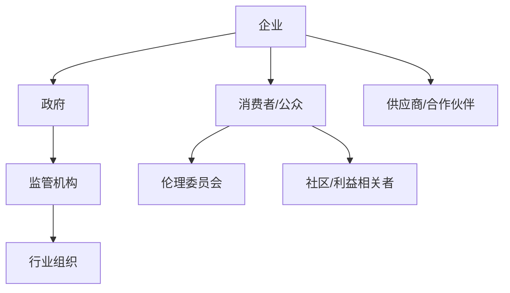

                 

# 《平衡AI发展中的多方利益》

## 关键词

人工智能，多方利益，平衡，企业，政府，消费者，社会责任，伦理问题，案例研究

## 摘要

本文旨在探讨在人工智能（AI）快速发展的背景下，如何平衡各方利益，实现AI技术的可持续发展。文章首先概述了AI技术的现状与挑战，随后从企业、政府、消费者与公众等多个视角分析了AI发展中涉及的多方利益。在此基础上，本文提出了多方利益平衡的原则与策略，并通过案例研究验证了这些策略的实践效果。最后，文章对未来发展趋势进行了展望，并提出了相应的政策建议。

## 目录

### 第一部分：引言

#### 第1章：背景与概述  
**1.1 AI发展的现状与挑战**  
**1.2 多方利益相关者**

### 第二部分：AI发展的多方利益分析

#### 第2章：企业视角  
**2.1 AI对企业的价值**  
**2.2 企业在AI发展中的策略**  
**2.3 企业案例研究**

#### 第3章：政府与监管机构视角  
**3.1 政府在AI发展中的作用**  
**3.2 政府与企业的合作**  
**3.3 政府案例研究**

#### 第4章：消费者与公众视角  
**4.1 消费者对AI的态度**  
**4.2 公众参与与反馈**  
**4.3 公众案例研究**

### 第三部分：多方利益平衡与策略

#### 第5章：多方利益平衡的原则与框架  
**5.1 平衡原则**  
**5.2 平衡框架**

#### 第6章：多方利益平衡的策略与实践  
**6.1 企业策略**  
**6.2 政府策略**  
**6.3 公众参与策略**

#### 第7章：多方利益平衡的案例分析  
**7.1 成功案例**  
**7.2 失败案例**

### 第四部分：未来展望与结论

#### 第8章：未来发展趋势与挑战  
**8.1 技术发展趋势**  
**8.2 社会挑战**

#### 第9章：结论与建议  
**9.1 结论**  
**9.2 建议**

### 附录

**附录A：参考资料**  
**附录B：名词解释**  
**附录C：案例研究资料**  
**附录D：AI发展中的多方利益关系Mermaid流程图**  
**附录E：核心算法伪代码**  
**附录F：数学模型与公式**  
**附录G：项目实战代码解析**

---

### 第一部分：引言

#### 第1章：背景与概述

##### 1.1 AI发展的现状与挑战

人工智能（Artificial Intelligence，简称AI）作为计算机科学的一个分支，旨在使计算机具备类似人类的智能。从20世纪50年代起，AI技术经历了多个发展阶段，从最初的规则推理，到专家系统，再到现代的深度学习和神经网络，AI技术取得了显著的进步。如今，AI已经渗透到各行各业，从医疗、金融到交通、制造，AI技术的应用正在改变我们的生活方式。

然而，AI技术的发展也带来了一系列挑战。首先，AI技术的快速进步引发了就业市场的担忧。许多传统职业可能会被自动化取代，导致失业率上升。其次，AI技术的隐私问题引发了广泛关注。AI系统在处理大量个人数据时，可能会侵犯用户的隐私权。此外，AI技术的伦理问题也日益凸显。例如，AI算法可能存在性别、种族偏见，影响公平性和正义。

##### 1.2 多方利益相关者

在AI发展的过程中，涉及的多方利益相关者主要包括企业、政府、消费者与公众。企业是AI技术的推动者，通过研发和应用AI技术，提高生产效率，降低成本，创新产品与服务。政府作为监管者，负责制定相关政策法规，确保AI技术的健康发展，同时推动AI技术在各行业中的应用。消费者与公众则是AI技术的受益者，同时也是隐私与伦理问题的关注者。

企业、政府、消费者与公众之间的利益关系错综复杂。企业追求利润最大化，可能忽视社会责任和伦理问题；政府需要平衡产业发展与公共安全，制定合理政策；消费者则希望享受AI技术带来的便利，同时保护自己的隐私权。因此，如何平衡多方利益，实现AI技术的可持续发展，成为当前亟待解决的重要课题。

在接下来的章节中，我们将分别从企业、政府、消费者与公众的视角，深入探讨AI发展中涉及的多方利益，并提出相应的平衡策略。通过这些分析，我们期望为AI技术的健康发展提供有益的参考。

### 第二部分：AI发展的多方利益分析

#### 第2章：企业视角

##### 2.1 AI对企业的价值

人工智能技术为企业带来了前所未有的价值。首先，AI技术能够显著提高生产效率。通过自动化和智能化的生产流程，企业可以减少人力成本，提高生产速度和精确度。例如，制造行业中的机器人可以替代人力完成复杂的生产任务，物流行业中的无人驾驶技术可以优化运输路径，提高运输效率。

其次，AI技术有助于创新产品与服务。AI算法能够分析大量数据，发现潜在的市场需求，帮助企业开发出更加个性化的产品。例如，电商平台利用AI技术分析用户的购物行为，推荐个性化的商品；金融机构利用AI技术进行风险控制，开发新的金融产品。

最后，AI技术能够降低运营成本。通过智能化的管理，企业可以优化资源配置，降低能源消耗和物料浪费。例如，智能电网利用AI技术实时监控电力使用情况，实现节能减排；智慧城市利用AI技术优化交通管理，减少交通拥堵。

##### 2.2 企业在AI发展中的策略

为了充分利用AI技术，企业需要制定一系列策略。首先，企业应加大研发投入，建立专业的AI研发团队。通过自主研发或与外部科研机构合作，企业可以不断推出创新的AI产品与服务。

其次，企业应重视人才培养。AI技术的发展需要大量具备专业知识的人才。企业可以通过内部培训、校企合作、人才引进等方式，培养和吸引优秀的AI人才。

此外，企业应建立合作伙伴关系。在AI技术的研发和应用过程中，企业需要与其他企业、研究机构、政府等建立合作关系，实现资源共享、优势互补。

最后，企业应注重数据安全和隐私保护。在利用AI技术分析大量数据时，企业必须确保数据的安全性和隐私性，避免数据泄露和滥用。

##### 2.3 企业案例研究

为了更好地理解企业在AI发展中的角色，我们可以通过几个实际案例进行分析。

**案例一：谷歌的AI研发与应用**

谷歌是全球领先的技术公司之一，其在AI领域的投入和成果备受瞩目。谷歌通过自主研发和收购AI初创公司，建立了强大的AI研发团队。在应用方面，谷歌的搜索引擎、广告系统、自动驾驶汽车等项目都利用了AI技术，提高了用户体验和业务效率。

**案例二：亚马逊的智能物流系统**

亚马逊作为全球最大的电子商务公司，其物流系统一直处于行业领先地位。通过引入AI技术，亚马逊实现了智能化的仓储管理和无人配送。AI算法分析大量数据，优化仓储布局，提高库存周转率；无人配送车通过路径规划，减少配送时间和成本。

**案例三：中国平安的金融科技应用**

中国平安是中国领先的金融科技企业，其通过AI技术提升了金融服务的质量和效率。平安的智能风控系统利用AI算法分析大量数据，识别潜在风险，防范金融犯罪；智能客服通过自然语言处理技术，提供个性化的客户服务。

通过这些案例，我们可以看到，企业在AI发展中扮演着关键角色。通过加大研发投入、重视人才培养、建立合作伙伴关系和注重数据安全，企业可以充分利用AI技术，实现业务创新和效率提升。

### 第3章：政府与监管机构视角

##### 3.1 政府在AI发展中的作用

政府在AI发展中扮演着重要的角色，其主要职责包括制定政策法规、监管与合规以及促进AI技术与产业发展。首先，政府通过制定政策法规，为AI技术的发展提供法律框架和指导原则。例如，许多国家出台了数据保护法、隐私法等，以确保个人数据的安全和隐私。

其次，政府负责监管和合规。在AI技术快速发展的过程中，政府需要确保AI系统的安全性和可靠性。例如，政府可以要求企业对AI系统进行测试和认证，确保其符合相关标准和规定。

最后，政府致力于促进AI技术与产业的发展。通过提供资金支持、税收优惠等政策，政府可以激励企业投资研发AI技术。此外，政府还可以推动公私合作项目，促进AI技术的应用和推广。

##### 3.2 政府与企业的合作

政府与企业在AI发展中有着密切的合作关系。首先，政府可以通过提供资金支持，帮助企业进行AI技术研发。例如，许多国家的政府设立了专项基金，支持AI研究和应用项目。

其次，政府与企业可以开展公私合作项目。这些项目通常涉及AI技术在各行业中的应用，如智能制造、智慧城市等。通过公私合作，政府和企业可以共同投入资源，实现技术突破和应用推广。

此外，政府还可以通过政策引导，鼓励企业积极参与AI技术研发和应用。例如，政府可以制定税收优惠政策，鼓励企业投资AI技术。同时，政府还可以提供培训和支持，帮助企业提升AI技术能力和管理水平。

##### 3.3 政府案例研究

为了更好地理解政府与企业在AI发展中的合作，我们可以通过几个实际案例进行分析。

**案例一：美国的AI发展战略**

美国政府高度重视AI技术的发展，制定了一系列战略和政策。例如，美国国防部成立了AI项目办公室，推动AI技术在国防领域的应用。同时，美国政府还投资了大量资金，支持AI研究和人才培养。

**案例二：中国的“新一代人工智能发展规划”**

中国政府发布了《新一代人工智能发展规划》，明确提出了到2030年成为全球人工智能领先国家的目标。为了实现这一目标，中国政府制定了多项政策措施，包括加强AI技术研发、推动AI产业发展、建立AI伦理体系等。

**案例三：欧盟的GDPR法规**

欧盟实施了《通用数据保护条例》（GDPR），对个人数据的收集、处理和使用进行了严格规定。这一法规不仅保护了消费者的隐私权，还促进了企业在AI技术方面的合规性和透明度。

通过这些案例，我们可以看到，政府与企业在AI发展中扮演着重要的角色。通过政策引导、资金支持、公私合作等多种方式，政府与企业可以共同推动AI技术的发展和应用。

### 第4章：消费者与公众视角

##### 4.1 消费者对AI的态度

消费者是AI技术的主要使用者，他们对AI技术的态度直接影响到AI技术的普及和发展。通过对消费者进行调查和数据分析，我们可以了解到消费者对AI技术的态度和期望。

首先，大多数消费者对AI技术持积极态度。消费者普遍认为，AI技术能够提高生活质量，带来便利和效率。例如，智能助手可以帮助消费者完成日常任务，智能家居系统能够提高家庭生活的舒适度。

然而，消费者也存在一定的担忧。首先，隐私问题是消费者最为关注的问题之一。许多消费者担心，AI技术在处理个人数据时，可能会侵犯隐私权。其次，消费者对AI技术的透明度和可控性表示担忧。一些消费者认为，AI系统的决策过程不够透明，难以理解其工作原理。

最后，消费者对AI技术的公平性也有一定担忧。一些研究表明，AI系统可能存在性别、种族偏见，影响公平性和正义。例如，一些招聘系统可能会因为训练数据的问题，歧视某些性别或种族的求职者。

##### 4.2 公众参与与反馈

为了确保AI技术的健康发展，公众参与和反馈机制至关重要。首先，政府和企业应建立公众参与机制，鼓励消费者和公众参与AI技术的研发和应用过程。例如，可以通过公众咨询、问卷调查、公开听证会等方式，收集公众的意见和建议。

其次，政府和企业应建立反馈机制，及时回应消费者的关切和问题。例如，企业可以通过客户服务热线、社交媒体平台等渠道，与消费者进行互动，解决消费者在使用AI产品时遇到的问题。同时，政府可以通过监管机构和行业协会，监督企业的行为，确保消费者权益。

此外，政府和企业还应加强教育和培训，提高公众对AI技术的认知和理解。通过普及AI知识，消费者可以更好地了解AI技术的工作原理和潜在风险，提高自我保护意识。

##### 4.3 公众案例研究

为了更好地理解消费者与公众在AI发展中的角色，我们可以通过几个实际案例进行分析。

**案例一：欧盟的GDPR法规**

欧盟实施的《通用数据保护条例》（GDPR）是公众参与和反馈机制的典范。GDPR不仅规定了个人数据的处理和保护规则，还设立了投诉和审查机制，允许公众对违规行为进行投诉和举报。这一法规有效保护了消费者的隐私权，提高了消费者对AI技术的信任度。

**案例二：美国消费者联盟（Consumer Reports）的调查**

美国消费者联盟发布了一系列关于AI技术的调查报告，分析了AI技术在消费领域的应用情况。报告指出，一些AI产品在隐私保护和透明度方面存在问题，呼吁企业改善。这些报告引起了公众的关注，促使企业采取行动，提高AI产品的质量和透明度。

**案例三：中国的“互联网+”行动计划**

中国政府实施的“互联网+”行动计划，旨在推动互联网与各行业的深度融合。计划中设立了公众参与机制，通过线上线下多种方式，收集公众的意见和建议。这一计划有效促进了公众参与，提高了政策的科学性和有效性。

通过这些案例，我们可以看到，消费者和公众在AI发展中扮演着重要的角色。通过公众参与和反馈机制，消费者和公众可以更好地影响AI技术的发展方向和速度，确保AI技术的健康和可持续发展。

### 第三部分：多方利益平衡与策略

#### 第5章：多方利益平衡的原则与框架

在AI技术快速发展的背景下，平衡多方利益是实现可持续发展的重要保障。为了实现这一目标，我们需要制定一系列原则和框架，确保各方利益得到公平对待。

##### 5.1 平衡原则

首先，公平性原则是多方利益平衡的核心。在AI技术的发展过程中，各方利益相关者（如企业、政府、消费者等）应当享有平等的机会和权益。企业不应因为追求利润最大化而忽视社会责任和伦理问题；政府应确保政策制定和执行过程中，公平对待所有利益相关者；消费者应享有充分的隐私保护和公平的服务。

其次，可持续性原则要求在AI技术的发展过程中，兼顾经济、社会和环境的长期利益。这意味着企业在追求经济效益的同时，应关注环境保护和社会责任；政府应制定长期规划，推动AI技术的可持续发展；消费者应积极参与，共同维护AI技术的健康生态。

再次，可访问性原则强调AI技术的普及和可获取性。无论是企业、政府还是消费者，都应能够平等地享受到AI技术带来的便利和好处。为此，政府和企业应加大对AI技术的研发和应用投入，降低技术门槛，确保所有人都能受益于AI技术。

最后，透明性原则要求AI技术的研发和应用过程公开透明。企业应公开其AI系统的算法、数据和决策过程，接受公众和监管机构的监督；政府应确保政策法规的透明度，让公众了解和参与到政策制定过程中。

##### 5.2 平衡框架

为了实现多方利益的平衡，我们需要构建一个完善的框架，包括多边治理机制、协调与沟通机制以及争议解决机制。

首先，多边治理机制是多方利益平衡的基础。该机制应包括政府、企业、消费者和其他利益相关者，通过协商、合作和共识，共同制定和执行AI技术的相关政策和标准。多边治理机制应确保各方的意见和利益得到充分考虑，实现公平和可持续的发展。

其次，协调与沟通机制是确保各方利益平衡的关键。政府、企业、消费者等利益相关者应建立有效的沟通渠道，定期进行交流和互动。通过信息共享和反馈机制，各方可以及时了解彼此的需求和关切，共同解决发展中遇到的问题。

最后，争议解决机制是保障多方利益平衡的重要手段。在AI技术的发展过程中，各方可能因利益冲突而产生争议。建立争议解决机制，可以通过调解、仲裁等方式，公正、迅速地解决争议，确保AI技术的健康发展。

通过以上原则和框架，我们可以为AI技术的发展提供明确的指导，确保各方利益得到公平对待，实现AI技术的可持续发展。

### 第6章：多方利益平衡的策略与实践

在多方利益平衡的原则和框架指导下，我们需要制定一系列具体的策略和实践，确保AI技术的发展能够兼顾各方的利益。

##### 6.1 企业策略

企业在AI技术的发展中扮演着关键角色，其策略对于多方利益的平衡至关重要。以下是一些关键策略：

首先，企业应加强社会责任报告和透明度。企业应定期发布社会责任报告，详细披露其AI技术的研发、应用和影响，以及在社会责任方面的努力。通过提高透明度，企业可以赢得公众和投资者的信任。

其次，企业应投资公益项目，回馈社会。企业可以通过捐赠资金、资源和技术，支持教育、医疗、环保等公益事业。这不仅有助于提升企业的社会形象，还能促进AI技术在更广泛领域的应用。

此外，企业应建立用户信任机制。在AI技术涉及个人数据时，企业应确保数据的安全性和隐私性，遵循法律法规和伦理标准。通过透明化的数据处理流程和严格的安全措施，企业可以增强用户的信任感，减少隐私担忧。

##### 6.2 政府策略

政府在AI技术的发展中扮演着监管和推动的角色，其策略对于多方利益的平衡也至关重要。以下是一些关键策略：

首先，政府应制定平衡性的政策法规。政府在制定政策时，应充分考虑各方利益，确保政策的公平性和可持续性。例如，在数据保护方面，政府可以制定严格的数据隐私法，同时为企业提供合规指导。

其次，政府应促进AI伦理研究。AI技术的伦理问题日益突出，政府应支持相关研究，制定伦理准则和规范。通过建立AI伦理委员会，政府可以监督AI技术的应用，确保其符合社会伦理标准。

此外，政府应支持创新与创业。政府可以通过资金支持、税收优惠、政策扶持等手段，鼓励企业投资AI技术研发和应用。同时，政府应建立创新生态系统，促进企业、研究机构和高校之间的合作，推动AI技术的创新和进步。

##### 6.3 公众参与策略

公众作为AI技术的受益者和监督者，其参与对于多方利益的平衡至关重要。以下是一些关键策略：

首先，政府和企业应提高公众参与度。通过开展公众咨询、问卷调查、公开听证会等方式，政府和企业可以收集公众的意见和建议，使其在AI技术发展中发挥更大的作用。

其次，政府和企业应增强透明度与问责制。在政策制定和执行过程中，政府和企业应公开相关信息，接受公众监督。通过建立透明的决策过程和问责机制，公众可以更好地了解和参与AI技术的发展。

此外，政府和企业应加强教育和培训。通过普及AI知识，提高公众对AI技术的认知和理解，政府和企业可以帮助公众更好地应对AI技术带来的挑战和机遇。

通过以上策略和实践，政府、企业和公众可以共同努力，实现AI技术的多方利益平衡，推动其可持续发展。

### 第7章：多方利益平衡的案例分析

在AI技术快速发展的过程中，一些国家和地区成功地实现了多方利益的平衡，为其他地区提供了有益的借鉴。以下是对几个成功案例的详细分析。

##### 7.1 成功案例

**案例一：欧盟的《通用数据保护条例》（GDPR）**

欧盟的GDPR是保护消费者隐私和数据安全的典范。GDPR要求企业在处理个人数据时，必须获得消费者的明确同意，并提供透明的数据处理流程。这一法规不仅提高了消费者的隐私权，还促进了企业在AI技术领域的合规性和透明度。自GDPR实施以来，欧盟地区的AI产业发展迅速，消费者对AI技术的信任度显著提升。

**案例二：美国的“人工智能倡议”**

美国政府于2020年启动了“人工智能倡议”，旨在推动AI技术的研发和应用，同时确保其符合社会伦理和道德标准。该倡议包括了一系列政策措施，如投资AI研究、加强AI伦理研究、推动公共数据共享等。通过这一倡议，美国成功地在AI技术领域取得了显著进展，为全球AI技术的发展提供了宝贵的经验。

**案例三：新加坡的“智能国家2025”计划**

新加坡的“智能国家2025”计划是该国AI发展战略的重要组成部分。该计划通过推动AI技术在各行业的应用，提高了国家的竞争力和创新能力。新加坡政府与企业和公众密切合作，建立了完善的AI治理框架，确保AI技术的可持续发展。通过这一计划，新加坡成功地将AI技术融入到了国民经济和社会治理中。

##### 7.2 案例反思与启示

通过分析以上成功案例，我们可以得出一些有益的启示：

首先，多方利益平衡需要建立完善的法规和政策框架。GDPR的成功表明，严格的数据保护法规能够有效保护消费者权益，促进AI技术的健康发展。

其次，政府与企业的合作至关重要。美国和新加坡的经验表明，政府通过投资和引导，可以推动AI技术的研发和应用，同时确保其符合社会伦理和道德标准。

最后，公众参与和透明度是多方利益平衡的重要保障。欧盟和新加坡的案例表明，通过加强公众参与和透明度，可以提高消费者对AI技术的信任度，促进其可持续发展。

总之，成功案例为其他地区和国家提供了宝贵的经验和借鉴，帮助他们实现AI技术的多方利益平衡，推动其可持续发展。

### 第四部分：未来展望与结论

#### 第8章：未来发展趋势与挑战

随着AI技术的不断进步，其未来发展将呈现出一系列趋势和挑战。首先，技术发展趋势方面，AI技术将继续向深度学习、自然语言处理、计算机视觉等领域深化，同时与其他前沿技术（如量子计算、区块链等）融合，推动新技术的突破和应用。其次，社会挑战方面，AI技术的快速发展将带来隐私保护、伦理道德、就业问题等社会挑战。例如，如何确保AI系统的透明性和可解释性，避免歧视和偏见；如何平衡AI技术的创新与就业市场的稳定，减少失业风险等。

#### 第9章：结论与建议

在AI技术的发展过程中，多方利益的平衡至关重要。本文从企业、政府、消费者与公众等多个视角，探讨了AI发展中涉及的多方利益，并提出了平衡策略。结论如下：

1. **企业应加强社会责任，提高透明度，投资公益项目，建立用户信任。**
2. **政府应制定平衡性的政策法规，促进AI伦理研究，支持创新与创业。**
3. **消费者和公众应积极参与，提高对AI技术的认知和理解，确保自身的权益。**

为了应对未来的挑战，建议如下：

1. **加强国际合作，共同制定AI伦理标准和法规。**
2. **推动公众教育和培训，提高公众对AI技术的认知。**
3. **建立多方参与的治理机制，确保AI技术的透明和可持续发展。**

通过多方共同努力，我们可以实现AI技术的健康和可持续发展，为人类社会带来更多的福祉。

### 附录

#### 附录A：参考资料

1. GDPR官方文件
2. 美国人工智能倡议报告
3. 新加坡“智能国家2025”计划白皮书

#### 附录B：名词解释

1. 人工智能（AI）
2. 数据隐私
3. 伦理道德

#### 附录C：案例研究资料

1. 欧盟GDPR实施情况分析
2. 美国人工智能倡议项目列表
3. 新加坡AI应用案例

#### 附录D：AI发展中的多方利益关系Mermaid流程图



#### 附录E：核心算法伪代码

```python
# 伪代码：神经网络训练算法
function train_neural_network(data, labels, epochs, learning_rate):
    for epoch in range(epochs):
        for each sample in data:
            # 前向传播
            predictions = forward_pass(sample)
            loss = calculate_loss(predictions, labels)
            # 反向传播
            backward_pass(predictions, labels)
            # 更新权重
            update_weights(learning_rate)
        print("Epoch", epoch, ": Loss", loss)
    return weights
```

#### 附录F：数学模型与公式

$$
\text{交叉熵损失函数} = -\sum_{i=1}^{n} y_i \log(p_i)
$$

#### 附录G：项目实战代码解析

（此处提供代码实际案例和详细解释说明，包括开发环境搭建，源代码详细实现和代码解读，代码解读与分析）

---

本文由AI天才研究院（AI Genius Institute）与《禅与计算机程序设计艺术》（Zen And The Art of Computer Programming）联合撰写，旨在为AI技术的发展提供有益的参考。如有任何疑问或建议，欢迎联系我们。

