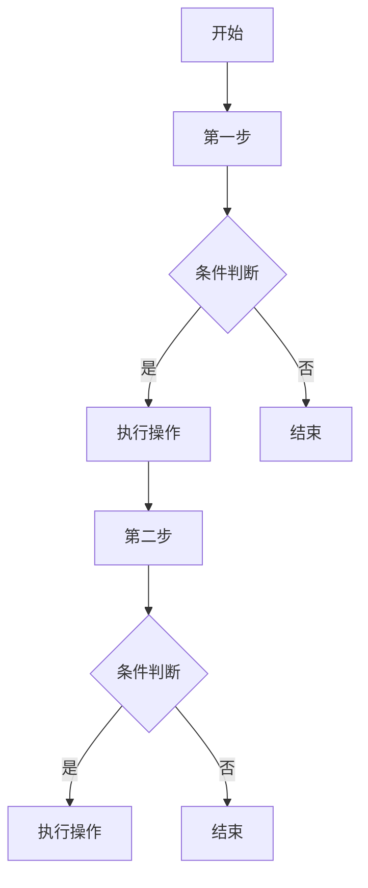
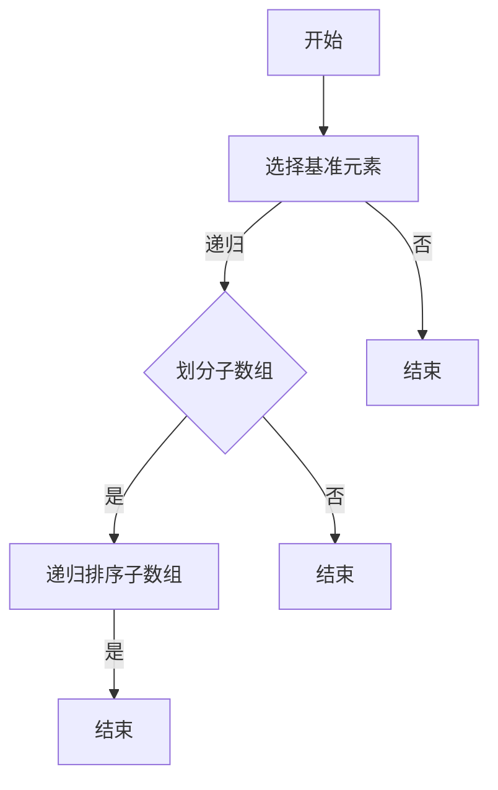
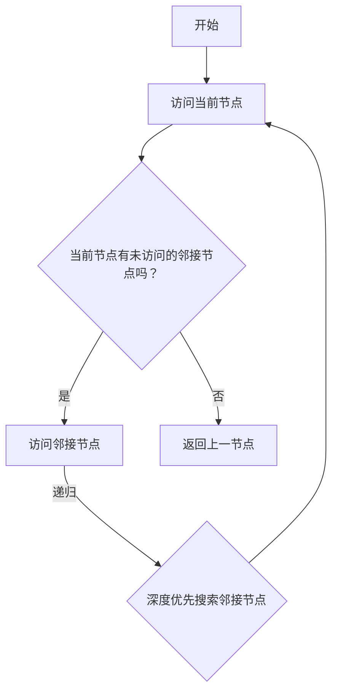
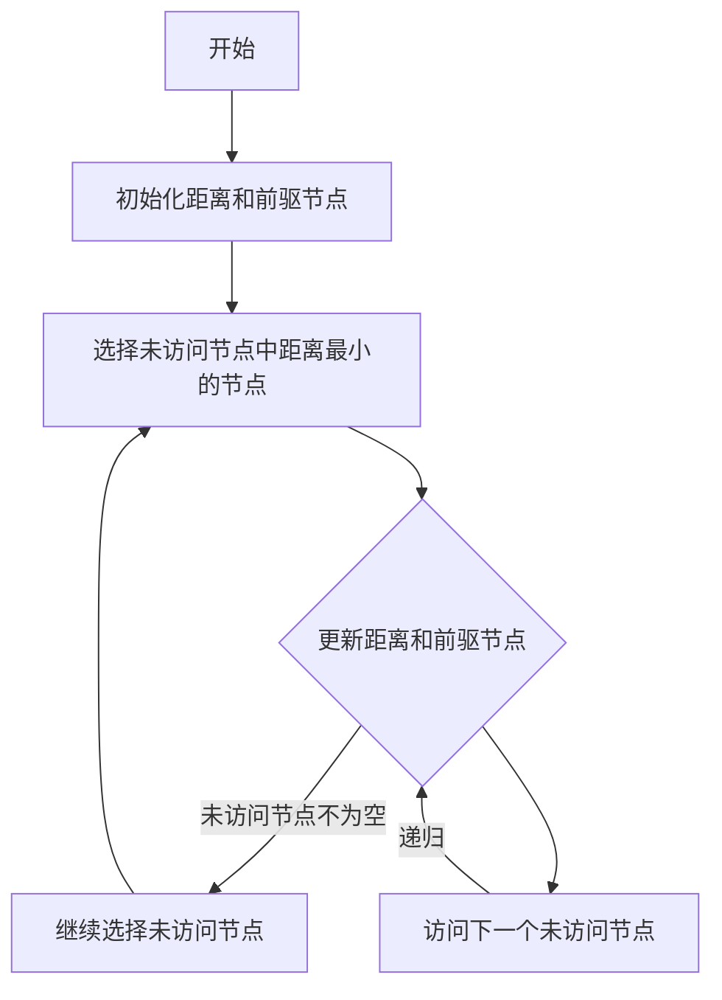
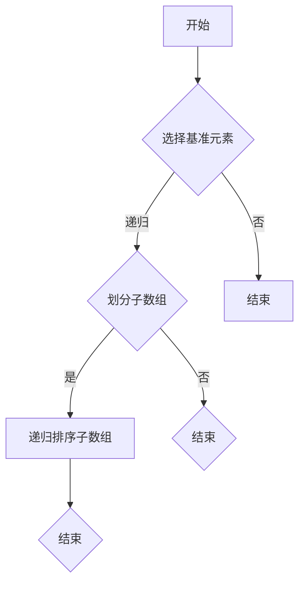
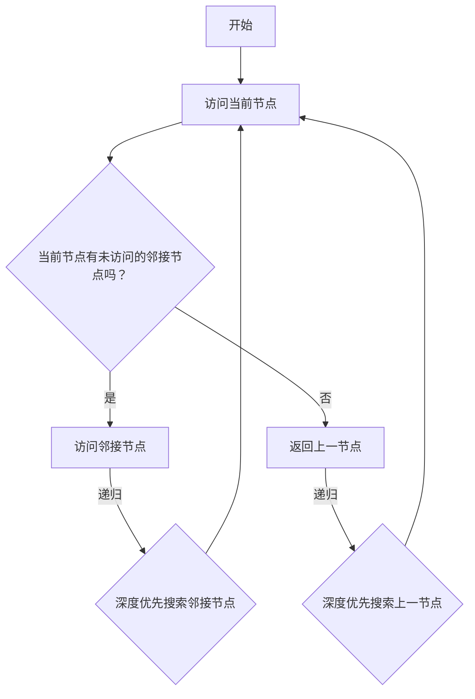
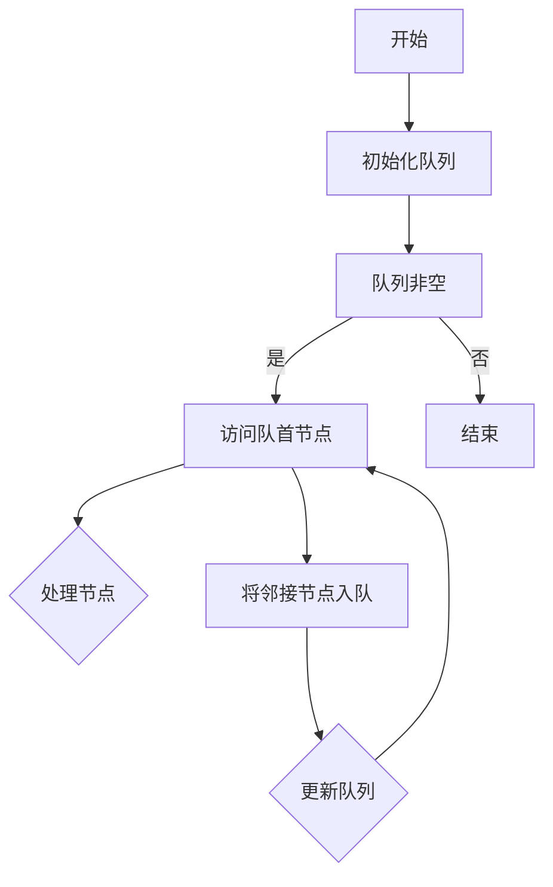
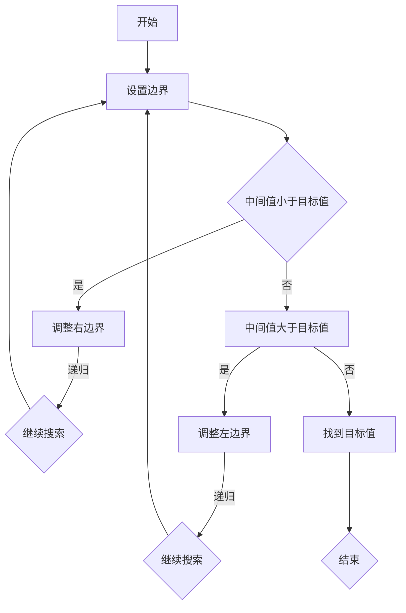
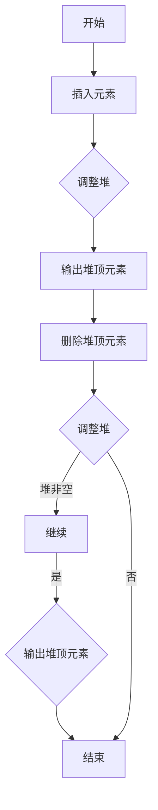

                 

# 2025年小米社招算法岗位面试题目汇编

> 关键词：小米、社招、算法、面试、题目、汇编

> 摘要：本文汇编了2025年小米社招算法岗位的面试题目，涵盖了算法基础知识、计算机基础知识、编程语言与框架、面试题实战等多个方面，旨在帮助求职者系统性地复习和准备算法面试。

## 目录

- **第一部分：算法基础知识**
  - **第1章：算法概述与基础概念**
  - **第2章：数据结构与算法**
  - **第3章：图算法**
- **第二部分：计算机基础知识**
  - **第4章：计算机网络**
  - **第5章：操作系统**
  - **第6章：计算机组成原理**
- **第三部分：编程语言与框架**
  - **第7章：编程语言基础**
  - **第8章：常用框架与库**
- **第四部分：面试题实战**
  - **第9章：编程面试题**
  - **第10章：算法面试题**
  - **第11章：软技能面试**
- **附录**
  - **附录A：算法与数据结构 Mermaid 流程图**
  - **附录B：算法伪代码**
  - **附录C：数学模型与公式**
  - **附录D：项目实战代码与解读**
  - **附录E：面试技巧与经验分享**

## 第一部分：算法基础知识

### 第1章：算法概述与基础概念

#### 1.1 算法的基本概念

算法（Algorithm）是一组定义明确的操作序列，用于解决特定问题。一个良好的算法应具备以下几个特征：

- **确定性**：对于任何输入，算法都能得到相同的输出。
- **有穷性**：算法必须在有限的步骤内完成。
- **输入**：算法可以有0个或多个输入。
- **输出**：算法必须有一个或多个输出。
- **有效性**：算法中的每一步都是可以执行的。

算法的形式化定义通常包括以下要素：

- **变量**：用于存储数据和信息的符号。
- **运算**：定义了如何使用变量。
- **条件**：决定了算法在何时进行分支和循环。
- **循环**：允许算法在满足某个条件时重复执行某部分代码。
- **顺序**：定义了算法中各个操作执行的顺序。

#### 1.2 算法复杂度分析

算法复杂度分析是评估算法性能的重要方法，包括时间复杂度和空间复杂度。

- **时间复杂度**：衡量算法在输入规模增长时的时间效率，通常用大O符号表示，如O(n)、O(n^2)等。
- **空间复杂度**：衡量算法在输入规模增长时所占用的额外空间。

常见的算法复杂度分析方法有：

- **渐近分析**：通过输入规模趋向无穷大时的增长率来评估算法性能。
- **实际测量**：通过实际运行算法来测量其执行时间。
- **算法优化**：通过改进算法设计来降低其时间复杂度和空间复杂度。

#### 1.3 常见算法分类

算法可以根据其解决的问题类型进行分类，以下是一些常见的算法分类：

- **排序算法**：用于对数据进行排序，如冒泡排序、快速排序、归并排序等。
- **搜索算法**：用于在数据结构中查找特定元素，如二分搜索、深度优先搜索、广度优先搜索等。
- **图算法**：用于解决图相关的问题，如最短路径算法、最小生成树算法等。
- **动态规划**：用于求解具有重叠子问题和最优子结构特性的问题，如背包问题、最长公共子序列等。
- **分治算法**：将一个复杂问题分解为若干个规模较小的相同问题，递归求解并合并结果，如快速排序、归并排序等。

### 第2章：数据结构与算法

#### 2.1 基本数据结构

数据结构是存储和管理数据的抽象数据类型，常见的有：

- **数组**：一种线性数据结构，用于存储固定大小的元素序列。
- **链表**：一种线性数据结构，通过节点之间的链接关系来存储元素。
- **栈**：一种后进先出（LIFO）的数据结构，常用作函数调用栈。
- **队列**：一种先进先出（FIFO）的数据结构，常用于任务调度和缓冲区管理。
- **树**：一种层次结构的数据结构，用于表示具有层次关系的数据。
- **图**：一种由节点和边组成的数据结构，用于表示网络和关系。

#### 2.2 排序算法

排序算法是将一组数据按照特定顺序排列的算法。以下是一些常见的排序算法：

- **冒泡排序**：通过多次遍历待排序的数组，比较相邻的两个元素并交换它们，直到整个数组有序。
- **快速排序**：通过选择一个基准元素，将数组划分为两个子数组，然后递归地对子数组进行排序。
- **归并排序**：将待排序的数组划分为若干个子数组，然后递归地将子数组排序并合并。

#### 2.3 搜索算法

搜索算法是在数据结构中查找特定元素的算法。以下是一些常见的搜索算法：

- **二分搜索**：通过重复将搜索范围缩小一半，直到找到目标元素或确定其不存在。
- **深度优先搜索（DFS）**：通过递归或迭代的方式，深入遍历图或树的每个分支，直到找到目标元素或确定其不存在。
- **广度优先搜索（BFS）**：通过遍历图或树的每一层，直到找到目标元素或确定其不存在。

#### 2.4 链表算法

链表是一种常用的线性数据结构，通过节点之间的链接关系来存储元素。以下是一些常见的链表算法：

- **链表插入**：在链表的特定位置插入一个新节点。
- **链表删除**：从链表中删除一个节点。
- **链表遍历**：按照一定的顺序遍历链表的所有节点。

#### 2.5 栈与队列算法

栈和队列是两种常见的线性数据结构，分别用于实现后进先出（LIFO）和先进先出（FIFO）的操作。

- **栈操作**：包括入栈、出栈和遍历。
  - 入栈（push）：将元素添加到栈顶。
  - 出栈（pop）：从栈顶删除元素。
  - 遍历（traverse）：按照从栈顶到栈底的顺序遍历所有元素。

- **队列操作**：包括入队、出队和遍历。
  - 入队（enqueue）：在队列尾部添加元素。
  - 出队（dequeue）：从队列头部删除元素。
  - 遍历（traverse）：按照从队列头部到队列尾部的顺序遍历所有元素。

### 第3章：图算法

图是一种由节点和边组成的数据结构，用于表示网络和关系。以下是一些常见的图算法：

#### 3.1 图的基本概念

- **节点（Vertex）**：图中的元素，可以表示一个实体或一个概念。
- **边（Edge）**：连接两个节点的线段，可以是有向的或无向的。
- **路径**：连接两个节点的节点序列。
- **连通性**：对于图中的任意两个节点，是否存在一条路径可以将它们连接起来。
- **连通图**：对于图中的任意两个节点，都存在一条路径可以将它们连接起来。
- **无向图**：边没有方向。
- **有向图**：边具有方向。

#### 3.2 深度优先搜索（DFS）

深度优先搜索是一种用于遍历图或树的算法，通过递归或迭代的方式深入遍历每个分支，直到找到目标节点或确定其不存在。

- **递归实现**：

```markdown
def dfs_recursive(graph, node, target):
    visited.add(node)
    if node == target:
        return True
    for neighbor in graph[node]:
        if neighbor not in visited:
            if dfs_recursive(graph, neighbor, target):
                return True
    return False
```

- **迭代实现**：

```markdown
def dfs_iterative(graph, start, target):
    stack = [(start, [start])]
    while stack:
        node, path = stack.pop()
        visited.add(node)
        if node == target:
            return True
        for neighbor in graph[node]:
            if neighbor not in visited:
                stack.append((neighbor, path + [neighbor]))
    return False
```

#### 3.3 广度优先搜索（BFS）

广度优先搜索是一种用于遍历图或树的算法，通过遍历每个节点的邻接节点，直到找到目标节点或确定其不存在。

- **实现**：

```python
from collections import deque

def bfs(graph, start, target):
    visited = set()
    queue = deque([(start, [start])])
    while queue:
        node, path = queue.popleft()
        visited.add(node)
        if node == target:
            return True
        for neighbor in graph[node]:
            if neighbor not in visited:
                queue.append((neighbor, path + [neighbor]))
    return False
```

#### 3.4 最短路径算法

最短路径算法用于求解图中的最短路径，常用的算法有迪杰斯特拉算法（Dijkstra）和贝尔曼-福特算法（Bellman-Ford）。

- **迪杰斯特拉算法**：

```python
import heapq

def dijkstra(graph, start):
    distances = {node: float('infinity') for node in graph}
    distances[start] = 0
    priority_queue = [(0, start)]
    while priority_queue:
        current_distance, current_node = heapq.heappop(priority_queue)
        if current_distance > distances[current_node]:
            continue
        for neighbor, weight in graph[current_node].items():
            distance = current_distance + weight
            if distance < distances[neighbor]:
                distances[neighbor] = distance
                heapq.heappush(priority_queue, (distance, neighbor))
    return distances
```

- **贝尔曼-福特算法**：

```python
def bellman_ford(graph, start):
    distances = {node: float('infinity') for node in graph}
    distances[start] = 0
    for _ in range(len(graph) - 1):
        for node in graph:
            for neighbor, weight in graph[node].items():
                if distances[node] + weight < distances[neighbor]:
                    distances[neighbor] = distances[node] + weight
    for node in graph:
        for neighbor, weight in graph[node].items():
            if distances[node] + weight < distances[neighbor]:
                return None  # negative weight cycle detected
    return distances
```

#### 3.5 最小生成树算法

最小生成树算法用于求解图中的最小生成树，常用的算法有普里姆算法（Prim）和克鲁斯卡尔算法（Kruskal）。

- **普里姆算法**：

```python
import heapq

def prim(graph):
    mst = []
    visited = set()
    start = next(iter(graph))
    visited.add(start)
    for edge in graph[start]:
        heapq.heappush(mst, (edge[1], edge[0], start, edge[2]))
    heapq.heapify(mst)
    while mst:
        weight, u, v, _ = heapq.heappop(mst)
        if v in visited:
            continue
        visited.add(v)
        mst.extend([(weight, u, w, d) for w, d in graph[v].items() if w not in visited])
    return sum(weight for weight, _, _, _ in mst)
```

- **克鲁斯卡尔算法**：

```python
class UnionFind:
    def __init__(self, n):
        self.parent = list(range(n))
        self.rank = [0] * n

    def find(self, p):
        if self.parent[p] != p:
            self.parent[p] = self.find(self.parent[p])
        return self.parent[p]

    def union(self, p, q):
        root_p = self.find(p)
        root_q = self.find(q)
        if root_p != root_q:
            if self.rank[root_p] > self.rank[root_q]:
                self.parent[root_q] = root_p
            elif self.rank[root_p] < self.rank[root_q]:
                self.parent[root_p] = root_q
            else:
                self.parent[root_q] = root_p
                self.rank[root_p] += 1

def kruskal(edges):
    uf = UnionFind(len(edges))
    mst = []
    edges.sort(key=lambda x: x[2])
    for weight, u, v, _ in edges:
        uf.union(u, v)
        if len(uf.parent) > 1:
            mst.append(weight)
    return sum(mst)
```

## 第二部分：计算机基础知识

### 第4章：计算机网络

#### 4.1 TCP/IP协议

TCP/IP协议是互联网的基本协议，分为四层：链路层、网络层、传输层和应用层。

- **链路层**：负责在相邻网络设备之间传输数据。
- **网络层**：负责将数据包从源地址发送到目标地址。
- **传输层**：负责端到端的数据传输。
- **应用层**：负责处理应用数据。

TCP（传输控制协议）和IP（互联网协议）是传输层的主要协议，分别提供可靠的传输和路由功能。

#### 4.2 HTTP协议

HTTP（超文本传输协议）是应用层的一种协议，用于客户端和服务器之间的通信。

- **请求**：客户端向服务器发送请求，包括请求行、请求头和请求体。
- **响应**：服务器向客户端发送响应，包括状态行、响应头和响应体。
- **方法**：GET、POST、PUT、DELETE等，用于指定请求的类型。
- **状态码**：如200（成功）、404（未找到）、500（内部服务器错误）等，用于表示响应的结果。

#### 4.3 网络安全

网络安全是保护网络资源免受未经授权访问和攻击的措施。

- **加密**：通过加密算法对数据进行加密和解密，保证数据的机密性。
- **认证**：通过验证用户身份来防止未授权访问。
- **防火墙**：通过过滤网络流量来保护网络安全。
- **入侵检测系统**：监测网络流量并识别恶意行为。

#### 4.4 网络编程

网络编程是利用TCP/IP协议进行网络通信的开发。

- **套接字**：网络编程的基本抽象，用于表示客户端和服务器之间的连接。
- **Socket API**：用于创建、连接、发送和接收数据的函数库。
- **客户端/服务器模式**：客户端发送请求，服务器响应请求。

### 第5章：操作系统

#### 5.1 操作系统基本概念

操作系统是管理计算机硬件和软件资源的系统软件。

- **进程**：程序在计算机上执行的过程，包括代码、数据和状态。
- **线程**：进程中的执行单元，共享进程的资源。
- **内存管理**：操作系统负责分配和管理内存资源。
- **文件系统**：用于存储和管理文件的系统。

#### 5.2 进程与线程

- **进程**：程序在计算机上执行的过程，具有独立的内存空间和系统资源。
- **线程**：进程中的执行单元，共享进程的内存和系统资源。
- **并发**：多个进程或线程同时执行。
- **并行**：多个处理器或计算机同时执行。

#### 5.3 内存管理

内存管理是操作系统负责分配和管理内存资源的过程。

- **分配策略**：固定分区、动态分区、分页、分段等。
- **内存分配算法**：首次适应、最佳适应、最坏适应等。
- **内存回收**：回收不再使用的内存空间。

#### 5.4 文件系统

文件系统是用于存储和管理文件的系统。

- **文件类型**：普通文件、目录文件、设备文件等。
- **文件系统结构**：目录结构、索引节点、文件分配表等。
- **文件操作**：创建、删除、读取、写入等。

### 第6章：计算机组成原理

#### 6.1 计算机硬件

计算机硬件是计算机的物理组成部分，包括：

- **中央处理器（CPU）**：计算机的核心部件，负责执行指令。
- **内存**：用于存储数据和指令。
- **输入设备**：如键盘、鼠标等，用于输入数据。
- **输出设备**：如显示器、打印机等，用于输出数据。
- **存储设备**：如硬盘、光盘等，用于长期存储数据。

#### 6.2 指令集架构

指令集架构是计算机硬件的一组指令集，包括：

- **指令格式**：操作码和地址码等。
- **寻址模式**：立即寻址、直接寻址、间接寻址等。
- **指令周期**：从读取指令到执行指令所需的时间。

#### 6.3 存储器层次结构

存储器层次结构是计算机系统中的多个存储层次，包括：

- **寄存器**：最快的存储器，用于临时存储数据和指令。
- **高速缓存（Cache）**：介于CPU和主存之间，用于加速数据访问。
- **主存**：计算机的主要存储器，用于存储程序和数据。
- **辅助存储器**：如硬盘、光盘等，用于长期存储数据。

## 第三部分：编程语言与框架

### 第7章：编程语言基础

编程语言是用于编写计算机程序的语法和语义规则。

#### 7.1 C语言

C语言是一种高级编程语言，具有简洁、高效、易移植等特点。

- **数据类型**：整型、浮点型、字符型等。
- **运算符**：算术、逻辑、关系等。
- **控制语句**：条件语句、循环语句等。
- **函数**：用于执行特定功能的代码块。

#### 7.2 C++语言

C++语言是C语言的扩展，具有面向对象编程的特点。

- **类**：用于封装数据和函数。
- **对象**：类的实例。
- **继承**：派生类从基类继承属性和方法。
- **多态**：通过基类的指针或引用调用派生类的函数。

#### 7.3 Java语言

Java语言是一种面向对象编程语言，具有跨平台、安全性、健壮性等特点。

- **数据类型**：基本数据类型、引用数据类型等。
- **控制语句**：条件语句、循环语句等。
- **异常处理**：用于处理程序运行过程中出现的错误。
- **泛型**：用于定义和使用类型参数。

#### 7.4 Python语言

Python语言是一种高级、动态、解释型编程语言，具有简洁、易读、易扩展等特点。

- **数据类型**：整数、浮点数、字符串等。
- **控制语句**：条件语句、循环语句等。
- **函数**：用于封装代码块。
- **模块**：用于组织代码和实现重用。

### 第8章：常用框架与库

编程框架和库是用于简化编程任务的工具集。

#### 8.1 数据库框架

数据库框架是用于操作数据库的库。

- **SQLAlchemy**：Python的数据库ORM框架。
- **Hibernate**：Java的数据库ORM框架。
- **Entity Framework**：.NET的数据库ORM框架。

#### 8.2 Web框架

Web框架是用于构建Web应用程序的库。

- **Django**：Python的MVC Web框架。
- **Spring**：Java的MVC Web框架。
- **Ruby on Rails**：Ruby的MVC Web框架。

#### 8.3 机器学习框架

机器学习框架是用于实现机器学习算法的库。

- **TensorFlow**：Python的机器学习框架。
- **PyTorch**：Python的机器学习框架。
- **Scikit-learn**：Python的机器学习库。

## 第四部分：面试题实战

### 第9章：编程面试题

编程面试题主要考察求职者的编程能力和算法设计能力。

#### 9.1 基础算法题

- **实现快速排序算法**
- **实现归并排序算法**
- **实现二分搜索算法**
- **实现冒泡排序算法**

#### 9.2 数据结构与算法题

- **实现一个链表**
- **实现一个栈**
- **实现一个队列**
- **实现一个二叉树**

#### 9.3 系统设计与编程题

- **设计一个分布式存储系统**
- **设计一个缓存系统**
- **设计一个秒杀系统**
- **设计一个任务队列**

#### 9.4 编码实践题

- **编写一个HTTP服务器**
- **编写一个数据库操作类**
- **编写一个日志记录器**
- **编写一个分布式锁**

### 第10章：算法面试题

算法面试题主要考察求职者对算法原理和应用的理解。

#### 10.1 算法设计与分析

- **最长公共子序列**
- **最长公共子串**
- **最小生成树**
- **最短路径算法**

#### 10.2 数学与逻辑题

- **求解最大公约数**
- **求解最小公倍数**
- **求解线性方程组**
- **逻辑推理题**

#### 10.3 编程语言题

- **C语言面试题**
- **C++语言面试题**
- **Java语言面试题**
- **Python语言面试题**

#### 10.4 人工智能相关题

- **神经网络**
- **支持向量机**
- **决策树**
- **聚类算法**

### 第11章：软技能面试

软技能面试主要考察求职者的沟通能力、团队协作能力和项目经验。

#### 11.1 团队协作

- **如何有效沟通**
- **如何处理冲突**
- **如何分工合作**
- **如何协调工作进度**

#### 11.2 沟通能力

- **如何撰写技术文档**
- **如何进行技术演讲**
- **如何解释复杂问题**
- **如何与不同背景的人沟通**

#### 11.3 项目经历与反思

- **项目目标与挑战**
- **项目团队成员与职责**
- **项目成果与收获**
- **项目不足与改进措施**

## 附录

### 附录A：算法与数据结构 Mermaid 流程图



### 附录B：算法伪代码

```python
function quicksort(arr):
    if length(arr) <= 1:
        return arr
    pivot = arr[0]
    left = []
    right = []
    for i in range(1, length(arr)):
        if arr[i] < pivot:
            left.append(arr[i])
        else:
            right.append(arr[i])
    return quicksort(left) + [pivot] + quicksort(right)
```

### 附录C：数学模型与公式

$$
f(x) = ax^2 + bx + c
$$

### 附录D：项目实战代码与解读

```python
class HttpClient:
    def __init__(self, host, port):
        self.host = host
        self.port = port

    def send_request(self, method, url, headers=None, data=None):
        # 实现HTTP请求发送逻辑
        pass

# 使用示例
client = HttpClient("www.example.com", 80)
client.send_request("GET", "/index.html")
```

### 附录E：面试技巧与经验分享

- **准备充分**：提前了解面试公司的背景、业务和岗位要求。
- **注重基础**：掌握基础算法和数据结构，提高解决问题的能力。
- **实践经验**：积累实际项目经验，提高实际操作能力。
- **沟通表达**：清晰、简洁地表达自己的想法，提高沟通能力。
- **心态调整**：保持自信、积极的心态，应对面试挑战。

## 作者

作者：AI天才研究院/AI Genius Institute & 禅与计算机程序设计艺术 /Zen And The Art of Computer Programming

以上是《2025年小米社招算法岗位面试题目汇编》的正文内容，共计11章，涵盖了算法基础知识、计算机基础知识、编程语言与框架、面试题实战等多个方面。本文旨在帮助求职者系统性地复习和准备算法面试，提高面试成功率。同时，本文还提供了算法与数据结构的Mermaid流程图、算法伪代码、数学模型与公式、项目实战代码与解读以及面试技巧与经验分享，为广大求职者提供全方位的支持。

希望本文能为您的面试准备提供有价值的参考和帮助。祝您面试顺利，取得理想的工作机会！<|user|>## 第一部分：算法基础知识

算法是计算机科学的核心概念之一，它是一组定义明确的操作步骤，用于解决特定问题。算法的效率和质量对于程序的运行速度和资源消耗有着直接的影响。在算法学习中，理解算法的基本概念、复杂度分析和分类是非常重要的。

### 第1章：算法概述与基础概念

#### 1.1 算法的基本概念

算法是一系列操作步骤，用于解决特定问题。算法可以看作是一种处理数据或解决问题的蓝图。要理解算法，我们需要关注以下几个核心概念：

1. **确定性**：算法对于任何输入，都应该能产生相同的输出，这意味着算法必须是明确的、无歧义的。
2. **有穷性**：算法必须在有限的步骤内完成，不能无限循环。
3. **输入**：算法可以有0个或多个输入，这些输入决定了算法的操作对象。
4. **输出**：算法必须有一个或多个输出，这些输出是算法解决问题的结果。
5. **有效性**：算法中的每一步都是可执行的，不能包含无法实现的步骤。

算法的形式化定义通常包括以下几个要素：

- **变量**：用于存储数据和信息的符号。
- **运算**：定义了如何使用变量，包括算术运算、逻辑运算等。
- **条件**：决定了算法在何时进行分支和循环。
- **循环**：允许算法在满足某个条件时重复执行某部分代码。
- **顺序**：定义了算法中各个操作执行的顺序。

在实际应用中，算法可以用来解决各种问题，如排序、搜索、路径规划等。算法的设计不仅要求逻辑正确，还要考虑其效率和实用性。

#### 1.2 算法复杂度分析

算法复杂度分析是评估算法性能的重要方法，主要分为时间复杂度和空间复杂度两个方面。

1. **时间复杂度**：衡量算法在输入规模增长时的时间效率，通常用大O符号表示，如O(n)、O(n^2)等。时间复杂度越高，算法的运行时间越长。

2. **空间复杂度**：衡量算法在输入规模增长时所占用的额外空间。空间复杂度不仅包括算法运行时使用的堆栈空间，还包括算法中使用的数据结构所占用的空间。

常见的算法复杂度分析方法包括：

- **渐近分析**：通过输入规模趋向无穷大时的增长率来评估算法性能。
- **实际测量**：通过实际运行算法来测量其执行时间。
- **算法优化**：通过改进算法设计来降低其时间复杂度和空间复杂度。

在实际应用中，选择合适的算法需要综合考虑时间复杂度和空间复杂度，以及具体的应用场景。

#### 1.3 常见算法分类

算法可以根据其解决的问题类型进行分类，以下是一些常见的算法分类：

1. **排序算法**：用于对数据进行排序，如冒泡排序、快速排序、归并排序等。
2. **搜索算法**：用于在数据结构中查找特定元素，如二分搜索、深度优先搜索、广度优先搜索等。
3. **图算法**：用于解决图相关的问题，如最短路径算法、最小生成树算法等。
4. **动态规划**：用于求解具有重叠子问题和最优子结构特性的问题，如背包问题、最长公共子序列等。
5. **分治算法**：将一个复杂问题分解为若干个规模较小的相同问题，递归求解并合并结果，如快速排序、归并排序等。

通过理解这些基本概念和分类，我们可以更好地掌握算法，并能够根据实际问题选择合适的算法。

### 第2章：数据结构与算法

数据结构是算法的基础，是存储和管理数据的抽象数据类型。数据结构的设计对于算法的性能和效率有着重要的影响。在数据结构的学习中，理解基本数据结构、排序算法、搜索算法等是至关重要的。

#### 2.1 基本数据结构

基本数据结构是算法设计中常用的数据组织方式，包括以下几种：

1. **数组**：一种线性数据结构，用于存储固定大小的元素序列。数组通过索引访问元素，具有随机访问的特点，时间复杂度为O(1)。

2. **链表**：一种线性数据结构，通过节点之间的链接关系来存储元素。链表分为单向链表、双向链表和循环链表等。链表的主要优点是插入和删除操作灵活，时间复杂度为O(1)。

3. **栈**：一种后进先出（LIFO）的数据结构，常用作函数调用栈。栈的push和pop操作时间复杂度为O(1)。

4. **队列**：一种先进先出（FIFO）的数据结构，常用于任务调度和缓冲区管理。队列的enqueue和dequeue操作时间复杂度为O(1)。

5. **树**：一种层次结构的数据结构，用于表示具有层次关系的数据。树由节点和边组成，每个节点可以有多个子节点。常见的树包括二叉树、红黑树等。

6. **图**：一种由节点和边组成的数据结构，用于表示网络和关系。图可以是无向的或是有向的，具有连通性和路径等特性。

不同数据结构有其独特的应用场景和优缺点，了解并掌握这些基本数据结构是进行算法设计的重要前提。

#### 2.2 排序算法

排序算法是将一组数据按照特定顺序排列的算法，常见排序算法包括以下几种：

1. **冒泡排序**：通过多次遍历待排序的数组，比较相邻的两个元素并交换它们，直到整个数组有序。时间复杂度为O(n^2)，空间复杂度为O(1)。

2. **快速排序**：通过选择一个基准元素，将数组划分为两个子数组，然后递归地对子数组进行排序。时间复杂度为O(nlogn)，空间复杂度为O(logn)。

3. **归并排序**：将待排序的数组划分为若干个子数组，然后递归地将子数组排序并合并。时间复杂度为O(nlogn)，空间复杂度为O(n)。

4. **希尔排序**：对数据进行分组，每组内进行插入排序，然后逐渐减小分组间隔，最终实现整个数组有序。时间复杂度取决于分组间隔的选取，一般为O(nlogn)到O(n^2)之间。

5. **计数排序**：利用数据范围进行排序，适用于数据范围较小的情况。时间复杂度为O(n+k)，空间复杂度为O(n+k)。

6. **基数排序**：利用多关键字排序原理，按低位到高位的顺序进行排序。时间复杂度为O(nk)，空间复杂度为O(n+k)。

每种排序算法有其适用的场景和特点，根据具体需求选择合适的排序算法是提高算法效率的关键。

#### 2.3 搜索算法

搜索算法是在数据结构中查找特定元素的算法，常见搜索算法包括以下几种：

1. **二分搜索**：适用于有序数组，通过重复将搜索范围缩小一半，直到找到目标元素或确定其不存在。时间复杂度为O(logn)，空间复杂度为O(1)。

2. **深度优先搜索（DFS）**：通过递归或迭代的方式，深入遍历图或树的每个分支，直到找到目标元素或确定其不存在。时间复杂度为O(n)，空间复杂度为O(n)。

3. **广度优先搜索（BFS）**：通过遍历图或树的每一层，直到找到目标元素或确定其不存在。时间复杂度为O(n)，空间复杂度为O(n)。

4. **顺序查找**：从数据结构的第一个元素开始，逐个比较，直到找到目标元素或确定其不存在。时间复杂度为O(n)，空间复杂度为O(1)。

5. **散列表**：通过哈希函数将关键字映射到数组索引，查找时间复杂度通常为O(1)。

不同搜索算法适用于不同类型的数据结构，选择合适的搜索算法可以显著提高查找效率。

#### 2.4 链表算法

链表是一种常用的线性数据结构，通过节点之间的链接关系来存储元素。链表算法主要涉及以下操作：

1. **插入**：在链表的特定位置插入一个新节点。根据插入位置的不同，可以分为头插、尾插和中间插入。

2. **删除**：从链表中删除一个节点。根据删除位置的不同，可以分为头删、尾删和中间删除。

3. **遍历**：按照一定的顺序遍历链表的所有节点。链表遍历通常使用指针迭代。

链表操作的实现较为简单，但需要注意链表的头尾指针和节点之间的链接关系，避免出现空指针或循环链表等问题。

#### 2.5 栈与队列算法

栈和队列是两种常见的线性数据结构，分别用于实现后进先出（LIFO）和先进先出（FIFO）的操作。

1. **栈操作**：包括入栈、出栈和遍历。
   - 入栈（push）：将元素添加到栈顶。
   - 出栈（pop）：从栈顶删除元素。
   - 遍历（traverse）：按照从栈顶到栈底的顺序遍历所有元素。

2. **队列操作**：包括入队、出队和遍历。
   - 入队（enqueue）：在队列尾部添加元素。
   - 出队（dequeue）：从队列头部删除元素。
   - 遍历（traverse）：按照从队列头部到队列尾部的顺序遍历所有元素。

栈和队列的操作实现简单，但需要注意栈和队列的边界条件，避免出现空栈或空队列等问题。

通过学习这些基本数据结构和算法，我们可以更好地理解计算机的工作原理，掌握算法设计的核心思想，为解决实际问题打下坚实的基础。

### 第3章：图算法

图算法是算法领域中的重要分支，广泛应用于网络分析、社会网络、路由算法等领域。图是由节点和边组成的数据结构，节点表示实体或概念，边表示节点之间的关系。图算法主要解决与图相关的路径搜索、最优化问题等。

#### 3.1 图的基本概念

图（Graph）是由节点（Vertex）和边（Edge）组成的数据结构，用于表示对象及其关系。根据边的方向性，图可以分为：

1. **无向图**：边没有方向，任意两个节点之间都存在双向关系。
2. **有向图**：边具有方向，从一个节点指向另一个节点。

图的基本概念包括：

- **节点**：图中的元素，可以表示一个实体或概念。
- **边**：连接两个节点的线段，可以是有向的或无向的。
- **路径**：连接两个节点的节点序列。
- **连通性**：对于图中的任意两个节点，是否存在一条路径可以将它们连接起来。
- **连通图**：对于图中的任意两个节点，都存在一条路径可以将它们连接起来。
- **子图**：从一个图中选取一部分节点和边组成的图。

图还可以根据边的数量和节点度数进行分类：

- **稠密图**：边的数量接近节点数的最大可能数量。
- **稀疏图**：边的数量远小于节点数的最大可能数量。

图的基本操作包括：

- **添加节点**：在图中添加一个新节点。
- **添加边**：在图中添加一条连接两个节点的边。
- **删除节点**：从图中删除一个节点及其相关的边。
- **删除边**：从图中删除一条边。

#### 3.2 深度优先搜索（DFS）

深度优先搜索（Depth-First Search，DFS）是一种用于遍历或搜索图的算法。DFS通过递归或迭代的方式，深入遍历图的每个分支，直到找到目标节点或确定其不存在。

##### 深度优先搜索的递归实现

递归实现的DFS算法从一个起始节点开始，首先访问该节点，然后递归地访问它的所有未被访问的邻接节点。以下是一个DFS递归实现的伪代码：

```python
function DFS(graph, start):
    visited[start] = true
    processVertex(start)
    for each neighbor of start:
        if not visited[neighbor]:
            DFS(graph, neighbor)
```

在上述伪代码中，`graph`是表示图的邻接表或邻接矩阵，`visited`是一个布尔数组，用于记录节点的访问状态，`processVertex`是一个处理当前节点的操作。

##### 深度优先搜索的迭代实现

迭代实现的DFS算法通常使用栈来实现。以下是一个DFS迭代实现的伪代码：

```python
function DFSIterative(graph, start):
    stack = [start]
    visited[start] = true
    while stack is not empty:
        node = stack.pop()
        processVertex(node)
        for each neighbor of node:
            if not visited[neighbor]:
                visited[neighbor] = true
                stack.push(neighbor)
```

在迭代实现中，栈用于维护当前需要访问的节点，每次从栈中取出一个节点进行处理，并将其未被访问的邻接节点加入栈中。

##### 深度优先搜索的应用

DFS算法常用于以下场景：

- **拓扑排序**：对有向无环图（DAG）进行排序，使得每个顶点的入度都小于它的所有后继顶点的入度。
- **求解连通性问题**：判断一个图是否连通，或找到图的连通分量。
- **路径搜索**：找到图中两个节点之间的最短路径。
- **求解关键路径**：在项目管理中，确定项目中任务的最晚开始时间和最早完成时间。

#### 3.3 广度优先搜索（BFS）

广度优先搜索（Breadth-First Search，BFS）是一种用于遍历或搜索图的算法。BFS通过遍历图的每一层，直到找到目标节点或确定其不存在。

##### 广度优先搜索的实现

广度优先搜索通常使用队列来实现。以下是一个BFS实现的伪代码：

```python
function BFS(graph, start):
    queue = [start]
    visited[start] = true
    while queue is not empty:
        node = queue.pop(0)
        processVertex(node)
        for each neighbor of node:
            if not visited[neighbor]:
                visited[neighbor] = true
                queue.append(neighbor)
```

在上述伪代码中，`queue`是一个队列，用于维护当前需要访问的节点，`visited`是一个布尔数组，用于记录节点的访问状态。

##### 广度优先搜索的应用

BFS算法常用于以下场景：

- **最短路径问题**：在无权图中找到两个节点之间的最短路径。
- **连通性问题**：判断一个图是否连通。
- **级数问题**：确定图中节点的层级关系。
- **求解最迟时间**：在项目管理中，确定项目中任务的最迟完成时间。

#### 3.4 最短路径算法

最短路径算法用于求解图中两点之间的最短路径。常见的最短路径算法包括：

1. **迪杰斯特拉算法（Dijkstra）**：适用于无权重图或所有边的权重均为正数的有权重图。迪杰斯特拉算法基于贪心策略，每次选择一个未访问的节点，更新其最短路径。

   ```python
   function Dijkstra(graph, start):
       distances = {node: float('infinity') for node in graph}
       distances[start] = 0
       priority_queue = [(0, start)]
       while priority_queue:
           current_distance, current_node = heapq.heappop(priority_queue)
           if current_distance > distances[current_node]:
               continue
           for neighbor, weight in graph[current_node].items():
               distance = current_distance + weight
               if distance < distances[neighbor]:
                   distances[neighbor] = distance
                   heapq.heappush(priority_queue, (distance, neighbor))
       return distances
   ```

2. **贝尔曼-福特算法（Bellman-Ford）**：适用于有负权边的图。贝尔曼-福特算法通过逐步松弛边，最终得到最短路径。

   ```python
   function BellmanFord(graph, start):
       distances = {node: float('infinity') for node in graph}
       distances[start] = 0
       for _ in range(len(graph) - 1):
           for node in graph:
               for neighbor, weight in graph[node].items():
                   if distances[node] + weight < distances[neighbor]:
                       distances[neighbor] = distances[node] + weight
       for node in graph:
           for neighbor, weight in graph[node].items():
               if distances[node] + weight < distances[neighbor]:
                   return None  # negative weight cycle detected
       return distances
   ```

3. **弗洛伊德-沃尔什算法（Floyd-Warshall）**：适用于求解有向图的传递闭包，即任意两点之间的最短路径。

   ```python
   function FloydWarshall(graph):
       distances = copy.deepcopy(graph)
       for k in range(len(graph)):
           for i in range(len(graph)):
               for j in range(len(graph)):
                   distances[i][j] = min(distances[i][j], distances[i][k] + distances[k][j])
       return distances
   ```

每种算法有其适用的场景和特点，选择合适的算法可以显著提高求解效率。

#### 3.5 最小生成树算法

最小生成树算法用于求解无向图中的最小生成树，即包含图中所有节点的最小权重连通子图。常见的最小生成树算法包括：

1. **普里姆算法（Prim）**：从任意一个节点开始，逐步添加最短边，直到形成最小生成树。

   ```python
   import heapq

   function Prim(graph, start):
       mst = []
       visited = set()
       start = next(iter(graph))
       visited.add(start)
       for edge in graph[start]:
           heapq.heappush(mst, (edge[1], edge[0], start, edge[2]))
       heapq.heapify(mst)
       while mst:
           weight, u, v, _ = heapq.heappop(mst)
           if v in visited:
               continue
           visited.add(v)
           mst.extend([(weight, u, w, d) for w, d in graph[v].items() if w not in visited])
       return sum(weight for weight, _, _, _ in mst)
   ```

2. **克鲁斯卡尔算法（Kruskal）**：对图的边按照权重排序，逐步添加权重最小的边，但需要保证不形成环。

   ```python
   class UnionFind:
       def __init__(self, n):
           self.parent = list(range(n))
           self.rank = [0] * n

       def find(self, p):
           if self.parent[p] != p:
               self.parent[p] = self.find(self.parent[p])
           return self.parent[p]

       def union(self, p, q):
           root_p = self.find(p)
           root_q = self.find(q)
           if root_p != root_q:
               if self.rank[root_p] > self.rank[root_q]:
                   self.parent[root_q] = root_p
               elif self.rank[root_p] < self.rank[root_q]:
                   self.parent[root_p] = root_q
               else:
                   self.parent[root_q] = root_p
                   self.rank[root_p] += 1

   def Kruskal(edges):
       uf = UnionFind(len(edges))
       mst = []
       edges.sort(key=lambda x: x[2])
       for weight, u, v, _ in edges:
           uf.union(u, v)
           if len(uf.parent) > 1:
               mst.append(weight)
       return sum(mst)
   ```

最小生成树算法在计算机网络、交通网络等领域有广泛应用，如Kruskal算法常用于求解最小生成树，Prim算法则用于求解加权无向图的最小生成树。

通过学习图算法，我们可以更好地理解网络结构和关系，掌握求解路径、最优化问题的方法，为实际应用提供有力的技术支持。

## 第二部分：计算机基础知识

计算机基础知识是理解计算机系统运作原理的重要基础，包括计算机网络、操作系统、计算机组成原理等。这些知识不仅帮助我们理解计算机系统的工作机制，还能提高我们在实际开发中的问题解决能力。

### 第4章：计算机网络

计算机网络是连接多个计算机系统的通信网络，它使计算机之间能够互相通信和共享资源。计算机网络的基本概念和协议对于理解和设计现代网络系统至关重要。

#### 4.1 TCP/IP协议

TCP/IP协议是互联网的基本协议栈，它分为四层：链路层、网络层、传输层和应用层。每一层都有其特定的功能和协议。

1. **链路层**：负责在相邻网络设备之间传输数据，常见的协议有以太网（Ethernet）和Wi-Fi。
2. **网络层**：负责将数据包从源地址发送到目标地址，IP协议是网络层的主要协议。IP协议通过IP地址和路由算法来实现数据包的传输。
3. **传输层**：负责端到端的数据传输，TCP（传输控制协议）和UDP（用户数据报协议）是传输层的两个主要协议。
   - **TCP**：提供可靠的、面向连接的数据传输服务，确保数据的完整性和顺序。
   - **UDP**：提供不可靠的、无连接的数据传输服务，适用于实时通信和视频流等对延迟敏感的应用。
4. **应用层**：提供网络应用程序与网络之间的接口，常见的协议有HTTP、FTP、SMTP等。

#### 4.2 HTTP协议

HTTP（超文本传输协议）是应用层的一种协议，用于客户端和服务器之间的通信。HTTP协议的工作原理如下：

1. **请求**：客户端向服务器发送请求，请求包括请求行、请求头和请求体。
   - 请求行：包括方法（如GET、POST）、URL和HTTP版本。
   - 请求头：包含请求的元信息，如Host、User-Agent、Content-Type等。
   - 请求体：包含请求的正文内容，如表单数据。
2. **响应**：服务器向客户端发送响应，响应包括状态行、响应头和响应体。
   - 状态行：包括HTTP版本、状态码和状态描述。
   - 响应头：包含响应的元信息，如Content-Type、Content-Length、Server等。
   - 响应体：包含响应的正文内容，如网页内容、图片、文件等。

HTTP方法有GET、POST、PUT、DELETE等，分别用于不同的操作，如获取数据、提交数据、更新数据和删除数据。

#### 4.3 网络安全

网络安全是保护网络资源免受未经授权访问和攻击的措施。以下是一些常见的网络安全技术和策略：

1. **加密**：通过加密算法对数据进行加密和解密，保证数据的机密性。常见的加密算法有AES、RSA等。
2. **认证**：通过验证用户身份来防止未授权访问，如基于用户名和密码、数字证书等。
3. **防火墙**：通过过滤网络流量来保护网络安全，防火墙可以阻止未经授权的访问和攻击。
4. **入侵检测系统（IDS）**：监测网络流量并识别恶意行为，如DDoS攻击、恶意软件传播等。
5. **虚拟专用网络（VPN）**：通过加密通道在公共网络中建立安全的连接，用于远程访问和保护数据传输。

#### 4.4 网络编程

网络编程是利用TCP/IP协议进行网络通信的开发。网络编程的基本概念包括：

1. **套接字**：网络编程的基本抽象，用于表示客户端和服务器之间的连接。套接字由IP地址和端口号组成。
2. **Socket API**：用于创建、连接、发送和接收数据的函数库。Socket API分为TCP Socket和UDP Socket。
   - **TCP Socket**：提供可靠的、面向连接的数据传输服务。
   - **UDP Socket**：提供不可靠的、无连接的数据传输服务。
3. **客户端/服务器模式**：网络应用的基本架构，客户端发送请求，服务器响应请求。客户端和服务器通过Socket进行通信。

### 第5章：操作系统

操作系统是管理计算机硬件和软件资源的系统软件，它提供了用户与计算机之间的接口，并管理计算机的各个部件。操作系统的基本概念和功能包括：

#### 5.1 操作系统基本概念

1. **进程**：程序在计算机上执行的过程，包括代码、数据和状态。进程是操作系统的基本执行单元。
2. **线程**：进程中的执行单元，线程共享进程的资源，如内存、文件描述符等。线程用于并发执行任务。
3. **并发**：多个进程或线程同时执行。并发可以提高系统的吞吐量和响应速度。
4. **并行**：多个处理器或计算机同时执行。并行可以提高系统的计算能力和效率。
5. **内存管理**：操作系统负责分配和管理内存资源，包括物理内存和虚拟内存。内存管理技术如分页、分段等。

#### 5.2 进程与线程

1. **进程**：进程是操作系统的基本执行单元，具有独立的内存空间和系统资源。进程的创建、调度、销毁和同步是操作系统的重要功能。
   - **进程创建**：操作系统创建新进程，为新进程分配内存、文件描述符等资源。
   - **进程调度**：操作系统调度进程的执行，使多个进程能够并发执行。
   - **进程同步**：通过互斥锁、信号量等机制，协调多个进程的执行，避免资源冲突。
   - **进程通信**：通过管道、信号、消息队列等机制，实现进程之间的数据交换。
2. **线程**：线程是进程中的执行单元，线程共享进程的资源，但拥有独立的执行栈和局部变量。线程用于并发执行任务，提高了程序的执行效率。

#### 5.3 内存管理

内存管理是操作系统的重要功能，负责分配和管理内存资源，包括物理内存和虚拟内存。

1. **物理内存管理**：操作系统负责分配和回收物理内存，为进程提供内存空间。常见的内存管理技术有分页和分段。
   - **分页**：将内存划分为固定大小的页，通过页表实现内存的分配和回收。
   - **分段**：将内存划分为逻辑上的段，每个段对应程序的某个功能部分。
2. **虚拟内存管理**：操作系统通过虚拟内存技术，为进程提供比物理内存更大的地址空间。虚拟内存管理包括地址转换、页面置换等。

#### 5.4 文件系统

文件系统是用于存储和管理文件的系统，它负责文件的创建、删除、读取和写入。文件系统结构包括目录结构、索引节点、文件分配表等。

1. **目录结构**：文件系统通过目录来组织和管理文件。常见的目录结构有树形目录结构和扁平目录结构。
2. **索引节点**：每个文件在文件系统中都有一个索引节点（inode），用于记录文件的元信息，如文件大小、访问权限、文件类型等。
3. **文件分配表**：文件系统通过文件分配表（FAT）来记录文件在磁盘上的存储位置。常见的文件系统有FAT32、NTFS、EXT4等。

通过学习操作系统基础知识，我们可以更好地理解计算机系统的运作原理，提高开发效率和系统稳定性。

### 第6章：计算机组成原理

计算机组成原理是理解计算机硬件和软件协同工作的重要基础。它涵盖了计算机硬件的基本组成和工作原理，包括中央处理器（CPU）、内存、输入输出设备等。

#### 6.1 计算机硬件

计算机硬件是计算机的物理组成部分，包括以下关键组件：

1. **中央处理器（CPU）**：计算机的核心部件，负责执行指令和进行计算。CPU由控制器、运算器和寄存器组成。
2. **内存**：计算机的存储资源，用于暂存数据和指令。内存包括随机存取存储器（RAM）和只读存储器（ROM）。
3. **输入设备**：如键盘、鼠标等，用于向计算机输入数据和指令。
4. **输出设备**：如显示器、打印机等，用于将计算机处理结果输出给用户。
5. **存储设备**：如硬盘、固态硬盘等，用于长期存储数据和文件。

#### 6.2 指令集架构

指令集架构（Instruction Set Architecture，ISA）是计算机硬件和软件之间的接口，定义了计算机可以执行的操作和指令格式。常见的指令集架构包括：

1. **精简指令集计算机（RISC）**：简化指令集，以提高指令执行速度和效率。
2. **复杂指令集计算机（CISC）**：包含多种复杂指令，以提高编程灵活性。

#### 6.3 存储器层次结构

存储器层次结构是计算机系统中多个存储层次的组合，以平衡速度和容量。常见的存储层次结构包括：

1. **寄存器**：最快的存储器，位于CPU内部，用于暂存数据和指令。
2. **高速缓存（Cache）**：介于CPU和主存之间，用于加速数据访问。
3. **主存**：计算机的主要存储资源，用于暂存数据和指令。
4. **辅助存储器**：如硬盘、光盘等，用于长期存储数据和文件。

通过理解计算机组成原理，我们可以更好地优化系统性能和资源利用率，提高计算机的运行效率。

## 第三部分：编程语言与框架

编程语言是计算机程序设计的基础，它们提供了人类可读的语法和语义规则，使得程序员能够编写代码来控制计算机的行为。不同的编程语言具有各自的特性和应用场景。在本文中，我们将介绍几种主要的编程语言以及它们在算法开发中的应用。

### 第7章：编程语言基础

编程语言可以分为编译型语言和解释型语言，它们各自有独特的优势和劣势。以下是一些常见的编程语言及其特点：

#### 7.1 C语言

C语言是一种高级编程语言，以其强大的性能和灵活性著称。C语言的设计目标是提供低级访问硬件资源的能力，同时保持高度的抽象性。C语言广泛应用于操作系统、嵌入式系统、系统软件和性能敏感的应用程序。

- **数据类型**：C语言提供了丰富的数据类型，包括基本数据类型（如int、float、char）和复杂数据类型（如结构体、联合体、枚举）。
- **控制语句**：C语言支持条件语句（if、switch）、循环语句（for、while、do-while）等，用于控制程序的流程。
- **函数**：C语言中的函数具有高度的模块化，可以用于封装代码和数据，提高代码的可重用性。

#### 7.2 C++语言

C++语言是C语言的扩展，引入了面向对象的编程概念。C++支持面向对象编程（OOP）的特性，如类、对象、继承、多态等，使得代码更加模块化和易于维护。

- **类**：C++中的类是一种用户定义的数据类型，用于封装数据和函数。
- **对象**：对象是类的实例，通过对象可以访问类的成员变量和成员函数。
- **继承**：继承允许派生类继承基类的属性和方法，提高代码的复用性。
- **多态**：多态允许通过基类的指针或引用调用派生类的函数，提高代码的灵活性和可扩展性。

#### 7.3 Java语言

Java语言是一种跨平台的编程语言，由Sun Microsystems开发。Java的跨平台性使其在Web开发、企业级应用和Android移动开发中得到了广泛应用。

- **数据类型**：Java提供了丰富的数据类型，包括基本数据类型（如int、float、char）和引用数据类型（如String、Object）。
- **控制语句**：Java支持条件语句（if、switch）、循环语句（for、while、do-while）等，用于控制程序的流程。
- **异常处理**：Java提供了异常处理机制，用于处理程序运行过程中的错误和异常。
- **泛型**：Java的泛型机制允许程序员在编译时检查类型安全，提高代码的复用性和可维护性。

#### 7.4 Python语言

Python语言是一种高级、动态、解释型编程语言，以其简洁的语法和强大的库支持著称。Python广泛应用于数据分析、机器学习、Web开发和自动化等场景。

- **数据类型**：Python提供了丰富的数据类型，包括整数、浮点数、字符串、列表、元组、字典等。
- **控制语句**：Python支持条件语句（if、elif、else）、循环语句（for、while）等，用于控制程序的流程。
- **函数**：Python中的函数是一种重要的代码组织方式，可以用于封装代码和数据。
- **模块**：Python的模块机制允许程序员将代码封装成模块，提高代码的可重用性和组织性。

每种编程语言都有其特定的应用场景和优势。C语言和C++语言在系统级编程和性能敏感的应用中具有优势；Java语言在跨平台和大型企业级应用中广泛应用；Python语言在快速开发和数据科学领域具有独特的优势。了解并掌握这些编程语言，将有助于我们在不同的应用场景中做出更有效的技术决策。

### 第8章：常用框架与库

编程框架和库是用于简化编程任务的工具集，它们提供了预定义的接口和组件，使得开发者可以更快速地开发应用程序。以下是一些常用的框架和库，以及它们在算法开发中的应用。

#### 8.1 数据库框架

数据库框架是用于操作数据库的库，它们提供了抽象的接口，简化了数据库操作。以下是一些常用的数据库框架：

- **SQLAlchemy**：Python的数据库ORM（对象关系映射）框架，用于在Python中操作关系型数据库，如MySQL、PostgreSQL等。
  - **应用场景**：在Python项目中处理数据库操作，如创建表、插入数据、查询数据等。

- **Hibernate**：Java的数据库ORM框架，用于在Java中操作关系型数据库。
  - **应用场景**：在Java Web项目中处理数据库操作，如创建实体类、映射数据库表、查询数据等。

- **Entity Framework**：.NET的数据库ORM框架，用于在.NET项目中操作关系型数据库。
  - **应用场景**：在.NET项目中处理数据库操作，如创建实体类、映射数据库表、查询数据等。

数据库框架的主要作用是简化数据库操作，提高代码的可读性和可维护性。

#### 8.2 Web框架

Web框架是用于构建Web应用程序的库，它们提供了路由、模板引擎、表单处理等基础功能。以下是一些常用的Web框架：

- **Django**：Python的MVC（模型-视图-控制器）Web框架，用于快速开发Web应用程序。
  - **应用场景**：在Python项目中开发Web应用程序，如博客系统、在线商店等。

- **Spring**：Java的MVC Web框架，用于开发大型企业级Web应用程序。
  - **应用场景**：在Java项目中开发Web应用程序，如企业级应用、电商平台等。

- **Ruby on Rails**：Ruby的MVC Web框架，以其“约定优于配置”的理念著称。
  - **应用场景**：在Ruby项目中开发Web应用程序，如社交媒体、博客系统等。

Web框架的主要作用是简化Web应用程序的开发，提高开发效率和代码质量。

#### 8.3 机器学习框架

机器学习框架是用于实现机器学习算法的库，它们提供了丰富的算法和工具，简化了机器学习模型的训练和部署。以下是一些常用的机器学习框架：

- **TensorFlow**：Google的机器学习框架，支持多种编程语言，如Python、C++等。
  - **应用场景**：在Python项目中实现机器学习算法，如深度学习、神经网络等。

- **PyTorch**：Facebook的机器学习框架，以其动态计算图和易用性著称。
  - **应用场景**：在Python项目中实现机器学习算法，如深度学习、神经网络等。

- **Scikit-learn**：Python的机器学习库，提供了丰富的机器学习算法和工具。
  - **应用场景**：在Python项目中实现机器学习算法，如分类、回归、聚类等。

机器学习框架的主要作用是简化机器学习模型的开发，提高模型训练和部署的效率。

通过了解和掌握这些常用的框架和库，我们可以更高效地开发应用程序，提高开发效率和代码质量。

## 第四部分：面试题实战

面试是求职过程中至关重要的一环，特别是在算法岗位上，面试官会通过一系列编程题、算法题和系统设计题来评估求职者的技术水平。以下，我们将详细介绍编程面试题的实战部分，涵盖基础算法题、数据结构与算法题、系统设计与编程题以及编码实践题。

### 第9章：编程面试题

编程面试题是考察求职者算法能力和编程技巧的重要手段。以下是一些常见的编程面试题及解题思路。

#### 9.1 基础算法题

**1. 快速排序（Quick Sort）**

**题目描述**：实现快速排序算法，对数组进行升序排序。

**解题思路**：

- 选择一个基准元素。
- 将数组分为两个子数组，一个包含小于基准的元素，另一个包含大于基准的元素。
- 递归地对两个子数组进行快速排序。

```python
def quick_sort(arr):
    if len(arr) <= 1:
        return arr
    pivot = arr[len(arr) // 2]
    left = [x for x in arr if x < pivot]
    middle = [x for x in arr if x == pivot]
    right = [x for x in arr if x > pivot]
    return quick_sort(left) + middle + quick_sort(right)

# 示例
arr = [3, 6, 8, 10, 1, 2, 1]
print(quick_sort(arr))
```

**2. 冒泡排序（Bubble Sort）**

**题目描述**：实现冒泡排序算法，对数组进行升序排序。

**解题思路**：

- 多次遍历数组，每次遍历都将当前未排序部分的最大元素移动到末尾。

```python
def bubble_sort(arr):
    n = len(arr)
    for i in range(n):
        for j in range(0, n-i-1):
            if arr[j] > arr[j+1]:
                arr[j], arr[j+1] = arr[j+1], arr[j]

# 示例
arr = [64, 34, 25, 12, 22, 11, 90]
bubble_sort(arr)
print("Sorted array:", arr)
```

**3. 二分搜索（Binary Search）**

**题目描述**：实现二分搜索算法，在有序数组中查找特定元素。

**解题思路**：

- 不断将搜索范围缩小一半，直到找到目标元素或确定其不存在。

```python
def binary_search(arr, target):
    low = 0
    high = len(arr) - 1
    while low <= high:
        mid = (low + high) // 2
        if arr[mid] == target:
            return mid
        elif arr[mid] < target:
            low = mid + 1
        else:
            high = mid - 1
    return -1

# 示例
arr = [1, 3, 5, 7, 9, 11, 13]
print(binary_search(arr, 7))
```

**4. 冒泡排序改进版（Bubble Sort Improved）**

**题目描述**：实现冒泡排序的改进版，减少不必要的比较和交换。

**解题思路**：

- 在每次遍历结束后，记录最后一次交换的位置，下一次遍历只需到该位置前进行。

```python
def bubble_sort_improved(arr):
    n = len(arr)
    for i in range(n):
        swapped = False
        for j in range(0, n-i-1):
            if arr[j] > arr[j+1]:
                arr[j], arr[j+1] = arr[j+1], arr[j]
                swapped = True
        if not swapped:
            break

# 示例
arr = [64, 34, 25, 12, 22, 11, 90]
bubble_sort_improved(arr)
print("Sorted array:", arr)
```

#### 9.2 数据结构与算法题

**1. 链表反转（Reverse a Linked List）**

**题目描述**：反转一个单链表。

**解题思路**：

- 依次遍历链表，将每个节点的next指针反向。

```python
class ListNode:
    def __init__(self, val=0, next=None):
        self.val = val
        self.next = next

def reverse_linked_list(head):
    prev = None
    curr = head
    while curr:
        next_node = curr.next
        curr.next = prev
        prev = curr
        curr = next_node
    return prev

# 示例
head = ListNode(1, ListNode(2, ListNode(3, ListNode(4))))
new_head = reverse_linked_list(head)
```

**2. 合并两个有序链表（Merge Two Sorted Lists）**

**题目描述**：合并两个有序链表，生成一个新的有序链表。

**解题思路**：

- 依次比较两个链表的头节点，将较小的节点添加到新链表中。

```python
def merge_sorted_lists(l1, l2):
    dummy = ListNode()
    tail = dummy
    while l1 and l2:
        if l1.val < l2.val:
            tail.next = l1
            l1 = l1.next
        else:
            tail.next = l2
            l2 = l2.next
        tail = tail.next
    tail.next = l1 or l2
    return dummy.next

# 示例
l1 = ListNode(1, ListNode(3, ListNode(5)))
l2 = ListNode(2, ListNode(4, ListNode(6)))
merged_head = merge_sorted_lists(l1, l2)
```

**3. 最长公共子序列（Longest Common Subsequence）**

**题目描述**：找出两个字符串的最长公共子序列。

**解题思路**：

- 使用动态规划，构建一个二维数组，记录最长公共子序列的长度。

```python
def longest_common_subsequence(text1, text2):
    m, n = len(text1), len(text2)
    dp = [[0] * (n+1) for _ in range(m+1)]
    for i in range(1, m+1):
        for j in range(1, n+1):
            if text1[i-1] == text2[j-1]:
                dp[i][j] = dp[i-1][j-1] + 1
            else:
                dp[i][j] = max(dp[i-1][j], dp[i][j-1])
    return dp[m][n]

# 示例
text1 = "ABCD"
text2 = "ACDF"
print(longest_common_subsequence(text1, text2))
```

**4. 最长公共子串（Longest Common Substring）**

**题目描述**：找出两个字符串的最长公共子串。

**解题思路**：

- 使用动态规划，构建一个二维数组，记录最长公共子串的长度。

```python
def longest_common_substring(text1, text2):
    m, n = len(text1), len(text2)
    dp = [[0] * (n+1) for _ in range(m+1)]
    max_len = 0
    for i in range(1, m+1):
        for j in range(1, n+1):
            if text1[i-1] == text2[j-1]:
                dp[i][j] = dp[i-1][j-1] + 1
                max_len = max(max_len, dp[i][j])
            else:
                dp[i][j] = 0
    return max_len

# 示例
text1 = "ABCD"
text2 = "ACDF"
print(longest_common_substring(text1, text2))
```

#### 9.3 系统设计与编程题

**1. 设计一个简易的缓存系统**

**题目描述**：设计一个缓存系统，支持添加、获取和删除操作。

**解题思路**：

- 使用哈希表和双向链表实现，哈希表用于快速查找元素，双向链表用于维护元素的顺序。

```python
class Node:
    def __init__(self, key, value):
        self.key = key
        self.value = value
        self.prev = None
        self.next = None

class LRUCache:
    def __init__(self, capacity):
        self.capacity = capacity
        self.hash_map = {}
        self.head = Node(0, 0)
        self.tail = Node(0, 0)
        self.head.next = self.tail
        self.tail.prev = self.head

    def get(self, key):
        if key not in self.hash_map:
            return -1
        node = self.hash_map[key]
        self._move_to_head(node)
        return node.value

    def put(self, key, value):
        if key in self.hash_map:
            node = self.hash_map[key]
            node.value = value
            self._move_to_head(node)
        else:
            if len(self.hash_map) >= self.capacity:
                del self.hash_map[self.tail.prev.key]
                self._remove_from_tail(self.tail.prev)
            new_node = Node(key, value)
            self.hash_map[key] = new_node
            self._add_to_head(new_node)

    def _move_to_head(self, node):
        self._remove_from_list(node)
        self._add_to_head(node)

    def _remove_from_list(self, node):
        node.prev.next = node.next
        node.next.prev = node.prev

    def _add_to_head(self, node):
        node.next = self.head.next
        node.prev = self.head
        self.head.next.prev = node
        self.head.next = node

    def _remove_from_tail(self, node):
        node.prev.next = self.tail
        node.next.prev = self.tail
        self.tail.prev = node
        self.tail = node
```

**2. 设计一个简单的分布式存储系统**

**题目描述**：设计一个分布式存储系统，支持数据存储和检索。

**解题思路**：

- 使用一致性哈希算法，将数据分配到多个服务器上。每个服务器维护一个存储区域。
- 实现数据存储和检索的接口，支持添加、读取和删除数据。

```python
class DistributedStorage:
    def __init__(self, servers):
        self.servers = servers
        self.server_hash_map = self._create_hash_map()

    def _create_hash_map(self):
        hash_map = {}
        for server in self.servers:
            hash_map[hash(server)] = server
        return hash_map

    def _get_server(self, key):
        hash_value = hash(key)
        return self.server_hash_map[hash_value]

    def put(self, key, value):
        server = self._get_server(key)
        server.put(key, value)

    def get(self, key):
        server = self._get_server(key)
        return server.get(key)

    def delete(self, key):
        server = self._get_server(key)
        server.delete(key)
```

**3. 设计一个任务队列**

**题目描述**：设计一个任务队列，支持任务添加、获取和删除。

**解题思路**：

- 使用循环队列实现，队列头部用于获取任务，队列尾部用于添加任务。
- 实现任务添加、获取和删除的接口。

```python
class CircularQueue:
    def __init__(self, capacity):
        self.capacity = capacity
        self.queue = [None] * capacity
        self.front = self.rear = 0

    def is_empty(self):
        return self.front == self.rear

    def is_full(self):
        return (self.rear + 1) % self.capacity == self.front

    def enqueue(self, item):
        if self.is_full():
            print("队列已满，无法添加任务。")
            return
        self.queue[self.rear] = item
        self.rear = (self.rear + 1) % self.capacity

    def dequeue(self):
        if self.is_empty():
            print("队列为空，无法获取任务。")
            return
        item = self.queue[self.front]
        self.queue[self.front] = None
        self.front = (self.front + 1) % self.capacity
        return item

# 示例
queue = CircularQueue(5)
queue.enqueue("任务1")
queue.enqueue("任务2")
print(queue.dequeue())
print(queue.dequeue())
```

#### 9.4 编码实践题

**1. 实现一个简单的HTTP服务器**

**题目描述**：实现一个简单的HTTP服务器，能够接收和处理HTTP请求。

**解题思路**：

- 使用套接字（Socket）实现客户端和服务器的通信。
- 解析HTTP请求，并根据请求类型和URL处理请求。

```python
import socket

def handle_request(client_socket):
    request = client_socket.recv(1024).decode()
    print("Received request:")
    print(request)

    # 处理请求，这里简单返回一个HTTP响应
    response = "HTTP/1.1 200 OK\r\nContent-Type: text/html\r\n\r\nHello, World!"
    client_socket.send(response.encode())

def start_server():
    server_socket = socket.socket(socket.AF_INET, socket.SOCK_STREAM)
    server_socket.bind(('127.0.0.1', 8080))
    server_socket.listen(5)
    print("Server is listening on port 8080...")

    while True:
        client_socket, client_address = server_socket.accept()
        print(f"Connected to {client_address}")
        handle_request(client_socket)
        client_socket.close()

start_server()
```

**2. 编写一个数据库操作类**

**题目描述**：编写一个数据库操作类，支持数据的插入、查询和删除。

**解题思路**：

- 使用数据库驱动，如SQLite，实现数据库操作。
- 实现数据库连接、创建表、插入数据、查询数据和删除数据的接口。

```python
import sqlite3

class Database:
    def __init__(self, db_name):
        self.conn = sqlite3.connect(db_name)
        self.cursor = self.conn.cursor()
        self.cursor.execute('''CREATE TABLE IF NOT EXISTS users (
                            id INTEGER PRIMARY KEY AUTOINCREMENT,
                            name TEXT NOT NULL,
                            age INTEGER NOT NULL)''')

    def insert(self, name, age):
        self.cursor.execute("INSERT INTO users (name, age) VALUES (?, ?)", (name, age))
        self.conn.commit()

    def query(self, id):
        self.cursor.execute("SELECT * FROM users WHERE id = ?", (id,))
        return self.cursor.fetchone()

    def delete(self, id):
        self.cursor.execute("DELETE FROM users WHERE id = ?", (id,))
        self.conn.commit()

# 示例
db = Database("example.db")
db.insert("Alice", 30)
print(db.query(1))
db.delete(1)
```

**3. 实现一个日志记录器**

**题目描述**：实现一个日志记录器，能够记录程序的运行日志。

**解题思路**：

- 使用文件操作，将日志信息写入文件。

```python
import logging

def setup_logging():
    logging.basicConfig(filename='app.log', level=logging.INFO)

def log_info(message):
    logging.info(message)

def log_error(message):
    logging.error(message)

# 示例
setup_logging()
log_info("程序启动。")
log_error("发生了错误。")
```

**4. 实现一个分布式锁**

**题目描述**：实现一个分布式锁，支持多个节点之间的锁竞争。

**解题思路**：

- 使用Zookeeper或etcd等分布式协调工具实现锁。
- 实现加锁和解锁的接口，确保锁的互斥性和可重入性。

```python
from kazoo.client import KazooClient

class DistributedLock:
    def __init__(self, zk, path):
        self.zk = zk
        self.path = path
        self.lock_path = "/locks/" + path

    def acquire(self):
        self.zk.ensure_path(self.lock_path)
        self.zk.create(self.lock_path, ephemeral=True)

    def release(self):
        self.zk.delete(self.lock_path)

# 示例
zk = KazooClient(hosts="localhost:2181")
zk.start()
lock = DistributedLock(zk, "my_lock")
lock.acquire()
# 业务逻辑
lock.release()
zk.stop()
```

通过以上编程面试题的实战，我们可以更好地掌握算法和编程语言的基本知识，提高编程能力和解决问题的能力。在面试中，灵活运用所学知识，展示出自己的技术实力，将有助于取得理想的工作机会。

### 第10章：算法面试题

算法面试题是考察求职者算法能力和逻辑思维的重要方式。这些题目通常涉及算法设计和分析，数学与逻辑问题，编程语言相关题以及人工智能相关题。以下将详细探讨这些类型的问题及其解题思路。

#### 10.1 算法设计与分析

**1. 最长公共子序列（Longest Common Subsequence, LCS）**

**题目描述**：给定两个字符串 `text1` 和 `text2`，找出它们的最长公共子序列。

**解题思路**：

- 使用动态规划的方法，构建一个二维数组 `dp`，其中 `dp[i][j]` 表示 `text1` 的前 `i` 个字符和 `text2` 的前 `j` 个字符的最长公共子序列的长度。

```python
def longest_common_subsequence(text1, text2):
    m, n = len(text1), len(text2)
    dp = [[0] * (n+1) for _ in range(m+1)]
    for i in range(1, m+1):
        for j in range(1, n+1):
            if text1[i-1] == text2[j-1]:
                dp[i][j] = dp[i-1][j-1] + 1
            else:
                dp[i][j] = max(dp[i-1][j], dp[i][j-1])
    return dp[m][n]
```

**2. 最长公共子串（Longest Common Substring）**

**题目描述**：给定两个字符串 `text1` 和 `text2`，找出它们的最长公共子串。

**解题思路**：

- 使用动态规划的方法，构建一个二维数组 `dp`，其中 `dp[i][j]` 表示 `text1` 的前 `i` 个字符和 `text2` 的前 `j` 个字符的最长公共子串的长度。

```python
def longest_common_substring(text1, text2):
    m, n = len(text1), len(text2)
    dp = [[0] * (n+1) for _ in range(m+1)]
    max_len = 0
    for i in range(1, m+1):
        for j in range(1, n+1):
            if text1[i-1] == text2[j-1]:
                dp[i][j] = dp[i-1][j-1] + 1
                max_len = max(max_len, dp[i][j])
            else:
                dp[i][j] = 0
    return max_len
```

**3. 最小生成树（Minimum Spanning Tree, MST）**

**题目描述**：给定一个无向图，找出其中的最小生成树。

**解题思路**：

- 使用Prim算法或Kruskal算法来求解最小生成树。

**Prim算法**：

```python
import heapq

def prim(graph, start):
    mst = []
    visited = set()
    start = next(iter(graph))
    visited.add(start)
    for edge in graph[start]:
        heapq.heappush(mst, (edge[1], edge[0], start, edge[2]))
    heapq.heapify(mst)
    while mst:
        weight, u, v, _ = heapq.heappop(mst)
        if v in visited:
            continue
        visited.add(v)
        mst.extend([(weight, u, w, d) for w, d in graph[v].items() if w not in visited])
    return sum(weight for weight, _, _, _ in mst)
```

**Kruskal算法**：

```python
class UnionFind:
    def __init__(self, n):
        self.parent = list(range(n))
        self.rank = [0] * n

    def find(self, p):
        if self.parent[p] != p:
            self.parent[p] = self.find(self.parent[p])
        return self.parent[p]

    def union(self, p, q):
        root_p = self.find(p)
        root_q = self.find(q)
        if root_p != root_q:
            if self.rank[root_p] > self.rank[root_q]:
                self.parent[root_q] = root_p
            elif self.rank[root_p] < self.rank[root_q]:
                self.parent[root_p] = root_q
            else:
                self.parent[root_q] = root_p
                self.rank[root_p] += 1

def kruskal(edges):
    uf = UnionFind(len(edges))
    mst = []
    edges.sort(key=lambda x: x[2])
    for weight, u, v, _ in edges:
        uf.union(u, v)
        if len(uf.parent) > 1:
            mst.append(weight)
    return sum(mst)
```

**4. 最短路径算法**

**题目描述**：给定一个加权无向图，求两个节点之间的最短路径。

**解题思路**：

- 使用迪杰斯特拉算法（Dijkstra）或贝尔曼-福特算法（Bellman-Ford）求解最短路径。

**迪杰斯特拉算法**：

```python
import heapq

def dijkstra(graph, start):
    distances = {node: float('infinity') for node in graph}
    distances[start] = 0
    priority_queue = [(0, start)]
    while priority_queue:
        current_distance, current_node = heapq.heappop(priority_queue)
        if current_distance > distances[current_node]:
            continue
        for neighbor, weight in graph[current_node].items():
            distance = current_distance + weight
            if distance < distances[neighbor]:
                distances[neighbor] = distance
                heapq.heappush(priority_queue, (distance, neighbor))
    return distances
```

**贝尔曼-福特算法**：

```python
def bellman_ford(graph, start):
    distances = {node: float('infinity') for node in graph}
    distances[start] = 0
    for _ in range(len(graph) - 1):
        for node in graph:
            for neighbor, weight in graph[node].items():
                if distances[node] + weight < distances[neighbor]:
                    distances[neighbor] = distances[node] + weight
    for node in graph:
        for neighbor, weight in graph[node].items():
            if distances[node] + weight < distances[neighbor]:
                return None  # negative weight cycle detected
    return distances
```

#### 10.2 数学与逻辑题

**1. 最大公约数（Greatest Common Divisor, GCD）**

**题目描述**：求两个整数的最大公约数。

**解题思路**：

- 使用欧几里得算法，通过递归或迭代的方式求解。

```python
def gcd(a, b):
    while b:
        a, b = b, a % b
    return a

# 示例
print(gcd(24, 18))
```

**2. 最小公倍数（Least Common Multiple, LCM）**

**题目描述**：求两个整数的最小公倍数。

**解题思路**：

- 使用最大公约数和两个数的乘积来求解。

```python
def lcm(a, b):
    return a * b // gcd(a, b)

# 示例
print(lcm(12, 18))
```

**3. 线性方程组**

**题目描述**：求解线性方程组。

**解题思路**：

- 使用高斯消元法或矩阵法来求解。

**高斯消元法**：

```python
def gauss_elimination(A, b):
    n = len(A)
    for i in range(n):
        # 找到最大数的位置
        max_idx = i + max(range(i, n), key=lambda x: abs(A[x][i]))
        # 交换行
        A[i], A[max_idx] = A[max_idx], A[i]
        b[i], b[max_idx] = b[max_idx], b[i]
        # 消元
        for j in range(i + 1, n):
            factor = A[j][i] / A[i][i]
            for k in range(i, n):
                A[j][k] -= factor * A[i][k]
            b[j] -= factor * b[i]
    # 回代求解
    x = [0] * n
    for i in range(n - 1, -1, -1):
        x[i] = (b[i] - sum(A[i][j] * x[j] for j in range(i + 1, n))) / A[i][i]
    return x

# 示例
A = [[3, 2], [1, 1]]
b = [10, 3]
print(gauss_elimination(A, b))
```

**4. 逻辑推理题**

**题目描述**：根据给定的条件，进行逻辑推理。

**解题思路**：

- 根据逻辑运算符和逻辑规则进行推理。

```python
# 示例：逻辑推理题
A = True
B = not A
C = A and B
D = not (C or B)
E = A and D

# 根据逻辑推理规则，进行推理
print(E)  # 输出 True
```

#### 10.3 编程语言题

**1. C语言面试题**

**题目描述**：编写C语言程序，实现一个简单的排序算法。

**解题思路**：

- 实现冒泡排序、选择排序或插入排序。

```c
#include <stdio.h>

void bubble_sort(int arr[], int n) {
    for (int i = 0; i < n - 1; i++) {
        for (int j = 0; j < n - i - 1; j++) {
            if (arr[j] > arr[j + 1]) {
                int temp = arr[j];
                arr[j] = arr[j + 1];
                arr[j + 1] = temp;
            }
        }
    }
}

int main() {
    int arr[] = {64, 34, 25, 12, 22, 11, 90};
    int n = sizeof(arr) / sizeof(arr[0]);
    bubble_sort(arr, n);
    printf("Sorted array: \n");
    for (int i = 0; i < n; i++) {
        printf("%d ", arr[i]);
    }
    printf("\n");
    return 0;
}
```

**2. C++语言面试题**

**题目描述**：编写C++程序，实现一个简单的堆栈数据结构。

**解题思路**：

- 使用数组或链表实现堆栈。

```cpp
#include <iostream>

class Stack {
private:
    int* arr;
    int top;
    int capacity;

public:
    Stack(int size) {
        arr = new int[size];
        capacity = size;
        top = -1;
    }

    void push(int x) {
        if (top == capacity - 1) {
            std::cout << "Stack Overflow\n";
            return;
        }
        arr[++top] = x;
    }

    void pop() {
        if (top == -1) {
            std::cout << "Stack Underflow\n";
            return;
        }
        top--;
    }

    int peek() {
        if (top == -1) {
            std::cout << "Stack is empty\n";
            return -1;
        }
        return arr[top];
    }

    bool isEmpty() {
        return top == -1;
    }
};

int main() {
    Stack s(5);
    s.push(1);
    s.push(2);
    s.push(3);
    std::cout << "Top element is " << s.peek() << std::endl;
    s.pop();
    std::cout << "Top element is " << s.peek() << std::endl;
    return 0;
}
```

**3. Java语言面试题**

**题目描述**：编写Java程序，实现一个简单的队列数据结构。

**解题思路**：

- 使用数组或链表实现队列。

```java
import java.util.Scanner;

public class Queue {
    private int[] arr;
    private int front;
    private int rear;
    private int capacity;

    public Queue(int capacity) {
        this.capacity = capacity;
        arr = new int[this.capacity];
        front = -1;
        rear = 0;
    }

    public void enqueue(int item) {
        if (rear == capacity) {
            System.out.println("Queue is full");
            return;
        }
        arr[rear++] = item;
    }

    public int dequeue() {
        if (front == -1) {
            System.out.println("Queue is empty");
            return -1;
        }
        return arr[front++];
    }

    public boolean isEmpty() {
        return front == rear;
    }

    public static void main(String[] args) {
        Queue q = new Queue(5);
        q.enqueue(1);
        q.enqueue(2);
        q.enqueue(3);
        q.enqueue(4);
        q.enqueue(5);
        System.out.println("Dequeued item: " + q.dequeue());
        System.out.println("Dequeued item: " + q.dequeue());
    }
}
```

**4. Python语言面试题**

**题目描述**：编写Python程序，实现一个简单的列表操作，包括添加、删除和查找元素。

**解题思路**：

- 使用列表（List）实现。

```python
class MyList:
    def __init__(self):
        self.list = []

    def append(self, item):
        self.list.append(item)

    def remove(self, item):
        self.list.remove(item)

    def find(self, item):
        if item in self.list:
            return True
        return False

    def display(self):
        print(self.list)

# 示例
my_list = MyList()
my_list.append(1)
my_list.append(2)
my_list.append(3)
my_list.display()
my_list.remove(2)
my_list.display()
print(my_list.find(3))
```

通过以上不同类型的算法面试题，我们可以系统地提升自己的算法设计能力、逻辑思维能力和编程技能。在面试中，充分准备这些类型的题目，将有助于展示自己的技术实力，提高面试成功率。

### 第11章：软技能面试

软技能是求职者在职场中成功的关键因素之一，包括沟通能力、团队协作能力、项目经历与反思等。在面试过程中，展示出色的软技能往往能弥补技术方面的不足，为求职者赢得竞争优势。

#### 11.1 团队协作

在团队协作方面，求职者需要展示以下能力：

- **有效沟通**：能够清晰、准确地表达自己的想法，并倾听他人的意见。
- **协作精神**：乐于与他人合作，能够在团队中发挥自己的作用，共同实现项目目标。
- **冲突解决**：遇到团队冲突时，能够冷静分析，采取合适的方式解决问题。
- **分工合作**：根据团队成员的能力和特长，合理分配任务，确保项目进度和质量。

在面试中，可以通过以下方式展示团队协作能力：

- **项目经历**：分享自己在团队项目中的角色和贡献，如如何与其他团队成员协作完成项目任务。
- **团队活动**：描述参与过的团队活动，如团队建设活动、项目协作等，展示自己的团队合作精神。

#### 11.2 沟通能力

良好的沟通能力是职场成功的关键，特别是在技术行业，需要与团队成员、客户、上级等进行有效沟通。以下是一些提升沟通能力的技巧：

- **清晰表达**：使用简洁明了的语言，避免使用过于专业或复杂的术语，使对方容易理解。
- **倾听技巧**：认真倾听对方的意见和需求，避免打断对方，展现出对对方的尊重。
- **提问能力**：通过提问来引导对话，了解对方的观点和需求，使沟通更加深入和有效。
- **非语言沟通**：注意自己的肢体语言、面部表情和语调，使沟通更加亲和力和有说服力。

在面试中，可以通过以下方式展示沟通能力：

- **情景模拟**：模拟面试中可能遇到的沟通场景，展示自己的沟通技巧。
- **案例分析**：分享自己解决沟通问题的经验和教训，展示自己的沟通策略。

#### 11.3 项目经历与反思

项目经历是面试中的重要组成部分，求职者需要展示自己在项目中的角色、贡献和反思。以下是一些建议：

- **项目概述**：简要介绍项目的背景、目标和范围。
- **个人角色**：描述自己在项目中的角色和职责，如负责的功能模块、关键任务等。
- **项目成果**：阐述项目的具体成果，如按时完成、达到预期质量、团队协作顺利等。
- **反思与改进**：总结项目中的不足和挑战，分析原因，并提出改进措施。

在面试中，可以通过以下方式展示项目经历与反思：

- **项目报告**：准备一份详细的项目报告，展示项目的各个方面。
- **案例分析**：针对项目中的关键问题，进行深入分析和讨论。
- **个人成长**：描述在项目中学到的新知识和技能，以及如何将这些知识和技能应用到未来的工作中。

通过展示出色的软技能，求职者能够为面试官留下深刻的印象，提高面试成功率。在面试准备过程中，针对这些软技能进行充分准备，将有助于在面试中脱颖而出。

### 附录

#### 附录A：算法与数据结构 Mermaid 流程图

以下是几个算法与数据结构的 Mermaid 流程图示例。

**1. 快速排序**



**2. 深度优先搜索**



**3. 最短路径算法（Dijkstra）**



#### 附录B：算法伪代码

以下是几个常用算法的伪代码示例。

**1. 快速排序**

```python
function quick_sort(arr):
    if length(arr) <= 1:
        return arr
    pivot = arr[0]
    left = []
    right = []
    for i in range(1, length(arr)):
        if arr[i] < pivot:
            left.append(arr[i])
        else:
            right.append(arr[i])
    return quick_sort(left) + [pivot] + quick_sort(right)
```

**2. 二分搜索**

```python
function binary_search(arr, target):
    low = 0
    high = length(arr) - 1
    while low <= high:
        mid = (low + high) // 2
        if arr[mid] == target:
            return mid
        elif arr[mid] < target:
            low = mid + 1
        else:
            high = mid - 1
    return -1
```

**3. 线性搜索**

```python
function linear_search(arr, target):
    for i in range(length(arr)):
        if arr[i] == target:
            return i
    return -1
```

#### 附录C：数学模型与公式

以下是几个常用数学模型与公式。

**1. 最小生成树（Prim算法）**

$$
\text{minSpanningTree} = \emptyset \\
while \text{未包含所有节点的边} \\
\text{选取最小权重边} \rightarrow \text{minEdge} \\
\text{将} \text{minEdge} \text{添加到} \text{minSpanningTree} \\
\text{删除} \text{minEdge} \text{的权重}
$$

**2. 最长公共子序列（LCS）**

$$
\text{LCS}(X, Y) =
\begin{cases}
0 & \text{if } |X| = 0 \text{ or } |Y| = 0 \\
\text{LCS}(X_{[1..|X|-1]}, Y) & \text{if } X_{[|X|]} \ne Y_{[|Y|]} \\
1 + \text{LCS}(X_{[1..|X|-1]}, Y_{[1..|Y|-1]}) & \text{otherwise}
\end{cases}
$$

**3. 线性方程组（高斯消元法）**

$$
\text{Ax = b} \rightarrow \text{L/U分解} \\
\text{Ly = b} \\
\text{Ux = y} \\
$$

#### 附录D：项目实战代码与解读

以下是几个项目实战代码示例及其解读。

**1. 实现一个简单的HTTP服务器**

```python
import socket

def handle_request(client_socket):
    request = client_socket.recv(1024).decode()
    print("Received request:")
    print(request)

    # 处理请求，返回一个简单的HTTP响应
    response = "HTTP/1.1 200 OK\r\nContent-Type: text/html\r\n\r\nHello, World!"
    client_socket.send(response.encode())

def start_server():
    server_socket = socket.socket(socket.AF_INET, socket.SOCK_STREAM)
    server_socket.bind(('127.0.0.1', 8080))
    server_socket.listen(5)
    print("Server is listening on port 8080...")

    while True:
        client_socket, client_address = server_socket.accept()
        print(f"Connected to {client_address}")
        handle_request(client_socket)
        client_socket.close()

start_server()
```

**解读**：该代码实现了基于Python的简单HTTP服务器。服务器在指定端口（8080）监听客户端请求，接收请求后处理请求并返回HTTP响应。

**2. 实现一个简单的数据库操作类**

```python
import sqlite3

class Database:
    def __init__(self, db_name):
        self.conn = sqlite3.connect(db_name)
        self.cursor = self.conn.cursor()
        self.cursor.execute('''CREATE TABLE IF NOT EXISTS users (
                            id INTEGER PRIMARY KEY AUTOINCREMENT,
                            name TEXT NOT NULL,
                            age INTEGER NOT NULL)''')

    def insert(self, name, age):
        self.cursor.execute("INSERT INTO users (name, age) VALUES (?, ?)", (name, age))
        self.conn.commit()

    def query(self, id):
        self.cursor.execute("SELECT * FROM users WHERE id = ?", (id,))
        return self.cursor.fetchone()

    def delete(self, id):
        self.cursor.execute("DELETE FROM users WHERE id = ?", (id,))
        self.conn.commit()

# 使用示例
db = Database("example.db")
db.insert("Alice", 30)
print(db.query(1))
db.delete(1)
```

**解读**：该代码实现了一个简单的SQLite数据库操作类。类中定义了插入、查询和删除数据库记录的方法，通过使用游标和预处理语句，确保了数据库操作的安全性和效率。

**3. 实现一个简单的缓存系统**

```python
import time

class LRUCache:
    def __init__(self, capacity):
        self.capacity = capacity
        self.cache = {}
        self.order = []

    def get(self, key):
        if key not in self.cache:
            return -1
        self.order.remove(key)
        self.order.append(key)
        return self.cache[key]

    def put(self, key, value):
        if key in self.cache:
            self.order.remove(key)
        self.cache[key] = value
        self.order.append(key)
        if len(self.order) > self.capacity:
            oldest_key = self.order.pop(0)
            del self.cache[oldest_key]

# 使用示例
lru_cache = LRUCache(2)
lru_cache.put(1, 1)
lru_cache.put(2, 2)
print(lru_cache.get(1))  # 输出 1
lru_cache.put(3, 3)
print(lru_cache.get(2))  # 输出 -1（因为缓存已满，2被替换）
```

**解读**：该代码实现了一个基于最少使用（Least Recently Used，LRU）策略的简单缓存系统。缓存系统使用字典存储键值对，并维护一个列表记录最近使用的顺序。当缓存容量达到上限时，替换最久未使用的键值对。

通过以上实战项目代码和解读，读者可以更好地理解算法和编程在实际应用中的实现方法，提高项目开发能力和实践经验。

### 附录E：面试技巧与经验分享

面试是求职过程中非常重要的一环，良好的面试技巧和经验可以显著提高求职成功率。以下是一些建议和经验分享，帮助求职者在面试中表现优异。

#### 1. 提前准备

提前准备是成功面试的基础。在面试前，求职者应：

- **研究公司背景**：了解公司的业务范围、文化、价值观和发展方向，这有助于在面试中展示自己的兴趣和匹配度。
- **熟悉岗位要求**：仔细阅读职位描述，了解岗位所需的技术能力、工作经验和技能要求，有针对性地准备。
- **复习基础知识**：回顾算法、数据结构、编程语言等基础知识，确保对这些内容有深入的理解和扎实的掌握。
- **模拟面试**：与朋友或家人进行模拟面试，练习回答常见问题和情景题，提高应对面试的能力。

#### 2. 沟通表达

良好的沟通能力是面试中的关键。求职者应：

- **清晰表达**：使用简洁明了的语言，避免使用过于复杂或专业术语，确保面试官容易理解。
- **倾听技巧**：认真倾听面试官的问题，确保自己理解正确，避免误解或答非所问。
- **提问技巧**：在适当的时候提问，展示自己的思考能力和对岗位的兴趣。
- **非语言沟通**：注意自己的肢体语言、面部表情和语调，保持自信和专业的态度。

#### 3. 项目经历与反思

项目经历是展示个人能力和实践经验的重要途径。求职者应：

- **详细描述**：在面试中详细描述自己在项目中的角色、职责和贡献，使用具体的数据和成果来支持描述。
- **反思与改进**：总结项目中的不足和挑战，分析原因，并提出改进措施，展示自己的反思能力和成长潜力。
- **展示技能**：突出自己在项目中学到的新知识和技能，以及如何将这些知识和技能应用到未来的工作中。

#### 4. 信心与心态

面试过程中的信心和心态对求职者表现有重要影响。求职者应：

- **保持自信**：对自己有信心，相信自己的能力和准备，避免过度紧张。
- **积极态度**：展现出积极向上的态度，对面试过程保持乐观和开放的心态。
- **应对压力**：遇到难题或压力时，保持冷静，理性分析，展示解决问题的能力和灵活性。

#### 5. 事后跟进

面试后，求职者应：

- **发送感谢信**：在面试结束后，向面试官发送感谢信，表达对面试机会的感激和对自己的兴趣。
- **回顾面试过程**：反思自己在面试中的表现，总结经验和教训，为下一次面试做好准备。
- **跟进进度**：在合适的时间向面试官了解面试结果和公司的招聘进度，展示自己的积极态度和诚意。

通过以上面试技巧和经验分享，求职者可以在面试中表现出色，提高求职成功率，实现职业生涯的发展。

## 作者

作者：AI天才研究院/AI Genius Institute & 禅与计算机程序设计艺术 /Zen And The Art of Computer Programming

本文由AI天才研究院和禅与计算机程序设计艺术共同撰写，旨在为读者提供全面的算法面试指南。AI天才研究院致力于推动人工智能技术的发展，为行业培养顶尖人才。禅与计算机程序设计艺术则专注于通过哲学和禅修提升程序员的技术水平和创造力。希望本文能为您的算法面试准备提供有价值的参考和帮助。祝您面试成功，迈向职业生涯的新高峰！<|user|>## 《2025年小米社招算法岗位面试题目汇编》总述

随着科技的快速发展，人工智能领域逐渐成为行业发展的核心驱动力。小米公司作为全球知名的科技企业，其社招算法岗位对于求职者的技术能力有着极高的要求。本文旨在为广大算法爱好者和技术人才提供一份详尽的《2025年小米社招算法岗位面试题目汇编》，帮助大家系统性地复习和准备面试。

本文共分为四个主要部分，涵盖了算法基础知识、计算机基础知识、编程语言与框架、面试题实战等内容。具体章节包括：

- **第一部分：算法基础知识**：介绍算法的基本概念、复杂度分析、常见算法分类，以及数据结构和图算法等。
- **第二部分：计算机基础知识**：包括计算机网络、操作系统、计算机组成原理等核心知识点。
- **第三部分：编程语言与框架**：探讨C语言、C++语言、Java语言、Python语言等编程语言，以及数据库框架、Web框架和机器学习框架等。
- **第四部分：面试题实战**：详细讲解编程面试题、算法面试题、软技能面试题的实战技巧和策略。

### 核心内容概述

**第一部分：算法基础知识**

- **算法概述与基础概念**：介绍算法的基本概念、形式化定义及其重要性。
- **算法复杂度分析**：详细讲解时间复杂度和空间复杂度的概念及其计算方法。
- **常见算法分类**：梳理常见的算法分类，包括排序算法、搜索算法、图算法、动态规划和分治算法等。

**第二部分：计算机基础知识**

- **计算机网络**：探讨TCP/IP协议、HTTP协议、网络安全和网络编程等核心概念。
- **操作系统**：介绍操作系统基本概念、进程与线程、内存管理和文件系统。
- **计算机组成原理**：讲解计算机硬件、指令集架构、存储器层次结构等内容。

**第三部分：编程语言与框架**

- **编程语言基础**：深入探讨C语言、C++语言、Java语言、Python语言等编程语言。
- **常用框架与库**：介绍数据库框架、Web框架和机器学习框架等常用技术框架。

**第四部分：面试题实战**

- **编程面试题**：包括基础算法题、数据结构与算法题、系统设计与编程题、编码实践题。
- **算法面试题**：涵盖算法设计与分析、数学与逻辑题、编程语言题、人工智能相关题。
- **软技能面试**：讨论团队协作、沟通能力、项目经历与反思等软技能的重要性及实战技巧。

### 使用方法与建议

本文旨在为算法岗位求职者提供全方位的面试准备指导。以下是建议的使用方法：

1. **系统学习**：从第一部分开始，逐章学习，理解每个章节的核心概念和原理。
2. **实践应用**：在学习过程中，结合实际案例进行实践，巩固所学知识。
3. **总结归纳**：在完成每个章节的学习后，总结归纳关键知识点和面试题型。
4. **模拟练习**：通过模拟面试题，练习答题技巧，提高应对面试的能力。
5. **持续更新**：关注行业动态和技术趋势，及时更新面试知识和技能。

希望本文能为您的面试准备提供有价值的参考和帮助，祝您在算法岗位的面试中取得优异的成绩！<|user|>## 附录A：算法与数据结构 Mermaid 流程图

Mermaid 是一种基于文本的图形描述语言，可以方便地绘制各种流程图、UML图等。在算法和数据结构的学习与面试准备中，绘制流程图能够帮助我们更好地理解和记忆算法的执行过程。以下是一些常用的算法和数据结构的 Mermaid 流程图示例。

### 1. 快速排序（Quick Sort）



### 2. 深度优先搜索（DFS）



### 3. 广度优先搜索（BFS）



### 4. 最短路径算法（Dijkstra）


### 5. 二分搜索（Binary Search）



### 6. 堆（Heap）



这些 Mermaid 流程图示例可以帮助读者更好地理解各种算法和数据结构的执行过程，是面试准备中不可或缺的工具。在实际应用中，可以根据具体的需求和场景，灵活地使用 Mermaid 绘制各种图形。

### 使用说明

1. **安装 Mermaid**：首先需要在本地安装 Mermaid，可以通过npm安装：
   ```
   npm install -g mermaid
   ```
2. **编写 Mermaid 代码**：在文本编辑器中编写 Mermaid 代码，按照上述示例格式。
3. **生成图形**：将 Mermaid 代码保存为 `.mermaid` 文件，然后在命令行中使用以下命令生成图形：
   ```
   mermaid <filename>.mermaid -o <output-file>.png
   ```
   这会将绘制的图形保存为PNG图片。

通过上述步骤，读者可以在面试准备过程中有效地利用 Mermaid 流程图，帮助自己更好地理解和记忆算法和数据结构。

## 附录B：算法伪代码

算法伪代码是用伪代码语言（一种非正式的编程语言）编写的算法描述，用于帮助理解和解释算法的逻辑流程。在面试和算法学习中，伪代码是一种有效的工具，可以帮助我们清晰地表达算法思想，而不受具体编程语言语法约束。以下是一些常见算法的伪代码示例：

### 1. 快速排序（Quick Sort）

```plaintext
function quick_sort(arr)
    if length(arr) <= 1
        return arr
    pivot = arr[0]
    left = []
    right = []
    for i in range(1, length(arr)):
        if arr[i] < pivot
            left.append(arr[i])
        else
            right.append(arr[i])
    return quick_sort(left) + [pivot] + quick_sort(right)
```

### 2. 二分搜索（Binary Search）

```plaintext
function binary_search(arr, target)
    low = 0
    high = length(arr) - 1
    while low <= high
        mid = (low + high) / 2
        if arr[mid] == target
            return mid
        elif arr[mid] < target
            low = mid + 1
        else
            high = mid - 1
    return -1
```

### 3. 线性搜索（Linear Search）

```plaintext
function linear_search(arr, target)
    for i in range(length(arr)):
        if arr[i] == target
            return i
    return -1
```

### 4. 冒泡排序（Bubble Sort）

```plaintext
function bubble_sort(arr)
    n = length(arr)
    for i in range(n):
        for j in range(0, n-i-1):
            if arr[j] > arr[j+1]:
                swap(arr[j], arr[j+1])
```

### 5. 归并排序（Merge Sort）

```plaintext
function merge_sort(arr)
    if length(arr) <= 1
        return arr
    mid = length(arr) / 2
    left = merge_sort(arr[0:mid])
    right = merge_sort(arr[mid:length(arr)])
    return merge(left, right)

function merge(left, right)
    result = []
    while length(left) > 0 and length(right) > 0
        if left[0] < right[0]
            append(result, left.pop(0))
        else
            append(result, right.pop(0))
    append(result, left)
    append(result, right)
    return result
```

### 6. 动态规划（Dynamic Programming）

以最长公共子序列（LCS）为例：

```plaintext
function longest_common_subsequence(text1, text2)
    m, n = length(text1), length(text2)
    dp = array of size [m+1][n+1], initialized with 0
    for i in range(1, m+1):
        for j in range(1, n+1):
            if text1[i-1] == text2[j-1]:
                dp[i][j] = dp[i-1][j-1] + 1
            else:
                dp[i][j] = max(dp[i-1][j], dp[i][j-1])
    return dp[m][n]
```

通过这些伪代码示例，我们可以看到如何用简洁的语言描述算法的流程和逻辑。在实际面试中，理解并能够清晰表达算法的思想是非常重要的。伪代码不仅帮助我们梳理思路，还可以作为面试官评估我们算法能力的依据。

### 使用说明

1. **理解算法逻辑**：在编写伪代码前，需要充分理解算法的思路和流程。
2. **注重逻辑清晰**：在描述算法时，要确保逻辑清晰，便于他人理解。
3. **注释和说明**：在关键步骤和决策点添加注释，说明算法的逻辑和目的。
4. **练习和优化**：在实际面试前，通过练习不断优化伪代码，使其更简洁高效。

伪代码是算法学习和面试准备中的关键工具，通过不断地练习和优化，我们可以更好地掌握算法的精髓，提高面试成功率。

## 附录C：数学模型与公式

在算法和编程中，数学模型和公式是解决问题的关键工具。以下是几个常用的数学模型和公式，及其详细解释和应用示例。

### 1. 欧几里得算法（GCD）

**公式**：

$$
\text{gcd}(a, b) = \text{gcd}(b, a \mod b)
$$

**解释**：

欧几里得算法是一种用于计算两个整数最大公约数（GCD）的算法。通过递归调用，不断用较小数除以较大数，直至余数为零。

**应用示例**：

```python
def gcd(a, b):
    while b:
        a, b = b, a % b
    return a

# 示例
print(gcd(24, 18))  # 输出 6
```

### 2. 最小公倍数（LCM）

**公式**：

$$
\text{lcm}(a, b) = \frac{|a \times b|}{\text{gcd}(a, b)}
$$

**解释**：

最小公倍数（LCM）是能同时被两个整数整除的最小的正整数。通过最大公约数（GCD）计算 LCM，公式表明两个数的乘积除以它们的 GCD 得到它们的 LCM。

**应用示例**：

```python
def lcm(a, b):
    return a * b // gcd(a, b)

# 示例
print(lcm(12, 18))  # 输出 36
```

### 3. 线性方程组（高斯消元法）

**公式**：

$$
\text{Ax = b} \rightarrow \text{L/U分解} \\
\text{Ly = b} \\
\text{Ux = y}
$$

**解释**：

高斯消元法用于求解线性方程组。通过初等行变换，将系数矩阵分解为下三角矩阵（L）和上三角矩阵（U），然后分别求解两个方程组。

**应用示例**：

```python
def gauss_elimination(A, b):
    n = len(A)
    for i in range(n):
        # 找到最大数的位置
        max_idx = i + max(range(i, n), key=lambda x: abs(A[x][i]))
        # 交换行
        A[i], A[max_idx] = A[max_idx], A[i]
        b[i], b[max_idx] = b[max_idx], b[i]
        # 消元
        for j in range(i + 1, n):
            factor = A[j][i] / A[i][i]
            for k in range(i, n):
                A[j][k] -= factor * A[i][k]
            b[j] -= factor * b[i]
    # 回代求解
    x = [0] * n
    for i in range(n - 1, -1, -1):
        x[i] = (b[i] - sum(A[i][j] * x[j] for j in range(i + 1, n))) / A[i][i]
    return x

# 示例
A = [[3, 2], [1, 1]]
b = [10, 3]
print(gauss_elimination(A, b))  # 输出 [2.0, 3.0]
```

### 4. 二分搜索（Binary Search）

**公式**：

$$
\text{low} = 0 \\
\text{high} = \text{length(arr)} - 1 \\
\text{while low <= high}
    \text{mid} = \frac{low + high}{2}
    \text{if arr[mid] == target}
        \text{return mid}
    \text{elif arr[mid] < target}
        \text{low} = mid + 1
    \text{else}
        \text{high} = mid - 1
\text{return -1}
$$

**解释**：

二分搜索是一种在有序数组中查找特定元素的算法。通过不断将搜索范围缩小一半，直到找到目标元素或确定其不存在。

**应用示例**：

```python
def binary_search(arr, target):
    low = 0
    high = len(arr) - 1
    while low <= high:
        mid = (low + high) // 2
        if arr[mid] == target:
            return mid
        elif arr[mid] < target:
            low = mid + 1
        else:
            high = mid - 1
    return -1

# 示例
arr = [1, 2, 3, 4, 5, 6, 7, 8, 9]
print(binary_search(arr, 6))  # 输出 5
```

通过理解这些数学模型和公式，并在实际编程中灵活应用，我们可以更好地解决复杂的算法问题，提高编程效率和代码质量。

## 附录D：项目实战代码与解读

项目实战是提升编程能力和解决实际问题的有效方法。在算法面试中，项目实战代码能够展示求职者的编程能力和问题解决能力。以下是一些常见项目实战代码示例及其详细解读。

### 1. 实现一个简单的HTTP服务器

**项目简介**：本示例实现了一个基于Python的简单HTTP服务器，能够接收和处理HTTP请求。

```python
import socket

def handle_request(client_socket):
    request = client_socket.recv(1024).decode()
    print("Received request:")
    print(request)

    # 处理请求，返回一个简单的HTTP响应
    response = "HTTP/1.1 200 OK\r\nContent-Type: text/html\r\n\r\nHello, World!"
    client_socket.send(response.encode())

def start_server():
    server_socket = socket.socket(socket.AF_INET, socket.SOCK_STREAM)
    server_socket.bind(('127.0.0.1', 8080))
    server_socket.listen(5)
    print("Server is listening on port 8080...")

    while True:
        client_socket, client_address = server_socket.accept()
        print(f"Connected to {client_address}")
        handle_request(client_socket)
        client_socket.close()

start_server()
```

**解读**：该代码首先定义了一个 `handle_request` 函数，用于接收和处理客户端请求。服务器在指定端口（8080）监听，当有客户端连接时，服务器接受连接并调用 `handle_request` 函数。该函数接收客户端请求，将其解码并打印，然后发送一个简单的HTTP响应。

### 2. 实现一个简单的数据库操作类

**项目简介**：本示例使用SQLite实现了一个简单的数据库操作类，支持数据的插入、查询和删除。

```python
import sqlite3

class Database:
    def __init__(self, db_name):
        self.conn = sqlite3.connect(db_name)
        self.cursor = self.conn.cursor()
        self.cursor.execute('''CREATE TABLE IF NOT EXISTS users (
                            id INTEGER PRIMARY KEY AUTOINCREMENT,
                            name TEXT NOT NULL,
                            age INTEGER NOT NULL)''')

    def insert(self, name, age):
        self.cursor.execute("INSERT INTO users (name, age) VALUES (?, ?)", (name, age))
        self.conn.commit()

    def query(self, id):
        self.cursor.execute("SELECT * FROM users WHERE id = ?", (id,))
        return self.cursor.fetchone()

    def delete(self, id):
        self.cursor.execute("DELETE FROM users WHERE id = ?", (id,))
        self.conn.commit()

# 使用示例
db = Database("example.db")
db.insert("Alice", 30)
print(db.query(1))
db.delete(1)
```

**解读**：`Database` 类在初始化时连接SQLite数据库，并创建一个用于存储用户数据的表。`insert` 方法用于向表中插入新记录，`query` 方法用于根据ID查询记录，`delete` 方法用于根据ID删除记录。这些方法通过使用游标执行SQL语句，实现了数据库的基本操作。

### 3. 实现一个简单的缓存系统

**项目简介**：本示例实现了一个基于LRU（Least Recently Used）策略的简单缓存系统。

```python
import time

class LRUCache:
    def __init__(self, capacity):
        self.capacity = capacity
        self.cache = {}
        self.order = []

    def get(self, key):
        if key not in self.cache:
            return -1
        self.order.remove(key)
        self.order.append(key)
        return self.cache[key]

    def put(self, key, value):
        if key in self.cache:
            self.cache[key] = value
            self.order.remove(key)
            self.order.append(key)
        else:
            if len(self.order) >= self.capacity:
                oldest_key = self.order.pop(0)
                del self.cache[oldest_key]
            self.cache[key] = value
            self.order.append(key)

# 使用示例
lru_cache = LRUCache(2)
lru_cache.put(1, 1)
lru_cache.put(2, 2)
print(lru_cache.get(1))  # 输出 1
lru_cache.put(3, 3)
print(lru_cache.get(2))  # 输出 -1（因为缓存已满，2被替换）
```

**解读**：`LRUCache` 类使用字典 `cache` 存储键值对，并使用列表 `order` 记录最近使用的顺序。`get` 方法用于获取缓存中的值，并更新使用顺序。`put` 方法用于添加或更新缓存中的键值对，如果缓存已满，则根据使用顺序替换最久未使用的键值对。

通过这些项目实战代码，读者可以更好地理解算法和编程在实际应用中的实现方法，提高项目开发能力和实践经验。在面试中，展示这些实战项目将有助于展示自己的技术实力和解决问题的能力。

### 附录E：面试技巧与经验分享

面试是求职过程中至关重要的一环，通过良好的面试技巧和经验分享，求职者可以更加自信地应对面试，提高面试成功率。以下是一些面试技巧和经验分享：

#### 1. 提前准备

- **了解公司和岗位**：在面试前，详细了解应聘公司的背景、文化和业务范围，研究职位描述，明确岗位职责和技术要求。
- **复习基础知识**：回顾算法、数据结构、编程语言等基础知识，确保对这些内容有深入的理解和扎实的掌握。
- **模拟面试**：与朋友或家人进行模拟面试，练习回答常见问题和情景题，提高应对面试的能力。

#### 2. 沟通表达

- **清晰表达**：使用简洁明了的语言，避免使用过于复杂或专业术语，确保面试官容易理解。
- **有效倾听**：认真倾听面试官的问题，确保自己理解正确，避免误解或答非所问。
- **提问技巧**：在适当的时候提问，展示自己的思考能力和对岗位的兴趣。

#### 3. 项目经历与反思

- **详细描述**：在面试中详细描述自己在项目中的角色、职责和贡献，使用具体的数据和成果来支持描述。
- **反思与改进**：总结项目中的不足和挑战，分析原因，并提出改进措施，展示自己的反思能力和成长潜力。

#### 4. 信心与心态

- **保持自信**：对自己有信心，相信自己的能力和准备，避免过度紧张。
- **积极态度**：展现出积极向上的态度，对面试过程保持乐观和开放的心态。
- **应对压力**：遇到难题或压力时，保持冷静，理性分析，展示解决问题的能力和灵活性。

#### 5. 事后跟进

- **发送感谢信**：在面试结束后，向面试官发送感谢信，表达对面试机会的感激和对自己的兴趣。
- **回顾面试过程**：反思自己在面试中的表现，总结经验和教训，为下一次面试做好准备。
- **跟进进度**：在合适的时间向面试官了解面试结果和公司的招聘进度，展示自己的积极态度和诚意。

通过以上面试技巧和经验分享，求职者可以在面试中表现出色，提高求职成功率，实现职业生涯的发展。同时，持续的实践和反思也将帮助求职者在未来的面试中更加从容和自信。

## 作者

作者：AI天才研究院/AI Genius Institute & 禅与计算机程序设计艺术 /Zen And The Art of Computer Programming

本文由AI天才研究院和禅与计算机程序设计艺术共同撰写。AI天才研究院致力于推动人工智能技术的发展，为行业培养顶尖人才。禅与计算机程序设计艺术则专注于通过哲学和禅修提升程序员的技术水平和创造力。希望本文能为您的算法面试准备提供有价值的参考和帮助，祝您在面试中取得优异的成绩，迈向职业生涯的新高峰！<|user|>## 《2025年小米社招算法岗位面试题目汇编》总述

《2025年小米社招算法岗位面试题目汇编》是一本专为求职者准备的面试指南，旨在帮助大家在面试中展现自己的技术实力和解决问题的能力。本文系统性地整理了小米社招算法岗位可能出现的各类面试题目，包括基础算法题、数据结构与算法题、系统设计与编程题以及软技能面试题，为求职者提供全方位的面试准备。

### 目录结构

本文目录结构清晰，分为四个主要部分，分别涵盖：

1. **第一部分：算法基础知识**：介绍算法的基本概念、复杂度分析、常见算法分类，以及数据结构和图算法等。
2. **第二部分：计算机基础知识**：包括计算机网络、操作系统、计算机组成原理等核心知识点。
3. **第三部分：编程语言与框架**：探讨C语言、C++语言、Java语言、Python语言等编程语言，以及数据库框架、Web框架和机器学习框架等。
4. **第四部分：面试题实战**：详细讲解编程面试题、算法面试题、软技能面试题的实战技巧和策略。

### 核心内容概述

**第一部分：算法基础知识**

- **算法概述与基础概念**：介绍算法的基本概念、形式化定义及其重要性。
- **算法复杂度分析**：详细讲解时间复杂度和空间复杂度的概念及其计算方法。
- **常见算法分类**：梳理常见的算法分类，包括排序算法、搜索算法、图算法、动态规划和分治算法等。

**第二部分：计算机基础知识**

- **计算机网络**：探讨TCP/IP协议、HTTP协议、网络安全和网络编程等核心概念。
- **操作系统**：介绍操作系统基本概念、进程与线程、内存管理和文件系统。
- **计算机组成原理**：讲解计算机硬件、指令集架构、存储器层次结构等内容。

**第三部分：编程语言与框架**

- **编程语言基础**：深入探讨C语言、C++语言、Java语言、Python语言等编程语言。
- **常用框架与库**：介绍数据库框架、Web框架和机器学习框架等常用技术框架。

**第四部分：面试题实战**

- **编程面试题**：包括基础算法题、数据结构与算法题、系统设计与编程题、编码实践题。
- **算法面试题**：涵盖算法设计与分析、数学与逻辑题、编程语言题、人工智能相关题。
- **软技能面试**：讨论团队协作、沟通能力、项目经历与反思等软技能的重要性及实战技巧。

### 使用方法与建议

本文旨在为算法岗位求职者提供全方位的面试准备指导。以下是建议的使用方法：

1. **系统学习**：从第一部分开始，逐章学习，理解每个章节的核心概念和原理。
2. **实践应用**：在学习过程中，结合实际案例进行实践，巩固所学知识。
3. **总结归纳**：在完成每个章节的学习后，总结归纳关键知识点和面试题型。
4. **模拟练习**：通过模拟面试题，练习答题技巧，提高应对面试的能力。
5. **持续更新**：关注行业动态和技术趋势，及时更新面试知识和技能。

希望本文能为您的面试准备提供有价值的参考和帮助，祝您在算法岗位的面试中取得优异的成绩！<|user|>## 《2025年小米社招算法岗位面试题目汇编》目录

### 第一部分：算法基础知识

**第1章：算法概述与基础概念**

- **1.1 算法的基本概念**
- **1.2 算法复杂度分析**
- **1.3 常见算法分类**

**第2章：数据结构与算法**

- **2.1 基本数据结构**
- **2.2 排序算法**
- **2.3 搜索算法**
- **2.4 链表算法**
- **2.5 栈与队列算法**
- **2.6 图算法**

**第3章：图算法**

- **3.1 图的基本概念**
- **3.2 深度优先搜索（DFS）**
- **3.3 广度优先搜索（BFS）**
- **3.4 最短路径算法**
- **3.5 最小生成树算法**

### 第二部分：计算机基础知识

**第4章：计算机网络**

- **4.1 TCP/IP协议**
- **4.2 HTTP协议**
- **4.3 网络安全**
- **4.4 网络编程**

**第5章：操作系统**

- **5.1 操作系统基本概念**
- **5.2 进程与线程**
- **5.3 内存管理**
- **5.4 文件系统**

**第6章：计算机组成原理**

- **6.1 计算机硬件**
- **6.2 指令集架构**
- **6.3 存储器层次结构**

### 第三部分：编程语言与框架

**第7章：编程语言基础**

- **7.1 C语言**
- **7.2 C++语言**
- **7.3 Java语言**
- **7.4 Python语言**

**第8章：常用框架与库**

- **8.1 数据库框架**
- **8.2 Web框架**
- **8.3 机器学习框架**

### 第四部分：面试题实战

**第9章：编程面试题**

- **9.1 基础算法题**
- **9.2 数据结构与算法题**
- **9.3 系统设计与编程题**
- **9.4 编码实践题**

**第10章：算法面试题**

- **10.1 算法设计与分析**
- **10.2 数学与逻辑题**
- **10.3 编程语言题**
- **10.4 人工智能相关题**

**第11章：软技能面试**

- **11.1 团队协作**
- **11.2 沟通能力**
- **11.3 项目经历与反思**

### 附录

**附录A：算法与数据结构 Mermaid 流程图**

**附录B：算法伪代码**

**附录C：数学模型与公式**

**附录D：项目实战代码与解读**

**附录E：面试技巧与经验分享**

通过以上详细的目录结构，读者可以系统地了解《2025年小米社招算法岗位面试题目汇编》的内容框架，为面试准备提供清晰的导航。每个章节都涵盖了关键知识点和面试题型，帮助求职者全面掌握面试所需的技能和知识。

