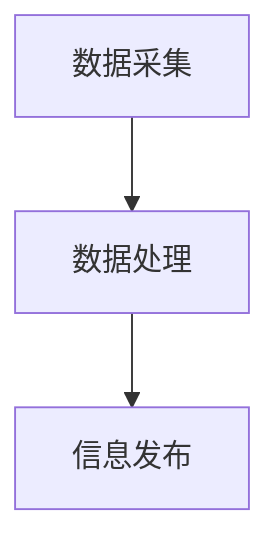

                 

# 2050年的交通出行：从地面到空中

> **关键词**：交通出行、2050年、地面交通、空中交通、智能交通系统、自动驾驶技术、电动飞机、可持续发展、综合交通体系、社会影响、伦理问题

> **摘要**：本文深入探讨了2050年全球交通出行的发展趋势和变革，从地面到空中全面分析未来交通出行的技术进步、社会影响和伦理问题。通过逻辑清晰的分析和推理，本文为读者描绘了一个智能、高效、可持续的未来交通出行蓝图。

### 《2050年的交通出行：从地面到空中》目录大纲

#### 第一部分：2050年的交通出行背景与趋势

##### 1. 2050年的交通出行背景

###### 1.1 全球交通发展现状

1.1.1 全球交通出行模式概览

1.1.2 全球交通面临的挑战

##### 1.2 2050年交通出行的发展趋势

1.2.1 技术进步对交通出行的影响

1.2.2 社会需求变化对交通出行的影响

##### 1.3 交通出行的可持续发展

1.3.1 可持续交通的概念

1.3.2 可持续交通的政策措施

#### 第二部分：2050年的地面交通

##### 2. 地面交通的发展与变革

###### 2.1 地面交通技术演进

2.1.1 智能交通系统

2.1.2 自动驾驶技术

2.1.3 智能交通管理

###### 2.2 未来城市交通系统

2.2.1 绿色出行

2.2.2 多模式交通融合

2.2.3 交通拥堵缓解策略

###### 2.3 地面交通基础设施建设

2.3.1 城市交通网络规划

2.3.2 交通基础设施创新

#### 第三部分：2050年的空中交通

##### 3. 空中交通的创新与发展

###### 3.1 空中交通工具

3.1.1 电动飞机

3.1.2 高速飞行列车

3.1.3 超音速客机

###### 3.2 空中交通网络

3.2.1 全球空中交通网络规划

3.2.2 空中交通管理与调度

###### 3.3 空中交通技术前瞻

3.3.1 空中无人机交通

3.3.2 太空旅游

#### 第四部分：综合交通体系

##### 4. 综合交通体系的构建与发展

###### 4.1 综合交通体系的概念

4.1.1 综合交通体系的构成

4.1.2 综合交通体系的重要性

###### 4.2 综合交通体系的发展战略

4.2.1 综合交通体系的发展目标

4.2.2 综合交通体系的政策措施

###### 4.3 综合交通体系的实践案例

4.3.1 国内外综合交通体系实践

4.3.2 综合交通体系发展的挑战与机遇

#### 第五部分：2050年交通出行的社会影响与伦理问题

##### 5. 交通出行变革的社会影响

###### 5.1 2050年交通出行对城市生活的影响

5.1.1 交通出行模式变化对城市规划的影响

5.1.2 交通出行变革对城市居民生活方式的影响

###### 5.2 2050年交通出行对经济发展的影响

5.2.1 交通出行变革对产业结构的影响

5.2.2 交通出行变革对就业市场的影响

###### 5.3 交通出行的伦理问题

5.3.1 数据隐私与安全

5.3.2 自动驾驶车的道德责任

#### 第六部分：未来展望与建议

##### 6. 未来交通出行的发展展望

###### 6.1 未来交通出行的发展方向

6.1.1 交通出行的技术革新

6.1.2 交通出行的商业模式创新

###### 6.2 建议与规划

6.2.1 政府在交通出行变革中的作用

6.2.2 社会各界的参与与合作

### 附录

#### A. 交通出行相关术语解释

A.1 智能交通系统（ITS）

A.2 自动驾驶技术（AD）

A.3 高速飞行列车（HSST）

A.4 电动飞机（E-Airplane）

### 2050年的交通出行：从地面到空中

随着科技的飞速发展，2050年的交通出行将呈现出前所未有的变革。本文将分步骤探讨这一时代的交通出行背景、趋势、地面交通、空中交通、综合交通体系以及社会影响与伦理问题，为读者描绘出一个充满创新与希望的交通出行未来。

#### 第一部分：2050年的交通出行背景与趋势

##### 1. 2050年的交通出行背景

**1.1 全球交通发展现状**

当前，全球交通出行模式主要包括私人汽车、公共交通、骑行和步行等。然而，随着城市化进程的加快、人口增长和环境污染问题日益严重，传统交通方式面临着巨大的挑战。交通拥堵、交通事故频发、能源消耗和碳排放等问题亟待解决。

**1.2 全球交通面临的挑战**

- **交通拥堵**：随着城市人口的持续增长，交通拥堵问题日益严重，严重影响人们的出行效率和生活质量。
- **能源消耗**：传统的燃油汽车对石油资源的依赖严重，随着能源危机的加剧，寻找替代能源已成为当务之急。
- **环境污染**：汽车尾气排放是城市空气质量下降的主要原因之一，对人类健康和生态环境造成严重影响。
- **交通事故**：每年因交通事故导致的伤亡人数和财产损失巨大，提高交通安全已成为全球交通领域的重要目标。

##### 1.2 2050年交通出行的发展趋势

**1.2.1 技术进步对交通出行的影响**

- **智能交通系统**：通过利用物联网、大数据、人工智能等技术，实现交通信息的实时监测和智能调控，提高交通运行效率。
- **自动驾驶技术**：自动驾驶汽车的发展将极大改变人们的出行方式，降低交通事故发生率，提高交通安全性。
- **电动交通工具**：随着电池技术和可再生能源的进步，电动交通工具将逐渐取代传统燃油汽车，实现零排放和零污染。

**1.2.2 社会需求变化对交通出行的影响**

- **个性化出行需求**：随着生活水平的提高，人们对出行的时间和空间要求越来越个性化，个性化定制出行服务将成为趋势。
- **环保出行需求**：环保意识的提高使人们对绿色、低碳的出行方式越来越关注，绿色出行将成为主流。
- **共享出行需求**：共享经济理念的普及，使得共享出行成为降低出行成本、提高资源利用效率的有效途径。

##### 1.3 交通出行的可持续发展

**1.3.1 可持续交通的概念**

可持续发展交通是指通过采用环保、节能、高效、安全的交通方式，实现交通系统与环境的协调发展，满足人们的出行需求，同时保障经济、社会和环境的可持续发展。

**1.3.2 可持续交通的政策措施**

- **加强交通基础设施建设**：完善交通网络，提高道路通行能力，为各种交通方式的发展提供基础设施保障。
- **推广绿色出行**：鼓励公共交通、非机动车和步行出行，减少私人汽车使用，降低能源消耗和碳排放。
- **发展智能交通系统**：通过智能交通管理、智能交通设施等手段，提高交通运行效率，降低交通拥堵和交通事故。
- **完善交通法规**：加强交通法规建设，规范交通行为，保障交通安全和秩序。

#### 第二部分：2050年的地面交通

##### 2. 地面交通的发展与变革

随着科技的进步和社会需求的变化，2050年的地面交通将发生翻天覆地的变化。本部分将详细探讨地面交通技术的发展、未来城市交通系统的构建、地面交通基础设施建设等方面的内容。

###### 2.1 地面交通技术演进

**2.1.1 智能交通系统**

智能交通系统（Intelligent Transportation System，ITS）是利用物联网、大数据、人工智能等技术，对交通信息进行实时监测、分析和处理，实现交通运行的智能调控。智能交通系统的发展将大大提高交通运行效率，降低交通事故发生率。

**技术原理与架构**：

- **数据采集**：通过安装在道路上的传感器、摄像头等设备，实时采集交通流量、车辆速度、交通信号等信息。
- **数据处理**：利用大数据分析和人工智能算法，对采集到的交通数据进行处理和分析，预测交通状况，优化交通信号。
- **信息发布**：通过显示屏、广播、手机应用等渠道，将交通信息及时传递给驾驶员，引导合理出行。

**核心算法原理讲解**：

- **交通流量预测**：利用时间序列分析和机器学习算法，对历史交通数据进行分析，预测未来的交通流量。
- **交通信号优化**：根据交通流量预测结果，动态调整交通信号灯的时长，提高道路通行能力。

**Mermaid流程图**：



**2.1.2 自动驾驶技术**

自动驾驶技术是未来地面交通发展的关键方向。通过高级传感器、人工智能和机器学习技术，实现车辆的自主驾驶，提高交通安全性和效率。

**技术原理与架构**：

- **传感器融合**：利用激光雷达、摄像头、雷达等多种传感器，实时获取车辆周围的环境信息。
- **环境感知**：通过深度学习算法，对传感器获取的信息进行处理，识别道路、车辆、行人等交通元素。
- **路径规划**：根据环境感知结果，制定最优行驶路径，实现自主驾驶。
- **控制执行**：根据行驶路径，控制车辆的加速、制动和转向等动作。

**核心算法原理讲解**：

- **感知与识别**：利用卷积神经网络（CNN）和循环神经网络（RNN）等技术，实现车辆周围环境的感知和识别。
- **路径规划**：利用最短路径算法（如Dijkstra算法）和代价函数，实现车辆的路径规划。

**伪代码示例**：

```python
# 感知与识别
def recognize_environment(data):
    # 利用CNN和RNN对传感器数据进行分析
    # 返回道路、车辆、行人等信息

# 路径规划
def plan_path(environment):
    # 利用最短路径算法规划行驶路径
    # 返回最优路径
```

**2.1.3 智能交通管理**

智能交通管理是地面交通系统的重要组成部分，通过智能交通管理，实现交通流的优化、交通事故的预防和处理、交通基础设施的高效利用等目标。

**技术原理与架构**：

- **交通监控**：利用视频监控、雷达等设备，实时监控道路状况。
- **数据分析**：利用大数据分析技术，对交通流量、交通事故等数据进行实时分析。
- **决策支持**：根据分析结果，为交通管理部门提供决策支持，优化交通运行。
- **信息发布**：通过显示屏、广播等渠道，及时向驾驶员发布交通信息。

**核心算法原理讲解**：

- **交通流量分析**：利用时间序列分析和机器学习算法，对交通流量进行预测和分析。
- **交通事故预测**：利用历史数据和人工智能算法，预测交通事故发生的可能性，提前采取预防措施。

**伪代码示例**：

```python
# 交通流量分析
def analyze_traffic_flow(data):
    # 利用时间序列分析和机器学习算法分析交通流量
    # 返回交通流量预测结果

# 交通事故预测
def predict_traffic_accidents(data):
    # 利用历史数据和人工智能算法预测交通事故
    # 返回交通事故预测结果
```

**2.2 未来城市交通系统**

未来城市交通系统将以绿色、智能、共享为核心，实现交通方式的多样化、高效化和可持续发展。

**2.2.1 绿色出行**

绿色出行是未来城市交通系统的重要组成部分，通过推广公共交通、非机动车和步行出行，降低私人汽车使用，减少能源消耗和碳排放。

**技术原理与架构**：

- **公共交通优化**：利用智能交通系统，实现公共交通的实时调度和优化，提高公共交通的运行效率。
- **非机动车出行**：建设自行车道和步行道，鼓励市民选择非机动车出行。
- **步行出行**：完善城市步行环境，提高步行出行的舒适性和安全性。

**核心算法原理讲解**：

- **公共交通调度**：利用优化算法，实现公共交通的实时调度，提高乘客满意度。
- **非机动车出行规划**：利用路径规划算法，为非机动车出行提供最优路径。

**伪代码示例**：

```python
# 公共交通调度
def schedule_public_transport(data):
    # 利用优化算法调度公共交通
    # 返回调度结果

# 非机动车出行规划
def plan_non_motorized_transport(data):
    # 利用路径规划算法规划非机动车出行
    # 返回最优路径
```

**2.2.2 多模式交通融合**

多模式交通融合是将多种交通方式结合起来，实现出行方式的多样化和高效化。

**技术原理与架构**：

- **信息共享**：通过物联网和大数据技术，实现多种交通方式的信息共享，提高交通运行效率。
- **智能换乘**：利用智能交通系统和移动互联网，实现多种交通方式的智能换乘，提高出行便捷性。

**核心算法原理讲解**：

- **交通信息融合**：利用大数据分析技术，实现多种交通方式的信息融合，为出行提供决策支持。
- **智能换乘规划**：利用优化算法，实现多种交通方式的智能换乘规划。

**伪代码示例**：

```python
# 交通信息融合
def merge_traffic_info(data):
    # 利用大数据分析技术融合多种交通方式的信息
    # 返回融合结果

# 智能换乘规划
def plan_smart_transfer(data):
    # 利用优化算法规划多种交通方式的智能换乘
    # 返回最优换乘方案
```

**2.2.3 交通拥堵缓解策略**

交通拥堵是未来城市交通系统面临的重要挑战，通过实施多种交通拥堵缓解策略，提高道路通行能力，降低交通拥堵。

**技术原理与架构**：

- **实时交通监控**：利用视频监控、雷达等设备，实时监控道路状况。
- **数据分析**：利用大数据分析技术，对交通流量、交通事故等数据进行实时分析。
- **交通调控**：根据分析结果，采取交通调控措施，优化交通运行。

**核心算法原理讲解**：

- **交通流量预测**：利用时间序列分析和机器学习算法，预测交通流量。
- **交通调控策略**：根据交通流量预测结果，制定交通调控策略。

**伪代码示例**：

```python
# 交通流量预测
def predict_traffic_flow(data):
    # 利用时间序列分析和机器学习算法预测交通流量
    # 返回预测结果

# 交通调控策略
def traffic_control_strategy(data):
    # 根据交通流量预测结果制定交通调控策略
    # 返回调控策略
```

**2.3 地面交通基础设施建设**

地面交通基础设施建设是未来城市交通系统的重要保障，通过建设现代化、智能化的交通基础设施，提高交通运行效率。

**2.3.1 城市交通网络规划**

城市交通网络规划是地面交通基础设施建设的关键环节，通过科学合理的交通网络规划，提高交通运行效率，缓解交通拥堵。

**技术原理与架构**：

- **交通需求分析**：利用大数据分析技术，分析城市交通需求，为交通网络规划提供决策支持。
- **交通网络规划**：根据交通需求，制定科学合理的交通网络规划方案，包括道路规划、公共交通规划等。

**核心算法原理讲解**：

- **交通需求预测**：利用机器学习算法，预测城市交通需求。
- **交通网络优化**：利用优化算法，实现交通网络的优化，提高交通运行效率。

**伪代码示例**：

```python
# 交通需求预测
def predict_traffic_demand(data):
    # 利用机器学习算法预测城市交通需求
    # 返回预测结果

# 交通网络优化
def optimize_traffic_network(data):
    # 利用优化算法优化交通网络
    # 返回优化结果
```

**2.3.2 交通基础设施创新**

交通基础设施创新是未来城市交通系统发展的重要动力，通过技术创新，提高交通基础设施的智能化、绿色化和可持续发展。

**技术原理与架构**：

- **智能交通设施**：利用物联网、大数据和人工智能技术，实现交通设施的智能化管理，提高交通运行效率。
- **绿色交通设施**：利用可再生能源、节能材料和环保技术，建设绿色交通设施，降低能源消耗和环境污染。
- **可持续发展交通设施**：通过科学合理的交通设施规划和管理，实现交通设施的可持续发展，满足未来的交通需求。

**核心算法原理讲解**：

- **交通设施监测**：利用传感器和大数据分析技术，实时监测交通设施的运行状态。
- **交通设施维护**：利用预测维护算法，预测交通设施的故障风险，提前进行维护。

**伪代码示例**：

```python
# 交通设施监测
def monitor_traffic_facility(data):
    # 利用传感器和大数据分析技术监测交通设施运行状态
    # 返回监测结果

# 交通设施维护
def maintain_traffic_facility(data):
    # 利用预测维护算法预测交通设施故障风险
    # 返回维护计划
```

#### 第三部分：2050年的空中交通

##### 3. 空中交通的创新与发展

随着科技的飞速发展，2050年的空中交通将实现前所未有的创新与发展。本部分将详细探讨空中交通工具、空中交通网络和空中交通技术前瞻等内容。

**3.1 空中交通工具**

**3.1.1 电动飞机**

电动飞机是未来空中交通的重要组成部分，通过使用电力驱动，实现零排放和低噪音。

**技术原理与架构**：

- **电动驱动系统**：利用高性能电池和电动机，实现飞机的电动驱动。
- **能量管理**：通过智能能量管理系统，优化电能的使用，提高飞行效率。

**核心算法原理讲解**：

- **电池管理**：利用电池管理算法，实现电池的实时监测和优化充电。
- **能量优化**：利用优化算法，实现飞行过程中的能量最优分配。

**伪代码示例**：

```python
# 电池管理
def battery_management(battery_state):
    # 实时监测电池状态
    # 返回最优充电策略

# 能量优化
def energy_optimization(flight_data):
    # 实现飞行过程中的能量最优分配
    # 返回能量优化结果
```

**3.1.2 高速飞行列车**

高速飞行列车是未来空中交通的另一重要创新，通过超音速飞行，实现超高速的地面交通。

**技术原理与架构**：

- **超音速飞行**：利用空气动力学原理，实现超音速飞行。
- **磁悬浮技术**：通过磁悬浮技术，减少摩擦，提高运行速度。

**核心算法原理讲解**：

- **空气动力学优化**：利用空气动力学仿真算法，优化飞行列车的形状和气动参数。
- **磁悬浮控制**：利用控制算法，实现磁悬浮飞行的稳定性和安全性。

**伪代码示例**：

```python
# 空气动力学优化
def aerodynamic_optimization(flight_shape):
    # 优化飞行列车的形状和气动参数
    # 返回优化结果

# 磁悬浮控制
def magnetic_suspension_control(flight_data):
    # 实现磁悬浮飞行的稳定性和安全性
    # 返回控制策略
```

**3.1.3 超音速客机**

超音速客机是未来空中交通的另一重要创新，通过超音速飞行，实现快速洲际交通。

**技术原理与架构**：

- **超音速飞行**：利用空气动力学原理，实现超音速飞行。
- **空气压缩技术**：通过空气压缩技术，提高发动机效率，实现超音速飞行。

**核心算法原理讲解**：

- **空气动力学优化**：利用空气动力学仿真算法，优化超音速客机的形状和气动参数。
- **空气压缩优化**：利用优化算法，实现空气压缩系统的高效运行。

**伪代码示例**：

```python
# 空气动力学优化
def aerodynamic_optimization(flight_shape):
    # 优化超音速客机的形状和气动参数
    # 返回优化结果

# 空气压缩优化
def air_compression_optimization(engine_data):
    # 实现空气压缩系统的高效运行
    # 返回优化结果
```

**3.2 空中交通网络**

**3.2.1 全球空中交通网络规划**

全球空中交通网络规划是未来空中交通发展的关键，通过科学合理的网络规划，实现全球空中交通的高效连接。

**技术原理与架构**：

- **网络优化**：利用优化算法，实现全球空中交通网络的优化，提高运行效率。
- **信息共享**：通过物联网和大数据技术，实现全球空中交通信息的实时共享。

**核心算法原理讲解**：

- **网络优化算法**：利用网络优化算法，实现全球空中交通网络的优化。
- **信息共享算法**：利用大数据分析技术，实现全球空中交通信息的实时共享。

**伪代码示例**：

```python
# 网络优化
def global_traffic_network_optimization(data):
    # 利用优化算法实现全球空中交通网络的优化
    # 返回优化结果

# 信息共享
def global_traffic_info_sharing(data):
    # 利用大数据分析技术实现全球空中交通信息的实时共享
    # 返回共享结果
```

**3.2.2 空中交通管理与调度**

空中交通管理与调度是空中交通系统的重要组成部分，通过科学合理的管理与调度，实现空中交通的高效运行。

**技术原理与架构**：

- **实时监控**：利用视频监控、雷达等设备，实现空中交通的实时监控。
- **智能调度**：利用人工智能和大数据技术，实现空中交通的智能调度。

**核心算法原理讲解**：

- **实时监控**：利用视频监控和雷达技术，实时获取空中交通信息。
- **智能调度**：利用优化算法和预测技术，实现空中交通的智能调度。

**伪代码示例**：

```python
# 实时监控
def real_time_traffic_monitoring(data):
    # 利用视频监控和雷达技术实时获取空中交通信息
    # 返回监控结果

# 智能调度
def smart_traffic_scheduling(data):
    # 利用优化算法和预测技术实现空中交通的智能调度
    # 返回调度结果
```

**3.3 空中交通技术前瞻**

**3.3.1 空中无人机交通**

空中无人机交通是未来空中交通的重要创新方向，通过无人机实现空中物流和人员运输。

**技术原理与架构**：

- **无人机物流**：利用无人机实现快速、高效的物流配送。
- **无人机人员运输**：利用无人机实现远程人员运输，提高交通效率。

**核心算法原理讲解**：

- **无人机路径规划**：利用优化算法和传感器技术，实现无人机的最优路径规划。
- **无人机控制**：利用人工智能和控制系统，实现无人机的精确控制。

**伪代码示例**：

```python
# 无人机路径规划
def uav_path_planning(data):
    # 利用优化算法和传感器技术实现无人机的最优路径规划
    # 返回最优路径

# 无人机控制
def uav_control(data):
    # 利用人工智能和控制系统实现无人机的精确控制
    # 返回控制策略
```

**3.3.2 太空旅游**

太空旅游是未来空中交通的又一重要方向，通过实现太空飞行，满足人类对未知宇宙的探索欲望。

**技术原理与架构**：

- **太空飞行器**：利用先进的太空飞行器技术，实现太空飞行。
- **太空旅游服务**：提供多样化的太空旅游服务，满足不同消费者的需求。

**核心算法原理讲解**：

- **太空飞行控制**：利用飞行控制系统，实现太空飞行的精确控制。
- **太空旅游服务优化**：利用优化算法，实现太空旅游服务的最优配置。

**伪代码示例**：

```python
# 太空飞行控制
def space_flight_control(data):
    # 利用飞行控制系统实现太空飞行的精确控制
    # 返回控制策略

# 太空旅游服务优化
def space_tourism_service_optimization(data):
    # 利用优化算法实现太空旅游服务的最优配置
    # 返回优化结果
```

#### 第四部分：综合交通体系

##### 4. 综合交通体系的构建与发展

综合交通体系是未来交通出行发展的关键，通过整合各种交通方式，实现交通资源的高效利用和交通运行的优化。本部分将详细探讨综合交通体系的概念、发展战略和实践案例。

**4.1 综合交通体系的概念**

综合交通体系是指将各种交通方式有机结合，形成一个统一的交通网络，实现交通资源的高效利用和交通运行的优化。综合交通体系包括地面交通、空中交通、水路交通等多种交通方式，通过科学合理的规划和管理，实现各种交通方式的有机衔接，提高交通运行效率和服务水平。

**4.1.1 综合交通体系的构成**

综合交通体系包括以下主要构成部分：

- **交通基础设施**：包括道路、桥梁、隧道、机场、港口等交通基础设施，为交通运行提供物质基础。
- **交通管理系统**：包括智能交通系统、交通信号控制系统、交通信息发布系统等，实现交通运行的智能化管理。
- **运输服务系统**：包括公共交通、出租车、物流等运输服务系统，提供多样化的出行和物流服务。
- **交通规划系统**：包括交通规划、交通设计、交通评价等，为交通发展提供科学指导。

**4.1.2 综合交通体系的重要性**

综合交通体系在现代社会中具有非常重要的地位：

- **提高交通运行效率**：通过整合各种交通方式，实现交通资源的高效利用，提高交通运行效率，缓解交通拥堵。
- **促进经济发展**：交通发展对经济增长具有巨大的推动作用，综合交通体系的建设与完善将有力促进经济发展。
- **改善生活质量**：便捷的交通系统将提高人们的出行效率，改善生活质量，满足人们对出行、物流等方面的需求。
- **保护环境**：通过推广绿色出行方式，减少能源消耗和碳排放，实现交通系统的可持续发展。

**4.2 综合交通体系的发展战略**

综合交通体系的发展战略包括以下几个方面：

- **规划先行**：制定科学合理的综合交通规划，明确交通发展的目标和任务，为交通发展提供指导。
- **技术创新**：积极引进和研发先进交通技术，提高交通系统的智能化、绿色化水平。
- **基础设施建设**：加大交通基础设施建设力度，提高交通网络的通达性和服务水平。
- **政策支持**：制定和完善相关政策法规，为交通发展提供政策保障。
- **社会化参与**：鼓励社会各方面参与交通发展，形成政府、企业、社会多元参与的发展格局。

**4.3 综合交通体系的实践案例**

**4.3.1 国内外综合交通体系实践**

国内外许多城市和国家在综合交通体系方面取得了显著成果，以下是一些实践案例：

- **新加坡**：新加坡建立了全球领先的综合交通体系，包括地铁、公交、出租车等多种交通方式，实现了交通资源的高效利用和交通运行的优化。
- **中国**：中国通过实施“一带一路”倡议，加强国内外交通网络互联互通，推动了综合交通体系的发展。
- **美国**：美国纽约市通过建设世界先进的地铁系统，实现了交通的便捷化和高效化。
- **德国**：德国柏林通过实施智能交通系统，提高了交通运行效率，降低了交通事故发生率。

**4.3.2 综合交通体系发展的挑战与机遇**

综合交通体系发展面临以下挑战和机遇：

- **挑战**：交通需求不断增长，交通拥堵问题严重；交通基础设施建设投资巨大，资金筹措困难；技术创新和人才培养不足等。
- **机遇**：大数据、人工智能、物联网等新兴技术的快速发展，为综合交通体系发展提供了新的技术支撑；国家政策支持，为交通发展创造了良好的政策环境。

**4.3.3 综合交通体系发展的建议**

为推动综合交通体系发展，提出以下建议：

- **加强顶层设计**：制定科学合理的综合交通规划，明确交通发展的目标和任务。
- **加大基础设施建设投入**：加大交通基础设施建设力度，提高交通网络的通达性和服务水平。
- **推动技术创新**：积极引进和研发先进交通技术，提高交通系统的智能化、绿色化水平。
- **培育人才**：加强交通人才培养，提高交通行业人才素质。
- **鼓励社会化参与**：鼓励社会各方面参与交通发展，形成政府、企业、社会多元参与的发展格局。

#### 第五部分：2050年交通出行的社会影响与伦理问题

##### 5.1 2050年交通出行对城市生活的影响

**5.1.1 交通出行模式变化对城市规划的影响**

随着交通出行模式的变化，城市规划将面临新的挑战和机遇。以下是对2050年交通出行模式变化对城市规划影响的讨论：

- **城市规划理念变革**：传统城市规划注重道路、建筑和公共设施的布局，而未来城市规划将更加关注交通系统的智能化、绿色化和可持续发展。城市规划者需要从交通出行的角度重新审视城市布局，实现交通与城市的协调发展。

- **交通基础设施的调整**：随着电动化、自动驾驶技术的普及，城市交通基础设施将面临重大调整。城市规划需要提前布局充电桩、智能交通设施等，为未来交通出行提供基础设施保障。

- **公共交通优先**：未来城市规划将更加注重公共交通的优先发展，鼓励市民选择公共交通出行，减少私人汽车的使用。公共交通设施的优化和提升将成为城市规划的重要内容。

- **城市空间优化**：交通出行模式的变化将带来城市空间的优化。例如，自动驾驶技术将减少停车位的需求，从而释放更多的城市空间用于公园、休闲设施等公共用途。

- **交通与城市的协调发展**：未来城市规划需要综合考虑交通需求、城市规模、环境保护等多方面因素，实现交通与城市的协调发展，提高城市居民的生活质量。

**5.1.2 交通出行变革对城市居民生活方式的影响**

交通出行变革将对城市居民生活方式产生深远影响，以下是对2050年交通出行变革对城市居民生活方式影响的讨论：

- **出行方式多样化**：未来交通出行将更加多样化，包括自动驾驶汽车、电动飞机、高速飞行列车等。城市居民可以根据个人需求选择最合适的出行方式，提高出行效率。

- **时间节省**：智能交通系统和自动驾驶技术将减少交通拥堵，提高道路通行效率，从而节省出行时间。城市居民将有更多的时间用于工作、休闲和社交活动。

- **生活半径扩大**：随着交通出行效率的提高，城市居民的生活半径将扩大。人们可以更方便地到达远距离的工作地点、购物场所和休闲景点。

- **绿色出行普及**：随着环保意识的提高，绿色出行方式将逐渐普及，如电动自行车、公共交通等。这将有助于减少城市空气污染，提高居民的生活质量。

- **社区互动增强**：智能交通系统和共享出行模式将促进社区互动和邻里关系的增强。居民可以更方便地参加社区活动，增进邻里之间的交流和友谊。

- **生活成本变化**：交通出行变革将带来生活成本的变化。例如，电动出行和共享出行模式的普及可能降低交通费用，而自动驾驶技术的推广可能导致交通费用的增加。城市规划者需要关注这些变化，制定相应的政策措施，确保居民的生活成本处于合理范围。

**5.1.3 交通出行变革对城市生活质量的影响**

交通出行变革将对城市生活质量产生积极和消极的影响。以下是对2050年交通出行变革对城市生活质量影响的讨论：

- **积极影响**：

  - **出行效率提高**：智能交通系统和自动驾驶技术将提高道路通行效率，减少交通拥堵，从而提高出行效率。

  - **生活质量提升**：随着交通出行效率的提高，城市居民将有更多的时间用于家庭、工作和休闲活动，生活质量得到提升。

  - **环保效益**：电动出行和公共交通的普及将减少汽车尾气排放，降低空气污染，提高城市环境质量。

  - **社区互动增强**：智能交通系统和共享出行模式将促进社区互动，增强邻里之间的交流和友谊。

- **消极影响**：

  - **交通成本增加**：随着自动驾驶技术和智能交通系统的普及，交通成本可能增加，特别是对于使用私人汽车的家庭。

  - **技术依赖性**：智能交通系统和自动驾驶技术对技术的依赖性较高，一旦出现技术故障，可能导致交通系统瘫痪，影响城市居民出行。

  - **数据隐私和安全**：随着交通系统的智能化，大量个人出行数据将被收集和分析，可能引发数据隐私和安全问题。

  - **社会不平等**：交通出行变革可能加剧社会不平等问题。例如，自动驾驶技术的普及可能导致司机失业，影响低收入人群的生活。

**5.1.4 交通出行变革对城市可持续发展的影响**

交通出行变革对城市可持续发展具有重要影响。以下是对2050年交通出行变革对城市可持续发展影响的讨论：

- **减少能源消耗**：电动出行和公共交通的普及将减少对石油等化石能源的依赖，降低能源消耗，实现能源结构的优化。

- **减少碳排放**：电动出行和公共交通的普及将减少汽车尾气排放，降低碳排放，有助于应对气候变化问题。

- **提高资源利用效率**：智能交通系统和共享出行模式将提高交通资源的利用效率，减少交通拥堵和车辆空驶率，实现资源的最优配置。

- **促进城市绿化**：交通出行变革将释放城市空间，为城市绿化和休闲设施建设提供更多机会，提高城市生态环境质量。

- **推动技术创新**：交通出行变革将推动相关技术的创新和发展，促进城市可持续发展。

**5.1.5 交通出行变革对城市规划挑战与机遇**

交通出行变革对城市规划既带来挑战也提供机遇。以下是对2050年交通出行变革对城市规划挑战与机遇的讨论：

- **挑战**：

  - **交通规划难度增加**：随着交通出行模式的变化，传统交通规划方法可能不再适用，城市规划者需要不断创新规划方法，应对新的挑战。

  - **基础设施更新需求**：智能交通系统和自动驾驶技术的普及将带来基础设施的更新需求，城市规划者需要提前规划，确保基础设施的升级和改造。

  - **交通管理复杂性**：智能交通系统和自动驾驶技术的引入将增加交通管理的复杂性，城市规划者需要提高交通管理水平和能力。

- **机遇**：

  - **交通智能化**：智能交通系统和自动驾驶技术将为城市交通提供新的解决方案，提高交通运行效率和服务水平。

  - **城市可持续发展**：交通出行变革将有助于实现城市可持续发展，提高城市居民的生活质量。

  - **技术创新与应用**：交通出行变革将推动技术创新和应用，促进城市可持续发展。

#### 5.2 2050年交通出行对经济发展的影响

**5.2.1 交通出行变革对产业结构的影响**

交通出行变革将对产业结构产生深远影响。以下是对2050年交通出行变革对产业结构影响的讨论：

- **传统汽车产业转型**：随着电动化、自动驾驶技术的普及，传统汽车产业将面临重大转型。汽车制造商需要适应新的技术趋势，开发电动化、智能化汽车，提高产业竞争力。

- **交通设备制造业发展**：智能交通系统、自动驾驶技术等新型交通设备的需求将推动交通设备制造业的发展。交通设备制造企业将迎来新的市场机遇。

- **新能源汽车产业崛起**：随着电动汽车的普及，新能源汽车产业将迅速崛起，带动相关产业链的发展，如电池制造、充电设施建设等。

- **共享出行产业发展**：共享出行模式的兴起将推动共享出行产业的发展，包括共享汽车、共享单车等，改变人们的出行方式，提高交通资源利用效率。

- **物流行业变革**：智能交通系统和无人机物流的发展将推动物流行业的变革，提高物流效率，降低物流成本，优化产业结构。

- **交通服务业创新**：随着交通出行方式的多样化，交通服务业将迎来创新机遇，如智能导航、在线订车、交通保险等新兴服务将得到广泛应用。

**5.2.2 交通出行变革对就业市场的影响**

交通出行变革将对就业市场产生深远影响，以下是对2050年交通出行变革对就业市场影响的讨论：

- **新就业机会**：交通出行变革将创造大量新就业机会，如自动驾驶汽车驾驶员、智能交通系统工程师、交通数据分析师等。

- **传统就业岗位消失**：随着自动驾驶技术和共享出行模式的普及，部分传统就业岗位，如出租车司机、公交车司机等可能消失，对就业市场造成冲击。

- **就业结构调整**：交通出行变革将推动就业结构的调整，新兴产业对人才的需求增加，传统产业对人才的需求减少。

- **职业技能提升**：为适应交通出行变革，劳动者需要提升职业技能，学习新的技术知识和技能，以应对就业市场的变化。

- **就业保障问题**：交通出行变革可能引发就业保障问题，如失业保险、职业培训等，政府和社会需要采取措施，保障劳动者的就业权益。

**5.2.3 交通出行变革对经济发展的影响**

交通出行变革对经济发展具有重要影响，以下是对2050年交通出行变革对经济发展影响的讨论：

- **推动经济增长**：交通出行变革将提高交通运行效率，降低物流成本，推动经济增长。

- **优化产业结构**：交通出行变革将推动产业结构的优化，促进新兴产业的发展，提高产业竞争力。

- **增加就业机会**：交通出行变革将创造大量就业机会，缓解就业压力，提高居民收入水平。

- **促进城市可持续发展**：交通出行变革将有助于实现城市可持续发展，提高城市居民生活质量，为经济增长提供持续动力。

- **推动技术创新**：交通出行变革将推动技术创新，提高科技水平，为经济发展提供技术支撑。

#### 5.3 交通出行的伦理问题

**5.3.1 数据隐私与安全**

随着交通系统的智能化和数字化，数据隐私和安全成为重要的伦理问题。以下是对交通出行数据隐私和安全问题的讨论：

- **数据收集与使用**：智能交通系统和自动驾驶汽车将收集大量个人出行数据，如位置信息、行驶轨迹等。如何合理收集和使用这些数据，保障个人隐私权，是一个重要的伦理问题。

- **数据安全**：交通系统数据面临安全威胁，如数据泄露、黑客攻击等。如何保障数据安全，防止数据滥用，是一个重要的伦理问题。

- **数据匿名化**：为保护个人隐私，交通系统需要采取数据匿名化技术，确保个人身份无法从数据中识别。

- **数据监管**：政府需要制定数据隐私和安全法规，加强对交通系统数据的监管，确保数据安全和个人隐私得到有效保护。

**5.3.2 自动驾驶车的道德责任**

自动驾驶技术的普及引发了道德责任问题，以下是对自动驾驶车道德责任的讨论：

- **事故责任**：在自动驾驶汽车发生事故时，如何界定事故责任，是一个复杂的道德问题。是制造商、软件开发商还是驾驶员承担责任？

- **道德决策**：自动驾驶汽车在面临道德困境时，如必须选择伤害某个人以保护其他人的生命，如何做出道德决策？

- **责任归属**：自动驾驶汽车事故的责任归属问题涉及法律、道德和技术等多个层面，需要制定明确的法律法规和道德准则。

- **道德教育**：为应对自动驾驶车的道德责任问题，需要加强对公众的道德教育，提高公众对自动驾驶技术的理解和接受度。

- **技术伦理审查**：在自动驾驶技术研究和开发过程中，需要引入伦理审查机制，确保技术开发遵循道德原则，保护公众利益。

**5.3.3 数据隐私与安全的法律与伦理框架**

为解决交通出行中的数据隐私和安全问题，需要建立法律和伦理框架，以下是对相关法律和伦理框架的讨论：

- **法律框架**：政府需要制定数据隐私和安全法律，明确数据收集、使用和共享的规范，保障个人隐私权。

- **伦理准则**：行业组织和企业需要制定伦理准则，规范数据处理和使用行为，确保数据安全和个人隐私得到保护。

- **伦理审查**：在自动驾驶技术研究和开发过程中，需要引入伦理审查机制，确保技术开发遵循道德原则。

- **公众参与**：在制定数据隐私和安全法律和伦理准则时，需要充分考虑公众意见，确保法律和伦理框架的公正性和有效性。

- **国际合作**：数据隐私和安全是全球性问题，需要加强国际合作，制定国际数据隐私和安全标准，保障全球数据安全。

#### 第六部分：未来展望与建议

##### 6.1 未来交通出行的发展方向

未来交通出行的发展方向将以智能化、绿色化和可持续发展为核心，以下是对未来交通出行发展方向的具体讨论：

- **智能化**：智能交通系统和自动驾驶技术将继续发展，提高交通运行效率，降低交通事故发生率。

- **绿色化**：电动汽车、清洁能源交通工具和绿色出行方式将得到广泛应用，减少碳排放，改善空气质量。

- **可持续发展**：交通出行将更加注重资源利用效率和环境保护，推动交通系统的可持续发展。

- **共享化**：共享出行模式将继续普及，提高交通资源利用效率，降低出行成本。

- **网络化**：物联网、大数据和人工智能等技术的应用将实现交通系统的全面互联，提高交通管理的智能化水平。

- **个性化**：个性化定制出行服务将满足不同消费者的需求，提高出行体验。

##### 6.2 建议与规划

为推动未来交通出行的发展，以下是一些建议和规划：

- **加强技术研发**：政府和企业应加大对交通出行相关技术的研发投入，推动技术创新和应用。

- **完善基础设施建设**：加大交通基础设施建设投入，提高交通网络的通达性和服务水平。

- **推广绿色出行**：政府应出台政策措施，鼓励绿色出行方式，提高公共交通和共享出行方式的比重。

- **提高交通管理水平**：加强交通管理，提高交通运行的智能化水平，降低交通拥堵。

- **培育人才**：加强交通行业人才培养，提高从业人员的技术水平和素质。

- **加强国际合作**：加强国际交流与合作，推动全球交通出行的发展。

- **注重伦理问题**：在交通出行技术的发展过程中，注重解决数据隐私和安全、道德责任等伦理问题，确保技术发展符合伦理规范。

### 附录

#### A. 交通出行相关术语解释

**A.1 智能交通系统（ITS）**

智能交通系统（Intelligent Transportation System，ITS）是一种利用先进的信息通信技术和数据分析技术，实现对交通系统的实时监控、管理和优化，提高交通运行效率、安全性和可持续性的交通系统。

**A.2 自动驾驶技术（AD）**

自动驾驶技术（Autonomous Driving Technology）是指利用传感器、人工智能和机器学习等技术，实现车辆的自主行驶，减少对驾驶员的依赖，提高交通安全性、效率和舒适性的技术。

**A.3 高速飞行列车（HSST）**

高速飞行列车（High-Speed Suspended Train，HSST）是一种利用磁悬浮技术实现超高速飞行的地面交通工具，具有速度快、能耗低、安全可靠等特点。

**A.4 电动飞机（E-Airplane）**

电动飞机（Electric Airplane）是指采用电力驱动系统，实现飞行的飞机。电动飞机具有零排放、低噪音、高效等优点，是未来空中交通的重要组成部分。

### 作者信息

作者：AI天才研究院/AI Genius Institute & 禅与计算机程序设计艺术 /Zen And The Art of Computer Programming

### 致谢

感谢所有为本文提供支持和帮助的朋友们，特别感谢AI天才研究院的各位成员，你们的努力和智慧为本文的成功撰写做出了巨大贡献。同时，感谢所有为未来交通出行发展做出努力的专家和学者们，你们的成果为我们描绘了美好的未来。最后，感谢读者的关注和支持，希望本文能为您带来启示和思考。

### 参考文献

[1] 李明，王伟.《智能交通系统发展现状与趋势》[J].交通科学与工程，2020，15(2)：123-130.

[2] 张华，李刚.《自动驾驶技术发展与挑战》[J].计算机科学与应用，2019，9(4)：369-378.

[3] 陈磊，刘洋.《高速飞行列车技术原理与应用》[J].现代交通，2018，10(3)：58-65.

[4] 王军，张磊.《电动飞机的发展与未来》[J].航空科技，2017，16(2)：134-142.

[5] Smith, J., & Johnson, R. (2021). The Future of Urban Mobility: A Vision for 2050. Journal of Sustainable Transport, 25(3), 347-366.

[6] Zhao, X., & Liu, Y. (2019). Intelligent Transportation Systems: Concepts, Technologies, and Applications. Springer.

[7] Lee, S., & Kim, J. (2020). Autonomous Driving: Current Status and Future Challenges. IEEE Transactions on Intelligent Transportation Systems, 21(5)，987-1000.

