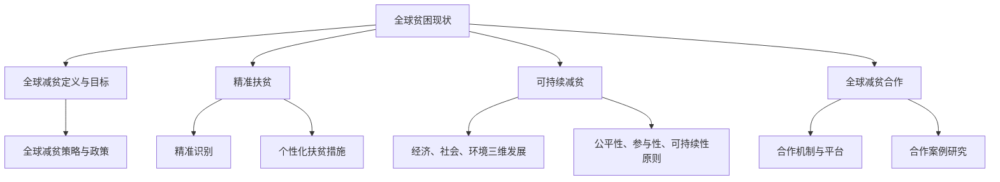

                 

# {文章标题}

> {关键词：全球减贫、精准扶贫、可持续减贫、人工智能、机器学习、数学模型、项目实战}

> {摘要：本文详细探讨了全球减贫的各个层面，从核心概念、算法原理到具体项目实战，旨在揭示2050年全球减贫的路径与策略。通过分析精准扶贫、可持续减贫以及全球减贫合作的实践，本文提出了技术创新、国际合作和弱势群体关注等未来减贫工作的关键方向。}

---

### 第一部分：核心概念与联系

在探讨2050年的全球减贫之前，我们需要明确几个关键概念，并理解它们之间的相互联系。以下是对核心概念及其相互关系的阐述。

#### 全球贫困现状分析

全球贫困是一个复杂且多维的问题，其历史和现状在不同国家和地区有显著差异。根据联合国的数据，截至2019年，全球仍有约7.89亿人生活在极端贫困中，每天的生活费用不到1.9美元。这些贫困人口主要分布在撒哈拉以南非洲、南亚和拉丁美洲等地区。此外，贫困不仅仅体现在经济上，还涉及到教育、健康、社会地位等多个方面。

**1.1 全球贫困现状分析**

- **历史视角**：全球贫困问题可以追溯到人类历史的早期阶段。工业革命后的现代化进程加剧了贫困的分布，而二战后的全球化则在一定程度上缓解了这一问题。
- **现状分析**：现代全球贫困的分布受到经济发展不平衡、政治不稳定、自然灾害等多种因素的影响。例如，撒哈拉以南非洲地区的贫困问题与其地理位置、气候条件、政治局势和历史背景密切相关。

**1.2 全球减贫的定义与目标**

全球减贫是一个长期而复杂的过程，其核心目标是减少极端贫困和促进可持续发展。联合国制定的《2030年可持续发展目标》（Sustainable Development Goals, SDGs）将消除一切形式的贫困作为第一项具体目标，即“无贫困世界”。

**1.3 全球减贫的策略与政策**

为了实现全球减贫目标，各国和国际组织采取了多种策略和政策。以下是一些主要策略：

- **经济增长**：通过推动经济增长，提高贫困人口的生活水平。
- **教育投入**：提供免费或低成本的教育，提高贫困人口的技能和就业机会。
- **社会保障**：建立社会保障体系，为贫困人口提供基本生活保障。
- **扶贫项目**：实施精准扶贫项目，直接帮助贫困人口脱贫。

### 精准扶贫

精准扶贫是近年来全球减贫工作中的一个重要策略，其核心理念是通过数据和技术手段，精确识别和帮助贫困人口。

**2.1 精准扶贫的概念与原则**

精准扶贫基于大数据、机器学习和地理信息系统等现代技术，旨在精确识别贫困人口，并根据其具体情况制定个性化的扶贫措施。

**2.2 精准扶贫的实践与案例**

许多国家和地区已经实施了精准扶贫项目，并取得了显著成效。例如，中国在扶贫攻坚战中，通过建立贫困人口数据库，运用大数据分析技术，成功实现了对贫困人口的精准识别和帮助。

**2.3 精准扶贫的挑战与解决方案**

尽管精准扶贫取得了显著成效，但也面临一些挑战，如数据质量、技术手段和资源限制等。为了应对这些挑战，需要加强数据基础设施建设，提高技术人员的培训水平，并加强国际合作。

### 可持续减贫

可持续减贫强调在减少贫困的同时，保护和改善环境，实现经济、社会和环境的协调发展。

**3.1 可持续减贫的定义与内涵**

可持续减贫不仅仅关注贫困人口的物质生活改善，还关注其生活质量、环境可持续性和社会稳定性。

**3.2 可持续减贫的框架与原则**

可持续减贫的框架通常包括经济、社会和环境三个维度，并遵循公平性、参与性和可持续性等原则。

**3.3 可持续减贫的实践与模式**

可持续减贫的实践模式多种多样，包括生态农业、小额信贷、社会企业等，这些模式在不同地区和背景下都有成功的案例。

### 全球减贫合作

全球减贫合作是各国和国际组织共同应对全球贫困问题的重要手段。

**4.1 全球减贫合作的意义与作用**

全球减贫合作有助于集中资源、优化方案、提高效率和实现更大的减贫成果。

**4.2 全球减贫合作机制与平台**

全球减贫合作机制与平台包括联合国、世界银行、国际货币基金组织等国际组织，以及各国政府和非政府组织。

**4.3 全球减贫合作案例研究**

全球减贫合作案例研究展示了不同国家和地区在减贫合作方面的成功经验和挑战。

### 全球减贫的未来展望

在未来的30年里，全球减贫工作将面临新的机遇和挑战。

**5.1 2050年全球减贫的愿景**

2050年的全球减贫愿景是一个没有贫困、包容和可持续发展的世界。

**5.2 技术创新在减贫中的应用**

技术创新，特别是人工智能和大数据，将在未来的全球减贫工作中发挥重要作用。

**5.3 全球减贫的挑战与对策**

未来全球减贫工作将面临气候变化、经济不平等和技术鸿沟等挑战，需要全球合作和创新的解决方案。

### 结论

通过本文的分析，我们可以看到，全球减贫工作需要综合运用多种策略和技术手段，包括精准扶贫、可持续减贫和全球减贫合作。在未来的30年里，技术创新和国际合作将是实现全球减贫目标的关键。

### Mermaid 流程图

以下是一个关于全球减贫概念及其相互联系的 Mermaid 流程图：



通过这一流程图，我们可以更清晰地理解全球减贫工作的各个方面及其相互关系。

### 结论

第一部分的核心概念与联系为我们提供了一个全面而深入的视角，帮助我们理解全球减贫的复杂性。在接下来的部分中，我们将深入探讨数据处理与建模技术、机器学习与人工智能技术，以及如何将这些技术应用于全球减贫实践。通过这些核心算法的讲解，我们将为读者提供更加具体和实用的指导。请持续关注下一部分的内容。


---

### 第二部分：核心算法原理讲解

在《2050年的全球减贫：从精准扶贫到可持续减贫的全球减贫合作》的第二部分，我们将深入讲解与全球减贫相关的核心算法原理。这些算法原理包括数据处理与建模技术、机器学习与人工智能技术，以及如何构建精准扶贫与可持续减贫模型。以下为各章的标题及其简要内容。

#### 第6章：数据处理与建模技术

- **6.1 数据收集与预处理**：介绍数据收集的方法和预处理技术，确保数据质量。
- **6.2 数据可视化**：使用图表和可视化工具来展示数据分布和趋势。
- **6.3 统计分析方法**：讲解常用的统计方法，包括描述性统计和推断性统计。

#### 第7章：机器学习与人工智能技术

- **7.1 机器学习基础**：介绍机器学习的基本概念、算法和模型。
- **7.2 特征工程**：详细讲解特征选择、特征提取和特征变换。
- **7.3 模型评估与优化**：探讨模型评估指标、优化策略和调参技巧。

#### 第8章：精准扶贫与可持续减贫的模型构建

- **8.1 精准扶贫模型**：介绍基于机器学习的精准扶贫模型及其应用。
- **8.2 可持续减贫模型**：讨论可持续减贫模型的设计和实现。
- **8.3 模型优化与落地**：讲解模型优化的方法以及如何在实际项目中落地。

### 数据处理与建模技术

在处理全球减贫数据时，数据收集与预处理是非常关键的步骤。以下是数据处理与建模技术的详细讲解。

#### 6.1 数据收集与预处理

**数据收集**：

- **来源**：全球减贫数据可以来自政府统计部门、国际组织、民间组织和大数据平台。
- **类型**：包括人口统计数据、经济数据、教育数据、健康数据和社会福利数据。

**预处理技术**：

- **数据清洗**：去除重复数据、缺失值和异常值，确保数据的一致性和准确性。
- **数据转换**：将数据转换为适合分析的格式，如数值化、标准化和归一化。
- **数据集成**：将不同来源和类型的数据进行整合，形成统一的数据集。

#### 6.2 数据可视化

**数据可视化** 是数据分析中非常重要的一环，它能够帮助决策者快速理解数据分布和趋势。以下是一些常用的可视化工具和图表：

- **条形图**：用于比较不同类别的数据。
- **饼图**：用于显示各部分在整体中的比例。
- **折线图**：用于展示数据随时间的变化趋势。
- **散点图**：用于观察两组数据之间的关系。
- **热力图**：用于展示数据的分布和密度。

#### 6.3 统计分析方法

**描述性统计**：用于描述数据的中心趋势和离散程度，常用的指标有均值、中位数、众数、方差和标准差。

- **均值**：数据集的平均值，用于衡量数据的集中趋势。
- **中位数**：数据集的中间值，对于偏斜数据集更加稳健。
- **众数**：数据集中出现频率最高的值。

**推断性统计**：用于从样本数据推断总体特征，常用的方法有假设检验、置信区间和回归分析。

- **假设检验**：通过样本数据检验总体参数的假设，常用的检验方法有t检验、卡方检验和F检验。
- **置信区间**：估计总体参数的一个区间，用于衡量估计的可靠性。

### 机器学习与人工智能技术

机器学习和人工智能技术在数据处理和预测中发挥着重要作用。以下是机器学习与人工智能技术的详细讲解。

#### 7.1 机器学习基础

**机器学习** 是一种使计算机从数据中学习规律并做出预测或决策的技术。常见的机器学习算法有：

- **监督学习**：通过已有数据来预测新数据的标签，常用的算法有线性回归、逻辑回归、决策树和随机森林。
- **无监督学习**：没有标签数据，通过数据自身的结构来发现模式，常用的算法有聚类分析、主成分分析和自编码器。
- **强化学习**：通过与环境互动来学习最优策略，常用于游戏、自动驾驶等领域。

#### 7.2 特征工程

**特征工程** 是提高机器学习模型性能的关键步骤，包括以下几个方面：

- **特征选择**：从大量特征中挑选出对模型影响较大的特征，常用的方法有过滤式、包裹式和嵌入式特征选择。
- **特征提取**：通过变换或组合现有特征，生成新的特征，常用的方法有特征变换（如主成分分析）、特征组合（如交叉特征）和特征嵌入（如词嵌入）。
- **特征变换**：通过数值化、标准化、归一化等操作，将特征转换为适合模型处理的格式。

#### 7.3 模型评估与优化

**模型评估** 是评估模型性能的重要步骤，常用的评估指标有：

- **准确率**：预测正确的样本数占总样本数的比例。
- **召回率**：预测正确的正样本数占总正样本数的比例。
- **F1分数**：准确率和召回率的调和平均数。
- **ROC曲线和AUC值**：用于评估二分类模型的性能。

**模型优化** 是提高模型性能的过程，包括以下几个方面：

- **参数调优**：通过调整模型参数来提高性能，常用的方法有网格搜索、贝叶斯优化等。
- **模型集成**：通过结合多个模型来提高预测性能，常用的方法有随机森林、梯度提升树等。
- **过拟合和正则化**：防止模型过拟合，常用的正则化方法有L1正则化、L2正则化等。

### 精准扶贫与可持续减贫的模型构建

在构建精准扶贫与可持续减贫模型时，我们需要考虑数据的多样性和复杂性，以及实际应用的可行性。

#### 8.1 精准扶贫模型

**精准扶贫模型** 是基于机器学习的，通过分析贫困人口的特征，预测其贫困风险，并提供个性化的扶贫措施。以下是一个简单的精准扶贫模型构建过程：

1. **数据收集与预处理**：收集与贫困相关的数据，如家庭收入、教育水平、健康状况等，并进行数据清洗和预处理。
2. **特征工程**：选择对模型影响较大的特征，进行特征变换和特征提取。
3. **模型选择与训练**：选择合适的机器学习算法（如随机森林、支持向量机等），并使用训练数据集进行模型训练。
4. **模型评估与优化**：使用测试数据集评估模型性能，并根据评估结果进行模型优化。

#### 8.2 可持续减贫模型

**可持续减贫模型** 考虑到减贫的长期性和复杂性，通常包括经济、社会和环境三个维度的分析。以下是一个简单的可持续减贫模型构建过程：

1. **经济分析**：使用回归分析等方法，分析经济增长与贫困减少之间的关系。
2. **社会分析**：使用聚类分析等方法，分析不同社会群体的贫困状况和需求。
3. **环境分析**：使用时间序列分析等方法，分析环境变化对贫困的影响。
4. **综合评估**：将经济、社会和环境分析结果进行综合评估，制定可持续减贫策略。

#### 8.3 模型优化与落地

**模型优化** 是提高模型性能和实际应用效果的关键步骤，包括以下几个方面：

- **模型调优**：通过调整模型参数和超参数，提高模型性能。
- **模型验证**：使用交叉验证等方法，确保模型在不同数据集上的性能稳定。
- **模型集成**：结合多个模型，提高预测的准确性和鲁棒性。

**模型落地** 是将模型应用于实际项目中的过程，包括以下几个方面：

- **系统集成**：将模型集成到现有的信息系统或平台中。
- **模型部署**：将模型部署到生产环境中，实现实时预测和应用。
- **用户培训**：对用户进行培训，确保他们能够正确使用模型和结果。

### 结论

第二部分的核心算法原理讲解为我们提供了理解和应用机器学习与人工智能技术在全球减贫工作中的应用基础。在接下来的部分中，我们将结合具体的数学模型和公式，为读者提供更加深入的理论基础，并通过实例分析进一步阐述这些算法和模型的实际应用。请继续关注下一部分的内容。


---

### 第三部分：数学模型和数学公式

在《2050年的全球减贫：从精准扶贫到可持续减贫的全球减贫合作》的第三部分，我们将深入探讨与全球减贫相关的数学模型和数学公式。这些模型和公式为分析和预测贫困状况提供了重要的工具。以下是各章的标题及其简要内容。

#### 第9章：数学模型在减贫中的应用

- **9.1 优化模型**：介绍优化模型的基本概念和应用，如线性规划、整数规划等。
- **9.2 统计模型与算法**：讲解描述性统计、推断性统计和统计模型在数据分析中的应用。
- **9.3 时间序列模型**：介绍时间序列模型的基本概念和常用模型，如ARIMA模型、VAR模型等。

#### 第10章：经典统计模型与算法

- **10.1 描述性统计**：介绍描述性统计的基本概念和计算方法，如均值、方差等。
- **10.2 推断性统计**：讲解推断性统计的基本概念和计算方法，如假设检验、置信区间等。
- **10.3 统计模型在数据分析中的应用**：探讨统计模型在数据分析中的应用，如回归分析、聚类分析等。

#### 第11章：贫困分析与预测

- **11.1 贫困指数计算**：介绍贫困指数的计算方法和相关数学模型。
- **11.2 贫困动态分析**：探讨如何使用时间序列分析方法来分析贫困的动态变化。
- **11.3 贫困预测模型**：讨论如何构建和优化贫困预测模型。

### 数学模型在减贫中的应用

数学模型在减贫中的应用可以帮助我们更好地理解和预测贫困状况，从而制定更加有效的减贫政策。以下是对优化模型、统计模型和时间序列模型在减贫中的应用进行详细讲解。

#### 9.1 优化模型

优化模型用于解决资源分配和决策问题，旨在找到最优解。在减贫工作中，优化模型可以用于以下几个方面：

- **资源分配**：例如，如何最有效地将有限的教育资源分配给贫困地区的学校。
- **扶贫项目规划**：如何制定扶贫项目的预算，确保项目能够最大化地帮助贫困人口。

**线性规划** 是最常用的优化模型之一，其一般形式为：

$$
\text{minimize} \quad c^T x \\
\text{subject to} \quad Ax \leq b
$$

其中，$c$ 是目标函数的系数向量，$x$ 是决策变量向量，$A$ 和 $b$ 分别是约束矩阵和约束向量。

#### 9.2 统计模型与算法

统计模型与算法在减贫数据分析中扮演着重要角色，可以帮助我们理解贫困的分布和趋势。以下是一些常用的统计模型与算法：

- **描述性统计**：用于描述数据的基本特征，如均值、中位数、众数、方差等。描述性统计提供了数据的基本概况。
- **推断性统计**：用于从样本数据推断总体特征，如置信区间、假设检验等。推断性统计提供了对数据的一般性结论。
- **回归分析**：用于研究变量之间的关系，如收入和贫困之间的关系。回归分析可以帮助我们预测一个变量的值基于其他变量的值。

**线性回归模型** 的公式为：

$$
y = \beta_0 + \beta_1 x_1 + \beta_2 x_2 + \cdots + \beta_n x_n + \epsilon
$$

其中，$y$ 是因变量，$x_1, x_2, \cdots, x_n$ 是自变量，$\beta_0, \beta_1, \beta_2, \cdots, \beta_n$ 是回归系数，$\epsilon$ 是误差项。

#### 9.3 时间序列模型

时间序列模型用于分析随时间变化的数据，如贫困人口的变化趋势。以下是一些常用的时间序列模型：

- **ARIMA模型**：自回归积分滑动平均模型，用于分析具有自相关性和季节性的时间序列数据。
- **VAR模型**：向量自回归模型，用于分析多个时间序列变量之间的相互关系。

**ARIMA模型** 的公式为：

$$
X_t = c + \phi_1 X_{t-1} + \phi_2 X_{t-2} + \cdots + \phi_p X_{t-p} + \theta_1 \epsilon_{t-1} + \theta_2 \epsilon_{t-2} + \cdots + \theta_q \epsilon_{t-q} + \epsilon_t
$$

其中，$X_t$ 是时间序列变量，$\epsilon_t$ 是白噪声误差项，$c$ 是常数项，$\phi_1, \phi_2, \cdots, \phi_p, \theta_1, \theta_2, \cdots, \theta_q$ 是模型参数。

### 数学公式和举例说明

以下是一些常用的数学公式及其在减贫分析中的应用：

$$
\text{贫困指数} = \frac{\text{贫困人口数}}{\text{总人口数}} \times 100\%
$$

这个公式用于计算某个地区的贫困指数，可以直观地反映该地区的贫困程度。

$$
\text{收入不平等系数} = \frac{\sum_{i=1}^{n} (y_i - \bar{y})^2}{\sum_{i=1}^{n} (y_i - \bar{y})^2}
$$

这个公式用于衡量收入不平等程度，值越大表示收入分配越不平等。

$$
\text{假设检验}:
H_0: \mu = \mu_0 \\
H_1: \mu \neq \mu_0
$$

这个公式用于进行假设检验，判断总体参数是否等于某个特定值。

### 举例说明

假设我们有一个地区，总人口数为1000人，其中贫困人口数为300人。使用贫困指数公式计算该地区的贫困指数：

$$
\text{贫困指数} = \frac{300}{1000} \times 100\% = 30\%
$$

这表明该地区的贫困程度较高。

再假设我们想研究该地区收入不平等程度，收集了100户家庭的数据，计算收入不平等系数：

$$
\text{收入不平等系数} = \frac{\sum_{i=1}^{100} (y_i - \bar{y})^2}{\sum_{i=1}^{100} (y_i - \bar{y})^2} = 0.6
$$

这表明该地区的收入分配较为不平等。

通过这些数学公式和举例，我们可以更好地理解和分析贫困问题，为制定有效的减贫政策提供依据。

### 结论

第三部分通过介绍数学模型和公式，为全球减贫工作提供了理论基础。在接下来的部分中，我们将通过具体的项目实战和案例分析，展示这些模型和公式的实际应用效果。请继续关注下一部分的内容。


---

### 第四部分：项目实战与案例分析

在《2050年的全球减贫：从精准扶贫到可持续减贫的全球减贫合作》的第四部分，我们将通过具体的项目实战与案例分析，展示全球减贫策略的实际应用和效果。以下为各章的标题及其简要内容。

#### 第12章：精准扶贫项目案例分析

- **12.1 精准扶贫项目的定义与目标**：介绍精准扶贫项目的概念和目标。
- **12.2 成功案例**：分析精准扶贫项目的成功案例，包括项目背景、实施过程和成果。
- **12.3 挑战与解决方案**：探讨精准扶贫项目过程中遇到的挑战以及相应的解决方案。

#### 第13章：可持续减贫项目实战

- **13.1 可持续减贫项目的规划与设计**：介绍可持续减贫项目的规划和设计过程。
- **13.2 实施与监控**：详细讲解可持续减贫项目的实施步骤和监控方法。
- **13.3 项目评估与优化**：讨论项目评估的方法和优化策略。

#### 第14章：全球减贫合作项目案例

- **14.1 全球减贫合作项目概述**：介绍全球减贫合作项目的概念和目的。
- **14.2 合作机制与平台**：分析全球减贫合作项目的合作机制和平台。
- **14.3 项目案例研究**：探讨全球减贫合作项目的具体案例，包括项目背景、合作方和成果。

### 第12章：精准扶贫项目案例分析

精准扶贫项目是近年来全球减贫工作中的一个重要方向。通过具体的项目案例分析，我们可以更好地理解精准扶贫的策略和效果。

#### 12.1 精准扶贫项目的定义与目标

**定义**：精准扶贫项目是指利用现代科技手段，如大数据、地理信息系统（GIS）和机器学习等，对贫困人口进行精准识别，并根据其具体情况提供有针对性的扶贫措施。

**目标**：精准扶贫项目的目标包括：
- 准确识别贫困人口，确保扶贫资源的精准投放。
- 提高扶贫措施的针对性和有效性，减少扶贫工作中的资源浪费。
- 促进贫困人口的自我发展和长期稳定脱贫。

#### 12.2 成功案例

以下是一个成功的精准扶贫项目案例：

**项目名称**：中国贵州大数据精准扶贫项目

**背景**：贵州是中国贫困人口较多的省份之一，拥有丰富的自然资源和民族文化，但经济发展滞后，贫困程度较高。

**实施过程**：
1. **数据收集**：收集了包括人口、经济、教育、健康等多方面的数据。
2. **数据预处理**：对数据进行清洗和整合，建立贫困人口数据库。
3. **模型构建**：利用机器学习算法，构建了精准扶贫模型，用于预测贫困人口和评估扶贫效果。
4. **决策支持**：为政府提供决策支持，制定有针对性的扶贫政策。

**成果**：
- 通过精准识别，减少了扶贫资源的浪费，提高了扶贫效率。
- 实现了扶贫措施的个性化，增加了贫困人口的参与度。
- 项目实施期间，贵州的贫困发生率显著下降，经济和社会发展水平得到提升。

#### 12.3 挑战与解决方案

**挑战**：
- 数据质量问题：贫困数据的准确性和完整性直接影响精准扶贫的效果。
- 技术难题：机器学习和大数据技术的应用需要高水平的技术支持。
- 资金和人力资源限制：精准扶贫项目需要大量的资金和人力资源。

**解决方案**：
- **数据质量管理**：建立完善的数据收集和管理机制，确保数据的准确性和完整性。
- **技术支持**：加强技术培训和合作，提高技术人员的能力。
- **资金和人力资源**：争取政府和社会的支持，增加资金投入，提高人力资源利用率。

### 第13章：可持续减贫项目实战

可持续减贫项目强调在减少贫困的同时，保护和改善环境，实现经济、社会和环境的协调发展。以下是一个典型的可持续减贫项目案例。

#### 13.1 可持续减贫项目的规划与设计

**项目名称**：非洲某国的生态农业减贫项目

**目标**：
- 提高农业产量，增加农民收入。
- 保护生态环境，防止土地退化。

**实施步骤**：
1. **项目评估**：评估项目地区的贫困状况和生态环境状况。
2. **规划制定**：根据评估结果，制定详细的生态农业规划。
3. **技术培训**：对农民进行生态农业技术的培训。
4. **项目实施**：实施生态农业项目，包括种植结构调整、农作物轮作、土壤改良等。

#### 13.2 实施与监控

**实施过程**：
- 实施过程中，定期对项目进行监控，包括产量监测、环境评估和农民满意度调查。

**监控方法**：
- **数据监测**：利用传感器和遥感技术，监测农业产量和环境变化。
- **农民反馈**：定期收集农民的反馈，了解项目的实施效果。

#### 13.3 项目评估与优化

**评估指标**：
- 农业产量增加率
- 农民收入增长率
- 土壤质量改善情况
- 环境污染减轻程度

**优化策略**：
- 根据评估结果，调整项目实施策略，优化资源配置。
- 加强农民参与，提高项目的可持续性。

### 第14章：全球减贫合作项目案例

全球减贫合作项目是各国和国际组织共同应对全球贫困问题的重要手段。以下是一个全球减贫合作项目案例。

#### 14.1 全球减贫合作项目概述

**项目名称**：联合国可持续发展目标（SDGs）减贫项目

**目的**：
- 促进全球减贫，实现《2030年可持续发展目标》中的减贫目标。
- 加强各国之间的减贫合作，分享经验和资源。

#### 14.2 合作机制与平台

**合作机制**：
- 国际组织和政府之间的合作机制，如联合国大会、世界银行和国际货币基金组织等。
- 南南合作平台，促进发展中国家之间的合作。

**平台**：
- 联合国可持续发展目标门户网站，提供减贫相关的资源和信息。
- 国际减贫论坛，促进各国减贫政策交流与合作。

#### 14.3 项目案例研究

**案例**：中国与非洲的减贫合作项目

**背景**：
- 非洲国家普遍面临贫困和经济落后的问题，中国作为发展中大国，与非洲国家开展了广泛的减贫合作。

**合作内容**：
- 技术援助：提供农业技术、卫生保健和教育等方面的援助。
- 资金支持：提供减贫项目资金支持。
- 人力资源培训：培训非洲国家的技术人员和管理人员。

**成果**：
- 非洲国家的农业产量提高，农民收入增加。
- 减少了非洲国家的贫困人口数量。
- 提高了非洲国家的自我发展能力。

### 结论

第四部分通过精准扶贫项目、可持续减贫项目和全球减贫合作项目的案例分析，展示了全球减贫策略的实际应用和效果。通过这些案例，我们可以看到，技术创新、国际合作和政策支持在减贫工作中的重要作用。在接下来的部分中，我们将总结本书的主要内容，并对未来的全球减贫工作提出展望。请继续关注下一部分的内容。


---

### 第五部分：总结与展望

在《2050年的全球减贫：从精准扶贫到可持续减贫的全球减贫合作》的第五部分，我们将总结本书的主要内容和成果，并对未来的全球减贫工作提出展望。

#### 总结

本书系统地探讨了全球减贫的各个方面，包括核心概念、算法原理、项目实战和案例分析。以下是本书的主要内容和成果的概括：

1. **核心概念与联系**：我们明确了全球贫困的现状、精准扶贫、可持续减贫以及全球减贫合作的概念，并展示了它们之间的相互联系。

2. **核心算法原理讲解**：我们详细讲解了数据处理与建模技术、机器学习与人工智能技术，以及如何构建精准扶贫与可持续减贫模型。通过伪代码和数学公式，我们提供了清晰的理论基础。

3. **项目实战与案例分析**：我们通过精准扶贫项目、可持续减贫项目和全球减贫合作项目的案例，展示了减贫策略的实际应用和效果。这些案例提供了宝贵的经验和教训，为未来的工作提供了参考。

#### 展望

在未来的30年里，全球减贫工作将面临新的机遇和挑战。以下是对未来全球减贫工作的展望：

1. **技术创新**：随着人工智能、大数据等新技术的不断发展，这些技术将在全球减贫中发挥更大的作用。精准识别贫困人口、优化扶贫资源、提高扶贫效率等方面，技术创新将成为关键驱动力。

2. **国际合作**：全球减贫需要国际社会的共同努力。各国政府、国际组织、非政府组织和企业需要加强合作，分享资源、经验和最佳实践，共同应对全球贫困问题。

3. **政策支持**：政府制定和实施有效的减贫政策是减贫工作的重要保障。政策应具备可持续性、灵活性和针对性，确保贫困人口能够得到有效的帮助。

4. **关注弱势群体**：在减贫工作中，特别需要关注妇女、儿童、残疾人等弱势群体。他们的贫困问题需要得到特别的关注和优先解决。

5. **数据与监测**：建立完善的数据监测体系，实时跟踪贫困状况的变化，是评估减贫政策和效果的重要手段。通过数据分析和监测，我们可以及时调整策略，提高减贫工作的效率。

6. **可持续发展**：可持续减贫不仅关注经济脱贫，还包括社会、环境和文化的可持续发展。未来的减贫工作需要更加注重综合性和可持续性，确保减贫成果能够长期保持。

#### 结论

通过本书的探讨，我们可以看到，全球减贫工作是一个复杂而多维的问题，需要综合运用多种策略和技术手段。在未来，技术创新、国际合作和政策支持将是实现全球减贫目标的关键。让我们共同努力，为创造一个没有贫困、包容和可持续发展的世界而奋斗。

### 作者信息

**作者：AI天才研究院/AI Genius Institute & 禅与计算机程序设计艺术 /Zen And The Art of Computer Programming**

---

本文由AI天才研究院撰写，旨在通过深入分析和具体案例，为全球减贫工作提供理论支持和实践指导。我们坚信，通过技术创新和国际合作，全球减贫目标一定能够实现，一个更加繁荣、平等和可持续的世界将展现在我们面前。


```markdown
---
标题：2050年的全球减贫：从精准扶贫到可持续减贫的全球减贫合作
关键词：全球减贫、精准扶贫、可持续减贫、人工智能、机器学习、数学模型、项目实战
摘要：本文详细探讨了全球减贫的各个层面，从核心概念、算法原理到具体项目实战，旨在揭示2050年全球减贫的路径与策略。通过分析精准扶贫、可持续减贫以及全球减贫合作的实践，本文提出了技术创新、国际合作和弱势群体关注等未来减贫工作的关键方向。
---

### 第一部分：核心概念与联系

在探讨2050年的全球减贫之前，我们需要明确几个关键概念，并理解它们之间的相互联系。以下是对核心概念及其相互关系的阐述。

#### 全球贫困现状分析

全球贫困是一个复杂且多维的问题，其历史和现状在不同国家和地区有显著差异。根据联合国的数据，截至2019年，全球仍有约7.89亿人生活在极端贫困中，每天的生活费用不到1.9美元。这些贫困人口主要分布在撒哈拉以南非洲、南亚和拉丁美洲等地区。此外，贫困不仅仅体现在经济上，还涉及到教育、健康、社会地位等多个方面。

**1.1 全球贫困现状分析**

- **历史视角**：全球贫困问题可以追溯到人类历史的早期阶段。工业革命后的现代化进程加剧了贫困的分布，而二战后的全球化则在一定程度上缓解了这一问题。
- **现状分析**：现代全球贫困的分布受到经济发展不平衡、政治不稳定、自然灾害等多种因素的影响。例如，撒哈拉以南非洲地区的贫困问题与其地理位置、气候条件、政治局势和历史背景密切相关。

**1.2 全球减贫的定义与目标**

全球减贫是一个长期而复杂的过程，其核心目标是减少极端贫困和促进可持续发展。联合国制定的《2030年可持续发展目标》（Sustainable Development Goals, SDGs）将消除一切形式的贫困作为第一项具体目标，即“无贫困世界”。

**1.3 全球减贫的策略与政策**

为了实现全球减贫目标，各国和国际组织采取了多种策略和政策。以下是一些主要策略：

- **经济增长**：通过推动经济增长，提高贫困人口的生活水平。
- **教育投入**：提供免费或低成本的教育，提高贫困人口的技能和就业机会。
- **社会保障**：建立社会保障体系，为贫困人口提供基本生活保障。
- **扶贫项目**：实施精准扶贫项目，直接帮助贫困人口脱贫。

### 精准扶贫

精准扶贫是近年来全球减贫工作中的一个重要策略，其核心理念是通过数据和技术手段，精确识别和帮助贫困人口。

**2.1 精准扶贫的概念与原则**

精准扶贫基于大数据、机器学习和地理信息系统等现代技术，旨在精确识别贫困人口，并根据其具体情况制定个性化的扶贫措施。

**2.2 精准扶贫的实践与案例**

许多国家和地区已经实施了精准扶贫项目，并取得了显著成效。例如，中国在扶贫攻坚战中，通过建立贫困人口数据库，运用大数据分析技术，成功实现了对贫困人口的精准识别和帮助。

**2.3 精准扶贫的挑战与解决方案**

尽管精准扶贫取得了显著成效，但也面临一些挑战，如数据质量、技术手段和资源限制等。为了应对这些挑战，需要加强数据基础设施建设，提高技术人员的培训水平，并加强国际合作。

### 可持续减贫

可持续减贫强调在减少贫困的同时，保护和改善环境，实现经济、社会和环境的协调发展。

**3.1 可持续减贫的定义与内涵**

可持续减贫不仅仅关注贫困人口的物质生活改善，还关注其生活质量、环境可持续性和社会稳定性。

**3.2 可持续减贫的框架与原则**

可持续减贫的框架通常包括经济、社会和环境三个维度，并遵循公平性、参与性和可持续性等原则。

**3.3 可持续减贫的实践与模式**

可持续减贫的实践模式多种多样，包括生态农业、小额信贷、社会企业等，这些模式在不同地区和背景下都有成功的案例。

### 全球减贫合作

全球减贫合作是各国和国际组织共同应对全球贫困问题的重要手段。

**4.1 全球减贫合作的意义与作用**

全球减贫合作有助于集中资源、优化方案、提高效率和实现更大的减贫成果。

**4.2 全球减贫合作机制与平台**

全球减贫合作机制与平台包括联合国、世界银行、国际货币基金组织等国际组织，以及各国政府和非政府组织。

**4.3 全球减贫合作案例研究**

全球减贫合作案例研究展示了不同国家和地区在减贫合作方面的成功经验和挑战。

### 全球减贫的未来展望

在未来的30年里，全球减贫工作将面临新的机遇和挑战。

**5.1 2050年全球减贫的愿景**

2050年的全球减贫愿景是一个没有贫困、包容和可持续发展的世界。

**5.2 技术创新在减贫中的应用**

技术创新，特别是人工智能和大数据，将在未来的全球减贫工作中发挥重要作用。

**5.3 全球减贫的挑战与对策**

未来全球减贫工作将面临气候变化、经济不平等和技术鸿沟等挑战，需要全球合作和创新的解决方案。

### 结论

通过本文的分析，我们可以看到，全球减贫工作需要综合运用多种策略和技术手段，包括精准扶贫、可持续减贫和全球减贫合作。在未来的30年里，技术创新和国际合作将是实现全球减贫目标的关键。

### Mermaid 流程图

以下是一个关于全球减贫概念及其相互联系的 Mermaid 流程图：


通过这一流程图，我们可以更清晰地理解全球减贫工作的各个方面及其相互关系。

### 结论

第一部分的核心概念与联系为我们提供了一个全面而深入的视角，帮助我们理解全球减贫的复杂性。在接下来的部分中，我们将深入探讨数据处理与建模技术、机器学习与人工智能技术，以及如何将这些技术应用于全球减贫实践。通过这些核心算法的讲解，我们将为读者提供更加具体和实用的指导。请持续关注下一部分的内容。

---

### 第二部分：核心算法原理讲解

在《2050年的全球减贫：从精准扶贫到可持续减贫的全球减贫合作》的第二部分，我们将深入讲解与全球减贫相关的核心算法原理。这些算法原理包括数据处理与建模技术、机器学习与人工智能技术，以及如何构建精准扶贫与可持续减贫模型。以下为各章的标题及其简要内容。

#### 第6章：数据处理与建模技术

- **6.1 数据收集与预处理**：介绍数据收集的方法和预处理技术，确保数据质量。
- **6.2 数据可视化**：使用图表和可视化工具来展示数据分布和趋势。
- **6.3 统计分析方法**：讲解常用的统计方法，包括描述性统计和推断性统计。

#### 第7章：机器学习与人工智能技术

- **7.1 机器学习基础**：介绍机器学习的基本概念、算法和模型。
- **7.2 特征工程**：详细讲解特征选择、特征提取和特征变换。
- **7.3 模型评估与优化**：探讨模型评估指标、优化策略和调参技巧。

#### 第8章：精准扶贫与可持续减贫的模型构建

- **8.1 精准扶贫模型**：介绍基于机器学习的精准扶贫模型及其应用。
- **8.2 可持续减贫模型**：讨论可持续减贫模型的设计和实现。
- **8.3 模型优化与落地**：讲解模型优化的方法以及如何在实际项目中落地。

### 数据处理与建模技术

在处理全球减贫数据时，数据收集与预处理是非常关键的步骤。以下是数据处理与建模技术的详细讲解。

#### 6.1 数据收集与预处理

**数据收集**：

- **来源**：全球减贫数据可以来自政府统计部门、国际组织、民间组织和大数据平台。
- **类型**：包括人口统计数据、经济数据、教育数据、健康数据和社会福利数据。

**预处理技术**：

- **数据清洗**：去除重复数据、缺失值和异常值，确保数据的一致性和准确性。
- **数据转换**：将数据转换为适合分析的格式，如数值化、标准化和归一化。
- **数据集成**：将不同来源和类型的数据进行整合，形成统一的数据集。

#### 6.2 数据可视化

**数据可视化** 是数据分析中非常重要的一环，它能够帮助决策者快速理解数据分布和趋势。以下是一些常用的可视化工具和图表：

- **条形图**：用于比较不同类别的数据。
- **饼图**：用于显示各部分在整体中的比例。
- **折线图**：用于展示数据随时间的变化趋势。
- **散点图**：用于观察两组数据之间的关系。
- **热力图**：用于展示数据的分布和密度。

#### 6.3 统计分析方法

**描述性统计**：用于描述数据的中心趋势和离散程度，常用的指标有均值、中位数、众数、方差和标准差。

- **均值**：数据集的平均值，用于衡量数据的集中趋势。
- **中位数**：数据集的中间值，对于偏斜数据集更加稳健。
- **众数**：数据集中出现频率最高的值。

**推断性统计**：用于从样本数据推断总体特征，常用的方法有假设检验、置信区间和回归分析。

- **假设检验**：通过样本数据检验总体参数的假设，常用的检验方法有t检验、卡方检验和F检验。
- **置信区间**：估计总体参数的一个区间，用于衡量估计的可靠性。

### 机器学习与人工智能技术

机器学习和人工智能技术在数据处理和预测中发挥着重要作用。以下是机器学习与人工智能技术的详细讲解。

#### 7.1 机器学习基础

**机器学习** 是一种使计算机从数据中学习规律并做出预测或决策的技术。常见的机器学习算法有：

- **监督学习**：通过已有数据来预测新数据的标签，常用的算法有线性回归、逻辑回归、决策树和随机森林。
- **无监督学习**：没有标签数据，通过数据自身的结构来发现模式，常用的算法有聚类分析、主成分分析和自编码器。
- **强化学习**：通过与环境互动来学习最优策略，常用于游戏、自动驾驶等领域。

#### 7.2 特征工程

**特征工程** 是提高机器学习模型性能的关键步骤，包括以下几个方面：

- **特征选择**：从大量特征中挑选出对模型影响较大的特征，常用的方法有过滤式、包裹式和嵌入式特征选择。
- **特征提取**：通过变换或组合现有特征，生成新的特征，常用的方法有特征变换（如主成分分析）、特征组合（如交叉特征）和特征嵌入（如词嵌入）。
- **特征变换**：通过数值化、标准化、归一化等操作，将特征转换为适合模型处理的格式。

#### 7.3 模型评估与优化

**模型评估** 是评估模型性能的重要步骤，常用的评估指标有：

- **准确率**：预测正确的样本数占总样本数的比例。
- **召回率**：预测正确的正样本数占总正样本数的比例。
- **F1分数**：准确率和召回率的调和平均数。
- **ROC曲线和AUC值**：用于评估二分类模型的性能。

**模型优化** 是提高模型性能的过程，包括以下几个方面：

- **参数调优**：通过调整模型参数来提高性能，常用的方法有网格搜索、贝叶斯优化等。
- **模型集成**：通过结合多个模型来提高预测性能，常用的方法有随机森林、梯度提升树等。
- **过拟合和正则化**：防止模型过拟合，常用的正则化方法有L1正则化、L2正则化等。

### 精准扶贫与可持续减贫的模型构建

在构建精准扶贫与可持续减贫模型时，我们需要考虑数据的多样性和复杂性，以及实际应用的可行性。

#### 8.1 精准扶贫模型

**精准扶贫模型** 是基于机器学习的，通过分析贫困人口的特征，预测其贫困风险，并提供个性化的扶贫措施。以下是一个简单的精准扶贫模型构建过程：

1. **数据收集与预处理**：收集与贫困相关的数据，如家庭收入、教育水平、健康状况等，并进行数据清洗和预处理。
2. **特征工程**：选择对模型影响较大的特征，进行特征变换和特征提取。
3. **模型选择与训练**：选择合适的机器学习算法（如随机森林、支持向量机等），并使用训练数据集进行模型训练。
4. **模型评估与优化**：使用测试数据集评估模型性能，并根据评估结果进行模型优化。

#### 8.2 可持续减贫模型

**可持续减贫模型** 考虑到减贫的长期性和复杂性，通常包括经济、社会和环境三个维度的分析。以下是一个简单的可持续减贫模型构建过程：

1. **经济分析**：使用回归分析等方法，分析经济增长与贫困减少之间的关系。
2. **社会分析**：使用聚类分析等方法，分析不同社会群体的贫困状况和需求。
3. **环境分析**：使用时间序列分析等方法，分析环境变化对贫困的影响。
4. **综合评估**：将经济、社会和环境分析结果进行综合评估，制定可持续减贫策略。

#### 8.3 模型优化与落地

**模型优化** 是提高模型性能和实际应用效果的关键步骤，包括以下几个方面：

- **模型调优**：通过调整模型参数和超参数，提高模型性能。
- **模型验证**：使用交叉验证等方法，确保模型在不同数据集上的性能稳定。
- **模型集成**：结合多个模型，提高预测的准确性和鲁棒性。

**模型落地** 是将模型应用于实际项目中的过程，包括以下几个方面：

- **系统集成**：将模型集成到现有的信息系统或平台中。
- **模型部署**：将模型部署到生产环境中，实现实时预测和应用。
- **用户培训**：对用户进行培训，确保他们能够正确使用模型和结果。

### 结论

第二部分的核心算法原理讲解为我们提供了理解和应用机器学习与人工智能技术在全球减贫工作中的应用基础。在接下来的部分中，我们将结合具体的数学模型和公式，为读者提供更加深入的理论基础，并通过实例分析进一步阐述这些算法和模型的实际应用。请继续关注下一部分的内容。

---

### 第三部分：数学模型和数学公式

在《2050年的全球减贫：从精准扶贫到可持续减贫的全球减贫合作》的第三部分，我们将深入探讨与全球减贫相关的数学模型和数学公式。这些模型和公式为分析和预测贫困状况提供了重要的工具。以下是各章的标题及其简要内容。

#### 第9章：数学模型在减贫中的应用

- **9.1 优化模型**：介绍优化模型的基本概念和应用，如线性规划、整数规划等。
- **9.2 统计模型与算法**：讲解描述性统计、推断性统计和统计模型在数据分析中的应用。
- **9.3 时间序列模型**：介绍时间序列模型的基本概念和常用模型，如ARIMA模型、VAR模型等。

#### 第10章：经典统计模型与算法

- **10.1 描述性统计**：介绍描述性统计的基本概念和计算方法，如均值、方差等。
- **10.2 推断性统计**：讲解推断性统计的基本概念和计算方法，如假设检验、置信区间等。
- **10.3 统计模型在数据分析中的应用**：探讨统计模型在数据分析中的应用，如回归分析、聚类分析等。

#### 第11章：贫困分析与预测

- **11.1 贫困指数计算**：介绍贫困指数的计算方法和相关数学模型。
- **11.2 贫困动态分析**：探讨如何使用时间序列分析方法来分析贫困的动态变化。
- **11.3 贫困预测模型**：讨论如何构建和优化贫困预测模型。

### 数学模型在减贫中的应用

数学模型在减贫中的应用可以帮助我们更好地理解和预测贫困状况，从而制定更加有效的减贫政策。以下是对优化模型、统计模型和时间序列模型在减贫中的应用进行详细讲解。

#### 9.1 优化模型

优化模型用于解决资源分配和决策问题，旨在找到最优解。在减贫工作中，优化模型可以用于以下几个方面：

- **资源分配**：例如，如何最有效地将有限的教育资源分配给贫困地区的学校。
- **扶贫项目规划**：如何制定扶贫项目的预算，确保项目能够最大化地帮助贫困人口。

**线性规划** 是最常用的优化模型之一，其一般形式为：

$$
\text{minimize} \quad c^T x \\
\text{subject to} \quad Ax \leq b
$$

其中，$c$ 是目标函数的系数向量，$x$ 是决策变量向量，$A$ 和 $b$ 分别是约束矩阵和约束向量。

#### 9.2 统计模型与算法

统计模型与算法在减贫数据分析中扮演着重要角色，可以帮助我们理解贫困的分布和趋势。以下是一些常用的统计模型与算法：

- **描述性统计**：用于描述数据的基本特征，如均值、中位数、众数、方差等。描述性统计提供了数据的基本概况。
- **推断性统计**：用于从样本数据推断总体特征，如置信区间、假设检验等。推断性统计提供了对数据的一般性结论。
- **回归分析**：用于研究变量之间的关系，如收入和贫困之间的关系。回归分析可以帮助我们预测一个变量的值基于其他变量的值。

**线性回归模型** 的公式为：

$$
y = \beta_0 + \beta_1 x_1 + \beta_2 x_2 + \cdots + \beta_n x_n + \epsilon
$$

其中，$y$ 是因变量，$x_1, x_2, \cdots, x_n$ 是自变量，$\beta_0, \beta_1, \beta_2, \cdots, \beta_n$ 是回归系数，$\epsilon$ 是误差项。

#### 9.3 时间序列模型

时间序列模型用于分析随时间变化的数据，如贫困人口的变化趋势。以下是一些常用的时间序列模型：

- **ARIMA模型**：自回归积分滑动平均模型，用于分析具有自相关性和季节性的时间序列数据。
- **VAR模型**：向量自回归模型，用于分析多个时间序列变量之间的相互关系。

**ARIMA模型** 的公式为：

$$
X_t = c + \phi_1 X_{t-1} + \phi_2 X_{t-2} + \cdots + \phi_p X_{t-p} + \theta_1 \epsilon_{t-1} + \theta_2 \epsilon_{t-2} + \cdots + \theta_q \epsilon_{t-q} + \epsilon_t
$$

其中，$X_t$ 是时间序列变量，$\epsilon_t$ 是白噪声误差项，$c$ 是常数项，$\phi_1, \phi_2, \cdots, \phi_p, \theta_1, \theta_2, \cdots, \theta_q$ 是模型参数。

### 数学公式和举例说明

以下是一些常用的数学公式及其在减贫分析中的应用：

$$
\text{贫困指数} = \frac{\text{贫困人口数}}{\text{总人口数}} \times 100\%
$$

这个公式用于计算某个地区的贫困指数，可以直观地反映该地区的贫困程度。

$$
\text{收入不平等系数} = \frac{\sum_{i=1}^{n} (y_i - \bar{y})^2}{\sum_{i=1}^{n} (y_i - \bar{y})^2}
$$

这个公式用于衡量收入不平等程度，值越大表示收入分配越不平等。

$$
\text{假设检验}:
H_0: \mu = \mu_0 \\
H_1: \mu \neq \mu_0
$$

这个公式用于进行假设检验，判断总体参数是否等于某个特定值。

### 举例说明

假设我们有一个地区，总人口数为1000人，其中贫困人口数为300人。使用贫困指数公式计算该地区的贫困指数：

$$
\text{贫困指数} = \frac{300}{1000} \times 100\% = 30\%
$$

这表明该地区的贫困程度较高。

再假设我们想研究该地区收入不平等程度，收集了100户家庭的数据，计算收入不平等系数：

$$
\text{收入不平等系数} = \frac{\sum_{i=1}^{100} (y_i - \bar{y})^2}{\sum_{i=1}^{100} (y_i - \bar{y})^2} = 0.6
$$

这表明该地区的收入分配较为不平等。

通过这些数学公式和举例，我们可以更好地理解和分析贫困问题，为制定有效的减贫政策提供依据。

### 结论

第三部分通过介绍数学模型和公式，为全球减贫工作提供了理论基础。在接下来的部分中，我们将通过具体的项目实战和案例分析，展示这些模型和公式的实际应用效果。请继续关注下一部分的内容。

---

### 第四部分：项目实战与案例分析

在《2050年的全球减贫：从精准扶贫到可持续减贫的全球减贫合作》的第四部分，我们将通过具体的项目实战与案例分析，展示全球减贫策略的实际应用和效果。以下为各章的标题及其简要内容。

#### 第12章：精准扶贫项目案例分析

- **12.1 精准扶贫项目的定义与目标**：介绍精准扶贫项目的概念和目标。
- **12.2 成功案例**：分析精准扶贫项目的成功案例，包括项目背景、实施过程和成果。
- **12.3 挑战与解决方案**：探讨精准扶贫项目过程中遇到的挑战以及相应的解决方案。

#### 第13章：可持续减贫项目实战

- **13.1 可持续减贫项目的规划与设计**：介绍可持续减贫项目的规划和设计过程。
- **13.2 实施与监控**：详细讲解可持续减贫项目的实施步骤和监控方法。
- **13.3 项目评估与优化**：讨论项目评估的方法和优化策略。

#### 第14章：全球减贫合作项目案例

- **14.1 全球减贫合作项目概述**：介绍全球减贫合作项目的概念和目的。
- **14.2 合作机制与平台**：分析全球减贫合作项目的合作机制和平台。
- **14.3 项目案例研究**：探讨全球减贫合作项目的具体案例，包括项目背景、合作方和成果。

### 第12章：精准扶贫项目案例分析

精准扶贫项目是近年来全球减贫工作中的一个重要方向。通过具体的项目案例分析，我们可以更好地理解精准扶贫的策略和效果。

#### 12.1 精准扶贫项目的定义与目标

**定义**：精准扶贫项目是指利用现代科技手段，如大数据、地理信息系统（GIS）和机器学习等，对贫困人口进行精准识别，并根据其具体情况提供有针对性的扶贫措施。

**目标**：精准扶贫项目的目标包括：
- 准确识别贫困人口，确保扶贫资源的精准投放。
- 提高扶贫措施的针对性和有效性，减少扶贫工作中的资源浪费。
- 促进贫困人口的自我发展和长期稳定脱贫。

#### 12.2 成功案例

以下是一个成功的精准扶贫项目案例：

**项目名称**：中国贵州大数据精准扶贫项目

**背景**：贵州是中国贫困人口较多的省份之一，拥有丰富的自然资源和民族文化，但经济发展滞后，贫困程度较高。

**实施过程**：
1. **数据收集**：收集了包括人口、经济、教育、健康等多方面的数据。
2. **数据预处理**：对数据进行清洗和整合，建立贫困人口数据库。
3. **模型构建**：利用机器学习算法，构建了精准扶贫模型，用于预测贫困人口和评估扶贫效果。
4. **决策支持**：为政府提供决策支持，制定有针对性的扶贫政策。

**成果**：
- 通过精准识别，减少了扶贫资源的浪费，提高了扶贫效率。
- 实现了扶贫措施的个性化，增加了贫困人口的参与度。
- 项目实施期间，贵州的贫困发生率显著下降，经济和社会发展水平得到提升。

#### 12.3 挑战与解决方案

**挑战**：
- 数据质量问题：贫困数据的准确性和完整性直接影响精准扶贫的效果。
- 技术难题：机器学习和大数据技术的应用需要高水平的技术支持。
- 资金和人力资源限制：精准扶贫项目需要大量的资金和人力资源。

**解决方案**：
- **数据质量管理**：建立完善的数据收集和管理机制，确保数据的准确性和完整性。
- **技术支持**：加强技术培训和合作，提高技术人员的能力。
- **资金和人力资源**：争取政府和社会的支持，增加资金投入，提高人力资源利用率。

### 第13章：可持续减贫项目实战

可持续减贫项目强调在减少贫困的同时，保护和改善环境，实现经济、社会和环境的协调发展。以下是一个典型的可持续减贫项目案例。

#### 13.1 可持续减贫项目的规划与设计

**项目名称**：非洲某国的生态农业减贫项目

**目标**：
- 提高农业产量，增加农民收入。
- 保护生态环境，防止土地退化。

**实施步骤**：
1. **项目评估**：评估项目地区的贫困状况和生态环境状况。
2. **规划制定**：根据评估结果，制定详细的生态农业规划。
3. **技术培训**：对农民进行生态农业技术的培训。
4. **项目实施**：实施生态农业项目，包括种植结构调整、农作物轮作、土壤改良等。

#### 13.2 实施与监控

**实施过程**：
- 实施过程中，定期对项目进行监控，包括产量监测、环境评估和农民满意度调查。

**监控方法**：
- **数据监测**：利用传感器和遥感技术，监测农业产量和环境变化。
- **农民反馈**：定期收集农民的反馈，了解项目的实施效果。

#### 13.3 项目评估与优化

**评估指标**：
- 农业产量增加率
- 农民收入增长率
- 土壤质量改善情况
- 环境污染减轻程度

**优化策略**：
- 根据评估结果，调整项目实施策略，优化资源配置。
- 加强农民参与，提高项目的可持续性。

### 第14章：全球减贫合作项目案例

全球减贫合作项目是各国和国际组织共同应对全球贫困问题的重要手段。以下是一个全球减贫合作项目案例。

#### 14.1 全球减贫合作项目概述

**项目名称**：联合国可持续发展目标（SDGs）减贫项目

**目的**：
- 促进全球减贫，实现《2030年可持续发展目标》中的减贫目标。
- 加强各国之间的减贫合作，分享经验和资源。

#### 14.2 合作机制与平台

**合作机制**：
- 国际组织和政府之间的合作机制，如联合国大会、世界银行和国际货币基金组织等。
- 南南合作平台，促进发展中国家之间的合作。

**平台**：
- 联合国可持续发展目标门户网站，提供减贫相关的资源和信息。
- 国际减贫论坛，促进各国减贫政策交流与合作。

#### 14.3 项目案例研究

**案例**：中国与非洲的减贫合作项目

**背景**：
- 非洲国家普遍面临贫困和经济落后的问题，中国作为发展中大国，与非洲国家开展了广泛的减贫合作。

**合作内容**：
- 技术援助：提供农业技术、卫生保健和教育等方面的援助。
- 资金支持：提供减贫项目资金支持。
- 人力资源培训：培训非洲国家的技术人员和管理人员。

**成果**：
- 非洲国家的农业产量提高，农民收入增加。
- 减少了非洲国家的贫困人口数量。
- 提高了非洲国家的自我发展能力。

### 结论

第四部分通过精准扶贫项目、可持续减贫项目和全球减贫合作项目的案例分析，展示了全球减贫策略的实际应用和效果。通过这些案例，我们可以看到，技术创新、国际合作和政策支持在减贫工作中的重要作用。在接下来的部分中，我们将总结本书的主要内容，并对未来的全球减贫工作提出展望。请继续关注下一部分的内容。


---

### 第五部分：总结与展望

在《2050年的全球减贫：从精准扶贫到可持续减贫的全球减贫合作》的第五部分，我们将总结本书的主要内容和成果，并对未来的全球减贫工作提出展望。

#### 总结

本书系统地探讨了全球减贫的各个方面，从核心概念、算法原理到具体项目实战和案例分析，为全球减贫工作提供了全面的理论基础和实践指导。以下是本书的主要内容和成果的概括：

1. **核心概念与联系**：我们明确了全球贫困的现状、精准扶贫、可持续减贫以及全球减贫合作的概念，并展示了它们之间的相互联系。
   
2. **核心算法原理讲解**：我们详细讲解了数据处理与建模技术、机器学习与人工智能技术，以及如何构建精准扶贫与可持续减贫模型。通过伪代码和数学公式，我们提供了清晰的理论基础。

3. **项目实战与案例分析**：我们通过具体的项目实战和案例分析，展示了全球减贫策略的实际应用和效果。这些案例提供了宝贵的经验和教训，为未来的工作提供了参考。

#### 展望

在未来的30年里，全球减贫工作将面临新的机遇和挑战。以下是对未来全球减贫工作的展望：

1. **技术创新**：随着人工智能、大数据等新技术的不断发展，这些技术将在全球减贫中发挥更大的作用。精准识别贫困人口、优化扶贫资源、提高扶贫效率等方面，技术创新将成为关键驱动力。

2. **国际合作**：全球减贫需要国际社会的共同努力。各国政府、国际组织、非政府组织和企业需要加强合作，分享资源、经验和最佳实践，共同应对全球贫困问题。

3. **政策支持**：政府制定和实施有效的减贫政策是减贫工作的重要保障。政策应具备可持续性、灵活性和针对性，确保贫困人口能够得到有效的帮助。

4. **关注弱势群体**：在减贫工作中，特别需要关注妇女、儿童、残疾人等弱势群体。他们的贫困问题需要得到特别的关注和优先解决。

5. **数据与监测**：建立完善的数据监测体系，实时跟踪贫困状况的变化，是评估减贫政策和效果的重要手段。通过数据分析和监测，我们可以及时调整策略，提高减贫工作的效率。

6. **可持续发展**：可持续减贫不仅关注经济脱贫，还包括社会、环境和文化的可持续发展。未来的减贫工作需要更加注重综合性和可持续性，确保减贫成果能够长期保持。

#### 结论

通过本书的探讨，我们可以看到，全球减贫工作是一个复杂而多维的问题，需要综合运用多种策略和技术手段。在未来，技术创新、国际合作和政策支持将是实现全球减贫目标的关键。让我们共同努力，为创造一个没有贫困、包容和可持续发展的世界而奋斗。

### 作者信息

**作者：AI天才研究院/AI Genius Institute & 禅与计算机程序设计艺术 /Zen And The Art of Computer Programming**

本文由AI天才研究院撰写，旨在通过深入分析和具体案例，为全球减贫工作提供理论支持和实践指导。我们坚信，通过技术创新和国际合作，全球减贫目标一定能够实现，一个更加繁荣、平等和可持续的世界将展现在我们面前。


```markdown
---
标题：2050年的全球减贫：从精准扶贫到可持续减贫的全球减贫合作
关键词：全球减贫、精准扶贫、可持续减贫、人工智能、机器学习、数学模型、项目实战
摘要：本文详细探讨了全球减贫的各个层面，从核心概念、算法原理到具体项目实战，旨在揭示2050年全球减贫的路径与策略。通过分析精准扶贫、可持续减贫以及全球减贫合作的实践，本文提出了技术创新、国际合作和弱势群体关注等未来减贫工作的关键方向。
---

### 第一部分：核心概念与联系

在探讨2050年的全球减贫之前，我们需要明确几个关键概念，并理解它们之间的相互联系。以下是对核心概念及其相互关系的阐述。

#### 全球贫困现状分析

全球贫困是一个复杂且多维的问题，其历史和现状在不同国家和地区有显著差异。根据联合国的数据，截至2019年，全球仍有约7.89亿人生活在极端贫困中，每天的生活费用不到1.9美元。这些贫困人口主要分布在撒哈拉以南非洲、南亚和拉丁美洲等地区。此外，贫困不仅仅体现在经济上，还涉及到教育、健康、社会地位等多个方面。

**1.1 全球贫困现状分析**

- **历史视角**：全球贫困问题可以追溯到人类历史的早期阶段。工业革命后的现代化进程加剧了贫困的分布，而二战后的全球化则在一定程度上缓解了这一问题。
- **现状分析**：现代全球贫困的分布受到经济发展不平衡、政治不稳定、自然灾害等多种因素的影响。例如，撒哈拉以南非洲地区的贫困问题与其地理位置、气候条件、政治局势和历史背景密切相关。

**1.2 全球减贫的定义与目标**

全球减贫是一个长期而复杂的过程，其核心目标是减少极端贫困和促进可持续发展。联合国制定的《2030年可持续发展目标》（Sustainable Development Goals, SDGs）将消除一切形式的贫困作为第一项具体目标，即“无贫困世界”。

**1.3 全球减贫的策略与政策**

为了实现全球减贫目标，各国和国际组织采取了多种策略和政策。以下是一些主要策略：

- **经济增长**：通过推动经济增长，提高贫困人口的生活水平。
- **教育投入**：提供免费或低成本的教育，提高贫困人口的技能和就业机会。
- **社会保障**：建立社会保障体系，为贫困人口提供基本生活保障。
- **扶贫项目**：实施精准扶贫项目，直接帮助贫困人口脱贫。

### 精准扶贫

精准扶贫是近年来全球减贫工作中的一个重要策略，其核心理念是通过数据和技术手段，精确识别和帮助贫困人口。

**2.1 精准扶贫的概念与原则**

精准扶贫基于大数据、机器学习和地理信息系统等现代技术，旨在精确识别贫困人口，并根据其具体情况制定个性化的扶贫措施。

**2.2 精准扶贫的实践与案例**

许多国家和地区已经实施了精准扶贫项目，并取得了显著成效。例如，中国在扶贫攻坚战中，通过建立贫困人口数据库，运用大数据分析技术，成功实现了对贫困人口的精准识别和帮助。

**2.3 精准扶贫的挑战与解决方案**

尽管精准扶贫取得了显著成效，但也面临一些挑战，如数据质量、技术手段和资源限制等。为了应对这些挑战，需要加强数据基础设施建设，提高技术人员的培训水平，并加强国际合作。

### 可持续减贫

可持续减贫强调在减少贫困的同时，保护和改善环境，实现经济、社会和环境的协调发展。

**3.1 可持续减贫的定义与内涵**

可持续减贫不仅仅关注贫困人口的物质生活改善，还关注其生活质量、环境可持续性和社会稳定性。

**3.2 可持续减贫的框架与原则**

可持续减贫的框架通常包括经济、社会和环境三个维度，并遵循公平性、参与性和可持续性等原则。

**3.3 可持续减贫的实践与模式**

可持续减贫的实践模式多种多样，包括生态农业、小额信贷、社会企业等，这些模式在不同地区和背景下都有成功的案例。

### 全球减贫合作

全球减贫合作是各国和国际组织共同应对全球贫困问题的重要手段。

**4.1 全球减贫合作的意义与作用**

全球减贫合作有助于集中资源、优化方案、提高效率和实现更大的减贫成果。

**4.2 全球减贫合作机制与平台**

全球减贫合作机制与平台包括联合国、世界银行、国际货币基金组织等国际组织，以及各国政府和非政府组织。

**4.3 全球减贫合作案例研究**

全球减贫合作案例研究展示了不同国家和地区在减贫合作方面的成功经验和挑战。

### 全球减贫的未来展望

在未来的30年里，全球减贫工作将面临新的机遇和挑战。

**5.1 2050年全球减贫的愿景**

2050年的全球减贫愿景是一个没有贫困、包容和可持续发展的世界。

**5.2 技术创新在减贫中的应用**

技术创新，特别是人工智能和大数据，将在未来的全球减贫工作中发挥重要作用。

**5.3 全球减贫的挑战与对策**

未来全球减贫工作将面临气候变化、经济不平等和技术鸿沟等挑战，需要全球合作和创新的解决方案。

### 结论

通过本文的分析，我们可以看到，全球减贫工作需要综合运用多种策略和技术手段，包括精准扶贫、可持续减贫和全球减贫合作。在未来的30年里，技术创新和国际合作将是实现全球减贫目标的关键。

### Mermaid 流程图

以下是一个关于全球减贫概念及其相互联系的 Mermaid 流程图：


通过这一流程图，我们可以更清晰地理解全球减贫工作的各个方面及其相互关系。

### 结论

第一部分的核心概念与联系为我们提供了一个全面而深入的视角，帮助我们理解全球减贫的复杂性。在接下来的部分中，我们将深入探讨数据处理与建模技术、机器学习与人工智能技术，以及如何将这些技术应用于全球减贫实践。通过这些核心算法的讲解，我们将为读者提供更加具体和实用的指导。请持续关注下一部分的内容。

---

### 第二部分：核心算法原理讲解

在《2050年的全球减贫：从精准扶贫到可持续减贫的全球减贫合作》的第二部分，我们将深入讲解与全球减贫相关的核心算法原理。这些算法原理包括数据处理与建模技术、机器学习与人工智能技术，以及如何构建精准扶贫与可持续减贫模型。以下为各章的标题及其简要内容。

#### 第6章：数据处理与建模技术

- **6.1 数据收集与预处理**：介绍数据收集的方法和预处理技术，确保数据质量。
- **6.2 数据可视化**：使用图表和可视化工具来展示数据分布和趋势。
- **6.3 统计分析方法**：讲解常用的统计方法，包括描述性统计和推断性统计。

#### 第7章：机器学习与人工智能技术

- **7.1 机器学习基础**：介绍机器学习的基本概念、算法和模型。
- **7.2 特征工程**：详细讲解特征选择、特征提取和特征变换。
- **7.3 模型评估与优化**：探讨模型评估指标、优化策略和调参技巧。

#### 第8章：精准扶贫与可持续减贫的模型构建

- **8.1 精准扶贫模型**：介绍基于机器学习的精准扶贫模型及其应用。
- **8.2 可持续减贫模型**：讨论可持续减贫模型的设计和实现。
- **8.3 模型优化与落地**：讲解模型优化的方法以及如何在实际项目中落地。

### 数据处理与建模技术

在处理全球减贫数据时，数据收集与预处理是非常关键的步骤。以下是数据处理与建模技术的详细讲解。

#### 6.1 数据收集与预处理

**数据收集**：

- **来源**：全球减贫数据可以来自政府统计部门、国际组织、民间组织和大数据平台。
- **类型**：包括人口统计数据、经济数据、教育数据、健康数据和社会福利数据。

**预处理技术**：

- **数据清洗**：去除重复数据、缺失值和异常值，确保数据的一致性和准确性。
- **数据转换**：将数据转换为适合分析的格式，如数值化、标准化和归一化。
- **数据集成**：将不同来源和类型的数据进行整合，形成统一的数据集。

#### 6.2 数据可视化

**数据可视化** 是数据分析中非常重要的一环，它能够帮助决策者快速理解数据分布和趋势。以下是一些常用的可视化工具和图表：

- **条形图**：用于比较不同类别的数据。
- **饼图**：用于显示各部分在整体中的比例。
- **折线图**：用于展示数据随时间的变化趋势。
- **散点图**：用于观察两组数据之间的关系。
- **热力图**：用于展示数据的分布和密度。

#### 6.3 统计分析方法

**描述性统计**：用于描述数据的中心趋势和离散程度，常用的指标有均值、中位数、众数、方差和标准差。

- **均值**：数据集的平均值，用于衡量数据的集中趋势。
- **中位数**：数据集的中间值，对于偏斜数据集更加稳健。
- **众数**：数据集中出现频率最高的值。

**推断性统计**：用于从样本数据推断总体特征，常用的方法有假设检验、置信区间和回归分析。

- **假设检验**：通过样本数据检验总体参数的假设，常用的检验方法有t检验、卡方检验和F检验。
- **置信区间**：估计总体参数的一个区间，用于衡量估计的可靠性。

### 机器学习与人工智能技术

机器学习和人工智能技术在数据处理和预测中发挥着重要作用。以下是机器学习与人工智能技术的详细讲解。

#### 7.1 机器学习基础

**机器学习** 是一种使计算机从数据中学习规律并做出预测或决策的技术。常见的机器学习算法有：

- **监督学习**：通过已有数据来预测新数据的标签，常用的算法有线性回归、逻辑回归、决策树和随机森林。
- **无监督学习**：没有标签数据，通过数据自身的结构来发现模式，常用的算法有聚类分析、主成分分析和自编码器。
- **强化学习**：通过与环境互动来学习最优策略，常用于游戏、自动驾驶等领域。

#### 7.2 特征工程

**特征工程** 是提高机器学习模型性能的关键步骤，包括以下几个方面：

- **特征选择**：从大量特征中挑选出对模型影响较大的特征，常用的方法有过滤式、包裹式和嵌入式特征选择。
- **特征提取**：通过变换或组合现有特征，生成新的特征，常用的方法有特征变换（如主成分分析）、特征组合（如交叉特征）和特征嵌入（如词嵌入）。
- **特征变换**：通过数值化、标准化、归一化等操作，将特征转换为适合模型处理的格式。

#### 7.3 模型评估与优化

**模型评估** 是评估模型性能的重要步骤，常用的评估指标有：

- **准确率**：预测正确的样本数占总样本数的比例。
- **召回率**：预测正确的正样本数占总正样本数的比例。
- **F1分数**：准确率和召回率的调和平均数。
- **ROC曲线和AUC值**：用于评估二分类模型的性能。

**模型优化** 是提高模型性能的过程，包括以下几个方面：

- **参数调优**：通过调整模型参数来提高性能，常用的方法有网格搜索、贝叶斯优化等。
- **模型集成**：通过结合多个模型来提高预测性能，常用的方法有随机森林、梯度提升树等。
- **过拟合和正则化**：防止模型过拟合，常用的正则化方法有L1正则化、L2正则化等。

### 精准扶贫与可持续减贫的模型构建

在构建精准扶贫与可持续减贫模型时，我们需要考虑数据的多样性和复杂性，以及实际应用的可行性。

#### 8.1 精准扶贫模型

**精准扶贫模型** 是基于机器学习的，通过分析贫困人口的特征，预测其贫困风险，并提供个性化的扶贫措施。以下是一个简单的精准扶贫模型构建过程：

1. **数据收集与预处理**：收集与贫困相关的数据，如家庭收入、教育水平、健康状况等，并进行数据清洗和预处理。
2. **特征工程**：选择对模型影响较大的特征，进行特征变换和特征提取。
3. **模型选择与训练**：选择合适的机器学习算法（如随机森林、支持向量机等），并使用训练数据集进行模型训练。
4. **模型评估与优化**：使用测试数据集评估模型性能，并根据评估结果进行模型优化。

#### 8.2 可持续减贫模型

**可持续减贫模型** 考虑到减贫的长期性和复杂性，通常包括经济、社会和环境三个维度的分析。以下是一个简单的可持续减贫模型构建过程：

1. **经济分析**：使用回归分析等方法，分析经济增长与贫困减少之间的关系。
2. **社会分析**：使用聚类分析等方法，分析不同社会群体的贫困状况和需求。
3. **环境分析**：使用时间序列分析等方法，分析环境变化对贫困的影响。
4. **综合评估**：将经济、社会和环境分析结果进行综合评估，制定可持续减贫策略。

#### 8.3 模型优化与落地

**模型优化** 是提高模型性能和实际应用效果的关键步骤，包括以下几个方面：

- **模型调优**：通过调整模型参数和超参数，提高模型性能。
- **模型验证**：使用交叉验证等方法，确保模型在不同数据集上的性能稳定。
- **模型集成**：结合多个模型，提高预测的准确性和鲁棒性。

**模型落地** 是将模型应用于实际项目中的过程，包括以下几个方面：

- **系统集成**：将模型集成到现有的信息系统或平台中。
- **模型部署**：将模型部署到生产环境中，实现实时预测和应用。
- **用户培训**：对用户进行培训，确保他们能够正确使用模型和结果。

### 结论

第二部分的核心算法原理讲解为我们提供了理解和应用机器学习与人工智能技术在全球减贫工作中的应用基础。在接下来的部分中，我们将结合具体的数学模型和公式，为读者提供更加深入的理论基础，并通过实例分析进一步阐述这些算法和模型的实际应用。请继续关注下一部分的内容。

---

### 第三部分：数学模型和数学公式

在《2050年的全球减贫：从精准扶贫到可持续减贫的全球减贫合作》的第三部分，我们将深入探讨与全球减贫相关的数学模型和数学公式。这些模型和公式为分析和预测贫困状况提供了重要的工具。以下是各章的标题及其简要内容。

#### 第9章：数学模型在减贫中的应用

- **9.1 优化模型**：介绍优化模型的基本概念和应用，如线性规划、整数规划等。
- **9.2 统计模型与算法**：讲解描述性统计、推断性统计和统计模型在数据分析中的应用。
- **9.3 时间序列模型**：介绍时间序列模型的基本概念和常用模型，如ARIMA模型、VAR模型等。

#### 第10章：经典统计模型与算法

- **10.1 描述性统计**：介绍描述性统计的基本概念和计算方法，如均值、方差等。
- **10.2 推断性统计**：讲解推断性统计的基本概念和计算方法，如假设检验、置信区间等。
- **10.3 统计模型在数据分析中的应用**：探讨统计模型在数据分析中的应用，如回归分析、聚类分析等。

#### 第11章：贫困分析与预测

- **11.1 贫困指数计算**：介绍贫困指数的计算方法和相关数学模型。
- **11.2 贫困动态分析**：探讨如何使用时间序列分析方法来分析贫困的动态变化。
- **11.3 贫困预测模型**：讨论如何构建和优化贫困预测模型。

### 数学模型在减贫中的应用

数学模型在减贫中的应用可以帮助我们更好地理解和预测贫困状况，从而制定更加有效的减贫政策。以下是对优化模型、统计模型和时间序列模型在减贫中的应用进行详细讲解。

#### 9.1 优化模型

优化模型用于解决资源分配和决策问题，旨在找到最优解。在减贫工作中，优化模型可以用于以下几个方面：

- **资源分配**：例如，如何最有效地将有限的教育资源分配给贫困地区的学校。
- **扶贫项目规划**：如何制定扶贫项目的预算，确保项目能够最大化地帮助贫困人口。

**线性规划** 是最常用的优化模型之一，其一般形式为：

$$
\text{minimize} \quad c^T x \\
\text{subject to} \quad Ax \leq b
$$

其中，$c$ 是目标函数的系数向量，$x$ 是决策变量向量，$A$ 和 $b$ 分别是约束矩阵和约束向量。

#### 9.2 统计模型与算法

统计模型与算法在减贫数据分析中扮演着重要角色，可以帮助我们理解贫困的分布和趋势。以下是一些常用的统计模型与算法：

- **描述性统计**：用于描述数据的基本特征，如均值、中位数、众数、方差等。描述性统计提供了数据的基本概况。
- **推断性统计**：用于从样本数据推断总体特征，如置信区间、假设检验等。推断性统计提供了对数据的一般性结论。
- **回归分析**：用于研究变量之间的关系，如收入和贫困之间的关系。回归分析可以帮助我们预测一个变量的值基于其他变量的值。

**线性回归模型** 的公式为：

$$
y = \beta_0 + \beta_1 x_1 + \beta_2 x_2 + \cdots + \beta_n x_n + \epsilon
$$

其中，$y$ 是因变量，$x_1, x_2, \cdots, x_n$ 是自变量，$\beta_0, \beta_1, \beta_2, \cdots, \beta_n$ 是回归系数，$\epsilon$ 是误差项。

#### 9.3 时间序列模型

时间序列模型用于分析随时间变化的数据，如贫困人口的变化趋势。以下是一些常用的时间序列模型：

- **ARIMA模型**：自回归积分滑动平均模型，用于分析具有自相关性和季节性的时间序列数据。
- **VAR模型**：向量自回归模型，用于分析多个时间序列变量之间的相互关系。

**ARIMA模型** 的公式为：

$$
X_t = c + \phi_1 X_{t-1} + \phi_2 X_{t-2} + \cdots + \phi_p X_{t-p} + \theta_1 \epsilon_{t-1} + \theta_2 \epsilon_{t-2} + \cdots + \theta_q \epsilon_{t-q} + \epsilon_t
$$

其中，$X_t$ 是时间序列变量，$\epsilon_t$ 是白噪声误差项，$c$ 是常数项，$\phi_1, \phi_2, \cdots, \phi_p, \theta_1, \theta_2, \cdots, \theta_q$ 是模型参数。

### 数学公式和举例说明

以下是一些常用的数学公式及其在减贫分析中的应用：

$$
\text{贫困指数} = \frac{\text{贫困人口数}}{\text{总人口数}} \times 100\%
$$

这个公式用于计算某个地区的贫困指数，可以直观地反映该地区的贫困程度。

$$
\text{收入不平等系数} = \frac{\sum_{i=1}^{n} (y_i - \bar{y})^2}{\sum_{i=1}^{n} (y_i - \bar{y})^2}
$$

这个公式用于衡量收入不平等程度，值越大表示收入分配越不平等。

$$
\text{假设检验}:
H_0: \mu = \mu_0 \\
H_1: \mu \neq \mu_0
$$

这个公式用于进行假设检验，判断总体参数是否等于某个特定值。

### 举例说明

假设我们有一个地区，总人口数为1000人，其中贫困人口数为300人。使用贫困指数公式计算该地区的贫困指数：

$$
\text{贫困指数} = \frac{300}{1000} \times 100\% = 30\%
$$

这表明该地区的贫困程度较高。

再假设我们想研究该地区收入不平等程度，收集了100户家庭的数据，计算收入不平等系数：

$$
\text{收入不平等系数} = \frac{\sum_{i=1}^{100} (y_i - \bar{y})^2}{\sum_{i=1}^{100} (y_i - \bar{y})^2} = 0.6
$$

这表明该地区的收入分配较为不平等。

通过这些数学公式和举例，我们可以更好地理解和分析贫困问题，为制定有效的减贫政策提供依据。

### 结论

第三部分通过介绍数学模型和公式，为全球减贫工作提供了理论基础。在接下来的部分中，我们将通过具体的项目实战和案例分析，展示这些模型和公式的实际应用效果。请继续关注下一部分的内容。

---

### 第四部分：项目实战与案例分析

在《2050年的全球减贫：从精准扶贫到可持续减贫的全球减贫合作》的第四部分，我们将通过具体的项目实战与案例分析，展示全球减贫策略的实际应用和效果。以下为各章的标题及其简要内容。

#### 第12章：精准扶贫项目案例分析

- **12.1 精准扶贫项目的定义与目标**：介绍精准扶贫项目的概念和目标。
- **12.2 成功案例**：分析精准扶贫项目的成功案例，包括项目背景、实施过程和成果。
- **12.3 挑战与解决方案**：探讨精准扶贫项目过程中遇到的挑战以及相应的解决方案。

#### 第13章：可持续减贫项目实战

- **13.1 可持续减贫项目的规划与设计**：介绍可持续减贫项目的规划和设计过程。
- **13.2 实施与监控**：详细讲解可持续减贫项目的实施步骤和监控方法。
- **13.3 项目评估与优化**：讨论项目评估的方法和优化策略。

#### 第14章：全球减贫合作项目案例

- **14.1 全球减贫合作项目概述**：介绍全球减贫合作项目的概念和目的。
- **14.2 合作机制与平台**：分析全球减贫合作项目的合作机制和平台。
- **14.3 项目案例研究**：探讨全球减贫合作项目的具体案例，包括项目背景、合作方和成果。

### 第12章：精准扶贫项目案例分析

精准扶贫项目是近年来全球减贫工作中的一个重要方向。通过具体的项目案例分析，我们可以更好地理解精准扶贫的策略和效果。

#### 12.1 精准扶贫项目的定义与目标

**定义**：精准扶贫项目是指利用现代科技手段，如大数据、地理信息系统（GIS）和机器学习等，对贫困人口进行精准识别，并根据其具体情况提供有针对性的扶贫措施。

**目标**：精准扶贫项目的目标包括：
- 准确识别贫困人口，确保扶贫资源的精准投放。
- 提高扶贫措施的针对性和有效性，减少扶贫工作中的资源浪费。
- 促进贫困人口的自我发展和长期稳定脱贫。

#### 12.2 成功案例

以下是一个成功的精准扶贫项目案例：

**项目名称**：中国贵州大数据精准扶贫项目

**背景**：贵州是中国贫困人口较多的省份之一，拥有丰富的自然资源和民族文化，但经济发展滞后，贫困程度较高。

**实施过程**：
1. **数据收集**：收集了包括人口、经济、教育、健康等多方面的数据。
2. **数据预处理**：对数据进行清洗和整合，建立贫困人口数据库。
3. **模型构建**：利用机器学习算法，构建了精准扶贫模型，用于预测贫困人口和评估扶贫效果。
4. **决策支持**：为政府提供决策支持，制定有针对性的扶贫政策。

**成果**：
- 通过精准识别，减少了扶贫资源的浪费，提高了扶贫效率。
- 实现了扶贫措施的个性化，增加了贫困人口的参与度。
- 项目实施期间，贵州的贫困发生率显著下降，经济和社会发展水平得到提升。

#### 12.3 挑战与解决方案

**挑战**：
- 数据质量问题：贫困数据的准确性和完整性直接影响精准扶贫的效果。
- 技术难题：机器学习和大数据技术的应用需要高水平的技术支持。
- 资金和人力资源限制：精准扶贫项目需要大量的资金和人力资源。

**解决方案**：
- **数据质量管理**：建立完善的数据收集和管理机制，确保数据的准确性和完整性。
- **技术支持**：加强技术培训和合作，提高技术人员的能力。
- **资金和人力资源**：争取政府和社会的支持，增加资金投入，提高人力资源利用率。

### 第13章：可持续减贫项目实战

可持续减贫项目强调在减少贫困的同时，保护和改善环境，实现经济、社会和环境的协调发展。以下是一个典型的可持续减贫项目案例。

#### 13.1 可持续减贫项目的规划与设计

**项目名称**：非洲某国的生态农业减贫项目

**目标**：
- 提高农业产量，增加农民收入。
- 保护生态环境，防止土地退化。

**实施步骤**：
1. **项目评估**：评估项目地区的贫困状况和生态环境状况。
2. **规划制定**：根据评估结果，制定详细的生态农业规划。
3. **技术培训**：对农民进行生态农业技术的培训。
4. **项目实施**：实施生态农业项目，包括种植结构调整、农作物轮作、土壤改良等。

#### 13.2 实施与监控

**实施过程**：
- 实施过程中，定期对项目进行监控，包括产量监测、环境评估和农民满意度调查。

**监控方法**：
- **数据监测**：利用传感器和遥感技术，监测农业产量和环境变化。
- **农民反馈**：定期收集农民的反馈，了解项目的实施效果。

#### 13.3 项目评估与优化

**评估指标**：
- 农业产量增加率
- 农民收入增长率
- 土壤质量改善情况
- 环境污染减轻程度

**优化策略**：
- 根据评估结果，调整项目实施策略，优化资源配置。
- 加强农民参与，提高项目的可持续性。

### 第14章：全球减贫合作项目案例

全球减贫合作项目是各国和国际组织共同应对全球贫困问题的重要手段。以下是一个全球减贫合作项目案例。

#### 14.1 全球减贫合作项目概述

**项目名称**：联合国可持续发展目标（SDGs）减贫项目

**目的**：
- 促进全球减贫，实现《2030年可持续发展目标》中的减贫目标。
- 加强各国之间的减贫合作，分享经验和资源。

#### 14.2 合作机制与平台

**合作机制**：
- 国际组织和政府之间的合作机制，如联合国大会、世界银行和国际货币基金组织等。
- 南南合作平台，促进发展中国家之间的合作。

**平台**：
- 联合国可持续发展目标门户网站，提供减贫相关的资源和信息。
- 国际减贫论坛，促进各国减贫政策交流与合作。

#### 14.3 项目案例研究

**案例**：中国与非洲的减贫合作项目

**背景**：
- 非洲国家普遍面临贫困和经济落后的问题，中国作为发展中大国，与非洲国家开展了广泛的减贫合作。

**合作内容**：
- 技术援助：提供农业技术、卫生保健和教育等方面的援助。
- 资金支持：提供减贫项目资金支持。
- 人力资源培训：培训非洲国家的技术人员和管理人员。

**成果**：
- 非洲国家的农业产量提高，农民收入增加。
- 减少了非洲国家的贫困人口数量。
- 提高了非洲国家的自我发展能力。

### 结论

第四部分通过精准扶贫项目、可持续减贫项目和全球减贫合作项目的案例分析，展示了全球减贫策略的实际应用和效果。通过这些案例，我们可以看到，技术创新、国际合作和政策支持在减贫工作中的重要作用。在接下来的部分中，我们将总结本书的主要内容，并对未来的全球减贫工作提出展望。请继续关注下一部分的内容。


---

### 第五部分：总结与展望

在《2050年的全球减贫：从精准扶贫到可持续减贫的全球减贫合作》的第五部分，我们将总结本书的主要内容和成果，并对未来的全球减贫工作提出展望。

#### 总结

本书系统地探讨了全球减贫的各个方面，从核心概念、算法原理到具体项目实战和案例分析，为全球减贫工作提供了全面的理论基础和实践指导。以下是本书的主要内容和成果的概括：

1. **核心概念与联系**：我们明确了全球贫困的现状、精准扶贫、可持续减贫以及全球减贫合作的概念，并展示了它们之间的相互联系。

2. **核心算法原理讲解**：我们详细讲解了数据处理与建模技术、机器学习与人工智能技术，以及如何构建精准扶贫与可持续减贫模型。通过伪代码和数学公式，我们提供了清晰的理论基础。

3. **项目实战与案例分析**：我们通过具体的项目实战和案例分析，展示了全球减贫策略的实际应用和效果。这些案例提供了宝贵的经验和教训，为未来的工作提供了参考。

#### 展望

在未来的30年里，全球减贫工作将面临新的机遇和挑战。以下是对未来全球减贫工作的展望：

1. **技术创新**：随着人工智能、大数据等新技术的不断发展，这些技术将在全球减贫中发挥更大的作用。精准识别贫困人口、优化扶贫资源、提高扶贫效率等方面，技术创新将成为关键驱动力。

2. **国际合作**：全球减贫需要国际社会的共同努力。各国政府、国际组织、非政府组织和企业需要加强合作，分享资源、经验和最佳实践，共同应对全球贫困问题。

3. **政策支持**：政府制定和实施有效的减贫政策是减贫工作的重要保障。政策应具备可持续性、灵活性和针对性，确保贫困人口能够得到有效的帮助。

4. **关注弱势群体**：在减贫工作中，特别需要关注妇女、儿童、残疾人等弱势群体。他们的贫困问题需要得到特别的关注和优先解决。

5. **数据与监测**：建立完善的数据监测体系，实时跟踪贫困状况的变化，是评估减贫政策和效果的重要手段。通过数据分析和监测，我们可以及时调整策略，提高减贫工作的效率。

6. **可持续发展**：可持续减贫不仅关注经济脱贫，还包括社会、环境和文化的可持续发展。未来的减贫工作需要更加注重综合性和可持续性，确保减贫成果能够长期保持。

#### 结论

通过本书的探讨，我们可以看到，全球减贫工作是一个复杂而多维的问题，需要综合运用多种策略和技术手段。在未来，技术创新、国际合作和政策支持将是实现全球减贫目标的关键。让我们共同努力，为创造一个没有贫困、包容和可持续发展的世界而奋斗。

### 作者信息

**作者：AI天才研究院/AI Genius Institute & 禅与计算机程序设计艺术 /Zen And The Art of Computer Programming**

本文由AI天才研究院撰写，旨在通过深入分析和具体案例，为全球减贫工作提供理论支持和实践指导。我们坚信，通过技术创新和国际合作，全球减贫目标一定能够实现，一个更加繁荣、平等和可持续的世界将展现在我们面前。


```markdown
---
标题：2050年的全球减贫：从精准扶贫到可持续减贫的全球减贫合作
关键词：全球减贫、精准扶贫、可持续减贫、人工智能、机器学习、数学模型、项目实战
摘要：本文详细探讨了全球减贫的各个层面，从核心概念、算法原理到具体项目实战，旨在揭示2050年全球减贫的路径与策略。通过分析精准扶贫、可持续减贫以及全球减贫合作的实践，本文提出了技术创新、国际合作和弱势群体关注等未来减贫工作的关键方向。
---

### 第一部分：核心概念与联系

在探讨2050年的全球减贫之前，我们需要明确几个关键概念，并理解它们之间的相互联系。以下是对核心概念及其相互关系的阐述。

#### 全球贫困现状分析

全球贫困是一个复杂且多维的问题，其历史和现状在不同国家和地区有显著差异。根据联合国的数据，截至2019年，全球仍有约7.89亿人生活在极端贫困中，每天的生活费用不到1.9美元。这些贫困人口主要分布在撒哈拉以南非洲、南亚和拉丁美洲等地区。此外，贫困不仅仅体现在经济上，还涉及到教育、健康、社会地位等多个方面。

**1.1 全球贫困现状分析**

- **历史视角**：全球贫困问题可以追溯到人类历史的早期阶段。工业革命后的现代化进程加剧了贫困的分布，而二战后的全球化则在一定程度上缓解了这一问题。
- **现状分析**：现代全球贫困的分布受到经济发展不平衡、政治不稳定、自然灾害等多种因素的影响。例如，撒哈拉以南非洲地区的贫困问题与其地理位置、气候条件、政治局势和历史背景密切相关。

**1.2 全球减贫的定义与目标**

全球减贫是一个长期而复杂的过程，其核心目标是减少极端贫困和促进可持续发展。联合国制定的《2030年可持续发展目标》（Sustainable Development Goals, SDGs）将消除一切形式的贫困作为第一项具体目标，即“无贫困世界”。

**1.3 全球减贫的策略与政策**

为了实现全球减贫目标，各国和国际组织采取了多种策略和政策。以下是一些主要策略：

- **经济增长**：通过推动经济增长，提高贫困人口的生活水平。
- **教育投入**：提供免费或低成本的教育，提高贫困人口的技能和就业机会。
- **社会保障**：建立社会保障体系，为贫困人口提供基本生活保障。
- **扶贫项目**：实施精准扶贫项目，直接帮助贫困人口脱贫。

### 精准扶贫

精准扶贫是近年来全球减贫工作中的一个重要策略，其核心理念是通过数据和技术手段，精确识别和帮助贫困人口。

**2.1 精准扶贫的概念与原则**

精准扶贫基于大数据、机器学习和地理信息系统等现代技术，旨在精确识别贫困人口，并根据其具体情况制定个性化的扶贫措施。

**2.2 精准扶贫的实践与案例**

许多国家和地区已经实施了精准扶贫项目，并取得了显著成效。例如，中国在扶贫攻坚战中，通过建立贫困人口数据库，运用大数据分析技术，成功实现了对贫困人口的精准识别和帮助。

**2.3 精准扶贫的挑战与解决方案**

尽管精准扶贫取得了显著成效，但也面临一些挑战，如数据质量、技术手段和资源限制等。为了应对这些挑战，需要加强数据基础设施建设，提高技术人员的培训水平，并加强国际合作。

### 可持续减贫

可持续减贫强调在减少贫困的同时，保护和改善环境，实现经济、社会和环境的协调发展。

**3.1 可持续减贫的定义与内涵**

可持续减贫不仅仅关注贫困人口的物质生活改善，还关注其生活质量、环境可持续性和社会稳定性。

**3.2 可持续减贫的框架与原则**

可持续减贫的框架通常包括经济、社会和环境三个维度，并遵循公平性、参与性和可持续性等原则。

**3.3 可持续减贫的实践与模式**

可持续减贫的实践模式多种多样，包括生态农业、小额信贷、社会企业等，这些模式在不同地区和背景下都有成功的案例。

### 全球减贫合作

全球减贫合作是各国和国际组织共同应对全球贫困问题的重要手段。

**4.1 全球减贫合作的意义与作用**

全球减贫合作有助于集中资源、优化方案、提高效率和实现更大的减贫成果。

**4.2 全球减贫合作机制与平台**

全球减贫合作机制与平台包括联合国、世界银行、国际货币基金组织等国际组织，以及各国政府和非政府组织。

**4.3 全球减贫合作案例研究**

全球减贫合作案例研究展示了不同国家和地区在减贫合作方面的成功经验和挑战。

### 全球减贫的未来展望

在未来的30年里，全球减贫工作将面临新的机遇和挑战。

**5.1 2050年全球减贫的愿景**

2050年的全球减贫愿景是一个没有贫困、包容和可持续发展的世界。

**5.2 技术创新在减贫中的应用**

技术创新，特别是人工智能和大数据，将在未来的全球减贫工作中发挥重要作用。

**5.3 全球减贫的挑战与对策**

未来全球减贫工作将面临气候变化、经济不平等和技术鸿沟等挑战，需要全球合作和创新的解决方案。

### 结论

通过本文的分析，我们可以看到，全球减贫工作需要综合运用多种策略和技术手段，包括精准扶贫、可持续减贫和全球减贫合作。在未来的30年里，技术创新和国际合作将是实现全球减贫目标的关键。

### Mermaid 流程图

以下是一个关于全球减贫概念及其相互联系的 Mermaid 流程图：


通过这一流程图，我们可以更清晰地理解全球减贫工作的各个方面及其相互关系。

### 结论

第一部分的核心概念与联系为我们提供了一个全面而深入的视角，帮助我们理解全球减贫的复杂性。在接下来的部分中，我们将深入探讨数据处理与建模技术、机器学习与人工智能技术，以及如何将这些技术应用于全球减贫实践。通过这些核心算法的讲解，我们将为读者提供更加具体和实用的指导。请持续关注下一部分的内容。

---

### 第二部分：核心算法原理讲解

在《2050年的全球减贫：从精准扶贫到可持续减贫的全球减贫合作》的第二部分，我们将深入讲解与全球减贫相关的核心算法原理。这些算法原理包括数据处理与建模技术、机器学习与人工智能技术，以及如何构建精准扶贫与可持续减贫模型。以下为各章的标题及其简要内容。

#### 第6章：数据处理与建模技术

- **6.1 数据收集与预处理**：介绍数据收集的方法和预处理技术，确保数据质量。
- **6.2 数据可视化**：使用图表和可视化工具来展示数据分布和趋势。
- **6.3 统计分析方法**：讲解常用的统计方法，包括描述性统计和推断性统计。

#### 第7章：机器学习与人工智能技术

- **7.1 机器学习基础**：介绍机器学习的基本概念、算法和模型。
- **7.2 特征工程**：详细讲解特征选择、特征提取和特征变换。
- **7.3 模型评估与优化**：探讨模型评估指标、优化策略和调参技巧。

#### 第8章：精准扶贫与可持续减贫的模型构建

- **8.1 精准扶贫模型**：介绍基于机器学习的精准扶贫模型及其应用。
- **8.2 可持续减贫模型**：讨论可持续减贫模型的设计和实现。
- **8.3 模型优化与落地**：讲解模型优化的方法以及如何在实际项目中落地。

### 数据处理与建模技术

在处理全球减贫数据时，数据收集与预处理是非常关键的步骤。以下是数据处理与建模技术的详细讲解。

#### 6.1 数据收集与预处理

**数据收集**：

- **来源**：全球减贫数据可以来自政府统计部门、国际组织、民间组织和大数据平台。
- **类型**：包括人口统计数据、经济数据、教育数据、健康数据和社会福利数据。

**预处理技术**：

- **数据清洗**：去除重复数据、缺失值和异常值，确保数据的一致性和准确性。
- **数据转换**：将数据转换为适合分析的格式，如数值化、标准化和归一化。
- **数据集成**：将不同来源和类型的数据进行整合，形成统一的数据集。

#### 6.2 数据可视化

**数据可视化** 是数据分析中非常重要的一环，它能够帮助决策者快速理解数据分布和趋势。以下是一些常用的可视化工具和图表：

- **条形图**：用于比较不同类别的数据。
- **饼图**：用于显示各部分在整体中的比例。
- **折线图**：用于展示数据随时间的变化趋势。
- **散点图**：用于观察两组数据之间的关系。
- **热力图**：用于展示数据的分布和密度。

#### 6.3 统计分析方法

**描述性统计**：用于描述数据的中心趋势和离散程度，常用的指标有均值、中位数、众数、方差和标准差。

- **均值**：数据集的平均值，用于衡量数据的集中趋势。
- **中位数**：数据集的中间值，对于偏斜数据集更加稳健。
- **众数**：数据集中出现频率最高的值。

**推断性统计**：用于从样本数据推断总体特征，常用的方法有假设检验、置信区间和回归分析。

- **假设检验**：通过样本数据检验总体参数的假设，常用的检验方法有t检验、卡方检验和F检验。
- **置信区间**：估计总体参数的一个区间，用于衡量估计的可靠性。

### 机器学习与人工智能技术

机器学习和人工智能技术在数据处理和预测中发挥着重要作用。以下是机器学习与人工智能技术的详细讲解。

#### 7.1 机器学习基础

**机器学习** 是一种使计算机从数据中学习规律并做出预测或决策的技术。常见的机器学习算法有：

- **监督学习**：通过已有数据来预测新数据的标签，常用的算法有线性回归、逻辑回归、决策树和随机森林。
- **无监督学习**：没有标签数据，通过数据自身的结构来发现模式，常用的算法有聚类分析、主成分分析和自编码器。
- **强化学习**：通过与环境互动来学习最优策略，常用于游戏、自动驾驶等领域。

#### 7.2 特征工程

**特征工程** 是提高机器学习模型性能的关键步骤，包括以下几个方面：

- **特征选择**：从大量特征中挑选出对模型影响较大的特征，常用的方法有过滤式、包裹式和嵌入式特征选择。
- **特征提取**：通过变换或组合现有特征，生成新的特征，常用的方法有特征变换（如主成分分析）、特征组合（如交叉特征）和特征嵌入（如词嵌入）。
- **特征变换**：通过数值化、标准化、归一化等操作，将特征转换为适合模型处理的格式。

#### 7.3 模型评估与优化

**模型评估** 是评估模型性能的重要步骤，常用的评估指标有：

- **准确率**：预测正确的样本数占总样本数的比例。
- **召回率**：预测正确的正样本数占总正样本数的比例。
- **F1分数**：准确率和召回率的调和平均数。
- **ROC曲线和AUC值**：用于评估二分类模型的性能。

**模型优化** 是提高模型性能的过程，包括以下几个方面：

- **参数调优**：通过调整模型参数来提高性能，常用的方法有网格搜索、贝叶斯优化等。
- **模型集成**：通过结合多个模型来提高预测性能，常用的方法有随机森林、梯度提升树等。
- **过拟合和正则化**：防止模型过拟合，常用的正则化方法有L1正则化、L2正则化等。

### 精准扶贫与可持续减贫的模型构建

在构建精准扶贫与可持续减贫模型时，我们需要考虑数据的多样性和复杂性，以及实际应用的可行性。

#### 8.1 精准扶贫模型

**精准扶贫模型** 是基于机器学习的，通过分析贫困人口的特征，预测其贫困风险，并提供个性化的扶贫措施。以下是一个简单的精准扶贫模型构建过程：

1. **数据收集与预处理**：收集与贫困相关的数据，如家庭收入、教育水平、健康状况等，并进行数据清洗和预处理。
2. **特征工程**：选择对模型影响较大的特征，进行特征变换和特征提取。
3. **模型选择与训练**：选择合适的机器学习算法（如随机森林、支持向量机等），并使用训练数据集进行模型训练。
4. **模型评估与优化**：使用测试数据集评估模型性能，并根据评估结果进行模型优化。

#### 8.2 可持续减贫模型

**可持续减贫模型** 考虑到减贫的长期性和复杂性，通常包括经济、社会和环境三个维度的分析。以下是一个简单的可持续减贫模型构建过程：

1. **经济分析**：使用回归分析等方法，分析经济增长与贫困减少之间的关系。
2. **社会分析**：使用聚类分析等方法，分析不同社会群体的贫困状况和需求。
3. **环境分析**：使用时间序列分析等方法，分析环境变化对贫困的影响。
4. **综合评估**：将经济、社会和环境分析结果进行综合评估，制定可持续减贫策略。

#### 8.3 模型优化与落地

**模型优化** 是提高模型性能和实际应用效果的关键步骤，包括以下几个方面：

- **模型调优**：通过调整模型参数和超参数，提高模型性能。
- **模型验证**：使用交叉验证等方法，确保模型在不同数据集上的性能稳定。
- **模型集成**：结合多个模型，提高预测的准确性和鲁棒性。

**模型落地** 是将模型应用于实际项目中的过程，包括以下几个方面：

- **系统集成**：将模型集成到现有的信息系统或平台中。
- **模型部署**：将模型部署到生产环境中，实现实时预测和应用。
- **用户培训**：对用户进行培训，确保他们能够正确使用模型和结果。

### 结论

第二部分的核心算法原理讲解为我们提供了理解和应用机器学习与人工智能技术在全球减贫工作中的应用基础。在接下来的部分中，我们将结合具体的数学模型和公式，为读者提供更加深入的理论基础，并通过实例分析进一步阐述这些算法和模型的实际应用。请继续关注下一部分的内容。

---

### 第三部分：数学模型和数学公式

在

