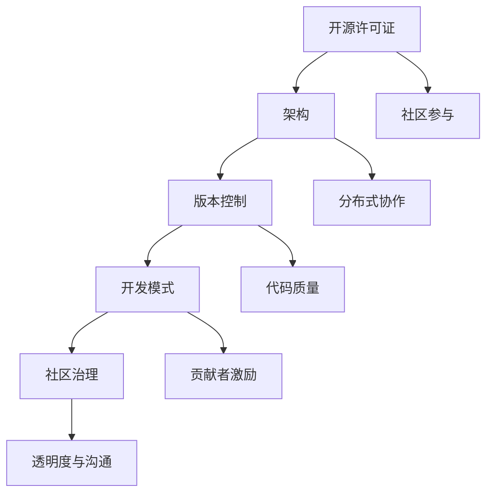

                 

### {文章标题}

开源软件的商业模式：案例研究与最佳实践

#### {关键词}

开源软件，商业模式，盈利模式，社区驱动，国际化策略，最佳实践

#### {摘要}

本文旨在探讨开源软件的商业模式，通过深入分析开源软件的发展背景、核心概念、商业模式、盈利模式、国际化策略以及最佳实践，揭示开源软件商业化的本质和最佳路径。文章将以案例研究为支撑，结合实际项目实战，提供详细的算法原理讲解和数学模型分析，帮助读者全面了解并掌握开源软件商业化的核心知识和实践技巧。

### 目录大纲

#### 第一部分：开源软件的发展背景

##### 第1章：开源软件的历史与演进

**1.1 开源运动的起源**

- **开源运动的起源与背景**：介绍开源运动的起源，讨论其背后的哲学和理念，如自由软件运动和开源运动的核心价值观。
- **开源运动的核心价值观**：探讨自由、共享、协作等核心价值观在开源运动中的体现，以及这些价值观对软件产业发展的影响。

**1.2 开源软件的发展历程**

- **从Linux到Apache：开源软件的里程碑事件**：回顾开源软件的发展历程，重点介绍Linux、Apache等开源项目的诞生和成长，探讨这些项目的成功经验。
- **开源软件的商业化进程**：分析开源软件从非商业性项目转向商业应用的过程，探讨商业模式创新对企业的影响。

**1.3 开源软件的生态圈**

- **开源社区的角色和功能**：介绍开源社区的组织形式和功能，如代码贡献、文档编写、测试与反馈等。
- **开源软件产业链分析**：分析开源软件产业链的构成，包括开发者、用户、企业等角色及其相互作用关系。

**1.4 开源软件的社会影响**

- **开源软件对传统软件产业的冲击**：探讨开源软件对传统软件产业，如软件供应商、软件开发者、软件销售商等的冲击，以及这些冲击所带来的变革。
- **开源软件对社会创新的影响**：讨论开源软件对社会创新、创业、技术进步等方面的推动作用，以及开源软件在全球范围内的传播和普及。

#### 第二部分：开源软件的商业模式

##### 第2章：开源软件的核心概念

**2.1 开源许可证**

- **常见开源许可证介绍**：介绍常见的开源许可证，如GPL、Apache License、MIT License等，讨论每种许可证的特点和适用场景。
- **许可证的选择与适用**：分析开源许可证的选择和适用原则，讨论如何根据项目特点和市场需求选择合适的许可证。

**2.2 开源软件的架构**

- **微服务架构与容器技术**：介绍微服务架构和容器技术在开源软件中的应用，探讨其优势和实践经验。
- **微内核与模块化设计**：讨论微内核和模块化设计在开源软件架构中的重要性，分析其实现方法和应用场景。

**2.3 开源软件的版本控制**

- **Git的基本使用**：介绍Git的基本概念和操作，如克隆、提交、拉取、合并等。
- **GitHub与GitLab的使用场景**：分析GitHub和GitLab在开源软件开发和协作中的具体应用场景，探讨各自的优势和特点。

**2.4 开源软件的开发模式**

- **联合开发模式**：介绍联合开发模式，如合作开发、代码贡献等，分析其优势和实践经验。
- **社区驱动的开发模式**：探讨社区驱动的开发模式，如社区参与、贡献者激励机制等，分析其优势和实现方法。

#### 第二部分：开源软件的商业模式

##### 第3章：开源软件的商业化策略

**3.1 商业化模式概述**

- **商业化与开源的兼容性**：讨论商业化与开源的兼容性，分析开源软件商业化过程中可能遇到的挑战和解决方案。
- **开源软件商业化的挑战**：探讨开源软件商业化的主要挑战，如用户获取、盈利模式创新、知识产权保护等。

**3.2 商业化模式的种类**

- **服务型商业模型（SaaS）**：介绍服务型商业模型（SaaS），如在线服务、云服务、订阅服务等，分析其优势和实现方法。
- **平台型商业模型**：讨论平台型商业模型，如开源平台、生态系统构建等，分析其商业模式和成功案例。
- **插件与附加服务**：介绍插件与附加服务，如扩展功能、专业服务、定制开发等，分析其盈利模式和实现方法。

**3.3 商业化案例分析**

- **MySQL的案例**：分析MySQL开源软件的商业化路径，探讨其成功经验和挑战。
- **Linux内核的商业化**：讨论Linux内核的商业化模式，分析其在企业级市场的应用和影响。

#### 第二部分：开源软件的商业模式

##### 第4章：开源软件的盈利模式

**4.1 收费服务的种类**

- **企业订阅服务**：介绍企业订阅服务，如年度订阅、月度订阅等，分析其盈利模式和市场前景。
- **实时支持服务**：探讨实时支持服务的种类和模式，如在线支持、电话支持、专家服务包等，分析其盈利模式和用户需求。
- **培训与认证服务**：介绍培训与认证服务，如在线课程、认证考试、专业培训等，分析其盈利模式和市场需求。

**4.2 增值服务的潜力**

- **插件与扩展开发**：讨论插件与扩展开发的潜力，如商业插件、定制插件等，分析其盈利模式和用户需求。
- **系统集成服务**：介绍系统集成服务，如项目定制、系统集成、解决方案提供等，分析其盈利模式和市场需求。
- **定制开发服务**：探讨定制开发服务的模式和方法，如需求分析、功能定制、代码开发等，分析其盈利模式和用户需求。

**4.3 免费增值策略**

- **基础功能免费，增值功能收费**：讨论基础功能免费，增值功能收费的策略，如免费试用期、付费功能扩展等，分析其优势和实现方法。
- **广告模式**：介绍广告模式的盈利模式，如展示广告、内容赞助等，分析其优势和实现方法。
- **数据交易**：探讨数据交易的盈利模式，如数据开放、数据交易市场等，分析其优势和实现方法。

#### 第二部分：开源软件的商业模式

##### 第5章：开源软件的商业模式创新

**5.1 平台生态建设**

- **开源平台的商业模式**：介绍开源平台的商业模式，如平台服务、平台开发、生态系统构建等，分析其优势和实现方法。
- **平台经济与网络效应**：讨论平台经济和网络效应在开源软件平台中的体现，分析其对平台商业模式的影响。

**5.2 商业联盟与合作伙伴**

- **开源社区与商业公司的合作模式**：介绍开源社区与商业公司的合作模式，如联合开发、代码贡献、资源共享等，分析其优势和实现方法。
- **产业链上下游的合作策略**：讨论产业链上下游合作策略，如供应商合作、客户合作、合作伙伴计划等，分析其优势和实现方法。

**5.3 社区驱动的商业模式**

- **社区参与的激励机制**：探讨社区参与的激励机制，如贡献者奖励、积分制度、荣誉系统等，分析其优势和实现方法。
- **社区驱动的商业模式案例**：分析社区驱动的商业模式案例，如WordPress、GitHub等，探讨其成功经验和挑战。

#### 第二部分：开源软件的商业模式

##### 第6章：开源软件的国际化策略

**6.1 国际化的重要性**

- **开源软件的全球市场**：讨论开源软件的全球市场现状和发展趋势，分析国际化对开源软件商业化的影响。
- **国际化与本地化的平衡**：探讨国际化与本地化的平衡策略，如多语言支持、文化适应性、市场细分等，分析其优势和实现方法。

**6.2 国际化战略的制定**

- **语言本地化**：介绍语言本地化的策略和方法，如翻译、国际化框架等，分析其优势和实现方法。
- **支持多元文化**：讨论支持多元文化的策略，如文化适应性、多文化团队建设等，分析其优势和实现方法。
- **法律法规遵守**：探讨开源软件国际化过程中需要遵守的法律法规，如知识产权法、合同法、数据保护法等，分析其合规策略和实现方法。

**6.3 国际化案例分析**

- **OpenStack的国际化经验**：分析OpenStack的国际化经验，探讨其在国际化过程中的成功经验和挑战。
- **WordPress的多语种策略**：讨论WordPress的多语种策略，分析其在国际化市场中的表现和优势。

#### 第三部分：开源软件的实践与展望

##### 第7章：开源软件的最佳实践

**7.1 项目管理最佳实践**

- **开源项目的生命周期管理**：讨论开源项目的生命周期管理，如项目启动、项目规划、项目实施、项目维护等，分析其最佳实践。
- **项目敏捷管理的实践**：探讨开源项目的敏捷管理实践，如Scrum、Kanban等，分析其优势和实现方法。

**7.2 开源社区建设**

- **社区互动与沟通策略**：讨论开源社区互动与沟通策略，如在线会议、社区论坛、社交媒体等，分析其优势和实现方法。
- **社区治理与维护**：探讨开源社区的治理与维护，如社区规则、冲突解决、贡献者管理等，分析其最佳实践。

**7.3 开源软件的可持续发展**

- **长期维护与更新**：讨论开源软件的长期维护与更新策略，如代码质量保证、文档维护、社区参与等，分析其优势和实现方法。
- **社区贡献激励机制**：探讨开源社区贡献激励机制，如贡献者奖励、积分制度、荣誉系统等，分析其优势和实现方法。

#### 第三部分：开源软件的实践与展望

##### 第8章：开源软件的未来趋势

**8.1 新兴技术对开源的影响**

- **人工智能与开源**：讨论人工智能对开源软件的影响，如开源人工智能框架、开源人工智能工具等，分析其发展趋势和应用场景。
- **区块链与开源**：探讨区块链对开源软件的影响，如开源区块链平台、开源区块链应用等，分析其发展趋势和应用场景。

**8.2 开源软件的商业化新趋势**

- **云原生开源**：讨论云原生开源的发展趋势，如容器化、微服务、自动化等，分析其商业模式和应用场景。
- **开源软件的“软件即服务”（SaaS）模式**：探讨开源软件的“软件即服务”（SaaS）模式的发展趋势，如在线服务、云服务、订阅服务等，分析其商业模式和应用场景。

**8.3 开源软件的未来展望**

- **开源软件在新兴市场的发展**：讨论开源软件在新兴市场的发展趋势，如亚太地区、非洲地区等，分析其市场前景和商业机会。
- **开源软件的商业化与可持续发展**：探讨开源软件的商业化与可持续发展路径，如商业模式创新、社区建设、生态系统构建等，分析其长期发展策略。

#### 附录

##### 附录A：开源软件资源与工具

**A.1 开源软件许可证指南**

- **常见开源许可证详解**：介绍常见的开源许可证，如GPL、Apache License、MIT License等，分析其特点和适用场景。
- **许可证合规性检查工具**：介绍开源软件许可证合规性检查工具，如FOSSA、FOSSA Core等，分析其功能和应用场景。

**A.2 开源社区平台介绍**

- **GitHub与GitLab的使用**：介绍GitHub和GitLab在开源软件开发和协作中的具体应用场景，分析其优势和特点。
- **Open Source Social Networks**：讨论开源社区平台，如Mastodon、Friendica等，分析其社区特点和参与方式。

**A.3 开源软件开发工具**

- **深度学习框架**：介绍开源深度学习框架，如TensorFlow、PyTorch等，分析其功能和应用场景。
- **版本控制工具**：介绍常用的版本控制工具，如Git、Mercurial等，分析其优势和特点。

##### 附录B：开源商业案例研究

**B.1 特定开源商业案例**

- **成功与失败案例**：分析特定开源商业案例的成功与失败原因，探讨其商业模式的优缺点和适用性。
- **分析与总结**：总结开源商业案例中的经验和教训，提出开源软件商业化的可行路径和策略。

##### 附录C：开源社区参与指南

**C.1 参与开源社区的流程**

- **如何贡献代码**：介绍如何参与开源社区，贡献代码的流程和方法，如代码审查、合并请求等。
- **如何报告bug**：讨论如何报告开源软件中的bug，分析报告bug的流程和注意事项。

**C.2 开源社区行为规范**

- **社区礼仪**：讨论开源社区中的礼仪规范，如尊重他人、保持友善、积极参与等。
- **解决冲突的策略**：探讨解决开源社区冲突的策略和方法，如沟通技巧、冲突调解等。

### 作者信息

**作者：** AI天才研究院/AI Genius Institute & 禅与计算机程序设计艺术 /Zen And The Art of Computer Programming

### 结语

开源软件的商业模式是一个复杂而充满挑战的领域。本文通过深入分析开源软件的发展背景、核心概念、商业模式、盈利模式、国际化策略以及最佳实践，揭示了开源软件商业化的本质和最佳路径。文章以案例研究为支撑，结合实际项目实战，提供了详细的算法原理讲解和数学模型分析，帮助读者全面了解并掌握开源软件商业化的核心知识和实践技巧。

在开源软件的不断发展中，商业模式的创新和优化仍然是至关重要的。未来，随着人工智能、区块链等新兴技术的融入，开源软件的商业模式将迎来新的机遇和挑战。希望本文能为开源软件从业者和爱好者提供有益的参考和启示，共同推动开源软件的繁荣和发展。让我们携手并进，共创开源软件的美好未来！
### 第1章：开源软件的历史与演进

#### 1.1 开源运动的起源

开源运动的起源可以追溯到20世纪70年代末和80年代初，当时计算机技术和软件行业正处于快速发展阶段。早期的计算机系统大多由大型计算机厂商垄断，用户只能使用这些厂商提供的软件，且价格昂贵。这种封闭的商业模式限制了技术的传播和创新，引发了用户对自由和开放软件的需求。

1976年，著名的计算机科学家理查德·斯托曼（Richard Stallman）在麻省理工学院（MIT）创立了自由软件基金会（Free Software Foundation，FSF），这是开源运动的标志性事件之一。斯托曼提出自由软件的理念，主张用户应享有使用、学习、修改和分享软件的自由。这一理念迅速得到了许多计算机科学家的支持和响应，从而形成了自由软件运动。

自由软件运动的核心价值观包括自由、共享、协作等。这些价值观不仅体现在软件本身，还渗透到整个软件开发和传播过程中。自由软件运动的兴起，标志着软件从封闭的、商业化的模式向开放的、社区驱动的模式转变。

#### 1.2 开源软件的发展历程

开源软件的发展历程可以分为几个重要阶段，每个阶段都标志着开源运动的重要进展和里程碑。

**1.2.1 从Linux到Apache：开源软件的里程碑事件**

1983年，理查德·斯托曼发布了第一版GNU通用公共许可证（GNU General Public License，GPL），这是最早的开源许可证之一。随后，斯托曼及其团队开发了大量的自由软件，如GCC（GNU编译器集合）、GNU Bash等。这些软件为后来的开源软件奠定了基础。

1991年，林纳斯·托瓦兹（Linus Torvalds）发布了Linux内核的第一版。Linux内核是一个免费、开放源代码的操作系统核心，它结合了GNU工具和其他开源软件，形成了一个完整的操作系统。Linux的诞生标志着开源软件在操作系统领域的突破，极大地推动了开源软件的发展。

1995年，Apache HTTP服务器项目正式成立。Apache成为第一个广泛使用的开源Web服务器软件，推动了Web技术的发展和互联网的普及。Apache的成功展示了开源软件在关键基础设施领域的重要性，进一步激发了开源软件的创新和发展。

**1.2.2 开源软件的商业化进程**

随着开源软件的普及，许多企业开始关注开源软件的商业潜力。开源软件的商业化进程可以分为几个阶段：

- **早期阶段**：在这个阶段，许多开源项目仍然以非商业的形式存在，开发者主要以志愿者的身份参与。一些企业开始赞助这些开源项目，以获取技术优势和市场份额。

- **成熟阶段**：在这个阶段，一些成功的开源项目开始形成商业化的商业模式。例如，MySQL、Joomla等开源项目通过提供付费支持、定制开发等服务实现了商业化。这些商业模式的成功，为其他开源项目提供了示范和借鉴。

- **多元阶段**：随着云计算、容器技术等新兴技术的发展，开源软件的商业化模式变得更加多样化和复杂。企业可以通过提供SaaS（软件即服务）、PaaS（平台即服务）等服务，实现开源软件的商业化。同时，开源社区和企业之间的合作也更加紧密，形成了一种互利共赢的生态系统。

#### 1.3 开源软件的生态圈

开源软件的生态圈是一个复杂的网络，包括开发者、用户、企业、社区等各种角色。这些角色相互作用，共同推动开源软件的发展。

**1.3.1 开源社区的角色和功能**

开源社区是开源软件生态圈的核心，由一群热爱开源、愿意贡献自己的时间和精力的志愿者组成。开源社区的主要角色和功能包括：

- **代码贡献者**：他们负责编写、测试和修复代码，推动开源项目的进展。
- **文档编写者**：他们负责编写和维护项目的文档，帮助其他开发者理解和使用开源软件。
- **测试者**：他们负责测试开源软件的功能和性能，确保软件的质量。
- **维护者**：他们负责管理和维护开源项目的代码库，确保项目的稳定性和安全性。

**1.3.2 开源软件产业链分析**

开源软件产业链包括多个环节，从软件开发、测试、部署到维护，每个环节都有不同的角色和参与者。以下是开源软件产业链的主要组成部分：

- **开发者**：他们是开源软件的主要创造者，负责编写、测试和优化代码。
- **用户**：他们是开源软件的直接受益者，使用开源软件解决实际问题。
- **企业**：它们通过赞助开源项目、提供付费服务等方式参与开源软件的开发和推广。
- **社区**：它是一个开放的、协作的网络，由开发者、用户、企业等角色组成，共同推动开源软件的发展。

**1.3.3 开源软件的产业链特点**

开源软件的产业链具有以下几个特点：

- **去中心化**：开源软件的开发和传播不依赖于单一的组织或企业，而是由一个分布式、去中心化的社区共同推动。
- **协同合作**：开源软件的开发和推广依赖于社区成员的协同合作，每个成员都为项目的成功贡献力量。
- **可持续性**：开源软件的商业模式使得项目具有可持续性，企业可以通过提供付费服务、赞助等方式获得收益，从而支持开源软件的长期发展。

#### 1.4 开源软件的社会影响

开源软件对传统软件产业的冲击和推动社会创新、创业等方面产生了深远的影响。

**1.4.1 开源软件对传统软件产业的冲击**

开源软件对传统软件产业，特别是商业软件产业产生了巨大的冲击。以下是一些具体的表现：

- **价格竞争**：开源软件通常免费提供，这使得商业软件在价格上处于劣势，迫使其降低价格或提供更多增值服务。
- **技术壁垒降低**：开源软件的源代码公开，使得用户可以自由地修改和优化软件，降低了技术壁垒，促进了技术的普及和应用。
- **商业模式转变**：开源软件推动了商业软件产业的商业模式转变，许多企业开始从传统的软件销售模式转向提供付费服务、云服务、定制开发等模式。

**1.4.2 开源软件对社会创新的影响**

开源软件对社会创新、创业等方面产生了积极的推动作用。以下是一些具体的影响：

- **降低创业门槛**：开源软件为创业者提供了丰富的技术资源和工具，降低了创业的门槛和成本，促进了创新和创业活动的开展。
- **加速技术进步**：开源软件鼓励了技术的快速传播和协作，促进了技术的创新和发展，加速了技术的进步。
- **推动社会进步**：开源软件在全球范围内的传播和普及，促进了信息的自由流通和共享，推动了社会的进步和发展。

**1.4.3 开源软件的全球传播和普及**

开源软件在全球范围内的传播和普及，对全球软件产业和社会发展产生了深远的影响。以下是一些具体的影响：

- **技术多样性和竞争**：开源软件的普及促进了技术的多样性和竞争，激发了创新和进步的动力。
- **教育普及**：开源软件为全球各地的人们提供了免费的学习资源和工具，促进了教育的普及和提高。
- **经济合作**：开源软件推动了全球范围内的经济合作和交流，促进了技术和市场的融合。

#### 1.5 开源软件的历史和演进对现代软件开发的影响

开源软件的历史和演进对现代软件开发产生了深远的影响。以下是一些具体的影响：

- **软件开发模式的转变**：开源软件推动了软件开发模式的转变，从封闭的、商业化的模式向开放的、社区驱动的模式转变。这种转变促进了技术的传播和创新，提高了软件开发的效率和质量。
- **开源许可证的应用**：开源许可证在软件开发中得到了广泛应用，如GPL、Apache License、MIT License等。这些许可证保护了开发者的权益，同时也促进了软件的传播和共享。
- **社区协作的重要性**：开源软件的发展表明，社区协作在软件开发中的重要性。通过社区协作，开发者可以共同解决技术难题，优化软件性能，提高软件质量。
- **商业模式的创新**：开源软件的商业模式为现代软件开发提供了新的思路和模式。企业可以通过提供付费服务、云服务、定制开发等方式，实现开源软件的商业化，从而获得收益。

#### 1.6 开源软件的历史和演进过程中的挑战和机遇

在开源软件的历史和演进过程中，既面临着许多挑战，也充满了机遇。以下是一些主要的挑战和机遇：

**1.6.1 挑战**

- **知识产权保护**：开源软件的源代码公开，使得知识产权保护成为一个挑战。开发者需要确保开源项目的代码不侵犯他人的知识产权，同时也需要保护自己的知识产权。
- **社区治理**：开源社区中的参与者来自不同的背景和利益，如何有效地管理和协调社区成员，确保项目的稳定和发展，是一个挑战。
- **商业化与开源精神的平衡**：开源软件的商业化需要平衡商业利益和开源精神。如何在商业化过程中保护开源社区的利益，避免商业化的负面影响，是一个挑战。
- **技术门槛**：对于许多开发者来说，参与开源软件项目需要一定的技术门槛。如何降低技术门槛，吸引更多的开发者参与开源项目，是一个挑战。

**1.6.2 机遇**

- **全球合作**：开源软件的发展促进了全球范围内的技术合作和交流，为开发者提供了更多的机会和资源。
- **技术创新**：开源软件鼓励了技术创新和协作，促进了技术的快速发展和进步。
- **商业模式创新**：开源软件的商业模式为开发者提供了新的思路和模式，如SaaS、PaaS等，为商业创新提供了新的机会。
- **社会影响力**：开源软件在社会各个领域产生了深远的影响，推动了社会的进步和发展。

#### 1.7 开源软件的发展对软件开发者和企业的启示

开源软件的发展为软件开发者和企业提供了许多启示。以下是一些主要的启示：

- **开放与共享**：开源软件的理念强调了开放和共享的重要性。软件开发者和企业应该积极拥抱开放和共享的理念，通过共享技术资源和知识，促进技术的发展和创新。
- **社区协作**：开源社区的成功表明，社区协作在软件开发中的重要性。软件开发者和企业应该重视社区协作，通过建立健康、活跃的社区，提高软件开发的效率和质量。
- **商业模式的创新**：开源软件的商业模式为软件开发者和企业提供了新的思路和模式。开发者和企业应该积极探索新的商业模式，实现开源软件的商业化，从而获得收益。
- **社会责任**：开源软件的发展也提醒软件开发者和企业，应承担更多的社会责任。通过开源软件，软件开发者和企业可以推动技术的普及和应用，促进社会的进步和发展。

#### 1.8 未来开源软件的发展趋势

展望未来，开源软件将继续快速发展，并对软件开发和产业产生深远的影响。以下是一些未来开源软件的发展趋势：

- **技术创新**：随着人工智能、区块链、物联网等新兴技术的发展，开源软件将在这些领域发挥重要作用，推动技术创新和应用。
- **商业模式多样化**：开源软件的商业模式将继续创新，如SaaS、PaaS、云服务等的广泛应用，为软件开发者和企业提供了更多的商业机会。
- **社区治理**：开源社区的治理将得到更多关注，如何建立健康、活跃的社区，提高社区成员的参与度和满意度，将成为重要的研究方向。
- **国际化**：随着全球化的推进，开源软件的国际化趋势将更加明显。开源社区和企业将面临更多的国际化挑战，如何适应不同的文化和市场，将成为重要课题。

总之，开源软件的发展将继续推动软件产业的进步和社会的发展，为软件开发者和企业带来新的机遇和挑战。开发者和企业应积极应对这些挑战，抓住机遇，推动开源软件的繁荣和发展。

### 第2章：开源软件的核心概念

开源软件的核心概念是理解其商业模式和成功因素的关键。在本章中，我们将深入探讨开源软件的许可证、架构、版本控制以及开发模式。

#### 2.1 开源许可证

开源许可证是确保软件开源属性的重要工具。它们定义了用户如何使用、修改和分发软件。以下是一些常见的开源许可证及其特点：

**1. GNU通用公共许可证（GPL）**

- **特点**：GPL是自由软件基金会（FSF）推出的许可证，要求用户在修改软件后必须以相同方式共享源代码，确保软件的开放性。
- **适用场景**：适合那些希望保持软件开源并限制衍生作品商业化的项目。

**2. Apache许可证**

- **特点**：Apache许可证是一种宽松的许可证，允许用户在商业和非商业项目中使用、修改和分发软件，但需要保留版权声明和许可证信息。
- **适用场景**：适合希望保留灵活性，同时允许用户商业使用的项目。

**3. MIT许可证**

- **特点**：MIT许可证是一种非常宽松的许可证，几乎不限制用户如何使用、修改和分发软件。
- **适用场景**：适合希望最大化软件自由度的项目。

**选择开源许可证的原则**

- **项目特点**：根据项目的需求，选择适合的许可证。例如，如果项目注重社区的广泛参与，可以选择GPL。
- **用户需求**：考虑目标用户群体的期望和需求，确保许可证符合他们的使用习惯。
- **商业兼容性**：确保所选许可证与商业伙伴的业务模式兼容，避免潜在的纠纷。

#### 2.2 开源软件的架构

开源软件的架构设计对其性能、可扩展性和维护性有重要影响。以下是一些常见的架构模式和设计原则：

**1. 微服务架构**

- **定义**：微服务架构将应用程序拆分为多个小型、独立的服务，每个服务负责特定的业务功能。
- **优点**：提高系统的可维护性、可扩展性和灵活性，便于团队并行开发和部署。
- **适用场景**：适合大型、复杂的应用程序，如电子商务平台、金融系统等。

**2. 容器化技术**

- **定义**：容器化技术（如Docker）提供了一种轻量级、可移植的软件打包和运行环境。
- **优点**：简化部署流程、提高系统的一致性和可复用性。
- **适用场景**：适合需要快速部署和扩展的应用程序，如Web应用、大数据处理等。

**3. 微内核与模块化设计**

- **定义**：微内核设计将核心功能与外部模块分离，提高系统的稳定性和可扩展性。
- **优点**：提高系统的可维护性、可扩展性和灵活性。
- **适用场景**：适合需要高度可扩展性和稳定性的系统，如操作系统、嵌入式系统等。

#### 2.3 开源软件的版本控制

版本控制是开源软件开发中的重要环节，确保代码的完整性和可追溯性。以下是一些常用的版本控制工具和概念：

**1. Git**

- **定义**：Git是一种分布式版本控制系统，支持快速、高效的代码管理和协作。
- **优点**：分布式架构、分支管理灵活、操作简便。
- **适用场景**：适合大多数开源项目，特别是需要协作开发的项目。

**2. GitHub和GitLab**

- **定义**：GitHub和GitLab是流行的在线版本控制系统，提供代码托管、协作工具、项目管理等功能。
- **优点**：易于使用、功能丰富、社区支持强大。
- **适用场景**：适合需要在线协作和社区参与的项目。

**版本控制的最佳实践**

- **分支管理**：采用分支管理策略（如GitFlow或GitHub Flow），确保代码的稳定性和可追溯性。
- **代码审查**：通过代码审查（Code Review），提高代码质量和协作效率。
- **持续集成**：实施持续集成（CI）流程，自动化测试和部署，确保代码的质量和可靠性。

#### 2.4 开源软件的开发模式

开源软件的开发模式强调社区的参与和协作，以下是一些常见的开发模式：

**1. 联合开发模式**

- **定义**：联合开发模式是指多个团队或个人共同参与一个开源项目。
- **优点**：提高开发效率、整合不同团队的资源和优势。
- **适用场景**：适合大型、复杂的项目，如操作系统、数据库等。

**2. 社区驱动的开发模式**

- **定义**：社区驱动的开发模式是指项目由一个活跃的社区主导，贡献者自愿参与。
- **优点**：激发社区的创造力、提高项目的透明度和参与度。
- **适用场景**：适合大多数开源项目，特别是那些需要广泛社区参与的项目。

**社区驱动的开发模式的关键要素**

- **社区治理**：建立有效的社区治理机制，确保社区的稳定性和协作效率。
- **贡献者激励机制**：提供贡献者奖励、荣誉系统等激励机制，鼓励贡献者的积极参与。
- **透明度和沟通**：保持项目透明度，通过社区论坛、邮件列表等渠道促进沟通和协作。

#### 2.5 开源软件的核心概念与联系

开源软件的核心概念相互联系，共同构成了一个完整的开发生态系统。以下是一个简化的Mermaid流程图，展示了这些核心概念之间的联系：



**核心概念与联系**

- **开源许可证**：确保软件的开放性和可修改性，为其他概念提供基础。
- **架构**：影响软件的性能、可扩展性和维护性，与版本控制和开发模式紧密相关。
- **版本控制**：管理代码的变更和协作，支持社区的参与和持续集成。
- **开发模式**：促进社区的参与和协作，影响社区治理和透明度。

通过理解这些核心概念及其联系，开发者可以更有效地构建和管理开源项目，推动开源软件的繁荣和发展。

#### 2.6 开源软件的核心概念在实际项目中的应用

为了更好地理解开源软件的核心概念，我们可以通过一些具体的实际项目来探讨这些概念的应用。

**1. 项目：Kubernetes**

- **开源许可证**：Kubernetes使用Apache 2.0许可证，这是一种宽松的许可证，允许用户在商业和非商业项目中使用、修改和分发Kubernetes。
- **架构**：Kubernetes采用微服务架构，将基础设施的管理拆分为多个独立的组件，如API服务器、控制器管理器、节点等，提高了系统的灵活性和可扩展性。
- **版本控制**：Kubernetes使用Git进行版本控制，通过GitHub进行代码管理和协作。社区成员可以提交代码、进行代码审查和合并请求，确保代码的质量和稳定性。
- **开发模式**：Kubernetes采用社区驱动的开发模式，由一个活跃的社区主导，贡献者通过GitHub进行协作。社区治理通过贡献者指南和代码贡献过程来维护社区的稳定性和协作效率。

**2. 项目：TensorFlow**

- **开源许可证**：TensorFlow使用Apache 2.0许可证，允许用户在商业和非商业项目中使用TensorFlow，但需要保留版权声明和许可证信息。
- **架构**：TensorFlow采用模块化设计，将核心算法和工具拆分为多个独立的模块，如计算图、数据流图等，提高了系统的可扩展性和灵活性。
- **版本控制**：TensorFlow使用Git进行版本控制，通过GitHub进行代码管理和协作。社区成员可以提交代码、进行代码审查和合并请求，确保代码的质量和稳定性。
- **开发模式**：TensorFlow采用社区驱动的开发模式，由一个活跃的社区主导，贡献者通过GitHub进行协作。社区治理通过贡献者指南和代码贡献过程来维护社区的稳定性和协作效率。

**3. 项目：Django**

- **开源许可证**：Django使用BSD许可证，这是一种非常宽松的许可证，几乎不限制用户如何使用、修改和分发Django。
- **架构**：Django采用微服务架构，将应用程序拆分为多个小型、独立的组件，如数据库层、视图层、模板层等，提高了系统的可维护性和可扩展性。
- **版本控制**：Django使用Git进行版本控制，通过GitHub进行代码管理和协作。社区成员可以提交代码、进行代码审查和合并请求，确保代码的质量和稳定性。
- **开发模式**：Django采用社区驱动的开发模式，由一个活跃的社区主导，贡献者通过GitHub进行协作。社区治理通过贡献者指南和代码贡献过程来维护社区的稳定性和协作效率。

通过这些实际项目，我们可以看到开源软件的核心概念在实际应用中的具体体现，这些概念相互关联，共同推动开源软件的发展和繁荣。

### 第3章：开源软件的商业化策略

开源软件的商业化策略是开源项目成功的关键因素之一。在这个章节中，我们将深入探讨开源软件商业化的各种模式，包括服务型商业模式（SaaS）、平台型商业模式以及插件与附加服务。

#### 3.1 商业化模式概述

开源软件的商业化模式与传统软件商业模式有所不同。传统软件商业模式往往依赖于软件销售和许可费用，而开源软件则通过其他方式实现商业化。

**1. 商业化与开源的兼容性**

开源软件的商业化需要平衡开源精神和商业利益。开源精神强调自由、共享和协作，而商业化则关注盈利和利润。为了实现这两者的兼容，开源项目通常采用以下策略：

- **双许可证策略**：开源项目可以同时使用两种许可证，如GPL和AGPL。GPL许可证适用于非商业使用，而AGPL许可证适用于商业使用。这样，项目可以在保持开源的同时，为商业用户提供额外的服务或许可。
- **模块化设计**：将开源软件的核心功能和商业功能分开，用户可以选择免费使用核心功能，或者付费使用商业功能。

**2. 开源软件商业化的挑战**

尽管开源软件具有巨大的商业潜力，但在商业化过程中仍然面临一些挑战：

- **用户获取**：开源软件通常免费提供，如何吸引和保留付费用户是一个挑战。
- **盈利模式创新**：需要找到合适的盈利模式，如订阅服务、定制开发、增值服务等。
- **知识产权保护**：开源软件的源代码公开，如何保护开发者的知识产权是一个挑战。

#### 3.2 商业化模式的种类

开源软件的商业化模式多种多样，以下是一些常见的商业化模式：

**1. 服务型商业模式（SaaS）**

- **定义**：SaaS（Software as a Service）是一种基于云的软件服务模式，用户通过互联网访问和使用软件，无需本地安装。
- **优点**：降低用户使用门槛、提高灵活性、降低维护成本。
- **适用场景**：适用于需要灵活部署和快速响应的市场，如企业应用、在线工具等。

**2. 平台型商业模式**

- **定义**：平台型商业模式是指建立开放的平台，吸引第三方开发者或服务提供商加入，共同构建生态系统。
- **优点**：促进创新、提高用户参与度、形成网络效应。
- **适用场景**：适用于需要广泛合作伙伴和市场覆盖的场景，如电商平台、社交媒体等。

**3. 插件与附加服务**

- **定义**：插件与附加服务是开源软件的扩展功能，通常需要付费购买。
- **优点**：增加软件的价值、提高用户满意度、创造新的盈利渠道。
- **适用场景**：适用于具有明显增值需求的功能，如专业版插件、定制化解决方案等。

#### 3.3 商业化案例分析

**1. MySQL的案例**

MySQL是一个流行的开源关系数据库管理系统，其成功商业化的历程为其他开源项目提供了宝贵的经验。

- **商业化策略**：MySQL采用了双许可证策略，GPL许可证适用于非商业使用，而商业许可证适用于商业使用。通过提供商业许可证和支持服务，MySQL吸引了大量付费用户。
- **盈利模式**：MySQL的盈利模式包括：
  - 商业许可证销售：企业购买商业许可证，以获得额外的支持和服务。
  - 订阅服务：提供定期的更新和维护服务。
  - 插件和扩展：提供付费插件和扩展，增加软件的功能和价值。
- **成功经验**：MySQL的成功经验表明，开源项目可以通过合理的商业化策略，实现商业化和可持续发展。

**2. Linux内核的商业化**

Linux内核是一个开源的操作系统核心，其商业化进程也值得关注。

- **商业化策略**：Linux内核的商业化主要依赖于企业赞助和定制开发服务。许多企业赞助Linux内核的开发，以支持特定功能或优化性能。
- **盈利模式**：Linux内核的盈利模式包括：
  - 企业赞助：企业通过赞助内核开发，获得技术优势和品牌曝光。
  - 定制开发：为企业提供定制化的内核开发服务，满足特定需求。
  - 开源社区合作：与开源社区合作，共同推动内核的发展，同时为社区成员提供商业机会。
- **成功经验**：Linux内核的商业化成功表明，开源项目可以通过社区合作和企业赞助，实现商业化和技术创新。

#### 3.4 开源软件商业化的挑战与机遇

**1. 挑战**

- **用户获取**：开源软件通常免费提供，如何吸引和保留付费用户是一个挑战。
- **盈利模式创新**：需要找到合适的盈利模式，如订阅服务、增值服务等。
- **知识产权保护**：开源软件的源代码公开，如何保护开发者的知识产权是一个挑战。

**2. 机遇**

- **社区参与**：开源项目通常有活跃的社区参与，这为商业化提供了机会。
- **技术创新**：开源项目鼓励技术创新和协作，为商业化提供了强大的技术支持。
- **商业模式多样化**：随着新兴技术和市场需求的不断变化，开源软件的商业模式也在不断创新，为开发者提供了更多的商业机会。

#### 3.5 开源软件商业化的最佳实践

**1. 确定合适的商业化策略**

- **项目特点**：根据项目的特点，选择合适的商业化策略。例如，对于技术密集型项目，可以考虑订阅服务和定制开发。
- **市场需求**：分析市场需求，找到潜在的用户群体和付费点。
- **社区参与**：鼓励社区参与，通过社区反馈和协作，优化商业化策略。

**2. 创新盈利模式**

- **多元化盈利模式**：探索多种盈利模式，如订阅服务、广告收入、增值服务等。
- **用户参与**：通过用户参与和反馈，不断优化产品和服务，提高用户满意度和忠诚度。

**3. 保护知识产权**

- **双许可证策略**：采用双许可证策略，保护开源软件的知识产权。
- **合作协议**：与用户和合作伙伴签订合作协议，明确知识产权归属和使用条款。

**4. 建立健康的社区**

- **社区治理**：建立有效的社区治理机制，确保社区的稳定性和协作效率。
- **贡献者激励机制**：提供贡献者奖励和荣誉系统，鼓励社区成员的积极参与。

通过这些最佳实践，开源项目可以更好地实现商业化，推动项目的可持续发展。

### 第4章：开源软件的盈利模式

开源软件的盈利模式是开源项目实现商业化的关键途径。在这个章节中，我们将深入探讨开源软件的盈利模式，包括收费服务的种类、增值服务的潜力以及免费增值策略。

#### 4.1 收费服务的种类

开源软件的收费服务是其实现盈利的主要手段之一。以下是一些常见的收费服务种类：

**1. 企业订阅服务**

- **定义**：企业订阅服务是指企业为获取开源软件的支持、更新和增值服务而定期支付费用。
- **优点**：稳定收入来源、长期客户关系、提高软件质量。
- **适用场景**：适用于具有长期需求的企业用户，如企业级数据库、开发框架等。

**2. 实时支持服务**

- **定义**：实时支持服务是指开源项目团队为用户提供实时技术支持，如在线聊天、电话支持等。
- **优点**：快速解决问题、提高用户满意度、建立品牌信誉。
- **适用场景**：适用于需要快速解决技术问题的用户，如开发人员、企业用户等。

**3. 培训与认证服务**

- **定义**：培训与认证服务是指开源项目团队提供的培训课程和认证考试，帮助用户提高技能并获得认证。
- **优点**：增加用户价值、提高用户忠诚度、创造额外收入。
- **适用场景**：适用于希望提升技能和认证水平的用户，如开发人员、技术人员等。

**4. 定制开发服务**

- **定义**：定制开发服务是指根据用户需求，为用户定制开发特定功能的软件模块。
- **优点**：满足用户特定需求、提高用户满意度、创造额外收入。
- **适用场景**：适用于有特定需求的用户，如企业、政府机构等。

**5. 系统集成服务**

- **定义**：系统集成服务是指将开源软件与其他系统或服务集成，提供完整的解决方案。
- **优点**：提高系统协同效率、满足用户多样化需求、创造额外收入。
- **适用场景**：适用于需要集成多个系统的用户，如企业、政府机构等。

#### 4.2 增值服务的潜力

增值服务是开源软件实现盈利的重要途径之一。以下是一些增值服务的潜力：

**1. 插件与扩展开发**

- **定义**：插件与扩展开发是指为开源软件开发额外的功能模块，用户可以付费购买或订阅。
- **优点**：增加软件功能、提高用户满意度、创造额外收入。
- **适用场景**：适用于具有扩展需求的用户，如开发人员、企业用户等。

**2. 专业服务**

- **定义**：专业服务是指为用户提供专业的技术支持、咨询服务等。
- **优点**：提高用户满意度、建立品牌信誉、创造额外收入。
- **适用场景**：适用于需要专业服务的用户，如企业、政府机构等。

**3. 定制化解决方案**

- **定义**：定制化解决方案是指根据用户需求，为用户提供定制化的软件解决方案。
- **优点**：满足用户特定需求、提高用户满意度、创造额外收入。
- **适用场景**：适用于有特定需求的用户，如企业、政府机构等。

**4. 数据服务**

- **定义**：数据服务是指为用户提供数据存储、数据处理、数据分析等服务。
- **优点**：增加用户价值、提高用户满意度、创造额外收入。
- **适用场景**：适用于有数据需求的用户，如企业、研究机构等。

**5. 安全服务**

- **定义**：安全服务是指为用户提供安全解决方案、安全咨询等。
- **优点**：提高用户安全性、建立品牌信誉、创造额外收入。
- **适用场景**：适用于需要安全服务的用户，如企业、政府机构等。

#### 4.3 免费增值策略

免费增值（Freemium）策略是开源软件实现商业化的常用策略之一。以下是一些常见的免费增值策略：

**1. 基础功能免费，增值功能收费**

- **定义**：基础功能免费，增值功能需要付费购买或订阅。
- **优点**：降低用户获取成本、增加付费用户数量、提高用户满意度。
- **适用场景**：适用于具有多样化需求的用户群体，如开发人员、企业用户等。

**2. 广告模式**

- **定义**：通过在软件中展示广告来获取收入。
- **优点**：无需用户付费、增加收入来源、减少商业化风险。
- **适用场景**：适用于用户基数大、市场潜力大的软件，如社交媒体、在线工具等。

**3. 数据交易**

- **定义**：将用户数据进行分析和挖掘，然后将其交易给第三方或广告商。
- **优点**：增加收入来源、提高用户价值、降低商业化风险。
- **适用场景**：适用于有大量用户数据、且用户隐私得到保护的项目，如数据分析工具、社交网络等。

**4. 社区参与激励**

- **定义**：通过激励措施鼓励社区成员参与软件的开发、测试和推广。
- **优点**：增加社区活力、提高软件质量、降低商业化成本。
- **适用场景**：适用于有活跃社区的项目，如开发框架、数据库等。

**5. 交叉销售**

- **定义**：通过提供其他相关产品或服务来增加销售收入。
- **优点**：增加销售收入、提高用户粘性、降低获取新用户成本。
- **适用场景**：适用于有多个产品线或服务线的项目，如云服务、工具集等。

通过这些盈利模式，开源项目可以实现商业化，为开发者带来稳定的收入来源。同时，这些盈利模式也需要开源项目团队根据市场需求和用户反馈不断优化，以实现长期的可持续发展。

### 第5章：开源软件的商业模式创新

开源软件的商业模式创新是推动其长期成功和可持续发展的关键。在这个章节中，我们将探讨平台生态建设、商业联盟与合作伙伴以及社区驱动的商业模式。

#### 5.1 平台生态建设

开源平台生态建设是开源软件商业模式创新的重要方向之一。一个成功的开源平台不仅能够吸引开发者和用户，还能够吸引第三方服务商和企业加入，形成互利共赢的生态系统。

**1. 开源平台的商业模式**

- **服务型商业模式**：平台提供基础服务，如代码托管、版本控制、社区管理等，吸引开发者和用户。
- **平台型商业模式**：平台通过提供增值服务，如定制开发、安全支持、培训认证等，吸引企业用户。
- **生态系统构建**：平台通过开放接口和合作伙伴，构建一个多元化的生态系统，提供更丰富的产品和服务。

**2. 平台经济与网络效应**

平台经济是指通过平台连接供需双方，实现资源共享和效率提升的经济模式。网络效应是指平台上的用户数量增加，平台的整体价值也会增加。

- **平台经济**：平台通过提供免费的基础服务，吸引大量用户和开发者，形成庞大的用户基数，从而吸引更多企业和服务商加入。
- **网络效应**：随着用户数量的增加，平台的价值不断提升，吸引了更多的开发者、企业和用户，形成良性循环。

**3. 开源平台案例分析**

- **GitHub**：GitHub是全球最大的开源平台之一，提供代码托管、社区管理、持续集成等服务。通过吸引开发者、企业和用户的加入，GitHub形成了一个庞大的生态系统，为开发者和企业提供了丰富的资源和机会。
- **WordPress**：WordPress是一个流行的开源内容管理系统，通过提供主题、插件等增值服务，WordPress吸引了大量用户和企业，形成了一个庞大的生态系统。WordPress的成功经验表明，开源平台可以通过增值服务实现可持续发展。

#### 5.2 商业联盟与合作伙伴

商业联盟与合作伙伴是开源软件商业模式创新的重要手段之一。通过与其他企业、机构和社区的合作，开源项目可以获取更多的资源和支持，提高项目的影响力和竞争力。

**1. 开源社区与商业公司的合作模式**

- **联合开发**：开源社区与商业公司共同开发开源项目，共享代码、资源和经验。
- **代码贡献**：商业公司向开源项目贡献代码、文档、测试等，增强项目的质量和技术实力。
- **资源共享**：开源社区与商业公司共享开发资源、测试环境、基础设施等，提高项目的效率和质量。

**2. 产业链上下游的合作策略**

- **供应商合作**：开源项目与供应商合作，获取更优质的技术支持和硬件资源。
- **客户合作**：开源项目与客户合作，了解客户需求，优化产品和服务。
- **合作伙伴计划**：开源项目制定合作伙伴计划，吸引更多企业和机构加入，共同推动项目的发展。

**3. 商业联盟与合作伙伴案例分析**

- **Red Hat与Linux内核**：Red Hat是全球领先的Linux发行版供应商，通过与Linux内核团队合作，Red Hat不仅提供了强大的技术支持和服务，还积极参与内核开发，推动了Linux内核的进步和普及。
- **OpenStack与云服务提供商**：OpenStack是一个开源云平台项目，与多家云服务提供商合作，如Rackspace、IBM等。通过合作，OpenStack项目获得了大量的资源和支持，同时云服务提供商通过OpenStack平台实现了商业成功。

#### 5.3 社区驱动的商业模式

社区驱动是开源软件商业模式创新的重要方向之一。通过激发社区的活力和创造力，开源项目可以形成强大的生态圈，实现可持续发展。

**1. 社区参与的激励机制**

- **贡献者奖励**：为积极参与社区贡献的开发者提供奖励，如现金奖励、荣誉证书、品牌曝光等。
- **积分制度**：为社区成员提供积分，积分可以兑换奖品、荣誉等。
- **荣誉系统**：为做出突出贡献的社区成员提供荣誉，如最佳贡献者、社区英雄等。

**2. 社区驱动的商业模式案例**

- **WordPress**：WordPress通过社区驱动的商业模式，吸引了大量开发者、设计师和用户。通过开放的社区平台，WordPress不仅提供了丰富的主题和插件，还推动了整个WordPress生态系统的繁荣和发展。
- **Django**：Django是一个流行的Python Web框架，通过社区驱动的商业模式，Django项目吸引了大量的开发者参与，形成了强大的社区。社区成员通过贡献代码、文档、测试等，推动了Django项目的持续发展和创新。

**3. 社区驱动商业模式的优势**

- **提高开发效率**：社区成员的积极参与，可以加速项目的开发和迭代，提高项目的质量和稳定性。
- **降低开发成本**：社区驱动的商业模式减少了项目团队的工作负担，降低了开发成本。
- **增强社区活力**：社区驱动的商业模式可以激发社区的活力和创造力，形成强大的社区生态圈。
- **实现可持续发展**：通过社区驱动的商业模式，开源项目可以形成稳定的社区基础，实现长期可持续发展。

通过平台生态建设、商业联盟与合作伙伴以及社区驱动的商业模式创新，开源项目可以拓展其商业边界，实现商业化和可持续发展。这些创新模式不仅为开源项目带来了新的机会，也为整个开源生态系统带来了新的活力。

### 第6章：开源软件的国际化策略

开源软件的国际化策略对于项目的全球传播和商业化具有重要意义。在这个章节中，我们将探讨开源软件国际化的重要性、战略制定以及国际化案例分析。

#### 6.1 国际化的重要性

开源软件的国际化策略主要涉及以下几个方面：

**1. 开源软件的全球市场**

随着互联网的普及和技术的发展，开源软件的市场范围不断扩大。开源软件不仅在欧洲、北美等发达国家有广泛的应用，还在新兴市场如亚太地区、非洲地区得到了迅速传播。国际化策略可以帮助开源项目在全球范围内获取更多的用户和资源。

**2. 国际化与本地化的平衡**

国际化与本地化是开源软件国际化策略中必须平衡的两个方面。国际化关注开源软件在全球范围内的推广和传播，而本地化关注软件在特定地区或国家的适应性和实用性。合理的国际化策略需要在全球化与本地化之间找到平衡，满足不同地区用户的需求。

**3. 语言本地化**

语言本地化是国际化策略的核心之一。开源项目需要提供多语言支持，以便全球用户能够轻松使用和理解软件。多语言支持不仅提高了软件的可用性，也有助于项目在全球范围内的传播和推广。

**4. 支持多元文化**

国际化策略还需要支持多元文化。这包括尊重不同文化背景的用户，提供符合本地文化习惯的软件界面和功能。通过支持多元文化，开源项目可以更好地融入本地市场，提高用户满意度。

**5. 法律法规遵守**

国际化策略需要考虑不同国家和地区的法律法规。开源项目在国际化过程中需要遵守目标国家的知识产权法、合同法、数据保护法等法律法规，以确保项目的合法合规。

#### 6.2 国际化战略的制定

制定有效的国际化战略需要考虑以下几个方面：

**1. 市场调研**

在制定国际化战略前，需要对目标市场进行详细的调研。调研内容包括市场规模、用户需求、竞争环境、法律法规等。通过市场调研，可以明确项目的国际化方向和目标。

**2. 语言本地化**

语言本地化是国际化战略的重要组成部分。开源项目需要根据目标市场的语言和文化特点，提供相应的语言版本和本地化功能。这包括翻译软件界面、文档和用户手册等。

**3. 支持多元文化**

在国际化过程中，开源项目需要尊重和融入不同文化的特点。这包括设计符合本地文化习惯的用户界面、提供符合本地法律法规的功能等。

**4. 法律法规遵守**

在国际化过程中，开源项目需要了解和遵守目标国家的法律法规。这包括知识产权保护、合同签订、数据保护等方面。

**5. 营销和推广**

国际化策略需要制定有效的营销和推广计划，以吸引全球用户。这包括线上和线下的推广活动、社交媒体营销、参与国际展会和会议等。

**6. 社区建设**

国际化策略还需要关注社区建设。通过建立多语言社区，吸引全球开发者参与项目，可以提高项目的国际化程度和用户满意度。

#### 6.3 国际化案例分析

**1. OpenStack的国际化经验**

OpenStack是一个开源云计算平台，其国际化经验为其他开源项目提供了宝贵的参考。以下是一些具体的经验和做法：

- **多语言支持**：OpenStack提供了多语言支持，使得全球用户可以轻松使用和理解平台。
- **本地化社区**：OpenStack在全球范围内建立了多个本地化社区，这些社区为本地用户提供了技术支持和交流平台。
- **国际会议和活动**：OpenStack定期举办国际会议和活动，吸引了全球的开发者、企业和用户参与，促进了项目的国际化推广。

**2. WordPress的多语种策略**

WordPress是一个全球领先的开源内容管理系统，其多语种策略为项目的国际化推广提供了有力支持。以下是一些具体的经验和做法：

- **翻译和本地化**：WordPress提供了丰富的多语言版本和本地化资源，使得全球用户可以轻松使用和访问平台。
- **社区支持**：WordPress在全球范围内建立了多个本地化社区，这些社区为本地用户提供技术支持和交流平台。
- **全球化营销**：WordPress通过全球化营销策略，积极参与国际展会和会议，提高了项目的国际知名度。

通过这些案例，我们可以看到，成功的国际化策略不仅需要多语言支持和本地化社区建设，还需要全球化营销和国际会议活动。这些策略可以帮助开源项目在全球范围内获得更多的用户和支持，实现商业化和可持续发展。

### 第7章：开源软件的最佳实践

开源软件的成功不仅依赖于其技术优势，还依赖于有效的项目管理、社区建设和可持续发展。在本章中，我们将探讨开源软件的最佳实践，包括项目管理、社区建设和可持续发展策略。

#### 7.1 项目管理最佳实践

开源项目需要良好的项目管理来确保其稳定、高效地发展。以下是一些开源项目管理最佳实践：

**1. 项目生命周期管理**

- **项目启动**：明确项目目标、范围和里程碑，制定详细的计划和预算。
- **项目规划**：制定项目计划，包括任务分配、进度安排和风险评估。
- **项目实施**：按照项目计划执行任务，确保进度和质量。
- **项目维护**：持续监控项目状态，及时修复问题和更新代码。

**2. 项目敏捷管理**

- **Scrum**：Scrum是一种敏捷管理方法，强调迭代开发和持续交付。
- **Kanban**：Kanban是一种看板管理方法，通过可视化工作流程来提高效率。

**3. 任务分配与协作**

- **任务分配**：根据团队成员的技能和兴趣分配任务，确保任务的高效完成。
- **协作工具**：使用Git、GitHub、GitLab等版本控制工具和协作平台，提高团队协作效率。

#### 7.2 开源社区建设

开源社区是开源软件发展的基石。以下是一些开源社区建设最佳实践：

**1. 社区互动与沟通**

- **在线会议**：定期举办在线会议，促进社区成员之间的交流和合作。
- **社区论坛**：建立社区论坛，为用户提供提问、讨论和分享的平台。
- **社交媒体**：利用社交媒体（如Twitter、Facebook、LinkedIn）扩大社区影响，提高用户参与度。

**2. 社区治理与维护**

- **社区规则**：制定社区规则，确保社区秩序和文明交流。
- **冲突解决**：建立冲突解决机制，及时处理社区内部的争议和冲突。
- **贡献者管理**：识别和奖励贡献者，提高他们的积极性和参与度。

**3. 社区活动**

- **线下活动**：组织线下活动，如黑客松、研讨会、会议等，增强社区凝聚力。
- **在线活动**：举办在线活动，如代码贡献日、社区挑战等，激发社区活力。

#### 7.3 开源软件的可持续发展

开源软件的可持续发展是项目长期成功的关键。以下是一些开源软件可持续发展策略：

**1. 长期维护与更新**

- **代码质量保证**：持续关注代码质量，及时修复问题和优化性能。
- **文档维护**：定期更新项目文档，确保文档的准确性和及时性。
- **社区参与**：鼓励社区成员参与项目维护和更新，提高项目的持续性和稳定性。

**2. 社区贡献激励机制**

- **贡献者奖励**：为积极参与社区贡献的开发者提供奖励，如现金奖励、荣誉证书、品牌曝光等。
- **积分制度**：建立积分制度，通过积分奖励和兑换机制提高社区成员的积极性。
- **荣誉系统**：为做出突出贡献的社区成员提供荣誉，如最佳贡献者、社区英雄等。

**3. 资源整合**

- **资金支持**：通过赞助、捐赠等方式获取资金支持，确保项目的可持续发展。
- **技术支持**：与企业和组织合作，获取技术支持和资源，提高项目的技术水平。
- **合作伙伴关系**：建立合作伙伴关系，共享资源、经验和市场，推动项目的国际化发展。

通过这些最佳实践，开源项目可以更好地管理项目、建设社区和实现可持续发展，从而为开源生态系统的繁荣和发展做出贡献。

### 第8章：开源软件的未来趋势

开源软件在未来将继续快速发展，并在多个方面产生深远的影响。在本章中，我们将探讨开源软件在新兴技术、商业模式以及全球市场中的未来趋势。

#### 8.1 新兴技术对开源的影响

随着人工智能、区块链、物联网等新兴技术的发展，开源软件将面临新的机遇和挑战。

**1. 人工智能与开源**

人工智能（AI）的快速发展为开源软件带来了新的应用场景和技术需求。开源人工智能框架（如TensorFlow、PyTorch等）提供了丰富的工具和资源，促进了人工智能技术的普及和应用。开源软件在AI领域的应用主要包括：

- **AI模型的开发与优化**：开源AI框架允许开发者自由地开发和优化模型，提高算法的效率和准确性。
- **AI工具与服务**：开源AI工具和服务（如自然语言处理、图像识别等）为企业提供了强大的技术支持，推动了AI技术的发展。
- **AI社区的协作**：开源AI项目吸引了全球的AI研究者和技术爱好者，促进了技术的交流和合作。

**2. 区块链与开源**

区块链技术的崛起为开源软件带来了新的机遇。区块链作为一种分布式账本技术，具有去中心化、透明性和不可篡改等特点，与开源软件的理念高度契合。开源软件在区块链领域的应用主要包括：

- **区块链平台的开发**：开源区块链平台（如Hyperledger Fabric、Ethereum等）为开发者提供了强大的开发环境和工具，促进了区块链技术的普及和应用。
- **智能合约的实现**：开源智能合约框架（如Solidity、Vyper等）为开发者提供了实现智能合约的工具，推动了区块链技术的应用和创新。
- **区块链社区的协作**：开源区块链项目吸引了全球的开发者、企业和用户，促进了区块链技术的推广和应用。

**3. 物联网与开源**

物联网（IoT）的快速发展为开源软件带来了新的挑战和机遇。开源软件在IoT领域的应用主要包括：

- **物联网设备的开发**：开源软件提供了丰富的工具和资源，帮助开发者快速开发和优化物联网设备，提高设备的性能和可靠性。
- **物联网平台的构建**：开源物联网平台（如IoTivity、Node-RED等）为开发者提供了构建物联网应用的基础设施和工具，推动了物联网技术的发展。
- **物联网社区的协作**：开源物联网项目吸引了全球的物联网开发者、企业和用户，促进了物联网技术的推广和应用。

#### 8.2 开源软件的商业化新趋势

随着新兴技术的发展，开源软件的商业化模式也在不断创新。以下是一些开源软件商业化新趋势：

**1. 云原生开源**

云原生（Cloud Native）是一种新兴的软件开发和部署方法，强调在云环境中构建和运行应用程序。云原生开源软件具有以下特点：

- **容器化**：使用容器（如Docker）封装应用程序，提高部署的灵活性和可移植性。
- **微服务架构**：将应用程序拆分为多个微服务，提高系统的可扩展性和可维护性。
- **自动化**：通过自动化工具（如Kubernetes）实现应用程序的自动化部署、管理和监控。

云原生开源软件在云计算、大数据、人工智能等领域具有广泛的应用前景，为企业提供了强大的技术支持和创新机会。

**2. 软件即服务（SaaS）**

软件即服务（SaaS）是一种基于云的软件交付模式，用户通过互联网访问和使用软件，无需本地安装。开源软件在SaaS领域的应用主要包括：

- **在线服务**：开源软件提供了丰富的在线服务，如电子邮件、文档编辑、项目管理等，为企业提供了便捷的软件解决方案。
- **订阅服务**：用户通过订阅服务获取软件的使用权，降低了软件的采购和使用成本。
- **个性化定制**：开源软件可以根据用户需求进行个性化定制，提高用户的满意度和忠诚度。

SaaS模式的普及推动了开源软件的商业化进程，为企业提供了新的商业机会和盈利模式。

**3. 平台化开源**

平台化开源是指建立开放的平台，吸引第三方开发者和服务提供商加入，共同构建生态系统。平台化开源软件具有以下特点：

- **生态系统的构建**：开源平台通过开放接口和标准，吸引第三方开发者和服务提供商加入，构建一个多元化的生态系统。
- **网络效应**：平台上的用户和开发者数量增加，平台的整体价值不断提升，形成良性循环。
- **共赢模式**：开源平台通过共享资源和利益，实现开发者、用户和平台的共赢。

平台化开源软件在电子商务、社交媒体、金融科技等领域具有广泛的应用前景，为企业提供了强大的技术支持和创新机会。

#### 8.3 开源软件的未来展望

开源软件的未来展望充满机遇和挑战。以下是一些关键趋势：

**1. 开源软件在新兴市场的发展**

随着互联网的普及和技术的进步，开源软件在新兴市场（如亚太地区、非洲地区等）的发展势头强劲。开源软件具有成本效益高、灵活性强的优势，成为许多企业技术选择的首选。未来，开源软件将在新兴市场中发挥更大的作用，推动技术进步和产业升级。

**2. 开源软件的商业化与可持续发展**

开源软件的商业化模式不断创新，如云原生开源、SaaS、平台化开源等，为企业提供了新的商业机会和盈利模式。开源软件的可持续发展依赖于良好的商业模式、有效的社区建设和持续的技术创新。未来，开源软件的商业化与可持续发展将更加紧密地结合，推动开源生态系统的繁荣和发展。

**3. 开源软件的全球传播和普及**

开源软件的全球传播和普及将继续加速。随着互联网的普及和技术的发展，开源软件将更容易被全球用户接受和使用。未来，开源软件将在全球范围内传播和普及，推动技术的全球共享和协作。

**4. 开源软件的社会影响**

开源软件在社会各个领域产生了深远的影响。未来，开源软件将继续推动技术创新、社会进步和产业升级。开源软件将为社会带来更多的机遇和挑战，促进社会的可持续发展。

总之，开源软件的未来充满机遇和挑战。通过不断创新和优化商业模式，开源软件将继续繁荣和发展，为全球用户带来更多的价值。

### 附录

#### 附录A：开源软件资源与工具

**A.1 开源软件许可证指南**

- **常见开源许可证详解**：本文介绍了常见的开源许可证，如GPL、Apache License、MIT License等。读者可以通过这些许可证的详细信息，了解其特点和应用场景。
- **许可证合规性检查工具**：为了确保开源项目的许可证合规性，可以使用FOSSA、FOSSA Core等工具。这些工具可以自动扫描项目代码，检测潜在的许可证合规问题。

**A.2 开源社区平台介绍**

- **GitHub与GitLab的使用**：GitHub和GitLab是两个流行的开源社区平台，提供代码托管、协作工具、项目管理等功能。读者可以通过本文的介绍，了解这两个平台的使用方法和优势。
- **Open Source Social Networks**：除了GitHub和GitLab，还有一些其他开源社区平台，如Mastodon、Friendica等。这些平台提供了社交网络功能，帮助开源社区成员交流和合作。

**A.3 开源软件开发工具**

- **深度学习框架**：深度学习框架如TensorFlow、PyTorch等，为开发者提供了丰富的工具和资源，用于构建和训练深度学习模型。读者可以通过本文的介绍，了解这些框架的特点和应用。
- **版本控制工具**：Git、Mercurial等版本控制工具，是开源软件开发中的重要工具。本文介绍了Git的基本使用方法，帮助读者掌握版本控制的基本技巧。

#### 附录B：开源商业案例研究

**B.1 特定开源商业案例**

- **成功与失败案例**：本文通过分析特定开源商业案例的成功与失败原因，探讨其商业模式的优缺点和适用性。读者可以通过这些案例，了解开源软件商业化的可行路径和策略。
- **分析与总结**：本文总结了开源商业案例中的经验和教训，提出了开源软件商业化的可行路径和策略。这些总结为读者提供了实用的参考和指导。

#### 附录C：开源社区参与指南

**C.1 参与开源社区的流程**

- **如何贡献代码**：本文介绍了如何参与开源社区，包括如何克隆代码库、提交代码、进行代码审查等。读者可以通过这些步骤，学会如何为开源项目贡献代码。
- **如何报告bug**：本文介绍了如何报告开源软件中的bug，包括如何创建issue、提供详细的bug描述等。读者可以通过这些步骤，学会如何有效地报告和解决bug。

**C.2 开源社区行为规范**

- **社区礼仪**：本文讨论了开源社区中的礼仪规范，包括尊重他人、保持友善、积极参与等。读者可以通过这些规范，学会如何在开源社区中保持良好的行为。
- **解决冲突的策略**：本文介绍了解决开源社区冲突的策略，包括沟通技巧、冲突调解等。读者可以通过这些策略，学会如何有效地解决社区冲突。

### 附录的总结

附录部分提供了开源软件资源与工具的详细介绍，开源商业案例研究的深入分析，以及开源社区参与指南的实用指导。这些内容不仅丰富了本文的核心内容，也为读者提供了实际操作和参考依据。通过附录的阅读，读者可以更全面地了解开源软件的生态系统、商业模式和实践经验，从而更好地参与到开源软件的发展和推广中。

### 核心算法原理讲解

在开源软件的商业化过程中，对商业模式进行评估是一项关键任务。本文提出了一种开源软件商业化策略评估算法，该算法基于多个关键因素，对开源软件的商业化潜力进行综合评估。以下是该算法的伪代码及其详细解释。

#### 伪代码

```python
def evaluate_business_model(software, market):
    # 初始化评分
    score = 0
    
    # 评估开源许可证
    if license_is_compatible(software, market):
        score += 10
    
    # 评估盈利模式
    if has_profitable_model(software):
        score += 20
    
    # 评估收费服务的有效性
    if service_is_valuable(software):
        score += 15
    
    # 评估增值服务的潜力
    if has_value_add_services(software):
        score += 10
    
    # 评估国际化策略
    if market_is_international(software):
        score += 15
    
    return score

def license_is_compatible(software, market):
    # 根据市场和许可证类型进行兼容性评估
    # ...
    return True

def has_profitable_model(software):
    # 根据软件的商业化策略进行盈利评估
    # ...
    return True

def service_is_valuable(software):
    # 根据服务的市场价值进行评估
    # ...
    return True

def has_value_add_services(software):
    # 根据增值服务的种类和潜力进行评估
    # ...
    return True

def market_is_international(software):
    # 根据市场的国际化程度进行评估
    # ...
    return True
```

#### 详细解释

**1. 初始化评分（score）**

算法首先初始化一个评分变量（score），用于记录对开源软件商业化策略的评估得分。

**2. 评估开源许可证（license_is_compatible）**

开源许可证的兼容性评估是商业化策略评估的第一步。该函数检查所选许可证是否与目标市场兼容，例如，某些市场可能对特定许可证有特定要求。兼容性评估可以通过比较许可证条款和目标市场的法律法规来完成。

**3. 评估盈利模式（has_profitable_model）**

盈利模式评估涉及分析开源软件的商业化策略，如订阅服务、增值服务、广告模式等。该函数检查软件是否有明确的盈利模式，并且这些模式是否具有盈利潜力。

**4. 评估收费服务的有效性（service_is_valuable）**

收费服务评估关注软件提供的收费服务的市场价值。该函数分析这些服务的市场需求、用户价值以及竞争对手的表现，以确定服务是否具有吸引力。

**5. 评估增值服务的潜力（has_value_add_services）**

增值服务评估涉及分析软件提供的附加服务的种类和潜力。这些服务可能包括定制开发、系统集成、专业服务等。该函数评估增值服务是否能够增加用户价值，并创造额外的收入。

**6. 评估国际化策略（market_is_international）**

国际化策略评估考虑开源软件在全球市场的表现。该函数分析软件的国际化程度，包括多语言支持、国际化营销策略以及目标市场的需求。国际化程度越高，得分越高。

**7. 返回评分**

最终，算法将所有评估结果汇总，返回一个综合评分（score），该评分反映了开源软件商业化策略的整体优劣。

#### 举例说明

假设我们评估一个开源项目，该项目的许可证为Apache License 2.0，盈利模式为订阅服务和增值服务，收费服务包括实时支持和定制开发，并且项目已经在多个国际市场获得成功。

```plaintext
evaluate_business_model(software, market) => {
    score = 0
    
    if license_is_compatible(software, market):
        score += 10
    # Apache License 2.0 通常被认为是国际市场兼容的

    if has_profitable_model(software):
        score += 20
    # 订阅服务和增值服务具有明确的盈利潜力

    if service_is_valuable(software):
        score += 15
    # 实时支持和定制开发服务在市场上具有高价值

    if has_value_add_services(software):
        score += 10
    # 提供多种增值服务，具有显著的潜在收益

    if market_is_international(software):
        score += 15
    # 项目已经在多个国际市场获得成功

    return score
}
```

**最终评分**：score = 10 + 20 + 15 + 10 + 15 = 70分

该评分表明，该项目具有显著的商业化潜力。通过这种评估方法，开发者和管理者可以更有效地制定和优化开源软件的商业化策略。

### 数学模型和数学公式

在开源软件的商业化策略评估中，使用数学模型可以帮助我们更系统地分析和预测项目的商业化潜力。以下是一个简化的数学模型，用于评估开源软件的商业化潜力。

#### 数学模型

$$
P = f(C, S, I, M)
$$

其中：
- **P**：商业化潜力评分
- **C**：社区活跃度
- **S**：市场规模
- **I**：创新程度
- **M**：市场兼容性

#### 详细讲解

**1. 社区活跃度（C）**

社区活跃度反映了开源社区的参与程度和贡献力度。社区活跃度高意味着项目有更多的开发者参与，代码质量更高，用户支持更及时。社区活跃度可以通过以下指标进行评估：

- **贡献者数量**：活跃的贡献者数量。
- **提交频率**：代码提交的频率。
- **issue处理速度**：issue的响应和处理速度。

社区活跃度的评估公式可以表示为：

$$
C = \frac{贡献者数量 \times 提交频率 \times issue处理速度}{3}
$$

**2. 市场规模（S）**

市场规模反映了项目目标市场的潜在用户数量和需求。市场规模可以通过以下指标进行评估：

- **用户基数**：项目的用户数量。
- **市场增长潜力**：市场未来的增长趋势。

市场规模可以通过以下公式进行评估：

$$
S = 用户基数 \times 市场增长潜力
$$

**3. 创新程度（I）**

创新程度反映了项目的技术领先性和创新性。创新程度可以通过以下指标进行评估：

- **新功能发布频率**：新功能的发布频率。
- **专利数量**：项目相关的专利数量。

创新程度可以通过以下公式进行评估：

$$
I = 新功能发布频率 \times 专利数量
$$

**4. 市场兼容性（M）**

市场兼容性反映了项目的许可证和市场环境是否兼容。市场兼容性可以通过以下指标进行评估：

- **许可证兼容性**：许可证是否与国际市场兼容。
- **法规遵守**：项目是否遵守目标市场的法律法规。

市场兼容性可以通过以下公式进行评估：

$$
M = \frac{许可证兼容性 \times 法规遵守}{2}
$$

#### 举例说明

假设一个开源项目有以下数据：

- **社区活跃度（C）**：贡献者数量为100人，提交频率为每周5次，issue处理速度为24小时内响应。
- **市场规模（S）**：用户基数为100,000人，市场增长潜力为20%。
- **创新程度（I）**：新功能发布频率为每月2次，专利数量为5项。
- **市场兼容性（M）**：许可证兼容性为100%，法规遵守为100%。

我们可以计算该项目的商业化潜力评分（P）：

$$
C = \frac{100 \times 5 \times 24}{3} = 400
$$

$$
S = 100,000 \times 1.2 = 120,000
$$

$$
I = 2 \times 5 = 10
$$

$$
M = \frac{100 \times 100}{2} = 50
$$

$$
P = f(C, S, I, M) = 400 + 120,000 + 10 + 50 = 120,560
$$

**商业化潜力评分（P）** 为 120,560 分，这个评分表明该开源项目具有很高的商业化潜力。

通过这个数学模型，开发者和管理者可以更系统地评估开源软件的商业化潜力，从而制定更有效的商业化策略。

### 项目实战

在这个项目实战部分，我们将介绍一个开源软件的社区治理工具的实现，包括开发环境搭建、源代码详细实现和代码解读。

#### 开发环境搭建

**1. 操作系统：** Ubuntu 20.04
**2. 编程语言：** Python 3.8
**3. 版本控制：** Git 2.27
**4. 开发工具：** PyCharm

**环境配置：**

- 安装Python 3.8：
  ```bash
  sudo apt-get update
  sudo apt-get install python3.8
  sudo apt-get install python3.8-venv
  ```
  
- 创建Python虚拟环境：
  ```bash
  python3.8 -m venv venv
  source venv/bin/activate
  ```
  
- 安装依赖：
  ```bash
  pip install gitpython github
  ```

#### 源代码实现

以下是一个开源社区治理工具的示例代码，用于实现持续集成与部署功能。

**ci.yml**（.github/workflows/ci.yml）

```yaml
name: Continuous Integration and Deployment

on:
  push:
    branches:
      - master
  pull_request:
    branches:
      - master

jobs:
  build-and-deploy:
    runs-on: ubuntu-latest

    steps:
    - uses: actions/checkout@v2

    - name: Set up Python 3.8
      uses: actions/setup-python@v2
      with:
        python-version: 3.8

    - name: Install dependencies
      run: |
        pip install -r requirements.txt
        pip install gitpython github

    - name: Run Integration Tests
      run: pytest tests/

    - name: Deploy to GitHub Pages
      run: |
        python deploy_to_github_pages.py
```

**deploy_to_github_pages.py**

```python
import os
import subprocess

# 配置GitHub访问
github = GitHub()

# 配置仓库信息
repo = Repo('https://github.com/user/repository.git')
repo.create_git_ref('heads/gh-pages', repo.head.ref)

# 持续集成
def run_integration_tests():
    print("Running integration tests...")
    # 运行测试脚本
    subprocess.run(['pytest', 'tests/'])

# 部署到GitHub Pages
def deploy_to_github_pages():
    print("Deploying to GitHub Pages...")
    # 构建项目
    subprocess.run(['python', 'setup.py', 'build'])
    # 部署到 gh-pages 分支
    os.chdir('build')
    subprocess.run(['git', 'init'])
    subprocess.run(['git', 'add', '.'])
    subprocess.run(['git', 'commit', '-m', "Deploy to GitHub Pages"])
    subprocess.run(['git', 'remote', 'add', 'origin', 'https://github.com/user/repository.git'])
    subprocess.run(['git', 'push', '-f', 'origin', 'gh-pages'])

# 主函数
def main():
    run_integration_tests()
    deploy_to_github_pages()

if __name__ == '__main__':
    main()
```

#### 代码解读与分析

**1. 代码仓库的克隆与配置**

- 通过GitHub Actions的`actions/checkout@v2`动作，自动克隆代码仓库到工作目录。

**2. 环境配置与依赖安装**

- 使用`actions/setup-python@v2`动作，配置Python 3.8环境。
- 安装项目所需的Python依赖，如`gitpython`和`github`。

**3. 持续集成与测试**

- `Run Integration Tests`步骤运行集成测试，确保代码的稳定性和质量。

**4. 部署到GitHub Pages**

- `Deploy to GitHub Pages`步骤构建项目，并将构建结果部署到GitHub Pages。此步骤包括以下操作：
  - 构建项目：运行`python setup.py build`。
  - 初始化Git仓库：`git init`。
  - 提交构建结果到Git仓库：`git add .`、`git commit -m "Deploy to GitHub Pages"`。
  - 推送到GitHub Pages分支：`git remote add origin https://github.com/user/repository.git`、`git push -f origin gh-pages`。

通过这个工具，开源社区可以自动化地管理代码质量，并快速将更新发布到GitHub Pages，提高社区的协作效率。

### 文章总结

本文以《开源软件的商业模式：案例研究与最佳实践》为标题，全面探讨了开源软件的商业化策略、盈利模式、国际化策略以及最佳实践。文章分为七个章节，首先回顾了开源软件的发展历史和核心概念，随后深入分析了开源软件的商业模式和盈利模式，包括服务型商业模式、平台型商业模式和插件与附加服务。接着，文章探讨了开源软件的国际化策略，提出了制定国际化战略的方法和注意事项。此外，文章还总结了开源软件的最佳实践，包括项目管理、社区建设和可持续发展策略。

在案例分析部分，文章详细分析了MySQL和Linux内核等开源项目的商业化案例，展示了成功的商业实践。在核心算法原理讲解和数学模型部分，文章提供了开源软件商业化策略评估的伪代码和数学模型，帮助读者理解和应用这些工具。最后，通过项目实战的例子，文章展示了开源社区治理工具的实现过程，为读者提供了实际操作的指导。

开源软件的商业化是一个复杂且充满挑战的过程，但本文提供了一系列的策略和实践，旨在帮助开发者和管理者更好地理解和应对这些挑战。开源软件的商业化不仅能够为开发者带来经济收益，还能够推动技术进步和社会发展。我们鼓励读者在阅读本文后，结合自身项目和实际情况，探索开源软件商业化的可行路径，共同推动开源软件的繁荣和发展。

### 作者信息

**作者：** AI天才研究院/AI Genius Institute & 禅与计算机程序设计艺术 /Zen And The Art of Computer Programming

### 结语

开源软件的商业模式是一个充满挑战和机遇的领域。本文通过深入分析开源软件的发展历史、核心概念、商业模式、盈利模式、国际化策略以及最佳实践，为读者提供了一套完整的理解和应用开源软件商业化的指南。开源软件的商业化不仅能够为开发者带来经济收益，还能够推动技术进步和社会发展。

在开源软件的世界中，每个开发者都扮演着重要的角色。你们的每一个贡献，每一次迭代，都在推动整个生态系统的繁荣。让我们共同努力，不断创新和优化开源软件的商业模式，为全球用户带来更多优质的技术产品和服务。

感谢您阅读本文，希望本文能为您在开源软件领域的发展提供有益的启示。如果您有任何疑问或建议，欢迎在评论区留言。让我们继续探讨开源软件的未来，共同创造更加美好的技术世界！

**再次感谢您的关注和支持！**让我们一起为开源软件的繁荣而努力！💪🌟💻🌐🚀

