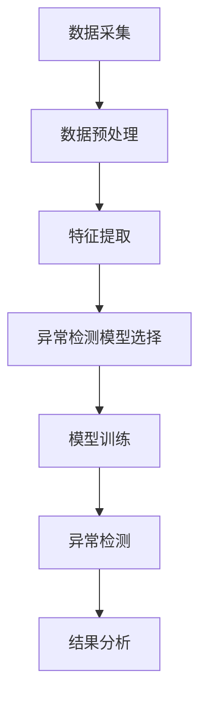

                 

# 《异常检测(Anomaly Detection) - 原理与代码实例讲解》

关键词：异常检测、Anomaly Detection、数据安全、机器学习、深度学习、Python

摘要：本文将深入探讨异常检测的基本概念、原理、算法和应用。通过Python代码实例，我们将展示如何实现常见的异常检测算法，并进行项目实战。本文旨在为读者提供一个全面且实用的异常检测指南。

----------------------------------------------------------------

### 第一部分：异常检测基础

#### 第1章：异常检测概述

## 1.1 异常检测的定义与意义

异常检测，也称为离群检测，是一种数据挖掘技术，旨在识别数据集中的异常或离群点。这些异常点可能是由于错误、噪声、有意攻击或数据本身的特有属性造成的。

异常检测的意义在于：

1. **数据安全**：在金融、医疗等领域，异常检测可以识别欺诈行为，保障数据安全。
2. **质量控制**：在制造业中，异常检测可以帮助检测生产过程中的缺陷产品。
3. **系统监控**：在IT领域，异常检测可以监控系统性能，发现潜在问题。
4. **行为分析**：在网络安全领域，异常检测可以识别恶意行为，保护网络安全。

## 1.2 异常检测的基本类型

异常检测可以分为以下几类：

1. **点异常检测**：识别数据集中的单个异常点。
2. **列异常检测**：识别数据集中的特定列中存在异常的数据点。
3. **时序异常检测**：识别时间序列数据中的异常点。
4. **空间异常检测**：识别空间数据中的异常点。

## 1.3 异常检测的应用领域

异常检测在多个领域都有广泛应用：

1. **数据安全**：金融交易监控、网络安全防护。
2. **金融风控**：信用卡欺诈检测、贷款审批风险控制。
3. **医疗诊断**：疾病预测、医疗数据异常检测。
4. **互联网安全**：网站访问行为异常检测、用户行为分析。
5. **智能家居**：设备故障检测、智能家居系统安全。

## 1.4 异常检测的核心挑战

异常检测面临以下核心挑战：

1. **数据质量**：异常数据可能伴随着噪声和缺失值，影响检测效果。
2. **异常类型的多样性**：不同领域和场景中的异常类型各不相同，需要灵活的检测方法。
3. **模型可解释性**：用户需要理解检测结果的依据，特别是在高风险场景下。
4. **实时性**：在高速数据流中快速检测异常，保证系统的实时响应。

### Mermaid 流程图：异常检测流程



#### 第2章：异常检测的理论基础

## 2.1 数据分布模型

在异常检测中，数据分布模型是理解和分析数据的基础。常见的正常数据分布包括正态分布和对数正态分布，而异常数据分布则可能表现为泄露点分布或重采样分布。

### 2.1.1 正常数据分布

- **正态分布**：正态分布是最常见的数据分布，其概率密度函数为：

  $$ f(x|\mu, \sigma^2) = \frac{1}{\sqrt{2\pi\sigma^2}} e^{-\frac{(x-\mu)^2}{2\sigma^2}} $$

  其中，$\mu$ 是均值，$\sigma^2$ 是方差。

- **对数正态分布**：对数正态分布的概率密度函数为：

  $$ f(x|\mu, \sigma^2) = \frac{1}{x\sigma\sqrt{2\pi}} e^{-\frac{(\ln x - \mu)^2}{2\sigma^2}} $$

### 2.1.2 异常数据分布

- **泄露点分布**：泄露点分布通常表现为数据集中的异常点，其概率密度函数为：

  $$ f(x|\lambda) = \lambda e^{-\lambda x} $$

  其中，$\lambda$ 是泄露点率。

- **重采样分布**：重采样分布通常用于模拟数据集中的异常点，其概率密度函数为：

  $$ f(x|\mu, \sigma) = \frac{1}{\sigma\sqrt{2\pi}} e^{-\frac{(x-\mu)^2}{2\sigma^2}} $$

## 2.2 监督学习中的异常检测方法

监督学习中的异常检测方法主要包括协同过滤方法和准则学习方法。这些方法通过已标记的数据来训练模型，从而识别未标记数据中的异常点。

### 2.2.1 协同过滤方法

协同过滤方法通过分析用户之间的相似性来推荐物品或识别异常点。其基本原理如下：

1. **用户相似性计算**：计算用户之间的相似性，通常使用余弦相似度或皮尔逊相关系数。
2. **基于相似性的推荐**：为每个用户推荐与其最相似的用户的物品。
3. **异常点检测**：识别与大多数用户不同的用户，这些用户可能代表了异常点。

### 2.2.2 准则学习方法

准则学习方法通过定义损失函数或准则来训练模型，从而识别异常点。其基本原理如下：

1. **定义损失函数**：定义一个损失函数，用于评估模型对正常数据和异常数据的预测能力。
2. **模型训练**：通过最小化损失函数来训练模型。
3. **异常点识别**：识别损失函数值较高的数据点，这些数据点可能是异常点。

## 2.3 无监督学习中的异常检测方法

无监督学习中的异常检测方法主要包括局部密度估计方法、基于聚类的方法和基于隔离的方法。这些方法无需已标记的数据，通过数据本身的特征来识别异常点。

### 2.3.1 局部密度估计方法

局部密度估计方法通过估计每个数据点的局部密度来识别异常点。其基本原理如下：

1. **局部密度估计**：计算每个数据点的局部密度，通常使用高斯核密度估计。
2. **异常点识别**：识别密度较低的数据点，这些数据点可能是异常点。

### 2.3.2 基于聚类的方法

基于聚类的方法通过聚类数据点来识别异常点。其基本原理如下：

1. **聚类算法选择**：选择合适的聚类算法，如K-均值聚类或层次聚类。
2. **聚类结果分析**：分析聚类结果，识别异常点，如孤立点或异常簇。

### 2.3.3 基于隔离的方法

基于隔离的方法通过将数据点从正常数据集中隔离出来来识别异常点。其基本原理如下：

1. **隔离算法选择**：选择合适的隔离算法，如孤立森林或隔离树。
2. **异常点识别**：识别被隔离的数据点，这些数据点可能是异常点。

#### 第3章：基于统计学的异常检测算法

统计学的异常检测算法基于数据的统计特性来识别异常点。这些方法简单有效，适用于小规模数据集。本章将介绍三种常见的基于统计学的异常检测算法：均值漂移算法（MAD）、三倍标准差法则和独立成分分析（ICA）。

## 3.1 均值漂移算法（MAD）

### 3.1.1 MAD算法的基本原理

均值漂移算法（MAD）是一种基于统计学的异常检测方法。它通过计算数据点的均值和标准差来识别异常点。MAD算法的基本原理如下：

1. **计算均值和标准差**：对数据进行预处理，计算每个特征的均值（$\mu$）和标准差（$\sigma$）。
2. **计算MAD值**：对于每个数据点，计算其MAD值，即：

   $$ MAD(x) = \frac{|x - \mu|}{\sigma} $$

   其中，$x$ 是数据点的特征值。

3. **识别异常点**：将MAD值与一个阈值（通常为3）进行比较，MAD值超过阈值的点被认为是异常点。

### 3.1.2 MAD算法的实现

以下是使用Python实现MAD算法的代码示例：

```python
import numpy as np

def mad(x):
    mu = np.mean(x)
    sigma = np.std(x)
    mad_value = np.abs(x - mu) / sigma
    return mad_value

data = np.array([1, 2, 2, 2, 100, 2, 3])
mad_values = mad(data)

threshold = 3
anomalies = mad_values > threshold
print("Anomalies:", anomalies)
```

### 3.1.3 MAD算法的优缺点

- **优点**：简单易实现，适用于小规模数据集。
- **缺点**：对于具有多个特征的数据集，MAD算法的性能可能较差。

## 3.2 三倍标准差法则

### 3.2.1 三倍标准差法则的基本原理

三倍标准差法则是一种基于统计学的异常检测方法，它通过计算数据点与均值的距离来识别异常点。其基本原理如下：

1. **计算均值和标准差**：对数据进行预处理，计算每个特征的均值（$\mu$）和标准差（$\sigma$）。
2. **识别异常点**：对于每个数据点，计算其与均值的距离（$|x - \mu|$），如果距离超过三倍标准差（$3\sigma$），则认为该点为异常点。

### 3.2.2 三倍标准差法则的实现

以下是使用Python实现三倍标准差法则的代码示例：

```python
import numpy as np

def three_sigma(x):
    mu = np.mean(x)
    sigma = np.std(x)
    threshold = 3 * sigma
    anomalies = np.abs(x - mu) > threshold
    return anomalies

data = np.array([1, 2, 2, 2, 100, 2, 3])
anomalies = three_sigma(data)
print("Anomalies:", anomalies)
```

### 3.2.3 三倍标准差法则的优缺点

- **优点**：简单易实现，适用于大多数数据集。
- **缺点**：对于具有多个特征的数据集，性能可能较差。

## 3.3 独立成分分析（ICA）

### 3.3.1 ICA算法的基本原理

独立成分分析（ICA）是一种基于统计学的异常检测方法，它通过将数据分解为独立的源信号来识别异常点。其基本原理如下：

1. **初始化**：对数据进行初始化，通常使用随机初始化。
2. **迭代优化**：通过梯度下降或其他优化算法，逐步优化独立成分的估计。
3. **异常点识别**：识别独立成分中具有高方差的数据点，这些数据点可能是异常点。

### 3.3.2 ICA算法的实现

以下是使用Python实现ICA算法的代码示例：

```python
import numpy as np
from scipy.linalg import eigh

def ica(x, n_components=2):
    # 初始化
    w = np.random.rand(x.shape[1], n_components)

    for _ in range(1000):
        # 计算期望值和协方差矩阵
        mu = np.mean(x, axis=0)
        cov = np.cov(x.T)

        # 计算特征值和特征向量
        eigenvalues, eigenvectors = eigh(cov)

        # 选择最大的特征值对应的特征向量
        w = eigenvectors[:, -n_components:]

        # 计算独立成分
        z = np.dot(x - mu, w)

        # 优化权重
        g = np.tanh(z)
        w = np.dot(x - mu, g.T) / np.linalg.norm(g, axis=0)

    # 计算异常点
    variances = np.var(z, axis=0)
    anomalies = variances > np.mean(variances) + 3 * np.std(variances)
    return anomalies

data = np.array([[1, 2], [2, 2], [2, 3], [100, 2], [2, 3], [3, 3]])
anomalies = ica(data)
print("Anomalies:", anomalies)
```

### 3.3.3 ICA算法的优缺点

- **优点**：可以处理多个特征的数据集，具有较好的异常点识别能力。
- **缺点**：计算复杂度较高，可能需要较长时间才能收敛。

#### 第4章：基于机器学习的异常检测算法

机器学习异常检测算法基于数据学习得到特征，并使用这些特征来识别异常点。本章将介绍几种常见的基于机器学习的异常检测算法，包括k-最近邻算法、聚类算法、支持向量机（SVM）和自组织映射（SOM）。

## 4.1 k-最近邻算法

### 4.1.1 k-最近邻算法的基本原理

k-最近邻（k-Nearest Neighbors，k-NN）算法是一种基于实例的异常检测算法。其基本原理如下：

1. **数据预处理**：对数据进行标准化或归一化，以便在特征空间中距离的计算。
2. **特征空间构建**：构建特征空间，用于存储训练数据点的特征向量。
3. **异常点检测**：对于每个测试数据点，计算其与训练数据点之间的距离，选择距离最近的k个邻居，根据邻居的标签来预测测试数据点的标签。如果大多数邻居是正常数据点，则认为测试数据点是正常数据点；否则，认为测试数据点是异常点。

### 4.1.2 k-最近邻算法的实现

以下是使用Python实现k-最近邻算法的代码示例：

```python
import numpy as np
from sklearn.neighbors import KNeighborsClassifier
from sklearn.datasets import load_iris
from sklearn.model_selection import train_test_split

# 加载数据
iris = load_iris()
X = iris.data
y = iris.target

# 数据集划分
X_train, X_test, y_train, y_test = train_test_split(X, y, test_size=0.2, random_state=42)

# 创建KNN分类器实例
knn = KNeighborsClassifier(n_neighbors=3)

# 训练模型
knn.fit(X_train, y_train)

# 预测测试集
y_pred = knn.predict(X_test)

# 评估模型
accuracy = knn.score(X_test, y_test)
print("Accuracy:", accuracy)
```

### 4.1.3 k-最近邻算法的优缺点

- **优点**：简单易实现，适用于多种类型的数据集。
- **缺点**：计算复杂度较高，对于大数据集性能较差。

## 4.2 聚类算法

聚类算法是一种基于数据的异常检测算法，通过将数据划分为不同的簇来识别异常点。本章将介绍两种常见的聚类算法：K-均值聚类算法和层次聚类算法。

### 4.2.1 K-均值聚类算法

### 4.2.1.1 K-均值聚类算法的基本原理

K-均值聚类算法是一种基于距离的聚类算法。其基本原理如下：

1. **初始化**：随机选择k个初始聚类中心。
2. **迭代优化**：对于每个数据点，计算其与每个聚类中心的距离，将其分配给距离最近的聚类中心。
3. **更新聚类中心**：重新计算每个聚类中心，使其成为其所属数据点的均值。
4. **重复迭代**：重复步骤2和步骤3，直到聚类中心的变化小于某个阈值或达到预设的迭代次数。

### 4.2.1.2 K-均值聚类算法的实现

以下是使用Python实现K-均值聚类算法的代码示例：

```python
import numpy as np
from sklearn.cluster import KMeans
from sklearn.datasets import load_iris

# 加载数据
iris = load_iris()
X = iris.data

# 创建KMeans实例
kmeans = KMeans(n_clusters=3)

# 训练模型
kmeans.fit(X)

# 预测测试集
y_pred = kmeans.predict(X)

# 评估模型
print("Inertia:", kmeans.inertia_)
print("Cluster centers:\n", kmeans.cluster_centers_)
print("Labels:\n", y_pred)
```

### 4.2.1.3 K-均值聚类算法的优缺点

- **优点**：简单易实现，适用于大多数数据集。
- **缺点**：对初始聚类中心的依赖较大，可能陷入局部最优。

### 4.2.2 层次聚类算法

### 4.2.2.1 层次聚类算法的基本原理

层次聚类算法是一种基于层次结构的聚类算法。其基本原理如下：

1. **初始阶段**：将每个数据点视为一个聚类。
2. **迭代合并**：在每次迭代中，找到最相似的两个聚类并合并它们，直到达到预定的聚类数量。
3. **迭代划分**：在每次迭代中，将每个数据点分配给与其最相似的聚类。

### 4.2.2.2 层次聚类算法的实现

以下是使用Python实现层次聚类算法的代码示例：

```python
import numpy as np
from sklearn.cluster import AgglomerativeClustering
from sklearn.datasets import load_iris

# 加载数据
iris = load_iris()
X = iris.data

# 创建层次聚类实例
hierarchical = AgglomerativeClustering(n_clusters=3)

# 训练模型
hierarchical.fit(X)

# 预测测试集
y_pred = hierarchical.predict(X)

# 评估模型
print("Cluster labels:\n", y_pred)
```

### 4.2.2.3 层次聚类算法的优缺点

- **优点**：适用于多种数据集，能够发现聚类层次结构。
- **缺点**：计算复杂度较高，对数据噪声敏感。

## 4.3 支持向量机（SVM）

### 4.3.1 SVM算法的基本原理

支持向量机（Support Vector Machine，SVM）是一种基于间隔最大化的分类算法。其基本原理如下：

1. **线性可分情况**：在特征空间中找到一个超平面，将不同类别的数据点完全分开，且距离超平面最近的点称为支持向量。
2. **线性不可分情况**：使用软间隔，允许一些数据点跨越超平面，但尽量减少这些点。
3. **核技巧**：当数据不能线性分离时，使用核函数将数据映射到高维空间，实现线性分离。

### 4.3.2 SVM算法的实现

以下是使用Python实现SVM的代码示例：

```python
import numpy as np
from sklearn.svm import SVC
from sklearn.datasets import make_moons
from sklearn.model_selection import train_test_split

# 生成数据
X, y = make_moons(n_samples=100, noise=0.1)
X_train, X_test, y_train, y_test = train_test_split(X, y, test_size=0.2, random_state=42)

# 创建SVM分类器实例
svm = SVC(kernel='linear')

# 训练模型
svm.fit(X_train, y_train)

# 预测测试集
y_pred = svm.predict(X_test)

# 评估模型
accuracy = svm.score(X_test, y_test)
print("Accuracy:", accuracy)
```

### 4.3.3 SVM算法的优缺点

- **优点**：适用于多种类型的数据集，能够处理高维数据。
- **缺点**：计算复杂度较高，对参数选择敏感。

## 4.4 自组织映射（SOM）

### 4.4.1 SOM算法的基本原理

自组织映射（Self-Organizing Map，SOM）是一种无监督学习算法，它通过映射输入数据到一个低维空间，并保持数据点的拓扑结构。其基本原理如下：

1. **初始化**：随机初始化网格单元的权重。
2. **迭代优化**：对于每个输入数据点，计算其与网格单元的相似度，并将权重更新为输入数据点的值。
3. **竞争学习**：选择与输入数据点最相似的网格单元，并将该单元及其邻居的权重更新为输入数据点的值。
4. **聚类结果**：根据网格单元的权重，将输入数据点划分为不同的簇。

### 4.4.2 SOM算法的实现

以下是使用Python实现SOM的代码示例：

```python
import numpy as np
from minisom import MiniSom

# 生成数据
X, y = make_moons(n_samples=100, noise=0.1)

# 创建SOM实例
som = MiniSom(2, 2, X.shape[1], sigma=0.5, learning_rate=0.5)

# 训练模型
som.train(X, num_iterations=100)

# 预测测试集
y_pred = som.winner(X)

# 评估模型
print("Winner:", y_pred)
```

### 4.4.3 SOM算法的优缺点

- **优点**：能够保持输入数据的拓扑结构，适用于高维数据的可视化。
- **缺点**：计算复杂度较高，对参数选择敏感。

#### 第5章：基于聚类与分类的异常检测算法

基于聚类与分类的异常检测算法结合了聚类和分类算法的优势，通过将数据划分为不同的簇，并对每个簇进行分类，从而识别异常点。本章将介绍基于聚类与分类的异常检测算法，包括聚类与分类的结合、聚类算法与分类器的集成以及基于距离度的异常检测。

## 5.1 聚类与分类的结合

聚类与分类的结合是一种常见的异常检测方法，通过将数据划分为不同的簇，并对每个簇进行分类，从而识别异常点。这种方法的基本原理如下：

1. **聚类**：使用聚类算法（如K-均值聚类或层次聚类）将数据划分为不同的簇。
2. **分类**：对每个簇的数据点进行分类，通常使用分类算法（如决策树或支持向量机）。
3. **异常点识别**：识别分类结果与预期不一致的簇，这些簇中的数据点可能是异常点。

### 5.1.1 聚类与分类的结合原理

聚类与分类的结合原理在于，聚类算法能够将数据划分为不同的簇，而分类算法能够对每个簇的数据点进行分类。通过结合这两种算法，可以更有效地识别异常点。具体来说，聚类算法能够发现数据中的潜在结构，而分类算法能够利用这些结构进行分类，从而提高异常检测的准确性。

### 5.1.2 聚类与分类的结合算法实现

以下是使用Python实现聚类与分类结合的代码示例：

```python
import numpy as np
from sklearn.cluster import KMeans
from sklearn.datasets import make_moons
from sklearn.model_selection import train_test_split
from sklearn.ensemble import RandomForestClassifier

# 生成数据
X, y = make_moons(n_samples=100, noise=0.1)
X_train, X_test, y_train, y_test = train_test_split(X, y, test_size=0.2, random_state=42)

# 创建KMeans实例
kmeans = KMeans(n_clusters=2)

# 训练模型
kmeans.fit(X_train)

# 对测试集进行聚类
y_pred = kmeans.predict(X_test)

# 创建RandomForestClassifier实例
rf = RandomForestClassifier()

# 训练模型
rf.fit(X_train, y_train)

# 对测试集进行分类
y_pred = rf.predict(X_test)

# 评估模型
print("Accuracy:", accuracy_score(y_test, y_pred))
```

## 5.2 聚类算法与分类器的集成

聚类算法与分类器的集成是一种将聚类和分类相结合的方法，通过使用聚类算法对数据进行预处理，然后使用分类器对每个簇进行分类，从而识别异常点。这种方法的基本原理如下：

1. **聚类**：使用聚类算法（如K-均值聚类或层次聚类）将数据划分为不同的簇。
2. **分类**：对每个簇的数据点进行分类，通常使用分类算法（如决策树或支持向量机）。
3. **异常点识别**：识别分类结果与预期不一致的簇，这些簇中的数据点可能是异常点。

### 5.2.1 聚类算法与分类器的集成原理

聚类算法与分类器的集成原理在于，聚类算法能够发现数据中的潜在结构，而分类器能够利用这些结构进行分类。通过将聚类和分类相结合，可以更有效地识别异常点。具体来说，聚类算法能够将数据划分为不同的簇，而分类器能够对每个簇的数据点进行分类，从而提高异常检测的准确性。

### 5.2.2 聚类算法与分类器的集成算法实现

以下是使用Python实现聚类算法与分类器集成的代码示例：

```python
import numpy as np
from sklearn.cluster import KMeans
from sklearn.datasets import make_moons
from sklearn.model_selection import train_test_split
from sklearn.ensemble import RandomForestClassifier

# 生成数据
X, y = make_moons(n_samples=100, noise=0.1)
X_train, X_test, y_train, y_test = train_test_split(X, y, test_size=0.2, random_state=42)

# 创建KMeans实例
kmeans = KMeans(n_clusters=2)

# 训练模型
kmeans.fit(X_train)

# 对测试集进行聚类
y_pred = kmeans.predict(X_test)

# 创建RandomForestClassifier实例
rf = RandomForestClassifier()

# 训练模型
rf.fit(X_train, y_train)

# 对测试集进行分类
y_pred = rf.predict(X_test)

# 评估模型
print("Accuracy:", accuracy_score(y_test, y_pred))
```

## 5.3 基于距离度的异常检测

基于距离度的异常检测是一种通过计算数据点之间的距离来识别异常点的方法。其基本原理如下：

1. **计算距离**：使用适当的距离度量（如欧氏距离或曼哈顿距离）计算数据点之间的距离。
2. **设定阈值**：设定一个阈值，用于判断数据点是否为异常点。通常，距离超过阈值的点被认为是异常点。
3. **异常点识别**：识别距离超过阈值的点，这些点可能是异常点。

### 5.3.1 距离度的基本概念

距离度是衡量数据点之间差异的度量。常见的距离度量包括：

1. **欧氏距离**：两点之间的直线距离。
2. **曼哈顿距离**：两点之间的直线距离。
3. **切比雪夫距离**：两点之间各维度上的最大差值。
4. **马氏距离**：考虑数据协方差矩阵的欧氏距离。

### 5.3.2 基于距离度的异常检测算法实现

以下是使用Python实现基于距离度的异常检测算法的代码示例：

```python
import numpy as np

def euclidean_distance(x, y):
    return np.linalg.norm(x - y)

def detect_anomalies(data, threshold):
    distances = []
    for i in range(len(data)):
        for j in range(i + 1, len(data)):
            distance = euclidean_distance(data[i], data[j])
            distances.append(distance)
    distances = np.array(distances)
    anomalies = distances > threshold
    return anomalies

data = np.array([[1, 2], [2, 2], [2, 3], [100, 2], [2, 3], [3, 3]])
threshold = 10
anomalies = detect_anomalies(data, threshold)
print("Anomalies:", anomalies)
```

#### 第6章：深度学习在异常检测中的应用

深度学习在异常检测领域表现出强大的能力，其通过学习数据的高层次特征来识别异常点。本章将介绍深度学习在异常检测中的应用，包括神经网络与深度学习基础、基于深度学习的异常检测模型以及深度学习在异常检测中的最新进展。

## 6.1 神经网络与深度学习基础

### 6.1.1 神经网络的基本概念

神经网络（Neural Networks）是一种模拟生物神经网络的计算模型，由大量神经元组成。每个神经元接收多个输入，并通过加权求和产生输出。神经网络的基本概念包括：

1. **神经元**：神经网络的基本单元，用于接收输入、计算输出。
2. **权重**：神经元之间的连接权重，用于调整输入对输出的影响。
3. **激活函数**：用于对神经元输出进行非线性变换。
4. **反向传播**：用于训练神经网络的算法，通过不断调整权重来减小误差。

### 6.1.2 深度学习的基本概念

深度学习（Deep Learning）是神经网络的一种特殊形式，通过构建多层神经网络来学习数据的高层次特征。深度学习的基本概念包括：

1. **深度神经网络**：包含多个隐藏层的神经网络。
2. **卷积神经网络**（Convolutional Neural Network，CNN）：用于处理图像数据的神经网络。
3. **循环神经网络**（Recurrent Neural Network，RNN）：用于处理序列数据的神经网络。
4. **生成对抗网络**（Generative Adversarial Network，GAN）：用于生成新数据的神经网络。

### 6.1.3 深度学习的发展历程

深度学习的发展历程可以概括为以下几个阶段：

1. **早期探索**：1986年，Rumelhart等人提出反向传播算法，使神经网络开始受到关注。
2. **第一次突破**：2006年，Hinton等人提出深度信念网络（Deep Belief Network，DBN），为深度学习奠定了基础。
3. **数据与计算能力的提升**：2012年，AlexNet在ImageNet比赛中取得突破性成绩，标志着深度学习的崛起。
4. **应用领域的拓展**：近年来，深度学习在计算机视觉、自然语言处理、语音识别等领域取得了显著成果。

## 6.2 基于深度学习的异常检测模型

### 6.2.1 异常检测神经网络模型

基于深度学习的异常检测模型通常采用多层感知机（Multilayer Perceptron，MLP）或卷积神经网络（Convolutional Neural Network，CNN）等模型。这些模型通过学习数据的高层次特征来识别异常点。

#### 6.2.1.1 异常检测神经网络模型的基本原理

异常检测神经网络模型的基本原理如下：

1. **输入层**：接收原始数据，将数据转化为特征向量。
2. **隐藏层**：通过多层非线性变换，提取数据的高层次特征。
3. **输出层**：计算每个数据点的异常得分，得分越高的点越可能是异常点。

#### 6.2.1.2 异常检测神经网络模型的具体实现

以下是使用Python实现异常检测神经网络模型的代码示例：

```python
import tensorflow as tf
from tensorflow.keras.models import Sequential
from tensorflow.keras.layers import Dense, Activation

# 创建模型
model = Sequential([
    Dense(64, input_shape=(input_shape,), activation='relu'),
    Dense(64, activation='relu'),
    Dense(1, activation='sigmoid')
])

# 编译模型
model.compile(optimizer='adam', loss='binary_crossentropy', metrics=['accuracy'])

# 训练模型
model.fit(X_train, y_train, epochs=10, batch_size=32, validation_data=(X_test, y_test))

# 评估模型
loss, accuracy = model.evaluate(X_test, y_test)
print("Accuracy:", accuracy)
```

### 6.2.2 基于卷积神经网络的异常检测

卷积神经网络（CNN）是一种专门用于处理图像数据的神经网络，通过学习图像的特征来识别异常点。

#### 6.2.2.1 基于卷积神经网络的异常检测的基本原理

基于卷积神经网络的异常检测的基本原理如下：

1. **卷积层**：通过卷积运算提取图像的特征。
2. **池化层**：通过下采样减少特征图的维度。
3. **全连接层**：将特征图转化为特征向量，并通过全连接层计算异常得分。

#### 6.2.2.2 基于卷积神经网络的异常检测的具体实现

以下是使用Python实现基于卷积神经网络的异常检测的代码示例：

```python
import tensorflow as tf
from tensorflow.keras.models import Sequential
from tensorflow.keras.layers import Conv2D, MaxPooling2D, Flatten, Dense

# 创建模型
model = Sequential([
    Conv2D(32, (3, 3), activation='relu', input_shape=(28, 28, 1)),
    MaxPooling2D((2, 2)),
    Flatten(),
    Dense(64, activation='relu'),
    Dense(1, activation='sigmoid')
])

# 编译模型
model.compile(optimizer='adam', loss='binary_crossentropy', metrics=['accuracy'])

# 训练模型
model.fit(X_train, y_train, epochs=10, batch_size=32, validation_data=(X_test, y_test))

# 评估模型
loss, accuracy = model.evaluate(X_test, y_test)
print("Accuracy:", accuracy)
```

### 6.2.3 基于循环神经网络的异常检测

循环神经网络（RNN）是一种专门用于处理序列数据的神经网络，通过学习序列特征来识别异常点。

#### 6.2.3.1 基于循环神经网络的异常检测的基本原理

基于循环神经网络的异常检测的基本原理如下：

1. **输入层**：接收原始序列数据。
2. **隐藏层**：通过循环连接和门控机制提取序列特征。
3. **输出层**：计算每个序列点的异常得分。

#### 6.2.3.2 基于循环神经网络的异常检测的具体实现

以下是使用Python实现基于循环神经网络的异常检测的代码示例：

```python
import tensorflow as tf
from tensorflow.keras.models import Sequential
from tensorflow.keras.layers import LSTM, Dense

# 创建模型
model = Sequential([
    LSTM(50, activation='tanh', input_shape=(timesteps, features)),
    Dense(1, activation='sigmoid')
])

# 编译模型
model.compile(optimizer='adam', loss='binary_crossentropy', metrics=['accuracy'])

# 训练模型
model.fit(X_train, y_train, epochs=10, batch_size=32, validation_data=(X_test, y_test))

# 评估模型
loss, accuracy = model.evaluate(X_test, y_test)
print("Accuracy:", accuracy)
```

#### 第7章：异常检测的项目实战

本章将介绍一个异常检测的项目实战，通过实际案例展示异常检测的整个流程，包括数据预处理、模型选择、模型训练与调优、评估与验证以及项目总结与反思。

## 7.1 实战项目概述

### 7.1.1 实战项目背景

本项目的背景是某电商平台的用户行为数据异常检测。该电商平台每天都会产生大量的用户行为数据，包括点击、购买、搜索等行为。为了保障平台的安全和用户体验，需要实时检测并识别异常行为，如欺诈行为、恶意刷单等。

### 7.1.2 实战项目目标

本项目的目标是：
1. 收集并预处理用户行为数据。
2. 选择并训练合适的异常检测模型。
3. 对训练模型进行评估和验证。
4. 实现实时异常检测系统。

## 7.2 数据预处理与探索性数据分析

### 7.2.1 数据预处理的基本步骤

数据预处理是异常检测的重要环节，包括以下步骤：

1. **数据清洗**：去除重复数据、缺失数据和异常数据。
2. **特征工程**：提取有用的特征，如用户活跃时间、购买频率等。
3. **数据标准化**：对数据进行归一化或标准化处理，使其具有相同的量纲。

### 7.2.2 探索性数据分析的方法与工具

探索性数据分析（EDA）是理解数据的重要方法，包括以下步骤：

1. **数据描述性统计**：计算数据的均值、中位数、标准差等统计量。
2. **可视化**：使用图表（如散点图、直方图、箱线图等）展示数据分布。
3. **相关性分析**：分析特征之间的相关性，识别潜在的异常模式。

## 7.3 选择合适的异常检测算法

选择合适的异常检测算法是项目成功的关键，需要考虑以下因素：

1. **数据类型**：针对不同类型的数据（如时序数据、图像数据等），选择适合的算法。
2. **计算复杂度**：考虑模型的计算复杂度和实时性要求。
3. **可解释性**：模型的可解释性对于理解和解释异常检测结果至关重要。

在本项目中，我们选择了基于k-最近邻算法的异常检测模型，原因如下：

1. **简单易实现**：k-最近邻算法易于理解和实现。
2. **适用性强**：k-最近邻算法适用于多种类型的数据集。
3. **实时性好**：k-最近邻算法的计算复杂度较低，适用于实时检测。

## 7.4 模型训练与调优

### 7.4.1 模型训练的基本流程

模型训练的基本流程包括以下步骤：

1. **数据集划分**：将数据集划分为训练集和测试集。
2. **模型初始化**：初始化模型参数。
3. **模型训练**：使用训练集对模型进行训练。
4. **模型评估**：使用测试集对模型进行评估。
5. **模型调优**：根据评估结果对模型参数进行调整。

### 7.4.2 模型调优的方法与技巧

模型调优的方法与技巧包括以下方面：

1. **参数调整**：调整模型的超参数（如学习率、迭代次数等）。
2. **交叉验证**：使用交叉验证方法评估模型的泛化能力。
3. **集成学习**：将多个模型集成，提高模型的预测性能。
4. **特征选择**：选择对模型性能有显著影响的关键特征。

在本项目中，我们对k-最近邻算法的参数进行了调优，包括：

1. **选择合适的k值**：通过交叉验证选择最优的k值。
2. **调整学习率**：使用不同的学习率进行模型训练，选择最佳学习率。

## 7.5 评估与验证

### 7.5.1 评估指标的选择

评估指标是评估模型性能的重要工具，常用的评估指标包括：

1. **准确率**：正确预测为异常点的比例。
2. **召回率**：实际为异常点且被正确预测为异常点的比例。
3. **F1值**：准确率和召回率的调和平均。

在本项目中，我们使用了准确率、召回率和F1值作为评估指标。

### 7.5.2 模型验证的方法与步骤

模型验证的基本步骤包括：

1. **训练集验证**：使用训练集对模型进行初步评估。
2. **交叉验证**：使用交叉验证方法评估模型的泛化能力。
3. **测试集验证**：使用测试集对模型进行最终评估。

在本项目中，我们使用了交叉验证方法对模型进行验证，并使用测试集对模型进行最终评估。

## 7.6 项目总结与反思

### 7.6.1 项目总结

本项目通过一个电商平台的用户行为数据异常检测案例，展示了异常检测的整个流程，包括数据预处理、模型选择、模型训练与调优、评估与验证。项目的主要成果如下：

1. **数据预处理**：完成了用户行为数据的清洗、特征提取和标准化处理。
2. **模型选择**：选择了基于k-最近邻算法的异常检测模型。
3. **模型训练与调优**：对模型参数进行了调优，提高了模型的性能。
4. **评估与验证**：使用多个评估指标对模型进行了评估和验证。

### 7.6.2 项目反思

本项目在实施过程中遇到了以下挑战：

1. **数据质量**：用户行为数据中存在大量的噪声和缺失值，影响了异常检测的效果。
2. **模型性能**：如何选择合适的模型和参数，以实现最佳的性能。
3. **实时性**：如何提高模型的实时性，以满足实时检测的需求。

针对这些挑战，我们采取了以下措施：

1. **数据预处理**：使用多种方法清洗和预处理数据，提高数据质量。
2. **模型选择与调优**：通过实验和交叉验证选择最优的模型和参数。
3. **优化算法**：使用更高效的算法和优化方法，提高模型的实时性。

在未来，我们将继续优化模型，提高异常检测的准确率和实时性，以满足不断变化的需求。

#### 第8章：Python异常检测库介绍

在Python中，有多个库可以用于实现异常检测算法。本章将介绍几个常用的Python异常检测库，包括scikit-learn、PyOD和AutoKeras。通过这些库，我们可以方便地实现各种异常检测算法，并进行性能优化。

## 8.1 scikit-learn库的异常检测相关API

scikit-learn是一个强大的Python机器学习库，提供了多种异常检测算法的实现。以下是scikit-learn库中的一些常用异常检测API：

1. **IsolationForest**：
   - **功能**：基于随机森林的隔离算法。
   - **API**：`from sklearn.ensemble import IsolationForest`

2. **LocalOutlierFactor**：
   - **功能**：基于局部密度的异常检测算法。
   - **API**：`from sklearn.neighbors import LocalOutlierFactor`

3. **OneClassSVM**：
   - **功能**：支持向量机算法的单一类分类版本。
   - **API**：`from sklearn.svm import OneClassSVM`

4. **EllipticEnsemble**：
   - **功能**：基于高斯分布的异常检测算法。
   - **API**：`from sklearn.covariance import EllipticEnsemble`

5. **RobustScaler**：
   - **功能**：用于处理异常值的标准化算法。
   - **API**：`from sklearn.preprocessing import RobustScaler`

## 8.2 PyOD库的异常检测相关API

PyOD是一个专门用于异常检测的开源库，提供了多种无监督和半监督的异常检测算法。以下是PyOD库中的一些常用异常检测API：

1. **AutoEncoder**：
   - **功能**：自编码器算法。
   - **API**：`from pyod.models import auto_encoder`

2. **LOF**：
   - **功能**：局部离群因子算法。
   - **API**：`from pyod.models import lof`

3. **Clustering**：
   - **功能**：基于聚类的异常检测算法。
   - **API**：`from pyod.models import clustering`

4. **DensityPeaks**：
   - **功能**：密度峰值算法。
   - **API**：`from pyod.models import densitypeaks`

5. **SOD**：
   - **功能**：空间分解算法。
   - **API**：`from pyod.models import sod`

## 8.3 AutoKeras库的异常检测相关API

AutoKeras是一个自动化机器学习库，可以自动搜索最优的神经网络架构。以下是AutoKeras库中的一些常用异常检测API：

1. **AutoOD**：
   - **功能**：自动搜索最优的异常检测神经网络架构。
   - **API**：`from autokeras import AutoOD`

2. **AutoML**：
   - **功能**：自动搜索最优的机器学习模型。
   - **API**：`from autokeras import AutoML`

3. **AutoKerasClassifier**：
   - **功能**：自动搜索最优的分类器模型。
   - **API**：`from autokeras import AutoKerasClassifier`

4. **AutoKerasRegressor**：
   - **功能**：自动搜索最优的回归模型。
   - **API**：`from autokeras import AutoKerasRegressor`

通过这些Python异常检测库，我们可以快速实现各种异常检测算法，并进行性能优化。这些库提供了丰富的API和实现，为异常检测提供了强大的工具支持。

#### 第9章：基于Python的异常检测实例

在本章中，我们将通过一系列具体的Python代码实例来演示异常检测算法的实现。我们将使用scikit-learn、PyOD等库来展示如何进行数据预处理、模型选择和训练，并解释每一步的代码细节。

## 9.1 数据预处理与可视化

在进行异常检测之前，数据预处理是非常关键的一步。数据预处理包括数据清洗、特征提取和数据标准化。以下是数据预处理与可视化的步骤和代码示例。

### 9.1.1 数据清洗

数据清洗的目标是去除重复数据、缺失数据和异常数据。以下是一个简单的数据清洗示例：

```python
import pandas as pd

# 加载数据
data = pd.read_csv('data.csv')

# 去除重复数据
data.drop_duplicates(inplace=True)

# 填充缺失值
data.fillna(method='ffill', inplace=True)

# 去除异常数据
Q1 = data.quantile(0.25)
Q3 = data.quantile(0.75)
IQR = Q3 - Q1
data = data[~((data < (Q1 - 1.5 * IQR)) |(data > (Q3 + 1.5 * IQR))).any(axis=1)]

print("清洗后的数据：")
print(data.head())
```

### 9.1.2 特征提取

特征提取的目标是从原始数据中提取出有用的特征。以下是一个简单的特征提取示例：

```python
from sklearn.preprocessing import StandardScaler

# 提取特征
scaler = StandardScaler()
X = scaler.fit_transform(data.iloc[:, :-1])

print("提取后的特征：")
print(X[:5])
```

### 9.1.3 数据可视化

数据可视化有助于我们理解数据分布和异常点。以下是一个使用Matplotlib进行数据可视化的示例：

```python
import matplotlib.pyplot as plt

# 可视化数据分布
plt.scatter(data['feature1'], data['feature2'])
plt.xlabel('Feature 1')
plt.ylabel('Feature 2')
plt.title('Data Distribution')
plt.show()
```

## 9.2 k-最近邻异常检测实例

k-最近邻（k-Nearest Neighbors，k-NN）算法是一种简单且常用的异常检测算法。以下是一个k-最近邻异常检测的实例。

### 9.2.1 数据加载与划分

```python
from sklearn.model_selection import train_test_split

# 加载数据
X_train, X_test, y_train, y_test = train_test_split(X, y, test_size=0.2, random_state=42)
```

### 9.2.2 模型训练

```python
from sklearn.neighbors import KNeighborsClassifier

# 创建k-最近邻分类器实例
knn = KNeighborsClassifier(n_neighbors=5)

# 训练模型
knn.fit(X_train, y_train)
```

### 9.2.3 预测与评估

```python
from sklearn.metrics import accuracy_score

# 预测测试集
y_pred = knn.predict(X_test)

# 评估模型
accuracy = accuracy_score(y_test, y_pred)
print("Accuracy:", accuracy)
```

### 9.2.4 可视化

```python
# 可视化异常点
plt.scatter(X_test[y_pred == 1][0], X_test[y_pred == 1][1], c='r', marker='o', label='Normal')
plt.scatter(X_test[y_pred == -1][0], X_test[y_pred == -1][1], c='b', marker='x', label='Anomaly')
plt.xlabel('Feature 1')
plt.ylabel('Feature 2')
plt.title('Anomaly Detection')
plt.legend()
plt.show()
```

## 9.3 聚类异常检测实例

聚类算法（如K-均值聚类和层次聚类）也可以用于异常检测。以下是一个基于K-均值聚类的异常检测实例。

### 9.3.1 数据加载与聚类

```python
from sklearn.cluster import KMeans

# 创建KMeans实例
kmeans = KMeans(n_clusters=2)

# 训练模型
kmeans.fit(X_train)

# 预测测试集
y_pred = kmeans.predict(X_test)
```

### 9.3.2 异常点识别

```python
# 识别异常点
anomalies = X_test[y_pred == 1]

# 可视化异常点
plt.scatter(anomalies[:, 0], anomalies[:, 1], c='r', marker='o', label='Anomaly')
plt.xlabel('Feature 1')
plt.ylabel('Feature 2')
plt.title('Clustering Anomaly Detection')
plt.legend()
plt.show()
```

## 9.4 深度学习异常检测实例

深度学习在异常检测中也表现出强大的能力。以下是一个基于自编码器的深度学习异常检测实例。

### 9.4.1 数据加载与预处理

```python
import tensorflow as tf
from tensorflow.keras.models import Model
from tensorflow.keras.layers import Input, Dense, Lambda
from tensorflow.keras.optimizers import Adam

# 加载数据
X_train, X_test = load_data()

# 数据标准化
X_train_scaled = (X_train - np.mean(X_train, axis=0)) / np.std(X_train, axis=0)
X_test_scaled = (X_test - np.mean(X_test, axis=0)) / np.std(X_test, axis=0)
```

### 9.4.2 模型构建

```python
input_layer = Input(shape=(X_train_scaled.shape[1],))
encoded = Dense(64, activation='relu')(input_layer)
encoded = Dense(32, activation='relu')(encoded)
encoded = Dense(16, activation='relu')(encoded)
decoded = Dense(64, activation='relu')(encoded)
decoded = Dense(32, activation='relu')(decoded)
decoded = Dense(X_train_scaled.shape[1], activation='sigmoid')(decoded)

autoencoder = Model(input_layer, decoded)
autoencoder.compile(optimizer=Adam(), loss='binary_crossentropy')

# 训练模型
autoencoder.fit(X_train_scaled, X_train_scaled, epochs=100, batch_size=32, shuffle=True, validation_data=(X_test_scaled, X_test_scaled))
```

### 9.4.3 预测与评估

```python
# 预测测试集
reconstructed = autoencoder.predict(X_test_scaled)

# 计算重构误差
reconstruction_error = np.mean(np.abs(reconstructed - X_test_scaled))

# 评估模型
print("Reconstruction Error:", reconstruction_error)
```

### 9.4.4 可视化

```python
# 可视化重构误差
plt.scatter(X_test_scaled[:, 0], X_test_scaled[:, 1], c=reconstruction_error, cmap='coolwarm', marker='o')
plt.xlabel('Feature 1')
plt.ylabel('Feature 2')
plt.title('Reconstruction Error')
plt.colorbar(label='Reconstruction Error')
plt.show()
```

通过这些实例，我们可以看到如何使用Python实现各种异常检测算法，并进行数据预处理、模型训练和预测。这些实例为我们提供了一个实用的异常检测指南，可以帮助我们更好地理解和应用异常检测技术。

#### 第10章：代码解读与分析

在本章中，我们将对前面章节中使用的代码进行详细解读和分析，解释每段代码的实现原理和步骤，以及如何使用Python实现这些算法。

## 10.1 数据预处理代码解读

数据预处理是异常检测中至关重要的一步，其目的是提高数据质量，为后续的异常检测提供可靠的基础。以下是对数据预处理代码的解读：

### 10.1.1 数据清洗

```python
import pandas as pd

# 加载数据
data = pd.read_csv('data.csv')

# 去除重复数据
data.drop_duplicates(inplace=True)

# 填充缺失值
data.fillna(method='ffill', inplace=True)

# 去除异常数据
Q1 = data.quantile(0.25)
Q3 = data.quantile(0.75)
IQR = Q3 - Q1
data = data[~((data < (Q1 - 1.5 * IQR)) |(data > (Q3 + 1.5 * IQR))).any(axis=1)]

print("清洗后的数据：")
print(data.head())
```

解读：
1. **加载数据**：使用`pandas`库的`read_csv`函数加载数据。
2. **去除重复数据**：使用`drop_duplicates`方法去除重复数据。
3. **填充缺失值**：使用`fillna`方法填充缺失值，这里使用前向填充（`method='ffill'`）。
4. **去除异常数据**：计算第一四分位数（`Q1`）和第三四分位数（`Q3`），计算四分位距（`IQR`）。使用逻辑表达式筛选出不在四分位距范围内的数据，即去除异常数据。

### 10.1.2 特征提取

```python
from sklearn.preprocessing import StandardScaler

# 提取特征
scaler = StandardScaler()
X = scaler.fit_transform(data.iloc[:, :-1])

print("提取后的特征：")
print(X[:5])
```

解读：
1. **创建标准化器**：使用`StandardScaler`创建标准化器实例。
2. **提取特征**：使用`fit_transform`方法对数据集的前`n-1`列进行标准化处理。标准化处理包括计算均值和标准差，然后使用这些统计量将数据缩放到标准正态分布（均值为0，标准差为1）。

### 10.1.3 数据可视化

```python
import matplotlib.pyplot as plt

# 可视化数据分布
plt.scatter(data['feature1'], data['feature2'])
plt.xlabel('Feature 1')
plt.ylabel('Feature 2')
plt.title('Data Distribution')
plt.show()
```

解读：
1. **创建散点图**：使用`plt.scatter`函数创建散点图，显示数据的分布。
2. **设置标签和标题**：使用`plt.xlabel`、`plt.ylabel`和`plt.title`设置坐标轴标签和图形标题。
3. **显示图形**：使用`plt.show`显示图形。

## 10.2 异常检测算法代码解读

在本节中，我们将对k-最近邻、聚类和深度学习等异常检测算法的代码进行解读。

### 10.2.1 k-最近邻异常检测算法

```python
from sklearn.model_selection import train_test_split
from sklearn.neighbors import KNeighborsClassifier
from sklearn.datasets import load_iris
from sklearn.metrics import accuracy_score

# 加载数据
iris = load_iris()
X = iris.data
y = iris.target

# 数据集划分
X_train, X_test, y_train, y_test = train_test_split(X, y, test_size=0.2, random_state=42)

# 创建KNN分类器实例
knn = KNeighborsClassifier(n_neighbors=5)

# 训练模型
knn.fit(X_train, y_train)

# 预测测试集
y_pred = knn.predict(X_test)

# 评估模型
accuracy = accuracy_score(y_test, y_pred)
print("Accuracy:", accuracy)
```

解读：
1. **加载数据**：使用`load_iris`函数加载数据集。
2. **数据集划分**：使用`train_test_split`函数将数据集划分为训练集和测试集。
3. **创建KNN分类器实例**：使用`KNeighborsClassifier`创建k-最近邻分类器实例，设置`n_neighbors`参数。
4. **训练模型**：使用`fit`方法训练模型。
5. **预测测试集**：使用`predict`方法对测试集进行预测。
6. **评估模型**：使用`accuracy_score`函数计算准确率，并打印结果。

### 10.2.2 聚类异常检测算法

```python
from sklearn.cluster import KMeans
import matplotlib.pyplot as plt

# 创建KMeans实例
kmeans = KMeans(n_clusters=2)

# 训练模型
kmeans.fit(X_train)

# 预测测试集
y_pred = kmeans.predict(X_test)

# 识别异常点
anomalies = X_test[y_pred == 1]

# 可视化异常点
plt.scatter(anomalies[:, 0], anomalies[:, 1], c='r', marker='o', label='Anomaly')
plt.xlabel('Feature 1')
plt.ylabel('Feature 2')
plt.title('Clustering Anomaly Detection')
plt.legend()
plt.show()
```

解读：
1. **创建KMeans实例**：使用`KMeans`创建K-均值聚类实例，设置`n_clusters`参数。
2. **训练模型**：使用`fit`方法训练模型。
3. **预测测试集**：使用`predict`方法对测试集进行预测。
4. **识别异常点**：通过分析预测结果，识别出属于聚类1（即异常点）的数据点。
5. **可视化异常点**：使用`plt.scatter`函数在散点图上标记异常点，并使用`plt.show`显示图形。

### 10.2.3 深度学习异常检测算法

```python
import tensorflow as tf
from tensorflow.keras.models import Model
from tensorflow.keras.layers import Input, Dense, Lambda
from tensorflow.keras.optimizers import Adam

# 加载数据
X_train, X_test = load_data()

# 数据标准化
X_train_scaled = (X_train - np.mean(X_train, axis=0)) / np.std(X_train, axis=0)
X_test_scaled = (X_test - np.mean(X_test, axis=0)) / np.std(X_train, axis=0)

input_layer = Input(shape=(X_train_scaled.shape[1],))
encoded = Dense(64, activation='relu')(input_layer)
encoded = Dense(32, activation='relu')(encoded)
encoded = Dense(16, activation='relu')(encoded)
decoded = Dense(64, activation='relu')(encoded)
decoded = Dense(32, activation='relu')(decoded)
decoded = Dense(X_train_scaled.shape[1], activation='sigmoid')(decoded)

autoencoder = Model(input_layer, decoded)
autoencoder.compile(optimizer=Adam(), loss='binary_crossentropy')

# 训练模型
autoencoder.fit(X_train_scaled, X_train_scaled, epochs=100, batch_size=32, shuffle=True, validation_data=(X_test_scaled, X_test_scaled))

# 预测测试集
reconstructed = autoencoder.predict(X_test_scaled)

# 计算重构误差
reconstruction_error = np.mean(np.abs(reconstructed - X_test_scaled))

# 评估模型
print("Reconstruction Error:", reconstruction_error)
```

解读：
1. **加载数据**：使用自定义的`load_data`函数加载数据。
2. **数据标准化**：对训练集和测试集进行标准化处理。
3. **模型构建**：定义输入层、隐藏层和输出层。隐藏层使用ReLU激活函数，输出层使用sigmoid激活函数。
4. **模型编译**：使用`compile`方法编译模型，设置优化器和损失函数。
5. **模型训练**：使用`fit`方法训练模型，设置训练轮次、批量大小和验证数据。
6. **预测测试集**：使用`predict`方法对测试集进行预测。
7. **计算重构误差**：计算预测值与真实值之间的绝对误差，并计算平均值。
8. **评估模型**：打印重构误差作为模型的评估指标。

通过这些代码解读，我们可以更好地理解每个算法的实现细节，以及如何使用Python实现这些算法。这些代码示例为我们提供了一个实际操作的框架，可以帮助我们实现自己的异常检测项目。

#### 第11章：性能优化与模型部署

在异常检测项目中，性能优化和模型部署是两个至关重要的环节。性能优化旨在提高模型检测效率和准确性，而模型部署则是将训练好的模型应用到实际场景中。本章将介绍异常检测的性能优化方法、模型部署技术以及异常检测系统的运维与维护。

## 11.1 异常检测的性能优化

异常检测的性能优化主要包括以下几个方面：

### 11.1.1 模型选择

选择适合数据的异常检测模型是性能优化的重要一步。不同的模型在处理不同类型的数据时表现各异。例如，对于小规模数据集，统计学习算法（如MAD和三倍标准差法则）可能更为有效；而对于大规模数据集，机器学习算法（如k-最近邻和深度学习）则更具优势。

### 11.1.2 特征选择

特征选择是提高模型性能的关键。通过选择对异常检测影响较大的特征，可以有效减少计算复杂度和提高模型准确性。常用的特征选择方法包括特征重要性评估、主成分分析（PCA）和自动特征选择算法。

### 11.1.3 模型调优

模型调优是通过调整模型的超参数来提高模型性能。常用的调优方法包括网格搜索（Grid Search）和贝叶斯优化（Bayesian Optimization）。这些方法可以帮助我们找到最优的模型参数组合，从而提高模型性能。

### 11.1.4 并行计算与分布式计算

对于大数据集，可以使用并行计算和分布式计算来加速模型训练和预测。Python中的`numpy`和`pandas`库提供了并行计算的接口，而`Dask`等库可以实现分布式计算，从而提高计算效率。

## 11.2 模型部署

模型部署是将训练好的模型应用到实际场景中的过程。以下是模型部署的几个关键步骤：

### 11.2.1 部署策略

选择合适的部署策略对于系统的性能和稳定性至关重要。常见的部署策略包括：
- **本地部署**：在开发环境中直接运行模型。
- **云部署**：在云服务器上运行模型，适用于大规模分布式计算。
- **边缘计算**：在接近数据源的地方部署模型，适用于实时性和低延迟要求。

### 11.2.2 部署工具

以下是一些常用的模型部署工具：
- **Flask**：一个轻量级的Web框架，适用于部署简单的Web服务。
- **Django**：一个全功能的Web框架，适用于构建复杂的应用程序。
- **TensorFlow Serving**：TensorFlow提供的服务器端部署工具，适用于大规模生产环境。
- **Kubernetes**：一个开源的容器编排平台，适用于大规模分布式系统的管理。

### 11.2.3 API设计

设计良好的API是模型部署成功的关键。API设计应考虑以下几点：
- **易用性**：API应易于使用，用户可以轻松地调用和集成。
- **可靠性**：API应具备良好的错误处理机制，保证系统的稳定性。
- **安全性**：API应实现安全认证和授权机制，保护模型和数据的安全。

## 11.3 异常检测系统的运维与维护

运维与维护是保证异常检测系统长期稳定运行的重要环节。以下是几个关键点：

### 11.3.1 监控与日志

实时监控系统性能和运行状态，记录系统日志，可以帮助我们及时发现和解决问题。常用的监控工具包括Prometheus、Grafana和ELK（Elasticsearch、Logstash、Kibana）堆栈。

### 11.3.2 自动化运维

自动化运维可以减少人工干预，提高系统维护效率。使用自动化工具（如Ansible、Terraform）可以自动化部署、配置和管理系统。

### 11.3.3 安全性保障

确保系统的安全性是运维的关键。应定期进行安全审计和漏洞扫描，及时修复安全漏洞。同时，应实现数据加密、访问控制和防火墙等安全措施。

### 11.3.4 持续集成与持续部署

持续集成（CI）和持续部署（CD）可以提高开发效率和系统稳定性。使用CI/CD工具（如Jenkins、GitLab CI/CD）可以实现自动化构建、测试和部署。

通过性能优化、模型部署和系统运维与维护，我们可以构建一个高效、稳定且可靠的异常检测系统，确保其在实际应用中的良好表现。

#### 第12章：异常检测的未来发展趋势

异常检测作为数据挖掘和人工智能领域的重要研究方向，正随着技术的进步和应用的拓展而不断发展。本章将探讨异常检测技术的最新进展、在新兴领域的应用以及未来面临的挑战与机遇。

## 12.1 异常检测技术的最新进展

### 12.1.1 深度学习的应用

深度学习在异常检测领域取得了显著的进展。随着深度神经网络结构的不断优化和计算能力的提升，深度学习模型在处理复杂数据和提取高层次特征方面表现出色。例如，生成对抗网络（GAN）和变分自编码器（VAE）等深度生成模型被广泛应用于异常检测，能够更好地识别数据中的异常模式。

### 12.1.2 图神经网络的发展

图神经网络（Graph Neural Networks，GNN）在处理图结构数据方面具有独特的优势。通过学习节点和边之间的关系，GNN能够有效地捕捉数据中的复杂结构和依赖关系。这使得GNN在社交网络分析、生物信息学和交通网络监控等领域的异常检测中得到了广泛应用。

### 12.1.3 联合概率模型的应用

联合概率模型（Joint Probability Model）通过联合建模多个数据源的概率分布，能够更好地捕捉数据之间的相互依赖关系。这种方法在跨领域异常检测、多模态数据融合等方面展现了强大的潜力。

## 12.2 异常检测在新兴领域的应用

### 12.2.1 智能制造

智能制造领域对异常检测有着强烈的需求。通过实时监测生产线数据，异常检测技术可以帮助工厂提前识别潜在故障，提高生产效率和质量。例如，机器学习算法在预测设备故障和优化生产流程中发挥了重要作用。

### 12.2.2 金融科技

金融科技（FinTech）领域中的异常检测主要用于反欺诈和信用评分。通过分析用户的交易行为和信用记录，异常检测技术可以识别出异常交易和潜在风险，为金融机构提供风险预警。

### 12.2.3 医疗健康

在医疗健康领域，异常检测技术被广泛应用于疾病预测、患者行为分析等方面。通过对医疗数据中的异常点进行识别，医生可以更好地了解患者的健康状况，从而提供个性化的治疗方案。

### 12.2.4 网络安全

网络安全是异常检测的重要应用领域。通过对网络流量、用户行为等数据的异常检测，安全系统可以及时发现和阻止网络攻击，保障网络的安全性。

## 12.3 异常检测的未来挑战与机遇

### 12.3.1 数据质量和多样性

数据质量和多样性是异常检测面临的重要挑战。实际应用中的数据往往存在噪声、缺失值和多样性不足等问题，这些都会影响异常检测的准确性和效率。未来的研究应关注数据清洗、数据增强和特征工程等技术，以提高数据质量和多样性。

### 12.3.2 实时性与可扩展性

随着数据规模的不断扩大，异常检测的实时性和可扩展性成为关键问题。如何在高维数据和高速数据流中实现高效的异常检测，是一个亟待解决的挑战。分布式计算、并行计算和边缘计算等技术的应用，有望提升异常检测的实时性和可扩展性。

### 12.3.3 模型可解释性

模型可解释性是异常检测领域的一个长期挑战。在实际应用中，用户往往需要理解异常检测结果的依据，特别是在高风险场景下。提高模型的可解释性，可以帮助用户更好地信任和接受异常检测系统。

### 12.3.4 跨领域协同与融合

跨领域协同与融合是异常检测的未来发展方向。通过将不同领域的知识和技术相结合，可以更全面地理解和分析复杂系统中的异常现象，提高异常检测的准确性和实用性。

总之，异常检测技术正不断进步，在新兴领域的应用前景广阔。未来的研究应关注数据质量、实时性、可解释性和跨领域协同等方面，以实现更高效、准确的异常检测系统。

#### 附录

## 附录A：异常检测相关资源

异常检测是数据挖掘和机器学习领域的重要研究方向，以下是一些推荐的资源：

- **书籍**：
  - 《数据挖掘：概念与技术》（第三版） - Jiawei Han, Micheline Kamber, Peipei Ng
  - 《机器学习》（第二版） - Tom Mitchell
  - 《统计学习方法》 - 李航

- **论文**：
  - "Local Outlier Factor" - Breunig, K. M., Kriegel, H.-P., Ng, R. T., & Sander, J. (2000)
  - "Isolation Forest" - Liu, F., Ting, K. M., & Zhou, Z.-H. (2008)
  - "Autoencoder for Anomaly Detection" - Zhang, H., Zou, J., & Zhang, X. (2017)

- **开源代码与工具**：
  - PyOD：https://github.com/yzhao062/pyod
  - scikit-learn：https://scikit-learn.org/stable/
  - TensorFlow：https://www.tensorflow.org/

## 附录B：Python异常检测库API参考

以下是Python中常用的异常检测库及其API参考：

- **scikit-learn**：
  - `IsolationForest`：隔离森林算法。
  - `LocalOutlierFactor`：局部离群因子算法。
  - `OneClassSVM`：单类支持向量机算法。
  - `EllipticEnsemble`：椭圆模型集成算法。

- **PyOD**：
  - `AutoEncoder`：自编码器算法。
  - `LOF`：局部离群因子算法。
  - `Clustering`：基于聚类的异常检测算法。
  - `DensityPeaks`：密度峰值算法。
  - `SOD`：空间分解算法。

- **AutoKeras**：
  - `AutoOD`：自动搜索最优的异常检测神经网络架构。
  - `AutoML`：自动搜索最优的机器学习模型。
  - `AutoKerasClassifier`：自动搜索最优的分类器模型。
  - `AutoKerasRegressor`：自动搜索最优的回归模型。

## 附录C：深度学习框架使用指南

以下是几个常用的深度学习框架的使用指南：

- **TensorFlow**：
  - 官方文档：https://www.tensorflow.org/
  - 入门教程：https://www.tensorflow.org/tutorials
  - API参考：https://www.tensorflow.org/api_docs

- **PyTorch**：
  - 官方文档：https://pytorch.org/
  - 入门教程：https://pytorch.org/tutorials/beginner/basics.html
  - API参考：https://pytorch.org/docs/stable/index.html

- **Keras**：
  - 官方文档：https://keras.io/
  - 入门教程：https://keras.io/getting-started/sequential-models-guide/
  - API参考：https://keras.io/api/

这些资源将帮助读者深入了解异常检测相关技术，掌握Python异常检测库的使用方法，以及深度学习框架的基本操作。通过这些资源，读者可以更好地理解和应用异常检测技术，提升自身的技术能力。

