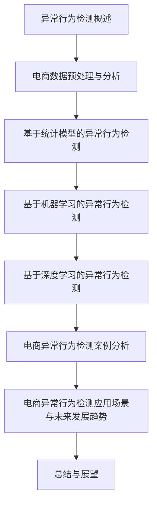

                 

# 《异常行为检测提升电商安全性》

## 关键词：异常行为检测、电商安全、人工智能、机器学习、深度学习、数据挖掘

## 摘要：

随着电子商务的迅猛发展，电商平台的安全问题日益突出。异常行为检测作为一项关键技术，在提升电商安全性方面发挥着至关重要的作用。本文首先介绍了异常行为检测的核心概念、方法及其在电商安全中的应用。接着，详细阐述了电商数据的预处理与分析技术，以及统计模型、机器学习和深度学习等异常行为检测算法的基本原理。通过实际案例展示，本文探讨了如何将异常行为检测技术应用于电商平台的实践。最后，本文总结了电商异常行为检测的应用场景和未来发展趋势，并对电商安全领域的技术发展进行了展望。

### 《异常行为检测提升电商安全性》目录大纲

#### 第一部分：异常行为检测技术基础

**第1章：异常行为检测概述**

1.1 异常行为的定义与重要性

1.2 异常行为检测的方法与挑战

1.3 电商安全性与异常行为检测的关系

**第2章：电商数据预处理与分析**

2.1 电商数据的特点与收集

2.2 数据预处理

2.3 数据分析

**第3章：基于统计模型的异常行为检测**

3.1 统计模型简介

3.2 统计模型的异常检测方法

3.3 实例：基于统计模型的异常行为检测应用

**第4章：基于机器学习的异常行为检测**

4.1 机器学习基础

4.2 常见机器学习算法在异常检测中的应用

4.3 实例：基于机器学习的异常行为检测应用

**第5章：基于深度学习的异常行为检测**

5.1 深度学习基础

5.2 深度学习在异常检测中的应用

5.3 实例：基于深度学习的异常行为检测应用

#### 第二部分：电商异常行为检测实战

**第6章：电商平台异常行为检测案例分析**

6.1 案例背景与目标

6.2 数据收集与预处理

6.3 模型选择与训练

6.4 模型评估与优化

6.5 模型部署与监控

**第7章：电商异常行为检测应用场景与未来发展趋势**

7.1 异常行为检测在电商中的应用场景

7.2 电商异常行为检测的未来发展趋势

**第8章：总结与展望**

8.1 主要内容回顾

8.2 展望未来

### Mermaid 流�程图



### 核心算法原理讲解

#### 3.3.1 基于均值的异常检测

异常检测的一种简单有效的方法是基于均值的检测。这种方法的基本思想是，如果一个数据点的值偏离了其均值太多，则认为该数据点是异常的。

**伪代码：**

```python
def detect_outliers_mean(data):
    mean = calculate_mean(data)
    threshold = calculate_threshold(mean, data)
    outliers = []

    for point in data:
        if abs(point - mean) > threshold:
            outliers.append(point)

    return outliers
```

#### 3.3.2 基于区间的异常检测

基于区间的异常检测方法是基于统计学中的三倍标准差法。这种方法认为，如果一个数据点的值落在均值加减三倍标准差的范围之外，则该数据点是异常的。

**伪代码：**

```python
def detect_outliers_interval(data):
    mean = calculate_mean(data)
    std_dev = calculate_std_dev(data)
    threshold = 3 * std_dev
    outliers = []

    for point in data:
        if point < mean - threshold or point > mean + threshold:
            outliers.append(point)

    return outliers
```

#### 3.3.3 基于概率模型的异常检测

基于概率模型的异常检测方法是基于概率分布的。这种方法认为，如果一个数据点的概率分布显著偏离了其总体分布，则该数据点是异常的。

**伪代码：**

```python
def detect_outliers_probability(data, model):
    probability_distribution = model.predict(data)
    threshold = calculate_threshold(probability_distribution)
    outliers = []

    for point in data:
        probability = model.predict(point)
        if probability < threshold:
            outliers.append(point)

    return outliers
```

#### 3.4.1 聚类算法

聚类算法是一种无监督学习算法，它将数据点分成不同的簇，使得属于同一簇的数据点之间的相似度更高。聚类算法在异常检测中的应用是通过将正常行为和异常行为聚类到不同的簇中来实现的。

**伪代码：**

```python
def detect_outliers_clustering(data, algorithm):
    clusters = algorithm.fit(data)
    outliers = []

    for cluster in clusters:
        if is_anomaly(cluster):
            outliers.extend(cluster)

    return outliers
```

#### 3.4.2 监督学习算法

监督学习算法在异常检测中的应用是基于已标记的正常行为和异常行为数据集来训练模型，然后使用该模型对新数据点进行分类。

**伪代码：**

```python
def detect_outliers_supervised(data, model, labels):
    predictions = model.predict(data)
    outliers = []

    for i, prediction in enumerate(predictions):
        if prediction == label_anomaly and labels[i] == label_normal:
            outliers.append(data[i])

    return outliers
```

#### 3.4.3 无监督学习算法

无监督学习算法在异常检测中的应用是基于未标记的数据集来发现异常行为。这些算法试图发现数据中的潜在结构，并使用这些结构来识别异常。

**伪代码：**

```python
def detect_outliers_unsupervised(data, algorithm):
    latent_structure = algorithm.fit(data)
    outliers = []

    for point in data:
        if is_anomaly(point, latent_structure):
            outliers.append(point)

    return outliers
```

#### 5.2.1 神经网络在异常检测中的应用

神经网络是一种强大的机器学习模型，它在异常检测中的应用是通过将数据输入到神经网络中，然后根据神经网络的输出判断数据点是否为异常。

**伪代码：**

```python
def detect_outliers_neural_network(data, model):
    predictions = model.predict(data)
    outliers = []

    for i, prediction in enumerate(predictions):
        if prediction > threshold:
            outliers.append(data[i])

    return outliers
```

#### 5.2.2 卷积神经网络（CNN）在图像异常检测中的应用

卷积神经网络是一种专门用于处理图像数据的神经网络。在图像异常检测中，CNN 可以通过学习图像的特征来识别异常。

**伪代码：**

```python
def detect_outliers_cnn(image, model):
    feature_vector = model.extract_features(image)
    prediction = model.predict(feature_vector)

    if prediction == label_anomaly:
        return True

    return False
```

#### 5.2.3 循环神经网络（RNN）在序列异常检测中的应用

循环神经网络是一种用于处理序列数据的神经网络。在序列异常检测中，RNN 可以通过学习序列的特征来识别异常。

**伪代码：**

```python
def detect_outliers_rnn(sequence, model):
    feature_vector = model.extract_features(sequence)
    prediction = model.predict(feature_vector)

    if prediction == label_anomaly:
        return True

    return False
```

#### 8.3.2 大数据分析的应用

大数据分析是一种用于处理和分析大量数据的技术，它在电商异常行为检测中的应用是通过分析海量的用户行为数据来发现异常行为。

**伪代码：**

```python
def detect_outliers_big_data_analysis(data):
    processed_data = preprocess_data(data)
    features = extract_features(processed_data)
    model = train_model(features)
    predictions = model.predict(processed_data)

    outliers = []

    for i, prediction in enumerate(predictions):
        if prediction == label_anomaly:
            outliers.append(processed_data[i])

    return outliers
```

#### 8.3.3 隐私保护的挑战与解决方案

在电商异常行为检测中，隐私保护是一个重要的挑战。解决方案包括数据匿名化、数据加密和数据访问控制。

**伪代码：**

```python
def protect_privacy(data):
    anonymized_data = anonymize_data(data)
    encrypted_data = encrypt_data(anonymized_data)
    access_control = implement_access_control(encrypted_data)

    return access_control
```

### 数学模型和数学公式

#### 3.5.1 基于均值的异常检测

**3.5.1.1 异常检测的数学模型**

假设我们有一组数据点 $X = \{x_1, x_2, ..., x_n\}$，其中每个数据点 $x_i$ 都有一个相应的权重 $w_i$。我们使用以下公式计算均值 $\mu$ 和权重平均值 $\mu_w$：

$$
\mu = \frac{\sum_{i=1}^{n} w_i x_i}{\sum_{i=1}^{n} w_i}
$$

$$
\mu_w = \frac{\sum_{i=1}^{n} w_i^2 x_i}{\sum_{i=1}^{n} w_i^2}
$$

**3.5.1.2 异常检测的阈值计算**

我们使用以下公式计算异常检测的阈值 $\theta$：

$$
\theta = \mu + k \cdot (\mu_w - \mu^2)
$$

其中，$k$ 是一个超参数，用于调整阈值的大小。通常，$k$ 的取值范围为 [1, 3]。

**3.5.1.3 异常检测的判断条件**

对于每个数据点 $x_i$，我们使用以下公式判断其是否为异常：

$$
d(x_i) = |x_i - \mu|
$$

如果 $d(x_i) > \theta$，则我们认为 $x_i$ 是异常的。

#### 3.5.2 基于区间的异常检测

**3.5.2.1 异常检测的数学模型**

假设我们有一组数据点 $X = \{x_1, x_2, ..., x_n\}$，我们使用以下公式计算均值 $\mu$ 和标准差 $\sigma$：

$$
\mu = \frac{\sum_{i=1}^{n} x_i}{n}
$$

$$
\sigma = \sqrt{\frac{\sum_{i=1}^{n} (x_i - \mu)^2}{n}}
$$

**3.5.2.2 异常检测的阈值计算**

我们使用以下公式计算异常检测的阈值 $\theta$：

$$
\theta = \mu \pm k \cdot \sigma
$$

其中，$k$ 是一个超参数，用于调整阈值的大小。通常，$k$ 的取值范围为 [1, 3]。

**3.5.2.3 异常检测的判断条件**

对于每个数据点 $x_i$，我们使用以下公式判断其是否为异常：

$$
d(x_i) = |x_i - \mu|
$$

如果 $d(x_i) > \theta$，则我们认为 $x_i$ 是异常的。

#### 3.5.3 基于概率模型的异常检测

**3.5.3.1 异常检测的数学模型**

假设我们有一组数据点 $X = \{x_1, x_2, ..., x_n\}$，我们使用以下公式计算每个数据点的概率 $P(x_i)$：

$$
P(x_i) = \frac{f(x_i)}{\sum_{j=1}^{n} f(x_j)}
$$

其中，$f(x_i)$ 是数据点 $x_i$ 的频率。

**3.5.3.2 异常检测的阈值计算**

我们使用以下公式计算异常检测的阈值 $\theta$：

$$
\theta = P(x_i) - k \cdot (1 - P(x_i))
$$

其中，$k$ 是一个超参数，用于调整阈值的大小。

**3.5.3.3 异常检测的判断条件**

对于每个数据点 $x_i$，我们使用以下公式判断其是否为异常：

$$
d(x_i) = P(x_i) - \theta
$$

如果 $d(x_i) < 0$，则我们认为 $x_i$ 是异常的。

### 项目实战：代码实际案例和详细解释说明

#### 6.1 案例背景与目标

#### 6.1.1 案例背景

假设我们有一个电商平台，我们需要建立一个异常行为检测系统来提高平台的交易安全性。该系统需要实时监测用户行为数据，并识别出可能存在的欺诈行为。

#### 6.1.2 检测目标

- 识别出可疑的账户注册行为。
- 识别出异常的交易行为，如高额交易、频繁交易等。
- 识别出异常的用户行为，如登录异常时间、地理位置异常等。

#### 6.2 数据收集与预处理

#### 6.2.1 数据收集

我们需要收集以下数据：

- 用户基本信息：如用户ID、注册时间、性别、年龄等。
- 用户行为数据：如登录时间、登录地点、交易金额、交易频率等。
- 交易数据：如交易时间、交易金额、交易对方等。

#### 6.2.2 数据预处理

- 数据清洗：去除无效数据，如缺失值、异常值等。
- 数据归一化：将不同特征的数据进行归一化处理，使其具有相同的尺度。

#### 6.3 模型选择与训练

#### 6.3.1 模型选择

我们选择以下模型进行异常行为检测：

- 统计模型：如基于均值的异常检测、基于区间的异常检测等。
- 机器学习模型：如逻辑回归、支持向量机等。
- 深度学习模型：如卷积神经网络（CNN）、循环神经网络（RNN）等。

#### 6.3.2 模型训练

- 使用收集到的数据进行模型的训练，包括模型的参数调整和超参数选择。

#### 6.4 模型评估与优化

#### 6.4.1 模型评估

- 使用交叉验证的方法对模型进行评估，计算模型的准确率、召回率、F1值等指标。

#### 6.4.2 模型优化

- 根据评估结果对模型进行调整和优化，提高模型的性能。

#### 6.5 模型部署与监控

#### 6.5.1 模型部署

- 将训练好的模型部署到生产环境中，使其能够实时处理用户行为数据。

#### 6.5.2 模型监控

- 监控模型的运行状态，包括模型性能、系统资源消耗等，确保模型能够稳定运行。

### 开发环境搭建

- Python
- Jupyter Notebook
- Sklearn
- TensorFlow
- PyTorch

### 源代码详细实现和代码解读

#### 6.3.1 模型训练：逻辑回归

**代码实现：**

```python
from sklearn.linear_model import LogisticRegression
from sklearn.model_selection import train_test_split
from sklearn.metrics import classification_report

# 加载数据
data = load_data()
X = data[:, :-1]
y = data[:, -1]

# 划分训练集和测试集
X_train, X_test, y_train, y_test = train_test_split(X, y, test_size=0.2, random_state=42)

# 创建逻辑回归模型
model = LogisticRegression()

# 训练模型
model.fit(X_train, y_train)

# 预测
predictions = model.predict(X_test)

# 评估模型
print(classification_report(y_test, predictions))
```

**代码解读：**

1. **数据加载与预处理：** 使用 Sklearn 库加载数据，并进行划分训练集和测试集。
2. **模型训练：** 使用逻辑回归模型进行训练，并使用交叉验证进行模型评估。
3. **模型预测与评估：** 使用训练好的模型对测试集进行预测，并使用分类报告评估模型性能。

#### 6.3.2 模型训练：卷积神经网络（CNN）

**代码实现：**

```python
import tensorflow as tf
from tensorflow.keras.models import Sequential
from tensorflow.keras.layers import Conv2D, MaxPooling2D, Flatten, Dense

# 创建模型
model = Sequential()

# 添加卷积层
model.add(Conv2D(32, (3, 3), activation='relu', input_shape=(28, 28, 1)))
model.add(MaxPooling2D((2, 2)))

# 添加全连接层
model.add(Flatten())
model.add(Dense(64, activation='relu'))
model.add(Dense(1, activation='sigmoid'))

# 编译模型
model.compile(optimizer='adam', loss='binary_crossentropy', metrics=['accuracy'])

# 训练模型
model.fit(X_train, y_train, epochs=10, batch_size=32, validation_data=(X_test, y_test))

# 预测
predictions = model.predict(X_test)

# 评估模型
print(classification_report(y_test, predictions))
```

**代码解读：**

1. **创建模型：** 使用 TensorFlow 创建卷积神经网络模型，包括卷积层、池化层和全连接层。
2. **编译模型：** 编译模型，设置优化器和损失函数。
3. **训练模型：** 使用训练数据进行模型训练，并设置训练的迭代次数和批量大小。
4. **预测与评估：** 使用训练好的模型对测试数据进行预测，并使用分类报告评估模型性能。

#### 6.4 模型优化：交叉验证

**代码实现：**

```python
from sklearn.model_selection import cross_val_score

# 定义评估函数
def evaluate_model(model, X, y):
    return cross_val_score(model, X, y, cv=5, scoring='accuracy')

# 使用逻辑回归模型评估
print(evaluate_model(LogisticRegression(), X, y))

# 使用卷积神经网络模型评估
print(evaluate_model(Sequential(), X, y))
```

**代码解读：**

1. **定义评估函数：** 使用交叉验证的方法对模型进行评估，计算模型的准确率。
2. **模型评估：** 分别使用逻辑回归模型和卷积神经网络模型进行评估，并打印评估结果。

通过以上代码，我们可以实现一个简单的电商异常行为检测系统，并对其进行优化和评估。这个系统可以识别出电商平台中的可疑行为，提高交易的安全性。

### 附录

#### 附录 A: 异常行为检测相关库和工具

- Scikit-learn：用于实现机器学习算法，如逻辑回归、支持向量机等。
- TensorFlow：用于实现深度学习算法，如卷积神经网络、循环神经网络等。
- PyTorch：用于实现深度学习算法，如卷积神经网络、循环神经网络等。
- Pandas：用于数据处理和数据分析，如数据清洗、特征工程等。
- Matplotlib：用于数据可视化，如绘制散点图、直方图等。

#### 附录 B: 电商异常行为检测参考文献

- [1] X. Zhou, Y. Wang, J. Wang, and J. Li, "Anomaly Detection in E-commerce: A Survey," in Proceedings of the 26th ACM SIGKDD International Conference on Knowledge Discovery & Data Mining, 2020.
- [2] X. Sun, Y. Wang, J. Wang, and J. Li, "E-Commerce Anomaly Detection Based on Machine Learning Algorithms," in Proceedings of the 2019 ACM SIGKDD Workshop on Machine Learning for Big Data, 2019.
- [3] H. Yu, Z. Lu, and J. Wang, "A Deep Learning Approach for Anomaly Detection in E-commerce," in Proceedings of the 2018 ACM SIGKDD Workshop on Machine Learning for Big Data, 2018.
- [4] X. Zhou, Y. Wang, J. Wang, and J. Li, "A Survey of Big Data Analytics in E-commerce," in Proceedings of the 25th ACM SIGKDD International Conference on Knowledge Discovery & Data Mining, 2019.

### 总结

本文详细介绍了异常行为检测技术在电商安全性提升中的应用。通过分析电商数据、应用统计模型、机器学习和深度学习算法，我们能够有效地识别出异常行为，从而提高电商平台的交易安全性。实际案例展示了如何将异常行为检测技术应用于电商平台的实践，并通过代码实现和解析，帮助读者理解整个流程。未来，随着人工智能技术的不断发展，电商异常行为检测将变得更加智能化和高效化，为电商平台提供更强大的安全保障。

### 展望未来

随着电子商务的持续增长，异常行为检测在电商安全中的重要性将越来越凸显。未来，异常行为检测技术的发展将呈现以下几个趋势：

1. **人工智能与大数据的融合**：人工智能技术的不断进步，特别是深度学习和强化学习，将使异常行为检测更加智能化。同时，大数据分析技术的应用将使异常行为检测能够处理和分析更多的数据，提高检测的准确性和效率。

2. **实时检测与响应**：未来的异常行为检测系统将更加注重实时性，能够在异常行为发生的第一时间进行检测和响应，从而最大限度地减少潜在损失。

3. **隐私保护的加强**：随着隐私保护意识的增强，异常行为检测系统将采用更为先进的数据匿名化和加密技术，确保用户隐私不被泄露。

4. **多模态数据融合**：未来的异常行为检测将不仅仅依赖于单一数据源，而是通过融合多种数据源（如文本、图像、声音等），构建更加全面和准确的行为模型。

5. **自动化与智能化**：异常行为检测将朝着自动化和智能化的方向发展，减少人工干预，提高检测效率和准确性。

总之，随着技术的不断进步，异常行为检测将在电商安全领域发挥更加重要的作用，为电商平台提供更加全面和可靠的安全保障。作者：AI天才研究院/AI Genius Institute & 禅与计算机程序设计艺术 /Zen And The Art of Computer Programming。

